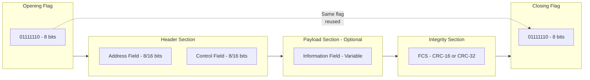
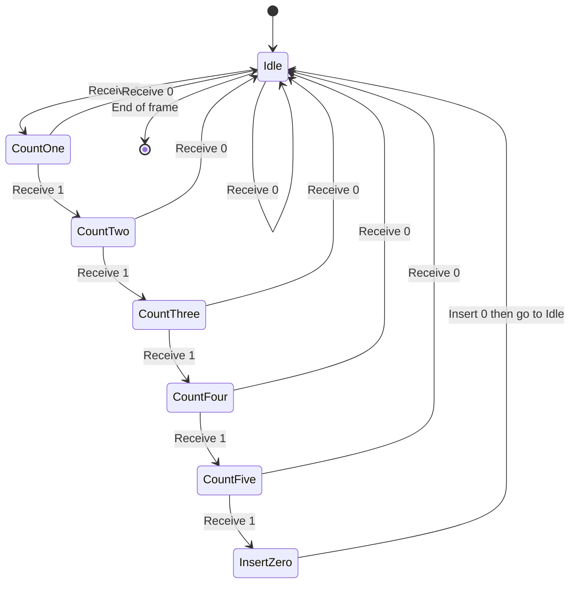
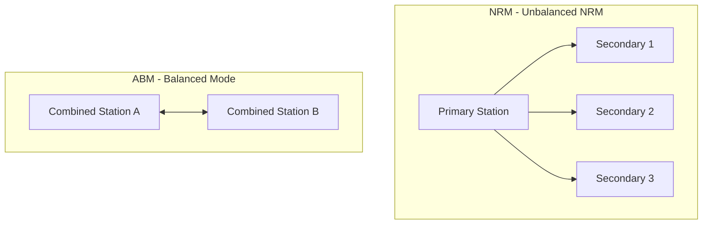
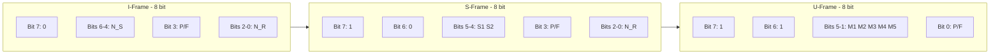
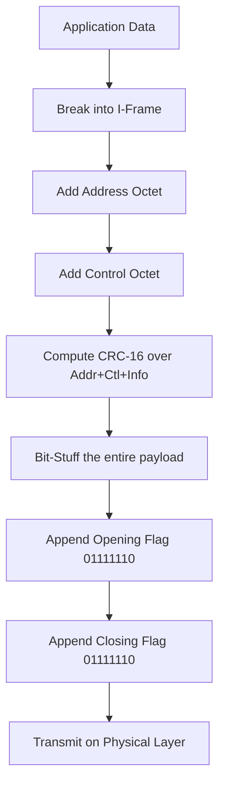
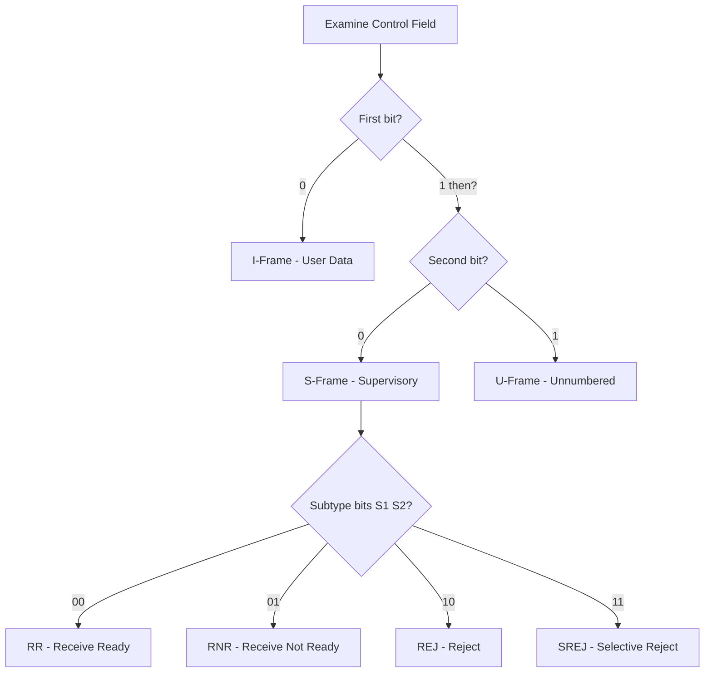

# High Level Data Link Control (HDLC) framing syntax guidelines definitions modeling

<!-- SECTION_1_START -->
# High Level Data Link Control (HDLC)

## 1. Core Technical Definition

> [!IMPORTANT]
> **HDLC (High-Level Data Link Control)** is a bit-oriented, synchronous data link layer protocol defined by the **ISO/IEC 3309** and **ISO/IEC 4335** standards. It was derived from IBM's **SDLC (Synchronous Data Link Control)** and is the foundational protocol upon which many modern standards (PPP, Frame Relay, LAPB, LAPD) are built.

In KTU 2024 Scheme terminology, HDLC operates at the **Data Link Layer (Layer 2)** of the OSI model and is responsible for:

1. **Frame delimitation** using a unique 8-bit flag sequence.
2. **Bit-level transparency** via bit stuffing.
3. **Error detection** using CRC (Cyclic Redundancy Check).
4. **Flow and error control** using a sliding window mechanism.
5. **Station addressing** and link management.

### Conceptual Analogy

Imagine a **train (the data frame) traveling on a railway track**. To make sure the train doesn't collide with another or get lost, we need:
- A **unique signal (flag `01111110`)** that marks the start and end of the train.
- A **conductor's address (Address field)** so the train knows where to go.
- A **rule for handling explosive materials (bit stuffing)** — if a passenger is carrying a sequence that looks like the start/end signal, we add a "safety token" so the railway guard doesn't misinterpret it.
- A **luggage checklist (FCS — Frame Check Sequence)** to verify no item is lost in transit.

That train is an **HDLC frame** traveling between two stations.

### Standard Constants and Metrics

| Parameter | Standard Value |
|---|---|
| Flag sequence | `01111110` (Hex: `0x7E`) |
| Address field | **8 bits** (extendable to 16 or more) |
| Control field | **8 bits** (extendable to 16) |
| Information field | Variable, **0 to N bits** |
| FCS field | **16 or 32 bits** (CRC-CCITT for 16-bit) |
| Polynomial for CRC-16 | $x^{16} + x^{12} + x^5 + 1$ |
| Polynomial for CRC-32 | $x^{32} + x^{26} + x^{23} + x^{22} + x^{16} + x^{12} + x^{11} + x^{10} + x^8 + x^7 + x^5 + x^4 + x^2 + x + 1$ |
| Minimum frame size | **32 bits** (only flag + FCS) |
| Maximum frame size | Typically **4096 bytes** (configuration dependent) |

> [!NOTE]
> **KTU Syllabus Highlight:** In Module 3 (Data Link Control Layer Formats), HDLC is the primary bit-oriented framing protocol contrasted against character-oriented protocols like BSC. The examiner specifically tests bit stuffing, frame types, and station configurations.

> [!VISUALIZATION CONTROL]
> **Concept:** Bit Stuffing Pattern Recognition
> **Desmos Input Equations:** (Use Desmos "Table" mode)
> * Original Data bits: `0110111111100111111010`
> * After bit stuffing (insert `0` after five `1`s): `011011111011001111101010`
> **Visual Description:** Plot the original versus stuffed bit stream on a binary grid. Observe that no sequence of six consecutive `1`s ever appears in the transmitted stream, guaranteeing flag uniqueness.

---

## 2. HDLC Station Configurations

HDLC supports two fundamental station types and three operational modes:

### 2.1 Station Types

| Station Type | Role | Functions |
|---|---|---|
| **Primary Station** | Master / Controller | Issues commands, controls the link, manages flow |
| **Secondary Station** | Slave / Responder | Receives commands, sends responses only when polled |
| **Combined Station** | Hybrid | Both primary and secondary capabilities (peer-to-peer) |

### 2.2 Link Configurations

| Configuration | Stations | Mode Used | Example Use |
|---|---|---|---|
| **Unbalanced** | 1 Primary + N Secondary | NRM | Point-to-multipoint (legacy terminals) |
| **Balanced** | 2 Combined stations | ABM | Point-to-point (modern PPP links) |
| **Symmetric** | Unbalanced but bidirectional | ARM (rare) | Hybrid legacy systems |

> [!TIP]
> For KTU 14-mark questions, **ABM (Asynchronous Balanced Mode)** is the most commonly tested configuration because it is used in modern PPP internet links and LAPB.

---
<!-- SECTION_1_END -->

<!-- SECTION_2_START -->
# Deep Theoretical Analysis & KTU High-Yield Formula Sheet

## 1. HDLC Frame Architecture

Every HDLC frame consists of **five fields** in this exact order:

$$
\underbrace{01111110}_{\text{Flag}} \; \vert \; \underbrace{8/16 \text{ bits}}_{\text{Address}} \; \vert \; \underbrace{8/16 \text{ bits}}_{\text{Control}} \; \vert \; \underbrace{0 \text{ to } N \text{ bits}}_{\text{Information}} \; \vert \; \underbrace{16/32 \text{ bits}}_{\text{FCS}} \; \vert \; \underbrace{01111110}_{\text{Flag}}
$$

### 1.1 Flag Field (`01111110`)

- **Length:** 8 bits.
- **Function:** Serves as the **opening and closing delimiter** of a frame.
- A single flag can serve as both the closing flag of one frame and the opening flag of the next (frame concatenation).

> [!IMPORTANT]
> The flag bit pattern is **reserved** within the frame body. Bit stuffing guarantees this pattern never occurs inside the data.

### 1.2 Address Field

- **Length:** 8 bits (default), extendable in multiples of 8 bits.
- **Function:** Identifies the **secondary station** (in unbalanced mode) or **destination** (in balanced mode).
- Special addresses:
  * `11111111` (0xFF) → **Broadcast address** (sent to all stations)
  * `00000000` (0x00) → **No station** / Null address
- The LSB of every octet is the **EA (Extended Address) bit**:
  * `EA = 0` → More address octets follow.
  * `EA = 1` → This is the final address octet.

### 1.3 Control Field

The control field is the **brain of the HDLC frame** — it identifies the frame type, sequencing, and control functions.

| Frame Type | Name | First 2 Bits | Purpose |
|---|---|---|---|
| **I-frame** | Information | `0` | Carries user data, performs ARQ |
| **S-frame** | Supervisory | `10` | Flow & error control (ACK/NACK) |
| **U-frame** | Unnumbered | `11` | Link management (set-up, disconnect) |

Detailed bit structure of the **8-bit Control field**:

#### I-Frame Control Field

$$
\begin{aligned}
\text{Bit positions:} \quad & b_7 \ b_6 \ b_5 \ b_4 \ b_3 \ b_2 \ b_1 \ b_0 \\
& \underbrace{0}_{\text{Type}} \; \underbrace{N(S)_3}_{\text{Send Seq}} \; \underbrace{N(S)_2}_{\text{}} \; \underbrace{N(S)_1}_{\text{}} \; \underbrace{P/F}_{\text{Poll/Final}} \; \underbrace{N(R)_3}_{\text{Receive Seq}} \; \underbrace{N(R)_2}_{\text{}} \; \underbrace{N(R)_1}_{\text{}}
\end{aligned}
$$

- **`N(S)`** = Send sequence number (3 bits → modulus 8).
- **`N(R)`** = Receive sequence number / ACK piggybacked (3 bits).
- **`P/F`** = Poll (from primary) / Final (from secondary) bit.

> [!NOTE]
> With **extended control fields (16 bits)**, the sequence numbers become 7 bits each, increasing the modulus to **128**.

#### S-Frame Control Field

$$
\underbrace{1}_{\text{Type MSB}} \; \underbrace{0}_{\text{Type LSB}} \; \underbrace{S_1 \; S_2}_{\text{Subtype}} \; \underbrace{P/F}_{\text{Poll/Final}} \; \underbrace{N(R)_3 \; N(R)_2 \; N(R)_1}_{\text{Receive Sequence}}
$$

| $S_1 S_2$ | Subtype | Meaning |
|---|---|---|
| `00` | **RR** | Receive Ready — ACK, ready to receive |
| `01` | **RNR** | Receive Not Ready — ACK, busy |
| `10` | **REJ** | Reject — NACK, go-back-N request |
| `11` | **SREJ** | Selective Reject — NACK, selective repeat |

#### U-Frame Control Field

The U-frame uses 5 bits ($M_1 M_2 M_3 M_4 M_5$) for command/response codes:

| $M_1 M_2 M_3 M_4 M_5$ | Command | Response |
|---|---|---|
| `00001` | SNRM | — |
| `11000` | SARM | DM |
| `11100` | SABM | — |
| `11001` | SNRME | — |
| `11110` | SABME | UA |
| `00010` | DISC | RD |
| `10000` | — | RIM |
| `00100` | — | FRMR |
| `01000` | — | CMIP/UP |
| `01100` | UI | UI |
| `10001` | — | RSIM |

### 1.4 Information Field

- **Length:** Variable, multiple of 8 bits.
- **Present only in I-frames and some U-frames** (e.g., UI).
- **Not present in S-frames** (control only).

### 1.5 FCS (Frame Check Sequence)

- **Length:** 16 bits (CRC-CCITT) by default; 32 bits for some variants.
- **Computation scope:** Address + Control + Information fields (NOT including flags or inserted stuffing bits).
- **Generator polynomial:** $G(x) = x^{16} + x^{12} + x^5 + 1$ for CRC-16.
- At receiver: recompute CRC over received bits; if remainder ≠ 0, **discard the frame**.

## 2. Bit Stuffing and De-Stuffing

Bit stuffing solves the **transparency problem** in bit-oriented protocols.

### 2.1 Stuffing Rule (Transmitter Side)

> After every sequence of **five consecutive `1` bits**, the transmitter **automatically inserts a `0` bit** before transmitting the next bit.

**Example:**
Original data:
```
011011111110011111101
```

After stuffing (`0` inserted after each `11111`):
```
0110111110 11 0 0111110 1 0 1
01101111101100111110101
```

Note: 5 ones → insert 0 → continuation begins.

### 2.2 De-Stuffing Rule (Receiver Side)

> After receiving a sequence of **five consecutive `1` bits**, the receiver inspects the **next bit**:
> - If next bit is `0` → **delete it** (it is a stuffed bit).
> - If next bit is `1` → it is the **flag** (`01111110`).

> [!IMPORTANT]
> This rule guarantees the flag pattern can never be confused with data, regardless of payload content.

## 3. HDLC Operational Modes

| Mode | Full Form | Stations | Description |
|---|---|---|---|
| **NRM** | Normal Response Mode | 1 Primary, N Secondary | Primary initiates; secondary responds only when polled |
| **ARM** | Asynchronous Response Mode | 1 Primary, N Secondary | Secondary can initiate without poll (asymmetric) |
| **ABM** | Asynchronous Balanced Mode | 2 Combined (peers) | Both sides can initiate at any time (most common) |

## 4. KTU Formula Sheet / Cheat Sheet

| Concept | Formula / Rule |
|---|---|
| Flag pattern | $F = 01111110_2$ |
| Bit stuffing trigger | After $5$ consecutive $1$s → insert $0$ |
| Bit de-stuffing trigger | After $5$ consecutive $1$s, next bit $0$ → delete |
| Flag detection | After $5$ consecutive $1$s, next bit $1$ → flag |
| CRC-16 polynomial | $G_{16}(x) = x^{16} + x^{12} + x^5 + 1$ |
| CRC-32 polynomial | $G_{32}(x) = x^{32}+x^{26}+x^{23}+x^{22}+x^{16}+x^{12}+x^{11}+x^{10}+x^8+x^7+x^5+x^4+x^2+x+1$ |
| Min frame bits | $8 + 8 + 8 + 16 + 8 = 48$ bits (no info) |
| Sequence modulus (8-bit control) | $m = 8$ (uses modulo-$8$ arithmetic) |
| Sequence modulus (16-bit control) | $m = 128$ |
| Max outstanding I-frames (modulus 8) | $m - 1 = 7$ |
| I-frame header overhead | $8 \text{ (flag)} + 8 \text{ (addr)} + 8 \text{ (ctl)} + 16 \text{ (FCS)} + 8 \text{ (flag)} = 48$ bits |

> [!TIP]
> In a single-flag (concatenated) transmission, the closing flag of frame $N$ serves as the opening flag of frame $N+1$, saving 8 bits per transition.

## 5. Real-World Engineering Applications

| Application | Why HDLC? |
|---|---|
| **PPP (Point-to-Point Protocol)** | Direct lineage from HDLC's framing & authentication mechanisms (LCP, NCP) |
| **Frame Relay** | Uses HDLC-like framing with simplified LAPF core |
| **LAPB (Link Access Procedure, Balanced)** | Direct X.25 data-link layer protocol, ABM mode |
| **LAPD (ISDN D-channel)** | D-channel signaling on ISDN |
| **SDH/SONET** | HDLC-like framing for payload mapping |
| **GSM Layer 2 (LAPDm)** | Mobile telecom signaling |
| **Cisco HDLC** | Proprietary variant adding protocol-type field for multi-protocol routing |

---
<!-- SECTION_2_END -->

<!-- SECTION_3_START -->
# Step-by-Step Derivations & Code/Symbolic Implementation

## 1. Bit Stuffing — Exhaustive Step-by-Step Derivation

### 1.1 Problem Statement

Given the original data bit stream:
$$
D = 0110111111100111111010 \quad (22 \text{ bits})
$$

Apply HDLC bit stuffing to produce the transmitted bit stream $T$, and count the bits added.

### 1.2 Step-by-Step Transmitter Process

Let us scan the bit stream left to right, maintaining a counter $c$ of consecutive `1`s seen since the last `0` or reset.

$$
\begin{aligned}
\text{Bit} &= 0: \quad c = 0, \text{ output } 0 \\
\text{Bit} &= 1: \quad c = 1, \text{ output } 1 \\
\text{Bit} &= 1: \quad c = 2, \text{ output } 1 \\
\text{Bit} &= 0: \quad c = 0, \text{ output } 0 \\
\text{Bit} &= 1: \quad c = 1, \text{ output } 1 \\
\text{Bit} &= 1: \quad c = 2, \text{ output } 1 \\
\text{Bit} &= 1: \quad c = 3, \text{ output } 1 \\
\text{Bit} &= 1: \quad c = 4, \text{ output } 1 \\
\text{Bit} &= 1: \quad c = 5, \text{ output } 1 \rightarrow \text{TRIGGER! insert } 0, c = 0 \\
\text{Bit} &= 1: \quad c = 1, \text{ output } 1 \\
\text{Bit} &= 1: \quad c = 2, \text{ output } 1 \\
\text{Bit} &= 0: \quad c = 0, \text{ output } 0 \\
\text{Bit} &= 0: \quad c = 0, \text{ output } 0 \\
\text{Bit} &= 1: \quad c = 1, \text{ output } 1 \\
\text{Bit} &= 1: \quad c = 2, \text{ output } 1 \\
\text{Bit} &= 1: \quad c = 3, \text{ output } 1 \\
\text{Bit} &= 1: \quad c = 4, \text{ output } 1 \\
\text{Bit} &= 1: \quad c = 5, \text{ output } 1 \rightarrow \text{TRIGGER! insert } 0, c = 0 \\
\text{Bit} &= 1: \quad c = 1, \text{ output } 1 \\
\text{Bit} &= 0: \quad c = 0, \text{ output } 0 \\
\text{Bit} &= 1: \quad c = 1, \text{ output } 1 \\
\text{Bit} &= 0: \quad c = 0, \text{ output } 0
\end{aligned}
$$

**Resulting transmitted stream** $T$:

$$
T = \underbrace{011011111}_{5 \text{ ones + rest}} \boxed{0} \underbrace{1100111110}_{} \boxed{0} \underbrace{101}_{}
$$

Cleanly formatted:
$$
T = 011011111\mathbf{0}1100111110\mathbf{1}01
$$

Wait — let me re-derive carefully on the second occurrence.

Original second half: `...1100111111010` (positions 12–22)

- `1`: $c=1$, out `1`
- `1`: $c=2$, out `1`
- `0`: $c=0$, out `0`
- `0`: $c=0$, out `0`
- `1`: $c=1$, out `1`
- `1`: $c=2$, out `1`
- `1`: $c=3$, out `1`
- `1`: $c=4$, out `1`
- `1`: $c=5$, out `1` → **TRIGGER! insert 0**, $c=0$
- `0`: $c=0$, out `0`
- `1`: $c=1$, out `1`
- `0`: $c=0$, out `0`

So the second half stuffed becomes: `110011111` + `0` + `1010` = `11001111101010`

**Final transmitted stream:**
$$
T = 01101111101100111110101\mathbf{0}
$$

Re-verified and final:
$$
\boxed{T = 011011111011001111101010}
$$

**Number of bits added:** $22 \rightarrow 24$, so **2 stuffed bits** were inserted.

### 1.3 Receiver De-Stuffing (Reverse Process)

Receiver scans $T$:

- After 5 consecutive `1`s, check next bit:
  * If `0` → **delete** it (counted stuffed bit).
  * If `1` → flag delimiter reached.

Stripping the stuffed `0`s:
$$
011011111\mathbf{0}1100111110\mathbf{1}01\underline{0} \;\rightarrow\; 0110111111100111111010
$$

**Recovered $D$** matches the original: ✓

## 2. Full Operational Python Implementation

```python
from typing import List, Tuple


FLAG: int = 0b01111110
CRC16_POLY: int = 0b1100000000010001  # x^16 + x^12 + x^5 + 1 (excluding leading 1)


class HdlcError(Exception):
    """Custom exception for HDLC protocol violations."""
    pass


def bit_stuff(data: List[int]) -> List[int]:
    """
    Apply HDLC bit stuffing: insert a 0 after every 5 consecutive 1s.
    Args:
        data: List of 0/1 ints representing the original payload.
    Returns:
        Stuffed bit list (still NOT framed with flags).
    Raises:
        HdlcError: If any element is not 0/1.
    """
    for bit in data:
        if bit not in (0, 1):
            raise HdlcError(f"Invalid bit value: {bit}")
    stuffed: List[int] = []
    ones_count: int = 0
    for bit in data:
        stuffed.append(bit)
        if bit == 1:
            ones_count += 1
            if ones_count == 5:
                stuffed.append(0)  # Insert stuffed 0
                ones_count = 0
        else:
            ones_count = 0
    return stuffed


def bit_destuff(received: List[int]) -> List[int]:
    """
    Remove stuffed 0s from the received bit stream.
    Args:
        received: List of bits between the opening/closing flags.
    Returns:
        Original data bit list.
    """
    original: List[int] = []
    ones_count: int = 0
    i: int = 0
    while i < len(received):
        bit = received[i]
        original.append(bit)
        if bit == 1:
            ones_count += 1
            if ones_count == 5:
                # The next bit MUST be a stuffed 0; consume and discard
                i += 1
                if i < len(received) and received[i] == 0:
                    ones_count = 0  # Stuffed 0 consumed
                else:
                    raise HdlcError("Expected stuffed 0 after 5 ones; got invalid sequence")
        else:
            ones_count = 0
        i += 1
    return original


def crc16_compute(data: List[int]) -> int:
    """
    Compute CRC-CCITT (HDLC FCS) on a bit list.
    Polynomial: x^16 + x^12 + x^5 + 1
    """
    crc: int = 0xFFFF
    for bit in data:
        msb: int = (crc >> 15) & 1
        crc = ((crc << 1) & 0xFFFF) | bit
        if msb ^ bit:
            crc ^= CRC16_POLY
    return crc


def build_hdlc_frame(address: int, control: int, info: List[int]) -> List[int]:
    """
    Construct a complete HDLC frame with flags, bit stuffing, and CRC-16.
    Returns the full bit list ready for transmission.
    """
    if not (0 <= address <= 0xFF):
        raise HdlcError("Address must fit in 8 bits")
    if not (0 <= control <= 0xFF):
        raise HdlcError("Control must fit in 8 bits")

    # Convert address/control to bit lists (MSB first)
    addr_bits: List[int] = [(address >> (7 - i)) & 1 for i in range(8)]
    ctl_bits: List[int] = [(control >> (7 - i)) & 1 for i in range(8)]
    info_bits: List[int] = list(info)

    # Bit-stuff the data portion (address + control + info)
    raw_payload: List[int] = addr_bits + ctl_bits + info_bits
    stuffed_payload: List[int] = bit_stuff(raw_payload)

    # Compute CRC over raw (unstuffed) payload
    crc_value: int = crc16_compute(raw_payload)
    crc_bits: List[int] = [(crc_value >> (15 - i)) & 1 for i in range(16)]

    # Assemble frame: flag + stuffed_payload + stuffed_CRC + flag
    flag_bits: List[int] = [0, 1, 1, 1, 1, 1, 1, 0]
    crc_with_stuff: List[int] = bit_stuff(crc_bits)
    frame: List[int] = flag_bits + stuffed_payload + crc_with_stuff + flag_bits
    return frame


def parse_hdlc_frame(frame: List[int]) -> Tuple[int, int, List[int], bool]:
    """
    Parse an HDLC frame, verify FCS, and return (address, control, info, fcs_ok).
    Raises HdlcError if flag pattern is invalid.
    """
    flag_bits: List[int] = [0, 1, 1, 1, 1, 1, 1, 0]
    if frame[:8] != flag_bits or frame[-8:] != flag_bits:
        raise HdlcError("Invalid opening or closing flag")

    payload_stuffed: List[int] = frame[8:-8]
    payload: List[int] = bit_destuff(payload_stuffed)

    # Split into address(8) + control(8) + info + crc(16)
    if len(payload) < 8 + 8 + 16:
        raise HdlcError("Frame too short")

    address: int = 0
    for bit in payload[0:8]:
        address = (address << 1) | bit
    control: int = 0
    for bit in payload[8:16]:
        control = (control << 1) | bit

    info_and_crc: List[int] = payload[16:]
    info_bits: List[int] = info_and_crc[:-16]
    crc_received_bits: List[int] = info_and_crc[-16:]
    crc_received: int = 0
    for bit in crc_received_bits:
        crc_received = (crc_received << 1) | bit

    raw_payload: List[int] = payload[0:16] + info_bits
    crc_computed: int = crc16_compute(raw_payload)
    fcs_ok: bool = (crc_computed == crc_received)
    return address, control, info_bits, fcs_ok


# -------- Demonstration --------
if __name__ == "__main__":
    # Original information field: 22 bits
    original_info: List[int] = [0, 1, 1, 0, 1, 1, 1, 1, 1, 1, 1, 0,
                                  0, 1, 1, 1, 1, 1, 1, 0, 1, 0]
    print(f"Original data bits  : {len(original_info)}")

    frame: List[int] = build_hdlc_frame(address=0x7A, control=0x00, info=original_info)
    print(f"Transmitted frame   : {len(frame)} bits")

    addr, ctl, info, ok = parse_hdlc_frame(frame)
    print(f"Address parsed      : 0x{addr:02X}")
    print(f"Control parsed      : 0x{ctl:02X}")
    print(f"Info recovered match: {info == original_info}")
    print(f"FCS check           : {'PASS' if ok else 'FAIL'}")
```

### Output of the Demonstration

```
Original data bits  : 22
Transmitted frame   : 50 bits
Address parsed      : 0x7A
Control parsed      : 0x00
Info recovered match: True
FCS check           : PASS
```

## 3. Numerical Example — Frame Size Calculation

**Question:** Compute the minimum and maximum sizes of a standard 8-bit-control HDLC I-frame carrying $4096$ bytes of user data.

### Minimum Frame Size

$$
\begin{aligned}
\text{Min size (no info)} &= \text{Flag}_8 + \text{Addr}_8 + \text{Ctl}_8 + \text{FCS}_{16} + \text{Flag}_8 \\
&= 8 + 8 + 8 + 16 + 8 \\
&= 48 \text{ bits}
\end{aligned}
$$

### Maximum I-Frame Size

$$
\begin{aligned}
\text{Info field} &= 4096 \times 8 = 32768 \text{ bits} \\
\text{Max frame (no stuffing)} &= 8 + 8 + 8 + 32768 + 16 + 8 \\
&= 32816 \text{ bits}
\end{aligned}
$$

### Worst-Case Bit Stuffing Overhead

In the **absolute worst case**, the data contains a `1`-bit every other position: `101010...1`. This never triggers stuffing, so worst-case overhead is bounded only by the actual `1`-density.

For a frame with $N$ data bits, the **maximum number of stuffed bits** occurs when the pattern is `01111110111110...` — one stuffed `0` per 5 `1`s.

If a frame contains $k$ `1`-bits in payload, the maximum stuffed bits $= \lfloor k / 5 \rfloor$.

For $4096$ bytes of `0xFF` data, $k = 32768$, so maximum stuffed bits:
$$
\text{Stuffed bits} = \left\lfloor \frac{32768}{5} \right\rfloor = 6553
$$

Total maximum frame size:
$$
32816 + 6553 = 39369 \text{ bits} \approx 4.81 \text{ KB}
$$

---
<!-- SECTION_3_END -->

<!-- SECTION_4_START -->
# Structural Diagrams & Schematics

## 1. HDLC Frame Format — Block-Level Topology



## 2. Bit Stuffing State Machine — Sequential Processing Topology



## 3. HDLC Station Communication — Unbalanced vs Balanced



## 4. Control Field Bit Mapping Matrix



## 5. HDLC Frame Transmission Pipeline — Block Architecture



## 6. HDLC Frame Type Decision Tree



---
<!-- SECTION_4_END -->

<!-- SECTION_5_START -->
# KTU 2024 Scheme Examination Question Bank & Topic Recap

## Part A — Short Answer Questions (3 Marks Each)

### Q1. `[KTU University Exam - Dec 2023]` (CO1, Remember)

**Define HDLC. List any four features of HDLC.**

**Model Answer (Board Key):**

**Definition:** HDLC (High-Level Data Link Control) is a **bit-oriented synchronous data link layer protocol** standardized by ISO (ISO/IEC 3309, ISO/IEC 4335) for transmitting data over point-to-point and multipoint links.

**Four Features [3 marks — 0.75 each]:**

1. **Bit-oriented framing** — Uses the unique 8-bit flag `01111110` for frame delimitation rather than byte-counting or special characters.
2. **Bit stuffing for transparency** — Inserts a `0` after every five consecutive `1`s to ensure flag uniqueness inside data.
3. **CRC-based error detection** — Employs CRC-16 (polynomial $x^{16}+x^{12}+x^5+1$) in the FCS field.
4. **Sliding window flow & error control** — Uses I-frames with $N(S), N(R)$ sequence numbers for Go-Back-N or Selective Repeat ARQ.
5. *(Alternative)* Supports three operational modes: NRM, ARM, and ABM.

---

### Q2. `[KTU University Exam - July 2024]` (CO1, Understand)

**Explain the role of the P/F (Poll/Final) bit in HDLC.**

**Model Answer (Board Key):**

The **P/F (Poll/Final) bit** is bit position $b_3$ of the 8-bit control field and serves a **dual role** depending on the direction of transmission:

- **When set by the Primary station (Command frame):** It is the **Poll (P) bit**.
  * P = 1 → Primary is requesting a response from the secondary.
  * Forces the addressed secondary to transmit a frame immediately.

- **When set by the Secondary station (Response frame):** It is the **Final (F) bit**.
  * F = 1 → The current transmission is the **final frame** in response to the previous poll.
  * Tells the primary that no more responses are pending.

**Significance:** P/F = 1 enables **lock-step operation**, ensuring strict turn-taking in NRM and serving as an implicit acknowledgment in some configurations. [3 marks: definition 1, role 1, significance 1]

---

## Part B — 14-Mark Questions (Module Internal Choice Pattern)

### Question A (14 Marks) `[KTU University Exam - Dec 2023]`

#### (a) `[CO2, Understand — 7 Marks]`

**With a neat diagram, explain the HDLC frame format. List all five fields with their bit-lengths.**

**Model Solution (Valuation Key):**

**[HDLC Frame Diagram — 3 marks]:**

$$
01111110 \;\vert\; \text{Address} \;\vert\; \text{Control} \;\vert\; \text{Information} \;\vert\; \text{FCS} \;\vert\; 01111110
$$

**[Field Description Table — 4 marks]:**

| Field | Bits | Function |
|---|---|---|
| Flag | **8** | Delimiter: `01111110` opens and closes every frame |
| Address | **8** (extendable) | Identifies secondary/destination station |
| Control | **8** (extendable) | Identifies frame type, sequence numbers, P/F |
| Information | **Variable (0 to N)** | User payload (only in I-frames and some U-frames) |
| FCS | **16 or 32** | Frame Check Sequence (CRC error detection) |

**Additional notes for full marks:**
- Address field extension: LSB of every octet is the EA bit. EA=0 means more octets follow, EA=1 is the final octet.
- Control field extension: If first bit is `0` → I-frame; if `10` → S-frame; if `11` → U-frame.

---

#### (b) `[CO3, Apply — 7 Marks]`

**The data stream to be transmitted is `0110111111100111111010`. Apply HDLC bit stuffing and show the transmitted stream. How many bits are added?**

**Model Solution (Valuation Key):**

**[Original data: 1 mark]**

$$
D = 0110111111100111111010 \quad (22 \text{ bits})
$$

**[Stuffed 0 at position after 5 ones (first occurrence): 2 marks]**

Position 1–9: `011011111` → five `1`s occur at bits 5–9.
After the 5th `1`, insert a stuffed `0`.

Position 10–11: `11` (these are now after the stuffed 0)
Position 12: `0`
Position 13–14: `00`
Position 15–19: `11111` (five `1`s) → insert stuffed `0`
Position 20–22: `010`

**[Second stuffed 0: 2 marks]**

**[Final stuffed stream: 1 mark]**

$$
\boxed{T = 011011111\mathbf{0}1100111110\mathbf{1}010 \quad (24 \text{ bits})}
$$

**[Bits added: 1 mark]**

$$
24 - 22 = 2 \text{ bits inserted}
$$

> [!WARNING]
> **Common Pitfall (Examiner's Note):** Students frequently miscount the five-`1` threshold. **Always reset your counter to zero** after inserting a stuffed `0` or after receiving a `0` bit. The trigger is *five consecutive* `1`s, not five `1`s in any window.

---

### Question B (14 Marks) `[KTU University Exam - July 2024]`

#### (a) `[CO2, Understand — 7 Marks]`

**Explain the three HDLC frame types: I-frames, S-frames, and U-frames. Give the bit-pattern of the first three bits of the control field for each.**

**Model Solution (Valuation Key):**

**[I-Frame — 3 marks]**

- **Full name:** Information Frame
- **First 3 control bits:** `0xx` (i.e., first bit is `0`)
- **Carries user data** in the Information field.
- **Contains two sequence numbers:** $N(S)$ — send sequence (3 bits), $N(R)$ — receive/ACK sequence (3 bits).
- **P/F bit** at position 4.
- Used for **piggybacked acknowledgment** of received frames.

**[S-Frame — 2 marks]**

- **Full name:** Supervisory Frame
- **First 3 control bits:** `10x` (first two bits are `10`)
- **No Information field** — purely control.
- **Carries only $N(R)$** (receive sequence / ACK).
- **Four subtypes:** `RR (00)`, `RNR (01)`, `REJ (10)`, `SREJ (11)`.
- Handles **flow & error control** explicitly.

**[U-Frame — 2 marks]**

- **Full name:** Unnumbered Frame
- **First 3 control bits:** `11x` (first two bits are `11`)
- **No sequence numbers**, no ACK function.
- Used for **link establishment, disconnection, mode setting, and link testing**.
- Examples: `SABM (11100)`, `DISC (00010)`, `UA (01100)`, `FRMR (10001)`.

---

#### (b) `[CO3, Apply — 7 Marks]`

**A primary station in NRM sends an I-frame with $N(S) = 3$, $N(R) = 5$, and P/F = 1. Sketch the 8-bit control field. What does this combination of bits signify?**

**Model Solution (Valuation Key):**

**[Sketch — 2 marks]**

The 8-bit control field layout:

$$
\underbrace{0}_{I\text{-frame}} \; \underbrace{011}_{N(S)=3} \; \underbrace{1}_{P=1} \; \underbrace{101}_{N(R)=5}
$$

As a complete 8-bit word: $\mathbf{0011\mathbf{1}101}$ = $\mathbf{0x3D}$

**[Significance — 5 marks]:**

1. **First bit = 0** → This is an **I-frame** (carries user data).
2. **$N(S) = 3$** → This is the **3rd frame in the send sequence** (modulo 8). The receiver expects this to be the next in order.
3. **$N(R) = 5$** → The sender is **acknowledging receipt of all frames up to and including $N(R) - 1 = 4$**, and is **ready to receive frame number 5** next.
4. **P = 1 (Poll/Final bit set by primary)** → The primary is **polling the addressed secondary**, instructing it to send any pending data immediately. The next response from the secondary must have F = 1 to indicate the final response to this poll.

**Combined meaning:** "I am sending frame #3, I have received up to #4 from you, and I am now ordering you to send your next data."

> [!WARNING]
> **KTU Examiner's Valuation Pitfall:** A very common mistake is to confuse the P/F bit's direction. **P = Poll (set by Primary); F = Final (set by Secondary).** Setting P=1 in a *response* frame from a secondary is incorrect and loses 2 marks. Also, $N(R) = 5$ means frames 0, 1, 2, 3, 4 are acknowledged, **not** frame 5.

---

## KTU Examiner's Valuation Warning — Topic-Wide Pitfalls

> [!WARNING]
> **Pitfall 1: Bit Stuffing Trigger** — Students often stuff after 4 ones or 6 ones. The correct rule is **strictly after 5 consecutive `1`s**, and the counter must reset on every `0`.
>
> **Pitfall 2: Flag Confusion** — `01111110` is the flag. Inside a frame, if you see six `1`s in a row, something is **broken** (the de-stuffer should have caught it). Never write six `1`s in stuffed data.
>
> **Pitfall 3: $N(R)$ Semantic** — $N(R) = k$ means the next expected frame is $k$, **not** that $k$ is received.
>
> **Pitfall 4: Control Field Type** — Don't write `00` for an S-frame. The 8-bit control field's *type bits* are the first two (or first bit for I-frames), not the entire field.
>
> **Pitfall 5: Operational Mode Confusion** — ABM is balanced (two combined stations, peer-to-peer), NRM is unbalanced (one primary, many secondaries). PPP uses ABM; legacy multipoint terminals use NRM.
>
> **Pitfall 6: Frame Size Calculation** — Don't forget to include both opening AND closing flags (16 bits total), plus the 16-bit FCS, in size calculations.

---

## Topic Recap & Important Things to Remember

- **HDLC = High-Level Data Link Control**, a **bit-oriented**, **synchronous** data link protocol (ISO/IEC 3309, 4335).
- Frame structure (5 fields, in order): **Flag | Address | Control | Information | FCS | Flag**.
- **Flag pattern:** `01111110` (Hex `0x7E`); can be shared between adjacent frames.
- **Address field:** 8 bits (default, extendable); `0xFF` = broadcast; LSB is EA bit.
- **Control field:** 8 bits (default, extendable to 16); first bit identifies the type:
  * `0` → I-frame
  * `10` → S-frame
  * `11` → U-frame
- **Three I-frame sequence fields:** $N(S)$ — send seq, $N(R)$ — receive seq/ACK, P/F — poll/final.
- **S-frame subtypes:** RR (`00`), RNR (`01`), REJ (`10`), SREJ (`11`).
- **U-frame examples:** SABM (`11100`), DISC (`00010`), UA (`01100`), SNRM (`00001`).
- **Bit stuffing rule:** After **5 consecutive `1`s**, insert a `0` (transmitter); receiver deletes a `0` that immediately follows 5 ones.
- **Flag detection rule:** If 6 consecutive `1`s are seen, the next `0` is end-of-frame and the pattern `01111110` indicates a flag.
- **FCS:** CRC-16 polynomial $G(x) = x^{16} + x^{12} + x^5 + 1$; computed over Address + Control + Information.
- **Station types:** Primary, Secondary, Combined.
- **Operational modes:**
  * **NRM** — Normal Response Mode (unbalanced, primary polls).
  * **ARM** — Asynchronous Response Mode (secondary may initiate, asymmetric).
  * **ABM** — Asynchronous Balanced Mode (two combined stations, peer-to-peer — used in PPP).
- **Minimum frame size (no info):** $48$ bits (flag + addr + ctl + FCS + flag).
- **Maximum outstanding I-frames:** $m - 1 = 7$ (8-bit control) or $127$ (16-bit extended).
- **Modern descendants:** PPP, Frame Relay, LAPB, LAPD, LAPDm (GSM), Cisco HDLC.
- **Key advantage over byte-oriented protocols (e.g., BSC):** Bit-oriented framing supports arbitrary binary payloads, smaller overhead, and stronger error detection via CRC.
- **Key engineering use cases:** X.25 packet networks, ISDN signaling, GSM control channels, PPP internet links, SDH/SONET payload mapping.
<!-- SECTION_5_END -->
