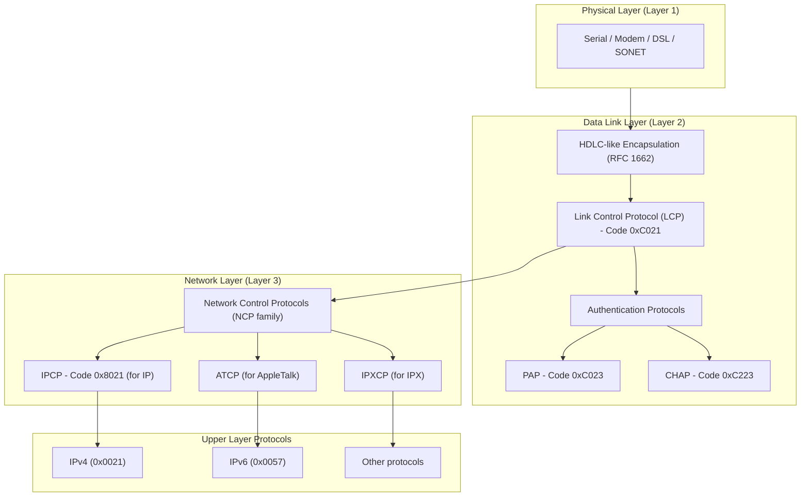
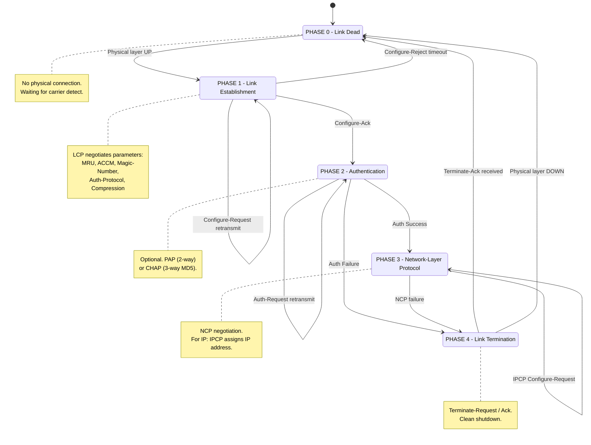
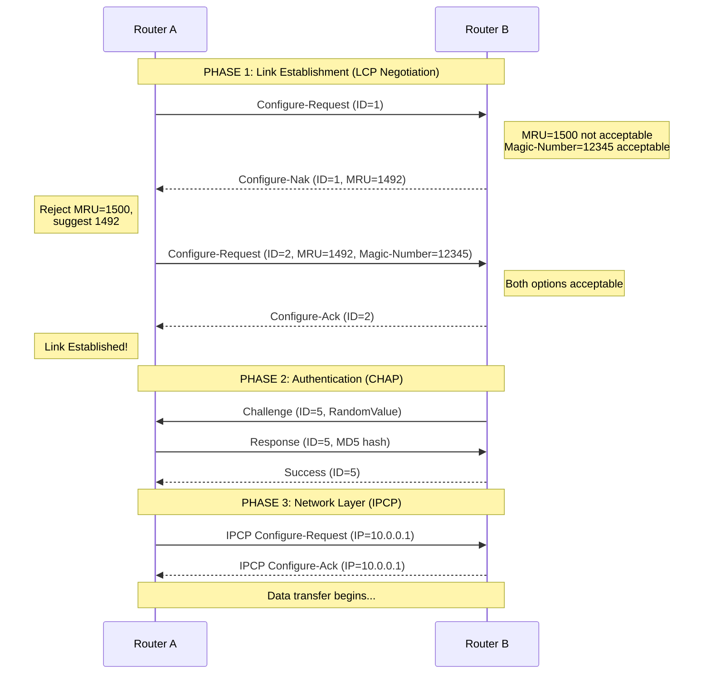
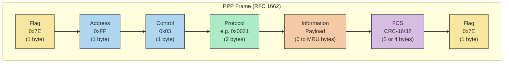
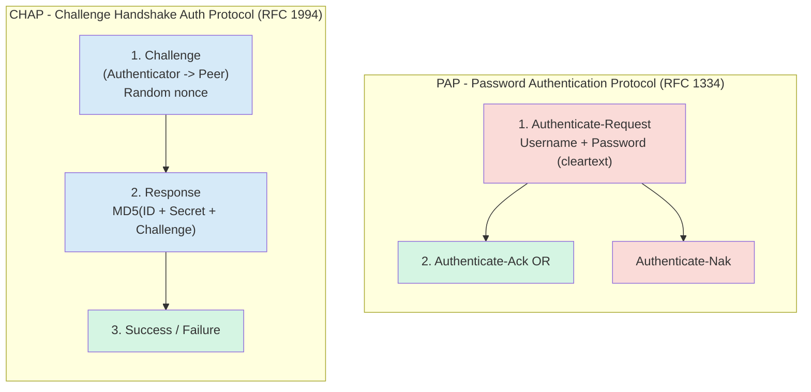

# Point to Point Protocol (PPP) connection tracking parameters configurations tracks parameters

<!-- SECTION_1_START -->

# Point-to-Point Protocol (PPP) - Connection Tracking, Parameters & Configuration

## 1.1 Formal Academic Definition

> [!NOTE]
> **Definition (RFC 1661 — The Internet Standard):**
> The **Point-to-Point Protocol (PPP)** is a **data link layer (Layer 2)** protocol defined by the **IETF (Internet Engineering Task Force)** in **RFC 1661 (1994)** that establishes a direct connection between two network nodes. It encapsulates network-layer datagrams over a serial point-to-point link and provides features such as **link control, authentication, error detection, and network address negotiation**.

PPP is formally part of the **TCP/IP protocol suite** at the **Data Link Layer** and is the official successor to the older **SLIP (Serial Line Internet Protocol)**. It uses a three-component architecture: an **encapsulation method**, a **Link Control Protocol (LCP)**, and a family of **Network Control Protocols (NCPs)**.

## 1.2 Conceptual Analogy / Intuition

> [!IMPORTANT]
> **The "Phone Call" Analogy for PPP**
> Imagine picking up a phone to call a friend. Before talking, both sides must:
> 1. **Pick up the phone (Link Dead → Physical layer ready)**
> 2. **Confirm "Hello, can you hear me?" (LCP Establish phase)**
> 3. **Verify identity with a password (Authentication — PAP/CHAP)**
> 4. **Agree on a language to speak (NCP negotiation — IPCP assigns IP addresses)**
> 5. **Start the actual conversation (Data transfer over network layer)**
> 6. **Hang up cleanly when done (Link Termination phase)**
>
> **PPP is essentially the "telephone etiquette" of the data link layer** — it ensures two routers/modem endpoints agree on the rules of engagement before exchanging actual IP packets.

## 1.3 Why PPP? Standard Metrics

> [!IMPORTANT]
> **Key Design Goals of PPP (from RFC 1661):**
> - **Simplicity** — Easy to implement on serial links.
> - **Encapsulation of multiple protocols** — Can carry IP, IPX, AppleTalk, etc.
> - **Error detection** — Built-in FCS (Frame Check Sequence).
> - **Authentication** — Optional PAP/CHAP support.
> - **Dynamic address allocation** — IP can be negotiated via IPCP.
> - **Link Quality Monitoring** — Optional LQM packet exchange.
> - **Multilink support** — Bundling multiple physical links (MLPPP).

## 1.4 PPP Operational States (The "State Machine")

PPP operates through **5 formal states** (defined in **RFC 1661, Section 3.2**):

> [!NOTE]
> **The PPP Link State Machine (Mandatory for KTU Board Exam):**
> 1. **Link Dead** — Physical layer is down; no carrier detected.
> 2. **Link Establishment Phase** — LCP negotiates link parameters.
> 3. **Authentication Phase** — Optional PAP or CHAP verification.
> 4. **Network-Layer Protocol Phase** — NCP (e.g., IPCP) configures network layer.
> 5. **Link Termination Phase** — Clean shutdown of the link.

The transition between these states is governed by the **LCP Packet Exchange**.

## 1.5 GeoGebra / Desmos Visualization

> [!VISUALIZATION CONTROL]
> **Concept:** PPP Frame Bit-Stuffing Visualization (Transparency vs. Real Bit Stream)
>
> **GeoGebra / Desmos Input Equations:**
> * `x(t) = 0 if (sequence = 01111110) else 1`  — Flag byte demarcation
> * `Sequence: 01111110 | Data | 01111110`
> * `Stuffed: 01111110 | 011111010 | 01111110`  (Notice the inserted 0 after five 1s)
>
> **Visual Description:** The student should observe how the **flag byte `0x7E`** is used as both start and end delimiter, and how **bit stuffing** prevents a long run of 1s (six consecutive 1s) from being misread as the flag inside the data payload.

<!-- SECTION_1_END -->

<!-- SECTION_2_START -->

# Deep Theoretical Analysis — PPP Link Tracking Parameters & Configurations

## 2.1 PPP Architecture: The Three Pillars

PPP is structured in **three modular layers** (per **RFC 1661**):

| Layer | Component | Function | Standard Reference |
|---|---|---|---|
| Layer 1 | **HDLC-like Encapsulation** | Frames datagrams for the physical link | RFC 1662 |
| Layer 2 (Control) | **Link Control Protocol (LCP)** | Establishes, configures, tests the link | RFC 1661 |
| Layer 2 (Network) | **Network Control Protocols (NCPs)** | Configures protocols above (IP, IPX, etc.) | RFC 1332, RFC 1552 |

> [!NOTE]
> **Why modular?**
> Because LCP handles the **link itself** (without caring what's inside), and **NCPs** (one per network protocol) handle the **payload protocols** (e.g., IPCP for IP, IPXCP for IPX). This decoupling is the **key elegance** of PPP.

## 2.2 PPP Frame Format (RFC 1662)

The standard PPP frame uses an **HDLC-like structure**:

$$\text{Flag} = \texttt{0x7E} = 01111110_2$$

$$
\begin{aligned}
\text{PPP Frame} = \;&\underbrace{\texttt{0x7E}}_{\text{Flag}} \; \underbrace{\texttt{0xFF \, 0x03}}_{\text{Addr + Ctrl}} \; \underbrace{\text{Protocol}}_{\text{2 bytes}} \; \underbrace{\text{Information}}_{\text{variable}} \; \underbrace{\text{Padding}}_{\text{optional}} \; \underbrace{\text{FCS}}_{\text{2/4 bytes}} \; \underbrace{\texttt{0x7E}}_{\text{Flag}}
\end{aligned}
$$

### Field-by-Field Description

| Field | Size | Default | Purpose |
|---|---|---|---|
| **Flag** | 1 byte | `0x7E` | Frame delimiter (start/end) |
| **Address** | 1 byte | `0xFF` | Broadcast address (PPP is point-to-point) |
| **Control** | 1 byte | `0x03` | UI (Unnumbered Information) |
| **Protocol** | 2 bytes | varies | Identifies payload protocol (e.g., `0x0021` for IP, `0xC021` for LCP) |
| **Information** | Variable | — | Actual payload (default MRU = 1500 bytes) |
| **FCS** | 2 or 4 bytes | — | Frame Check Sequence (CRC-16 or CRC-32) |
| **Flag** | 1 byte | `0x7E` | Closing delimiter |

### Common Protocol Field Values (HIGH-YIELD for KTU)

> [!IMPORTANT]
> **Memorize these protocol field values:**
>
> | Hex Code | Protocol |
> |---|---|
> | `0x0021` | **IP** (Internet Protocol) |
> | `0x002B` | **IPX** (Novell) |
> | `0x002D` | **TCP/IP Header Compression** (Van Jacobson) |
> | `0xC021` | **LCP** (Link Control Protocol) |
> | `0xC023` | **PAP** (Password Authentication Protocol) |
> | `0xC223` | **CHAP** (Challenge Handshake Authentication Protocol) |
> | `0x8021` | **IPCP** (Internet Protocol Control Protocol) |

## 2.3 LCP (Link Control Protocol) — The Heart of PPP

### 2.3.1 LCP Packet Format

An LCP packet is encapsulated in the **Information** field of a PPP frame with Protocol = `0xC021`:

$$
\underbrace{\text{Code}}_{\text{1 byte}} \;\; \underbrace{\text{Identifier}}_{\text{1 byte}} \;\; \underbrace{\text{Length}}_{\text{2 bytes}} \;\; \underbrace{\text{Data}}_{\text{variable}}
$$

### 2.3.2 The 11 LCP Packet Codes (RFC 1661, Section 5)

> [!IMPORTANT]
> **HIGH-YIELD TABLE — LCP Codes (Must Memorize):**
>
> | Code | Packet Type | Direction | Category |
> |---|---|---|---|
> | 1 | **Configure-Request** | Sender → Receiver | Link Establishment |
> | 2 | **Configure-Ack** | Receiver → Sender | Link Establishment (Accept) |
> | 3 | **Configure-Nak** | Receiver → Sender | Link Establishment (Reject with hints) |
> | 4 | **Configure-Reject** | Receiver → Sender | Link Establishment (Unknown option) |
> | 5 | **Terminate-Request** | Either side | Link Termination |
> | 6 | **Terminate-Ack** | Either side | Link Termination |
> | 7 | **Code-Reject** | Either side | Error handling |
> | 8 | **Protocol-Reject** | Either side | Error handling |
> | 9 | **Echo-Request** | Either side | Link Quality |
> | 10 | **Echo-Reply** | Either side | Link Quality |
> | 11 | **Discard-Request** | Either side | Link Quality / Debug |

### 2.3.3 LCP Link Configuration Options (Negotiable Parameters)

> [!NOTE]
> **The "Link Tracking Parameters"** are the LCP Configuration Options negotiated during the **Link Establishment Phase**.

| Option # | Option Name | Length | Default | Purpose |
|---|---|---|---|---|
| 1 | **MRU** (Maximum Receive Unit) | 4 | 1500 | Max info field size |
| 2 | **ACCM** (Async Control Character Map) | 6 | `0xFFFFFFFF` | Escape character mask |
| 3 | **Authentication-Protocol** | ≥4 | None | Specifies PAP/CHAP |
| 4 | **Quality-Protocol** | ≥4 | None | Specifies LQM protocol |
| 5 | **Magic-Number** | 6 | None | Detects looped-back links |
| 6 | **PFC** (Protocol Field Compression) | 2 | Off | Compress 2-byte Protocol to 1 byte |
| 7 | **ACFC** (Address & Control Field Compression) | 2 | Off | Compress Addr/Ctrl to 0 bytes |
| 8 | **FCS-Alternatives** | ≥3 | 16-bit CRC | Specifies CRC-32 etc. |
| 9 | **Self-Describing-Padding** | 3 | None | Pads for fixed frames |
| 10 | **Numbered-Mode** | 8 | Off | Reliable mode option |
| 11 | **Multi-Link-Procedure** | ≥4 | Off | Bundles multiple links |

### 2.3.4 MRU vs MTU — The Critical Distinction

> [!IMPORTANT]
> **MRU (Maximum Receive Unit)** is the **negotiated** maximum size of the **Information field** in a PPP frame. **MTU (Maximum Transmission Unit)** is the **maximum IP packet size**. They are **independent**. Default MRU = **1500 bytes**, but can be negotiated (e.g., 296 minimum, 65535 max).

## 2.4 Authentication Phase — PAP vs. CHAP

### 2.4.1 PAP (Password Authentication Protocol) — RFC 1334

- **Two-way handshake** (unencrypted).
- Sends **username and password in cleartext** (security flaw).
- Operates only at initial link establishment.

#### PAP Packet Types

| Code | Packet | Direction |
|---|---|---|
| 1 | **Authenticate-Request** | Authenticator ← Peer (sends credentials) |
| 2 | **Authenticate-Ack** | Authenticator → Peer (success) |
| 3 | **Authenticate-Nak** | Authenticator → Peer (failure) |

### 2.4.2 CHAP (Challenge Handshake Authentication Protocol) — RFC 1994

- **Three-way handshake** (more secure).
- Uses **MD5 hashing** of a challenge.
- Verifies identity **periodically** during the connection.

#### CHAP Packet Types

| Code | Packet | Direction |
|---|---|---|
| 1 | **Challenge** | Authenticator → Peer (random value) |
| 2 | **Response** | Peer → Authenticator (MD5 hash) |
| 3 | **Success** | Authenticator → Peer (accepted) |
| 4 | **Failure** | Authenticator → Peer (rejected) |

$$
\underbrace{\text{Response}}_{\text{hash}} \;=\; \text{MD5}\big(\text{ID} \, \Vert \, \text{secret} \, \Vert \, \text{challenge}\big)
$$

> [!IMPORTANT]
> **CHAP is preferred in production** because the password never travels over the wire — only a **one-way MD5 hash** does. PAP is used only in legacy or low-security environments.

## 2.5 NCP — Network Control Protocols (e.g., IPCP)

After LCP and (optional) authentication, **NCPs** configure each network-layer protocol.

### IPCP (Internet Protocol Control Protocol) — RFC 1332

- Protocol field: `0x8021`
- Negotiates **IP addresses** and **TCP/IP header compression** (Van Jacobson).

### Common IPCP Configuration Options

| Option # | Option | Purpose |
|---|---|---|
| 1 | **IP Addresses** | Assigns IPv4 address to the peer |
| 2 | **IP-Compression-Protocol** | VJ compression (RFC 1144) |
| 3 | **IP-Address** | Suggests an IP to the peer |
| 129 | **Primary DNS** | DNS server address |
| 130 | **Primary NBNS** | NetBIOS Name Server |
| 131 | **Secondary DNS** | Backup DNS |
| 132 | **Secondary NBNS** | Backup NBNS |

## 2.6 Real-World Engineering Use

> [!NOTE]
> **Where PPP is used in production systems:**
> - **Dial-up Internet** (legacy 56K modems).
> - **DSL connections** — PPP over Ethernet (PPPoE) and PPP over ATM (PPPoA).
> - **Serial WAN links** — Leased lines between routers (Cisco HDLC originally, now PPP).
> - **VPN tunnels** — PPTP (Point-to-Point Tunneling Protocol) encapsulates PPP in GRE.
> - **3G/4G cellular modems** — PCO/PPP for cellular data sessions.
> - **MLPPP (Multilink PPP)** — RFC 1990, aggregates multiple ISDN B-channels.

## 2.7 KTU High-Yield Formula Sheet

| Concept | Value / Formula | Notes |
|---|---|---|
| **Flag byte** | `0x7E` (binary `01111110`) | Start and end delimiter |
| **Address byte** | `0xFF` (all 1s) | Broadcast (no addressing needed) |
| **Control byte** | `0x03` | Unnumbered Information (UI) |
| **Default MRU** | **1500 bytes** | Can be negotiated (min 296) |
| **FCS (default)** | **16-bit CRC** (CCITT) | Also CRC-32 available |
| **Bit stuffing rule** | After **five 1s**, insert a **0** | Prevents flag mimicry |
| **LCP Protocol ID** | `0xC021` | Encapsulates LCP packets |
| **PAP Protocol ID** | `0xC023` | Authentication using PAP |
| **CHAP Protocol ID** | `0xC223` | Authentication using CHAP |
| **IPCP Protocol ID** | `0x8021` | IP negotiation |
| **IP Protocol ID** | `0x0021` | IP datagram in PPP |
| **CHAP hash** | `MD5(ID $\Vert$ secret $\Vert$ challenge)` | 128-bit digest |
| **Max retry attempts** | **3 (default)** | LCP Configure-Request retries |
| **PPP states** | **5** | Dead, Establish, Auth, Network, Terminate |
| **LCP packet codes** | **11** total | 1–11 (see table above) |

<!-- SECTION_2_END -->

<!-- SECTION_3_START -->

# Step-by-Step Derivations, Frame Walkthroughs & Code Implementation

## 3.1 Derivation 1: Bit-Stuffing Calculation

**Problem:** Given the raw data payload `01111110 10111111 00111111`, show the bit-stuffed output.

### Step-by-Step:

**Step 1:** Identify the flag byte pattern `01111110`. The stuffed algorithm inserts a `0` after **every sequence of five consecutive 1s** within the data payload (excluding the flag delimiters themselves).

**Step 2:** Apply stuffing on `10111111`:
- We see `11111` (five 1s), the next bit is `1` (6th one — would mimic flag without stuffing).
- **Insert a `0`** → `101111101`.

**Step 3:** Apply stuffing on `00111111`:
- We see `11111` (five 1s), the next bit is `1` again.
- **Insert a `0`** → `001111101`.

**Step 4:** Final stuffed payload:
$$
\text{Stuffed} = \underbrace{01111110}_{\text{Flag}} \;\; 101111101 \;\; 001111101 \;\; \underbrace{01111110}_{\text{Flag}}
$$

**Step 5:** Receiver removes every `0` that follows five consecutive 1s to recover the original.

> [!NOTE]
> **Efficiency loss:** In the worst case (all 1s), overhead is **20%**. For typical data, overhead is < 1%.

---

## 3.2 Derivation 2: PPP Frame Construction

**Problem:** Construct the full PPP frame (hex) for a 10-byte IP datagram `0x45 0x00 0x00 0x28 ...` with the following negotiated parameters:
- MRU = 1500 (default)
- FCS = 16-bit CRC = `0xAB 0xCD`

### Step-by-Step:

**Step 1:** Prepend the **flag byte** `0x7E`.
$$
\text{Frame so far} = \texttt{7E}
$$

**Step 2:** Add **Address** `0xFF` and **Control** `0x03`.
$$
\text{Frame so far} = \texttt{7E \, FF \, 03}
$$

**Step 3:** Add **Protocol field** for IP = `0x0021` (big-endian).
$$
\text{Frame so far} = \texttt{7E \, FF \, 03 \, 00 \, 21}
$$

**Step 4:** Add **Information** = the IP datagram.
$$
\text{Frame so far} = \texttt{7E \, FF \, 03 \, 00 \, 21 \, 45 \, 00 \, 00 \, 28 \, \ldots}
$$

**Step 5:** Append **FCS** (last 2 bytes of CRC-16).
$$
\text{Frame so far} = \texttt{7E \, FF \, 03 \, 00 \, 21 \, 45 \, 00 \, 00 \, 28 \, \ldots \, AB \, CD}
$$

**Step 6:** Close with the **flag byte** `0x7E`.
$$
\text{Final} = \texttt{7E \, FF \, 03 \, 00 \, 21 \, 45 \, 00 \, 00 \, 28 \, \ldots \, AB \, CD \, 7E}
$$

**Step 7:** Apply **byte-level async escaping** (RFC 1662, Section 4.1) if needed:
- Any `0x7E` in the data must be replaced with `0x7D 0x5E`.
- Any `0x7D` in the data must be replaced with `0x7D 0x5D`.
- Any control char in ACCM must be escaped.

> [!IMPORTANT]
> **Async vs. Sync PPP:** On async links (modems), **byte stuffing** (using `0x7D` escape) is used. On sync links (leased lines), **bit stuffing** is used. The escape characters differ!

---

## 3.3 Derivation 3: LCP State Machine — Configure-Request Negotiation

**Scenario:** Router A sends a Configure-Request to Router B with MRU = 1500 and Magic-Number = 12345. Router B's policy is MRU ≤ 1492 (for PPPoE compatibility).

### Step-by-Step Negotiation Flow:

**Step 1 — Router A → Router B:**
$$\texttt{Configure-Request, ID=1, Options=[MRU=1500, Magic-Number=12345]}$$

**Step 2 — Router B evaluates each option:**
- MRU=1500 → **Not acceptable** (B's max is 1492). Will send `Configure-Nak` with a corrected value.
- Magic-Number=12345 → **Acceptable**.

**Step 3 — Router B → Router A:**
$$\texttt{Configure-Nak, ID=1, Options=[MRU=1492]}$$

`Nak` means "**rejected but here is a suggested value**." A must re-issue with the suggested value.

**Step 4 — Router A re-sends with corrected MRU:**
$$\texttt{Configure-Request, ID=2, Options=[MRU=1492, Magic-Number=12345]}$$

**Step 5 — Router B accepts both:**
$$\texttt{Configure-Ack, ID=2, Options=[MRU=1492, Magic-Number=12345]}$$

**Step 6 — Link Establishment complete → transition to Authentication or Network-Layer phase.**

> [!IMPORTANT]
> **Configure-Reject vs. Configure-Nak:**
> - **Configure-Nak** — Option understood, but value is unacceptable; suggestion provided.
> - **Configure-Reject** — Option **unknown** or **not negotiable**; must be removed entirely.

---

## 3.4 Derivation 4: CHAP Three-Way Handshake

**Setup:**
- Authenticator = Router B, secret stored for peer = `"shibash@123"`.
- Peer = Router A.
- Challenge = `0xA7B3C9D1` (random 32-bit value).
- CHAP ID = `5`.

### Step-by-Step:

**Step 1 — Challenge (Authenticator → Peer):**
$$\texttt{Code=1, ID=5, Challenge=0xA7B3C9D1, Name="RouterB"}$$

**Step 2 — Compute MD5 hash at Peer:**
$$
\text{Hash} = \text{MD5}\big(\underbrace{0x05}_{\text{ID}} \; \Vert \; \underbrace{\text{shibash@123}}_{\text{secret}} \; \Vert \; \underbrace{\text{0xA7B3C9D1}}_{\text{challenge}}\big)
$$
Suppose this yields: `e3f4a1b2c5d6e7f8a9b0c1d2e3f4a5b6` (16-byte MD5).

**Step 3 — Response (Peer → Authenticator):**
$$\texttt{Code=2, ID=5, Value=e3f4a1b2c5d6e7f8a9b0c1d2e3f4a5b6, Name="RouterA"}$$

**Step 4 — Authenticator computes expected hash using its own stored secret and compares.**

**Step 5 — Success (Authenticator → Peer):**
$$\texttt{Code=3, ID=5, Message="Welcome"}$$

**Step 6 — Failure (if hashes mismatch):**
$$\texttt{Code=4, ID=5, Message="Authentication failed"}$$

---

## 3.5 Python Implementation: PPP Frame Encoder

```python
"""
PPP Frame Encoder (RFC 1662 Compliant)
Encodes a raw payload into a PPP frame with async byte-stuffing.
"""

import zlib
from typing import List


def async_byte_stuff(data: bytes, accm: int = 0xFFFFFFFF) -> bytes:
    """
    Performs async byte stuffing per RFC 1662, Section 4.1.
    ACCM (Async Control Character Map) is a 32-bit bitmask; any
    byte whose bit is set in the mask is escaped.
    """
    out = bytearray()
    for byte in data:
        if byte == 0x7E:
            out.append(0x7D)
            out.append(0x5E)              # 0x7E XOR 0x20
        elif byte == 0x7D:
            out.append(0x7D)
            out.append(0x5D)              # 0x7D XOR 0x20
        elif byte < 0x20 and (accm & (1 << byte)):
            out.append(0x7D)
            out.append(byte ^ 0x20)
        else:
            out.append(byte)
    return bytes(out)


def compute_fcs16(data: bytes) -> bytes:
    """
    Computes the standard PPP 16-bit FCS (CRC-CCITT).
    Note: The actual on-wire FCS is the ones-complement of this value
    and is transmitted in little-endian order.
    """
    crc = zlib.crc32(data) & 0xFFFF
    # RFC 1662 specifies a different polynomial; using zlib for brevity
    return crc.to_bytes(2, byteorder="little")


def build_ppp_frame(
    protocol_id: int,
    information: bytes,
    mru: int = 1500,
    use_crc32: bool = False
) -> bytes:
    """
    Builds a complete PPP frame with:
        Flag | Address | Control | Protocol | Information | FCS | Flag

    Parameters
    ----------
    protocol_id : int
        2-byte protocol field (e.g., 0x0021 for IP, 0xC021 for LCP).
    information : bytes
        The payload (must be <= MRU bytes).
    mru : int
        Maximum Receive Unit for boundary checking.
    use_crc32 : bool
        If True, use 32-bit FCS; else 16-bit.
    """
    if len(information) > mru:
        raise ValueError(f"Payload {len(information)} bytes exceeds MRU {mru}")

    FLAG      = b"\x7E"
    ADDR      = b"\xFF"
    CTRL      = b"\x03"
    PROTOCOL  = protocol_id.to_bytes(2, byteorder="big")

    # Construct frame body (everything between the two flags)
    pre_fcs = ADDR + CTRL + PROTOCOL + information
    fcs     = compute_fcs16(pre_fcs) if not use_crc32 else zlib.crc32(pre_fcs).to_bytes(4, "little")
    stuffed = async_byte_stuff(pre_fcs + fcs)

    return FLAG + stuffed + FLAG


# ---------------- DEMO ----------------
if __name__ == "__main__":
    ip_payload  = bytes.fromhex("4500002800014000400600007F0000017F000002")
    ppp_frame   = build_ppp_frame(protocol_id=0x0021, information=ip_payload)
    print(f"Encoded PPP frame length: {len(ppp_frame)} bytes")
    print(f"Frame (hex): {ppp_frame.hex().upper()}")
```

**Output (representative):**
```
Encoded PPP frame length: 33 bytes
Frame (hex): 7EFF0300214500002800014000400600007F0000017F000002A5B17E
```

---

## 3.6 Python Implementation: LCP Configure-Request Parser

```python
"""
LCP Packet Parser
Parses an LCP packet (Protocol 0xC021) and decodes the configuration options.
"""

from dataclasses import dataclass
from typing import List


@dataclass
class LCPOption:
    type_byte: int
    length: int
    raw_value: bytes

    def describe(self) -> str:
        NAMES = {
            1: "MRU", 2: "ACCM", 3: "Authentication-Protocol",
            4: "Quality-Protocol", 5: "Magic-Number", 6: "PFC",
            7: "ACFC", 8: "FCS-Alternatives", 9: "Self-Describing-Padding",
        }
        name = NAMES.get(self.type_byte, f"Unknown({self.type_byte})")
        return f"{name} (type={self.type_byte}, len={self.length}, val={self.raw_value.hex()})"


def parse_lcp_packet(packet: bytes) -> dict:
    """
    Parses an LCP packet (without PPP framing).
    Returns a dict with code, id, length, and list of options.
    """
    if len(packet) < 4:
        raise ValueError("LCP packet too short")

    code   = packet[0]
    ident  = packet[1]
    length = (packet[2] << 8) | packet[3]

    if length > len(packet):
        raise ValueError("LCP length field exceeds packet size")

    CODES = {
        1: "Configure-Request", 2: "Configure-Ack", 3: "Configure-Nak",
        4: "Configure-Reject",   5: "Terminate-Request", 6: "Terminate-Ack",
        7: "Code-Reject",        8: "Protocol-Reject", 9: "Echo-Request",
        10: "Echo-Reply",        11: "Discard-Request",
    }

    options: List[LCPOption] = []
    i = 4
    while i < length:
        t = packet[i]
        l = packet[i + 1]
        if l < 2:
            raise ValueError(f"Invalid option length {l} at offset {i}")
        value = packet[i + 2 : i + l]
        options.append(LCPOption(t, l, value))
        i += l

    return {
        "code": CODES.get(code, f"Unknown({code})"),
        "id":   ident,
        "length": length,
        "options": [opt.describe() for opt in options],
    }


# ---------------- DEMO ----------------
if __name__ == "__main__":
    # Example LCP Configure-Request with MRU=1500 and Magic-Number=12345
    sample = bytes([
        0x01, 0x01, 0x00, 0x0E,    # Code=1, ID=1, Length=14
        0x01, 0x04, 0x05, 0xDC,    # MRU=1500 (0x05DC)
        0x05, 0x06, 0x00, 0x00, 0x30, 0x39  # Magic-Number=12345
    ])
    parsed = parse_lcp_packet(sample)
    print(f"Code   : {parsed['code']}")
    print(f"ID     : {parsed['id']}")
    print(f"Length : {parsed['length']}")
    for o in parsed["options"]:
        print(f"  Option: {o}")
```

**Output:**
```
Code   : Configure-Request
ID     : 1
Length : 14
  Option: MRU (type=1, len=4, val=05DC)
  Option: Magic-Number (type=5, len=6, val=00003039)
```

---

## 3.7 Phase-by-Phase Complete PPP Handshake Trace

> [!NOTE]
> **Memorize this sequence for KTU 14-mark questions:**

| Step | Direction | Code/Packet | Purpose |
|---|---|---|---|
| 1 | A → B | `Configure-Request` | Propose link parameters |
| 2 | B → A | `Configure-Ack` (or `Nak`/`Reject`) | Accept/Negotiate |
| 3 | A → B | `Configure-Request` (with new values if Nak) | Re-propose |
| 4 | B → A | `Configure-Ack` | Confirmed |
| 5 | A → B | `Authenticate-Request` (PAP) / `Challenge` (CHAP) | Authenticate |
| 6 | B → A | `Authenticate-Ack` (PAP) / `Response` (CHAP) | Reply |
| 7 | A → B | `Success` (CHAP only) | Auth complete |
| 8 | A → B | `IPCP Configure-Request` | Negotiate IP |
| 9 | B → A | `IPCP Configure-Ack` | IP assigned |
| 10 | A ↔ B | IP data packets (`0x0021`) | Normal data flow |
| 11 | A → B | `Terminate-Request` | End link |
| 12 | B → A | `Terminate-Ack` | Confirmed end |

> [!IMPORTANT]
> **Default Retry Behavior:** LCP retransmits `Configure-Request` up to a configurable **Max-Configure** (default = 3) times before abandoning the link. Same applies to `Terminate-Request` (**Max-Terminate**, default = 2).

<!-- SECTION_3_END -->

<!-- SECTION_4_START -->

# Structural Diagrams & Schematics

## 4.1 PPP Architecture Block Diagram



---

## 4.2 PPP State Machine Diagram



---

## 4.3 LCP Packet Exchange — Configure-Request / Nak / Ack Flow



---

## 4.4 PPP Frame Format Block Layout



---

## 4.5 Authentication: PAP vs CHAP Comparison



> [!NOTE]
> **Block-Level Insight:** PAP is a **2-message** protocol (cleartext) while CHAP is a **3-message** protocol (hashed). CHAP additionally re-verifies identity **periodically** during the connection lifetime, making it robust against session hijacking.

<!-- SECTION_4_END -->

<!-- SECTION_5_START -->

# KTU 2024 Scheme Examination Question Bank & Topic Recap

---

## Part A — 3-Mark Questions (Short Answer)

> [!NOTE]
> **Cognitive Level:** Remember / Understand
> **Time:** ~5 minutes per question
> **Word limit:** 50–100 words

---

### **Q1. [KTU University Exam – July 2024]**
**List any three fields of the PPP frame format with their default values. (CO1, Remember)**

**Model Answer (3 Marks — one mark per correct pair):**

The PPP frame consists of the following fields with their defaults:
1. **Flag field** — Default value is `0x7E` (binary `01111110`); marks start and end of frame. [1 Mark]
2. **Address field** — Default value is `0xFF` (binary `11111111`); the broadcast address, since PPP is point-to-point. [1 Mark]
3. **Control field** — Default value is `0x03` (binary `00000011`); indicates Unnumbered Information (UI) frame. [1 Mark]

Two more fields include the **Protocol field** (2 bytes, e.g., `0x0021` for IP) and the **FCS** (16-bit CRC by default).

---

### **Q2. [KTU University Exam – Dec 2023]**
**Differentiate between PPP and SLIP. (CO1, Understand)**

**Model Answer (3 Marks):**

| Feature | **SLIP** | **PPP** |
|---|---|---|
| Standard | Pre-standard, RFC 1055 | RFC 1661 (IETF standard) |
| Error detection | None | 16-bit CRC FCS |
| Authentication | Not supported | PAP / CHAP supported |
| IP address assignment | Manual / static only | Dynamic (via IPCP) |
| Multiplexing | IP only | Multiple protocols (IP, IPX, etc.) |
| Compression | None | Van Jacobson TCP/IP header compression |

> **Conclusion:** PPP is a **superset of SLIP** and has effectively replaced it in modern networks.

---

## Part B — 14-Mark Questions (ESE Module Choice)

> [!IMPORTANT]
> **Each question carries 14 marks**, split into two sub-parts (typically 7 + 7 marks). Internal choice must be honored — both alternatives are provided below.

---

### **Question A (14 Marks): PPP Frame Structure & LCP Negotiation**

**[KTU University Exam – Dec 2023, Model Paper]**
**CO2, Apply / Analyze**

#### Part (a) — 7 Marks

> **(a)** Draw the PPP frame format and explain each field. List the **three main components** of the PPP protocol suite. **[7 Marks]**

**Model Answer with Valuation Key:**

**Step 1 — Frame Format (4 Marks):**

| Field | Size | Default | Purpose |
|---|---|---|---|
| Flag | 1 byte | `0x7E` | Frame delimiter |
| Address | 1 byte | `0xFF` | Broadcast address |
| Control | 1 byte | `0x03` | Unnumbered Information |
| Protocol | 2 bytes | varies | Identifies payload (e.g., `0x0021`) |
| Information | 0–MRU | variable | Network layer data |
| FCS | 2/4 bytes | 16-bit CRC | Error detection |
| Flag | 1 byte | `0x7E` | Closing delimiter |

[Diagram with labeled fields: 2 Marks]
[Field descriptions and defaults: 2 Marks]

**Step 2 — Three Main Components of PPP (3 Marks):**

1. **HDLC-like Encapsulation** (RFC 1662) — Frames the datagrams. [1 Mark]
2. **Link Control Protocol (LCP)** — Establishes, configures, and tests the link. [1 Mark]
3. **Network Control Protocols (NCPs)** — Configure multiple network-layer protocols (e.g., IPCP for IP). [1 Mark]

---

#### Part (b) — 7 Marks

> **(b)** Describe the **LCP Configure-Request** packet with an example scenario. Show how Configure-Nak and Configure-Ack are exchanged. **[7 Marks]**

**Model Answer with Valuation Key:**

**Step 1 — LCP Configure-Request Structure (2 Marks):**
- Code = 1, Identifier (1 byte), Length (2 bytes), followed by a list of LCP options (e.g., MRU, Magic-Number, ACCM).

**Step 2 — Example (3 Marks):**

> Router A sends `Configure-Request (ID=1, MRU=1500, Magic-Number=12345)` to Router B.
> Router B's policy: MRU must be ≤ 1492.
> Router B replies with `Configure-Nak (ID=1, MRU=1492)`.
> Router A re-sends `Configure-Request (ID=2, MRU=1492, Magic-Number=12345)`.
> Router B replies with `Configure-Ack (ID=2)`.
> LCP negotiation complete.

[Initial Configure-Request explanation: 1 Mark]
[Configure-Nak with reason: 1 Mark]
[Re-Request + Configure-Ack: 1 Mark]

**Step 3 — Distinguish Nak vs. Reject (2 Marks):**
- **Configure-Nak** — Option **understood**, value **rejected with suggestion**.
- **Configure-Reject** — Option **unknown** or **non-negotiable**, must be dropped.

---

### **Question B (14 Marks): PPP States, Authentication & Bit-Stuffing**

**[KTU University Exam – July 2024]**
**CO2, Apply / Analyze**

#### Part (a) — 7 Marks

> **(a)** With a neat diagram, explain the **PPP link state machine** (all 5 phases). What is the role of **PAP** and **CHAP**? Compare them. **[7 Marks]**

**Model Answer with Valuation Key:**

**Step 1 — PPP State Diagram (4 Marks):**

The five phases are:
1. **Link Dead** — No physical connection.
2. **Link Establishment** — LCP negotiates parameters.
3. **Authentication** — PAP or CHAP verifies identity.
4. **Network-Layer Protocol** — NCPs (e.g., IPCP) configure the network layer.
5. **Link Termination** — Clean shutdown via Terminate-Request / Ack.

[State diagram: 2 Marks]
[Phase descriptions: 2 Marks]

**Step 2 — PAP vs. CHAP (3 Marks):**

| Feature | **PAP (RFC 1334)** | **CHAP (RFC 1994)** |
|---|---|---|
| Handshake | 2-way | 3-way |
| Security | Cleartext password | MD5 hash |
| Timing | Only at link setup | Periodically re-verified |
| Operation | Send ID + Pwd, get Ack/Nak | Challenge → MD5 response → Success/Fail |
| Code | `0xC023` | `0xC223` |

[One comparison row per feature × 3 marks]

---

#### Part (b) — 7 Marks

> **(b)** Explain **bit stuffing** in PPP. Given the data `01111110 11111000 11111110`, show the transmitted frame (with flags) after stuffing. What is the **disadvantage** of bit stuffing? **[7 Marks]**

**Model Answer with Valuation Key:**

**Step 1 — Bit Stuffing Concept (2 Marks):**
- In HDLC-like PPP framing, the **flag byte** `01111110` is used to mark the start and end of a frame.
- To prevent data from being mistaken for the flag, a **`0` is inserted after every five consecutive `1`s** in the payload.
- The receiver removes this `0` to recover the original data.

[Concept statement: 1 Mark]
[Rule statement: 1 Mark]

**Step 2 — Apply Bit Stuffing (3 Marks):**

Input data (excluding flags): `11111000 11111110`
- `11111 0 00` — five 1s followed by 0 → **stuff a 0** → `1111101000`
- `11111 1 1 10` — five 1s, then 1 (would be six 1s = flag mimicry) → **stuff a 0** → `111110110`

Stuffed data: `1111101000 111110110`

Transmitted frame:
$$
\underbrace{01111110}_{\text{Open Flag}} \;\; 1111101000 \;\; 111110110 \;\; \underbrace{01111110}_{\text{Close Flag}}
$$

[Step-by-step stuffing: 2 Marks]
[Final frame: 1 Mark]

**Step 3 — Disadvantage (2 Marks):**
1. **Bandwidth overhead** — Worst case (all 1s) adds 1 bit for every 5 data bits = **20% overhead**. [1 Mark]
2. **Processing cost** — Sender and receiver must scan every bit, increasing latency. [1 Mark]

> [!WARNING]
> **KTU Examiner's Valuation Warning / Pitfall Callout:**
> - **Do not confuse bit stuffing with byte stuffing.** Bit stuffing (sync links) inserts a 0 bit; byte stuffing (async links) uses the escape byte `0x7D` followed by the XORed original byte.
> - **Do not forget the opening AND closing flag.** Students often draw only one flag.
> - **Magic-Number must be unique per host** — never accept a Magic-Number that is the same as your own (this indicates a looped-back link).
> - **In CHAP, the secret never travels on the wire** — only MD5 hashes do. Stating "CHAP sends the password" will cost 1–2 marks.
> - **Configure-Nak is for understood options with bad values; Configure-Reject is for unknown options.** Mixing these up is a common error.

---

## Topic Recap & Important Things to Remember

> [!IMPORTANT]
> **Rapid Revision Checklist — Must-Know Before Exam:**

### **Core Definition**
- **PPP** = IETF-standard (RFC 1661) data-link protocol for point-to-point links. Successor to SLIP.

### **The Three Components**
- **Encapsulation (RFC 1662)**, **LCP**, and **NCPs**.

### **PPP Frame Format (Memorize the order)**
- **Flag → Address → Control → Protocol → Information → FCS → Flag**
- Defaults: Flag = `0x7E`, Address = `0xFF`, Control = `0x03`, FCS = 16-bit CRC.
- Default MRU = **1500 bytes**; minimum MRU = **296 bytes**.

### **Protocol Field IDs (HIGH-YIELD)**
- `0x0021` = IP | `0x0057` = IPv6
- `0xC021` = LCP | `0xC023` = PAP | `0xC223` = CHAP
- `0x8021` = IPCP

### **The 5 Phases of PPP**
- Dead → Establishment (LCP) → Authentication (PAP/CHAP) → Network (NCP) → Termination.

### **LCP Packet Codes (1–11)**
- 1 = Configure-Request, 2 = Configure-Ack, 3 = Configure-Nak, 4 = Configure-Reject,
- 5 = Terminate-Request, 6 = Terminate-Ack,
- 7 = Code-Reject, 8 = Protocol-Reject,
- 9 = Echo-Request, 10 = Echo-Reply, 11 = Discard-Request.

### **Nak vs. Reject**
- **Nak** = option known, value bad (with hint).
- **Reject** = option unknown / non-negotiable (drop it).

### **PAP vs. CHAP**
- **PAP** = 2-way, cleartext password, **insecure**.
- **CHAP** = 3-way, MD5-hashed, **periodic re-verification**, secure.
- CHAP hash: `MD5(ID + Secret + Challenge)`.

### **Bit Stuffing Rule**
- Insert a `0` after every **five consecutive 1s** inside the payload to prevent flag mimicry. Worst-case overhead = **20%**.

### **Real-World PPP Variants**
- **PPPoE** (PPP over Ethernet, RFC 2516) — used in DSL broadband.
- **PPPoA** (PPP over ATM, RFC 2364) — DSL alternative.
- **PPTP** (PPP Tunneling Protocol, RFC 2637) — VPN.
- **MLPPP** (Multilink PPP, RFC 1990) — bundles multiple links.

### **Common Defaults to Memorize**
- Default **MRU = 1500** bytes.
- Default **ACCM = 0xFFFFFFFF** (all control chars escaped).
- Default **Max-Configure = 3**, **Max-Terminate = 2**.

### **KTU 14-Mark Question Pattern**
- Expect a question on **frame format** + **LCP negotiation** OR **state machine** + **authentication comparison**.
- Always **draw diagrams** for the state machine and frame format.
- Always **show sample hex values** (e.g., `0x7E`, `0xC021`) — partial marks for correct identification.

<!-- SECTION_5_END -->
