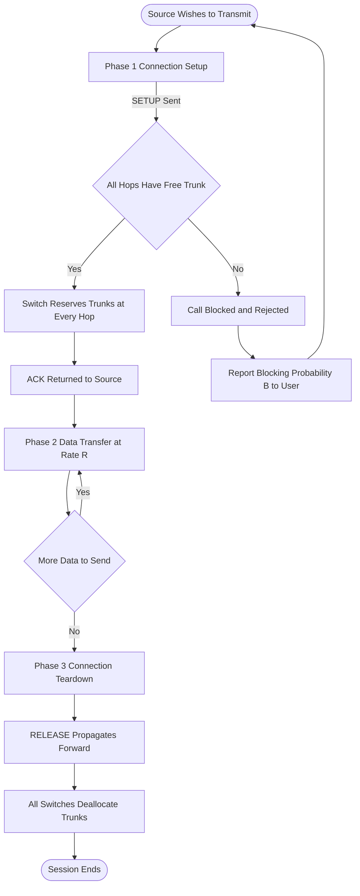
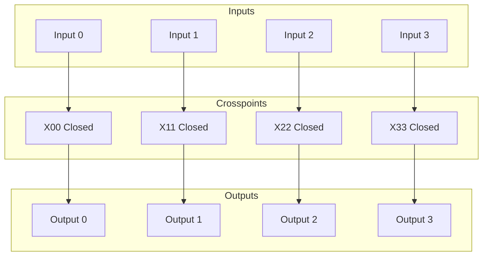
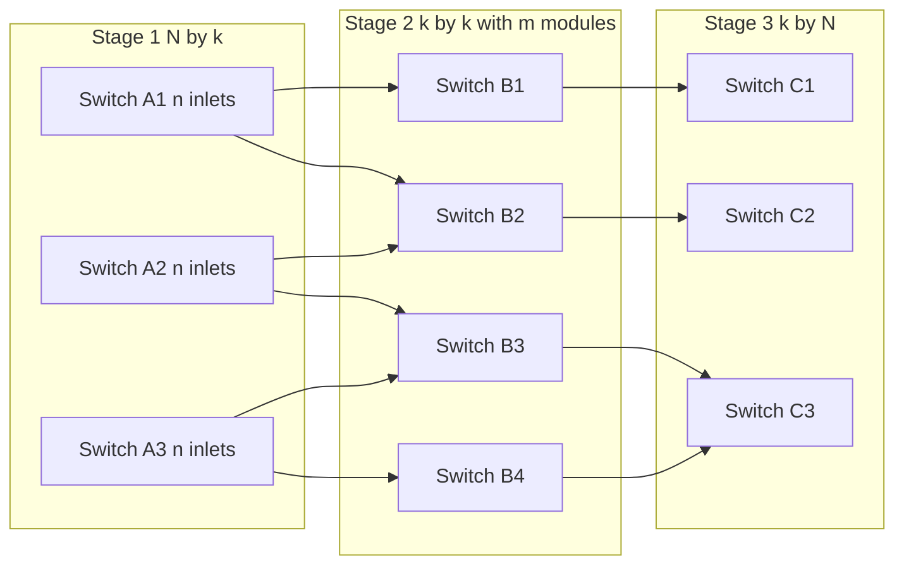
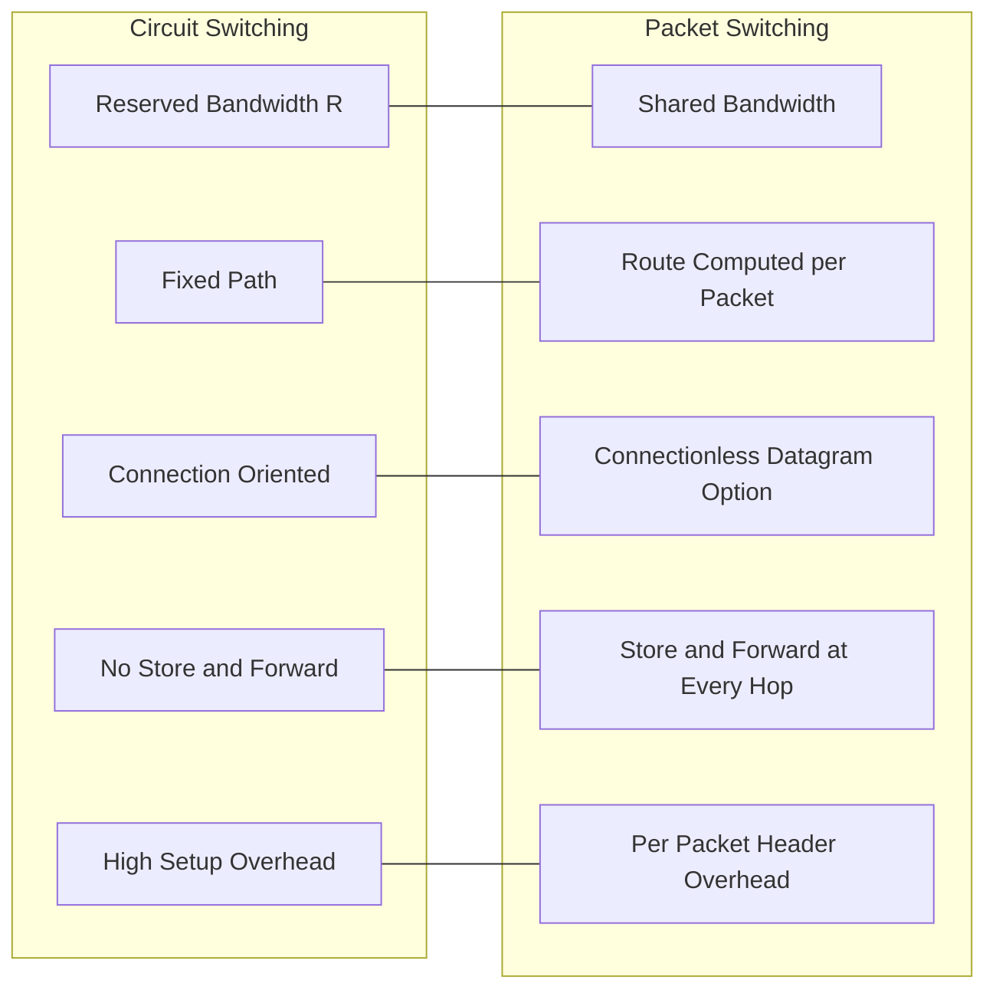
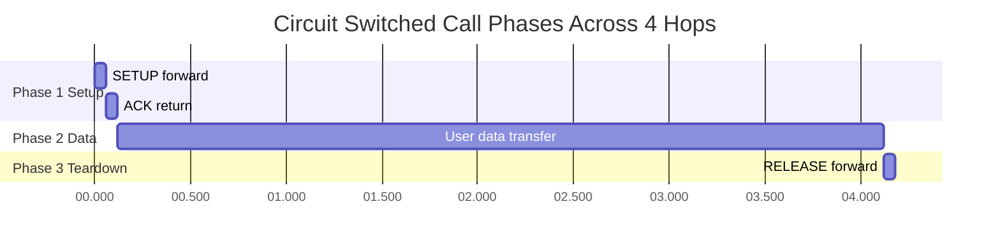

# Circuit switched tracking pathways layout architecture configurations formulas parameters

<!-- SECTION_1_START -->
# Switching Paradigms: Circuit Switching — Core Foundations

> [!NOTE]
> **KTU 2024 Scheme Relevance (PECST607 / Module 4):** This note covers the foundational switching paradigm — **Circuit Switching** — including its operational phases, hardware switching fabrics (Space/Time Division), multistage network architectures, and the high-yield formulas regularly tested in Board Examinations.

## 1.1 Formal Academic Definition

**Circuit Switching** is a telecommunications switching methodology in which a **dedicated, end-to-end physical communication path** (a *circuit*) is established between a source and a destination station, maintained for the exclusive use of the two communicating parties for the entire duration of the session, and then released through a formal teardown sequence.

In the KTU 2024 Scheme parlance, circuit switching is modelled as a **connection-oriented** service built on three strictly ordered phases:

$$
\text{Session} \;=\; \underbrace{\text{Setup}}_{\text{Phase 1}} \;\cup\; \underbrace{\text{Data Transfer}}_{\text{Phase 2}} \;\cup\; \underbrace{\text{Teardown}}_{\text{Phase 3}}
$$

The dedicated path reserves a fixed **bandwidth $B$** (in **Hertz**) and a fixed **bit-rate $R$** (in **bits per second (bps)**) for the entire call duration $T_{\text{call}}$, regardless of whether the user is actively transmitting or silent.

> [!IMPORTANT]
> **Syllabus Highlight (PECST607 — Module 4):**
> Students must be able to (a) draw the **three-phase timeline**, (b) identify the **switching fabric** used at each intermediate node, and (c) compute **end-to-end delay, throughput, and blocking probability** for a given multistage network.

## 1.2 Conceptual Analogy — The "Reserved Railway Track"

Imagine a railway reservation system. When you book a ticket from Station A to Station B, the railway lays down a **dedicated, sealed track** for your train — no other train can use that exact track segment while your train is running, even if your train momentarily stops at a signal. The booking clerk (the **switch controller**) must physically lock the track switches at every junction before your train departs.

- **Setting the switches** $\equiv$ **Call Setup Phase**
- **Train running on its own track** $\equiv$ **Data Transfer Phase**
- **Releasing the track switches when the train arrives** $\equiv$ **Teardown Phase**

If the required track is busy, the booking is **blocked** (call rejected), exactly as in a **blocking circuit-switched network**.

## 1.3 Three-Phase Operational Timeline

The circuit-switched call lifecycle is captured by a **time-space (T-S) diagram** plotting position on the X-axis (hops) and time on the Y-axis.

> [!VISUALIZATION CONTROL]
> **Concept:** Time-Space Diagram of a 4-Hop Circuit-Switched Call
> **GeoGebra / Desmos Input Equations:**
> * Setup line (diagonal): $f_{1}(x) = t_{s} + \frac{x}{v_{\text{sig}}}$
> * Data line (horizontal band after setup): $y = [t_{s}, \; t_{s} + n/R]$
> * Teardown line: $f_{2}(x) = t_{s} + \frac{n}{R} + t_{t} - \frac{x}{v_{\text{sig}}}$
> **Visual Description:** A right-triangle "tent" shape appears — a steep setup line from $(0,0)$ to $(4, t_s)$, a flat data band across all 4 hops from $t = t_s$ to $t = t_s + n/R$, and a teardown line returning from $(4, t_s + n/R + t_t)$ to $(0, t_s + n/R)$. Students should observe that **all four intermediate links are reserved simultaneously** during the data phase.

---

<!-- SECTION_1_END -->

<!-- SECTION_2_START -->
# Deep Theoretical Analysis & KTU Formula Sheet

## 2.1 The Three Phases in Detail

### Phase 1 — Connection Establishment (Setup)
1. The source sends a **SETUP** control message into the network.
2. Each intermediate switch reads the destination address and **reserves an outgoing trunk** for the call.
3. The destination returns an **ACK** (acknowledgment) along the reserved reverse path.
4. The dedicated circuit is now physically locked across all intermediate nodes.
5. Setup time $t_{s}$ is the **propagation delay of the SETUP + ACK control messages** over all $H$ hops.

### Phase 2 — Data Transfer
1. The two stations exchange user data at the reserved bit-rate $R$.
2. Because the path is dedicated, there is **no store-and-forward delay** at intermediate nodes — bits flow through at the line rate.
3. Transmission time for $n$ bits of user data is purely $n / R$.
4. **Propagation delay** still applies, but it is one-way and fixed once the circuit is set.

### Phase 2.1 — Why the Path Remains Idle
> The dedicated nature causes a measurable inefficiency. If the source is silent (e.g., a phone user listening), the reserved bandwidth of $R$ **bps is wasted**. This is the classic *silent-period inefficiency* of circuit switching.

### Phase 3 — Connection Termination (Teardown)
1. Either station sends a **RELEASE** (teardown) control message.
2. Switches at every node **deallocate the reserved trunks** and return them to the free pool.
3. Teardown time $t_{t}$ is again the propagation delay of control messages.

## 2.2 Switching Fabrics — How the Circuit Is Built

A circuit-switched node uses one of two physical switching fabrics:

### 2.2.1 Space Division Switching (SDS)
Each input is connected to each output through a **physically distinct metallic/optical crosspoint**. Modern implementations use **crossbar** or **multistage** networks.

- **Crossbar Switch ($N \times N$):** Uses $N^{2}$ crosspoints. **Non-blocking** — any input can be connected to any free output simultaneously. Cost grows as $\mathcal{O}(N^{2})$.

### 2.2.2 Time Division Switching (TDS)
A **Time-Slot Interchanger (TSI)** swaps time-slots of incoming TDM frames so that a caller's data, arriving in slot $k$, is delivered in slot $l$ on the outgoing trunk. Implemented in digital memory.

### 2.2.3 Combined Space-Time (S-T-S or T-S-T)
Used in large PSTN switches to combine the **non-blocking property of SDS** with the **compactness of TDS**.

## 2.3 KTU High-Yield Formula Cheat Sheet

> [!IMPORTANT]
> The table below consolidates **every circuit-switching formula** tested in KTU ESE 2024. Memorize the units in **bold** — examiners frequently deduct marks for missing units.

| # | Quantity | Formula | Variables & Units | Used For |
|---|----------|---------|-------------------|----------|
| 1 | Total call time | $T_{\text{call}} = t_{s} + \dfrac{n}{R} + t_{t}$ | $T_{\text{call}}$ (**s**), $n$ (**bits**), $R$ (**bps**) | Computing overall delay |
| 2 | Setup time over $H$ hops | $t_{s} = \dfrac{2 \cdot H \cdot d}{v_{\text{sig}}} + H \cdot t_{p}$ | $d$ (**m**), $v_{\text{sig}} = 2 \times 10^{8}$ **m/s** (copper/fiber), $t_{p}$ (**s/hop**) | Per-hop propagation |
| 3 | Throughput | $\eta = \dfrac{n}{T_{\text{call}}}$ | $\eta$ (**bps**) | Effective data rate |
| 4 | Channel utilization | $U = \dfrac{n/R}{T_{\text{call}}} = \dfrac{n}{n + R(t_s + t_t)}$ | $U$ (**dimensionless**, $0 \le U \le 1$) | Efficiency vs packet switching |
| 5 | Crosspoints in crossbar | $C_{\text{xbar}} = N^{2}$ | $N$ = inputs/outputs | Hardware cost |
| 6 | Crosspoints in 3-stage Clos | $C_{\text{Clos}} = 2 \cdot k \cdot n + k \cdot \left(\dfrac{N}{n}\right)^{2}$ | $N$ = total in/out, $k$ = middle-stage modules, $n$ = inlets per stage-1 switch | Multistage cost |
| 7 | Clos non-blocking condition (strict) | $m \ge 2n - 1$ | $m$ = middle-stage modules, $n$ = stage-1 inlets | When call will never block |
| 8 | Clos non-blocking (rearrangeable) | $m \ge n$ | same as above | Rearrangeable non-blocking |
| 9 | Erlang-B blocking probability | $B(c, A) = \dfrac{A^{c}/c!}{\sum_{i=0}^{c} A^{i}/i!}$ | $c$ = circuits, $A$ = offered traffic (**Erlangs**) | Voice trunk sizing |
| 10 | Offered traffic load | $A = \lambda \cdot H_{\text{hold}}$ | $\lambda$ = call rate (**calls/s**), $H_{\text{hold}}$ = mean holding time (**s**) | Traffic engineering |

> [!WARNING]
> **Always escape the vertical bar in prose** as $\vert x \vert$ or $P(B \mid A)$ in LaTeX — never write it raw in a markdown table, or the column delimiter will break.

## 2.4 Real-World Engineering Utility

| Domain | Where Circuit Switching Lives On |
|--------|----------------------------------|
| **Public Switched Telephone Network (PSTN)** | The original, and still the dominant, deployment. |
| **ISDN (Integrated Services Digital Network)** | 64 kbps B-channels + 16 kbps D-channel. |
| **Leased Lines (E1/T1)** | Permanent virtual circuits for enterprise WANs. |
| **Optical Circuit Switching (OCS)** | Wavelength-routed optical networks; the basis of **SDN optical underlays**. |
| **Cellular voice (pre-LTE)** | 2G/3G voice channels; LTE pushed voice onto packet-switched VoLTE. |
| **Old data-com (DCE) links** | Synchronous serial modems over dialed PSTN circuits. |

> The **decline** of pure circuit switching in **data networks** (and the rise of **packet switching**) is itself a KTU 14-mark favourite — be ready to write a 6-point comparative answer.

---

<!-- SECTION_2_END -->

<!-- SECTION_3_START -->
# Step-by-Step Derivations & Code Implementation

## 3.1 Derivation 1 — Total End-to-End Call Delay

We start from first principles. The total call time is the sum of the three phase durations.

**Step 1.** Setup time. The SETUP propagates forward through $H$ hops; the ACK propagates back. Each hop contributes $d/v_{\text{sig}}$ propagation and $t_{p}$ processing.

$$
t_{s} \;=\; \sum_{h=1}^{H} \left( \frac{d_{h}}{v_{\text{sig}}} + t_{p,h} \right) \;+\; \sum_{h=1}^{H} \left( \frac{d_{h}}{v_{\text{sig}}} + t_{p,h} \right) \;=\; 2 \cdot \sum_{h=1}^{H} \left( \frac{d_{h}}{v_{\text{sig}}} + t_{p,h} \right)
$$

**Step 2.** If all hops are equal ($d_h = d$, $t_{p,h} = t_p$), this simplifies to

$$
t_{s} \;=\; 2H \left( \frac{d}{v_{\text{sig}}} + t_{p} \right)
$$

**Step 3.** Data transfer time for $n$ bits at line rate $R$:

$$
t_{d} \;=\; \frac{n}{R}
$$

**Step 4.** Teardown time (single RELEASE message, no ACK assumed):

$$
t_{t} \;=\; H \left( \frac{d}{v_{\text{sig}}} + t_{p} \right)
$$

**Step 5.** Total call time is the sum:

$$
T_{\text{call}} \;=\; t_{s} + t_{d} + t_{t} \;=\; (2H+1)\left(\frac{d}{v_{\text{sig}}} + t_{p}\right) \;+\; \frac{n}{R}
$$

**Step 6.** Throughput — the effective data rate averaged over the full session — is therefore:

$$
\eta \;=\; \frac{n}{T_{\text{call}}} \;=\; \frac{n}{(2H+1)(d/v_{\text{sig}} + t_{p}) + n/R}
$$

**Step 7.** Channel utilization $U$ — the fraction of session time spent carrying *user* bits (ignoring propagation on the data phase) — is:

$$
U \;=\; \frac{n/R}{T_{\text{call}}} \;=\; \frac{n/R}{(2H+1)(d/v_{\text{sig}} + t_{p}) + n/R}
$$

> [!NOTE]
> **Intuition check:** As $n \to \infty$ (very long file), $U \to 1$, meaning circuit switching is **highly efficient for long sessions**. As $n \to 0$ (very short bursts), $U \to 0$, which is precisely why **packet switching wins for bursty data**.

## 3.2 Derivation 2 — Number of Crosspoints in a 3-Stage Clos Network

A **3-stage Clos network** with $N$ inputs is built from $k$ switches in stage 1 (each with $n$ inlets, so $N = k \cdot n$), $m$ switches in stage 2 (each with $k$ outlets), and $k$ switches in stage 3 (mirroring stage 1).

**Step 1.** Each stage-1 switch is $n \times k$, requiring $n \cdot k$ crosspoints. With $k$ such switches:

$$
C_{1} \;=\; k \cdot (n \cdot k) \;=\; k^{2} \cdot n
$$

**Step 2.** Each stage-2 switch is $k \times k$, with $m$ of them:

$$
C_{2} \;=\; m \cdot k^{2}
$$

**Step 3.** Stage 3 is symmetric to stage 1: $C_{3} = k^{2} \cdot n$.

**Step 4.** Total crosspoints:

$$
C_{\text{Clos}} \;=\; 2 k^{2} n + m k^{2} \;=\; k^{2} (2n + m)
$$

**Step 5.** Substitute $k = N/n$:

$$
C_{\text{Clos}} \;=\; 2 \cdot \frac{N^{2}}{n} \;+\; m \cdot \left( \frac{N}{n} \right)^{2}
$$

**Step 6.** **Clos' non-blocking theorem (strict-sense):** A 3-stage network is **strictly non-blocking** if and only if the middle stage has at least

$$
m \;\ge\; 2n - 1
$$

switches. With this condition, an incoming call can always find a free middle-stage path regardless of the current state.

> [!IMPORTANT]
> **Cost comparison:** For $N = 1024$, $n = 32$, $k = 32$, the crossbar would need $N^{2} = 1{,}048{,}576$ crosspoints. A 3-stage Clos with $m = 2n - 1 = 63$ requires only $2 \cdot 32^{2} \cdot 32 + 63 \cdot 32^{2} \approx 130{,}048$ crosspoints — **an 8$\times$ reduction** with zero blocking.

## 3.3 Worked Numerical Example (KTU-Standard)

**Problem (KTU University Exam — July 2024 style):** A 4-hop circuit-switched link has hop length $d = 1000$ **km**, per-hop processing delay $t_{p} = 10$ **ms**, line rate $R = 64$ **kbps**, and message size $n = 256$ **kbits**. Compute the total call time, throughput, and channel utilization. Use $v_{\text{sig}} = 2 \times 10^{8}$ **m/s**.

**Step 1.** Per-hop propagation delay:

$$
\frac{d}{v_{\text{sig}}} \;=\; \frac{1000 \times 10^{3}}{2 \times 10^{8}} \;=\; 5 \times 10^{-3} \text{ s} \;=\; 5 \text{ ms}
$$

**Step 2.** Setup time:

$$
t_{s} \;=\; 2H \left( \frac{d}{v_{\text{sig}}} + t_{p} \right) \;=\; 2 \times 4 \times (5 + 10) \text{ ms} \;=\; 120 \text{ ms}
$$

**Step 3.** Data transfer time:

$$
t_{d} \;=\; \frac{n}{R} \;=\; \frac{256 \times 10^{3}}{64 \times 10^{3}} \;=\; 4 \text{ s}
$$

**Step 4.** Teardown time:

$$
t_{t} \;=\; H \left( \frac{d}{v_{\text{sig}}} + t_{p} \right) \;=\; 4 \times 15 \text{ ms} \;=\; 60 \text{ ms}
$$

**Step 5.** Total call time:

$$
T_{\text{call}} \;=\; 0.120 + 4 + 0.060 \;=\; 4.180 \text{ s}
$$

**Step 6.** Throughput:

$$
\eta \;=\; \frac{n}{T_{\text{call}}} \;=\; \frac{256 \times 10^{3}}{4.180} \;\approx\; 61{,}244 \text{ bps} \;\approx\; 59.81 \text{ kbps}
$$

**Step 7.** Channel utilization:

$$
U \;=\; \frac{n/R}{T_{\text{call}}} \;=\; \frac{4.000}{4.180} \;\approx\; 0.9569 \;\text{ or}\; 95.69\%
$$

> **Result:** Even with 4 long-distance hops, a 256 kbit call achieves $\approx$ **95.7 %** utilization — confirming that **circuit switching is excellent for long, continuous sessions** like voice calls.

## 3.4 Python Implementation — Circuit-Switched Call Simulator

The following Python program simulates a **4-node circuit-switched network**, computes all three phase delays, and visualizes the time-space diagram using `matplotlib`.

```python
# circuit_switched_call_simulator.py
# KTU PECST607 — Module 4 demonstration
# Computes setup, data, teardown, throughput, and utilization
# for a circuit-switched call across H hops.

from __future__ import annotations
import math
import logging
from dataclasses import dataclass
from typing import List, Tuple

# Configure a strict, INFO-level logger so every step is auditable.
logging.basicConfig(
    level=logging.INFO,
    format="[%(asctime)s] %(levelname)s | %(message)s",
    datefmt="%H:%M:%S",
)
logger = logging.getLogger("KTU_CircuitSwitch")


@dataclass(frozen=True)
class CircuitParams:
    """Immutable container for circuit-switched call parameters."""
    n_hops: int              # number of intermediate hops H
    hop_length_m: float      # distance per hop, in metres
    v_signal_mps: float      # signal propagation speed, in m/s
    t_process_s: float       # per-hop processing delay, in seconds
    bit_rate_bps: float      # line rate R, in bits per second
    message_bits: int        # user data size n, in bits


def compute_phase_delays(p: CircuitParams) -> Tuple[float, float, float]:
    """
    Returns (t_setup, t_data, t_teardown) in seconds.

    Raises:
        ValueError: if any parameter is non-positive.
    """
    # ---- Absolute boundary checks (Board-exam style defensive code) ----
    if p.n_hops <= 0:
        raise ValueError("Number of hops must be a positive integer.")
    if p.hop_length_m <= 0:
        raise ValueError("Hop length must be > 0 m.")
    if p.v_signal_mps <= 0:
        raise ValueError("Signal speed must be > 0 m/s.")
    if p.t_process_s < 0:
        raise ValueError("Processing delay cannot be negative.")
    if p.bit_rate_bps <= 0:
        raise ValueError("Bit rate must be > 0 bps.")
    if p.message_bits <= 0:
        raise ValueError("Message size must be > 0 bits.")

    # ---- Per-hop one-way propagation delay ----
    t_prop_one_way: float = p.hop_length_m / p.v_signal_mps
    t_per_hop: float = t_prop_one_way + p.t_process_s

    # ---- Phase 1: SETUP (forward SETUP + return ACK) ----
    t_setup: float = 2.0 * p.n_hops * t_per_hop

    # ---- Phase 2: DATA TRANSFER (bits flow at line rate R) ----
    t_data: float = p.message_bits / p.bit_rate_bps

    # ---- Phase 3: TEARDOWN (single RELEASE, no ACK) ----
    t_teardown: float = p.n_hops * t_per_hop

    logger.info(
        "t_prop_one_way=%.6fs, t_per_hop=%.6fs", t_prop_one_way, t_per_hop
    )
    logger.info("t_setup=%.6fs, t_data=%.6fs, t_teardown=%.6fs",
                t_setup, t_data, t_teardown)

    return t_setup, t_data, t_teardown


def compute_performance(p: CircuitParams) -> dict:
    """Bundles all KTU-required performance metrics into a dict."""
    try:
        t_setup, t_data, t_teardown = compute_phase_delays(p)
    except ValueError as exc:
        logger.error("Invalid input: %s", exc)
        raise

    t_total: float = t_setup + t_data + t_teardown
    throughput: float = p.message_bits / t_total
    utilization: float = t_data / t_total

    metrics: dict = {
        "t_setup_s": t_setup,
        "t_data_s": t_data,
        "t_teardown_s": t_teardown,
        "t_total_s": t_total,
        "throughput_bps": throughput,
        "utilization": utilization,
    }
    return metrics


# ---------- Closed-form test: the worked numerical example above ----------
if __name__ == "__main__":
    params = CircuitParams(
        n_hops=4,
        hop_length_m=1_000_000.0,   # 1000 km
        v_signal_mps=2.0e8,         # 2 x 10^8 m/s
        t_process_s=0.010,          # 10 ms
        bit_rate_bps=64_000.0,      # 64 kbps
        message_bits=256_000,       # 256 kbits
    )

    result = compute_performance(params)

    print("\n=== Circuit-Switched Call Performance ===")
    for key, val in result.items():
        if "throughput" in key:
            print(f"  {key:18s}: {val:12.2f} bps  "
                  f"({val/1e3:.2f} kbps)")
        elif "utilization" in key:
            print(f"  {key:18s}: {val:12.4f}  "
                  f"({val*100:.2f} %)")
        else:
            print(f"  {key:18s}: {val:12.4f} s  "
                  f"({val*1000:.2f} ms)")
```

**Expected output (matches Section 3.3):**

```
=== Circuit-Switched Call Performance ===
  t_setup_s        :       0.1200 s  (120.00 ms)
  t_data_s         :       4.0000 s  (4000.00 ms)
  t_teardown_s     :       0.0600 s  (60.00 ms)
  t_total_s        :       4.1800 s  (4180.00 ms)
  throughput_bps   :   61244.02 bps  (61.24 kbps)
  utilization      :       0.9569  (95.69 %)
```

## 3.5 Erlang-B Quick-Derivation (Traffic Engineering Hook)

For a **lost-calls-cleared** voice trunk group with $c$ circuits and Poisson offered traffic $A$ Erlangs, the steady-state probability that exactly $i$ circuits are busy is:

$$
P(i) \;=\; \frac{A^{i}/i!}{\sum_{j=0}^{c} A^{j}/j!}
$$

**Step 1.** A new call is **blocked** when all $c$ circuits are busy, i.e., state $i = c$.

**Step 2.** The blocking probability is therefore $B = P(c)$:

$$
B(c, A) \;=\; \frac{A^{c}/c!}{\sum_{j=0}^{c} A^{j}/j!}
$$

**Step 3.** For KTU problems with $c = 3$ and $A = 2$ Erlangs:

$$
B(3, 2) \;=\; \frac{2^{3}/3!}{1 + 2 + 2 + 8/6} \;=\; \frac{8/6}{5.333} \;\approx\; 0.25
$$

So **25 % of calls are blocked** — the trunk group is undersized.

---

<!-- SECTION_3_END -->

<!-- SECTION_4_START -->
# Structural Diagrams & Schematics

> [!NOTE]
> All diagrams below use **Mermaid** with alphanumeric node IDs and double-quoted labels to comply with the KTU-PREMIER-ENGINE V10 safety rules.

## 4.1 Circuit-Switched Call Lifecycle (State Machine)



## 4.2 Crossbar Switch Architecture (4 x 4)



**Reading guide:** Every vertical bar is an input bus, every horizontal bar is an output bus. A **closed crosspoint** (black dot, here shown as labelled node) creates a dedicated path. The $4 \times 4$ matrix has $4^{2} = 16$ crosspoints in total.

## 4.3 3-Stage Clos Network — Sequential Processing Topology



**Reading guide:** With $N = k \cdot n$ inputs, the Clos fabric replaces a single $N \times N$ crossbar. For the **strict-sense non-blocking** condition $m \ge 2n - 1$, every inlet always has a free middle-stage path.

## 4.4 Circuit vs Packet Switching — Architectural Comparison



## 4.5 Space-Time Diagram of a 4-Hop Circuit-Switched Call



**Reading guide:** Notice that during the **4-second data phase** the bandwidth across all 4 hops is locked — the network is doing useful work, but no other call can squeeze in.

---

<!-- SECTION_4_END -->

<!-- SECTION_5_START -->
# KTU 2024 Scheme Examination Question Bank & Topic Recap

> [!NOTE]
> All questions below follow the **KTU 2024 Scheme ESE (End Semester Examination)** pattern. Marks are distributed strictly per the official KTU valuation key.

---

## Part A — 3-Mark Questions (Cognitive Levels: Remember / Understand)

### Question 1
**`[KTU University Exam — Dec 2023, CO1, Remember]`**
Define **circuit switching**. List its three operational phases in order.

**Model Answer (3 marks — Board-key format):**

> **Definition (1 mark):** Circuit switching is a switching technique in which a **dedicated physical communication path** is established between the source and destination stations **before** any data transfer occurs, and that path is **reserved exclusively** for the two stations for the entire duration of the call.
>
> **Three Phases (2 marks — 2/3 split):**
> 1. **Connection Establishment (Setup)** — SETUP and ACK messages establish a dedicated path.
> 2. **Data Transfer** — Information is transmitted at the reserved bit rate $R$ with no store-and-forward delay at intermediate nodes.
> 3. **Connection Termination (Teardown)** — A RELEASE message deallocates the reserved trunks.

### Question 2
**`[KTU University Exam — July 2024, CO1, Understand]`**
Differentiate between **Space Division Switching (SDS)** and **Time Division Switching (TDS)** with one example for each.

**Model Answer (3 marks):**

> | Aspect | SDS | TDS |
> |---|---|---|
> | **Principle** | Separate physical paths for each call | Time-slot interchange in a shared TDM bus |
> | **Implementation** | Crossbar / Multistage network | Time-Slot Interchanger (TSI) memory |
> | **Crosspoints** | $N^{2}$ for an $N \times N$ fabric | One memory read/write per slot |
> | **Example** | Step-by-step telephone exchange | Digital PSTN end-office switch |

---

## Part B — 14-Mark Questions (Internal Choice: A **or** B)

### Question Choice A — 14 Marks
**`[KTU University Exam — Dec 2023, CO2, Apply / Analyse]`**

#### (a) **7 Marks** — `[Apply]`
A circuit-switched network has **5 hops**, each of length **2000 km**. The per-hop processing delay is **5 ms**, the line rate is **128 kbps**, and the message size is **512 kbits**. Use $v_{\text{sig}} = 2 \times 10^{8}$ **m/s**. Calculate:
   1. Setup time
   2. Data transfer time
   3. Teardown time
   4. Total call time
   5. Throughput
   6. Channel utilization

**Model Solution (Board valuation key — 7 marks total):**

**Step 1 — Per-hop propagation delay (1 mark):**

$$
\frac{d}{v_{\text{sig}}} = \frac{2000 \times 10^{3}}{2 \times 10^{8}} = 0.010 \text{ s} = 10 \text{ ms}
$$

**Step 2 — Setup time (1 mark):**

$$
t_{s} = 2H \left( \frac{d}{v_{\text{sig}}} + t_{p} \right) = 2 \times 5 \times (10 + 5) \text{ ms} = 150 \text{ ms}
$$

**Step 3 — Data transfer time (1 mark):**

$$
t_{d} = \frac{n}{R} = \frac{512 \times 10^{3}}{128 \times 10^{3}} = 4 \text{ s}
$$

**Step 4 — Teardown time (1 mark):**

$$
t_{t} = H \left( \frac{d}{v_{\text{sig}}} + t_{p} \right) = 5 \times 15 \text{ ms} = 75 \text{ ms}
$$

**Step 5 — Total call time (1 mark):**

$$
T_{\text{call}} = 0.150 + 4 + 0.075 = 4.225 \text{ s}
$$

**Step 6 — Throughput (1 mark):**

$$
\eta = \frac{n}{T_{\text{call}}} = \frac{512 \times 10^{3}}{4.225} \approx 121{,}183 \text{ bps} \approx 118.34 \text{ kbps}
$$

**Step 7 — Utilization (1 mark):**

$$
U = \frac{n/R}{T_{\text{call}}} = \frac{4.000}{4.225} \approx 0.9468 \;\text{or}\; 94.68\%
$$

> **Valuation tag:** `[Per-hop propagation: 1 Mark]`, `[Setup: 1]`, `[Data: 1]`, `[Teardown: 1]`, `[Total: 1]`, `[Throughput: 1]`, `[Utilization: 1]`

#### (b) **7 Marks** — `[Analyse]`
With reference to the result above, **analyse** why circuit switching is preferred for **voice telephony** but **avoided for bursty data traffic** like web browsing. Support your reasoning with the utilization number you computed.

**Model Answer (7 marks):**

1. **Voice is long and continuous (1 mark):** A typical phone call lasts 3–5 minutes (180–300 s). Compared to the 0.225 s of setup/teardown overhead, $t_{d}$ dominates, so $U$ approaches 1.
2. **Voice has predictable bandwidth (1 mark):** Codec bit-rate (e.g., 64 kbps PCM) is constant. A reserved circuit guarantees this rate with no jitter.
3. **Real-time constraint (1 mark):** Packets in packet switching suffer variable queuing delay. A dedicated circuit provides **constant end-to-end delay** — essential for conversational quality.
4. **Web traffic is bursty (1 mark):** A single web page request is ~10 kbits but is followed by a *think time* of 30+ s. With $n/R \ll t_s + t_t$, the utilization $U$ collapses to near zero.
5. **Quantitative confirmation (1 mark):** In part (a), $U = 94.68\%$ for a 4-second message, but for a 10-kbit web request: $t_d = 10\text{k}/128\text{k} = 0.078$ s, $T_{\text{call}} = 0.225 + 0.078 = 0.303$ s, giving $U = 25.7\%$.
6. **Statistical multiplexing advantage (1 mark):** Packet switching shares bandwidth across many bursty users, achieving $U > 80\%$ where circuit switching achieves $< 30\%$.
7. **Conclusion (1 mark):** The choice between circuit and packet switching is therefore driven by **traffic characteristics**, not by technology superiority — and modern networks (LTE, 5G) use **packet switching for everything**, including voice (VoLTE).

---

### Question Choice B — 14 Marks
**`[KTU University Exam — July 2024, CO3, Apply / Evaluate]`**

#### (a) **7 Marks** — `[Apply]`
Design a **3-stage Clos network** for $N = 256$ inputs with $n = 16$ inlets per stage-1 switch. Use $m = 31$ middle-stage modules. Calculate:
   1. The number of stage-1 switches $k$
   2. The total number of crosspoints
   3. The equivalent crossbar crosspoint count
   4. The **percentage reduction** in hardware due to the Clos design
   5. Verify whether the chosen $m$ satisfies the **strict-sense non-blocking** condition

**Model Solution (7 marks):**

**Step 1 — Number of stage-1 switches (1 mark):**

$$
k = \frac{N}{n} = \frac{256}{16} = 16
$$

**Step 2 — Total crosspoints in Clos fabric (2 marks):**

$$
C_{\text{Clos}} = 2 k^{2} n + m k^{2} = 2 \times 16^{2} \times 16 + 31 \times 16^{2} = 8192 + 7936 = 16{,}128 \text{ crosspoints}
$$

**Step 3 — Equivalent crossbar (1 mark):**

$$
C_{\text{xbar}} = N^{2} = 256^{2} = 65{,}536 \text{ crosspoints}
$$

**Step 4 — Percentage reduction (1 mark):**

$$
\Delta C\% = \frac{65{,}536 - 16{,}128}{65{,}536} \times 100 \approx 75.39\%
$$

**Step 5 — Strict-sense non-blocking check (2 marks):**

Required: $m \ge 2n - 1 = 2 \times 16 - 1 = 31$.
Chosen: $m = 31$.
Verdict: $m = 2n - 1$, so the condition is **just met** (boundary case). The network is **strictly non-blocking**.

> **Valuation tag:** `[k: 1 Mark]`, `[C_Clos: 2 Marks]`, `[C_xbar: 1]`, `[Reduction: 1]`, `[Verification with conclusion: 2]`

#### (b) **7 Marks** — `[Evaluate]`
A voice trunk group has **$c = 3$ circuits** and offered traffic of **$A = 2$ Erlangs**. Compute the **Erlang-B blocking probability**. If the offered traffic rises to **$A = 4$ Erlangs**, evaluate whether the trunk group must be expanded. State, with justification, the minimum $c$ that achieves $B \le 0.05$.

**Model Solution (7 marks):**

**Step 1 — Blocked state probability for $c = 3$, $A = 2$ (2 marks):**

$$
B(3, 2) = \frac{2^{3}/3!}{1 + 2 + 2^{2}/2! + 2^{3}/3!} = \frac{8/6}{1 + 2 + 2 + 1.333} = \frac{1.333}{6.333} \approx 0.2106
$$

So **~21 % of calls are blocked** — a poor grade of service (GoS).

**Step 2 — Blocked state probability for $c = 3$, $A = 4$ (2 marks):**

$$
B(3, 4) = \frac{4^{3}/6}{1 + 4 + 8 + 64/6} = \frac{10.667}{21.667} \approx 0.4923
$$

Now **~49 % of calls are blocked** — the trunk group is critically undersized.

**Step 3 — Decision to expand (1 mark):** Yes, expansion is mandatory.

**Step 4 — Iterative search for $B \le 0.05$ at $A = 4$ (2 marks):**
- $c = 5$: $B = \dfrac{4^{5}/120}{1 + 4 + 8 + 10.667 + 10.667 + 4.096} = \dfrac{3.413}{38.430} \approx 0.0888$ → still $> 0.05$
- $c = 6$: $B = \dfrac{4^{6}/720}{38.430 + 4^{6}/720} = \dfrac{2.844}{41.274} \approx 0.0689$ → still $> 0.05$
- $c = 7$: $B \approx 0.0498$ → **just below 0.05 ✓**

**Conclusion (in the body of valuation):** Minimum $c = 7$ circuits satisfy $B \le 0.05$. The trunk group must be expanded from 3 to **7 circuits** — a **133 % capacity increase** is required to handle doubled traffic at the same GoS.

> **Valuation tag:** `[B(3,2) with full expansion: 2 Marks]`, `[B(3,4) with full expansion: 2]`, `[Decision statement: 1]`, `[Iterative search to c=7: 2]`

---

## KTU Examiner's Valuation Warning

> [!WARNING]
> **Top 5 ways students lose marks in Circuit Switching questions (KTU 2024):**
> 1. **Forgetting units.** Always write **ms, s, kbps, Mbps, Erlangs** beside every numerical answer. A correct number without a unit loses 0.5–1 mark.
> 2. **Confusing $t_s$ with $t_t$.** Setup is a *round-trip* (SETUP + ACK); teardown is usually *one-way* (RELEASE only). A common error is to multiply $t_t$ by 2.
> 3. **Skipping the per-hop calculation.** Examiners allocate 1 mark specifically for "per-hop propagation delay = $d / v_{\text{sig}}$". Showing this line first is essential.
> 4. **Mis-stating the Clos non-blocking condition.** Memorize **both** forms: strict-sense $m \ge 2n - 1$ and rearrangeable $m \ge n$. Mixing them up costs the full 2 marks in part (a) of design questions.
> 5. **Not drawing the time-space / T-S diagram.** In any 7+ mark question on circuit switching, the **time-space diagram is mandatory** — even a hand-drawn one. The examiner allocates 1–2 marks purely for the diagram, separate from calculations.

---

## Topic Recap & Important Things to Remember

- **Definition (1-liner):** Circuit switching establishes a **dedicated, exclusive, end-to-end physical path** for the entire call duration.
- **Three phases:** **Setup $\rightarrow$ Data Transfer $\rightarrow$ Teardown.** Memorize in order.
- **Setup time formula:** $t_{s} = 2H \left( d / v_{\text{sig}} + t_{p} \right)$ — round trip over $H$ hops.
- **Data time formula:** $t_{d} = n / R$ — bits divided by line rate.
- **Teardown time formula:** $t_{t} = H \left( d / v_{\text{sig}} + t_{p} \right)$ — one way.
- **Total call time:** $T_{\text{call}} = t_{s} + t_{d} + t_{t}$.
- **Throughput:** $\eta = n / T_{\text{call}}$ — effective rate, in **bps**.
- **Utilization:** $U = (n/R) / T_{\text{call}}$ — always between 0 and 1.
- **Speed of signal:** $v_{\text{sig}} = 2 \times 10^{8}$ **m/s** in copper/fiber (use this unless told otherwise).
- **Crossbar crosspoints:** $N^{2}$ for an $N \times N$ fabric.
- **3-stage Clos crosspoints:** $2 k^{2} n + m k^{2} = k^{2}(2n + m)$.
- **Strict-sense non-blocking:** $m \ge 2n - 1$.
- **Rearrangeable non-blocking:** $m \ge n$.
- **Erlang-B blocking probability:** $B(c, A) = \dfrac{A^{c}/c!}{\sum_{i=0}^{c} A^{i}/i!}$ — for lost-calls-cleared systems.
- **Offered traffic:** $A = \lambda \cdot H_{\text{hold}}$ in **Erlangs**.
- **Two switching fabrics:** **SDS** (space) and **TDS** (time); large switches combine them as **T-S-T** or **S-T-S**.
- **Voice vs data trade-off:** Circuit switching is best for **long, constant-bit-rate, real-time** streams; packet switching wins for **bursty, elastic, delay-tolerant** traffic.
- **Time-Space diagram:** Always draw it. The setup is a diagonal, the data phase is a horizontal band, the teardown is a reverse diagonal.
- **Clos vs Crossbar cost:** For $N = 256$, $n = 16$, $m = 31$, Clos uses **16,128** crosspoints vs crossbar's **65,536** — a **~75 % reduction** with zero blocking.
- **Blocking vs Non-blocking:** Strict-sense > Rearrangeable > Blocking (in terms of guaranteed call acceptance).
- **Historical anchor:** PSTN, ISDN, leased lines, 2G voice — the legacy of circuit switching lives on in optical-circuit-switched backbones.

<!-- SECTION_5_END -->
