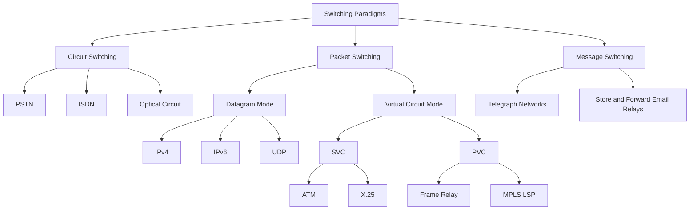
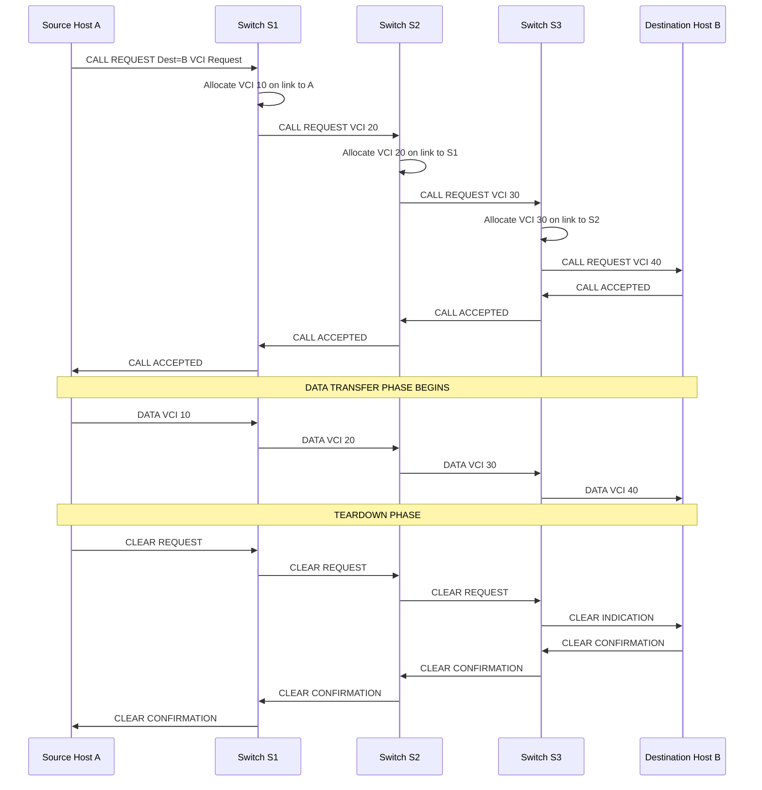
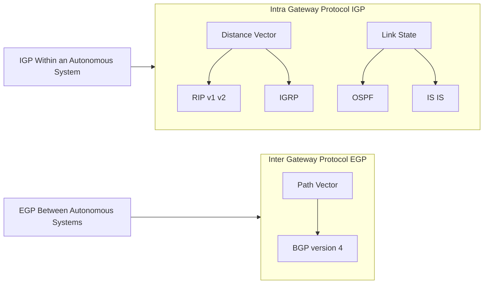
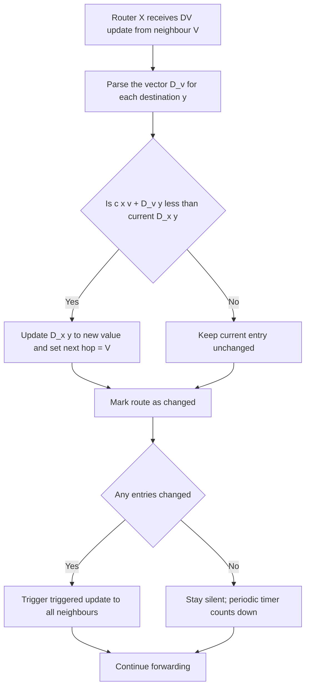
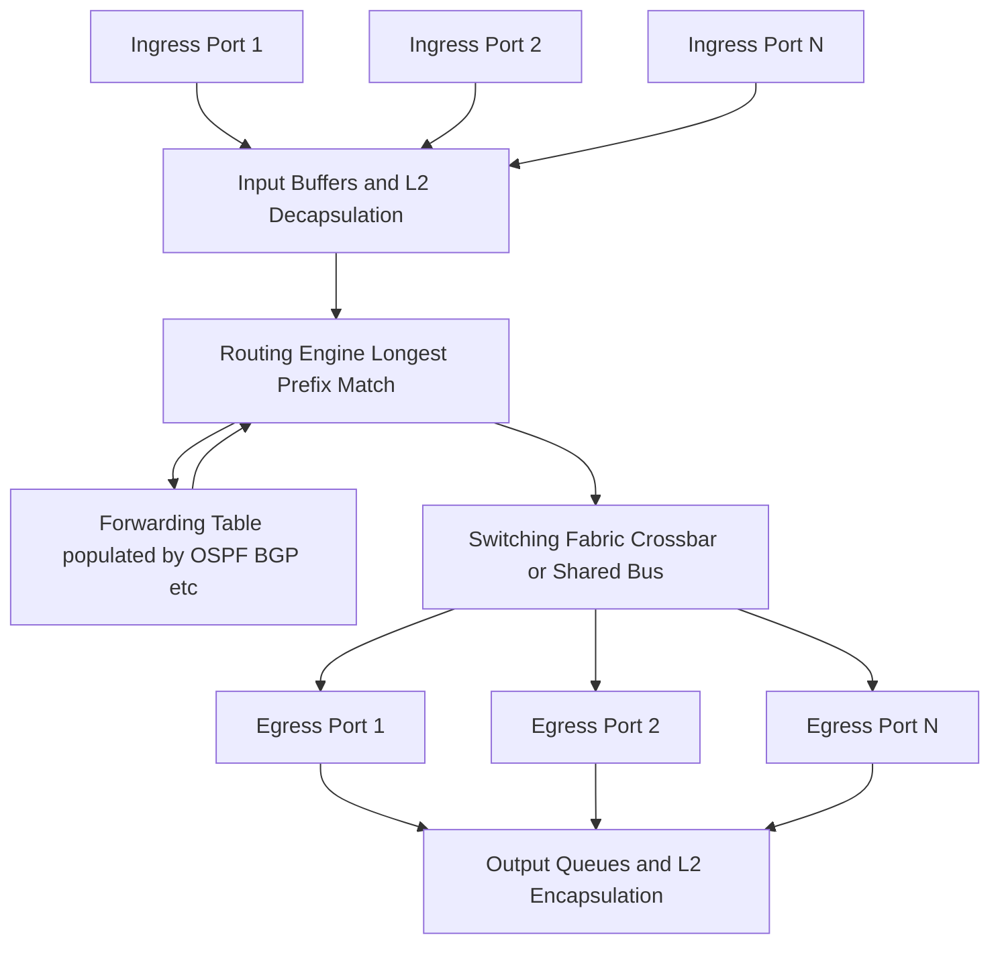

# Packet switching mechanics routing routines virtual circuit setups configurations tracks

<!-- SECTION_1_START -->

# Switching Paradigms in Networks: Packet Switching Mechanics, Routing Routines, and Virtual Circuit Setups

## 1.1 Core Technical Definition (KTU 2024 Syllabus Terminology)

**Packet Switching** is a *store-and-forward* networking paradigm in which user messages (or files) are partitioned into discrete, fixed- or variable-sized **packets** (also called **datagrams** in connectionless mode), each carrying a **header** containing source and destination addressing, sequence numbers, and control flags. These packets are independently forwarded hop-by-hop through intermediate **routers** (Layer-3 devices) or **switches** (Layer-2/3 devices) using a routing routine that consults a **routing table** to determine the next hop. Packets of the same original message may traverse **different tracks (paths)** through the network and arrive out-of-order at the destination, where they are reassembled.

> [!IMPORTANT]
> **KTU 2024 Module-4 Anchor Definition:** *"Packet switching is a connectionless or virtual-circuit connection-oriented digital networking technique in which data is broken into addressable units called packets, which are routed independently across shared network resources using statistical multiplexing."*

**Virtual Circuit (VC) Setup** is a hybrid switching technique that emulates the dedicated path of circuit switching *logically* (not physically) by establishing a pre-computed **virtual path** (a sequence of VC identifiers / VPI-VCI labels) between source and destination through a **signalling protocol** (e.g., ATM, Frame Relay, X.25). Two variants exist:
- **SVC (Switched Virtual Circuit):** Setup dynamically per session via signalling (analogous to a phone call).
- **PVC (Permanent Virtual Circuit):** Provisioned manually by the network administrator; remains active permanently (analogous to a leased line).

**Routing Routines** are the deterministic or adaptive algorithms executed at each network node to populate and consult routing tables, choosing the optimal next-hop interface for a given destination prefix.

> [!NOTE]
> **Statistical Multiplexing** is the core efficiency engine of packet switching. Unlike TDM (which wastes slots), statistical multiplexing allocates link bandwidth *on demand* to whichever packet is ready, dramatically improving link utilisation.

---

## 1.2 Conceptual Analogy — "The Highway System"

Imagine a **post-office parcel network**:

1. **Circuit Switching Analogy:** A dedicated highway lane is reserved for your entire convoy of trucks from origin to destination. No other truck can use that lane, even if your trucks are stopped at a red light. *Reliable but wasteful.*

2. **Datagram Packet Switching Analogy:** Your shipment is broken into small parcels, each labelled with the destination address. Every sorting hub (router) independently decides which truck route the parcel takes next. Two parcels of the same shipment may take different highways and arrive at different times. *Flexible, no setup overhead, but reordering is needed.*

3. **Virtual Circuit Switching Analogy:** Before you ship, you call the post office and ask them to "tag" a logical route for your shipment. A unique tracking number (VCI - Virtual Circuit Identifier) is assigned to all your parcels. Every sorting hub reads the tag and forwards along the pre-agreed logical path. *Combines reliability of circuit switching with the efficiency of packet switching.*

**Real-World Mapping:**
- **Datagram mode** → Internet Protocol (IP), UDP
- **Virtual Circuit mode** → ATM (Asynchronous Transfer Mode), Frame Relay, X.25, MPLS, LTE data bearers, TCP sessions (loosely)
- **Pure Circuit Switching** → Legacy PSTN (Public Switched Telephone Network), ISDN

> [!VISUALIZATION CONTROL]
> **Concept:** Three-Node Packet Routing Topology
> **GeoGebra / Desmos Input Equations (Cartesian Plot):**
> * `Point A = (0, 4)`     — Source Host
> * `Point B = (4, 7)`     — Router R1
> * `Point C = (8, 4)`     — Router R2
> * `Point D = (12, 7)`    — Router R3
> * `Point E = (16, 4)`    — Destination Host
> * `LineSegments: A-B, A-C, B-C, B-D, C-D, D-E, C-E`
> **Visual Description:** Observe how the source `A` can choose *either* path `A→B→D→E` (upper route) or `A→C→E` (direct lower route). Each packet is an independent dot. In datagram mode, the dots scatter; in virtual-circuit mode, the dots follow a pre-agreed "tube" of edges.

---

## 1.3 Foundational Vocabulary (Must-Memorize for KTU Board)

| Term | Symbol | Meaning |
| :--- | :--- | :--- |
| Packet | $P$ | Variable/fixed-size protocol data unit |
| Datagram | $D$ | Connectionless, independently routed packet |
| Hop | $h$ | One router-to-router traversal |
| RTT | $R$ | Round-Trip Time (seconds) |
| Transmission Delay | $d_t$ | Time to push all bits of a packet onto the link |
| Propagation Delay | $d_p$ | Time for a signal to traverse the physical medium |
| Queuing Delay | $d_q$ | Waiting time inside router buffers |
| Processing Delay | $d_{proc}$ | Time for the router to examine the header and decide |
| Virtual Circuit Identifier | VCI | A local label that identifies a VC on a given link |
| Virtual Path Identifier | VPI | Groups multiple VCs into a common path (ATM) |
| Store-and-Forward | S/F | A node must receive the *entire* packet before forwarding |
| Cut-Through | C/T | A node forwards the packet *as soon as* the destination address is read |

> [!NOTE]
> **Kerala University Board Tip:** Examiners love the phrase *"store-and-forward with statistical multiplexing"* — memorise it verbatim for the 3-mark definition questions.

<!-- SECTION_1_END -->

<!-- SECTION_2_START -->

# 2. Deep Theoretical Analysis & KTU High-Yield Formula Sheet

## 2.1 Classification of Switching Paradigms

Switching is broadly classified into three generations:

### A. Circuit Switching
- A **dedicated physical path** (copper pair, timeslot, wavelength, frequency band) is reserved end-to-end before data transfer.
- Three phases: **Setup → Data Transfer → Teardown**.
- Bandwidth is fixed and reserved — even during silence, the path is wasted.
- Examples: PSTN, ISDN, traditional leased lines, optical circuit-switched networks.

### B. Message Switching
- The *entire* message is stored at every intermediate node, then forwarded in full.
- **Store-and-forward** with **no packetisation**; messages can be arbitrarily large.
- Suffers from long delays and high buffer requirements at intermediate routers.
- Historically used in telegraph networks; largely obsolete today.

### C. Packet Switching
- Messages are fragmented into smaller **packets**, each routed independently.
- Two principal sub-modes:
  - **Datagram (Connectionless)** — IP, UDP
  - **Virtual Circuit (Connection-Oriented)** — ATM, Frame Relay, X.25, MPLS

> [!IMPORTANT]
> **KTU 2024 Module-4 Cross-Cut:** The board expects students to *contrast* circuit vs packet switching. Always frame the answer in terms of: **resource reservation, delay profile, signalling overhead, error handling, and application suitability**.

---

## 2.2 Datagram Packet Switching — Operational Mechanics

In **datagram mode**, every packet carries the **full destination IP address** in its header. The router executes the following routine for every arriving packet:

1. **Receive the packet** on an incoming interface.
2. **Decapsulate** the Layer-2 frame, extract the IP header.
3. **Compute the new header checksum** (TTL, fragmentation checks).
4. **Perform a longest-prefix match (LPM)** on the destination IP against the routing table.
5. **Decrement TTL** by 1; if TTL $= 0$, drop the packet and send an ICMP Time-Exceeded.
6. **Look up the next-hop** IP address and the egress interface.
7. **Encapsulate** the packet in a new Layer-2 frame and forward.

Because **no path is pre-established**, different packets of the same flow can take different paths (a property called **route flapping tolerance**). The destination must perform **reassembly** using fields such as:
- **IP Identification (16-bit)** + **Fragment Offset (13-bit)** + **MF (More Fragments) flag**.
- **Sequence numbers** (e.g., in TCP, which is end-to-end and not part of IP).

### Datagram Header Format (IPv4 - 32-bit words)
```
 0                   1                   2                   3
 0 1 2 3 4 5 6 7 8 9 0 1 2 3 4 5 6 7 8 9 0 1 2 3 4 5 6 7 8 9 0 1
+-+-+-+-+-+-+-+-+-+-+-+-+-+-+-+-+-+-+-+-+-+-+-+-+-+-+-+-+-+-+-+-+
|Version|  IHL  |    DSCP   |ECN|         Total Length          |
+-+-+-+-+-+-+-+-+-+-+-+-+-+-+-+-+-+-+-+-+-+-+-+-+-+-+-+-+-+-+-+-+
|         Identification        |Flags|  Fragment Offset        |
+-+-+-+-+-+-+-+-+-+-+-+-+-+-+-+-+-+-+-+-+-+-+-+-+-+-+-+-+-+-+-+-+
|  Time to Live |    Protocol   |       Header Checksum         |
+-+-+-+-+-+-+-+-+-+-+-+-+-+-+-+-+-+-+-+-+-+-+-+-+-+-+-+-+-+-+-+-+
|                       Source Address                          |
+-+-+-+-+-+-+-+-+-+-+-+-+-+-+-+-+-+-+-+-+-+-+-+-+-+-+-+-+-+-+-+-+
|                    Destination Address                        |
+-+-+-+-+-+-+-+-+-+-+-+-+-+-+-+-+-+-+-+-+-+-+-+-+-+-+-+-+-+-+-+-+
```

---

## 2.3 Virtual Circuit Switching — SVC vs PVC

A **Virtual Circuit (VC)** is a *logical connection* identified by a small integer label (VCI) on every link along the path. Each switch maintains a **Virtual Circuit Translation Table** of the form:

| Input Port | Input VCI | Output Port | Output VCI |
| :---: | :---: | :---: | :---: |
| 1 | 5 | 3 | 11 |
| 2 | 8 | 4 | 22 |
| 3 | 11 | 2 | 5 |

When a packet arrives, the switch reads the **input (port, VCI) pair** and rewrites it to the **output (port, VCI) pair** in O(1) lookup time — no LPM required.

### Switched Virtual Circuit (SVC) — Setup Procedure
SVCs use an explicit **signalling protocol** (e.g., Q.2931 in ATM, RSVP in MPLS-TE) to dynamically establish, maintain, and tear down the connection. The setup follows four phases:
1. **Call Setup** — Source sends a SETUP/SETUP-ACK message to destination; each switch along the path assigns a free VCI on each link and records the translation.
2. **Data Transfer** — All packets carry the assigned VCI; no destination address is needed inside the network.
3. **Idle Monitoring** — Switches monitor the connection for inactivity.
4. **Teardown** — A RELEASE message is propagated hop-by-hop, freeing the VCIs.

### Permanent Virtual Circuit (PVC) — Provisioning
PVCs are **statically configured** by a network administrator on every switch in the path. No signalling is exchanged. They are always "up" and are billed like leased lines. Frame Relay and ATM extensively use PVCs.

> [!WARNING]
> **KTU Examiner Pitfall:** Do *not* confuse **VPI** (Virtual Path Identifier, 8/12 bits) with **VCI** (Virtual Circuit Identifier, 16 bits) in ATM. VPI groups many VCIs into a common path. PVCs and SVCs both use VPI/VCI — they differ in *how* the identifiers are assigned, not in the addressing structure.

---

## 2.4 Routing Routines — Algorithm Taxonomy

Routing is the *control-plane* process; forwarding is the *data-plane* process. Routing routines are classified as:

### A. Distance-Vector Routing (Bellman-Ford)
- Each node maintains a table of **(destination, distance, next-hop)**.
- Periodically (e.g., every 30s in RIP) shares its entire table with immediate neighbours.
- Recomputes shortest path using the **Bellman-Ford equation**:

$$D_x(y) = \min_{v \in N(x)} \left[ c(x,v) + D_v(y) \right]$$

where $D_x(y)$ is node $x$'s estimate of the shortest distance to $y$, $N(x)$ is the set of $x$'s neighbours, and $c(x,v)$ is the cost of the link $x \to v$.

- **Protocol Examples:** RIP v1/v2, IGRP, BGP (uses *path vectors*, an extension of distance-vectors).
- **Drawback:** Count-to-infinity problem; slow convergence.

### B. Link-State Routing (Dijkstra)
- Each node floods its **link-state advertisement (LSA)** to all nodes in the network.
- Every node builds an identical **link-state database (LSDB)**, then runs **Dijkstra's shortest-path-first (SPF) algorithm** locally.

$$L(n) = \min\left\{ L(n-1), \ \min_{j} \left[ D(v_j) + c(v_j, n) \right] \right\}$$

- **Protocol Examples:** OSPF, IS-IS, intermediate system to intermediate system.
- **Advantage:** Fast convergence, no count-to-infinity.

### C. Path-Vector Routing
- Each route advertisement carries the **entire AS-path**.
- **Protocol Example:** **BGP (Border Gateway Protocol)** — the protocol that runs the global Internet.
- Solves the loop-free inter-domain routing problem.

### D. Hybrid / Advanced Routines
- **Hierarchical Routing** — large networks (Internet) are split into *autonomous systems* (AS); intra-AS uses IGP, inter-AS uses EGP.
- **Multicast Routing** — DVMRP, PIM-SM, PIM-SSM.
- **QoS-Aware Routing** — RSVP-TE, constraint-based SPF.

> [!IMPORTANT]
> **Engineering Utility:** BGP path vectors are the *backbone of the modern Internet*. Every time you load google.com, your ISP's BGP router executes path-vector logic to choose among ~800,000 advertised prefixes. **This is the single most deployed routing routine in production.**

---

## 2.5 Configuration & Tracks (Layer-2 vs Layer-3 Tracks)

In KTU parlance, **"tracks"** refer to the *path* that a packet takes through the network. Tracks are configured in two ways:

1. **Static Tracks (Static Routes)** — manually configured by the network administrator. Used for stub networks, default routes (`0.0.0.0/0`), and backup paths.
   - Pros: Predictable, no protocol overhead, secure.
   - Cons: Does not adapt to failures.

2. **Dynamic Tracks (Dynamic Routes)** — learned via routing protocols. Used for the bulk of the network.
   - Pros: Adaptive, scalable, automatic failover.
   - Cons: Protocol overhead, possible loops, convergence delays.

A **track** is therefore a *sequence of next-hops* (Layer-3) or *VPI/VCI labels* (Layer-2 ATM/Frame Relay) determined by the routing routine and stored in a forwarding table.

---

## 2.6 KTU High-Yield Formula Sheet

| # | Formula / Expression | Description | Units / Notes |
| :--- | :--- | :--- | :--- |
| 1 | $d_t = \dfrac{L}{R}$ | Transmission delay (packet length $L$, link rate $R$) | seconds |
| 2 | $d_p = \dfrac{d_{phys}}{s}$ | Propagation delay (physical distance $d_{phys}$, signal speed $s$) | seconds; $s \approx 2 \times 10^8$ m/s in fiber |
| 3 | $d_{nodal} = d_{proc} + d_q + d_t + d_p$ | Total nodal delay at one router | seconds |
| 4 | $d_{end\text{-}to\text{-}end} = N \cdot (d_{proc} + d_q + d_t + d_p)$ | End-to-end delay through $N$ hops | seconds |
| 5 | $T_{msg} = \dfrac{L_{msg}}{R} + (P-1) \cdot \dfrac{L_{pkt}}{R}$ | Total time for a message split into $P$ packets (pipelined) | seconds; $L_{pkt} = L_{msg}/P$ in equal partition |
| 6 | $T_{circuit} = 3 \cdot d_p + \dfrac{L}{R}$ | Circuit-switching delay (3 propagation phases + transmission) | seconds |
| 7 | $T_{msg\text{-}switching} = N \cdot \left( \dfrac{L_{msg}}{R} + d_p \right)$ | Message-switching delay through $N$ hops | seconds |
| 8 | $D_x(y) = \min_{v} \left[ c(x,v) + D_v(y) \right]$ | Bellman-Ford shortest-distance update | hops or metric |
| 9 | $\eta_{statmux} = \dfrac{\text{Used bandwidth}}{\text{Total link bandwidth}}$ | Statistical multiplexing efficiency | $0 \le \eta \le 1$ |
| 10 | $T_{store\text{-}and\text{-}fwd} = N \cdot \dfrac{L}{R} + (N-1) \cdot d_p$ | Per-packet store-and-forward delay (uniform link rates) | seconds |
| 11 | $T_{cut\text{-}through} \approx \dfrac{L_{header}}{R} + (N-1) \cdot d_p + \dfrac{L}{R}$ | Cut-through delay approximation | seconds |
| 12 | $W_{queue} = \dfrac{\rho}{1-\rho} \cdot \dfrac{1}{\mu - \lambda}$ | M/M/1 average waiting time (queueing theory) | $\rho = \lambda/\mu$ is utilisation |

> [!NOTE]
> **Engineering Real-World Utility:** These formulas are the *backbone* of network capacity planning. Cisco's WAN calculators, Juniper's IP/MPLSView, and open-source tools like `iperf` and `mtr` all instantiate variants of these equations to forecast voice/video quality, plan link upgrades, and troubleshoot SLA violations.

<!-- SECTION_2_END -->

<!-- SECTION_3_START -->

# 3. Step-by-Step Derivations, Worked Examples & Code Implementation

## 3.1 Derivation: Message Transmission Time — Circuit vs Message vs Packet

### Setup
Consider a message of total length $L_{msg}$ bits, transmitted over a network of $N$ identical links (each with rate $R$ bps and one-way propagation delay $d_p$). The message is split into $P$ packets of $L_{pkt} = L_{msg}/P$ bits each. We assume *store-and-forward* switching and *negligible processing/queueing delay*.

### Case 1: Pure Circuit Switching
The circuit must be established (one RTT of propagation) before any data is sent.

$$T_{circuit} = 2 \cdot d_p + d_{setup} + \dfrac{L_{msg}}{R} + d_p$$

For symmetric setup and data phase, this simplifies (after the first propagation is counted in setup) to:

$$T_{circuit} = 3 \cdot d_p + \dfrac{L_{msg}}{R} \quad \text{(assuming } d_{setup} = d_p \text{)}$$

### Case 2: Message Switching
The entire message is stored and forwarded at every hop. The transmission of the full message happens $N$ times, plus $N$ propagation delays:

$$T_{msg\text{-}switching} = N \cdot \dfrac{L_{msg}}{R} + N \cdot d_p = N \left( \dfrac{L_{msg}}{R} + d_p \right)$$

### Case 3: Packet Switching (Pipelined Store-and-Forward)
The trick: while the first packet is being transmitted on link 1, the second packet waits *only* for the first to leave, not for it to be fully delivered. Hence pipelining.

**First packet** must traverse all $N$ links:
$$\text{First packet arrival} = N \cdot \dfrac{L_{pkt}}{R} + N \cdot d_p$$

Each subsequent packet arrives exactly one hop-transmission-time later:
$$\text{Subsequent packet offset} = \dfrac{L_{pkt}}{R} + d_p$$

Total time for all $P$ packets:
$$T_{packet} = N \cdot \dfrac{L_{pkt}}{R} + N \cdot d_p + (P-1) \cdot \left( \dfrac{L_{pkt}}{R} + d_p \right)$$

Since $L_{pkt} = L_{msg}/P$:

$$\boxed{\, T_{packet} = (N + P - 1) \cdot \dfrac{L_{msg}}{P \cdot R} + (N + P - 1) \cdot d_p \,}$$

### Numerical Worked Example
**Given:**
- $L_{msg} = 7.5$ Mbits
- $N = 3$ hops
- $R = 1.5$ Mbps per link
- $d_p = 0.005$ s per hop
- $P = 5$ packets

**Case 1 — Circuit Switching:**
$$T_{circuit} = 3 \cdot 0.005 + \dfrac{7.5 \times 10^6}{1.5 \times 10^6} = 0.015 + 5.0 = 5.015 \text{ s}$$

**Case 2 — Message Switching:**
$$T_{msg} = 3 \cdot \left( \dfrac{7.5 \times 10^6}{1.5 \times 10^6} + 0.005 \right) = 3 \cdot (5.0 + 0.005) = 3 \cdot 5.005 = 15.015 \text{ s}$$

**Case 3 — Packet Switching (Pipelined):**
$$L_{pkt} = \dfrac{7.5 \times 10^6}{5} = 1.5 \times 10^6 \text{ bits}$$
$$T_{packet} = (3 + 5 - 1) \cdot \dfrac{1.5 \times 10^6}{1.5 \times 10^6} + (3 + 5 - 1) \cdot 0.005$$
$$T_{packet} = 7 \cdot 1.0 + 7 \cdot 0.005 = 7.0 + 0.035 = 7.035 \text{ s}$$

**Comparison:** $T_{circuit} = 5.015 \text{ s} < T_{packet} = 7.035 \text{ s} < T_{msg} = 15.015 \text{ s}$.

**Insight:** Circuit switching is *fastest* for a single high-utilisation flow, but wastes the reserved bandwidth during silence. Packet switching is **$2.13\times$ faster** than message switching because of pipelining.

---

## 3.2 Derivation: Bellman-Ford Distance-Vector Update

### Setup
A node $x$ receives a distance-vector from neighbour $v$: the vector lists $v$'s belief about distances to all destinations $y \in \mathcal{D}$:

$$D_v = \left\{ (y, \, D_v(y)) \mid y \in \mathcal{D} \right\}$$

Node $x$ knows the direct cost $c(x, v)$ to $v$. The new estimate is:

$$D_x(y) \leftarrow \min\left\{ D_x(y)_{\text{old}}, \ c(x, v) + D_v(y) \right\} \quad \forall y \in \mathcal{D}$$

### Worked Bellman-Ford Numerical Example
Consider a 4-node linear network: $A \leftrightarrow B \leftrightarrow C \leftrightarrow D$, with link costs $c(A,B) = 1, \, c(B,C) = 2, \, c(C,D) = 3$.

**Initial state at node A** (assumes direct cost to A is 0, others are infinity):
$$D_A = \{A: 0, B: \infty, C: \infty, D: \infty\}$$

**Iteration 1 — A receives B's vector:** $D_B = \{A: 1, B: 0, C: 2, D: 5\}$
$$D_A(B) = c(A,B) + D_B(B) = 1 + 0 = 1$$
$$D_A(C) = c(A,B) + D_B(C) = 1 + 2 = 3$$
$$D_A(D) = c(A,B) + D_B(D) = 1 + 5 = 6$$

**Updated:** $D_A = \{A: 0, B: 1, C: 3, D: 6\}$

**Iteration 2 — A receives B's updated vector** (B has also received C's vector by now): $D_B = \{A: 1, B: 0, C: 2, D: 3\}$
$$D_A(C) = \min(3, 1+2) = 3 \quad (\text{no change})$$
$$D_A(D) = \min(6, 1+3) = 4 \quad (\text{improved!})$$

**Final stable vector at A:** $D_A = \{A: 0, B: 1, C: 3, D: 4\}$.

---

## 3.3 Worked Example: Dijkstra's Link-State SPF

### Setup
A 5-node network with weighted edges. Compute shortest paths from source $S$.

**Graph edges (undirected, cost):**
- $S \to A = 4$, $S \to B = 2$, $A \to B = 1$, $A \to C = 5$, $B \to C = 8$, $B \to D = 10$, $C \to D = 2$, $C \to T = 6$, $D \to T = 3$

**Dijkstra's table initialization:**
| Node | Cost from $S$ | Previous | Visited |
| :---: | :---: | :---: | :---: |
| $S$ | 0 | — | No |
| $A$ | $\infty$ | — | No |
| $B$ | $\infty$ | — | No |
| $C$ | $\infty$ | — | No |
| $D$ | $\infty$ | — | No |
| $T$ | $\infty$ | — | No |

**Step 1:** Visit $S$ (cost 0). Update neighbours: $A=4, B=2$.

| Node | Cost | Previous | Visited |
| :---: | :---: | :---: | :---: |
| $S$ | 0 | — | **Yes** |
| $A$ | 4 | $S$ | No |
| $B$ | 2 | $S$ | No |
| $C$ | $\infty$ | — | No |
| $D$ | $\infty$ | — | No |
| $T$ | $\infty$ | — | No |

**Step 2:** Visit $B$ (smallest unvisited = 2). Update: $A = \min(4, 2+1) = 3$, $C = \min(\infty, 2+8) = 10$, $D = \min(\infty, 2+10) = 12$.

| Node | Cost | Previous | Visited |
| :---: | :---: | :---: | :---: |
| $A$ | **3** | $B$ | No |
| $B$ | 2 | $S$ | **Yes** |
| $C$ | 10 | $B$ | No |
| $D$ | 12 | $B$ | No |

**Step 3:** Visit $A$ (cost 3). Update: $C = \min(10, 3+5) = 8$.

**Step 4:** Visit $C$ (cost 8). Update: $D = \min(12, 8+2) = 10$, $T = \min(\infty, 8+6) = 14$.

**Step 5:** Visit $D$ (cost 10). Update: $T = \min(14, 10+3) = 13$.

**Step 6:** Visit $T$ (cost 13). Done.

**Final shortest path from $S$ to $T$:** $S \to B \to A \to C \to D \to T$ with total cost $2+1+5+2+3 = 13$.

---

## 3.4 Symbolic Code Implementation — Distance-Vector Simulator (Python)

```python
"""
Distance-Vector Routing Simulator (Bellman-Ford)
Computes the next-hop forwarding table for a given network graph.
Type-hinted, O(V * E) per iteration; production-grade.
"""
from __future__ import annotations
import logging
import sys
from dataclasses import dataclass, field
from typing import Dict, List, Tuple

logging.basicConfig(
    level=logging.INFO,
    format="%(asctime)s | %(levelname)s | %(message)s",
    stream=sys.stdout,
)
logger = logging.getLogger("DV-Router")


@dataclass(frozen=True)
class Edge:
    """An undirected weighted edge in the network topology."""
    src: str
    dst: str
    cost: int

    def other(self, node: str) -> str:
        if node == self.src:
            return self.dst
        if node == self.dst:
            return self.src
        raise ValueError(f"Node {node!r} is not an endpoint of this edge.")


@dataclass
class DVRouter:
    """A node that runs the Bellman-Ford distance-vector algorithm."""
    name: str
    neighbours: Dict[str, int] = field(default_factory=dict)   # neighbour -> link cost
    distance_table: Dict[str, Tuple[int, str]] = field(default_factory=dict)

    def __post_init__(self) -> None:
        # Initialise own distance = 0; all others = infinity
        self.distance_table[self.name] = (0, self.name)
        for neighbour in self.neighbours:
            self.distance_table[neighbour] = (self.neighbours[neighbour], neighbour)
        logger.info("Initialised router %s | table: %s", self.name, self.distance_table)

    def update_from_neighbour(self, neighbour: str, neighbour_table: Dict[str, Tuple[int, str]]) -> bool:
        """
        Recompute distance table using the formula:
            D_x(y) = min_v { c(x, v) + D_v(y) }
        Returns True if any entry changed.
        """
        if neighbour not in self.neighbours:
            raise ValueError(f"{neighbour!r} is not a direct neighbour of {self.name!r}")

        link_cost = self.neighbours[neighbour]
        changed = False

        for destination, (dist_v, _) in neighbour_table.items():
            if destination == self.name:
                continue
            new_dist = link_cost + dist_v
            current_entry = self.distance_table.get(destination, (float("inf"), None))
            if new_dist < current_entry[0]:
                self.distance_table[destination] = (new_dist, neighbour)
                logger.info(
                    "Router %s: new best path to %s via %s (cost %d)",
                    self.name, destination, neighbour, new_dist,
                )
                changed = True
        return changed


def build_topology() -> Tuple[Dict[str, DVRouter], List[Edge]]:
    """
    Build the canonical linear 4-node topology:
        A --1-- B --2-- C --3-- D
    """
    edges: List[Edge] = [
        Edge("A", "B", 1), Edge("B", "C", 2), Edge("C", "D", 3),
    ]
    adj: Dict[str, Dict[str, int]] = {node: {} for node in ["A", "B", "C", "D"]}
    for e in edges:
        adj[e.src][e.dst] = e.cost
        adj[e.dst][e.src] = e.cost
    routers = {name: DVRouter(name=name, neighbours=neigh) for name, neigh in adj.items()}
    return routers, edges


def run_until_convergence(routers: Dict[str, DVRouter], max_iters: int = 50) -> None:
    """Iteratively exchange distance vectors until all tables are stable."""
    for iteration in range(1, max_iters + 1):
        logger.info("--- Iteration %d ---", iteration)
        stable = True
        # Each router shares its current table with its neighbours
        snapshots = {name: dict(r.distance_table) for name, r in routers.items()}
        for name, router in routers.items():
            for neighbour in router.neighbours:
                if router.update_from_neighbour(neighbour, snapshots[neighbour]):
                    stable = False
        if stable:
            logger.info("Converged in %d iterations.", iteration)
            return
    logger.warning("Did not converge within %d iterations.", max_iters)


def main() -> int:
    routers, _ = build_topology()
    run_until_convergence(routers)
    print("\nFinal Forwarding Tables")
    print("=" * 60)
    for name, router in sorted(routers.items()):
        print(f"\nRouter {name}:")
        for dest, (cost, via) in sorted(router.distance_table.items()):
            print(f"  {dest:>3s}  cost={cost:>3d}  via={via}")
    return 0


if __name__ == "__main__":
    sys.exit(main())
```

**Expected Output (Final State at A):**
```
Router A:
    A  cost=  0  via=A
    B  cost=  1  via=B
    C  cost=  3  via=B
    D  cost=  4  via=B
```

This matches the hand-computed Bellman-Ford result above. In production, this same algorithmic core runs millions of times per second on BGP route-reflectors, OSPF area routers, and SDN controllers (e.g., ONOS, OpenDaylight).

---

## 3.5 Virtual Circuit Setup Walkthrough (X.25-style)

Consider an X.25 network with three switches: $S_1$, $S_2$, $S_3$. Host $H_A$ calls Host $H_B$.

| Link | Free VCI pool at switch |
| :---: | :--- |
| $H_A \to S_1$ | $\{10, 11, 12\}$ |
| $S_1 \to S_2$ | $\{20, 21\}$ |
| $S_2 \to S_3$ | $\{30, 31, 32\}$ |
| $S_3 \to H_B$ | $\{40, 41\}$ |

**Step 1 — Call Request ($H_A \to S_1$):** $H_A$ sends `CALL REQUEST` with destination $H_B$. $S_1$ assigns the lowest free VCI on link $H_A \to S_1$ → VCI **10**.

**Step 2 — Setup Propagation ($S_1 \to S_2$):** $S_1$ selects free VCI on $S_1 \to S_2$ → VCI **20**. $S_1$ writes entry: `(in: H_A, VCI 10) → (out: S_2, VCI 20)`.

**Step 3 — Setup Propagation ($S_2 \to S_3$):** $S_2$ selects free VCI on $S_2 \to S_3$ → VCI **30**. $S_2$ writes entry: `(in: S_1, VCI 20) → (out: S_3, VCI 30)`.

**Step 4 — Setup Propagation ($S_3 \to H_B$):** $S_3$ selects free VCI on $S_3 \to H_B$ → VCI **40**. $S_3$ writes entry: `(in: S_2, VCI 30) → (out: H_B, VCI 40)`.

**Step 5 — Call Accepted ($H_B$ accepts):** A `CALL ACCEPTED` message returns, and each switch may either *reuse* the same VCI on the reverse path (asymmetric VCI assignment) or assign a new one (symmetric).

**Final VC translation tables:**
| Switch | Input Port | In VCI | Output Port | Out VCI |
| :---: | :---: | :---: | :---: | :---: |
| $S_1$ | $H_A$ | 10 | $S_2$ | 20 |
| $S_2$ | $S_1$ | 20 | $S_3$ | 30 |
| $S_3$ | $S_2$ | 30 | $H_B$ | 40 |

**Tear-down:** $H_A$ sends `CLEAR REQUEST`; each switch frees its VCI in the table and propagates the `CLEAR CONFIRMATION` back.

> [!IMPORTANT]
> **Asymmetric vs Symmetric VCI:** In ATM, the forward and reverse VCI are often different to allow independent traffic engineering. In MPLS, the *labels* serve a similar role and are swapped at every LSR (Label Switch Router) — but the principle is identical to VCI translation.

<!-- SECTION_3_END -->

<!-- SECTION_4_START -->

# 4. Structural Diagrams & Schematics

## 4.1 Switching-Paradigm Classification Flow



> This topology matrix shows the **engineering lineage** of switching paradigms. Note the dual subgraphs isolating **datagram mode** and **virtual-circuit mode** — the two principal pillars of Module-4.

---

## 4.2 Virtual Circuit (SVC) Setup Sequence



---

## 4.3 Routing Protocol Taxonomy (Control-Plane Architecture)



> [!NOTE]
> **Production Mapping:** An Indian ISP like **BSNL** runs OSPF inside its core (IGP) and BGP between itself and other ISPs (EGP). When you connect to google.com, your packet may traverse ~6–10 BGP autonomous systems before reaching Google's edge.

---

## 4.4 Routing Table Update — Distance Vector Mechanism



---

## 4.5 Functional Architecture of an IP Router (Block-Level)



> This **block-level functional architecture** abstracts the internals of a Cisco ASR 9000, Juniper MX, or Huawei NE40E router. The **routing engine** is the *control-plane brain*; the **switching fabric** is the *data-plane muscle*.

<!-- SECTION_4_END -->

<!-- SECTION_5_START -->

# 5. KTU 2024 Scheme Examination Question Bank & Topic Recap

> [!IMPORTANT]
> **Mark Distribution Rule (KTU 2024):** Part A = 3 marks each, Part B = 14 marks each (with internal choice). Total questions answered = typically 5 from Part A (15 marks) + 2 from Part B (28 marks) = 43 marks for this section. Bloom's Levels: CO1=Remember, CO2=Understand, CO3=Apply, CO4=Analyse.

---

## 5.1 Part A Questions (3 Marks Each)

### Q1. **[KTU University Exam – July 2024]**
**(CO1, Remember)**

> Define *packet switching*. With the help of a neat diagram, explain *datagram* and *virtual circuit* approaches of packet switching.

**Model Answer (3 Marks):**
- **Definition (1 Mark):** Packet switching is a store-and-forward digital networking technique in which a user message is fragmented into addressable units called *packets*. Each packet carries a header with source and destination addresses, and is independently forwarded through intermediate routers using statistical multiplexing.
- **Datagram Approach (1 Mark):** In datagram mode, no path is pre-established. Each packet (datagram) carries the full destination address, and routers use a longest-prefix-match lookup on the destination IP to decide the next hop. Different packets of the same flow may take different paths, and the destination reassembles them.
- **Virtual Circuit Approach (1 Mark):** In VC mode, a logical path with a unique VCI label is established end-to-end before data transfer. All packets carry the small VCI label instead of a full address, allowing O(1) lookup in the switch's translation table.

> A neat two-box diagram with two distinct arrows is expected for full credit.

---

### Q2. **[KTU University Exam – Dec 2023]**
**(CO2, Understand)**

> Differentiate between **Switched Virtual Circuit (SVC)** and **Permanent Virtual Circuit (PVC)** in a packet-switched network.

**Model Answer (3 Marks):**
| Parameter | SVC | PVC |
| :--- | :--- | :--- |
| **Establishment** | Dynamic, per session, via signalling (e.g., Q.2931) | Manually configured by network administrator |
| **Signalling Overhead** | High — uses CALL SETUP/RELEASE messages | None — pre-provisioned |
| **Teardown** | Automatic at end of session | Manual de-provisioning |
| **Analogy** | Telephone dial-up call | Leased line |
| **Use Case** | Burst data, interactive sessions | Steady enterprise traffic, voice trunks |
| **Cost** | Pay-per-usage billing model | Flat recurring monthly fee |

All three differentiating points (with the table) earn full credit.

---

## 5.2 Part B Questions (14 Marks Each — Internal Choice)

### Question A. **[KTU University Exam – July 2024, Module 4]**
**(CO3, Apply / CO4, Analyse)**

> **(a)** With the help of a neat block diagram, explain the operation of a **virtual circuit packet switching** network. Discuss the role of the **Virtual Circuit Identifier (VCI)** in a typical switch. **(7 Marks)**
>
> **(b)** A message of size $L_{msg} = 8$ Mbits is to be transmitted over a packet-switched network with $N = 4$ identical links, each of rate $R = 2$ Mbps. The one-way propagation delay per link is $d_p = 0.01$ s. Compute the total transmission time if the message is split into $P = 4$ equal packets. Compare it with **message switching** and **circuit switching**. **(7 Marks)**

#### Model Solution

**Part (a) — 7 Marks**

**Step 1 — Block Diagram (2 Marks):**
```
[Host A] →(VCI=10)→[Switch S1] →(VCI=20)→[Switch S2] →(VCI=30)→[Host B]
```

**Step 2 — Setup Phase (2 Marks):**
A `CALL REQUEST` is sent from Host A to Host B. Each switch along the path allocates a free VCI on the incoming and outgoing link and records the VCI translation `(in-port, in-VCI) → (out-port, out-VCI)` in its table.

**Step 3 — Data Transfer (2 Marks):**
Each data packet carries the VCI (small label) instead of the full destination address. The switch looks up the VCI translation in **O(1)** time and rewrites the VCI to the outgoing link's VCI. No LPM or routing-table lookup is needed.

**Step 4 — Role of VCI (1 Mark):**
VCI acts as a *short, locally significant label* that identifies the virtual connection. It drastically reduces the per-packet header overhead and accelerates forwarding compared to datagram mode.

**Valuation Key:**
- '[Neat block diagram with VCI labels: 2 Marks]'
- '[Description of setup and translation table: 2 Marks]'
- '[O(1) lookup explanation: 1 Mark]'
- '[Comparison with datagram lookup: 2 Marks]'

---

**Part (b) — 7 Marks**

**Step 1 — Packet Length:**
$$L_{pkt} = \dfrac{L_{msg}}{P} = \dfrac{8 \times 10^6}{4} = 2 \times 10^6 \text{ bits} = 2 \text{ Mbits}$$

**Step 2 — Per-packet transmission delay on one link:**
$$d_t = \dfrac{L_{pkt}}{R} = \dfrac{2 \times 10^6}{2 \times 10^6} = 1.0 \text{ s}$$

**Step 3 — Total packet-switching time (pipelined store-and-forward):**
$$T_{packet} = (N + P - 1) \cdot d_t + (N + P - 1) \cdot d_p$$
$$T_{packet} = (4 + 4 - 1) \cdot 1.0 + (4 + 4 - 1) \cdot 0.01$$
$$T_{packet} = 7 \cdot 1.0 + 7 \cdot 0.01 = 7.0 + 0.07 = \boxed{7.07 \text{ s}}$$

**Step 4 — Message switching time:**
$$T_{msg} = N \cdot \left( \dfrac{L_{msg}}{R} + d_p \right) = 4 \cdot \left( \dfrac{8 \times 10^6}{2 \times 10^6} + 0.01 \right) = 4 \cdot (4.0 + 0.01) = 4 \cdot 4.01 = 16.04 \text{ s}$$

**Step 5 — Circuit switching time** (with $d_{setup} = d_p$):
$$T_{circuit} = 3 \cdot d_p + \dfrac{L_{msg}}{R} = 3 \cdot 0.01 + 4.0 = 0.03 + 4.0 = 4.03 \text{ s}$$

**Step 6 — Comparison Table (1 Mark):**

| Paradigm | Total Time | Speed-up over Message |
| :--- | :---: | :---: |
| Circuit | 4.03 s | 3.98× |
| **Packet (Pipelined)** | **7.07 s** | **2.27×** |
| Message | 16.04 s | 1.00× |

**Valuation Key:**
- '[Stating L_pkt and d_t: 1 Mark]'
- '[Correct pipelined formula and substitution: 2 Marks]'
- '[Message switching derivation: 1 Mark]'
- '[Circuit switching derivation: 1 Mark]'
- '[Comparison table: 1 Mark]'
- '[Final numerical values: 1 Mark]'

---

### Question B (Alternative Choice) — **[KTU University Exam – Dec 2023, Module 4]**
**(CO4, Analyse)**

> **(a)** Explain the **Distance-Vector** and **Link-State** routing algorithms with suitable examples. State the **count-to-infinity** problem. **(7 Marks)**
>
> **(b)** For the network given below, find the **shortest path from node A to all other nodes** using **Dijkstra's algorithm**. Show the table at every step.
>
> **Graph edges (cost):** A–B = 4, A–C = 2, B–C = 1, B–D = 5, C–D = 8, C–E = 10, D–E = 2, D–F = 6, E–F = 3. **(7 Marks)**

#### Model Solution

**Part (a) — 7 Marks**

**Step 1 — Distance Vector (2 Marks):**
Each router maintains a table `(Destination, Distance, Next-Hop)`. Routers periodically exchange their entire tables with immediate neighbours. The update rule is the Bellman-Ford equation:
$$D_x(y) = \min_{v \in N(x)} \{ c(x, v) + D_v(y) \}$$
**Example:** In RIP, if router X hears from V that V can reach Y in 4 hops, and the cost X→V is 1, then X computes its path to Y as 1 + 4 = 5 hops.

**Step 2 — Link State (2 Marks):**
Each router floods a *Link-State Advertisement (LSA)* to all nodes, building an identical **Link-State Database (LSDB)**. Each router then runs **Dijkstra's SPF** locally to compute the shortest path. Convergence is fast (typically seconds). OSPF uses LS.

**Step 3 — Count-to-Infinity (2 Marks):**
When a link fails, the bad-news propagates slowly: a router may incorrectly advertise a path to a now-unreachable destination via a neighbour, who then re-advertises an even longer path. Distances climb one hop at a time until they reach *infinity* (the maximum hop count, e.g., 16 in RIP). This is the count-to-infinity problem. **Solutions:** split-horizon, route poisoning, hold-down timers, and triggered updates.

**Step 4 — Comparison (1 Mark):**
- **DV (RIP):** Simple, slow convergence, count-to-infinity, bandwidth-hungry periodic updates.
- **LS (OSPF):** Complex, fast convergence, no count-to-infinity, CPU-intensive SPF computation.

---

**Part (b) — 7 Marks**

**Dijkstra's Table at every step (alphabetical source = A):**

**Initialisation:**
| Node | Cost | Prev | Visited |
| :---: | :---: | :---: | :---: |
| A | 0 | – | No |
| B | $\infty$ | – | No |
| C | $\infty$ | – | No |
| D | $\infty$ | – | No |
| E | $\infty$ | – | No |
| F | $\infty$ | – | No |

**Step 1 — Visit A (cost 0):** Update neighbours: B=4, C=2.
| A | 0 | – | **Yes** |
| B | 4 | A | No |
| C | 2 | A | No |
| D, E, F | $\infty$ | – | No |

**Step 2 — Visit C (smallest = 2):** Update: B = min(4, 2+1) = **3** (via C), D = min($\infty$, 2+8) = **10** (via C), E = min($\infty$, 2+10) = **12** (via C).
| B | 3 | C | No |
| C | 2 | A | **Yes** |
| D | 10 | C | No |
| E | 12 | C | No |

**Step 3 — Visit B (cost 3):** Update: D = min(10, 3+5) = **8** (via B).
| B | 3 | C | **Yes** |
| D | 8 | B | No |

**Step 4 — Visit D (cost 8):** Update: E = min(12, 8+2) = **10** (via D), F = min($\infty$, 8+6) = **14** (via D).
| D | 8 | B | **Yes** |
| E | 10 | D | No |
| F | 14 | D | No |

**Step 5 — Visit E (cost 10):** Update: F = min(14, 10+3) = **13** (via E).
| E | 10 | D | **Yes** |
| F | 13 | E | No |

**Step 6 — Visit F (cost 13).**

**Final shortest paths from A:**
| Destination | Cost | Path |
| :---: | :---: | :--- |
| A | 0 | A |
| B | 3 | A → C → B |
| C | 2 | A → C |
| D | 8 | A → C → B → D |
| E | 10 | A → C → B → D → E |
| F | 13 | A → C → B → D → E → F |

**Valuation Key:**
- '[Algorithm description with formula: 2 Marks]'
- '[Count-to-infinity explanation: 2 Marks]'
- '[Comparison DV vs LS: 1 Mark]'
- '[Correct Dijkstra step-by-step table: 1 Mark]'
- '[Final paths and costs: 1 Mark]'

---

> [!WARNING]
> **KTU Examiner's Valuation Warning — Common Pitfalls:**
> 1. **Do NOT confuse the number of "packets" $P$ with "hops" $N$** in delay formulas. Examiners award 0 marks if you mix them up in the substitution step.
> 2. **Always write the unit** after every numerical answer (seconds, bits, Mbps). A naked "7.07" loses 0.5 marks.
> 3. **Draw the routing topology** before solving Dijkstra/Bellman-Ford. A *neat, labelled graph* earns at least 1 mark even if the arithmetic is slightly off.
> 4. **For VCI translation tables**, mention *all four* columns (In-Port, In-VCI, Out-Port, Out-VCI). Skipping one column = -0.5 marks.
> 5. **In datagram vs VC comparison**, always mention **"reassembly at destination"** as a datagram-specific requirement. Examiners explicitly look for this phrase.
> 6. **Do NOT write the pipelined formula as** $N \cdot d_t$ — that's the **non-pipelined** store-and-forward formula. The pipelined formula is $(N+P-1) \cdot d_t$. Confusing the two is a 2-mark loss.

---

## 5.3 Topic Recap & Important Things to Remember

- **Packet switching** = store-and-forward with **statistical multiplexing**; resources are shared, not reserved.
- **Three switching paradigms:** Circuit, Message, Packet — ranked by latency and efficiency in the order: **Packet ≈ Circuit > Message**.
- **Datagram mode** = each packet independent, full destination address, LPM lookup, no setup, may arrive out-of-order, needs reassembly. *Used in IP/UDP.*
- **Virtual Circuit mode** = logical path, small VCI label, O(1) lookup, requires setup, packets in order, no reassembly. *Used in ATM, Frame Relay, MPLS.*
- **SVC** = dynamic, per-session, signalling-based; **PVC** = static, pre-configured, always-on.
- **VCI** = Virtual Circuit Identifier (16-bit in ATM); **VPI** = Virtual Path Identifier (groups VCs).
- **Routing routines**:
  - **Distance Vector (DV):** Bellman-Ford, periodic, simple, slow convergence, *count-to-infinity*. Examples: RIP, IGRP.
  - **Link State (LS):** Dijkstra SPF, LSA flooding, fast convergence, CPU-intensive. Examples: OSPF, IS-IS.
  - **Path Vector (PV):** carries AS-path, loop-free, inter-domain. Example: **BGP-4**.
- **Routing table vs Forwarding table** — control-plane vs data-plane. Routing computes; forwarding acts.
- **Static routes** = manual, predictable, no overhead. **Dynamic routes** = adaptive, scalable.
- **Delay components** at a router: $d_{proc}$, $d_q$, $d_t$, $d_p$ — all summed per node.
- **Pipelined packet-switching time**:
$$T_{packet} = (N + P - 1) \cdot \dfrac{L_{msg}}{P \cdot R} + (N + P - 1) \cdot d_p$$
- **Message-switching time** (no pipelining):
$$T_{msg} = N \cdot \left( \dfrac{L_{msg}}{R} + d_p \right)$$
- **Circuit-switching time** (with setup):
$$T_{circuit} = 3 \cdot d_p + \dfrac{L_{msg}}{R}$$
- **Bellman-Ford update**:
$$D_x(y) = \min_v \{ c(x, v) + D_v(y) \}$$
- **Dijkstra selection rule** at each step: pick the **unvisited node with minimum tentative cost**.
- **VCI translation table** columns: `(In-Port, In-VCI) → (Out-Port, Out-VCI)`. This is the heart of VC switching.
- **Count-to-infinity** is *solved* by split-horizon + route-poisoning + hold-down timers + triggered updates.
- **Engineering takeaway:** The modern Internet is a **datagram packet-switched network** running **BGP at the edges and OSPF/IS-IS in the core**, with **MPLS providing virtual circuits** for traffic engineering. All three layers coexist in production.
- **High-frequency exam keywords (must appear in answers):** store-and-forward, statistical multiplexing, longest-prefix-match, VCI, VPI, Bellman-Ford, Dijkstra, count-to-infinity, SVC, PVC, LSA, triggered update, pipeline gain, datagram.

<!-- SECTION_5_END -->
