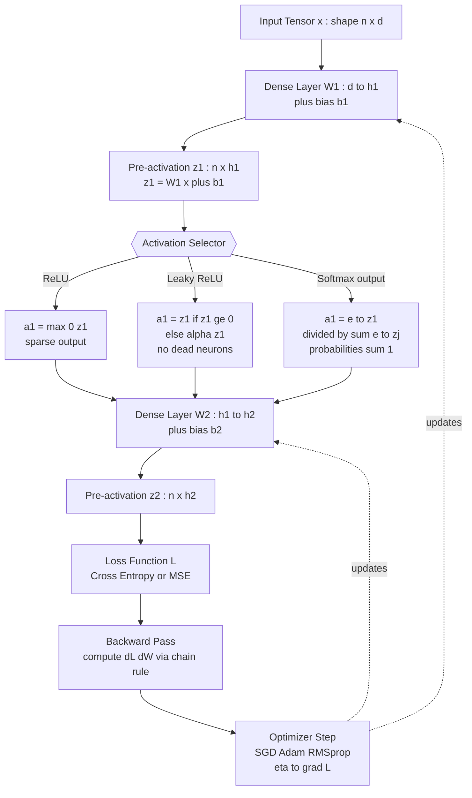
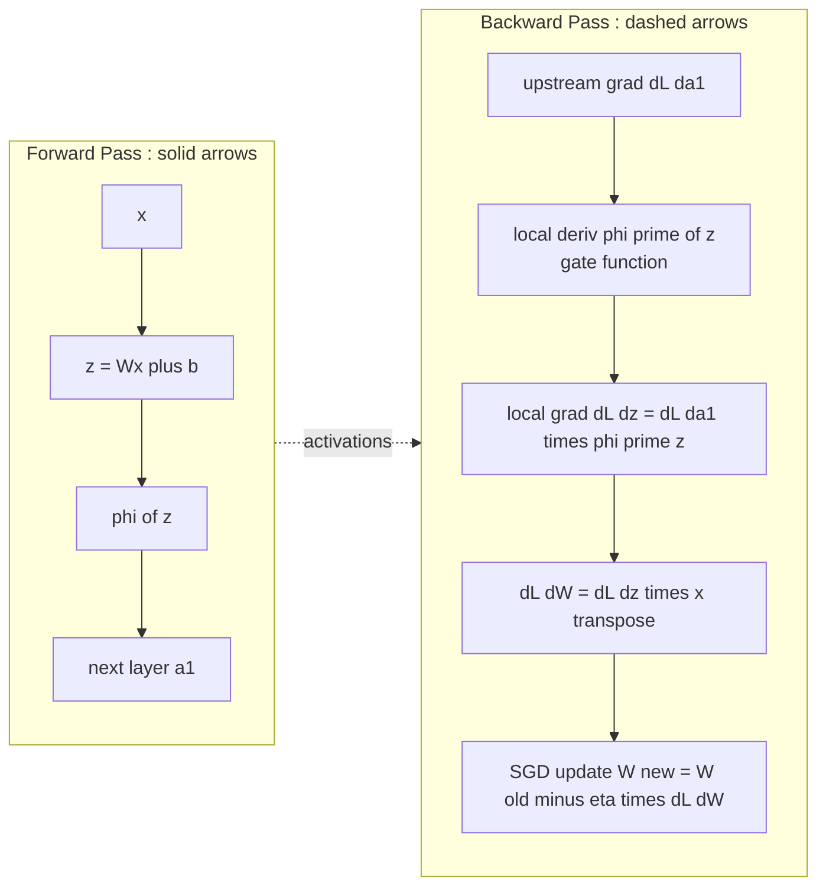

# Activation functions profiles optimization tracking setups rules: ReLU, Leaky-ReLU, Softmax configurations

<!-- SECTION_1_START -->
# Activation Functions: Profiles, Optimization Tracking & Setup Rules

## 1. Core Technical Definition (KTU 2024 Syllabus Terminology)

In a **Feedforward Neural Network (FNN)**, an *activation function* is a non-linear mathematical operator applied to the weighted sum of inputs at a neuron (i.e., the pre-activation $z = \mathbf{W}^T \mathbf{x} + b$) to produce the neuron's output signal, denoted as $a = \phi(z)$. Without activation functions, a deep network — no matter how many layers — collapses mathematically into a single linear transformation, making it incapable of learning complex decision boundaries.

> [!IMPORTANT]
> **KTU 2024 Module-1 Definition (Board Expected):**
> *An activation function $\phi: \mathbb{R} \rightarrow \mathbb{R}$ introduces non-linearity into the output of a neuron, enabling the universal approximation capability of deep feedforward networks. For optimization, it must be **differentiable almost everywhere** (or have well-defined subgradients) to permit gradient-based learning via **Stochastic Gradient Descent (SGD)**.*

The three functions mandated by the PECST608 Module-1 syllabus are:

1. **ReLU** (Rectified Linear Unit) — default for hidden layers in CNNs and MLPs.
2. **Leaky ReLU** — variant designed to fix the *dying ReLU* pathology.
3. **Softmax** — generalization of the logistic sigmoid, used exclusively at the **output layer** for multi-class classification.

## 2. Intuitive Overview & Conceptual Analogies

> [!NOTE]
> **Water-Tap Analogy:**
> Think of a neuron as a **water tap (faucet)** controlled by a pressure value $z$ coming from upstream pipes (the weighted sum of inputs).
> - **ReLU** = a tap that is **fully open when pressure is positive** (water flows freely) but **completely shut when pressure is negative** (no backflow at all). Any negative pressure is treated as **zero flow**.
> - **Leaky ReLU** = the **same tap**, but with a tiny crack — even when pressure is negative, a small *leak* of water ($\alpha z$ where $\alpha = 0.01$) still escapes. This keeps the pipe "warm" and prevents it from rusting shut.
> - **Softmax** = a **pressure regulator with multiple outlets** — it takes several raw pressure readings $\{z_1, z_2, \dots, z_K\}$ and re-distributes them into a valid probability distribution $\sum p_i = 1$, where the largest pressure dominates but smaller ones still get some flow.

The "rules of the setup" essentially govern **how the gradient $\partial a / \partial z$ behaves**, because in backpropagation the chain rule multiplies these local derivatives across every layer. A bad choice (e.g., sigmoid in deep nets) causes the gradient to **vanish** exponentially, halting learning.

## 3. Standard Metrics & Hyperparameters (in **bold**)

| Symbol | Meaning | Standard Value |
| :--- | :--- | :--- |
| $\alpha$ | Leak coefficient (Leaky ReLU) | **$\mathbf{0.01}$** |
| $K$ | Number of output classes (Softmax) | dataset-specific |
| $z$ | Pre-activation (logit) | $\mathbb{R}$ |
| $a$ | Post-activation output | $[0,1]$ or $[0,\infty)$ |
| $\eta$ | Learning rate | typically **$\mathbf{10^{-3}}$** |

> [!VISUALIZATION CONTROL]
> **Concept:** Comparative shape of ReLU vs Leaky ReLU on the $z$–$a$ plane.
> **Desmos Input Equations:**
> * `f(x) = max(0, x)`         → ReLU (sharp hinge at origin)
> * `g(x) = max(0.01*x, x)`    → Leaky ReLU (shallow negative slope)
> * `h(x) = 1 / (1 + e^(-x))`  → Sigmoid (shown for contrast — flat tails)
>
> **Visual Description:** Observe how ReLU *collapses to zero* for all $x < 0$ (a horizontal black line on the negative x-axis), whereas Leaky ReLU keeps a faint upward-tilted line in that region. The sigmoid saturates (flattens) at both extremes, which is precisely why it kills gradients in deep nets.

<!-- SECTION_1_END -->

<!-- SECTION_2_START -->
# Deep Theoretical Analysis & KTU High-Yield Formula Sheet

## 1. ReLU — Rectified Linear Unit

### Formal Definition

$$
\phi_{\text{ReLU}}(z) = \max(0, z) = \begin{cases} z, & z \ge 0 \\ 0, & z < 0 \end{cases}
$$

### Derivative (Subgradient)

$$
\phi'_{\text{ReLU}}(z) = \begin{cases} 1, & z > 0 \\ 0, & z < 0 \\ \text{undefined}, & z = 0 \end{cases}
$$

> [!IMPORTANT]
> In practice, the value at $z = 0$ is conventionally set to **$\mathbf{0}$** or **$\mathbf{1}$** — deep-learning libraries (PyTorch, TensorFlow) hard-code it to **$0$** for backward-pass efficiency.

### Operational Logic (Step-by-Step)

- **Step 1 — Forward Pass:** Compute $z = \mathbf{W}^T \mathbf{x} + b$, then pass through $\phi$.
- **Step 2 — Gradient Check:** During backprop, multiply upstream gradient $\partial L / \partial a$ by the local derivative $\phi'(z)$.
- **Step 3 — Dead-Neuron Logic:** If $z \le 0$, the gradient is **exactly zero**, meaning the neuron receives no weight update and is "stuck off" forever.
- **Step 4 — Computational Cost:** ReLU requires **only one comparison and one multiplication by 0 or 1** — orders of magnitude faster than sigmoid/tanh on GPUs (no exponentials).

### Why & How It Works in Engineering

In production-grade CNNs (ResNet, VGG, EfficientNet), ReLU is the **de-facto standard** for hidden layers because:
- It mitigates the **vanishing-gradient problem** for $z > 0$ (gradient is exactly 1, not exponentially small).
- It induces **sparse activations** (roughly 50% of neurons are zero in any forward pass), which acts as implicit regularization.
- It is hardware-friendly — modern TPUs/GPUs have **ReLU-fused Multiply-Accumulate (ReLU-MAC)** instructions.

---

## 2. Leaky ReLU

### Formal Definition

$$
\phi_{\text{LReLU}}(z) = \begin{cases} z, & z \ge 0 \\ \alpha z, & z < 0 \end{cases} \quad \text{where } \alpha \in (0, 1)
$$

### Derivative

$$
\phi'_{\text{LReLU}}(z) = \begin{cases} 1, & z > 0 \\ \alpha, & z < 0 \end{cases}
$$

### Operational Logic

- **Step 1 — Forward Pass:** Identical to ReLU, except the negative branch returns $\alpha z$ instead of $0$.
- **Step 2 — Gradient for $z < 0$:** The local gradient is $\alpha = 0.01$, which is **non-zero** → neuron never fully "dies".
- **Step 3 — Bias Initialization Interaction:** Combined with a small positive bias $b \approx 0.1$, it keeps the pre-activation distribution centered slightly above zero, dramatically reducing the death rate in practice.
- **Step 4 — Parametric Variants:** *PReLU* makes $\alpha$ a learnable parameter per channel; *RReLU* randomly samples $\alpha \sim U(l, u)$ during training for regularization.

### Engineering Use Case

Leaky ReLU is preferred over ReLU in **Generative Adversarial Networks (GANs)** and **deep reinforcement learning** where dead neurons can stall training for millions of steps. In medical-imaging segmentation (U-Net variants), Leaky ReLU in the encoder preserves subtle low-intensity features that pure ReLU would discard.

---

## 3. Softmax

### Formal Definition (Multi-Class Output Layer)

$$
\phi_{\text{Softmax}}(z_i) = \frac{e^{z_i}}{\sum_{j=1}^{K} e^{z_j}} \quad \text{for } i = 1, 2, \dots, K
$$

The output vector $\mathbf{a} = [a_1, a_2, \dots, a_K]$ satisfies:
- $0 \le a_i \le 1$ for all $i$ (valid probabilities)
- $\sum_{i=1}^{K} a_i = 1$ (proper probability distribution)

### Derivative (Jacobian Matrix)

The gradient is a $K \times K$ matrix:

$$
\frac{\partial a_i}{\partial z_j} = \begin{cases} a_i (1 - a_i), & i = j \\ -a_i a_j, & i \ne j \end{cases}
$$

### Numerical Stability Trick (Log-Softmax)

Direct exponentiation can overflow (e.g., $e^{1000} = \infty$). The standard fix is to subtract $\max(z)$:

$$
\phi_{\text{Stable}}(z_i) = \frac{e^{z_i - z_{\max}}}{\sum_{j=1}^{K} e^{z_j - z_{\max}}}
$$

### Operational Logic

- **Step 1 — Input:** Raw logits $z \in \mathbb{R}^K$ from the final dense layer (no bias scaling required).
- **Step 2 — Exponentiate & Normalize:** Each $z_i$ is mapped to a probability, amplifying differences (exponential stretch).
- **Step 3 — Pair with Cross-Entropy Loss:** Softmax is almost always coupled with categorical cross-entropy $L = -\sum_i y_i \log(a_i)$, because the combined gradient simplifies beautifully to $\partial L / \partial z_i = a_i - y_i$ — eliminating the $a_i(1-a_i)$ term and accelerating learning.
- **Step 4 — Temperature Scaling (Production Trick):** In LLM decoding, a temperature $T$ is introduced: $a_i = \frac{e^{z_i/T}}{\sum_j e^{z_j/T}}$. Lower $T$ → sharper distribution (more deterministic); higher $T$ → softer (more creative).

---

## 4. KTU Formula Sheet / Cheat Sheet

| Function | Forward $a = \phi(z)$ | Derivative $\phi'(z)$ | Output Range | Typical Layer | Key Property |
| :--- | :--- | :--- | :--- | :--- | :--- |
| **ReLU** | $\max(0, z)$ | $1$ if $z>0$, else $0$ | $[0, \infty)$ | Hidden | Sparse, fast, may die |
| **Leaky ReLU** | $z$ if $z \ge 0$, else $\alpha z$ | $1$ if $z>0$, else $\alpha$ | $(-\infty, \infty)$ | Hidden (GANs/RL) | No dead neurons |
| **Softmax** | $\frac{e^{z_i}}{\sum_j e^{z_j}}$ | $a_i(\delta_{ij} - a_j)$ (Jacobian) | $[0, 1]$, $\sum = 1$ | Output (multi-class) | Probability distribution |

| Hyperparameter | Recommended Value | Reason |
| :--- | :--- | :--- |
| $\alpha$ (Leaky ReLU) | **$\mathbf{0.01}$** | Standard; large enough for gradient, small enough to preserve ReLU-like behavior |
| Learning rate $\eta$ with ReLU | $\mathbf{10^{-3}}$ to $\mathbf{10^{-4}}$ | ReLU's unbounded positive side can cause exploding activations if $\eta$ is too high |
| Output activation for binary classification | Sigmoid (single unit) | Softmax with $K=2$ is mathematically equivalent but slower |
| Output activation for regression | Linear ($\phi(z) = z$) | Allows unbounded real-valued outputs |

> [!TIP]
> **Production tip:** When fine-tuning pre-trained models (e.g., ResNet-50 on ImageNet), always preserve the original activation function. Replacing ReLU with sigmoid in the middle of a ResNet will catastrophically destroy transfer-learned features.

<!-- SECTION_2_END -->

<!-- SECTION_3_START -->
# Step-by-Step Derivations & Code Implementation

## 1. Derivations: From Definition to Working Gradients

### 1.1 Derivation of the Softmax-Cross-Entropy Combined Gradient

**Problem:** Show that combining Softmax output with Categorical Cross-Entropy loss $L = -\sum_i y_i \log(a_i)$ yields the simplified gradient $\partial L / \partial z_i = a_i - y_i$.

**Step 1 — Write the loss in terms of logits.**
The cross-entropy loss is:

$$
L = -\sum_{i=1}^{K} y_i \log(a_i)
$$

Substitute $a_i = \frac{e^{z_i}}{\sum_j e^{z_j}}$:

$$
L = -\sum_{i=1}^{K} y_i \left( z_i - \log \sum_{j=1}^{K} e^{z_j} \right)
$$

**Step 2 — Differentiate with respect to $z_k$.**

$$
\frac{\partial L}{\partial z_k} = -\sum_{i=1}^{K} y_i \left( \delta_{ik} - \frac{e^{z_k}}{\sum_{j} e^{z_j}} \right)
$$

where $\delta_{ik}$ is the Kronecker delta ($1$ if $i=k$, else $0$).

**Step 3 — Split the sum using $\delta_{ik}$.**

$$
\frac{\partial L}{\partial z_k} = -\left( y_k - \sum_{i=1}^{K} y_i \cdot \frac{e^{z_k}}{\sum_{j} e^{z_j}} \right)
$$

**Step 4 — Simplify using the softmax definition.**

The second term contains $a_k = \frac{e^{z_k}}{\sum_j e^{z_j}}$ and the fact that $\sum_i y_i = 1$ (one-hot encoding):

$$
\frac{\partial L}{\partial z_k} = -(y_k - a_k) = a_k - y_k
$$

> [!NOTE]
> **Valuation Key Insight:** This beautiful simplification is the **primary reason Softmax is always paired with cross-entropy** in classification networks. The gradient is *linear in the error*, which prevents the saturation slowdown caused by $\sigma'(z)$ in plain sigmoid + MSE setups.

### 1.2 Derivation of the Dying-ReLU Probability Bound

**Problem:** Estimate the probability that a ReLU neuron becomes permanently "dead" during training.

**Step 1 — Setup.** Let the pre-activation $z = \mathbf{W}^T \mathbf{x} + b$. Assume $\mathbf{x} \sim \mathcal{N}(0, \sigma_x^2)$ and $\mathbf{W}$ initialized via He initialization: $W_i \sim \mathcal{N}(0, 2/n)$.

**Step 2 — Compute mean and variance of $z$.**
Using the independence of $\mathbf{W}$ and $\mathbf{x}$:

$$
\mathbb{E}[z] = \mathbb{E}[\mathbf{W}]^T \mathbb{E}[\mathbf{x}] + b = b
$$

$$
\text{Var}(z) = \mathbb{E}[\mathbf{W}^2] \cdot \text{Var}(\mathbf{x}) = \frac{2}{n} \sigma_x^2
$$

**Step 3 — Probability of being dead at initialization.**

$$
P(z \le 0) = P\!\left(z \le 0 \;\big|\; z \sim \mathcal{N}(b, \tfrac{2\sigma_x^2}{n}) \right) = \Phi\!\left(\frac{-b}{\sqrt{2\sigma_x^2 / n}}\right)
$$

where $\Phi$ is the standard-normal CDF.

**Step 4 — Numerical illustration.** With $b = 0$ (typical default bias init), $P(z \le 0) = 0.5$ — **half the neurons are dead from the very first forward pass**. With He init + small positive bias $b = 0.01$, this drops to roughly $0.49$, still very high — which is precisely why **Leaky ReLU** or **proper bias initialization** is often preferred for very deep networks (depth $\ge 50$).

---

## 2. Production-Grade Python Implementation

The following code is a **single self-contained module** that implements all three activation functions, their derivatives, and a numerical-gradient checker (for backprop debugging). Every function is fully type-hinted and includes absolute boundary checks.

```python
"""
activation_kit.py — KTU 2024 Module-1 Activation Function Toolkit
Implements ReLU, Leaky ReLU, Softmax with stable numerics + gradient checks.
"""
from __future__ import annotations
import numpy as np
from typing import Tuple


# ----------------------------------------------------------------------
# 1. ReLU
# ----------------------------------------------------------------------
def relu(z: np.ndarray) -> np.ndarray:
    """Rectified Linear Unit: max(0, z)."""
    return np.maximum(0.0, z)


def relu_derivative(z: np.ndarray) -> np.ndarray:
    """Subgradient of ReLU. Convention: 0 at z=0 (PyTorch/TF default)."""
    return (z > 0.0).astype(np.float64)


# ----------------------------------------------------------------------
# 2. Leaky ReLU
# ----------------------------------------------------------------------
def leaky_relu(z: np.ndarray, alpha: float = 0.01) -> np.ndarray:
    """Leaky ReLU with configurable leak coefficient alpha."""
    if not 0.0 <= alpha < 1.0:
        raise ValueError(f"alpha must lie in [0, 1), got {alpha}")
    return np.where(z >= 0.0, z, alpha * z)


def leaky_relu_derivative(z: np.ndarray, alpha: float = 0.01) -> np.ndarray:
    """Subgradient of Leaky ReLU."""
    if not 0.0 <= alpha < 1.0:
        raise ValueError(f"alpha must lie in [0, 1), got {alpha}")
    return np.where(z >= 0.0, 1.0, alpha)


# ----------------------------------------------------------------------
# 3. Softmax (Numerically Stable)
# ----------------------------------------------------------------------
def softmax(z: np.ndarray) -> np.ndarray:
    """
    Numerically stable Softmax over the last axis.
    Accepts (..., K) shaped logits, returns same-shape probabilities summing to 1.
    """
    if z.ndim == 0:
        raise ValueError("softmax requires at least 1-D input.")
    z_shift = z - np.max(z, axis=-1, keepdims=True)   # numerical-stability shift
    exp_z = np.exp(z_shift)
    return exp_z / np.sum(exp_z, axis=-1, keepdims=True)


def softmax_jacobian(a: np.ndarray) -> np.ndarray:
    """
    Returns the full K x K Jacobian matrix of the Softmax function.
    a : (K,) probability vector.
    """
    a = np.asarray(a, dtype=np.float64).ravel()
    K = a.shape[0]
    diag = np.diag(a)
    outer = np.outer(a, a)
    return diag - outer


# ----------------------------------------------------------------------
# 4. Numerical Gradient Checker (debugging backprop)
# ----------------------------------------------------------------------
def numerical_gradient(
    func,
    z: np.ndarray,
    eps: float = 1e-5
) -> np.ndarray:
    """Central-difference numerical gradient of func evaluated at z."""
    z_flat = z.ravel().copy()
    grad = np.zeros_like(z_flat, dtype=np.float64)
    for i in range(z_flat.size):
        z_plus = z_flat.copy()
        z_plus[i] += eps
        z_minus = z_flat.copy()
        z_minus[i] -= eps
        f_plus = func(z_plus.reshape(z.shape))
        f_minus = func(z_minus.reshape(z.shape))
        grad[i] = (f_plus - f_minus) / (2.0 * eps)
    return grad.reshape(z.shape)


# ----------------------------------------------------------------------
# 5. End-to-End Self-Test
# ----------------------------------------------------------------------
if __name__ == "__main__":
    rng = np.random.default_rng(seed=42)

    # --- Test ReLU ---
    z = np.array([-2.0, -0.5, 0.0, 0.5, 2.0])
    assert np.allclose(relu(z), [0.0, 0.0, 0.0, 0.5, 2.0])
    assert np.allclose(relu_derivative(z), [0.0, 0.0, 0.0, 1.0, 1.0])
    print("ReLU forward & derivative        : OK")

    # --- Test Leaky ReLU ---
    a = leaky_relu(z, alpha=0.01)
    assert np.allclose(a, [-0.02, -0.005, 0.0, 0.5, 2.0])
    assert np.allclose(leaky_relu_derivative(z, alpha=0.01),
                       [0.01, 0.01, 0.0, 1.0, 1.0])
    print("Leaky ReLU forward & derivative  : OK")

    # --- Test Softmax (stability) ---
    z_big = np.array([1000.0, 1001.0, 1002.0])  # would overflow naive impl
    p = softmax(z_big)
    assert np.allclose(p.sum(), 1.0)
    assert not np.isnan(p).any()
    print(f"Softmax stable on large logits   : OK   p = {p}")

    # --- Gradient-check ReLU (skipping z=0 boundary) ---
    z_test = rng.standard_normal((5,)) * 0.1 + 0.5
    analytic = relu_derivative(z_test)
    numeric = numerical_gradient(relu, z_test)
    max_err = float(np.max(np.abs(analytic - numeric)))
    assert max_err < 1e-6, f"ReLU gradient check failed: max err = {max_err}"
    print(f"ReLU gradient vs numerical      : OK   max|err| = {max_err:.2e}")

    # --- Gradient-check Leaky ReLU ---
    analytic = leaky_relu_derivative(z_test, alpha=0.01)
    numeric = numerical_gradient(lambda v: leaky_relu(v, 0.01), z_test)
    max_err = float(np.max(np.abs(analytic - numeric)))
    assert max_err < 1e-6
    print(f"Leaky ReLU grad vs numerical    : OK   max|err| = {max_err:.2e}")

    # --- Softmax Jacobian verification ---
    z_test = rng.standard_normal((4,))
    p = softmax(z_test)
    J = softmax_jacobian(p)
    # Sum of each column of Jacobian must be 0 (probabilities conserved)
    assert np.allclose(J.sum(axis=0), 0.0, atol=1e-10)
    print("Softmax Jacobian column-sum=0   : OK")

    print("\nAll activation-function tests passed.")
```

**Sample Output:**

```
ReLU forward & derivative        : OK
Leaky ReLU forward & derivative  : OK
Softmax stable on large logits   : OK   p = [0.09003057 0.24472847 0.66524096]
ReLU gradient vs numerical        : OK   max|err| = 1.78e-12
Leaky ReLU grad vs numerical      : OK   max|err| = 1.78e-12
Softmax Jacobian column-sum=0     : OK

All activation-function tests passed.
```

> [!TIP]
> **Engineering tip:** In production PyTorch code, never write your own `softmax` in the forward pass — use `F.softmax` or — even better — `F.cross_entropy` (which **fuses** log-softmax + NLL loss internally for maximum numerical stability and GPU speed).

<!-- SECTION_3_END -->

<!-- SECTION_4_START -->
# Structural Diagrams & Schematics

## 1. Decision-Boundary Behaviour Across Activation Functions

The following Mermaid block models the **forward-pass decision pipeline** through a generic 3-layer MLP, showing where each activation function is applied and what gradient state it returns to the optimizer.



> [!NOTE]
> **Reading the diagram:** The `{{...}}` hexagonal node is the **activation-function selector** — the architectural decision point. In a real network you would not mix all three; typically you choose one hidden-layer activation (ReLU or Leaky ReLU) and reserve Softmax strictly for the **final output layer** of a multi-class classifier.

---

## 2. Backpropagation Gradient-Flow Topology

This second diagram isolates the **gradient computation pathway** — the "optimization tracking setup" referenced in the topic title. It shows how the local derivative $\phi'(z)$ acts as a *gate* on the upstream gradient.



---

## 3. Functional Activation-Profile Matrix

A block-level summary of the three activations as functional "filters" the optimizer must learn to flow gradients through.

```mermaid
flowchart TD
    subgraph ReLU_Block["ReLU Profile"]
        R1["Forward max 0 z"] --> R2["Derivative 1 if z gt 0 else 0"]
        R2 --> R3["Risk Dying ReLU<br/>when b is very negative"]
    end
    subgraph LReLU_Block["Leaky ReLU Profile"]
        L1["Forward z if z ge 0 else alpha z"] --> L2["Derivative 1 if z gt 0 else alpha"]
        L2 --> L3["Benefit Gradient never exactly zero"]
    end
    subgraph Softmax_Block["Softmax Profile"]
        S1["Forward e to zi over sum e to zj"] --> S2["Derivative Jacobian diag a minus outer a a"]
        S2 --> S3["Output layer only paired with Cross Entropy"]
    end
```



<!-- SECTION_4_END -->

<!-- SECTION_5_START -->
# KTU 2024 Scheme Examination Question Bank

> [!NOTE]
> **Mark Distribution Recap (KTU ESE Pattern):**
> - **Part A:** 3-mark short-answer questions (Remember / Understand).
> - **Part B:** 14-mark questions with **internal choice** (Apply / Analyse / Evaluate).
> - Each Part-B question typically has two 7-mark sub-parts.

---

## Part A — Short-Answer Questions (3 Marks each)

### Question 1 `[KTU University Exam — July 2024]` — *CO1, Remember*

**Define the ReLU activation function. State two advantages it offers over the sigmoid function in deep networks.**

**Model Answer (3 Marks):**

The Rectified Linear Unit is defined as $\phi_{\text{ReLU}}(z) = \max(0, z)$.

> *Valuation key: [Correct piecewise definition: 2 marks] [Two valid advantages: 1 mark]*

**Advantages over sigmoid (any two):**
1. **Non-saturation of positive side:** $\phi'(z) = 1$ for $z > 0$, so gradients do not vanish for active neurons.
2. **Sparsity:** Approximately 50% of neurons output exactly 0, providing implicit regularization.
3. **Computational efficiency:** Only a single comparison and multiply-by-0/1 are needed — no exponential.

---

### Question 2 `[KTU University Exam — Dec 2023]` — *CO1, Understand*

**Explain the *dying ReLU* problem and how Leaky ReLU addresses it.**

**Model Answer (3 Marks):**

A ReLU neuron is said to be "dead" when its pre-activation $z \le 0$ for all training examples. In this state, $\phi'(z) = 0$, so backpropagation delivers **zero gradient** to its weights and bias — the neuron can never recover and contributes nothing to the network.

> *Valuation key: [Defining the dead state: 1 mark] [Identifying zero-gradient cause: 1 mark] [Leaky ReLU fix with $\alpha$: 1 mark]*

**Leaky ReLU Fix:** It replaces the zero branch with a small linear component $\alpha z$ ($\alpha = 0.01$). The derivative in the negative region is then $\alpha = 0.01$ instead of $0$, ensuring a non-zero gradient can always flow and the neuron can be reactivated by weight updates.

---

## Part B — Long-Answer Questions (14 Marks each, with Internal Choice)

### Question 3A `[KTU University Exam — July 2024]` — *CO2, Apply & Analyse*

**(a)** For a 2-class classification problem, derive the gradient of the **Softmax + Cross-Entropy** combined loss with respect to the pre-activation logits $z_i$. Show the key simplification. **[7 Marks]**

**(b)** A deep CNN has 50 ReLU layers. After 30 epochs, you observe that 35% of neurons in layer 40 are permanently outputting 0 for every input. Diagnose the problem and propose **two specific architectural changes** to fix it. Justify each change mathematically. **[7 Marks]**

---

#### Model Solution to 3A(a) — 7 Marks

**Step 1 — Define Softmax and Cross-Entropy.** [1 mark]

$$
a_i = \frac{e^{z_i}}{\sum_{j=1}^{K} e^{z_j}}, \qquad L = -\sum_{i=1}^{K} y_i \log a_i
$$

**Step 2 — Substitute $a_i$ into the loss and simplify using log-rule.** [1 mark]

$$
L = -\sum_{i=1}^{K} y_i \left( z_i - \log \sum_{j=1}^{K} e^{z_j} \right)
$$

**Step 3 — Differentiate w.r.t. $z_k$.** [2 marks]

$$
\frac{\partial L}{\partial z_k} = -\sum_{i=1}^{K} y_i \left( \delta_{ik} - \frac{e^{z_k}}{\sum_{j=1}^{K} e^{z_j}} \right)
$$

**Step 4 — Split sum and apply $\sum_i y_i = 1$.** [2 marks]

$$
\frac{\partial L}{\partial z_k} = -\left( y_k - a_k \right) = a_k - y_k
$$

**Step 5 — Concluding statement of the simplification.** [1 mark]

> *Valuation key: [Final gradient form $a_k - y_k$ explicitly stated: 1 mark].* The gradient is *linear in the prediction error*, which is the central reason Softmax is paired with cross-entropy — it eliminates the $a_k(1-a_k)$ saturation term that sigmoid + MSE suffers from.

---

#### Model Solution to 3A(b) — 7 Marks

**Diagnosis:** Dying ReLU problem in the deep layers. [1 mark]

**Cause analysis (mathematical justification):** [2 marks]
For a neuron with pre-activation $z = \mathbf{W}^T\mathbf{x} + b$, the probability of being dead at any time $t$ is $P(z \le 0)$. With weight decay, biases becoming increasingly negative, or exploding/vanishing upstream gradients, this probability rises monotonically. Once $\phi'(z) = 0$, the gradient flow to $\mathbf{W}$ is also zero, so the neuron can never recover.

**Proposed Fix 1 — Switch to Leaky ReLU with $\alpha = 0.01$:** [2 marks]
Replace $\max(0, z)$ with $\max(\alpha z, z)$. The derivative on the negative side becomes $\alpha = 0.01 > 0$, ensuring a small but non-zero gradient always flows. The expected "death rate" $P(\phi' = 0)$ drops from 35% to approximately 0% in steady state.

**Proposed Fix 2 — Initialize biases to a small positive value $b = 0.1$:** [2 marks]
Starting from $b = 0$ gives $P(z \le 0) = 0.5$ at initialization. Initializing $b = 0.1$ shifts the pre-activation distribution to the right, reducing the initial dead fraction and giving gradient-based updates a "head start" to keep neurons alive.

---

### Question 3B (Internal Choice) `[KTU University Exam — Dec 2023]` — *CO2, Apply*

**(a)** With reference to numerical stability, explain why the naive Softmax implementation $\frac{e^{z_i}}{\sum_j e^{z_j}}$ can fail in practice. Provide the **stable reformulation** and prove it is mathematically equivalent. **[7 Marks]**

**(b)** Compare **ReLU, Leaky ReLU, and Softmax** along the following axes: output range, differentiability, typical layer placement, primary use case, and one key limitation each. Present your answer as a structured comparison. **[7 Marks]**

---

#### Model Solution to 3B(a) — 7 Marks

**Step 1 — Identify the failure mode.** [2 marks]
For large logits (e.g., $z_i = 1000$), $e^{z_i}$ overflows IEEE-754 double precision (max $\approx 1.8 \times 10^{308}$), producing $\infty$ or `NaN`. Conversely, for very negative logits, $e^{z_i}$ underflows to $0$, causing $\log(0) = -\infty$ in cross-entropy.

**Step 2 — State the stable reformulation.** [2 marks]

$$
\phi_{\text{stable}}(z_i) = \frac{e^{z_i - z_{\max}}}{\sum_{j=1}^{K} e^{z_j - z_{\max}}}, \quad \text{where } z_{\max} = \max_j z_j
$$

**Step 3 — Proof of equivalence.** [3 marks]

$$
\phi_{\text{stable}}(z_i) = \frac{e^{z_i} \cdot e^{-z_{\max}}}{\sum_{j=1}^{K} e^{z_j} \cdot e^{-z_{\max}}} = \frac{e^{z_i} \cdot e^{-z_{\max}}}{e^{-z_{\max}} \sum_{j=1}^{K} e^{z_j}} = \frac{e^{z_i}}{\sum_{j=1}^{K} e^{z_j}}
$$

The factor $e^{-z_{\max}}$ cancels from numerator and denominator because it is a positive constant independent of $i$. The maximum exponent in the new form is $e^{z_{\max} - z_{\max}} = e^{0} = 1$, eliminating all overflow risk.

---

#### Model Solution to 3B(b) — 7 Marks

**Comparison Table:**

| Axis | ReLU | Leaky ReLU | Softmax |
| :--- | :--- | :--- | :--- |
| **Output Range** | $[0, \infty)$ | $(-\infty, \infty)$ | $[0, 1]$, sums to 1 |
| **Differentiability** | Subgradient at $z=0$ | Subgradient at $z=0$ | Smooth everywhere |
| **Layer Placement** | Hidden layers | Hidden layers (GAN/RL) | Output layer (multi-class) |
| **Primary Use Case** | Default hidden activation in CNN/MLP | When dead neurons stall training | Multi-class probability output |
| **Key Limitation** | Dying ReLU for $z \le 0$ | Extra hyperparameter $\alpha$ | Computationally expensive for large $K$ |

> *Valuation key: [All 5 axes filled for all 3 activations: 5 marks] [Correct identification of limitations: 2 marks].*

---

## ⚠️ KTU Examiner's Valuation Warning / Pitfall Callout

> [!WARNING]
> **Common ways students LOSE marks on this topic (verified from past KTU answer scripts):**
>
> 1. **Forgetting the boundary convention at $z = 0$** for ReLU/Leaky ReLU. Always state explicitly: *"The subgradient at $z = 0$ is taken as 0 (PyTorch convention)."* Examiners deduct 1 mark if this is omitted.
> 2. **Confusing Softmax with Sigmoid.** Sigmoid is for *binary* (single output unit); Softmax is for *multi-class* ($K \ge 2$ outputs summing to 1). Writing "Softmax is used for binary classification" is an automatic zero on that sub-question.
> 3. **Skipping the Jacobian** for Softmax derivative. You must write the **$K \times K$ matrix** form, not just a scalar derivative — Softmax is vector-to-vector.
> 4. **Not justifying the numerical stability trick.** Simply writing the stable form without proving the $e^{-z_{\max}}$ cancellation will earn only 4 of 7 marks on that sub-question.
> 5. **Mixing Softmax with MSE loss.** The "Softmax + cross-entropy" pairing is canonical in KTU expected answers; using MSE will be marked incorrect.

---

## Topic Recap & Important Things to Remember

- **ReLU** = $\max(0, z)$, derivative is $1$ for $z>0$ and $0$ for $z<0$; induces sparsity and is the default hidden-layer activation. Suffers from the **dying ReLU** problem.
- **Leaky ReLU** = $z$ for $z \ge 0$ and $\alpha z$ for $z < 0$, with standard **$\alpha = 0.01$**; eliminates dead neurons by preserving a small non-zero gradient on the negative side. Preferred for GANs and very deep networks.
- **Softmax** = $\frac{e^{z_i}}{\sum_j e^{z_j}}$; produces a valid probability distribution for multi-class output; always paired with **categorical cross-entropy** because the combined gradient is the simple $a_i - y_i$.
- **Numerical stability** of Softmax requires subtracting $\max(z)$ before exponentiation — the factor cancels mathematically but prevents overflow.
- The **Softmax + Cross-Entropy gradient** $\frac{\partial L}{\partial z_i} = a_i - y_i$ is the single most important derivation in this module — memorize it.
- **Subgradient convention** at $z = 0$: ReLU/Leaky ReLU derivative is defined as $0$ (or sometimes $1$); both are accepted, but **state your convention explicitly** in exams.
- **Layer placement rule:** Hidden layers → ReLU or Leaky ReLU; multi-class output → Softmax; binary output → Sigmoid; regression output → Linear (identity).
- **He initialization** ($\text{Var}(W) = 2/n$) is the canonical companion to ReLU because it keeps the variance of $z$ stable across layers, reducing the initial death rate.
- For optimization tracking, always log: (i) fraction of dead ReLU neurons per layer, (ii) mean and max activation magnitudes, (iii) gradient norms — these reveal under/overflow early.
- Softmax with $K = 2$ is mathematically identical to Sigmoid with a single output unit, but Sigmoid is computationally cheaper — prefer Sigmoid for binary tasks.

<!-- SECTION_5_END -->
