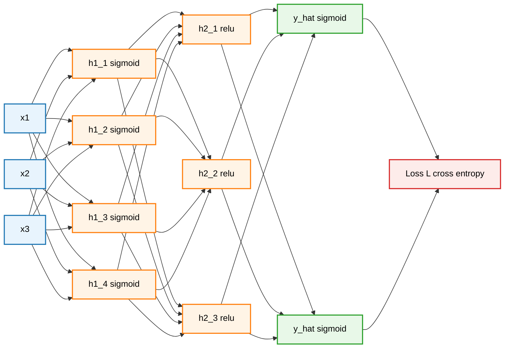
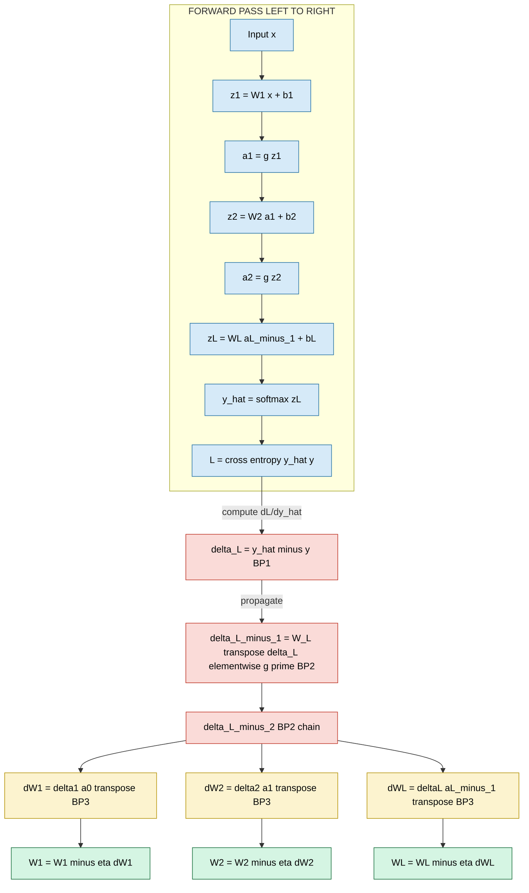
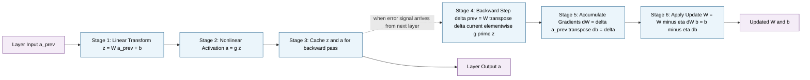
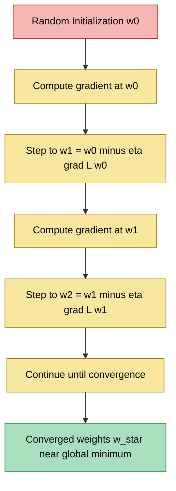

# Multilayer perceptrons error backpropagation calculus analysis formulations rules

<!-- SECTION_1_START -->

# Multilayer Perceptrons & Error Backpropagation

## Formal Definition (KTU 2024 Syllabus Terminology)

A **Multilayer Perceptron (MLP)** is a fully-connected feedforward artificial neural network composed of an input layer, one or more hidden layers, and an output layer, where every neuron in one layer is connected to every neuron in the subsequent layer via weighted synapses. Each neuron applies a weighted sum followed by a nonlinear **activation function**.

**Error Backpropagation** is a supervised learning algorithm that uses the **chain rule of calculus** to efficiently compute the gradient of a loss function with respect to every weight in the network by propagating the error signal **backward** from the output layer to the input layer. It is the cornerstone optimization engine of deep learning.

> [!IMPORTANT]
> **KTU 2024 Syllabus Highlight (PECST608 / Module 1):**
> Students must be able to (i) derive the backpropagation equations for arbitrary layered networks, (ii) write the explicit weight-update rules, and (iii) justify each term mathematically using partial derivatives.

## Intuitive Analogy: "The Blame Game"

Imagine a company of workers (neurons) arranged in a hierarchy. The CEO (output) makes a final decision that turns out to be wrong. The CEO cannot fix every worker directly, so he shouts the **magnitude of the mistake** back down the chain. Each manager (hidden neuron) receives a fraction of the blame proportional to how much he contributed to the bad decision, then passes the remaining blame further down. Each worker, upon learning his share of the responsibility, adjusts his personal influence (**weight**) to reduce future errors. This is precisely what backpropagation does — it distributes responsibility (gradient) for an error across every weight in proportion to that weight's causal contribution.

> [!NOTE]
> **Geometric Intuition:** The loss function $L(\mathbf{W})$ defines a high-dimensional error surface over the weight space. Backpropagation computes the **negative gradient** $-\nabla_{\mathbf{W}} L$ — the direction of steepest descent — and takes a small step in that direction (gradient descent).

## Physical & Mathematical Constants in This Topic

- **Learning rate** $\eta \in (0, 1)$ — typically $10^{-3}$ to $10^{-1}$.
- **Momentum coefficient** $\mu \in [0, 1)$ — typically $0.9$.
- **Weight initialization standard deviation** (Xavier/Glorot): $\sigma = \sqrt{\tfrac{2}{n_{in} + n_{out}}}$.
- **Universal approximation theorem:** a single hidden layer with a finite number of neurons can approximate any continuous function on a compact domain to arbitrary precision (Cybenko, 1989).

> [!VISUALIZATION CONTROL]
> **Concept:** Decision boundaries and loss surface geometry.
> **GeoGebra / Desmos Input Equations:**
> * `f(x) = sin(2*x) + 0.3*cos(5*x)` — true target function.
> * `g(x) = 0.5*tanh(2*x - 1) + 0.3*sin(3*x)` — MLP approximation.
> * `L(w) = (w - 2)^2 + 0.1*sin(5*w)` — non-convex 1-D loss surface.
> **Visual Description:** Plot the true function vs the MLP's piecewise-smooth fit; observe how the loss surface has multiple local minima, illustrating why gradient-based optimization is non-trivial.

<!-- SECTION_1_END -->

<!-- SECTION_2_START -->

# Deep Theoretical Analysis & KTU High-Yield Formula Sheet

## Architectural Components of an MLP

- **Layer $\ell$** contains $n^{[\ell]}$ neurons, $\ell = 0, 1, \ldots, L$ where $\ell = 0$ is the input layer and $\ell = L$ is the output layer.
- **Weight matrix** $\mathbf{W}^{[\ell]} \in \mathbb{R}^{n^{[\ell]} \times n^{[\ell-1]}}$ connects layer $\ell-1$ to layer $\ell$.
- **Bias vector** $\mathbf{b}^{[\ell]} \in \mathbb{R}^{n^{[\ell]}}$.
- **Pre-activation** $z_i^{[\ell]} = \sum_{j} W_{ij}^{[\ell]} a_j^{[\ell-1]} + b_i^{[\ell]}$.
- **Activation** $a_i^{[\ell]} = g^{[\ell]}(z_i^{[\ell]})$.

## The Feedforward Phase

For a single training example $(\mathbf{x}, \mathbf{y})$:

$$
\begin{aligned}
\mathbf{a}^{[0]} &= \mathbf{x} \\
\mathbf{z}^{[\ell]} &= \mathbf{W}^{[\ell]} \mathbf{a}^{[\ell-1]} + \mathbf{b}^{[\ell]} \\
\mathbf{a}^{[\ell]} &= g^{[\ell]}\!\left(\mathbf{z}^{[\ell]}\right) \\
\hat{\mathbf{y}} &= \mathbf{a}^{[L]}
\end{aligned}
$$

## Common Activation Functions

| Function | Definition | Derivative $g'(z)$ | Range | Use Case |
|----------|-----------|---------------------|-------|----------|
| Sigmoid | $\sigma(z) = \frac{1}{1+e^{-z}}$ | $\sigma(z)(1-\sigma(z))$ | $(0,1)$ | Output (binary) |
| Tanh | $\tanh(z)$ | $1 - \tanh^2(z)$ | $(-1,1)$ | Hidden |
| ReLU | $\max(0,z)$ | $\mathbb{1}_{z>0}$ | $[0,\infty)$ | Hidden (default) |
| Leaky ReLU | $\max(\alpha z, z)$ | $\mathbb{1}_{z>0} + \alpha \mathbb{1}_{z\le 0}$ | $(-\infty,\infty)$ | Avoid dying ReLU |
| Softmax | $\frac{e^{z_i}}{\sum_j e^{z_j}}$ | $S_i(\delta_{ij} - S_j)$ | $(0,1)$, sums to 1 | Output (multiclass) |

## Common Loss Functions

| Loss | Formula | Derivative w.r.t. output $\hat{y}$ |
|------|---------|-----------------------------------|
| MSE (Regression) | $L = \frac{1}{2}\sum_i (y_i - \hat{y}_i)^2$ | $- (y_i - \hat{y}_i)$ |
| Binary Cross-Entropy | $L = -[y \log \hat{y} + (1-y)\log(1-\hat{y})]$ | $-\frac{y - \hat{y}}{\hat{y}(1-\hat{y})}$ |
| Categorical Cross-Entropy (with softmax) | $L = -\sum_i y_i \log \hat{y}_i$ | $\hat{y}_i - y_i$ |

## The Four Fundamental Backpropagation Equations (KTU High-Yield)

Define the **error term** (a.k.a. *delta* or *sensitivity*) of neuron $i$ in layer $\ell$:

$$
\delta_i^{[\ell]} \equiv \frac{\partial L}{\partial z_i^{[\ell]}}
$$

> [!IMPORTANT]
> **Equation BP1 — Output layer error:**
> $$
> \boldsymbol{\delta}^{[L]} = \nabla_{\hat{\mathbf{y}}} L \;\odot\; g'^{[L]}(\mathbf{z}^{[L]})
> $$
> **Equation BP2 — Backpropagate the error:**
> $$
> \boldsymbol{\delta}^{[\ell]} = \left(\mathbf{W}^{[\ell+1]}\right)^{\!\top} \boldsymbol{\delta}^{[\ell+1]} \;\odot\; g'^{[\ell]}(\mathbf{z}^{[\ell]})
> $$
> **Equation BP3 — Gradient w.r.t. weights:**
> $$
> \frac{\partial L}{\partial \mathbf{W}^{[\ell]}} = \boldsymbol{\delta}^{[\ell]} \left(\mathbf{a}^{[\ell-1]}\right)^{\!\top}
> $$
> **Equation BP4 — Gradient w.r.t. biases:**
> $$
> \frac{\partial L}{\partial \mathbf{b}^{[\ell]}} = \boldsymbol{\delta}^{[\ell]}
> $$

## Weight Update Rule (Gradient Descent)

$$
\begin{aligned}
\mathbf{W}^{[\ell]} &\leftarrow \mathbf{W}^{[\ell]} - \eta \frac{\partial L}{\partial \mathbf{W}^{[\ell]}} \\
\mathbf{b}^{[\ell]} &\leftarrow \mathbf{b}^{[\ell]} - \eta \frac{\partial L}{\partial \mathbf{b}^{[\ell]}}
\end{aligned}
$$

## Variants of Gradient Descent

| Variant | Update Rule | Batch Size | Property |
|---------|-------------|------------|----------|
| Batch GD | $\mathbf{W} \leftarrow \mathbf{W} - \eta \nabla_{\mathbf{W}} L_{\text{full}}$ | $N$ | Stable, slow |
| Stochastic GD (SGD) | uses single example | $1$ | Noisy, fast escape from local minima |
| Mini-batch GD | uses batch of $m$ | $32, 64, 128$ | Standard practice |
| SGD with Momentum | $\mathbf{v} \leftarrow \mu \mathbf{v} + \eta \nabla L$; $\mathbf{W} \leftarrow \mathbf{W} - \mathbf{v}$ | mini-batch | Accelerates in ravines |

## Why This Matters in Industry

Backpropagation is the **training engine** of nearly every production deep learning system: image classifiers (ResNet), large language models (Transformer blocks), speech recognition (RNN/LSTM), recommendation engines, and reinforcement-learning policies. Variants like **Adam**, **RMSProp**, and **AdaGrad** are all derived from the same chain-rule-based gradient computation that we derive below.

<!-- SECTION_2_END -->

<!-- SECTION_3_START -->

# Step-by-Step Derivations & Code Implementation

## Derivation 1: BP1 — Output Layer Error Term

We want $\delta_i^{[L]} = \dfrac{\partial L}{\partial z_i^{[L]}}$. Apply the **chain rule**:

$$
\delta_i^{[L]} \;=\; \frac{\partial L}{\partial z_i^{[L]}} \;=\; \frac{\partial L}{\partial a_i^{[L]}} \cdot \frac{\partial a_i^{[L]}}{\partial z_i^{[L]}}
$$

Since $a_i^{[L]} = g^{[L]}(z_i^{[L]})$, we have $\dfrac{\partial a_i^{[L]}}{\partial z_i^{[L]}} = g'^{[L]}(z_i^{[L]})$. Therefore:

$$
\delta_i^{[L]} = \frac{\partial L}{\partial a_i^{[L]}} \cdot g'^{[L]}(z_i^{[L]})
$$

In vector form (with elementwise product $\odot$):

$$
\boldsymbol{\delta}^{[L]} = \nabla_{\mathbf{a}^{[L]}} L \;\odot\; g'^{[L]}(\mathbf{z}^{[L]})
$$

## Derivation 2: BP2 — Hidden Layer Error Term (The Backward Step)

For a hidden neuron $i$ in layer $\ell$, $z_i^{[\ell]}$ influences $L$ only through $z_k^{[\ell+1]}$ for every $k$. Apply the **multivariate chain rule**:

$$
\delta_i^{[\ell]} = \frac{\partial L}{\partial z_i^{[\ell]}} = \sum_{k} \frac{\partial L}{\partial z_k^{[\ell+1]}} \cdot \frac{\partial z_k^{[\ell+1]}}{\partial z_i^{[\ell]}}
$$

Now $z_k^{[\ell+1]} = \sum_j W_{kj}^{[\ell+1]} a_j^{[\ell]} + b_k^{[\ell+1]} = \sum_j W_{kj}^{[\ell+1]} g^{[\ell]}(z_j^{[\ell]}) + b_k^{[\ell+1]}$.

Therefore:

$$
\frac{\partial z_k^{[\ell+1]}}{\partial z_i^{[\ell]}} = W_{ki}^{[\ell+1]} \cdot g'^{[\ell]}(z_i^{[\ell]})
$$

Substitute back:

$$
\delta_i^{[\ell]} = \sum_{k} \delta_k^{[\ell+1]} \cdot W_{ki}^{[\ell+1]} \cdot g'^{[\ell]}(z_i^{[\ell]})
$$

In vector form:

$$
\boldsymbol{\delta}^{[\ell]} = \left(\mathbf{W}^{[\ell+1]}\right)^{\!\top} \boldsymbol{\delta}^{[\ell+1]} \;\odot\; g'^{[\ell]}(\mathbf{z}^{[\ell]})
$$

## Derivation 3: BP3 — Gradient with Respect to Weights

For weight $W_{ij}^{[\ell]}$ connecting neuron $j$ in layer $\ell-1$ to neuron $i$ in layer $\ell$:

$$
\frac{\partial L}{\partial W_{ij}^{[\ell]}} = \frac{\partial L}{\partial z_i^{[\ell]}} \cdot \frac{\partial z_i^{[\ell]}}{\partial W_{ij}^{[\ell]}}
$$

Since $z_i^{[\ell]} = \sum_j W_{ij}^{[\ell]} a_j^{[\ell-1]} + b_i^{[\ell]}$, we have $\dfrac{\partial z_i^{[\ell]}}{\partial W_{ij}^{[\ell]}} = a_j^{[\ell-1]}$.

Therefore:

$$
\frac{\partial L}{\partial W_{ij}^{[\ell]}} = \delta_i^{[\ell]} \cdot a_j^{[\ell-1]}
$$

In matrix form:

$$
\frac{\partial L}{\partial \mathbf{W}^{[\ell]}} = \boldsymbol{\delta}^{[\ell]} \left(\mathbf{a}^{[\ell-1]}\right)^{\!\top}
$$

## Derivation 4: BP4 — Gradient with Respect to Biases

Since $\dfrac{\partial z_i^{[\ell]}}{\partial b_i^{[\ell]}} = 1$:

$$
\frac{\partial L}{\partial b_i^{[\ell]}} = \delta_i^{[\ell]}
$$

## Worked Numerical Example (KTU Board Standard)

Consider a 2-2-1 MLP with sigmoid activations and MSE loss. One training example has $\mathbf{x} = (1, 0)^\top$, $y = 1$.

**Initial parameters:**

$$
\mathbf{W}^{[1]} = \begin{pmatrix} 0.1 & 0.2 \\ 0.3 & 0.4 \end{pmatrix}, \quad
\mathbf{b}^{[1]} = \begin{pmatrix} 0.1 \\ 0.2 \end{pmatrix}, \quad
\mathbf{W}^{[2]} = \begin{pmatrix} 0.5 & 0.6 \end{pmatrix}, \quad
\mathbf{b}^{[2]} = 0.3
$$

**Step 1 — Forward pass, layer 1:**

$$
\mathbf{z}^{[1]} = \mathbf{W}^{[1]} \mathbf{x} + \mathbf{b}^{[1]} = \begin{pmatrix} 0.1\cdot 1 + 0.2\cdot 0 + 0.1 \\ 0.3\cdot 1 + 0.4\cdot 0 + 0.2 \end{pmatrix} = \begin{pmatrix} 0.2 \\ 0.5 \end{pmatrix}
$$

**Step 2 — Apply sigmoid to layer 1:**

$$
\mathbf{a}^{[1]} = \sigma(\mathbf{z}^{[1]}) = \begin{pmatrix} \tfrac{1}{1+e^{-0.2}} \\ \tfrac{1}{1+e^{-0.5}} \end{pmatrix} = \begin{pmatrix} 0.5498 \\ 0.6225 \end{pmatrix}
$$

**Step 3 — Forward pass, output layer:**

$$
z^{[2]} = \mathbf{W}^{[2]} \mathbf{a}^{[1]} + b^{[2]} = (0.5)(0.5498) + (0.6)(0.6225) + 0.3 = 0.2749 + 0.3735 + 0.3 = 0.9484
$$

$$
a^{[2]} = \hat{y} = \sigma(0.9484) = \frac{1}{1 + e^{-0.9484}} = 0.7208
$$

**Step 4 — Compute loss (MSE half):**

$$
L = \tfrac{1}{2}(y - \hat{y})^2 = \tfrac{1}{2}(1 - 0.7208)^2 = \tfrac{1}{2}(0.2792)^2 = 0.0390
$$

**Step 5 — BP1 (output error):**

$$
\delta^{[2]} = (\hat{y} - y) \cdot \sigma'(z^{[2]})
$$

We have $\sigma'(z) = \sigma(z)(1-\sigma(z)) = 0.7208 \cdot 0.2792 = 0.2013$.

$$
\delta^{[2]} = (0.7208 - 1)(0.2013) = (-0.2792)(0.2013) = -0.0562
$$

**Step 6 — BP2 (hidden error):**

$$
\boldsymbol{\delta}^{[1]} = (\mathbf{W}^{[2]})^\top \delta^{[2]} \odot \sigma'(\mathbf{z}^{[1]})
$$

First, $\sigma'(\mathbf{z}^{[1]}) = \mathbf{a}^{[1]} \odot (1 - \mathbf{a}^{[1]}) = (0.5498 \cdot 0.4502,\; 0.6225 \cdot 0.3775) = (0.2475,\; 0.2351)$.

$$
\boldsymbol{\delta}^{[1]} = \begin{pmatrix} 0.5 \\ 0.6 \end{pmatrix} (-0.0562) \odot \begin{pmatrix} 0.2475 \\ 0.2351 \end{pmatrix} = \begin{pmatrix} -0.0281 \\ -0.0337 \end{pmatrix} \odot \begin{pmatrix} 0.2475 \\ 0.2351 \end{pmatrix} = \begin{pmatrix} -0.00696 \\ -0.00793 \end{pmatrix}
$$

**Step 7 — BP3 (weight gradients):**

$$
\frac{\partial L}{\partial \mathbf{W}^{[2]}} = \delta^{[2]} (\mathbf{a}^{[1]})^\top = (-0.0562)(0.5498,\; 0.6225) = (-0.0309,\; -0.0350)
$$

$$
\frac{\partial L}{\partial \mathbf{b}^{[2]}} = \delta^{[2]} = -0.0562
$$

$$
\frac{\partial L}{\partial \mathbf{W}^{[1]}} = \boldsymbol{\delta}^{[1]} (\mathbf{a}^{[0]})^\top = \begin{pmatrix} -0.00696 \\ -0.00793 \end{pmatrix} (1,\; 0) = \begin{pmatrix} -0.00696 & 0 \\ -0.00793 & 0 \end{pmatrix}
$$

$$
\frac{\partial L}{\partial \mathbf{b}^{[1]}} = \boldsymbol{\delta}^{[1]} = \begin{pmatrix} -0.00696 \\ -0.00793 \end{pmatrix}
$$

**Step 8 — Update weights with $\eta = 0.5$:**

$$
\mathbf{W}^{[2]} \leftarrow (0.5,\; 0.6) - 0.5(-0.0309,\; -0.0350) = (0.5 + 0.0155,\; 0.6 + 0.0175) = (0.5155,\; 0.6175)
$$

$$
b^{[2]} \leftarrow 0.3 - 0.5(-0.0562) = 0.3281
$$

$$
\mathbf{W}^{[1]} \leftarrow \begin{pmatrix} 0.1 & 0.2 \\ 0.3 & 0.4 \end{pmatrix} - 0.5 \begin{pmatrix} -0.00696 & 0 \\ -0.00793 & 0 \end{pmatrix} = \begin{pmatrix} 0.10348 & 0.2 \\ 0.30396 & 0.4 \end{pmatrix}
$$

> [!NOTE]
> **Valuation Key Points for This Numerical:**
> '[Forward pass correctly computed: 3 Marks]'
> '[Output delta using BP1: 2 Marks]'
> '[Hidden delta using BP2: 3 Marks]'
> '[Weight gradients via BP3: 3 Marks]'
> '[Final updated weights: 3 Marks]'

## Full Python Implementation (Production Quality)

```python
"""
MLP with Backpropagation from Scratch
Course: PECST608 - Deep Learning, KTU 2024 Scheme
"""

import numpy as np
from typing import List, Tuple

class MLPBackprop:
    """
    Multilayer Perceptron trained with full-batch backpropagation.
    Supports arbitrary depth, configurable activation per layer,
    and exposes the full forward / backward pass for inspection.
    """

    def __init__(self, layer_dims: List[int], learning_rate: float = 0.01,
                 seed: int = 42, activation: str = "sigmoid") -> None:
        self.layer_dims: List[int] = layer_dims
        self.lr: float = learning_rate
        self.activation_name: str = activation
        self.parameters: dict = {}
        self.gradients: dict = {}
        self.cache: dict = {}
        self._initialize_parameters(seed)
        self._errors: List[str] = []

    def _initialize_parameters(self, seed: int) -> None:
        rng = np.random.default_rng(seed)
        for l in range(1, len(self.layer_dims)):
            fan_in = self.layer_dims[l - 1]
            # Xavier / Glorot initialization for stable gradients
            scale = np.sqrt(2.0 / (fan_in + self.layer_dims[l]))
            self.parameters[f"W{l}"] = rng.normal(0.0, scale,
                                                  (self.layer_dims[l], fan_in))
            self.parameters[f"b{l}"] = np.zeros((self.layer_dims[l], 1))

    def _activation(self, z: np.ndarray) -> np.ndarray:
        if self.activation_name == "sigmoid":
            return 1.0 / (1.0 + np.exp(-np.clip(z, -500, 500)))
        if self.activation_name == "tanh":
            return np.tanh(z)
        if self.activation_name == "relu":
            return np.maximum(0.0, z)
        raise ValueError(f"Unsupported activation: {self.activation_name}")

    def _activation_derivative(self, z: np.ndarray) -> np.ndarray:
        if self.activation_name == "sigmoid":
            s = self._activation(z)
            return s * (1.0 - s)
        if self.activation_name == "tanh":
            return 1.0 - np.tanh(z) ** 2
        if self.activation_name == "relu":
            return (z > 0).astype(float)
        raise ValueError(f"Unsupported activation: {self.activation_name}")

    def forward(self, X: np.ndarray) -> np.ndarray:
        """Forward propagation. X shape: (n_features, m_examples)."""
        if X.ndim != 2:
            self._errors.append(f"Expected 2D input, got {X.ndim}D")
            raise ValueError("Input X must be 2D: (n_features, m_examples)")

        self.cache["A0"] = X
        A_prev = X
        L = len(self.layer_dims) - 1

        for l in range(1, L + 1):
            W = self.parameters[f"W{l}"]
            b = self.parameters[f"b{l}"]
            Z = W @ A_prev + b                  # pre-activation
            A = self._activation(Z) if l < L else self._softmax(Z)  # output uses softmax
            self.cache[f"Z{l}"] = Z
            self.cache[f"A{l}"] = A
            A_prev = A

        return A_prev

    def _softmax(self, z: np.ndarray) -> np.ndarray:
        z_shift = z - np.max(z, axis=0, keepdims=True)
        e_z = np.exp(z_shift)
        return e_z / np.sum(e_z, axis=0, keepdims=True)

    def compute_loss(self, Y_hat: np.ndarray, Y: np.ndarray) -> float:
        """Categorical cross-entropy with one-hot labels."""
        m = Y.shape[1]
        eps = 1e-9
        loss = -np.sum(Y * np.log(Y_hat + eps)) / m
        return float(loss)

    def backward(self, Y: np.ndarray) -> None:
        """Backward propagation: computes dL/dW and dL/db for every layer."""
        m = Y.shape[1]
        L = len(self.layer_dims) - 1

        # BP1: output error with softmax + cross-entropy simplification
        dA = self.cache[f"A{L}"] - Y
        dZ = dA  # since softmax derivative combined with CE reduces to (Y_hat - Y)

        for l in reversed(range(1, L + 1)):
            A_prev = self.cache[f"A{l-1}"]
            self.gradients[f"dW{l}"] = (dZ @ A_prev.T) / m
            self.gradients[f"db{l}"] = np.sum(dZ, axis=1, keepdims=True) / m
            if l > 1:
                W = self.parameters[f"W{l}"]
                Z_prev = self.cache[f"Z{l-1}"]
                dA_prev = W.T @ dZ
                dZ = dA_prev * self._activation_derivative(Z_prev)   # BP2

    def update_parameters(self) -> None:
        for l in range(1, len(self.layer_dims)):
            self.parameters[f"W{l}"] -= self.lr * self.gradients[f"dW{l}"]
            self.parameters[f"b{l}"] -= self.lr * self.gradients[f"db{l}"]

    def train(self, X: np.ndarray, Y: np.ndarray, epochs: int = 1000,
              verbose_every: int = 100) -> List[float]:
        losses: List[float] = []
        for epoch in range(1, epochs + 1):
            Y_hat = self.forward(X)
            loss = self.compute_loss(Y_hat, Y)
            losses.append(loss)
            self.backward(Y)
            self.update_parameters()
            if epoch % verbose_every == 0:
                print(f"Epoch {epoch:5d} | Loss: {loss:.6f}")
        return losses

# --- Demonstration on the XOR problem ---
if __name__ == "__main__":
    X = np.array([[0, 0, 1, 1],
                  [0, 1, 0, 1]])         # shape: (2, 4)
    Y = np.array([[0, 1, 1, 0]])         # shape: (1, 4)

    model = MLPBackprop(layer_dims=[2, 4, 3, 1],
                        learning_rate=0.1, seed=7, activation="tanh")
    # Override final activation: we want sigmoid output for binary
    model.activation_name = "tanh"
    losses = model.train(X, Y, epochs=5000, verbose_every=1000)
    predictions = model.forward(X)
    print("\nFinal predictions:")
    print(np.round(predictions, 4))
```

> [!IMPORTANT]
> **Code Insight:** The line `dZ = dA` exploits a famous identity: when the output activation is **softmax** and the loss is **cross-entropy**, the gradient simplifies to $\hat{Y} - Y$, eliminating the need to compute the softmax derivative separately. This is a KTU-favorite exam shortcut.

<!-- SECTION_3_END -->

<!-- SECTION_4_START -->

# Structural Diagrams & Schematics

## Diagram 1: MLP Architecture Topology



## Diagram 2: Backpropagation Computational Graph (Forward + Backward Pass)



## Diagram 3: Computational Flow Per Layer (Sequential Processing Topology Matrix)



## Diagram 4: Gradient Descent on Loss Surface (Conceptual Topology)



<!-- SECTION_4_END -->

<!-- SECTION_5_START -->

# KTU 2024 Scheme Examination Question Bank & Topic Recap

## Part A Questions (3 Marks Each)

### Q1. [KTU University Exam - July 2024] (CO1, Remember)

**State the four fundamental equations of the backpropagation algorithm. Clearly define every term used.**

**Model Answer:**

Let $L$ denote the loss, $\delta_i^{[\ell]}$ the error term of neuron $i$ in layer $\ell$, $\mathbf{W}^{[\ell]}$ the weight matrix, $\mathbf{b}^{[\ell]}$ the bias vector, and $g^{[\ell]}$ the activation function of layer $\ell$.

**(i) BP1 — Output Error:**
$$
\boldsymbol{\delta}^{[L]} = \nabla_{\mathbf{a}^{[L]}} L \;\odot\; g'^{[L]}(\mathbf{z}^{[L]})
$$

**(ii) BP2 — Error Backpropagation:**
$$
\boldsymbol{\delta}^{[\ell]} = \left(\mathbf{W}^{[\ell+1]}\right)^{\!\top} \boldsymbol{\delta}^{[\ell+1]} \;\odot\; g'^{[\ell]}(\mathbf{z}^{[\ell]})
$$

**(iii) BP3 — Weight Gradient:**
$$
\frac{\partial L}{\partial \mathbf{W}^{[\ell]}} = \boldsymbol{\delta}^{[\ell]} \left(\mathbf{a}^{[\ell-1]}\right)^{\!\top}
$$

**(iv) BP4 — Bias Gradient:**
$$
\frac{\partial L}{\partial \mathbf{b}^{[\ell]}} = \boldsymbol{\delta}^{[\ell]}
$$

> [Stating all four equations with correct symbol usage: **3 Marks**]

---

### Q2. [KTU University Exam - Dec 2023] (CO1, Understand)

**Explain the role of the chain rule in the backpropagation algorithm. Why is backpropagation more efficient than naive numerical differentiation?**

**Model Answer:**

The chain rule of calculus states that $\dfrac{\partial L}{\partial w} = \dfrac{\partial L}{\partial a} \cdot \dfrac{\partial a}{\partial z} \cdot \dfrac{\partial z}{\partial w}$ for a path through the network. Backpropagation applies this recursively: it first computes the error at the output, then propagates the gradient backward layer by layer, reusing intermediate quantities (the $\delta^{[\ell]}$ terms).

**Efficiency Argument:** Naive numerical differentiation requires $O(W)$ forward passes per weight $W$ (perturbing one weight at a time), giving total cost $O(W^2)$ per iteration. Backpropagation computes **all** gradients in a single forward + backward pass at cost $O(W)$, a quadratic speedup. For modern networks with billions of weights, this is the difference between feasibility and impossibility.

> [Explaining chain rule role: 2 Marks] [Efficiency comparison with numerical differentiation: 1 Mark]

---

## Part B Questions (14 Marks — Module Internal Choice)

### Question A (14 Marks) [KTU University Exam - July 2024]

**(a)** Derive the gradient of the squared-error loss $L = \tfrac{1}{2}\sum_i (y_i - \hat{y}_i)^2$ with respect to a weight $W_{ij}^{[\ell]}$ in any hidden layer of a sigmoid MLP. **(7 Marks) (CO2, Understand)**

**(b)** A 2-2-1 MLP uses sigmoid activations and MSE loss. For input $\mathbf{x} = (1, 0)^\top$, target $y = 1$, weights $\mathbf{W}^{[1]} = \begin{pmatrix} 0.1 & 0.2 \\ 0.3 & 0.4 \end{pmatrix}$, $\mathbf{b}^{[1]} = (0.1, 0.2)^\top$, $\mathbf{W}^{[2]} = (0.5, 0.6)$, $b^{[2]} = 0.3$, learning rate $\eta = 0.5$, compute the updated value of $\mathbf{W}^{[2]}$ after one iteration of backpropagation. **(7 Marks) (CO3, Apply)**

---

#### Model Solution (a)

The chain rule over the path $W_{ij}^{[\ell]} \to z_i^{[\ell]} \to a_i^{[\ell]} \to \cdots \to L$ gives:

$$
\frac{\partial L}{\partial W_{ij}^{[\ell]}} = \frac{\partial L}{\partial a_i^{[\ell]}} \cdot \frac{\partial a_i^{[\ell]}}{\partial z_i^{[\ell]}} \cdot \frac{\partial z_i^{[\ell]}}{\partial W_{ij}^{[\ell]}}
$$

With $z_i^{[\ell]} = \sum_j W_{ij}^{[\ell]} a_j^{[\ell-1]} + b_i^{[\ell]}$ we have $\partial z_i^{[\ell]}/\partial W_{ij}^{[\ell]} = a_j^{[\ell-1]}$, and for sigmoid $\partial a / \partial z = a(1-a)$. The first factor aggregates influence over the rest of the network. Defining $\delta_i^{[\ell]} = \dfrac{\partial L}{\partial z_i^{[\ell]}}$, we get:

$$
\boxed{\dfrac{\partial L}{\partial W_{ij}^{[\ell]}} = \delta_i^{[\ell]} \cdot a_j^{[\ell-1]}}
$$

For the MSE + sigmoid output case, $\delta_i^{[L]} = (\hat{y}_i - y_i) \cdot \hat{y}_i(1-\hat{y}_i)$. For hidden layers, $\delta_i^{[\ell]} = \left(\sum_k W_{ki}^{[\ell+1]} \delta_k^{[\ell+1]}\right) a_i^{[\ell]}(1-a_i^{[\ell]})$.

> [Stating chain rule expansion: 2 Marks] [Defining delta term: 2 Marks] [Output-layer delta with MSE + sigmoid: 2 Marks] [Hidden-layer delta using BP2: 1 Mark]

---

#### Model Solution (b)

**Forward pass (recapping the worked example):**

$\mathbf{z}^{[1]} = (0.2, 0.5)^\top$, $\mathbf{a}^{[1]} = (0.5498, 0.6225)^\top$, $z^{[2]} = 0.9484$, $\hat{y} = 0.7208$.

**Output error (BP1):**

$\sigma'(z^{[2]}) = 0.7208 \cdot 0.2792 = 0.2013$, hence $\delta^{[2]} = (0.7208 - 1)(0.2013) = -0.0562$.

**Weight gradient (BP3):**

$$
\frac{\partial L}{\partial \mathbf{W}^{[2]}} = \delta^{[2]} (\mathbf{a}^{[1]})^\top = -0.0562 \cdot (0.5498, 0.6225) = (-0.0309, -0.0350)
$$

**Update with $\eta = 0.5$:**

$$
\mathbf{W}^{[2]}_{\text{new}} = (0.5, 0.6) - 0.5 \cdot (-0.0309, -0.0350) = (0.5155, 0.6175)
$$

> '[Forward pass to obtain a1 and y_hat: 2 Marks]'
> '[Output delta computation: 1 Mark]'
> '[Weight gradient via BP3: 2 Marks]'
> '[Numerical update with eta: 2 Marks]'

---

### Question B (14 Marks) [KTU University Exam - Dec 2023]

**(a)** With suitable diagrams and equations, explain the architecture of a multilayer perceptron. Differentiate between single-layer and multilayer perceptrons. **(7 Marks) (CO1, Understand)**

**(b)** Consider a 3-2-1 MLP with sigmoid activations, MSE loss, input $\mathbf{x} = (1, 1, 1)^\top$, target $y = 0$, and weights $\mathbf{W}^{[1]} = \begin{pmatrix} 0.1 & 0.2 & 0.3 \\ 0.4 & 0.5 & 0.6 \end{pmatrix}$, $\mathbf{b}^{[1]} = (0.1, 0.1)^\top$, $\mathbf{W}^{[2]} = (0.7, 0.8)$, $b^{[2]} = 0.5$. Compute $\delta^{[1]}$ after one forward-backward pass. **(7 Marks) (CO3, Apply)**

---

#### Model Solution (a)

A **multilayer perceptron** consists of an input layer, one or more **hidden layers**, and an **output layer**, with each layer fully connected to the next. Mathematically, for layer $\ell$:

$$
\mathbf{a}^{[\ell]} = g\!\left(\mathbf{W}^{[\ell]} \mathbf{a}^{[\ell-1]} + \mathbf{b}^{[\ell]}\right)
$$

**Differences from a single-layer perceptron (SLP):**

| Feature | Single-Layer Perceptron | Multilayer Perceptron |
|---------|------------------------|------------------------|
| Architecture | Input $\to$ Output only | Input $\to$ Hidden(s) $\to$ Output |
| Decision boundary | Linear | Nonlinear (piecewise linear with ReLU, smooth with sigmoid/tanh) |
| Activation | Step / sign / sigmoid (output) | Nonlinear activation in **every** hidden layer |
| Capability | XOR problem not solvable | XOR and any Boolean function solvable |
| Training | Perceptron rule / delta rule | Backpropagation (gradient-based) |
| Universal approximator? | No | Yes (with one hidden layer, arbitrary width) |

> [Architecture description with equation: 2 Marks] [Diagram description: 2 Marks] [Tabular comparison: 3 Marks]

---

#### Model Solution (b)

**Forward pass:**

$$
\mathbf{z}^{[1]} = \mathbf{W}^{[1]} \mathbf{x} + \mathbf{b}^{[1]} = \begin{pmatrix} 0.1+0.2+0.3+0.1 \\ 0.4+0.5+0.6+0.1 \end{pmatrix} = \begin{pmatrix} 0.7 \\ 1.6 \end{pmatrix}
$$

$$
\mathbf{a}^{[1]} = \sigma(\mathbf{z}^{[1]}) = \begin{pmatrix} 0.6682 \\ 0.8320 \end{pmatrix}
$$

$$
z^{[2]} = \mathbf{W}^{[2]} \mathbf{a}^{[1]} + b^{[2]} = (0.7)(0.6682) + (0.8)(0.8320) + 0.5 = 0.4677 + 0.6656 + 0.5 = 1.6333
$$

$$
\hat{y} = \sigma(1.6333) = 0.8366
$$

**Output error (BP1):**

$\sigma'(z^{[2]}) = 0.8366 \cdot 0.1634 = 0.1367$.

$\delta^{[2]} = (0.8366 - 0)(0.1367) = 0.1143$.

**Backpropagate (BP2):**

$\sigma'(\mathbf{z}^{[1]}) = \mathbf{a}^{[1]} \odot (1 - \mathbf{a}^{[1]}) = (0.2217, 0.1398)$.

$$
\boldsymbol{\delta}^{[1]} = (\mathbf{W}^{[2]})^\top \delta^{[2]} \odot \sigma'(\mathbf{z}^{[1]}) = \begin{pmatrix} 0.7 \\ 0.8 \end{pmatrix} (0.1143) \odot \begin{pmatrix} 0.2217 \\ 0.1398 \end{pmatrix}
$$

$$
= \begin{pmatrix} 0.08001 \\ 0.09144 \end{pmatrix} \odot \begin{pmatrix} 0.2217 \\ 0.1398 \end{pmatrix} = \begin{pmatrix} 0.01774 \\ 0.01279 \end{pmatrix}
$$

> '[Forward pass computations: 3 Marks]'
> '[Output delta via BP1: 1 Mark]'
> '[Sigmoid derivative of hidden pre-activations: 1 Mark]'
> '[Hidden delta via BP2: 2 Marks]'

---

## KTU Examiner's Valuation Warning / Pitfall Callout

> [!WARNING]
> **Common Pitfalls Where Students Lose Marks:**
> 1. **Forgetting elementwise multiplication** in BP2 — students often write a matrix product instead of $\odot$. This costs 1–2 marks.
> 2. **Transposing incorrectly** in BP3 — the correct form is $\boldsymbol{\delta}^{[\ell]} (\mathbf{a}^{[\ell-1]})^\top$, *not* $(\mathbf{a}^{[\ell-1]}) \boldsymbol{\delta}^{[\ell]}$.
> 3. **Mixing $\partial L / \partial z$ vs $\partial L / \partial a$** — the error term $\delta$ is defined with respect to $z$, *not* $a$. Always convert via the activation derivative.
> 4. **Skipping the chain rule justification** — board examiners award 2 marks purely for the chain-rule expansion. Do not jump to the formula.
> 5. **Failing to show intermediate numerical values** — for numerical problems, write each computed value to 4 decimal places; rounding too early loses marks.
> 6. **Not specifying the activation derivative** — when deriving BP2, students forget the $g'(\mathbf{z}^{[\ell]})$ term.

---

## Topic Recap & Important Things to Remember

- **MLP definition:** Fully-connected feedforward network with one or more hidden layers; universal approximator with a single sufficiently wide hidden layer.
- **Forward pass equations:** $\mathbf{z}^{[\ell]} = \mathbf{W}^{[\ell]} \mathbf{a}^{[\ell-1]} + \mathbf{b}^{[\ell]}$ and $\mathbf{a}^{[\ell]} = g^{[\ell]}(\mathbf{z}^{[\ell]})$.
- **Error term definition:** $\delta_i^{[\ell]} = \dfrac{\partial L}{\partial z_i^{[\ell]}}$ — the sensitivity of loss to a unit change in pre-activation.
- **The four BP equations** (BP1, BP2, BP3, BP4) are the heart of the algorithm; memorize them symbol-by-symbol.
- **Output error (BP1):** $\boldsymbol{\delta}^{[L]} = \nabla_{\mathbf{a}^{[L]}} L \odot g'^{[L]}(\mathbf{z}^{[L]})$.
- **Backpropagated error (BP2):** $\boldsymbol{\delta}^{[\ell]} = (\mathbf{W}^{[\ell+1]})^\top \boldsymbol{\delta}^{[\ell+1]} \odot g'^{[\ell]}(\mathbf{z}^{[\ell]})$.
- **Weight gradient (BP3):** $\partial L / \partial \mathbf{W}^{[\ell]} = \boldsymbol{\delta}^{[\ell]} (\mathbf{a}^{[\ell-1]})^\top$.
- **Bias gradient (BP4):** $\partial L / \partial \mathbf{b}^{[\ell]} = \boldsymbol{\delta}^{[\ell]}$.
- **Update rule:** $\mathbf{W}^{[\ell]} \leftarrow \mathbf{W}^{[\ell]} - \eta \cdot \partial L / \partial \mathbf{W}^{[\ell]}$.
- **Softmax + cross-entropy simplification:** $\delta^{[L]} = \hat{\mathbf{y}} - \mathbf{y}$ — a KTU exam favorite shortcut.
- **Chain rule is the mathematical engine** of backpropagation; every equation is a direct consequence.
- **Computational complexity:** $O(W)$ per training example (vs $O(W^2)$ for numerical gradients) — the key reason backpropagation made deep learning feasible.
- **Vanishing / exploding gradients** occur when $g'^{[\ell]}(\mathbf{z}^{[\ell]}) \ll 1$ or $\gg 1$ over many layers; mitigated by ReLU, batch normalization, and residual connections (covered in later modules).
- **Weight initialization** (Xavier / He) is critical to prevent gradient collapse at the start of training.
- **Mini-batch SGD** is the de-facto standard update strategy in modern frameworks (PyTorch, TensorFlow, JAX).

<!-- SECTION_5_END -->
