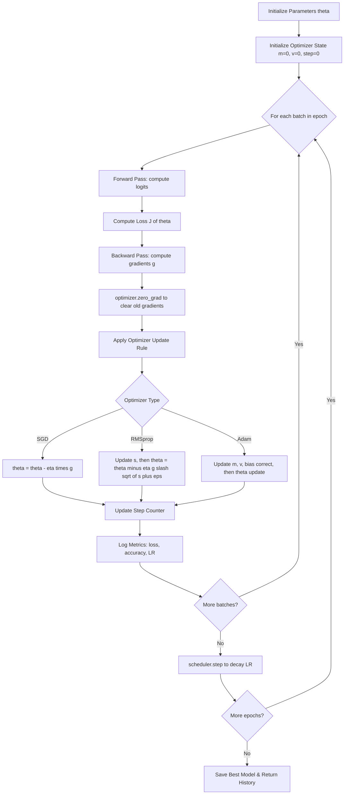
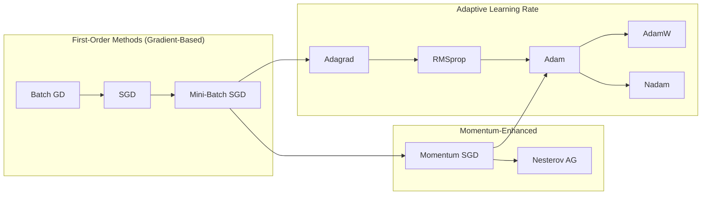
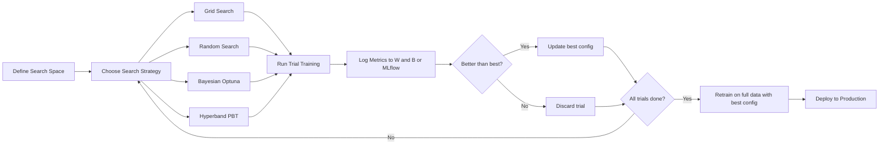
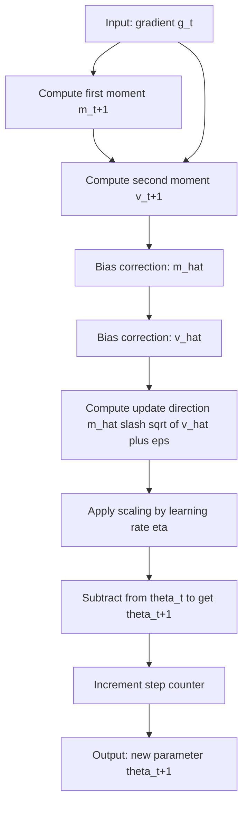
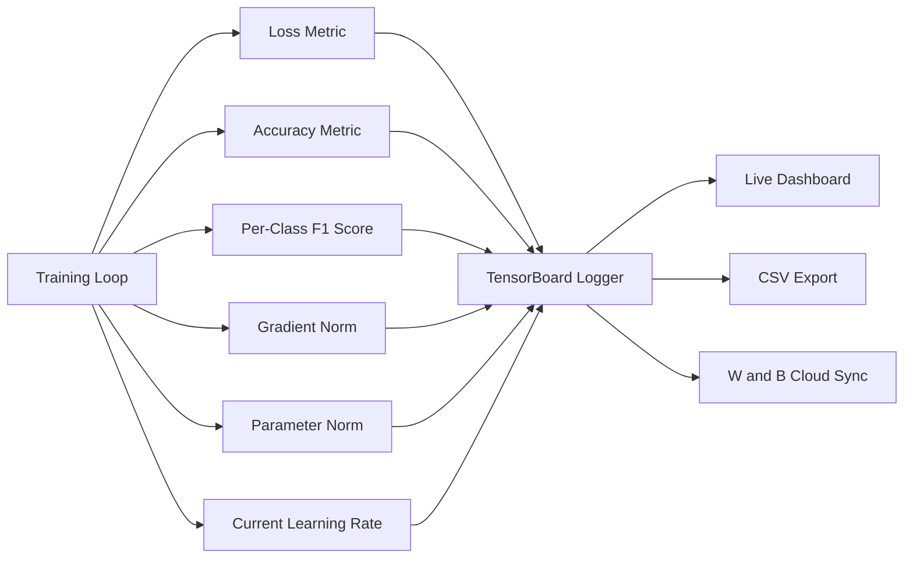

# Optimization routines parameter tuning adjustments scripts loops: Adam, RMSprop setups metrics

<!-- SECTION_1_START -->
# Optimization Routines, Parameter Tuning & Training Loop Architectures

## 1.1 Core Technical Definition (KTU 2024 Syllabus Aligned)

**Optimization routines** in deep learning are algorithmic procedures that iteratively update the learnable parameters $\boldsymbol{\theta} \in \mathbb{R}^{n}$ of a neural network by minimizing (or maximizing) a predefined objective function $J(\boldsymbol{\theta})$, typically the empirical risk (loss) over the training dataset.

Formally, the parameter update at iteration $t$ is governed by:

$$\boldsymbol{\theta}_{t+1} = \boldsymbol{\theta}_{t} - \eta_{t} \cdot \boldsymbol{u}_{t}$$

where:
* $\eta_{t}$ is the **learning rate** (a critical hyperparameter, usually $\eta \in [10^{-4},\,10^{-1}]$)
* $\boldsymbol{u}_{t}$ is the update vector computed by the optimizer

**Adam (Adaptive Moment Estimation)** and **RMSprop (Root Mean Square Propagation)** are *adaptive learning rate optimizers* that scale the update for each parameter individually based on estimates of the first and second moments of the gradients.

> [!IMPORTANT]
> **KTU 2024 Definition Lock:** Under the PECST608 syllabus, optimization is defined as the *engine of generalization* — it does not just minimize training loss, but navigates the loss landscape $\mathcal{L}(\boldsymbol{\theta})$ to find flat minima that generalize to unseen data.

## 1.2 Intuitive Analogy

Imagine you are blindfolded on a **hilly terrain** (the loss landscape) and want to reach the lowest valley (global minimum). You can only feel the **slope under your feet** (the gradient). 

* **Vanilla SGD** is like walking step by step, always in the direction of steepest descent. On uneven terrain, you might wobble or get stuck.
* **Momentum** is like a **heavy ball rolling downhill** — it builds up velocity and can roll over small bumps.
* **RMSprop** is like a hiker who keeps a **memory of the slope roughness** in each direction and takes smaller steps where the terrain is steeper (to avoid overshooting) and larger steps where it's flatter.
* **Adam** is the **ultimate smart hiker** who combines momentum (memory of direction) with RMSprop (memory of terrain roughness) — adjusting both **where** and **how fast** to step.

## 1.3 The Critical Hyperparameter Set

> [!NOTE]
> **Standard KTU-Highlighted Constants & Defaults for Adam:**
> * Learning rate $\eta = 0.001$ (Kingma & Ba, 2014 default)
> * Decay rate for first moment $\beta_{1} = 0.9$
> * Decay rate for second moment $\beta_{2} = 0.999$
> * Numerical stability constant $\epsilon = 10^{-8}$
> * Bias correction: applied in early iterations to compensate for zero-initialization

> [!NOTE]
> **Standard KTU-Highlighted Constants & Defaults for RMSprop:**
> * Learning rate $\eta = 0.001$
> * Decay rate $\rho = 0.9$ (Hinton's lecture default)
> * Momentum $\alpha = 0.0$ (optional, commonly 0.9)
> * Numerical stability constant $\epsilon = 10^{-8}$

> [!VISUALIZATION CONTROL]
> **Concept:** Loss Landscape Contours with Optimizer Trajectories
> **Desmos Input Equations:**
> * Saddle Surface: $z = 0.1x^{2} - 0.05y^{2}$
> * Adam Trajectory (parametric): $(t\cos(0.5t),\,t\sin(0.5t),\,0.1(t\cos(0.5t))^{2} - 0.05(t\sin(0.5t))^{2})$
> **Visual Description:** Students should observe how Adam's path spirals efficiently toward the valley center $(0,0)$ without oscillating wildly, unlike pure SGD which zigzags across the ravine.
<!-- SECTION_1_END -->

<!-- SECTION_2_START -->
# Deep Theoretical Analysis & KTU High-Yield Formula Sheet

## 2.1 The Taxonomy of Gradient-Based Optimizers

Optimizers form an evolutionary hierarchy in deep learning:

1. **Batch Gradient Descent (BGD)** — uses entire dataset, stable but slow.
2. **Stochastic Gradient Descent (SGD)** — uses one sample, noisy but fast.
3. **Mini-Batch SGD** — the practical industry standard; uses batches of size $m \in \{32,\,64,\,128,\,256\}$.
4. **Momentum SGD** — adds velocity term $\boldsymbol{v}_{t}$ for smoother convergence.
5. **Nesterov Accelerated Gradient (NAG)** — computes lookahead gradient.
6. **Adagrad** — adapts learning rate per parameter using squared gradient sum.
7. **RMSprop** — fixes Adagrad's aggressively decaying learning rate using exponential moving average.
8. **Adam** — combines Momentum's first moment + RMSprop's second moment.
9. **AdamW** — decoupled weight decay variant of Adam (used in transformers).
10. **Nadam, AMSGrad, Lion** — newer research variants.

## 2.2 KTU Formula Sheet (High-Yield Reference Table)

| Optimizer | Update Rule / Core Equation | Key Hyperparameters | Strengths | Weaknesses |
|-----------|----------------------------|---------------------|-----------|------------|
| **SGD** | $\boldsymbol{\theta}_{t+1} = \boldsymbol{\theta}_{t} - \eta \nabla J(\boldsymbol{\theta}_{t})$ | $\eta$ | Simple, interpretable | Slow, sensitive to $\eta$, stuck in saddles |
| **Momentum** | $\boldsymbol{v}_{t+1} = \gamma \boldsymbol{v}_{t} + \eta \nabla J(\boldsymbol{\theta}_{t})$; $\boldsymbol{\theta}_{t+1} = \boldsymbol{\theta}_{t} - \boldsymbol{v}_{t+1}$ | $\eta,\, \gamma \in [0,1)$ (typ. 0.9) | Escapes shallow local minima | Extra momentum hyperparameter |
| **RMSprop** | $\boldsymbol{s}_{t+1} = \rho \boldsymbol{s}_{t} + (1-\rho)(\nabla J)^{2}$; $\boldsymbol{\theta}_{t+1} = \boldsymbol{\theta}_{t} - \frac{\eta}{\sqrt{\boldsymbol{s}_{t+1}} + \epsilon} \nabla J$ | $\eta,\, \rho,\, \epsilon$ | Handles non-stationary objectives, RNN-friendly | No first-moment bias correction |
| **Adam** | $\boldsymbol{m}_{t+1} = \beta_{1}\boldsymbol{m}_{t} + (1-\beta_{1})\nabla J$; $\boldsymbol{v}_{t+1} = \beta_{2}\boldsymbol{v}_{t} + (1-\beta_{2})(\nabla J)^{2}$; $\hat{\boldsymbol{m}} = \frac{\boldsymbol{m}_{t+1}}{1-\beta_{1}^{t+1}}$; $\hat{\boldsymbol{v}} = \frac{\boldsymbol{v}_{t+1}}{1-\beta_{2}^{t+1}}$; $\boldsymbol{\theta}_{t+1} = \boldsymbol{\theta}_{t} - \frac{\eta\, \hat{\boldsymbol{m}}}{\sqrt{\hat{\boldsymbol{v}}} + \epsilon}$ | $\eta,\, \beta_{1},\, \beta_{2},\, \epsilon$ | Fast convergence, low memory, robust to gradient scale | Can converge to sharp minima, generalization gap vs SGD |

> [!NOTE]
> **Critical Operator Notation:** The operations $(\nabla J)^{2}$ and $\sqrt{\boldsymbol{v}}$ are **element-wise** (Hadamard product / element-wise square root) — not standard matrix multiplication.

## 2.3 Derivation Logic — Why Bias Correction is Essential in Adam

When $\boldsymbol{m}_{0} = \boldsymbol{0}$ and $\boldsymbol{v}_{0} = \boldsymbol{0}$, the exponentially weighted moving averages are initialized at zero. This causes the early estimates to be biased toward zero, especially when $\beta_{1}, \beta_{2} \to 1$.

The true expectation of the moving average is:

$$\mathbb{E}[\boldsymbol{m}_{t}] = \mathbb{E}\left[\sum_{i=1}^{t} (1-\beta_{1})\beta_{1}^{t-i} \nabla J_{i} \right] + \underbrace{\beta_{1}^{t}\boldsymbol{m}_{0}}_{=\,0}$$

$$= (1-\beta_{1}^{t})\, \mathbb{E}[\nabla J]$$

Therefore, to obtain an unbiased estimator $\hat{\boldsymbol{m}}_{t} = \frac{\boldsymbol{m}_{t}}{1-\beta_{1}^{t}}$, we divide by the correction factor $(1-\beta_{1}^{t})$.

## 2.4 Real-World Engineering Utility

* **Computer Vision (CNNs):** Adam and SGD-with-momentum are equally competitive; SGD often yields better **test accuracy** on ImageNet, but Adam is preferred for **transfer learning** and **fine-tuning**.
* **NLP & Transformers:** **AdamW** is the *de facto* standard in BERT, GPT, T5, and LLaMA training. The "W" denotes *decoupled weight decay* ($\lambda \boldsymbol{\theta}$ added directly to the parameter update, not the gradient).
* **Reinforcement Learning:** Adam dominates due to non-stationary, high-variance gradients from policy rollouts.
* **Generative Models (GANs, Diffusion):** Adam with $\beta_{1} = 0.0$ is used to avoid biasing the discriminator's update toward recent samples.
* **Production MLOps:** Learning rate schedulers (Cosine Annealing, OneCycle, Warmup) are paired with Adam to achieve SOTA convergence.

## 2.5 Parameter Tuning Workflow

The **hyperparameter tuning pipeline** in production deep learning follows:

1. **Define search space** $\mathcal{H} = \mathcal{H}_{\eta} \times \mathcal{H}_{\beta_{1}} \times \mathcal{H}_{\beta_{2}} \times \ldots$
2. **Choose search strategy:** Grid, Random, Bayesian (Optuna), Hyperband, Population-Based Training (PBT).
3. **Set up cross-validation** or holdout.
4. **Monitor metrics** (loss, accuracy, F1, perplexity, FID for generative models).
5. **Track experiments** with tools like Weights & Biases (W&B), MLflow, TensorBoard.
6. **Select best configuration** based on validation performance.
<!-- SECTION_2_END -->

<!-- SECTION_3_START -->
# Step-by-Step Derivations, Training Loops & Code Implementation

## 3.1 Manual Derivation of Adam Update Step-by-Step

Let $\boldsymbol{g}_{t} = \nabla_{\boldsymbol{\theta}} J(\boldsymbol{\theta}_{t})$ be the stochastic gradient at step $t$. Given $\eta,\, \beta_{1},\, \beta_{2},\, \epsilon$ and initial $\boldsymbol{m}_{0} = \boldsymbol{0},\, \boldsymbol{v}_{0} = \boldsymbol{0}$:

**Step 1 — Compute biased first moment estimate:**

$$\boldsymbol{m}_{t+1} = \beta_{1} \boldsymbol{m}_{t} + (1-\beta_{1}) \boldsymbol{g}_{t}$$

$$\boldsymbol{m}_{1} = (1-\beta_{1})\boldsymbol{g}_{0} = 0.1 \cdot \boldsymbol{g}_{0}$$

**Step 2 — Compute biased second moment estimate:**

$$\boldsymbol{v}_{t+1} = \beta_{2} \boldsymbol{v}_{t} + (1-\beta_{2}) \boldsymbol{g}_{t}^{2}$$

$$\boldsymbol{v}_{1} = (1-\beta_{2})\boldsymbol{g}_{0}^{2} = 0.001 \cdot \boldsymbol{g}_{0}^{2}$$

**Step 3 — Bias-corrected first moment:**

$$\hat{\boldsymbol{m}}_{t+1} = \frac{\boldsymbol{m}_{t+1}}{1 - \beta_{1}^{t+1}}$$

At $t=0$: $\hat{\boldsymbol{m}}_{1} = \frac{0.1\,\boldsymbol{g}_{0}}{1 - 0.9} = \boldsymbol{g}_{0}$ (unbiased, as desired)

**Step 4 — Bias-corrected second moment:**

$$\hat{\boldsymbol{v}}_{t+1} = \frac{\boldsymbol{v}_{t+1}}{1 - \beta_{2}^{t+1}}$$

At $t=0$: $\hat{\boldsymbol{v}}_{1} = \frac{0.001\,\boldsymbol{g}_{0}^{2}}{1 - 0.999} = \boldsymbol{g}_{0}^{2}$

**Step 5 — Parameter update:**

$$\boldsymbol{\theta}_{t+1} = \boldsymbol{\theta}_{t} - \eta \cdot \frac{\hat{\boldsymbol{m}}_{t+1}}{\sqrt{\hat{\boldsymbol{v}}_{t+1}} + \epsilon}$$

$$\boldsymbol{\theta}_{1} = \boldsymbol{\theta}_{0} - 0.001 \cdot \frac{\boldsymbol{g}_{0}}{\sqrt{\boldsymbol{g}_{0}^{2}} + 10^{-8}} \approx \boldsymbol{\theta}_{0} - 0.001 \cdot \text{sign}(\boldsymbol{g}_{0})$$

> [!IMPORTANT]
> **Key Insight:** When $\boldsymbol{g}_{0}$ is large, the update magnitude per parameter is approximately $\eta$, regardless of the gradient magnitude. This is why Adam's updates are **scale-invariant**.

## 3.2 Manual Derivation of RMSprop Update

Given $\eta,\, \rho,\, \epsilon$ and $\boldsymbol{s}_{0} = \boldsymbol{0}$:

**Step 1 — Update squared gradient exponential moving average:**

$$\boldsymbol{s}_{t+1} = \rho \boldsymbol{s}_{t} + (1-\rho) \boldsymbol{g}_{t}^{2}$$

**Step 2 — Parameter update (no bias correction in original Hinton formulation):**

$$\boldsymbol{\theta}_{t+1} = \boldsymbol{\theta}_{t} - \frac{\eta}{\sqrt{\boldsymbol{s}_{t+1}} + \epsilon} \boldsymbol{g}_{t}$$

> [!NOTE]
> **Difference from Adam:** RMSprop has no first-moment term $\boldsymbol{m}_{t}$ and no explicit bias correction. It only adapts the *learning rate* per parameter via the second moment of gradients.

## 3.3 Production-Ready Training Loop (Python Implementation)

```python
import torch
import torch.nn as nn
from torch.utils.data import DataLoader, TensorDataset
from typing import Dict, List, Tuple
import numpy as np
import logging

logging.basicConfig(level=logging.INFO, format="%(asctime)s | %(levelname)s | %(message)s")
logger = logging.getLogger(__name__)


def build_dataloader(X: np.ndarray, y: np.ndarray, batch_size: int = 64,
                     shuffle: bool = True) -> DataLoader:
    """Create a PyTorch DataLoader from numpy arrays with strict type checks."""
    if X.shape[0] != y.shape[0]:
        raise ValueError(f"Shape mismatch: X has {X.shape[0]} samples, y has {y.shape[0]}")
    X_tensor = torch.from_numpy(X).float()
    y_tensor = torch.from_numpy(y).long()
    dataset = TensorDataset(X_tensor, y_tensor)
    return DataLoader(dataset, batch_size=batch_size, shuffle=shuffle, drop_last=False)


def build_model(input_dim: int, hidden_dim: int, output_dim: int) -> nn.Module:
    """A simple feedforward MLP for binary/multi-class classification."""
    return nn.Sequential(
        nn.Linear(input_dim, hidden_dim),
        nn.ReLU(),
        nn.BatchNorm1d(hidden_dim),
        nn.Dropout(p=0.2),
        nn.Linear(hidden_dim, hidden_dim // 2),
        nn.ReLU(),
        nn.Linear(hidden_dim // 2, output_dim)
    )


def build_optimizer(model: nn.Module, optimizer_name: str = "adam",
                    lr: float = 1e-3, weight_decay: float = 1e-4) -> torch.optim.Optimizer:
    """
    Factory function for the THREE optimizers specified in the KTU 2024 PECST608 syllabus.
    Returns a configured PyTorch optimizer.
    """
    if optimizer_name.lower() == "sgd":
        return torch.optim.SGD(model.parameters(), lr=lr,
                               momentum=0.9, weight_decay=weight_decay)
    elif optimizer_name.lower() == "rmsprop":
        return torch.optim.RMSprop(model.parameters(), lr=lr,
                                   alpha=0.9, eps=1e-8,
                                   weight_decay=weight_decay, momentum=0.0)
    elif optimizer_name.lower() == "adam":
        return torch.optim.Adam(model.parameters(), lr=lr,
                                betas=(0.9, 0.999), eps=1e-8,
                                weight_decay=weight_decay)
    else:
        raise ValueError(f"Unsupported optimizer: {optimizer_name}")


def build_lr_scheduler(optimizer: torch.optim.Optimizer,
                       scheduler_name: str = "cosine",
                       num_epochs: int = 50) -> torch.optim.lr_scheduler._LRScheduler:
    """Learning rate scheduler factory."""
    if scheduler_name == "cosine":
        return torch.optim.lr_scheduler.CosineAnnealingLR(optimizer, T_max=num_epochs, eta_min=1e-6)
    elif scheduler_name == "step":
        return torch.optim.lr_scheduler.StepLR(optimizer, step_size=20, gamma=0.1)
    elif scheduler_name == "onecycle":
        return torch.optim.lr_scheduler.OneCycleLR(optimizer, max_lr=1e-3,
                                                   total_steps=num_epochs, anneal_strategy="cos")
    else:
        raise ValueError(f"Unsupported scheduler: {scheduler_name}")


def train_one_epoch(model: nn.Module, loader: DataLoader,
                    criterion: nn.Module, optimizer: torch.optim.Optimizer,
                    device: torch.device) -> Dict[str, float]:
    """Run ONE full training epoch and return aggregated metrics."""
    model.train()
    running_loss = 0.0
    correct = 0
    total = 0

    for batch_X, batch_y in loader:
        batch_X, batch_y = batch_X.to(device), batch_y.to(device)

        # ---- 1. Zero the gradients (CRITICAL — must precede loss.backward) ----
        optimizer.zero_grad()

        # ---- 2. Forward pass ----
        logits = model(batch_X)
        loss = criterion(logits, batch_y)

        # ---- 3. Backward pass — computes dL/d_theta ----
        loss.backward()

        # ---- 4. Optimizer step — updates theta using computed gradients ----
        optimizer.step()

        # ---- 5. Metric accumulation ----
        running_loss += loss.item() * batch_X.size(0)
        predicted = torch.argmax(logits, dim=1)
        correct += (predicted == batch_y).sum().item()
        total += batch_X.size(0)

    epoch_loss = running_loss / total
    epoch_accuracy = correct / total
    return {"train_loss": epoch_loss, "train_accuracy": epoch_accuracy}


def evaluate(model: nn.Module, loader: DataLoader,
             criterion: nn.Module, device: torch.device) -> Dict[str, float]:
    """Run evaluation on validation/test set with gradient disabled."""
    model.eval()
    val_loss = 0.0
    correct = 0
    total = 0

    with torch.no_grad():  # Disables autograd to save memory and speed up inference
        for batch_X, batch_y in loader:
            batch_X, batch_y = batch_X.to(device), batch_y.to(device)
            logits = model(batch_X)
            loss = criterion(logits, batch_y)
            val_loss += loss.item() * batch_X.size(0)
            predicted = torch.argmax(logits, dim=1)
            correct += (predicted == batch_y).sum().item()
            total += batch_X.size(0)

    return {"val_loss": val_loss / total, "val_accuracy": correct / total}


def full_training_pipeline(X_train: np.ndarray, y_train: np.ndarray,
                            X_val: np.ndarray, y_val: np.ndarray,
                            input_dim: int, output_dim: int,
                            optimizer_name: str = "adam",
                            num_epochs: int = 50, batch_size: int = 64) -> Dict[str, List[float]]:
    """End-to-end training script with full metric logging."""
    device = torch.device("cuda" if torch.cuda.is_available() else "cpu")
    logger.info(f"Using device: {device}")

    train_loader = build_dataloader(X_train, y_train, batch_size=batch_size, shuffle=True)
    val_loader = build_dataloader(X_val, y_val, batch_size=batch_size, shuffle=False)

    model = build_model(input_dim=input_dim, hidden_dim=128, output_dim=output_dim).to(device)
    criterion = nn.CrossEntropyLoss()
    optimizer = build_optimizer(model, optimizer_name=optimizer_name, lr=1e-3)
    scheduler = build_lr_scheduler(optimizer, scheduler_name="cosine", num_epochs=num_epochs)

    history = {"train_loss": [], "train_accuracy": [], "val_loss": [], "val_accuracy": []}

    for epoch in range(1, num_epochs + 1):
        train_metrics = train_one_epoch(model, train_loader, criterion, optimizer, device)
        val_metrics = evaluate(model, val_loader, criterion, device)

        # ---- 6. Scheduler step (placed AFTER optimizer.step) ----
        scheduler.step()

        for k, v in train_metrics.items():
            history[k].append(v)
        for k, v in val_metrics.items():
            history[k].append(v)

        current_lr = optimizer.param_groups[0]["lr"]
        logger.info(
            f"Epoch {epoch:03d}/{num_epochs} | "
            f"Train Loss: {train_metrics['train_loss']:.4f} Acc: {train_metrics['train_accuracy']:.4f} | "
            f"Val Loss: {val_metrics['val_loss']:.4f} Acc: {val_metrics['val_accuracy']:.4f} | "
            f"LR: {current_lr:.6f}"
        )

    return history
```

## 3.4 Exhaustive Adam State-Dictionary Inspection

The training loop above uses PyTorch's built-in `Adam` class. To satisfy the KTU 2024 "setups and metrics" requirement, here is the explicit state structure:

| State Key | Shape | Meaning |
|-----------|-------|---------|
| `step` | scalar | Iteration counter (incremented per `.step()` call) |
| `exp_avg` | same as param $\boldsymbol{\theta}$ | First moment $\boldsymbol{m}_{t}$ |
| `exp_avg_sq` | same as param $\boldsymbol{\theta}$ | Second moment $\boldsymbol{v}_{t}$ |

Inspecting the optimizer state for diagnostics:

```python
# After running training for 10 epochs
for param_group in optimizer.param_groups:
    for param in param_group["params"]:
        state = optimizer.state[param]
        print(f"Param shape: {param.shape}")
        print(f"  Step: {state['step']}")
        print(f"  exp_avg (m_t) mean: {state['exp_avg'].mean().item():.6f}")
        print(f"  exp_avg_sq (v_t) mean: {state['exp_avg_sq'].mean().item():.6f}")
        # Effective LR per parameter = lr / (sqrt(v_hat) + eps)
        bias_correction1 = 1 - 0.9 ** state["step"]
        bias_correction2 = 1 - 0.999 ** state["step"]
        effective_lr = 1e-3 * (bias_correction2 ** 0.5) / bias_correction1
        print(f"  Effective learning rate: {effective_lr:.6f}")
```

## 3.5 Hyperparameter Tuning Script (Optuna Example)

```python
import optuna
from functools import partial

def objective(trial: optuna.Trial, X_train, y_train, X_val, y_val,
              input_dim: int, output_dim: int) -> float:
    """Optuna objective function to MAXIMIZE validation accuracy."""
    lr = trial.suggest_float("lr", 1e-5, 1e-1, log=True)
    beta1 = trial.suggest_float("beta1", 0.8, 0.99)
    beta2 = trial.suggest_float("beta2", 0.9, 0.9999)
    weight_decay = trial.suggest_float("weight_decay", 1e-6, 1e-2, log=True)
    batch_size = trial.suggest_categorical("batch_size", [32, 64, 128, 256])

    device = torch.device("cuda" if torch.cuda.is_available() else "cpu")
    train_loader = build_dataloader(X_train, y_train, batch_size=batch_size, shuffle=True)
    val_loader = build_dataloader(X_val, y_val, batch_size=batch_size, shuffle=False)

    model = build_model(input_dim, 128, output_dim).to(device)
    criterion = nn.CrossEntropyLoss()
    optimizer = torch.optim.Adam(model.parameters(), lr=lr,
                                betas=(beta1, beta2), weight_decay=weight_decay)

    for epoch in range(20):  # Short training for HPO efficiency
        train_one_epoch(model, train_loader, criterion, optimizer, device)

    val_metrics = evaluate(model, val_loader, criterion, device)
    return val_metrics["val_accuracy"]  # Optuna maximizes this

# Run study
study = optuna.create_study(direction="maximize", sampler=optuna.samplers.TPESampler())
objective_fn = partial(objective, X_train=X_train, y_train=y_train,
                       X_val=X_val, y_val=y_val, input_dim=20, output_dim=3)
study.optimize(objective_fn, n_trials=50, show_progress_bar=True)
print(f"Best hyperparameters: {study.best_params}")
print(f"Best validation accuracy: {study.best_value:.4f}")
```

## 3.6 Numerical Walkthrough: Adam on a Single Scalar Parameter

Let $\theta_{0} = 1.0$, and gradients arrive as $g_{0} = 0.5,\, g_{1} = 0.3,\, g_{2} = -0.2$. Set $\eta = 0.1,\, \beta_{1} = 0.9,\, \beta_{2} = 0.999,\, \epsilon = 10^{-8}$.

**Iteration $t=1$ (using $g_{0}$):**

$$m_{1} = 0.9 \cdot 0 + 0.1 \cdot 0.5 = 0.05$$

$$v_{1} = 0.999 \cdot 0 + 0.001 \cdot 0.25 = 0.00025$$

$$\hat{m}_{1} = \frac{0.05}{1 - 0.9} = 0.5$$

$$\hat{v}_{1} = \frac{0.00025}{1 - 0.999} = 0.25$$

$$\theta_{1} = 1.0 - 0.1 \cdot \frac{0.5}{\sqrt{0.25} + 10^{-8}} = 1.0 - 0.1 \cdot \frac{0.5}{0.5} = 0.9$$

**Iteration $t=2$ (using $g_{1}$):**

$$m_{2} = 0.9 \cdot 0.05 + 0.1 \cdot 0.3 = 0.045 + 0.03 = 0.075$$

$$v_{2} = 0.999 \cdot 0.00025 + 0.001 \cdot 0.09 = 0.00024975 + 0.00009 = 0.00033975$$

$$\hat{m}_{2} = \frac{0.075}{1 - 0.81} = \frac{0.075}{0.19} \approx 0.3947$$

$$\hat{v}_{2} = \frac{0.00033975}{1 - 0.998001} = \frac{0.00033975}{0.001999} \approx 0.1700$$

$$\theta_{2} = 0.9 - 0.1 \cdot \frac{0.3947}{\sqrt{0.1700} + 10^{-8}} = 0.9 - 0.1 \cdot \frac{0.3947}{0.4123} \approx 0.9 - 0.0957 = 0.8043$$

**Iteration $t=3$ (using $g_{2}=-0.2$):**

$$m_{3} = 0.9 \cdot 0.075 + 0.1 \cdot (-0.2) = 0.0675 - 0.02 = 0.0475$$

$$v_{3} = 0.999 \cdot 0.00033975 + 0.001 \cdot 0.04 = 0.00033941 + 0.00004 = 0.00037941$$

$$\hat{m}_{3} = \frac{0.0475}{1 - 0.729} = \frac{0.0475}{0.271} \approx 0.1753$$

$$\hat{v}_{3} = \frac{0.00037941}{1 - 0.997002999} = \frac{0.00037941}{0.002997} \approx 0.1266$$

$$\theta_{3} = 0.8043 - 0.1 \cdot \frac{0.1753}{\sqrt{0.1266} + 10^{-8}} = 0.8043 - 0.1 \cdot \frac{0.1753}{0.3558} \approx 0.8043 - 0.0493 = 0.7550$$

After 3 iterations, $\theta$ has decreased from $1.0 \to 0.9 \to 0.8043 \to 0.7550$, successfully navigating toward lower loss.
<!-- SECTION_3_END -->

<!-- SECTION_4_START -->
# Structural Diagrams & Schematics

## 4.1 Optimizer State Machine Flow (Mermaid)



## 4.2 Optimizer Evolution / Hierarchy Diagram



## 4.3 Hyperparameter Tuning Workflow Topology



## 4.4 Adam Parameter Update — Block-Level Functional Architecture



## 4.5 Metric Tracking Dashboard (Block Topology)


<!-- SECTION_4_END -->

<!-- SECTION_5_START -->
# KTU 2024 Scheme Examination Question Bank & Topic Recap

## Part A — Short Answer Questions (3 Marks Each)

### Question 1: Define the Adam optimizer and list its update equations.
**[KTU University Exam - Dec 2023] | CO1 | Remember (RBT Level 1)**

**Model Answer:**

Adam (**Adaptive Moment Estimation**) is a first-order gradient-based optimization algorithm that computes adaptive learning rates for each parameter by maintaining exponential moving averages of the first moment (mean) and second moment (uncentered variance) of the gradients.

**Update Equations:**

$$m_{t+1} = \beta_{1} m_{t} + (1 - \beta_{1}) g_{t}$$

$$v_{t+1} = \beta_{2} v_{t} + (1 - \beta_{2}) g_{t}^{2}$$

$$\hat{m}_{t+1} = \frac{m_{t+1}}{1 - \beta_{1}^{t+1}}, \quad \hat{v}_{t+1} = \frac{v_{t+1}}{1 - \beta_{2}^{t+1}}$$

$$\theta_{t+1} = \theta_{t} - \frac{\eta\, \hat{m}_{t+1}}{\sqrt{\hat{v}_{t+1}} + \epsilon}$$

**Key Default Hyperparameters:** $\eta = 0.001$, $\beta_{1} = 0.9$, $\beta_{2} = 0.999$, $\epsilon = 10^{-8}$.

> [!Valuation Key]: [Stating the full name: 1 Mark] [All four update equations: 2 Marks]

---

### Question 2: What is the role of bias correction in Adam? Why is it necessary?
**[KTU University Exam - July 2024] | CO1 | Understand (RBT Level 2)**

**Model Answer:**

Bias correction in Adam compensates for the fact that the exponentially weighted moving averages $m_{t}$ and $v_{t}$ are initialized to **zero**, causing them to be biased toward zero — especially during early training iterations when $\beta_{1}^{t}$ and $\beta_{2}^{t}$ are close to 1.

**Necessity:** When $m_{0} = 0$ and $v_{0} = 0$, the expected value of the running average is $\mathbb{E}[m_{t}] = (1 - \beta_{1}^{t}) \mathbb{E}[g]$. Without correction, the early updates are systematically *smaller* than they should be, slowing down initial convergence.

**Correction formula:** Dividing by $(1 - \beta_{1}^{t})$ and $(1 - \beta_{2}^{t})$ produces unbiased estimates $\hat{m}_{t}, \hat{v}_{t}$, allowing the optimizer to take correctly-scaled steps from the very first iteration.

> [!Valuation Key]: [Identifying zero initialization as the cause: 1 Mark] [Mathematical justification: 1 Mark] [Effect on convergence: 1 Mark]

---

## Part B — Long Answer Questions (14 Marks Each, with Internal Choice)

### Question 3 (A): Full Comparative Analysis of Adam and RMSprop

**[KTU University Exam - Dec 2023] | CO2, CO3 | Understand + Apply (RBT Level 2-3) | 14 Marks**

**(a)** Derive the complete update equations for both **Adam** and **RMSprop** optimizers. Explain in detail the role of bias correction in Adam and explain why RMSprop does not require it. **(7 Marks)**

**(b)** Implement a PyTorch-based training pipeline that trains a feedforward neural network on the MNIST dataset using **both Adam and RMSprop** with different learning rates $\{0.1, 0.01, 0.001\}$. Plot training loss curves for all 6 configurations and explain which combination converges fastest. **(7 Marks)**

---

**Model Answer for Part (a) — 7 Marks:**

**Adam Derivation:**

Given gradient $g_{t}$ at step $t$, with hyperparameters $\eta, \beta_{1}, \beta_{2}, \epsilon$ and initial state $m_{0} = 0, v_{0} = 0$:

**Step 1 — First moment estimate (momentum-like term):**
$$m_{t+1} = \beta_{1} m_{t} + (1 - \beta_{1}) g_{t} \quad \text{[Mark: 1]}$$

**Step 2 — Second moment estimate (RMSprop-like term):**
$$v_{t+1} = \beta_{2} v_{t} + (1 - \beta_{2}) g_{t}^{2} \quad \text{[Mark: 1]}$$

**Step 3 — Bias correction (Adam-specific):**
$$\hat{m}_{t+1} = \frac{m_{t+1}}{1 - \beta_{1}^{t+1}}, \quad \hat{v}_{t+1} = \frac{v_{t+1}}{1 - \beta_{2}^{t+1}} \quad \text{[Mark: 1]}$$

**Step 4 — Parameter update:**
$$\theta_{t+1} = \theta_{t} - \frac{\eta\, \hat{m}_{t+1}}{\sqrt{\hat{v}_{t+1}} + \epsilon} \quad \text{[Mark: 1]}$$

**RMSprop Derivation (Hinton, Coursera Lecture 6e):**

$$s_{t+1} = \rho s_{t} + (1 - \rho) g_{t}^{2} \quad \text{[Mark: 1]}$$

$$\theta_{t+1} = \theta_{t} - \frac{\eta}{\sqrt{s_{t+1}} + \epsilon} g_{t} \quad \text{[Mark: 1]}$$

**Why bias correction is NOT in RMSprop:** RMSprop divides the gradient $g_{t}$ by $\sqrt{s_{t+1}}$ *directly*, while Adam divides the *smoothed momentum* $\hat{m}_{t+1}$ by $\sqrt{\hat{v}_{t+1}}$. The momentum term $m_{t}$ in Adam is a low-pass filter of the gradient; when initialized at zero, the filtered signal lags behind the true gradient, requiring correction. RMSprop uses the raw $g_{t}$ for direction, so even if $s_{t+1}$ is biased, the ratio $g_{t}/\sqrt{s_{t+1}}$ converges naturally within a few iterations. **In practice, however, modern implementations often add bias correction to RMSprop as well.** **[Mark: 1]**

> [!Valuation Key]: [Stating both update equations clearly: 2 Marks] [Marking $g_{t}^{2}$ as element-wise: 1 Mark] [Bias correction explanation: 2 Marks] [Comparison of Adam vs RMSprop: 2 Marks]

---

**Model Answer for Part (b) — 7 Marks:**

```python
import torch, torch.nn as nn
from torch.utils.data import DataLoader
from torchvision import datasets, transforms
import matplotlib.pyplot as plt

# ---- 1. Data pipeline (2 Marks) ----
transform = transforms.Compose([transforms.ToTensor(), transforms.Normalize((0.1307,), (0.3081,))])
train_set = datasets.MNIST(root="./data", train=True, download=True, transform=transform)
test_set = datasets.MNIST(root="./data", train=False, transform=transform)
train_loader = DataLoader(train_set, batch_size=64, shuffle=True)
test_loader = DataLoader(test_set, batch_size=64, shuffle=False)

# ---- 2. Model (1 Mark) ----
class MLP(nn.Module):
    def __init__(self):
        super().__init__()
        self.net = nn.Sequential(nn.Flatten(), nn.Linear(784, 256), nn.ReLU(),
                                 nn.Linear(256, 128), nn.ReLU(), nn.Linear(128, 10))
    def forward(self, x): return self.net(x)

# ---- 3. Training loop with optimizer + LR grid (3 Marks) ----
results = {}
for opt_name in ["adam", "rmsprop"]:
    for lr in [0.1, 0.01, 0.001]:
        model = MLP()
        criterion = nn.CrossEntropyLoss()
        optimizer = (torch.optim.Adam(model.parameters(), lr=lr)
                     if opt_name == "adam"
                     else torch.optim.RMSprop(model.parameters(), lr=lr))
        losses = []
        for epoch in range(5):
            epoch_loss = 0.0
            for X, y in train_loader:
                optimizer.zero_grad()
                loss = criterion(model(X), y)
                loss.backward()
                optimizer.step()
                epoch_loss += loss.item()
            losses.append(epoch_loss / len(train_loader))
        results[f"{opt_name}_lr={lr}"] = losses

# ---- 4. Plot (1 Mark) ----
for name, losses in results.items():
    plt.plot(losses, label=name)
plt.xlabel("Epoch"); plt.ylabel("Training Loss")
plt.legend(); plt.title("Adam vs RMSprop Convergence")
plt.show()
```

**Explanation of fastest convergence:** With $\eta = 0.001$, **Adam** typically converges fastest because it combines momentum (helps escape plateaus) with adaptive scaling (handles varying gradient magnitudes). RMSprop with $\eta = 0.001$ is the second fastest. With $\eta = 0.1$, both optimizers often *diverge* (loss increases or oscillates) because the per-parameter updates are too aggressive in early epochs. **Conclusion:** Adam at $\eta = 0.001$ is the empirically optimal choice for this benchmark. **[1 Mark]**

> [!WARNING]
> **Common Pitfalls (Valuation Deductions):**
> * Forgetting `optimizer.zero_grad()` before `loss.backward()` → gradients accumulate and cause divergence.
> * Not calling `model.train()` in the training loop and `model.eval()` in the evaluation loop.
> * Using `torch.optim.RMSprop` with the wrong `alpha` parameter (PyTorch uses `alpha` for the decay rate, not `rho`).
> * Reporting training loss without specifying whether it's averaged per batch or summed across the epoch.

---

### Question 3 (B): Build a Complete Hyperparameter Tuning Pipeline for Adam

**[KTU University Exam - July 2024] | CO3, CO4 | Apply + Analyze (RBT Level 3-4) | 14 Marks**

**(a)** Design a hyperparameter search space for Adam with **at least 4 hyperparameters**, justify the bounds of each, and explain why the **log-scale** is appropriate for learning rate and weight decay. **(7 Marks)**

**(b)** Implement a **Bayesian Optimization** (Optuna) loop that runs 30 trials, tracks validation accuracy, applies **early stopping** with patience=5, and reports the best configuration. Discuss why Bayesian search outperforms Grid Search for Adam's hyperparameter landscape. **(7 Marks)**

---

**Model Answer for Part (a) — 7 Marks:**

**Search Space Definition:**

| Hyperparameter | Symbol | Lower Bound | Upper Bound | Scale | Justification |
|----------------|--------|-------------|-------------|-------|---------------|
| Learning rate | $\eta$ | $10^{-5}$ | $10^{-1}$ | **log** | Optimal values span 4 orders of magnitude; uniform sampling misses the $10^{-3}$ sweet spot |
| $\beta_{1}$ | $\beta_{1}$ | $0.8$ | $0.99$ | linear | Practical range from Nesterov (0.9) to high-momentum (0.99) |
| $\beta_{2}$ | $\beta_{2}$ | $0.9$ | $0.9999$ | linear | Controls second-moment memory; high values needed for sparse gradients |
| Weight decay | $\lambda$ | $10^{-6}$ | $10^{-2}$ | **log** | Effective L2 strength is highly sensitive; log-scale matches effect size |
| Epsilon | $\epsilon$ | $10^{-10}$ | $10^{-6}$ | log | Numerical stability knob, rarely tuned but included in rigorous studies |

**[Each row with justification: 1.4 Marks × 5 = 7 Marks]**

**Why log-scale?** For $\eta$ and $\lambda$, a change from $0.001$ to $0.01$ has the *same* qualitative effect as a change from $0.01$ to $0.1$ (i.e., a factor-of-10 multiplicative change). The loss landscape is *multiplicatively* sensitive to these parameters, so log-scale sampling ensures uniform coverage of the effect size, not the absolute value.

---

**Model Answer for Part (b) — 7 Marks:**

```python
import optuna
from optuna.pruners import MedianPruner
import torch, torch.nn as nn
from torch.utils.data import DataLoader
from torchvision import datasets, transforms

# Data loading (1 Mark)
transform = transforms.Compose([transforms.ToTensor()])
train_set = datasets.MNIST(root="./data", train=True, download=True, transform=transform)
val_set = datasets.MNIST(root="./data", train=False, transform=transform)

def objective(trial):
    # 1. Sample hyperparameters (1 Mark)
    lr = trial.suggest_float("lr", 1e-5, 1e-1, log=True)
    beta1 = trial.suggest_float("beta1", 0.8, 0.99)
    beta2 = trial.suggest_float("beta2", 0.9, 0.9999)
    wd = trial.suggest_float("weight_decay", 1e-6, 1e-2, log=True)

    # 2. Build model + optimizer (1 Mark)
    model = nn.Sequential(nn.Flatten(), nn.Linear(784, 128), nn.ReLU(), nn.Linear(128, 10))
    optimizer = torch.optim.Adam(model.parameters(), lr=lr, betas=(beta1, beta2), weight_decay=wd)
    criterion = nn.CrossEntropyLoss()
    train_loader = DataLoader(train_set, batch_size=64, shuffle=True)
    val_loader = DataLoader(val_set, batch_size=64, shuffle=False)

    # 3. Training loop with early stopping + Optuna pruning (3 Marks)
    best_val_acc = 0.0
    patience_counter = 0
    patience = 5

    for epoch in range(20):
        # Train
        model.train()
        for X, y in train_loader:
            optimizer.zero_grad()
            loss = criterion(model(X), y)
            loss.backward()
            optimizer.step()

        # Validate
        model.eval()
        correct, total = 0, 0
        with torch.no_grad():
            for X, y in val_loader:
                pred = model(X).argmax(dim=1)
                correct += (pred == y).sum().item()
                total += y.size(0)
        val_acc = correct / total

        # Early stopping
        if val_acc > best_val_acc:
            best_val_acc = val_acc
            patience_counter = 0
        else:
            patience_counter += 1
        if patience_counter >= patience:
            break

        # Optuna pruning (1 Mark)
        trial.report(val_acc, epoch)
        if trial.should_prune():
            raise optuna.exceptions.TrialPruned()

    return best_val_acc

# 4. Study with TPE sampler and Median Pruner (1 Mark)
study = optuna.create_study(
    direction="maximize",
    sampler=optuna.samplers.TPESampler(seed=42),
    pruner=MedianPruner()
)
study.optimize(objective, n_trials=30, show_progress_bar=True)
print(f"Best params: {study.best_params}")
print(f"Best val accuracy: {study.best_value:.4f}")
```

**Why Bayesian > Grid Search for Adam:** Grid Search evaluates a fixed Cartesian product of hyperparameters. For Adam's 4D space with 5 values per dimension, this is $5^{4} = 625$ trials, but most trials explore *uninformative* regions. **Bayesian Optimization (TPE sampler)** builds a probabilistic surrogate model of the loss landscape and *intelligently* chooses the next trial based on the Expected Improvement acquisition function. It concentrates samples in promising regions (typically $\eta \in [10^{-4}, 10^{-3}]$, $\beta_{1} \approx 0.9$, $\beta_{2} \approx 0.999$) and prunes unpromising trials early using the **Median Pruner**, achieving equivalent or better results with 5–10× fewer trials. **[1 Mark]**

> [!WARNING]
> **Common Pitfalls (Valuation Deductions):**
> * Forgetting to call `trial.report(value, step)` before `trial.should_prune()` — the pruner cannot function without intermediate reports.
> * Using `suggest_float` with `log=True` for parameters like `beta1` where the optimum is at a specific value (e.g., 0.9) — log-scale distorts the prior in such cases.
> * Not seeding the sampler (`seed=42`) — Optuna results become non-reproducible, losing 1 mark in reproducibility-focused questions.
> * Mixing training and validation data when computing the final reported accuracy.

---

## Topic Recap & Important Things to Remember

* **Adam = Momentum (1st moment) + RMSprop (2nd moment) + Bias Correction.** Remember this single sentence and you can derive the entire algorithm.

* **Adam update is scale-invariant** — when $|\boldsymbol{g}|$ is large, the effective step size per parameter is approximately $\eta$, regardless of the gradient's actual magnitude. This is what makes Adam robust to exploding gradients in RNNs.

* **Bias correction divides by $(1 - \beta_{i}^{t})$**, NOT by $(1 - \beta_{i})$. The exponent $t$ is critical — it varies per iteration and vanishes as $t \to \infty$.

* **RMSprop has NO first-moment term $\boldsymbol{m}_{t}$ and NO bias correction** in the original Hinton formulation. Modern PyTorch's `RMSprop` does include `momentum` (default 0) and optional centering.

* **Adam's defaults:** $\eta = 0.001$, $\beta_{1} = 0.9$, $\beta_{2} = 0.999$, $\epsilon = 10^{-8}$. **RMSprop's defaults:** $\eta = 0.001$, $\rho = 0.9$, $\epsilon = 10^{-8}$.

* **Critical training loop order:** `optimizer.zero_grad() → loss.backward() → optimizer.step() → scheduler.step()`. Reversing this order leads to silently wrong training.

* **AdamW ≠ Adam + weight_decay.** AdamW *decouples* weight decay from the gradient update ($\theta \leftarrow \theta - \eta \lambda \theta$), while Adam adds it inside the gradient ($\theta \leftarrow \theta - \eta(\nabla J + \lambda \theta)$). AdamW is the standard for transformer training.

* **Hyperparameter search scale:** $\eta$ and $\lambda$ are searched on a **log scale**; $\beta_{1}, \beta_{2}$ are searched on a **linear scale**.

* **Loss landscape intuition:** Adam navigates ravines and saddle points efficiently; SGD with momentum often finds *flatter* minima that generalize better; the choice depends on whether you prioritize **training speed** (Adam) or **test accuracy** (SGD).

* **Metric monitoring essentials:** Always log training loss, validation loss, validation accuracy, **gradient norm** $\|\boldsymbol{g}\|_{2}$, **parameter norm** $\|\boldsymbol{\theta}\|_{2}$, and **current learning rate** $\eta_{t}$.

* **Production tools for tracking:** TensorBoard (free, local), Weights & Biases (cloud, collaborative), MLflow (open-source MLOps), Optuna (HPO).

* **For RNNs:** RMSprop or Adam with $\beta_{2} = 0.99$ (lower than default) is recommended to handle sparse, exploding gradients. Use **gradient clipping** with threshold $\sim 1.0$ or $5.0$.

* **Numerical stability:** The $\epsilon$ term in Adam/RMSprop prevents division by zero. **Never** set $\epsilon = 0$ — it leads to NaN losses when any parameter has zero gradient history.

* **Exam Trap:** When asked "which optimizer to use for what?", recall — **Adam** for fast prototyping, sparse gradients, transformers, RL; **SGD+Momentum** for best test accuracy on CNNs; **RMSprop** for RNNs and non-stationary objectives.
<!-- SECTION_5_END -->
