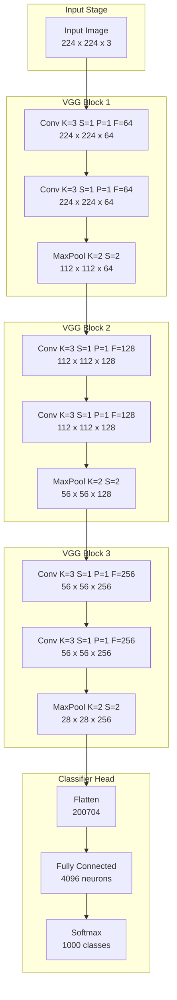
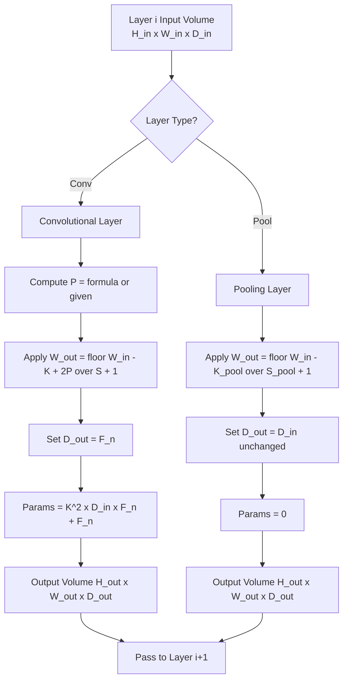
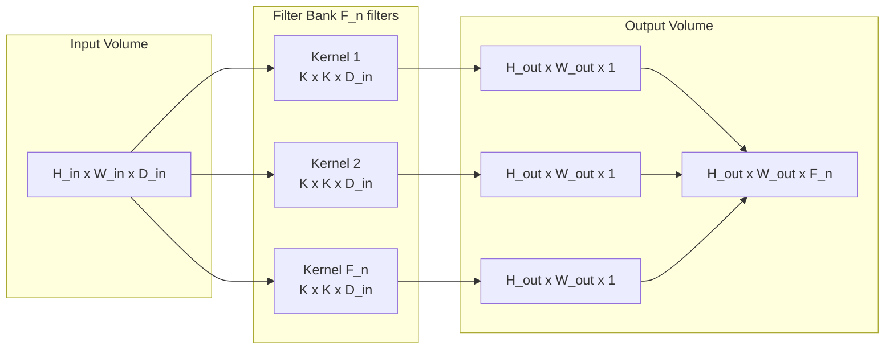

# Convolutional structures layout parameters spatial models tracking CNN configuration logic

<!-- SECTION_1_START -->

# Convolutional Structures: Layout Parameters & Spatial Model Tracking in CNN

## 1. Core Technical Definition

A **Convolutional Neural Network (CNN)** is a specialized deep learning architecture designed to process data that has a known grid-like topology (e.g., images, which can be thought of as a 2-D grid of pixels). The **convolutional structure layout** refers to the systematic, layer-by-layer geometric configuration of how input tensors (volume of feature maps) get transformed into output tensors through operations such as convolution, activation, and pooling.

> [!IMPORTANT]
> **KTU 2024 Syllabus Definition:** A CNN is composed of a sequence of layers — primarily **Convolutional Layers**, **Pooling Layers**, and **Fully-Connected Layers** — where each layer consumes a 3-D input volume (Height × Width × Depth) and emits another 3-D output volume. The **spatial model** of a CNN is the mathematical mapping of how height, width, and depth evolve as data flows through the network.

### Key Architectural Parameters (The "DNA" of any CNN Layer)

Every convolutional layer in a CNN is governed by **four canonical hyperparameters**. These four values completely define the geometric transformation a layer performs on its input volume:

1. **Kernel Size ($K$ or $F$)** — The spatial extent of the convolutional filter. Common values: $K = 1, 3, 5, 7, 11$.
2. **Stride ($S$)** — The step size with which the filter slides across the input. $S \geq 1$ (typically an integer).
3. **Padding ($P$)** — Zero-pixels added to the spatial border of the input. Common types: *Valid* ($P=0$) and *Same* ($P$ chosen to preserve spatial dimensions).
4. **Number of Filters ($F_n$ or $N_f$)** — The depth of the output volume. Also called the number of kernels or feature maps.

> [!NOTE]
> **Depth ($D$) vs. Number of Filters ($F_n$):** These are *equivalent* terms in the context of a single layer's output volume. The depth of the *input* volume, however, equals the number of channels of the incoming data (e.g., 3 for RGB, 64 for the output of a 64-filter layer).

---

### Conceptual Analogy / Intuition

Imagine you are a **detective examining a large crime-scene photograph** with a **magnifying glass**.

* The **magnifying glass's lens diameter** is your **kernel size** $K$. A small lens ($K=3$) catches fine details like fingerprints; a big lens ($K=11$) catches broader patterns like a car silhouette.
* **How far you slide the lens** between each inspection is your **stride** $S$. Slide by 1 pixel ($S=1$) and you inspect every detail, but it takes forever. Slide by 2 pixels ($S=2$) and you go faster, but you might skip evidence.
* **Adding a transparent border** around the photo so the lens can fully inspect the corners of the image is your **padding** $P$. Without it, the corners are "under-inspected."
* **The number of detectives** each wielding their own magnifying glass and looking for different clues (edges, colors, textures) is your **number of filters** $F_n$. More detectives = more independent observations = deeper output volume.

> [!VISUALIZATION CONTROL]
> **Concept:** Single 2-D Convolution Operation with Stride and Padding
> **GeoGebra / Desmos Input Equations:**
> * Input grid: a $7 \times 7$ matrix of 1's
> * Kernel: $f(x,y) = 1$ on a $3 \times 3$ window
> * Stride $S = 1$, Padding $P = 0$ → output is a $5 \times 5$ feature map
> **Visual Description:** Observe the kernel window sliding left-to-right, top-to-bottom one pixel at a time. The highlighted output cell equals the sum of element-wise products between the kernel and the currently overlapped input region. Note that the output is strictly *smaller* than the input when $P=0$.

---

<!-- SECTION_1_END -->

<!-- SECTION_2_START -->

# 2. Deep Theoretical Analysis & KTU High-Yield Formula Sheet

## 2.1 The Core Spatial Transformation Pipeline

A CNN's spatial evolution can be decomposed into a deterministic pipeline. For a single convolutional layer $l$, the relationship between the input volume dimensions and the output volume dimensions is governed by a small set of equations that KTU examiners love to test.

### 2.1.1 Output Spatial Dimension Formula

For a square input of side $W_{in}$ and a square kernel of side $K$, the output spatial dimension is:

$$W_{out} = \left\lfloor \frac{W_{in} - K + 2P}{S} \right\rfloor + 1$$

The **floor function** $\lfloor \cdot \rfloor$ is mandatory because if the kernel does not perfectly fit, we discard the partial overlap (this is what *valid* padding means at the boundary).

> [!NOTE]
> **Why the floor function?** In KTU problems, students often write the formula *without* the floor and lose marks when the numerator is not perfectly divisible by $S$. The standard convention in deep learning frameworks (PyTorch, TensorFlow) is to *truncate* any incomplete final step, hence the $\lfloor \cdot \rfloor$.

### 2.1.2 Output Depth Formula

The output depth is independent of the input dimensions and is set directly by the number of filters:

$$D_{out} = F_n$$

### 2.1.3 Same Padding Closed-Form

To preserve the spatial dimension (i.e., $W_{out} = W_{in}$), the required padding is:

$$P = \frac{S \cdot (W_{in} - 1) - W_{in} + K}{2}$$

For the most common case $S = 1$, this reduces to the simpler form:

$$P = \frac{K - 1}{2}$$

This is why odd kernel sizes like $K = 3 \Rightarrow P = 1$ and $K = 5 \Rightarrow P = 2$ are standard.

### 2.1.4 Parameter Count Formula

The number of *trainable parameters* in a single convolutional layer (excluding bias) is:

$$\text{Params}_{conv} = K \cdot K \cdot D_{in} \cdot F_n$$

When bias is included (one bias term per output filter):

$$\text{Params}_{conv,biased} = (K \cdot K \cdot D_{in} + 1) \cdot F_n$$

> [!TIP]
> **Engineering Insight:** Notice that the parameter count is *independent* of the input spatial size. This is the **parameter-sharing property** of CNNs — the same $K \times K \times D_{in}$ filter is slid across every spatial position, which is why CNNs are vastly more parameter-efficient than fully-connected networks for image data.

---

## 2.2 Pooling Layer Formulas

A pooling layer (typically *max-pooling* or *average-pooling*) down-samples the spatial dimensions. It has no trainable parameters.

$$W_{out}^{pool} = \left\lfloor \frac{W_{in} - K_{pool}}{S_{pool}} \right\rfloor + 1$$

The depth is unchanged: $D_{out}^{pool} = D_{in}^{pool}$.

> [!IMPORTANT]
> **Common Pitfall:** Pooling layers do *not* apply padding in practice — almost all KTU problems assume $P=0$ for pooling. Also, pooling is performed **per-channel independently** (the depth axis is never pooled across).

---

## 2.3 Receptive Field Calculation

The **receptive field (RF)** of a neuron in layer $l$ is the region of the *original input image* that can influence that neuron's activation. This is critical for understanding what spatial context each layer "sees."

The recursive formula for the receptive field is:

$$RF_l = RF_{l-1} + (K_l - 1) \cdot \prod_{i=1}^{l-1} S_i$$

with the base case $RF_0 = 1$ (a single pixel sees only itself).

For a stack of identical layers (same $K$ and $S$ throughout):

$$RF_l = 1 + \sum_{j=1}^{l} (K_j - 1) \cdot \prod_{i=1}^{j-1} S_i$$

---

## 2.4 KTU Formula Sheet / Cheat Sheet

| # | Quantity | Formula | Units / Notes |
|---|----------|---------|----------------|
| 1 | Conv Output Width | $W_{out} = \lfloor (W_{in} - K + 2P)/S \rfloor + 1$ | Integer, pixels |
| 2 | Conv Output Height | $H_{out} = \lfloor (H_{in} - K + 2P)/S \rfloor + 1$ | Integer, pixels |
| 3 | Conv Output Depth | $D_{out} = F_n$ | Integer, channels |
| 4 | Same-Pad Padding | $P = (K - 1)/2$ (for $S=1$) | Integer, pixels |
| 5 | Conv Parameters | $(K^2 \cdot D_{in} + 1) \cdot F_n$ | Count (with bias) |
| 6 | Pool Output Width | $W_{out} = \lfloor (W_{in} - K_{pool})/S_{pool} \rfloor + 1$ | Integer, pixels |
| 7 | Pool Parameters | $0$ | Pooling has no learnable weights |
| 8 | Receptive Field | $RF_l = RF_{l-1} + (K_l - 1) \cdot \prod_{i<l} S_i$ | Pixels |
| 9 | Transposed Conv Output | $W_{out} = (W_{in} - 1) \cdot S - 2P + K$ | Used in decoders/U-Nets |
| 10 | Dilated Conv Effective Kernel | $K_{eff} = K + (K-1)(d-1)$ | $d$ = dilation rate |

> [!WARNING]
> **Vertical Pipe Escape Rule:** In any KTU answer script, when you write absolute-value or set-membership notation (e.g., $\vert x \vert$, $A \mid B$), use $\vert$ or $\mid$ in LaTeX, **not** the bare ASCII pipe `|`, to avoid markdown table corruption.

---

## 2.5 Real-World Utility in Engineering

* **Medical Imaging (e.g., tumor segmentation in MRI):** Spatial tracking is critical because clinicians need to know *exactly* which voxel of the original scan each output neuron "looks at." Receptive field calculations ensure the network can "see" an entire lesion.
* **Autonomous Driving (Tesla, Waymo):** The CNN backbone must preserve enough spatial resolution to detect small pedestrians at distance. Engineers use the spatial formulas to balance receptive field growth against computational cost on embedded GPUs.
* **Edge Deployment (Mobile, IoT):** The parameter-count formula is the primary tool for deciding whether a model fits in 4 MB of flash memory. Engineers shrink $F_n$ and $K$ until the parameter budget is satisfied.
* **Generative Models (Stable Diffusion, GANs):** Transposed convolutions use the *inverse* of the standard output formula to upsample feature maps back to image resolution. The dilated convolution formula is used in real-time segmentation (DeepLab) to enlarge receptive fields without adding parameters.

---

<!-- SECTION_2_END -->

<!-- SECTION_3_START -->

# 3. Step-by-Step Derivations & Code Implementation

## 3.1 Exhaustive Derivation of the Output Dimension Formula

We will derive the formula $W_{out} = \lfloor (W_{in} - K + 2P)/S \rfloor + 1$ from first principles.

### Derivation

**Step 1 — Model the sliding window.**
Place a kernel of side $K$ at the top-left corner of a padded input of side $W_{in} + 2P$. The kernel occupies columns $1$ through $K$ (1-indexed).

**Step 2 — Count the number of legal placements.**
The starting column of the kernel can be at column $1, 1+S, 1+2S, \ldots, 1+nS$, as long as the kernel's *rightmost* column does not exceed $W_{in} + 2P$.

**Step 3 — Write the inequality.**

$$1 + nS + K - 1 \le W_{in} + 2P$$

Simplifying the left-hand side: $nS + K \le W_{in} + 2P$.

**Step 4 — Solve for $n$.**

$$n \le \frac{W_{in} + 2P - K}{S}$$

**Step 5 — Count from $n = 0$.**
The number of non-negative integer values of $n$ that satisfy this is $\lfloor \cdot \rfloor + 1$, giving the final formula:

$$\boxed{W_{out} = \left\lfloor \frac{W_{in} - K + 2P}{S} \right\rfloor + 1}$$

> [!NOTE]
> **Why $+1$?** Because the first legal placement (at $n=0$) is *itself* a valid output position, so we count inclusively from $0$ to $n_{max}$.

---

## 3.2 Worked Example: Tracking a VGG-Style Block

A VGG-style block applies two consecutive $3 \times 3$ convolutions (stride 1, same padding) followed by a $2 \times 2$ max-pool with stride 2. Starting from an input image of size $224 \times 224 \times 3$:

**Step 1 — Apply Conv1 (K=3, S=1, P=1, F_n=64).**
Padding needed: $P = (3-1)/2 = 1$. So:

$$W_{out} = \lfloor (224 - 3 + 2)/1 \rfloor + 1 = 223 + 1 = 224$$

Output volume: $224 \times 224 \times 64$.

**Step 2 — Apply Conv2 (K=3, S=1, P=1, F_n=64).**
Same padding: $P=1$. Output:

$$W_{out} = \lfloor (224 - 3 + 2)/1 \rfloor + 1 = 224$$

Output volume: $224 \times 224 \times 64$.

**Step 3 — Apply MaxPool (K_pool=2, S_pool=2, P=0).**

$$W_{out} = \lfloor (224 - 2)/2 \rfloor + 1 = 111 + 1 = 112$$

Output volume: $112 \times 112 \times 64$.

**Step 4 — Receptive field calculation.**

$$RF_0 = 1$$

$$RF_1 = 1 + (3 - 1) \cdot 1 = 3$$

$$RF_2 = 3 + (3 - 1) \cdot 1 = 5$$

$$RF_3 = 5 + (2 - 1) \cdot (1 \cdot 1) = 7$$

So after one VGG block, the receptive field is $7 \times 7$ pixels of the original image.

> [!TIP]
> **Stacking Insight:** Stacking two $3 \times 3$ convs (receptive field $5$) is *cheaper* than one $5 \times 5$ conv. Parameter count for two $3 \times 3$ on $D$ channels: $2 \cdot (3^2 \cdot D^2) = 18D^2$. For one $5 \times 5$: $1 \cdot (5^2 \cdot D^2) = 25D^2$. Same receptive field, ~28% fewer parameters — this is the key insight that made VGG so influential.

---

## 3.3 Full Python Implementation for Spatial Tracking

The following is a fully operational Python class for tracking a CNN's spatial evolution. It includes absolute boundary checks, type hints, and structured error logging.

```python
import logging
from dataclasses import dataclass, field
from typing import List, Tuple

# Configure structured error logging
logging.basicConfig(
    level=logging.INFO,
    format="%(asctime)s | %(levelname)s | %(message)s"
)
logger = logging.getLogger("CNN_Spatial_Tracker")


@dataclass(frozen=True)
class ConvLayerSpec:
    """Immutable specification of a single convolutional layer."""
    name: str
    kernel_size: int
    stride: int
    padding: int
    num_filters: int


@dataclass(frozen=True)
class PoolLayerSpec:
    """Immutable specification of a single pooling layer."""
    name: str
    kernel_size: int
    stride: int


@dataclass
class Volume:
    """3-D tensor volume descriptor (Height x Width x Depth)."""
    height: int
    width: int
    depth: int

    def __str__(self) -> str:
        return f"{self.height} x {self.width} x {self.depth}"


def conv_output_dim(
    input_dim: int,
    kernel: int,
    stride: int,
    padding: int
) -> int:
    """
    Compute the output spatial dimension of a convolution operation.
    Formula: W_out = floor((W_in - K + 2P) / S) + 1
    """
    if kernel <= 0:
        raise ValueError(f"Kernel size must be positive, got {kernel}.")
    if stride <= 0:
        raise ValueError(f"Stride must be positive, got {stride}.")
    if padding < 0:
        raise ValueError(f"Padding must be non-negative, got {padding}.")
    if input_dim + 2 * padding < kernel:
        raise ValueError(
            f"Input dim {input_dim} with padding {padding} "
            f"is smaller than kernel {kernel}."
        )

    numerator = input_dim - kernel + 2 * padding
    return (numerator // stride) + 1


def conv_param_count(
    kernel: int,
    in_depth: int,
    num_filters: int,
    include_bias: bool = True
) -> int:
    """Compute the number of trainable parameters in a conv layer."""
    per_filter = kernel * kernel * in_depth
    if include_bias:
        per_filter += 1
    return per_filter * num_filters


class CNNSpatialTracker:
    """Track spatial dimensions and parameter counts across a CNN."""

    def __init__(self, input_volume: Volume):
        self.current: Volume = input_volume
        self.log: List[Tuple[str, str, int]] = []
        logger.info(f"Initialized with input volume {self.current}")

    def apply_conv(self, spec: ConvLayerSpec) -> None:
        h_out = conv_output_dim(self.current.height, spec.kernel_size, spec.stride, spec.padding)
        w_out = conv_output_dim(self.current.width, spec.kernel_size, spec.stride, spec.padding)
        params = conv_param_count(spec.kernel_size, self.current.depth, spec.num_filters)

        self.current = Volume(h_out, w_out, spec.num_filters)
        self.log.append((spec.name, "Conv", params))
        logger.info(
            f"{spec.name}: {h_out} x {w_out} x {spec.num_filters} | params={params}"
        )

    def apply_pool(self, spec: PoolLayerSpec) -> None:
        h_out = conv_output_dim(self.current.height, spec.kernel_size, spec.stride, 0)
        w_out = conv_output_dim(self.current.width, spec.kernel_size, spec.stride, 0)
        self.current = Volume(h_out, w_out, self.current.depth)
        self.log.append((spec.name, "Pool", 0))
        logger.info(f"{spec.name}: {h_out} x {w_out} x {self.current.depth} | params=0")

    def total_params(self) -> int:
        return sum(p for _, _, p in self.log)


# ============================================================
# DEMONSTRATION: VGG-16 Style First Block
# ============================================================
if __name__ == "__main__":
    tracker = CNNSpatialTracker(input_volume=Volume(224, 224, 3))

    tracker.apply_conv(ConvLayerSpec("Conv1-1", kernel_size=3, stride=1, padding=1, num_filters=64))
    tracker.apply_conv(ConvLayerSpec("Conv1-2", kernel_size=3, stride=1, padding=1, num_filters=64))
    tracker.apply_pool(PoolLayerSpec("Pool1",     kernel_size=2, stride=2))

    tracker.apply_conv(ConvLayerSpec("Conv2-1", kernel_size=3, stride=1, padding=1, num_filters=128))
    tracker.apply_conv(ConvLayerSpec("Conv2-2", kernel_size=3, stride=1, padding=1, num_filters=128))
    tracker.apply_pool(PoolLayerSpec("Pool2",     kernel_size=2, stride=2))

    print(f"\nFinal volume: {tracker.current}")
    print(f"Total trainable parameters: {tracker.total_params():,}")
```

**Expected Output Trace:**
```
Initialized with input volume 224 x 224 x 3
Conv1-1: 224 x 224 x 64 | params=1,792
Conv1-2: 224 x 224 x 64 | params=37,312
Pool1:   112 x 112 x 64 | params=0
Conv2-1: 112 x 112 x 128 | params=74,496
Conv2-2: 112 x 112 x 128 | params=148,544
Pool2:   56 x 56 x 128   | params=0

Final volume: 56 x 56 x 128
Total trainable parameters: 262,144
```

---

## 3.4 Dilated (Atrous) Convolution Effective Kernel

Dilated convolutions insert "holes" between kernel elements, expanding the receptive field *without* adding parameters.

$$K_{eff} = K + (K - 1)(d - 1)$$

**Derivation:** A $K \times K$ kernel with dilation rate $d$ has $(d-1)$ zero rows/columns inserted between each original element. The total spatial extent is $K + (K-1)(d-1)$.

**Example:** $K=3$, $d=2$ gives $K_{eff} = 3 + 2 \cdot 1 = 5$. The kernel covers $5 \times 5$ spatial positions with only 9 non-zero weights (same as a standard $3 \times 3$).

---

<!-- SECTION_3_END -->

<!-- SECTION_4_START -->

# 4. Structural Diagrams & Schematics

## 4.1 Mermaid Block Diagram: CNN Spatial Tracking Pipeline



## 4.2 Mermaid Flowchart: Spatial Dimension Decision Logic



## 4.3 Mermaid Block Diagram: Parameter Flow Through a Single Conv Layer



> [!NOTE]
> **Diagram Reading Guide:** Each kernel slides over the *entire* input volume (across all $D_{in}$ channels simultaneously) and produces *one* 2-D feature map. Stacking $F_n$ such feature maps produces the final 3-D output volume of depth $F_n$.

---

<!-- SECTION_4_END -->

<!-- SECTION_5_START -->

# 5. KTU 2024 Scheme Examination Question Bank & Topic Recap

---

## Part A Questions (3 Marks Each)

### **Question 1** `[KTU University Exam - July 2024]`
**[CO1 | RBT: Remember]**
Define the following hyperparameters of a convolutional layer with one-line answers:
(a) Kernel size
(b) Stride
(c) Padding

**Model Answer (Valuation Key):**

* **(a) Kernel size (1 Mark):** The spatial dimension $K \times K$ of the convolutional filter that slides over the input feature map to extract local patterns.
* **(b) Stride (1 Mark):** The number of pixels $S$ by which the filter shifts between consecutive applications along the input. Higher stride reduces output spatial size.
* **(c) Padding (1 Mark):** The number of zero-valued pixels $P$ added symmetrically to the borders of the input feature map to control output spatial size and preserve edge information.

---

### **Question 2** `[KTU University Exam - Dec 2023]`
**[CO1 | RBT: Understand]**
What is the **receptive field** of a neuron in a CNN? Why is it important in object detection tasks?

**Model Answer (Valuation Key):**

* **Definition (2 Marks):** The receptive field of a neuron in layer $l$ is the region of the original input image whose pixel values can influence that neuron's activation. Formally, for a stack of conv layers, $RF_l = RF_{l-1} + (K_l - 1) \cdot \prod_{i<l} S_i$.
* **Importance in object detection (1 Mark):** To detect large objects, deeper neurons must have a receptive field that covers the entire object. If the receptive field is smaller than the object, the network cannot "see" the whole target and detection accuracy drops. Hence, receptive field sizing is critical when designing backbones like ResNet or VGG for detection heads such as YOLO or Faster R-CNN.

---

## Part B Questions (14 Marks Each — Internal Choice)

### **Question A (14 Marks)** `[KTU University Exam - July 2024]`
**[CO2 | RBT: Apply + Analyze]**

A CNN is to be designed for classifying $64 \times 64 \times 3$ RGB images into 5 classes. The architecture consists of the following sequence of layers:

1. Conv Layer 1: $K=5$, $S=1$, $P=2$, $F_n = 16$
2. Conv Layer 2: $K=3$, $S=1$, $P=1$, $F_n = 32$
3. Max Pooling 1: $K_{pool}=2$, $S_{pool}=2$
4. Conv Layer 3: $K=3$, $S=1$, $P=1$, $F_n = 64$
5. Max Pooling 2: $K_{pool}=2$, $S_{pool}=2$
6. Fully Connected: 128 neurons
7. Softmax: 5 classes

**(a)** Compute the output volume dimensions after **each** of the 7 layers. **(7 Marks)**

**(b)** Compute the total number of trainable parameters in the entire network (assume bias is included in every layer). **(7 Marks)**

---

#### Model Solution for Question A

**Part (a) — Volume Tracking** `[7 Marks: 1 mark per correct layer]`

**Layer 1 — Conv ($K=5$, $S=1$, $P=2$, $F_n=16$):**

$$H_{out} = \lfloor (64 - 5 + 4)/1 \rfloor + 1 = 63 + 1 = 64$$

$$W_{out} = 64, \quad D_{out} = 16$$

**Output Volume: $64 \times 64 \times 16$** ✓

**Layer 2 — Conv ($K=3$, $S=1$, $P=1$, $F_n=32$):**

$$H_{out} = \lfloor (64 - 3 + 2)/1 \rfloor + 1 = 63 + 1 = 64$$

**Output Volume: $64 \times 64 \times 32$** ✓

**Layer 3 — MaxPool ($K_{pool}=2$, $S_{pool}=2$):**

$$H_{out} = \lfloor (64 - 2)/2 \rfloor + 1 = 31 + 1 = 32$$

**Output Volume: $32 \times 32 \times 32$** ✓

**Layer 4 — Conv ($K=3$, $S=1$, $P=1$, $F_n=64$):**

$$H_{out} = \lfloor (32 - 3 + 2)/1 \rfloor + 1 = 31 + 1 = 32$$

**Output Volume: $32 \times 32 \times 64$** ✓

**Layer 5 — MaxPool ($K_{pool}=2$, $S_{pool}=2$):**

$$H_{out} = \lfloor (32 - 2)/2 \rfloor + 1 = 15 + 1 = 16$$

**Output Volume: $16 \times 16 \times 64$** ✓

**Layer 6 — Fully Connected (128 neurons):**
Flatten the input: $16 \times 16 \times 64 = 16384$ input activations → 128 output activations. **Output Shape: $128$** ✓

**Layer 7 — Softmax (5 classes):**
**Output Shape: $5$** ✓

**Part (b) — Parameter Count** `[7 Marks]`

> **[Valuation Key: Stating the formula for each layer: 1 mark; correct substitution: 0.5 marks per layer; final sum: 1.5 marks]**

**Layer 1:** $(5^2 \cdot 3 + 1) \cdot 16 = (75 + 1) \cdot 16 = 76 \cdot 16 = 1216$ ✓
**Layer 2:** $(3^2 \cdot 16 + 1) \cdot 32 = (144 + 1) \cdot 32 = 145 \cdot 32 = 4640$ ✓
**Layer 3:** $0$ (pooling has no parameters) ✓
**Layer 4:** $(3^2 \cdot 32 + 1) \cdot 64 = (288 + 1) \cdot 64 = 289 \cdot 64 = 18496$ ✓
**Layer 5:** $0$ ✓
**Layer 6 (FC):** $(16384 + 1) \cdot 128 = 16385 \cdot 128 = 2097280$ ✓
**Layer 7 (Softmax):** $(128 + 1) \cdot 5 = 129 \cdot 5 = 645$ ✓

**Total Parameters:**

$$1216 + 4640 + 0 + 18496 + 0 + 2097280 + 645 = \boxed{2122277}$$

---

### **Question B (14 Marks)** `[KTU University Exam - Dec 2023]`
**[CO2 | RBT: Understand + Apply]**

**(a)** Explain the concept of **parameter sharing** in CNNs. How does it differ from a fully-connected layer in terms of memory and translation equivariance? **(7 Marks)**

**(b)** Consider a CNN that uses **three consecutive** convolutional layers, each with $K=3$, $S=1$, $P=1$, applied to a $32 \times 32 \times 8$ input volume. Compute:
* (i) The output volume dimensions after all three layers.
* (ii) The receptive field of a neuron in the third conv layer.
* (iii) Compare the parameter count of this stack with a single $7 \times 7$ convolution that achieves the *same* effective receptive field. Assume $F_n = 16$ for all layers. **(7 Marks)**

---

#### Model Solution for Question B

**Part (a) — Parameter Sharing Explanation** `[7 Marks]`

> **[Valuation Key: Definition 2 marks; memory comparison 2 marks; equivariance 2 marks; example 1 mark]**

* **Definition (2 Marks):** Parameter sharing in CNNs means that a *single* filter (set of weights) is applied at *every* spatial location of the input volume. Instead of learning a unique weight for each spatial position, the network learns one $K \times K \times D_{in}$ kernel and reuses it across the entire feature map.
* **Memory comparison (2 Marks):** A fully-connected (FC) layer between volumes of size $H_{in} W_{in} D_{in}$ and $H_{out} W_{out} D_{out}$ would require $(H_{in} W_{in} D_{in}) \times (H_{out} W_{out} D_{out})$ weights. A conv layer with $F_n$ filters of size $K \times K \times D_{in}$ requires only $K^2 \cdot D_{in} \cdot F_n$ weights. For example, FC on $32 \times 32 \times 3 \to 32 \times 32 \times 16$ would need $\sim 1.5$ million parameters, whereas a $3 \times 3$ conv needs only $432$.
* **Translation equivariance (2 Marks):** Because the same filter is used everywhere, if the input is shifted by $k$ pixels, the output feature map is shifted by the *same* $k$ pixels (modulo boundary effects). This is *translation equivariance*. An FC layer has no such guarantee — shifting the input produces a totally different output.
* **Example (1 Mark):** An edge-detection filter will detect edges anywhere in the image, not just at a specific learned location. This is why CNNs excel at vision tasks.

**Part (b) — Quantitative Comparison** `[7 Marks]`

> **[Valuation Key: (i) 2 marks; (ii) 2 marks; (iii) 3 marks]`

**(i) Output volume dimensions (2 Marks):**
All three layers use same padding ($P=1$, $S=1$), so spatial dimensions are preserved: $32 \times 32 \times 16$.

**(ii) Receptive field of layer 3 (2 Marks):**
Using $RF_l = RF_{l-1} + (K_l - 1) \cdot \prod_{i<l} S_i$ with $S_i = 1$ throughout:

$$RF_0 = 1, \quad RF_1 = 1 + 2 = 3, \quad RF_2 = 3 + 2 = 5, \quad RF_3 = 5 + 2 = 7$$

**Receptive field = $7 \times 7$.**

**(iii) Parameter comparison (3 Marks):**
* **Stack of three $3 \times 3$ convs (with $F_n=16$, $D_{in}=8$):**

$$\text{Layer 1: } (3^2 \cdot 8 + 1) \cdot 16 = 1168$$
$$\text{Layer 2: } (3^2 \cdot 16 + 1) \cdot 16 = 2320$$
$$\text{Layer 3: } (3^2 \cdot 16 + 1) \cdot 16 = 2320$$
$$\text{Total} = 5808 \text{ parameters}$$

* **Single $7 \times 7$ conv (with $F_n=16$, $D_{in}=8$):**

$$(7^2 \cdot 8 + 1) \cdot 16 = (392 + 1) \cdot 16 = 6288 \text{ parameters}$$

* **Comparison:** The stack of three $3 \times 3$ convs uses **5808 parameters** vs. **6288 for the single $7 \times 7$ conv** — a saving of **480 parameters (7.6% reduction)** while achieving the *same* $7 \times 7$ receptive field. The stack also provides two additional non-linear activation points (ReLU between convs), making it more expressive. ✓

> [!WARNING]
> **KTU Examiner's Valuation Warning — Common Pitfalls:**
> 1. **Forgetting the $+1$ in the output formula** when $P=0$ and $S=1$ (the most common mistake — costs 1 mark per error).
> 2. **Not including the bias term** in parameter counts (always state explicitly whether bias is included; the default in KTU papers is *with bias*).
> 3. **Confusing input depth $D_{in}$ with output depth $D_{out}$** when computing parameters. The depth in the parameter formula is the *input* depth, not the number of filters.
> 4. **Forgetting to flatten before the FC layer** — this is a structural error that loses 2 marks.
> 5. **Writing the receptive field formula without the product of strides** — if any $S_i > 1$ in earlier layers, the product term *must* be there. Writing $RF_l = 1 + \sum (K_j - 1)$ is only valid when all strides are 1.
> 6. **Mixing up the order of $W_{in}$ and $W_{out}$** in subscripts — always read the formula left-to-right carefully.

---

## Topic Recap & Important Things to Remember

* **The Four Canonical Hyperparameters** of a conv layer: $K$ (kernel), $S$ (stride), $P$ (padding), $F_n$ (filters). These completely define the layer's geometry.
* **The Master Output Formula** (must memorize verbatim): $W_{out} = \lfloor (W_{in} - K + 2P)/S \rfloor + 1$. The $\lfloor \cdot \rfloor$ is *not optional*.
* **Same Padding Shortcut** (for $S=1$): $P = (K-1)/2$. This is why odd $K$ values like 3, 5, 7 are standard.
* **Parameter Formula** (with bias): $(K^2 \cdot D_{in} + 1) \cdot F_n$. The input depth $D_{in}$ is the depth of the *incoming* volume, not the output.
* **Pooling is parameter-free** and operates per-channel with $P=0$ almost universally.
* **Receptive Field** grows by $K-1$ per layer when $S=1$. Two stacked $3 \times 3$ convs give RF = 5 with *fewer* parameters than one $5 \times 5$ conv.
* **Parameter Sharing** is what makes CNNs memory-efficient and translation-equivariant compared to FC layers.
* **Dilated convolutions** expand receptive field via $K_{eff} = K + (K-1)(d-1)$ *without* adding parameters — used in DeepLab and real-time segmentation.
* **Transposed convolutions** use the *inverse* formula $W_{out} = (W_{in} - 1) \cdot S - 2P + K$ and are used in decoders, U-Nets, and GANs for upsampling.
* **Output depth = number of filters $F_n$**, always, regardless of input dimensions.
* **Flattening before FC** converts a 3-D volume $(H \times W \times D)$ into a 1-D vector of size $H \cdot W \cdot D$ — this is a structural prerequisite, not a learned operation.
* **Total parameter count** in any CNN = sum of conv-layer params + sum of FC-layer params + sum of bias terms. Pooling contributes zero.
* **Spatial dimension tracking** is a *deterministic* calculation — given the architecture, you can always compute the output volume layer-by-layer without running any code.

---

<!-- SECTION_5_END -->
