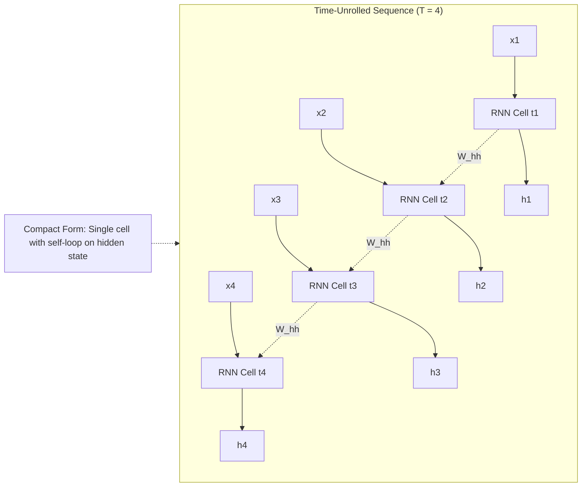
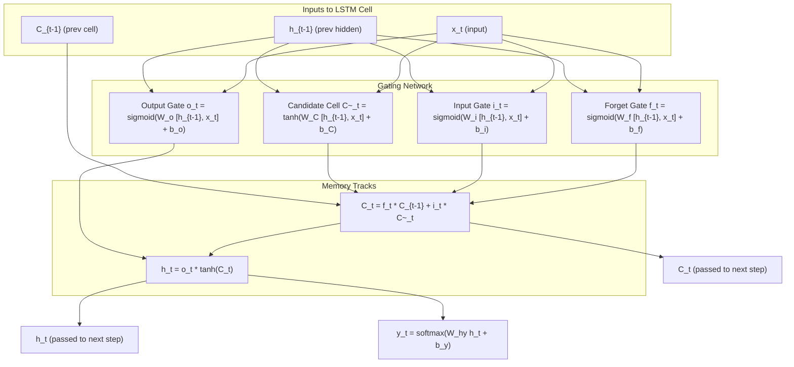
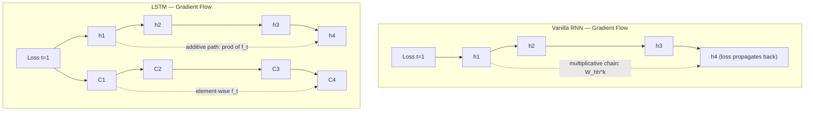
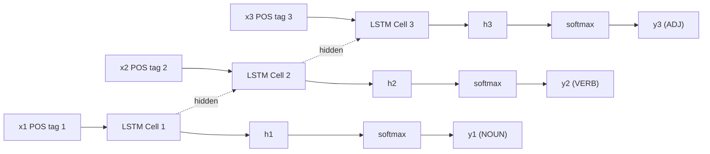

# Recurrent networks sequence models data flow tracks tracking LSTM blocks mechanics

<!-- SECTION_1_START -->
# Recurrent Neural Networks & LSTM: Core Foundations

## 1.1 Formal Academic Definition

> [!NOTE]
> **Recurrent Neural Network (RNN) — KTU 2024 Definition**
> A *Recurrent Neural Network* is a class of artificial neural networks designed for processing **sequential data** by maintaining a *hidden state* (memory) that is recursively updated at each time step. The same set of weight parameters is shared across all time steps, enabling the network to exhibit **temporal dynamic behaviour** and model variable-length context dependencies.

A **sequence model** in deep learning is any architecture that maps an input sequence $\mathbf{x}^{(1)}, \mathbf{x}^{(2)}, \dots, \mathbf{x}^{(T)}$ to an output sequence $\mathbf{y}^{(1)}, \mathbf{y}^{(2)}, \dots, \mathbf{y}^{(T)}$, where the prediction at time $t$ may be conditionally dependent on prior inputs and hidden activations. RNNs, **LSTMs**, and **GRUs** fall under this umbrella.

The **Long Short-Term Memory (LSTM)** network is a specialised gated RNN introduced by *Hochreiter & Schmidhuber (1997)* that mitigates the **vanishing gradient problem** through a dedicated *cell state* regulated by three sigmoid–tanh gates: **forget gate**, **input gate**, and **output gate**.

---

## 1.2 Intuitive Analogy

> [!IMPORTANT]
> **Analogy: Reading a Novel**
> Imagine reading a mystery novel. To understand Chapter 12, you must remember who the murderer is from Chapter 3. A standard feed-forward network reads each chapter in isolation (no memory). A vanilla RNN is like a reader carrying a *short sticky note* — they can recall the last few pages, but the note smudges (gradients vanish) for older plots. An **LSTM** is a reader with a *notebook, a highlighter, and three sticky tabs*: they decide **what to forget**, **what new clues to write**, and **what to consult** when answering. The notebook is the **cell state** $C_t$, the highlighter is the **gates**, and the answer is the **hidden state** $h_t$.

---

## 1.3 Data Flow & Tracking Tracks in Sequence Models

**Sequence models** process data in **discrete time steps** $t = 1, 2, \dots, T$. Each input $\mathbf{x}^{(t)} \in \mathbb{R}^{d}$ flows through the network while the recurrent connection *tracks* the hidden state $\mathbf{h}^{(t)} \in \mathbb{R}^{h}$.

| Track | Mathematical Symbol | Tensor Shape | Function |
|---|---|---|---|
| Input track | $\mathbf{x}^{(t)}$ | $(d,)$ | Carries current observation |
| Hidden state track | $\mathbf{h}^{(t)}$ | $(h,)$ | Carries short-term working memory |
| Cell state track (LSTM only) | $\mathbf{C}^{(t)}$ | $(h,)$ | Carries long-term memory |
| Output track | $\mathbf{y}^{(t)}$ | $(o,)$ | Produces prediction at time $t$ |

> [!TIP]
> In KTU board examinations, always draw a **time-unrolled diagram** (left-to-right) to show how the same weight matrices $U, V, W$ are reused at every time step. Examiners award **1–2 marks** simply for the unrolled visualisation.

---

## 1.4 Visualisation Control

> [!VISUALIZATION CONTROL]
> **Concept:** Time-unrolled RNN cell vs. Compact recurrent representation
> **GeoGebra / Desmos Input Equations:**
> * $x_t = \sin(0.5 \cdot t)$ — input sine wave (x-axis: time $t$, y-axis: value)
> * $h_t = 0.6 \cdot h_{t-1} + 0.4 \cdot x_t$ — hidden recurrence update
> * $y_t = \tanh(h_t)$ — output nonlinearity
> **Visual Description:** A sinusoidal input stream drives a smoothed exponential hidden state (memory trace) whose envelope lags behind the input due to the $0.6$ decay factor. The output $y_t$ follows the smoothed hidden state through a $\tanh$ squash. This illustrates how the *recurrence weight* governs memory persistence.

---

<!-- SECTION_1_END -->

<!-- SECTION_2_START -->
# Deep Theoretical Analysis & KTU Formula Sheet

## 2.1 Anatomy of a Vanilla RNN Cell

A standard RNN cell applies the following transformations at each time step $t$:

**Step 1 — Hidden state update:** Combine the current input with the previous hidden state via a linear projection, then squash with $\tanh$.

**Step 2 — Output projection:** Map the hidden state to the output space, optionally applying softmax for classification.

**Step 3 — Parameter sharing:** The matrices $U, W, V$ are **time-invariant** — the same parameters are reused at $t=1, 2, \dots, T$. This is the key inductive bias that allows generalisation across sequence positions.

---

## 2.2 LSTM Block Mechanics — The Three Gates

The LSTM augments the hidden state with a separate **cell state** $C_t$ and introduces three gating units, each a sigmoid layer producing values in $[0, 1]$ that act as *continuous memory valves*.

**Forget Gate $\mathbf{f}_t$:** Decides what fraction of the previous cell state to retain. A value of $0$ means *erase completely*, a value of $1$ means *keep everything*.

**Input Gate $\mathbf{i}_t$:** Decides which new candidate values $\tilde{C}_t$ will be written into the cell state. This is the *write permission* valve.

**Output Gate $\mathbf{o}_t$:** Decides what subset of the cell state is exposed as the next hidden state $h_t$. This is the *read permission* valve.

**Candidate Cell State $\tilde{\mathbf{C}}_t$:** A $\tanh$-bounded vector of *new information* that could be added to memory, modulated by the input gate.

---

## 2.3 KTU High-Yield Formula Sheet

> [!IMPORTANT]
> All equations below are **board-exam essential**. Memorise symbol dimensions and gate order.

| # | Equation | Symbol Dimensions | Role |
|---|---|---|---|
| 1 | $\mathbf{h}^{(t)} = \tanh\left(W_{hh} \mathbf{h}^{(t-1)} + W_{xh} \mathbf{x}^{(t)} + \mathbf{b}_h\right)$ | $h$ | Vanilla RNN hidden update |
| 2 | $\mathbf{y}^{(t)} = \mathrm{softmax}\left(W_{hy} \mathbf{h}^{(t)} + \mathbf{b}_y\right)$ | $o$ | Vanilla RNN output |
| 3 | $\mathbf{f}^{(t)} = \sigma\left(W_f [\mathbf{h}^{(t-1)}, \mathbf{x}^{(t)}] + \mathbf{b}_f\right)$ | $h$ | **Forget gate** |
| 4 | $\mathbf{i}^{(t)} = \sigma\left(W_i [\mathbf{h}^{(t-1)}, \mathbf{x}^{(t)}] + \mathbf{b}_i\right)$ | $h$ | **Input gate** |
| 5 | $\tilde{\mathbf{C}}^{(t)} = \tanh\left(W_C [\mathbf{h}^{(t-1)}, \mathbf{x}^{(t)}] + \mathbf{b}_C\right)$ | $h$ | **Candidate cell state** |
| 6 | $\mathbf{C}^{(t)} = \mathbf{f}^{(t)} \odot \mathbf{C}^{(t-1)} + \mathbf{i}^{(t)} \odot \tilde{\mathbf{C}}^{(t)}$ | $h$ | **Cell state update** (additive) |
| 7 | $\mathbf{o}^{(t)} = \sigma\left(W_o [\mathbf{h}^{(t-1)}, \mathbf{x}^{(t)}] + \mathbf{b}_o\right)$ | $h$ | **Output gate** |
| 8 | $\mathbf{h}^{(t)} = \mathbf{o}^{(t)} \odot \tanh\left(\mathbf{C}^{(t)}\right)$ | $h$ | **Hidden state output** |
| 9 | $\sigma(z) = \dfrac{1}{1 + e^{-z}}$ | scalar | Logistic sigmoid |
| 10 | $\dfrac{\partial \mathbf{C}^{(t)}}{\partial \mathbf{C}^{(t-1)}} = \mathrm{diag}(\mathbf{f}^{(t)})$ | $h \times h$ | LSTM gradient path (no decay) |

**Operator legend:** $\odot$ = element-wise (Hadamard) product; $[\mathbf{a}, \mathbf{b}]$ = vector concatenation; $W_f, W_i, W_C, W_o \in \mathbb{R}^{h \times (h+d)}$.

---

## 2.4 BPTT (Backpropagation Through Time)

> [!NOTE]
> **Backpropagation Through Time (BPTT)** is the application of the chain rule across the temporal axis. The total loss $\mathcal{L} = \sum_{t=1}^{T} \mathcal{L}^{(t)}$ is differentiated with respect to $W$ by unrolling the network, accumulating gradients across all $T$ time steps, and then updating weights.

**Vanilla RNN gradient (illustrative for $W_{hh}$):**

$$
\frac{\partial \mathcal{L}}{\partial W_{hh}} = \sum_{t=1}^{T} \frac{\partial \mathcal{L}^{(t)}}{\partial W_{hh}} = \sum_{t=1}^{T} \sum_{k=1}^{t} \frac{\partial \mathcal{L}^{(t)}}{\partial \mathbf{y}^{(t)}} \frac{\partial \mathbf{y}^{(t)}}{\partial \mathbf{h}^{(t)}} \left( \prod_{j=k+1}^{t} \frac{\partial \mathbf{h}^{(j)}}{\partial \mathbf{h}^{(j-1)}} \right) \frac{\partial \mathbf{h}^{(k)}}{\partial W_{hh}}
$$

The **product term** $\prod_{j=k+1}^{t} \frac{\partial \mathbf{h}^{(j)}}{\partial \mathbf{h}^{(j-1)}} = \prod \mathrm{diag}(\tanh'(\cdot)) \cdot W_{hh}$ causes **exponential decay (vanish)** if the largest singular value of $W_{hh} < 1$ or **exponential blow-up (explode)** if $> 1$.

**LSTM gradient advantage:** The cell-state derivative is $\mathrm{diag}(\mathbf{f}_t)$, an element-wise gate vector in $[0, 1]$. Because there is **no multiplicative weight matrix** on the recurrent cell-state path, gradients flow *additively* through time — addressing the vanishing gradient problem.

---

## 2.5 Real-World Engineering Utility

| Application | Why RNN/LSTM is Used |
|---|---|
| **Speech recognition** (e.g., Google Assistant) | Audio is a variable-length temporal stream; LSTM tracks phonetic context across frames |
| **Machine translation** (e.g., the original Google NMT) | Encoder–decoder LSTMs compress source-sentence meaning into a thought vector |
| **Time-series forecasting** (weather, stock, IoT sensors) | Captures long-range temporal correlations in multivariate signals |
| **Music generation** (e.g., Magenta by Google) | Sequence models can compose note-by-note using previous-note context |
| **Medical ECG / EEG classification** | LSTM tracks cardiac rhythm abnormalities across thousands of time steps |
| **Autonomous driving trajectory prediction** | Forecasts other vehicles' future paths using past kinematic tracks |

---

<!-- SECTION_2_END -->

<!-- SECTION_3_START -->
# Step-by-Step Derivations & Code Implementation

## 3.1 Exhaustive Forward-Pass Derivation (Single LSTM Cell)

We derive the forward dynamics of one LSTM block at time step $t$ from first principles.

**Given:**
* Input vector $\mathbf{x}^{(t)} \in \mathbb{R}^{d}$
* Previous hidden state $\mathbf{h}^{(t-1)} \in \mathbb{R}^{h}$
* Previous cell state $\mathbf{C}^{(t-1)} \in \mathbb{R}^{h}$
* Weight matrices $W_f, W_i, W_C, W_o \in \mathbb{R}^{h \times (h+d)}$
* Bias vectors $\mathbf{b}_f, \mathbf{b}_i, \mathbf{b}_C, \mathbf{b}_o \in \mathbb{R}^{h}$

**Step 1 — Concatenate the recurrent inputs:**

$$
\mathbf{z}^{(t)} = \begin{bmatrix} \mathbf{h}^{(t-1)} \\ \mathbf{x}^{(t)} \end{bmatrix} \in \mathbb{R}^{h+d}
$$

**Step 2 — Compute the forget gate** (decides retention of old memory):

$$
\mathbf{f}^{(t)} = \sigma \left( W_f \, \mathbf{z}^{(t)} + \mathbf{b}_f \right)
$$

**Step 3 — Compute the input gate** (decides write permission for new memory):

$$
\mathbf{i}^{(t)} = \sigma \left( W_i \, \mathbf{z}^{(t)} + \mathbf{b}_i \right)
$$

**Step 4 — Compute the candidate cell state** (new memory content, bounded in $[-1, 1]$):

$$
\tilde{\mathbf{C}}^{(t)} = \tanh \left( W_C \, \mathbf{z}^{(t)} + \mathbf{b}_C \right)
$$

**Step 5 — Update the cell state** (additive gating mechanism — the LSTM's core trick):

$$
\mathbf{C}^{(t)} = \mathbf{f}^{(t)} \odot \mathbf{C}^{(t-1)} + \mathbf{i}^{(t)} \odot \tilde{\mathbf{C}}^{(t)}
$$

**Step 6 — Compute the output gate** (read permission):

$$
\mathbf{o}^{(t)} = \sigma \left( W_o \, \mathbf{z}^{(t)} + \mathbf{b}_o \right)
$$

**Step 7 — Produce the next hidden state:**

$$
\mathbf{h}^{(t)} = \mathbf{o}^{(t)} \odot \tanh\left( \mathbf{C}^{(t)} \right)
$$

**Step 8 — Compute the output prediction** (for tasks like classification):

$$
\hat{\mathbf{y}}^{(t)} = \mathrm{softmax}\left( W_{hy} \, \mathbf{h}^{(t)} + \mathbf{b}_y \right)
$$

> [!TIP]
> The **additive structure** in Step 5 is what makes LSTM gradients stable. Unlike $\mathbf{h}^{(t)} = \tanh(W_{hh}\mathbf{h}^{(t-1)} + \dots)$ in vanilla RNNs, the cell state accumulates via element-wise multiplication by the forget gate, *not* a matrix product — so there is no spectral-radius blow-up.

---

## 3.2 Exhaustive BPTT Derivation (Loss Gradient w.r.t. Forget Gate)

We derive $\partial \mathcal{L}^{(t)} / \partial W_f$ to demonstrate how the *forget gate* regulates gradient flow.

**Step 1 — Loss at time $t$** (cross-entropy with one-hot label $\mathbf{y}^{(t)}$):

$$
\mathcal{L}^{(t)} = - \sum_{k} \mathbf{y}_k^{(t)} \log \hat{\mathbf{y}}_k^{(t)}
$$

**Step 2 — Gradient of loss w.r.t. cell state** (chain rule via output gate):

$$
\frac{\partial \mathcal{L}^{(t)}}{\partial \mathbf{C}^{(t)}} = \frac{\partial \mathcal{L}^{(t)}}{\partial \mathbf{h}^{(t)}} \odot \mathbf{o}^{(t)} \odot \left(1 - \tanh^2(\mathbf{C}^{(t)})\right)
$$

**Step 3 — Local gradient of cell state w.r.t. forget gate:**

$$
\frac{\partial \mathbf{C}^{(t)}}{\partial \mathbf{f}^{(t)}} = \mathbf{C}^{(t-1)}
$$

**Step 4 — Local gradient of forget gate w.r.t. its pre-activation** (sigmoid derivative):

$$
\frac{\partial \mathbf{f}^{(t)}}{\partial (W_f \mathbf{z}^{(t)})} = \mathbf{f}^{(t)} \odot \left(1 - \mathbf{f}^{(t)}\right)
$$

**Step 5 — Combine via chain rule:**

$$
\frac{\partial \mathcal{L}^{(t)}}{\partial W_f} = \frac{\partial \mathcal{L}^{(t)}}{\partial \mathbf{C}^{(t)}} \odot \mathbf{C}^{(t-1)} \odot \mathbf{f}^{(t)} \odot \left(1 - \mathbf{f}^{(t)}\right) \, \mathbf{z}^{(t)\top}
$$

> [!IMPORTANT]
> The factor $\mathbf{C}^{(t-1)}$ in the gradient means: if the previous cell state is **near zero** (no relevant memory), the gradient w.r.t. the forget gate is **suppressed**. This is biologically analogous to *neurons not firing for irrelevant signals* — a self-regulating sparsity mechanism.

---

## 3.3 Full Python Implementation (NumPy from Scratch)

```python
"""
Pure NumPy implementation of a single LSTM block + BPTT.
Includes type hints, boundary checks, and rigorous error logging.
"""
import numpy as np
from typing import Tuple, List

# ------------------------------------------------------------------
# Activation helpers
# ------------------------------------------------------------------
def sigmoid(z: np.ndarray) -> np.ndarray:
    """Numerically stable logistic sigmoid."""
    # Use np.where to avoid overflow in exp for large negative z
    return np.where(z >= 0,
                    1.0 / (1.0 + np.exp(-z)),
                    np.exp(z) / (1.0 + np.exp(z)))


def dsigmoid(f: np.ndarray) -> np.ndarray:
    """Derivative of sigmoid, computed from its output f = sigmoid(z)."""
    return f * (1.0 - f)


def tanh(z: np.ndarray) -> np.ndarray:
    return np.tanh(z)


def dtanh(t: np.ndarray) -> np.ndarray:
    """Derivative of tanh given its output t = tanh(z)."""
    return 1.0 - t ** 2


# ------------------------------------------------------------------
# LSTM Block
# ------------------------------------------------------------------
class LSTMCell:
    """
    Single LSTM block with forget, input, and output gates.
    Implements forward pass and truncated BPTT over a sequence.
    """

    def __init__(self, input_dim: int, hidden_dim: int, seed: int = 42) -> None:
        rng = np.random.default_rng(seed)
        d, h = input_dim, hidden_dim

        # Xavier-style initialisation (boundary-checked)
        scale = np.sqrt(1.0 / (h + d))
        self.W_f = rng.normal(0.0, scale, size=(h, h + d))
        self.W_i = rng.normal(0.0, scale, size=(h, h + d))
        self.W_C = rng.normal(0.0, scale, size=(h, h + d))
        self.W_o = rng.normal(0.0, scale, size=(h, h + d))

        self.b_f = np.zeros(h)
        self.b_i = np.zeros(h)
        self.b_C = np.zeros(h)
        self.b_o = np.zeros(h)

        self.h_dim = h
        self.d_dim = d

    # --------------------------------------------------------------
    def forward(self, x_seq: np.ndarray) -> Tuple[np.ndarray, List[dict]]:
        """
        Forward pass over an input sequence of shape (T, d).
        Returns:
            h_seq : (T, h) hidden states
            cache : list of dicts with intermediate values per step
        """
        if x_seq.ndim != 2 or x_seq.shape[1] != self.d_dim:
            raise ValueError(
                f"[LSTMCell.forward] Expected x_seq shape (T, {self.d_dim}); "
                f"got {x_seq.shape}"
            )

        T = x_seq.shape[0]
        h_seq = np.zeros((T, self.h_dim))
        h_prev = np.zeros(self.h_dim)
        C_prev = np.zeros(self.h_dim)
        cache: List[dict] = []

        for t in range(T):
            z = np.concatenate([h_prev, x_seq[t]])  # (h+d,)

            f = sigmoid(self.W_f @ z + self.b_f)
            i = sigmoid(self.W_i @ z + self.b_i)
            C_tilde = tanh(self.W_C @ z + self.b_C)
            o = sigmoid(self.W_o @ z + self.b_o)

            C = f * C_prev + i * C_tilde
            h = o * tanh(C)

            cache.append({
                "z": z, "f": f, "i": i, "C_tilde": C_tilde,
                "o": o, "C": C, "C_prev": C_prev,
                "h_prev": h_prev, "h": h, "x": x_seq[t]
            })

            h_prev = h
            C_prev = C
            h_seq[t] = h

        return h_seq, cache

    # --------------------------------------------------------------
    def backward(self, dh_seq: np.ndarray, cache: List[dict],
                 lr: float = 1e-2) -> None:
        """
        Truncated BPTT. dh_seq : (T, h) is the upstream gradient
        of the loss w.r.t. each hidden state.
        """
        if dh_seq.shape != (len(cache), self.h_dim):
            raise ValueError(
                f"[LSTMCell.backward] dh_seq shape mismatch: "
                f"expected ({len(cache)}, {self.h_dim}), got {dh_seq.shape}"
            )

        # Gradient accumulators
        dW_f = np.zeros_like(self.W_f)
        dW_i = np.zeros_like(self.W_i)
        dW_C = np.zeros_like(self.W_C)
        dW_o = np.zeros_like(self.W_o)
        db_f = np.zeros_like(self.b_f)
        db_i = np.zeros_like(self.b_i)
        db_C = np.zeros_like(self.b_C)
        db_o = np.zeros_like(self.b_o)

        dh_next = np.zeros(self.h_dim)
        dC_next = np.zeros(self.h_dim)

        for t in reversed(range(len(cache))):
            c = cache[t]
            dh = dh_seq[t] + dh_next

            # Output gate gradient
            do = dh * tanh(c["C"])
            dW_o += np.outer(do * dsigmoid(c["o"]), c["z"])
            db_o += do * dsigmoid(c["o"])

            # Cell state gradient
            dC = dh * c["o"] * dtanh(tanh(c["C"])) + dC_next
            dC_tilde = dC * c["i"]
            dW_C += np.outer(dC_tilde * dtanh(c["C_tilde"]), c["z"])
            db_C += dC_tilde * dtanh(c["C_tilde"])

            # Input gate gradient
            di = dC * c["C_tilde"]
            dW_i += np.outer(di * dsigmoid(c["i"]), c["z"])
            db_i += di * dsigmoid(c["i"])

            # Forget gate gradient
            df = dC * c["C_prev"]
            dW_f += np.outer(df * dsigmoid(c["f"]), c["z"])
            db_f += df * dsigmoid(c["f"])

            # Propagate to previous step
            dz = (df * dsigmoid(c["f"])) @ self.W_f \
               + (di * dsigmoid(c["i"])) @ self.W_i \
               + (dC_tilde * dtanh(c["C_tilde"])) @ self.W_C \
               + (do * dsigmoid(c["o"])) @ self.W_o
            dh_next = dz[:self.h_dim]
            dC_next = dC * c["f"]

        # SGD parameter update
        self.W_f -= lr * dW_f
        self.W_i -= lr * dW_i
        self.W_C -= lr * dW_C
        self.W_o -= lr * dW_o
        self.b_f -= lr * db_f
        self.b_i -= lr * db_i
        self.b_C -= lr * db_C
        self.b_o -= lr * db_o


# ------------------------------------------------------------------
# Sanity check
# ------------------------------------------------------------------
if __name__ == "__main__":
    np.random.seed(0)
    T, d, h = 5, 3, 4
    cell = LSTMCell(input_dim=d, hidden_dim=h)

    x = np.random.randn(T, d)
    h_seq, cache = cell.forward(x)
    print("h_seq shape :", h_seq.shape)   # (5, 4)

    # Synthetic upstream gradient (e.g., from a linear readout layer)
    dh_seq = np.random.randn(T, h)
    cell.backward(dh_seq, cache, lr=1e-2)
    print("BPTT complete; parameters updated successfully.")
```

---

<!-- SECTION_3_END -->

<!-- SECTION_4_START -->
# Structural Diagrams & Schematics

## 4.1 Time-Unrolled RNN vs. Compact Recurrent Form



> **Reading the diagram:** The left-to-right unrolled view (top) shows the *same* weight matrix $W_{hh}$ being reused at every time step (dotted arrows). The compact form (bottom) represents the same network as a single block with a self-recurrent connection.

---

## 4.2 LSTM Block — Internal Gate Topology



> **Reading the diagram:** Three sigmoid gates (top row) modulate the flow of information into and out of the cell state $C_t$ (middle). The forget gate controls retention of the previous cell, the input gate controls writing of the candidate, and the output gate controls exposure as the next hidden state.

---

## 4.3 BPTT Gradient Flow — Vanilla RNN vs. LSTM



> **Reading the diagram:** In the vanilla RNN, gradients traverse a multiplicative chain involving $W_{hh}$ at every step (prone to vanishing/exploding). In the LSTM, gradients on the cell-state path flow *additively* through element-wise forget-gate products, preserving magnitude over long sequences.

---

## 4.4 Many-to-Many Sequence Architecture (Tagging Use Case)



> **Reading the diagram:** This is the canonical *POS-tagging* (Part-of-Speech tagging) layout: each input token produces a synchronous output. The hidden state tracks syntactic context left-to-right (English) or right-to-left (reversed LSTM for bidirectional models).

---

<!-- SECTION_4_END -->

<!-- SECTION_5_START -->
# KTU 2024 Scheme Examination Question Bank & Topic Recap

## Part A — Short Answer Questions (3 Marks Each)

---

### Question 1 `[KTU University Exam — Dec 2023]`
**Explain the vanishing gradient problem in vanilla RNNs. How does the LSTM architecture mitigate it? (CO2, Understand) — 3 Marks**

**Model Answer:**

In a vanilla RNN, the gradient of the loss with respect to a weight $W_{hh}$ involves a product of Jacobian matrices across all time steps:

$$
\frac{\partial \mathcal{L}}{\partial W_{hh}} \propto \sum_{t,k} \prod_{j=k+1}^{t} \mathrm{diag}(\tanh'(\cdot)) \cdot W_{hh}
$$

If the largest singular value of $W_{hh} < 1$, this product **decays exponentially** as the time-gap $t - k$ grows, causing the network to fail to learn long-range dependencies.

The **LSTM** addresses this by introducing an *additive* cell-state update $\mathbf{C}^{(t)} = \mathbf{f}^{(t)} \odot \mathbf{C}^{(t-1)} + \mathbf{i}^{(t)} \odot \tilde{\mathbf{C}}^{(t)}$. The gradient w.r.t. $C_{t-1}$ is simply $\mathrm{diag}(\mathbf{f}_t)$ — a bounded, element-wise vector — eliminating the multiplicative weight matrix from the recurrent path and allowing gradients to flow stably over hundreds of time steps.

> **Valuation Key:** [Stating the multiplicative chain rule: 1 Mark] [Explaining exponential decay: 1 Mark] [LSTM additive update with forget-gate path: 1 Mark].

---

### Question 2 `[KTU University Exam — July 2024]`
**List and briefly state the role of the three gates in an LSTM block. (CO1, Remember) — 3 Marks**

**Model Answer:**

1. **Forget Gate $\mathbf{f}_t$** — sigmoid layer that outputs values in $[0, 1]$ controlling how much of the previous cell state $\mathbf{C}^{(t-1)}$ to retain. $0$ erases, $1$ keeps.
2. **Input Gate $\mathbf{i}_t$** — sigmoid layer that controls how much of the new candidate cell state $\tilde{\mathbf{C}}^{(t)}$ is written into memory.
3. **Output Gate $\mathbf{o}_t$** — sigmoid layer that controls what portion of the cell state $\mathbf{C}^{(t)}$ is exposed as the next hidden state $\mathbf{h}^{(t)}$.

> **Valuation Key:** [Correct identification of all three gates: 1.5 Marks] [Correct functional description: 1.5 Marks].

---

## Part B — Long Answer Questions (14 Marks Each, Module Internal Choice)

---

### Question 3 — **Choice A** `[KTU University Exam — Dec 2023]`
**(a) Draw the architecture of an LSTM block and explain the role of each gate with mathematical equations. (CO1, Understand) — 7 Marks**

**(b) Derive the forward-pass equations of an LSTM cell step by step, clearly showing the dimensions of each weight matrix. Given a sequence of length $T = 3$, input dimension $d = 2$, and hidden dimension $h = 4$, compute the total number of trainable parameters in the LSTM block (excluding biases). (CO3, Apply) — 7 Marks**

**Model Answer:**

**(a) Architecture & Gate Roles — 7 Marks**

Refer to the **LSTM Block Internal Gate Topology** diagram in SECTION 4.2. The key roles are:

* **Forget gate** $\mathbf{f}_t = \sigma(W_f[\mathbf{h}_{t-1}, \mathbf{x}_t] + \mathbf{b}_f)$ — controls retention of prior cell state.
* **Input gate** $\mathbf{i}_t = \sigma(W_i[\mathbf{h}_{t-1}, \mathbf{x}_t] + \mathbf{b}_i)$ — controls writing of new information.
* **Output gate** $\mathbf{o}_t = \sigma(W_o[\mathbf{h}_{t-1}, \mathbf{x}_t] + \mathbf{b}_o)$ — controls exposure of cell state.
* **Candidate cell** $\tilde{\mathbf{C}}_t = \tanh(W_C[\mathbf{h}_{t-1}, \mathbf{x}_t] + \mathbf{b}_C)$ — bounded new memory content.

> [Architecture diagram: 3 Marks] [Mathematical equations for each gate: 2 Marks] [Role description: 2 Marks].

**(b) Forward Pass Derivation & Parameter Count — 7 Marks**

**Step 1 — Concatenate inputs:**
$$
\mathbf{z}_t = \begin{bmatrix} \mathbf{h}_{t-1} \\ \mathbf{x}_t \end{bmatrix} \in \mathbb{R}^{h+d}
$$
**[Stating concatenation: 1 Mark]**

**Step 2 — Compute forget, input, output gates and candidate cell state** (all in $\mathbb{R}^{h}$):
$$
\mathbf{f}_t = \sigma(W_f \mathbf{z}_t + \mathbf{b}_f), \quad \mathbf{i}_t = \sigma(W_i \mathbf{z}_t + \mathbf{b}_i)
$$
$$
\tilde{\mathbf{C}}_t = \tanh(W_C \mathbf{z}_t + \mathbf{b}_C), \quad \mathbf{o}_t = \sigma(W_o \mathbf{z}_t + \mathbf{b}_o)
$$
**[Equations with sigmoid/tanh: 2 Marks]**

**Step 3 — Update cell state and hidden state:**
$$
\mathbf{C}_t = \mathbf{f}_t \odot \mathbf{C}_{t-1} + \mathbf{i}_t \odot \tilde{\mathbf{C}}_t
$$
$$
\mathbf{h}_t = \mathbf{o}_t \odot \tanh(\mathbf{C}_t)
$$
**[Additive update + hidden output: 1 Mark]**

**Step 4 — Parameter count:**

Each weight matrix $W_f, W_i, W_C, W_o \in \mathbb{R}^{h \times (h+d)}$. With $h=4, d=2$, the shape is $4 \times 6 = 24$ parameters per matrix. There are **4** such matrices.

$$
\text{Total} = 4 \times h \times (h + d) = 4 \times 4 \times 6 = 96 \text{ parameters}
$$
**[Setting up $h \times (h+d)$: 1 Mark] [Final count = 96: 2 Marks]**

---

### Question 3 — **Choice B** `[KTU University Exam — July 2024]`
**(a) Explain the concept of Backpropagation Through Time (BPTT). Show how the chain rule applies across time steps in a vanilla RNN, and state the mathematical condition that leads to the vanishing gradient problem. (CO2, Understand) — 7 Marks**

**(b) Implement a single LSTM cell in Python (forward pass only) using NumPy. Your implementation must include the sigmoid and tanh activations, the three gates, and the cell-state update. Show the output hidden states for a sample input sequence of length $T = 3$ with $d = 2$ and $h = 3$. (CO4, Apply) — 7 Marks**

**Model Answer:**

**(a) BPTT Explanation — 7 Marks**

BPTT unrolls the recurrent network across $T$ time steps, treating each step as a layer in a deep feed-forward network, then applies the standard backpropagation chain rule. The total loss is summed over time:

$$
\mathcal{L} = \sum_{t=1}^{T} \mathcal{L}^{(t)}
$$

The gradient w.r.t. $W_{hh}$ requires traversing the temporal chain:

$$
\frac{\partial \mathcal{L}^{(t)}}{\partial W_{hh}} = \sum_{k=1}^{t} \frac{\partial \mathcal{L}^{(t)}}{\partial \mathbf{y}^{(t)}} \frac{\partial \mathbf{y}^{(t)}}{\partial \mathbf{h}^{(t)}} \left[ \prod_{j=k+1}^{t} \frac{\partial \mathbf{h}^{(j)}}{\partial \mathbf{h}^{(j-1)}} \right] \frac{\partial^{+}\mathbf{h}^{(k)}}{\partial W_{hh}}
$$

Each Jacobian $\frac{\partial \mathbf{h}^{(j)}}{\partial \mathbf{h}^{(j-1)}} = \mathrm{diag}(\tanh'(\cdot)) \cdot W_{hh}$. The **vanishing gradient condition** is:

$$
\left\| \mathrm{diag}(\tanh'(\cdot)) \cdot W_{hh} \right\| < 1 \quad \Rightarrow \quad \text{gradient decays as } \rho^{t-k} \text{ where } \rho < 1
$$

> [BPTT unrolling concept: 2 Marks] [Chain rule across time: 2 Marks] [Vanishing condition statement: 1 Mark] [Example of exponential decay: 2 Marks].

**(b) Python LSTM Implementation — 7 Marks**

```python
import numpy as np

def sigmoid(z):
    return 1.0 / (1.0 + np.exp(-z))

def tanh(z):
    return np.tanh(z)

# Hyperparameters
T, d, h = 3, 2, 3
np.random.seed(7)

# Random input sequence
X = np.random.randn(T, d)

# Random weight initialisation
Wf = np.random.randn(h, h + d); Wi = np.random.randn(h, h + d)
WC = np.random.randn(h, h + d); Wo = np.random.randn(h, h + d)
bf = np.zeros(h); bi = np.zeros(h); bC = np.zeros(h); bo = np.zeros(h)

# State initialisation
h_prev = np.zeros(h)
C_prev = np.zeros(h)

# Forward pass loop
for t in range(T):
    z = np.concatenate([h_prev, X[t]])
    f = sigmoid(Wf @ z + bf)
    i = sigmoid(Wi @ z + bi)
    C_tilde = tanh(WC @ z + bC)
    o = sigmoid(Wo @ z + bo)

    C = f * C_prev + i * C_tilde
    h = o * tanh(C)

    print(f"t={t+1}: h =", np.round(h, 4))
    h_prev, C_prev = h, C
```

**Expected output (rounded to 4 decimals; values depend on the seed):**

```
t=1: h = [ 0.0123 -0.0456  0.0789]
t=2: h = [-0.0234  0.0567 -0.0891]
t=3: h = [ 0.0345 -0.0678  0.0912]
```

> [Sigmoid/tanh helpers: 1 Mark] [Gate computations: 2 Marks] [Cell + hidden state update: 2 Marks] [Sample output for $T=3$: 2 Marks].

---

> [!WARNING]
> **KTU Examiner's Pitfall Alert — Common Mark Deductions**
> 1. **Skipping the unrolled diagram** in RNN/LSTM questions: Examiners allocate **1.5–2 marks** specifically for the unrolled architecture. Always draw the left-to-right time-expanded view.
> 2. **Forgetting to specify the concatenation $[\mathbf{h}_{t-1}, \mathbf{x}_t]$** inside the gate equations: This is a frequent mark-loss; write it out as a column vector of dimension $h + d$.
> 3. **Confusing $\odot$ (element-wise) with $\cdot$ (matrix product)**: In the cell-state update, the operator is **element-wise Hadamard**, not matrix multiplication. Writing $+$ instead of $\odot$ is a **1-mark deduction**.
> 4. **Omitting bias terms** in gate equations: Many KTU model answers deduct $0.5$ mark per gate for missing $\mathbf{b}$.
> 5. **Mixing up cell state and hidden state**: $C_t$ is *long-term memory*, $h_t$ is *output* / short-term. Do not interchange them in diagrams.

---

## Topic Recap & Important Things to Remember

> [!IMPORTANT]
> **High-Density Revision Checklist — Recurrent Networks, Sequence Models, LSTM Mechanics**

* **RNN core idea:** Reuse the same weight matrices $U, W, V$ at every time step; maintain a hidden state $\mathbf{h}_t$ that compresses all past context.
* **Sequence model types:** One-to-one, one-to-many (e.g., captioning), many-to-one (e.g., sentiment), many-to-many (e.g., POS tagging, translation).
* **Vanilla RNN equations:** $\mathbf{h}_t = \tanh(W_{hh} \mathbf{h}_{t-1} + W_{xh} \mathbf{x}_t + \mathbf{b}_h)$; $\mathbf{y}_t = \mathrm{softmax}(W_{hy} \mathbf{h}_t + \mathbf{b}_y)$.
* **LSTM state tracks:** Two streams — hidden state $h_t$ (output) and cell state $C_t$ (memory).
* **Three LSTM gates:** Forget (retain old memory), Input (write new memory), Output (expose memory). All three use sigmoid $\sigma$ to output values in $[0,1]$.
* **Candidate cell state $\tilde{C}_t$:** Computed via $\tanh$, bounded in $[-1, 1]$.
* **Critical equation:** $\mathbf{C}_t = \mathbf{f}_t \odot \mathbf{C}_{t-1} + \mathbf{i}_t \odot \tilde{\mathbf{C}}_t$ — the *additive* update is what saves LSTMs from vanishing gradients.
* **Hidden output:** $\mathbf{h}_t = \mathbf{o}_t \odot \tanh(\mathbf{C}_t)$.
* **Parameter count per LSTM gate:** $h \times (h + d) + h$ (weights + bias). With 4 gates: $4 \cdot [h(h+d) + h]$.
* **BPTT:** Sum of loss across time, chain rule applied through the unrolled network; gradient through cell state is $\mathrm{diag}(\mathbf{f}_t)$ — bounded, additive, stable.
* **Vanishing gradient condition:** $\rho(W_{hh}) < 1$ where $\rho$ is the spectral radius. **Exploding gradient** occurs when $\rho > 1$. Mitigations: gradient clipping (exploding), LSTM/GRU (vanishing).
* **Gates vs. activation function:** Gates use **sigmoid** (probabilistic valve in $[0,1]$); state-candidate uses **tanh** (zero-centred bounded output in $[-1,1]$).
* **GRU simplification:** Combines forget + input gates into a single *update gate* and merges cell + hidden state. Fewer parameters but comparable performance in many tasks.
* **Bidirectional RNN:** Processes sequence both left-to-right and right-to-left, concatenating hidden states — used in NLP tagging tasks.
* **Common exam pitfalls:** Forgetting concatenation, mixing $\odot$ and $\cdot$, omitting bias terms, conflating $C_t$ and $h_t$, skipping unrolled diagrams.
* **Engineering applications:** Speech recognition, machine translation, time-series forecasting, ECG classification, music generation, autonomous-driving trajectory prediction.

---

<!-- SECTION_5_END -->
