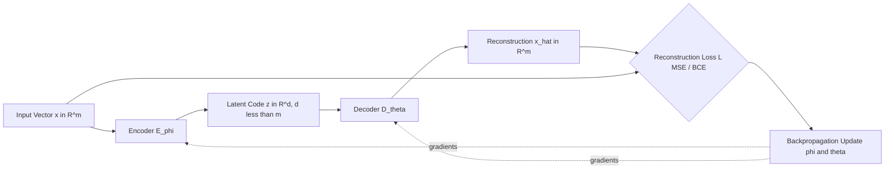
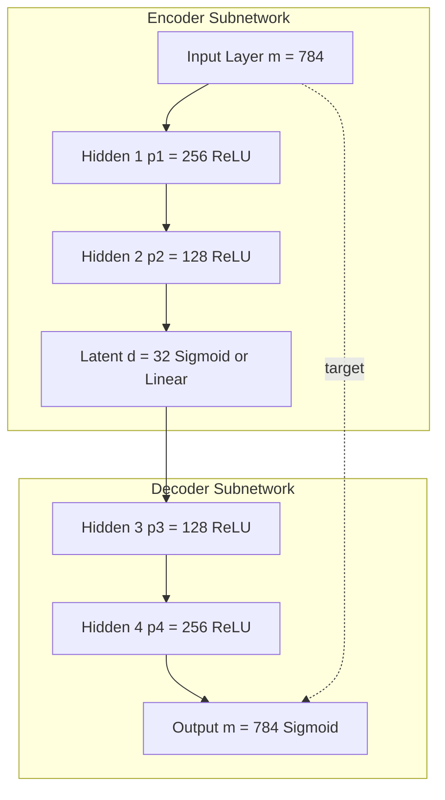
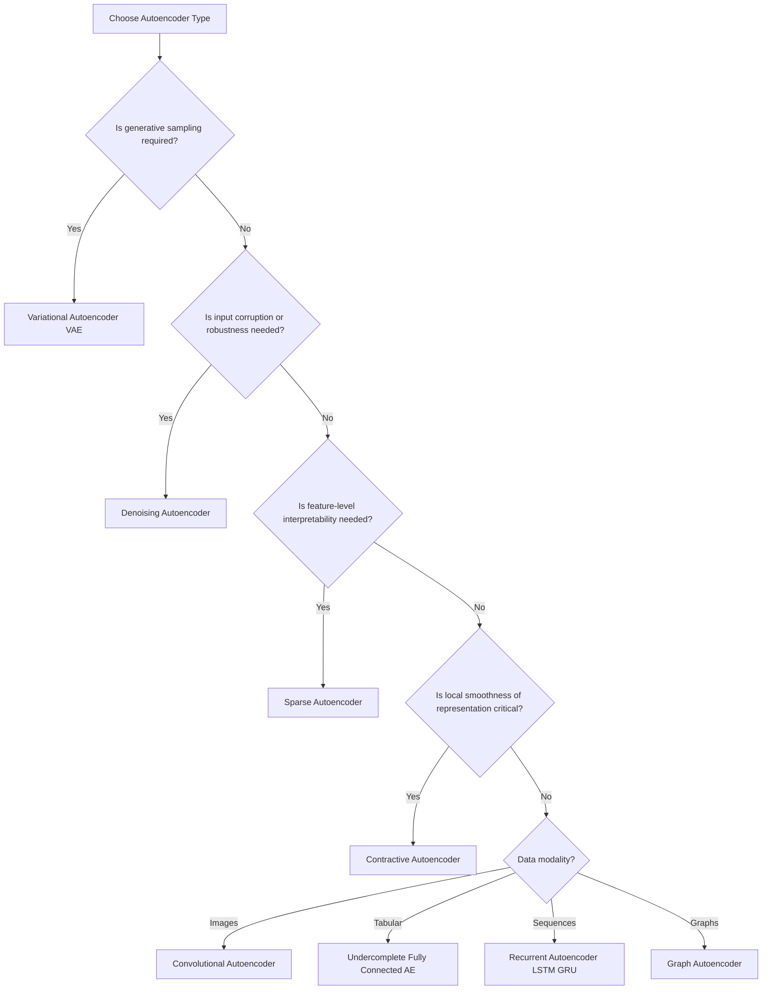
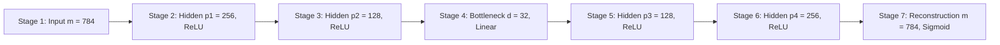
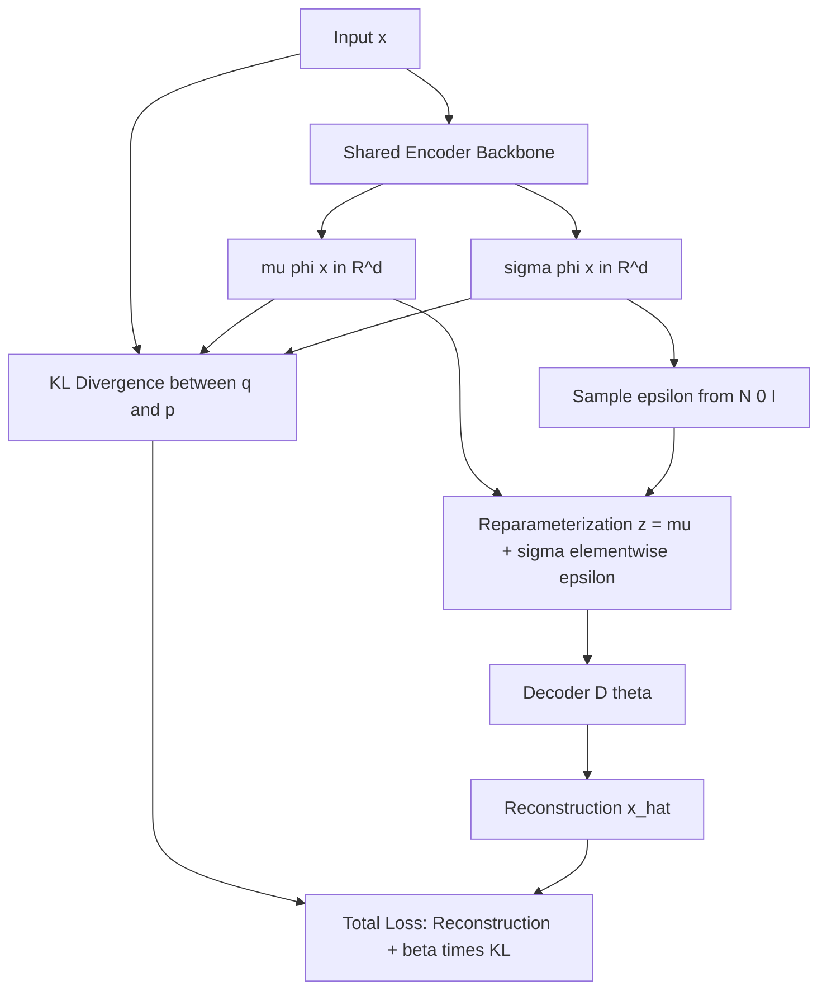
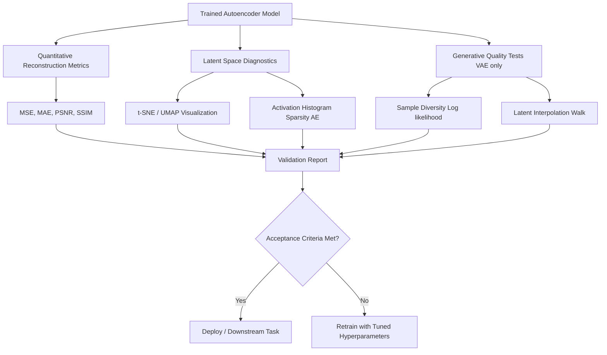
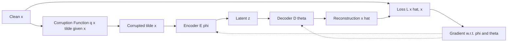

# Autoencoder network designs data dimension reduction paths validation options

<!-- SECTION_1_START -->
# Autoencoder Network Designs, Data Dimension Reduction Paths & Validation Options

## 1.1 Core Technical Definition

> [!IMPORTANT]
> **Autoencoder (AE):** A self-supervised neural network architecture designed to learn a compressed, distributed representation (encoding) of input data by training the network to reconstruct the original input from this compressed form. It consists of two mirrored sub-networks — an **Encoder** $E_{\phi}: \mathcal{X} \rightarrow \mathcal{Z}$ and a **Decoder** $D_{\theta}: \mathcal{Z} \rightarrow \mathcal{X}$ — connected through a low-dimensional **latent bottleneck** $\mathcal{Z} \in \mathbb{R}^{d}$ where $d \ll \dim(\mathcal{X})$.

Formally, given a dataset $\mathcal{D} = \{x^{(i)}\}_{i=1}^{N}$ with $x^{(i)} \in \mathbb{R}^{m}$, an autoencoder learns parameters $\{\phi, \theta\}$ by minimizing a reconstruction objective:

$$\mathcal{L}_{AE}(\phi, \theta) = \frac{1}{N}\sum_{i=1}^{N} \mathcal{L}\!\left(x^{(i)},\, D_{\theta}\!\left(E_{\phi}\!\left(x^{(i)}\right)\right)\right)$$

where $\mathcal{L}$ is typically the **Mean Squared Error (MSE)** for continuous inputs or **Binary Cross-Entropy (BCE)** for normalized pixel data.

> [!NOTE]
> **Self-Supervised Nature:** Autoencoders are classified as self-supervised learning models because the labels are auto-generated from the input itself (i.e., $y = x$). No external annotation is required.

## 1.2 Conceptual Analogy / Intuition

Imagine a **photographer sending a high-resolution 8K photograph to a friend over a slow internet connection**. The sender must:

1. **Compress** the image (Encoder) — strip away imperceptible noise, reduce color depth, and produce a compact `.zip` file.
2. **Transmit** the small file (Latent Vector) — only the essential "essence" crosses the bottleneck.
3. **Decompress** (Decoder) — reconstruct a near-identical image on the receiver's end.

The **bottleneck** is the slow internet pipe. If the pipe is too narrow, information is irreversibly lost. The network learns *what to keep* and *what to discard* — this is **representation learning**.

Another analogy: a **music summarizer** that converts a 5-minute symphony into a 30-second theme, then expands it back. A great autoencoder preserves semantic content (genre, mood) while discarding redundant detail (every micro-vibration).

## 1.3 The Three Architectural Building Blocks

| Block | Role | Mathematical Form | Typical Activation |
|---|---|---|---|
| **Encoder** $E_{\phi}$ | Maps $x \rightarrow z$ | $z = E_{\phi}(x) = \sigma(W_e x + b_e)$ | ReLU / Sigmoid |
| **Latent / Bottleneck** $\mathcal{Z}$ | Compressed code | $z \in \mathbb{R}^{d}$ with $d \ll m$ | Linear / Sigmoid |
| **Decoder** $D_{\theta}$ | Maps $z \rightarrow \hat{x}$ | $\hat{x} = D_{\theta}(z) = \sigma'(W_d z + b_d)$ | Sigmoid / Tanh / Linear |

> [!TIP]
> **Key Insight:** The encoder and decoder are *not* required to share parameters. Modern designs treat them as **independent networks** with mirrored but separately trainable weight matrices.

## 1.4 Why "Dimension Reduction" — and Why It Beats PCA?

Traditional **Principal Component Analysis (PCA)** performs linear, orthogonal projection. An autoencoder with a single hidden layer and linear activations is mathematically equivalent to PCA. However, deep autoencoders with **non-linear activations** learn a **manifold** of the data — a curved low-dimensional surface — which captures far richer structure.

> [!VISUALIZATION CONTROL]
> **Concept:** Swiss Roll manifold unfolding by a 2D Autoencoder
> **GeoGebra / Desmos Input Equations:**
> * `x(u,v) = (u*cos(u), u*sin(u), v)` where $u \in [1.5\pi, 4.5\pi]$, $v \in [0, 21]$
> * Encoder learns map: $(x_1, x_2, x_3) \rightarrow (u, v)$
> **Visual Description:** Students should observe that the 3D "rolled" sheet is unrolled to a 2D rectangle. The latent space $(u, v)$ is the *intrinsic* dimensionality of the data, which PCA cannot recover because PCA only finds linear projections.
<!-- SECTION_1_END -->

<!-- SECTION_2_START -->
# Deep Theoretical Analysis & KTU High-Yield Formula Sheet

## 2.1 The Information Bottleneck Principle

The autoencoder formalizes the **Information Bottleneck (IB) Lagrangian**, originally proposed by Tishby et al. (1999):

$$\mathcal{L}_{IB} = I(X; Z) - \beta \, I(Z; Y)$$

where $I(\cdot;\cdot)$ denotes mutual information. The autoencoder implicitly minimizes $I(X; Z)$ (compression) while maximizing preservation of structure. The **rate-distortion trade-off** is governed by the bottleneck width $d$.

## 2.2 Forward Pass Derivation (Vanilla Undercomplete AE)

For a single input $x \in \mathbb{R}^{m}$ through a 3-layer network (encoder, bottleneck, decoder):

**Step 1 — Encoder Hidden Layer:**
$$h = \sigma_1(W_1 x + b_1), \quad h \in \mathbb{R}^{p}$$

**Step 2 — Latent Code (Bottleneck):**
$$z = \sigma_2(W_2 h + b_2), \quad z \in \mathbb{R}^{d}, \; d < p < m$$

**Step 3 — Decoder Hidden Layer:**
$$\tilde{h} = \sigma_3(W_3 z + b_3), \quad \tilde{h} \in \mathbb{R}^{p}$$

**Step 4 — Reconstruction:**
$$\hat{x} = \sigma_4(W_4 \tilde{h} + b_4), \quad \hat{x} \in \mathbb{R}^{m}$$

**Step 5 — Loss (MSE):**
$$\mathcal{L}(x, \hat{x}) = \frac{1}{m}\sum_{j=1}^{m}(x_j - \hat{x}_j)^2$$

## 2.3 Taxonomy of Autoencoder Designs

| Type | Constraint | Loss Function | Use Case |
|---|---|---|---|
| **Undercomplete** | $d < m$ (narrow bottleneck) | MSE | Dimensionality reduction |
| **Sparse AE** | Sparsity penalty on $\rho$ (KL-divergence) | MSE $+\lambda \sum_j \mathrm{KL}(\rho \,\|\, \hat{\rho}_j)$ | Feature extraction |
| **Denoising AE (DAE)** | Trained on $\tilde{x} = x + \epsilon$ | $\mathcal{L}\!\left(x,\, D(E(\tilde{x}))\right)$ | Robust representation |
| **Contractive AE (CAE)** | Penalize Jacobian $\Vert J_E(x)\Vert_F^2$ | MSE $+ \lambda \sum_i \Vert \nabla_x h_i \Vert^2$ | Locally invariant features |
| **Variational AE (VAE)** | Posterior $\sim \mathcal{N}(\mu, \sigma^2)$ | Reconstruction $+\mathrm{KL}\!\left(q(z\mid x) \,\|\, p(z)\right)$ | Generative sampling |
| **Convolutional AE** | Conv/Deconv layers | MSE/BCE | Image compression, denoising |
| **Deep / Stacked AE** | Multiple hidden layers | MSE + optional regularization | Hierarchical features |

## 2.4 KTU Formula Sheet (High-Yield)

| Formula | Expression | Purpose |
|---|---|---|
| **MSE Loss** | $\mathcal{L} = \frac{1}{N}\sum_{i}\Vert x^{(i)} - \hat{x}^{(i)}\Vert_2^2$ | Reconstruction error |
| **BCE Loss** | $\mathcal{L} = -\frac{1}{N}\sum_{i}\!\left[x_i \log \hat{x}_i + (1-x_i)\log(1-\hat{x}_i)\right]$ | Binary / pixel data |
| **Sparsity KL Penalty** | $\mathrm{KL}(\rho \,\|\, \hat{\rho}_j) = \rho\log\frac{\rho}{\hat{\rho}_j} + (1-\rho)\log\frac{1-\rho}{1-\hat{\rho}_j}$ | Forces $\hat{\rho}_j \approx \rho$ (e.g., 0.05) |
| **Contractive Penalty** | $\Omega(h) = \lambda \sum_{i}\!\left\Vert \frac{\partial h_i}{\partial x}\right\Vert^2$ | Smoothness of encoder |
| **VAE ELBO** | $\mathcal{L}_{ELBO} = -\mathbb{E}_{q}[\log p(x\mid z)] + \mathrm{KL}\!\left(q(z\mid x) \,\|\, \mathcal{N}(0, I)\right)$ | Lower bound on $\log p(x)$ |
| **Reparameterization** | $z = \mu + \sigma \odot \epsilon, \quad \epsilon \sim \mathcal{N}(0, I)$ | Backprop through sampling |
| **DAE Corruption** | $\tilde{x} \sim q(\tilde{x}\mid x)$, e.g., masking noise, Gaussian, salt-and-pepper | Input perturbation |
| **Weight Decay ($L_2$)** | $\Omega(W) = \frac{\lambda}{2}\Vert W\Vert_F^2$ | Implicit undercompletion |

> [!IMPORTANT]
> **Critical Distinction:** For *deterministic* AEs (vanilla, sparse, denoising, contractive), validation measures **reconstruction fidelity**. For *probabilistic* AEs (VAE), validation requires **sample quality + KL-divergence convergence** + **latent smoothness**.

## 2.5 Engineering Real-World Utility

| Domain | Application | Autoencoder Type |
|---|---|---|
| **Anomaly Detection** | Fraud, manufacturing defects, network intrusion | Denoising / Undercomplete |
| **Image Denoising** | Medical MRI, low-light photography | Convolutional DAE |
| **Drug Discovery** | Molecular latent space for QSAR | VAE |
| **Recommendation Systems** | Collaborative filtering (AutoRec) | Undercomplete |
| **Pretraining** | Greedy layer-wise initialization of deep nets | Stacked / Deep |
| **Generative AI** | Face generation, molecule design | VAE, VQ-VAE |
| **Data Compression** | Lossy compression surpassing JPEG | Convolutional AE |
| **Dimensionality Reduction** | Alternative to t-SNE / UMAP | Deep AE |

## 2.6 Theoretical Justification for Non-Linearity

A linear encoder with one hidden layer satisfies:

$$z = W_2(W_1 x + b_1) + b_2 = W x + b$$

which spans the same subspace as **PCA**. To escape this limitation, at least one of the following must hold:
1. **Depth** $\geq 2$ encoder layers, OR
2. **Non-linear activation** $\sigma$ (ReLU, sigmoid, tanh), OR
3. **Stochastic regularization** (sparsity, denoising, contractive).
<!-- SECTION_2_END -->

<!-- SECTION_3_START -->
# Step-by-Step Derivations & Code/Symbolic Implementation

## 3.1 Exhaustive Derivation: Gradient of MSE Loss for Vanilla AE

Given loss $\mathcal{L} = \frac{1}{m}\sum_{j=1}^{m}(x_j - \hat{x}_j)^2$ and $\hat{x} = D_\theta(E_\phi(x))$, the gradient w.r.t. the decoder weight $W_4$ is:

**Step 1 — Partial derivative of loss w.r.t. $\hat{x}$:**
$$\frac{\partial \mathcal{L}}{\partial \hat{x}_j} = \frac{2}{m}(x_j - \hat{x}_j)$$

**Step 2 — Local gradient at output layer:**
Let $a_4 = W_4 \tilde{h} + b_4$ and $\hat{x} = \sigma_4(a_4)$. Then:
$$\delta_4 = \frac{\partial \mathcal{L}}{\partial a_4} = \frac{2}{m}(x - \hat{x}) \odot \sigma_4'(a_4)$$

**Step 3 — Gradient w.r.t. $W_4$:**
$$\frac{\partial \mathcal{L}}{\partial W_4} = \delta_4 \tilde{h}^{\top}$$

**Step 4 — Backpropagate through decoder layer 3:**
$$\delta_3 = (W_4^{\top} \delta_4) \odot \sigma_3'(a_3)$$
$$\frac{\partial \mathcal{L}}{\partial W_3} = \delta_3 z^{\top}$$

**Step 5 — Cross the bottleneck** (no gradient flow through the data, only through the learned code $z$):
$$\frac{\partial \mathcal{L}}{\partial z} = W_3^{\top} \delta_3$$

**Step 6 — Backprop through bottleneck activation:**
$$\delta_2 = \frac{\partial \mathcal{L}}{\partial z} \odot \sigma_2'(a_2)$$
$$\frac{\partial \mathcal{L}}{\partial W_2} = \delta_2 h^{\top}$$

**Step 7 — Backprop through encoder layer 1:**
$$\delta_1 = (W_2^{\top} \delta_2) \odot \sigma_1'(a_1)$$
$$\frac{\partial \mathcal{L}}{\partial W_1} = \delta_1 x^{\top}$$

**Update rule (SGD):**
$$W_\ell \leftarrow W_\ell - \eta \frac{\partial \mathcal{L}}{\partial W_\ell} \quad \text{for } \ell \in \{1, 2, 3, 4\}$$

## 3.2 Derivation: Sparsity KL Penalty

For a sparsity parameter $\rho$ (e.g., 0.05) and empirical average activation $\hat{\rho}_j = \frac{1}{N}\sum_i h_j(x^{(i)})$ over the $j$-th hidden unit:

$$\Omega_{\text{sparsity}} = \sum_{j=1}^{p} \mathrm{KL}\!\left(\rho \,\|\, \hat{\rho}_j\right) = \sum_{j=1}^{p} \left[\rho \log\frac{\rho}{\hat{\rho}_j} + (1-\rho)\log\frac{1-\rho}{1-\hat{\rho}_j}\right]$$

**Total loss:**
$$\mathcal{L}_{\text{total}} = \mathcal{L}_{\text{MSE}} + \lambda \, \Omega_{\text{sparsity}}$$

**Gradient w.r.t. $h_j(x^{(i)})$:**
$$\frac{\partial \Omega}{\partial h_j(x^{(i)})} = \lambda \left(-\frac{\rho}{\hat{\rho}_j} + \frac{1-\rho}{1-\hat{\rho}_j}\right)$$

This pulls each $\hat{\rho}_j$ toward the target $\rho$, forcing most units to be inactive for any given input.

## 3.3 Derivation: Denoising AE Objective

Given clean input $x$ and corrupted input $\tilde{x} \sim q(\tilde{x}\mid x)$ (e.g., random masking, Gaussian noise $\tilde{x} = x + \epsilon$, $\epsilon \sim \mathcal{N}(0, \sigma^2 I)$):

$$\mathcal{L}_{\text{DAE}} = -\mathbb{E}_{x \sim \mathcal{D}}\,\mathbb{E}_{\tilde{x} \sim q(\tilde{x}\mid x)}\!\left[\log p\!\left(x \,\big|\, D_\theta(E_\phi(\tilde{x}))\right)\right]$$

**Equivalent score-matching interpretation** (Alain & Bengio, 2014): for small Gaussian corruption $\sigma$, the DAE approximates the score $\nabla_x \log p_{\text{data}}(x)$.

## 3.4 Derivation: VAE ELBO

Let $p(z) = \mathcal{N}(0, I)$ be the prior, $p_\theta(x\mid z)$ the decoder likelihood, and $q_\phi(z\mid x)$ the encoder posterior (approximated as diagonal Gaussian: $q_\phi(z\mid x) = \mathcal{N}(\mu_\phi(x), \mathrm{diag}(\sigma_\phi^2(x)))$).

**Log-evidence decomposition:**
$$\log p_\theta(x) = \mathcal{L}_{ELBO}(\phi, \theta; x) + \mathrm{KL}\!\left(q_\phi(z\mid x) \,\|\, p_\theta(z\mid x)\right)$$

**ELBO (maximized):**
$$\mathcal{L}_{ELBO} = \mathbb{E}_{q_\phi(z\mid x)}\!\left[\log p_\theta(x\mid z)\right] - \mathrm{KL}\!\left(q_\phi(z\mid x) \,\|\, p(z)\right)$$

**Closed-form KL for diagonal Gaussians:**
$$\mathrm{KL}\!\left(\mathcal{N}(\mu, \sigma^2) \,\|\, \mathcal{N}(0, I)\right) = \frac{1}{2}\sum_{k=1}^{d}\left(\mu_k^2 + \sigma_k^2 - \log\sigma_k^2 - 1\right)$$

**Reparameterization trick (enables backprop through sampling):**
$$z = \mu_\phi(x) + \sigma_\phi(x) \odot \epsilon, \quad \epsilon \sim \mathcal{N}(0, I)$$

## 3.5 Full Operational Python Implementation (PyTorch)

```python
import torch
import torch.nn as nn
import torch.nn.functional as F
from torch.utils.data import DataLoader, TensorDataset
import numpy as np
import logging

logging.basicConfig(level=logging.INFO, format='%(asctime)s [%(levelname)s] %(message)s')


class VanillaAutoencoder(nn.Module):
    """Fully-connected undercomplete autoencoder with configurable depth."""

    def __init__(self, input_dim: int = 784, hidden_dims: list = None,
                 latent_dim: int = 32):
        super().__init__()
        if hidden_dims is None:
            hidden_dims = [256, 128]

        # ----- Encoder -----
        encoder_layers = []
        prev_dim = input_dim
        for h_dim in hidden_dims:
            encoder_layers.append(nn.Linear(prev_dim, h_dim))
            encoder_layers.append(nn.ReLU(inplace=True))
            prev_dim = h_dim
        encoder_layers.append(nn.Linear(prev_dim, latent_dim))
        self.encoder = nn.Sequential(*encoder_layers)

        # ----- Decoder (mirrored) -----
        decoder_layers = []
        prev_dim = latent_dim
        for h_dim in reversed(hidden_dims):
            decoder_layers.append(nn.Linear(prev_dim, h_dim))
            decoder_layers.append(nn.ReLU(inplace=True))
            prev_dim = h_dim
        decoder_layers.append(nn.Linear(prev_dim, input_dim))
        decoder_layers.append(nn.Sigmoid())  # bound output in [0,1]
        self.decoder = nn.Sequential(*decoder_layers)

        self._init_weights()

    def _init_weights(self):
        for m in self.modules():
            if isinstance(m, nn.Linear):
                nn.init.xavier_uniform_(m.weight)
                if m.bias is not None:
                    nn.init.zeros_(m.bias)

    def forward(self, x: torch.Tensor) -> tuple:
        z = self.encoder(x)
        x_hat = self.decoder(z)
        return x_hat, z

    def encode(self, x: torch.Tensor) -> torch.Tensor:
        return self.encoder(x)


class DenoisingAutoencoder(VanillaAutoencoder):
    """Adds stochastic input corruption during training."""

    def __init__(self, input_dim: int = 784, hidden_dims: list = None,
                 latent_dim: int = 32, noise_std: float = 0.1,
                 mask_prob: float = 0.0):
        super().__init__(input_dim, hidden_dims, latent_dim)
        self.noise_std = noise_std
        self.mask_prob = mask_prob

    def corrupt(self, x: torch.Tensor) -> torch.Tensor:
        if self.noise_std > 0:
            x = x + self.noise_std * torch.randn_like(x)
        if self.mask_prob > 0:
            mask = torch.bernoulli(torch.full_like(x, 1 - self.mask_prob))
            x = x * mask / (1 - self.mask_prob)
        return torch.clamp(x, 0.0, 1.0)

    def forward(self, x: torch.Tensor) -> tuple:
        x_corrupted = self.corrupt(x)
        z = self.encoder(x_corrupted)
        x_hat = self.decoder(z)
        return x_hat, z


def train_autoencoder(model: nn.Module, dataloader: DataLoader,
                      epochs: int = 20, lr: float = 1e-3,
                      device: str = 'cpu') -> list:
    """Generic training loop with reconstruction-loss tracking."""
    model = model.to(device)
    optimizer = torch.optim.Adam(model.parameters(), lr=lr)
    history = []

    for epoch in range(1, epochs + 1):
        model.train()
        epoch_loss = 0.0
        n_batches = 0
        for batch in dataloader:
            x = batch[0].to(device).view(-1, 784)
            x_hat, _ = model(x)
            loss = F.mse_loss(x_hat, x, reduction='mean')

            optimizer.zero_grad()
            loss.backward()
            torch.nn.utils.clip_grad_norm_(model.parameters(), max_norm=1.0)
            optimizer.step()

            epoch_loss += loss.item()
            n_batches += 1

        avg_loss = epoch_loss / max(n_batches, 1)
        history.append(avg_loss)
        logging.info(f"Epoch {epoch:02d}/{epochs}  |  MSE = {avg_loss:.6f}")

    return history


def validate_autoencoder(model: nn.Module, val_loader: DataLoader,
                         device: str = 'cpu') -> dict:
    """Compute MSE, MAE, PSNR, and per-sample reconstruction variance."""
    model.eval()
    model.to(device)
    mse_total, mae_total, psnr_total, n = 0.0, 0.0, 0.0, 0

    with torch.no_grad():
        for batch in val_loader:
            x = batch[0].to(device).view(-1, 784)
            x_hat, z = model(x)

            mse = F.mse_loss(x_hat, x, reduction='sum').item()
            mae = F.l1_loss(x_hat, x, reduction='sum').item()
            psnr = 10 * torch.log10(1.0 / F.mse_loss(x_hat, x, reduction='mean')).item()

            bs = x.size(0)
            mse_total += mse
            mae_total += mae
            psnr_total += psnr * bs
            n += bs

    return {
        'MSE': mse_total / (n * 784),
        'MAE': mae_total / (n * 784),
        'PSNR_dB': psnr_total / n,
        'latent_mean': z.mean().item(),
        'latent_std': z.std().item(),
    }


# --------------------- EXECUTION ---------------------
if __name__ == "__main__":
    # Simulated data
    X_train = torch.rand(5000, 784)
    X_val = torch.rand(1000, 784)
    train_loader = DataLoader(TensorDataset(X_train), batch_size=128, shuffle=True)
    val_loader = DataLoader(TensorDataset(X_val), batch_size=128)

    # Train vanilla AE
    model = VanillaAutoencoder(input_dim=784, hidden_dims=[256, 128], latent_dim=32)
    train_autoencoder(model, train_loader, epochs=20, lr=1e-3)

    # Validate
    metrics = validate_autoencoder(model, val_loader)
    print("Final validation metrics:", metrics)
```

## 3.6 Worked Numerical Example: PCA vs Single-Layer Linear AE

Given $X = \begin{bmatrix} 2 & 0 \\ 0 & 1 \\ -2 & 0 \\ 0 & -1 \end{bmatrix}$ (centered), PCA returns top-1 eigenvector $v_1 = (1, 0)^{\top}$.

**Step 1 — Compute covariance:**
$$C = \frac{1}{4}X^{\top}X = \begin{bmatrix} 2 & 0 \\ 0 & 0.5 \end{bmatrix}$$

**Step 2 — Eigendecomposition:**
$$\lambda_1 = 2, \, v_1 = (1, 0)^{\top}; \quad \lambda_2 = 0.5, \, v_2 = (0, 1)^{\top}$$

**Step 3 — PCA projection of $x^{(1)} = (2, 0)^{\top}$:**
$$z_1 = v_1^{\top} x^{(1)} = 2$$

**Step 4 — PCA reconstruction:**
$$\hat{x}^{(1)} = v_1 z_1 = (2, 0)^{\top}$$

**Step 5 — A linear single-hidden-layer AE with $W_1 = W_2^{\top} = v_1$ recovers this exactly:**
$$z = W_1 x = 2, \quad \hat{x} = W_2 z = (2, 0)^{\top}$$

This shows the **mathematical equivalence** between linear AE and PCA.

## 3.7 Validation Pipeline: Loss Curves, t-SNE, Downstream Task

| Step | Metric | Threshold / Target |
|---|---|---|
| 1. Reconstruction | **MSE, PSNR, SSIM** | PSNR > 25 dB (typical) |
| 2. Sparsity check | Average activation $\hat{\rho}_j$ | Within $\pm 0.02$ of target $\rho$ |
| 3. Latent distribution | Mean ≈ 0, Std ≈ 1 (for VAE) | $\vert\mu_k\vert < 0.1$, $\sigma_k \in [0.5, 2.0]$ |
| 4. Visualization | t-SNE / UMAP / PCA of $\mathcal{Z}$ | Distinct class clusters |
| 5. Interpolation | $\hat{x}_\alpha = D\!\left(\alpha z_1 + (1-\alpha)z_2\right)$ | Smooth, semantically meaningful |
| 6. Downstream task | Accuracy of classifier on $\mathcal{Z}$ | Comparable to raw-pixel baseline |
| 7. KL convergence (VAE) | $\mathrm{KL}(q(z\mid x) \,\|\, p(z)) \to 0$ | Posterior collapse warning if $≈ 0$ |
<!-- SECTION_3_END -->

<!-- SECTION_4_START -->
# Structural Diagrams & Schematics

## 4.1 High-Level Autoencoder Data Flow



## 4.2 Detailed Layer-by-Layer Topology



## 4.3 Autoencoder Family Decision Tree



## 4.4 Dimension Reduction Path (Sequential Topology Matrix)



**Compression ratio matrix:**

| Stage | Dimension | Compression Ratio |
|---|---|---|
| 1 | 784 | 1.00× |
| 2 | 256 | 3.06× |
| 3 | 128 | 6.13× |
| 4 (Bottleneck) | **32** | **24.5×** |
| 5 | 128 | 6.13× |
| 6 | 256 | 3.06× |
| 7 | 784 | 1.00× |

## 4.5 VAE Probabilistic Encoding Path



## 4.6 Validation Workflow Block Diagram



## 4.7 Block-Level Functional Architecture (Denoising AE Pipeline)


<!-- SECTION_4_END -->

<!-- SECTION_5_START -->
# KTU 2024 Scheme Examination Question Bank & Topic Recap

## Part A — Short Answer Questions (3 Marks Each)

### Q1. **[KTU University Exam — July 2024]** CO1 | Remember
**Define an autoencoder. List and briefly explain any two variants of autoencoders used for representation learning.**

**Model Answer:**

An **autoencoder** is a self-supervised neural network that learns a compact representation (encoding) of input data by training the network to output a reconstruction of the input. It consists of an encoder $E_\phi: \mathcal{X} \rightarrow \mathcal{Z}$ and a decoder $D_\theta: \mathcal{Z} \rightarrow \mathcal{X}$, trained to minimize $\mathcal{L}(x, D_\theta(E_\phi(x)))$.

**Two variants:**

1. **Sparse Autoencoder:** Adds a KL-divergence sparsity penalty on hidden activations, forcing each unit to be active only for a small fraction of inputs. Useful for interpretable feature extraction.
2. **Denoising Autoencoder (DAE):** Trained to reconstruct clean $x$ from a corrupted version $\tilde{x}$. The bottleneck + corruption force the model to learn robust, high-level features rather than identity mapping.

> **Valuation Key:** [Definition: 1 Mark] [Variant 1 explanation: 1 Mark] [Variant 2 explanation: 1 Mark]

---

### Q2. **[KTU University Exam — Dec 2023]** CO2 | Understand
**Why does a single hidden layer linear autoencoder mathematically reduce to PCA? Under what condition does a deep non-linear autoencoder surpass PCA?**

**Model Answer:**

A single hidden layer linear AE with $z = W_1 x$ and $\hat{x} = W_2 z$ solves:

$$\min_{W_1, W_2} \Vert X - W_2 W_1 X\Vert_F^2$$

The optimal solution satisfies $W_2 W_1 = U_d U_d^{\top}$ where $U_d$ contains the top-$d$ eigenvectors of the data covariance $X^{\top}X$. This is exactly the **PCA reconstruction subspace**.

**Condition to surpass PCA:** The autoencoder must include at least one of the following:
- **Non-linear activation** (ReLU, sigmoid, tanh) — allows learning a non-linear manifold.
- **Multiple hidden layers** — provides hierarchical feature composition.
- **Stochastic regularization** (sparsity, denoising, contractive) — restricts capacity non-parametrically.

> **Valuation Key:** [Equivalence argument: 1 Mark] [Condition statement: 1 Mark] [Justification: 1 Mark]

---

## Part B — Long Answer Questions (14 Marks)

> **KTU ESE Module Pattern:** Answer ANY ONE full question from the choice. Each question has sub-parts (a) 7 marks + (b) 7 marks.

---

### Q3A. **[KTU University Exam — July 2024]** CO2 | Apply + Analyze

**(a) Derive the closed-form loss function for a Variational Autoencoder (VAE) consisting of a Gaussian prior and Gaussian encoder posterior. Clearly write the reparameterization trick used to enable backpropagation. (7 Marks)**

**Model Solution:**

**Step 1 — Probabilistic setup:** Let prior $p(z) = \mathcal{N}(0, I)$, encoder posterior $q_\phi(z \mid x) = \mathcal{N}(\mu_\phi(x), \mathrm{diag}(\sigma_\phi^2(x)))$, decoder likelihood $p_\theta(x \mid z) = \mathcal{N}(\mu_\theta(z), I)$.

**Step 2 — Evidence Lower Bound (ELBO):**
$$\log p_\theta(x) \geq \mathcal{L}_{ELBO} = \mathbb{E}_{q_\phi(z \mid x)}[\log p_\theta(x \mid z)] - \mathrm{KL}\!\left(q_\phi(z \mid x) \,\|\, p(z)\right)$$

**Step 3 — Closed-form KL for diagonal Gaussians:**
$$\mathrm{KL}\!\left(\mathcal{N}(\mu, \sigma^2) \,\|\, \mathcal{N}(0, I)\right) = \frac{1}{2}\sum_{k=1}^{d}\left(\mu_k^2 + \sigma_k^2 - \log \sigma_k^2 - 1\right)$$

**Step 4 — Total VAE loss (negative ELBO, to be minimized):**
$$\mathcal{L}_{VAE} = -\frac{1}{N}\sum_{i=1}^{N}\mathbb{E}_{q_\phi(z \mid x^{(i)})}[\log p_\theta(x^{(i)} \mid z)] + \frac{1}{2}\sum_{k=1}^{d}\!\left(\mu_k^2 + \sigma_k^2 - \log \sigma_k^2 - 1\right)$$

**Step 5 — Reparameterization trick** (makes the sampling operation differentiable):
$$z = \mu_\phi(x) + \sigma_\phi(x) \odot \epsilon, \quad \epsilon \sim \mathcal{N}(0, I)$$

> **Valuation Key:** [Probabilistic setup: 1 Mark] [ELBO derivation: 2 Marks] [Closed-form KL: 2 Marks] [Reparameterization: 1 Mark] [Final loss expression: 1 Mark]

---

**(b) Compare and contrast Denoising Autoencoder, Sparse Autoencoder, and Contractive Autoencoder in terms of: regularization mechanism, loss function, computational complexity, and a representative use case. (7 Marks)**

**Model Solution:**

| Aspect | Denoising AE | Sparse AE | Contractive AE |
|---|---|---|---|
| **Regularization mechanism** | Stochastic input corruption $\tilde{x} \sim q(\tilde{x} \mid x)$ | KL-divergence penalty on activation $\hat{\rho}_j$ vs target $\rho$ | Frobenius norm of encoder Jacobian $\Vert J_E(x)\Vert_F^2$ |
| **Loss function** | $\mathcal{L}(x, D(E(\tilde{x})))$ | $\mathcal{L}_{MSE} + \lambda \sum_j \mathrm{KL}(\rho \,\|\, \hat{\rho}_j)$ | $\mathcal{L}_{MSE} + \lambda \sum_i \Vert \nabla_x h_i(x)\Vert^2$ |
| **Time complexity** | $O(\text{cost of forward pass} + \text{corruption sampling})$ | $O(\text{forward pass} + \text{activation aggregation over batch})$ | $O(\text{forward pass} + \text{second-order gradient})$ — highest |
| **Use case** | Image denoising, robust feature learning | High-dimensional interpretable features (e.g., text) | Locally invariant, smooth representations (e.g., manifold learning) |

> **Valuation Key:** [Mechanism contrast: 2 Marks] [Loss comparison: 2 Marks] [Complexity + use case: 2 Marks] [Tabular clarity: 1 Mark]

---

### Q3B. **[KTU University Exam — Dec 2023]** CO2 | Apply + Analyze

**(a) Explain the architecture of a deep stacked autoencoder with reference to greedy layer-wise pretraining. Show how this pretraining mitigates the vanishing gradient problem in deep networks. (7 Marks)**

**Model Solution:**

**Step 1 — Architecture:** A deep stacked AE consists of multiple encoder layers (e.g., 784 → 512 → 256 → 128 → 64) feeding into a bottleneck, followed by mirrored decoder layers.

**Step 2 — Greedy layer-wise pretraining (Bengio et al., 2007):**
- Train the **first encoder layer + first decoder layer** as a shallow AE to reconstruct the input.
- Freeze the first encoder, use its output as input to the **second shallow AE**, train it.
- Repeat for all layers.

**Step 3 — Fine-tuning:** After all layers are pretrained, the full encoder-decoder is unrolled and trained end-to-end with a small learning rate to fine-tune the weights.

**Step 4 — Vanishing gradient mitigation:**
- Each layer's encoder learns a *local, stable feature transformation* before deeper layers are introduced.
- Pretraining places weights in a **good basin of the loss landscape**, avoiding the random-initialization region where gradients explode or vanish.
- The hierarchical features (edges → textures → parts → objects) ensure that downstream layers receive meaningful, high-variance inputs — keeping gradient magnitudes healthy.

> **Valuation Key:** [Architecture diagram description: 2 Marks] [Greedy algorithm step-by-step: 2 Marks] [Vanishing gradient explanation: 2 Marks] [Fine-tuning role: 1 Mark]

---

**(b) Design a complete autoencoder validation pipeline for an image dataset (e.g., CIFAR-10). Specify: the four quantitative metrics you would track, the qualitative checks for latent space, and two ways to test downstream task performance. (7 Marks)**

**Model Solution:**

**Four Quantitative Reconstruction Metrics:**

1. **MSE / MAE** — pixel-level reconstruction error.
2. **PSNR (Peak Signal-to-Noise Ratio):** $10 \log_{10}\!\left(\frac{1}{\text{MSE}}\right)$ dB — higher is better; > 25 dB acceptable.
3. **SSIM (Structural Similarity Index):** in $[-1, 1]$, target > 0.85.
4. **Per-class reconstruction variance** — identifies classes the AE struggles with.

**Three Qualitative Latent-Space Checks:**

1. **t-SNE / UMAP visualization** of $z$ — distinct clusters for each class indicate disentangled representation.
2. **Latent interpolation walk:** decode $\alpha z_1 + (1-\alpha)z_2$ for $\alpha \in [0, 1]$ — should produce semantically smooth transitions.
3. **Activation histogram** (sparse AE) — verify that $\hat{\rho}_j$ clusters around target $\rho$.

**Two Downstream Task Tests:**

1. **Linear probe classification:** Train a logistic regression on frozen $z$ features; accuracy should approach a CNN baseline.
2. **Anomaly detection AUC:** Use reconstruction error as the anomaly score; plot ROC and report AUC.

> **Valuation Key:** [Four metrics named + formula: 2 Marks] [Latent checks described: 2 Marks] [Downstream tests: 2 Marks] [Pipeline integration: 1 Mark]

---

> [!WARNING]
> **KTU Examiner's Valuation Warning — Common Pitfalls:**
>
> 1. **Confusing "autoencoder" with "PCA":** A linear 1-hidden-layer AE equals PCA, but *only then*. Students lose marks by writing "autoencoders are PCA" without qualification.
> 2. **Missing the bottleneck requirement:** Forgetting that $d < m$ is essential for *undercomplete* AE. Stating the inequality explicitly earns the mark.
> 3. **Skipping the reparameterization trick in VAE derivations:** The trick $z = \mu + \sigma \odot \epsilon$ is **mandatory** to justify differentiability. Missing it loses 2 marks in Part B.
> 4. **Mixing up loss formulations:** Sparse AE uses $\mathrm{KL}(\rho \,\|\, \hat{\rho})$, contractive uses Jacobian penalty, DAE uses corrupted input. Confusing these is a frequent 1–2 mark deduction.
> 5. **Forgetting normalization:** Input pixels must be in $[0, 1]$ for Sigmoid output + BCE loss. State this explicitly.
> 6. **In code-based questions:** Always specify device (CPU/GPU), learning rate, batch size, and number of epochs. Examiners reward explicit hyperparameter values.

---

## Topic Recap & Important Things to Remember

- **Autoencoder** = Encoder $E_\phi$ + Bottleneck $z$ + Decoder $D_\theta$; trained to reconstruct $x$ via $D_\theta(E_\phi(x)) \approx x$.
- The **bottleneck dimension** $d$ controls the **rate-distortion trade-off**: smaller $d$ → more compression, more information loss.
- **Undercomplete AE** enforces $d < m$; **sparse AE** enforces low activation $\rho$; **denoising AE** enforces robustness; **contractive AE** enforces local smoothness; **VAE** enforces a structured probabilistic latent space.
- A **linear 1-hidden-layer AE** is mathematically equivalent to **PCA**; non-linearity or depth is required to surpass it.
- **Sparsity penalty:** $\mathrm{KL}(\rho \,\|\, \hat{\rho}_j) = \rho \log \frac{\rho}{\hat{\rho}_j} + (1-\rho)\log\frac{1-\rho}{1-\hat{\rho}_j}$.
- **DAE corruption types:** masking, Gaussian noise, salt-and-pepper.
- **VAE ELBO:** $\mathcal{L}_{ELBO} = \mathbb{E}_{q(z|x)}[\log p(x \mid z)] - \mathrm{KL}(q(z|x) \,\|\, p(z))$.
- **Reparameterization trick:** $z = \mu + \sigma \odot \epsilon$, $\epsilon \sim \mathcal{N}(0, I)$ — essential for backprop through stochastic nodes.
- **Validation options:** MSE / PSNR / SSIM (reconstruction), t-SNE / UMAP (latent), interpolation walks (semantic smoothness), downstream task accuracy (representation quality).
- **Common loss functions:** MSE for continuous normalized data; BCE for binary / pixel data in $[0, 1]$.
- **Overcomplete AEs ($d > m$) require explicit regularization** — otherwise they learn the identity function.
- **Greedy layer-wise pretraining** is the historical route to deep AE training; modern alternatives include residual connections, batch normalization, and Adam optimizer with proper initialization.
- **Convolutional AEs** use Conv2d / ConvTranspose2d layers; they are the de facto standard for image AE tasks.
- **Applications in production:** anomaly detection (fraud, manufacturing), data compression, denoising, representation pretraining, generative modeling (faces, molecules), recommendation systems.
<!-- SECTION_5_END -->
