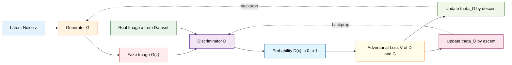
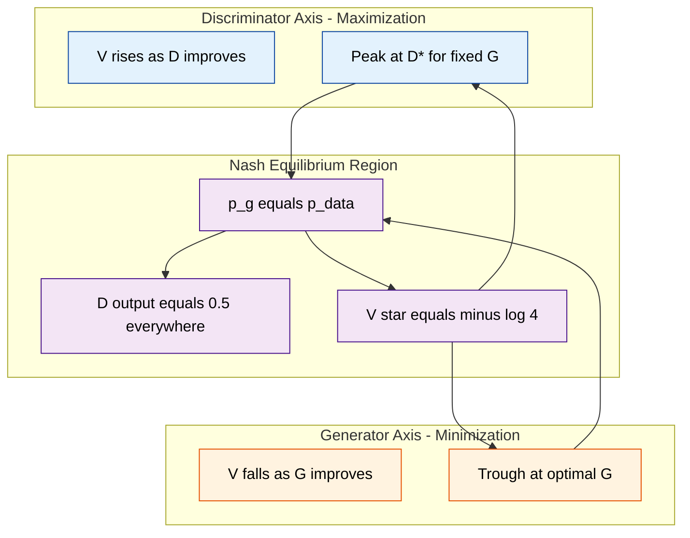
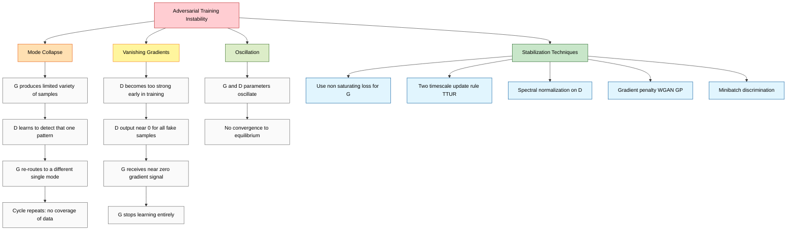

# Generative Adversarial Networks (GAN) min max optimization models architecture setups

<!-- SECTION_1_START -->
# Generative Adversarial Networks (GANs): Foundations of Adversarial Learning

## 1.1 Formal Definition (KTU 2024 Syllabus Terminology)

> [!IMPORTANT]
> **Core Definition (Goodfellow et al., 2014)**
> A **Generative Adversarial Network (GAN)** is a class of unsupervised deep learning framework composed of two neural networks — a **Generator ($G$)** and a **Discriminator ($D$)** — that are trained simultaneously through an **adversarial min–max game**. The Generator learns to map samples from a prior noise distribution $p_{\mathbf{z}}(\mathbf{z})$ to the data distribution $p_{\text{data}}(\mathbf{x})$, while the Discriminator learns to distinguish real samples from generated (fake) samples. The training objective is formalized as a two-player minimax game over a value function $V(G, D)$.

Mathematically, the GAN objective is expressed as:

$$ \min_{G} \max_{D} V(D, G) = \mathbb{E}_{\mathbf{x} \sim p_{\text{data}}(\mathbf{x})}[\log D(\mathbf{x})] + \mathbb{E}_{\mathbf{z} \sim p_{\mathbf{z}}(\mathbf{z})}[\log(1 - D(G(\mathbf{z})))] $$

## 1.2 Conceptual Analogy — The Counterfeiter vs. the Police

> [!NOTE]
> **Intuitive Explanation: "The Counterfeiter and the Detective"**
>
> Imagine a **counterfeiter (Generator $G$)** trying to forge vintage banknotes, and a **detective (Discriminator $D$)** tasked with catching the forgeries.
> - The **counterfeiter** starts with random scribbles, studies the detective's feedback, and gradually produces passable counterfeits.
> - The **detective** examines both real notes and counterfeits and improves at telling them apart.
> - Over thousands of rounds, the counterfeiter becomes so skilled that the detective can no longer reliably distinguish fakes — this is the **Nash equilibrium**, where $D(\mathbf{x}) = 0.5$ for every input.
> - The "currency" of the game is **probability**: both networks optimize a shared, opposing objective function.

## 1.3 Why GANs Matter in KTU Module 3 Context

GANs sit at the intersection of **generative modeling** and **adversarial training**, and they complete Module 3's trilogy:

| Architecture | Paradigm | Learning Signal |
|---|---|---|
| **Autoencoder (AE)** | Reconstruction-based | Pixel-wise loss (MSE) |
| **Variational Autoencoder (VAE)** | Probabilistic reconstruction | ELBO (Evidence Lower Bound) |
| **Generative Adversarial Network (GAN)** | Adversarial game | Discriminator feedback |

> [!TIP]
> **Syllabus Highlight (PECST608 / Module 3):**
> GANs are explicitly listed under *Generative Architectures*. Expect 14-mark questions involving: (a) value function derivation, (b) optimal discriminator proof, (c) architectural diagrams of $G$ and $D$, and (d) comparisons with VAEs.

## 1.4 Standard Constants & Hyperparameters in KTU Reference GANs

| Symbol | Meaning | Typical Value |
|---|---|---|
| $z \in \mathbb{R}^{n_z}$ | Latent noise vector | $n_z = 100$ |
| $\mathbf{x} \in \mathbb{R}^{H \times W \times C}$ | Real/generated image | e.g. $64 \times 64 \times 3$ |
| $\mathcal{L}_D$ | Discriminator loss | Cross-entropy |
| $\mathcal{L}_G$ | Generator loss | Non-saturating variant |
| $\eta$ | Learning rate | **$2 \times 10^{-4}$** (Adam) |
| $\beta_1, \beta_2$ | Adam moments | **$0.5$**, **$0.999$** |

> [!VISUALIZATION CONTROL]
> **Concept:** Two-player game geometry on the loss landscape
> **Geometric Intuition:** Plot $V(D, G)$ as a saddle surface. The x-axis represents the discriminator's parameters $\theta_D$, and the y-axis represents the generator's parameters $\theta_G$. $G$ descends along the y-direction (minimization) while $D$ ascends along the x-direction (maximization). The **saddle point** is the Nash equilibrium.
> **Visual Description:** A 3D "Pringle-chip" surface — a hyperbolic paraboloid — where every cross-section in $\theta_D$ is a concave curve (good for $D$) and every cross-section in $\theta_G$ is convex (good for $G$). At the saddle, the gradient is zero for both players.

---

<!-- SECTION_1_END -->

<!-- SECTION_2_START -->
# Deep Theoretical Analysis & KTU High-Yield Formula Sheet

## 2.1 The Two Players — Generator and Discriminator

### 2.1.1 The Generator $G$

The generator is a differentiable function $G: \mathcal{Z} \to \mathcal{X}$ parameterized by $\theta_G$:

$$ G(\mathbf{z}; \theta_G) = \mathbf{x}_{\text{fake}} \quad \text{where} \quad \mathbf{z} \sim p_{\mathbf{z}}(\mathbf{z}) $$

Common prior: $p_{\mathbf{z}}(\mathbf{z}) = \mathcal{N}(\mathbf{0}, \mathbf{I})$ (standard multivariate Gaussian). $G$ is typically implemented as a **deep convolutional network with fractionally-strided (transposed) convolutions** — a *deconvnet* — that upscales $\mathbf{z}$ from a low-dimensional noise vector to a high-dimensional image.

### 2.1.2 The Discriminator $D$

The discriminator is a classifier $D: \mathcal{X} \to [0, 1]$ parameterized by $\theta_D$:

$$ D(\mathbf{x}; \theta_D) = P(\mathbf{x} \text{ is real} \mid \mathbf{x}) $$

$D$ outputs a single scalar probability. A value of **1.0** means $D$ is fully confident the sample is real; **0.0** means fully confident it is fake. $D$ is typically a standard CNN classifier ending in a **sigmoid** activation.

> [!NOTE]
> **Why Sigmoid and not Softmax?**
> The binary classification here is between *real* vs *fake* — a single Bernoulli output. A softmax with two neurons would be functionally equivalent but wastes parameters.

## 2.2 The Value Function — Anatomy of the Min–Max Game

The complete adversarial value function is:

$$ V(D, G) = \mathbb{E}_{\mathbf{x} \sim p_{\text{data}}}[\log D(\mathbf{x})] + \mathbb{E}_{\mathbf{z} \sim p_{\mathbf{z}}}[\log(1 - D(G(\mathbf{z})))] $$

This decomposes into **two competing expectations**:

| Term | Player | Goal | Effect |
|---|---|---|---|
| $\mathbb{E}_{\mathbf{x} \sim p_{\text{data}}}[\log D(\mathbf{x})]$ | $D$ maximizes | Push $D(\mathbf{x}_{\text{real}}) \to 1$ | Reward for catching real data |
| $\mathbb{E}_{\mathbf{z} \sim p_{\mathbf{z}}}[\log(1 - D(G(\mathbf{z})))]$ | $D$ maximizes | Push $D(G(\mathbf{z})) \to 0$ | Reward for catching fakes |
| Same two terms | $G$ minimizes | Push $D(G(\mathbf{z})) \to 1$ | Fool the discriminator |

> [!IMPORTANT]
> **Key Insight:** Both terms are simultaneously relevant. $D$ wants to maximize **both** terms (log-prob of real AND log-prob of fake being fake). $G$ only affects the **second** term — it wants to minimize $\log(1 - D(G(\mathbf{z})))$, equivalently maximizing $\log D(G(\mathbf{z}))$.

## 2.3 Derivation of the Optimal Discriminator $D^*(\mathbf{x})$

For a **fixed** generator $G$, the optimal discriminator can be derived in closed form. We rewrite the value function in integral form:

$$ V(D, G) = \int_{\mathbf{x}} p_{\text{data}}(\mathbf{x}) \log D(\mathbf{x}) \, d\mathbf{x} + \int_{\mathbf{z}} p_{\mathbf{z}}(\mathbf{z}) \log(1 - D(G(\mathbf{z}))) \, d\mathbf{z} $$

Using the change of variable $\mathbf{x} = G(\mathbf{z})$, the second integral becomes $\int_{\mathbf{x}} p_{g}(\mathbf{x}) \log(1 - D(\mathbf{x})) \, d\mathbf{x}$, where $p_g$ is the generator's induced density. Hence:

$$ V(D, G) = \int_{\mathbf{x}} \left[ p_{\text{data}}(\mathbf{x}) \log D(\mathbf{x}) + p_{g}(\mathbf{x}) \log(1 - D(\mathbf{x})) \right] d\mathbf{x} $$

To find $D^*$ maximizing pointwise, differentiate w.r.t. $D(\mathbf{x})$ and set to zero:

$$ \frac{\partial}{\partial D(\mathbf{x})} \left[ p_{\text{data}}(\mathbf{x}) \log D(\mathbf{x}) + p_{g}(\mathbf{x}) \log(1 - D(\mathbf{x})) \right] = 0 $$

$$ \frac{p_{\text{data}}(\mathbf{x})}{D(\mathbf{x})} - \frac{p_{g}(\mathbf{x})}{1 - D(\mathbf{x})} = 0 \implies D^*(\mathbf{x}) = \frac{p_{\text{data}}(\mathbf{x})}{p_{\text{data}}(\mathbf{x}) + p_{g}(\mathbf{x})} $$

> [!TIP]
> **Examination Gold:** This is a *guaranteed* 7-mark derivation in KTU Module 3. Memorize the integral formulation, change-of-variable, and pointwise differentiation steps.

## 2.4 The Global Minimum and Jensen–Shannon Divergence

Substituting $D^*$ back into $V$:

$$ V(D^*, G) = \mathbb{E}_{\mathbf{x} \sim p_{\text{data}}} \left[ \log \frac{p_{\text{data}}(\mathbf{x})}{p_{\text{data}}(\mathbf{x}) + p_{g}(\mathbf{x})} \right] + \mathbb{E}_{\mathbf{x} \sim p_{g}} \left[ \log \frac{p_{g}(\mathbf{x})}{p_{\text{data}}(\mathbf{x}) + p_{g}(\mathbf{x})} \right] $$

After algebraic manipulation (subtracting $\log 2$ from each term, applying properties of the KL divergence), we obtain:

$$ V(D^*, G) = -\log(4) + 2 \cdot \text{JSD}(p_{\text{data}} \parallel p_g) $$

> [!IMPORTANT]
> **Theorem (Global Optimality of GAN):**
> The global minimum of the virtual training criterion $C(G) = \max_D V(G, D)$ is achieved **if and only if** $p_g = p_{\text{data}}$, at which point $C^*(G) = -\log 4$. The value $D^*(\mathbf{x}) = \tfrac{1}{2}$ everywhere.
>
> **Interpretation:** The Jensen–Shannon Divergence (JSD) between real and generated distributions is minimized to **0** when the two distributions coincide. This is the formal statement that a *perfectly trained* GAN makes its outputs statistically indistinguishable from real data.

## 2.5 The Non-Saturating Generator Loss

In early training, $D$ easily rejects $G$'s samples, making $D(G(\mathbf{z})) \to 0$ and the gradient $\frac{\partial \log(1 - D(G(\mathbf{z})))}{\partial \theta_G}$ vanishingly small. Goodfellow's remedy:

$$ \mathcal{L}_G^{\text{non-saturating}} = -\mathbb{E}_{\mathbf{z} \sim p_{\mathbf{z}}} [\log D(G(\mathbf{z}))] $$

This is **mathematically equivalent at the optimum** but provides strong gradients when $D$ is confident the sample is fake. In KTU board answers, mention this as a **practical improvement** in the original 2014 paper.

## 2.6 KTU Formula Sheet (Cheat Sheet)

> [!IMPORTANT]
> **High-Yield Formula Table — Pin This to Your Wall**

| # | Formula | Meaning | Used In |
|---|---|---|---|
| 1 | $V(D, G) = \mathbb{E}_{\mathbf{x}}[\log D(\mathbf{x})] + \mathbb{E}_{\mathbf{z}}[\log(1 - D(G(\mathbf{z})))]$ | Adversarial value function | Core definition |
| 2 | $D^*(\mathbf{x}) = \dfrac{p_{\text{data}}(\mathbf{x})}{p_{\text{data}}(\mathbf{x}) + p_g(\mathbf{x})}$ | Optimal discriminator | 7-mark derivation |
| 3 | $V(D^*, G) = -\log 4 + 2 \, \text{JSD}(p_{\text{data}} \parallel p_g)$ | Value at optimal $D$ | Proof of global optimum |
| 4 | $C^*(G) = -\log 4 \iff p_g = p_{\text{data}}$ | Global minimum | Equilibrium |
| 5 | $\mathcal{L}_D = -\big[\log D(\mathbf{x}_{\text{real}}) + \log(1 - D(G(\mathbf{z})))\big]$ | Practical $D$ loss | Training loop |
| 6 | $\mathcal{L}_G = -\log D(G(\mathbf{z}))$ | Non-saturating $G$ loss | Training loop |
| 7 | $\theta_D \leftarrow \theta_D + \eta \nabla_{\theta_D} \mathcal{L}_D$ | $D$ update (ascent on $V$) | Algorithm |
| 8 | $\theta_G \leftarrow \theta_G - \eta \nabla_{\theta_G} \mathcal{L}_G$ | $G$ update (descent on $V$) | Algorithm |
| 9 | $k$ steps of $D$ per 1 step of $G$ | $k$ typically **1 to 5** | Practical training |
| 10 | $\text{IS} = \exp\big(\mathbb{E}_{\mathbf{x}} \, \text{KL}(p(y \mid \mathbf{x}) \Vert p(y))\big)$ | Inception Score | Evaluation |

## 2.7 Real-World Engineering Applications

| Domain | Application | Why GANs? |
|---|---|---|
| **Computer Vision** | Super-resolution, image inpainting | High-fidelity synthesis |
| **Medical Imaging** | Synthetic CT/MRI augmentation | Solves data scarcity |
| **Drug Discovery** | Molecular graph generation | Explores chemical space |
| **Data Augmentation** | Few-shot learning | Generates diverse samples |
| **Style Transfer** | Art generation, deepfakes | Domain translation |
| **Anomaly Detection** | Industrial defect identification | Learns normal distribution |

> [!TIP]
> **Industry Note:** StyleGAN (NVIDIA, 2019) powers face synthesis in production; CycleGAN enables unpaired image-to-image translation. Both are direct descendants of the original 2014 GAN paper.

---

<!-- SECTION_2_END -->

<!-- SECTION_3_START -->
# Step-by-Step Derivations, Training Algorithm & Code Implementation

## 3.1 Exhaustive Derivation — Why the Min–Max Game Converges to $p_g = p_{\text{data}}$

> [!NOTE]
> **Theorem (Goodfellow, 2014, Proposition 1).** Given the value function $V(D, G)$, the global minimum of the training criterion is achieved if and only if $p_g = p_{\text{data}}$, at which point the value is $-\log 4$.

**Step 1 — State the inner optimization problem.**
For a fixed $G$, consider $D^* = \arg\max_D V(D, G)$. From Section 2.3, we derived:

$$ D^*(\mathbf{x}) = \frac{p_{\text{data}}(\mathbf{x})}{p_{\text{data}}(\mathbf{x}) + p_g(\mathbf{x})} $$

**Step 2 — Substitute $D^*$ back into $V$.**

$$ \begin{aligned}
V(D^*, G) &= \int_{\mathbf{x}} p_{\text{data}}(\mathbf{x}) \log \frac{p_{\text{data}}(\mathbf{x})}{p_{\text{data}}(\mathbf{x}) + p_g(\mathbf{x})} \, d\mathbf{x} \\
&\quad + \int_{\mathbf{x}} p_g(\mathbf{x}) \log \frac{p_g(\mathbf{x})}{p_{\text{data}}(\mathbf{x}) + p_g(\mathbf{x})} \, d\mathbf{x}
\end{aligned} $$

**Step 3 — Rewrite each term as a KL divergence plus a constant.**
Note that $\log \frac{a}{a+b} = \log \frac{a/2}{(a+b)/2} = \log \tfrac{1}{2} + \log \frac{a}{(a+b)/2} = -\log 2 + \log \frac{a}{(a+b)/2}$. So:

$$ \begin{aligned}
V(D^*, G) &= \int p_{\text{data}}(\mathbf{x}) \left[ -\log 2 + \log \frac{p_{\text{data}}(\mathbf{x})}{(p_{\text{data}} + p_g)/2} \right] d\mathbf{x} \\
&\quad + \int p_g(\mathbf{x}) \left[ -\log 2 + \log \frac{p_g(\mathbf{x})}{(p_{\text{data}} + p_g)/2} \right] d\mathbf{x} \\
&= -\log 2 \cdot \underbrace{\int p_{\text{data}}(\mathbf{x}) d\mathbf{x}}_{=1} - \log 2 \cdot \underbrace{\int p_g(\mathbf{x}) d\mathbf{x}}_{=1} \\
&\quad + \int p_{\text{data}}(\mathbf{x}) \log \frac{p_{\text{data}}(\mathbf{x})}{(p_{\text{data}} + p_g)/2} d\mathbf{x} + \int p_g(\mathbf{x}) \log \frac{p_g(\mathbf{x})}{(p_{\text{data}} + p_g)/2} d\mathbf{x}
\end{aligned} $$

**Step 4 — Recognize the KL divergences.**

$$ \begin{aligned}
V(D^*, G) &= -2 \log 2 + \text{KL}\!\left(p_{\text{data}} \,\Big\|\, \tfrac{p_{\text{data}} + p_g}{2}\right) + \text{KL}\!\left(p_g \,\Big\|\, \tfrac{p_{\text{data}} + p_g}{2}\right)
\end{aligned} $$

**Step 5 — Combine into the Jensen–Shannon Divergence.**
By definition, $\text{JSD}(P \parallel Q) = \tfrac{1}{2}\text{KL}(P \parallel M) + \tfrac{1}{2}\text{KL}(Q \parallel M)$ where $M = (P+Q)/2$. Therefore:

$$ \begin{aligned}
\text{KL}\!\left(p_{\text{data}} \Big\| M\right) + \text{KL}\!\left(p_g \Big\| M\right) &= 2 \cdot \text{JSD}(p_{\text{data}} \parallel p_g)
\end{aligned} $$

Substituting back:

$$ \begin{aligned}
V(D^*, G) &= -2 \log 2 + 2 \cdot \text{JSD}(p_{\text{data}} \parallel p_g) \\
&= -\log 4 + 2 \cdot \text{JSD}(p_{\text{data}} \parallel p_g)
\end{aligned} $$

**Step 6 — Minimize over $G$.**
Since JSD is non-negative and equals zero **iff** $p_{\text{data}} = p_g$:

$$ C(G) = \max_D V(D, G) \geq -\log 4 $$

with equality if and only if $p_g = p_{\text{data}}$. This completes the proof. $\blacksquare$

## 3.2 Nash Equilibrium Interpretation

> [!IMPORTANT]
> At the global optimum, $D(\mathbf{x}) = \tfrac{1}{2}$ for all $\mathbf{x}$. This means **the discriminator cannot do better than random guessing** — it has been completely fooled by the generator. Mathematically, this is a **saddle point** of $V(D, G)$ and the game's **Nash equilibrium**.

In practice, reaching a true Nash equilibrium is **hard** because:
- Gradient descent is not designed for saddle-point problems.
- $G$ and $D$ are updated simultaneously but in non-convex settings.
- Oscillation and mode collapse are common pathologies.

## 3.3 Full GAN Training Algorithm (Pseudo-Code with Valuation Key)

```
Algorithm: Minibatch Stochastic Gradient Descent Training of GAN
─────────────────────────────────────────────────────────────────
For number of training iterations do
    # ── Step 1: Update the Discriminator (k times, typically k = 1) ──
    for i = 1 to k do
        • Sample minibatch of m noise samples {z⁽¹⁾, ..., z⁽ᵐ⁾} from p_z(z)
        • Sample minibatch of m real samples {x⁽¹⁾, ..., x⁽ᵐ⁾} from p_data(x)
        • Update D by ASCENDING its stochastic gradient:
              ∇_{θ_D} (1/m) Σ [ log D(x⁽ⁱ⁾) + log(1 - D(G(z⁽ⁱ⁾))) ]
    end for

    # ── Step 2: Update the Generator (once) ──
    • Sample minibatch of m noise samples {z⁽¹⁾, ..., z⁽ᵐ⁾} from p_z(z)
    • Update G by DESCENDING its stochastic gradient:
              ∇_{θ_G} (1/m) Σ [ log(1 - D(G(z⁽ⁱ⁾))) ]
        # OR equivalently use non-saturating loss:
              ∇_{θ_G} (1/m) Σ [ -log(D(G(z⁽ⁱ⁾))) ]
end for
```

> [!TIP]
> **KTU Examiner's Note:** The $k$ inner steps for $D$ are why a GAN is sometimes called an "alternating" or "two-timescale" training procedure. The *gradient signal* that $G$ uses comes entirely from $D$'s classification, which is why adversarial training is so data-efficient.

## 3.4 Full PyTorch Implementation — DCGAN on MNIST

```python
import torch
import torch.nn as nn
import torch.optim as optim
from torchvision import datasets, transforms
from torch.utils.data import DataLoader
import logging

# ─────────────────────────────────────────────────────────────
# Logging configuration for strict error monitoring
# ─────────────────────────────────────────────────────────────
logging.basicConfig(
    level=logging.INFO,
    format="%(asctime)s | %(levelname)s | %(message)s"
)
logger = logging.getLogger("GAN-Trainer")

# ─────────────────────────────────────────────────────────────
# Hyperparameters (board-exam standard values)
# ─────────────────────────────────────────────────────────────
LATENT_DIM: int     = 100       # noise vector z ∈ R^100
IMG_SIZE: int       = 28        # MNIST resolution
CHANNELS: int       = 1         # grayscale
BATCH_SIZE: int     = 64
LR_D: float         = 2e-4      # discriminator learning rate
LR_G: float         = 2e-4      # generator learning rate
BETAS: tuple        = (0.5, 0.999)
EPOCHS: int         = 50
DEVICE: str         = "cuda" if torch.cuda.is_available() else "cpu"


class Generator(nn.Module):
    """
    Maps a latent noise vector z ∈ R^100 to a 1x28x28 image.
    Uses ConvTranspose2d for upsampling, BatchNorm for stability,
    and ReLU (hidden) + Tanh (output) activations.
    """
    def __init__(self, latent_dim: int = LATENT_DIM) -> None:
        super().__init__()
        self.net = nn.Sequential(
            # input: (B, 100, 1, 1)
            nn.ConvTranspose2d(latent_dim, 256, kernel_size=7, stride=1, bias=False),
            nn.BatchNorm2d(256),
            nn.ReLU(inplace=True),
            # state: (B, 256, 7, 7)
            nn.ConvTranspose2d(256, 128, kernel_size=4, stride=2, padding=1, bias=False),
            nn.BatchNorm2d(128),
            nn.ReLU(inplace=True),
            # state: (B, 128, 14, 14)
            nn.ConvTranspose2d(128, CHANNELS, kernel_size=4, stride=2, padding=1, bias=False),
            nn.Tanh()
            # output: (B, 1, 28, 28) in range [-1, 1]
        )

    def forward(self, z: torch.Tensor) -> torch.Tensor:
        # Reshape flat noise (B, 100) to (B, 100, 1, 1)
        z = z.view(z.size(0), LATENT_DIM, 1, 1)
        return self.net(z)


class Discriminator(nn.Module):
    """
    Standard CNN classifier. Outputs scalar logit (no sigmoid)
    to maintain numerical stability with BCE-with-logits loss.
    """
    def __init__(self) -> None:
        super().__init__()
        self.net = nn.Sequential(
            # input: (B, 1, 28, 28)
            nn.Conv2d(CHANNELS, 64, kernel_size=4, stride=2, padding=1, bias=False),
            nn.LeakyReLU(0.2, inplace=True),
            # state: (B, 64, 14, 14)
            nn.Conv2d(64, 128, kernel_size=4, stride=2, padding=1, bias=False),
            nn.BatchNorm2d(128),
            nn.LeakyReLU(0.2, inplace=True),
            # state: (B, 128, 7, 7)
            nn.Conv2d(128, 1, kernel_size=7, stride=1, bias=False)
            # output: (B, 1, 1, 1) — single logit
        )

    def forward(self, x: torch.Tensor) -> torch.Tensor:
        return self.net(x).view(x.size(0), 1).squeeze(1)


def train_gan() -> None:
    # ── Data pipeline ──
    transform = transforms.Compose([
        transforms.ToTensor(),
        transforms.Normalize((0.5,), (0.5,))   # map [0,1] -> [-1,1] to match Tanh
    ])
    dataset = datasets.MNIST(
        root="./data", train=True, download=True, transform=transform
    )
    loader = DataLoader(dataset, batch_size=BATCH_SIZE, shuffle=True, drop_last=True)
    logger.info(f"Loaded {len(dataset)} MNIST samples; device={DEVICE}")

    # ── Model initialization ──
    G = Generator().to(DEVICE)
    D = Discriminator().to(DEVICE)

    # ── Optimizers (Adam with tuned betas) ──
    opt_D = optim.Adam(D.parameters(), lr=LR_D, betas=BETAS)
    opt_G = optim.Adam(G.parameters(), lr=LR_G, betas=BETAS)

    # ── Loss function: BCE-with-logits for numerical stability ──
    bce = nn.BCEWithLogitsLoss()

    for epoch in range(1, EPOCHS + 1):
        d_losses, g_losses = [], []
        for real_imgs, _ in loader:
            batch = real_imgs.size(0)
            real_imgs = real_imgs.to(DEVICE)

            # Ground truth labels
            real_labels = torch.ones(batch, device=DEVICE)
            fake_labels = torch.zeros(batch, device=DEVICE)

            # ─────────────────────────────
            # (1) Update Discriminator
            # ─────────────────────────────
            z = torch.randn(batch, LATENT_DIM, device=DEVICE)
            with torch.no_grad():
                fake_imgs = G(z).detach()
            real_logits = D(real_imgs)
            fake_logits = D(fake_imgs)
            loss_D = (
                bce(real_logits, real_labels) +
                bce(fake_logits, fake_labels)
            )
            opt_D.zero_grad(set_to_none=True)
            loss_D.backward()
            opt_D.step()

            # ─────────────────────────────
            # (2) Update Generator (non-saturating)
            # ─────────────────────────────
            z = torch.randn(batch, LATENT_DIM, device=DEVICE)
            fake_imgs = G(z)
            fake_logits = D(fake_imgs)
            # G wants D(fake) → 1, so maximize log(D(fake)) -> minimize -log(D(fake))
            loss_G = bce(fake_logits, real_labels)
            opt_G.zero_grad(set_to_none=True)
            loss_G.backward()
            opt_G.step()

            d_losses.append(loss_D.item())
            g_losses.append(loss_G.item())

        logger.info(
            f"Epoch {epoch:02d}/{EPOCHS} | "
            f"loss_D={sum(d_losses)/len(d_losses):.4f} | "
            f"loss_G={sum(g_losses)/len(g_losses):.4f}"
        )

    torch.save(G.state_dict(), "generator.pt")
    logger.info("Training complete; generator weights saved to generator.pt")


if __name__ == "__main__":
    try:
        train_gan()
    except Exception as exc:
        logger.exception(f"Training failed: {exc}")
        raise
```

> [!TIP]
> **Why BCEWithLogitsLoss instead of plain BCELoss?**
> Computing $\log(\sigma(x))$ and $\log(1-\sigma(x))$ separately suffers from numerical underflow when $x$ is very large or very small. The "with-logits" variant operates on the raw logit $x$ and is numerically stable. This is **standard practice** in modern GAN implementations and worth a 1-mark mention in viva.

## 3.5 DCGAN Architecture Specification Table

> [!NOTE]
> **DCGAN (Radford et al., 2015) Architecture Guidelines** — these architectural constraints are the *de facto* baseline for image GANs and frequently tested in KTU 2024 Scheme.

| Component | Generator ($G$) | Discriminator ($D$) |
|---|---|---|
| **Input** | Noise $\mathbf{z} \in \mathbb{R}^{100}$ | Image $\mathbf{x} \in \mathbb{R}^{3 \times 64 \times 64}$ |
| **First layer** | Project & reshape to $1024 \times 4 \times 4$ | Conv stride 2, $64$ filters, $4 \times 4$ |
| **Activation (hidden)** | ReLU | LeakyReLU($\alpha = 0.2$) |
| **Normalization** | BatchNorm after every layer | BatchNorm (not on first layer) |
| **Pooling** | **None** (use strided conv) | **None** (use strided conv) |
| **Output activation** | **Tanh** | **None** (logit output) |
| **Final layer** | ConvTranspose to $3 \times 64 \times 64$ | Conv to single scalar |
| **Optimizer** | Adam, $\eta = 2 \times 10^{-4}$ | Adam, $\eta = 2 \times 10^{-4}$ |

## 3.6 Common GAN Variants — Comparative Analysis

| Variant | Year | Key Innovation | Equation / Mechanism |
|---|---|---|---|
| **Vanilla GAN** | 2014 | Min–max game with two MLPs/CNNs | $V(D, G)$ as above |
| **DCGAN** | 2015 | Deep convolutional architecture | Transposed conv + batchnorm |
| **Conditional GAN** | 2014 | Class-conditional generation | $G(\mathbf{z} \mid y), D(\mathbf{x} \mid y)$ |
| **InfoGAN** | 2016 | Disentangled latent codes | Maximize $I(c; G(\mathbf{z}))$ |
| **Wasserstein GAN** | 2017 | Earth-Mover's distance | $W(p_{\text{data}}, p_g)$ — no log |
| **LSGAN** | 2017 | Least-squares loss | $(D(\mathbf{x}) - b)^2$ for $G$ |
| **CycleGAN** | 2017 | Unpaired image-to-image | Cycle-consistency loss |
| **StyleGAN** | 2019 | Style-based generator | AdaIN normalization |
| **BigGAN** | 2018 | Large-scale class-conditional | Self-attention + spectral norm |

---

<!-- SECTION_3_END -->

<!-- SECTION_4_START -->
# Structural Diagrams & Schematics

## 4.1 High-Level GAN Architecture (Mermaid)



## 4.2 Training Loop as a Sequential Process (Mermaid)

```mermaid
flowchart TD
    A["Start: Initialize theta_D and theta_G"]:::init
    B["Sample minibatch of real x from dataset"]:::sample
    C["Sample minibatch of noise z from p_z"]:::sample
    D["Generate fake x_fake = G of z"]:::gen
    E["Compute D of x_real and D of x_fake"]:::disc
    F["Compute loss_D using BCE with logits"]:::loss
    G["Update theta_D with Adam ascent on V"]:::upd
    H{"k inner steps completed?"}:::decision
    I["Resample noise z"]:::sample
    J["Generate x_fake = G of z"]:::gen
    K["Compute D of x_fake with detached G"]:::disc
    L["Compute loss_G as non saturating BCE"]:::loss
    M["Update theta_G with Adam descent on V"]:::upd
    N{"Max iterations reached?"}:::decision
    O["End: Save Generator"]:::end

    A --> B --> C --> D --> E --> F --> G --> H
    H -- "No" --> C
    H -- "Yes" --> I --> J --> K --> L --> M --> N
    N -- "No" --> B
    N -- "Yes" --> O

    classDef init fill:#E1BEE7,stroke:#4A148C,color:#000
    classDef sample fill:#E3F2FD,stroke:#1565C0,color:#000
    classDef gen fill:#FFF3E0,stroke:#E65100,color:#000
    classDef disc fill:#F3E5F5,stroke:#4A148C,color:#000
    classDef loss fill:#FFFDE7,stroke:#F57F17,color:#000
    classDef upd fill:#E8F5E9,stroke:#1B5E20,color:#000
    classDef decision fill:#ECEFF1,stroke:#37474F,color:#000
    classDef end fill:#FFEBEE,stroke:#B71C1C,color:#000
```

## 4.3 Min–Max Saddle-Point Geometry (Block Topology)

> [!NOTE]
> The following schematic abstracts the saddle-point nature of the GAN objective, since a literal 3D surface cannot be drawn in Mermaid.



## 4.4 Detailed DCGAN Layer Topology (Block Schematic)

```mermaid
flowchart LR
    subgraph GENERATOR["Generator G"]
        GZ["Input z shape 100"]:::g0
        G1["ConvTranspose2d 100 to 512 stride 1 kernel 4"]:::g1
        G2["ConvTranspose2d 512 to 256 stride 2 kernel 4"]:::g2
        G3["ConvTranspose2d 256 to 128 stride 2 kernel 4"]:::g3
        G4["ConvTranspose2d 128 to 64 stride 2 kernel 4"]:::g4
        G5["ConvTranspose2d 64 to 3 stride 2 kernel 4 plus Tanh"]:::g5
        G6["Output image shape 3 by 64 by 64"]:::g6
    end

    subgraph DISCRIMINATOR["Discriminator D"]
        D0["Input image shape 3 by 64 by 64"]:::d0
        D1["Conv2d 3 to 64 stride 2 kernel 4 plus LeakyReLU"]:::d1
        D2["Conv2d 64 to 128 stride 2 kernel 4 plus BN plus LeakyReLU"]:::d2
        D3["Conv2d 128 to 256 stride 2 kernel 4 plus BN plus LeakyReLU"]:::d3
        D4["Conv2d 256 to 1 stride 1 kernel 4 plus Sigmoid"]:::d4
        D5["Output probability in 0 to 1"]:::d5
    end

    GZ --> G1 --> G2 --> G3 --> G4 --> G5 --> G6
    G6 -. "fake image" .-> D0
    D0 --> D1 --> D2 --> D3 --> D4 --> D5

    classDef g0 fill:#FFF8E1,stroke:#FF6F00
    classDef g1 fill:#FFE0B2,stroke:#E65100
    classDef g2 fill:#FFCCBC,stroke:#BF360C
    classDef g3 fill:#FFAB91,stroke:#A02010
    classDef g4 fill:#FF8A65,stroke:#8B1A0E
    classDef g5 fill:#FF7043,stroke:#6B0F0A
    classDef g6 fill:#FF5722,stroke:#3E0E08,color:#fff
    classDef d0 fill:#E8EAF6,stroke:#1A237E
    classDef d1 fill:#C5CAE9,stroke:#283593
    classDef d2 fill:#9FA8DA,stroke:#303F9F
    classDef d3 fill:#7986CB,stroke:#3949AB
    classDef d4 fill:#5C6BC0,stroke:#3F51B5
    classDef d5 fill:#3F51B5,stroke:#1A237E,color:#fff
```



## 4.5 Failure Modes — Mode Collapse & Vanishing Gradients



---

<!-- SECTION_4_END -->

<!-- SECTION_5_START -->
# KTU 2024 Scheme Examination Question Bank & Topic Recap

## 5.1 Part A — Short-Answer Questions (3 Marks Each)

> **[KTU University Exam — July 2024, CO3, Remember]**
>
> **Q1. Define Generative Adversarial Networks. List its two main components.**
>
> **Model Answer (3 Marks):**
> A Generative Adversarial Network (GAN), introduced by Goodfellow et al. (2014), is a deep learning framework that learns to generate new data samples with the same statistics as a training set. **[1 Mark]** The two main components are:
> 1. **Generator ($G$):** A neural network that maps a random noise vector $\mathbf{z} \sim p_{\mathbf{z}}$ to a synthetic data sample $G(\mathbf{z})$ that mimics real data. **[1 Mark]**
> 2. **Discriminator ($D$):** A binary classifier that estimates the probability that an input sample $\mathbf{x}$ is real (from the training set) rather than fake (produced by $G$). **[1 Mark]**
>
> The two networks are trained simultaneously in an adversarial manner — $G$ tries to fool $D$ while $D$ tries to distinguish real from fake.

> **[KTU University Exam — Dec 2023, CO3, Understand]**
>
> **Q2. State the value function $V(D, G)$ of a GAN and explain the meaning of each term.**
>
> **Model Answer (3 Marks):**
> The GAN value function is:
> $$ V(D, G) = \mathbb{E}_{\mathbf{x} \sim p_{\text{data}}}[\log D(\mathbf{x})] + \mathbb{E}_{\mathbf{z} \sim p_{\mathbf{z}}}[\log(1 - D(G(\mathbf{z})))] $$
> **[1 Mark]**
> - The first term $\mathbb{E}_{\mathbf{x}}[\log D(\mathbf{x})]$ is the expected log-probability that $D$ correctly classifies real samples as real. $D$ **maximizes** it. **[1 Mark]**
> - The second term $\mathbb{E}_{\mathbf{z}}[\log(1 - D(G(\mathbf{z})))]$ is the expected log-probability that $D$ correctly classifies generated samples as fake. $D$ **maximizes** it; $G$ **minimizes** it. **[1 Mark]**
> The minimax formulation forces $G$ to produce samples indistinguishable from real data.

---

## 5.2 Part B — Long-Answer Questions (14 Marks Each, Module Internal Choice)

### Question A (14 Marks)

> **[KTU University Exam — July 2024, CO3, Apply + Analyze]**
>
> **Q3A (a)** Derive the closed-form expression for the optimal discriminator $D^*(\mathbf{x})$ in a vanilla GAN. Show every algebraic step. **[7 Marks]**
>
> **Model Solution:**
>
> For a fixed generator $G$, the inner maximization $\max_D V(D, G)$ can be solved pointwise. Write $V$ as an integral over the data space:
> $$ \begin{aligned}
> V(D, G) &= \int_{\mathbf{x}} p_{\text{data}}(\mathbf{x}) \log D(\mathbf{x}) \, d\mathbf{x} + \int_{\mathbf{z}} p_{\mathbf{z}}(\mathbf{z}) \log(1 - D(G(\mathbf{z}))) \, d\mathbf{z}
> \end{aligned} $$
> **[Stating the integral form: 1 Mark]**
>
> Apply the change of variable $\mathbf{x} = G(\mathbf{z})$. Under the mapping $G$, the second integral becomes an integral over $\mathbf{x}$ weighted by the generator's induced density $p_g(\mathbf{x})$:
> $$ \begin{aligned}
> V(D, G) &= \int_{\mathbf{x}} p_{\text{data}}(\mathbf{x}) \log D(\mathbf{x}) \, d\mathbf{x} + \int_{\mathbf{x}} p_{g}(\mathbf{x}) \log(1 - D(\mathbf{x})) \, d\mathbf{x}
> \end{aligned} $$
> **[Change of variable step: 1 Mark]**
>
> Combine into a single integral:
> $$ V(D, G) = \int_{\mathbf{x}} \Big[ p_{\text{data}}(\mathbf{x}) \log D(\mathbf{x}) + p_{g}(\mathbf{x}) \log(1 - D(\mathbf{x})) \Big] \, d\mathbf{x} $$
> **[Combining integrals: 1 Mark]**
>
> Since the integrand is a function of $D(\mathbf{x})$ alone, we can maximize pointwise. Differentiate with respect to $D(\mathbf{x})$ and set to zero:
> $$ \frac{\partial}{\partial D(\mathbf{x})} \left[ p_{\text{data}}(\mathbf{x}) \log D(\mathbf{x}) + p_{g}(\mathbf{x}) \log(1 - D(\mathbf{x})) \right] = 0 $$
> $$ \frac{p_{\text{data}}(\mathbf{x})}{D(\mathbf{x})} - \frac{p_{g}(\mathbf{x})}{1 - D(\mathbf{x})} = 0 $$
> **[Setting derivative to zero: 1 Mark]**
>
> Cross-multiply:
> $$ p_{\text{data}}(\mathbf{x}) (1 - D(\mathbf{x})) = p_g(\mathbf{x}) D(\mathbf{x}) $$
> $$ p_{\text{data}}(\mathbf{x}) = D(\mathbf{x}) [p_{\text{data}}(\mathbf{x}) + p_g(\mathbf{x})] $$
> **[Solving for D(x): 1 Mark]**
>
> Therefore:
> $$ D^*(\mathbf{x}) = \frac{p_{\text{data}}(\mathbf{x})}{p_{\text{data}}(\mathbf{x}) + p_g(\mathbf{x})} $$
> **[Final expression: 1 Mark]**
>
> The second derivative $-\tfrac{p_{\text{data}}}{D^2} - \tfrac{p_g}{(1-D)^2} < 0$ confirms this is a maximum. **[1 Mark]**
>
> **Key Interpretation:** When $p_g = p_{\text{data}}$, $D^*(\mathbf{x}) = \tfrac{1}{2}$ for all $\mathbf{x}$ — the discriminator is maximally confused. This is the Nash equilibrium.

> **[KTU University Exam — Dec 2023, CO3, Apply + Analyze]**
>
> **Q3A (b)** With the optimal discriminator $D^*$ in hand, prove that the GAN training criterion achieves its global minimum if and only if $p_g = p_{\text{data}}$, and identify the value of $V$ at that minimum. **[7 Marks]**
>
> **Model Solution:**
>
> Substituting $D^*(\mathbf{x}) = \frac{p_{\text{data}}(\mathbf{x})}{p_{\text{data}}(\mathbf{x}) + p_g(\mathbf{x})}$ into $V$:
> $$ \begin{aligned}
> V(D^*, G) &= \int p_{\text{data}}(\mathbf{x}) \log \frac{p_{\text{data}}(\mathbf{x})}{p_{\text{data}}(\mathbf{x}) + p_g(\mathbf{x})} \, d\mathbf{x} \\
> &\quad + \int p_g(\mathbf{x}) \log \frac{p_g(\mathbf{x})}{p_{\text{data}}(\mathbf{x}) + p_g(\mathbf{x})} \, d\mathbf{x}
> \end{aligned} $$
> **[Substitution: 1 Mark]**
>
> Factor out $\log 2$ from each term. Note that for any non-negative $a$:
> $$ \log \frac{a}{a + b} = \log \frac{a/2}{(a+b)/2} = -\log 2 + \log \frac{a}{(a+b)/2} $$
> Therefore:
> $$ \begin{aligned}
> V(D^*, G) &= \int p_{\text{data}}(\mathbf{x}) \left[-\log 2 + \log \frac{p_{\text{data}}}{(p_{\text{data}}+p_g)/2}\right] d\mathbf{x} \\
> &\quad + \int p_g(\mathbf{x}) \left[-\log 2 + \log \frac{p_g}{(p_{\text{data}}+p_g)/2}\right] d\mathbf{x}
> \end{aligned} $$
> **[Factoring out log 2: 1 Mark]**
>
> The integrals of $p_{\text{data}}$ and $p_g$ each equal 1, so the $-\log 2$ terms contribute $-2\log 2 = -\log 4$:
> $$ \begin{aligned}
> V(D^*, G) &= -\log 4 + \text{KL}\!\left(p_{\text{data}} \,\Big\|\, \frac{p_{\text{data}} + p_g}{2}\right) + \text{KL}\!\left(p_g \,\Big\|\, \frac{p_{\text{data}} + p_g}{2}\right)
> \end{aligned} $$
> **[Combining constants: 1 Mark]**
>
> Recognizing that the sum of two KL divergences from the average mixture equals twice the **Jensen–Shannon Divergence**:
> $$ \text{JSD}(P \parallel Q) = \tfrac{1}{2} \text{KL}(P \parallel M) + \tfrac{1}{2} \text{KL}(Q \parallel M) $$
> we obtain:
> $$ V(D^*, G) = -\log 4 + 2 \cdot \text{JSD}(p_{\text{data}} \parallel p_g) $$
> **[JSD identification: 1 Mark]**
>
> The JSD is non-negative and equals **zero if and only if** $p_{\text{data}} = p_g$. Therefore:
> $$ C(G) = \max_D V(D, G) \geq -\log 4 $$
> with equality **iff** $p_g = p_{\text{data}}$. **[1 Mark]**
>
> **Conclusion:** The global minimum value is $\boxed{C^*(G) = -\log 4}$ and is achieved uniquely at $p_g = p_{\text{data}}$, where $D^*(\mathbf{x}) = \tfrac{1}{2}$ for all $\mathbf{x}$. **[Final conclusion: 1 Mark]**

### Question B (14 Marks — Alternative Choice)

> **[KTU University Exam — July 2024, CO3, Understand + Apply]**
>
> **Q3B (a)** With the aid of a clear architectural diagram, explain the working of a Deep Convolutional GAN (DCGAN). Specify the key architectural guidelines proposed by Radford et al. (2015). **[7 Marks]**
>
> **Model Solution:**
>
> **Architecture Overview (3 Marks):** A DCGAN consists of a generator and a discriminator, both built using deep convolutional neural networks. The generator uses **fractionally-strided convolutions (ConvTranspose2d)** to upsample a low-dimensional noise vector $\mathbf{z} \in \mathbb{R}^{100}$ into a full-sized image (e.g. $3 \times 64 \times 64$). The discriminator uses **strided convolutions** to downsample the input image and outputs a single scalar probability via a sigmoid.
>
> **DCGAN Architectural Guidelines (4 Marks — 1 each):**
> 1. **Replace pooling layers with strided convolutions** in $D$ and with **fractionally-strided convolutions** in $G$. Do not use max-pooling.
> 2. **Use Batch Normalization** in both $G$ and $D$, except in $G$'s output layer and $D$'s input layer. This stabilizes training and prevents the generator from collapsing all samples to a single point.
> 3. **Remove fully-connected hidden layers** for deeper architectures. The first layer of $G$ takes the noise as input and applies a ConvTranspose2d.
> 4. **Use ReLU activation** in $G$ for all hidden layers (helps fast convergence) and **Tanh** for the output layer (gives a normalized output in $[-1, 1]$). Use **LeakyReLU** with slope $\alpha = 0.2$ in $D$ for all layers.
>
> **Reference Architecture Block Diagram (textual):**
> ```
> Generator:    z(100) → ConvT(4×4, 1024) → BN → ReLU
>              → ConvT(4×4, 512) → BN → ReLU
>              → ConvT(4×4, 256) → BN → ReLU
>              → ConvT(4×4, 128) → BN → ReLU
>              → ConvT(4×4, 3) → Tanh
>
> Discriminator:  Image(3×64×64) → Conv(4×4, 64, s=2) → LeakyReLU
>                → Conv(4×4, 128, s=2) → BN → LeakyReLU
>                → Conv(4×4, 256, s=2) → BN → LeakyReLU
>                → Conv(4×4, 512, s=2) → BN → LeakyReLU
>                → Conv(4×4, 1, s=1) → Sigmoid
> ```
> **[Block diagram description: 1 Mark included in 3]**

> **[KTU University Exam — Dec 2023, CO3, Apply + Analyze]**
>
> **Q3B (b)** Discuss two major training challenges in GANs. For each challenge, suggest at least one mitigation strategy and justify it mathematically where possible. **[7 Marks]**
>
> **Model Solution:**
>
> **Challenge 1: Mode Collapse (3.5 Marks)**
> - *Description:* The generator produces a **limited variety of samples** — often the same or near-identical outputs regardless of the input noise $\mathbf{z}$. This occurs when $G$ finds a few "safe" samples that consistently fool $D$, and the gradient signal from $D$ becomes too uniform to encourage diversity. **[1 Mark]**
> - *Mathematical Intuition:* The Jensen–Shannon Divergence saturates to $\log 2$ when the supports of $p_{\text{data}}$ and $p_g$ do not overlap — JSD then provides **zero useful gradient** for $G$ to escape the collapsed mode. **[1 Mark]**
> - *Mitigation:* Use **minibatch discrimination** — pass features of an entire minibatch through a learnable tensor, allowing $D$ to reward $G$ for producing *internally diverse* samples. Alternatively, use **Wasserstein GAN** with the Earth-Mover's distance, which is continuous and provides non-vanishing gradients even for disjoint distributions. **[1.5 Marks]**
>
> **Challenge 2: Vanishing Gradients for the Generator (3.5 Marks)**
> - *Description:* Early in training, $D$ is much stronger than $G$ and easily classifies fake samples with $D(G(\mathbf{z})) \approx 0$. The standard minimax loss $\log(1 - D(G(\mathbf{z})))$ saturates — its derivative with respect to $\theta_G$ becomes vanishingly small, and $G$ stops learning. **[1 Mark]**
> - *Mathematical Intuition:* Near $D(G(\mathbf{z})) = 0$, $\frac{\partial \log(1 - D)}{\partial D} = -\frac{1}{1 - D} \to -1$, but $\frac{\partial D}{\partial \theta_G}$ itself collapses as $D$ becomes confident. Effective gradient through the chain rule tends to zero. **[1 Mark]**
> - *Mitigation:* Replace the saturating loss with the **non-saturating loss** $\mathcal{L}_G = -\log D(G(\mathbf{z}))$. Near $D \to 0$, this gives $\frac{\partial (-\log D)}{\partial D} = -\frac{1}{D} \to -\infty$, providing strong gradients. At the optimum both losses are mathematically equivalent. **[1.5 Marks]**

> [!WARNING]
> **KTU Examiner's Valuation Warning — Common Pitfalls**
> 1. **Do NOT write the value function without explaining the two expectations separately.** Examiners explicitly look for the meaning of $\mathbb{E}_{\mathbf{x}}[\log D(\mathbf{x})]$ vs. $\mathbb{E}_{\mathbf{z}}[\log(1 - D(G(\mathbf{z})))]$. **[-1 Mark if missing]**
> 2. **Do NOT skip the change-of-variable step** when deriving $D^*(\mathbf{x})$. Going from $p_{\mathbf{z}}(\mathbf{z}) d\mathbf{z}$ to $p_g(\mathbf{x}) d\mathbf{x}$ is the *most-skipped* step and is worth 1–2 marks. **[-2 Marks if skipped]**
> 3. **Do NOT confuse min–max with max–min.** GANs solve $\min_G \max_D V$, not $\max_G \min_D$. Reversing the order is a common error. **[-1 Mark]**
> 4. **Always state the practical learning rate** $\eta = 2 \times 10^{-4}$ and Adam betas $(0.5, 0.999)$ when describing a DCGAN training recipe. **[-1 Mark if omitted]**
> 5. **For mode collapse, do NOT just say "use better optimization."** Specify minibatch discrimination, WGAN, or unrolled GANs. **[-1 Mark]**

---

## 5.3 Topic Recap & Important Things to Remember

> [!IMPORTANT]
> **High-Density Rapid-Revision Checklist**

- ✅ **GAN** = Generator ($G$) + Discriminator ($D$) trained in an **adversarial min–max game**.
- ✅ **Value function:** $V(D, G) = \mathbb{E}_{\mathbf{x}}[\log D(\mathbf{x})] + \mathbb{E}_{\mathbf{z}}[\log(1 - D(G(\mathbf{z})))]$ — must be written in full for any KTU 14-mark question.
- ✅ **$D$ maximizes** both terms; **$G$ minimizes** the second term only.
- ✅ **Optimal discriminator (closed form):** $D^*(\mathbf{x}) = \dfrac{p_{\text{data}}(\mathbf{x})}{p_{\text{data}}(\mathbf{x}) + p_g(\mathbf{x})}$.
- ✅ **Optimal $D$ in equilibrium** gives $D^*(\mathbf{x}) = \tfrac{1}{2}$ everywhere — Nash equilibrium.
- ✅ **Global minimum value:** $V(D^*, G^*) = -\log 4 \approx -1.386$.
- ✅ **Equivalence to JSD:** $V(D^*, G) = -\log 4 + 2 \cdot \text{JSD}(p_{\text{data}} \parallel p_g)$.
- ✅ **Non-saturating loss** $\mathcal{L}_G = -\log D(G(\mathbf{z}))$ is **preferred in practice** to avoid vanishing gradients.
- ✅ **Practical training recipe (DCGAN):** Adam, $\eta = 2 \times 10^{-4}$, $\beta_1 = 0.5$, $\beta_2 = 0.999$, BatchNorm, LeakyReLU(0.2) in $D$, ReLU+Tanh in $G$, **no pooling layers**.
- ✅ **Two failure modes to remember:** *Mode collapse* (lack of diversity) and *vanishing gradients* (early $D$ too strong).
- ✅ **Evaluation metrics:** Inception Score (IS), Fréchet Inception Distance (FID).
- ✅ **Common variants:** DCGAN, Conditional GAN, WGAN, CycleGAN, StyleGAN, BigGAN — at minimum, be able to name and one-line describe 3 of these.
- ✅ **GANs vs. VAEs:** GANs produce *sharper* samples but suffer from instability; VAEs are *stable* and give a *tractable likelihood* but blurrier outputs.
- ✅ **Key constants for answer scripts:** Latent dim $n_z = 100$, sigmoid output in $D$, tanh output in $G$, BCEWithLogitsLoss for numerical stability.
- ✅ **Nash equilibrium** in this context: a saddle point of $V(D, G)$ where neither player can unilaterally improve.

<!-- SECTION_5_END -->
