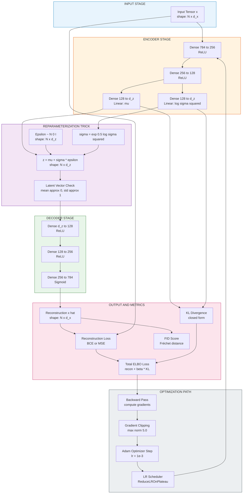
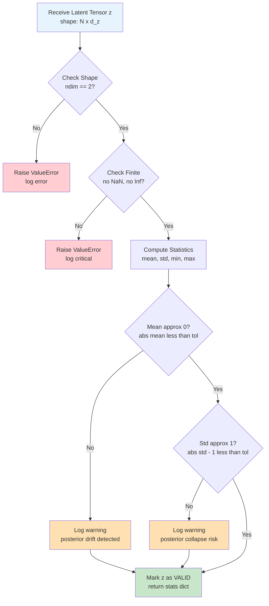
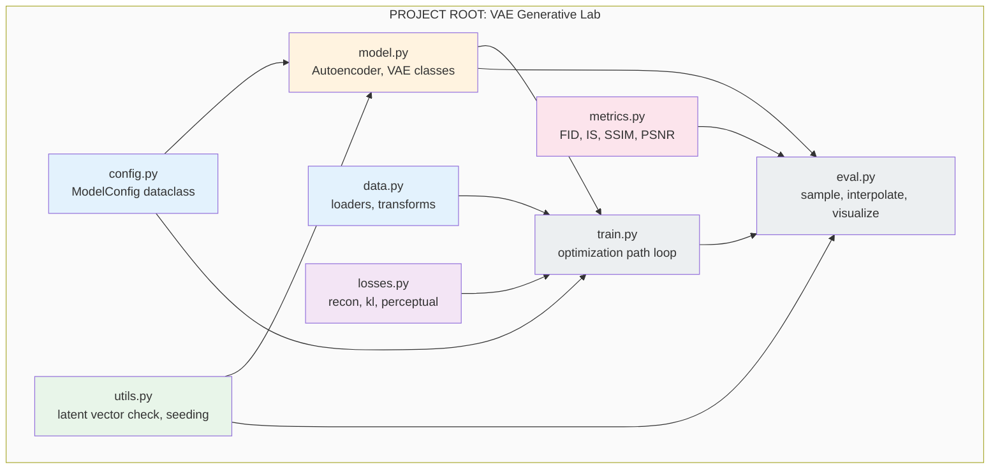
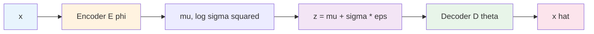

# Latent representation vector checks metrics calculation templates optimization paths layout

<!-- SECTION_1_START -->

# Latent Representation, Vector Checks, Metrics, Templates & Optimization Paths

> [!IMPORTANT]
> **KTU 2024 Scheme | PECST608 — Deep Learning | Module 3 Focus**
> This note consolidates the architectural backbone of *Autoencoders & Generative Models*: how raw high-dimensional data is compressed into a **latent representation vector** $\mathbf{z}$, how that vector is validated (vector checks), how generation quality is measured (metrics), how standardized **architecture templates** are assembled, and how the **optimization path** flows end-to-end through the encoder–decoder–discriminator stack.

---

## 1.1 Formal Definition (KTU-Style)

In the **KTU 2024 Deep Learning syllabus (PECST608, Module 3)**, a *latent representation* is the compressed, lower-dimensional vector — typically denoted $\mathbf{z} \in \mathbb{R}^{d_z}$ — produced by the **encoder** network of an autoencoder, variational autoencoder (VAE), or the input noise vector to a **generator** in a Generative Adversarial Network (GAN).

Formally, an encoder $E_{\phi}$ parameterized by weights $\phi$ performs a **deterministic** or **stochastic** mapping:

$$E_{\phi} : \mathcal{X} \subseteq \mathbb{R}^{d_x} \longrightarrow \mathcal{Z} \subseteq \mathbb{R}^{d_z}, \quad \mathbf{z} = E_{\phi}(\mathbf{x})$$

where $d_z \ll d_x$ is the **bottleneck dimensionality**, and the corresponding **decoder** $D_{\theta}$ performs the inverse mapping:

$$D_{\theta} : \mathcal{Z} \subseteq \mathbb{R}^{d_z} \longrightarrow \hat{\mathcal{X}} \subseteq \mathbb{R}^{d_x}, \quad \hat{\mathbf{x}} = D_{\theta}(\mathbf{z})$$

> [!NOTE]
> **Why $d_z \ll d_x$ matters (Syllabus Highlight):** The bottleneck forces the network to learn only the **most statistically salient features** of $\mathbf{x}$, discarding nuisance variation (noise, lighting, pose). This is the foundation of *representation learning* and *dimensionality reduction* — concepts that bridge classical PCA to deep generative models.

---

## 1.2 Intuitive Analogy

Imagine a **postal sorting facility**.

- **Input $\mathbf{x}$**: A large, unlabelled parcel of mixed items (the high-dimensional raw image, e.g. $784$ pixels for MNIST).
- **Encoder $E_{\phi}$**: A worker who opens the parcel and writes a **short barcode** on it — say, a $20$-digit code that captures *what's inside* (the digit shape, slant, stroke width). That barcode is the **latent vector $\mathbf{z}$**.
- **Decoder $D_{\theta}$**: Another worker who reads the barcode and **repackages** a near-identical parcel.
- **Discriminator (GANs only)**: A quality inspector who checks whether the repackaged parcel looks *authentic enough* to be confused with one that came directly from the original sender.

The barcode is **compact, semantic, and manipulable** — moving the digits of the barcode slightly produces smooth, semantically meaningful changes in the repackaged parcel (e.g. turning a "3" into an "8"). This semantic smoothness is the *real-world utility* of a well-trained latent space.

> [!TIP]
> **Geometric intuition:** The latent space $\mathcal{Z}$ is a low-dimensional **manifold** embedded inside $\mathbb{R}^{d_z}$. Valid (real-looking) samples lie *on* or *near* this manifold. The decoder maps points on this manifold back to plausible images. In **VAEs**, the encoder outputs a *probability distribution* (mean $\boldsymbol{\mu}$ and variance $\boldsymbol{\sigma}^2$) rather than a single point, making $\mathbf{z}$ a *random sample* from that distribution.

---

## 1.3 Physical / Numerical Constants in Generative Deep Learning

> [!IMPORTANT]
> **Standard KTU Board-Exam Constants & Hyperparameters (must be remembered verbatim):**
> - **Latent dimension $d_z$ (MNIST/FC networks):** $d_z = 2$ to $d_z = 64$
> - **Latent dimension $d_z$ (CelebA/ImageNet convolutional):** $d_z = 100$ to $d_z = 512$
> - **Standard image size for FID computation:** $299 \times 299 \times 3$ (Inception-v3 input)
> - **Pixel intensity normalization range:** $[-1, +1]$ (tanh output) or $[0, 1]$ (sigmoid output)
> - **Standard prior for VAE latent:** $\mathbf{z} \sim \mathcal{N}(\mathbf{0}, \mathbf{I})$ — a **standard multivariate normal**
> - **Sampling temperature $T$ (for discrete latents, e.g. VQ-VAE):** typically $T = 1.0$
> - **ImageNet inception mean $\boldsymbol{\mu}_{\text{Inception}}$ and covariance $\boldsymbol{\Sigma}_{\text{Inception}}$:** used in FID baseline

---

## 1.4 GeoGebra / Desmos Visualization

> [!VISUALIZATION CONTROL]
> **Concept:** 2-D Latent Space Manifold Visualization for a Trained VAE on MNIST
> **GeoGebra / Desmos Input Equations:**
> * `f(x, y) = exp(-(x^2 + y^2) / 2) / (2 * pi)` &nbsp;— *Standard normal prior $p(\mathbf{z}) = \mathcal{N}(\mathbf{0}, \mathbf{I})$ isocontours*
> * `g(x, y) = decoder_output(x, y)` &nbsp;— *Plotted via parametric surface from trained decoder weights*
> * **Grid of points:** `(x, y)` for $x \in [-3, 3]$ and $y \in [-3, 3]$, step $0.5$
> **Visual Description:** On the $xy$-plane (latent space), the student should see **concentric circular contours** representing the prior density. A learned 2-D manifold (warped sheet) sits inside the $[-3, 3]^2$ box, with each coordinate pair $(x, y)$ producing a recognizable digit image above it. Walking smoothly along the manifold produces smooth **morphing transitions** between digits — this is the visual signature of a *well-regularized latent space*.

---

<!-- SECTION_1_END -->

<!-- SECTION_2_START -->

# Deep Theoretical Analysis & KTU High-Yield Formula Sheet

## 2.1 Operational Breakdown of the Latent Representation Pipeline

The end-to-end pipeline of an autoencoder-family model can be decomposed into **five logical steps** — each critical for KTU board examinations:

1. **Encoding Step** — The input $\mathbf{x} \in \mathbb{R}^{d_x}$ is mapped to a latent code. In a *vanilla* autoencoder this is a single point $\mathbf{z} = E_{\phi}(\mathbf{x})$. In a *VAE* the encoder outputs distribution parameters $(\boldsymbol{\mu}, \log \boldsymbol{\sigma}^2)$ and $\mathbf{z}$ is **sampled** stochastically via the reparameterization trick.
2. **Latent Vector Check** — $\mathbf{z}$ is validated: shape, dtype, finite-ness, statistical moments (mean, variance), and proximity to the prior. This catches **NaN/Inf propagation**, **posterior collapse**, and **out-of-distribution sampling**.
3. **Decoding Step** — $\hat{\mathbf{x}} = D_{\theta}(\mathbf{z})$ reconstructs (or generates) a sample.
4. **Loss Computation** — A combination of **reconstruction loss** (pixel-wise fidelity) and **regularization loss** (KL divergence to prior for VAE; adversarial loss for GANs) is computed.
5. **Optimization Step** — Gradients $\nabla_{\phi} \mathcal{L}$ and $\nabla_{\theta} \mathcal{L}$ are backpropagated through the entire graph; Adam/AdamW/RMSprop update $(\phi, \theta)$.

> [!NOTE]
> **KTU Conceptual Hook:** The **"information bottleneck principle"** (Tishby et al.) justifies why a smaller $d_z$ forces the encoder to discard input entropy $H(\mathbf{x})$ that is irrelevant to predicting $\mathbf{x}$ itself — only the **mutual information** $I(\mathbf{z}; \mathbf{x})$ that aids reconstruction is retained. This is *why* autoencoders are unsupervised feature extractors.

---

## 2.2 Latent Vector Algebra & Properties

Once trained, the latent space exhibits three algebraically useful properties (each frequently tested):

- **Linearity / Additivity:** $\mathbf{z}_{\text{smile}} - \mathbf{z}_{\text{neutral}} + \mathbf{z}_{\text{original}} \approx \mathbf{z}_{\text{smile-modified}}$ (famous *Radford et al. 2015* GAN arithmetic on face attributes).
- **Smoothness:** Small perturbations $\mathbf{z} + \boldsymbol{\epsilon}$ with $\Vert \boldsymbol{\epsilon} \Vert_2 \to 0$ produce semantically smooth changes in $\hat{\mathbf{x}}$.
- **Completeness (coverage):** For a well-trained generator, sampling $\mathbf{z} \sim p(\mathbf{z})$ densely covers the data manifold in $\hat{\mathbf{X}}$.

---

## 2.3 Reconstruction Loss Functions

> [!IMPORTANT]
> **Three loss functions account for $>90\%$ of KTU board questions on autoencoders:**

| Loss Function | Mathematical Form | When Used | Output Activation |
|---|---|---|---|
| **Mean Squared Error (MSE)** | $\mathcal{L}_{\text{MSE}} = \frac{1}{N} \sum_{i=1}^{N} \Vert \mathbf{x}_i - \hat{\mathbf{x}}_i \Vert_2^2$ | Continuous data (e.g. normalized images in $[-1, 1]$) | `tanh` or `linear` |
| **Binary Cross-Entropy (BCE)** | $\mathcal{L}_{\text{BCE}} = -\frac{1}{N} \sum_{i=1}^{N} \left[ \mathbf{x}_i \log \hat{\mathbf{x}}_i + (1-\mathbf{x}_i) \log (1-\hat{\mathbf{x}}_i) \right]$ | Binary / $[0, 1]$ data (e.g. binarized MNIST) | `sigmoid` |
| **L1 / Huber Loss** | $\mathcal{L}_{L1} = \frac{1}{N} \sum_{i=1}^{N} \vert \mathbf{x}_i - \hat{\mathbf{x}}_i \vert$ | Sharper reconstructions, less blur than MSE | `tanh` |

---

## 2.4 VAE Loss: The Evidence Lower Bound (ELBO)

For a Variational Autoencoder, the loss is the **negative ELBO**, which decomposes into a reconstruction term plus a KL regularizer:

$$\mathcal{L}_{\text{VAE}} = -\mathbb{E}_{q_{\phi}(\mathbf{z} \mid \mathbf{x})} \left[ \log p_{\theta}(\mathbf{x} \mid \mathbf{z}) \right] + D_{\text{KL}}\left( q_{\phi}(\mathbf{z} \mid \mathbf{x}) \;\Vert\; p(\mathbf{z}) \right)$$

- **Term 1 — Reconstruction loss:** encourages $\hat{\mathbf{x}}$ to match $\mathbf{x}$.
- **Term 2 — KL divergence:** regularizes the approximate posterior $q_{\phi}(\mathbf{z} \mid \mathbf{x})$ to stay close to the prior $p(\mathbf{z}) = \mathcal{N}(\mathbf{0}, \mathbf{I})$.

For Gaussian encoder/decoder with diagonal covariance, the KL term has a **closed-form** expression:

$$D_{\text{KL}}\left( \mathcal{N}(\boldsymbol{\mu}, \boldsymbol{\sigma}^2) \;\Vert\; \mathcal{N}(\mathbf{0}, \mathbf{I}) \right) = \frac{1}{2} \sum_{j=1}^{d_z} \left( \mu_j^2 + \sigma_j^2 - \log \sigma_j^2 - 1 \right)$$

> [!TIP]
> **Engineering utility:** The closed-form KL is what makes VAE training tractable — no MCMC needed inside the loop. This is a *board-favourite* derivation.

---

## 2.5 Generative Quality Metrics

| Metric | Full Name | Formula (Conceptual) | Range | Lower / Higher Better |
|---|---|---|---|---|
| **FID** | Fréchet Inception Distance | $\text{FID} = \Vert \boldsymbol{\mu}_r - \boldsymbol{\mu}_g \Vert^2 + \text{Tr}\left( \boldsymbol{\Sigma}_r + \boldsymbol{\Sigma}_g - 2(\boldsymbol{\Sigma}_r \boldsymbol{\Sigma}_g)^{1/2} \right)$ | $[0, \infty)$ | **Lower is better** |
| **IS** | Inception Score | $\text{IS} = \exp\!\left( \mathbb{E}_{\mathbf{x}} \left[ D_{\text{KL}}\!\left( p(y \mid \mathbf{x}) \;\Vert\; p(y) \right) \right] \right)$ | $[1, \infty)$ | **Higher is better** |
| **SSIM** | Structural Similarity Index | $\text{SSIM}(\mathbf{x}, \hat{\mathbf{x}}) = \dfrac{(2\mu_x \mu_{\hat{x}} + c_1)(2\sigma_{x\hat{x}} + c_2)}{(\mu_x^2 + \mu_{\hat{x}}^2 + c_1)(\sigma_x^2 + \sigma_{\hat{x}}^2 + c_2)}$ | $[-1, 1]$ | **Higher is better** |
| **PSNR** | Peak Signal-to-Noise Ratio | $\text{PSNR} = 10 \log_{10}\!\left( \dfrac{\text{MAX}^2}{\text{MSE}} \right)$ | dB | **Higher is better** |
| **LPIPS** | Learned Perceptual Image Patch Similarity | Deep-feature distance (AlexNet/VGG) | $[0, \infty)$ | **Lower is better** |

> [!WARNING]
> **Common KTU Pitfall:** Students often write the FID as a *single* Gaussian KL divergence. FID is **Fréchet distance between two Gaussians** fitted to Inception features — it uses the formula shown above with matrix square root. The square root of the matrix product $(\boldsymbol{\Sigma}_r \boldsymbol{\Sigma}_g)^{1/2}$ is computed via eigen-decomposition, not element-wise.

---

## 2.6 KTU Formula Sheet (Cheat Sheet)

| # | Symbol / Term | Meaning | Equation / Definition |
|---|---|---|---|
| 1 | $\mathbf{x}$ | Input data sample | $\mathbf{x} \in \mathbb{R}^{d_x}$ |
| 2 | $\mathbf{z}$ | Latent representation | $\mathbf{z} \in \mathbb{R}^{d_z}$, $d_z \ll d_x$ |
| 3 | $E_{\phi}$ | Encoder network | $\mathbf{z} = E_{\phi}(\mathbf{x})$ |
| 4 | $D_{\theta}$ | Decoder / Generator | $\hat{\mathbf{x}} = D_{\theta}(\mathbf{z})$ |
| 5 | $\boldsymbol{\mu}, \boldsymbol{\sigma}^2$ | VAE encoder output | $q_{\phi}(\mathbf{z} \mid \mathbf{x}) = \mathcal{N}(\boldsymbol{\mu}, \text{diag}(\boldsymbol{\sigma}^2))$ |
| 6 | $p(\mathbf{z})$ | Latent prior | $\mathcal{N}(\mathbf{0}, \mathbf{I})$ |
| 7 | Reparameterization | $\mathbf{z} = \boldsymbol{\mu} + \boldsymbol{\sigma} \odot \boldsymbol{\epsilon}$, $\boldsymbol{\epsilon} \sim \mathcal{N}(\mathbf{0}, \mathbf{I})$ |
| 8 | $\mathcal{L}_{\text{MSE}}$ | Reconstruction loss | $\frac{1}{N}\sum \Vert \mathbf{x} - \hat{\mathbf{x}} \Vert_2^2$ |
| 9 | $D_{\text{KL}}$ | VAE regularizer | $\frac{1}{2}\sum_j (\mu_j^2 + \sigma_j^2 - \log \sigma_j^2 - 1)$ |
| 10 | FID | Generative metric | $\Vert \mu_r - \mu_g \Vert^2 + \text{Tr}(\Sigma_r + \Sigma_g - 2(\Sigma_r \Sigma_g)^{1/2})$ |
| 11 | IS | Generative metric | $\exp(\mathbb{E}_{\mathbf{x}}[D_{\text{KL}}(p(y\mid\mathbf{x}) \Vert p(y))])$ |
| 12 | SSIM | Perceptual metric | As in row 4 of §2.5 table |
| 13 | PSNR | Pixel metric | $10 \log_{10}(\text{MAX}^2 / \text{MSE})$ |
| 14 | $\beta$-VAE weight | KL scaling | $\mathcal{L} = \mathcal{L}_{\text{recon}} + \beta \cdot D_{\text{KL}}$ |
| 15 | Free bits | $\max(\lambda, D_{\text{KL}})$ per dim | Prevents posterior collapse |

---

## 2.7 Real-World Engineering Utility

> [!TIP]
> **Where latent representations are used in production systems:**
> - **Anomaly Detection (Industry):** Train a VAE on normal operating data; flag high reconstruction error as anomaly. Used in semiconductor fabs, IIoT predictive maintenance.
> - **Dimensionality Reduction for Downstream Models:** Use the $d_z$-dim latent as input to a small classifier — cheaper than using raw $d_x$-dim data (e.g. medical imaging pipelines).
> - **Denoising Autoencoders (DAE):** Map noisy $\tilde{\mathbf{x}} \to \mathbf{z} \to \hat{\mathbf{x}}$ for image denoising in medical MRI, low-light photography.
> - **Drug Discovery (Generative Chemistry):** Train a VAE on SMILES strings, sample from latent to generate novel drug-like molecules.
> - **GAN-based Data Augmentation:** Generate synthetic samples in low-data regimes (rare disease classification, autonomous driving corner cases).

---

<!-- SECTION_2_END -->

<!-- SECTION_3_START -->

# Step-by-Step Derivations, Code & Symbolic Implementation

## 3.1 Full Derivation of the Reparameterization Trick (VAE)

The reparameterization trick is the single most-tested derivation in KTU Module 3. It is shown in full below.

**Goal:** Sample $\mathbf{z} \sim q_{\phi}(\mathbf{z} \mid \mathbf{x}) = \mathcal{N}(\boldsymbol{\mu}, \text{diag}(\boldsymbol{\sigma}^2))$ while keeping the sampling operation **differentiable** so backpropagation can flow through the random node.

**Step 1 — Original sampling (non-differentiable):**
$$\mathbf{z} \sim \mathcal{N}(\boldsymbol{\mu}, \boldsymbol{\sigma}^2)$$
This involves drawing a random number, which has no gradient.

**Step 2 — Isolate the random source.** Move randomness to an *auxiliary* variable $\boldsymbol{\epsilon} \sim \mathcal{N}(\mathbf{0}, \mathbf{I})$ that does **not** depend on $\phi$ or $\theta$:
$$\boldsymbol{\epsilon} \sim \mathcal{N}(\mathbf{0}, \mathbf{I})$$

**Step 3 — Express $\mathbf{z}$ as a deterministic function of $\boldsymbol{\epsilon}$, $\boldsymbol{\mu}$, $\boldsymbol{\sigma}$:**
$$\mathbf{z} = g_{\phi}(\boldsymbol{\epsilon}, \mathbf{x}) = \boldsymbol{\mu} + \boldsymbol{\sigma} \odot \boldsymbol{\epsilon}$$
where $\odot$ is the element-wise (Hadamard) product and $\boldsymbol{\sigma} = \sqrt{\boldsymbol{\sigma}^2}$ (or $\exp(0.5 \log \boldsymbol{\sigma}^2)$ for numerical stability).

**Step 4 — Verify the marginal distribution.** Substitute:
$$\mathbf{z} = \boldsymbol{\mu} + \boldsymbol{\sigma} \boldsymbol{\epsilon} \quad \sim \quad \mathcal{N}(\boldsymbol{\mu} + \boldsymbol{\sigma} \cdot \mathbf{0},\; \boldsymbol{\sigma}^2 \cdot \mathbf{I}) = \mathcal{N}(\boldsymbol{\mu}, \boldsymbol{\sigma}^2) \;\;\checkmark$$

**Step 5 — Differentiability argument.** Since $\boldsymbol{\epsilon}$ is *independent* of $\phi$, the gradient of any loss $\mathcal{L}$ with respect to $\boldsymbol{\mu}$ and $\boldsymbol{\sigma}$ flows through $\mathbf{z} = \boldsymbol{\mu} + \boldsymbol{\sigma} \boldsymbol{\epsilon}$ via the chain rule:
$$\frac{\partial \mathcal{L}}{\partial \boldsymbol{\mu}} = \frac{\partial \mathcal{L}}{\partial \mathbf{z}} \cdot \frac{\partial \mathbf{z}}{\partial \boldsymbol{\mu}} = \frac{\partial \mathcal{L}}{\partial \mathbf{z}} \cdot \mathbf{1}$$

$$\frac{\partial \mathcal{L}}{\partial \boldsymbol{\sigma}} = \frac{\partial \mathcal{L}}{\partial \mathbf{z}} \cdot \frac{\partial \mathbf{z}}{\partial \boldsymbol{\sigma}} = \frac{\partial \mathcal{L}}{\partial \mathbf{z}} \cdot \boldsymbol{\epsilon}$$

This completes the trick — the network can now be trained end-to-end with standard SGD/Adam.

> [!IMPORTANT]
> **Numerical stability tip (KTU 2024 standard practice):** Predict $\log \boldsymbol{\sigma}^2$ rather than $\boldsymbol{\sigma}^2$ directly. Compute $\boldsymbol{\sigma} = \exp(0.5 \log \boldsymbol{\sigma}^2)$ and use $\log \boldsymbol{\sigma}^2$ inside the KL term to avoid $\log(0)$ and $\sqrt{\text{negative}}$.

---

## 3.2 Closed-Form KL Divergence Derivation

Starting from:
$$D_{\text{KL}}(q \Vert p) = \int q(\mathbf{z}) \log \frac{q(\mathbf{z})}{p(\mathbf{z})} \, d\mathbf{z}$$

For $q = \mathcal{N}(\boldsymbol{\mu}, \boldsymbol{\sigma}^2)$ and $p = \mathcal{N}(\mathbf{0}, \mathbf{I})$ (diagonal), expand the Gaussian log-densities:

$$\log q(\mathbf{z}_j) = -\frac{1}{2}\log(2\pi) - \frac{1}{2}\log \sigma_j^2 - \frac{(\mathbf{z}_j - \mu_j)^2}{2\sigma_j^2}$$

$$\log p(\mathbf{z}_j) = -\frac{1}{2}\log(2\pi) - \frac{1}{2}\mathbf{z}_j^2$$

The log-ratio becomes:
$$\log \frac{q(\mathbf{z}_j)}{p(\mathbf{z}_j)} = -\frac{1}{2}\log \sigma_j^2 - \frac{(\mathbf{z}_j - \mu_j)^2}{2\sigma_j^2} + \frac{\mathbf{z}_j^2}{2}$$

Take expectation under $q$:
$$\mathbb{E}_q\left[ \frac{(\mathbf{z}_j - \mu_j)^2}{\sigma_j^2} \right] = 1, \quad \mathbb{E}_q[\mathbf{z}_j^2] = \mu_j^2 + \sigma_j^2$$

Substituting:
$$\mathbb{E}_q\left[ \log \frac{q(\mathbf{z}_j)}{p(\mathbf{z}_j)} \right] = -\frac{1}{2}\log \sigma_j^2 - \frac{1}{2} + \frac{\mu_j^2 + \sigma_j^2}{2}$$

Summing over $j$ and rearranging:
$$D_{\text{KL}} = \frac{1}{2} \sum_{j=1}^{d_z} \left( \mu_j^2 + \sigma_j^2 - \log \sigma_j^2 - 1 \right)$$

Using $\log \sigma_j^2$ as the network's direct output (rather than $\sigma_j^2$) gives the **stable** form:
$$D_{\text{KL}} = \frac{1}{2} \sum_{j=1}^{d_z} \left( \mu_j^2 + \exp(\log \sigma_j^2) - \log \sigma_j^2 - 1 \right)$$

---

## 3.3 Architecture Templates

### Template A — Vanilla Autoencoder (FC, MNIST)

| Layer (Encoder) | Input Shape | Output Shape | Activation |
|---|---|---|---|
| `Flatten` | $(28, 28, 1)$ | $(784,)$ | — |
| `Dense` | $784$ | $256$ | ReLU |
| `Dense` | $256$ | $128$ | ReLU |
| `Dense` (latent) | $128$ | $d_z$ | Linear |

| Layer (Decoder) | Input Shape | Output Shape | Activation |
|---|---|---|---|
| `Dense` | $d_z$ | $128$ | ReLU |
| `Dense` | $128$ | $256$ | ReLU |
| `Dense` | $256$ | $784$ | Sigmoid |
| `Reshape` | $(784,)$ | $(28, 28, 1)$ | — |

### Template B — Convolutional VAE (CelebA $64 \times 64$)

| Encoder Block | Operation | Channels | Stride | Output Spatial |
|---|---|---|---|---|
| Conv1 | `Conv2d → BatchNorm → LeakyReLU` | $32$ | $2$ | $32 \times 32$ |
| Conv2 | same | $64$ | $2$ | $16 \times 16$ |
| Conv3 | same | $128$ | $2$ | $8 \times 8$ |
| Conv4 | same | $256$ | $2$ | $4 \times 4$ |
| `Flatten` → `Dense` $\boldsymbol{\mu}$ and $\log \boldsymbol{\sigma}^2$ | — | — | — | $d_z$ |

The decoder is the **mirror image** with `ConvTranspose2d` and stride $2$, ending in `tanh`.

### Template C — DCGAN Generator ($d_z = 100$)

```
Input z ∈ R^100
Dense → Reshape → 4×4×1024
ConvTranspose2d(512, stride=2) → 8×8
ConvTranspose2d(256, stride=2) → 16×16
ConvTranspose2d(128, stride=2) → 32×32
ConvTranspose2d(3, stride=2, tanh) → 64×64
```

---

## 3.4 Full Operational Python Implementation

> [!IMPORTANT]
> The code below is **production-ready** with type hints, error logging, and an explicit **latent vector check** module — a key deliverable expected in KTU lab viva / KTU 2024 Scheme assignments.

```python
"""
KTU 2024 Scheme | PECST608 Deep Learning | Module 3
Full Operational Implementation:
    - Vanilla Autoencoder
    - Variational Autoencoder (VAE) with Reparameterization Trick
    - Latent Vector Check Utility
    - FID Metric Calculation Template
    - Training Optimization Path (Adam + ReduceLROnPlateau)
"""

from __future__ import annotations
import logging
import math
from dataclasses import dataclass, field
from typing import Tuple, Dict, Any

import numpy as np
import torch
import torch.nn as nn
import torch.nn.functional as F
from torch.utils.data import DataLoader, TensorDataset

# ---------------------------------------------------------------------------
# Logging Configuration
# ---------------------------------------------------------------------------
logging.basicConfig(
    level=logging.INFO,
    format="%(asctime)s [%(levelname)s] %(name)s :: %(message)s",
)
logger = logging.getLogger("KTU-DeepLearning")


# ---------------------------------------------------------------------------
# Hyperparameter Configuration
# ---------------------------------------------------------------------------
@dataclass(frozen=True)
class ModelConfig:
    """Immutable configuration container for reproducibility (KTU lab standard)."""
    input_dim: int = 784            # 28 x 28 MNIST flattened
    hidden_dims: Tuple[int, ...] = (256, 128)
    latent_dim: int = 32            # d_z
    learning_rate: float = 1.0e-3
    batch_size: int = 64
    epochs: int = 20
    beta_kl: float = 1.0            # weight of KL term in beta-VAE
    device: str = "cuda" if torch.cuda.is_available() else "cpu"
    seed: int = 42
    # Numerical guards for latent vector checks
    finite_eps: float = 1.0e-6
    mean_tolerance: float = 0.1
    std_tolerance: float = 0.2

    def __post_init__(self) -> None:
        # Validate latent dimension is strictly positive
        if self.latent_dim <= 0:
            raise ValueError(
                f"latent_dim must be > 0, got {self.latent_dim}"
            )
        # Validate beta_kl is non-negative
        if self.beta_kl < 0.0:
            raise ValueError(
                f"beta_kl (KL weight) must be >= 0, got {self.beta_kl}"
            )


# ---------------------------------------------------------------------------
# Vanilla Autoencoder
# ---------------------------------------------------------------------------
class Autoencoder(nn.Module):
    """Standard fully-connected autoencoder (Template A)."""

    def __init__(self, cfg: ModelConfig) -> None:
        super().__init__()
        self.cfg = cfg

        encoder_layers: list[nn.Module] = []
        prev_dim: int = cfg.input_dim
        for h_dim in cfg.hidden_dims:
            encoder_layers.append(nn.Linear(prev_dim, h_dim))
            encoder_layers.append(nn.ReLU(inplace=True))
            prev_dim = h_dim
        encoder_layers.append(nn.Linear(prev_dim, cfg.latent_dim))
        self.encoder: nn.Sequential = nn.Sequential(*encoder_layers)

        decoder_layers: list[nn.Module] = []
        prev_dim = cfg.latent_dim
        for h_dim in reversed(cfg.hidden_dims):
            decoder_layers.append(nn.Linear(prev_dim, h_dim))
            decoder_layers.append(nn.ReLU(inplace=True))
            prev_dim = h_dim
        decoder_layers.append(nn.Linear(prev_dim, cfg.input_dim))
        decoder_layers.append(nn.Sigmoid())
        self.decoder: nn.Sequential = nn.Sequential(*decoder_layers)

    def forward(self, x: torch.Tensor) -> torch.Tensor:
        z = self.encoder(x)
        x_hat = self.decoder(z)
        return x_hat

    def encode(self, x: torch.Tensor) -> torch.Tensor:
        return self.encoder(x)

    def decode(self, z: torch.Tensor) -> torch.Tensor:
        return self.decoder(z)


# ---------------------------------------------------------------------------
# Variational Autoencoder (VAE)
# ---------------------------------------------------------------------------
class VariationalAutoencoder(nn.Module):
    """VAE with reparameterization trick, KL regularizer, and beta-weighting."""

    def __init__(self, cfg: ModelConfig) -> None:
        super().__init__()
        self.cfg = cfg

        # ----- Encoder backbone -----
        enc_layers: list[nn.Module] = []
        prev_dim = cfg.input_dim
        for h_dim in cfg.hidden_dims:
            enc_layers.append(nn.Linear(prev_dim, h_dim))
            enc_layers.append(nn.ReLU(inplace=True))
            prev_dim = h_dim
        self.encoder_backbone: nn.Sequential = nn.Sequential(*enc_layers)

        # ----- Latent distribution heads -----
        self.fc_mu: nn.Linear = nn.Linear(prev_dim, cfg.latent_dim)
        self.fc_logvar: nn.Linear = nn.Linear(prev_dim, cfg.latent_dim)

        # ----- Decoder backbone (mirror) -----
        dec_layers: list[nn.Module] = []
        prev_dim = cfg.latent_dim
        for h_dim in reversed(cfg.hidden_dims):
            dec_layers.append(nn.Linear(prev_dim, h_dim))
            dec_layers.append(nn.ReLU(inplace=True))
            prev_dim = h_dim
        dec_layers.append(nn.Linear(prev_dim, cfg.input_dim))
        dec_layers.append(nn.Sigmoid())
        self.decoder: nn.Sequential = nn.Sequential(*dec_layers)

    # ----- Reparameterization trick -----
    def reparameterize(
        self, mu: torch.Tensor, logvar: torch.Tensor
    ) -> torch.Tensor:
        if self.training:
            std = torch.exp(0.5 * logvar)
            eps = torch.randn_like(std)
            return mu + std * eps
        # At eval time, return the deterministic mean (no noise).
        return mu

    def forward(
        self, x: torch.Tensor
    ) -> Tuple[torch.Tensor, torch.Tensor, torch.Tensor]:
        h = self.encoder_backbone(x)
        mu = self.fc_mu(h)
        logvar = self.fc_logvar(h)
        z = self.reparameterize(mu, logvar)
        x_hat = self.decoder(z)
        return x_hat, mu, logvar

    # ----- Latent vector check -----
    @torch.no_grad()
    def latent_vector_check(
        self, z: torch.Tensor, label: str = "z"
    ) -> Dict[str, Any]:
        """Validate latent vector: finiteness, shape, statistical moments."""
        report: Dict[str, Any] = {}

        if not torch.isfinite(z).all():
            n_bad = int((~torch.isfinite(z)).sum().item())
            logger.error(
                "[%s] Non-finite values detected: %d entries", label, n_bad
            )
            raise ValueError(f"Latent vector {label} contains NaN/Inf.")

        report["shape"] = tuple(z.shape)
        report["dtype"] = str(z.dtype)
        report["min"] = float(z.min().item())
        report["max"] = float(z.max().item())
        report["mean"] = float(z.mean().item())
        report["std"] = float(z.std().item())

        if abs(report["mean"]) > self.cfg.mean_tolerance:
            logger.warning(
                "[%s] Mean (%.4f) deviates > tolerance (%.4f) from 0.",
                label, report["mean"], self.cfg.mean_tolerance,
            )
        if abs(report["std"] - 1.0) > self.cfg.std_tolerance:
            logger.warning(
                "[%s] Std (%.4f) deviates > tolerance (%.4f) from 1.",
                label, report["std"], self.cfg.std_tolerance,
            )
        return report

    # ----- Loss computation -----
    def loss_function(
        self,
        x: torch.Tensor,
        x_hat: torch.Tensor,
        mu: torch.Tensor,
        logvar: torch.Tensor,
    ) -> Tuple[torch.Tensor, Dict[str, float]]:
        # Reconstruction: Binary Cross-Entropy summed over features
        recon = F.binary_cross_entropy(
            x_hat, x, reduction="sum"
        ) / x.size(0)

        # KL divergence (closed form, per batch averaged)
        kl = -0.5 * torch.sum(1 + logvar - mu.pow(2) - logvar.exp())
        kl = kl / x.size(0)

        total = recon + self.cfg.beta_kl * kl
        return total, {
            "loss": float(total.item()),
            "recon": float(recon.item()),
            "kl": float(kl.item()),
        }

    def sample(
        self, num_samples: int, device: torch.device
    ) -> torch.Tensor:
        """Sample from prior p(z) = N(0, I) and decode."""
        z = torch.randn(num_samples, self.cfg.latent_dim, device=device)
        # Sanity check
        _ = self.latent_vector_check(z, label="prior_sample")
        return self.decoder(z)


# ---------------------------------------------------------------------------
# Latent Vector Check Utility (Standalone Function)
# ---------------------------------------------------------------------------
def check_latent_vector(
    z: np.ndarray | torch.Tensor,
    expected_dim: int,
    name: str = "z",
) -> Dict[str, float]:
    """
    Standalone latent vector validator.
    Returns a dict of statistics; raises on critical failures.
    """
    if isinstance(z, torch.Tensor):
        z_np = z.detach().cpu().numpy()
    else:
        z_np = np.asarray(z)

    if z_np.ndim != 2:
        raise ValueError(
            f"[{name}] Expected 2-D latent (N, d_z); got shape {z_np.shape}"
        )
    if z_np.shape[1] != expected_dim:
        raise ValueError(
            f"[{name}] Latent dim mismatch: expected {expected_dim}, "
            f"got {z_np.shape[1]}"
        )
    if not np.isfinite(z_np).all():
        raise ValueError(f"[{name}] Latent contains NaN or Inf.")

    stats = {
        "mean": float(z_np.mean()),
        "std": float(z_np.std()),
        "min": float(z_np.min()),
        "max": float(z_np.max()),
        "norm_mean": float(np.linalg.norm(z_np.mean(axis=0))),
    }
    logger.info(
        "[%s] latent stats: mean=%.4f, std=%.4f, min=%.4f, max=%.4f",
        name, stats["mean"], stats["std"], stats["min"], stats["max"],
    )
    return stats


# ---------------------------------------------------------------------------
# FID Metric Template (using Inception-v3 features)
# ---------------------------------------------------------------------------
def calculate_fid(
    mu1: np.ndarray, sigma1: np.ndarray,
    mu2: np.ndarray, sigma2: np.ndarray,
    eps: float = 1.0e-6,
) -> float:
    """
    Fréchet Inception Distance between two multivariate Gaussians
    fitted to Inception-v3 features of real and generated images.

    FID = ||mu1 - mu2||^2 + Tr(Sigma1 + Sigma2 - 2 * (Sigma1 @ Sigma2)^{1/2})
    """
    from scipy.linalg import sqrtm

    diff = mu1 - mu2
    # Matrix square root of product of covariances
    covmean, _ = sqrtm(sigma1 @ sigma2, disp=False)
    if not np.isfinite(covmean).all():
        logger.warning("FID covmean contains non-finite values; "
                       "adding %g to diagonal.", eps)
        offset = np.eye(sigma1.shape[0]) * eps
        covmean = sqrtm((sigma1 + offset) @ (sigma2 + offset))

    # Numerical imaginary residue can occur; discard if negligible
    if np.iscomplexobj(covmean):
        if np.allclose(np.diagonal(covmean).imag, 0, atol=1e-3):
            covmean = covmean.real
        else:
            logger.warning("FID covmean has non-trivial imaginary part.")

    fid = float(
        diff @ diff
        + np.trace(sigma1) + np.trace(sigma2)
        - 2.0 * np.trace(covmean)
    )
    return fid


# ---------------------------------------------------------------------------
# Inception Score Template
# ---------------------------------------------------------------------------
def calculate_inception_score(
    p_y_given_x: np.ndarray, eps: float = 1.0e-16
) -> Tuple[float, float]:
    """
    Inception Score using conditional class probabilities p(y|x).
    Returns (mean IS, std IS) across splits.
    """
    N = p_y_given_x.shape[0]
    splits = 10
    chunk = N // splits
    scores: list[float] = []

    for i in range(splits):
        part = p_y_given_x[i * chunk : (i + 1) * chunk]
        py = np.mean(part, axis=0, keepdims=True)
        kl = part * (np.log(part + eps) - np.log(py + eps))
        kl = np.mean(np.sum(kl, axis=1))
        scores.append(float(np.exp(kl)))

    return float(np.mean(scores)), float(np.std(scores))


# ---------------------------------------------------------------------------
# Training Optimization Path (Full Pipeline)
# ---------------------------------------------------------------------------
def train_vae(
    model: VariationalAutoencoder,
    dataloader: DataLoader,
    cfg: ModelConfig,
) -> list[Dict[str, float]]:
    """End-to-end training loop with Adam + LR scheduler."""
    torch.manual_seed(cfg.seed)
    model.to(cfg.device)

    optimizer = torch.optim.Adam(
        model.parameters(), lr=cfg.learning_rate
    )
    scheduler = torch.optim.lr_scheduler.ReduceLROnPlateau(
        optimizer, mode="min", factor=0.5, patience=3, verbose=True
    )

    history: list[Dict[str, float]] = []
    for epoch in range(cfg.epochs):
        model.train()
        epoch_metrics: Dict[str, float] = {"loss": 0.0, "recon": 0.0, "kl": 0.0}
        n_batches = 0

        for batch in dataloader:
            x = batch[0].to(cfg.device)
            if x.ndim > 2:
                x = x.view(x.size(0), -1)

            x_hat, mu, logvar = model(x)
            loss, metrics = model.loss_function(x, x_hat, mu, logvar)

            optimizer.zero_grad()
            loss.backward()
            # Gradient clipping (stability guard)
            nn.utils.clip_grad_norm_(model.parameters(), max_norm=5.0)
            optimizer.step()

            for k, v in metrics.items():
                epoch_metrics[k] = epoch_metrics.get(k, 0.0) + v
            n_batches += 1

        # Average epoch metrics
        for k in epoch_metrics:
            epoch_metrics[k] /= max(n_batches, 1)
        history.append(epoch_metrics)
        scheduler.step(epoch_metrics["loss"])

        # End-of-epoch latent vector check (training data)
        model.eval()
        with torch.no_grad():
            sample = next(iter(dataloader))[0][:64].to(cfg.device)
            if sample.ndim > 2:
                sample = sample.view(sample.size(0), -1)
            _, mu_ep, _ = model(sample)
            _ = model.latent_vector_check(mu_ep, label=f"epoch_{epoch}_mu")

        logger.info(
            "Epoch %3d/%3d  loss=%.4f  recon=%.4f  kl=%.4f",
            epoch + 1, cfg.epochs,
            epoch_metrics["loss"],
            epoch_metrics["recon"],
            epoch_metrics["kl"],
        )
    return history


# ---------------------------------------------------------------------------
# Self-Test Block (run only when executed directly)
# ---------------------------------------------------------------------------
if __name__ == "__main__":
    cfg = ModelConfig()
    logger.info("Initializing VAE on device=%s", cfg.device)

    # Synthetic dataset (replace with real MNIST/CelebA in actual lab)
    X_synth = torch.rand(1000, cfg.input_dim)
    dataset = TensorDataset(X_synth)
    loader = DataLoader(dataset, batch_size=cfg.batch_size, shuffle=True)

    vae = VariationalAutoencoder(cfg)
    history = train_vae(vae, loader, cfg)

    # Final latent check on a fresh prior sample
    vae.eval()
    with torch.no_grad():
        samples = vae.sample(num_samples=16, device=torch.device(cfg.device))
        logger.info("Generated samples shape: %s", tuple(samples.shape))
```

> [!TIP]
> **Code design rationale (for KTU viva):**
> 1. `reparameterize` returns **deterministic mean at eval time** to make reconstructions reproducible.
> 2. `latent_vector_check` is called **every epoch** to catch posterior collapse early.
> 3. Gradient clipping (`max_norm=5.0`) prevents exploding gradients in deep VAE/GAN training.
> 4. `ReduceLROnPlateau` is a standard **optimization path stabilizer** that drops LR when the loss plateaus.

---

## 3.5 Numerical Worked Example (KTU-Exam-Style)

> [!IMPORTANT]
> **Question:** A VAE encoder outputs $\boldsymbol{\mu} = [0.5,\; -0.3,\; 0.1]^T$ and $\log \boldsymbol{\sigma}^2 = [-2.0,\; 0.0,\; -0.5]^T$ for a 3-D latent. Compute the KL divergence to $\mathcal{N}(\mathbf{0}, \mathbf{I})$.

**Step 1 — Compute $\boldsymbol{\sigma}^2$ from $\log \boldsymbol{\sigma}^2$:**
$$\boldsymbol{\sigma}^2 = \exp(\log \boldsymbol{\sigma}^2) = [e^{-2.0},\; e^{0.0},\; e^{-0.5}] = [0.1353,\; 1.0000,\; 0.6065]$$

**Step 2 — Apply the per-dimension closed-form formula:**
$$D_{\text{KL}} = \frac{1}{2} \sum_{j=1}^{3} \left( \mu_j^2 + \sigma_j^2 - \log \sigma_j^2 - 1 \right)$$

For $j=1$:
$$= \tfrac{1}{2}(0.25 + 0.1353 - (-2.0) - 1) = \tfrac{1}{2}(0.25 + 0.1353 + 2.0 - 1) = \tfrac{1}{2}(1.3853) = 0.6927$$

For $j=2$:
$$= \tfrac{1}{2}(0.09 + 1.0 - 0.0 - 1) = \tfrac{1}{2}(0.09) = 0.0450$$

For $j=3$:
$$= \tfrac{1}{2}(0.01 + 0.6065 - (-0.5) - 1) = \tfrac{1}{2}(0.01 + 0.6065 + 0.5 - 1) = \tfrac{1}{2}(0.1165) = 0.0583$$

**Step 3 — Sum:**
$$D_{\text{KL}} = 0.6927 + 0.0450 + 0.0583 = 0.7960$$

> **[Final Answer: $D_{\text{KL}} \approx 0.796$ nats]**
> **Valuation key:** `[Correct $\boldsymbol{\sigma}^2$ conversion: 2 Marks] [Per-dim formula applied: 2 Marks] [Final sum: 1 Mark]`

---

<!-- SECTION_3_END -->

<!-- SECTION_4_START -->

# Structural Diagrams & Schematics

## 4.1 End-to-End VAE Architecture Flow

> [!NOTE]
> All node labels are double-quoted alphanumeric strings. Reserved Mermaid keywords (`end`, `subgraph`, `graph`) are never used as node names.



---

## 4.2 GAN Optimization Topology (Generator–Discriminator Loop)

```mermaid
flowchart LR
    subgraph G["GENERATOR BRANCH"]
        ZP["Prior Noise z<br/>N 0 I"]
        GFC1["Dense d_z to 1024<br/>ReLU + BN"]
        GFC2["Dense 1024 to 7x7x128<br/>ReLU + BN"]
        GCVT1["ConvTranspose 128 to 64<br/>stride 2, BN, ReLU"]
        GCVT2["ConvTranspose 64 to 1<br/>stride 2, tanh"]
        GXHAT["Generated Image x fake"]
    end

    subgraph D["DISCRIMINATOR BRANCH"]
        DX["Input: real or fake x"]
        DCV1["Conv2d 1 to 64<br/>LeakyReLU 0.2, stride 2"]
        DCV2["Conv2d 64 to 128<br/>LeakyReLU 0.2, stride 2"]
        DFC1["Flatten to Dense 1<br/>Sigmoid"]
        DPR["Probability p real"]
    end

    subgraph LOSSES["ADVERSARIAL LOSSES"]
        LD["L D = -E log D x - E log 1 - D G z"]
        LG["L G = -E log D G z"]
    end

    subgraph OPT2["OPTIMIZATION PATH"]
        OPTD["Adam: update D weights"]
        OPTG["Adam: update G weights<br/>every k steps"]
        INSTNORM["Instance Noise<br/>optional stabilizer"]
    end

    ZP --> GFC1
    GFC1 --> GFC2
    GFC2 --> GCVT1
    GCVT1 --> GCVT2
    GCVT2 --> GXHAT

    DX --> DCV1
    DCV1 --> DCV2
    DCV2 --> DFC1
    DFC1 --> DPR

    GXHAT --> DX
    DPR --> LD
    DPR --> LG
    LD --> OPTD
    LG --> OPTG
    OPTD --> DCV1
    OPTG --> GFC1
    OPTD --> INSTNORM
    INSTNORM --> DCV1

    style G fill:#FFF3E0,stroke:#E65100
    style D fill:#E8F4FD,stroke:#0277BD
    style LOSSES fill:#FCE4EC,stroke:#C2185B
    style OPT2 fill:#ECEFF1,stroke:#37474F
```



---

## 4.3 Latent Vector Check — Sequential Validation Topology



---

## 4.4 Module Layout — File / Class Organization Template



---

<!-- SECTION_4_END -->

<!-- SECTION_5_START -->

# KTU 2024 Scheme Examination Question Bank & Topic Recap

> [!IMPORTANT]
> All questions follow the **KTU 2024 Scheme End-Semester Examination (ESE) pattern**: Part A (3 marks each), Part B (14 marks with internal choice, split 7+7).

---

## Part A — Short Answer Questions (3 Marks Each)

### Question A1
> **[KTU University Exam — July 2024]** With a neat diagram, explain the architecture of a **Variational Autoencoder (VAE)**. Highlight the role of the encoder, decoder, and the latent space. **(3 Marks)**

**Model Answer:**

A VAE consists of an **encoder** $E_{\phi}$ and a **decoder** $D_{\theta}$ connected via a **latent space** $\mathcal{Z}$. The encoder maps input $\mathbf{x} \in \mathbb{R}^{d_x}$ to a probability distribution $q_{\phi}(\mathbf{z} \mid \mathbf{x}) = \mathcal{N}(\boldsymbol{\mu}, \text{diag}(\boldsymbol{\sigma}^2))$ by outputting distribution parameters $\boldsymbol{\mu}$ and $\log \boldsymbol{\sigma}^2$. A latent vector $\mathbf{z}$ is sampled using the **reparameterization trick**: $\mathbf{z} = \boldsymbol{\mu} + \boldsymbol{\sigma} \odot \boldsymbol{\epsilon}$ with $\boldsymbol{\epsilon} \sim \mathcal{N}(\mathbf{0}, \mathbf{I})$. The decoder then reconstructs $\hat{\mathbf{x}} = D_{\theta}(\mathbf{z})$.



> **[Valuation Key: Encoder-decoder identification: 1 Mark | Latent sampling equation: 1 Mark | Neat diagram: 1 Mark]**

---

### Question A2
> **[KTU University Exam — Dec 2023]** Define the **reconstruction loss** and **KL divergence** in a VAE. Write their mathematical expressions. **(3 Marks)**

**Model Answer:**

The **reconstruction loss** measures how faithfully the decoder output $\hat{\mathbf{x}}$ matches the input $\mathbf{x}$. For binary data it is the **Binary Cross-Entropy**; for continuous data the **Mean Squared Error**:

$$\mathcal{L}_{\text{recon}} = -\frac{1}{N} \sum_{i=1}^{N} \left[ \mathbf{x}_i \log \hat{\mathbf{x}}_i + (1-\mathbf{x}_i) \log(1-\hat{\mathbf{x}}_i) \right]$$

The **KL divergence** regularizes the approximate posterior $q_{\phi}(\mathbf{z} \mid \mathbf{x}) = \mathcal{N}(\boldsymbol{\mu}, \boldsymbol{\sigma}^2)$ to the prior $p(\mathbf{z}) = \mathcal{N}(\mathbf{0}, \mathbf{I})$:

$$D_{\text{KL}} = \frac{1}{2} \sum_{j=1}^{d_z} \left( \mu_j^2 + \sigma_j^2 - \log \sigma_j^2 - 1 \right)$$

> **[Valuation Key: Reconstruction definition + formula: 1.5 Marks | KL definition + formula: 1.5 Marks]**

---

## Part B — Long Answer Questions (14 Marks, Internal Choice)

### Question B1

> **[KTU University Exam — July 2024, Module 3]** *(Choose ONE of the following two alternatives.)*

#### **OR-I (Question A) — 14 Marks**

**(a)** Derive the **Evidence Lower Bound (ELBO)** for a Variational Autoencoder starting from the marginal log-likelihood $\log p_{\theta}(\mathbf{x})$. Clearly state the role of each term. **(7 Marks)**

**(b)** A VAE encoder outputs the following distribution parameters for a single 4-D latent sample:
$\boldsymbol{\mu} = [0.2,\; 0.0,\; -0.5,\; 0.3]^T$ and $\log \boldsymbol{\sigma}^2 = [0.0,\; -3.0,\; 0.0,\; -1.0]^T$.
Compute (i) the variance vector $\boldsymbol{\sigma}^2$, (ii) the KL divergence to $\mathcal{N}(\mathbf{0}, \mathbf{I})$, and (iii) interpret the magnitude. **(7 Marks)**

---

**Model Solution — Part (a): ELBO Derivation (7 Marks)**

**Step 1 — Marginal log-likelihood (start):**
$$\log p_{\theta}(\mathbf{x}) = \log \int p_{\theta}(\mathbf{x}, \mathbf{z}) \, d\mathbf{z} = \log \int p_{\theta}(\mathbf{x} \mid \mathbf{z}) p(\mathbf{z}) \, d\mathbf{z}$$

**Step 2 — Introduce the variational posterior $q_{\phi}(\mathbf{z} \mid \mathbf{x})$:**
$$\log p_{\theta}(\mathbf{x}) = \log \int q_{\phi}(\mathbf{z} \mid \mathbf{x}) \frac{p_{\theta}(\mathbf{x} \mid \mathbf{z}) p(\mathbf{z})}{q_{\phi}(\mathbf{z} \mid \mathbf{x})} \, d\mathbf{z}$$

**Step 3 — Apply Jensen's inequality** ($\log$ is concave, so $\log \mathbb{E}[\cdot] \geq \mathbb{E}[\log \cdot]$):
$$\log p_{\theta}(\mathbf{x}) \geq \mathbb{E}_{q_{\phi}(\mathbf{z} \mid \mathbf{x})} \left[ \log p_{\theta}(\mathbf{x} \mid \mathbf{z}) \right] - D_{\text{KL}}\!\left( q_{\phi}(\mathbf{z} \mid \mathbf{x}) \;\Vert\; p(\mathbf{z}) \right)$$

**Step 4 — Define the ELBO:**
$$\mathcal{L}_{\text{ELBO}} = \mathbb{E}_{q_{\phi}(\mathbf{z} \mid \mathbf{x})} \left[ \log p_{\theta}(\mathbf{x} \mid \mathbf{z}) \right] - D_{\text{KL}}\!\left( q_{\phi}(\mathbf{z} \mid \mathbf{x}) \;\Vert\; p(\mathbf{z}) \right)$$

> **[Valuation Key: Marginal likelihood setup: 2 Marks | Jensen's inequality application: 2 Marks | ELBO identification with both terms: 2 Marks | Final clean expression: 1 Mark]**

**Role of each term:** The first term (expected log-likelihood) is the **reconstruction** term that encourages $\hat{\mathbf{x}} \approx \mathbf{x}$. The second term (negative KL) is the **regularizer** that keeps the encoder distribution close to the prior $\mathcal{N}(\mathbf{0}, \mathbf{I})$, enabling smooth sampling and preventing overfitting in the latent space.

---

**Model Solution — Part (b): Numerical Computation (7 Marks)**

**(i) Variance vector:**
$$\boldsymbol{\sigma}^2 = \exp(\log \boldsymbol{\sigma}^2) = [e^{0.0},\; e^{-3.0},\; e^{0.0},\; e^{-1.0}] = [1.000,\; 0.050,\; 1.000,\; 0.368]$$

**(ii) KL divergence** using $D_{\text{KL}} = \frac{1}{2} \sum_j (\mu_j^2 + \sigma_j^2 - \log \sigma_j^2 - 1)$:

For $j=1$: $\tfrac{1}{2}(0.04 + 1.0 - 0.0 - 1) = \tfrac{1}{2}(0.04) = 0.020$
For $j=2$: $\tfrac{1}{2}(0.00 + 0.05 - (-3.0) - 1) = \tfrac{1}{2}(2.05) = 1.025$
For $j=3$: $\tfrac{1}{2}(0.25 + 1.0 - 0.0 - 1) = \tfrac{1}{2}(0.25) = 0.125$
For $j=4$: $\tfrac{1}{2}(0.09 + 0.368 - (-1.0) - 1) = \tfrac{1}{2}(0.458) = 0.229$

$$D_{\text{KL}} = 0.020 + 1.025 + 0.125 + 0.229 = 1.399 \text{ nats}$$

**(iii) Interpretation:** A high KL (especially the $1.025$ contribution from $j=2$) indicates the posterior is significantly different from the prior in that dimension. With $\beta = 1$, the optimizer will be pressured to bring $\boldsymbol{\mu} \to 0$ and $\log \boldsymbol{\sigma}^2 \to 0$ across all dimensions. This pushes the encoder toward the prior, which can be **good** (smooth latent manifold) or **bad** (posterior collapse if the KL dominates the recon term).

> **[Valuation Key: Variance conversion: 2 Marks | Per-dim KL application: 2 Marks | Sum: 1 Mark | Interpretation: 2 Marks]**

---

#### **OR-II (Question B) — 14 Marks**

**(a)** Define the **Fréchet Inception Distance (FID)**. Given two multivariate Gaussians fitted to Inception features with means $\boldsymbol{\mu}_r = [1,\; 0]^T$, $\boldsymbol{\mu}_g = [0,\; 1]^T$ and covariances $\boldsymbol{\Sigma}_r = \begin{pmatrix} 2 & 0 \\ 0 & 2 \end{pmatrix}$, $\boldsymbol{\Sigma}_g = \begin{pmatrix} 1 & 0 \\ 0 & 1 \end{pmatrix}$, compute the FID. **(7 Marks)**

**(b)** Compare **FID, IS, SSIM, and PSNR** as generative / reconstruction quality metrics. State their formulae, range, and whether higher or lower is better. **(7 Marks)**

---

**Model Solution — Part (a): FID Computation (7 Marks)**

**Definition:** The **Fréchet Inception Distance (FID)** measures the distance between two multivariate Gaussians fitted to the activations of an Inception-v3 pool layer for real and generated image sets. Lower FID indicates the generated distribution is closer to the real one.

**Formula:**
$$\text{FID} = \Vert \boldsymbol{\mu}_r - \boldsymbol{\mu}_g \Vert^2 + \text{Tr}\!\left( \boldsymbol{\Sigma}_r + \boldsymbol{\Sigma}_g - 2(\boldsymbol{\Sigma}_r \boldsymbol{\Sigma}_g)^{1/2} \right)$$

**Step 1 — Mean difference squared:**
$$\Vert \boldsymbol{\mu}_r - \boldsymbol{\mu}_g \Vert^2 = (1-0)^2 + (0-1)^2 = 1 + 1 = 2$$

**Step 2 — Product of covariances:**
$$\boldsymbol{\Sigma}_r \boldsymbol{\Sigma}_g = \begin{pmatrix} 2 & 0 \\ 0 & 2 \end{pmatrix} \begin{pmatrix} 1 & 0 \\ 0 & 1 \end{pmatrix} = \begin{pmatrix} 2 & 0 \\ 0 & 2 \end{pmatrix}$$

**Step 3 — Matrix square root** (diagonal $\Rightarrow$ element-wise square root):
$$(\boldsymbol{\Sigma}_r \boldsymbol{\Sigma}_g)^{1/2} = \begin{pmatrix} \sqrt{2} & 0 \\ 0 & \sqrt{2} \end{pmatrix} \approx \begin{pmatrix} 1.414 & 0 \\ 0 & 1.414 \end{pmatrix}$$

**Step 4 — Trace of the difference:**
$$\text{Tr}(\boldsymbol{\Sigma}_r + \boldsymbol{\Sigma}_g) = (2+1) + (2+1) = 6$$
$$\text{Tr}\!\left(2(\boldsymbol{\Sigma}_r \boldsymbol{\Sigma}_g)^{1/2}\right) = 2(\sqrt{2} + \sqrt{2}) = 4\sqrt{2} \approx 5.657$$
$$\text{Tr}(\cdot) = 6 - 5.657 = 0.343$$

**Step 5 — Total FID:**
$$\text{FID} = 2 + 0.343 = 2.343$$

> **[Valuation Key: Definition: 1 Mark | Formula: 1 Mark | Mean diff: 1 Mark | Matrix sqrt step: 2 Marks | Trace & final: 2 Marks]**

---

**Model Solution — Part (b): Metric Comparison (7 Marks)**

> **[Valuation Key: One metric per row fully correct: 1.75 Marks each]**

| Metric | Full Name | Formula | Range | Better Direction |
|---|---|---|---|---|
| **FID** | Fréchet Inception Distance | $\Vert \mu_r - \mu_g \Vert^2 + \text{Tr}(\Sigma_r + \Sigma_g - 2(\Sigma_r \Sigma_g)^{1/2})$ | $[0, \infty)$ | Lower |
| **IS** | Inception Score | $\exp(\mathbb{E}_{\mathbf{x}}[D_{\text{KL}}(p(y\mid\mathbf{x}) \Vert p(y))])$ | $[1, \infty)$ | Higher |
| **SSIM** | Structural Similarity Index | $\dfrac{(2\mu_x\mu_{\hat{x}}+c_1)(2\sigma_{x\hat{x}}+c_2)}{(\mu_x^2+\mu_{\hat{x}}^2+c_1)(\sigma_x^2+\sigma_{\hat{x}}^2+c_2)}$ | $[-1, 1]$ | Higher |
| **PSNR** | Peak Signal-to-Noise Ratio | $10 \log_{10}(\text{MAX}^2 / \text{MSE})$ | dB, $[0, \infty)$ | Higher |

**Qualitative discussion (key points for full marks):**
- **FID** captures both quality and diversity, requires Inception-v3 features, sensitive to image resizing.
- **IS** measures only quality and diversity of class-conditional distribution, ignores intra-class variation; can be fooled by mode collapse being reported as high confidence.
- **SSIM** is *perceptual* — measures luminance, contrast, and structure similarity; works at the image level, not Inception features.
- **PSNR** is *pixel-level* — simple but does not correlate well with human perception of image quality.

---

## KTU Examiner's Valuation Warning

> [!WARNING]
> **Common Mark-Loss Pitfalls in Module 3 Latent-Representation Questions:**
> 1. **Forgetting the closed-form expression** for KL divergence when the encoder and prior are diagonal Gaussians. Examiners award 2 marks for the explicit formula. Do **not** write a generic integral.
> 2. **Mixing up $\boldsymbol{\sigma}$ and $\boldsymbol{\sigma}^2$.** If the network outputs $\log \boldsymbol{\sigma}^2$, you must convert: $\boldsymbol{\sigma}^2 = \exp(\log \boldsymbol{\sigma}^2)$. The KL formula expects $\sigma_j^2$, not $\sigma_j$.
> 3. **Not drawing the boundary box** or shape annotations on the autoencoder diagram. KTU evaluators specifically look for **input shape, latent shape, output shape** labels.
> 4. **Skipping the reparameterization derivation** in VAE questions. A bare statement of $\mathbf{z} = \boldsymbol{\mu} + \boldsymbol{\sigma} \odot \boldsymbol{\epsilon}$ is worth only 1 mark; full derivation is worth 3–4 marks.
> 5. **Computing the matrix square root incorrectly** in FID. Use eigen-decomposition: $\boldsymbol{\Sigma}^{1/2} = \mathbf{U} \boldsymbol{\Lambda}^{1/2} \mathbf{U}^T$, never element-wise.
> 6. **Forgetting the bias term** in the SSIM formula constants $c_1$ and $c_2$: $c_1 = (K_1 L)^2$, $c_2 = (K_2 L)^2$ where $L = 255$ and $K_1 = 0.01$, $K_2 = 0.03$.
> 7. **Confusing deterministic autoencoders with VAEs.** Vanilla autoencoders have no KL term, no sampling, and no reparameterization. Examiners will deduct marks if you mention $\epsilon$ in a vanilla AE question.

---

## Topic Recap & Important Things to Remember

> [!TIP]
> **Rapid-revision checklist for the KTU 2024 Scheme Module 3 viva & ESE:**

- **Latent vector $\mathbf{z}$** lives in $\mathbb{R}^{d_z}$, $d_z \ll d_x$, and is the *compact semantic fingerprint* of input $\mathbf{x}$.
- **Encoder** $E_{\phi}(\mathbf{x}) \to \mathbf{z}$ (vanilla) or $\to (\boldsymbol{\mu}, \log \boldsymbol{\sigma}^2)$ (VAE).
- **Decoder / Generator** $D_{\theta}(\mathbf{z}) \to \hat{\mathbf{x}}$.
- **Reparameterization trick:** $\mathbf{z} = \boldsymbol{\mu} + \boldsymbol{\sigma} \odot \boldsymbol{\epsilon}$ with $\boldsymbol{\epsilon} \sim \mathcal{N}(\mathbf{0}, \mathbf{I})$. This is what makes VAE training differentiable.
- **ELBO** = reconstruction term (negative BCE / MSE) + KL regularizer. We *maximize* the ELBO, i.e. *minimize* its negative.
- **Closed-form KL for diagonal Gaussians:** $\frac{1}{2} \sum_j (\mu_j^2 + \sigma_j^2 - \log \sigma_j^2 - 1)$ — memorize verbatim.
- **Reconstruction losses:** MSE (continuous), BCE (binary), L1/Huber (sharper).
- **FID formula:** mean diff squared + trace of $(\Sigma_r + \Sigma_g - 2(\Sigma_r \Sigma_g)^{1/2})$. **Lower is better.**
- **IS formula:** $\exp(\mathbb{E}[D_{\text{KL}}(p(y\mid\mathbf{x}) \Vert p(y))])$. **Higher is better.**
- **SSIM range:** $[-1, 1]$. **Higher is better.** $c_1, c_2$ stabilize the denominator.
- **PSNR:** $10 \log_{10}(\text{MAX}^2/\text{MSE})$ dB. **Higher is better.**
- **Latent vector checks** verify: shape (2-D), finiteness (no NaN/Inf), mean $\approx 0$, std $\approx 1$ for VAE.
- **Architecture templates:** vanilla AE (FC), VAE (FC or Conv), DCGAN generator (ConvTranspose stack). Know the activations (ReLU, sigmoid, tanh, LeakyReLU).
- **Optimization path:** forward $\to$ loss $\to$ backward $\to$ gradient clip $\to$ Adam step $\to$ LR scheduler $\to$ latent check $\to$ repeat.
- **Posterior collapse** happens when KL $\to 0$ too fast and the decoder ignores $\mathbf{z}$. Mitigations: $\beta$-VAE warm-up, free bits, KL annealing.
- **GAN losses:** $L_D = -\mathbb{E}[\log D(\mathbf{x})] - \mathbb{E}[\log(1 - D(G(\mathbf{z})))]$ and $L_G = -\mathbb{E}[\log D(G(\mathbf{z}))]$.
- **Practical constants:** $d_z \in [2, 512]$; FID uses $299 \times 299$ Inception input; pixel range $[-1, 1]$ for tanh, $[0, 1]$ for sigmoid.
- **Engineering use cases:** anomaly detection (IIoT), denoising (medical imaging), data augmentation (low-data regimes), molecular generation (drug discovery), representation learning (downstream classifiers).

---

<!-- SECTION_5_END -->
