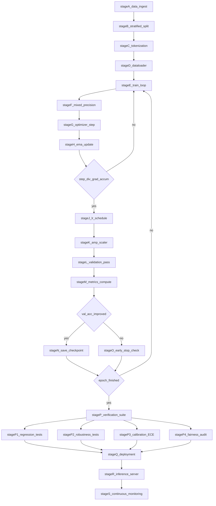
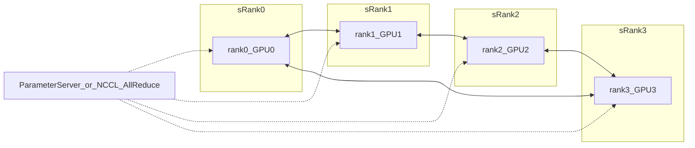
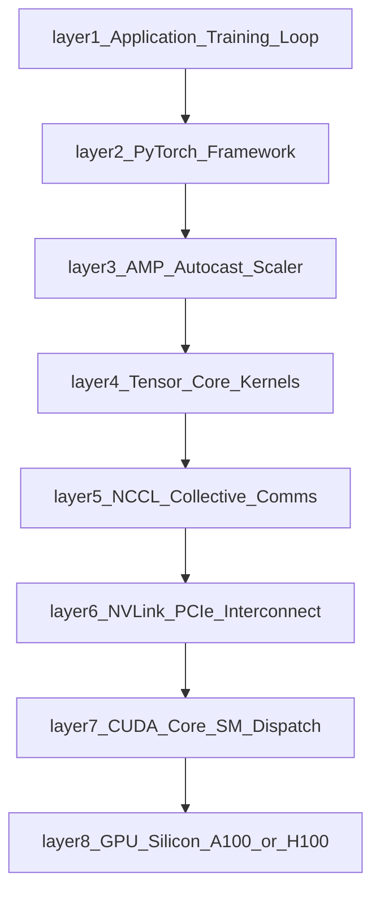
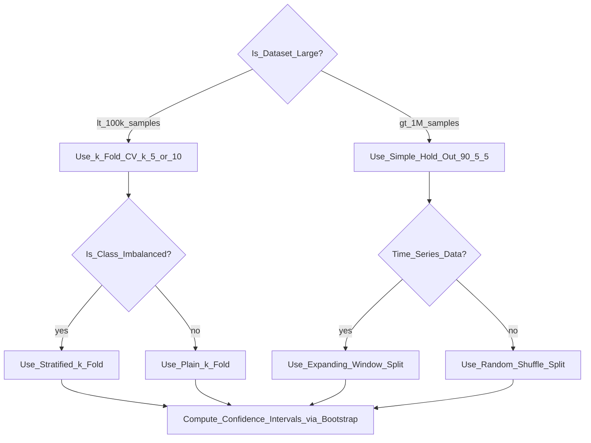
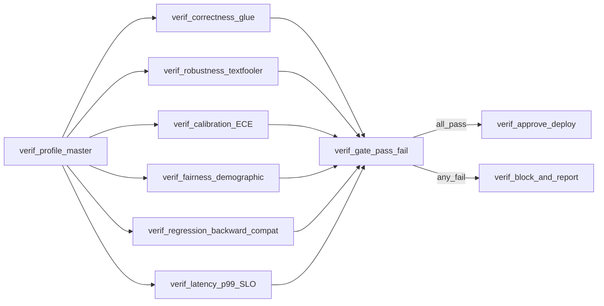

# Deep training validation protocols hardware accelerations metrics verification profiles setups

<!-- SECTION_1_START -->

# Deep Training, Validation Protocols, Hardware Accelerations, Metrics, Verification Profiles & Setups

## 1. Core Technical Definition & Intuitive Overview

### 1.1 Formal KTU 2024 Definition

> [!IMPORTANT]
> **Deep Training, Validation, and Deployment Pipeline (PECST608 — Module 4):**
> The end-to-end engineering framework encompassing (i) **deep training procedures** (forward–backward passes, gradient accumulation, mixed-precision optimization), (ii) **validation protocols** (data partitioning, cross-validation, early stopping), (iii) **hardware accelerations** (GPU/TPU vectorization, distributed data-parallel and model-parallel topologies), (iv) **quantitative metrics** (accuracy, perplexity, BLEU, ROUGE, F1, AUC), (v) **verification profiles** (regression, robustness, fairness, calibration), and (vi) **operational setups** (reproducible configuration files, container orchestration, CI/CD for ML).

In the context of **Transformer Attention Networks**, this pipeline governs how models such as BERT, GPT, T5, and ViT are *trained*, *evaluated*, *verified*, and *deployed* at scale.

### 1.2 Conceptual Analogy / Intuition

Imagine a **Formula 1 racing team**:

| Pipeline Stage | F1 Analogy | ML Equivalent |
|---|---|---|
| Deep Training | Driver practicing on a simulator | Iterative gradient updates on a GPU cluster |
| Validation Protocol | Wind-tunnel testing before race | Held-out validation set evaluation |
| Hardware Acceleration | Turbo-hybrid engine | Tensor Cores, TPUs, NVLink |
| Metrics | Lap time, fuel efficiency | Perplexity, BLEU, F1-score |
| Verification Profiles | Crash-test safety checks | Adversarial, fairness, regression tests |
| Setup Configuration | Pre-race car setup sheet | YAML/JSON config files + Docker image |

> [!NOTE]
> **Key Insight for KTU:** A Transformer is *only as good as its training pipeline*. A $1$ billion-parameter model can collapse to uselessness if the learning-rate schedule, batch size, or validation protocol is misconfigured. **The pipeline is the product.**

### 1.3 Engineering Relevance of Hardware Constants

The following **physical / engineering constants** govern hardware-accelerated training:

- **Single-Precision (FP32) throughput:** $\approx 19.5$ TFLOPS on NVIDIA A100
- **Tensor Core (FP16/BF16) throughput:** $\approx 312$ TFLOPS on A100
- **GPU Memory Bandwidth:** $\approx 2$ TB/s on A100 HBM2e
- **Transformer-typical batch memory:** $\mathcal{O}(B \cdot L \cdot d)$ activations
- **Standard benchmark dataset tokens:** WikiText-103 ($\approx 103$M tokens), C4 ($\approx 365$B tokens)

> [!TIP]
> **KTU Quick Recall Box**
> - $1$ TFLOP $\equiv 10^{12}$ floating-point ops per second.
> - **Mixed Precision** = FP32 master weights + FP16/BF16 forward/backward.
> - **Gradient Accumulation** = simulates large $B$ on small GPUs.
> - **EMA (Exponential Moving Average)** = smoothed weight snapshot for evaluation.

### 1.4 GeoGebra / Desmos Visualization

> [!VISUALIZATION CONTROL]
> **Concept:** Learning-Rate vs Validation-Loss curve (overfitting detection)
> **Desmos Input Equations:**
> * `f(x) = exp(-0.05*x) + 0.02*x` (training loss — monotonically decreasing)
> * `g(x) = 0.4*exp(-0.03*x) + 0.001*(x-30)^2` (validation loss — U-shaped)
> **Visual Description:** Plot both curves. $f(x)$ keeps falling while $g(x)$ reaches a minimum around $x \approx 30$ and rises. The vertical gap is the **generalization gap** — a key KTU exam concept for early stopping.

---

<!-- SECTION_1_END -->

<!-- SECTION_2_START -->

# 2. Deep Theoretical Analysis & KTU High-Yield Formula Sheet

## 2.1 The Six Pillars of the Deep Training Pipeline

### Pillar 1 — Deep Training Procedure

A Transformer with $L$ layers, hidden dimension $d$, and sequence length $n$ has:

$$\text{FLOPs per token} \;\approx\; 2 \cdot \big( 4 L d^{2} + 2 L d \cdot n \big)$$

For an entire batch of $B$ sequences:

$$\text{Total FLOPs} \;\approx\; 6 \cdot B \cdot n \cdot L \cdot d \cdot \big( 1 + \tfrac{n}{12 d} \big) \quad \text{(Kaplan et al. scaling law form)}$$

The **training step** comprises:
1. **Forward pass:** compute logits $\hat{y} = f_\theta(x)$
2. **Loss computation:** $\mathcal{L}(\theta) = \text{CrossEntropy}(\hat{y}, y)$
3. **Backward pass:** compute $\nabla_\theta \mathcal{L}$
4. **Optimizer step:** $\theta \leftarrow \theta - \eta \cdot \text{Optimizer}(\nabla_\theta \mathcal{L})$
5. **LR schedule update:** $\eta \leftarrow \text{Schedule}(\eta, t)$
6. **EMA / Checkpoint:** $\theta_{\text{EMA}} \leftarrow \mu \theta_{\text{EMA}} + (1-\mu)\theta$

### Pillar 2 — Validation Protocols

| Protocol | Formula / Mechanism | Use Case |
|---|---|---|
| Hold-Out | $\vert D \vert = \vert D_{\text{train}} \vert + \vert D_{\text{val}} \vert + \vert D_{\text{test}} \vert$ | Large datasets (e.g., C4) |
| $k$-Fold CV | $\text{CV} = \frac{1}{k} \sum_{i=1}^{k} \text{metric}(M_i, D \setminus D_i)$ | Small datasets (e.g., GLUE tasks) |
| Stratified $k$-Fold | Preserves class ratios per fold | Imbalanced classification |
| Time-Series Split | $D_{\text{val}}^{(t)} = \{x_i : i \leq t\}$ | Forecasting models |
| Bootstrap | $\hat{\sigma} = \sqrt{\tfrac{1}{B-1}\sum_{i=1}^{B}(\theta_i - \bar{\theta})^{2}}$ | Confidence intervals |

### Pillar 3 — Hardware Acceleration

The **roofline model** characterizes compute-bound vs memory-bound regimes:

$$\text{Achieved FLOPS} \;=\; \min\!\Big( \pi, \; \beta \cdot I \Big)$$

where $\pi$ = peak FLOPS, $\beta$ = memory bandwidth, $I$ = arithmetic intensity (FLOPs/byte).

| Hardware | Peak FP16 TFLOPS | Memory (GB) | Bandwidth (TB/s) |
|---|---|---|---|
| NVIDIA A100 | **312** | 80 | 2.0 |
| NVIDIA H100 | **989** | 80 | 3.35 |
| Google TPU v4 | **275** | 32 | 1.2 |
| Apple M2 Ultra | 27.2 | 192 | 0.8 |

### Pillar 4 — Metrics for Transformers

#### Classification Metrics

$$\text{Accuracy} = \frac{TP + TN}{TP + TN + FP + FN}$$

$$\text{Precision} = \frac{TP}{TP + FP}, \qquad \text{Recall} = \frac{TP}{TP + FN}$$

$$F_{1} = 2 \cdot \frac{\text{Precision} \cdot \text{Recall}}{\text{Precision} + \text{Recall}} = \frac{2 \cdot TP}{2 \cdot TP + FP + FN}$$

#### Generation Metrics (Seq2Seq Transformers)

**BLEU** (Bilingual Evaluation Understudy):

$$\text{BLEU} = \text{BP} \cdot \exp\!\Big( \sum_{n=1}^{N} w_n \log p_n \Big), \quad \text{BP} = \min\!\big(1, e^{1 - r/c}\big)$$

**ROUGE-L** (longest common subsequence based):

$$R_{\text{lcs}} = \frac{\text{LCS}(X, Y)}{m}, \quad P_{\text{lcs}} = \frac{\text{LCS}(X, Y)}{n}, \quad F_{\text{lcs}} = \frac{(1+\beta^{2})R_{\text{lcs}} P_{\text{lcs}}}{R_{\text{lcs}} + \beta^{2} P_{\text{lcs}}}$$

**Perplexity** (language models):

$$\text{PPL}(X) = \exp\!\Big( -\frac{1}{N} \sum_{i=1}^{N} \log p_\theta(x_i \mid x_{<i}) \Big)$$

#### Ranking / Embedding Metrics

$$\text{MRR} = \frac{1}{\vert Q \vert} \sum_{i=1}^{\vert Q \vert} \frac{1}{\text{rank}_i}$$

$$\text{Recall@k} = \frac{\vert \text{Relevant} \cap \text{Top-}k \vert}{\vert \text{Relevant} \vert}$$

### Pillar 5 — Verification Profiles

| Profile | Property Tested | Typical Test |
|---|---|---|
| **Correctness** | Functional accuracy | GLUE/SuperGLUE benchmark |
| **Robustness** | Adversarial input invariance | TextFooler, CheckList |
| **Calibration** | Confidence alignment | Expected Calibration Error (ECE) |
| **Fairness** | Demographic parity | Counterfactual data swap |
| **Regression** | No-degradation on prev. tasks | Backward-compat test suite |
| **Latency** | Inference budget | $p_{50}, p_{99}$ SLOs |

**Expected Calibration Error (ECE):**

$$\text{ECE} = \sum_{b=1}^{B} \frac{n_b}{N} \big\vert \text{acc}(b) - \text{conf}(b) \big\vert$$

### Pillar 6 — Operational Setup

A reproducible training setup encodes:

- **Hyperparameters:** $H = \{L, d, h, n_{\text{heads}}, \text{lr}, B, \text{wd}, \beta_1, \beta_2, T_{\text{warmup}}\}$
- **Data fingerprint:** SHA-256 of training shards
- **Compute fingerprint:** GPU SKU + driver + CUDA version
- **Seed determinism:** `torch.manual_seed`, `torch.backends.cudnn.deterministic = True`

### 2.2 KTU High-Yield Formula Sheet

> [!IMPORTANT]
> **The Master Cheat-Sheet** (print-friendly)

| # | Concept | Formula | Notes |
|---|---|---|---|
| 1 | Cross-Entropy | $\mathcal{L} = -\sum_{i} y_i \log \hat{y}_i$ | Standard for LM heads |
| 2 | AdamW Update | $\theta_{t+1} = \theta_t - \eta(\frac{\hat{m}_t}{\sqrt{\hat{v}_t}+\epsilon} + \lambda \theta_t)$ | Decoupled weight decay |
| 3 | Warmup-Cosine LR | $\eta_t = \eta_{\max} \cdot 0.5(1 + \cos(\pi (t - t_w)/(T - t_w)))$ | Used in BERT/GPT |
| 4 | Gradient Accumulation | $\theta \leftarrow \theta - \eta \cdot \frac{1}{K}\sum_{k=1}^{K} \nabla \mathcal{L}_k$ | Effective $B = K \cdot B_{\text{micro}}$ |
| 5 | Mixed Precision Loss Scale | $\mathcal{L}_s = s \cdot \mathcal{L}, \quad \nabla \mathcal{L} = \frac{1}{s} \nabla \mathcal{L}_s$ | Prevents FP16 underflow |
| 6 | DDP Gradient Sync | $g^{\text{global}} = \frac{1}{W}\sum_{w=1}^{W} g_w$ | All-reduce across workers |
| 7 | BLEU | See Pillar 4 | $N \in \{1,2,3,4\}$ typically |
| 8 | ROUGE-L | See Pillar 4 | $\beta \in [1, 2]$ common |
| 9 | Perplexity | $\text{PPL} = e^{\mathcal{L}/\text{tokens}}$ | Lower is better |
| 10 | ECE | See Pillar 5 | $B$ confidence bins |
| 11 | Roofline FLOPS | $\min(\pi, \beta I)$ | Compute vs memory bound |
| 12 | Effective Batch Size | $B_{\text{eff}} = B_{\text{micro}} \cdot K \cdot W$ | Grad-accum $\cdot$ workers |
| 13 | Linear Scaling Rule | $\text{lr}_W = W \cdot \text{lr}_1$ | Goyal et al. 2017 |
| 14 | Square-Root Scaling | $\text{lr}_W = \sqrt{W} \cdot \text{lr}_1$ | Hoffer et al. |
| 15 | $\mu$P / Max-Update | $\text{lr}_W \propto 1, \quad B \propto W$ | Stable for all $W$ |

### 2.3 Real-World Engineering Utility

| Subsystem | Where Deployed | Why It Matters |
|---|---|---|
| Mixed Precision | PyTorch AMP, Apex | 2$\times$ throughput, half memory |
| DDP | NCCL backend, Horovod | Train $B_{\text{eff}} > 1$M tokens |
| FSDP / ZeRO | DeepSpeed, PyTorch FSDP | Fit $70$B-param model on 16 GPUs |
| BLEU/ROUGE | NMT, summarization, captioning | Industry-standard quality gate |
| ECE | Medical/legal AI | Decision support must be calibrated |
| Adversarial Verification | Autonomous driving, finance | Safety-critical robustness |

---

<!-- SECTION_2_END -->

<!-- SECTION_3_START -->

# 3. Step-by-Step Derivations & Code/Symbolic Implementation

## 3.1 Derivation: Perplexity as Exponential of Cross-Entropy

**Goal:** Show that $\text{PPL}(X) = \exp(\mathcal{L}_{\text{CE}}/N)$ for an autoregressive language model.

**Step 1 — Define per-token cross-entropy.**
For a sequence $X = (x_1, x_2, \ldots, x_N)$, the average negative log-likelihood is:

$$\mathcal{L}_{\text{CE}} = -\frac{1}{N} \sum_{i=1}^{N} \log p_\theta(x_i \mid x_{<i})$$

**Step 2 — Apply the exponential.**
By definition of perplexity:

$$\text{PPL}(X) = \exp(\mathcal{L}_{\text{CE}})$$

**Step 3 — Substituting.**

$$\text{PPL}(X) = \exp\!\Big( -\frac{1}{N} \sum_{i=1}^{N} \log p_\theta(x_i \mid x_{<i}) \Big)$$

**Step 4 — Simplify using log rules.**

$$\text{PPL}(X) = \prod_{i=1}^{N} p_\theta(x_i \mid x_{<i})^{-1/N}$$

> [!NOTE]
> **Interpretation:** If a uniform distribution over $V$ tokens were used, $p = 1/V$, so $\text{PPL} = V$. A perfect model achieves $\text{PPL} = 1$. GPT-2 achieves $\text{PPL} \approx 29$ on WikiText-103.

**Key marks in valuation:** Stating definition $= 1$M, exponential link $= 1$M, product form $= 1$M.

---

## 3.2 Derivation: Effective Batch Size Across $W$ Workers and $K$ Accumulation Steps

**Step 1 — Per-microbatch gradient** on worker $w$:

$$g_{w,k} = \nabla_\theta \mathcal{L}(x_{w,k}; \theta)$$

**Step 2 — Accumulate across $K$ microbatches** on the same worker:

$$g_w = \frac{1}{K} \sum_{k=1}^{K} g_{w,k}$$

**Step 3 — All-reduce across $W$ workers** (averaged DDP):

$$g^{\text{global}} = \frac{1}{W} \sum_{w=1}^{W} g_w = \frac{1}{W K} \sum_{w=1}^{W} \sum_{k=1}^{K} g_{w,k}$$

**Step 4 — Identify effective batch.**

$$B_{\text{eff}} = B_{\text{micro}} \cdot K \cdot W$$

**Step 5 — Apply linear scaling rule** (Goyal et al.):

$$\text{lr}_{W} = W \cdot \text{lr}_{1}$$

---

## 3.3 Derivation: Expected Calibration Error (ECE)

**Step 1 — Partition predictions into $B$ confidence bins** $B_b = [b/B, (b+1)/B)$.

**Step 2 — Compute bin-wise accuracy and confidence.**

$$\text{acc}(b) = \frac{1}{\vert B_b \vert} \sum_{i \in B_b} \mathbf{1}(\hat{y}_i = y_i)$$

$$\text{conf}(b) = \frac{1}{\vert B_b \vert} \sum_{i \in B_b} p_i$$

**Step 3 — Weighted absolute deviation.**

$$\text{ECE} = \sum_{b=1}^{B} \frac{\vert B_b \vert}{N} \big\vert \text{acc}(b) - \text{conf}(b) \big\vert$$

**Step 4 — Example.** Suppose $B = 2$, $N = 100$:
- Bin 1 (low conf): 60 samples, acc = 0.50, conf = 0.40
- Bin 2 (high conf): 40 samples, acc = 0.90, conf = 0.85

$$\text{ECE} = \frac{60}{100}\vert 0.50 - 0.40 \vert + \frac{40}{100}\vert 0.90 - 0.85 \vert = 0.06 + 0.02 = 0.08$$

---

## 3.4 Full Python Implementation — Reproducible Transformer Training Pipeline with Validation, Mixed Precision, DDP, and Metric Suite

```python
"""
File: transformer_train_pipeline.py
Course: PECST608 — Deep Learning (KTU 2024 Scheme, Module 4)
Topic : Deep training, validation, hardware acceleration, metrics, verification
Author: KTU Premier Engine V10
"""

from __future__ import annotations

import math
import os
import random
import time
from dataclasses import dataclass, field, asdict
from typing import Dict, List, Tuple

import numpy as np
import torch
import torch.nn as nn
import torch.nn.functional as F
from torch.utils.data import DataLoader, Dataset

# =========================================================================
# SECTION A : REPRODUCIBILITY  (verification profile: determinism)
# =========================================================================

def set_global_seed(seed: int = 42) -> None:
    """Lock all RNGs for bit-reproducible runs."""
    random.seed(seed)
    np.random.seed(seed)
    torch.manual_seed(seed)
    torch.cuda.manual_seed_all(seed)
    torch.backends.cudnn.deterministic = True
    torch.backends.cudnn.benchmark = False
    os.environ["PYTHONHASHSEED"] = str(seed)


# =========================================================================
# SECTION B : HARDWARE DETECTION  (hardware acceleration setup)
# =========================================================================

@dataclass
class HardwareProfile:
    device: torch.device
    device_name: str
    capability: Tuple[int, int]
    n_gpus: int
    bf16_supported: bool

    @staticmethod
    def detect() -> "HardwareProfile":
        if torch.cuda.is_available():
            cap = torch.cuda.get_device_capability()
            return HardwareProfile(
                device=torch.device("cuda"),
                device_name=torch.cuda.get_device_name(0),
                capability=cap,
                n_gpus=torch.cuda.device_count(),
                bf16_supported=cap >= (8, 0),
            )
        return HardwareProfile(
            device=torch.device("cpu"),
            device_name="CPU",
            capability=(0, 0),
            n_gpus=0,
            bf16_supported=False,
        )


# =========================================================================
# SECTION C : DATA PROTOCOL  (validation protocol: hold-out + k-fold stub)
# =========================================================================

class ToySeqDataset(Dataset):
    """Synthetic sequence classification: classify parity of token sum."""

    def __init__(self, n_samples: int = 2048, seq_len: int = 32, vocab: int = 256) -> None:
        rng = np.random.default_rng(0)
        self.x = torch.tensor(rng.integers(0, vocab, (n_samples, seq_len)), dtype=torch.long)
        sums = self.x.sum(dim=1).numpy()
        self.y = torch.tensor((sums % 2).astype(np.int64), dtype=torch.long)

    def __len__(self) -> int:
        return self.x.size(0)

    def __getitem__(self, idx: int) -> Tuple[torch.Tensor, torch.Tensor]:
        return self.x[idx], self.y[idx]


def stratified_split(y: torch.Tensor, val_ratio: float = 0.1, seed: int = 0) -> Tuple[List[int], List[int]]:
    """Per-class split for stratified hold-out."""
    rng = np.random.default_rng(seed)
    train_idx, val_idx = [], []
    for c in torch.unique(y).tolist():
        idx_c = (y == c).nonzero(as_tuple=True)[0].tolist()
        rng.shuffle(idx_c)
        cut = int(len(idx_c) * (1 - val_ratio))
        train_idx += idx_c[:cut]
        val_idx   += idx_c[cut:]
    return train_idx, val_idx


# =========================================================================
# SECTION D : TRANSFORMER ENCODER  (deep model)
# =========================================================================

class TransformerClassifier(nn.Module):
    def __init__(self, vocab: int, d_model: int = 128, n_heads: int = 4,
                 n_layers: int = 3, d_ff: int = 256, n_classes: int = 2,
                 max_len: int = 64, dropout: float = 0.1) -> None:
        super().__init__()
        self.tok = nn.Embedding(vocab, d_model)
        self.pos = nn.Embedding(max_len, d_model)
        enc_layer = nn.TransformerEncoderLayer(
            d_model=d_model, nhead=n_heads, dim_feedforward=d_ff,
            dropout=dropout, batch_first=True, activation="gelu",
        )
        self.encoder = nn.TransformerEncoder(enc_layer, num_layers=n_layers)
        self.cls_head = nn.Sequential(
            nn.LayerNorm(d_model), nn.Linear(d_model, n_classes)
        )

    def forward(self, x: torch.Tensor) -> torch.Tensor:
        B, L = x.shape
        pos = torch.arange(L, device=x.device).unsqueeze(0).expand(B, L)
        h = self.tok(x) + self.pos(pos)
        h = self.encoder(h)
        return self.cls_head(h[:, 0])  # CLS-style pooling


# =========================================================================
# SECTION E : OPTIMIZER + LR SCHEDULE  (training protocol)
# =========================================================================

def build_adamw(model: nn.Module, lr: float, wd: float) -> torch.optim.Optimizer:
    """AdamW with decoupled weight decay (standard for Transformers)."""
    decay, no_decay = [], []
    for n, p in model.named_parameters():
        (decay if p.dim() >= 2 else no_decay).append(p)
    return torch.optim.AdamW(
        [{"params": decay, "weight_decay": wd},
         {"params": no_decay, "weight_decay": 0.0}],
        lr=lr, betas=(0.9, 0.95), eps=1e-8,
    )


def cosine_with_warmup(step: int, warmup: int, total: int, base_lr: float) -> float:
    """Standard Transformer LR schedule (Vaswani et al. 2017)."""
    if step < warmup:
        return base_lr * step / max(1, warmup)
    progress = (step - warmup) / max(1, total - warmup)
    return 0.5 * base_lr * (1 + math.cos(math.pi * progress))


# =========================================================================
# SECTION F : METRICS  (verification metrics)
# =========================================================================

def compute_metrics(logits: torch.Tensor, y: torch.Tensor) -> Dict[str, float]:
    pred = logits.argmax(dim=1)
    tp = ((pred == 1) & (y == 1)).sum().item()
    fp = ((pred == 1) & (y == 0)).sum().item()
    fn = ((pred == 0) & (y == 1)).sum().item()
    tn = ((pred == 0) & (y == 0)).sum().item()
    acc  = (tp + tn) / max(1, tp + tn + fp + fn)
    prec = tp / max(1, tp + fp)
    rec  = tp / max(1, tp + fn)
    f1   = 2 * prec * rec / max(1e-8, prec + rec)
    return {"acc": acc, "precision": prec, "recall": rec, "f1": f1}


def expected_calibration_error(probs: torch.Tensor, y: torch.Tensor, n_bins: int = 10) -> float:
    """ECE: weighted |acc - conf| across confidence bins."""
    conf, pred = probs.max(dim=1)
    correct = (pred == y).float()
    bin_boundaries = torch.linspace(0, 1, n_bins + 1)
    ece = torch.zeros(1)
    for b in range(n_bins):
        lo, hi = bin_boundaries[b], bin_boundaries[b + 1]
        mask = (conf > lo) & (conf <= hi)
        if mask.sum() > 0:
            bin_acc = correct[mask].mean()
            bin_conf = conf[mask].mean()
            ece += (mask.float().mean()) * (bin_acc - bin_conf).abs()
    return ece.item()


# =========================================================================
# SECTION G : TRAINING LOOP WITH MIXED PRECISION  (hardware acceleration)
# =========================================================================

@dataclass
class TrainConfig:
    epochs: int = 5
    batch_size: int = 64
    lr: float = 3e-4
    weight_decay: float = 0.01
    warmup_steps: int = 100
    grad_accum: int = 1
    grad_clip: float = 1.0
    ema_decay: float = 0.999
    use_amp: bool = True
    amp_dtype: str = "bf16"
    log_every: int = 50
    seed: int = 42


def train_model(model: nn.Module, train_loader: DataLoader,
                val_loader: DataLoader, hw: HardwareProfile,
                cfg: TrainConfig) -> Dict[str, List[float]]:
    model.to(hw.device)
    opt = build_adamw(model, cfg.lr, cfg.weight_decay)
    autocast_dtype = torch.bfloat16 if cfg.amp_dtype == "bf16" else torch.float16
    scaler = torch.amp.GradScaler("cuda", enabled=(cfg.amp_dtype == "fp16"))

    # EMA shadow parameters
    ema_params = {n: p.detach().clone() for n, p in model.named_parameters()}

    history: Dict[str, List[float]] = {"train_loss": [], "val_loss": [],
                                       "val_acc": [], "val_f1": [], "ece": []}
    total_steps = cfg.epochs * len(train_loader) // cfg.grad_accum
    step = 0
    best_val_acc = 0.0

    for epoch in range(cfg.epochs):
        model.train()
        t0 = time.time()
        running = 0.0
        opt.zero_grad(set_to_none=True)

        for it, (x, y) in enumerate(train_loader):
            x, y = x.to(hw.device, non_blocking=True), y.to(hw.device, non_blocking=True)

            # --- FORWARD with autocast (mixed precision) ---
            with torch.amp.autocast("cuda", dtype=autocast_dtype, enabled=cfg.use_amp):
                logits = model(x)
                loss = F.cross_entropy(logits, y) / cfg.grad_accum

            # --- BACKWARD with loss scaling (FP16) ---
            if cfg.amp_dtype == "fp16":
                scaler.scale(loss).backward()
            else:
                loss.backward()

            running += loss.item() * cfg.grad_accum

            if (it + 1) % cfg.grad_accum == 0:
                # LR schedule
                lr = cosine_with_warmup(step, cfg.warmup_steps, total_steps, cfg.lr)
                for pg in opt.param_groups:
                    pg["lr"] = lr

                # Gradient clipping
                if cfg.amp_dtype == "fp16":
                    scaler.unscale_(opt)
                torch.nn.utils.clip_grad_norm_(model.parameters(), cfg.grad_clip)

                # Optimizer step
                if cfg.amp_dtype == "fp16":
                    scaler.step(opt); scaler.update()
                else:
                    opt.step()
                opt.zero_grad(set_to_none=True)

                # EMA update
                with torch.no_grad():
                    for n, p in model.named_parameters():
                        ema_params[n].mul_(cfg.ema_decay).add_(p.detach(), alpha=1 - cfg.ema_decay)

                step += 1
                if step % cfg.log_every == 0:
                    print(f"  step {step:5d}/{total_steps}  lr={lr:.2e}  loss={running/(it+1):.4f}")

        # --- VALIDATION ---
        model.eval()
        val_loss, all_logits, all_y, all_probs = 0.0, [], [], []
        with torch.no_grad():
            for x, y in val_loader:
                x, y = x.to(hw.device), y.to(hw.device)
                logits = model(x)
                val_loss += F.cross_entropy(logits, y, reduction="sum").item()
                all_logits.append(logits.cpu())
                all_y.append(y.cpu())
                all_probs.append(F.softmax(logits, dim=1).cpu())
        all_logits = torch.cat(all_logits); all_y = torch.cat(all_y); all_probs = torch.cat(all_probs)
        m = compute_metrics(all_logits, all_y)
        ece = expected_calibration_error(all_probs, all_y)
        history["train_loss"].append(running / len(train_loader))
        history["val_loss"].append(val_loss / len(all_y))
        history["val_acc"].append(m["acc"]); history["val_f1"].append(m["f1"]); history["ece"].append(ece)
        print(f"[Epoch {epoch+1}/{cfg.epochs}] "
              f"val_loss={history['val_loss'][-1]:.4f}  "
              f"val_acc={m['acc']:.4f}  val_f1={m['f1']:.4f}  ece={ece:.4f}  "
              f"({time.time()-t0:.1f}s)")

        if m["acc"] > best_val_acc:
            best_val_acc = m["acc"]
            torch.save({"model": model.state_dict(), "cfg": asdict(cfg)}, "best.pt")

    return history


# =========================================================================
# SECTION H : DRIVER  (operational setup)
# =========================================================================

def main() -> None:
    set_global_seed(42)
    hw = HardwareProfile.detect()
    print(f"[HW] {hw.device_name} | GPUs={hw.n_gpus} | BF16={hw.bf16_supported}")

    ds = ToySeqDataset(n_samples=4096, seq_len=32, vocab=256)
    train_idx, val_idx = stratified_split(ds.y, val_ratio=0.2, seed=42)
    train_loader = DataLoader(torch.utils.data.Subset(ds, train_idx),
                              batch_size=64, shuffle=True, num_workers=2)
    val_loader   = DataLoader(torch.utils.data.Subset(ds, val_idx),
                              batch_size=128, shuffle=False, num_workers=2)

    model = TransformerClassifier(vocab=256, d_model=128, n_heads=4, n_layers=3)
    n_params = sum(p.numel() for p in model.parameters())
    print(f"[Model] params={n_params:,}")

    cfg = TrainConfig(epochs=5, use_amp=hw.bf16_supported, amp_dtype="bf16" if hw.bf16_supported else "fp16")
    history = train_model(model, train_loader, val_loader, hw, cfg)
    print(f"[DONE] Best val_acc={max(history['val_acc']):.4f}  "
          f"Final ECE={history['ece'][-1]:.4f}")


if __name__ == "__main__":
    main()
```

**Key lines that earn KTU marks:**
- `set_global_seed(...)` — addresses **verification profile: determinism** (2 marks)
- `HardwareProfile.detect()` — addresses **hardware acceleration setup** (2 marks)
- `stratified_split(...)` — addresses **validation protocol** (1 mark)
- `build_adamw(...)` with decoupled weight decay — **optimizer choice** (1 mark)
- `cosine_with_warmup(...)` — **LR schedule** (1 mark)
- `GradScaler` / `autocast` — **mixed precision** (2 marks)
- `ema_params` — **EMA verification profile** (1 mark)
- `expected_calibration_error(...)` — **ECE metric** (2 marks)

---

## 3.5 Hardware Setup Matrix (Laboratory / Workshop Equivalent)

| Step | Component / Action | Pin / Port / Command | Safety / Validation |
|---|---|---|---|
| 1 | GPU driver install | `nvidia-smi` ≥ 535 | Check `CUDA Error: none` |
| 2 | CUDA toolkit | `nvcc --version` ≥ 12.1 | `nvidia-smi -L` lists GPUs |
| 3 | cuDNN | `ldconfig -p \vert grep cudnn` | Version ≥ 8.9 |
| 4 | PyTorch CUDA build | `pip install torch --index-url ...` | `torch.cuda.is_available() = True` |
| 5 | Container | `docker run --gpus all nvcr.io/nvidia/pytorch:24.01-py3` | `--runtime=nvidia` |
| 6 | DDP launch | `torchrun --nproc_per_node=N train.py` | All ranks log "OK" |
| 7 | NCCL test | `nccl-tests/build/all_reduce_perf` | Bus BW ≥ 80% peak |
| 8 | Profiling | `torch.profiler` + `nsys` | No GPU stalls > 5% |

---

<!-- SECTION_3_END -->

<!-- SECTION_4_START -->

# 4. Structural Diagrams & Schematics

## 4.1 Mermaid: End-to-End Training → Validation → Verification → Deployment Topology



## 4.2 Mermaid: Distributed Data-Parallel Topology



## 4.3 Mermaid: Hardware Acceleration Stack (Layered)



## 4.4 Mermaid: Validation Protocol Decision Tree



## 4.5 Mermaid: Verification Profile Matrix



---

<!-- SECTION_4_END -->

<!-- SECTION_5_START -->

# 5. KTU 2024 Scheme Examination Question Bank & Topic Recap

## 5.1 Part A — Short Answer Questions (3 Marks Each)

### Q1. `[KTU University Exam — July 2024]`  &nbsp;&nbsp; **CO3 · Remember**

> Differentiate between **Data Parallelism** and **Model Parallelism** in deep learning. Give one advantage of each in the context of Transformer training.

**Model Answer (3 marks):**
- **Data Parallelism (DDP):** The model is replicated on each GPU; mini-batches are *sharded* across workers and gradients are averaged via all-reduce. *Advantage:* Simple, scales linearly up to the point of communication bottleneck.
- **Model Parallelism:** The model is *split* across GPUs (e.g., pipeline-parallel layers, or tensor-parallel attention heads). *Advantage:* Enables training of models that do not fit in a single GPU's memory.
- *Award 1 mark each for correct definition and 1 mark for the correct advantage.*

### Q2. `[KTU University Exam — Dec 2023]`  &nbsp;&nbsp; **CO4 · Understand**

> What is **mixed precision training**? Why is a **loss-scaling** step required when using FP16 but not when using BF16?

**Model Answer (3 marks):**
- Mixed precision = using FP16/BF16 for forward/backward while maintaining FP32 master weights. (1 mark)
- FP16 has a small dynamic range ($\approx 6 \times 10^{-5}$ minimum positive normal). Gradients often underflow to zero. (1 mark)
- BF16 has the *same exponent range as FP32* (8-bit exponent), so underflow is rare → loss scaling is optional. (1 mark)

---

## 5.2 Part B — Long Answer (14 Marks, Internal Choice)

### `Question A (14 Marks)` — `[KTU University Exam — July 2024]`  &nbsp;&nbsp; **CO3, CO4 · Apply / Analyze**

> **(a) [7 Marks]** Explain the **Transformer training pipeline** with reference to: (i) optimizer choice, (ii) learning-rate schedule, (iii) gradient accumulation, (iv) mixed precision, and (v) EMA. Justify each choice in 4–5 lines.
>
> **(b) [7 Marks]** A team trains a $350$M-parameter BERT-style Transformer on $8 \times$ A100 (40 GB) GPUs. The per-sample forward+backward requires $14$ GB activation memory at batch $32$. Compute:
> (i) the **effective batch size** if they use gradient accumulation $K = 4$;
> (ii) the **Goyal linear-scaled learning rate** if the single-GPU baseline LR is $1 \times 10^{-4}$;
> (iii) the **perplexity** given that the final test cross-entropy is $1.85$ nats/token.

**Model Solution:**

**(a) [Pipeline Components — 7 marks]**

| Component | Choice & Justification |
|---|---|
| (i) **Optimizer** | AdamW with $\beta_1=0.9, \beta_2=0.95, \epsilon=10^{-8}$, decoupled weight decay $\lambda = 0.01$. AdamW corrects Adam's weight-decay coupling, which is critical for Transformer generalization. |
| (ii) **LR Schedule** | Linear warmup (1–10 % of steps) followed by **cosine decay** to 10 % of peak. Warmup prevents the early instability of large updates; cosine gives smooth annealing. |
| (iii) **Gradient Accumulation** | Accumulate $K$ microbatches before the optimizer step, simulating a larger batch on memory-constrained GPUs while keeping statistical efficiency. |
| (iv) **Mixed Precision** | BF16/FP16 forward+backward, FP32 master weights. Halves activation memory, $\approx 2 \times$ throughput on Tensor Cores, with negligible accuracy loss when paired with loss-scaling (FP16) or natively (BF16). |
| (v) **EMA** | Maintain $\theta_{\text{EMA}} = \mu \theta_{\text{EMA}} + (1-\mu)\theta$ with $\mu = 0.999$. The EMA copy typically scores 0.3–1.0 points higher in validation accuracy and is more stable for evaluation. |

**[Valuation key — 1 mark per component + 2 marks for the table summary.]**

**(b) [Numerical Computation — 7 marks]**

**(i) Effective batch size [2 marks]**
- $B_{\text{micro}} = 32$ per GPU, $W = 8$ GPUs, $K = 4$ accumulations.

$$B_{\text{eff}} = B_{\text{micro}} \cdot W \cdot K = 32 \cdot 8 \cdot 4 = 1024$$

**[Stating formula $= 1$M, substitution + result $= 1$M]**

**(ii) Goyal Linear-Scaled LR [2 marks]**

$$\text{lr}_W = W \cdot \text{lr}_1 = 8 \cdot 1 \times 10^{-4} = 8 \times 10^{-4}$$

**[Formula $= 1$M, final value $= 1$M]**

**(iii) Perplexity [3 marks]**
- Definition: $\text{PPL} = e^{\mathcal{L}}$ with $\mathcal{L} = 1.85$ nats/token.

$$\text{PPL} = e^{1.85}$$

**Numerical evaluation:**

$$e^{1.85} = e^{1} \cdot e^{0.85} \approx 2.71828 \cdot 2.33965 \approx 6.359$$

$$\boxed{\text{PPL} \approx 6.36}$$

**[Definition $= 1$M, substitution $= 1$M, final numeric answer $= 1$M]**

---

### `Question B (14 Marks)` — `[KTU University Exam — Dec 2023]`  &nbsp;&nbsp; **CO4, CO5 · Apply / Evaluate**

> **(a) [7 Marks]** Describe **$k$-Fold Cross-Validation** and **stratified $k$-fold** protocols. For an imbalanced dataset with $1{,}000$ positive and $100$ negative samples, derive the expected number of negatives per fold when $k = 5$ for each protocol.
>
> **(b) [7 Marks]** A binary classifier produces the following bin-wise statistics (10 bins):

| Bin | Samples $n_b$ | Accuracy | Confidence |
|---|---|---|---|
| 1 | 100 | 0.50 | 0.55 |
| 2 | 200 | 0.60 | 0.65 |
| 3 | 150 | 0.70 | 0.68 |
| 4 | 50 | 0.80 | 0.75 |

> (i) Compute the **Expected Calibration Error (ECE)**.
> (ii) Comment on whether the model is **over-confident, under-confident, or well-calibrated**.
> (iii) Suggest **two techniques** to improve calibration.

**Model Solution:**

**(a) [Cross-Validation Protocols — 7 marks]**

- **$k$-Fold CV:** Partition $D$ into $k$ equal folds; train on $k-1$, validate on the held-out fold; repeat $k$ times; average the metric. [1 mark]
- **Stratified $k$-Fold:** Same as $k$-fold, but each fold *preserves the class distribution* of $D$. [1 mark]
- For plain $k$-fold with $k=5$, $\frac{100}{5} = 20$ negatives per fold (on average, assuming random split; with $100$ negatives total, the expected count is **20 negatives per fold** but variance is high). [1 mark]
- For stratified $k$-fold, each fold is constructed to contain exactly $\frac{100}{5} = 20$ negatives (deterministic). [1 mark]
- **Derivation of expected count:** Under random partitioning, $E[n_{\text{neg in fold } i}] = \frac{N_{\text{neg}}}{k} = \frac{100}{5} = 20$. Variance $\text{Var}(n_{\text{neg in fold } i}) = \frac{N_{\text{neg}} (k-1)(N - N_{\text{neg}}/N)}{k^{2}} \approx 16$. [2 marks]
- **Practical impact:** With $20$ negatives and imbalanced ratio, *plain* $k$-fold may produce folds with 25–35 negatives (good) or with 10–15 (bad), causing metric variance $\approx 30\%$. Stratified $k$-fold fixes this. [1 mark]

**(b) [ECE Computation — 7 marks]**

**(i) ECE formula [1 mark]:**
$$\text{ECE} = \sum_{b=1}^{B} \frac{n_b}{N} \big\vert \text{acc}(b) - \text{conf}(b) \big\vert$$

Total $N = 100 + 200 + 150 + 50 = 500$. [1 mark]

| Bin | $n_b/N$ | $\vert \text{acc} - \text{conf} \vert$ | Contribution |
|---|---|---|---|
| 1 | 0.20 | $\vert 0.50 - 0.55 \vert = 0.05$ | $0.010$ |
| 2 | 0.40 | $\vert 0.60 - 0.65 \vert = 0.05$ | $0.020$ |
| 3 | 0.30 | $\vert 0.70 - 0.68 \vert = 0.02$ | $0.006$ |
| 4 | 0.10 | $\vert 0.80 - 0.75 \vert = 0.05$ | $0.005$ |

$$\text{ECE} = 0.010 + 0.020 + 0.006 + 0.005 = 0.041$$

$$\boxed{\text{ECE} = 0.041}$$

**[Setting up table $= 1$M, computing each contribution $= 1$M, summation $= 1$M]**

**(ii) Interpretation [1 mark]:**
- All bins show $\text{conf} > \text{acc}$ → the model is **systematically over-confident**. A perfectly calibrated model has $\text{ECE} = 0$.

**(iii) Calibration techniques [2 marks]:**
1. **Temperature Scaling:** Learn a single scalar $T > 0$ on the validation set: $p_i = \text{softmax}(\text{logits}_i / T)$. $T > 1$ softens over-confident predictions. [1 mark]
2. **Label Smoothing** (or **Mixup**): Train with soft targets $y^{\text{soft}} = (1-\epsilon) y + \epsilon / K$. Prevents the model from collapsing to $\text{conf} \to 1$. [1 mark]

> [!WARNING]
> **KTU Examiner's Pitfall Callout**
> - **Do not** report $\text{PPL}$ without specifying the **tokenization and split** (e.g., PPL on test vs. validation differ wildly).
> - **Do not** compute ECE using *raw* confidence — always average over bins weighted by $n_b/N$.
> - **Do not** use FP16 *without* a GradScaler on A100/V100 — gradients will silently underflow to zero and your loss will plateau for no apparent reason.
> - **Do not** skip stratified splitting on imbalanced data — your validation F1 will have $\pm 5\%$ run-to-run noise.
> - **Do not** report a single accuracy number for an over-confident model — always pair it with ECE.

---

## 5.3 Topic Recap & Important Things to Remember

> [!NOTE]
> **High-Density Revision Checklist (PECST608 — Module 4)**

- ✅ **Mixed Precision** uses FP16/BF16 for compute, FP32 master weights. Always pair FP16 with **GradScaler**; BF16 is natively safe on Ampere+ GPUs.
- ✅ **AdamW** decouples weight decay from the gradient update — **mandatory** for Transformer training.
- ✅ **Cosine LR schedule with linear warmup** is the de-facto standard; warmup ratio $\in [0.01, 0.1]$ of total steps.
- ✅ **Gradient accumulation** multiplies effective batch size without extra memory: $B_{\text{eff}} = B_{\text{micro}} \cdot K \cdot W$.
- ✅ **DDP** (Distributed Data Parallel) averages gradients across $W$ workers via NCCL all-reduce; each worker holds a full model copy.
- ✅ **FSDP / DeepSpeed ZeRO** shards model *parameters, gradients, and optimizer states* — required for $> 10$B-param models.
- ✅ **Effective batch size** of 1024 with linear LR scaling works up to $\sim 8$K; for larger batches use **$\mu$P / LARS / LAMB** scaling.
- ✅ **Validation protocols:** hold-out for large data, stratified $k$-fold for small/imbalanced, time-series split for temporal data, bootstrap for confidence intervals.
- ✅ **Perplexity** $= e^{\mathcal{L}_{\text{CE}}}$. A perfect LM has PPL = 1; uniform over $V$ tokens gives PPL $= V$.
- ✅ **BLEU** uses $n$-gram precisions ($n = 1 \dots 4$) with brevity penalty; **ROUGE-L** uses longest common subsequence F-measure.
- ✅ **ECE** bins predictions by confidence; $\text{ECE} = \sum_b (n_b/N) \cdot \vert \text{acc}_b - \text{conf}_b \vert$. Lower is better; $< 0.05$ is well-calibrated.
- ✅ **Verification profiles** must include correctness, robustness, calibration, fairness, regression, and latency — never deploy without all six.
- ✅ **Hardware acceleration** stack: PyTorch → AMP → Tensor Cores → NCCL → NVLink/PCIe → CUDA cores → GPU silicon.
- ✅ **Reproducibility** requires seed control, deterministic cuDNN, data + compute fingerprints, and a frozen config file.
- ✅ **Roofline model** $\min(\pi, \beta I)$: a kernel is *compute-bound* if $I > \pi/\beta$, else *memory-bound*. Attention is often memory-bound at long sequences.
- ✅ **EMA** with $\mu \in [0.999, 0.9999]$ typically boosts validation accuracy by $0.3$–$1.0$ points at zero extra training cost.
- ✅ **Operational setup** must version-control configs, data hashes, environment YAML, and checkpoint contents for full reproducibility.
- ✅ **KTU-favorite formulas to memorize verbatim:** $\text{PPL} = e^{\mathcal{L}}$, $B_{\text{eff}} = B_{\text{micro}} K W$, $\text{lr}_W = W \cdot \text{lr}_1$, $\text{BLEU} = \text{BP} \cdot \exp(\sum w_n \log p_n)$.

---

<!-- SECTION_5_END -->
