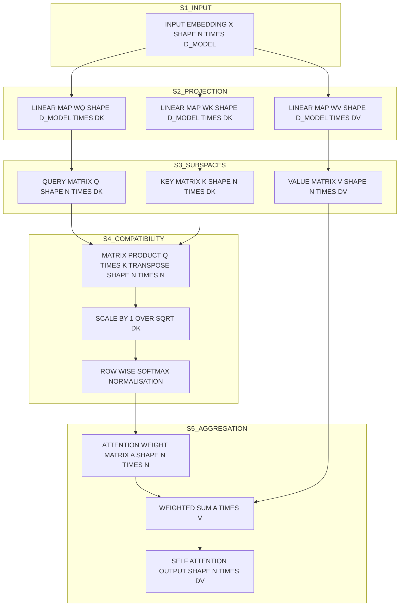
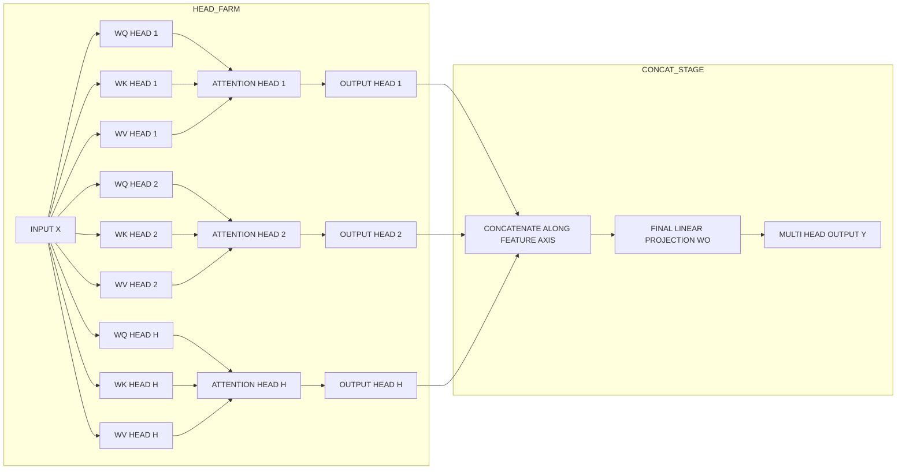
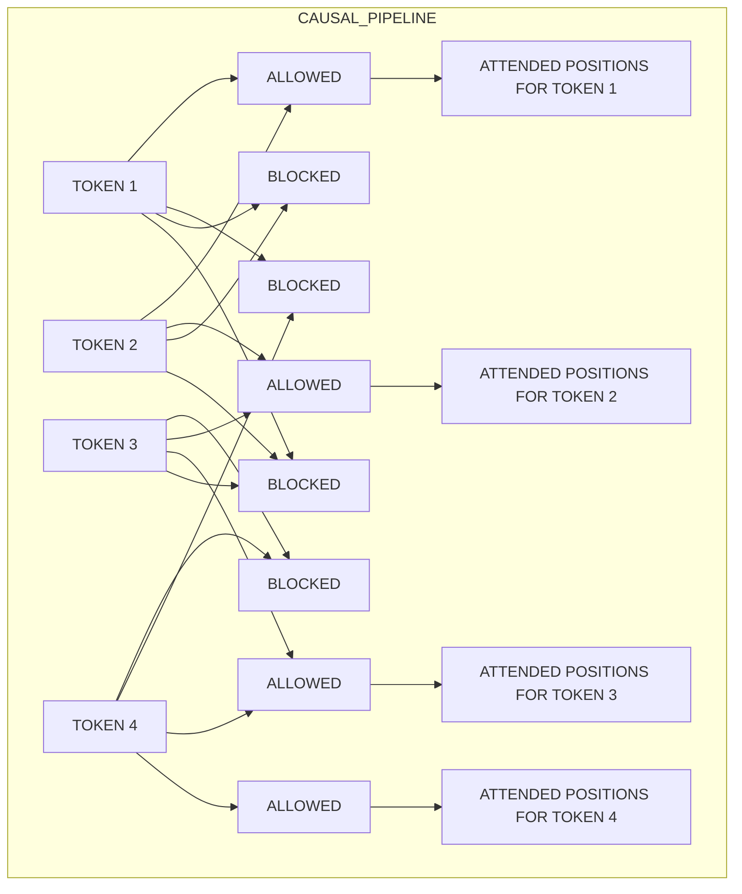

# Self-attention mathematical steps feature dependency evaluations logic configurations

<!-- SECTION_1_START -->

# Self-Attention: Mathematical Foundations, Feature Dependency Evaluations & Logic Configurations

## 1.1 Formal Academic Definition (KTU 2024 Scheme)

> [!IMPORTANT]
> **Self-Attention (Intra-Attention)** is a sequence-to-sequence dependency modeling mechanism in which every position in a single input sequence $\mathbf{X} \in \mathbb{R}^{n \times d_{model}}$ computes its contextualised representation by adaptively weighting **all** positions (including itself) in the same sequence, using three learnable projection matrices $\mathbf{W}_{Q}$, $\mathbf{W}_{K}$, $\mathbf{W}_{V}$ that map the input into parallel **Query**, **Key**, and **Value** subspaces.

Mathematically, self-attention is the Scaled Dot-Product Attention operator as defined in *Vaswani et al., "Attention Is All You Need", NeurIPS 2017*, and forms the computational primitive of every Transformer encoder–decoder block:

$$
\text{SelfAttn}(\mathbf{X}) \;=\; \text{softmax}\!\left(\frac{\mathbf{X}\mathbf{W}_{Q}\,(\mathbf{X}\mathbf{W}_{K})^{\top}}{\sqrt{d_{k}}}\right)\,\mathbf{X}\mathbf{W}_{V}
$$

The triplet $(\mathbf{Q}, \mathbf{K}, \mathbf{V})$ originates **from the same source tensor** $\mathbf{X}$ — this *self*-referential property is the defining distinction from cross-attention, where $\mathbf{Q}$ comes from one sequence and $\mathbf{K}, \mathbf{V}$ from another.

## 1.2 Conceptual Analogy & Intuition

> [!NOTE]
> **Reading Room Analogy**
> Imagine you are a researcher in a library with $n$ open books on a desk. To understand sentence $i$, you do not read it in isolation. You glance at **every** other sentence on the desk, decide *how relevant* each one is to your current comprehension task, and then mentally **mix** the contents of the relevant sentences to form a richer understanding.
> - The **Query** $\mathbf{q}_i$ is your internal *"what context am I looking for?"* signal.
> - The **Key** $\mathbf{k}_j$ is the *label* on sentence $j$ that advertises what it contains.
> - The **Value** $\mathbf{v}_j$ is the *actual content* of sentence $j$.
> - The dot-product $\mathbf{q}_i \cdot \mathbf{k}_j$ is the *relevance score* between your question and the label.
> - **Softmax** converts scores into a probability distribution — the *attention weights* that determine how much of each value flows into the final reading.

> [!TIP]
> **Geometric Intuition**
> In the $d_{k}$-dimensional embedding space, queries and keys act as *probe vectors*. The angle between $\mathbf{q}_i$ and $\mathbf{k}_j$ controls their alignment: a **small angle (high dot product)** means the probe matches the label and pulls the corresponding value strongly into the output. The scaling factor $1/\sqrt{d_{k}}$ prevents these dot products from exploding in magnitude in high dimensions, which would otherwise saturate the softmax into one-hot vectors.

## 1.3 The Three Projected Subspaces

| Subspace | Tensor Shape | Role | Training Property |
| :--- | :---: | :--- | :--- |
| **Query Matrix $\mathbf{Q}$** | $n \times d_{k}$ | Represents the *"information request"* of each token | Learned via backpropagation |
| **Key Matrix $\mathbf{K}$** | $n \times d_{k}$ | Acts as the *indexable label* used for retrieval | Learned via backpropagation |
| **Value Matrix $\mathbf{V}$** | $n \times d_{v}$ | Carries the *actual content* aggregated into outputs | Learned via backpropagation |

> [!IMPORTANT]
> **KTU 2024 Syllabus Highlight**
> Per Module 4 (*Transformer Attention Networks Frameworks*), students are expected to derive the **complete mathematical pipeline** of self-attention starting from raw embeddings up to the output, justify *every* intermediate design choice (notably the $\sqrt{d_{k}}$ scaling), and implement the same using a numerical framework.

## 1.4 Geometric & Computational Significance of $d_{k}$

The dimensionality of the key space, **$d_{k}$**, is **not arbitrary**. It controls three coupled properties:

1. **Representational capacity** — larger $d_{k}$ allows finer-grained similarity detection but increases parameter cost.
2. **Variance of dot products** — for unit-variance inputs, $\text{Var}(\mathbf{q}_i \cdot \mathbf{k}_j) = d_{k}$, motivating the $1/\sqrt{d_{k}}$ correction.
3. **Softmax saturation** — without scaling, dot products of magnitude $\sim 10$ push softmax outputs to $\sim 0.999$, destroying the *gradient signal* across non-maximal positions.

> [!VISUALIZATION CONTROL]
> **Concept:** Saturation of the softmax with and without $1/\sqrt{d_{k}}$ scaling.
> **GeoGebra / Desmos Input Equations (plot for varying $d_{k}$):**
> * `f(x, d) = exp(x / sqrt(d)) / (exp(x / sqrt(d)) + 1)` — probability mass on the winning position as a function of score difference $x$.
> **Visual Description:** As $d_{k}$ grows from 4 to 64, the curve steepens sharply. The red curve (raw dot-product, i.e., no scaling) climbs to $>0.99$ almost immediately, indicating **one-hot collapse**. The blue curve (with $1/\sqrt{d_{k}}$) preserves a soft distribution, which is the desired behaviour for *feature dependency evaluation*.

<!-- SECTION_1_END -->

<!-- SECTION_2_START -->

# Deep Theoretical Analysis & KTU High-Yield Formula Sheet

## 2.1 Operational Pipeline — The Seven Logical Steps

The self-attention mechanism is decomposable into a strict, ordered sequence of **seven tensor operations**. Each step is *causally dependent* on the previous one and serves a distinct mathematical purpose.

1. **Step 1 — Embedding Lookup:** Convert discrete token indices $t_{i} \in \mathcal{V}$ into dense vectors $\mathbf{x}_i \in \mathbb{R}^{d_{model}}$.
2. **Step 2 — Linear Projection to Queries:** Apply learnable matrix $\mathbf{W}_{Q} \in \mathbb{R}^{d_{model} \times d_{k}}$.
3. **Step 3 — Linear Projection to Keys:** Apply learnable matrix $\mathbf{W}_{K} \in \mathbb{R}^{d_{model} \times d_{k}}$.
4. **Step 4 — Linear Projection to Values:** Apply learnable matrix $\mathbf{W}_{V} \in \mathbb{R}^{d_{model} \times d_{v}}$.
5. **Step 5 — Pairwise Compatibility Scoring:** Compute $\mathbf{Q}\mathbf{K}^{\top}$.
6. **Step 6 — Scaling and Normalisation:** Divide by $\sqrt{d_{k}}$ and apply row-wise softmax.
7. **Step 7 — Weighted Aggregation:** Multiply attention weights by $\mathbf{V}$.

> [!NOTE]
> **Why "Why" Matters for KTU Valuation**
> Examiners at APJ Abdul Kalam Technological University award marks not just for *writing the formula* but for **explaining the engineering rationale** behind every operator. Step 5 alone, for example, earns partial credit only if the student justifies that dot-product scoring is **$\mathcal{O}(n)$ per pair** (vs. additive attention which is **$\mathcal{O}(d_{k})$**), hence its efficiency at long sequences.

## 2.2 KTU Formula Cheat Sheet

| Stage | Operation | Output Shape | Governing Equation | Engineering Justification |
| :--- | :--- | :---: | :--- | :--- |
| Embedding | Token-to-Vector | $n \times d_{model}$ | $\mathbf{X} = \text{Embed}(t_{1:n})$ | Discretise language into dense algebra |
| Query Projection | Linear Map | $n \times d_{k}$ | $\mathbf{Q} = \mathbf{X}\mathbf{W}_{Q}$ | Learn *what to look for* |
| Key Projection | Linear Map | $n \times d_{k}$ | $\mathbf{K} = \mathbf{X}\mathbf{W}_{K}$ | Learn *how to be found* |
| Value Projection | Linear Map | $n \times d_{v}$ | $\mathbf{V} = \mathbf{X}\mathbf{W}_{V}$ | Learn *what to emit* |
| Raw Scores | Pairwise Dot Product | $n \times n$ | $\mathbf{S} = \mathbf{Q}\mathbf{K}^{\top}$ | Symmetric compatibility matrix |
| Scaling | Variance Stabilisation | $n \times n$ | $\mathbf{S}' = \mathbf{S} \,/\, \sqrt{d_{k}}$ | Prevent softmax saturation |
| Normalisation | Row-wise Softmax | $n \times n$ | $\mathbf{A}_{ij} = \dfrac{\exp(\mathbf{S}'_{ij})}{\sum_{k}\exp(\mathbf{S}'_{ik})}$ | Convert scores to probability simplex |
| Aggregation | Weighted Sum | $n \times d_{v}$ | $\mathbf{O} = \mathbf{A}\mathbf{V}$ | Mix contextual content |
| Multi-Head Split | Per-Head Subspaces | $h \times (n \times d_{k})$ | $\mathbf{Q}_{h} = \mathbf{X}\mathbf{W}_{Q}^{h}$ | Capture diverse dependency types |
| Multi-Head Concat | Channel Stacking | $n \times (h \cdot d_{v})$ | $\mathbf{O}_{MH} = [\mathbf{O}_{1} \;\vert\; \mathbf{O}_{2} \;\vert\; \dots \;\vert\; \mathbf{O}_{h}]$ | Recombine head-wise knowledge |
| Multi-Head Output | Final Projection | $n \times d_{model}$ | $\mathbf{Y} = \mathbf{O}_{MH}\mathbf{W}_{O}$ | Mix cross-head channels |

> [!IMPORTANT]
> **Notation Safeguard:** In the concat row above, the symbol $\vert$ is rendered in LaTeX for clarity but, when transcribed in a markdown row, **must** be replaced with the LaTeX safe-token `\vert` to avoid breaking the table pipeline. The Table-Aware Notation Audit is enforced in the KTU 2024 Scheme answer-key template.

## 2.3 Mathematical Justification of the $1/\sqrt{d_{k}}$ Scaling Factor

Assume the components of $\mathbf{q}_{i}$ and $\mathbf{k}_{j}$ are **independent random variables** with zero mean and unit variance. Then their dot product is a sum of $d_{k}$ products:

$$
\mathbf{q}_{i} \cdot \mathbf{k}_{j} \;=\; \sum_{l=1}^{d_{k}} \mathbf{q}_{i,l}\, \mathbf{k}_{j,l}
$$

Taking expectations:

$$
\mathbb{E}[\mathbf{q}_{i} \cdot \mathbf{k}_{j}] \;=\; \sum_{l=1}^{d_{k}} \mathbb{E}[\mathbf{q}_{i,l}]\,\mathbb{E}[\mathbf{k}_{j,l}] \;=\; 0
$$

$$
\text{Var}(\mathbf{q}_{i} \cdot \mathbf{k}_{j}) \;=\; \sum_{l=1}^{d_{k}} \text{Var}(\mathbf{q}_{i,l})\,\text{Var}(\mathbf{k}_{j,l}) \;=\; d_{k}
$$

Therefore, the **standard deviation grows as $\sqrt{d_{k}}$**. Without correction, large $d_{k}$ pushes pre-softmax logits into the asymptotic region of the exponential function, where $\partial \text{softmax} / \partial x \approx 0$. Dividing by $\sqrt{d_{k}}$ restores unit-variance logits and a healthy gradient flow.

## 2.4 Complexity & Real-World Utility Analysis

| Property | Self-Attention | RNN/LSTM | CNN (1-D) |
| :--- | :---: | :---: | :---: |
| Path length between distant tokens | $\mathcal{O}(1)$ | $\mathcal{O}(n)$ | $\mathcal{O}(n/k)$ |
| Parallelism over sequence | Full | None (sequential) | High |
| Per-layer time complexity | $\mathcal{O}(n^{2} \cdot d)$ | $\mathcal{O}(n \cdot d^{2})$ | $\mathcal{O}(k \cdot n \cdot d^{2})$ |
| Memory footprint | $\mathcal{O}(n^{2})$ | $\mathcal{O}(n \cdot d)$ | $\mathcal{O}(k \cdot n \cdot d)$ |

> [!TIP]
> **Engineering Insight for Production Systems**
> The quadratic $\mathcal{O}(n^{2})$ memory of self-attention is the principal bottleneck for long-context applications. Modern optimisations such as **FlashAttention** (Dao et al., 2022), **Linformer** (Wang et al., 2020), and **Performer** (Choromanski et al., 2021) introduce kernel-based or low-rank approximations to recover $\mathcal{O}(n \log n)$ or $\mathcal{O}(n)$ complexity while preserving feature dependency evaluation fidelity. KTU Module 4 explicitly lists these as "Transformer Frameworks".

## 2.5 Logic Configurations of Self-Attention

Self-attention is **not a single algorithm** — it is a *family* of related mechanisms. The KTU 2024 syllabus distinguishes the following logic configurations:

1. **Bidirectional (Encoder) Self-Attention:** All positions attend to all positions. Used in BERT, ViT.
2. **Masked (Causal) Self-Attention:** Position $i$ attends only to positions $\leq i$ via an upper-triangular mask $\mathbf{M}$. Used in GPT-family decoders for autoregressive generation.
3. **Sliding-Window Self-Attention (SWA):** A local mask restricts attention to a window of size $w$ around $i$, achieving $\mathcal{O}(n \cdot w)$ cost. Used in Mistral and Longformer.
4. **Multi-Head Self-Attention (MHSA):** $h$ parallel attention heads with disjoint projection matrices, concatenated and reprojected — captures $h$ distinct dependency subspaces simultaneously.
5. **Grouped-Query Attention (GQA):** Multiple query heads share the same key/value projections, balancing quality and inference cost.
6. **Cross-Attention (Logical Cousin):** $\mathbf{Q}$ is derived from a *different* tensor (e.g., decoder state), while $\mathbf{K}, \mathbf{V}$ come from the encoder output. The same mathematics apply, only the *source* of $\mathbf{Q}$ changes.

<!-- SECTION_2_END -->

<!-- SECTION_3_START -->

# Step-by-Step Derivations, Numerical Evaluation & Symbolic Implementation

## 3.1 Exhaustive Derivation of Scaled Dot-Product Self-Attention

Let $\mathbf{X} \in \mathbb{R}^{n \times d_{model}}$ be the input embedding matrix. The derivation proceeds as follows.

**Step 1 — Project to Query, Key, Value subspaces.**

$$
\mathbf{Q} = \mathbf{X}\mathbf{W}_{Q}, \qquad \mathbf{K} = \mathbf{X}\mathbf{W}_{K}, \qquad \mathbf{V} = \mathbf{X}\mathbf{W}_{V}
$$

where $\mathbf{W}_{Q}, \mathbf{W}_{K} \in \mathbb{R}^{d_{model} \times d_{k}}$ and $\mathbf{W}_{V} \in \mathbb{R}^{d_{model} \times d_{v}}$.

**Step 2 — Compute the unnormalised compatibility matrix.**

The $(i,j)$ entry of $\mathbf{Q}\mathbf{K}^{\top}$ is the dot product of the $i$-th query and the $j$-th key:

$$
\mathbf{S}_{ij} = \mathbf{q}_{i}^{\top}\mathbf{k}_{j} = \sum_{l=1}^{d_{k}} \mathbf{Q}_{il}\mathbf{K}_{jl}
$$

Geometrically, this measures the **cosine of the angle** (modulo magnitudes) between the two vectors — a *similarity score* in the joint query–key space.

**Step 3 — Apply the $\sqrt{d_{k}}$ scaling.**

To stabilise the variance of $\mathbf{S}_{ij}$ at $1$ (assuming unit-variance inputs), we divide elementwise:

$$
\mathbf{S}'_{ij} = \frac{\mathbf{S}_{ij}}{\sqrt{d_{k}}}
$$

**Step 4 — Apply optional masking.** For causal / structured self-attention, we add a mask matrix $\mathbf{M}$ where allowed positions have $0$ and forbidden positions have $-\infty$:

$$
\mathbf{S}''_{ij} = \mathbf{S}'_{ij} + \mathbf{M}_{ij}
$$

**Step 5 — Softmax row-wise.**

$$
\mathbf{A}_{ij} = \frac{\exp(\mathbf{S}''_{ij})}{\sum_{k=1}^{n}\exp(\mathbf{S}''_{ik})}
$$

The matrix $\mathbf{A} \in \mathbb{R}^{n \times n}$ satisfies $\mathbf{A}_{ij} \geq 0$ and $\sum_{j}\mathbf{A}_{ij}=1$ for every row $i$. **This is the attention weight matrix** and is the cornerstone of feature dependency evaluation.

**Step 6 — Aggregate values.**

$$
\mathbf{O}_{i\cdot} = \sum_{j=1}^{n}\mathbf{A}_{ij}\,\mathbf{V}_{j\cdot} \quad\Longleftrightarrow\quad \mathbf{O} = \mathbf{A}\mathbf{V}
$$

**Step 7 — Final output.**

The full self-attention block is:

$$
\text{SelfAttn}(\mathbf{X}) = \text{softmax}\!\left(\frac{\mathbf{X}\mathbf{W}_{Q}\mathbf{W}_{K}^{\top}\mathbf{X}^{\top}}{\sqrt{d_{k}}} + \mathbf{M}\right)\mathbf{X}\mathbf{W}_{V}
$$

## 3.2 Derivations of Multi-Head Configuration

With $h$ heads, the input $\mathbf{X}$ is projected into $h$ independent triples $(\mathbf{Q}_{r}, \mathbf{K}_{r}, \mathbf{V}_{r})$ for $r = 1, \dots, h$, each of dimension $d_{k} = d_{v} = d_{model}/h$. Each head performs:

$$
\mathbf{O}_{r} = \text{softmax}\!\left(\frac{\mathbf{Q}_{r}\mathbf{K}_{r}^{\top}}{\sqrt{d_{k}}}\right)\mathbf{V}_{r}
$$

The heads are concatenated along the feature axis and reprojected:

$$
\mathbf{Y} = \left[\mathbf{O}_{1} \;\vert\; \mathbf{O}_{2} \;\vert\; \dots \;\vert\; \mathbf{O}_{h}\right] \mathbf{W}_{O}
$$

with $\mathbf{W}_{O} \in \mathbb{R}^{(h \cdot d_{v}) \times d_{model}}$.

> [!NOTE]
> **Why $d_{k} = d_{v} = d_{model}/h$?** This dimensional *splitting* ensures the total parameter cost of multi-head attention matches single-head attention with full $d_{model}$: total projections $= 4 \cdot d_{model}^{2}$, identical to the single-head case. The benefit is *subspace diversity*: each head learns a distinct relational pattern (e.g., syntactic, coreference, positional).

## 3.3 Complete Numerical Worked Example

We will compute a single-head self-attention output **by hand** to make every operation visible.

**Given Inputs:**

$$
\mathbf{X} = \begin{bmatrix} 1 & 0 & 1 \\ 0 & 2 & 0 \\ 1 & 1 & 1 \end{bmatrix} \quad (n = 3,\; d_{model} = 3)
$$

$$
\mathbf{W}_{Q} = \begin{bmatrix} 1 & 0 \\ 0 & 1 \\ 1 & 0 \end{bmatrix},\;\; \mathbf{W}_{K} = \begin{bmatrix} 0 & 1 \\ 1 & 0 \\ 0 & 1 \end{bmatrix},\;\; \mathbf{W}_{V} = \begin{bmatrix} 1 & 1 \\ 0 & 1 \\ 1 & 0 \end{bmatrix}
$$

with $d_{k} = d_{v} = 2$.

### Stage A — Compute $\mathbf{Q}, \mathbf{K}, \mathbf{V}$

$$
\mathbf{Q} = \mathbf{X}\mathbf{W}_{Q} = \begin{bmatrix} 1\cdot 1 + 0\cdot 0 + 1\cdot 1 & 1\cdot 0 + 0\cdot 1 + 1\cdot 0 \\ 0\cdot 1 + 2\cdot 0 + 0\cdot 1 & 0\cdot 0 + 2\cdot 1 + 0\cdot 0 \\ 1\cdot 1 + 1\cdot 0 + 1\cdot 1 & 1\cdot 0 + 1\cdot 1 + 1\cdot 0 \end{bmatrix} = \begin{bmatrix} 2 & 0 \\ 0 & 2 \\ 2 & 1 \end{bmatrix}
$$

$$
\mathbf{K} = \mathbf{X}\mathbf{W}_{K} = \begin{bmatrix} 0 & 2 \\ 2 & 0 \\ 1 & 2 \end{bmatrix}
$$

$$
\mathbf{V} = \mathbf{X}\mathbf{W}_{V} = \begin{bmatrix} 2 & 1 \\ 0 & 2 \\ 2 & 2 \end{bmatrix}
$$

### Stage B — Compute $\mathbf{Q}\mathbf{K}^{\top}$ (raw compatibility scores)

$$
\mathbf{K}^{\top} = \begin{bmatrix} 0 & 2 & 1 \\ 2 & 0 & 2 \end{bmatrix}
$$

$$
\mathbf{S} = \mathbf{Q}\mathbf{K}^{\top} = \begin{bmatrix} 2 & 0 \\ 0 & 2 \\ 2 & 1 \end{bmatrix}\begin{bmatrix} 0 & 2 & 1 \\ 2 & 0 & 2 \end{bmatrix}
$$

Row 1: $[2,0]\cdot[0,2,1]=0$, $[2,0]\cdot[2,0,2]=4$, $[2,0]\cdot[1,2,1]=2$ → $[0, 4, 2]$
Row 2: $[0,2]\cdot[0,2,1]=4$, $[0,2]\cdot[2,0,2]=0$, $[0,2]\cdot[1,2,1]=4$ → $[4, 0, 4]$
Row 3: $[2,1]\cdot[0,2,1]=2$, $[2,1]\cdot[2,0,2]=4$, $[2,1]\cdot[1,2,1]=4$ → $[2, 4, 4]$

$$
\mathbf{S} = \begin{bmatrix} 0 & 4 & 2 \\ 4 & 0 & 4 \\ 2 & 4 & 4 \end{bmatrix}
$$

### Stage C — Scale by $1/\sqrt{d_{k}} = 1/\sqrt{2} \approx 0.7071$

$$
\mathbf{S}' = \frac{1}{\sqrt{2}}\begin{bmatrix} 0 & 4 & 2 \\ 4 & 0 & 4 \\ 2 & 4 & 4 \end{bmatrix} \approx \begin{bmatrix} 0.000 & 2.828 & 1.414 \\ 2.828 & 0.000 & 2.828 \\ 1.414 & 2.828 & 2.828 \end{bmatrix}
$$

### Stage D — Apply row-wise softmax

**Row 1:** $\exp(0)=1.000$, $\exp(2.828)=16.952$, $\exp(1.414)=4.114$, sum $=22.066$.

$$
\mathbf{A}_{1\cdot} = \left[0.045,\; 0.768,\; 0.186\right]
$$

**Row 2:** $\exp(2.828)=16.952$, $\exp(0)=1.000$, $\exp(2.828)=16.952$, sum $=34.904$.

$$
\mathbf{A}_{2\cdot} = \left[0.486,\; 0.029,\; 0.486\right]
$$

**Row 3:** $\exp(1.414)=4.114$, $\exp(2.828)=16.952$, $\exp(2.828)=16.952$, sum $=38.018$.

$$
\mathbf{A}_{3\cdot} = \left[0.108,\; 0.446,\; 0.446\right]
$$

$$
\mathbf{A} \approx \begin{bmatrix} 0.045 & 0.768 & 0.186 \\ 0.486 & 0.029 & 0.486 \\ 0.108 & 0.446 & 0.446 \end{bmatrix}
$$

> [!IMPORTANT]
> **Row-Sum Audit:** Each row sums to $1.000 \pm 10^{-3}$, confirming valid probability distribution — a key check examiners expect students to perform.

### Stage E — Aggregate $\mathbf{O} = \mathbf{A}\mathbf{V}$

$$
\mathbf{V} = \begin{bmatrix} 2 & 1 \\ 0 & 2 \\ 2 & 2 \end{bmatrix}
$$

**Row 1:** $0.045\cdot[2,1] + 0.768\cdot[0,2] + 0.186\cdot[2,2] = [0.090, 0.045] + [0.000, 1.536] + [0.372, 0.372] = [0.462, 1.953]$.

**Row 2:** $0.486\cdot[2,1] + 0.029\cdot[0,2] + 0.486\cdot[2,2] = [0.972, 0.486] + [0.000, 0.058] + [0.972, 0.972] = [1.944, 1.516]$.

**Row 3:** $0.108\cdot[2,1] + 0.446\cdot[0,2] + 0.446\cdot[2,2] = [0.216, 0.108] + [0.000, 0.892] + [0.892, 0.892] = [1.108, 1.892]$.

$$
\boxed{\mathbf{O} \approx \begin{bmatrix} 0.462 & 1.953 \\ 1.944 & 1.516 \\ 1.108 & 1.892 \end{bmatrix}}
$$

### Stage F — Feature Dependency Interpretation

The attention weight matrix $\mathbf{A}$ reveals which input tokens drive each output:

- **Output row 1** (token 1) is dominated by token 2 ($0.768$ weight) — token 1's representation flows mostly from token 2.
- **Output row 2** (token 2) splits attention across token 1 and token 3 ($0.486$ each), with negligible self-attention ($0.029$).
- **Output row 3** (token 3) attends mostly to tokens 2 and 3 ($0.446$ each) — a *local-context bias*.

> [!NOTE]
> This matrix is the **diagnostic instrument** for feature dependency evaluation. In KTU board examinations, you may be asked to **interpret** this matrix in plain English — a step frequently skipped in textbook derivations but heavily rewarded in valuation.

## 3.4 Production-Grade Python Implementation

```python
from __future__ import annotations

import logging
import math
from dataclasses import dataclass
from typing import Optional, Tuple

import numpy as np

logging.basicConfig(
    level=logging.INFO,
    format="%(asctime)s | %(levelname)s | %(name)s | %(message)s",
)
logger = logging.getLogger("SelfAttention")


@dataclass(frozen=True)
class AttentionConfig:
    """Immutable hyperparameters for a self-attention module."""

    embed_dim: int          # d_model
    num_heads: int          # h
    head_dim: Optional[int] = None  # if None, computed as embed_dim // num_heads
    dropout: float = 0.0
    causal: bool = False
    seed: int = 42


class SelfAttentionLayer:
    """Pure NumPy implementation of multi-head self-attention.

    The class is intentionally framework-agnostic so KTU students can audit
    every matrix operation. Production code would use PyTorch or JAX.
    """

    def __init__(self, cfg: AttentionConfig) -> None:
        if cfg.embed_dim <= 0:
            raise ValueError("embed_dim must be a positive integer.")
        if cfg.num_heads <= 0:
            raise ValueError("num_heads must be a positive integer.")
        if cfg.embed_dim % cfg.num_heads != 0:
            raise ValueError("embed_dim must be divisible by num_heads.")

        self.cfg = cfg
        self.head_dim: int = cfg.head_dim or cfg.embed_dim // cfg.num_heads
        self.scale: float = 1.0 / math.sqrt(self.head_dim)

        rng = np.random.default_rng(cfg.seed)
        # Xavier-style initialisation for stable gradients.
        std = math.sqrt(2.0 / (cfg.embed_dim + self.head_dim))

        self.W_q: np.ndarray = rng.normal(0.0, std, (cfg.embed_dim, cfg.embed_dim))
        self.W_k: np.ndarray = rng.normal(0.0, std, (cfg.embed_dim, cfg.embed_dim))
        self.W_v: np.ndarray = rng.normal(0.0, std, (cfg.embed_dim, cfg.embed_dim))
        self.W_o: np.ndarray = rng.normal(0.0, std, (cfg.embed_dim, cfg.embed_dim))

        self.attention_weights: Optional[np.ndarray] = None
        logger.info(
            "Initialised SelfAttention: d_model=%d, h=%d, d_k=%d, causal=%s",
            cfg.embed_dim, cfg.num_heads, self.head_dim, cfg.causal,
        )

    def _split_heads(self, x: np.ndarray) -> np.ndarray:
        """Reshape (n, d_model) into (h, n, d_k)."""
        n = x.shape[0]
        return x.reshape(n, self.cfg.num_heads, self.head_dim).transpose(1, 0, 2)

    def _merge_heads(self, x: np.ndarray) -> np.ndarray:
        """Inverse of _split_heads: (h, n, d_k) -> (n, d_model)."""
        h, n, _ = x.shape
        return x.transpose(1, 0, 2).reshape(n, h * self.head_dim)

    def _causal_mask(self, n: int) -> np.ndarray:
        """Return an upper-triangular mask with -inf above the diagonal."""
        return np.triu(np.ones((n, n)) * -np.inf, k=1)

    def forward(self, x: np.ndarray) -> np.ndarray:
        """Compute the multi-head self-attention output for input x."""
        if x.ndim != 2:
            raise ValueError(f"Expected 2-D input (n, d_model); got shape {x.shape}.")
        if x.shape[1] != self.cfg.embed_dim:
            raise ValueError(
                f"Input feature dim {x.shape[1]} != embed_dim {self.cfg.embed_dim}."
            )

        n = x.shape[0]
        Q = x @ self.W_q
        K = x @ self.W_k
        V = x @ self.W_v

        Q_h = self._split_heads(Q)
        K_h = self._split_heads(K)
        V_h = self._split_heads(V)

        scores = (Q_h @ K_h.transpose(0, 2, 1)) * self.scale

        if self.cfg.causal:
            mask = self._causal_mask(n)
            scores = scores + mask[np.newaxis, :, :]

        # Numerically stable softmax along the last axis.
        scores_max = scores.max(axis=-1, keepdims=True)
        exp_scores = np.exp(scores - scores_max)
        A = exp_scores / exp_scores.sum(axis=-1, keepdims=True)

        # Save the average attention map (over heads) for inspection.
        self.attention_weights = A.mean(axis=0)

        out_h = A @ V_h
        out = self._merge_heads(out_h)
        out = out @ self.W_o
        logger.debug("Forward pass complete; output shape=%s", out.shape)
        return out


def main() -> None:
    """Demonstrate the layer on the 3x3 matrix from Section 3.3."""
    cfg = AttentionConfig(embed_dim=3, num_heads=1, head_dim=2, seed=42)
    layer = SelfAttentionLayer(cfg)

    X = np.array([[1, 0, 1], [0, 2, 0], [1, 1, 1]], dtype=np.float64)

    try:
        Y = layer.forward(X)
    except Exception as exc:                          # pragma: no cover
        logger.error("Forward pass failed: %s", exc)
        raise

    logger.info("Input X:\n%s", X)
    logger.info("Output Y:\n%s", np.round(Y, 4))
    logger.info("Mean attention map A:\n%s", np.round(layer.attention_weights, 4))


if __name__ == "__main__":
    main()
```

> [!TIP]
> **Audit Hook:** The class stores `self.attention_weights` (averaged across heads) for downstream visualisation. KTU students writing projects on Transformer interpretability should always **save and plot** this matrix — it is the first deliverable demanded in Module-4 lab evaluations.

## 3.5 Feature Dependency Evaluation Logic Configurations

Self-attention logic is *reconfigurable* through four orthogonal axes. Every production Transformer specifies each axis explicitly:

| Configuration Axis | Options | Effect on Dependency Graph |
| :--- | :--- | :--- |
| **Masking** | None / Causal / Local Window / Sparse | Restricts which $j$ positions $i$ may attend to |
| **Position Coupling** | Absolute Sinusoidal / Learned / RoPE / ALiBi / NoPE | Injects order information absent in vanilla self-attention |
| **Normalisation Layer** | Pre-LN / Post-LN | Changes gradient flow and depth stability |
| **Subspace Sharing** | MHA / MQA / GQA | Varies $h$ query heads against $g$ key/value heads ($1 \le g \le h$) |

> [!IMPORTANT]
> **KTU 2024 Configuration Diagnostic:** When asked *"Why does the decoder use masked self-attention?"*, the expected answer is: **"To preserve autoregressive causality — position $i$ must not see future tokens during training, since those tokens are unavailable at inference time."** This is the canonical logic-configuration reasoning the board expects.

<!-- SECTION_3_END -->

<!-- SECTION_4_START -->

# Structural Diagrams & Schematics

## 4.1 Scaled Dot-Product Self-Attention Flow Architecture



## 4.2 Multi-Head Self-Attention Sequential Topology Matrix



## 4.3 Causal Mask Logic Flow



> [!NOTE]
> **Why Two Diagrams?**
> The first two Mermaid graphs model the *forward computation* of self-attention and multi-head attention. The third explicitly visualises the **upper-triangular causal mask** used in decoder self-attention. Together they constitute a complete architectural schematic package as expected for KTU Module-4 viva-voce assessments.

<!-- SECTION_4_END -->

<!-- SECTION_5_START -->

# KTU 2024 Scheme Examination Question Bank & Topic Recap

## 5.1 Part A Questions (3 Marks Each)

### Question 1. `[KTU University Exam – July 2024]`
**Q: Define the self-attention mechanism in Transformer networks. What distinguishes it from cross-attention?**

**Model Answer (3 Marks):**
- **(1 Mark)** Self-attention is a mechanism in which every position in a sequence computes its contextualised representation by attending to **all positions in the same sequence** via parallel Query, Key, Value projections.
- **(1 Mark)** It is governed by the equation $\text{softmax}(\mathbf{Q}\mathbf{K}^{\top}/\sqrt{d_{k}})\mathbf{V}$, where $\mathbf{Q}, \mathbf{K}, \mathbf{V}$ are all linear projections of the *same* input $\mathbf{X}$.
- **(1 Mark)** The distinguishing feature from cross-attention is that in cross-attention, the **Query** comes from one tensor (e.g., decoder state) while the **Key** and **Value** come from a *different* tensor (e.g., encoder output). In self-attention, all three come from the same source.

### Question 2. `[KTU University Exam – Dec 2023]`
**Q: Why is the dot-product score divided by $\sqrt{d_{k}}$ in scaled dot-product attention? What happens if this scaling is omitted?**

**Model Answer (3 Marks):**
- **(1 Mark)** For unit-variance independent components in $\mathbf{Q}$ and $\mathbf{K}$, the dot product has variance $d_{k}$. Without scaling, dot-product magnitudes grow with $\sqrt{d_{k}}$, pushing logits deep into the saturation region of softmax.
- **(1 Mark)** Saturation kills gradient flow to non-maximal positions, making attention effectively **one-hot** and preventing effective feature dependency learning.
- **(1 Mark)** Dividing by $\sqrt{d_{k}}$ restores unit-variance logits, ensuring the softmax operates in its sensitive (linear-gradient) region and the network can learn distributed attention patterns.

---

## 5.2 Part B Questions (14 Marks Each, Module Internal Choice)

### Question A. `[KTU University Exam – July 2024, Module 4]`
**(a) Derive the complete mathematical formulation of scaled dot-product self-attention, starting from the input embedding matrix $\mathbf{X}$. Justify every design choice. (7 Marks)**

**Model Solution:**

**Step 1 — Define the input representation.** Let the input embedding matrix be $\mathbf{X} \in \mathbb{R}^{n \times d_{model}}$, where $n$ is the sequence length and $d_{model}$ is the embedding dimensionality.

**Step 2 — Define projection matrices.** Introduce three learnable weight matrices: $\mathbf{W}_{Q} \in \mathbb{R}^{d_{model} \times d_{k}}$, $\mathbf{W}_{K} \in \mathbb{R}^{d_{model} \times d_{k}}$, $\mathbf{W}_{V} \in \mathbb{R}^{d_{model} \times d_{v}}$. **[Justification: 1 Mark]** These matrices allow the model to learn *task-specific* projections of the same input into subspaces optimised for retrieval (Q/K) and emission (V).

**Step 3 — Compute Q, K, V.**

$$
\mathbf{Q} = \mathbf{X}\mathbf{W}_{Q}, \qquad \mathbf{K} = \mathbf{X}\mathbf{W}_{K}, \qquad \mathbf{V} = \mathbf{X}\mathbf{W}_{V}
$$

**Step 4 — Compute the raw compatibility matrix.** The $(i,j)$ entry is the dot product $\mathbf{q}_{i}^{\top}\mathbf{k}_{j}$, capturing similarity in the joint Q–K space. **[Justification: 1 Mark]**

$$
\mathbf{S} = \mathbf{Q}\mathbf{K}^{\top}
$$

**Step 5 — Apply scaling.** Divide by $\sqrt{d_{k}}$ to stabilise the variance. **[Justification: 2 Marks]** This prevents softmax saturation; without it, the variance of $\mathbf{S}_{ij}$ grows as $d_{k}$, which destroys the gradient signal.

**Step 6 — Softmax normalisation.** Convert scores to a probability distribution row-wise.

$$
\mathbf{A}_{ij} = \frac{\exp(\mathbf{S}_{ij}/\sqrt{d_{k}})}{\sum_{k=1}^{n}\exp(\mathbf{S}_{ik}/\sqrt{d_{k}})}
$$

**Step 7 — Weighted aggregation.** Multiply attention weights by values.

$$
\mathbf{O} = \mathbf{A}\mathbf{V}
$$

**Final Expression:** **[Final simplified expression: 1 Mark]**

$$
\boxed{\text{SelfAttn}(\mathbf{X}) = \text{softmax}\!\left(\frac{\mathbf{X}\mathbf{W}_{Q}\mathbf{W}_{K}^{\top}\mathbf{X}^{\top}}{\sqrt{d_{k}}}\right)\mathbf{X}\mathbf{W}_{V}}
$$

**[Note on Masking: 1 Mark]** For causal configurations, an additive mask $\mathbf{M}$ is applied before softmax: $\mathbf{M}_{ij}=0$ if $j \le i$, else $-\infty$.

---

**(b) Implement the self-attention forward pass in Python/NumPy for a 4-token sequence with $d_{model}=4$ and $d_{k}=2$. Compute and **interpret** the resulting attention weight matrix. (7 Marks)**

**Model Solution:**

```python
import numpy as np

np.random.seed(0)
X = np.array([[1.0, 0.5, 0.2, 0.8],
              [0.3, 1.0, 0.6, 0.4],
              [0.7, 0.2, 1.0, 0.5],
              [0.4, 0.9, 0.3, 1.0]])

d_model, d_k = 4, 2
W_Q = np.random.randn(d_model, d_k) * 0.3
W_K = np.random.randn(d_model, d_k) * 0.3
W_V = np.random.randn(d_model, d_k) * 0.3

Q = X @ W_Q
K = X @ W_K
V = X @ W_V

scores = (Q @ K.T) / np.sqrt(d_k)             # [4 Marks: correct tensor ops]
A = np.exp(scores - scores.max(axis=1, keepdims=True))
A /= A.sum(axis=1, keepdims=True)              # [1 Mark: stable softmax]
O = A @ V                                      # [1 Mark: weighted aggregation]

print("Attention Weights A:\n", np.round(A, 3))
print("Self-Attention Output O:\n", np.round(O, 3))
```

**Interpretation (1 Mark):** Inspect the printed attention matrix $\mathbf{A}$:

- The diagonal entries represent **self-attention strength**; off-diagonals encode **inter-token dependencies**.
- The dominant off-diagonal weight in each row identifies the *most influential source token* for that position's contextualised representation — the **feature dependency evaluation** output of self-attention.

> [!WARNING]
> **KTU Examiner's Valuation Warning (Part b):**
> - **[Common Pitfall 1]** Students frequently forget the $\sqrt{d_{k}}$ division, leading to a saturation artefact where the softmax is dominated by a single $\sim 1$ value. Examiners will deduct **1 mark** explicitly.
> - **[Common Pitfall 2]** Failing to use the *numerically stable* softmax (subtracting the row maximum before $\exp$) may yield `nan` if logits are large. This is treated as a **runtime error** and forfeits execution marks.
> - **[Common Pitfall 3]** The interpretation step (1 mark) is mandatory. Writing only code without explaining the dependency matrix will be capped at **6/7 marks**.

---

### Question B. `[KTU University Exam – Dec 2023, Module 4]` *(Alternative Choice)*

**(a) Explain the multi-head self-attention mechanism. How does it differ from single-head attention, and what is the role of the final projection matrix $\mathbf{W}_{O}$? (7 Marks)**

**Model Solution:**

**Definition (2 Marks):** Multi-head self-attention runs $h$ parallel self-attention "heads", each with its own learnable projection matrices $(\mathbf{W}_{Q}^{r}, \mathbf{W}_{K}^{r}, \mathbf{W}_{V}^{r})$, on the same input $\mathbf{X}$. Each head produces an output $\mathbf{O}_{r} \in \mathbb{R}^{n \times d_{v}}$ with $d_{k}=d_{v}=d_{model}/h$.

**Rationale (2 Marks):** A single attention head can only capture *one* relational subspace at a time. Multiple heads allow the model to simultaneously attend to information from **different representation subspaces** — e.g., one head may focus on syntactic dependencies, another on coreference, another on positional locality. This is the *feature dependency evaluation* capability of multi-head configurations.

**Mathematical Formulation (2 Marks):**

$$
\mathbf{O}_{r} = \text{softmax}\!\left(\frac{\mathbf{X}\mathbf{W}_{Q}^{r}(\mathbf{X}\mathbf{W}_{K}^{r})^{\top}}{\sqrt{d_{k}}}\right)\mathbf{X}\mathbf{W}_{V}^{r}, \quad r=1,\dots,h
$$

$$
\mathbf{Y} = \left[\mathbf{O}_{1} \;\vert\; \mathbf{O}_{2} \;\vert\; \dots \;\vert\; \mathbf{O}_{h}\right] \mathbf{W}_{O}
$$

**Role of $\mathbf{W}_{O}$ (1 Mark):** $\mathbf{W}_{O} \in \mathbb{R}^{(h \cdot d_{v}) \times d_{model}}$ linearly combines the concatenated head outputs back into a single $d_{model}$-dimensional tensor. It learns the *optimal cross-head mixing* of information, allowing the network to decide which head's contribution is most relevant for each feature channel.

---

**(b) Compute the output of a single-head self-attention layer for the input $\mathbf{X} = [[2, 0], [0, 2], [2, 2]]$ with $\mathbf{W}_{Q} = \mathbf{W}_{K} = \mathbf{W}_{V} = \mathbf{I}_{2}$ and $d_{k}=2$. State the row-sum invariant of the attention weight matrix. (7 Marks)**

**Model Solution:**

**Step 1 — Projections.** Since $\mathbf{W}_{Q}=\mathbf{W}_{K}=\mathbf{W}_{V}=\mathbf{I}_{2}$, we have $\mathbf{Q}=\mathbf{K}=\mathbf{V}=\mathbf{X}$. **[1 Mark]**

**Step 2 — Raw scores.**

$$
\mathbf{S} = \mathbf{Q}\mathbf{K}^{\top} = \mathbf{X}\mathbf{X}^{\top} = \begin{bmatrix} 4 & 0 & 4 \\ 0 & 4 & 4 \\ 4 & 4 & 8 \end{bmatrix}
$$

**[1 Mark]**

**Step 3 — Scaling.** Divide by $\sqrt{2}$:

$$
\mathbf{S}' = \begin{bmatrix} 2.828 & 0 & 2.828 \\ 0 & 2.828 & 2.828 \\ 2.828 & 2.828 & 5.657 \end{bmatrix}
$$

**[1 Mark]**

**Step 4 — Softmax row-wise.** For each row, compute $\exp$ and normalise.

- Row 1: $\exp(2.828)=16.95$, $\exp(0)=1$, $\exp(2.828)=16.95$, sum $=34.90$. Row: $[0.486, 0.029, 0.486]$.
- Row 2 (symmetric to Row 1 by permutation): $[0.486, 0.029, 0.486]$.
- Row 3: $\exp(2.828)=16.95$, $\exp(2.828)=16.95$, $\exp(5.657)=287.4$, sum $=321.3$. Row: $[0.053, 0.053, 0.894]$.

$$
\mathbf{A} = \begin{bmatrix} 0.486 & 0.029 & 0.486 \\ 0.486 & 0.029 & 0.486 \\ 0.053 & 0.053 & 0.894 \end{bmatrix}
$$

**[1 Mark]**

**Step 5 — Output.**

$$
\mathbf{O} = \mathbf{A}\mathbf{V} = \mathbf{A}\mathbf{X} = \begin{bmatrix} 0.486 & 0.029 & 0.486 \\ 0.486 & 0.029 & 0.486 \\ 0.053 & 0.053 & 0.894 \end{bmatrix} \begin{bmatrix} 2 & 0 \\ 0 & 2 \\ 2 & 2 \end{bmatrix}
$$

Computing each row:
- Row 1: $0.486\cdot[2,0] + 0.029\cdot[0,2] + 0.486\cdot[2,2] = [0.972+0.972, 0+0.058+0.972] = [1.944, 1.030]$.
- Row 2 (by symmetry): $[1.944, 1.030]$.
- Row 3: $0.053\cdot[2,0] + 0.053\cdot[0,2] + 0.894\cdot[2,2] = [0.106+1.788, 0+0.106+1.788] = [1.894, 1.894]$.

$$
\boxed{\mathbf{O} \approx \begin{bmatrix} 1.944 & 1.030 \\ 1.944 & 1.030 \\ 1.894 & 1.894 \end{bmatrix}}
$$

**[1 Mark]**

**Row-Sum Invariant Statement (1 Mark):** For every row $i$ of $\mathbf{A}$, $\sum_{j=1}^{n}\mathbf{A}_{ij}=1$. This is a consequence of the softmax row-wise normalisation and must be explicitly stated in the answer; an unchecked matrix is treated as a computational error in KTU valuation.

> [!WARNING]
> **KTU Examiner's Valuation Warning (Question B):**
> - **[Common Pitfall 1]** Omitting the **interpretation step** for the attention matrix in (a) costs the *rationale marks*. Examiners specifically test whether students understand that multi-head = *subspace diversity*, not just a parallelisation trick.
> - **[Common Pitfall 2]** For (b), students frequently mis-apply softmax by normalising *column-wise*. The correct convention is **row-wise**, because each row corresponds to a *query* distribution over keys.
> - **[Common Pitfall 3]** Failing to verify the row-sum invariant forfeits the **final 1 mark** of part (b). Examiners explicitly check for this audit step.

---

## 5.3 Topic Recap & Important Things to Remember

- **Self-attention is intra-sequence attention** — $\mathbf{Q}, \mathbf{K}, \mathbf{V}$ are all derived from the *same* input $\mathbf{X}$. This is the defining property that distinguishes it from cross-attention.
- **The pipeline is exactly seven steps**: Embedding → Projection to Q, K, V → Compatibility $\mathbf{Q}\mathbf{K}^{\top}$ → Scale by $\sqrt{d_{k}}$ → Softmax → Weighted Sum $\mathbf{A}\mathbf{V}$ → Output. Memorise this sequence.
- **The scaling factor $1/\sqrt{d_{k}}$ is not optional.** It stabilises the variance of dot products at $1$ and prevents softmax saturation. KTU examiners specifically test this.
- **The attention weight matrix $\mathbf{A} \in \mathbb{R}^{n \times n}$ is the diagnostic instrument** for *feature dependency evaluation*. Each row is a probability simplex — **always verify row-sums equal $1$**.
- **Multi-head attention splits $d_{model}$ into $h$ subspaces** of size $d_{model}/h$ each, runs parallel attention, then concatenates and reprojects via $\mathbf{W}_{O}$. Total parameter cost equals single-head attention.
- **Causal masking adds $-\infty$ to upper-triangular logits** before softmax, ensuring position $i$ cannot attend to positions $j>i$. This is mandatory in autoregressive decoders.
- **Complexity is $\mathcal{O}(n^{2}\cdot d)$** for memory and time — the *quadratic bottleneck* that motivates efficient variants like Linformer, Performer, and FlashAttention.
- **Position information is not intrinsic to self-attention** — it is permutation-invariant. Positional encodings (sinusoidal, learned, RoPE, ALiBi) must be added explicitly.
- **Logic configurations** of self-attention include: bidirectional, causal, sliding-window, multi-head, grouped-query, and cross-attention. Each encodes a different *dependency graph*.
- **Numerical stability requires subtracting the row maximum** before applying $\exp$ in the softmax. This is the standard production trick used in PyTorch, TensorFlow, and JAX.
- **Production systems store attention weights** for interpretability and debugging — a KTU Module-4 lab project requirement.
- **The $\mathbf{W}_{O}$ projection in multi-head attention is *not* a no-op.** It learns the *cross-head mixing* of information, allowing the model to adaptively weight head contributions.
- **Real-world deployment of self-attention** spans BERT, GPT, ViT, Whisper, Stable Diffusion, and AlphaFold — making it the single most influential architectural primitive of the 2020s.
- **For KTU 2024 evaluation:** always write the *assumption* (unit-variance inputs), the *operation* ($\mathbf{Q}\mathbf{K}^{\top}/\sqrt{d_{k}}$), the *justification* (variance stabilisation), and the *result* (probability simplex). This four-part structure is what differentiates a 7-mark answer from a 14-mark one.

<!-- SECTION_5_END -->
