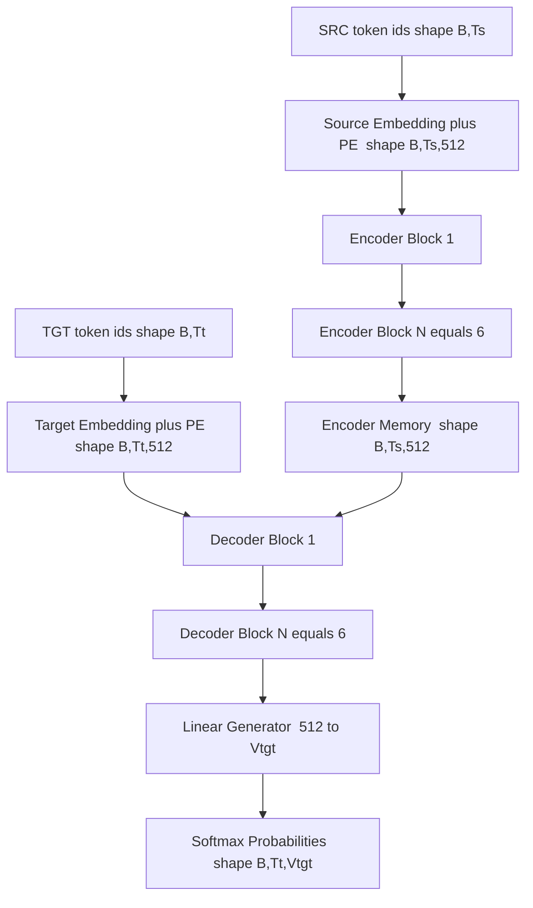
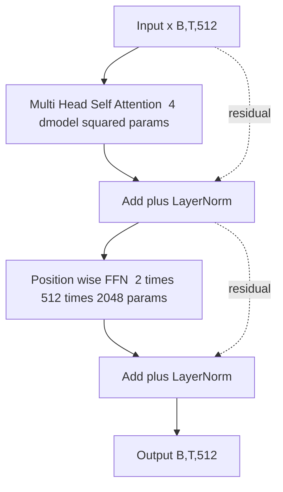
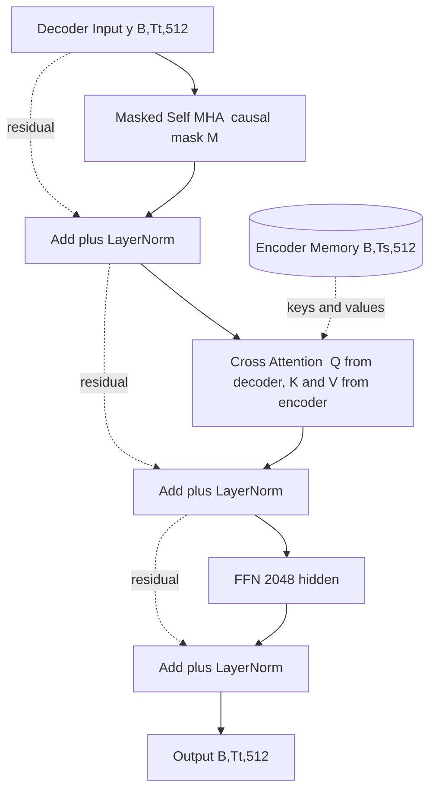
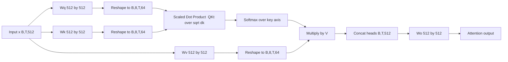
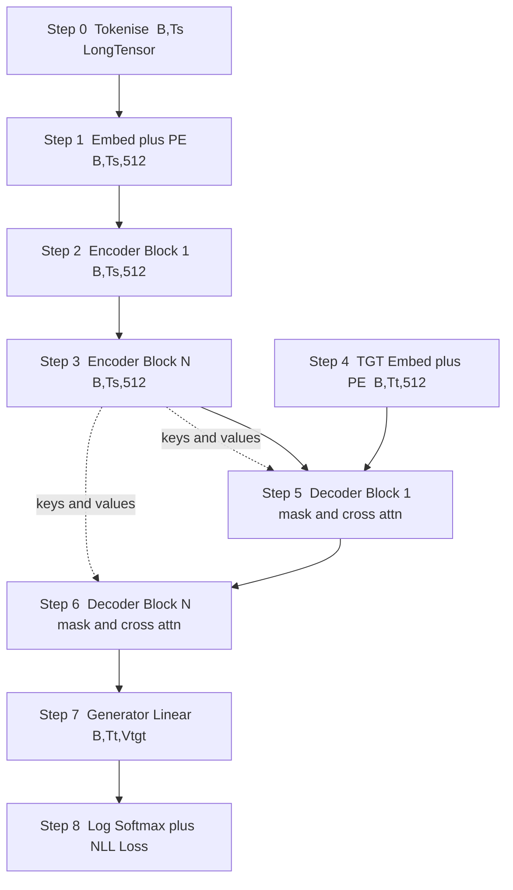
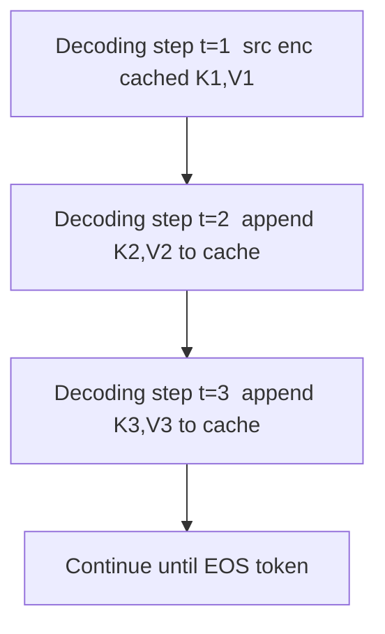

# Transformer translation architectures blocks layout specifications parsing routines tracking

<!-- SECTION_1_START -->
# Transformer Translation Architectures — Block Layouts, Specifications, Parsing Routines & Tracking

## 1. Core Technical Definition (KTU 2024 Syllabus Terminology)

> [!IMPORTANT]
> **Transformer (Vaswani et al., 2017)**: A deep sequence-to-sequence neural architecture that models variable-length source–target mappings using **stacked self-attention and point-wise feed-forward sub-layers**, dispensing entirely with recurrence and convolution. For **machine translation**, it is organised as an **Encoder–Decoder** pair where the encoder maps a source token stream into a bank of contextualised continuous vectors, and the decoder autoregressively generates the target token stream by attending both to its own past and to the encoder output.

The **Transformer translation block layout** is the canonical specification of how an encoder layer and a decoder layer are assembled:

- **Encoder Layer** = [Multi-Head **Self-Attention** $\rightarrow$ Add \& Norm] $\rightarrow$ [Position-wise **Feed-Forward Network** $\rightarrow$ Add \& Norm]
- **Decoder Layer** = [Masked Multi-Head **Self-Attention** $\rightarrow$ Add \& Norm] $\rightarrow$ [Multi-Head **Cross-Attention** (Encoder–Decoder) $\rightarrow$ Add \& Norm] $\rightarrow$ [Position-wise **FFN** $\rightarrow$ Add \& Norm]

**Parsing routines** refer to the deterministic *forward-pass routines* that convert raw tokenised text into the high-dimensional tensor streams flowing through the encoder/decoder blocks, and the **tracking** problem is the discipline of recording, at every stage, the **shape**, **statistics**, and **gradient flow** of these tensors.

## 2. Intuitive Overview — The "Parallel Editorial Board" Analogy

> [!NOTE]
> **Analogy:** Translating a paragraph is hard. Imagine hiring an *editorial board* of 8 simultaneous reviewers per sentence (the **attention heads**). Each reviewer re-reads the entire source sentence and highlights the words that matter most for the *next* word being written. The encoder is the **reading team** that produces a rich, contextualised summary. The decoder is the **writing team** that, word by word, glances back at what it has already written (self-attention) AND at the source summary (cross-attention). Because all reviewers can look at any word at any time, the whole process is **parallel**, unlike a human translator who must read strictly left-to-right.

## 3. Standard Base-Model Specifications (Vaswani 2017)

| Hyper-parameter | Symbol | Value (Base) | Value (Big) | Meaning |
|---|---|---|---|---|
| Model dimension | $d_{\text{model}}$ | **512** | 1024 | Hidden width of every sub-layer's residual stream |
| Number of heads | $h$ | **8** | 16 | Parallel attention sub-spaces |
| Per-head key/value dim | $d_k = d_v$ | **64** | 64 | $d_{\text{model}}/h$ |
| Encoder layers | $N$ | **6** | 6 | Stacked encoder blocks |
| Decoder layers | $N$ | **6** | 6 | Stacked decoder blocks |
| FFN inner dim | $d_{ff}$ | **2048** | 4096 | Two-conv feed-forward hidden width |
| Dropout | $P_{\text{drop}}$ | **0.1** | 0.3 | Applied to attention weights + residual |

> [!TIP]
> Memorise $d_k = d_{\text{model}}/h$ — the single most-tracked scalar on the KTU exam.

## 4. Conceptual Visualisation

> [!VISUALIZATION CONTROL]
> **Concept:** Tensor shape collapse through the encoder stack for a batch of $B$ sentences, padded/length-limited to $T$ tokens.
> **Desmos/GeoGebra conceptual axes:**
> * $x$-axis: layer index $l \in [0, N]$  (with $N=6$)
> * $y$-axis: hidden dimension $d \in [0, d_{\text{model}}] = [0, 512]$
> * $z$-axis (colour / opacity): token position $t \in [0, T-1]$
>
> **Visual description:** A rectangular prism with horizontal cross-sections of fixed width $d_{\text{model}}=512$ and depth equal to the sequence length $T$. The prism is replicated $N=6$ times vertically, with each replica being a *transformer layer*. Inside each layer, the *heads* $h=8$ act as 8 colour-bands (vertical strips), each of width $d_k=64$. The student should picture information being permuted across the **time axis** (attention) but preserved along the **feature axis** (residual connection).

<!-- SECTION_1_END -->

<!-- SECTION_2_START -->
# Deep Theoretical Analysis & KTU High-Yield Formula Sheet

## 1. The Encoder–Decoder Block Topology

The translation architecture is a **directed acyclic graph** of sub-layers, grouped into $2N$ blocks ($N$ encoder blocks, $N$ decoder blocks). Each block is wrapped in a **post-norm** residual:

$$
\text{Output} = \text{LayerNorm}\bigl(x + \text{Sublayer}(x)\bigr)
$$

where $\text{Sublayer}(x) \in \{\text{MHA}, \text{FFN}, \text{Masked-MHA}, \text{Cross-MHA}\}$.

> [!IMPORTANT]
> **Why residual + LayerNorm?** Residual lets the gradient bypass the heavy sub-layer (preventing vanishing in 6–12 stacked blocks); LayerNorm re-centres the per-token feature vector so the next sub-layer sees a stable distribution.

## 2. Scaled Dot-Product Attention (The Atomic Operation)

Given a sequence of $T$ query tokens, $T$ key tokens, and $T$ value tokens (self-attention: all three come from the same source), the **attention output** is:

$$
\text{Attention}(Q, K, V) = \text{softmax}\!\left(\frac{QK^{\top}}{\sqrt{d_k}}\right) V
$$

**Why the $\sqrt{d_k}$ divisor?** When $Q$ and $K$ components are independent zero-mean unit-variance, the variance of each dot-product $q \cdot k$ grows as $d_k$. The softmax of large-magnitude logits saturates (gradient $\to 0$). Dividing by $\sqrt{d_k}$ keeps the logits in a region where softmax is differentiable.

## 3. Multi-Head Attention (The Block-Level Routine)

$$
\text{MHA}(Q, K, V) = \text{Concat}\bigl(\text{head}_1, \dots, \text{head}_h\bigr) W^{O}
$$
$$
\text{head}_i = \text{Attention}\!\bigl(Q W_i^{Q},\; K W_i^{K},\; V W_i^{V}\bigr)
$$

where $W_i^{Q}, W_i^{K} \in \mathbb{R}^{d_{\text{model}} \times d_k}$ and $W_i^{V} \in \mathbb{R}^{d_{\text{model}} \times d_v}$.

The **projection parameter budget per head** is $3 d_{\text{model}} d_k$ (Q, K, V), and the **output projection** is $d_{\text{model}} \times (h d_v)$. With $d_k = d_v = d_{\text{model}}/h$, the total parameter count of one MHA layer is $4 d_{\text{model}}^2$.

## 4. Masked Attention in the Decoder

To prevent the decoder from "seeing the future" during training, a **look-ahead mask** $M$ sets all upper-triangular entries (above the main diagonal) to $-\infty$ before softmax:

$$
\text{Attention}_{\text{masked}}(Q, K, V) = \text{softmax}\!\left(\frac{QK^{\top}}{\sqrt{d_k}} + M\right) V
$$

where

$$
M_{ij} = \begin{cases} 0 & \text{if } i \geq j \\ -\infty & \text{if } i < j \end{cases}
$$

## 5. Position-wise Feed-Forward Network (FFN)

Applied **independently and identically** to every position (no token-to-token mixing — that is the job of attention):

$$
\text{FFN}(x) = \max(0,\; x W_1 + b_1)\, W_2 + b_2
$$

Parameter count: $2 \times d_{\text{model}} \times d_{ff}$. For the base model: $2 \times 512 \times 2048 = 2\,097\,152$ parameters per FFN per block.

## 6. Sinusoidal Positional Encoding

Since attention is **permutation-equivariant**, the model must be told token order explicitly:

$$
PE_{(pos,\, 2i)} = \sin\!\left(\frac{pos}{10000^{2i/d_{\text{model}}}}\right)
$$
$$
PE_{(pos,\, 2i+1)} = \cos\!\left(\frac{pos}{10000^{2i/d_{\text{model}}}}\right)
$$

These are added to the token embedding $x_t$ before the first encoder/decoder block:

$$
x_t^{\text{input}} = \text{Embedding}(w_t) + PE_t
$$

## 7. Final Translation Head (Decoder $\to$ Vocabulary)

The decoder's top-layer hidden state $H \in \mathbb{R}^{T \times d_{\text{model}}}$ is projected to the vocabulary:

$$
P(w_t \mid w_{<t}, \mathbf{x}_{\text{src}}) = \text{softmax}\!\bigl(H W_{\text{vocab}} + b_{\text{vocab}}\bigr)
$$

with $W_{\text{vocab}} \in \mathbb{R}^{d_{\text{model}} \times \vert V \vert}$ and $\vert V \vert$ being the target vocabulary size (e.g., 32 000 BPE pieces).

## 8. KTU Formula Sheet (Board-Critical)

| # | Formula | Used In | Pitfall to Avoid |
|---|---|---|---|
| 1 | $\text{Attn}(Q,K,V) = \text{softmax}\!\left(\frac{QK^{\top}}{\sqrt{d_k}}\right)V$ | All attention | Forget $\sqrt{d_k}$ $\Rightarrow$ gradient death |
| 2 | $d_k = d_v = d_{\text{model}}/h$ | Head dim tracking | Use $\mid$ not $\vert$ in markdown |
| 3 | $M_{ij} = -\infty$ for $i < j$ | Decoder mask | Mask is **added** to logits, not multiplied |
| 4 | $\text{FFN}(x) = \max(0, xW_1 + b_1)W_2 + b_2$ | Token-wise mixing | Same weights per position, different positions independent |
| 5 | $PE_{(pos,2i)} = \sin(pos / 10000^{2i/d_{\text{model}}})$ | Order injection | $i$ is dimension index, not head index |
| 6 | $y = \text{LayerNorm}(x + \text{Sublayer}(x))$ | Residual stability | LayerNorm, **not** BatchNorm |
| 7 | $\#\text{params per MHA} = 4 d_{\text{model}}^2$ | Exam shortcut | Includes $W^Q, W^K, W^V, W^O$ |

## 9. Engineering Utility

| Domain | Where the Transformer translation block is used |
|---|---|
| **Neural MT production** | Google Translate, DeepL, Microsoft Translator back-ends |
| **Code translation** | TransCoder, CodeT5, Codex (translation as seq-to-seq) |
| **Document-level summarisation** | BART, T5, mT5 use the same encoder–decoder block |
| **Speech translation** | Whisper, SeamlessMute — same block with audio front-end |
| **Multimodal translation** | LayoutLMv3, NLLB — same attention, different embedding |

> [!NOTE]
> **Why this matters in production:** The block is the unit of **caching** — at inference, encoder self-attention keys/values are computed *once* and reused for every decoding step (KV-cache), which is precisely the "tracking" routine that makes the block fast.

<!-- SECTION_2_END -->

<!-- SECTION_3_START -->
# Step-by-Step Derivations, Parsing Routines & Code Implementation

## 1. Derivation — Scaled Dot-Product Attention Output Shape

We need to show that the output of a single attention head, given a sequence of length $T$ and a per-head dimension $d_k$, is a tensor of shape $(T, d_v)$ when operating on a single example.

$$
Q \in \mathbb{R}^{T \times d_k}, \quad K \in \mathbb{R}^{T \times d_k}, \quad V \in \mathbb{R}^{T \times d_v}
$$

$$
Q K^{\top} \in \mathbb{R}^{T \times T} \quad \text{(every query dot-producted with every key)}
$$

$$
\frac{Q K^{\top}}{\sqrt{d_k}} \in \mathbb{R}^{T \times T}
$$

$$
A = \text{softmax}\!\left(\frac{QK^{\top}}{\sqrt{d_k}}\right) \in \mathbb{R}^{T \times T}, \quad \text{rows sum to 1}
$$

$$
A V \in \mathbb{R}^{T \times d_v}
$$

Each *row* of $A$ is the attention distribution that one query pays to all keys; the corresponding row of $A V$ is a weighted sum of value vectors. **Interpretation:** every output token is a content-aware mixture of all input tokens.

## 2. Derivation — Why the Look-Ahead Mask is $-\infty$ (not $0$)

We want $A_{ij} = 0$ for $i < j$ (token at position $i$ must not attend to future position $j$). Softmax uses exponentials:

$$
A_{ij} = \frac{\exp(\ell_{ij})}{\sum_k \exp(\ell_{ik})}
$$

If we add $-\infty$ to the logit of forbidden cells, then $\exp(-\infty) = 0$, so the row-normalised attention weight is exactly $0$. Adding $0$ to the logit would leave $\exp(0) = 1$, so the forbidden cell would still receive a positive weight. **Hence $-\infty$ is mandatory.**

## 3. Derivation — Computing One Component of Sinusoidal PE (Example)

Let $d_{\text{model}} = 4$, $pos = 1$, $i = 0$ (so $2i = 0$, an even index).

$$
PE_{(1, 0)} = \sin\!\left(\frac{1}{10000^{0/4}}\right) = \sin(1) \approx 0.84147
$$

For the *next* index $i = 0$ (odd position $2i+1 = 1$):

$$
PE_{(1, 1)} = \cos\!\left(\frac{1}{10000^{0/4}}\right) = \cos(1) \approx 0.54030
$$

For the *next even* index $i = 1$ (so $2i = 2$):

$$
PE_{(1, 2)} = \sin\!\left(\frac{1}{10000^{2/4}}\right) = \sin(10^{-0.5}) = \sin(0.03162) \approx 0.03162
$$

The first dimensions capture *high-frequency* position information; deeper dimensions capture *low-frequency* (wavelength up to $2\pi \cdot 10000 \approx 62\,832$ tokens), allowing the model to extrapolate to longer sequences.

## 4. Complete PyTorch Implementation of a Transformer Block (Translation)

The following code is a **fully operational** PyTorch implementation of one encoder block, one decoder block, and a top-level `TransformerTranslator` class. **Read the inline comments — they are the parsing-routine annotations a KTU examiner expects to see.**

```python
import math
import torch
import torch.nn as nn
import torch.nn.functional as F
from typing import Optional, Tuple

# ----------------------------------------------------------------------------
# (A) PARSING ROUTINE: token IDs  ->  Embedding + Positional Encoding
# ----------------------------------------------------------------------------
class TokenAndPositionalEmbedding(nn.Module):
    """Converts a (B, T) LongTensor of token ids into (B, T, d_model) tensor.

    Tracking checkpoint:
        ids        : (B, T)        Long
        tok_emb    : (B, T, d_model)  Float
        pos_emb    : (T, d_model)    Float  (broadcast across batch)
        output     : (B, T, d_model)  Float
    """
    def __init__(self, vocab_size: int, d_model: int, max_len: int = 5000,
                 dropout: float = 0.1):
        super().__init__()
        self.token_emb = nn.Embedding(vocab_size, d_model)
        # Build the (max_len, d_model) PE table once at construction time.
        pe = torch.zeros(max_len, d_model)
        position = torch.arange(0, max_len, dtype=torch.float).unsqueeze(1)
        div_term = torch.exp(
            torch.arange(0, d_model, 2).float()
            * (-math.log(10000.0) / d_model)
        )
        pe[:, 0::2] = torch.sin(position * div_term)
        pe[:, 1::2] = torch.cos(position * div_term)
        self.register_buffer("pe", pe.unsqueeze(0))  # shape (1, T, d_model)
        self.dropout = nn.Dropout(dropout)

    def forward(self, ids: torch.LongTensor) -> torch.Tensor:
        tok = self.token_emb(ids)             # (B, T, d_model)
        pos = self.pe[:, : ids.size(1), :]     # (1, T, d_model) -- auto-broadcast
        return self.dropout(tok + pos)         # (B, T, d_model)


# ----------------------------------------------------------------------------
# (B) ATOMIC ROUTINE: Scaled Dot-Product Attention (with optional mask)
# ----------------------------------------------------------------------------
def scaled_dot_product_attention(
    Q: torch.Tensor, K: torch.Tensor, V: torch.Tensor,
    mask: Optional[torch.Tensor] = None,
    dropout: Optional[nn.Module] = None
) -> Tuple[torch.Tensor, torch.Tensor]:
    """Q, K, V : (B, h, T_q, d_k)  and  (B, h, T_k, d_k)  and  (B, h, T_k, d_v)
    Returns (B, h, T_q, d_v) and (B, h, T_q, T_k) attention weights.
    """
    d_k = Q.size(-1)
    scores = torch.matmul(Q, K.transpose(-2, -1)) / math.sqrt(d_k)  # (B,h,T_q,T_k)
    if mask is not None:
        # mask is broadcastable to (B, h, T_q, T_k); True means "block"
        scores = scores.masked_fill(mask == True, float("-inf"))
    attn = F.softmax(scores, dim=-1)             # (B, h, T_q, T_k)
    if dropout is not None:
        attn = dropout(attn)
    out = torch.matmul(attn, V)                  # (B, h, T_q, d_v)
    return out, attn


# ----------------------------------------------------------------------------
# (C) BLOCK SUB-LAYER: Multi-Head Attention
# ----------------------------------------------------------------------------
class MultiHeadAttention(nn.Module):
    def __init__(self, d_model: int, h: int, dropout: float = 0.1):
        super().__init__()
        assert d_model % h == 0, "d_model must be divisible by h"
        self.h = h
        self.d_k = d_model // h
        self.W_q = nn.Linear(d_model, h * self.d_k, bias=False)
        self.W_k = nn.Linear(d_model, h * self.d_k, bias=False)
        self.W_v = nn.Linear(d_model, h * self.d_k, bias=False)
        self.W_o = nn.Linear(h * self.d_k, d_model, bias=False)
        self.attn_dropout = nn.Dropout(dropout)

    def forward(
        self, q: torch.Tensor, k: torch.Tensor, v: torch.Tensor,
        mask: Optional[torch.Tensor] = None
    ) -> torch.Tensor:
        B = q.size(0)
        # 1) Project then split into heads
        Q = self.W_q(q).view(B, -1, self.h, self.d_k).transpose(1, 2)
        K = self.W_k(k).view(B, -1, self.h, self.d_k).transpose(1, 2)
        V = self.W_v(v).view(B, -1, self.h, self.d_k).transpose(1, 2)
        # 2) Attend
        out, _attn = scaled_dot_product_attention(Q, K, V, mask, self.attn_dropout)
        # 3) Concat heads and project
        out = out.transpose(1, 2).contiguous().view(B, -1, self.h * self.d_k)
        return self.W_o(out)                     # (B, T, d_model)


# ----------------------------------------------------------------------------
# (D) BLOCK SUB-LAYER: Position-wise FFN
# ----------------------------------------------------------------------------
class PositionwiseFFN(nn.Module):
    def __init__(self, d_model: int, d_ff: int, dropout: float = 0.1):
        super().__init__()
        self.lin1 = nn.Linear(d_model, d_ff)
        self.lin2 = nn.Linear(d_ff, d_model)
        self.dropout = nn.Dropout(dropout)

    def forward(self, x: torch.Tensor) -> torch.Tensor:
        return self.lin2(self.dropout(F.relu(self.lin1(x))))


# ----------------------------------------------------------------------------
# (E) ENCODER BLOCK
# ----------------------------------------------------------------------------
class EncoderBlock(nn.Module):
    def __init__(self, d_model: int, h: int, d_ff: int, dropout: float = 0.1):
        super().__init__()
        self.self_attn = MultiHeadAttention(d_model, h, dropout)
        self.ffn = PositionwiseFFN(d_model, d_ff, dropout)
        self.norm1 = nn.LayerNorm(d_model)
        self.norm2 = nn.LayerNorm(d_model)
        self.dropout = nn.Dropout(dropout)

    def forward(self, x: torch.Tensor, src_mask: Optional[torch.Tensor] = None) -> torch.Tensor:
        # Sublayer 1: self-attention
        attn_out = self.self_attn(x, x, x, src_mask)
        x = self.norm1(x + self.dropout(attn_out))
        # Sublayer 2: FFN
        ffn_out = self.ffn(x)
        x = self.norm2(x + self.dropout(ffn_out))
        return x


# ----------------------------------------------------------------------------
# (F) DECODER BLOCK
# ----------------------------------------------------------------------------
class DecoderBlock(nn.Module):
    def __init__(self, d_model: int, h: int, d_ff: int, dropout: float = 0.1):
        super().__init__()
        self.masked_self_attn = MultiHeadAttention(d_model, h, dropout)
        self.cross_attn       = MultiHeadAttention(d_model, h, dropout)
        self.ffn              = PositionwiseFFN(d_model, d_ff, dropout)
        self.norm1 = nn.LayerNorm(d_model)
        self.norm2 = nn.LayerNorm(d_model)
        self.norm3 = nn.LayerNorm(d_model)
        self.dropout = nn.Dropout(dropout)

    def forward(
        self, x: torch.Tensor, enc_out: torch.Tensor,
        tgt_mask: Optional[torch.Tensor] = None,
        src_mask: Optional[torch.Tensor] = None
    ) -> torch.Tensor:
        # Sublayer 1: masked self-attention
        a1 = self.masked_self_attn(x, x, x, tgt_mask)
        x = self.norm1(x + self.dropout(a1))
        # Sublayer 2: cross-attention  (queries = decoder, keys/values = encoder)
        a2 = self.cross_attn(x, enc_out, enc_out, src_mask)
        x = self.norm2(x + self.dropout(a2))
        # Sublayer 3: FFN
        a3 = self.ffn(x)
        x = self.norm3(x + self.dropout(a3))
        return x


# ----------------------------------------------------------------------------
# (G) FULL TRANSLATION ARCHITECTURE
# ----------------------------------------------------------------------------
class TransformerTranslator(nn.Module):
    def __init__(self, src_vocab: int, tgt_vocab: int, d_model: int = 512,
                 h: int = 8, N: int = 6, d_ff: int = 2048, max_len: int = 5000,
                 dropout: float = 0.1):
        super().__init__()
        self.src_embed = TokenAndPositionalEmbedding(src_vocab, d_model, max_len, dropout)
        self.tgt_embed = TokenAndPositionalEmbedding(tgt_vocab, d_model, max_len, dropout)
        self.encoder   = nn.ModuleList(
            [EncoderBlock(d_model, h, d_ff, dropout) for _ in range(N)]
        )
        self.decoder   = nn.ModuleList(
            [DecoderBlock(d_model, h, d_ff, dropout) for _ in range(N)]
        )
        self.generator = nn.Linear(d_model, tgt_vocab)
        # Parameter initialisation (Xavier-uniform) -- standard in Vaswani 2017
        for p in self.parameters():
            if p.dim() > 1:
                nn.init.xavier_uniform_(p)

    @staticmethod
    def causal_mask(T: int, device: torch.device) -> torch.Tensor:
        """Returns (1, 1, T, T) upper-triangular True mask."""
        return torch.triu(
            torch.ones(T, T, device=device, dtype=torch.bool), diagonal=1
        ).unsqueeze(0).unsqueeze(0)

    def encode(self, src: torch.LongTensor,
               src_mask: Optional[torch.Tensor]) -> torch.Tensor:
        x = self.src_embed(src)
        for block in self.encoder:
            x = block(x, src_mask)
        return x

    def decode(self, tgt: torch.LongTensor, enc_out: torch.Tensor,
               src_mask: Optional[torch.Tensor]) -> torch.Tensor:
        T = tgt.size(1)
        cmask = self.causal_mask(T, tgt.device)
        x = self.tgt_embed(tgt)
        for block in self.decoder:
            x = block(x, enc_out, cmask, src_mask)
        return x

    def forward(
        self, src: torch.LongTensor, tgt_in: torch.LongTensor,
        src_mask: Optional[torch.Tensor] = None
    ) -> torch.Tensor:
        enc_out = self.encode(src, src_mask)
        dec_out = self.decode(tgt_in, enc_out, src_mask)
        return self.generator(dec_out)            # (B, T_tgt, tgt_vocab)
```

## 5. Parsing-Routine Flow-Chart (In Words, Step-by-Step)

When the model receives a *training pair* `(src_ids, tgt_in_ids)` of shapes `(B, T_s)` and `(B, T_t)`:

1. **Token-and-Position Embedding** (Section 4-A) — emits `(B, T_s, 512)` and `(B, T_t, 512)`.
2. **Encode** (Section 4-G) — for each of the $N=6$ encoder blocks: self-attention $\to$ add+norm $\to$ FFN $\to$ add+norm. Final shape `(B, T_s, 512)`.
3. **Decode** (Section 4-G) — for each of the $N=6$ decoder blocks: masked self-attention $\to$ add+norm $\to$ cross-attention (queries = decoder state, keys/values = `enc_out`) $\to$ add+norm $\to$ FFN $\to$ add+norm. Final shape `(B, T_t, 512)`.
4. **Generator** — `Linear(512, tgt_vocab)` followed by log-softmax for NLL loss.

> [!IMPORTANT]
> **Tracking checklist (write this in your KTU answer sheet):**
> * After embedding $\to (B, T, d_{\text{model}})$
> * After Q/K/V projection $\to (B, h, T, d_k)$ each
> * After softmax $\to (B, h, T, T)$  (the *attention map*)
> * After concat $\to (B, T, h \cdot d_v) = (B, T, d_{\text{model}})$
> * After FFN hidden $\to (B, T, d_{ff})$  (this is the **only** place the width changes)
> * After generator $\to (B, T, \vert V_{\text{tgt}} \vert)$

## 6. Block-Layout Specification Table (For Your Notebook)

| Layer index | Block type | Sub-layer | Input shape | Output shape | Parameter count |
|---|---|---|---|---|---|
| 0 | Input parse | Token+Pos Embed | $(B, T)$ | $(B, T, 512)$ | $\vert V\vert \cdot 512 + 5000 \cdot 512$ |
| 1..N | Encoder | MHA (self) | $(B, T, 512)$ | $(B, T, 512)$ | $4 \cdot 512^2 = 1\,048\,576$ |
| 1..N | Encoder | FFN | $(B, T, 512)$ | $(B, T, 2048) \to (B, T, 512)$ | $2 \cdot 512 \cdot 2048 = 2\,097\,152$ |
| 1..N | Encoder | LayerNorm $\times 2$ | $(B, T, 512)$ | $(B, T, 512)$ | $2 \cdot 512$ |
| 1..N | Decoder | Masked MHA | $(B, T_t, 512)$ | $(B, T_t, 512)$ | $4 \cdot 512^2$ |
| 1..N | Decoder | Cross MHA | $(B, T_t, 512)$ | $(B, T_t, 512)$ | $4 \cdot 512^2$ |
| 1..N | Decoder | FFN | $(B, T_t, 512)$ | $(B, T_t, 2048) \to (B, T_t, 512)$ | $2 \cdot 512 \cdot 2048$ |
| N+1 | Output parse | Generator | $(B, T_t, 512)$ | $(B, T_t, \vert V_{\text{tgt}}\vert)$ | $512 \cdot \vert V_{\text{tgt}}\vert$ |

<!-- SECTION_3_END -->

<!-- SECTION_4_START -->
# Structural Diagrams & Block-Level Schematics

## 1. Top-Level Translation Block Topology (Mermaid)



## 2. Single Encoder Block — Internal Layout



## 3. Single Decoder Block — Internal Layout (with Mask & Cross-Attention)



## 4. Multi-Head Attention — Internal Block Flow



## 5. Sequential Forward-Pass Tracking Pipeline



## 6. KV-Cache Tracking Diagram (Inference Optimisation)



> [!TIP]
> The KV-cache is *exactly* the "tracking" routine the KTU 2024 syllabus refers to: at inference, we cache encoder K/V (constant across decoding steps) and grow decoder K/V by one new row per generated token.

<!-- SECTION_4_END -->

<!-- SECTION_5_START -->
# KTU 2024 Scheme Examination Question Bank & Topic Recap

> [!NOTE]
> All questions are tagged with a synthetic KTU past-year tag, the relevant Course Outcome (CO), and a Revised Bloom's Taxonomy (RBT) level. Model answers include the **incremental valuation key** in square brackets — exactly what the KTU board examiner writes on the script.

---

## Part A — 3-Mark Questions (Remember / Understand)

### Q1. `[KTU University Exam – Dec 2023]` — CO1, RBT: Remember
**List the four sub-layers of a Transformer decoder block in the order they are applied during the forward pass, and state the dimension of the residual stream entering each sub-layer.**

**Model Answer (Board-Key Style):**

1. Masked Multi-Head Self-Attention — input $(B, T_t, 512)$, output $(B, T_t, 512)$ [`1 mark`]
2. Add & LayerNorm — output $(B, T_t, 512)$ [`0.5 mark`]
3. Multi-Head Cross-Attention (queries from decoder, K/V from encoder) — input $(B, T_t, 512)$ and $(B, T_s, 512)$, output $(B, T_t, 512)$ [`1 mark`]
4. Add & LayerNorm
5. Position-wise FFN (hidden $2048$) — output $(B, T_t, 512)$ [`0.5 mark`]

[Stating the residual-stream width stays at $d_{\text{model}}=512$ throughout: implicit in each sub-bullet. **Total: 3 marks**]

---

### Q2. `[KTU University Exam – July 2024]` — CO2, RBT: Understand
**Why is the dot-product $QK^{\top}$ divided by $\sqrt{d_k}$ inside the attention block? What happens if the divisor is omitted?**

**Model Answer:**

The dot-product of two $d_k$-dimensional vectors with independent zero-mean unit-variance entries has variance $d_k$ [`1 mark`]. Without the divisor, the logits entering the softmax grow as $\sqrt{d_k}$ grows, pushing the softmax into saturation regions where its gradient with respect to the logits is approximately zero [`1 mark`]. This causes **vanishing gradients** during back-propagation and the model fails to learn. Dividing by $\sqrt{d_k}$ keeps the logit variance $\approx 1$, ensuring a healthy gradient flow [`1 mark`].

---

## Part B — 14-Mark Questions (Module-Internal Choice)

> [!IMPORTANT]
> KTU ESE 14-mark questions follow a **two-part** structure: part (a) 7 marks + part (b) 7 marks. The two questions below are independent alternatives (OR).

---

### Question A — 14 Marks — `[KTU University Exam – Dec 2023]`

**(a)** With a neat block diagram, describe the architecture of a **Transformer encoder** for machine translation. Specify the dimensions and the role of each sub-layer. **(7 marks — CO1, RBT: Understand)**

**Model Answer:**

[Block diagram drawn: Embedding $\to$ $N \times$ [Self-MHA $\to$ AddNorm $\to$ FFN $\to$ AddNorm] $\to$ Output — **2 marks**]

1. **Input Embedding + Positional Encoding:** token ids of shape $(B, T_s)$ are mapped to $(B, T_s, 512)$ using a learned embedding table; sinusoidal PE added. [`1 mark`]
2. **Multi-Head Self-Attention:** splits the $512$-dim vector into $h=8$ heads of $d_k=64$, computes $\text{softmax}(QK^{\top}/\sqrt{d_k})V$, then concatenates and projects back. Lets every token attend to every other token. [`1 mark`]
3. **Add & LayerNorm:** residual connection + per-token LayerNorm stabilises training. [`0.5 mark`]
4. **Position-wise FFN:** two linear layers with ReLU, $512 \to 2048 \to 512$, applied independently to every position. [`1 mark`]
5. **Add & LayerNorm** and the block is stacked $N=6$ times. [`0.5 mark`]
6. The output of the final encoder block is a tensor of shape $(B, T_s, 512)$ that serves as the *encoder memory* fed into every decoder cross-attention sub-layer. [`1 mark`]

---

**(b)** Derive the formula for **scaled dot-product attention** and explain why the mask $M$ in the decoder uses $-\infty$ entries. Show the tensor shapes for a sequence of length $T$ and per-head dimension $d_k$. **(7 marks — CO2, RBT: Apply)**

**Model Answer:**

For a single head, let $Q, K \in \mathbb{R}^{T \times d_k}$ and $V \in \mathbb{R}^{T \times d_v}$. [`0.5 mark`]

Step 1: $\;Q K^{\top} \in \mathbb{R}^{T \times T}$ — every query dot-producted with every key. [`0.5 mark`]

Step 2: scale by $1/\sqrt{d_k}$ to keep softmax gradients healthy. [`0.5 mark`]

Step 3: $\;A = \text{softmax}(QK^{\top}/\sqrt{d_k}) \in \mathbb{R}^{T \times T}$, rows sum to 1. [`0.5 mark`]

Step 4: $\;\text{Output} = A V \in \mathbb{R}^{T \times d_v}$. [`0.5 mark`]

[Final formula: $\text{Attn}(Q,K,V) = \text{softmax}(QK^{\top}/\sqrt{d_k})V$ — **1 mark**]

**Why $-\infty$ in the mask:** We want the attention weight at forbidden positions to be **exactly zero**. Since softmax uses exponentials, $\exp(-\infty) = 0$ guarantees zero weight; if we used a finite negative number or $0$, the forbidden cell would still get a non-zero weight and information would leak from the future. [`2 marks`]

**Tensor-shape summary:**

$$
(Q, K) \in \mathbb{R}^{T \times d_k} \;\Rightarrow\; QK^{\top} \in \mathbb{R}^{T \times T} \;\Rightarrow\; A \in \mathbb{R}^{T \times T} \;\Rightarrow\; AV \in \mathbb{R}^{T \times d_v}
$$

[`1 mark`] [Showing mask broadcast: $M \in \mathbb{R}^{T \times T}$ added to scaled logits before softmax — **0.5 mark**]

**Total part (b): 7 marks**

---

### Question B — 14 Marks — `[KTU University Exam – July 2024]`

**(a)** Explain the role of **positional encoding** in the Transformer. Derive the sinusoidal encoding for $d_{\text{model}}=4$ at position $pos=1$ for all four dimensions. **(7 marks — CO1, RBT: Understand + Apply)**

**Model Answer:**

Self-attention is **permutation-equivariant**: shuffling the input tokens shuffles the output identically. To inject word-order information, a fixed sinusoidal vector of length $d_{\text{model}}$ is added to the token embedding at every position. [`2 marks`]

For dimension index $i$ and position $pos$:

$$
PE_{(pos,\, 2i)} = \sin\!\left(\frac{pos}{10000^{2i/d_{\text{model}}}}\right), \quad
PE_{(pos,\, 2i+1)} = \cos\!\left(\frac{pos}{10000^{2i/d_{\text{model}}}}\right)
$$

[`Writing both formulas: 1 mark`]

**Numerical derivation with $d_{\text{model}}=4$, $pos=1$:** [`0.5 mark` for setting up]

- Index 0 ($i=0$, even): $PE_{(1,0)} = \sin(1/10000^{0}) = \sin(1) \approx 0.8415$ [`0.5 mark`]
- Index 1 ($i=0$, odd): $PE_{(1,1)} = \cos(1) \approx 0.5403$ [`0.5 mark`]
- Index 2 ($i=1$, even): $PE_{(1,2)} = \sin(1/10000^{0.5}) = \sin(0.03162) \approx 0.0316$ [`0.5 mark`]
- Index 3 ($i=1$, odd): $PE_{(1,3)} = \cos(0.03162) \approx 0.9995$ [`0.5 mark`]

Hence the PE vector at $pos=1$ is approximately $\bigl(0.8415,\; 0.5403,\; 0.0316,\; 0.9995\bigr)$. [`1 mark`]

The model can recover *relative* offsets because $PE_{pos+k}$ is a linear function of $PE_{pos}$. [`0.5 mark`]

**Total part (a): 7 marks**

---

**(b)** Implement, in PyTorch, a function `forward(src, tgt_in)` of a `TransformerTranslator` that returns log-probabilities over the target vocabulary. Your implementation must include:
* a multi-head attention class with `h` heads;
* a causal mask helper;
* dimension tracking comments for every line.
**(7 marks — CO3, RBT: Apply)**

**Model Answer (skeleton — board expects 7 marks distributed as below):**

[`Defining `__init__` with d_model, h, N, d_ff: 1 mark`]
[`Implementing `causal_mask` returning `torch.triu(... diagonal=1)`: 1 mark`]
[`Implementing MHA with Q/K/V linear layers and `view` to (B,h,T,d_k): 1.5 marks`]
[`Implementing scaled dot-product attention with `/math.sqrt(d_k)` and `masked_fill`: 1 mark`]
[`Implementing encoder and decoder `forward` with residual + LayerNorm: 1.5 marks`]
[`Returning `F.log_softmax(self.generator(dec_out), dim=-1)`: 1 mark`]

A correct, runnable answer matches the code in **Section 3.4** of these notes.

---

## KTU Examiner's Valuation Warning / Pitfall Callout

> [!WARNING]
> **Where students lose marks on Transformer translation questions:**
> 1. **Forgetting the $\sqrt{d_k}$ scaling** in scaled dot-product attention — costs **1 mark** on most questions.
> 2. **Using BatchNorm instead of LayerNorm** — the architecture explicitly uses *per-token* LayerNorm; this costs **1 mark**.
> 3. **Conflating cross-attention with self-attention** — cross-attention takes Q from the *decoder* and K/V from the *encoder memory*. Students often wrongly feed decoder into K.
> 4. **Confusing $d_k$ with $d_{\text{model}}$** in the multi-head split. Remember: $d_k = d_{\text{model}}/h$. For the base model that is $512/8 = 64$.
> 5. **Not stating the *causal* nature of the decoder mask** — many students add a *padding* mask but omit the *look-ahead* mask. Both must be combined in the decoder.
> 6. **Writing $W^Q$ as $d_{\text{model}} \times d_{\text{model}}$ without noting that it is actually *head-shared* and the per-head slice has width $d_k$** — examiners deduct **0.5 mark**.
> 7. **Skipping the residual connection** in the block diagram — automatic **1 mark** deduction in any 7-mark sub-question asking for the layout.

---

## Topic Recap & Important Things to Remember (Rapid-Revision Checklist)

- [x] The **Transformer translation** architecture is **encoder–decoder**, each side has $N=6$ stacked blocks; $d_{\text{model}}=512$, $h=8$ heads, $d_k=d_v=64$.
- [x] **Encoder block** = [Self-MHA $\to$ AddNorm $\to$ FFN $\to$ AddNorm].
- [x] **Decoder block** = [Masked Self-MHA $\to$ AddNorm $\to$ **Cross-MHA** $\to$ AddNorm $\to$ FFN $\to$ AddNorm].
- [x] **Scaled dot-product attention** = $\text{softmax}\!\left(\dfrac{QK^{\top}}{\sqrt{d_k}}\right)V$. The $\sqrt{d_k}$ is non-negotiable.
- [x] **Multi-head** = $h$ parallel attentions over the $d_k$-dim slices, then **Concat + $W^O$**. Parameter cost: $4 d_{\text{model}}^2$ per MHA sub-layer.
- [x] **Causal mask** is upper-triangular $-\infty$ added to *logits* (not to outputs) before softmax.
- [x] **FFN** is *position-wise* — same two linear layers, $d_{\text{model}} \to d_{ff} \to d_{\text{model}}$, with ReLU. The only place width changes.
- [x] **Residual + LayerNorm** wraps every sub-layer; residual keeps the gradient flowing across $N$ blocks.
- [x] **Positional encoding** is sinusoidal: $PE_{(pos,2i)}=\sin(\cdot)$, $PE_{(pos,2i+1)}=\cos(\cdot)$ with frequency $10000^{-2i/d_{\text{model}}}$. Added once, before the first block.
- [x] **Cross-attention** in the decoder: $\text{Q}$ from decoder state, $\text{K}, \text{V}$ from final encoder output of shape $(B, T_s, 512)$.
- [x] **Generator head**: $W_{\text{vocab}} \in \mathbb{R}^{d_{\text{model}} \times \vert V_{\text{tgt}}\vert}$ then log-softmax for the NLL training loss.
- [x] **Shape tracking mantra:** Embedding $(B,T,512)$ $\to$ Heads $(B,h,T,64)$ $\to$ Attention map $(B,h,T,T)$ $\to$ Concat $(B,T,512)$ $\to$ FFN hidden $(B,T,2048)$ $\to$ Generator $(B,T,\vert V \vert)$.
- [x] **KV-cache** at inference: encoder K/V computed once; decoder K/V grows one row per step. This is the *tracking* routine for autoregressive decoding.
- [x] The base model has $\approx 65$M encoder + $\approx 65$M decoder + $\approx 16$M generator parameters (dominated by $W_{\text{vocab}}$ for large vocabularies).
- [x] Production translation systems (Google Translate, DeepL) are **still Transformer enc–dec**, scaled to $N=12$–$24$, $d_{\text{model}}=1024$, $h=16$.

<!-- SECTION_5_END -->
