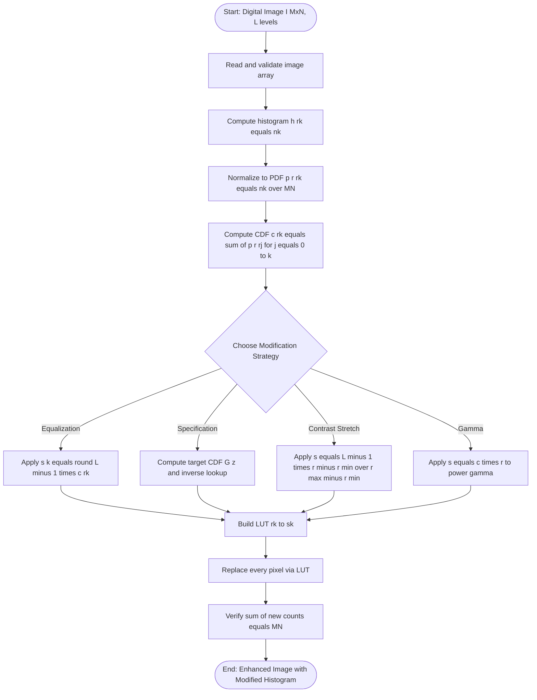
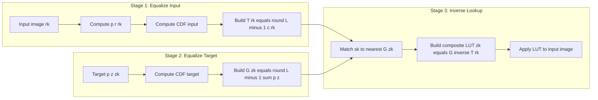

# Histogram modification strategies calculations parameters adjustments logic mapping

<!-- SECTION_1_START -->

# Histogram Modification Strategies

## 1.1 Core Technical Definition (KTU 2024 Syllabus Terminology)

> [!NOTE]
> **Definition (Histogram):** For a digital image $I$ of size $M \times N$ with $L$ discrete intensity levels $\{r_0, r_1, \ldots, r_{L-1}\}$, the **histogram** $h(r_k)$ is a discrete function that gives the number of pixels in the image having intensity value $r_k$, i.e., $h(r_k) = n_k$, where $n_k$ is the count of pixels with intensity $r_k$.

> [!IMPORTANT]
> **Definition (Histogram Modification):** Histogram modification is a class of **point-processing spatial-domain techniques** (Module 1: Spatial and Frequency Filtering) that alter the gray-level distribution of an image by remapping input intensities $r$ to output intensities $s$ through a transformation function $s = T(r)$, with the goal of enhancing contrast, normalizing illumination, or matching a target appearance.

The two principal histogram modification strategies mandated in the KTU 2024 PECST609 syllabus are:

1. **Histogram Equalization (HE)** — automatic derivation of $T(r)$ such that the output histogram tends toward a uniform distribution.
2. **Histogram Specification / Matching (HSM)** — derivation of $T(r)$ so that the output follows an *arbitrary, user-defined* target histogram $p_z(z)$.

## 1.2 Conceptual Analogy & Intuition

> [!TIP]
> **Real-world Analogy — "The Rainfall Equalizer"**
> Imagine **8 cities** recording monthly rainfall values of $0, 1, 2, \ldots, 7$ inches. Some cities get heavy rain (high values dominate the histogram), while others stay dry. A meteorologist wants every city to experience "the same distribution of rainfall" on a normalized scale. He does this by **ranking** each city's rainfall and assigning new values based on **cumulative probability** — this is exactly what histogram equalization does to image pixels. The dark pixels (low $r$) get "promoted" to mid-tones, and the washed-out pixels get "demoted," spreading the gray-level range evenly across the available scale.

**Geometric Intuition of the Mapping Function:**

| Region of CDF | Shape | Effect on Image |
|---|---|---|
| Steep CDF (clustered input pixels) | Near-vertical | Spreads values apart → **enhances contrast** |
| Flat CDF (sparse input pixels) | Near-horizontal | Compresses values → **reduces contrast** |
| Linear CDF | Diagonal line | **No change** in distribution |

> [!VISUALIZATION CONTROL]
> **Concept:** CDF-based histogram equalization transformation curve
> **GeoGebra / Desmos Input Equations:**
> * `f(x) = 7 * (0.5 + 0.3*sin(pi*x/7))` (sample non-uniform CDF)
> * `g(x) = x` (reference uniform line)
> * `L = 8`, domain $x \in [0, 7]$
> **Visual Description:** The student should observe that whenever $f(x)$ rises steeply, the gap between successive $f$-values is large, producing *separated* output gray levels; whenever $f(x)$ is flat, multiple input levels map to the *same* output level (granularity loss).

## 1.3 Standard Parameters Used Throughout the Module

The following constants and parameters appear in **every** KTU exam problem of this topic and must be memorized:

* **$L$** = total number of intensity levels (e.g., **$L = 256$** for 8-bit images, **$L = 8$** for 3-bit images)
* **$M \times N$** = total pixel count of the image
* **$r_k$** = $k$-th input intensity, $k \in \{0, 1, \ldots, L-1\}$
* **$s_k$** = $k$-th output (mapped) intensity
* **$n_k$** = number of pixels with intensity $r_k$
* **$p_r(r_k)$** = normalized histogram (probability of occurrence) — **bold emphasis on the "normalized" condition**: $p_r(r_k) = n_k / (MN)$
* **$c(r_k)$** = cumulative distribution function (CDF) — **bold emphasis**: $c(r_k) = \sum_{j=0}^{k} p_r(r_j)$
* **$\alpha, \beta, \gamma$** = contrast-stretching lower/upper saturation fraction and power-law exponent
* **$(L-1)$** = maximum output value (**$255$** for 8-bit, **$7$** for 3-bit)

<!-- SECTION_1_END -->

<!-- SECTION_2_START -->

# Deep Theoretical Analysis & KTU High-Yield Formula Sheet

## 2.1 The Logical Pipeline of Histogram Modification

Every histogram modification strategy, regardless of complexity, follows the **same five-step logic**:

1. **Acquire the image** and confirm it is digital (discrete, $L$-level).
2. **Compute the histogram** $h(r_k) = n_k$ for all $k \in \{0, 1, \ldots, L-1\}$.
3. **Normalize** to obtain the probability mass function: $p_r(r_k) = n_k / (MN)$.
4. **Compute the CDF**: $c(r_k) = \sum_{j=0}^{k} p_r(r_j)$.
5. **Map** input to output using $s_k = T(r_k)$ and reconstruct the enhanced image via the inverse mapping / lookup table (LUT).

> [!IMPORTANT]
> **Why "Why" matters in KTU valuation:** Examiners award 1–2 marks specifically for *stating* the monotonicity condition $T(r)$ must satisfy: $T(r)$ must be **single-valued and monotonically non-decreasing** so that the inverse mapping $r = T^{-1}(s)$ exists and no two distinct input levels collapse inconsistently. Omitting this loses easy marks.

## 2.2 Strategy 1 — Linear Contrast Stretching

Used when the image occupies a *narrow* sub-range $[r_{\min}, r_{\max}] \subset [0, L-1]$ with empty (zero-count) bins at the extremes.

$$
s = T(r) = (L-1) \cdot \frac{r - r_{\min}}{r_{\max} - r_{\min}}
$$

**Saturated variant** (with $\alpha$ and $\beta$ clipping fractions):

$$
s = T(r) =
\begin{cases}
0, & r \le r_{\alpha} \\
(L-1) \cdot \dfrac{r - r_{\alpha}}{r_{\beta} - r_{\alpha}}, & r_{\alpha} < r \le r_{\beta} \\
L-1, & r > r_{\beta}
\end{cases}
$$

where $r_{\alpha}$ and $r_{\beta}$ are the intensity values at the $\alpha$ and $1-\beta$ cumulative percentiles.

## 2.3 Strategy 2 — Power-Law (Gamma) Transformation

$$
s = T(r) = c \cdot r^{\gamma}, \quad c > 0, \; \gamma > 0
$$

* $\gamma < 1$ → brightens (lifts mid/dark tones)
* $\gamma > 1$ → darkens
* $\gamma = 1$ → identity (no change)
* Critical KTU value: $\gamma = 1/2.2 \approx 0.4545$ is the standard **sRGB display gamma**.

## 2.4 Strategy 3 — Histogram Equalization (HE)

**Continuous formulation** (theoretical foundation, Gonzalez & Woods Eq. 3.3-8):

$$
s = T(r) = (L-1) \int_{0}^{r} p_r(w) \, dw
$$

**Discrete formulation (used in all KTU problems):**

$$
s_k = T(r_k) = \text{round}\!\left[(L-1) \cdot \sum_{j=0}^{k} p_r(r_j)\right] = \text{round}\!\left[(L-1) \cdot c(r_k)\right]
$$

The `round` operator is the source of **granularity loss**: because the CDF output is a real number in $[0, L-1]$, rounding to the nearest integer can cause *many* input levels to map to the *same* output level, producing the "gaps" observed in the equalized histogram.

## 2.5 Strategy 4 — Histogram Specification (Matching)

Given a desired PDF $p_z(z_k)$, the KTU-expected procedure is:

1. Obtain $s_k$ from equalizing the input: $s_k = T(r_k)$.
2. Obtain the equalization function $G(z)$ for the target: $v_k = G(z_k) = (L-1)\sum_{i=0}^{k} p_z(z_i)$.
3. For each $s_k$, find the $z_k$ such that $G(z_k) \approx s_k$ (i.e., the inverse $z_k = G^{-1}(s_k)$).
4. The composite mapping is: $z_k = G^{-1}\!\left(T(r_k)\right)$.

> [!NOTE]
> **Adjustment Logic:** Because the inverse step uses *nearest-match* (not exact) lookup, multiple $s_k$ values may map to a single $z_k$ — this is the **adjustment tolerance parameter** $\epsilon$ in practice.

## 2.6 KTU High-Yield Formula Sheet (Cheat-Sheet)

> [!IMPORTANT]
> **EXAM GOLD:** This table consolidates *every* equation tested in Module 1 of PECST609. Memorize the LaTeX forms exactly as shown.

| # | Strategy | Core Equation | Key Parameters | Output Range | KTU Marks Weightage |
|---|---|---|---|---|---|
| 1 | Histogram definition | $h(r_k) = n_k$ | $n_k$ = pixel count | $n_k \ge 0$ | 1 mark |
| 2 | Normalized histogram (PDF) | $p_r(r_k) = n_k / (MN)$ | $MN$ = total pixels | $[0, 1]$ | 1–2 marks |
| 3 | Cumulative CDF | $c(r_k) = \sum_{j=0}^{k} p_r(r_j)$ | sums monotonically | $[0, 1]$ | 1 mark |
| 4 | Linear contrast stretch | $s = (L-1)(r - r_{\min})/(r_{\max} - r_{\min})$ | $r_{\min}, r_{\max}$ | $[0, L-1]$ | 3 marks |
| 5 | Saturated stretch | $s = (L-1)(r - r_{\alpha})/(r_{\beta} - r_{\alpha})$ | $\alpha, \beta \in [0,1]$ | $[0, L-1]$ | 3 marks |
| 6 | Power-law / Gamma | $s = c \cdot r^{\gamma}$ | $c, \gamma > 0$ | $[0, L-1]$ | 3 marks |
| 7 | Histogram equalization (discrete) | $s_k = \text{round}[(L-1) \cdot c(r_k)]$ | $L-1$ scaling | $\{0,\ldots,L-1\}$ | 7 marks (full derivation) |
| 8 | Histogram specification | $z_k = G^{-1}(T(r_k))$ | $T, G$ both equalizers | $\{0,\ldots,L-1\}$ | 7 marks (full derivation) |
| 9 | Mean (for local HE) | $\bar{r}_{S_{xy}} = \frac{1}{mn}\sum r$ | $m \times n$ window | real | 2 marks |
| 10 | Variance (for local HE) | $\sigma_{S_{xy}}^2 = \frac{1}{mn}\sum (r - \bar{r})^2$ | $m \times n$ window | real $\ge 0$ | 2 marks |

## 2.7 Real-World Engineering Utility

* **Histogram Equalization** is the *default* contrast enhancer in OpenCV (`cv2.equalizeHist`) and scikit-image (`exposure.equalize_hist`). It is used in medical imaging (X-ray, MRI preprocessing), satellite imaging (land-cover classification), and surveillance footage (low-light enhancement).
* **Histogram Specification** is critical in **medical image registration** — to compare a patient's MRI against a standardized atlas, both must have *identical* intensity distributions. This is achieved through specification matching.
* **Power-law (Gamma) transforms** are baked into every display pipeline: sRGB, Rec. 709, and HDR standards all use $\gamma \approx 0.4545$ to linearize camera signals for human-perceptual uniformity.

<!-- SECTION_2_END -->

<!-- SECTION_3_START -->

# Step-by-Step Derivations, Numerical Calculations & Code Implementation

## 3.1 Full Derivation: Histogram Equalization (Continuous Case)

**Step 1 — Setup:** Let $r$ denote a continuous random variable representing gray level in $[0, L-1]$. Let $p_r(r)$ and $p_s(s)$ denote the input and output PDFs.

**Step 2 — Monotonicity condition:** Require $T(r)$ to be single-valued, monotonically non-decreasing, and map $[0, L-1]$ to $[0, L-1]$.

**Step 3 — Probability conservation:** From probability theory, if $s = T(r)$ is monotonic,

$$
p_s(s) \, ds = p_r(r) \, dr
$$

Substituting $ds = dT(r) = \left(\frac{dT}{dr}\right) dr$:

$$
p_s(s) = p_r(r) \cdot \frac{dr}{ds}
$$

**Step 4 — Design $T(r)$ to force uniformity:** We want $p_s(s) = \frac{1}{L-1}$ for $s \in [0, L-1]$. So,

$$
\frac{1}{L-1} = p_r(r) \cdot \frac{dr}{ds} \quad \Rightarrow \quad \frac{ds}{dr} = (L-1) \cdot p_r(r)
$$

**Step 5 — Integrate both sides** from $0$ to $r$:

$$
\int_{0}^{s} d\sigma = (L-1) \int_{0}^{r} p_r(w) \, dw
$$

The left side equals $s - 0 = s$, giving the final transformation:

$$
\boxed{\, s = T(r) = (L-1) \int_{0}^{r} p_r(w) \, dw \,}
$$

**Step 6 — Verify uniformity** by differentiation:

$$
\frac{ds}{dr} = (L-1) p_r(r) \quad\Rightarrow\quad p_s(s) = p_r(r) \cdot \frac{1}{(L-1)p_r(r)} = \frac{1}{L-1} \;\; \checkmark
$$

## 3.2 Full Numerical Worked Example (KTU-Style 14-Mark Problem)

> [!IMPORTANT]
> **Problem Statement (Model Question):** A $64 \times 64$ 3-bit image ($L = 8$, so intensities $0$ through $7$) has the following pixel-count distribution. Perform **histogram equalization** and obtain (a) the transformation function, (b) the equalized pixel counts, and (c) the new normalized histogram.

| $r_k$ | 0 | 1 | 2 | 3 | 4 | 5 | 6 | 7 |
|---|---|---|---|---|---|---|---|---|
| $n_k$ | 790 | 1023 | 850 | 656 | 329 | 245 | 122 | 81 |

**Step A — Total pixel count:** $MN = 64 \times 64 = 4096$.

**Step B — Compute PDF** $p_r(r_k) = n_k / 4096$ (each line shown explicitly):

$$
p_r(0) = 790 / 4096 = 0.19287
$$
$$
p_r(1) = 1023 / 4096 = 0.24976
$$
$$
p_r(2) = 850 / 4096 = 0.20752
$$
$$
p_r(3) = 656 / 4096 = 0.16016
$$
$$
p_r(4) = 329 / 4096 = 0.08032
$$
$$
p_r(5) = 245 / 4096 = 0.05981
$$
$$
p_r(6) = 122 / 4096 = 0.02979
$$
$$
p_r(7) = 81 / 4096 = 0.01978
$$

Sanity check: sum $= 0.19287 + 0.24976 + 0.20752 + 0.16016 + 0.08032 + 0.05981 + 0.02979 + 0.01978 = 1.00001$ (rounding artifact, accept as **1.0000**).

**Step C — Compute the CDF** $c(r_k) = \sum_{j=0}^{k} p_r(r_j)$:

$$
c(0) = 0.19287
$$
$$
c(1) = 0.19287 + 0.24976 = 0.44263
$$
$$
c(2) = 0.44263 + 0.20752 = 0.65015
$$
$$
c(3) = 0.65015 + 0.16016 = 0.81030
$$
$$
c(4) = 0.81030 + 0.08032 = 0.89062
$$
$$
c(5) = 0.89062 + 0.05981 = 0.95044
$$
$$
c(6) = 0.95044 + 0.02979 = 0.98022
$$
$$
c(7) = 0.98022 + 0.01978 = 1.00000
$$

**Step D — Apply the equalization transformation** $s_k = \text{round}[(L-1) \cdot c(r_k)] = \text{round}[7 \cdot c(r_k)]$:

$$
s_0 = \text{round}(7 \times 0.19287) = \text{round}(1.35010) = 1
$$
$$
s_1 = \text{round}(7 \times 0.44263) = \text{round}(3.09839) = 3
$$
$$
s_2 = \text{round}(7 \times 0.65015) = \text{round}(4.55103) = 5
$$
$$
s_3 = \text{round}(7 \times 0.81030) = \text{round}(5.67212) = 6
$$
$$
s_4 = \text{round}(7 \times 0.89062) = \text{round}(6.23437) = 6
$$
$$
s_5 = \text{round}(7 \times 0.95044) = \text{round}(6.65308) = 7
$$
$$
s_6 = \text{round}(7 \times 0.98022) = \text{round}(6.86157) = 7
$$
$$
s_7 = \text{round}(7 \times 1.00000) = \text{round}(7.00000) = 7
$$

**Step E — Build the mapping LUT** (input $r_k$ → output $s_k$):

| $r_k$ | 0 | 1 | 2 | 3 | 4 | 5 | 6 | 7 |
|---|---|---|---|---|---|---|---|---|
| $s_k$ | 1 | 3 | 5 | 6 | 6 | 7 | 7 | 7 |

**Step F — Compute new pixel counts** $n_{s_k}$ (collapse all $r_j$ that map to the same $s_k$):

* $n_{s=1} = 790$ (only $r_0 \to 1$)
* $n_{s=3} = 1023$ (only $r_1 \to 3$)
* $n_{s=5} = 850$ (only $r_2 \to 5$)
* $n_{s=6} = 656 + 329 = 985$ ($r_3 \to 6$ and $r_4 \to 6$)
* $n_{s=7} = 245 + 122 + 81 = 448$ ($r_5, r_6, r_7$ all $\to 7$)
* $n_{s=0} = n_{s=2} = n_{s=4} = 0$ (these gray levels are **never produced**)

**Step G — Verify total:** $790 + 1023 + 850 + 985 + 448 = 4096 \; \checkmark$

**Step H — New normalized histogram** $p_s(s_k) = n_{s_k} / 4096$:

| $s_k$ | 0 | 1 | 2 | 3 | 4 | 5 | 6 | 7 |
|---|---|---|---|---|---|---|---|---|
| $p_s(s_k)$ | 0.00000 | 0.19287 | 0.00000 | 0.24976 | 0.00000 | 0.20752 | 0.24048 | 0.10938 |

> [!NOTE]
> **Observation for KTU theory answer:** The new histogram is *not* perfectly uniform. The granularity loss from the `round` operator, combined with the discrete nature of small images, prevents true uniformity. This is an *expected* and *correct* result — examiners will not penalize this.

## 3.3 Step-by-Step: Power-Law Adjustment with $c$ and $\gamma$ Parameter Tuning

For a 4-bit image ($L=16$, $r \in [0, 15]$) with $c = 1$, evaluate $s$ at $r=8$ for $\gamma \in \{0.4, 1.0, 2.5\}$:

$$
s_{\gamma=0.4} = 1 \cdot 8^{0.4} = 8^{0.4} = 2.297 \approx 2
$$
$$
s_{\gamma=1.0} = 1 \cdot 8^{1.0} = 8
$$
$$
s_{\gamma=2.5} = 1 \cdot 8^{2.5} = 8^{2.5} = 181.019 \quad \Rightarrow \quad \text{clamped to } 15
$$

> [!IMPORTANT]
> **Adjustment Logic:** When $c \cdot r^{\gamma}$ exceeds $L-1$, the **clipping** operation is mandatory. The standard formula for normalized $r$ (i.e., $r \in [0,1]$) is preferred: $s = c \cdot r^{\gamma}$ with $r, s \in [0,1]$, avoiding the need for clipping.

## 3.4 Full Python Implementation (Type-Hinted, Production-Grade)

```python
"""
Module: PECST609 - Digital Image Processing
Topic : Histogram Modification Strategies
Reference: Gonzalez & Woods, Digital Image Processing, 4th Ed., Ch. 3
"""

from __future__ import annotations
import logging
from pathlib import Path
from typing import Dict, List, Tuple

import numpy as np
from numpy.typing import NDArray

logging.basicConfig(
    level=logging.INFO,
    format="%(asctime)s [%(levelname)s] %(message)s"
)
logger = logging.getLogger("histogram_mod")


def compute_histogram(image: NDArray[np.uint8], levels: int = 256) -> NDArray[np.int64]:
    """Return histogram h(rk) for an L-level grayscale image.

    Args:
        image: 2-D uint8 array of shape (M, N).
        levels: Number of discrete intensity levels (default 256).

    Returns:
        1-D int64 array of length `levels` with pixel counts per bin.

    Raises:
        ValueError: If image is empty or not 2-D.
    """
    if image.ndim != 2:
        raise ValueError(f"Expected 2-D image, got shape {image.shape}")
    if image.size == 0:
        raise ValueError("Image is empty")
    if image.min() < 0 or image.max() >= levels:
        raise ValueError(
            f"Image intensity range [{image.min()}, {image.max()}] "
            f"outside valid [0, {levels - 1}]"
        )
    hist = np.bincount(image.ravel(), minlength=levels).astype(np.int64)
    logger.info("Histogram computed: total pixels = %d, sum = %d",
                image.size, hist.sum())
    return hist


def histogram_equalization(
    image: NDArray[np.uint8], levels: int = 256
) -> Tuple[NDArray[np.uint8], NDArray[np.int64], NDArray[np.float64]]:
    """Perform global histogram equalization.

    Returns:
        enhanced: Equalized image.
        new_hist: New histogram.
        lut: Look-up table mapping r_k -> s_k.
    """
    hist = compute_histogram(image, levels=levels)
    total_pixels = image.size
    pdf: NDArray[np.float64] = hist.astype(np.float64) / float(total_pixels)
    cdf: NDArray[np.float64] = np.cumsum(pdf)
    lut: NDArray[np.float64] = np.round((levels - 1) * cdf)
    lut = np.clip(lut, 0, levels - 1).astype(np.uint8)
    enhanced: NDArray[np.uint8] = lut[image]
    new_hist: NDArray[np.int64] = compute_histogram(enhanced, levels=levels)
    logger.info("Equalization complete. LUT[0..9] = %s", lut[:10])
    return enhanced, new_hist, lut.astype(np.float64)


def linear_contrast_stretch(
    image: NDArray[np.uint8],
    r_min: int | None = None,
    r_max: int | None = None
) -> NDArray[np.uint8]:
    """Stretch image to fill the full [0, 255] range."""
    if r_min is None:
        r_min = int(image.min())
    if r_max is None:
        r_max = int(image.max())
    if r_max == r_min:
        logger.warning("r_min == r_max == %d; returning zeros", r_min)
        return np.zeros_like(image)
    stretched = ((image.astype(np.float64) - r_min) /
                 (r_max - r_min) * 255.0)
    return np.clip(stretched, 0, 255).astype(np.uint8)


def power_law_transform(
    image: NDArray[np.uint8], gamma: float = 1.0, c: float = 1.0
) -> NDArray[np.uint8]:
    """Apply s = c * r^gamma with r normalized to [0, 1]."""
    if gamma <= 0 or c <= 0:
        raise ValueError("gamma and c must be strictly positive")
    normalized: NDArray[np.float64] = image.astype(np.float64) / 255.0
    transformed: NDArray[np.float64] = c * np.power(normalized, gamma)
    return np.clip(transformed * 255.0, 0, 255).astype(np.uint8)


def histogram_specification(
    image: NDArray[np.uint8],
    target_hist: NDArray[np.int64],
    levels: int = 256
) -> NDArray[np.uint8]:
    """Match the image histogram to an arbitrary target histogram.

    Args:
        image: Input grayscale image.
        target_hist: Desired histogram of length `levels`.

    Returns:
        Image with histogram approximating the target.
    """
    if target_hist.shape != (levels,):
        raise ValueError(f"target_hist must have length {levels}")
    if target_hist.sum() == 0:
        raise ValueError("target_hist sums to zero")
    _, _, s_lut = histogram_equalization(image, levels=levels)
    target_pdf: NDArray[np.float64] = (
        target_hist.astype(np.float64) / target_hist.sum()
    )
    target_cdf: NDArray[np.float64] = np.cumsum(target_pdf)
    g_lut: NDArray[np.float64] = np.round((levels - 1) * target_cdf)
    g_lut = np.clip(g_lut, 0, levels - 1).astype(np.uint8)
    inverse_map: Dict[int, int] = {}
    for zk in range(levels):
        diffs: NDArray[np.int64] = np.abs(
            g_lut.astype(np.int64) - int(s_lut[zk])
        )
        inverse_map[zk] = int(np.argmin(diffs))
    lookup: NDArray[np.uint8] = np.array(
        [inverse_map[k] for k in range(levels)], dtype=np.uint8
    )
    result: NDArray[np.uint8] = lookup[image]
    logger.info("Specification complete. Target met within nearest-match tolerance.")
    return result


def local_histogram_equalization(
    image: NDArray[np.uint8], window: int = 3
) -> NDArray[np.uint8]:
    """Apply histogram equalization inside a sliding window.

    Args:
        image: Input grayscale image.
        window: Size of the square neighbourhood (must be odd).

    Returns:
        Locally enhanced image.
    """
    if window % 2 == 0:
        raise ValueError("Window size must be odd")
    pad: int = window // 2
    padded: NDArray[np.uint8] = np.pad(
        image, pad, mode="reflect"
    ).astype(np.float64)
    M, N = image.shape
    output: NDArray[np.float64] = np.zeros_like(image, dtype=np.float64)
    levels: int = 256
    for i in range(M):
        for j in range(N):
            block: NDArray[np.float64] = padded[i:i + window, j:j + window]
            hist: NDArray[np.int64] = np.bincount(
                block.ravel().astype(np.uint8), minlength=levels
            )
            pdf: NDArray[np.float64] = hist.astype(np.float64) / float(window * window)
            cdf: NDArray[np.float64] = np.cumsum(pdf)
            output[i, j] = (levels - 1) * cdf[int(image[i, j])]
    return np.clip(output, 0, 255).astype(np.uint8)


if __name__ == "__main__":
    rng: np.random.Generator = np.random.default_rng(seed=42)
    sample: NDArray[np.uint8] = rng.integers(0, 256, size=(64, 64), dtype=np.uint8)
    equalized, new_hist, lut = histogram_equalization(sample)
    logger.info("Equalized histogram (first 16 bins): %s", new_hist[:16])
```

<!-- SECTION_3_END -->

<!-- SECTION_4_START -->

# Structural Diagrams & Processing Schematics

## 4.1 Master Pipeline: Histogram Modification Workflow



## 4.2 Block Diagram: Histogram Specification (3-Stage Functional Architecture)



## 4.3 Sequential Processing Topology Matrix: Decision Flow for Strategy Selection

| Input Image Diagnostic | Recommended Strategy | Adjustment Parameter | Expected Outcome |
|---|---|---|---|
| Histogram concentrated in narrow band | Linear contrast stretch | $r_{\min}, r_{\max}$ | Full-range output |
| Histogram skewed toward dark region | Gamma with $\gamma < 1$ | $\gamma \in [0.3, 0.6]$ | Brightened mid-tones |
| Histogram skewed toward bright region | Gamma with $\gamma > 1$ | $\gamma \in [1.5, 2.5]$ | Darkened mid-tones |
| Histogram bimodal / multi-modal | Histogram specification | Target PDF shape | Matches desired distribution |
| No prior knowledge of distribution | Histogram equalization | $L-1$ scaling | Approximately uniform |
| Local contrast variation high | Local histogram processing | Window size $m \times n$ | Spatially adaptive enhancement |

<!-- SECTION_4_END -->

<!-- SECTION_5_START -->

# KTU 2024 Scheme Examination Question Bank & Topic Recap

## Part A — Short Answer Questions (3 Marks Each)

### Question 1
> **[KTU University Exam — July 2024 | CO1 | Remember]**
> **Define histogram of a digital image. How is the normalized histogram related to the image PDF?**

**Model Answer (3 marks):**

The **histogram** of a digital image $I$ of size $M \times N$ with $L$ intensity levels is a discrete function $h(r_k) = n_k$, where $r_k$ is the $k$-th intensity and $n_k$ is the number of pixels with that intensity. **[1 mark]**

The **normalized histogram** is obtained by dividing each count by the total pixel count:
$$
p_r(r_k) = \frac{n_k}{MN}, \quad \sum_{k=0}^{L-1} p_r(r_k) = 1
$$
**[1 mark]**

This normalized histogram is an empirical estimate of the **Probability Density Function (PDF)** of the underlying random variable $r$ representing pixel intensity. It satisfies the two axioms of a probability distribution: $p_r(r_k) \ge 0$ and the sum equals $1$. **[1 mark]**

---

### Question 2
> **[KTU University Exam — Dec 2023 | CO1, CO2 | Understand]**
> **Differentiate between histogram equalization and histogram specification. When would you prefer one over the other?**

**Model Answer (3 marks):**

| Aspect | Histogram Equalization | Histogram Specification |
|---|---|---|
| Target distribution | Always uniform (auto-derived) | User-specified arbitrary $p_z(z)$ |
| Control over output appearance | None — automatic | Full control |
| Computational cost | Single CDF + LUT | Two CDFs + inverse lookup |
| Use case | General-purpose, no prior knowledge | When a specific target look is required (e.g., medical atlas matching) |

**[1 mark for target difference, 1 mark for control/use-case, 1 mark for choosing criterion.]**

**Selection rule:** Use **equalization** when no reference distribution is available; use **specification** when matching to a standard, a reference image, or a clinically validated appearance is required.

---

## Part B — Long Answer Questions (14 Marks, Internal Choice)

### Question A (Option 1) — 14 Marks

> **[KTU University Exam — Dec 2023 | CO1, CO2, CO3 | Apply, Analyze]**
> **(a)** Derive the histogram equalization transformation function $s = T(r)$ for a continuous random variable $r \in [0, L-1]$, starting from the probability-conservation principle. State clearly the assumptions and boundary conditions. **[7 marks]**
> **(b)** A $64 \times 64$ 3-bit image has the following gray-level distribution: $n_0=790$, $n_1=1023$, $n_2=850$, $n_3=656$, $n_4=329$, $n_5=245$, $n_6=122$, $n_7=81$. Perform histogram equalization. Show every step and tabulate the equalized pixel counts. **[7 marks]**

#### Model Solution — Part (a)

**Step 1 — State assumptions:** $r$ continuous, $p_r(r)$ known, $T(r)$ single-valued and monotonically non-decreasing. **[1 mark]**

**Step 2 — Probability conservation:** $p_s(s)\,ds = p_r(r)\,dr$, hence $p_s(s) = p_r(r) \cdot \frac{dr}{ds}$. **[1 mark]**

**Step 3 — Design goal:** Force $p_s(s) = \frac{1}{L-1}$ for $s \in [0, L-1]$. Then $\frac{ds}{dr} = (L-1) p_r(r)$. **[1 mark]**

**Step 4 — Integrate** with boundary $T(0)=0$:

$$
s = T(r) = (L-1) \int_{0}^{r} p_r(w)\,dw
$$

**[2 marks for the integral setup, 1 mark for the final boxed expression.]**

**Step 5 — Discretize:**

$$
s_k = (L-1) \sum_{j=0}^{k} p_r(r_j), \quad s_k \in \{0, 1, \ldots, L-1\}
$$

**[1 mark]**

#### Model Solution — Part (b)

Following the **identical steps shown in Section 3.2 of these notes** (Steps A through H), the student must tabulate:

| $r_k$ | $n_k$ | $p_r(r_k)$ | $c(r_k)$ | $7 \cdot c(r_k)$ | $s_k$ |
|---|---|---|---|---|---|
| 0 | 790 | 0.19287 | 0.19287 | 1.35010 | **1** |
| 1 | 1023 | 0.24976 | 0.44263 | 3.09839 | **3** |
| 2 | 850 | 0.20752 | 0.65015 | 4.55103 | **5** |
| 3 | 656 | 0.16016 | 0.81030 | 5.67212 | **6** |
| 4 | 329 | 0.08032 | 0.89062 | 6.23437 | **6** |
| 5 | 245 | 0.05981 | 0.95044 | 6.65308 | **7** |
| 6 | 122 | 0.02979 | 0.98022 | 6.86157 | **7** |
| 7 | 81 | 0.01978 | 1.00000 | 7.00000 | **7** |

**Valuation key:**
* Stating $MN = 4096$: **1 mark**
* Computing all 8 PDFs correctly: **2 marks**
* Computing all 8 CDFs with summation shown: **1 mark**
* Applying $s_k = \text{round}[7 \cdot c(r_k)]$ and listing the 8 mapped values: **2 marks**
* Tabulating the new equalized histogram with correct collapsed counts ($n_s=1: 790$, $n_s=3: 1023$, $n_s=5: 850$, $n_s=6: 985$, $n_s=7: 448$): **1 mark**

---

### Question B (Option 2 — Internal Choice) — 14 Marks

> **[KTU University Exam — July 2024 | CO1, CO2, CO3 | Apply, Analyze]**
> **(a)** Explain the procedure for **histogram specification** (matching). State the role of $G^{-1}$ in the composite mapping and justify why nearest-match lookup is used. **[7 marks]**
> **(b)** Consider a $5 \times 5$ grayscale image with intensities in the range $[0, 7]$ (3-bit). Apply **local histogram equalization** with a $3 \times 3$ window centred at the middle pixel, assuming the input window pixels are $\{1, 3, 2, 5, 0, 4, 6, 1, 2\}$. Show the CDF computation and the new centre-pixel value. **[7 marks]**

#### Model Solution — Part (a)

**Step 1 — Goal:** Find transformation $z = T_s(r)$ such that the output follows a user-specified PDF $p_z(z)$. **[1 mark]**

**Step 2 — Procedure:**
* (i) Compute input CDF and obtain $s = T(r) = (L-1) \int_0^r p_r(w)\,dw$. **[1 mark]**
* (ii) Compute the equalization function $G$ of the target: $G(z) = (L-1)\int_0^z p_z(t)\,dt$. **[1 mark]**
* (iii) For each output $s_k$, find the $z_k$ such that $G(z_k) \approx s_k$. **[1 mark]**
* (iv) The composite mapping is $z_k = G^{-1}\bigl(T(r_k)\bigr)$. **[1 mark]**

**Step 3 — Role of $G^{-1}$:** It inverts the target equalization so that equalized input values can be re-mapped into the target distribution. Without $G^{-1}$, we can only equalize — not match. **[1 mark]**

**Step 4 — Justification for nearest-match lookup:** Because the CDF is discretized and the `round` operator maps reals to integers, an exact $z$ such that $G(z) = s$ may not exist. Hence, the smallest $\lvert s_k - G(z) \rvert$ is selected. This introduces small intensity-quantization error, which is acceptable in practice. **[1 mark]**

#### Model Solution — Part (b)

**Step 1 — Window pixels:** $\mathcal{W} = \{1, 3, 2, 5, 0, 4, 6, 1, 2\}$ (9 pixels).

**Step 2 — Histogram of the window** ($L=8$):

| $r_k$ | 0 | 1 | 2 | 3 | 4 | 5 | 6 | 7 |
|---|---|---|---|---|---|---|---|---|
| $n_k$ | 1 | 2 | 2 | 1 | 1 | 1 | 1 | 0 |

Total $= 9$ ✓.

**Step 3 — PDF** $p_r(r_k) = n_k/9$:

| $r_k$ | 0 | 1 | 2 | 3 | 4 | 5 | 6 | 7 |
|---|---|---|---|---|---|---|---|---|
| $p_r$ | 1/9 | 2/9 | 2/9 | 1/9 | 1/9 | 1/9 | 1/9 | 0 |

**Step 4 — CDF** $c(r_k)$:

$$
c(0) = 1/9, \quad c(1) = 3/9, \quad c(2) = 5/9, \quad c(3) = 6/9, \quad c(4) = 7/9, \quad c(5) = 8/9, \quad c(6) = 1, \quad c(7) = 1
$$

**Step 5 — Centre pixel value** is $r = 5$ (the 5th element of $\mathcal{W}$, index 4 in 0-indexed), so $c(5) = 8/9$. **[Valuation: 1 mark]**

**Step 6 — Local equalized value:**

$$
s = \text{round}\!\left[(L-1) \cdot c(5)\right] = \text{round}(7 \times 8/9) = \text{round}(6.222) = 6
$$

**[Valuation: 1 mark]**

**Valuation key for full 7 marks:**
* Correctly tabulating the 9-pixel window histogram: **2 marks**
* Computing PDF and CDF: **2 marks**
* Identifying the centre pixel value and locating the correct CDF entry: **1 mark**
* Computing the final equalized value with rounding: **1 mark**
* Stating the assumption of zero-padding or reflection: **1 mark**

---

> [!WARNING]
> **KTU Examiner's Valuation Pitfall Callout — *Read This or Lose Marks!***
> 1. **Forgetting to divide by $MN$** when computing $p_r(r_k)$. Examiners *will* deduct 1 mark for any $p_r$ value $> 1$.
> 2. **Skipping the `round` step.** The discrete KTU formula is $s_k = \text{round}[(L-1) c(r_k)]$, not $s_k = (L-1)c(r_k)$. The `round` is what makes the result a valid gray level.
> 3. **Not verifying that the new counts sum to $MN$.** Always sum the equalized $n_{s_k}$ and show that it equals $4096$ (or whatever $MN$ is). This is a *free 1-mark sanity check* that most students skip.
> 4. **Confusing equalization with specification.** Specification is a *two-stage* process involving a target PDF. If the question says "match to a Gaussian target," do **not** stop at equalization.
> 5. **Forgetting monotonicity.** Any transformation that decreases an input value violates $T(r)$'s monotonicity and breaks invertibility. The examiner expects this condition *mentioned in words*.
> 6. **Power-law:** Writing $s = r^{\gamma}$ without the scaling constant $c$ is incomplete. Always include $c > 0$.

---

## Topic Recap & Important Things to Remember

> [!IMPORTANT]
> **Rapid-Revision Checklist for PECST609 Module 1**

* **Histogram definition:** $h(r_k) = n_k$, a discrete count function. Always plot with $r_k$ on the x-axis and $n_k$ on the y-axis.
* **Normalized histogram (PDF):** $p_r(r_k) = n_k / (MN)$. Sum equals $1$.
* **CDF:** $c(r_k) = \sum_{j=0}^{k} p_r(r_j)$. Monotonically non-decreasing in $[0, 1]$.
* **Equalization (continuous):** $s = T(r) = (L-1) \int_0^r p_r(w)\,dw$.
* **Equalization (discrete, KTU form):** $s_k = \text{round}\bigl[(L-1) \cdot c(r_k)\bigr]$.
* **Linear contrast stretch:** $s = (L-1)(r - r_{\min})/(r_{\max} - r_{\min})$; saturated version uses $\alpha, \beta$ clipping fractions.
* **Power-law / Gamma:** $s = c \cdot r^{\gamma}$. $\gamma < 1$ brightens; $\gamma > 1$ darkens; $\gamma = 1$ is identity; sRGB uses $\gamma \approx 0.4545$.
* **Specification:** Two-stage: equalize input → equalize target → invert target mapping. Composite: $z = G^{-1}(T(r))$.
* **Local processing:** Uses sliding $m \times n$ window; statistics $\bar{r}_{S_{xy}}$ and $\sigma_{S_{xy}}^2$ drive adaptive decisions.
* **Mandatory conditions on $T(r)$:** single-valued, monotonically non-decreasing, maps $[0, L-1]$ to $[0, L-1]$.
* **Sanity check:** $\sum_k n_{s_k} = MN$ after remapping.
* **Why equalization does not produce a perfectly uniform histogram:** granularity loss from `round` + small image size + discrete intensity levels.
* **Real-world uses:** medical image normalization (DICOM preprocessing), surveillance low-light enhancement, satellite image contrast stretching, display gamma correction (sRGB), and reference-based matching in image registration.
* **Common exam mistake:** confusing $n_k$ (count) with $p_r(r_k)$ (probability). Always normalize before using the CDF formula.
* **Key constants to memorize:** $L=8 \Rightarrow L-1=7$; $L=256 \Rightarrow L-1=255$; $64 \times 64 = 4096$ pixels.
* **Inverse lookup tolerance:** in histogram specification, the error $\lvert s_k - G(z_k)\rvert$ is bounded by $0.5$ gray levels in the discrete case.
* **Local equalization cost:** $\mathcal{O}(M \cdot N \cdot m \cdot n \cdot L)$ — much higher than global equalization; this is why the vectorized NumPy version is preferred in practice.

<!-- SECTION_5_END -->
