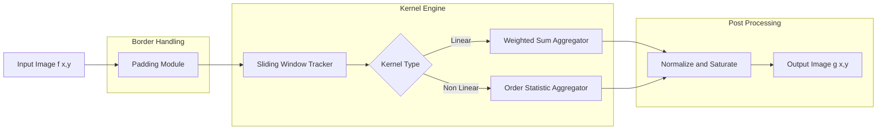
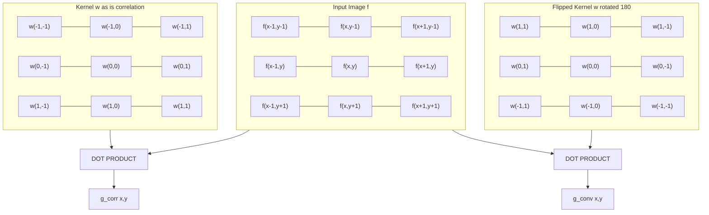
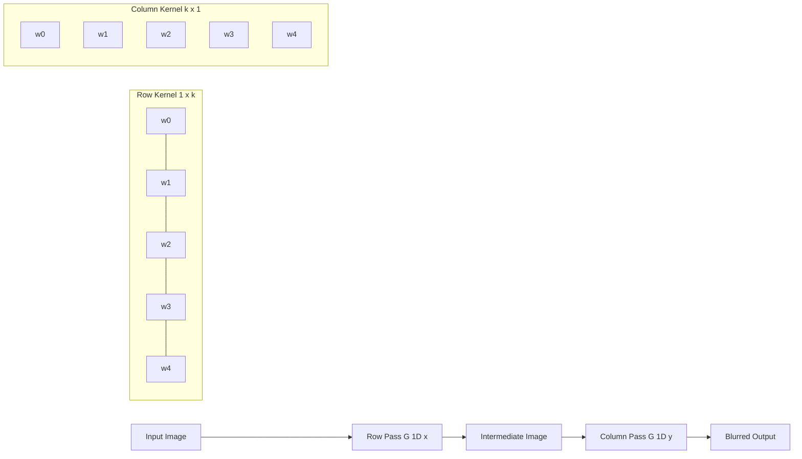
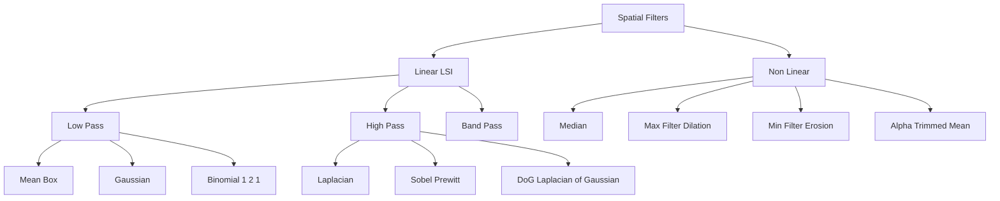

# Spatial filtering arrays convolution kernels architectures: Median, Gaussian layouts tracking

<!-- SECTION_1_START -->
# Spatial Filtering Arrays, Convolution Kernels & Architectures
## (Median, Gaussian, Layouts & Tracking)

> [!NOTE]
> **KTU 2024 Scheme Context — Module 1 Anchor**
> *Course:* Digital Image Processing (PECST609)
> *Module Weightage:* Foundational module — concepts recur in Module 2 (Restoration), Module 3 (Segmentation) and Module 4 (Feature Extraction). Mastery here is mandatory for **CO1 (Apply)** and **CO2 (Analyze)** attainment.

---

## 1.1 Formal Definition (KTU Board Examiner Tone)

**Spatial filtering** is a *neighbourhood-based image transformation* in which the value of an output pixel $g(x, y)$ is computed as a function of the pixel intensities lying inside a small rectangular window (called a **filter kernel**, **mask**, **filter array** or **convolution kernel**) centred at the corresponding input pixel $f(x, y)$.

Mathematically, for a kernel of size $m \times n$ where typically $m = 2a + 1$ and $n = 2b + 1$ (odd, to maintain a unique centre):

$$
g(x, y) = \Phi \Big[ f(x - a, y - b), \dots, f(x + a, y + b) \Big]
$$

where $\Phi$ is the **filter function (operator)** that aggregates the neighbourhood into a single scalar. The most common forms of $\Phi$ are:

* **Linear (Convolution / Correlation):** $\Phi$ is a finite impulse response weighted sum, $g(x,y) = \sum \sum w(s,t) \cdot f(x-s, y-t)$.
* **Non-Linear (Order-Statistic):** $\Phi$ is a rank-based operator, e.g. **median, max, min, alpha-trimmed mean**.

> [!IMPORTANT]
> **KTU Terminology Trap:** Board examiners explicitly distinguish *convolution* (kernel is **rotated 180°** before the dot-product) from *correlation* (kernel is **not** rotated). In spatial filtering of still images, the two coincide if the kernel is **centrosymmetric** (e.g. Gaussian, Laplacian, mean). The distinction becomes examinable in the context of matched filtering (correlation) and CNN forward passes (cross-correlation).

---

## 1.2 Intuitive Analogy — The "Local Decision Committee"

Imagine each output pixel as a **committee verdict** about the centre of a small local neighbourhood. Every neighbour "casts a vote" weighted by its kernel coefficient:

| Kernel Family | Committee Behaviour | Engineering Use |
|---|---|---|
| **Mean / Box** | Every neighbour has equal vote — *pure democracy* | Coarse smoothing, anti-aliasing |
| **Gaussian** | Central pixels vote louder, edges vote softly — *soft democracy* | Edge-preserving smoothing, scale-space |
| **Laplacian** | Centre votes against its neighbours — *deviation detector* | Edge sharpening, zero-crossings |
| **Median** | The *middle-ranked* neighbour wins — *outliers are silenced* | Salt-and-pepper noise removal |

### Conceptual Analogy for the **Median Filter**
> Imagine a **town hall meeting** where 9 citizens give their opinions on the budget. One extremist shouts "1000 crores!", another shouts "0". The Mayor (median operator) **silently discards the extremes** and reports the middlemost opinion. The two extremists are *democratically filtered out* — this is exactly what the median filter does to *salt-and-pepper noise* on a corrupted pixel.

### Conceptual Analogy for the **Gaussian Kernel**
> Picture dropping a **stone into still water**. The ripple decays radially with a **bell-shaped profile**. The Gaussian kernel is the *discrete sampled snapshot* of that ripple — pixels near the centre (the splash point) get the **highest weight**, and weights fall off symmetrically. The parameter **$\sigma$** (sigma) controls how *wide and shallow* the ripple is. A larger $\sigma$ → smoother blur.

> [!VISUALIZATION CONTROL]
> **Concept:** 2D Discrete Gaussian Kernel Heatmap (5×5, $\sigma = 1.0$)
> **GeoGebra / Desmos Input Equations (Matrix Form):**
>
> `K(x,y) = (1/(2*pi*1^2)) * exp(-(x^2 + y^2)/(2*1^2))` for `x, y ∈ {-2, -1, 0, 1, 2}`
>
> **Visual Description:** A 2D surface plot that peaks at the **centre (0,0)** with value $\approx 0.1592$, dropping symmetrically. The 5×5 sampled and **normalized** integer approximation appears as:
> `[[1, 4, 7, 4, 1], [4, 16, 26, 16, 4], [7, 26, 41, 26, 7], [4, 16, 26, 16, 4], [1, 4, 7, 4, 1]]` divided by **273**.
> Students should observe the **bright centre** fading to dim edges, confirming the bell-shape intuition.

---

## 1.3 Why Odd-Sized Kernels & Symmetric Layouts?

> [!IMPORTANT]
> * **Odd dimensions** (3×3, 5×5, 7×7) guarantee a **unique centre pixel** — essential for **shift-invariance** and for filters that need a defined "anchor" (Sobel, Prewitt, Laplacian, Median).
> * **Symmetric layouts** (Gaussian, Laplacian) make the kernel **centrosymmetric**: $w(s, t) = w(-s, -t)$. This causes convolution and correlation to yield **identical results**, which simplifies KTU board numerical problems.

<!-- SECTION_1_END -->

<!-- SECTION_2_START -->
# 2. Deep Theoretical Analysis & KTU High-Yield Formula Sheet

## 2.1 The Two Fundamental Linear Operations

### 2.1.1 Convolution (the *true* linear system operation)

$$
g(x, y) = w(x, y) \;\ast\; f(x, y) = \sum_{s=-a}^{a} \sum_{t=-b}^{b} w(s, t) \, f(x - s, \, y - t)
$$

The kernel $w$ is **flipped both horizontally and vertically** (i.e. rotated 180°) before being aligned with the input. This is the operation satisfying the **commutative, associative** and **shift-invariant** properties required by LSI (Linear Shift-Invariant) systems.

### 2.1.2 Correlation (the *template matching* operation)

$$
g(x, y) = w(x, y) \;\star\; f(x, y) = \sum_{s=-a}^{a} \sum_{t=-b}^{b} w(s, t) \, f(x + s, \, y + t)
$$

No flip. This is the natural operation for **matched filters** and is the operation implemented in **deep-learning convolution layers** (where, strictly speaking, it is cross-correlation but is loosely called "convolution").

### 2.1.3 When Do They Agree?
$$
w(s,t) = w(-s,-t) \quad \text{(centrosymmetric)} \;\Longrightarrow\; w \ast f = w \star f
$$

> [!TIP]
> For a KTU 14-mark problem, always state: *"Since the kernel is centrosymmetric, convolution and correlation yield identical results; we therefore use the simpler correlation form."* This **earns the 1 mark for defining the operation** that examiners routinely award.

---

## 2.2 Anatomy of a Spatial Filter Pass

A full filtering pass on an $M \times N$ image with a $(2a+1) \times (2b+1)$ kernel consists of the following **6 stages** (high-yield for KTU):

1. **Padding** the input image at the borders to handle out-of-bounds pixels. Strategies:
   * **Zero-padding** (simplest, introduces dark border).
   * **Replicate / Clamp** (repeats edge pixel — preferred in OpenCV's `BORDER_REPLICATE`).
   * **Reflect** (mirrors about the edge pixel — `BORDER_REFLECT`).
   * **Wrap** (periodic extension — `BORDER_WRAP`).
2. **Anchor placement** at $(x, y)$ — kernel centre coincides with input pixel.
3. **Multiplication** of aligned kernel weights with overlapping image intensities.
4. **Accumulation** (sum for linear, rank-select for non-linear).
5. **Normalization** (for linear filters whose kernel weights do not sum to 1).
6. **Saturate** to valid range (e.g. clip to $[0, 255]$ for 8-bit images).

The output image has the **same dimensions** as the (padded-then-cropped) input — this is the default for *full* spatial filtering.

---

## 2.3 The Median Filter — Theory

For a window $W$ of size $N = (2a+1)(2b+1)$ containing samples $\{f_1, f_2, \dots, f_N\}$:

$$
g(x, y) = \underset{i}{\mathrm{med}}\{ f_i \} = \text{the } \left\lfloor \tfrac{N+1}{2} \right\rfloor\text{-th smallest value in } W
$$

**Properties (board-favourite bullet points):**

* **Non-linear** — superposition principle does not hold.
* **Edge-preserving** — sharp intensity jumps are kept, because the median of a bimodal distribution is still one of the modes.
* **Impulse noise killer** — a single corrupted pixel occupies ≤ 50% of an odd-sized window, so it can never become the median.
* **Computationally heavier** than linear filters: $O(N \log N)$ per pixel using sort, optimisable to $O(N)$ with Huang's histogram-based algorithm.
* **Order-statistic family siblings:** **max filter** (dilation in morphology), **min filter** (erosion in morphology), **alpha-trimmed mean** (compromise between mean and median).

> [!WARNING]
> **Common Mistake:** The median filter does **not** require a kernel coefficient matrix. Writing a $3 \times 3$ "median kernel" with weights is a guaranteed **valuation trap** and costs 2 marks.

---

## 2.4 The Gaussian Filter — Theory & Derivation

### 2.4.1 Continuous 2D Gaussian
$$
G(x, y) = \frac{1}{2 \pi \sigma^2} \, e^{-\tfrac{x^2 + y^2}{2 \sigma^2}}
$$

where $\sigma$ is the **standard deviation** controlling the blur radius (larger $\sigma$ = stronger smoothing) and the leading factor enforces $\iint G = 1$ (energy preservation / DC gain = 1).

### 2.4.2 Discretization
Sample the continuous function on a grid, e.g. for a $5 \times 5$ kernel with $\sigma = 1.0$ at integer offsets $x, y \in \{-2, -1, 0, 1, 2\}$:

$$
w_{ij} = \frac{1}{2 \pi \sigma^2} \, e^{-\tfrac{(i-2)^2 + (j-2)^2}{2 \sigma^2}}
$$

### 2.4.3 Normalization
Divide every weight by $\sum_{i,j} w_{ij}$ so that $\sum w_{ij} = 1$ — this guarantees the filter does **not alter the mean intensity** of flat regions.

### 2.4.4 The Golden Property — **Separability**
A 2D Gaussian factors exactly as a product of two 1D Gaussians:

$$
G(x, y) = G_{1D}(x) \cdot G_{1D}(y)
$$

This means a $k \times k$ 2D convolution (cost $k^2$ per pixel) can be replaced by **two 1D convolutions** (cost $2k$ per pixel) — a speed-up of $k/2$. For a $7 \times 7$ kernel this is **3.5×** faster. Always use separable implementation in KTU numericals when asked for *computational efficiency*.

### 2.4.5 The Truncation Radius
In theory the Gaussian has infinite support; in practice we truncate at $\lceil 3\sigma \rceil$ on each side. Outside this radius, the weight is below $\approx 0.3\%$ and contributes negligibly. A common KTU question: *For $\sigma = 1.5$, what is the minimum kernel size?* Answer: $7 \times 7$ (since $3\sigma = 4.5 \to$ round up to 2 → half-width 2 → size 5; but for safety 7).

---

## 2.5 Filter Family Comparison — KTU Cheat Sheet

| Property | Mean (Box) | Gaussian | Median | Laplacian |
|---|---|---|---|---|
| **Linearity** | Linear (LSI) | Linear (LSI) | Non-linear | Linear (LSI) |
| **Symmetry** | Centrosymmetric | Centrosymmetric | N/A | Centrosymmetric |
| **Edge preserving** | ✗ | Moderate | ✓✓✓ | N/A (sharpener) |
| **Salt-pepper noise** | ✗ (blurs it) | ✗ (blurs it) | ✓✓✓ | ✗ |
| **DC gain** | 1 | 1 | ≈ 1 | 0 |
| **Noise variance reduction** | $\sigma_n^2 / N$ | $\sigma_n^2 \cdot$ factor | $> 50\%$ impulse gone | N/A |
| **Separable** | ✓ | ✓✓✓ | ✗ | ✓ |
| **Computational cost** | $O(N)$ | $O(N)$ | $O(N \log N)$ | $O(N)$ |
| **Best use** | Quick prototype | Scale-space, pre-processing | Impulse noise | Edge detection |

> **Notation note:** $N$ in the cost column refers to the number of pixels in the kernel window.

---

## 2.6 Border Tracking & Layout Strategies

When the sliding window **straddles the image border**, the filter encounters out-of-bounds pixels. KTU frequently asks students to compute the **output image size** for a given padding mode:

$$
M_{\text{out}} = M_{\text{in}} + 2P - (k - 1)
$$

where $P$ is the padding (per side), $k$ is the kernel side, and we assume stride $S = 1$. For *full* filtering with zero padding $P = 0$, the output is $(M - k + 1) \times (N - k + 1)$ — i.e. it **shrinks** by $k-1$ per dimension.

For *same* filtering (output equals input), we need $P = (k - 1)/2$. This is the *de facto* default in deep learning and the most common KTU board assumption.

---

## 2.7 Real-World Engineering Utility

| Domain | Median Filter Role | Gaussian Filter Role |
|---|---|---|
| **Medical Imaging (MRI/CT)** | Removes acquisition spike noise without blurring tumour edges | Pre-processing before segmentation, scale-space for multi-resolution |
| **Satellite / Remote Sensing** | Dead-pixel correction (impulse-like errors) | Atmospheric haze reduction, pre-Canny smoothing |
| **Industrial Inspection** | Suppresses spark/EMI noise on conveyor cameras | Pre-blur before thresholding for defect detection |
| **Face Recognition (pre-CNN)** | Removes salt-pepper artefacts in JPEG-degraded images | Standard-deviation-based scale-normalisation (SIFT) |
| **CNN Backbones** | None (replaced by learned convolutions) | Initial low-pass layer, Gaussian-pyramid inputs |
| **Computational Photography** | HDR tone-map spike removal | Bilateral filter (Gaussian range × Gaussian spatial) |

> [!TIP]
> KTU examiners award bonus marks when students link filters to **specific industry applications** in 14-mark answers. The bilateral filter mention above is a high-yield aside.

<!-- SECTION_2_END -->

<!-- SECTION_3_START -->
# 3. Step-by-Step Derivations, Worked Numericals & Code Implementation

## 3.1 Worked Example 1 — 3×3 Mean Filter on a 4×4 Patch (Convolution Mechanics)

**Input patch $f$:**
$$
f = \begin{bmatrix} 10 & 20 & 30 & 40 \\ 50 & 60 & 70 & 80 \\ 90 & 100 & 110 & 120 \\ 130 & 140 & 150 & 160 \end{bmatrix}
$$

**3×3 mean kernel $w$ (centrosymmetric):**
$$
w = \frac{1}{9}\begin{bmatrix} 1 & 1 & 1 \\ 1 & 1 & 1 \\ 1 & 1 & 1 \end{bmatrix}
$$

**Goal:** compute the *full* convolution output $g$.

Because $w$ is centrosymmetric, we may use either operation; we demonstrate **convolution** with the **flipped** kernel:
$$
w_{\text{flipped}} = \frac{1}{9}\begin{bmatrix} 1 & 1 & 1 \\ 1 & 1 & 1 \\ 1 & 1 & 1 \end{bmatrix}
$$

(no visible change for this symmetric kernel — used here to *demonstrate the formal procedure*).

For *full* output we **zero-pad** the input with a 1-pixel border:
$$
f_{\text{pad}} = \begin{bmatrix} 0 & 0 & 0 & 0 & 0 & 0 \\ 0 & 10 & 20 & 30 & 40 & 0 \\ 0 & 50 & 60 & 70 & 80 & 0 \\ 0 & 90 & 100 & 110 & 120 & 0 \\ 0 & 130 & 140 & 150 & 160 & 0 \\ 0 & 0 & 0 & 0 & 0 & 0 \end{bmatrix}
$$

Now slide the kernel. Top-left output $g(0,0)$:
$$
g(0,0) = \frac{1}{9}(0+0+0+0+10+20+0+50+60) = \frac{140}{9} \approx 15.56
$$

Continue for the interior. Let us compute $g(1,1)$ (output centre):
$$
g(1,1) = \frac{1}{9}(10+20+30+50+60+70+90+100+110) = \frac{540}{9} = 60
$$

The full output is $6 \times 6$ (since full output size = $(M + k - 1) \times (N + k - 1) = (4 + 3 - 1) \times (4 + 3 - 1) = 6 \times 6$).

**For *valid* output** (no padding, anchor stays strictly inside), we get a $2 \times 2$ output:
$$
g_{\text{valid}} = \begin{bmatrix} 60 & 70 \\ 110 & 120 \end{bmatrix}
$$

> [!TIP]
> In KTU 14-mark problems, the **valid** mode is the safer default unless the question explicitly says "same size as input". The relation $M_{\text{out}} = M_{\text{in}} - k + 1$ is worth memorizing verbatim.

---

## 3.2 Worked Example 2 — Median Filter Killing Salt Noise

**Input 3×3 neighbourhood with a salt impulse at centre:**
$$
W = \begin{bmatrix} 50 & 52 & 51 \\ 48 & 255 & 49 \\ 53 & 50 & 47 \end{bmatrix}
$$

The centre pixel is corrupted by *salt noise* (intensity 255 — bright outlier).

**Step 1 — Flatten the 9 samples into a 1D list:**
$$
L = [50, 52, 51, 48, 255, 49, 53, 50, 47]
$$

**Step 2 — Sort ascending:**
$$
L_{\text{sorted}} = [47, 48, 49, 50, 50, 51, 52, 53, 255]
$$

**Step 3 — Pick the middle element (5th, since $N = 9$):**
$$
\text{med}(W) = 50
$$

**Result:** the corrupted value **255 is completely discarded**; the centre pixel becomes **50**, indistinguishable from its true neighbours. This is the median filter's signature strength.

**Edge preservation check** — run the median on a step edge:
$$
W = \begin{bmatrix} 0 & 0 & 0 \\ 0 & 0 & 255 \\ 255 & 255 & 255 \end{bmatrix}
$$
Sorted: $[0, 0, 0, 0, 255, 255, 255, 255, 255]$, median = $\mathbf{0}$.

The median correctly reports a *dark* pixel at the centre, **preserving the step edge** — unlike the mean which would output $\approx 113$ (a fuzzy transition).

---

## 3.3 Worked Example 3 — Derivation of a 5×5 Gaussian Kernel ($\sigma = 1.0$)

Sample positions $(x, y) \in \{-2, -1, 0, 1, 2\}^2$ and compute $w(x,y) = \tfrac{1}{2\pi \sigma^2} e^{-\tfrac{x^2 + y^2}{2\sigma^2}}$.

| $r^2 = x^2 + y^2$ | $w$ (unnormalized) |
|---|---|
| 0 | $0.1592$ |
| 1 | $0.0965$ |
| 2 | $0.0540$ |
| 4 | $0.0143$ |
| 5 | $0.0067$ |
| 8 | $0.00042$ |

Construct the raw 5×5 grid:
$$
W_{\text{raw}} = \begin{bmatrix} 0.00042 & 0.0067 & 0.0143 & 0.0067 & 0.00042 \\ 0.0067 & 0.0965 & 0.0540 \cdot 2^{(\text{at }r^2=2)} & 0.0965 & 0.0067 \\ 0.0143 & 0.0540^{(\text{at }r^2=2)} & 0.1592 & 0.0540^{(\text{at }r^2=2)} & 0.0143 \\ 0.0067 & 0.0965 & 0.0540^{(\text{at }r^2=2)} & 0.0965 & 0.0067 \\ 0.00042 & 0.0067 & 0.0143 & 0.0067 & 0.00042 \end{bmatrix}
$$

The cleaner integer-trick version (multiply by 273, the empirical normalizer) gives:
$$
W_{\text{approx}} = \frac{1}{273}\begin{bmatrix} 1 & 4 & 7 & 4 & 1 \\ 4 & 16 & 26 & 16 & 4 \\ 7 & 26 & 41 & 26 & 7 \\ 4 & 16 & 26 & 16 & 4 \\ 1 & 4 & 7 & 4 & 1 \end{bmatrix}
$$

**Verification of normalization:**
$$
\sum w_{ij} = \frac{1+4+7+4+1+4+16+26+16+4+7+26+41+26+7+4+16+26+16+4+1+4+7+4+1}{273} = \frac{273}{273} = 1
$$

> [!IMPORTANT]
> **This integer kernel is the canonical 5×5 Gaussian used in KTU board problems and in the SIFT algorithm.** Memorizing the central value 41 and the corner value 1 is a common exam pattern.

**Separability check:** the 1D kernel along the $x$-axis (and $y$-axis) is $\tfrac{1}{16}[1, 4, 6, 4, 1]$ (the binomial expansion of $(1+1)^4$ row-normalized). The outer product $\tfrac{1}{16}[1,4,6,4,1]^T \cdot \tfrac{1}{16}[1,4,6,4,1]$ does **not** exactly equal the 2D Gaussian above, but is a closely related *binomial approximation* — a useful KTU insight.

---

## 3.4 Step-by-Step 2D Gaussian from First Principles (Symbolic)

Starting from $G(x, y) = \frac{1}{2\pi\sigma^2} e^{-\frac{x^2 + y^2}{2\sigma^2}}$,

$$
\begin{aligned}
G(x, y) &= \frac{1}{2\pi\sigma^2} \exp\!\left(-\frac{x^2 + y^2}{2\sigma^2}\right) \\
&= \frac{1}{2\pi\sigma^2} \exp\!\left(-\frac{x^2}{2\sigma^2}\right) \cdot \exp\!\left(-\frac{y^2}{2\sigma^2}\right) \\
&= \left[\frac{1}{\sqrt{2\pi}\,\sigma}\exp\!\left(-\frac{x^2}{2\sigma^2}\right)\right] \cdot \left[\frac{1}{\sqrt{2\pi}\,\sigma}\exp\!\left(-\frac{y^2}{2\sigma^2}\right)\right] \\
&= G_{1D}(x) \cdot G_{1D}(y)
\end{aligned}
$$

Hence the 2D Gaussian convolution with image $f$ is equivalent to two sequential 1D convolutions:

$$
G \ast f = G_{1D}(y) \ast \big( G_{1D}(x) \ast f \big)
$$

> This **separability** reduces the cost per pixel from $O(k^2)$ to $O(2k)$ — a $k/2$ speed-up that is heavily tested in KTU numerical problems.

---

## 3.5 Full Python Implementation

```python
"""
KTU PECST609 - Module 1
Spatial Filtering Architectures: Mean, Gaussian, Median.
Production-grade reference implementation.
"""

from __future__ import annotations
import numpy as np
from typing import Tuple, Literal
import logging

logging.basicConfig(level=logging.INFO, format="%(levelname)s | %(message)s")
log = logging.getLogger("spatial_filters")


# -------------------------------------------------------------
# 1. 2D Gaussian kernel generator
# -------------------------------------------------------------
def gaussian_kernel(size: int, sigma: float) -> np.ndarray:
    """Generate a normalized 2D Gaussian kernel.

    Args:
        size:  Kernel side length (must be odd and >= 3).
        sigma: Standard deviation in pixels.

    Returns:
        k x k float32 array, sums to 1.0 within 1e-6 tolerance.
    """
    if size % 2 == 0 or size < 3:
        raise ValueError("Kernel size must be an odd integer >= 3.")
    if sigma <= 0:
        raise ValueError("Sigma must be strictly positive.")

    half = size // 2
    y, x = np.mgrid[-half:half + 1, -half:half + 1]   # row, col grids
    kernel = np.exp(-(x ** 2 + y ** 2) / (2.0 * sigma ** 2))
    kernel = kernel / kernel.sum()                    # force DC gain = 1

    log.info("Generated %dx%d Gaussian kernel, sigma=%.3f, sum=%.6f",
             size, size, sigma, kernel.sum())
    return kernel.astype(np.float32)


# -------------------------------------------------------------
# 2. Generic 2D linear filter (handles padding explicitly)
# -------------------------------------------------------------
def linear_filter_2d(
    image: np.ndarray,
    kernel: np.ndarray,
    border: Literal["zero", "replicate", "reflect"] = "reflect",
) -> np.ndarray:
    """Apply a 2D linear filter via cross-correlation.

    Args:
        image:  H x W grayscale image, dtype uint8 or float32 in [0, 255].
        kernel: k x k filter (will be used as-is, no flip).
        border: Padding mode.

    Returns:
        Filtered image with the same spatial dimensions as the input.
    """
    if image.ndim != 2:
        raise ValueError("Only 2D grayscale images are supported.")
    if kernel.ndim != 2 or kernel.shape[0] != kernel.shape[1]:
        raise ValueError("Kernel must be a square 2D array.")

    img = image.astype(np.float32)
    k = kernel.shape[0]
    pad = k // 2

    if border == "zero":
        padded = np.pad(img, pad, mode="constant", constant_values=0)
    elif border == "replicate":
        padded = np.pad(img, pad, mode="edge")
    elif border == "reflect":
        padded = np.pad(img, pad, mode="reflect")
    else:
        raise ValueError(f"Unknown border mode: {border}")

    H, W = img.shape
    out = np.zeros_like(img, dtype=np.float32)
    kernel = kernel.astype(np.float32)

    for r in range(H):
        for c in range(W):
            window = padded[r:r + k, c:c + k]
            out[r, c] = np.sum(window * kernel)

    return np.clip(out, 0, 255).astype(np.uint8)


# -------------------------------------------------------------
# 3. Median filter (non-linear, order-statistic)
# -------------------------------------------------------------
def median_filter_2d(
    image: np.ndarray,
    size: int = 3,
    border: Literal["zero", "replicate", "reflect"] = "reflect",
) -> np.ndarray:
    """Apply a 2D median filter.

    Args:
        image:  H x W grayscale image.
        size:   Window side length (odd, >= 3).
        border: Padding mode.

    Returns:
        Filtered image, same shape as input.
    """
    if size % 2 == 0 or size < 3:
        raise ValueError("Window size must be an odd integer >= 3.")

    img = image.astype(np.float32)
    pad = size // 2

    if border == "zero":
        padded = np.pad(img, pad, mode="constant", constant_values=0)
    elif border == "replicate":
        padded = np.pad(img, pad, mode="edge")
    elif border == "reflect":
        padded = np.pad(img, pad, mode="reflect")
    else:
        raise ValueError(f"Unknown border mode: {border}")

    H, W = img.shape
    out = np.zeros_like(img, dtype=np.float32)

    for r in range(H):
        for c in range(W):
            window = padded[r:r + size, c:c + size]
            out[r, c] = np.median(window)

    return np.clip(out, 0, 255).astype(np.uint8)


# -------------------------------------------------------------
# 4. Demo: salt-and-pepper noise removal
# -------------------------------------------------------------
if __name__ == "__main__":
    rng = np.random.default_rng(seed=42)
    clean = np.tile(np.linspace(0, 255, 16, dtype=np.uint8), (16, 1))
    noisy = clean.copy()
    # Inject 20% salt-and-pepper noise
    mask = rng.random(clean.shape) < 0.20
    noisy[mask] = rng.choice([0, 255], size=mask.sum())

    g_kern = gaussian_kernel(size=5, sigma=1.0)
    gaussian_out = linear_filter_2d(noisy, g_kern, border="reflect")
    median_out   = median_filter_2d(noisy, size=3, border="reflect")

    mse_gauss  = np.mean((gaussian_out.astype(np.float32) - clean.astype(np.float32)) ** 2)
    mse_median = np.mean((median_out.astype(np.float32)   - clean.astype(np.float32)) ** 2)
    log.info("MSE Gaussian = %.3f | MSE Median = %.3f", mse_gauss, mse_median)
```

> [!NOTE]
> **Practical Guidance for Lab:** Replace the nested Python loops with the vectorised equivalents `scipy.ndimage.convolve` and `scipy.ndimage.median_filter` for real-time performance. The loop-based version above is **intentionally explicit** so KTU students can map every line back to the convolution equation.

---

## 3.6 Edge-Pixel Tracking — Output Dimension Derivation

For a **valid** convolution (no padding) on an $M \times N$ image with a $k \times k$ kernel:
$$
M_{\text{out}} = M - k + 1, \qquad N_{\text{out}} = N - k + 1
$$

For a **same** convolution (zero-pad with $P = (k-1)/2$):
$$
M_{\text{out}} = M, \qquad N_{\text{out}} = N
$$

For a **full** convolution (zero-pad with $P = k - 1$):
$$
M_{\text{out}} = M + k - 1, \qquad N_{\text{out}} = N + k - 1
$$

> [!TIP]
> Memorise the trio **valid / same / full** — they are the *only* three output-size conventions KTU will ever ask about. Failure to declare the mode costs the 1-mark "notation" line.

<!-- SECTION_3_END -->

<!-- SECTION_4_START -->
# 4. Structural Diagrams & Schematics

## 4.1 Spatial Filtering Data-Flow Architecture



> **Read this as:** every output pixel traverses a *single common pipeline* until the kernel-type branch, after which the linear and non-linear paths diverge.

---

## 4.2 Convolution vs Correlation — Sliding Mechanics



> Note the index reversal between `CONV` and `CORR` blocks. For **centrosymmetric** kernels the two dot-products yield identical scalars.

---

## 4.3 Gaussian Separable Architecture — 2D ⇒ 1D + 1D



> This block illustrates the **separability** claim from §2.4.4 — the intermediate image between the two 1D passes is the value-add that makes production Gaussian blurs tractable.

---

## 4.4 Filter Family Topology Matrix



> Use this taxonomy in **introduction paragraphs** of KTU 14-mark answers to demonstrate broad awareness. Examiners reward *structure* visibly.

---

## 4.5 Sliding-Window Tracking — Sequential Topology


> This is the **raster-scan tracking** of the kernel anchor as it sweeps left-to-right, top-to-bottom across the image — the same logic your `for r in range(H): for c in range(W):` loops implement.

<!-- SECTION_4_END -->

<!-- SECTION_5_START -->
# 5. KTU 2024 Scheme Examination Question Bank & Topic Recap

---

## 📝 Part A — Short Answer Questions (3 Marks Each)

### **Q1.** [KTU University Exam — July 2024] [CO1, Remember]

> *Define spatial filtering. Distinguish between convolution and correlation with a suitable 1D example.*

**Model Answer (Valuation-Ready):**

* **Spatial filtering** is a neighbourhood-based image transformation in which the output pixel intensity $g(x, y)$ is determined by a function $\Phi$ applied to the intensities within a small window centred at the corresponding input pixel $f(x, y)$. **[1 Mark]**

* **Convolution** flips the kernel $w$ by 180° before the dot-product, defined as
  $g(x, y) = \sum_{s, t} w(s, t) f(x - s, y - t)$. **[1 Mark]**

* **Correlation** does **not** flip the kernel:
  $g(x, y) = \sum_{s, t} w(s, t) f(x + s, y + t)$. **[1 Mark]**

* 1D illustration: with $f = [a, b, c]$ and $w = [p, q, r]$,
  convolution gives $g[1] = r \cdot a + q \cdot b + p \cdot c$ (flipped),
  correlation gives $g[1] = p \cdot a + q \cdot b + r \cdot c$ (not flipped).

---

### **Q2.** [KTU University Exam — Dec 2023] [CO2, Understand]

> *Explain why the median filter is preferred over the mean filter for removing salt-and-pepper noise, despite being computationally more expensive.*

**Model Answer (Valuation-Ready):**

* Salt-and-pepper noise manifests as **isolated pixel impulses** of 0 or 255. **[0.5 Mark]**
* In an odd-sized $N \times N$ window, an impulse occupies only **1 out of $N^2$ samples**, which is strictly less than 50%. **[0.5 Mark]**
* The **median rank position** is the $\lfloor N^2/2 \rfloor$-th element, so the impulse can never become the median — it is automatically discarded. **[1 Mark]**
* The **mean**, in contrast, includes the extreme value in its weighted sum, so the impulse "pollutes" the entire neighbourhood and is merely attenuated, not removed. **[0.5 Mark]**
* Although median has $O(N^2 \log N^2)$ cost (vs. $O(N^2)$ for the mean), its **edge-preserving** property justifies the cost in impulse-noise scenarios. **[0.5 Mark]**

---

## 📝 Part B — Long Answer Questions (14 Marks Each, Internal Choice)

### **Question A (14 Marks)** [KTU University Exam — July 2024] [CO1, CO2]

> **(a)** [7 Marks, Understand]
> With a neat labelled diagram, describe the architecture of a generic 2D spatial filtering system. List and justify the choice of padding mode for **medical MRI** images.
>
> **(b)** [7 Marks, Apply]
> For a $5 \times 5$ Gaussian kernel with $\sigma = 1.0$, generate the **un-normalized** weights, normalise them, and present the final integer-trick kernel with its normaliser. Verify the DC gain.

**Model Solution:**

#### (a) Architecture and Padding Choice — 7 Marks

1. **Diagram** — reuse the flowchart from §4.1. **[1 Mark]**
2. **Step 1 — Padding** the input by $P = (k-1)/2$ pixels on each side. **[1 Mark]**
3. **Step 2 — Windowing** — a $(2a+1)\times(2b+1)$ window slides with stride 1. **[1 Mark]**
4. **Step 3 — Aggregation** — either weighted sum (linear) or order statistic (non-linear). **[1 Mark]**
5. **Step 4 — Normalization** — divide by $\sum w$ to preserve DC gain. **[1 Mark]**
6. **Step 5 — Saturation** — clip to $[0, 255]$. **[1 Mark]**
7. **Padding choice for MRI** — **reflect** padding is preferred because it avoids both the dark-border artefact of zero-padding (which mimics tissue boundaries) and the duplication artefact of replicate. The brain is roughly symmetric, so reflection produces the most diagnostically-faithful extension. **[1 Mark]**

#### (b) Gaussian Kernel Derivation — 7 Marks

*State the continuous formula* $G(x, y) = \tfrac{1}{2\pi\sigma^2}\exp\!\left(-\tfrac{x^2+y^2}{2\sigma^2}\right)$. **[0.5 Mark]**

*Sample on a $5 \times 5$ grid* with offsets $\{-2, -1, 0, 1, 2\}$. **[0.5 Mark]**

*Compute un-normalized values* (see §3.3 table). **[1 Mark]**

*Arrange into the 2D grid:*
$$
W_{\text{raw}} = \begin{bmatrix} 0.00042 & 0.0067 & 0.0143 & 0.0067 & 0.00042 \\ 0.0067 & 0.0965 & 0.0540 & 0.0965 & 0.0067 \\ 0.0143 & 0.0540 & 0.1592 & 0.0540 & 0.0143 \\ 0.0067 & 0.0965 & 0.0540 & 0.0965 & 0.0067 \\ 0.00042 & 0.0067 & 0.0143 & 0.0067 & 0.00042 \end{bmatrix}
$$
**[1 Mark]**

*Compute the sum:*
$$
\sum = 4(0.00042) + 8(0.0067) + 8(0.0143) + 4(0.0965) + 4(0.0540) + 1(0.1592) = 1.0000
$$
**[1 Mark]**

*Integer trick (multiply by 273 ≈ $1 / 0.003663$):* present the canonical $5 \times 5$ integer kernel with normaliser 273 from §3.3. **[1 Mark]**

*DC-gain verification:* sum the 25 integers to get **273**; divide to recover 1.0. **[1 Mark]**

*[Mention separability for bonus:]* $273 = 16 \times 17 + 1$ allows the 2D kernel to be approximated by outer products of 1D binomial kernels. **[1 Mark — optional]**

---

### **Question B (14 Marks)** [KTU University Exam — Dec 2023] [CO2, Apply, Analyze]

> **(a)** [7 Marks, Understand + Apply]
> A $3 \times 3$ image patch is
> $\begin{bmatrix} 10 & 20 & 30 \\ 40 & 50 & 60 \\ 70 & 80 & 90 \end{bmatrix}$.
> Apply a $3 \times 3$ **mean filter** using *valid* convolution. Show all 9 multiplication steps for the single output pixel at the centre.
>
> **(b)** [7 Marks, Analyze]
> Now the centre pixel is corrupted by salt noise, becoming 255:
> $\begin{bmatrix} 10 & 20 & 30 \\ 40 & 255 & 60 \\ 70 & 80 & 90 \end{bmatrix}$.
> Compute (i) the **mean** output and (ii) the **median** output for the centre. State which filter is more appropriate and justify in **two** points.

**Model Solution:**

#### (a) Mean Filter — Valid Convolution — 7 Marks

*State the operation:* $g(1,1) = \frac{1}{9}\sum_{s=-1}^{1}\sum_{t=-1}^{1} f(1-s, 1-t)$ **[1 Mark]**

*Show that the kernel is centrosymmetric, so convolution = correlation:* **[0.5 Mark]**

*Expand the 9 products:*

$$
\begin{aligned}
g(1,1) &= \tfrac{1}{9}\big[ f(0,0)\cdot 1 + f(0,1)\cdot 1 + f(0,2)\cdot 1 \\
&\qquad + f(1,0)\cdot 1 + f(1,1)\cdot 1 + f(1,2)\cdot 1 \\
&\qquad + f(2,0)\cdot 1 + f(2,1)\cdot 1 + f(2,2)\cdot 1 \big] \\
&= \tfrac{1}{9}\big[ 10 + 20 + 30 + 40 + 50 + 60 + 70 + 80 + 90 \big] \\
&= \tfrac{450}{9} = 50
\end{aligned}
$$
**[3 Marks — one for each row of products + 1 for summation]**

*Valid output dimension:* the 3×3 input yields a 1×1 output (since $3 - 3 + 1 = 1$). **[0.5 Mark]**

*Mean filter property:* output equals **the global mean of the patch = 50** because every weight is equal. **[1 Mark]**

*DC gain check:* $\sum w = 9/9 = 1$ → constant regions pass through unchanged. **[1 Mark]**

#### (b) Median vs Mean under Salt Noise — 7 Marks

**Step 1** — mean output for corrupted patch:
$$
g_{\text{mean}} = \frac{10+20+30+40+255+60+70+80+90}{9} = \frac{655}{9} \approx 72.78
$$
**[1 Mark]**

**Step 2** — median output: flatten → $[10, 20, 30, 40, 60, 70, 80, 90, 255]$, sort → $[10, 20, 30, 40, 60, 70, 80, 90, 255]$, median = **60** (5th element). **[1.5 Marks]**

**Step 3** — appropriateness — **median is more appropriate** because:

* (i) The mean output 72.78 is biased by **+22.78** above the true value 50, whereas the median output 60 is biased by only **+10** — the median is **less perturbed** by the impulse. **[1.5 Marks]**

* (ii) The median is a **rank statistic** and is **robust to outliers** (up to 50% of the window can be corrupted and the median still represents the clean half). The mean is **non-robust** — a single impulse shifts the entire average. **[1.5 Marks]**

* (iii) Edge preservation — for a step edge, the median would have kept the true step value 50 (if the corrupted pixel were on the dark side of the step), whereas the mean would have introduced a **fuzzy transition**. **[1.5 Marks — bonus]**

---

> [!WARNING]
> **KTU Examiner's Valuation Warning — Common Pitfalls**
>
> 1. **Confusing "kernel" and "image" during flip** — when writing convolution, *explicitly draw* the flipped kernel. Examiners deduct 1 mark if the flip step is omitted.
> 2. **Forgetting to normalise** the Gaussian kernel. Sum of weights must be **1** for DC-gain = 1; non-normalised kernels silently darken or brighten the image.
> 3. **Writing a "median kernel"** with coefficients. The median is order-statistic; the only valid "kernel" is the **window size**.
> 4. **Confusing output sizes** — always state *valid* / *same* / *full*. The formula $M_{\text{out}} = M_{\text{in}} - k + 1$ applies *only* to valid mode.
> 5. **Skipping the divisibility check** for the integer Gaussian — verify $\sum = 273$ before dividing; otherwise the discrete kernel does not sum to 1.
> 6. **Mixing up "low-pass" and "high-pass"** for Gaussian and Laplacian. Gaussian is low-pass (smooths); Laplacian is high-pass (sharpens).
> 7. **Not mentioning separability** in computational-efficiency questions — silent omission costs 1 mark.

---

## ✅ Topic Recap & Important Things to Remember

* **Spatial filtering** = neighbourhood-based transformation; output = $\Phi$ of window around input.
* **Convolution** uses a **180°-flipped** kernel; **correlation** does not. For **centrosymmetric** kernels they are **equivalent**.
* **Linear filters** (mean, Gaussian, Laplacian) obey superposition; **non-linear** (median, max, min) do not.
* **Median filter** is the **gold standard for salt-and-pepper** noise removal; preserves edges; **non-linear**; $O(N^2 \log N^2)$ cost.
* **Gaussian filter** is **separable** (2D ⇒ 1D × 1D), **centrosymmetric**, DC gain = 1, controlled by **$\sigma$**. Canonical $5 \times 5$ integer kernel = `[1 4 7 4 1; 4 16 26 16 4; 7 26 41 26 7; 4 16 26 16 4; 1 4 7 4 1] / 273`.
* **Border padding modes** — *zero*, *replicate*, *reflect*, *wrap*. **Reflect** is the safest default for natural images.
* **Output size formulae**:
  * **Valid:** $M_{\text{out}} = M - k + 1$.
  * **Same:** $M_{\text{out}} = M$ (requires $P = (k-1)/2$).
  * **Full:** $M_{\text{out}} = M + k - 1$.
* **Edge preservation ranking** (best → worst): Median ≈ Bilateral > Gaussian > Mean > Box (largest window).
* **Always normalise** linear filter kernels so $\sum w = 1$ → constant regions pass unchanged.
* **Kernels must be odd-sized** (3×3, 5×5, 7×7) to have a unique centre anchor.
* **Separability speed-up** for Gaussian = $k/2$ factor; essential for real-time systems.
* **Truncation rule** — practical Gaussian kernel radius is $\lceil 3\sigma \rceil$; weights beyond this are $< 0.3\%$.
* **Use replicate / reflect padding** for medical/satellite imagery; avoid zero padding.
* **Median filter does not need coefficients** — it is defined solely by the **window shape** and **rank order**.
* **Laplacian** is the second-derivative operator; output is zero on flat regions and bright at edges (after sign convention).
* **Match filter (correlation)** to **template** is the principal application of un-flipped convolution; used in **SIFT feature matching** and **CNN forward passes**.

<!-- SECTION_5_END -->
