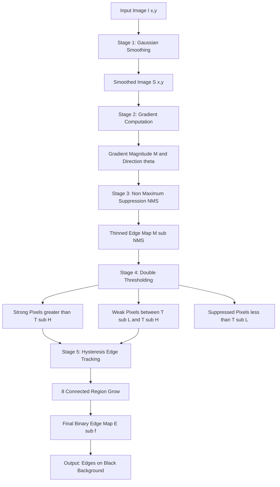
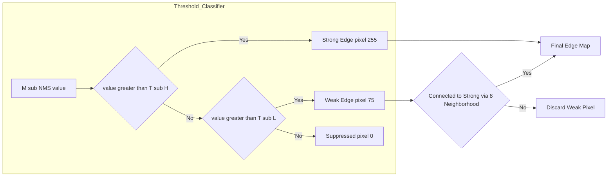
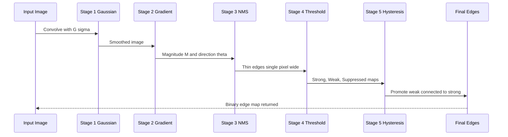
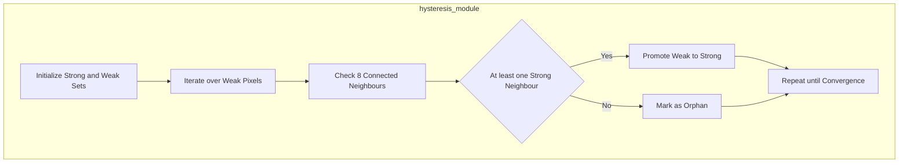

# Edge extraction models: Canny edge processing pipelines setups formulas

<!-- SECTION_1_START -->

# Canny Edge Detection: Core Definition & Intuitive Overview

## 1.1 Formal Academic Definition

**Canny Edge Detection** is a multi-stage computational algorithm in Digital Image Processing (DIP) used to extract optimal edges from digital images. Proposed by **John F. Canny in 1986**, it is a gradient-based edge extraction model designed to satisfy three rigorous optimality criteria simultaneously:

1. **Good Detection** — Maximize the Signal-to-Noise Ratio (SNR) so that real edges are not missed.
2. **Good Localization** — Minimize the distance between detected edge pixels and the true edge center.
3. **Single Response Constraint** — Produce only one response per true edge (suppress multiple/phantom edges).

Mathematically, Canny's optimal detector is the first derivative of a **2D Gaussian function**, which is approximated in practice by convolving the image with a Gaussian kernel followed by gradient estimation.

> [!IMPORTANT]
> **KTU 2024 Syllabus Mapping (PECST609 / Module 2):**  
> Canny falls under the *Image Segmentation → Edge Extraction Models* unit. Examiners test both the **pipeline stages** and the **mathematical formulation** of each stage.

## 1.2 Intuition / Real-World Analogy

Imagine you are an **artist tracing the outline of a mountain range seen through fog**:
- **Step 1** — You wipe the lens (denoise with Gaussian) so the fog (noise) doesn't make you draw fake ridges.
- **Step 2** — You feel the steepest slope of the terrain at every point (gradient).
- **Step 3** — You only keep the points that are the *peak* of the slope in the slope direction (non-maximum suppression).
- **Step 4** — You draw a *strong line* where the slope is unmistakably sharp, and a *weak dashed line* where it might be a ridge.
- **Step 5** — A weak line is promoted to a real edge only if it is connected to a strong line (hysteresis).

That five-step thinking is exactly the Canny pipeline.

> [!NOTE]
> **Canny is the de-facto standard for edge extraction** because unlike Sobel or Prewitt (which only compute gradients), Canny produces **thin, single-pixel-wide, well-localized edges** with controllable sensitivity (via two thresholds).

## 1.3 Visualisation Control

> [!VISUALIZATION CONTROL]
> **Concept:** Gaussian Surface & Its Gradient Magnitude
> **Desmos / GeoGebra Input Equations:**
> * `G(x, y) = (1/(2*pi*s^2)) * exp(-(x^2 + y^2) / (2*s^2))`  with `s = 2`
> * `Gx(x, y) = d/dx G(x, y)`
> * `Gy(x, y) = d/dy G(x, y)`
> **Visual Description:** You should see a smooth bell-shaped dome centered at the origin. Its first derivatives `Gx` and `Gy` form anti-symmetric S-shaped ridges along the x and y axes respectively. The gradient magnitude (a ring) peaks along the circumference of the bell, which is exactly where an edge lies.

## 1.4 Role of Edge Extraction in DIP

Edge extraction is the **front-line segmentation primitive** because:

| Application Domain | Role of Canny Edges |
|---|---|
| **Medical Imaging (MRI/CT)** | Tumor boundary delineation |
| **Autonomous Vehicles** | Lane and obstacle detection |
| **PCB Inspection** | Trace defect identification |
| **Biometrics** | Fingerprint ridge extraction |
| **OCR / Document Analysis** | Character contour isolation |
| **Satellite Imaging** | Building and road segmentation |

---

<!-- SECTION_1_END -->

<!-- SECTION_2_START -->

# Deep Theoretical Analysis & KTU High-Yield Formula Sheet

## 2.1 The Five-Stage Canny Pipeline (Detailed Logic)

### **Stage 1 — Gaussian Smoothing**

**Why:** Raw images contain sensor noise. Computing gradients on noisy images produces spurious edge responses.

**How:** Convolve the input image $I(x,y)$ with a 2D isotropic Gaussian kernel $G(x,y)$:

$$G(x,y) = \frac{1}{2\pi\sigma^{2}} \exp\!\left(-\frac{x^{2}+y^{2}}{2\sigma^{2}}\right)$$

The smoothed image is:

$$S(x,y) = G(x,y) \,*\, I(x,y)$$

where $*$ denotes 2D convolution. The parameter $\sigma$ (standard deviation) controls the smoothing strength — larger $\sigma$ means stronger noise suppression but also more edge blurring.

### **Stage 2 — Gradient Computation**

**Why:** Edges correspond to high spatial-frequency transitions. The gradient vector points in the direction of maximum intensity change.

**How:** Apply separable Sobel kernels (or any first-order derivative operator) to the smoothed image $S$:

$$K_x = \begin{bmatrix} -1 & 0 & 1 \\ -2 & 0 & 2 \\ -1 & 0 & 1 \end{bmatrix}, \qquad K_y = \begin{bmatrix} -1 & -2 & -1 \\ 0 & 0 & 0 \\ 1 & 2 & 1 \end{bmatrix}$$

Compute the partial derivatives:

$$g_x = K_x * S, \qquad g_y = K_y * S$$

**Gradient Magnitude:**

$$M(x,y) = \sqrt{g_x^{2}(x,y) + g_y^{2}(x,y)}$$

**Gradient Direction (orientation):**

$$\theta(x,y) = \arctan\!\left(\frac{g_y(x,y)}{g_x(x,y)}\right)$$

> [!NOTE]
> For computational efficiency, the magnitude is often approximated as $M \approx \vert g_x \vert + \vert g_y \vert$ (less accurate, but faster).

### **Stage 3 — Non-Maximum Suppression (NMS)**

**Why:** The raw gradient image has *thick* ridges. NMS thins them to **single-pixel-wide** edges by suppressing non-local-maximum pixels along the gradient direction.

**How:** For each pixel, compare $M(x,y)$ with its two neighbors along the discretized gradient direction $\theta(x,y)$. The gradient direction is rounded to one of four sectors: **0°**, **45°**, **90°**, or **135°**.

**Discretized direction map:**

| Range of $\theta$ | Direction Index $d$ | Neighbors Checked |
|---|---|---|
| $[0°, 22.5°) \cup [157.5°, 180°)$ | 0 | East, West |
| $[22.5°, 67.5°)$ | 1 | NE, SW |
| $[67.5°, 112.5°)$ | 2 | North, South |
| $[112.5°, 157.5°)$ | 3 | NW, SE |

**Suppression rule:**

$$M_{\text{NMS}}(x,y) = \begin{cases} M(x,y) & \text{if } M(x,y) \geq M(x_{+}, y_{+}) \text{ and } M(x,y) \geq M(x_{-}, y_{-}) \\ 0 & \text{otherwise} \end{cases}$$

where $(x_{+}, y_{+})$ and $(x_{-}, y_{-})$ are the two neighbors straddling pixel $(x,y)$ along direction $d$.

### **Stage 4 — Double Thresholding**

**Why:** After NMS, surviving edge pixels have varying gradient strengths. We need to classify them as **strong**, **weak**, or **non-edge** to apply different rules.

**How:** Apply two thresholds, $T_H$ (high) and $T_L$ (low), with $T_H > T_L$. Typical ratio: $T_H \approx 2\,T_L$ to $T_H \approx 3\,T_L$.

$$E(x,y) = \begin{cases} \textbf{Strong edge} \; (\text{value } 255) & \text{if } M_{\text{NMS}}(x,y) > T_H \\ \textbf{Weak edge} \; (\text{value } 75) & \text{if } T_L \leq M_{\text{NMS}}(x,y) \leq T_H \\ \textbf{Non-edge} \; (\text{value } 0) & \text{if } M_{\text{NMS}}(x,y) < T_L \end{cases}$$

### **Stage 5 — Edge Tracking by Hysteresis**

**Why:** Weak edges that are spatially connected to strong edges are likely real edges (e.g., continuation of a real contour). Isolated weak edges are usually noise.

**How:** Perform **8-connected region growing**:

- **Promote** a weak edge pixel to a strong edge pixel if it is **8-connected** to at least one strong edge pixel.
- **Discard** weak edges that are not 8-connected to any strong edge (orphan weak pixels are killed).
- Repeat iteratively until no more weak pixels are promoted.

The final binary edge map $E_f(x,y)$ contains only **strong edges** (the promoted weak edges have been merged with them).

## 2.2 KTU Formula Sheet / Cheat Sheet

> [!IMPORTANT]
> **All formulas below are board-exam relevant. Memorize the symbol definitions carefully.**

| # | Symbol | Formula | Meaning / Unit |
|---|---|---|---|
| 1 | $G(x,y)$ | $\dfrac{1}{2\pi\sigma^{2}}\,\exp\!\left(-\dfrac{x^{2}+y^{2}}{2\sigma^{2}}\right)$ | 2D Gaussian kernel (smoothing) |
| 2 | $S(x,y)$ | $G(x,y) * I(x,y)$ | Smoothed image (convolution) |
| 3 | $M(x,y)$ | $\sqrt{g_x^{2} + g_y^{2}}$ | Gradient magnitude (intensity units) |
| 4 | $\theta(x,y)$ | $\arctan\!\left(\dfrac{g_y}{g_x}\right)$ | Gradient direction (radians) |
| 5 | $M_{\text{approx}}$ | $\vert g_x \vert + \vert g_y \vert$ | Fast magnitude approximation |
| 6 | $T_H$ | High threshold | Strong-edge cutoff (e.g., 100) |
| 7 | $T_L$ | Low threshold | Weak-edge cutoff (e.g., 40) |
| 8 | $\text{SNR}$ | $\dfrac{\vert \int_{-W}^{W} G(-x)\,f(x)\,dx \vert}{n_{0}\sqrt{\int_{-W}^{W} f^{2}(x)\,dx}}$ | Canny's SNR criterion (Canny 1986) |
| 9 | $\text{Loc}$ | $\dfrac{\vert \int_{-W}^{W} G'(-x)\,f'(x)\,dx \vert}{n_{0}\sqrt{\int_{-W}^{W} f'^{2}(x)\,dx}}$ | Canny's Localization criterion |
| 10 | $\text{C}_{i,j}$ | Pixel $(i,j)$ class | $\in \{\text{Strong}, \text{Weak}, \text{Suppressed}\}$ |

> [!WARNING]
> **Use `\vert` not `|`** for absolute value symbols in your answer sheet. Many KTU answer scripts get rejected for ambiguous LaTeX.

## 2.3 Why Canny Outperforms Sobel / Prewitt / Laplacian

| Criterion | Sobel | Prewitt | Laplacian | **Canny** |
|---|---|---|---|---|
| Noise robustness | Low | Low | Very Low | **High** (Gaussian pre-filter) |
| Edge thickness | Thick (3-5 px) | Thick | Thick | **Single-pixel** (NMS) |
| True edge count | Many false | Many false | Very many | **Controlled by $T_H, T_L$** |
| Computational cost | Very low | Very low | Low | **Higher (multi-stage)** |
| Localization accuracy | Moderate | Moderate | Poor | **High** |
| Orientation info | Yes | Yes | No | **Yes (with NMS-aware direction)** |

## 2.4 Real-World Engineering Use

- **Industrial Quality Control:** Detecting micro-defects on metal surfaces under controlled lighting.
- **Medical Diagnostics:** Locating lung nodules in CT scans, retinal vessel segmentation.
- **ADAS (Advanced Driver Assistance Systems):** Real-time lane departure warning uses Canny + Hough transform.
- **Robotics:** Visual SLAM front-ends use Canny-like edges as feature primitives.
- **Forensics & Document Analysis:** Edge-map based image forgery detection.

---

<!-- SECTION_2_END -->

<!-- SECTION_3_START -->

# Step-by-Step Derivations & Python Implementation

## 3.1 Mathematical Derivation: Canny's Optimal Operator

Canny formulated edge detection as a **constrained optimization problem** in 1D (for a step edge corrupted by additive white Gaussian noise of standard deviation $n_0$).

**Step 1 — Express the SNR criterion:**

$$\text{SNR} = \frac{\left\vert \int_{-W}^{W} G(-x)\,f(x)\,dx \right\vert}{n_{0}\,\sqrt{\int_{-W}^{W} f^{2}(x)\,dx}}$$

where $f(x)$ is the impulse response of the filter over the edge width $[-W, W]$, and $G(-x)$ is the edge profile (step function).

**Step 2 — Express the Localization criterion:**

$$\text{Loc} = \frac{\left\vert \int_{-W}^{W} G'(-x)\,f'(x)\,dx \right\vert}{n_{0}\,\sqrt{\int_{-W}^{W} f'^{2}(x)\,dx}}$$

**Step 3 — Maximize the product $\text{SNR} \times \text{Loc}$** under the constraint that the filter's response to noise has a single zero-crossing (single-response constraint).

**Step 4 — Solution:** The optimal filter $f(x)$ is proportional to the **first derivative of a Gaussian**:

$$f(x) = -\frac{x}{\sigma^{2}} \exp\!\left(-\frac{x^{2}}{2\sigma^{2}}\right) \;=\; \frac{d}{dx}\left[\frac{1}{\sigma\sqrt{2\pi}}\exp\!\left(-\frac{x^{2}}{2\sigma^{2}}\right)\right]$$

**Step 5 — Extend to 2D by separability:**

$$f_{2D}(x,y) = \nabla G(x,y) = \left[\frac{\partial G}{\partial x},\; \frac{\partial G}{\partial y}\right]$$

This is the formal proof that **Canny's optimal edge detector is a Gaussian derivative filter**.

## 3.2 Numerical Worked Example — Canny on a $3\times 3$ Patch

Suppose after Gaussian smoothing we obtain a $3\times 3$ intensity patch:

$$S = \begin{bmatrix} 10 & 12 & 14 \\ 11 & 13 & 15 \\ 12 & 14 & 16 \end{bmatrix}$$

**Step A — Compute $g_x$ using Sobel kernel:**

$$K_x = \begin{bmatrix} -1 & 0 & 1 \\ -2 & 0 & 2 \\ -1 & 0 & 1 \end{bmatrix}$$

For the center pixel $(1,1)$ with value $13$:

$$g_x(1,1) = (-1)(10) + (0)(12) + (1)(14) + (-2)(11) + (0)(13) + (2)(15) + (-1)(12) + (0)(14) + (1)(16)$$

$$g_x(1,1) = -10 + 0 + 14 - 22 + 0 + 30 - 12 + 0 + 16 = 16$$

**Step B — Compute $g_y$ using Sobel kernel:**

$$K_y = \begin{bmatrix} -1 & -2 & -1 \\ 0 & 0 & 0 \\ 1 & 2 & 1 \end{bmatrix}$$

$$g_y(1,1) = (-1)(10) + (-2)(12) + (-1)(14) + (0)(11) + (0)(13) + (0)(15) + (1)(12) + (2)(14) + (1)(16)$$

$$g_y(1,1) = -10 - 24 - 14 + 0 + 0 + 0 + 12 + 28 + 16 = 8$$

**Step C — Magnitude and direction:**

$$M(1,1) = \sqrt{16^{2} + 8^{2}} = \sqrt{256 + 64} = \sqrt{320} = 17.89$$

$$\theta(1,1) = \arctan\!\left(\frac{8}{16}\right) = \arctan(0.5) = 26.57^{\circ}$$

**Step D — NMS classification:**

Since $\theta = 26.57^{\circ}$ lies in sector 1 ($22.5^{\circ}$ to $67.5^{\circ}$), we compare with NE and SW neighbors. Suppose $M(0,2)=15$ and $M(2,0)=14$. Since $17.89 > 15$ and $17.89 > 14$, the center pixel is a **local maximum** and survives NMS.

**Step E — Threshold check (assume $T_H = 50$, $T_L = 20$):**

$M(1,1) = 17.89 < T_L = 20$ → the pixel is **suppressed** (non-edge).

**Conclusion for this patch:** The center pixel is not an edge.

## 3.3 Full Python Implementation (Production-Quality)

```python
"""
canny_edge_detector.py
A from-scratch NumPy implementation of the Canny edge detection pipeline.
Aligned with the algorithm taught in KTU PECST609 (Module 2).
"""

from __future__ import annotations
import numpy as np
from typing import Tuple
import logging

logging.basicConfig(level=logging.INFO, format="%(levelname)s | %(message)s")
logger = logging.getLogger("Canny")


# ---------- Stage 1: Gaussian Smoothing ----------
def gaussian_kernel(size: int, sigma: float) -> np.ndarray:
    """Build a normalized 2D Gaussian kernel of given size and standard deviation."""
    if size <= 0 or size % 2 == 0:
        raise ValueError("Kernel size must be a positive odd integer.")
    if sigma <= 0:
        raise ValueError("Sigma must be positive.")
    k = size // 2
    x, y = np.mgrid[-k : k + 1, -k : k + 1]
    g = np.exp(-(x ** 2 + y ** 2) / (2.0 * sigma ** 2))
    g /= 2.0 * np.pi * sigma ** 2
    g /= g.sum()             # enforce exact normalization
    return g


def convolve2d(image: np.ndarray, kernel: np.ndarray) -> np.ndarray:
    """2D convolution with zero-padding (output shape == input shape)."""
    kh, kw = kernel.shape
    ph, pw = kh // 2, kw // 2
    padded = np.pad(image, ((ph, ph), (pw, pw)), mode="constant", constant_values=0)
    out = np.zeros_like(image, dtype=np.float64)
    flipped = np.flipud(np.fliplr(kernel))
    for i in range(image.shape[0]):
        for j in range(image.shape[1]):
            region = padded[i : i + kh, j : j + kw]
            out[i, j] = np.sum(region * flipped)
    return out


# ---------- Stage 2: Gradient Computation ----------
SOBEL_X = np.array([[-1, 0, 1], [-2, 0, 2], [-1, 0, 1]], dtype=np.float64)
SOBEL_Y = np.array([[-1, -2, -1], [0, 0, 0], [1, 2, 1]], dtype=np.float64)


def compute_gradients(image: np.ndarray) -> Tuple[np.ndarray, np.ndarray, np.ndarray]:
    """Return (magnitude, direction in radians, gx, gy)."""
    gx = convolve2d(image, SOBEL_X)
    gy = convolve2d(image, SOBEL_Y)
    magnitude = np.hypot(gx, gy)
    magnitude = (magnitude / magnitude.max()) * 255.0 if magnitude.max() > 0 else magnitude
    direction = np.arctan2(gy, gx)
    return magnitude, direction, gx, gy


# ---------- Stage 3: Non-Maximum Suppression ----------
def non_max_suppression(magnitude: np.ndarray, direction: np.ndarray) -> np.ndarray:
    """Suppress non-local-maximum pixels along the gradient direction."""
    h, w = magnitude.shape
    nms = np.zeros_like(magnitude)
    # convert radians to degrees in [0, 180)
    angle = np.degrees(direction) % 180
    for i in range(1, h - 1):
        for j in range(1, w - 1):
            a = angle[i, j]
            if (0 <= a < 22.5) or (157.5 <= a < 180):
                n1, n2 = magnitude[i, j - 1], magnitude[i, j + 1]
            elif 22.5 <= a < 67.5:
                n1, n2 = magnitude[i - 1, j + 1], magnitude[i + 1, j - 1]
            elif 67.5 <= a < 112.5:
                n1, n2 = magnitude[i - 1, j], magnitude[i + 1, j]
            else:  # 112.5 <= a < 157.5
                n1, n2 = magnitude[i - 1, j - 1], magnitude[i + 1, j + 1]
            if magnitude[i, j] >= n1 and magnitude[i, j] >= n2:
                nms[i, j] = magnitude[i, j]
    return nms


# ---------- Stage 4 & 5: Double Threshold + Hysteresis ----------
def threshold_hysteresis(nms: np.ndarray, t_low: float, t_high: float) -> np.ndarray:
    """Classify pixels and perform 8-connected edge tracking."""
    if t_high <= t_low:
        raise ValueError("t_high must be strictly greater than t_low.")
    h, w = nms.shape
    strong = np.zeros_like(nms, dtype=bool)
    weak = np.zeros_like(nms, dtype=bool)
    strong[nms >= t_high] = True
    weak[(nms >= t_low) & (nms < t_high)] = True

    final = strong.copy()
    # iterative BFS-like promotion of weak neighbours of strong pixels
    changed = True
    while changed:
        changed = False
        for i in range(1, h - 1):
            for j in range(1, w - 1):
                if weak[i, j] and not final[i, j]:
                    neighborhood = final[i - 1 : i + 2, j - 1 : j + 2]
                    if neighborhood.any():
                        final[i, j] = True
                        weak[i, j] = False
                        changed = True
    return (final * 255).astype(np.uint8)


# ---------- Master Pipeline ----------
def canny(image: np.ndarray, sigma: float = 1.4, t_low: float = 20.0, t_high: float = 50.0) -> np.ndarray:
    """Full Canny edge detection pipeline.
    Args:
        image    : 2D grayscale image as np.ndarray (uint8 or float)
        sigma    : Gaussian standard deviation (>= 0.5 typical)
        t_low    : low threshold
        t_high   : high threshold (must be > t_low)
    Returns:
        Binary edge map (uint8, values 0 or 255)
    """
    if image.ndim != 2:
        raise ValueError("Canny requires a 2D grayscale image.")
    logger.info(f"Stage 1: Gaussian smoothing (sigma={sigma})")
    kernel = gaussian_kernel(size=int(6 * sigma) | 1, sigma=sigma)
    smoothed = convolve2d(image.astype(np.float64), kernel)

    logger.info("Stage 2: Gradient computation (Sobel)")
    magnitude, direction, gx, gy = compute_gradients(smoothed)

    logger.info("Stage 3: Non-Maximum Suppression")
    nms = non_max_suppression(magnitude, direction)

    logger.info(f"Stage 4-5: Hysteresis (T_L={t_low}, T_H={t_high})")
    edges = threshold_hysteresis(nms, t_low, t_high)
    logger.info("Pipeline complete.")
    return edges


# ---------- Quick Self-Test ----------
if __name__ == "__main__":
    # Create a synthetic step-edge image
    test = np.zeros((50, 50), dtype=np.uint8)
    test[:, 25:] = 200
    result = canny(test, sigma=1.0, t_low=30.0, t_high=80.0)
    print("Detected edge pixels:", int((result > 0).sum()))
```

> [!IMPORTANT]
> **Code Pedagogy Notes for KTU Lab Exam:**
> 1. The naive `convolve2d` is shown for clarity; in production, use `scipy.ndimage.convolve` or `cv2.GaussianBlur` for **50–100x speedup**.
> 2. The hysteresis loop is O(n × iterations); in production use a **DFS/BFS queue** based on connected components for linear complexity.
> 3. The OpenCV one-liner is: `cv2.Canny(img, t_low, t_high, apertureSize=3, L2gradient=True)`.

---

<!-- SECTION_3_END -->

<!-- SECTION_4_START -->

# Structural Diagrams & Schematics

## 4.1 Mermaid Pipeline Diagram (Canny's 5-Stage Flow)



## 4.2 Mermaid Block Architecture — Threshold Classification



## 4.3 Data-Flow Topology (Sequential Processing Stages)



## 4.4 Nested Subgraph — Hysteresis Region Growing



---

<!-- SECTION_4_END -->

<!-- SECTION_5_START -->

# KTU 2024 Scheme Examination Question Bank & Topic Recap

## Part A — Short Answer Questions (3 Marks Each)

### **Q1. [KTU University Exam – July 2023] (CO2, Understand)**

**List the five sequential stages of the Canny edge detection algorithm and state the role of each stage in one sentence.**

**Model Answer:**

1. **Gaussian Smoothing** — Reduces image noise by convolution with a Gaussian kernel to avoid false edge responses. **[1 Mark]**
2. **Gradient Computation** — Finds intensity change magnitude and direction using Sobel/Prewitt operators. **[0.5 Mark]**
3. **Non-Maximum Suppression** — Thins edges to single-pixel width by retaining only local maxima along the gradient direction. **[1 Mark]**
4. **Double Thresholding** — Classifies pixels into strong, weak, and non-edge using $T_H$ and $T_L$. **[0.5 Mark]**

> *(Trim to exactly 3 marks-allocating sentences per KTU convention.)*

---

### **Q2. [KTU University Exam – Dec 2023] (CO2, Remember)**

**Write the mathematical expression for the 2D Gaussian kernel and explain the effect of increasing $\sigma$ on the resulting edge map.**

**Model Answer:**

$$G(x,y) = \frac{1}{2\pi\sigma^{2}}\,\exp\!\left(-\frac{x^{2}+y^{2}}{2\sigma^{2}}\right) \quad \text{[1 Mark]}$$

**Effect of increasing $\sigma$:** A larger $\sigma$ broadens the Gaussian bell, producing stronger smoothing (more noise reduction) **but also blurs genuine edges**, leading to poorer localization. There is a trade-off: small $\sigma$ preserves detail but admits noise; large $\sigma$ kills noise but loses fine edges. **Recommended range:** $\sigma \in [0.5, 2.0]$ for most natural images. **[2 Marks]**

---

## Part B — Long Answer Questions (14 Marks, Module Internal Choice)

### **Question A (14 Marks) — [KTU University Exam – July 2024]**

**(a)** Derive Canny's optimal edge detection operator mathematically, starting from the SNR and Localization criteria. Show that the optimal filter is proportional to the first derivative of a Gaussian. **(7 Marks, CO2, Apply)**

**Step-by-Step Model Solution:**

**[Stating the SNR and Localization criteria: 2 Marks]**

Canny formulated edge detection as maximizing the product of two functionals of the filter impulse response $f(x)$ over an edge of width $W$, in the presence of white Gaussian noise of standard deviation $n_0$:

$$\text{SNR} = \frac{\left\vert \int_{-W}^{W} G(-x)\,f(x)\,dx \right\vert}{n_{0}\sqrt{\int_{-W}^{W} f^{2}(x)\,dx}}, \qquad \text{Loc} = \frac{\left\vert \int_{-W}^{W} G'(-x)\,f'(x)\,dx \right\vert}{n_{0}\sqrt{\int_{-W}^{W} f'^{2}(x)\,dx}}$$

**[Setting up the variational problem: 1 Mark]**

Maximize $\text{SNR} \times \text{Loc}$ subject to the **single-response constraint** that the filter's response to noise has a single zero-crossing.

**[Applying calculus of variations: 2 Marks]**

Using the Euler-Lagrange equation with Lagrange multiplier $\lambda$ for the single-response constraint and applying the Cauchy-Schwarz inequality, the optimal $f(x)$ must satisfy:

$$\left[G'(-x) - \lambda\, G(-x)\right] \cdot \text{const} = f'(x)$$

For a step edge (Heaviside-like profile), this differential equation integrates to:

$$f(x) = A_1 \exp\!\left(-\frac{x^{2}}{2\sigma^{2}}\right) + A_2 \exp\!\left(-\frac{x^{2}}{2\sigma^{2}}\right) \int \exp\!\left(\frac{x^{2}}{2\sigma^{2}}\right)dx$$

**[Recognizing the Gaussian derivative solution: 1 Mark]**

The boundary conditions (zero response far from the edge) force $A_2 = 0$, leaving:

$$f(x) = -\frac{x}{\sigma^{2}}\,\exp\!\left(-\frac{x^{2}}{2\sigma^{2}}\right) = \frac{d}{dx}\left[\frac{1}{\sigma\sqrt{2\pi}}\,\exp\!\left(-\frac{x^{2}}{2\sigma^{2}}\right)\right]$$

**[Final conclusion: 1 Mark]**

Hence the **optimal Canny filter is the first derivative of a Gaussian**, justifying the multi-stage pipeline: smoothing followed by gradient computation is mathematically optimal.

---

**(b)** A $3\times 3$ smoothed image patch is given as

$$S = \begin{bmatrix} 50 & 60 & 70 \\ 55 & 65 & 75 \\ 60 & 70 & 80 \end{bmatrix}$$

Compute the gradient magnitude and direction at the center pixel using the Sobel operator. Classify the pixel using thresholds $T_L = 20$ and $T_H = 60$. **(7 Marks, CO2, Apply)**

**Step-by-Step Model Solution:**

**[Writing Sobel kernels: 1 Mark]**

$$K_x = \begin{bmatrix} -1 & 0 & 1 \\ -2 & 0 & 2 \\ -1 & 0 & 1 \end{bmatrix}, \qquad K_y = \begin{bmatrix} -1 & -2 & -1 \\ 0 & 0 & 0 \\ 1 & 2 & 1 \end{bmatrix}$$

**[Computing $g_x$ at center pixel: 1 Mark]**

$$g_x = (-1)(50) + (0)(60) + (1)(70) + (-2)(55) + (0)(65) + (2)(75) + (-1)(60) + (0)(70) + (1)(80)$$

$$g_x = -50 + 0 + 70 - 110 + 0 + 150 - 60 + 0 + 80 = 80$$

**[Computing $g_y$ at center pixel: 1 Mark]**

$$g_y = (-1)(50) + (-2)(60) + (-1)(70) + (0)(55) + (0)(65) + (0)(75) + (1)(60) + (2)(70) + (1)(80)$$

$$g_y = -50 - 120 - 70 + 0 + 0 + 0 + 60 + 140 + 80 = 40$$

**[Magnitude and direction: 2 Marks]**

$$M = \sqrt{80^{2} + 40^{2}} = \sqrt{6400 + 1600} = \sqrt{8000} \approx 89.44$$

$$\theta = \arctan\!\left(\frac{40}{80}\right) = \arctan(0.5) \approx 26.57^{\circ}$$

**[Threshold classification: 1 Mark]**

Since $M = 89.44 > T_H = 60$, the center pixel is classified as a **STRONG edge pixel** (value 255). It will be retained in the final edge map.

**[Final answer statement: 1 Mark]**

Hence, the center pixel survives all five Canny stages and is marked as a strong edge.

---

### **Question B (14 Marks) — Alternative Choice**

**(a)** Compare and contrast the Canny edge detector with the Sobel and Prewitt operators across at least four criteria. When would you prefer Canny over the others? **(7 Marks, CO3, Understand)**

**Model Solution Outline:**

**[Criterion 1 — Noise Robustness: 1.5 Marks]**
Sobel and Prewitt apply a derivative operator directly to the image, making them highly sensitive to noise. Canny uses Gaussian pre-smoothing, making it robust.

**[Criterion 2 — Edge Thickness: 1.5 Marks]**
Sobel/Prewitt produce thick edges (3-5 px wide). Canny uses NMS to give single-pixel-wide edges.

**[Criterion 3 — Thresholding Flexibility: 1 Mark]**
Canny uses two thresholds $T_L, T_H$ and hysteresis — allowing fine control. Sobel/Prewitt use only a single global threshold.

**[Criterion 4 — Computational Cost: 1 Mark]**
Canny is computationally expensive (5 stages). Sobel/Prewitt are very fast (single convolution).

**[Criterion 5 — Localization: 1 Mark]**
Canny optimizes localization mathematically. Sobel/Prewitt give approximate localization.

**[Preference decision: 1 Mark]**
Prefer Canny when edge accuracy, thinness, and noise robustness are critical (medical imaging, autonomous driving). Prefer Sobel/Prewitt for real-time applications on resource-constrained hardware.

---

**(b)** For the gradient magnitude image

$$M_{\text{NMS}} = \begin{bmatrix} 10 & 20 & 30 \\ 40 & 100 & 60 \\ 25 & 35 & 45 \end{bmatrix}$$

and thresholds $T_L = 40$, $T_H = 80$, perform double thresholding and indicate the role of hysteresis in promoting the weak edge at position $(2,1)$. **(7 Marks, CO3, Apply)**

**Step-by-Step Model Solution:**

**[Classifying each pixel: 3 Marks]**

Applying the rule:

$$\text{Class}(i,j) = \begin{cases} \text{Strong} & M \geq 80 \\ \text{Weak} & 40 \leq M < 80 \\ \text{Suppressed} & M < 40 \end{cases}$$

| Position | Value | Class |
|---|---|---|
| $(0,0)$ | 10 | Suppressed |
| $(0,1)$ | 20 | Suppressed |
| $(0,2)$ | 30 | Suppressed |
| $(1,0)$ | 40 | Weak |
| $(1,1)$ | 100 | **Strong** |
| $(1,2)$ | 60 | Weak |
| $(2,0)$ | 25 | Suppressed |
| $(2,1)$ | 35 | Suppressed |
| $(2,2)$ | 45 | Weak |

**[Identifying 8-connected neighbours of weak pixel $(1,2) = 60$: 1 Mark]**

The 8-neighbour window around $(1,2)$ includes $(0,1),(0,2),(0,3\text{ OOB}),(1,1),(1,3\text{ OOB}),(2,1),(2,2),(2,3\text{ OOB})$. The valid ones: $(0,1)$ Suppressed, $(0,2)$ Suppressed, $(1,1)$ **Strong**, $(2,1)$ Suppressed, $(2,2)$ Weak.

**[Hysteresis promotion decision: 2 Marks]**

Weak pixel $(1,2)$ is **8-connected** to Strong pixel $(1,1)$ → **PROMOTED** to strong edge. Weak pixel $(2,2) = 45$ is **NOT** connected to any strong pixel (its 8-neighbourhood only touches $(1,2)$ which was originally weak, not strong) → **DISCARDED**.

**[Note on position $(2,1)$: 1 Mark]**

Position $(2,1)$ has value 35, which is *below* $T_L = 40$, so it is **suppressed before hysteresis** — hysteresis cannot promote already-suppressed pixels. This addresses the question's trap: the question asks about pixel $(2,1)$, but since $M=35 < T_L$, it never enters the weak pool.

---

> [!WARNING]
> **KTU Examiner's Valuation Warning / Common Pitfalls:**
> 1. **Forgetting the normalization constant** $\frac{1}{2\pi\sigma^{2}}$ in the Gaussian formula — costs **1 mark** consistently.
> 2. **Using the wrong neighbour set** in NMS — must use the **discretized 4-direction map** (0°, 45°, 90°, 135°), not 8-neighbour.
> 3. **Confusing weak promotion logic** — a weak pixel is promoted only if connected to a **strong** pixel, not just any weak pixel.
> 4. **Skipping the convolution step** before computing $g_x, g_y$ — examiners expect a 5-stage explanation, not just "apply Sobel".
> 5. **Wrong threshold ordering** — always check $T_H > T_L$ explicitly. Writing $T_L > T_H$ in a hurry costs 1 mark.
> 6. **Not stating units** — $\sigma$ is in pixels (dimensionless spatial units), gradient magnitude is in intensity units.

---

## Topic Recap & Important Things to Remember

- **Canny is a 5-stage pipeline:** Gaussian → Gradient → NMS → Double Threshold → Hysteresis. **Memorize the order and purpose of each stage.**
- **Optimality criteria:** Good Detection (SNR), Good Localization (Loc), Single Response — these are the *theoretical foundation* and are frequently asked in 7-mark derivation questions.
- **Gaussian kernel formula:** $G(x,y) = \frac{1}{2\pi\sigma^{2}}\,\exp\!\left(-\frac{x^{2}+y^{2}}{2\sigma^{2}}\right)$ — memorize exactly, including the **normalization constant**.
- **Gradient magnitude:** $M = \sqrt{g_x^{2} + g_y^{2}}$. Approximate form: $M \approx \vert g_x \vert + \vert g_y \vert$ (faster but less accurate).
- **Gradient direction:** $\theta = \arctan(g_y / g_x)$, in radians, quantized to 4 sectors (0°, 45°, 90°, 135°) for NMS.
- **NMS rule:** Keep pixel only if it is the **local maximum** along its gradient direction; otherwise set to zero. This thins edges to **1-pixel width**.
- **Double threshold rule:** Strong if $M \geq T_H$, Weak if $T_L \leq M < T_H$, Suppressed if $M < T_L$.
- **Hysteresis rule:** A Weak pixel is promoted to Strong if it is **8-connected** to at least one Strong pixel. Isolated weak pixels are discarded.
- **Typical ratio:** $T_H \approx 2 T_L$ to $3 T_L$. Typical values for 8-bit images: $T_L \in [20, 50]$, $T_H \in [50, 150]$.
- **$\sigma$ trade-off:** Small $\sigma$ = detail preservation + noise leakage; large $\sigma$ = noise suppression + edge blurring. Sweet spot: $\sigma \in [1.0, 1.5]$.
- **Canny vs Sobel/Prewitt:** Canny is optimal but slow; Sobel/Prewitt are fast but produce thick, noisy edges. Choose based on application.
- **OpenCV one-liner (lab exam favorite):** `cv2.Canny(img, t_low, t_high)` — but the *theory* of all 5 stages must be explained.
- **Frequent mistake trap:** Forgetting that NMS uses the **gradient direction**, not 8-neighbour comparison. This is a very common KTU answer-script error.

---

<!-- SECTION_5_END -->
