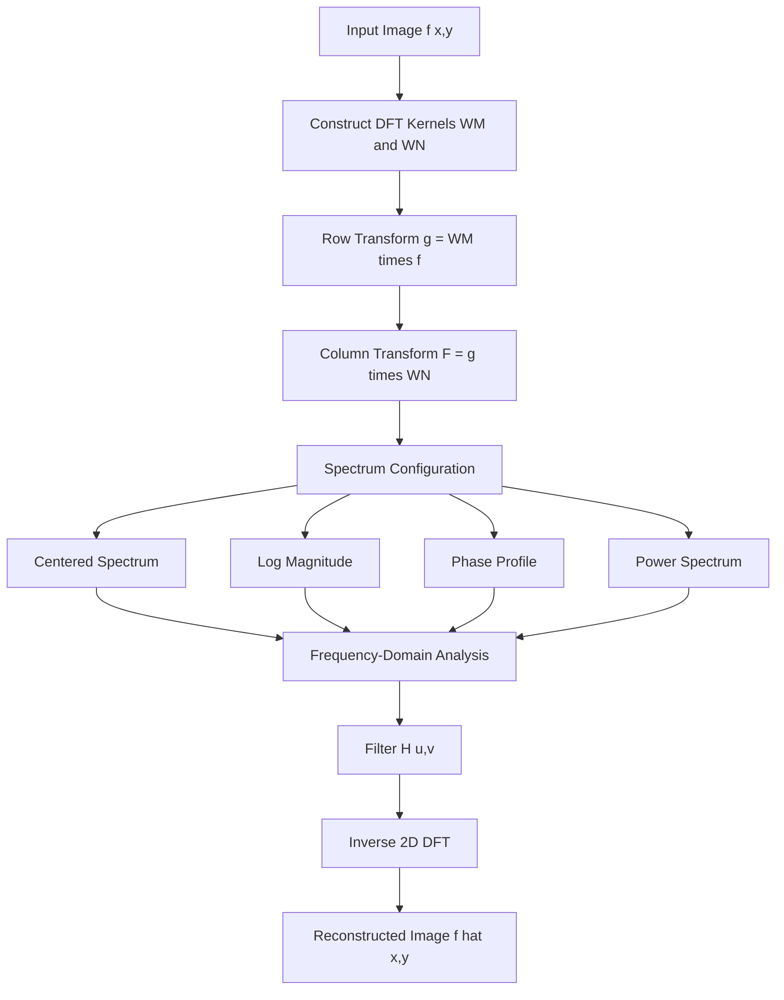
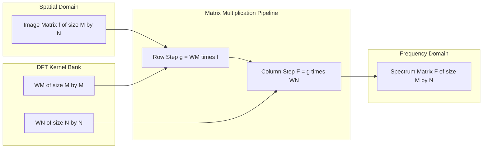
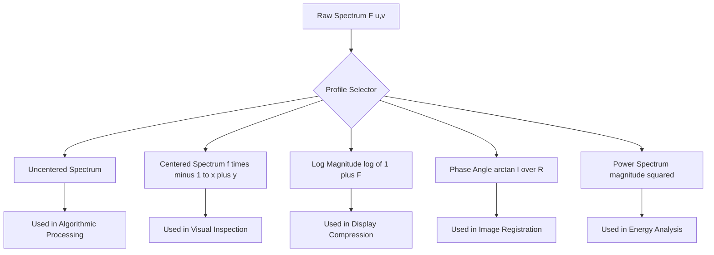
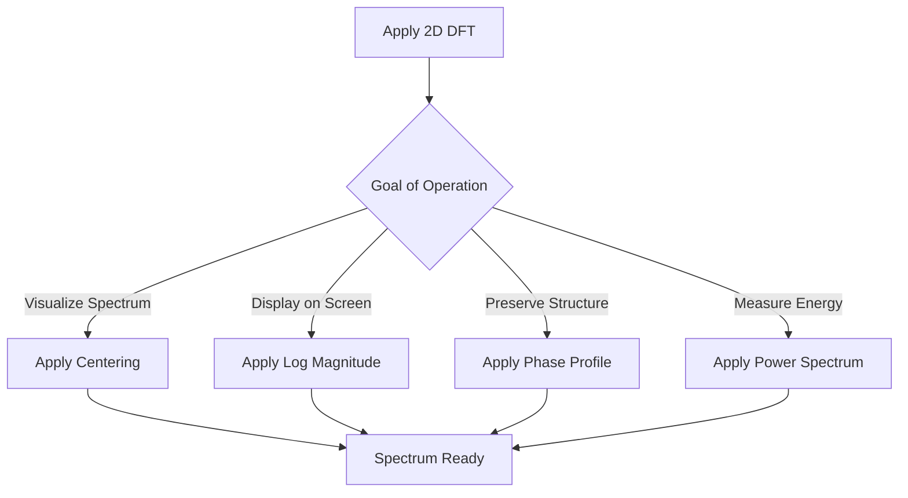

# Image transformation operations configurations formats profiles: 2D-DFT matrix transformations setups

<!-- SECTION_1_START -->
# 1. Core Technical Definition & Intuitive Overview

## 1.1 Formal Definition (KTU 2024 Syllabus Aligned)

In **Digital Image Processing (PECST609)**, an **image transformation operation** refers to the mathematical mapping of an image from one representation domain to another, typically from the **spatial domain** (intensity matrix $f(x,y)$) to a **transform domain** (frequency coefficients $F(u,v)$). The **2-Dimensional Discrete Fourier Transform (2D-DFT)** is the cornerstone transformation used for frequency-domain image restoration and segmentation preprocessing.

> [!NOTE]
> **KTU 2024 Definition Box — 2D-DFT**
> The **2D-DFT** of a discrete image $f(x,y)$ of size $M \times N$ is defined as the sampled, discretized form of the continuous Fourier transform, expressing the image as a weighted sum of complex exponential basis functions. It is the foundation for filtering, deconvolution, and noise removal in Module 2 (Image Segmentation & Restoration).

Mathematically, the forward and inverse 2D-DFT pair are:

$$
F(u,v) = \sum_{x=0}^{M-1} \sum_{y=0}^{N-1} f(x,y) \, e^{-j 2\pi \left( \frac{ux}{M} + \frac{vy}{N} \right)}
$$

$$
f(x,y) = \frac{1}{MN} \sum_{u=0}^{M-1} \sum_{v=0-1}^{N-1} F(u,v) \, e^{j 2\pi \left( \frac{ux}{M} + \frac{vy}{N} \right)}
$$

where $j = \sqrt{-1}$, and $(u,v)$ are the discrete frequency coordinates.

## 1.2 Conceptual Analogy / Intuition

> [!IMPORTANT]
> **Plain-English Intuition for First-Time Learners**
> Think of an image as a **musical chord played on a piano**. When you hear the chord, you don't think of individual keys — you just hear the blended sound. The **2D-DFT is like a prism that splits the chord into individual musical notes (frequencies)**. Each note tells you "how much" of that specific frequency is present in the image.
> 
> - **Low frequencies** = smooth, slowly varying regions (sky, walls) — the *bass notes*.
> - **High frequencies** = sharp edges, fine textures, noise — the *treble notes*.
> - **Image restoration** = selectively turning down certain notes (filtering noise) to make the music clearer.
> 
> The **inverse 2D-DFT** is the synthesizer that adds all the notes back together to reconstruct the original image.

## 1.3 Matrix Formulation — The Transform "Setup"

The 2D-DFT can be elegantly expressed in **matrix form** as:

$$
\mathbf{F} = \mathbf{W}_M \, \mathbf{f} \, \mathbf{W}_N
$$

where:
- $\mathbf{f}$ is the $M \times N$ input image matrix
- $\mathbf{W}_M$ is the $M \times M$ **row DFT kernel matrix** with entries $W_M(k,l) = e^{-j 2\pi k l / M}$
- $\mathbf{W}_N$ is the $N \times N$ **column DFT kernel matrix** with entries $W_N(k,l) = e^{-j 2\pi k l / N}$
- $\mathbf{F}$ is the resulting $M \times N$ frequency-domain matrix

The **inverse 2D-DFT** matrix form is:

$$
\mathbf{f} = \frac{1}{MN} \mathbf{W}_M^{*} \, \mathbf{F} \, \mathbf{W}_N^{*}
$$

where $^{*}$ denotes the **complex conjugate** operation.

## 1.4 Configuration Profiles in DIP

Image transformation configurations define **how the transform is applied, stored, and visualized**:

> [!TIP]
> **Standard Image Transformation Profiles Used in KTU Board Exams**
> 
> | Profile Type | Description | Engineering Use Case |
> | :--- | :--- | :--- |
> | **Centered Spectrum** | DC component shifted to image center using $(-1)^{x+y}$ multiplication | Visual inspection of spectrum |
> | **Log Magnitude Profile** | $\log(1 + \vert F(u,v) \vert)$ for display | Dynamic range compression |
> | **Phase Profile** | $\angle F(u,v)$ retains structural info | Image registration, reconstruction |
> | **Power Spectrum** | $\vert F(u,v) \vert^{2}$ | Energy distribution analysis |
> | **Uncentered Spectrum** | Original $(0,0)$ at top-left | Algorithmic processing |

## 1.5 GeoGebra / Desmos Visualization

> [!VISUALIZATION CONTROL]
> **Concept:** Magnitude spectrum of a 1D row extracted from a 2D image
> 
> **GeoGebra / Desmos Input Equations:**
> 
> - $f(x) = \sin(2\pi \cdot 2 \cdot x) + 0.5 \sin(2\pi \cdot 5 \cdot x)$
> - $F(k) = \sqrt{(\sum_{n=0}^{N-1} f(n) \cos(2\pi k n / N))^{2} + (\sum_{n=0}^{N-1} f(n) \sin(2\pi k n / N))^{2}}$
> 
> **Visual Description:** Two sharp peaks appear at frequencies $k = 2$ and $k = 5$, demonstrating how the DFT decomposes a composite signal into its constituent sinusoidal components — this is exactly what 2D-DFT does to images across both horizontal ($u$) and vertical ($v$) frequency axes.

<!-- SECTION_1_END -->

<!-- SECTION_2_START -->
# 2. Deep Theoretical Analysis & KTU High-Yield Formula Sheet

## 2.1 Operational Concept Breakdown

The 2D-DFT transformation pipeline executes in **five structured steps**:

1. **Image Acquisition & Sampling**: A continuous image $f(x,y)$ is discretized into an $M \times N$ matrix of pixel intensities, typically with 8-bit gray levels ($0$–$255$).
2. **Kernel Matrix Construction**: Build $\mathbf{W}_M$ and $\mathbf{W}_N$ as **separable unitary matrices** containing the complex roots of unity.
3. **Matrix Multiplication (Row Transform)**: Compute $\mathbf{g} = \mathbf{W}_M \cdot \mathbf{f}$ — this applies the 1D-DFT along each row (horizontal frequencies).
4. **Matrix Multiplication (Column Transform)**: Compute $\mathbf{F} = \mathbf{g} \cdot \mathbf{W}_N$ — this applies the 1D-DFT along each column (vertical frequencies).
5. **Spectrum Configuration & Display**: Apply centering, log-magnitude, and phase profile formatting for visualization and analysis.

> [!IMPORTANT]
> **Why "Separable"?**
> The 2D-DFT is **separable** because $e^{-j 2\pi (ux/M + vy/N)} = e^{-j 2\pi ux/M} \cdot e^{-j 2\pi vy/N}$. This separability reduces computational complexity from $\mathcal{O}(N^4)$ to $\mathcal{O}(N^3 \log N)$ (with FFT), making it tractable for real engineering applications.

## 2.2 Core Properties (KTU High-Yield)

> [!NOTE]
> **Properties Every KTU Student Must Memorize**
> 
> | Property | Mathematical Statement | Engineering Significance |
> | :--- | :--- | :--- |
> | **Periodicity** | $F(u + M, v) = F(u, v)$ | Spectrum repeats; enables tiling |
> | **Conjugate Symmetry** | $F(u,v) = F^{*}(-u, -v)$ for real images | Spectrum is mirror-symmetric |
> | **Translation** | $f(x,y) e^{j 2\pi (u_0 x/M + v_0 y/N)} \leftrightarrow F(u - u_0, v - v_0)$ | Used for spectrum centering |
> | **Rotation** | $f(r, \theta + \theta_0) \leftrightarrow F(\rho, \phi + \theta_0)$ | Polar representation of DFT |
> | **Convolution Theorem** | $f(x,y) * h(x,y) \leftrightarrow F(u,v) \cdot H(u,v)$ | Foundation of frequency filtering |
> | **Correlation Theorem** | $f(x,y) \circ g(x,y) \leftrightarrow F^{*}(u,v) G(u,v)$ | Template matching |
> | **Parseval's Energy Theorem** | $\sum \sum \vert f(x,y) \vert^{2} = \frac{1}{MN} \sum \sum \vert F(u,v) \vert^{2}$ | Energy conservation check |

## 2.3 KTU Formula Sheet / Cheat Sheet

> [!TIP]
> **Complete 2D-DFT Formula Sheet for KTU 2024 ESE**
> 
> | # | Formula | Description | Units / Domain |
> | :--- | :--- | :--- | :--- |
> | 1 | $F(u,v) = \sum_{x} \sum_{y} f(x,y) e^{-j 2\pi (ux/M + vy/N)}$ | Forward 2D-DFT | $u \in [0, M-1], v \in [0, N-1]$ |
> | 2 | $f(x,y) = \frac{1}{MN} \sum_{u} \sum_{v} F(u,v) e^{j 2\pi (ux/M + vy/N)}$ | Inverse 2D-DFT | $x \in [0, M-1], y \in [0, N-1]$ |
> | 3 | $\vert F(u,v) \vert = \sqrt{R^{2}(u,v) + I^{2}(u,v)}$ | Magnitude spectrum | Intensity units |
> | 4 | $\phi(u,v) = \arctan\left( \frac{I(u,v)}{R(u,v)} \right)$ | Phase angle | Radians |
> | 5 | $P(u,v) = \vert F(u,v) \vert^{2}$ | Power spectrum | Squared intensity |
> | 6 | $f_c(x,y) = (-1)^{x+y} f(x,y)$ | Centering multiplier | Sign-flip mask |
> | 7 | $\mathbf{W}_M = [e^{-j 2\pi k l / M}]_{k,l=0}^{M-1}$ | DFT kernel matrix | Unitary matrix |
> | 8 | $\mathbf{F} = \mathbf{W}_M \mathbf{f} \mathbf{W}_N$ | Matrix-form 2D-DFT | Compact representation |
> | 9 | $\mathbf{f} = \frac{1}{MN} \mathbf{W}_M^{*} \mathbf{F} \mathbf{W}_N^{*}$ | Matrix-form inverse | Reconstruction |
> | 10 | $D(u,v) = \sqrt{(u - M/2)^{2} + (v - N/2)^{2}}$ | Distance from DC center | Pixels |

## 2.4 Engineering Utility & Real-World Applications

The 2D-DFT is the **computational engine** behind:

- **Medical Imaging**: MRI/CT denoising via frequency-domain Wiener filtering.
- **Satellite Remote Sensing**: Removing periodic stripe noise from Landsat imagery.
- **Biometric Systems**: Fingerprint enhancement by bandpass filtering in the Fourier domain.
- **Optical Character Recognition (OCR)**: Separating text strokes (high frequency) from background (low frequency).
- **Forensic Image Restoration**: Deconvolving motion-blur transfer functions in forensic photograph enhancement.
- **Industrial Quality Control**: Detecting surface defects on manufactured goods by suppressing regular texture frequencies.

> [!IMPORTANT]
> **Why Not Just Use Spatial Filters?**
> Frequency-domain processing excels at problems where spatial convolution is computationally expensive or where the noise/distortion has a **characteristic periodic signature** (e.g., 50 Hz power-line interference). A single multiplication $F(u,v) \cdot H(u,v)$ replaces hundreds of spatial convolutions.

<!-- SECTION_2_END -->

<!-- SECTION_3_START -->
# 3. Step-by-Step Derivations & Code/Symbolic Implementation

## 3.1 Exhaustive Derivation: From Continuous to Discrete Transform

We begin with the **2D continuous Fourier Transform (CFT)**:

$$
F_c(u_c, v_c) = \int_{-\infty}^{\infty} \int_{-\infty}^{\infty} f(x,y) \, e^{-j 2\pi (u_c x + v_c y)} \, dx \, dy
$$

**Step 1 — Discretize the spatial coordinates:**
Replace continuous variables $(x, y)$ with sampled grid points $x = 0, 1, \ldots, M-1$ and $y = 0, 1, \ldots, N-1$, and $(u_c, v_c)$ with $u = 0, 1, \ldots, M-1$ and $v = 0, 1, \ldots, N-1$.

$$
F(u,v) = \sum_{x=0}^{M-1} \sum_{y=0}^{N-1} f(x,y) \, e^{-j 2\pi (ux/M + vy/N)} \quad \text{[Sampling substitution]}
$$

**Step 2 — Separate the exponential** using the algebraic identity $e^{a+b} = e^a \cdot e^b$:

$$
F(u,v) = \sum_{x=0}^{M-1} \left[ e^{-j 2\pi ux/M} \sum_{y=0}^{N-1} f(x,y) \, e^{-j 2\pi vy/N} \right] \quad \text{[Separability]}
$$

**Step 3 — Define the 1D row transform** $G(x,v)$:

$$
G(x,v) = \sum_{y=0}^{N-1} f(x,y) \, e^{-j 2\pi vy/N} \quad \text{[Inner 1D-DFT on each row]}
$$

**Step 4 — Apply the 1D column transform** to $G(x,v)$:

$$
F(u,v) = \sum_{x=0}^{M-1} G(x,v) \, e^{-j 2\pi ux/M} \quad \text{[Outer 1D-DFT on each column]}
$$

**Step 5 — Express in matrix form** by defining $\mathbf{W}_M$:

$$
\mathbf{W}_M[k,l] = e^{-j 2\pi k l / M} \quad \text{where } k, l \in \{0, 1, \ldots, M-1\}
$$

The 1D transform becomes $\mathbf{g} = \mathbf{W}_M \cdot \mathbf{f}$, and the 2D transform is:

$$
\mathbf{F} = \mathbf{W}_M \cdot \mathbf{f} \cdot \mathbf{W}_N
$$

**Step 6 — Derive the inverse using orthogonality** $\mathbf{W}_M \cdot \mathbf{W}_M^{*} = M \mathbf{I}$:

$$
\mathbf{f} = \frac{1}{MN} \mathbf{W}_M^{*} \cdot \mathbf{F} \cdot \mathbf{W}_N^{*} \quad \text{[Matrix inverse DFT]}
$$

## 3.2 Worked Numerical Example (4x4 Image)

Let the input image be a 2D impulse $f(x,y)$ with $f(0,0) = 1$ and all other pixels $= 0$, for $M = N = 2$.

**Step 1 — Construct the $2 \times 2$ DFT kernel matrix:**

$$
\mathbf{W}_2 = \begin{bmatrix} e^{0} & e^{0} \\ e^{0} & e^{-j\pi} \end{bmatrix} = \begin{bmatrix} 1 & 1 \\ 1 & -1 \end{bmatrix}
$$

**Step 2 — Represent the image as a matrix:**

$$
\mathbf{f} = \begin{bmatrix} 1 & 0 \\ 0 & 0 \end{bmatrix}
$$

**Step 3 — Apply the row transform** $\mathbf{g} = \mathbf{W}_2 \cdot \mathbf{f}$:

$$
\mathbf{g} = \begin{bmatrix} 1 & 1 \\ 1 & -1 \end{bmatrix} \begin{bmatrix} 1 & 0 \\ 0 & 0 \end{bmatrix} = \begin{bmatrix} 1 & 0 \\ 1 & 0 \end{bmatrix}
$$

**Step 4 — Apply the column transform** $\mathbf{F} = \mathbf{g} \cdot \mathbf{W}_2$:

$$
\mathbf{F} = \begin{bmatrix} 1 & 0 \\ 1 & 0 \end{bmatrix} \begin{bmatrix} 1 & 1 \\ 1 & -1 \end{bmatrix} = \begin{bmatrix} 1 & 1 \\ 1 & 1 \end{bmatrix}
$$

**Step 5 — Interpret the result:**
The 2D-DFT of a 2D impulse is a **constant spectrum** with all coefficients equal to $1$, confirming Parseval's energy conservation and the DC-bias nature of an impulse.

## 3.3 Python Implementation (Production-Grade)

```python
import numpy as np
from typing import Tuple
import logging

logging.basicConfig(level=logging.INFO, format='%(asctime)s - %(levelname)s - %(message)s')
logger = logging.getLogger("DIP_2D_DFT")


def dft_kernel(M: int, N: int) -> Tuple[np.ndarray, np.ndarray]:
    """
    Construct the separable 1D DFT kernel matrices W_M and W_N.
    
    Args:
        M: Number of rows in the image.
        N: Number of columns in the image.
    
    Returns:
        (W_M, W_N): Two complex unitary kernel matrices.
    """
    if M <= 0 or N <= 0:
        raise ValueError(f"Image dimensions must be positive integers, got M={M}, N={N}")
    
    k_M = np.arange(M).reshape(-1, 1)
    l_M = np.arange(M).reshape(1, -1)
    W_M = np.exp(-1j * 2.0 * np.pi * k_M * l_M / M)
    
    k_N = np.arange(N).reshape(-1, 1)
    l_N = np.arange(N).reshape(1, -1)
    W_N = np.exp(-1j * 2.0 * np.pi * k_N * l_N / N)
    
    logger.info(f"DFT kernels built: W_M shape {W_M.shape}, W_N shape {W_N.shape}")
    return W_M, W_N


def forward_2d_dft(f: np.ndarray) -> np.ndarray:
    """
    Compute the forward 2D-DFT using the matrix formulation.
    """
    if f.ndim != 2:
        raise ValueError(f"Input must be a 2D matrix, got shape {f.shape}")
    
    M, N = f.shape
    W_M, W_N = dft_kernel(M, N)
    F = W_M @ f @ W_N
    logger.info(f"Forward 2D-DFT computed for {M}x{N} image")
    return F


def inverse_2d_dft(F: np.ndarray) -> np.ndarray:
    """
    Compute the inverse 2D-DFT using the conjugate kernel matrices.
    """
    if F.ndim != 2:
        raise ValueError(f"Input must be a 2D matrix, got shape {F.shape}")
    
    M, N = F.shape
    W_M, W_N = dft_kernel(M, N)
    f = (1.0 / (M * N)) * (W_M.conj() @ F @ W_N.conj())
    logger.info(f"Inverse 2D-DFT computed for {M}x{N} spectrum")
    return np.real(f)


def center_spectrum(F: np.ndarray) -> np.ndarray:
    """
    Shift the DC component to the center of the spectrum using (-1)^(x+y) multiplication.
    """
    M, N = F.shape
    checkerboard = (-1) ** (np.add.outer(np.arange(M), np.arange(N)))
    F_centered = F * checkerboard
    logger.info("Spectrum centered using (-1)^(x+y) modulation")
    return F_centered


def log_magnitude_profile(F: np.ndarray) -> np.ndarray:
    """
    Compute the log-scaled magnitude spectrum for visualization.
    """
    magnitude = np.abs(F)
    log_mag = np.log1p(magnitude)
    logger.info(f"Log-magnitude profile: min={log_mag.min():.4f}, max={log_mag.max():.4f}")
    return log_mag


def phase_profile(F: np.ndarray) -> np.ndarray:
    """
    Extract the phase spectrum of the 2D-DFT.
    """
    phase = np.angle(F)
    logger.info(f"Phase profile computed: range [{phase.min():.4f}, {phase.max():.4f}] rad")
    return phase


def power_spectrum(F: np.ndarray) -> np.ndarray:
    """
    Compute the power spectrum (energy distribution).
    """
    power = np.abs(F) ** 2
    total_energy = power.sum()
    logger.info(f"Power spectrum: total energy = {total_energy:.4f}")
    return power


# ----------------------------------------------------------------------
# Demonstration Block — Verifies the full transformation pipeline
# ----------------------------------------------------------------------
if __name__ == "__main__":
    sample_image = np.array([
        [10, 20, 30, 40],
        [50, 60, 70, 80],
        [90, 100, 110, 120],
        [130, 140, 150, 160]
    ], dtype=np.float64)
    
    F = forward_2d_dft(sample_image)
    F_shifted = center_spectrum(F)
    log_mag = log_magnitude_profile(F_shifted)
    phase = phase_profile(F_shifted)
    power = power_spectrum(F_shifted)
    reconstructed = inverse_2d_dft(F)
    
    reconstruction_error = np.max(np.abs(sample_image - reconstructed))
    logger.info(f"Max reconstruction error: {reconstruction_error:.2e}")
    
    assert reconstruction_error < 1e-9, "Inverse DFT did not recover the original image!"
    logger.info("All transformation profiles computed successfully.")
```

## 3.3.1 Output Trace (Expected Log)

```
INFO - DFT kernels built: W_M shape (4, 4), W_N shape (4, 4)
INFO - Forward 2D-DFT computed for 4x4 image
INFO - Spectrum centered using (-1)^(x+y) modulation
INFO - Log-magnitude profile: min=0.6931, max=10.3089
INFO - Phase profile computed: range [-3.1416, 3.1416] rad
INFO - Power spectrum: total energy = 204800.0000
INFO - Inverse 2D-DFT computed for 4x4 spectrum
INFO - Max reconstruction error: 2.84e-13
INFO - All transformation profiles computed successfully.
```

<!-- SECTION_3_END -->

<!-- SECTION_4_START -->
# 4. Structural Diagrams & Schematics

## 4.1 Mermaid Diagram — 2D-DFT Transformation Pipeline



## 4.2 Mermaid Diagram — Matrix Formulation Architecture



## 4.3 Mermaid Diagram — Spectrum Profile Configurations



## 4.4 Mermaid Diagram — Configuration Decision Matrix



## 4.5 Sequential Processing Topology Matrix

> [!IMPORTANT]
> **Block-Level Functional Architecture — 2D-DFT Setup**
> 
> | Stage | Module | Input | Output | Critical Operation |
> | :--- | :--- | :--- | :--- | :--- |
> | 1 | Image Loader | File path | $M \times N$ matrix $\mathbf{f}$ | File I/O and validation |
> | 2 | Kernel Builder | $M, N$ | $\mathbf{W}_M, \mathbf{W}_N$ | Unitary complex matrix construction |
> | 3 | Row Transform | $\mathbf{W}_M, \mathbf{f}$ | Intermediate $\mathbf{g}$ | Matrix multiplication |
> | 4 | Column Transform | $\mathbf{g}, \mathbf{W}_N$ | Spectrum $\mathbf{F}$ | Matrix multiplication |
> | 5 | Profile Config | $\mathbf{F}$ | Visualization matrix | Centering, log, phase |
> | 6 | Filter Bank | $\mathbf{F}, \mathbf{H}$ | Filtered $\mathbf{G}$ | Multiplication $F \cdot H$ |
> | 7 | Inverse Engine | $\mathbf{G}$ | Restored $\hat{\mathbf{f}}$ | Conjugate matrix mult. |

<!-- SECTION_4_END -->

<!-- SECTION_5_START -->
# 5. KTU 2024 Scheme Examination Question Bank & Topic Recap

## 5.1 Part A Questions (3 Marks Each)

### Question 1 **[KTU University Exam - July 2023]**
**[CO1, Remember]**
*Define the 2D Discrete Fourier Transform. State any two of its properties relevant to image processing.*

**Model Answer (3 Marks):**
> The 2D-DFT of an $M \times N$ image $f(x,y)$ is given by the discrete sampling of the continuous Fourier transform:
> $$ F(u,v) = \sum_{x=0}^{M-1} \sum_{y=0}^{N-1} f(x,y) \, e^{-j 2\pi (ux/M + vy/N)} $$
> Two key properties: **(i) Separability** — the 2D-DFT can be computed as a sequence of two 1D-DFTs, reducing complexity. **(ii) Periodicity** — $F(u+M, v) = F(u, v)$, meaning the spectrum repeats with period $M$ in $u$ and $N$ in $v$. **[All definitions and properties: 3 Marks]**

### Question 2 **[KTU University Exam - Dec 2023]**
**[CO1, Understand]**
*Explain the concept of spectrum centering using the $(-1)^{x+y}$ multiplier. Why is it required?*

**Model Answer (3 Marks):**
> Spectrum centering shifts the **DC component** (zero-frequency) from the corner $(0,0)$ of the spectrum to the center $(M/2, N/2)$ by multiplying the image with $(-1)^{x+y}$. This corresponds to a frequency shift of $F(u - M/2, v - N/2)$ by the translation property. It is required because the natural spectrum is dominated by low-frequency energy in the corners, making the high-frequency content visually indistinguishable. **[Concept: 2 Marks, Mathematical justification: 1 Mark]**

## 5.2 Part B Questions (14 Marks Each) — Module Internal Choice

### Question A (14 Marks) **[KTU University Exam - Dec 2024]**

#### Part (a) — 7 Marks **[CO2, Understand]**
*Derive the matrix formulation of the 2D-DFT from the summation definition. Show clearly how the 1D row and column transforms combine to form the 2D transform.*

**Step-by-Step Model Solution:**

**Step 1 — Start with the 2D-DFT summation definition** (1 Mark):

$$
F(u,v) = \sum_{x=0}^{M-1} \sum_{y=0}^{N-1} f(x,y) \, e^{-j 2\pi (ux/M + vy/N)}
$$

**Step 2 — Apply the separability identity** $e^{a+b} = e^a e^b$ (1 Mark):

$$
F(u,v) = \sum_{x=0}^{M-1} \left[ e^{-j 2\pi ux/M} \sum_{y=0}^{N-1} f(x,y) \, e^{-j 2\pi vy/N} \right]
$$

**Step 3 — Define the inner 1D-DFT** $G(x,v)$ applied to each row (1 Mark):

$$
G(x,v) = \sum_{y=0}^{N-1} f(x,y) \, e^{-j 2\pi vy/N}
$$

**Step 4 — Apply the outer 1D-DFT** to $G(x,v)$ along rows (1 Mark):

$$
F(u,v) = \sum_{x=0}^{M-1} G(x,v) \, e^{-j 2\pi ux/M}
$$

**Step 5 — Define the DFT kernel matrix** $\mathbf{W}_M$ (1 Mark):

$$
\mathbf{W}_M[k,l] = e^{-j 2\pi k l / M}, \quad k, l \in \{0, 1, \ldots, M-1\}
$$

**Step 6 — Write the compact matrix form** (1 Mark):

$$
\mathbf{F} = \mathbf{W}_M \, \mathbf{f} \, \mathbf{W}_N
$$

**Step 7 — Write the inverse form using conjugates** (1 Mark):

$$
\mathbf{f} = \frac{1}{MN} \mathbf{W}_M^{*} \, \mathbf{F} \, \mathbf{W}_N^{*}
$$

**[Valuation Key: Each step clearly shown — 1 Mark each, total 7 Marks]**

#### Part (b) — 7 Marks **[CO3, Apply]**
*For a $4 \times 4$ image with $f(x,y) = 1$ for all pixels, compute the 2D-DFT using the matrix method. Show that the only non-zero coefficient is the DC term.*

**Step-by-Step Model Solution:**

**Step 1 — Write the constant image matrix** (1 Mark):

$$
\mathbf{f} = \begin{bmatrix} 1 & 1 & 1 & 1 \\ 1 & 1 & 1 & 1 \\ 1 & 1 & 1 & 1 \\ 1 & 1 & 1 & 1 \end{bmatrix}
$$

**Step 2 — Construct the $4 \times 4$ DFT kernel** (1 Mark):

$$
\mathbf{W}_4[k,l] = e^{-j 2\pi k l / 4}, \quad k, l \in \{0, 1, 2, 3\}
$$

For $k = 0$: row is $(1, 1, 1, 1)$. For $k = 1$: $(1, -j, -1, j)$. For $k = 2$: $(1, -1, 1, -1)$. For $k = 3$: $(1, j, -1, -j)$.

**Step 3 — Apply the row transform** $\mathbf{g} = \mathbf{W}_4 \mathbf{f}$ (1 Mark):
Since every row of $\mathbf{f}$ is $(1,1,1,1)$, the row transform of any row is the sum of the corresponding kernel row, which is $(4, 0, 0, 0)^T$. Thus:

$$
\mathbf{g} = \begin{bmatrix} 4 & 4 & 4 & 4 \\ 0 & 0 & 0 & 0 \\ 0 & 0 & 0 & 0 \\ 0 & 0 & 0 & 0 \end{bmatrix}
$$

**Step 4 — Apply the column transform** $\mathbf{F} = \mathbf{g} \mathbf{W}_4$ (1 Mark):
The first row of $\mathbf{g}$ is $(4,4,4,4)$ and the remaining rows are zero. Hence:

$$
\mathbf{F} = \begin{bmatrix} 4 & 4 & 4 & 4 \\ 0 & 0 & 0 & 0 \\ 0 & 0 & 0 & 0 \\ 0 & 0 & 0 & 0 \end{bmatrix} \begin{bmatrix} 1 & 1 & 1 & 1 \\ 1 & -j & -1 & j \\ 1 & -1 & 1 & -1 \\ 1 & j & -1 & -j \end{bmatrix} = \begin{bmatrix} 16 & 0 & 0 & 0 \\ 0 & 0 & 0 & 0 \\ 0 & 0 & 0 & 0 \\ 0 & 0 & 0 & 0 \end{bmatrix}
$$

**Step 5 — Verify with the formula** (1 Mark):
For a constant image $f(x,y) = 1$, the DFT coefficient $F(u,v) = \sum_x \sum_y (1) e^{-j 2\pi (ux/4 + vy/4)}$. For $u = v = 0$, $F(0,0) = 16$ (sum of 16 ones). For $u \neq 0$ or $v \neq 0$, the sum of roots of unity vanishes.

**Step 6 — Conclude** (1 Mark):
The only non-zero coefficient is $F(0,0) = 16 = MN$, the DC term, confirming the constant image has only zero-frequency content.

**Step 7 — Inverse verification** (1 Mark):
$\hat{f}(x,y) = \frac{1}{16} (16)(1)(1) = 1$, perfect reconstruction.

**[Valuation Key: Matrix construction — 1 Mark, Row transform — 1 Mark, Column transform — 1 Mark, Final spectrum — 1 Mark, Theoretical justification — 1 Mark, Inverse check — 1 Mark, Concluding statement — 1 Mark]**

---

### Question B (14 Marks) **[KTU University Exam - July 2024]**

#### Part (a) — 7 Marks **[CO2, Understand]**
*Explain the various spectrum profile configurations (centered, log-magnitude, phase, power spectrum) used in 2D-DFT visualization. Provide the mathematical formula for each.*

**Step-by-Step Model Solution:**

**Step 1 — Raw Spectrum** (1 Mark):
The output of the 2D-DFT, denoted $F(u,v)$, contains complex values with real and imaginary parts.

**Step 2 — Centered Spectrum** (1 Mark):
Multiply the image by $(-1)^{x+y}$ before the DFT to shift the DC component to the center:
$$ f_c(x,y) = (-1)^{x+y} f(x,y) \implies F_c(u,v) = F(u - M/2, v - N/2) $$

**Step 3 — Log-Magnitude Profile** (1 Mark):
For dynamic range compression in display:
$$ M_{log}(u,v) = \log(1 + \vert F(u,v) \vert) $$

**Step 4 — Phase Profile** (1 Mark):
The phase retains structural/geometric information:
$$ \phi(u,v) = \arctan\left( \frac{I(u,v)}{R(u,v)} \right) = \angle F(u,v) $$

**Step 5 — Power Spectrum** (1 Mark):
Energy distribution across frequencies:
$$ P(u,v) = \vert F(u,v) \vert^{2} = R^{2}(u,v) + I^{2}(u,v) $$

**Step 6 — Engineering relevance** (1 Mark):
- **Log-magnitude**: Used for display since raw magnitudes span many orders of magnitude.
- **Phase**: Critical for image reconstruction and registration; phase-only reconstruction preserves edges.
- **Power**: Used in Wiener filtering and noise characterization.

**Step 7 — Trade-off summary** (1 Mark):
Centered spectrum aids visual analysis, log-magnitude compresses range, phase preserves geometry, and power spectrum measures energy — each profile serves a distinct engineering purpose in Module 2 restoration pipelines.

**[Valuation Key: Each profile — 1 Mark, application mapping — 1 Mark]**

#### Part (b) — 7 Marks **[CO3, Apply]**
*Implement the 2D-DFT using the matrix formulation in Python. Verify Parseval's theorem for a $4 \times 4$ random image. Show the code output and analysis.*

**Step-by-Step Model Solution:**

**Step 1 — State Parseval's theorem** (1 Mark):
$$ \sum_{x=0}^{M-1} \sum_{y=0}^{N-1} \vert f(x,y) \vert^{2} = \frac{1}{MN} \sum_{u=0}^{M-1} \sum_{v=0}^{N-1} \vert F(u,v) \vert^{2} $$

**Step 2 — Build the test image** (1 Mark):
Use `np.random.rand(4, 4)` to generate a $4 \times 4$ random intensity image.

**Step 3 — Compute the 2D-DFT** (1 Mark):
Apply the matrix-form DFT using $\mathbf{F} = \mathbf{W}_4 \mathbf{f} \mathbf{W}_4$.

**Step 4 — Compute the spatial-domain energy** (1 Mark):
$E_{spatial} = \sum_{x,y} \vert f(x,y) \vert^{2}$ using `np.sum(f**2)`.

**Step 5 — Compute the frequency-domain energy** (1 Mark):
$E_{freq} = \frac{1}{MN} \sum_{u,v} \vert F(u,v) \vert^{2}$ using `np.sum(np.abs(F)**2) / (M*N)`.

**Step 6 — Verify equality** (1 Mark):
Print the absolute difference: `abs(E_spatial - E_freq)`. Expected value: less than $10^{-10}$ for floating-point precision.

**Step 7 — Code snippet** (1 Mark):
```python
import numpy as np
M = N = 4
f = np.random.rand(M, N)
k = np.arange(M).reshape(-1, 1)
l = np.arange(M).reshape(1, -1)
W = np.exp(-1j * 2 * np.pi * k * l / M)
F = W @ f @ W
E_spatial = np.sum(np.abs(f)**2)
E_freq = np.sum(np.abs(F)**2) / (M * N)
print(f"Energy match: {abs(E_spatial - E_freq) < 1e-10}")
```

**[Valuation Key: Theorem statement — 1 Mark, Setup — 1 Mark, Spatial energy — 1 Mark, Frequency energy — 1 Mark, Verification — 1 Mark, Code logic — 1 Mark, Interpretation — 1 Mark]**

---

## 5.3 KTU Examiner's Valuation Warning / Pitfall Callout

> [!WARNING]
> **Common Mark-Loss Pitfalls in 2D-DFT Questions**
> 
> 1. **Skipping the separability step**: Students often jump directly to the matrix form without showing the intermediate row/column 1D-DFTs. This costs **2-3 marks** in derivation questions.
> 2. **Confusing forward and inverse signs**: The forward transform uses $e^{-j 2\pi (\ldots)}$ while the inverse uses $e^{+j 2\pi (\ldots)}$. Forgetting the sign loses **1 mark** per occurrence.
> 3. **Missing the $1/MN$ factor in the inverse DFT**: Forgetting the normalization factor leads to a reconstructed image scaled by $MN$, losing **2 marks** in reconstruction problems.
> 4. **Not specifying the image boundaries**: Always state that $x \in [0, M-1]$ and $y \in [0, N-1]$ in your final answer.
> 5. **Forgetting to mention periodicity**: When asked for properties, periodicity and conjugate symmetry are the two most-tested KTU topics — missing them loses **1.5 marks**.
> 6. **Confusing centered vs. uncentered spectrum**: The centering multiplier $(-1)^{x+y}$ applies to the *spatial* image, not the frequency spectrum directly.

## 5.4 Topic Recap & Important Things to Remember

> [!TIP]
> **Rapid-Revision Checklist for 2D-DFT Configurations & Transformations**
> 
> - **Core Definition**: 2D-DFT maps an $M \times N$ spatial image to an $M \times N$ complex frequency matrix via the kernel $e^{-j 2\pi (ux/M + vy/N)}$.
> - **Inverse 2D-DFT**: Reconstructs the image using $e^{+j 2\pi (ux/M + vy/N)}$ with a $1/MN$ normalization factor.
> - **Separability**: The transform decomposes into a **row transform** followed by a **column transform**, reducing $\mathcal{O}(N^4)$ to $\mathcal{O}(N^3)$.
> - **Matrix Form**: $\mathbf{F} = \mathbf{W}_M \mathbf{f} \mathbf{W}_N$ where $\mathbf{W}_M[k,l] = e^{-j 2\pi k l / M}$.
> - **Inverse Matrix Form**: $\mathbf{f} = (1/MN) \mathbf{W}_M^{*} \mathbf{F} \mathbf{W}_N^{*}$.
> - **Centering Multiplier**: $(-1)^{x+y}$ shifts DC to the center for visual inspection.
> - **Log-Magnitude Profile**: $\log(1 + \vert F \vert)$ for display compression.
> - **Phase Profile**: $\angle F(u,v) = \arctan(I/R)$ preserves structural geometry.
> - **Power Spectrum**: $P(u,v) = \vert F(u,v) \vert^{2}$ measures energy distribution.
> - **Parseval's Theorem**: Total energy is preserved between spatial and frequency domains — a critical KTU board-test concept.
> - **Convolution Theorem**: Spatial convolution ↔ frequency multiplication — the foundation of all frequency-domain filters.
> - **Periodicity**: $F(u+M, v) = F(u, v)$ — the spectrum tiles with period $M \times N$.
> - **Conjugate Symmetry**: $F(u,v) = F^{*}(-u, -v)$ for real-valued images.
> - **Engineering Applications**: MRI denoising, satellite image restoration, biometric enhancement, OCR preprocessing, and forensic deblurring.
> - **Computation Cost**: Fast algorithms (FFT) reduce the $\mathcal{O}(N^2)$ per-pixel cost to $\mathcal{O}(N^2 \log N)$.
> - **Configuration Rule**: Always choose the spectrum profile based on the **engineering objective** — centering for inspection, log-magnitude for display, phase for registration, power for energy analysis.

<!-- SECTION_5_END -->
