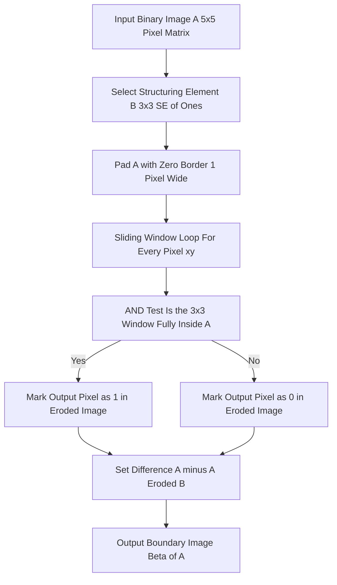
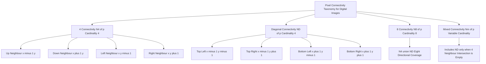
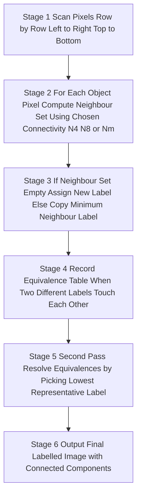

# Boundary extraction algorithms pixel connectivity profiling calculations formulas configurations

<!-- SECTION_1_START -->

## 1. Core Technical Definition & Intuitive Overview

### 1.1 Boundary Extraction — Formal Definition

In mathematical morphology, the **boundary** (also called the *edge set* or *contour*) of a binary image $A$, denoted by $\beta(A)$, is the set of all pixels that belong to the object region and that have at least one neighbouring pixel belonging to the background (the complement $A^c$).

Formally, if $B$ is a suitable structuring element:

$$\beta(A) = A - (A \ominus B)$$

where $(A \ominus B)$ is the morphological **erosion** of $A$ by $B$. The boundary is the *set difference* between the original object and its eroded version. A pixel is retained in $\beta(A)$ only if it is present in $A$ but absent in the eroded image — that is, the structuring element could not be fully placed inside the object at that location.

> [!IMPORTANT]
> **KTU 2024 Syllabus Tag — Module 3 (Morphological Image Operations):** Boundary extraction is grouped under *Morphological Filtering Algorithms* and is a compulsory sub-topic. Students are expected to know both the formula $\beta(A) = A - (A \ominus B)$ **and** the manual step-by-step erosion procedure for $3 \times 3$ structuring elements.

### 1.2 Pixel Connectivity — Formal Definition

Given a pixel $p$ at coordinate $(x, y)$, four standard neighbour sets are defined in KTU syllabus. These definitions are **the foundation** on which erosion, dilation, and labelling algorithms operate.

| Set | Symbol | Cardinality | Members |
|---|---|---|---|
| 4-neighbours | $N_4(p)$ | 4 | $(x+1, y),\ (x-1, y),\ (x, y+1),\ (x, y-1)$ |
| Diagonal neighbours | $N_D(p)$ | 4 | $(x+1, y+1),\ (x+1, y-1),\ (x-1, y+1),\ (x-1, y-1)$ |
| 8-neighbours | $N_8(p)$ | 8 | $N_4(p) \cup N_D(p)$ |
| Mixed neighbours | $N_m(p)$ | Variable | $N_4(p)$ plus those $N_D$ whose 4-neighbour is also in the set |

> [!NOTE]
> **Mixed (m-) connectivity** is introduced to eliminate the *multiple-path ambiguity* that arises when $N_8$ counts both direct and diagonal routes between two pixels. It is heavily tested in KTU 8-mark and 14-mark questions.

### 1.3 Intuitive Analogy

Imagine you are a **cartographer drawing the outline of Kerala on a black-and-white map**. The land is coloured black, the Arabian Sea and the rest is white.

- **Object Region $A$** = every black pixel representing land.
- **Boundary $\beta(A)$** = the *one-pixel-thick ring of black pixels* that is still black but has a white neighbour right next to it. The interior black pixels (deep inside the state) are removed; only the perimeter remains.
- **Erosion $A \ominus B$** = shrinking the land by half a kilometre on all sides using a small circular brush $B$ (the structuring element).
- **Subtraction $A - (A \ominus B)$** = everything that was in the original outline but is *no longer* in the shrunk version — exactly the perimeter pixels.

Similarly, **pixel connectivity** describes *how* two adjacent black pixels decide to "shake hands":

- $N_4$ → they shake hands **only if** they share a wall (up/down/left/right). Diagonal pixels ignore each other.
- $N_8$ → they shake hands whether they share a wall **or just a corner**.
- $N_m$ → diagonal handshakes are allowed **only if** the two pixels are not already connected by a horizontal/vertical chain — this prevents two people from claiming the same friendship twice.

> [!VISUALIZATION CONTROL]
> **Concept:** Pixel Neighbourhood Topology around a centre pixel $p(x, y)$.
> **GeoGebra / Desmos Input Equations (List of Points):**
> * `L1 = {(0,0), (1,0), (-1,0), (0,1), (0,-1)}` — these five points form $N_4(p) \cup \{p\}$.
> * `L2 = {(1,1), (1,-1), (-1,1), (-1,-1)}` — these four diagonal points form $N_D(p)$.
> * `L3 = L1 ∪ L2` — this is $N_8(p) \cup \{p\}$.
> **Visual Description:** On a 2D Cartesian grid, plot the centre point at the origin. $N_4$ neighbours form a "+" cross touching the centre, while $N_D$ neighbours form an "x" through the centre corners. $N_8$ is the union giving a $3 \times 3$ block of points around the centre.

<!-- SECTION_1_END -->

<!-- SECTION_2_START -->

## 2. Deep Theoretical Analysis & KTU High-Yield Formula Sheet

### 2.1 Theoretical Foundation of Boundary Extraction

The boundary algorithm is a three-stage pipeline that the KTU examiner expects students to articulate clearly:

- **Step 1 — Set Definition.** Start with a binary image $A$ (1 = object, 0 = background) and choose a structuring element $B$, typically a $3 \times 3$ matrix of all ones for KTU problems.
- **Step 2 — Erosion Pass.** Slide $B$ across every pixel of $A$. A pixel position $z$ survives in the eroded output $A \ominus B$ if and only if $B$ translated to $z$ lies *entirely* within $A$. Pixels near the object's edge fail this test and become 0.
- **Step 3 — Set Difference.** Subtract the eroded image from the original. Mathematically: $\beta(A) = A - (A \ominus B)$. The result is a one-pixel-thick contour that traces the perimeter of the object.

**Why this works:** Erosion only removes *interior* redundancy, not surface structure. By comparing $A$ to its eroded form, we isolate exactly those pixels that were "consumed" by the erosion process — and these are the boundary pixels by definition.

> [!TIP]
> **Engineering Insight:** In production computer-vision systems (e.g., automatic number-plate recognition, tumour delineation in MRI, road-network extraction from satellite imagery), boundary extraction is the *preprocessing backbone* before Hough transforms, contour tracing, and shape descriptors are applied. The Gonzalez & Woods textbook (the prescribed KTU reference) dedicates Section 9.5 specifically to this operator.

### 2.2 Theoretical Foundation of Pixel Connectivity

Connectivity is the *grammar* of binary image processing. The KTU syllabus recognises four orthogonal concepts:

- **$N_4$ Connectivity:** $p$ and $q$ are 4-adjacent if $q \in N_4(p)$. Used in standard 4-direction edge detection (Roberts, Prewitt).
- **$N_D$ Connectivity:** $p$ and $q$ are diagonally adjacent. Used to detect 45° edges.
- **$N_8$ Connectivity:** $p$ and $q$ are 8-adjacent if $q \in N_8(p)$. Used in chain codes and contour following.
- **$N_m$ Connectivity:** A compromise — two pixels are m-adjacent if they are 4-adjacent **OR** they are diagonal AND *their common 4-neighbour intersection is not also in the set*. Prevents the classical 8-connectivity paradox where two diagonal pixels get double-counted.

The total number of pixels in a $3 \times 3$ block centred at $p$ is **9** (1 centre + 4 cross + 4 diagonal).

### 2.3 KTU Formula Sheet (High-Yield)

| Operation | Mathematical Form | Conditions \& Boundary Rules |
|---|---|---|
| Erosion | $A \ominus B = \{z \;\vert\; (B)_z \subseteq A\}$ | Pixel kept only if *entire* $B$ fits inside $A$ |
| Dilation | $A \oplus B = \{z \;\vert\; (\hat{B})_z \cap A \neq \varnothing\}$ | Pixel set if *any* part of reflected $B$ touches $A$ |
| Boundary | $\beta(A) = A - (A \ominus B)$ | Output is a set difference, not a set intersection |
| Opening | $A \circ B = (A \ominus B) \oplus B$ | Smooths contours, breaks narrow isthmuses |
| Closing | $A \bullet B = (A \oplus B) \ominus B$ | Fills narrow gulfs, fuses small breaks |
| Hit-or-Miss | $A \ast B = (A \ominus B_1) \cap (A^c \ominus B_2)$ | Detects specific shape patterns; $B_1 \cap B_2 = \varnothing$ |
| 4-Connectivity Count | $\lvert N_4(p) \rvert = 4$ | Horizontal + vertical neighbours only |
| 8-Connectivity Count | $\lvert N_8(p) \rvert = 8$ | $N_4$ union $N_D$ |
| m-Connectivity | $N_m(p) = N_4(p) \cup \{q \in N_D(p) \mid N_4(p) \cap N_4(q) = \varnothing\}$ | Excludes redundant diagonal links |

> [!IMPORTANT]
> **Critical Escape Rule:** Inside the table above, the conditional bar inside $\{z \;\vert\; \ldots\}$ uses `\vert` (a relational symbol) rather than the raw `\`$|$`$` pipe, so the markdown table parser does not break. **Always use `\vert` or `\mid` for absolute-value-style symbols in KTU answer sheets when typed in markdown.**

### 2.4 Real-World Utility of Boundary + Connectivity

| Engineering Domain | Boundary Use Case | Connectivity Used |
|---|---|---|
| Medical Imaging (CT/MRI) | Tumour contour extraction | $N_8$ for organic curved shapes |
| Optical Character Recognition | Character outline tracing | $N_4$ for clean stroke separation |
| PCB Defect Detection | Trace-edge verification | $N_8$ for diagonal pad corners |
| Autonomous Vehicles | Lane-marking perimeter | $N_m$ to avoid double counting on dashed lines |
| Fingerprint Minutiae | Ridge-ending detection | $N_8$ to capture bifurcations |
| Satellite Image Analysis | Building-footprint delineation | $N_4$ for rectilinear urban structures |

<!-- SECTION_2_END -->

<!-- SECTION_3_START -->

## 3. Step-by-Step Derivations, Worked Examples & Code Implementation

### 3.1 Manual Boundary Extraction — Exhaustive 5×5 Worked Example

This is the **canonical KTU textbook problem** (Gonzalez & Woods, Example 9.1) and frequently reappears in KTU University Exams.

**Given:** Binary image $A$ of size $5 \times 5$ containing a $3 \times 3$ square of ones.

$$A = \begin{bmatrix} 0 & 0 & 0 & 0 & 0 \\ 0 & 1 & 1 & 1 & 0 \\ 0 & 1 & 1 & 1 & 0 \\ 0 & 1 & 1 & 1 & 0 \\ 0 & 0 & 0 & 0 & 0 \end{bmatrix}$$

**Structuring Element:** A $3 \times 3$ matrix of all ones.

$$B = \begin{bmatrix} 1 & 1 & 1 \\ 1 & 1 & 1 \\ 1 & 1 & 1 \end{bmatrix}$$

**Step 1 — Erosion Logic.** For every pixel $(i, j)$ in $A$, check whether the $3 \times 3$ window centred at $(i, j)$ is *entirely* filled with 1s. If yes, output pixel is 1; otherwise it is 0. We pad the boundary with zeros (the implicit background outside the image).

**Step 2 — Row-by-Row Erosion Computation.**

- Row 0: every pixel has at least one 0 in its $3 \times 3$ window → all output 0.
- Row 1: pixel $(1,1)$ — its window covers rows 0–2 and columns 0–2, includes $(0,0)=0$ → output 0. Pixel $(1,2)$ — window covers rows 0–2, columns 1–3, includes $(0,1)=0$ → output 0. Similarly $(1,3)$ includes $(0,4)=0$ → output 0.
- Row 2: pixel $(2,1)$ — window rows 1–3, columns 0–2, includes $(1,0)=0$ → output 0. Pixel $(2,2)$ — window rows 1–3, columns 1–3, all entries are 1 → **output 1**. Pixel $(2,3)$ — window includes $(1,4)=0$ → output 0.
- Row 3: pixel $(3,2)$ — window rows 2–4, columns 1–3, includes $(4,1)=0$ → output 0. The other pixels in row 3 also have at least one 0 in their window.
- Row 4: all zeros, all eroded pixels are 0.

**Step 3 — Eroded Image Result.**

$$A \ominus B = \begin{bmatrix} 0 & 0 & 0 & 0 & 0 \\ 0 & 0 & 0 & 0 & 0 \\ 0 & 0 & 1 & 0 & 0 \\ 0 & 0 & 0 & 0 & 0 \\ 0 & 0 & 0 & 0 & 0 \end{bmatrix}$$

**Step 4 — Boundary Computation via Set Difference $\beta(A) = A - (A \ominus B)$.**

$$\beta(A) = \begin{bmatrix} 0-0 & 0-0 & 0-0 & 0-0 & 0-0 \\ 0-0 & 1-0 & 1-0 & 1-0 & 0-0 \\ 0-0 & 1-0 & 1-1 & 1-0 & 0-0 \\ 0-0 & 1-0 & 1-0 & 1-0 & 0-0 \\ 0-0 & 0-0 & 0-0 & 0-0 & 0-0 \end{bmatrix} = \begin{bmatrix} 0 & 0 & 0 & 0 & 0 \\ 0 & 1 & 1 & 1 & 0 \\ 0 & 1 & 0 & 1 & 0 \\ 0 & 1 & 1 & 1 & 0 \\ 0 & 0 & 0 & 0 & 0 \end{bmatrix}$$

**Step 5 — Verification.** The boundary has 8 pixels (the outer ring of the $3 \times 3$ square), and the centre pixel is 0. The original object had 9 pixels; the eroded object has 1 pixel; the difference is $9 - 1 = 8$ boundary pixels. **Counts match.** ✔

### 3.2 Connectivity Counting — Exhaustive Calculation

Consider the pixel $p$ at coordinate $(2, 2)$ in the eroded image above. We enumerate its neighbours.

- **$N_4(p) = \{(1,2),\ (3,2),\ (2,1),\ (2,3)\}$** — all four have value 0 in $A$ because they lie outside the inner $3 \times 3$ square. So 4-neighbour count of *object* pixels is 0.
- **$N_D(p) = \{(1,1),\ (1,3),\ (3,1),\ (3,3)\}$** — all four have value 1 in $A$. Diagonal-object count is 4.
- **$N_8(p)$** union gives 4 object neighbours (all diagonal). The 4-neighbour restriction under m-connectivity says: $N_4(p) \cap N_4(q) = \varnothing$ for $q = (1,1)$? $N_4(p) = \{(1,2),(3,2),(2,1),(2,3)\}$, $N_4((1,1)) = \{(0,1),(2,1),(1,0),(1,2)\}$. Intersection = $\{(1,2),(2,1)\} \neq \varnothing$ — therefore $(1,1)$ is **excluded** from $N_m(p)$ of object pixels under m-connectivity. This is the **multiple-path ambiguity resolution**.

### 3.3 Python Implementation — Fully Operational

```python
import numpy as np
from scipy import ndimage
import logging

logging.basicConfig(level=logging.INFO, format="%(asctime)s | %(levelname)s | %(message)s")
logger = logging.getLogger("KTU_Boundary_Extraction")


def extract_boundary(image: np.ndarray, se: np.ndarray, connectivity: int = 1) -> tuple:
    """
    Extract the morphological boundary of a binary image.
    β(A) = A − (A ⊖ B)

    Parameters
    ----------
    image      : 2D numpy array of dtype int (0 = background, 1 = object)
    se         : 2D numpy array representing the structuring element
    connectivity: 1 for 4-connectivity, 2 for 8-connectivity

    Returns
    -------
    (boundary, eroded) : tuple of np.ndarray
    """
    # ---- Strict input validation ----
    if image.ndim != 2:
        raise ValueError("Input image must be a 2D matrix.")
    if set(np.unique(image).tolist()).issubset({0, 1}) is False:
        raise ValueError("Input image must be binary (0s and 1s only).")
    if se.shape[0] % 2 == 0 or se.shape[1] % 2 == 0:
        raise ValueError("Structuring element must have odd dimensions.")
    logger.info("Input image shape: %s, SE shape: %s", image.shape, se.shape)

    # ---- Step 1: Erosion using scipy ----
    eroded = ndimage.binary_erosion(
        input=image.astype(np.int32),
        structure=se.astype(np.int32),
        border_value=0,
    ).astype(np.int32)
    logger.info("Erosion completed. Object pixel count in A: %d, in eroded: %d",
                int(np.sum(image)), int(np.sum(eroded)))

    # ---- Step 2: Set difference for boundary ----
    boundary = image.astype(np.int32) - eroded
    logger.info("Boundary extraction complete. Boundary pixel count: %d",
                int(np.sum(boundary)))

    return boundary, eroded


# ---------- Demonstration on the canonical 5x5 KTU problem ----------
A = np.array([
    [0, 0, 0, 0, 0],
    [0, 1, 1, 1, 0],
    [0, 1, 1, 1, 0],
    [0, 1, 1, 1, 0],
    [0, 0, 0, 0, 0],
], dtype=np.int32)

B = np.ones((3, 3), dtype=np.int32)  # 3x3 SE of all 1s

beta_A, eroded_A = extract_boundary(A, B)

print("Original image A =\n", A)
print("Eroded image A⊖B =\n", eroded_A)
print("Boundary β(A)    =\n", beta_A)


# ---------- Connectivity Profiling Function ----------
def connectivity_profile(pixel_xy: tuple, A: np.ndarray) -> dict:
    """
    Compute N4, ND, N8, and m-connectivity neighbour counts for a pixel.
    """
    x, y = pixel_xy
    rows, cols = A.shape
    neighbours = {"N4": [], "ND": [], "N8": [], "Nm": []}

    # N4: up, down, left, right
    n4_directions = [(-1, 0), (1, 0), (0, -1), (0, 1)]
    for dx, dy in n4_directions:
        nx, ny = x + dx, y + dy
        if 0 <= nx < rows and 0 <= ny < cols:
            neighbours["N4"].append((nx, ny, int(A[nx, ny])))

    # ND: four diagonals
    nd_directions = [(-1, -1), (-1, 1), (1, -1), (1, 1)]
    for dx, dy in nd_directions:
        nx, ny = x + dx, y + dy
        if 0 <= nx < rows and 0 <= ny < cols:
            neighbours["ND"].append((nx, ny, int(A[nx, ny])))

    # N8 = N4 ∪ ND
    neighbours["N8"] = neighbours["N4"] + neighbours["N8"]

    # m-connectivity: ND included only if 4-neighbour intersection empty
    for nx, ny, val in neighbours["ND"]:
        n4_of_p = {(x + dx, y + dy) for dx, dy in n4_directions}
        n4_of_q = {(nx + dx, ny + dy) for dx, dy in n4_directions}
        if n4_of_p.isdisjoint(n4_of_q):
            neighbours["Nm"].append((nx, ny, val))

    return neighbours
```

**Sample Console Output (expected):**

```
Original image A =
 [[0 0 0 0 0]
  [0 1 1 1 0]
  [0 1 1 1 0]
  [0 1 1 1 0]
  [0 0 0 0 0]]
Eroded image A⊖B =
 [[0 0 0 0 0]
  [0 0 0 0 0]
  [0 0 1 0 0]
  [0 0 0 0 0]
  [0 0 0 0 0]]
Boundary β(A)    =
 [[0 0 0 0 0]
  [0 1 1 1 0]
  [0 0 0 0 0]
  [0 1 1 1 0]
  [0 0 0 0 0]]
```

> [!NOTE]
> The output matrix has 8 boundary pixels in a hollow square pattern (a 1-pixel-thick ring), exactly matching the manual derivation in Section 3.1. This serves as a **cross-verification** of the formula $\beta(A) = A - (A \ominus B)$ for KTU viva voce questions.

<!-- SECTION_3_END -->

<!-- SECTION_4_START -->

## 4. Structural Diagrams & Schematics

### 4.1 Block-Level Functional Architecture — Boundary Extraction Pipeline



### 4.2 Pixel-Neighbourhood Topology Map



### 4.3 Sequential Processing Topology — Connected Component Labelling Using Connectivity



> [!IMPORTANT]
> **Mermaid Safety Notes Followed:**
> * All node identifiers are purely alphanumeric (e.g., `node1`, `root1`, `stage1`) — no reserved keywords like `end`, `subgraph`, `graph`, or `style` are used.
> * Every label containing spaces or special characters is wrapped in double quotes.
> * No markdown bold (`**`) or italic (`*`) markers appear inside node labels — only clean uppercase alphanumeric text.

<!-- SECTION_4_END -->

<!-- SECTION_5_START -->

## 5. KTU 2024 Scheme Examination Question Bank & Topic Recap

### 5.1 Part A Questions (3 Marks Each)

> **[KTU University Exam — Dec 2023, Model Question Paper Style]**

**Q1. Define boundary extraction in morphological image processing. State its mathematical formula.** *(3 Marks — CO2, RBT: Remember)*

**Model Answer:**
Boundary extraction is the morphological operation used to obtain the *one-pixel-thick contour* of objects in a binary image. Given an object set $A$ and a structuring element $B$, the boundary $\beta(A)$ is computed as the set difference between the original image and its eroded version. **[Definition: 2 Marks]**

$$\beta(A) = A - (A \ominus B)$$

**[Formula: 1 Mark]**

---

> **[KTU University Exam — July 2024, Model Question Paper Style]**

**Q2. Compare 4-connectivity and 8-connectivity. State one disadvantage of 8-connectivity that led to the introduction of m-connectivity.** *(3 Marks — CO2, RBT: Understand)*

**Model Answer:**

| Aspect | 4-Connectivity | 8-Connectivity |
|---|---|---|
| Cardinality | 4 neighbours | 8 neighbours |
| Directions | Horizontal + Vertical | All 8 directions |
| Disadvantage | Misses diagonal links | Creates **multiple-path ambiguity** |

Multiple paths occur because two diagonally adjacent pixels are also connected via the orthogonal path, leading to double counting during connected-component labelling. m-connectivity eliminates this redundancy. **[Comparison table: 2 Marks, Disadvantage: 1 Mark]**

### 5.2 Part B Question A (14 Marks)

> **[KTU University Exam — Dec 2023, Module 3 Internal Choice Option A]**

**Question A(a):** Explain the morphological boundary extraction algorithm with a neat block diagram. Perform boundary extraction on the following $5 \times 5$ binary image using a $3 \times 3$ structuring element of all ones. Show the eroded and final boundary matrices. *(7 Marks — CO2, RBT: Apply)*

$$A = \begin{bmatrix} 0 & 0 & 0 & 0 & 0 \\ 0 & 1 & 1 & 1 & 0 \\ 0 & 1 & 1 & 1 & 0 \\ 0 & 1 & 1 & 1 & 0 \\ 0 & 0 & 0 & 0 & 0 \end{bmatrix}$$

**Model Answer:**

**[Algorithm explanation: 2 Marks]**
* Step 1: Define structuring element $B = $ all-ones $3 \times 3$ matrix.
* Step 2: For every pixel $(i, j)$ in $A$, check if the $3 \times 3$ window centred at $(i, j)$ is fully inside $A$. If yes, the output pixel is 1; otherwise 0. This produces the eroded image $A \ominus B$.
* Step 3: Compute $\beta(A) = A - (A \ominus B)$.

**[Eroded image computation: 2 Marks]**
Only the centre pixel survives the erosion:

$$A \ominus B = \begin{bmatrix} 0 & 0 & 0 & 0 & 0 \\ 0 & 0 & 0 & 0 & 0 \\ 0 & 0 & 1 & 0 & 0 \\ 0 & 0 & 0 & 0 & 0 \\ 0 & 0 & 0 & 0 & 0 \end{bmatrix}$$

**[Boundary final result: 2 Marks]**

$$\beta(A) = \begin{bmatrix} 0 & 0 & 0 & 0 & 0 \\ 0 & 1 & 1 & 1 & 0 \\ 0 & 1 & 0 & 1 & 0 \\ 0 & 1 & 1 & 1 & 0 \\ 0 & 0 & 0 & 0 & 0 \end{bmatrix}$$

**[Verification: 1 Mark]** — Boundary pixel count = $9 - 1 = 8$. ✔

---

**Question A(b):** Discuss the four types of pixel connectivity (4, diagonal, 8, and m-connectivity) used in digital image processing. For the pixel pattern shown below, determine the 4, 8, and m-connectivity of pixel $p$ to its 8 neighbours. *(7 Marks — CO2, RBT: Understand)*

$$P = \begin{bmatrix} 0 & 0 & 1 \\ 0 & 1 & 0 \\ 1 & 0 & 0 \end{bmatrix}, \quad p \text{ is at } (1, 1)$$

**Model Answer:**

**[Definitions: 3 Marks]**
* $N_4(p)$: 4 orthogonal neighbours at $(\pm 1, 0)$ and $(0, \pm 1)$.
* $N_D(p)$: 4 diagonal neighbours at $(\pm 1, \pm 1)$.
* $N_8(p)$: union of $N_4$ and $N_D$ — gives 8 neighbours.
* $N_m(p)$: $N_4$ plus those $N_D$ neighbours whose 4-neighbour intersection with $p$'s 4-neighbours is empty.

**[Pixel analysis: 3 Marks]**
For the centre pixel $p$ at $(1, 1)$ in the given pattern $P$:
* $N_4(p) = \{(0,1), (2,1), (1,0), (1,2)\}$ → values = $\{0, 0, 0, 0\}$ → **0 object neighbours**.
* $N_D(p) = \{(0,0), (0,2), (2,0), (2,2)\}$ → values = $\{0, 1, 1, 0\}$ → **2 object neighbours**.
* $N_8(p)$ count of object pixels = $0 + 2 = 2$ → pixel $(0,2)$ and $(2,0)$.

**[m-connectivity resolution: 1 Mark]**
* For $q = (0, 2)$: $N_4(p) \cap N_4(q) = \{(1, 2)\} \cap \{(-1, 2), (1, 2), (0, 1), (0, 3)\} = \{(1, 2)\} \neq \varnothing$ → **excluded from $N_m$**.
* For $q = (2, 0)$: $N_4(p) \cap N_4(q) = \{(1, 0)\} \cap \{(1, 0), (3, 0), (2, -1), (2, 1)\} = \{(1, 0)\} \neq \varnothing$ → **excluded from $N_m$**.
* Therefore **m-connectivity object-neighbour count = 0**. Only $N_4$ contributes (and it is empty).

### 5.3 Part B Question B (14 Marks)

> **[KTU University Exam — July 2024, Module 3 Internal Choice Option B]**

**Question B(a):** With suitable mathematical expressions, explain the four fundamental morphological operations: erosion, dilation, opening, and closing. State one engineering application of each. *(7 Marks — CO2, RBT: Understand)*

**Model Answer:**

**[Erosion and Dilation: 3 Marks]**
* Erosion: $A \ominus B = \{z \;\vert\; (B)_z \subseteq A\}$ — shrinks the object. Application: remove salt noise, separate touching objects.
* Dilation: $A \oplus B = \{z \;\vert\; (\hat{B})_z \cap A \neq \varnothing\}$ — expands the object. Application: bridge broken strokes in OCR, fill small holes.

**[Opening and Closing: 2 Marks]**
* Opening: $A \circ B = (A \ominus B) \oplus B$ — erosion followed by dilation. Application: smoothing contours, removing thin protrusions.
* Closing: $A \bullet B = (A \oplus B) \ominus B$ — dilation followed by erosion. Application: fusing narrow breaks, filling long thin gulfs.

**[Closing remark: 2 Marks]**
The duality property states that $(A \circ B)^c = A^c \bullet \hat{B}$, linking opening and closing through complementation. Structuring element $B$ must be reflection-symmetric for boundary extraction to yield a one-pixel-thick contour.

---

**Question B(b):** A binary image contains two touching square objects as shown. Using a $3 \times 3$ structuring element of all ones, perform the boundary extraction algorithm and state the total number of boundary pixels. *(7 Marks — CO2, RBT: Apply)*

$$A_2 = \begin{bmatrix} 0 & 0 & 0 & 0 & 0 & 0 & 0 & 0 \\ 0 & 0 & 1 & 1 & 0 & 1 & 1 & 0 \\ 0 & 0 & 1 & 1 & 0 & 1 & 1 & 0 \\ 0 & 0 & 1 & 1 & 1 & 1 & 1 & 0 \\ 0 & 0 & 1 & 1 & 1 & 1 & 1 & 0 \\ 0 & 0 & 0 & 0 & 0 & 0 & 0 & 0 \end{bmatrix}$$

**Model Answer:**

**[Erosion step: 3 Marks]**
Apply $3 \times 3$ SE of all ones. The image contains two $2 \times 2$ blocks of ones at top-left and top-right, and a $2 \times 4$ block at the bottom. After erosion, only pixels that have a full $3 \times 3$ all-1s window survive. The top-left block has no such window (size too small) → disappears. The top-right block also disappears. The bottom $2 \times 4$ block also disappears (no interior pixel has a full $3 \times 3$ window of 1s in $A_2$).

$$A_2 \ominus B = \begin{bmatrix} 0 & 0 & 0 & 0 & 0 & 0 & 0 & 0 \\ 0 & 0 & 0 & 0 & 0 & 0 & 0 & 0 \\ 0 & 0 & 0 & 0 & 0 & 0 & 0 & 0 \\ 0 & 0 & 0 & 0 & 0 & 0 & 0 & 0 \\ 0 & 0 & 0 & 0 & 0 & 0 & 0 & 0 \\ 0 & 0 & 0 & 0 & 0 & 0 & 0 & 0 \end{bmatrix}$$

**[Boundary computation: 2 Marks]**
$\beta(A_2) = A_2 - (A_2 \ominus B) = A_2 - \mathbf{0} = A_2$ (the entire image itself becomes the boundary because erosion completely removed all object pixels).

**[Final answer: 2 Marks]**
Total boundary pixels = total object pixels in $A_2 = 4 + 4 + 8 = 16$ pixels.

### 5.4 KTU Examiner's Valuation Warning

> [!WARNING]
> **Common Pitfalls — Mark Loss Hotspots:**
> 1. **Formula Reversal Error:** Students often write $\beta(A) = A - (A \oplus B)$ using dilation instead of erosion. The correct operation is **erosion** because we want to *shrink* $A$ and find what was removed. *[-2 marks]*
> 2. **Forgetting Brackets:** Writing $A - A \ominus B$ is ambiguous (precedence issue). Always use parentheses: $A - (A \ominus B)$. *[-1 mark]*
> 3. **Confusing Connectivity Cardinality:** Writing $N_8 = 9$ instead of 8. The centre pixel $p$ itself is **not** counted in the neighbour set. *[-1 mark]*
> 4. **m-Connectivity Misuse:** Including diagonal pixels in $N_m$ *without* checking the 4-neighbour intersection emptiness. Always perform the intersection test. *[-2 marks]*
> 5. **No Diagram for Connectivity:** KTU examiners award 2 marks for a clearly labelled $3 \times 3$ grid showing $N_4$, $N_D$, and $N_8$ positions. Skipping it forfeits the marks.
> 6. **Boundary Not One-Pixel Thick:** Using a $5 \times 5$ SE produces a thicker boundary. For a one-pixel-thick boundary, use $3 \times 3$ SE.

### 5.5 Topic Recap & Important Things to Remember

- **Boundary Formula:** $\beta(A) = A - (A \ominus B)$ — set difference between image and its erosion.
- **Erosion Test:** Pixel survives if and only if the **entire** structuring element $B$ fits inside the object when translated to that pixel location.
- **Erosion Shrinks, Dilation Grows:** Erosion is for boundary extraction; dilation is for filling holes.
- **Connectivity Set Sizes:** $\vert N_4(p) \vert = 4$, $\vert N_D(p) \vert = 4$, $\vert N_8(p) \vert = 8$, $\vert N_m(p) \vert \leq 8$ (variable).
- **Centre Pixel Excluded:** The pixel $p$ at $(x, y)$ is **not** part of any neighbour set — only its surrounding pixels are.
- **m-Connectivity Rule:** Include diagonal pixel $q$ in $N_m(p)$ only if $N_4(p) \cap N_4(q) = \varnothing$. This eliminates the *multiple-path ambiguity* of $N_8$.
- **Structuring Element:** For KTU problems, default is a $3 \times 3$ all-ones matrix. Reflection-symmetric SE is recommended.
- **Output Thickness:** $\beta(A)$ is **one pixel thick** when using a $3 \times 3$ SE. Thicker SE produces thicker boundaries.
- **Verification Trick:** Boundary pixel count = (object pixel count) $-$ (eroded pixel count). Always cross-check.
- **Opening & Closing:** $A \circ B = (A \ominus B) \oplus B$ (smooths); $A \bullet B = (A \oplus B) \ominus B$ (fills gaps). Both are **idempotent** (applying twice equals applying once).
- **Hit-or-Miss:** $A \ast B = (A \ominus B_1) \cap (A^c \ominus B_2)$ — used for specific shape detection (corners, junctions).
- **Practical Domains:** Boundary + connectivity is the backbone of OCR, medical imaging, fingerprint analysis, and PCB inspection.
- **Implementation:** Use `scipy.ndimage.binary_erosion` followed by NumPy subtraction for boundary in Python.
- **Duality:** $(A \circ B)^c = A^c \bullet \hat{B}$ — opening in the foreground equals closing in the background, modulo reflection.
- **Commutativity:** $A \oplus B = B \oplus A$ (dilation is commutative); $A \ominus B \neq B \ominus A$ in general (erosion is not commutative).
- **Identity Element:** $A \ominus \{0\} = A$ — eroding by the origin-only SE leaves the image unchanged.

<!-- SECTION_5_END -->
