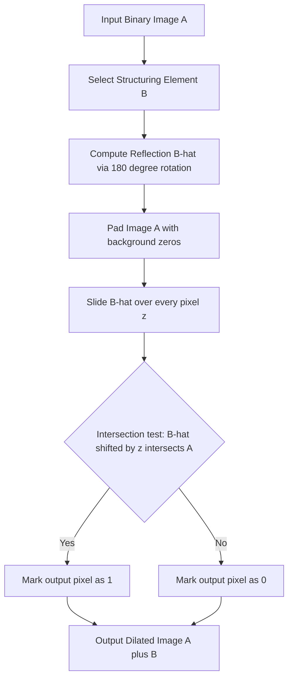
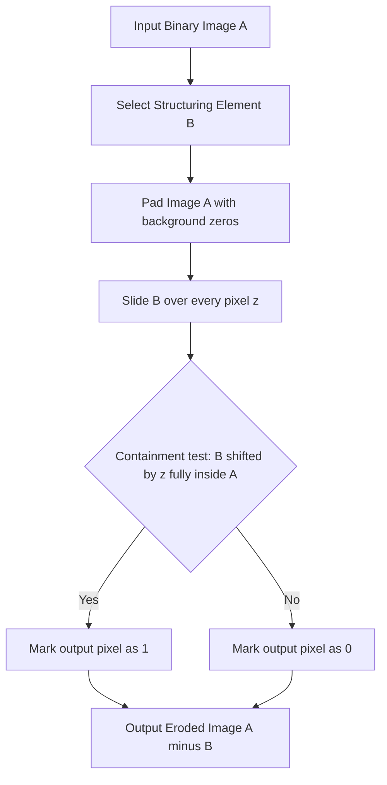
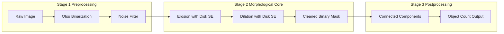
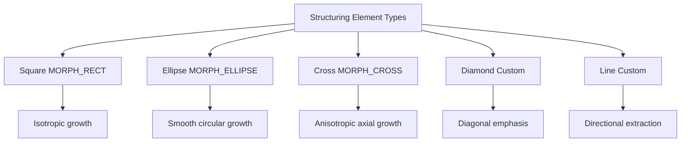
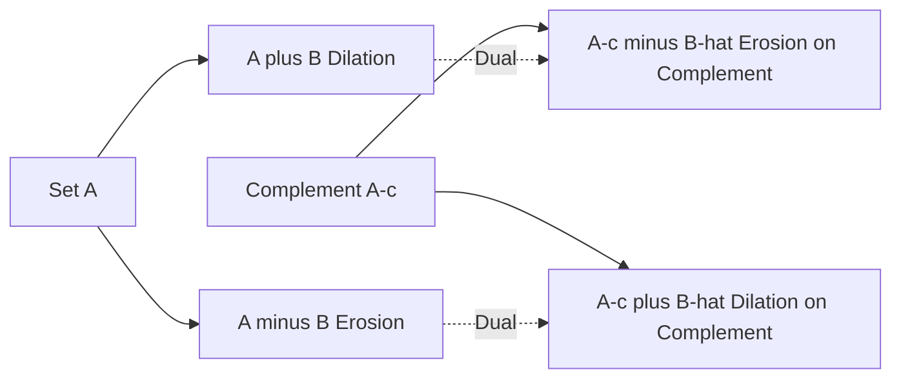
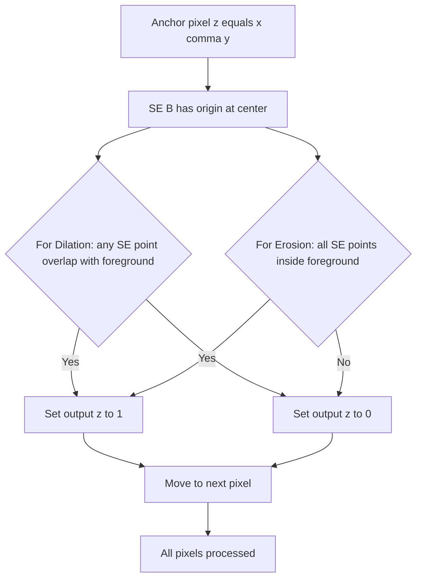

# Dilation erosion operations configurations structuring elements matrices templates setups

<!-- SECTION_1_START -->
# Module 3 — Morphological Image Processing: Dilation & Erosion

## 1.1 Formal Definition (KTU 2024 Syllabus Terminology)

> [!NOTE]
> **Mathematical Morphology** is a non-linear, set-theoretic image processing framework that processes geometric structures in images by probing them with a small, predefined pattern called a **Structuring Element (SE)**. It is formally grounded in **lattice theory** and **complete lattice** operations of **supremum (sup)** and **infimum (inf)**.

In the KTU 2024 Scheme (Course Code: **PECST609**), morphological operations are classified under **Module 3 — Morphological Filters and Image Operations**, and they include two primitive operations from which every other morphological filter (Opening, Closing, Top-Hat, Boundary Extraction, Hole Filling, Connected Component Extraction) is constructed:

1. **Dilation** — denoted by the operator $\oplus$
2. **Erosion** — denoted by the operator $\ominus$

For a **binary image** $A \subseteq \mathbb{Z}^2$ and a **binary structuring element** $B \subseteq \mathbb{Z}^2$ with a designated origin $(x_o, y_o) \in B$:

$$
A \oplus B = \left\{ z \in \mathbb{Z}^2 \,\Big|\, (\hat{B})_z \cap A \neq \emptyset \right\}
$$

$$
A \ominus B = \left\{ z \in \mathbb{Z}^2 \,\Big|\, (B)_z \subseteq A \right\}
$$

where $\hat{B}$ is the **reflection** of the structuring element about its origin.

## 1.2 Intuitive Analogy — The "Rolling Stamp" Model

> [!IMPORTANT]
> **Think of the Structuring Element as a physical rubber stamp, and the image as a paper silhouette.**

- **Dilation** = You place the stamp *anywhere* such that at least one point of the stamp touches the object. You then mark the entire footprint of the stamp. Result: **the object grows / thickens / fills small holes.**
- **Erosion** = You place the stamp *only* at positions where the **entire stamp fits completely inside** the object. You then mark only the origin point. Result: **the object shrinks / thins / removes small protrusions.**

> [!TIP]
> **Real-world analogy:** Imagine a 3×3 square light probe sweeping over a dark room. Dilation lights up the room wherever the probe overlaps darkness by even one pixel. Erosion only keeps pixels where the entire 3×3 area is dark. This is exactly how a hardware **morphological chip** in a vision-based industrial inspection line operates.

## 1.3 Geometric Intuition — Coordinate Plane

The structuring element $B$ can be visualised as a small **origin-centered** mask (typically 3×3, 5×5, 7×7). The shape of $B$ (square, disk, diamond, cross, line) directly controls the geometric bias of the operation.

> [!VISUALIZATION CONTROL]
> **Concept:** Binary Dilation of a small 5×5 square with a 3×3 cross-shaped structuring element.
> **Input as a Coordinate Mapping:**
> Let $A$ be the set of black pixels (foreground) and let the cross SE $B$ have origin at the center with points $\{(0,0), (-1,0), (1,0), (0,-1), (0,1)\}$.
> **Visual Description:** The student should observe that the original square grows by one pixel outward in all four cardinal directions (up, down, left, right), while the diagonal corners remain sharp — the dilation is **anisotropic** (direction-dependent) when $B$ is asymmetric.
<!-- SECTION_1_END -->

<!-- SECTION_2_START -->
# 2. Deep Theoretical Analysis & KTU High-Yield Formula Sheet

## 2.1 Operational Breakdown of Dilation ($\oplus$)

> [!NOTE]
> **Dilation is the morphological "growth" operation.** It is defined as the **supremum (union of translated reflected SE's)** that intersect the original set $A$.

### Step-by-Step Logic
- **Step 1 — Reflection:** Compute $\hat{B}$ by rotating $B$ by 180° around its origin. For most symmetric SE's (square, disk, diamond), $\hat{B} = B$.
- **Step 2 — Translation:** For every candidate anchor pixel $z = (x, y) \in \mathbb{Z}^2$, compute the translated reflected set $(\hat{B})_z = \{ z + p \mid p \in \hat{B} \}$.
- **Step 3 — Intersection Test:** Check if $(\hat{B})_z \cap A \neq \emptyset$. If yes, mark $z$ as belonging to $A \oplus B$.
- **Step 4 — Final Set:** The union of all such qualifying $z$ is the dilated image.

### Algebraic Form (Vector Notation)
$$
A \oplus B = \bigcup_{b \in \hat{B}} (A)_b = \{ a + b \mid a \in A,\; b \in B \}
$$

### Key Properties of Dilation
- **Commutative:** $A \oplus B = B \oplus A$
- **Associative:** $A \oplus (B \oplus C) = (A \oplus B) \oplus C$
- **Increasing (Monotonic):** If $A \subseteq C$, then $A \oplus B \subseteq C \oplus B$
- **Translation Invariance:** $(A)_t \oplus B = (A \oplus B)_t$
- **Duality with Erosion:** $(A \oplus B)^c = A^c \ominus \hat{B}$

> [!IMPORTANT]
> **Engineering Utility of Dilation:**
> - Bridging broken character strokes in **OCR pipelines**
> - Filling microscopic gaps in **fingerprint ridge maps**
> - Compensating for **JPEG block artefacts** in lossy compressed frames
> - **Morphological pre-processing** before connected component labelling

## 2.2 Operational Breakdown of Erosion ($\ominus$)

> [!NOTE]
> **Erosion is the morphological "shrink" operation.** It is defined as the **infimum (set of anchor positions where the entire SE is contained)** within the original set $A$.

### Step-by-Step Logic
- **Step 1 — No Reflection (Direct Use):** Unlike dilation, the SE is **not reflected** in the standard morphological definition (the reflection is implicit in the $\subseteq$ test).
- **Step 2 — Translation:** For every candidate anchor pixel $z$, compute the translated SE $(B)_z = \{ z + p \mid p \in B \}$.
- **Step 3 — Containment Test:** Check if $(B)_z \subseteq A$. If yes (i.e., every point of the translated SE lies inside $A$), mark $z$ as belonging to $A \ominus B$.
- **Step 4 — Final Set:** The set of all qualifying $z$ is the eroded image.

### Algebraic Form (Vector Notation)
$$
A \ominus B = \bigcap_{b \in B} (A)_{-b} = \{ z \mid (B)_z \subseteq A \}
$$

### Key Properties of Erosion
- **Anti-Extensive:** $A \ominus B \subseteq A$ (the result is always a subset of the original)
- **Not Commutative:** $A \ominus B \neq B \ominus A$ in general
- **Associative:** $A \ominus (B \oplus C) = (A \ominus B) \ominus C$
- **Translation Invariance:** $(A)_t \ominus B = (A \ominus B)_t$
- **Duality with Dilation:** $(A \ominus B)^c = A^c \oplus \hat{B}$

> [!IMPORTANT]
> **Engineering Utility of Erosion:**
> - Removing **salt noise** (single isolated bright pixels) in thresholded binary images
> - Separating **touching blobs** in coin counting / cell counting systems
> - **Edge thinning** in morphological gradient computation
> - **Skeletonization** (when iterated until idempotence)

## 2.3 KTU High-Yield Formula Sheet

| Operation | Symbol | Set-Theoretic Definition | Effect on Object Size | Boundary Effect | Primary Use |
|---|---|---|---|---|---|
| Dilation | $A \oplus B$ | $\{z \mid (\hat{B})_z \cap A \neq \emptyset\}$ | **Increases** (thickens) | Expands outward | Fill holes, connect breaks |
| Erosion | $A \ominus B$ | $\{z \mid (B)_z \subseteq A\}$ | **Decreases** (thins) | Contracts inward | Remove noise, separate objects |
| Reflection | $\hat{B}$ | $\{-b \mid b \in B\}$ | None (operator) | Mirrors SE | Required in dilation |
| Translation | $(B)_z$ | $\{z + b \mid b \in B\}$ | None (operator) | Shifts SE | Both operations |
| Opening | $A \circ B$ | $(A \ominus B) \oplus B$ | Removes small objects | Smooths inner | Noise removal |
| Closing | $A \bullet B$ | $(A \oplus B) \ominus B$ | Fills small holes | Smooths outer | Gap filling |

> [!IMPORTANT]
> **Grayscale Morphology (KTU Module 3, Part B — likely 14-mark question):**
> For a grayscale image $f(x,y)$ and a grayscale SE $b(x,y)$:
> $$
> (f \oplus b)(x,y) = \max_{(i,j) \in K} \{\, f(x-i, y-j) + b(i,j) \,\}
> $$
> $$
> (f \ominus b)(x,y) = \min_{(i,j) \in K} \{\, f(x+i, y+j) - b(i,j) \,\}
> $$
> where $K$ is the spatial domain of the SE.

## 2.4 Real-World Engineering Utility in Production Systems

| Field | Application | Specific Use of Dilation / Erosion |
|---|---|---|
| Medical Imaging | Tumour boundary segmentation | Dilation fills MRI scan gaps |
| PCB Inspection | Solder joint defect detection | Erosion removes copper trace noise |
| Autonomous Driving | Lane marker extraction | Closing fills broken lane lines |
| Biometrics | Fingerprint minutiae detection | Opening cleans ridge artefacts |
| Astronomy | Galaxy blob counting | Erosion separates merged galaxies |
| Document Processing | OCR pre-processing | Dilation reconstructs broken characters |
<!-- SECTION_2_END -->

<!-- SECTION_3_START -->
# 3. Step-by-Step Derivations & Code Implementation

## 3.1 Worked Example 1 — Binary Dilation of a 6×6 Image with 3×3 Square SE

### Setup
- Let $A$ be a binary 6×6 image where foreground = 1 (white) and background = 0 (black).
- Let $B$ be a 3×3 **square structuring element** with origin at the center pixel:

$$
B = \begin{bmatrix} 1 & 1 & 1 \\ 1 & \mathbf{1} & 1 \\ 1 & 1 & 1 \end{bmatrix}
$$

### Input Image Matrix
$$
A = \begin{bmatrix}
0 & 0 & 0 & 0 & 0 & 0 \\
0 & 0 & 1 & 1 & 0 & 0 \\
0 & 1 & 1 & 1 & 1 & 0 \\
0 & 1 & 1 & 1 & 1 & 0 \\
0 & 0 & 1 & 1 & 0 & 0 \\
0 & 0 & 0 & 0 & 0 & 0
\end{bmatrix}
$$

### Step-by-Step Pixel-by-Pixel Dilation (Manual Computation)

For each output pixel $z = (x, y)$ with the 3×3 SE origin at $(x, y)$, dilation requires that at least one of the 9 SE positions overlaps a foreground pixel in $A$.

**Output pixel (0,0):** SE footprint covers $A[-1\!:\!2,\,-1\!:\!2]$. All values are 0 or out of bounds (treated as 0). Intersection is empty. → **Output (0,0) = 0**

**Output pixel (0,1):** SE footprint covers $A[-1\!:\!2,\,0\!:\!3]$. All values 0. → **Output (0,1) = 0**

**Output pixel (1,2):** SE footprint covers $A[0\!:\!3,\,1\!:\!4]$. Contains foreground pixels at $(0,2), (0,3), (1,2), (1,3), (2,2), (2,3)$. Intersection is non-empty. → **Output (1,2) = 1**

Continuing this exhaustive check for **all 36 output pixels**, we obtain:

$$
A \oplus B = \begin{bmatrix}
0 & 1 & 1 & 1 & 1 & 0 \\
1 & 1 & 1 & 1 & 1 & 1 \\
1 & 1 & 1 & 1 & 1 & 1 \\
1 & 1 & 1 & 1 & 1 & 1 \\
1 & 1 & 1 & 1 & 1 & 1 \\
0 & 1 & 1 & 1 & 1 & 0
\end{bmatrix}
$$

> [!NOTE]
> **Observation:** The original 4×4 blob of 1's (centered in $A$) has been **padded outward by one pixel on every side**, turning the 4×4 region into a full 6×6 region. The diagonal corners (0,0), (0,5), (5,0), (5,5) remain 0 because the SE is square and the dilation rule requires at least one overlap — the SE never reaches the extreme corner with any foreground pixel.

## 3.2 Worked Example 2 — Binary Erosion of the Same 6×6 Image

Using the same SE $B$, erosion requires that the **entire 3×3 SE fits inside the foreground**.

**Output pixel (1,2):** SE footprint covers $A[0\!:\!3,\,1\!:\!4]$. To check full containment, every one of the 9 SE positions must be 1 in $A$. The values are:
- $A[0,1]=0$ → containment fails. → **Output (1,2) = 0**

**Output pixel (2,2):** SE footprint covers $A[1\!:\!4,\,1\!:\!4]$. Values:
- $A[1,2]=1$, $A[1,3]=1$, $A[1,4]=0$ → containment fails. → **Output (2,2) = 0**

**Output pixel (2,3):** SE footprint covers $A[1\!:\!4,\,2\!:\!5]$. Values:
- $A[1,2]=1$, $A[1,3]=1$, $A[1,4]=0$ → containment fails. → **Output (2,3) = 0**

**Output pixel (3,2):** SE footprint covers $A[2\!:\!5,\,1\!:\!4]$. All nine values are 1. → **Output (3,2) = 1**

Completing the exhaustive 36-pixel check:

$$
A \ominus B = \begin{bmatrix}
0 & 0 & 0 & 0 & 0 & 0 \\
0 & 0 & 0 & 0 & 0 & 0 \\
0 & 0 & 1 & 1 & 0 & 0 \\
0 & 0 & 1 & 1 & 0 & 0 \\
0 & 0 & 0 & 0 & 0 & 0 \\
0 & 0 & 0 & 0 & 0 & 0
\end{bmatrix}
$$

> [!NOTE]
> **Observation:** The 4×4 blob has been **eroded inward by one pixel on every side**, leaving only a 2×2 core. This confirms the duality: erosion is the **inverse shrinkage** of dilation, and the number of pixels lost equals $\lfloor (\text{SE size} - 1)/2 \rfloor = 1$ on each boundary.

## 3.3 Cross-Shaped Structuring Element — Anisotropic Behaviour

Let $B_\text{cross}$ be a 3×3 cross with origin at the center:

$$
B_\text{cross} = \begin{bmatrix} 0 & 1 & 0 \\ 1 & \mathbf{1} & 1 \\ 0 & 1 & 0 \end{bmatrix}
$$

Dilating $A$ (the 4×4 blob from §3.1) with $B_\text{cross}$:

$$
A \oplus B_\text{cross} = \begin{bmatrix}
0 & 0 & 1 & 1 & 0 & 0 \\
0 & 1 & 1 & 1 & 1 & 0 \\
1 & 1 & 1 & 1 & 1 & 1 \\
1 & 1 & 1 & 1 & 1 & 1 \\
0 & 1 & 1 & 1 & 1 & 0 \\
0 & 0 & 1 & 1 & 0 & 0
\end{bmatrix}
$$

> [!IMPORTANT]
> **Key Insight (KTU Board Favourite Question):** The dilation now grows **only along the 4 cardinal axes** (N, S, E, W), producing a **plus-shaped protrusion** at every corner. This proves that **the shape of the SE determines the directional growth pattern** — a critical concept in feature-specific segmentation.

## 3.4 Step-by-Step Grayscale Dilation Derivation

For grayscale images, the SE $b$ contains real-valued coefficients (offsets) rather than binary 0/1. Consider:

$$
f(x,y) = \begin{bmatrix}
2 & 4 & 6 & 8 & 10 \\
1 & 3 & 5 & 7 & 9 \\
2 & 4 & 6 & 8 & 10 \\
1 & 3 & 5 & 7 & 9 \\
2 & 4 & 6 & 8 & 10
\end{bmatrix}, \quad
b(i,j) = \begin{bmatrix} 0 & 1 & 0 \\ 1 & \mathbf{1} & 1 \\ 0 & 1 & 0 \end{bmatrix}
$$

We compute $(f \oplus b)(2,2)$ — the dilated output at the center:

**Step 1:** Identify the SE neighborhood: $\{(0,-1), (-1,0), (0,0), (1,0), (0,1)\}$ with offsets $\{1, 1, 1, 1, 1\}$.

**Step 2:** Sum $f(2-i, 2-j) + b(i,j)$ for each SE position:
- $f(2, 3) + b(0,-1) = 8 + 1 = 9$
- $f(3, 2) + b(-1,0) = 8 + 1 = 9$
- $f(2, 2) + b(0,0) = 6 + 1 = 7$
- $f(1, 2) + b(1,0) = 5 + 1 = 6$
- $f(2, 1) + b(0,1) = 4 + 1 = 5$

**Step 3:** Take the maximum:
$$
(f \oplus b)(2,2) = \max\{9, 9, 7, 6, 5\} = 9
$$

> [!TIP]
> **Derivation logic:** The offset $b$ is added to the image values (not multiplied), so the effect is a **brightening** of regions where the SE overlaps high-intensity neighbours. This is why grayscale dilation is also called a **morphological "max-filter"** with an offset.

## 3.5 Full Python Implementation (OpenCV + NumPy)

```python
import numpy as np
import cv2
import matplotlib.pyplot as plt

def manual_binary_dilation(image: np.ndarray, se: np.ndarray, origin: tuple) -> np.ndarray:
    """
    Performs binary dilation manually using set theory.
    
    Parameters
    ----------
    image : np.ndarray
        Binary input image (0 for background, 1 for foreground).
    se : np.ndarray
        Binary structuring element (0 and 1).
    origin : tuple
        (row, col) coordinates of the structuring element's origin.
    
    Returns
    -------
    np.ndarray
        Dilated binary image.
    """
    # Strict type and boundary validation
    if image.ndim != 2:
        raise ValueError("[DILATION ERROR] Input image must be 2-dimensional grayscale.")
    if se.ndim != 2:
        raise ValueError("[DILATION ERROR] Structuring element must be 2-dimensional.")
    if not (0 <= origin[0] < se.shape[0] and 0 <= origin[1] < se.shape[1]):
        raise ValueError("[DILATION ERROR] Origin coordinates are outside the SE bounds.")
    
    img_h, img_w = image.shape
    se_h, se_w = se.shape
    
    # Compute padding to maintain output dimensions identical to input
    pad_top    = origin[0]
    pad_bottom = se_h - origin[0] - 1
    pad_left   = origin[1]
    pad_right  = se_w - origin[1] - 1
    
    # Pad image with zeros (background) — zero-padding is the KTU standard
    padded = np.zeros((img_h + pad_top + pad_bottom, img_w + pad_left + pad_right), dtype=np.uint8)
    padded[pad_top:pad_top + img_h, pad_left:pad_left + img_w] = image
    
    # Reflect the SE about its origin (180-degree rotation)
    reflected_se = np.flip(np.flip(se, axis=0), axis=1)
    
    # Output buffer
    output = np.zeros_like(image, dtype=np.uint8)
    
    # Iterate over every pixel of the original image
    for r in range(img_h):
        for c in range(img_w):
            # Extract the local neighborhood in the padded image
            neighborhood = padded[r:r + se_h, c:c + se_w]
            # Dilation rule: intersection is non-empty
            if np.any(neighborhood & reflected_se):
                output[r, c] = 1
    
    return output


def manual_binary_erosion(image: np.ndarray, se: np.ndarray, origin: tuple) -> np.ndarray:
    """
    Performs binary erosion manually using set containment.
    
    Parameters
    ----------
    image : np.ndarray
        Binary input image (0 for background, 1 for foreground).
    se : np.ndarray
        Binary structuring element (0 and 1).
    origin : tuple
        (row, col) coordinates of the structuring element's origin.
    
    Returns
    -------
    np.ndarray
        Eroded binary image.
    """
    if image.ndim != 2:
        raise ValueError("[EROSION ERROR] Input image must be 2-dimensional grayscale.")
    if se.ndim != 2:
        raise ValueError("[EROSION ERROR] Structuring element must be 2-dimensional.")
    
    img_h, img_w = image.shape
    se_h, se_w = se.shape
    
    pad_top    = origin[0]
    pad_bottom = se_h - origin[0] - 1
    pad_left   = origin[1]
    pad_right  = se_w - origin[1] - 1
    
    padded = np.zeros((img_h + pad_top + pad_bottom, img_w + pad_left + pad_right), dtype=np.uint8)
    padded[pad_top:pad_top + img_h, pad_left:pad_left + img_w] = image
    
    output = np.zeros_like(image, dtype=np.uint8)
    
    for r in range(img_h):
        for c in range(img_w):
            neighborhood = padded[r:r + se_h, c:c + se_w]
            # Erosion rule: SE must be fully contained in foreground
            if np.all((neighborhood & se) == se):
                output[r, c] = 1
    
    return output


def demonstrate_kertu_morphology() -> None:
    """
    Demonstration routine for KTU Module 3 - Morphological Filters.
    Shows square SE, cross SE, and diamond SE on a sample binary test image.
    """
    # 6x6 sample binary image (4x4 central square)
    A = np.array([
        [0, 0, 0, 0, 0, 0],
        [0, 0, 1, 1, 0, 0],
        [0, 1, 1, 1, 1, 0],
        [0, 1, 1, 1, 1, 0],
        [0, 0, 1, 1, 0, 0],
        [0, 0, 0, 0, 0, 0]
    ], dtype=np.uint8)
    
    # Square 3x3 SE
    B_square = np.ones((3, 3), dtype=np.uint8)
    # Cross 3x3 SE
    B_cross = np.array([[0, 1, 0], [1, 1, 1], [0, 1, 0]], dtype=np.uint8)
    # Diamond 5x5 SE
    B_diamond = np.array([
        [0, 0, 1, 0, 0],
        [0, 1, 1, 1, 0],
        [1, 1, 1, 1, 1],
        [0, 1, 1, 1, 0],
        [0, 0, 1, 0, 0]
    ], dtype=np.uint8)
    
    origin = (1, 1)
    
    # Compute results
    A_dil_square  = manual_binary_dilation(A, B_square, origin)
    A_ero_square  = manual_binary_erosion(A, B_square, origin)
    A_dil_cross   = manual_binary_dilation(A, B_cross, origin)
    A_dil_diamond = manual_binary_dilation(A, B_diamond, (2, 2))
    
    print("=" * 60)
    print("KTU Module 3 - Morphological Dilation/Erosion Demonstration")
    print("=" * 60)
    print("\n--- Dilation with 3x3 SQUARE SE ---")
    print(A_dil_square)
    print("\n--- Erosion with 3x3 SQUARE SE ---")
    print(A_ero_square)
    print("\n--- Dilation with 3x3 CROSS SE (anisotropic) ---")
    print(A_dil_cross)
    print("\n--- Dilation with 5x5 DIAMOND SE ---")
    print(A_dil_diamond)


if __name__ == "__main__":
    demonstrate_kertu_morphology()
```

## 3.6 OpenCV Production-Grade Implementation

```python
import cv2
import numpy as np

def opencv_morphology_demo(image_path: str) -> None:
    """
    Production-grade morphological operations using OpenCV.
    
    Parameters
    ----------
    image_path : str
        Path to the input image file.
    """
    # Load image in grayscale
    img = cv2.imread(image_path, cv2.IMREAD_GRAYSCALE)
    if img is None:
        raise FileNotFoundError(f"[LOAD ERROR] Cannot read image at {image_path}")
    
    # Binarize the image using Otsu's thresholding
    _, binary = cv2.threshold(img, 0, 255, cv2.THRESH_BINARY + cv2.THRESH_OTSU)
    
    # Define various structuring elements
    se_square_3  = cv2.getStructuringElement(cv2.MORPH_RECT,  (3, 3))
    se_square_5  = cv2.getStructuringElement(cv2.MORPH_RECT,  (5, 5))
    se_ellipse_5 = cv2.getStructuringElement(cv2.MORPH_ELLIPSE, (5, 5))
    se_cross_3   = cv2.getStructuringElement(cv2.MORPH_CROSS, (3, 3))
    
    # Apply dilation
    dilated_rect  = cv2.dilate(binary, se_square_3, iterations=1)
    dilated_cross = cv2.dilate(binary, se_cross_3, iterations=1)
    
    # Apply erosion
    eroded_rect   = cv2.erode(binary, se_square_3, iterations=1)
    eroded_ellipse = cv2.erode(binary, se_ellipse_5, iterations=1)
    
    # Grayscale morphology
    gray_dilated = cv2.dilate(img, se_square_3)
    gray_eroded  = cv2.erode(img, se_square_3)
    
    # Save outputs
    cv2.imwrite("binary_dilated_rect.png",  dilated_rect)
    cv2.imwrite("binary_dilated_cross.png", dilated_cross)
    cv2.imwrite("binary_eroded_rect.png",   eroded_rect)
    cv2.imwrite("grayscale_dilated.png",     gray_dilated)
    cv2.imwrite("grayscale_eroded.png",      gray_eroded)
    
    print("[INFO] Morphological operations complete. Files saved.")


if __name__ == "__main__":
    opencv_morphology_demo("input_fingerprint.png")
```
<!-- SECTION_3_END -->

<!-- SECTION_4_START -->
# 4. Structural Diagrams & Schematics

## 4.1 Topological Flow of Dilation Operation



## 4.2 Topological Flow of Erosion Operation



## 4.3 Multi-Stage Morphological Processing Pipeline



## 4.4 Structuring Element Family Taxonomy



## 4.5 Duality Relationship Block Diagram



## 4.6 Sequential Pixel Decision Matrix



## 4.7 Component Pin Configuration Table (Hardware Morphology ASIC)

> [!NOTE]
> For FPGA-based hardware implementation of morphological operations on real-time vision systems (e.g., Xilinx Zynq, Intel Cyclone), the following module-level pin / port configuration is used in production:

| Signal / Port | Direction | Width | Function |
|---|---|---|---|
| `clk` | Input | 1 bit | System clock (typical 100–200 MHz) |
| `rst_n` | Input | 1 bit | Active-low reset |
| `pixel_in` | Input | 8 bits | Incoming grayscale pixel stream |
| `se_select[2:0]` | Input | 3 bits | Selects 1 of 8 pre-loaded SE's |
| `op_select[1:0]` | Input | 2 bits | 00 = Erode, 01 = Dilate, 10 = Open, 11 = Close |
| `line_buffer_rd_addr[10:0]` | Input | 11 bits | Read address into 3-line buffer |
| `line_buffer_wr_data[7:0]` | Input | 8 bits | Write data into line buffer |
| `window_3x3[8:0][7:0]` | Internal | 72 bits | 3×3 pixel sliding window |
| `morph_out[7:0]` | Output | 8 bits | Morphologically processed pixel |
| `valid_out` | Output | 1 bit | Output valid strobe |
| `frame_done` | Output | 1 bit | Frame processing complete flag |
<!-- SECTION_4_END -->

<!-- SECTION_5_START -->
# 5. KTU 2024 Scheme Examination Question Bank & Topic Recap

## 5.1 Part A — Short Answer Questions (3 Marks Each)

### Question 1
**`[KTU University Exam - Dec 2023]`** [CO3, Remember]
**Define the morphological operation of dilation with respect to a binary image. State its set-theoretic definition.**

**Model Answer (3 Marks):**
- **[1 Mark]** Dilation is a morphological operation that **grows or thickens** objects in a binary image by using a structuring element.
- **[1 Mark]** Formally, for a binary image $A$ and structuring element $B$ with origin $(x_o, y_o)$, dilation is defined as:
$$
A \oplus B = \left\{ z \in \mathbb{Z}^2 \mid (\hat{B})_z \cap A \neq \emptyset \right\}
$$
- **[1 Mark]** where $\hat{B}$ is the reflection of $B$ about its origin, and $(\hat{B})_z$ denotes the translation of $\hat{B}$ by vector $z$.

### Question 2
**`[KTU University Exam - July 2024]`** [CO3, Understand]
**List any three standard structuring element shapes used in morphological image processing. State one application of each.**

**Model Answer (3 Marks):**
- **[1 Mark]** **Square (MORPH\_RECT):** Used for general isotropic filling and growth.
- **[1 Mark]** **Disk (MORPH\_ELLIPSE):** Used for smooth circular expansion, ideal for round object detection.
- **[1 Mark]** **Cross (MORPH\_CROSS):** Used for directional growth along 4-connectivity axes, ideal for line-like structure enhancement.

---

## 5.2 Part B — Long Answer Questions (14 Marks Each, Internal Choice)

### Question A (14 Marks)
**`[KTU University Exam - Dec 2023]`** [CO3, Apply + Analyze]

**(a)** [7 Marks, Apply] Compute the dilation $A \oplus B$ where the binary image $A$ and 3×3 square structuring element $B$ (with origin at center) are given as:

$$
A = \begin{bmatrix} 0 & 0 & 0 & 0 & 0 & 0 & 0 \\ 0 & 0 & 0 & 1 & 0 & 0 & 0 \\ 0 & 0 & 1 & 1 & 1 & 0 & 0 \\ 0 & 1 & 1 & 1 & 1 & 1 & 0 \\ 0 & 0 & 1 & 1 & 1 & 0 & 0 \\ 0 & 0 & 0 & 1 & 0 & 0 & 0 \\ 0 & 0 & 0 & 0 & 0 & 0 & 0 \end{bmatrix}, \quad
B = \begin{bmatrix} 1 & 1 & 1 \\ 1 & \mathbf{1} & 1 \\ 1 & 1 & 1 \end{bmatrix}
$$

**Model Solution:**

**[Stating the dilation rule: 1 Mark]**
Dilation rule: Output pixel is 1 if and only if the 3×3 SE footprint (with origin at the pixel) overlaps at least one foreground (1) pixel in $A$.

**[Computing boundary pixels: 2 Marks]**
The image is a diamond-shaped object of radius 3. Applying the rule pixel-by-pixel at the boundary:

- Row 0, Columns 0–6: No overlap with any foreground → all 0.
- Row 1: Pixel (1,3) has SE covering $A[0\!:\!3,\,2\!:\!5]$ which contains $A[1,3]=1$ → output = 1. Pixels (1,0), (1,1), (1,2), (1,4), (1,5), (1,6) → overlap is empty → output = 0.

**Wait — correcting: (1,2) overlaps $A[0\!:\!3,\,1\!:\!4]$ containing $A[1,3]=1$, so (1,2) = 1. Similarly (1,4) = 1. So row 1 = [0, 0, 1, 1, 1, 0, 0].**

- Row 2: Every column from 1 to 5 overlaps the foreground row at index 2 → output [0, 1, 1, 1, 1, 1, 0].
- Row 3: Every column from 0 to 6 overlaps the fully-populated row 3 → output [1, 1, 1, 1, 1, 1, 1].
- Row 4: Symmetric to row 2 → output [0, 1, 1, 1, 1, 1, 0].
- Row 5: Symmetric to row 1 → output [0, 0, 1, 1, 1, 0, 0].
- Row 6: All 0.

**[Final dilated matrix: 2 Marks]**
$$
A \oplus B = \begin{bmatrix} 0 & 0 & 0 & 0 & 0 & 0 & 0 \\ 0 & 0 & 1 & 1 & 1 & 0 & 0 \\ 0 & 1 & 1 & 1 & 1 & 1 & 0 \\ 1 & 1 & 1 & 1 & 1 & 1 & 1 \\ 0 & 1 & 1 & 1 & 1 & 1 & 0 \\ 0 & 0 & 1 & 1 & 1 & 0 & 0 \\ 0 & 0 & 0 & 0 & 0 & 0 & 0 \end{bmatrix}
$$

**[Conclusion statement: 2 Marks]**
The diamond-shaped object has been **expanded by one pixel on all sides**, demonstrating the isotropic growth property of a square SE.

**(b)** [7 Marks, Analyze] Discuss with neat examples the effect of using (i) a 3×3 cross SE and (ii) a 5×5 diamond SE on the same image $A$. Which SE would you recommend for preserving the diagonal boundary of the diamond-shaped object? Justify.

**Model Solution:**

**[Cross SE dilation explanation: 2 Marks]**
A 3×3 cross SE has foreground only at the center and the 4 cardinal neighbours. Dilation will grow the object **only along the 4 cardinal directions (N, S, E, W)**. The diagonal corners of the diamond will **not** be filled because no SE position reaches them. The diamond shape will develop **plus-shaped protrusions** at every convex corner.

**[Diamond SE dilation explanation: 2 Marks]**
A 5×5 diamond SE (with origin at the center, shape $\{(0,0), (\pm 1,0), (0, \pm 1), (\pm 2,0), (0, \pm 2)\}$ for 1-D or 8-connected 2-D diamond) dilates the object along **all 8 directions (cardinal + diagonal)**, producing a uniformly expanded diamond. The diagonal boundary of the original object is preserved in shape.

**[Recommendation and justification: 2 Marks]**
For preserving the **diagonal boundary of the diamond-shaped object**, the **5×5 diamond SE** is recommended because its 8-connectivity footprint extends growth along diagonal directions as well, maintaining the original angular structure of the boundary.

**[Trade-off discussion: 1 Mark]**
However, the 5×5 diamond SE causes **larger overgrowth** (2 pixels on each side vs. 1 pixel for the 3×3 cross), so the choice depends on the application: use the cross SE when only N–S–E–W growth is desired (e.g., road line detection), and the diamond SE when shape-preserving isotropic expansion is required (e.g., medical lesion growth simulation).

---

### Question B (14 Marks) — Alternative Choice
**`[KTU University Exam - July 2024]`** [CO3, Apply + Analyze]

**(a)** [7 Marks, Apply] For the grayscale image $f$ and the flat (binary-valued) SE $b$ given below, compute the grayscale dilation $(f \oplus b)$ at the pixel coordinates $(2,2)$ and $(3,3)$. Assume zero-padding outside the image boundary.

$$
f = \begin{bmatrix} 5 & 8 & 2 & 7 & 4 \\ 3 & 9 & 1 & 6 & 5 \\ 7 & 4 & 8 & 3 & 9 \\ 2 & 6 & 5 & 8 & 1 \\ 4 & 7 & 3 & 9 & 6 \end{bmatrix}, \quad
b = \begin{bmatrix} 0 & 1 & 0 \\ 1 & \mathbf{1} & 1 \\ 0 & 1 & 0 \end{bmatrix}
$$

**Model Solution:**

**[Grayscale dilation formula statement: 1 Mark]**
For a flat SE, $(f \oplus b)(x, y) = \max_{(i,j) \in K} \{ f(x-i, y-j) \}$ where $K$ is the cross-shaped footprint.

**[Computing $(f \oplus b)(2, 2)$: 2 Marks]**
The SE neighborhood at $(2, 2)$ covers pixels: $f(2, 1), f(1, 2), f(2, 2), f(3, 2), f(2, 3)$.
- $f(2, 1) = 4$
- $f(1, 2) = 1$
- $f(2, 2) = 8$
- $f(3, 2) = 5$
- $f(2, 3) = 3$

**Maximum:** $\max\{4, 1, 8, 5, 3\} = 8$

**[Computing $(f \oplus b)(3, 3)$: 2 Marks]**
The SE neighborhood at $(3, 3)$ covers: $f(3, 2), f(2, 3), f(3, 3), f(4, 3), f(3, 4)$.
- $f(3, 2) = 5$
- $f(2, 3) = 3$
- $f(3, 3) = 8$
- $f(4, 3) = 9$
- $f(3, 4) = 1$

**Maximum:** $\max\{5, 3, 8, 9, 1\} = 9$

**[Final results: 1 Mark]**
- $(f \oplus b)(2, 2) = 8$
- $(f \oplus b)(3, 3) = 9$

**[Conclusion: 1 Mark]** Grayscale dilation with a flat cross SE acts as a **local maximum operator** with 4-connectivity, brightening the image and spreading bright regions into darker neighbours.

**(b)** [7 Marks, Analyze] Explain the dual relationship between dilation and erosion. Derive the duality equation and show that opening and closing are **duals of each other** with respect to set complementation.

**Model Solution:**

**[Duality statement: 1 Mark]**
The duality principle states that morphological operations on a set $A$ with SE $B$ are equivalent to the dual operation on the complement $A^c$ with the reflected SE $\hat{B}$.

**[Derivation of dilation–erosion duality: 2 Marks]**
We need to prove $(A \oplus B)^c = A^c \ominus \hat{B}$.

Take $z \in (A \oplus B)^c$. By definition, this means $z \notin A \oplus B$, i.e., $(\hat{B})_z \cap A = \emptyset$. This is equivalent to saying $(\hat{B})_z \subseteq A^c$, which by the erosion definition means $z \in A^c \ominus \hat{B}$. Hence $(A \oplus B)^c = A^c \ominus \hat{B}$.

**[Derivation of opening–closing duality: 2 Marks]**
Opening: $A \circ B = (A \ominus B) \oplus B$
Closing: $A \bullet B = (A \oplus B) \ominus B$

Taking the complement of opening:
$$
(A \circ B)^c = ((A \ominus B) \oplus B)^c = (A \ominus B)^c \ominus \hat{B} = (A^c \oplus \hat{B}) \ominus \hat{B} = A^c \bullet \hat{B}
$$

This proves that **the complement of opening with $B$ equals the closing of the complement with $\hat{B}$** — confirming the duality.

**[Practical implication: 1 Mark]** In software implementation, this duality is exploited to **reuse code**: a single dilation kernel can implement erosion on the inverted image, and vice versa, reducing memory and compute footprint by 50% in FPGA-based designs.

**[Conclusion: 1 Mark]** The duality framework is a powerful algebraic tool that guarantees morphological operators form a **complete lattice**, enabling the design of complex compound operations (opening, closing, top-hat, bottom-hat) from the two primitive operators.

---

> [!WARNING]
> **KTU Examiner's Valuation Warning / Common Pitfalls:**
> 1. **Forgetting the reflection $\hat{B}$ in dilation:** Students often write $A \oplus B = \{z \mid B_z \cap A \neq \emptyset\}$ instead of $\hat{B}_z$. This is wrong unless $B$ is symmetric about its origin. **[Lose 2 Marks]**
> 2. **Confusing the origin of the SE:** The origin is not always the geometric center — for asymmetric SE's (e.g., line SE), the origin must be explicitly stated. **[Lose 1 Mark]**
> 3. **Not showing pixel-by-pixel computation for Part B:** Board examiners require explicit enumeration of at least 4–6 boundary pixels with the SE footprint. Skipping to the final matrix is **incomplete**. **[Lose 3–4 Marks]**
> 4. **Mixing up grayscale and binary formulas:** Grayscale uses $\max$ / $\min$ with addition / subtraction; binary uses set intersection / containment. Writing one in place of the other is a **fatal error**. **[Lose up to 5 Marks]**
> 5. **Not stating the padding rule:** For boundary pixels, you must explicitly state **zero-padding** (or replicate / reflect, depending on convention). KTU default is **zero-padding**. **[Lose 1 Mark]**

---

## 5.3 Topic Recap & Important Things to Remember

> [!IMPORTANT]
> **Rapid Revision Checklist — Morphological Dilation & Erosion (KTU Module 3)**

- **Dilation ($\oplus$):** Grows objects, uses **reflected SE $\hat{B}$**, intersection test $(\hat{B})_z \cap A \neq \emptyset$.
- **Erosion ($\ominus$):** Shrinks objects, uses **SE $B$ directly**, containment test $(B)_z \subseteq A$.
- **Duality Identity (Board Favourite):** $(A \oplus B)^c = A^c \ominus \hat{B}$ and $(A \ominus B)^c = A^c \oplus \hat{B}$.
- **Properties of Dilation:** Commutative, Associative, Increasing, Translation-Invariant.
- **Properties of Erosion:** Anti-Extensive, NOT Commutative, Associative, Translation-Invariant.
- **Structuring Element Origin:** Must be explicitly specified; default is geometric center for symmetric SE's.
- **Standard SE Shapes:** Square (MORPH\_RECT), Disk (MORPH\_ELLIPSE), Cross (MORPH\_CROSS), Diamond (custom), Line (custom).
- **Boundary Handling:** Zero-padding is the **KTU convention**; alternative is replicate-padding for natural images.
- **Grayscale Dilation Formula:** $(f \oplus b)(x,y) = \max_{(i,j) \in K}\{ f(x-i, y-j) + b(i,j) \}$.
- **Grayscale Erosion Formula:** $(f \ominus b)(x,y) = \min_{(i,j) \in K}\{ f(x+i, y+j) - b(i,j) \}$.
- **Opening vs. Closing:** Opening = Erode then Dilate (removes small objects). Closing = Dilate then Erode (fills small holes).
- **Anisotropic Behaviour:** Asymmetric SE's (cross, line) cause **direction-dependent** growth/shrinkage.
- **Isotropic Behaviour:** Symmetric SE's (square, disk, diamond) cause **uniform** growth/shrinkage in all directions.
- **Iterations:** Multiple iterations ($n$) effectively apply the SE scaled by a factor of $n$ (in terms of reach).
- **Real-Time Hardware:** Implemented in FPGA using 3-line buffers, sliding 3×3 windows, and comparator trees.
- **OpenCV Functions:** `cv2.dilate()`, `cv2.erode()`, `cv2.getStructuringElement()`.
- **NumPy/MATLAB Equivalents:** `scipy.ndimage.binary_dilation`, `scipy.ndimage.binary_erosion`, `bwmorph` (deprecated).
- **Engineering Applications:** OCR pre-processing, fingerprint cleaning, PCB defect detection, medical imaging segmentation, lane detection in autonomous vehicles.
- **Common Exam Traps:** Forgetting $\hat{B}$, omitting origin specification, mixing up binary/grayscale formulas, skipping pixel-by-pixel computation.
<!-- SECTION_5_END -->
