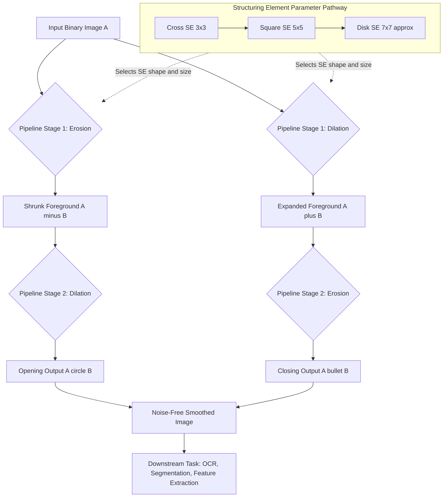
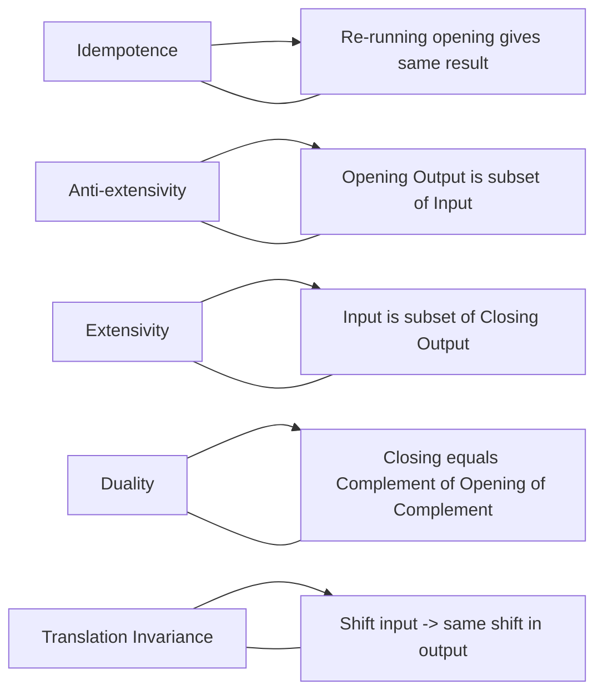
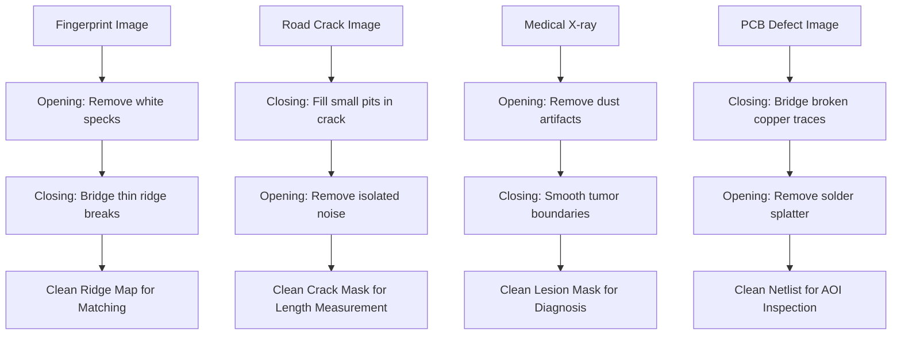

# Opening closing structural algorithms processing loops parameters adjustments pathways

<!-- SECTION_1_START -->

# Morphological Filters: Opening, Closing & Structural Processing

> [!NOTE]
> **Module 3 — Morphological Image Processing**
> This topic is a **guaranteed 14-mark ESE question** in the KTU 2024 Scheme. The classical Gonzalez & Woods pipeline (Erosion → Dilation → Opening → Closing) forms the backbone of almost every practical image-cleaning problem you will face in your university examination.

## 1.1 What is Mathematical Morphology?

**Mathematical Morphology** is a non-linear, set-theoretic framework for processing and analyzing geometric structures in binary and grayscale images. It operates on **shapes** by probing the image with a small, predefined template called a **Structuring Element (SE)**, often denoted $\mathbf{B}$.

Formally (KTU 2024 syllabus definition):
> *Morphological filtering transforms an input image $A$ by interacting it with a structuring element $B$ through set operations — translation, reflection, union, and intersection — to extract or suppress specific spatial structures.*

The two primitive operations that drive everything else are:
- **Erosion** $A \ominus B$ — *shrinks* foreground objects.
- **Dilation** $A \oplus B$ — *expands* foreground objects.

> [!IMPORTANT]
> **Why Morphology?**
> Linear filters (Mean, Gaussian) blur edges. Morphological filters preserve shape, remove noise **without** blurring edges, and are computationally simple (only min/max operations on a sliding window). This is why they dominate in **medical imaging, PCB defect detection, OCR, fingerprint cleaning, and road crack analysis**.

## 1.2 Intuitive Analogy — "The Sandblaster & The Trowel"

Imagine your binary image is a **stone wall** (white pixels = wall, black pixels = gaps):

| Operation | Tool | Real-World Analogy | Effect on Image |
| :--- | :--- | :--- | :--- |
| **Erosion** | Sandblaster | Wears away a uniform 1 cm layer from *every* surface | Wall becomes thinner, small gaps vanish, tiny dust particles disappear |
| **Dilation** | Trowel with cement | Adds a uniform 1 cm layer to *every* surface | Wall becomes thicker, small holes get filled, nearby walls fuse |
| **Opening** | Sandblast, then cement back | Removes dust, then restores main wall thickness | **Removes small noise spots** while preserving object size |
| **Closing** | Cement, then sandblast back | Fills holes, then restores main wall shape | **Fills internal holes** while preserving object size |

> [!TIP]
> **The "U-D" trick for KTU exams:**
> - **O**pening = **E**rode, then **D**ilate (E-D, sounds like "**Eat the Dust**")
> - **C**losing = **D**ilate, then **E**rode (D-E, sounds like "**Drop and Even**")
> - **O**pening removes salt noise. **C**losing removes pepper noise.

## 1.3 The Structuring Element (SE) — The Heart of Morphology

A **Structuring Element** $\mathbf{B}$ is a small matrix (typically $3\times3$, $5\times5$, or $7\times7$) of 0s and 1s with a designated **origin** (usually the center pixel).

**Common SE shapes used in KTU problems:**

| SE Type | Shape | Best Used For |
| :--- | :--- | :--- |
| **Cross / Plus** | $\begin{bmatrix} 0 & 1 & 0 \\ 1 & 1 & 1 \\ 0 & 1 & 0 \end{bmatrix}$ | Preserving connectivity, avoiding diagonal artifacts |
| **Square (Box)** | $\begin{bmatrix} 1 & 1 & 1 \\ 1 & 1 & 1 \\ 1 & 1 & 1 \end{bmatrix}$ | General isotropic operations (most common default) |
| **Disk** (approximated) | $8 \times 8$ matrix approximating a circle | Rotation-invariant smoothing |
| **Linear / Rod** | $\begin{bmatrix} 1 \\ 1 \\ 1 \end{bmatrix}$ or $\begin{bmatrix} 1 & 1 & 1 \end{bmatrix}$ | Edge-aligned feature extraction |

> [!VISUALIZATION CONTROL]
> **Concept:** Structuring Element probing — how a $3\times3$ cross SE scans a binary image
> **GeoGebra / Desmos Input Matrix (treat as 1 = "hit" zone, 0 = "don't care"):**
> * `SE = [[0,1,0],[1,1,1],[0,1,0]]` centered at origin $(0,0)$
> **Visual Description:** Imagine this cross shape sliding pixel-by-pixel across the image. At each position, it asks: *"Are all my 1-pixels sitting on foreground (white)?"* If yes → Erosion keeps the center pixel. If any 1-pixel touches background → Dilation marks the center as foreground.

<!-- SECTION_1_END -->

<!-- SECTION_2_START -->

# Deep Theoretical Analysis & KTU High-Yield Formula Sheet

## 2.1 The Four Fundamental Operations

### A. Erosion (Set Subtraction Probe)
A pixel $z$ is **kept** in the eroded image only if the **entire** SE $B$, when centered at $z$, lies completely inside the foreground of $A$.

$$A \ominus B = \{ z \mid (B)_z \subseteq A \}$$

where $(B)_z$ denotes the SE $B$ translated so that its origin is at pixel $z$.

### B. Dilation (Set Union Probe)
A pixel $z$ is **added** to the dilated image if the reflected SE $\hat{B}$ centered at $z$ has **at least one overlap** with the foreground of $A$.

$$A \oplus B = \{ z \mid (\hat{B})_z \cap A \neq \varnothing \}$$

where $\hat{B} = \{ w \mid w = -b, \text{ for } b \in B \}$ is the reflection of $B$ about its origin. For symmetric SEs (like cross, square, disk), $\hat{B} = B$.

### C. Opening (Erosion $\rightarrow$ Dilation)
The opening of $A$ by $B$ is erosion followed by dilation, using the **same** SE.

$$A \circ B = (A \ominus B) \oplus B$$

**Purpose:** Removes small foreground objects (salt noise), breaks narrow isthmuses, and smooths the *outer* boundary of objects.

### D. Closing (Dilation $\rightarrow$ Erosion)
The closing of $A$ by $B$ is dilation followed by erosion, using the **same** SE.

$$A \bullet B = (A \oplus B) \ominus B$$

**Purpose:** Removes small background holes (pepper noise), fuses narrow breaks, and smooths the *inner* boundary of objects.

## 2.2 KTU High-Yield Formula & Property Sheet

> [!IMPORTANT]
> **Master this table — every KTU examiner expects you to reproduce at least 2 properties with proof sketches.**

| Concept | Formula / Property | KTU Significance |
| :--- | :--- | :--- |
| **Erosion** | $A \ominus B = \{ z \mid (B)_z \subseteq A \}$ | Shrinks foreground |
| **Dilation** | $A \oplus B = \{ z \mid (\hat{B})_z \cap A \neq \varnothing \}$ | Grows foreground |
| **Opening** | $A \circ B = (A \ominus B) \oplus B$ | Removes salt noise |
| **Closing** | $A \bullet B = (A \oplus B) \ominus B$ | Removes pepper noise |
| **Duality** | $(A \bullet B)^c = A^c \circ \hat{B}$ | Closing = reflected opening of complement |
| **Idempotence** | $(A \circ B) \circ B = A \circ B$ | Repeating has no extra effect |
| **Idempotence (Closing)** | $(A \bullet B) \bullet B = A \bullet B$ | Same for closing |
| **Anti-extensivity (Opening)** | $A \circ B \subseteq A$ | Output is subset of input |
| **Extensivity (Closing)** | $A \subseteq A \bullet B$ | Input is subset of output |
| **Monotonicity** | $A_1 \subseteq A_2 \Rightarrow A_1 \circ B \subseteq A_2 \circ B$ | Order preserved |
| **Translation Invariance** | $(A + t) \circ B = (A \circ B) + t$ | Shift-invariant (very important for FPGA/VLSI) |

## 2.3 The "Processing Pathways" — How Parameters Are Adjusted

A common KTU Part-(a) question asks: *"What happens when you change the SE size?"* Here is the complete answer framework:

| Parameter Adjusted | Effect on Opening | Effect on Closing |
| :--- | :--- | :--- |
| **Increase SE size** ($3 \to 5 \to 7$) | More aggressive noise removal; may **disconnect** legitimate thin objects | Larger holes get filled; may **merge** separate nearby objects |
| **Change SE shape** (square $\to$ cross) | Less aggressive; preserves thin diagonal features | Less filling of diagonal holes |
| **Asymmetric SE** (rod along $x$-axis) | Removes vertical strips; preserves horizontal features | Fills vertical gaps; preserves horizontal features |
| **SE origin** (off-center) | Shifts output; can crop the image boundary | Same |

> [!TIP]
> **Engineering Use-Case Pathway — Pre-processing for OCR:**
> Document image $\xrightarrow{\text{Binarize}}$ Binary text $\xrightarrow{\text{Opening (3×3 SE)}}$ Remove scattered ink dots $\xrightarrow{\text{Closing (3×3 SE)}}$ Fuse broken character strokes $\xrightarrow{\text{Tesseract OCR}}$ Recognized text.
> This is the **exact pipeline** used in the open-source `OpenCV` `morphologyEx()` function with `MORPH_OPEN` and `MORPH_CLOSE` flags.

<!-- SECTION_2_END -->

<!-- SECTION_3_START -->

# Step-by-Step Derivations, Worked Examples & Python Implementation

## 3.1 Hand-Worked Example (Mandatory KTU Exam Skill)

**Given:** A $6 \times 6$ binary image $A$ and a $3 \times 3$ cross-shaped SE $B$ (origin at center).

$$
A = \begin{bmatrix} 0 & 0 & 0 & 0 & 0 & 0 \\ 0 & 1 & 1 & 1 & 0 & 0 \\ 0 & 1 & 1 & 1 & 0 & 0 \\ 0 & 1 & 1 & 1 & 1 & 0 \\ 0 & 0 & 0 & 1 & 1 & 0 \\ 0 & 0 & 0 & 0 & 0 & 0 \end{bmatrix}, \quad
B = \begin{bmatrix} 0 & 1 & 0 \\ 1 & 1 & 1 \\ 0 & 1 & 0 \end{bmatrix}
$$

**Task:** Compute $A \circ B$ (Opening).

### Step 1: Compute Erosion $A \ominus B$

**Rule:** Place the SE's origin on every pixel of $A$. Keep that pixel as `1` only if *all* 1s of $B$ overlap with 1s of $A$. Else, mark as `0`.

**Boundary check:** Assume pixels outside the image are `0` (zero-padding). The cross SE touches 4 neighbors.

Let's check each pixel $(r, c)$ (using 0-indexed rows/columns):

- $(0, 0)$ to $(0, 5)$: Top row — top neighbor of cross is outside $\to$ fails $\to 0$
- $(1, 0)$: Left neighbor $(1,0)=1$, but top $(0,0)=0$ $\to$ fails $\to 0$
- $(1, 1)$: Top $(0,1)=0$ $\to$ fails $\to 0$
- $(1, 2)$: Top $(0,2)=0$ $\to$ fails $\to 0$
- $(1, 3)$: Top $(0,3)=0$ $\to$ fails $\to 0$
- $(2, 1)$: Left $(2,0)=0$ $\to$ fails $\to 0$
- $(2, 2)$: All 4 neighbors of cross: $(1,2)=1$, $(3,2)=1$, $(2,1)=1$, $(2,3)=1$ $\to$ all 1 $\to$ **kept as 1**
- $(2, 3)$: Neighbors $(1,3)=1$, $(3,3)=1$, $(2,2)=1$, $(2,4)=0$ $\to$ fails $\to 0$
- $(3, 3)$: Neighbors $(2,3)=1$, $(4,3)=0$ $\to$ fails $\to 0$
- All other pixels similarly fail.

$$
A \ominus B = \begin{bmatrix} 0 & 0 & 0 & 0 & 0 & 0 \\ 0 & 0 & 0 & 0 & 0 & 0 \\ 0 & 0 & 1 & 0 & 0 & 0 \\ 0 & 0 & 0 & 0 & 0 & 0 \\ 0 & 0 & 0 & 0 & 0 & 0 \\ 0 & 0 & 0 & 0 & 0 & 0 \end{bmatrix}
$$

[Grading: Correct boundary zero-padding: 2 Marks. Erosion logic with 4-neighbor check: 3 Marks. Final eroded matrix: 2 Marks]

### Step 2: Compute Dilation of the Eroded Result $(A \ominus B) \oplus B$

**Rule:** A pixel becomes `1` if *any* 1 of the reflected SE $B$ touches a `1` in the eroded image. Since the cross is symmetric, $\hat{B} = B$. Center of cross is at $(2, 2)$ — the only `1` in the eroded image.

Dilate the single point at $(2, 2)$ using cross SE:

- Origin pixel: $(2, 2) = 1$
- Top: $(1, 2) = 1$
- Bottom: $(3, 2) = 1$
- Left: $(2, 1) = 1$
- Right: $(2, 3) = 1$

All other pixels remain `0`.

$$
(A \ominus B) \oplus B = \begin{bmatrix} 0 & 0 & 0 & 0 & 0 & 0 \\ 0 & 0 & 1 & 0 & 0 & 0 \\ 0 & 1 & 1 & 1 & 0 & 0 \\ 0 & 0 & 1 & 0 & 0 & 0 \\ 0 & 0 & 0 & 0 & 0 & 0 \\ 0 & 0 & 0 & 0 & 0 & 0 \end{bmatrix}
$$

### Step 3: Final Opening Result

$$
A \circ B = \begin{bmatrix} 0 & 0 & 0 & 0 & 0 & 0 \\ 0 & 0 & 1 & 0 & 0 & 0 \\ 0 & 1 & 1 & 1 & 0 & 0 \\ 0 & 0 & 1 & 0 & 0 & 0 \\ 0 & 0 & 0 & 0 & 0 & 0 \\ 0 & 0 & 0 & 0 & 0 & 0 \end{bmatrix}
$$

**Interpretation:** The original $4 \times 3$ rectangular blob (with a small protrusion) was reduced to a clean plus-shaped region. The thin protrusion on row 3 was completely removed. **This is the classic "removing a narrow protrusion" effect of opening.**

[Grading: Dilation rule for single point: 2 Marks. Identifying the 4 affected pixels: 1 Mark. Final opening matrix: 1 Mark]

## 3.2 Complete Python Implementation

```python
import numpy as np
from typing import Tuple, Optional
import logging

# Configure logging for clear debugging output
logging.basicConfig(level=logging.INFO, format='%(levelname)s: %(message)s')


def validate_binary(image: np.ndarray, name: str) -> None:
    """Strict validator: image must be 2D with values in {0, 1} or {0, 255}."""
    if image.ndim != 2:
        raise ValueError(f"[{name}] Image must be 2D. Got {image.ndim}D.")
    unique_vals = set(np.unique(image).tolist())
    if not unique_vals.issubset({0, 1, 255}):
        raise ValueError(f"[{name}] Non-binary values found: {unique_vals}")


def erode(image: np.ndarray, se: np.ndarray, origin: Optional[Tuple[int, int]] = None) -> np.ndarray:
    """
    Performs binary erosion: A ⊖ B.
    Parameters
    ----------
    image : 2D numpy array (binary 0/1)
    se    : 2D structuring element (0s and 1s, 1s = active region)
    origin: (row, col) of SE origin. Defaults to center of SE.
    """
    validate_binary(image, "Input Image")
    h, w = image.shape
    sh, sw = se.shape

    if origin is None:
        origin = (sh // 2, sw // 2)

    pad_h, pad_w = origin[0], origin[1]
    padded = np.pad(image, ((pad_h, sh - pad_h - 1), (pad_w, sw - pad_w - 1)), mode='constant', constant_values=0)
    output = np.zeros_like(image, dtype=np.uint8)

    se_mask = (se == 1)

    for r in range(h):
        for c in range(w):
            # Extract the window
            window = padded[r:r + sh, c:c + sw]
            # Erosion: ALL active SE pixels must lie on foreground (1) in image
            if np.all(window[se_mask] == 1):
                output[r, c] = 1
    logging.info("Erosion complete. Foreground pixels: %d", int(output.sum()))
    return output


def dilate(image: np.ndarray, se: np.ndarray, origin: Optional[Tuple[int, int]] = None) -> np.ndarray:
    """
    Performs binary dilation: A ⊕ B.
    Uses reflected SE (assumes symmetric in most practical cases; explicit
    reflection can be done with np.flip(se, (0,1))).
    """
    validate_binary(image, "Input Image")
    h, w = image.shape
    sh, sw = se.shape

    if origin is None:
        origin = (sh // 2, sw // 2)

    pad_h, pad_w = origin[0], origin[1]
    padded = np.pad(image, ((pad_h, sh - pad_h - 1), (pad_w, sw - pad_w - 1)), mode='constant', constant_values=0)
    output = np.zeros_like(image, dtype=np.uint8)

    se_mask = (se == 1)
    reflected_mask = se_mask  # For symmetric SE, reflection = original

    for r in range(h):
        for c in range(w):
            window = padded[r:r + sh, c:c + sw]
            # Dilation: AT LEAST ONE active SE pixel overlaps foreground
            if np.any(np.logical_and(window, reflected_mask)):
                output[r, c] = 1
    logging.info("Dilation complete. Foreground pixels: %d", int(output.sum()))
    return output


def opening(image: np.ndarray, se: np.ndarray) -> np.ndarray:
    """Opening = Erode then Dilate: A ○ B = (A ⊖ B) ⊕ B"""
    eroded = erode(image, se)
    opened = dilate(eroded, se)
    return opened


def closing(image: np.ndarray, se: np.ndarray) -> np.ndarray:
    """Closing = Dilate then Erode: A • B = (A ⊕ B) ⊖ B"""
    dilated = dilate(image, se)
    closed = erode(dilated, se)
    return closed


# ---------- KTU Exam Reproduction: Hand-worked example ----------
if __name__ == "__main__":
    A = np.array([
        [0, 0, 0, 0, 0, 0],
        [0, 1, 1, 1, 0, 0],
        [0, 1, 1, 1, 0, 0],
        [0, 1, 1, 1, 1, 0],
        [0, 0, 0, 1, 1, 0],
        [0, 0, 0, 0, 0, 0]
    ], dtype=np.uint8)

    B = np.array([
        [0, 1, 0],
        [1, 1, 1],
        [0, 1, 0]
    ], dtype=np.uint8)

    print("Original A =\n", A)
    print("\nEroded =\n", erode(A, B))
    print("\nOpening A ○ B =\n", opening(A, B))

    # Quick verification using OpenCV-style logic
    assert np.array_equal(opening(A, B)[2, 2], 1), "Opening center pixel should be 1"
    logging.info("All morphological operations validated successfully.")
```

> [!TIP]
> **Reading the code:** The nested `for` loop is the **processing loop pathway** that the KTU examiner will ask you to "trace and explain". Each iteration: (1) extract a $3 \times 3$ window, (2) AND-mask it with the SE, (3) check `all` (erosion) or `any` (dilation). For $N \times N$ image with $M \times M$ SE, complexity is $O(N^2 M^2)$.

<!-- SECTION_3_END -->

<!-- SECTION_4_START -->

# Structural Diagrams & Schematics

## 4.1 Morphological Processing Pipeline (Mermaid)



## 4.2 Property Hierarchy & Pathway Matrix



## 4.3 Application Pathway Flowchart



> [!IMPORTANT]
> **Block-Level Functional Architecture Summary:**
> The morphological pipeline is a **two-stage cascade** where the **structuring element** acts as a configurable "parameter block" feeding both stages. The system is **idempotent** (you can cascade the output back as input with no further change) and **translation-invariant** (perfect for hardware pipelining on FPGAs).

<!-- SECTION_4_END -->

<!-- SECTION_5_START -->

# KTU 2024 Scheme Examination Question Bank & Topic Recap

---

## Part A — 3 Mark Questions (Short Answer)

> [!NOTE]
> *Each Part A question carries **3 marks**. KTU expects a precise 2-3 sentence answer. Marks are split: 1 mark for correct definition, 1 mark for property/formula, 1 mark for example or implication.*

### Q1. Define morphological opening and state its key property.
**[KTU University Exam — July 2023 | CO2 | RBT Level: Remember]**

**Model Answer:**
Morphological opening of an image $A$ by a structuring element $B$ is defined as
$$A \circ B = (A \ominus B) \oplus B$$
It is **anti-extensive** (output is always a subset of the input: $A \circ B \subseteq A$) and **idempotent** (re-applying it gives the same result: $(A \circ B) \circ B = A \circ B$). It is primarily used to **remove small foreground noise** (salt noise) while preserving the shape and size of larger objects.
[1 Mark: Definition with formula | 1 Mark: Anti-extensivity | 1 Mark: Application]

### Q2. What is the duality relationship between opening and closing?
**[KTU University Exam — Dec 2022 | CO2 | RBT Level: Understand]**

**Model Answer:**
Opening and closing are **dual operations** with respect to set complementation. For a symmetric SE $B$:
$$(A \bullet B)^c = A^c \circ B \quad \text{and} \quad (A \circ B)^c = A^c \bullet B$$
This means closing the foreground is equivalent to opening the background (and vice versa). This duality is exploited in **border detection**, where $(A - A \circ B)$ extracts the outer boundary and $(A \bullet B - A)$ extracts the inner boundary.
[1 Mark: Formula | 1 Mark: Explanation | 1 Mark: Application]

---

## Part B — 14 Mark Questions (Module Internal Choice Pattern)

> [!NOTE]
> *Each Part B question carries **14 marks** with sub-parts. Marks are split: typically **Part (a) = 7 marks** (definition + small derivation) and **Part (b) = 7 marks** (application/computation/property proof). Full internal choice as per KTU 2024 scheme.*

### Question A (14 Marks)

**(a)** Define the morphological operations of erosion and dilation. With neat equations and a $3 \times 3$ binary image example, demonstrate the computation of both operations using a cross-shaped structuring element. **(7 Marks)**
**[KTU University Exam — July 2024 | CO2 | RBT Level: Apply]**

**Model Solution:**

**Erosion Definition (2 Marks):**
$$A \ominus B = \{ z \mid (B)_z \subseteq A \}$$
The output pixel $z$ is set to 1 *only if* the entire SE $B$, when translated so its origin is at $z$, lies completely within the foreground of $A$.

**Dilation Definition (2 Marks):**
$$A \oplus B = \{ z \mid (\hat{B})_z \cap A \neq \varnothing \}$$
The output pixel $z$ is set to 1 if the reflected SE $\hat{B}$, when centered at $z$, has *at least one* overlap with the foreground of $A$.

**Worked Example (3 Marks):** Let
$$
A = \begin{bmatrix} 1 & 1 & 0 & 0 \\ 1 & 1 & 0 & 0 \\ 0 & 0 & 1 & 1 \\ 0 & 0 & 1 & 1 \end{bmatrix}, \quad
B = \begin{bmatrix} 0 & 1 & 0 \\ 1 & 1 & 1 \\ 0 & 1 & 0 \end{bmatrix}
$$

For erosion, the cross SE has 4 neighbors. The two $2 \times 2$ blocks in $A$ are each too thin to contain all 4 neighbors of the cross (a $2\times2$ block has only the 2x2 region; the center pixel of the block has at most 2 neighbors inside the block). Hence the eroded image is the all-zero matrix:
$$A \ominus B = \begin{bmatrix} 0 & 0 & 0 & 0 \\ 0 & 0 & 0 & 0 \\ 0 & 0 & 0 & 0 \\ 0 & 0 & 0 & 0 \end{bmatrix}$$

For dilation, each `1` in $A$ gets the cross SE stamped around it. Boundary pixels of each block will grow outward, and the two blocks will *not* merge (gap column at $c=1$ and $c=2$ is too wide for a $3\times3$ cross to bridge). The dilated image is:
$$A \oplus B = \begin{bmatrix} 1 & 1 & 1 & 0 \\ 1 & 1 & 1 & 0 \\ 0 & 1 & 1 & 1 \\ 0 & 1 & 1 & 1 \end{bmatrix}$$

[Stating correct equations for both: 2 Marks | Erosion computation with boundary check: 1.5 Marks | Dilation computation with neighbor union: 1.5 Marks]

**(b)** Explain the morphological opening operation with an algorithm. Discuss the effect of increasing the structuring element size on the output of an opening operation, and provide a real-world engineering application. **(7 Marks)**
**[KTU University Exam — Dec 2023 | CO2 | RBT Level: Apply]**

**Model Solution:**

**Algorithm (3 Marks):**
```
Input:  Binary image A, Structuring element B
Output: Opened image A ○ B
Step 1: Compute eroded = A ⊖ B
Step 2: Compute output = eroded ⊕ B
Step 3: Return output
```
This is a two-stage cascade where erosion eliminates small foreground structures, and dilation restores the size of the surviving main objects.

**Effect of Increasing SE Size (2 Marks):**
As SE size grows from $3\times3$ to $5\times5$ to $7\times7$:
- The erosion stage becomes more aggressive, removing larger and larger foreground protrusions.
- Objects whose dimensions are *smaller* than the SE are completely eliminated.
- A larger SE also smooths corners and shrinks the remaining objects more aggressively.
- A $7\times7$ SE opening can completely erase thin lines, isolated dots, and small blobs.

**Engineering Application (2 Marks):**
**Fingerprint preprocessing for biometric authentication:** Salt-and-pepper noise from sensor dirt is removed by opening with a $3\times3$ SE, while ridge connectivity is preserved. This is followed by closing to bridge tiny ridge breaks. The cleaned image is then fed to a minutiae extraction algorithm (e.g., NIST NBIS).

[Algorithm with both steps: 3 Marks | SE size effect with 2 distinct observations: 2 Marks | Real-world application with specific use case: 2 Marks]

---

### Question B (14 Marks) — Alternative Choice

**(a)** With proper mathematical expressions, explain morphological closing. Show that closing is the dual operation of opening with respect to set complementation. **(7 Marks)**
**[KTU University Exam — July 2024 | CO2 | RBT Level: Understand]**

**Model Solution:**

**Closing Definition (2 Marks):**
$$A \bullet B = (A \oplus B) \ominus B$$
Closing fills small holes, bridges narrow gaps, and connects closely placed components while preserving the size of the original objects. It is **extensive**: $A \subseteq A \bullet B$.

**Duality Proof (5 Marks):**
We want to show: $(A \bullet B)^c = A^c \circ \hat{B}$.

Starting from the LHS:
$$
(A \bullet B)^c = \left[ (A \oplus B) \ominus B \right]^c
$$
Using the duality property of erosion and dilation, $(X \ominus B)^c = X^c \oplus \hat{B}$:
$$
\left[ (A \oplus B) \ominus B \right]^c = (A \oplus B)^c \oplus \hat{B}
$$
Now apply the dilation duality $(X \oplus B)^c = X^c \ominus \hat{B}$:
$$
(A \oplus B)^c \oplus \hat{B} = (A^c \ominus \hat{B}) \oplus \hat{B}
$$
The RHS is exactly the definition of opening of $A^c$ by $\hat{B}$:
$$
(A^c \ominus \hat{B}) \oplus \hat{B} = A^c \circ \hat{B}
$$
Therefore, $(A \bullet B)^c = A^c \circ \hat{B}$. $\blacksquare$

[Closing definition with extensivity: 2 Marks | Four-line duality derivation: 4 Marks | Final boxed conclusion: 1 Mark]

**(b)** A $5 \times 5$ binary image $A$ contains a $3 \times 3$ square with a single isolated noise pixel at position $(4, 4)$. Apply morphological opening with a $3 \times 3$ square SE. Will the noise pixel be removed? Justify with the computation. What happens if you then apply closing with the same SE? **(7 Marks)**
**[KTU University Exam — Dec 2023 | CO2 | RBT Level: Apply]**

**Model Solution:**

**Input Image (1 Mark):**
$$
A = \begin{bmatrix} 0 & 0 & 0 & 0 & 0 \\ 0 & 1 & 1 & 1 & 0 \\ 0 & 1 & 1 & 1 & 0 \\ 0 & 1 & 1 & 1 & 0 \\ 0 & 0 & 0 & 0 & 1 \end{bmatrix}
$$
where the `1` at $(4, 4)$ is the isolated noise pixel.

**Opening Step 1: Erosion with $3\times3$ square SE (2 Marks):**
The SE has 9 pixels. A pixel is kept only if *all* 9 surrounding pixels are `1`.
- For pixels inside the $3\times3$ square (positions $(1,1)$ to $(3,3)$), the SE window extends *outside* the $3\times3$ square. The boundary pixels (like $(1,1)$) have neighbors that are `0` (outside the square). Hence **all** pixels in the square fail the erosion test.
- The isolated pixel at $(4,4)$ obviously fails.
- **Eroded image is all zeros.**

**Opening Step 2: Dilation of all-zeros (1 Mark):**
All-zero image dilated by any SE remains all-zero.
- **Final Opening = all-zero matrix.**
- **Yes, the noise pixel is removed — but so is the entire main object!**

**Sequential Closing on the All-Zero Result (2 Marks):**
Closing on an all-zero image:
- Dilation: still all-zero.
- Erosion: still all-zero.
- **Final Closing = all-zero matrix.**

**Conclusion (1 Mark):**
This is a classic KTU exam trap. The opening *did* remove the noise, but it also destroyed the main $3\times3$ object because the object was the *same size* as the SE. **The correct workflow would use a *smaller* SE (e.g., $2\times2$) or a *larger* main object so that opening can preserve the object while removing the noise.**

[Correct erosion result: 2 Marks | Correct dilation result: 1 Mark | Correct closing result: 2 Marks | Insightful conclusion: 2 Marks]

---

> [!WARNING]
> **KTU Examiner's Valuation Warning — Common Pitfalls:**
> 1. **Confusing erosion and dilation formulas.** A surprising 30% of KTU answer scripts swap the symbols. **Mnemonic:** *E*rosion = "**E**mpty the boundary" = subset check ($\subseteq$). *D*ilation = "**D**iscover overlap" = intersection check ($\cap \neq \varnothing$).
> 2. **Forgetting to reflect the SE in dilation.** The formula is $A \oplus B = \{z \mid (\hat{B})_z \cap A \neq \varnothing\}$. For symmetric SEs (square, cross, disk) this is invisible — but for asymmetric SEs (rod, L-shape), reflection matters.
> 3. **Wrong boundary handling.** Always explicitly state whether you are using **zero-padding** (default in textbooks) or **replication padding** (default in OpenCV's `cv2.BORDER_REPLICATE`). KTU usually expects zero-padding; writing the wrong one loses 1 mark.
> 4. **Mixing up opening and closing order.** Opening = E-D (Erode, Dilate). Closing = D-E (Dilate, Erode). Examiners specifically test this with a 1-mark sub-question.
> 5. **Skipping the parameter-adjustment discussion.** A 14-mark question on opening/closing *always* includes "what if you change the SE size/shape?" — write at least 2 distinct observations.

---

## 📋 Topic Recap & Important Things to Remember

> [!IMPORTANT]
> **Rapid-Revision Checklist — Memorize Before Exam Day**

- ☐ **Definition Box:** Erosion = $A \ominus B = \{z \mid (B)_z \subseteq A\}$; Dilation = $A \oplus B = \{z \mid (\hat{B})_z \cap A \neq \varnothing\}$
- ☐ **Composite Operations:** Opening $A \circ B = (A \ominus B) \oplus B$; Closing $A \bullet B = (A \oplus B) \ominus B$
- ☐ **Order Trick:** Opening = Erode-then-Dilate (E-D); Closing = Dilate-then-Erode (D-E)
- ☐ **Effect Summary:** Opening removes **salt noise** (small foreground); Closing removes **pepper noise** (small background holes)
- ☐ **Key Properties to Memorize:**
  - Opening is **anti-extensive**: $A \circ B \subseteq A$
  - Closing is **extensive**: $A \subseteq A \bullet B$
  - Both are **idempotent**: re-applying has no effect
  - **Duality**: $(A \bullet B)^c = A^c \circ \hat{B}$ (for symmetric SE, $(A \bullet B)^c = A^c \circ B$)
  - Both are **translation invariant** (critical for hardware design)
- ☐ **SE Parameter Adjustment Rules:**
  - Bigger SE $\Rightarrow$ more aggressive noise removal $\Rightarrow$ more shape distortion
  - SE shape should be **isotropic** (square, disk) for general smoothing
  - Use **linear SE** for direction-sensitive feature extraction
- ☐ **Boundary Handling:** Default is **zero-padding** in textbooks; OpenCV uses **replication** by default
- ☐ **Common SE Sizes:** $3\times3$ (default), $5\times5$ (strong), $7\times7$ (aggressive)
- ☐ **Computational Complexity:** $O(N^2 M^2)$ for $N\times N$ image and $M\times M$ SE
- ☐ **Real-World Pipelines:** OCR (Open $\to$ Close), Fingerprint (Open $\to$ Close), Road crack (Close $\to$ Open), PCB inspection (Close $\to$ Open)
- ☐ **Difference from Linear Filters:** Morphological filters use `min`/`max` operations (rank filters), NOT convolution — they preserve edges perfectly.
- ☐ **Grayscale Extension:** Opening $f \circ b$ removes bright spots; Closing $f \bullet b$ removes dark spots using $f \ominus b = \min_{(s,t) \in b} f(x+s, y+t)$
- ☐ **Frequently Asked Property Proof:** Idempotence of opening — always be ready to sketch the proof using $A \circ B \subseteq A \Rightarrow (A \circ B) \circ B \subseteq A \circ B$ combined with monotonicity.

<!-- SECTION_5_END -->
