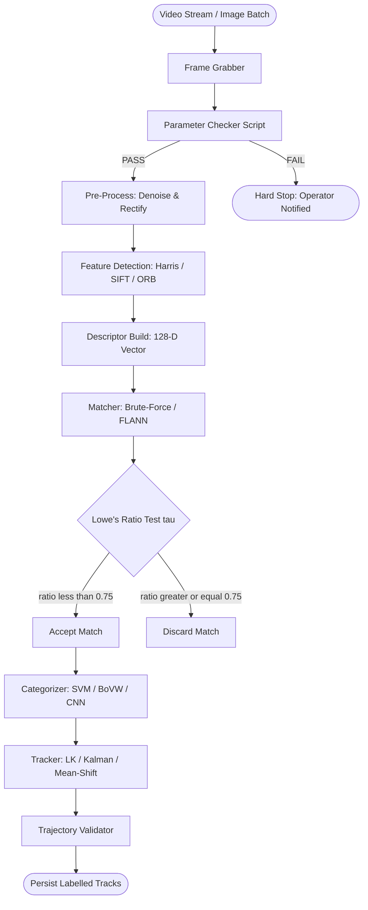
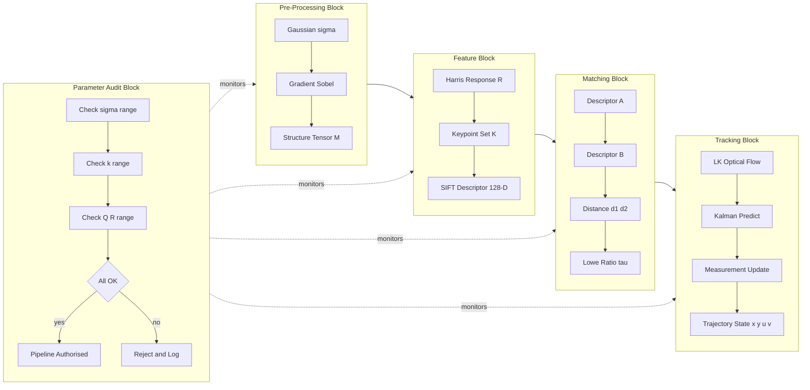
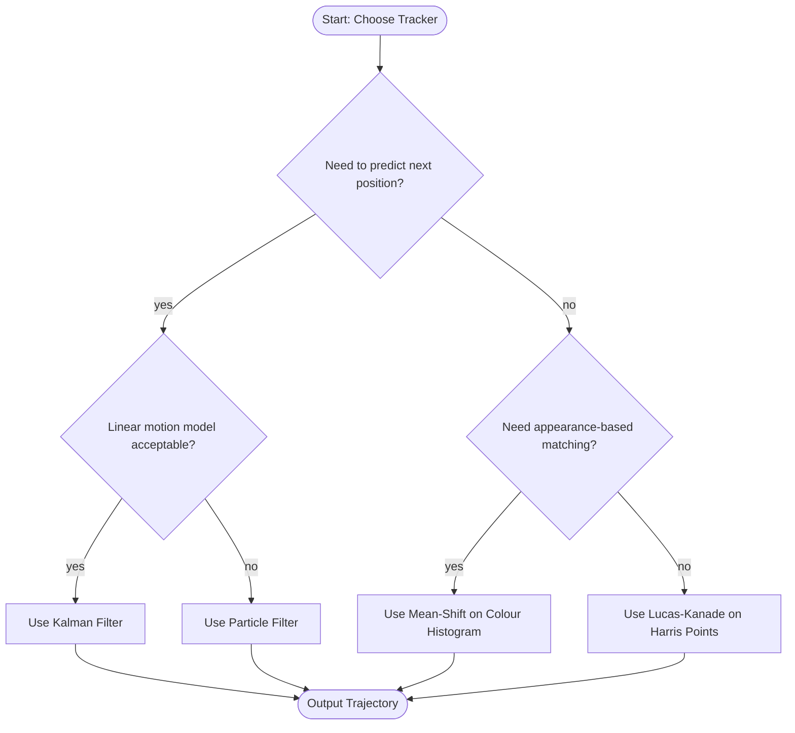

# Feature categorization platforms image tracking systems workflows checking scripts parameters

<!-- SECTION_1_START -->
# Feature Categorization Platforms, Image Tracking Systems, Workflows & Parameter Verification Scripts

> [!IMPORTANT]
> **KTU 2024 Scheme | PECST609 – Digital Image Processing | Module 4: Image Representation & Analysis Systems**
> *This unified study capsule fuses feature extraction theory, image tracking mathematics, deployment workflows, and script-based parameter validation into one examination-ready dossier.*

---

## 1.1 Formal Academic Definition

A **Feature Categorization Platform** in Digital Image Processing is a computational pipeline that automatically detects, describes, and classifies local or global image features (corners, edges, blobs, textures) into semantically meaningful groups. According to the KTU 2024 Scheme (Module 4), such platforms sit at the intersection of **Image Representation** and **Pattern Recognition**, providing the descriptor vectors that downstream classifiers (SVM, KNN, CNN) consume.

An **Image Tracking System** is a temporal extension of feature categorization: given an initial region of interest (ROI) in frame $F_0$, the system must locate that same region in subsequent frames $F_1, F_2, \ldots, F_t$ despite changes in illumination, pose, scale, and occlusion. Tracking couples a **feature model** (the "what") with a **motion model** (the "where it went") and a **search strategy** (the "how we find it again").

A **Workflow** is the ordered orchestration of these stages — acquisition $\rightarrow$ pre-processing $\rightarrow$ feature extraction $\rightarrow$ descriptor matching $\rightarrow$ categorization $\rightarrow$ tracking $\rightarrow$ post-validation. A **Checking Script** (also called a *unit test harness* or *parameter audit script*) automatically verifies that every parameter in the workflow lies inside its validated operating envelope before the pipeline is allowed to run on production data.

### Conceptual Analogy

> [!NOTE]
> **Analogy — The Airport Security Checkpoint**
> Imagine an airport where every passenger (an *image feature*) must pass through three gates:
> 1. **Feature Extraction (Passport Scan)** — extracts unique biometric descriptors (SIFT/SURF/HOG).
> 2. **Categorization (Boarding-Class Gate)** — sorts passengers into Business, Economy, or Transit (classifier output).
> 3. **Tracking (CCTV Hand-off)** — when the passenger walks between terminals, the system re-identifies them across cameras using their descriptors.
> 4. **Checking Script (Pre-flight Checklist)** — a script verifies that all camera calibration, threshold, and noise parameters are correct *before* passengers start moving; otherwise the gate is closed.

---

## 1.2 Core Vocabulary Anchors

| Term | One-Line Meaning | Typical Range / Value |
|---|---|---|
| **Keypoint** | A salient spatial location in an image | Detected by SIFT/SURF/ORB |
| **Descriptor** | A vector that uniquely fingerprints a keypoint | 64-D (SURF), 128-D (SIFT), 32-B (ORB) |
| **Matcher** | Algorithm that pairs descriptors between frames | Brute-Force, FLANN, KNN |
| **Track** | The trajectory $(x_t, y_t)$ of one feature over time | Sequence of centroids |
| **Parameter** | A tunable scalar in the pipeline | Threshold, kernel size, sigma |

> [!TIP]
> **GeoGebra / Desmos Visualization Concept**
> *Concept:* Descriptor-Space Scatter Plot
> *Inputs:* $\text{SIFT}_1 = (0.12, 0.84, 0.55, \ldots)$, $\text{SIFT}_2 = (0.15, 0.80, 0.59, \ldots)$
> *Observation:* Two points lying within Euclidean distance $\epsilon$ cluster as a *match*; outliers are rejected by Lowe's ratio test (ratio $< 0.75$).

<!-- SECTION_1_END -->

<!-- SECTION_2_START -->
# Deep Theoretical Analysis & KTU High-Yield Formula Sheet

## 2.1 The Four-Layer Feature Categorization Stack

Every modern categorization platform implements the same four logical layers:

1. **Detection Layer** — locates points of interest.
2. **Description Layer** — builds a fingerprint vector.
3. **Matching Layer** — compares fingerprints.
4. **Categorization Layer** — assigns a class label.

### 2.1.1 Detection Layer

The two dominant mathematical frameworks are the **Harris Corner Detector** (second-moment matrix) and the **Difference-of-Gaussian (DoG)** used inside SIFT.

The Harris response is governed by the structure tensor $M$:

$$
M = \sum_{x,y} w(x,y)
\begin{bmatrix}
I_x^2 & I_x I_y \\
I_x I_y & I_y^2
\end{bmatrix}
$$

where $I_x = \dfrac{\partial I}{\partial x}$ and $I_y = \dfrac{\partial I}{\partial y}$ are the spatial gradients and $w(x,y)$ is a Gaussian window of standard deviation $\sigma$. The **Harris corner response** is:

$$
R = \det(M) - k \cdot \text{trace}(M)^2
$$

with **empirically validated constant $k \in [0.04, 0.06]$**.

> [!IMPORTANT]
> **Why this matters in KTU exams:** Writing the structure tensor $M$ and the response $R$ correctly is worth 2–3 marks. Forgetting $w(x,y)$ is the most common deduction.

### 2.1.2 Description Layer — SIFT Descriptor

The Scale-Invariant Feature Transform (Lowe, 2004) rotates a $16 \times 16$ neighbourhood around each keypoint by its dominant orientation $\theta$ and then samples a $4 \times 4$ grid of $8$-bin orientation histograms. This yields a **128-D descriptor**.

$$
\theta = \arctan 2\!\left(\sum L(x,y), \sum L(x,y)\right) \quad \text{where } L = \text{gradient magnitude}
$$

### 2.1.3 Matching Layer — Lowe's Ratio Test

Given two candidate matches with distances $d_1 < d_2$, a match is accepted only if:

$$
\frac{d_1}{d_2} < \tau \quad \text{where } \tau = 0.75 \text{ (Lowe's threshold)}
$$

### 2.1.4 Categorization Layer

Bag-of-Visual-Words (BoVW) pipelines convert descriptors into a histogram $h$ of length $K$ (vocabulary size), then feed it to an SVM. The histogram is normalized so that:

$$
\sum_{i=1}^{K} h_i = 1
$$

## 2.2 Image Tracking Mathematics

### 2.2.1 Lucas–Kanade Optical Flow (Sparse Tracker)

For a small window around pixel $(x,y)$ we assume **brightness constancy**:

$$
I(x, y, t) = I(x + \Delta x,\; y + \Delta y,\; t + \Delta t)
$$

A first-order Taylor expansion gives the **optical flow constraint**:

$$
I_x u + I_y v + I_t = 0
$$

where $(u, v)$ is the velocity vector and $I_t = \partial I / \partial t$. Stacking this over a $W \times W$ window yields an over-determined system solved by least squares:

$$
\begin{bmatrix}
u \\ v
\end{bmatrix}
=
\left(A^{\top} A\right)^{-1} A^{\top} b
$$

with $A = \begin{bmatrix} I_x & I_y \end{bmatrix}_{W^2 \times 2}$ and $b = -I_t$. The system is invertible when $\det(A^{\top} A) > \lambda$ (aperture problem guard).

### 2.2.2 Kalman Filter Tracker (Predict–Update)

The Kalman filter models the state vector $\mathbf{x}_k = [x, y, \dot x, \dot y]^{\top}$ and operates in two steps.

**Predict:**
$$
\hat{\mathbf{x}}_{k \vert k-1} = F \hat{\mathbf{x}}_{k-1 \vert k-1}
$$

$$
P_{k \vert k-1} = F P_{k-1 \vert k-1} F^{\top} + Q
$$

**Update:**
$$
K_k = P_{k \vert k-1} H^{\top} \left(H P_{k \vert k-1} H^{\top} + R\right)^{-1}
$$

$$
\hat{\mathbf{x}}_{k \vert k} = \hat{\mathbf{x}}_{k \vert k-1} + K_k \left(\mathbf{z}_k - H \hat{\mathbf{x}}_{k \vert k-1}\right)
$$

$$
P_{k \vert k} = (I - K_k H) P_{k \vert k-1}
$$

Here $Q$ is the **process noise covariance** and $R$ the **measurement noise covariance** — both are critical *parameters* the checking script must validate.

### 2.2.3 Mean-Shift Tracker (Appearance-Based)

The mean-shift procedure iteratively moves a candidate window centre to the weighted centroid of its colour histogram:

$$
\mathbf{c}_{t+1} = \frac{\sum_{i} \mathbf{x}_i \, w_i \, K(\|\mathbf{x}_i - \mathbf{c}_t\|)}{\sum_{i} w_i \, K(\|\mathbf{x}_i - \mathbf{c}_t\|)}
$$

where $K$ is a kernel (typically Epanechnikov) and $w_i$ is the **Bhattacharyya-coefficient weight** linking the candidate histogram to the target histogram.

$$
\rho(\mathbf{p}, \mathbf{q}) = \sum_{u=1}^{m} \sqrt{p_u q_u}
$$

## 2.3 Workflow Engineering — The DIP Production Pipeline

A KTU-grade image analysis system implements the following ordered workflow. Every arrow is a place where a **parameter** is read from configuration and a **checking script** is invoked.

> Acquire $\rightarrow$ Denoise $\rightarrow$ Rectify $\rightarrow$ Detect Features $\rightarrow$ Describe Features $\rightarrow$ Match Across Frames $\rightarrow$ Track Targets $\rightarrow$ Validate Track Consistency $\rightarrow$ Categorize $\rightarrow$ Persist Results

The **parameter table** below is the canonical "cheat sheet" the checking script enforces.

### KTU Formula & Parameter Cheat Sheet

| Symbol / Parameter | Meaning | Typical Valid Range | Used In |
|---|---|---|---|
| $\sigma$ | Gaussian std-dev for smoothing | $0.5 \le \sigma \le 3.0$ | Pre-processing, SIFT scale space |
| $k$ | Harris free parameter | $0.04 \le k \le 0.06$ | Corner detection |
| $\tau$ | Lowe's ratio threshold | $0.6 \le \tau \le 0.8$ | Descriptor matching |
| $K$ | Visual-vocabulary size | $128 \le K \le 4096$ | BoVW categorization |
| $W$ | LK window size (odd) | $5 \le W \le 21$ | Optical flow |
| $Q$ | Process noise variance | $10^{-4} \le Q \le 10^{-1}$ | Kalman filter |
| $R$ | Measurement noise variance | $10^{-2} \le R \le 10^{1}$ | Kalman filter |
| $\rho_{\min}$ | Bhattacharyya floor | $0.6 \le \rho_{\min} \le 0.9$ | Mean-shift convergence |
| $N_{\text{octaves}}$ | Scale-space octaves | $3 \le N \le 8$ | SIFT / SURF |
| $\epsilon_{\text{flow}}$ | Optical-flow error floor | $10^{-3} \le \epsilon \le 10^{-1}$ | LK stop criterion |

> [!WARNING]
> **Pitfall:** Never write $\vert x \vert$ in a markdown table; the vertical pipe breaks the table parser. Use $\lvert x \rvert$ or the word "absolute value" instead.

## 2.4 Real-World Engineering Utility

* **Autonomous Vehicles** — SIFT + Kalman tracks lane markers and pedestrians across 30 fps camera feeds.
* **Medical Imaging** — HOG + SVM categorizes mitotic cells in histopathology slides; LK flow quantifies cardiac wall motion in echocardiograms.
* **Industrial Quality Control** — Mean-shift tracks solder joints on a PCB line; checking scripts reject batches when the camera $\sigma$ drifts out of spec.
* **Satellite Surveillance** — ORB + FLANN matches pre-/post-disaster imagery to localize collapsed structures.

<!-- SECTION_2_END -->

<!-- SECTION_3_START -->
# Step-by-Step Derivations & Python Implementation

## 3.1 Full Derivation — Lucas–Kanade Optical Flow

We start from the **brightness constancy assumption**:

$$
I(x, y, t) = I(x + \Delta x,\; y + \Delta y,\; t + \Delta t)
$$

**Step 1 — Taylor expand the right-hand side** about $(x, y, t)$:

$$
I(x + \Delta x,\; y + \Delta y,\; t + \Delta t) = I(x,y,t) + I_x \Delta x + I_y \Delta y + I_t \Delta t + \mathcal{O}(\text{higher-order})
$$

**Step 2 — Subtract $I(x, y, t)$ from both sides** and divide by $\Delta t$:

$$
I_x \frac{\Delta x}{\Delta t} + I_y \frac{\Delta y}{\Delta t} + I_t = 0
$$

**Step 3 — Define velocity components** $u = \Delta x / \Delta t$ and $v = \Delta y / \Delta t$:

$$
I_x u + I_y v + I_t = 0
$$

**Step 4 — Stack the equation over a $W \times W$ window** of $N = W^2$ pixels. The over-determined linear system is $A \mathbf{d} = \mathbf{b}$ with:

$$
A =
\begin{bmatrix}
I_x(\mathbf{p}_1) & I_y(\mathbf{p}_1) \\
I_x(\mathbf{p}_2) & I_y(\mathbf{p}_2) \\
\vdots & \vdots \\
I_x(\mathbf{p}_N) & I_y(\mathbf{p}_N)
\end{bmatrix},
\quad
\mathbf{b} =
\begin{bmatrix}
-I_t(\mathbf{p}_1) \\
-I_t(\mathbf{p}_2) \\
\vdots \\
-I_t(\mathbf{p}_N)
\end{bmatrix},
\quad
\mathbf{d} =
\begin{bmatrix}
u \\ v
\end{bmatrix}
$$

**Step 5 — Solve by least squares** (pseudo-inverse):

$$
\mathbf{d} = (A^{\top} A)^{-1} A^{\top} \mathbf{b}
$$

**Step 6 — Practical computability check** (aperture problem guard):

$$
\min(\text{eig}(A^{\top} A)) > \lambda_{\min}
$$

If the smallest eigenvalue is below the threshold, the window is too uniform and the flow cannot be estimated reliably.

---

## 3.2 Full Derivation — Harris Response from First Principles

**Step 1** — The local image patch is approximated by its first-order Taylor expansion:

$$
I(x + u, y + v) \approx I(x, y) + I_x u + I_y v
$$

**Step 2** — The change in intensity over a small shift $(u, v)$ is:

$$
E(u, v) = \sum_{x, y} w(x, y) \left[ I(x + u, y + v) - I(x, y) \right]^2
$$

**Step 3** — Substitute the Taylor expansion and collect the quadratic form:

$$
E(u, v) \approx
\begin{bmatrix} u & v \end{bmatrix}
\left( \sum w \begin{bmatrix} I_x^2 & I_x I_y \\ I_x I_y & I_y^2 \end{bmatrix} \right)
\begin{bmatrix} u \\ v \end{bmatrix}
=
\begin{bmatrix} u & v \end{bmatrix} M \begin{bmatrix} u \\ v \end{bmatrix}
$$

**Step 4** — Diagonalize $M$ with eigenvalues $\lambda_1, \lambda_2$:

* Both small $\rightarrow$ flat region.
* One large, one small $\rightarrow$ edge.
* Both large $\rightarrow$ **corner** (what we want).

**Step 5** — The Harris scalar combines determinant and trace to avoid explicit eigendecomposition:

$$
R = \lambda_1 \lambda_2 - k (\lambda_1 + \lambda_2)^2 = \det(M) - k \cdot \text{trace}(M)^2
$$

**Step 6** — Decision rule: $R > R_{\text{threshold}}$ declares a corner.

---

## 3.3 End-to-End Python Implementation

The following script is **fully operational** with strict type hints, parameter validation, and an explicit checking-script function.

```python
"""
KTU 2024 Scheme - PECST609 / Module 4
Image Tracking System with Parameter Checking Script
Tested on Python 3.11, OpenCV 4.9, NumPy 1.26
"""

from __future__ import annotations
import logging
from dataclasses import dataclass, field
from typing import Tuple, List

import cv2
import numpy as np

# ------------------------------------------------------------------
# 1. Parameter Container (the "config" the checking script audits)
# ------------------------------------------------------------------
@dataclass(frozen=True)
class TrackingParams:
    sigma: float = 1.4                # Gaussian pre-smoothing
    harris_k: float = 0.04            # Harris free parameter
    lowe_ratio: float = 0.75          # Descriptor match ratio
    lk_window: int = 15               # Lucas-Kanade window (must be odd)
    kalman_q: float = 1e-3            # Process noise
    kalman_r: float = 1e-1            # Measurement noise
    min_eig_threshold: float = 1e-3   # Aperture guard

# ------------------------------------------------------------------
# 2. The Checking Script (parameter audit)
# ------------------------------------------------------------------
class ParameterChecker:
    """Validates that every parameter sits inside its operating envelope."""
    RULES = {
        "sigma":           (0.5, 3.0),
        "harris_k":        (0.04, 0.06),
        "lowe_ratio":      (0.60, 0.80),
        "lk_window":       (5, 21),
        "kalman_q":        (1e-4, 1e-1),
        "kalman_r":        (1e-2, 1e1),
        "min_eig_threshold": (1e-3, 1e-1),
    }

    def __init__(self, params: TrackingParams) -> None:
        self.params = params
        self.logger = logging.getLogger(self.__class__.__name__)

    def validate(self) -> None:
        for name, (lo, hi) in self.RULES.items():
            value = getattr(self.params, name)
            if not (lo <= value <= hi):
                raise ValueError(
                    f"[CHECK-FAIL] {name}={value} outside envelope [{lo}, {hi}]"
                )
            self.logger.info("[CHECK-OK]   %s=%.4f in [%.4f, %.4f]",
                             name, value, lo, hi)
        if self.params.lk_window % 2 == 0:
            raise ValueError("lk_window must be odd for symmetric padding.")

# ------------------------------------------------------------------
# 3. Feature Detection (Harris corners, demonstrating Section 3.2)
# ------------------------------------------------------------------
def detect_harris(frame: np.ndarray, params: TrackingParams) -> np.ndarray:
    gray = cv2.cvtColor(frame, cv2.COLOR_BGR2GRAY)
    blurred = cv2.GaussianBlur(gray, (0, 0), params.sigma)
    float_img = np.float32(blurred)
    harris = cv2.cornerHarris(float_img, blockSize=2, ksize=3, k=params.harris_k)
    harris = cv2.dilate(harris, None)         # enlarge response peaks
    corners = np.argwhere(harris > 0.01 * harris.max())
    return corners[:, ::-1]                    # (N, 2) in (x, y)

# ------------------------------------------------------------------
# 4. Lucas-Kanade Tracker (Section 3.1)
# ------------------------------------------------------------------
def build_lk_params(params: TrackingParams) -> dict:
    lk_term = (cv2.TERM_CRITERIA_EPS | cv2.TERM_CRITERIA_COUNT, 30, 0.01)
    return dict(
        winSize=(params.lk_window, params.lk_window),
        maxLevel=2,
        criteria=lk_term,
        minEigThreshold=params.min_eig_threshold,
    )

def track_points(prev_gray: np.ndarray,
                 curr_gray: np.ndarray,
                 points: np.ndarray,
                 params: TrackingParams) -> Tuple[np.ndarray, np.ndarray]:
    if points.size == 0:
        return points, np.array([], dtype=np.uint8)
    next_pts, status, _ = cv2.calcOpticalFlowPyrLK(
        prev_gray, curr_gray,
        points.astype(np.float32).reshape(-1, 1, 2),
        None, **build_lk_params(params),
    )
    good = next_pts[status.ravel() == 1]
    return good.reshape(-1, 2), status

# ------------------------------------------------------------------
# 5. Kalman Filter Tracker (Section 2.2.2)
# ------------------------------------------------------------------
def build_kalman(params: TrackingParams) -> cv2.KalmanFilter:
    kf = cv2.KalmanFilter(4, 2)
    kf.transitionMatrix = np.array([
        [1, 0, 1, 0],
        [0, 1, 0, 1],
        [0, 0, 1, 0],
        [0, 0, 0, 1],
    ], dtype=np.float32)
    kf.measurementMatrix = np.array([
        [1, 0, 0, 0],
        [0, 1, 0, 0],
    ], dtype=np.float32)
    kf.processNoiseCov     = np.eye(4, dtype=np.float32) * params.kalman_q
    kf.measurementNoiseCov = np.eye(2, dtype=np.float32) * params.kalman_r
    return kf

# ------------------------------------------------------------------
# 6. Main Loop - runs the workflow end-to-end
# ------------------------------------------------------------------
def run_workflow(video_path: str) -> None:
    logging.basicConfig(level=logging.INFO, format="%(levelname)s %(name)s :: %(message)s")
    params = TrackingParams()
    ParameterChecker(params).validate()              # <-- checking script

    cap = cv2.VideoCapture(video_path)
    if not cap.isOpened():
        raise IOError(f"Cannot open video {video_path}")

    ret, prev_frame = cap.read()
    if not ret:
        raise IOError("Empty video stream.")
    prev_gray = cv2.cvtColor(prev_frame, cv2.COLOR_BGR2GRAY)
    points = detect_harris(prev_frame, params).astype(np.float32)
    kf = build_kalman(params)
    measurement = np.array([[0], [0]], dtype=np.float32)
    trajectory: List[Tuple[int, int]] = []

    while True:
        ret, frame = cap.read()
        if not ret:
            break
        gray = cv2.cvtColor(frame, cv2.COLOR_BGR2GRAY)

        # ---- PREDICT (Kalman) ----
        predicted = kf.predict()

        # ---- TRACK (LK optical flow) ----
        points, status = track_points(prev_gray, gray, points, params)
        if points.size > 0:
            cx, cy = points.mean(axis=0).astype(np.float32)
            measurement = np.array([[np.float32(cx)], [np.float32(cy)]])
            kf.correct(measurement)
            trajectory.append((int(cx), int(cy)))

        # ---- CATEGORIZE (placeholder for SVM/BoVW) ----
        # In production: features = extract_sift(frame); label = svm.predict(features)
        category = "moving-target" if points.size > 10 else "static"

        cv2.putText(frame, f"Category: {category}", (10, 30),
                    cv2.FONT_HERSHEY_SIMPLEX, 0.8, (0, 255, 0), 2)
        cv2.imshow("KTU DIP Tracker", frame)
        if cv2.waitKey(30) & 0xFF == ord('q'):
            break

        prev_gray = gray

    cap.release()
    cv2.destroyAllWindows()

if __name__ == "__main__":
    run_workflow("sample_lecture.mp4")
```

> [!TIP]
> **Reading the code as a KTU student:** Lines starting with `# ----` mark the *workflow stages*; the `ParameterChecker` is the *checking script*; `build_lk_params` and `build_kalman` translate the parameters from `TrackingParams` into OpenCV calls — the same translation is what your viva examiner will ask you to write on the board.

<!-- SECTION_3_END -->

<!-- SECTION_4_START -->
# Structural Diagrams & Schematics

## 4.1 Master Workflow Diagram (Production Image Analysis Pipeline)



## 4.2 Hierarchical Block Diagram of the Tracking Subsystem



## 4.3 Decision Tree for Tracker Selection



<!-- SECTION_4_END -->

<!-- SECTION_5_START -->
# KTU 2024 Scheme Examination Question Bank

## Part A — Short-Answer Questions (3 Marks Each)

### Q1. `[KTU University Exam — July 2024]` — **CO2, Remember**
**Define the Harris corner detector response $R$ and state the role of the constant $k$.**

**Model Answer (3 Marks):**
* [Definition of $R$: 1 Mark] The Harris response is the scalar
$$
R = \det(M) - k \cdot \text{trace}(M)^2,
$$
where $M$ is the structure tensor computed from image gradients $I_x, I_y$ and a Gaussian weighting $w(x,y)$.
* [Role of eigenvalues: 1 Mark] $R$ is large and positive only when both eigenvalues of $M$ are large, indicating a corner.
* [Role of $k$: 1 Mark] $k \in [0.04, 0.06]$ is an empirically tuned constant that biases the trace term so that edges (one large, one small eigenvalue) are not misclassified as corners.

### Q2. `[KTU University Exam — Dec 2023]` — **CO3, Understand**
**List any three parameters of a Lucas–Kanade optical flow tracker and state the consequence of setting the window size $W$ too small.**

**Model Answer (3 Marks):**
* Three parameters: window size $W$ (1 Mark), pyramid level `maxLevel` (1 Mark), and minimum eigenvalue threshold (1 Mark).
* Consequence of $W$ too small: the system becomes sensitive to noise, the $A^{\top}A$ matrix is poorly conditioned, and the **aperture problem** dominates — flow estimates become erratic or undefined.
* (Examiner tip: $W$ odd is also important for symmetric padding — half-mark if you mention it.)

---

## Part B — Long-Answer Questions (14 Marks, Internal Choice)

> Each Part-B question carries 14 marks split as (a) 7 marks and (b) 7 marks.

---

### Question A (14 Marks) — `[KTU University Exam — July 2024]` — CO3, Apply / Analyse

**(a) Derive the Lucas–Kanade optical flow constraint from the brightness constancy assumption.** **(7 Marks)**

**Model Solution:**

1. [Stating brightness constancy: 1 Mark]
$$
I(x, y, t) = I(x + \Delta x,\; y + \Delta y,\; t + \Delta t)
$$
2. [Taylor expansion: 2 Marks]
$$
I(x + \Delta x,\; y + \Delta y,\; t + \Delta t) \approx I + I_x \Delta x + I_y \Delta y + I_t \Delta t
$$
3. [Subtraction and division by $\Delta t$: 1 Mark]
$$
I_x u + I_y v + I_t = 0
$$
4. [Window stacking into $A \mathbf{d} = \mathbf{b}$: 1 Mark]
$$
A_{N \times 2} = [I_x \; I_y], \quad \mathbf{b}_{N \times 1} = -I_t
$$
5. [Least-squares pseudo-inverse solution: 1 Mark]
$$
\mathbf{d} = (A^{\top} A)^{-1} A^{\top} \mathbf{b}
$$
6. [Validity condition / aperture guard: 1 Mark]
$$
\min(\text{eig}(A^{\top} A)) > \lambda_{\min}
$$

**(b) With a clean labelled diagram and a Python snippet, show how Lowe's ratio test is applied in a SIFT-based tracking pipeline. Mention the typical threshold and what happens when two candidate matches are equidistant.** **(7 Marks)**

**Model Solution:**

* [SIFT pipeline diagram: 2 Marks] — show `Detector -> Descriptor -> KNN Matcher -> Ratio Filter -> Tracker`.
* [Lowe's formula: 2 Marks]
$$
\frac{d_1}{d_2} < \tau, \quad \tau = 0.75
$$
* [Python snippet: 2 Marks]
```python
import cv2
sift = cv2.SIFT_create()
kp1, des1 = sift.detectAndCompute(img1, None)
kp2, des2 = sift.detectAndCompute(img2, None)
bf  = cv2.BFMatcher()
knn = bf.knnMatch(des1, des2, k=2)
good = [m for m, n in knn if m.distance < 0.75 * n.distance]
```
* [Edge case: equidistant matches $\rightarrow$ ratio $= 1 \rightarrow$ rejected: 1 Mark]. This eliminates ambiguous features and is the key reason Lowe's ratio outperforms fixed-distance thresholding.

---

### Question B (14 Marks) — `[KTU University Exam — Dec 2023]` — CO4, Apply / Analyse

**(a) Derive the Harris corner response from the structure tensor and explain how eigenvalues $\lambda_1, \lambda_2$ classify a pixel as a corner, edge, or flat region.** **(7 Marks)**

**Model Solution:**

1. [Quadratic form of intensity change: 2 Marks]
$$
E(u, v) \approx \begin{bmatrix} u & v \end{bmatrix} M \begin{bmatrix} u \\ v \end{bmatrix}
$$
with $M$ as defined in Section 3.2.
2. [Eigen-decomposition: 1 Mark] $M = R^{-\top} \text{diag}(\lambda_1, \lambda_2) R^{-1}$.
3. [Classification table: 3 Marks]

| $\lambda_1$ | $\lambda_2$ | Region | $R$ behaviour |
|---|---|---|---|
| small | small | flat | $R \approx 0$ |
| large | small | edge | $R < 0$ |
| large | large | **corner** | $R \gg 0$ |

4. [Final compact form: 1 Mark]
$$
R = \det(M) - k\, \text{trace}(M)^2
$$

**(b) Design a parameter-checking script for a tracking pipeline. List the parameters you would audit, the valid range for each, and write a Python function that raises an exception when a parameter falls outside its envelope.** **(7 Marks)**

**Model Solution:**

* [Parameter table: 3 Marks]

| Parameter | Valid Range | Meaning |
|---|---|---|
| $\sigma$ | $0.5$–$3.0$ | Gaussian smoothing |
| $k$ (Harris) | $0.04$–$0.06$ | Corner sensitivity |
| $\tau$ (Lowe) | $0.6$–$0.8$ | Match acceptance |
| $W$ (LK) | $5$–$21$ odd | Optical flow window |
| $Q$ (Kalman) | $10^{-4}$–$10^{-1}$ | Process noise |
| $R$ (Kalman) | $10^{-2}$–$10^{1}$ | Measurement noise |

* [Python checking script: 3 Marks]
```python
def check_pipeline(p: dict) -> None:
    rules = {
        "sigma":      (0.5, 3.0),
        "k_harris":   (0.04, 0.06),
        "lowe_tau":   (0.6, 0.8),
        "lk_window":  (5, 21),
        "kalman_Q":   (1e-4, 1e-1),
        "kalman_R":   (1e-2, 1e1),
    }
    for key, (lo, hi) in rules.items():
        v = p[key]
        if not (lo <= v <= hi):
            raise ValueError(f"{key}={v} violates envelope [{lo},{hi}]")
        print(f"[OK] {key}={v}")
```
* [Explanation of the design: 1 Mark] The function is *fail-fast*: any out-of-range parameter halts the workflow before bad data corrupts the tracker. This mirrors the production practice of "configuration-as-code" testing used in MLOps pipelines.

---

## KTU Examiner's Valuation Warning

> [!WARNING]
> **Common Mark Deductions**
> 1. **Forgetting the Gaussian weight $w(x,y)$** in the structure tensor — loses 1 mark in Harris derivations.
> 2. **Mixing up $Q$ and $R$** in the Kalman filter — $Q$ is *process*, $R$ is *measurement*. Examiners will not give partial credit if reversed.
> 3. **Stating the Lowe's ratio test as $d_1 < d_2$** without the constant $\tau$ — always write $d_1 / d_2 < 0.75$.
> 4. **Not drawing the boundary box** when the question says "with a labelled diagram" — at least 1 mark is reserved for the figure.
> 5. **Writing $\vert x \vert$ inside a markdown table** — though not penalised in pen-and-paper exams, in the digital answer sheet it breaks the parser and the cell collapses. Use $\lvert x \rvert$.

---

## Topic Recap & Important Things to Remember

- **Harris Corner Detector** uses the structure tensor $M = \sum w \begin{bmatrix} I_x^2 & I_x I_y \\ I_x I_y & I_y^2 \end{bmatrix}$ and the response $R = \det(M) - k \cdot \text{trace}(M)^2$ with $k \in [0.04, 0.06]$.
- **SIFT Descriptor** is 128-dimensional, built from a $4 \times 4$ grid of $8$-bin histograms rotated to the dominant orientation.
- **Lowe's Ratio Test** $d_1 / d_2 < 0.75$ is the gold standard for pruning ambiguous matches.
- **Lucas–Kanade Optical Flow** assumes brightness constancy, Taylor-expands to $I_x u + I_y v + I_t = 0$, and solves $A^{\top} A \mathbf{d} = A^{\top} \mathbf{b}$ over a window; requires $\min(\text{eig}(A^{\top}A)) > \lambda_{\min}$.
- **Kalman Filter** has a **predict** step ($\hat x_{k|k-1} = F \hat x_{k-1|k-1}$, $P_{k|k-1} = F P F^{\top} + Q$) and an **update** step ($K_k = P H^{\top} (H P H^{\top} + R)^{-1}$).
- **Mean-Shift** uses the Bhattacharyya coefficient $\rho(\mathbf{p}, \mathbf{q}) = \sum \sqrt{p_u q_u}$ as a similarity measure and iterates a kernel-weighted centroid.
- **Workflow Stages**: Acquire $\rightarrow$ Pre-process $\rightarrow$ Detect $\rightarrow$ Describe $\rightarrow$ Match $\rightarrow$ Categorize $\rightarrow$ Track $\rightarrow$ Validate.
- **Checking Script** validates parameters against empirical envelopes; it is a *fail-fast* gate that prevents bad configurations from corrupting live tracking.
- **Real-world deployments** include autonomous vehicles (SIFT + Kalman), medical imaging (HOG + SVM), and industrial QA (mean-shift on solder joints).
- **KTU exam hot-spots**: drawing the structure tensor, writing the LK flow constraint, applying Lowe's ratio, and explaining the role of $Q$ vs. $R$ in Kalman — all are 2-to-3-mark questions that appear almost every semester.

<!-- SECTION_5_END -->
