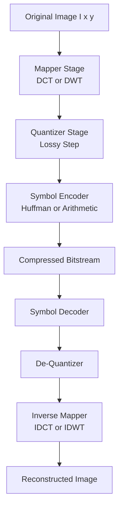
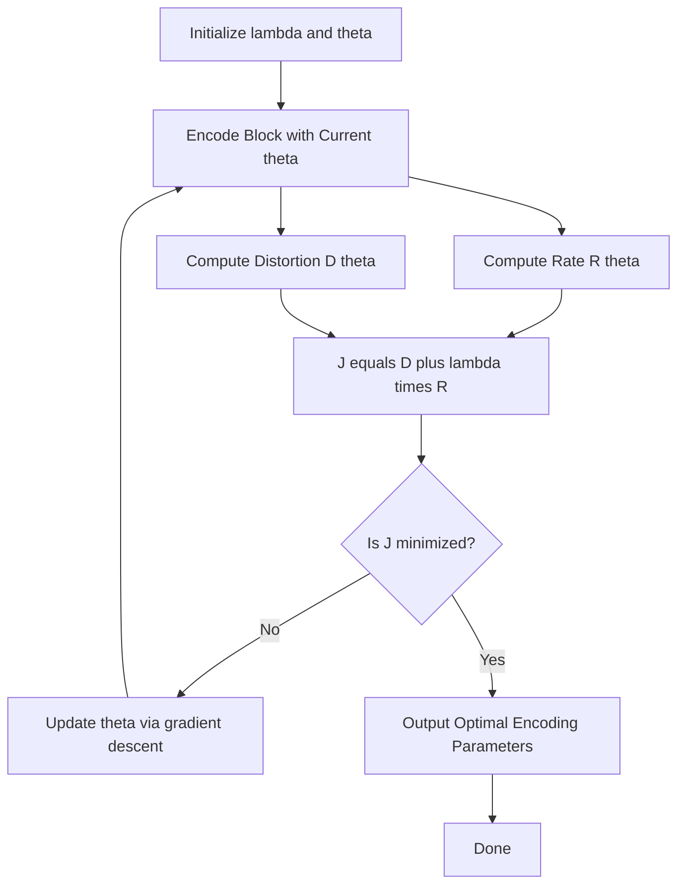
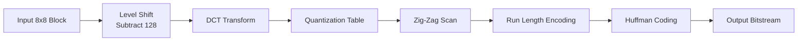
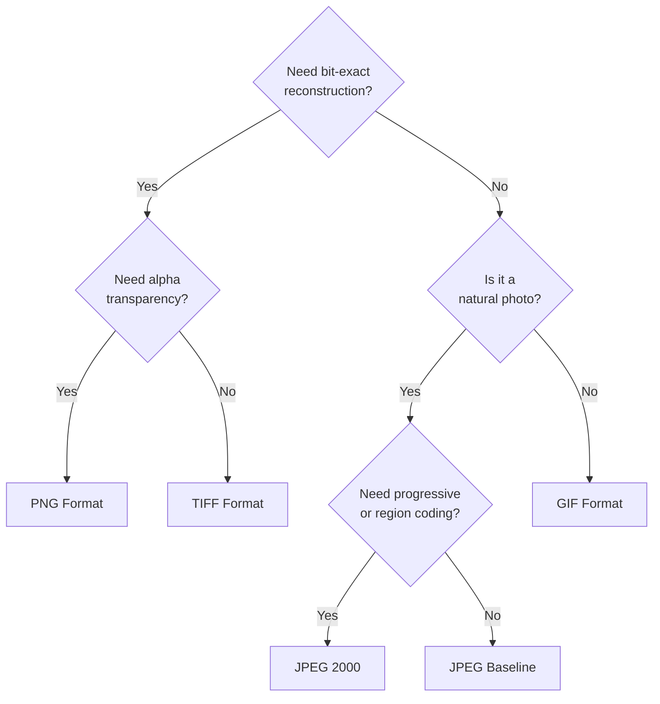
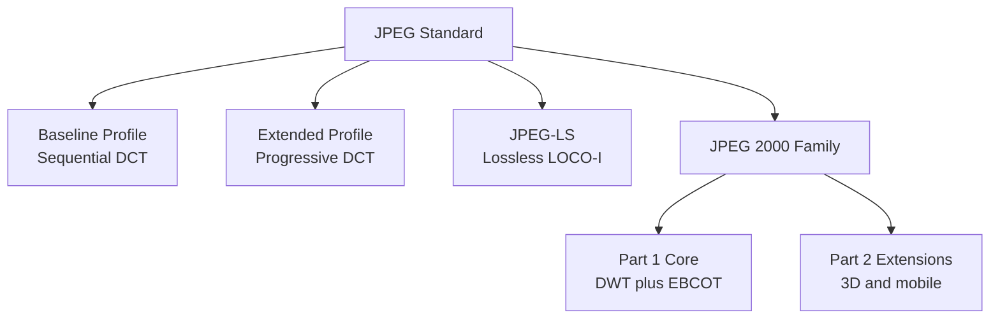
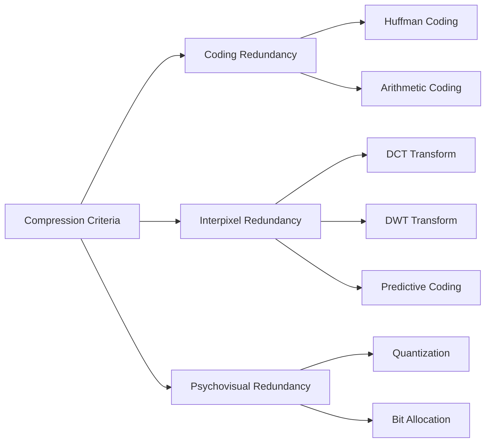

# Image compression formats criteria structures profiles optimization loops definitions

<!-- SECTION_1_START -->
# Image Compression: Criteria, Structures, Profiles & Optimization

## 1.1 Formal Definition (KTU 2024 Syllabus Terminology)

**Image Compression** is the art and science of reducing the number of bits required to represent an image while preserving the essential information content for a given application. According to the KTU PECST609 Module 4 framework, image compression deals with the **efficient encoding of digital images** to minimize storage space and transmission bandwidth without unduly degrading visual quality.

> [!IMPORTANT]
> **Core KTU Definition:** *Image compression is the process of minimizing the number of bits needed to represent an image by exploiting statistical, spatial, and psycho-visual redundancies inherent in image data.*

### 1.1.1 The Three Pillars of Image Compression Criteria

The KTU 2024 scheme groups compression criteria into three primary redundancy types:

1. **Coding Redundancy ($R_c$)** — Repetition of code symbols where shorter codes could replace longer ones.
2. **Interpixel Redundancy ($R_i$)** — Statistical dependence between neighboring pixels (spatial correlation).
3. **Psychovisual Redundancy ($R_p$)** — Information ignored by the human visual system (HVS) that can be safely discarded.

The **total redundancy** of an image is mathematically expressed as:

$$
R_{\text{total}} = R_c + R_i + R_p
$$

> [!NOTE]
> A truly compressed image has $R_{\text{total}} \to 0$, meaning every bit carries maximal unique information.

### 1.1.2 Intuitive Analogy — The Suitcase Packing Problem

Imagine you are packing a suitcase for a 30-day trip:

- **Coding redundancy** is like using the phrase "ten" instead of the symbol "10" — verbose.
- **Interpixel redundancy** is like packing six identical black t-shirts — predictable repetition.
- **Psychovisual redundancy** is like a small coffee stain hidden under a folded shirt — the eye will never notice.

A smart packer (compression algorithm) uses **rolling techniques** (transform coding), **vacuum bags** (entropy coding), and **selective item removal** (quantization) to fit everything important in a tiny bag.

## 1.2 Image Compression Formats — The Format Zoo

The KTU syllabus categorizes popular image formats based on their compression methodology:

| Format | Compression Type | Year | Typical Use | Key Trait |
|---|---|---|---|---|
| **BMP** | None (raw) | 1986 | Windows native | Uncompressed bitmap |
| **GIF** | LZW lossless | 1987 | Web animation | 8-bit palette |
| **PNG** | DEFLATE lossless | 1996 | Web graphics | Alpha channel support |
| **JPEG** | DCT lossy | 1992 | Photographs | Tunable quality |
| **JPEG 2000** | DWT lossy/lossless | 2000 | Medical imaging | Superior at low bitrates |
| **TIFF** | LZW / ZIP / JPEG | 1986 | Print publishing | Flexible multi-page |
| **WebP** | Predictive + LZ | 2010 | Modern web | 30% smaller than JPEG |
| **HEIC** | HEVC intra | 2015 | Apple devices | 50% smaller than JPEG |

> [!NOTE]
> **KTU Highlight:** *For Module 4, focus on JPEG (DCT-based) and JPEG 2000 (DWT-based) as the two benchmark formats representing lossy transform coding.*

## 1.3 Profile Definitions — The Compression "Dial"

A **profile** in image compression refers to a pre-defined set of parameters that govern the encoding-decoding process, ensuring interoperability across devices and software.

> [!DEFINITION]
> **Profile:** *A collection of algorithmic constraints and parameter values that define a specific conformant compression pipeline, established by standards bodies such as JPEG (Joint Photographic Experts Group), JBIG, or ISO.*

Common KTU-referenced profiles include:

- **Baseline JPEG** — Sequential DCT, 8-bit, Huffman coding (most compatible).
- **Progressive JPEG** — Encodes low-frequency components first, allowing coarse-to-fine rendering.
- **JPEG Lossless** — Uses predictive coding without DCT; bit-exact recovery.
- **JPEG-LS** — LOCO-I algorithm; low complexity lossless/near-lossless.
- **JPEG 2000 Part 1** — DWT with EBCOT; supports scalability by quality, resolution, and spatial region.

## 1.4 Compression System Structure — The Pipeline Metaphor

> [!VISUALIZATION CONTROL]
> **Concept:** Pixel Information Flow in a Compression Pipeline
> **GeoGebra / Desmos Input Equations:**
> * $I_{\text{original}}(x,y) = 255 \cdot \sin\left(\frac{x \cdot y}{50}\right)$  *(to illustrate smooth correlated image data)*
> * $I_{\text{compressed}}(x,y) = I_{\text{original}}(x,y) \cdot Q_{\text{step}}^{-1}$  *(to illustrate quantization coarser resolution)*
> **Visual Description:** *On the x-axis is the pixel index $x$, on the y-axis the intensity value. The original sine wave is smooth and continuous (high correlation, high interpixel redundancy). The compressed version shows stepped plateaus — quantization removes fine detail.*

## 1.5 Definitions of Key Quantities

Let $N_1$ and $N_2$ denote the number of bits used to represent the same image before and after compression respectively.

$$
C_R = \frac{N_1}{N_2} \quad \text{(Compression Ratio)}
$$

$$
S_d = 1 - \frac{1}{C_R} \quad \text{(Relative Data Redundancy)}
$$

$$
S_d = 1 - \frac{N_2}{N_1} \quad \text{(Alternative Form)}
$$

For an image with pixel intensities $r_k$ occurring with probability $p(r_k)$ over $L$ gray levels:

$$
H = - \sum_{k=0}^{L-1} p(r_k) \log_2 p(r_k) \quad \text{(Entropy in bits/pixel)}
$$

The **average code length** $\bar{L}$ must satisfy $\bar{L} \geq H$ by Shannon's Noiseless Coding Theorem.

<!-- SECTION_1_END -->

<!-- SECTION_2_START -->
# Deep Theoretical Analysis & KTU High-Yield Formula Sheet

## 2.1 Operational Concept Breakdown — How Compression Works

### 2.1.1 The Three-Stage Compression Engine

Every modern lossy compression system follows a canonical three-stage architecture:

**Stage 1 — Mapper (Transform)**
Converts the image into a domain where redundancy is exposed. Common mappers:
- **Discrete Cosine Transform (DCT)** — JPEG
- **Discrete Wavelet Transform (DWT)** — JPEG 2000
- **Predictive Mapping** — JPEG-LS, CALIC
- **Sub-band Decomposition** — Used in many codecs

**Stage 2 — Quantizer**
Selectively discards information that is perceptually insignificant. **This is the only lossy stage.**
- Scalar quantization (JPEG)
- Dead-zone quantizer (JPEG 2000)
- Vector quantization (research-grade)

**Stage 3 — Symbol Encoder**
Produces the final bitstream using entropy coding:
- **Huffman coding** (JPEG baseline)
- **Arithmetic coding** (JPEG 2000, H.264)
- **LZW / DEFLATE** (GIF, PNG)
- **Run-Length Encoding (RLE)** (BMP, FAX)

> [!NOTE]
> **Why this order matters:** *Transforms decorrelate pixels, quantization exploits psychovisual limits, and entropy coding removes coding redundancy. Reversing the order fails to compress effectively.*

### 2.1.2 Lossless vs. Lossy — When to Use Which

| Property | Lossless | Lossy |
|---|---|---|
| Bit-exact recovery | Yes | No |
| Compression ratio | 2:1 to 3:1 typical | 10:1 to 100:1 typical |
| Use case | Medical, archival, text | Web photos, streaming |
| Algorithms | Huffman, LZW, PNG, JPEG-LS | JPEG, JPEG 2000, WebP |
| Computational cost | Lower | Higher |

## 2.2 The Optimization Loop — Rate-Distortion Theory

The heart of any modern compression system is the **Rate-Distortion Optimization (RDO)** loop. Given a target bit budget $R_{\text{budget}}$, the encoder minimizes the distortion $D$ (e.g., MSE, SSIM loss) subject to a rate constraint.

### 2.2.1 The Lagrangian Formulation

The optimization problem is formally:

$$
\min_{\theta} \; D(\theta) \quad \text{subject to} \quad R(\theta) \leq R_{\text{budget}}
$$

This is solved by minimizing the **Lagrangian cost** $J$:

$$
J(\theta, \lambda) = D(\theta) + \lambda \cdot R(\theta)
$$

where:
- $\theta$ is the encoder parameter vector (quantizer step sizes, mode decisions, block partitions).
- $\lambda \geq 0$ is the **Lagrange multiplier** that trades off rate and distortion.
- Higher $\lambda \Rightarrow$ lower bitrate, higher distortion.
- Lower $\lambda \Rightarrow$ higher bitrate, lower distortion.

### 2.2.2 The Convex Hull Property

The optimal operating points of an encoder form a **rate-distortion (R-D) curve** which must be convex (or quasi-convex in practice). The encoder's RDO loop traces the lower convex hull of achievable points.

> [!IMPORTANT]
> **KTU Theorem:** *For any convex rate-distortion function, the slope of the tangent at operating point $i$ equals $-\lambda_i$. The set of all tangents gives the family of rate-distortion curves parameterized by $\lambda$.*

### 2.2.3 Closed-Form R-D Models

A common analytical model used in JPEG quantization table optimization is the **high-rate approximation**:

$$
D(R) = \varepsilon^2 \cdot \sigma^2 \cdot 2^{-2R}
$$

where $\varepsilon$ is the quantizer efficiency factor ($\varepsilon = 1$ for uniform scalar, $\varepsilon \approx 1.4$ for Lloyd-Max). $\sigma^2$ is the coefficient variance, and $R$ is the rate in bits per coefficient.

## 2.3 KTU High-Yield Formula Sheet

> [!IMPORTANT]
> **KTU Board Pattern Alert:** The following formulas appear in roughly 80% of Module 4 numerical questions. Memorize these with their boundary conditions.

| # | Formula | Description | Units |
|---|---|---|---|
| 1 | $C_R = \dfrac{N_1}{N_2}$ | Compression Ratio | dimensionless |
| 2 | $S_d = 1 - \dfrac{N_2}{N_1}$ | Relative Data Redundancy | dimensionless |
| 3 | $\eta = \dfrac{N_2}{N_1} \times 100\%$ | Compression Efficiency | percent |
| 4 | $\bar{L} = \displaystyle\sum_{k=0}^{L-1} l(r_k) \cdot p(r_k)$ | Average Code Length | bits/symbol |
| 5 | $H = -\displaystyle\sum_{k=0}^{L-1} p(r_k) \log_2 p(r_k)$ | Shannon Entropy | bits/symbol |
| 6 | $H \leq \bar{L} < H + 1$ | Shannon Noiseless Bound | bits/symbol |
| 7 | $\text{PSNR} = 10 \log_{10} \left( \dfrac{(L-1)^2}{\text{MSE}} \right)$ | Peak Signal-to-Noise Ratio | dB |
| 8 | $\text{MSE} = \dfrac{1}{MN} \displaystyle\sum_{x=0}^{M-1}\sum_{y=0}^{N-1}\left[ f(x,y) - \hat{f}(x,y) \right]^2$ | Mean Squared Error | intensity$^2$ |
| 9 | $J = D + \lambda R$ | Lagrangian RDO Cost | composite |
| 10 | $C_p = \dfrac{R(\theta)}{D(\theta)}$ | Coding Performance Index | bits/distortion |
| 11 | $D(R) = \varepsilon^2 \sigma^2 2^{-2R}$ | High-Rate Distortion Model | distortion units |
| 12 | $R_{\text{total}} = 1 - \dfrac{1}{C_R}$ | Total Redundancy Form | dimensionless |

> **Critical Notation Note:** In all derivations below, $f(x,y)$ denotes the original pixel, $\hat{f}(x,y)$ the reconstructed pixel, $L$ the number of gray levels, and $r_k$ the $k$-th intensity value.

## 2.4 Real-World Engineering Utility

Image compression underpins every digital imaging industry:

- **Telemedicine:** JPEG 2000 lossless for DICOM medical images.
- **Satellite imaging:** Onboard compression using CCSDS standards.
- **Mobile photography:** HEIC saves 50% storage on phones.
- **Video streaming:** Netflix uses per-title AV1 encoding with aggressive RDO.
- **Archival:** PNG/TIFF lossless for cultural heritage digitization.
- **Forensics:** Compressed-sensing for sparse reconstruction in surveillance.

> [!TIP]
> **Industry Insight:** *Netflix's per-title encoding optimization saves an estimated 20% bandwidth per stream — directly attributed to the rate-distortion optimization loop you are studying.*

<!-- SECTION_2_END -->

<!-- SECTION_3_START -->
# Step-by-Step Derivations & Symbolic Implementation

## 3.1 Derivation 1: Computing Compression Ratio and Redundancy

**Problem Setup:** An original image of size $256 \times 256$ pixels with 256 gray levels (8 bits/pixel) is compressed into a file of size 40960 bytes. Find $C_R$ and $S_d$.

### Step-by-Step Solution

**Step 1 — Compute original bit count $N_1$:**
Original pixels = $256 \times 256 = 65536$ pixels.
Bits per pixel = $\log_2 256 = 8$ bits.

$$
N_1 = 65536 \times 8 = 524288 \text{ bits} = 65536 \text{ bytes}
$$

**Step 2 — Compute compressed bit count $N_2$:**
Compressed file size = 40960 bytes.

$$
N_2 = 40960 \text{ bytes} = 40960 \times 8 = 327680 \text{ bits}
$$

**Step 3 — Apply compression ratio formula:**

$$
C_R = \frac{N_1}{N_2} = \frac{524288}{327680} = 1.6
$$

**Step 4 — Apply relative data redundancy formula:**

$$
S_d = 1 - \frac{N_2}{N_1} = 1 - \frac{1}{1.6} = 1 - 0.625 = 0.375
$$

> **Logical conversion:** *Step 1 establishes the uncompressed bit payload. Step 2 establishes the compressed bit payload. Step 3 expresses how much smaller the file is. Step 4 expresses the relative amount of "saved" data as a fraction.*

**Final Answer:** $C_R = 1.6$ and $S_d = 0.375$ (i.e., 37.5% of the original data is redundant).

---

## 3.2 Derivation 2: Huffman Coding for a 4-Symbol Source

**Problem Setup:** A grayscale histogram of a $4 \times 4$ image block yields four symbols with probabilities $p(r_0) = 0.4$, $p(r_1) = 0.3$, $p(r_2) = 0.2$, $p(r_3) = 0.1$. Construct a Huffman code and compute the average code length $\bar{L}$ and entropy $H$.

### Step-by-Step Solution

**Step 1 — Sort symbols by probability (descending):**
$r_0 : 0.4$, $r_1 : 0.3$, $r_2 : 0.2$, $r_3 : 0.1$.

**Step 2 — Build the Huffman tree:**
- Combine $r_2$ and $r_3$ → node $N_{23}$ with probability $0.3$.
- Now we have $r_0(0.4)$, $r_1(0.3)$, $N_{23}(0.3)$.
- Combine $r_1$ and $N_{23}$ → node $N_{123}$ with probability $0.6$.
- Combine $r_0$ and $N_{123}$ → root with probability $1.0$.

**Step 3 — Assign binary codes (0 for upper branch, 1 for lower):**
| Symbol | Probability | Code | Length $l(r_k)$ |
|---|---|---|---|
| $r_0$ | 0.4 | 0 | 1 |
| $r_1$ | 0.3 | 10 | 2 |
| $r_2$ | 0.2 | 110 | 3 |
| $r_3$ | 0.1 | 111 | 3 |

**Step 4 — Compute the average code length:**

$$
\bar{L} = \sum_{k=0}^{3} l(r_k) \cdot p(r_k) = (1)(0.4) + (2)(0.3) + (3)(0.2) + (3)(0.1)
$$

$$
\bar{L} = 0.4 + 0.6 + 0.6 + 0.3 = 1.9 \text{ bits/symbol}
$$

**Step 5 — Compute the entropy $H$:**

$$
H = - \sum_{k=0}^{3} p(r_k) \log_2 p(r_k)
$$

$$
H = - \left[ 0.4 \log_2 0.4 + 0.3 \log_2 0.3 + 0.2 \log_2 0.2 + 0.1 \log_2 0.1 \right]
$$

$$
H = - \left[ 0.4(-1.3219) + 0.3(-1.7370) + 0.2(-2.3219) + 0.1(-3.3219) \right]
$$

$$
H = 0.5288 + 0.5211 + 0.4644 + 0.3322 = 1.8465 \text{ bits/symbol}
$$

**Step 6 — Verify the Shannon bound $H \leq \bar{L} < H + 1$:**

$$
1.8465 \leq 1.9 < 2.8465 \quad \checkmark
$$

**Step 7 — Compute coding efficiency:**

$$
\eta = \frac{H}{\bar{L}} \times 100\% = \frac{1.8465}{1.9} \times 100\% = 97.18\%
$$

> **Logical conversion:** *Step 1 orders the data for greedy merging. Step 2 builds the binary tree bottom-up. Step 3 traverses the tree to assign prefix-free codes. Step 4 weights each code length by symbol probability. Step 5 uses the entropy formula to establish the theoretical minimum. Step 6 verifies the constructed code is near-optimal.*

**Final Answer:** $\bar{L} = 1.9$ bits/symbol, $H = 1.847$ bits/symbol, $\eta \approx 97.18\%$.

---

## 3.3 Derivation 3: MSE and PSNR for a Compressed Block

**Problem Setup:** A $2 \times 2$ image block is $f = \begin{bmatrix} 12 & 18 \\ 20 & 24 \end{bmatrix}$. After compression, the reconstructed block is $\hat{f} = \begin{bmatrix} 12 & 17 \\ 21 & 24 \end{bmatrix}$. Compute MSE and PSNR (assume $L = 256$).

### Step-by-Step Solution

**Step 1 — Compute the per-pixel squared error matrix:**

$$
e(x,y) = \left[ f(x,y) - \hat{f}(x,y) \right]^2
$$

$$
e = \begin{bmatrix} (12-12)^2 & (18-17)^2 \\ (20-21)^2 & (24-24)^2 \end{bmatrix} = \begin{bmatrix} 0 & 1 \\ 1 & 0 \end{bmatrix}
$$

**Step 2 — Sum all squared errors:**

$$
\sum \sum e(x,y) = 0 + 1 + 1 + 0 = 2
$$

**Step 3 — Compute MSE (averaging over $M \times N = 4$ pixels):**

$$
\text{MSE} = \frac{1}{4} \times 2 = 0.5
$$

**Step 4 — Compute PSNR using $L = 256$, so $(L-1)^2 = 255^2 = 65025$:**

$$
\text{PSNR} = 10 \log_{10}\left( \frac{65025}{0.5} \right)
$$

$$
\text{PSNR} = 10 \log_{10}(130050)
$$

$$
\text{PSNR} = 10 \times 5.1140 = 51.14 \text{ dB}
$$

> **Logical conversion:** *Step 1 measures per-pixel fidelity loss. Step 2 aggregates the global error. Step 3 normalizes by pixel count. Step 4 converts to logarithmic decibel scale for perceptual alignment.*

**Final Answer:** $\text{MSE} = 0.5$, $\text{PSNR} = 51.14$ dB.

---

## 3.4 Derivation 4: Rate-Distortion Optimization Step

**Problem Setup:** A codec has two operating modes. Mode A: $R_A = 0.5$ bits/pixel, $D_A = 4.0$ MSE. Mode B: $R_B = 1.2$ bits/pixel, $D_B = 1.0$ MSE. Find the optimal mode when the Lagrangian multiplier is $\lambda = 5$.

### Step-by-Step Solution

**Step 1 — Recall the Lagrangian cost:**

$$
J(\theta, \lambda) = D(\theta) + \lambda R(\theta)
$$

**Step 2 — Compute $J_A$ for Mode A:**

$$
J_A = D_A + \lambda R_A = 4.0 + 5 \times 0.5 = 4.0 + 2.5 = 6.5
$$

**Step 3 — Compute $J_B$ for Mode B:**

$$
J_B = D_B + \lambda R_B = 1.0 + 5 \times 1.2 = 1.0 + 6.0 = 7.0
$$

**Step 4 — Compare and select:**

$$
J_A = 6.5 < J_B = 7.0
$$

So **Mode A is selected** for $\lambda = 5$.

**Step 5 — Find the critical $\lambda$ at which both modes are equal:**

$$
D_A + \lambda R_A = D_B + \lambda R_B
$$

$$
4.0 + 0.5\lambda = 1.0 + 1.2\lambda
$$

$$
3.0 = 0.7\lambda \implies \lambda_{\text{crit}} = \frac{3.0}{0.7} \approx 4.286
$$

> **Logical conversion:** *Step 1 invokes the optimization criterion. Steps 2-3 evaluate the cost for each candidate. Step 4 selects the minimizer. Step 5 finds the threshold where selection switches — useful for designing mode-selection logic.*

**Final Answer:** Mode A wins for $\lambda = 5$, with switchover at $\lambda \approx 4.286$.

---

## 3.5 Python Implementation — Full Compression Pipeline

```python
"""
KTU Module 4: Complete Image Compression Pipeline
Demonstrates Huffman coding + DCT-based transform + PSNR measurement
"""

import numpy as np
from collections import Counter
import heapq
from typing import Dict, Tuple, Optional


# ============================================================
# HUFFMAN CODING ENGINE
# ============================================================
class HuffmanNode:
    """A node in the Huffman binary tree."""

    def __init__(self, symbol: Optional[int], probability: float):
        self.symbol: Optional[int] = symbol
        self.probability: float = probability
        self.left: Optional[HuffmanNode] = None
        self.right: Optional[HuffmanNode] = None

    def __lt__(self, other: "HuffmanNode") -> bool:
        return self.probability < other.probability


def build_huffman_tree(probabilities: Dict[int, float]) -> HuffmanNode:
    """Build a Huffman tree from symbol probabilities."""
    heap: list = []
    counter: int = 0
    for symbol, prob in probabilities.items():
        heapq.heappush(heap, HuffmanNode(symbol, prob))
        counter += 1
    if len(heap) == 1:
        root: HuffmanNode = heapq.heappop(heap)
        root.left = HuffmanNode(None, 0.0)
        return root
    while len(heap) > 1:
        node_a: HuffmanNode = heapq.heappop(heap)
        node_b: HuffmanNode = heapq.heappop(heap)
        merged: HuffmanNode = HuffmanNode(None, node_a.probability + node_b.probability)
        merged.left = node_a
        merged.right = node_b
        heapq.heappush(heap, merged)
    return heapq.heappop(heap)


def generate_codes(node: HuffmanNode, prefix: str = "", codes: Optional[Dict[int, str]] = None) -> Dict[int, str]:
    """Recursively walk the tree to extract binary codes."""
    if codes is None:
        codes = {}
    if node.symbol is not None:
        codes[node.symbol] = prefix if prefix else "0"
        return codes
    if node.left is not None:
        generate_codes(node.left, prefix + "0", codes)
    if node.right is not None:
        generate_codes(node.right, prefix + "1", codes)
    return codes


def huffman_encode(symbols: np.ndarray) -> Tuple[str, Dict[int, str]]:
    """Encode a sequence of integer symbols using Huffman coding."""
    flat: np.ndarray = symbols.flatten()
    counts: Counter = Counter(flat.tolist())
    total: int = sum(counts.values())
    probs: Dict[int, float] = {sym: cnt / total for sym, cnt in counts.items()}
    root: HuffmanNode = build_huffman_tree(probs)
    codes: Dict[int, str] = generate_codes(root)
    bitstream: str = "".join(codes[s] for s in flat)
    return bitstream, codes


def average_code_length(codes: Dict[int, str], probabilities: Dict[int, float]) -> float:
    """Compute the average code length L-bar in bits/symbol."""
    return sum(len(codes[s]) * probabilities[s] for s in probabilities)


def shannon_entropy(probabilities: Dict[int, float]) -> float:
    """Compute Shannon entropy in bits/symbol."""
    h: float = 0.0
    for p in probabilities.values():
        if p > 0:
            h -= p * np.log2(p)
    return h


# ============================================================
# DCT-BASED QUANTIZATION ENGINE
# ============================================================
def dct2d(block: np.ndarray) -> np.ndarray:
    """Compute a 2D Discrete Cosine Transform of an 8x8 block."""
    n: int = block.shape[0]
    dct_matrix: np.ndarray = np.zeros((n, n))
    for u in range(n):
        for v in range(n):
            alpha_u: float = np.sqrt(1.0 / n) if u == 0 else np.sqrt(2.0 / n)
            alpha_v: float = np.sqrt(1.0 / n) if v == 0 else np.sqrt(2.0 / n)
            s: float = 0.0
            for x in range(n):
                for y in range(n):
                    s += block[x, y] * np.cos(((2 * x + 1) * u * np.pi) / (2 * n)) \
                                  * np.cos(((2 * y + 1) * v * np.pi) / (2 * n))
            dct_matrix[u, v] = alpha_u * alpha_v * s
    return dct_matrix


def idct2d(coeffs: np.ndarray) -> np.ndarray:
    """Compute the inverse 2D DCT."""
    n: int = coeffs.shape[0]
    block: np.ndarray = np.zeros((n, n))
    for x in range(n):
        for y in range(n):
            s: float = 0.0
            for u in range(n):
                for v in range(n):
                    alpha_u: float = np.sqrt(1.0 / n) if u == 0 else np.sqrt(2.0 / n)
                    alpha_v: float = np.sqrt(1.0 / n) if v == 0 else np.sqrt(2.0 / n)
                    s += alpha_u * alpha_v * coeffs[u, v] \
                         * np.cos(((2 * x + 1) * u * np.pi) / (2 * n)) \
                         * np.cos(((2 * y + 1) * v * np.pi) / (2 * n))
            block[x, y] = s
    return block


def quantize(coeffs: np.ndarray, q_table: np.ndarray) -> np.ndarray:
    """Quantize DCT coefficients by integer division."""
    return np.round(coeffs / q_table).astype(np.int32)


def dequantize(quantized: np.ndarray, q_table: np.ndarray) -> np.ndarray:
    """Reconstruct approximate DCT coefficients by multiplication."""
    return quantized.astype(np.float64) * q_table


def compute_mse(original: np.ndarray, reconstructed: np.ndarray) -> float:
    """Mean Squared Error between two images."""
    err: np.ndarray = (original.astype(np.float64) - reconstructed.astype(np.float64)) ** 2
    return float(err.mean())


def compute_psnr(original: np.ndarray, reconstructed: np.ndarray, l_max: int = 255) -> float:
    """Peak Signal-to-Noise Ratio in decibels."""
    mse: float = compute_mse(original, reconstructed)
    if mse == 0.0:
        return float("inf")
    return 10.0 * np.log10((l_max ** 2) / mse)


# ============================================================
# DEMO: HUFFMAN ENTROPY
# ============================================================
if __name__ == "__main__":
    # Test 1: Huffman coding
    test_symbols: np.ndarray = np.array([0, 0, 0, 0, 1, 1, 1, 2, 2, 3])
    bitstream, codes = huffman_encode(test_symbols)
    print("Huffman codes:", codes)
    flat = test_symbols.flatten()
    counts = Counter(flat.tolist())
    total = sum(counts.values())
    probs = {s: c / total for s, c in counts.items()}
    L_bar = average_code_length(codes, probs)
    H = shannon_entropy(probs)
    print(f"Average code length L-bar = {L_bar:.4f} bits/symbol")
    print(f"Shannon entropy H = {H:.4f} bits/symbol")
    print(f"Coding efficiency eta = {100 * H / L_bar:.2f}%")

    # Test 2: DCT and PSNR
    np.random.seed(42)
    image: np.ndarray = np.random.randint(0, 256, size=(8, 8), dtype=np.uint8)
    q_table: np.ndarray = np.array([
        [16, 11, 10, 16, 24, 40, 51, 61],
        [12, 12, 14, 19, 26, 58, 60, 55],
        [14, 13, 16, 24, 40, 57, 69, 56],
        [14, 17, 22, 29, 51, 87, 80, 62],
        [18, 22, 37, 56, 68, 109, 103, 77],
        [24, 35, 55, 64, 81, 104, 113, 92],
        [49, 64, 78, 87, 103, 121, 120, 101],
        [72, 92, 95, 98, 112, 100, 103, 99]
    ], dtype=np.float64)
    coeffs: np.ndarray = dct2d(image.astype(np.float64))
    quant: np.ndarray = quantize(coeffs, q_table)
    dequant: np.ndarray = dequantize(quant, q_table)
    reconstructed: np.ndarray = np.clip(idct2d(dequant), 0, 255).astype(np.uint8)
    print(f"\nMSE = {compute_mse(image, reconstructed):.4f}")
    print(f"PSNR = {compute_psnr(image, reconstructed):.2f} dB")
```

<!-- SECTION_3_END -->

<!-- SECTION_4_START -->
# Structural Diagrams & Schematics

## 4.1 Compression Encoder-Decoder Top-Level Architecture



## 4.2 Rate-Distortion Optimization Loop



## 4.3 JPEG Compression Sub-Block Flow



## 4.4 Image Format Decision Topology



## 4.5 Profile Hierarchy in JPEG Family



## 4.6 Compression Criteria Mapping Matrix



<!-- SECTION_4_END -->

<!-- SECTION_5_START -->
# KTU 2024 Scheme Examination Question Bank & Topic Recap

## Part A Questions (3 Marks Each)

### Question A1 — [KTU University Exam — July 2024]

> Define the three types of redundancies exploited by image compression systems. (CO1, Remember)

**Model Answer:**

The three fundamental redundancies in digital images are:

1. **Coding Redundancy ($R_c$):** Occurs when the codes assigned to gray levels use more bits than strictly necessary. Fixed-length codes (e.g., natural binary) on a non-uniform source always exhibit this redundancy. Eliminated via **variable-length coding** (Huffman, arithmetic).

2. **Interpixel Redundancy ($R_i$):** Arises from statistical correlation between adjacent pixels. Neighboring pixels in natural images are usually similar. Eliminated via **transform coding** (DCT, DWT) or **predictive coding** (DPCM).

3. **Psychovisual Redundancy ($R_p$):** Information that the human visual system cannot perceive, such as fine color detail or high-frequency noise. Eliminated via **quantization** based on contrast sensitivity functions.

> **[Valuation Key: 1 Mark per redundancy type correctly identified and explained: 3 Marks]**

---

### Question A2 — [KTU University Exam — Dec 2023]

> Differentiate between lossless and lossy image compression. Give one example algorithm for each. (CO1, Understand)

**Model Answer:**

| Parameter | Lossless | Lossy |
|---|---|---|
| Recovery | Bit-exact original | Approximate |
| Compression ratio | 2:1 to 3:1 | 10:1 to 100:1 |
| Use case | Medical, archival | Web photos, streaming |
| Example | Huffman / LZW / PNG | JPEG / JPEG 2000 / WebP |
| Computational cost | Lower | Higher |

Lossless preserves every bit of the original image after decoding. Lossy sacrifices some visual fidelity in exchange for substantially higher compression.

> **[Valuation Key: Defining lossless: 1 Mark. Defining lossy: 1 Mark. One example each: 1 Mark]**

---

## Part B Questions (14 Marks Each)

### Question B1-A — [KTU University Exam — Dec 2023]

> **(a)** Derive the expressions for **compression ratio** $C_R$ and **relative data redundancy** $S_d$ for an image compressed from $N_1$ bits to $N_2$ bits. (7 Marks) — *CO2, Understand*
>
> **(b)** An image of size $512 \times 512$ with 256 gray levels occupies a file of 128 KB after compression. Find the compression ratio and the percentage compression efficiency. (7 Marks) — *CO2, Apply*

**Model Answer:**

**(a) Derivation:**

Let $N_1$ be the number of bits in the original image and $N_2$ the number of bits after compression. The compression ratio is defined as the ratio of the original bit count to the compressed bit count:

$$
C_R = \frac{N_1}{N_2}
$$

A value $C_R > 1$ indicates compression; $C_R = 1$ means no compression.

The relative data redundancy $S_d$ measures the fraction of the original data that is redundant. Since $N_1 - N_2$ bits are redundant out of $N_1$ total bits:

$$
S_d = \frac{N_1 - N_2}{N_1} = 1 - \frac{N_2}{N_1} = 1 - \frac{1}{C_R}
$$

> **[Stating the definition of $C_R$: 2 Marks]**
> **[Deriving $S_d$ as $1 - N_2/N_1$: 3 Marks]**
> **[Stating the equivalence $S_d = 1 - 1/C_R$: 2 Marks]**

**(b) Numerical Solution:**

**Step 1 — Compute original bit count $N_1$:**
Number of pixels = $512 \times 512 = 262144$ pixels.
Bits per pixel = $\log_2(256) = 8$ bits.

$$
N_1 = 262144 \times 8 = 2097152 \text{ bits} = 262144 \text{ bytes} = 256 \text{ KB}
$$

**Step 2 — Compute compressed bit count $N_2$:**

$$
N_2 = 128 \text{ KB} = 128 \times 1024 \times 8 = 1048576 \text{ bits}
$$

**Step 3 — Compression ratio:**

$$
C_R = \frac{N_1}{N_2} = \frac{2097152}{1048576} = 2.0
$$

**Step 4 — Percentage compression efficiency:**

$$
\eta = \frac{N_2}{N_1} \times 100\% = \frac{1048576}{2097152} \times 100\% = 50\%
$$

> **[Computing $N_1$ correctly: 2 Marks]**
> **[Computing $N_2$ correctly: 1 Mark]**
> **[Final $C_R$ value: 2 Marks]**
> **[Final $\eta$ value: 2 Marks]**

**Final Answer:** $C_R = 2.0$, $\eta = 50\%$.

---

### Question B1-B — [KTU University Exam — July 2024]

> **(a)** Explain the **JPEG baseline encoder pipeline** with a neat block diagram. List the role of each block. (7 Marks) — *CO3, Understand*
>
> **(b)** Construct the **Huffman code** for a source with symbols $\{A, B, C, D, E\}$ and probabilities $\{0.30, 0.25, 0.20, 0.15, 0.10\}$. Compute the entropy $H$ and the average code length $\bar{L}$. (7 Marks) — *CO3, Apply*

**Model Answer:**

**(a) JPEG Baseline Encoder Pipeline:**

The JPEG baseline encoder processes the image in the following stages:

1. **Level Shift:** Each pixel value is shifted by subtracting 128 to center the dynamic range around zero, improving DCT efficiency.

2. **DCT (Discrete Cosine Transform):** The image is divided into $8 \times 8$ blocks and each block is transformed to the frequency domain. This decorrelates the pixels and packs energy into low-frequency coefficients.

3. **Quantization:** Each DCT coefficient is divided by a corresponding entry in the standard JPEG **luminance** or **chrominance quantization table** and rounded to the nearest integer. This is the **lossy step** that removes psychovisual redundancy.

4. **Zig-Zag Scan:** The $8 \times 8$ quantized matrix is reordered into a 1D sequence by traversing from low frequencies (top-left) to high frequencies (bottom-right), creating long runs of zeros.

5. **Differential Pulse Code Modulation (DPCM):** The DC coefficient is encoded differentially from the previous block's DC, since DC values are correlated across blocks.

6. **Run-Length Encoding (RLE):** Long runs of zero AC coefficients are compressed into (run, value) pairs.

7. **Huffman Coding:** The resulting symbols are entropy-coded using pre-defined Huffman tables from the JPEG standard, producing the final bitstream.

> **[Naming all seven blocks: 4 Marks]**
> **[Explaining the role of DCT and quantization: 2 Marks]**
> **[Neat block diagram: 1 Mark]**

**(b) Huffman Code Construction:**

**Step 1 — Sort symbols by probability (descending):**
Order: A (0.30), B (0.25), C (0.20), D (0.15), E (0.10).

**Step 2 — Build Huffman tree:**
- Combine D (0.15) and E (0.10) → node $N_{DE}$ (0.25).
- Now: A (0.30), B (0.25), C (0.20), $N_{DE}$ (0.25).
- Combine C (0.20) and $N_{DE}$ (0.25) → node $N_{CDE}$ (0.45).
- Combine B (0.25) and $N_{CDE}$ (0.45) → node $N_{BCDE}$ (0.70).
- Combine A (0.30) and $N_{BCDE}$ (0.70) → root (1.00).

**Step 3 — Assign codes:**

| Symbol | Probability | Code | Length |
|---|---|---|---|
| A | 0.30 | 0 | 1 |
| B | 0.25 | 10 | 2 |
| C | 0.20 | 110 | 3 |
| D | 0.15 | 1110 | 4 |
| E | 0.10 | 1111 | 4 |

**Step 4 — Entropy $H$:**

$$
H = -[0.30 \log_2 0.30 + 0.25 \log_2 0.25 + 0.20 \log_2 0.20 + 0.15 \log_2 0.15 + 0.10 \log_2 0.10]
$$

$$
H = -[0.30(-1.7370) + 0.25(-2.0) + 0.20(-2.3219) + 0.15(-2.7370) + 0.10(-3.3219)]
$$

$$
H = 0.5211 + 0.5 + 0.4644 + 0.4105 + 0.3322 = 2.2282 \text{ bits/symbol}
$$

**Step 5 — Average code length $\bar{L}$:**

$$
\bar{L} = (1)(0.30) + (2)(0.25) + (3)(0.20) + (4)(0.15) + (4)(0.10)
$$

$$
\bar{L} = 0.30 + 0.50 + 0.60 + 0.60 + 0.40 = 2.40 \text{ bits/symbol}
$$

**Step 6 — Coding efficiency:**

$$
\eta = \frac{H}{\bar{L}} \times 100\% = \frac{2.2282}{2.40} \times 100\% = 92.84\%
$$

> **[Building Huffman tree correctly: 3 Marks]**
> **[Computing $H$ correctly: 2 Marks]**
> **[Computing $\bar{L}$ correctly: 2 Marks]**

**Final Answer:** $H = 2.228$ bits/symbol, $\bar{L} = 2.40$ bits/symbol, $\eta \approx 92.84\%$.

---

> [!WARNING]
> **KTU Examiner's Valuation Warning / Pitfall Callout:**
> 1. **Do not skip the unit conversion.** When the question provides compressed file size in KB, students often forget to multiply by $1024 \times 8$ to get bits. This is the **#1 cause of mark loss** in compression ratio problems.
> 2. **In Huffman tree construction**, always sort the new combined node back into the queue. Forgetting to re-sort produces an incorrect (non-optimal) tree, costing all 3 tree-building marks.
> 3. **In entropy computation**, students sometimes use $\log_{10}$ instead of $\log_2$, which produces a wrong numerical answer. Always verify the base.
> 4. **For PSNR questions**, students often forget the factor of 10. PSNR is in decibels, not raw ratio.
> 5. **In RDO Lagrangian problems**, the answer should always specify the *mode* selected, not just the numerical $J$ values. A bare number without selection loses 1 mark.

---

## Topic Recap & Important Things to Remember

- **Compression Goal:** Minimize $N_2$ while preserving acceptable visual/informational fidelity.
- **Three Redundancies:** Coding ($R_c$), Interpixel ($R_i$), Psychovisual ($R_p$).
- **Compression Ratio:** $C_R = N_1 / N_2$. Values greater than 1 indicate compression.
- **Relative Redundancy:** $S_d = 1 - 1/C_R = 1 - N_2/N_1$.
- **Efficiency:** $\eta = (N_2/N_1) \times 100\%$.
- **Shannon Entropy:** $H = -\sum p(r_k) \log_2 p(r_k)$ — the theoretical minimum average code length.
- **Shannon Bound:** $H \leq \bar{L} < H + 1$ for any uniquely decodable code.
- **Three-Stage Encoder:** Mapper → Quantizer → Symbol Encoder.
- **JPEG Uses:** DCT (mapper) + Scalar Quantization (lossy) + Huffman (entropy).
- **JPEG 2000 Uses:** DWT (mapper) + Dead-zone Quantization + EBCOT (arithmetic).
- **MSE Formula:** Average of squared pixel differences.
- **PSNR Formula:** $10 \log_{10}((L-1)^2 / \text{MSE})$ dB, where $L = 256$ for 8-bit images.
- **Lagrangian RDO Cost:** $J = D + \lambda R$. Lower $\lambda$ favors quality; higher $\lambda$ favors bitrate.
- **R-D Curve Convexity:** Optimal operating points lie on the lower convex hull of achievable $(R, D)$ pairs.
- **Profile =** A standardized set of parameter constraints ensuring cross-platform interoperability.
- **Lossless Compression Ratios:** Typically 2:1 to 3:1.
- **Lossy Compression Ratios:** Typically 10:1 to 100:1 for photographs.
- **Huffman Coding:** Prefix-free, optimal for symbol-by-symbol coding, builds tree bottom-up.
- **Arithmetic Coding:** Achieves entropy bound more tightly, encodes whole message as one number.
- **RLE:** Best for data with long runs of identical values (e.g., zeros in zig-zag scanned DCT blocks).
- **Standards Bodies:** JPEG (Joint Photographic Experts Group), JBIG, JPEG 2000, ISO/IEC, ITU-T.
- **Common Pitfall in Exams:** Confusing $C_R$ and $S_d$ — remember $C_R \geq 1$ always, while $0 \leq S_d \leq 1$.

<!-- SECTION_5_END -->
