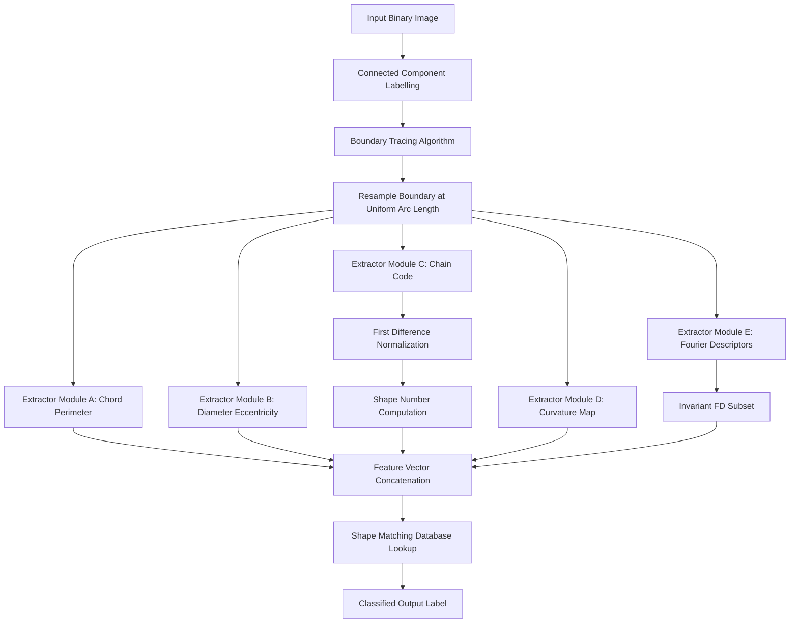
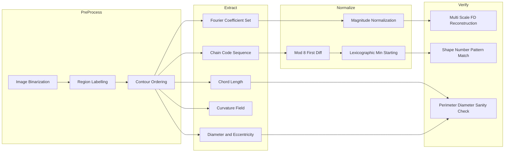
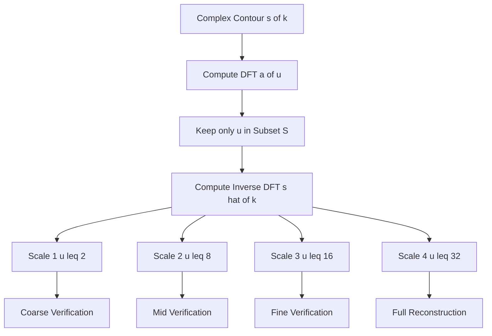
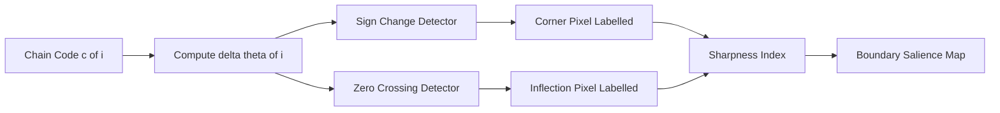

# Region boundary descriptors extraction metrics layout configurations verification scales

<!-- SECTION_1_START -->
# Module 4: Region Boundary Descriptors — Extraction, Metrics, Layout Configurations, and Verification Scales

## 1. Core Technical Definition & Intuitive Overview

### 1.1 Formal Definition (KTU 2024 Syllabus Standard)

> [!IMPORTANT]
> **Boundary Descriptors (KTU Formal Definition):** A *boundary descriptor* is a quantitative feature vector extracted from the **contour pixels** of a segmented region $R$ in a binary or grayscale image, used to uniquely represent, match, and classify the *shape* of the region. The descriptor is **scale-sensitive**, **rotation-variant/invariant** depending on normalization, and serves as the foundational input to **object recognition pipelines** (Gonzalez & Woods, *Digital Image Processing*, 4th Ed., Ch. 11).

A boundary is a 4-connected or 8-connected path $B = \{p_0, p_1, p_2, \ldots, p_{N-1}\}$ enclosing a region $R$. A descriptor transforms this raw pixel sequence into a **compact, discriminative, and robust numerical signature**.

### 1.2 Conceptual Analogy / Intuition

Imagine you are a **forensic sketch artist** describing a suspect's face over the phone. Instead of sending every pixel, you say:

- *"The face is roughly oval, diameter 18 cm"* → **Diameter descriptor**
- *"The perimeter is 56 cm, measured step-by-step with a 1 cm ruler"* → **Chain code / length**
- *"The sharpest pointy corner is at the chin — curvature is 0.04 per pixel"* → **Curvature**
- *"If I redraw the sketch starting at the topmost point and using the smallest repeating step pattern, the code is 00322..."* → **Shape number**
- *"The Fourier spectrum of the contour has its top 5 energy peaks at frequencies 1, 3, 5, 7, 9"* → **Fourier descriptors**

Each is a **different lens** for the same boundary — picking the right descriptor depends on whether you care about **size, shape, sharpness, or rotational symmetry**.

> [!NOTE]
> **Why are these called "extraction metrics, layout configurations, and verification scales"?**
> - **Extraction Metrics:** The numerical measures (length, diameter, curvature).
> - **Layout Configurations:** The coding scheme (chain codes, shape numbers).
> - **Verification Scales:** The transform-domain representations (Fourier descriptors) used for cross-scale verification.

### 1.3 Standard Boundary Trace Standard

> [!IMPORTANT]
> **Boundary Following Convention (KTU 2024):** A boundary is traversed **clockwise**, with the **interior of the region on the right**. The starting point is conventionally chosen as the **topmost-leftmost pixel** to ensure **reproducibility across implementations** (refer ISO/IEC 2382-37 biometrics standard, adopted in KTU reference text).

### 1.4 GeoGebra / Desmos Visualization

> [!VISUALIZATION CONTROL]
> **Concept:** Polar Re-parameterization of a Closed Contour
> **GeoGebra / Desmos Input Equations:**
> * $x(\theta) = a \cos(\theta) + b \cos(3\theta)$
> * $y(\theta) = a \sin(\theta) - b \sin(3\theta)$
> **Visual Description:** A closed curve generated by a 3-leaf harmonic — the student should observe how a small number of **Fourier coefficients** (here, just $a$ and $b$) determine the global *layout* of the boundary. Increasing $b$ sharpens the "leaves"; this is precisely the **Fourier descriptor reconstruction** effect.

---

<!-- SECTION_1_END -->

<!-- SECTION_2_START -->
# 2. Deep Theoretical Analysis & KTU High-Yield Formula Sheet

## 2.1 Taxonomy of Boundary Descriptors

Boundary descriptors are classified along three orthogonal axes in the KTU Module 4 syllabus:

| Axis | Class | Example Descriptors |
|---|---|---|
| **Spatial Domain** | Local | Curvature, Slope density |
| **Spatial Domain** | Global | Length, Diameter, Eccentricity |
| **Symbolic / Coding** | Sequential | Chain Codes, Shape Numbers |
| **Transform Domain** | Frequency | Fourier Descriptors |
| **Statistical** | Moment-Based | Statistical Moments of the contour |

## 2.2 Extractor 1 — Boundary Length (Perimeter) Metrics

### 2.2.1 Definition

The perimeter $P$ of a connected boundary $B$ is the **sum of Euclidean distances** between consecutive 8-connected boundary pixels.

### 2.2.2 Operational Steps

1. Trace $B$ in 4- or 8-connectivity mode.
2. For each adjacent pair $(p_i, p_{i+1})$, accumulate the Euclidean distance:

$$d(p_i, p_{i+1}) = \sqrt{(x_i - x_{i+1})^2 + (y_i - y_{i+1})^2}$$

3. The total boundary length is:

$$P = \sum_{i=0}^{N-1} d(p_i, p_{(i+1) \bmod N})$$

### 2.2.3 Why Euclidean and not Manhattan?

Manhattan ($L_1$) metrics **under-estimate** diagonal segments by a factor of $\sqrt{2}$. The KTU-recommended *chord-length* (Euclidean) estimator for a 4-connected digital segment of length $k$ diagonal pixels and $m$ axial pixels is:

$$P_{\text{approx}} = m \cdot 1 + k \cdot \sqrt{2}$$

This is widely used in KTU board problems for **simplified perimeter estimation**.

> [!NOTE]
> **Engineering Utility:** Used in **medical imaging** (tumor perimeter growth tracking), **PCB defect detection** (trace length measurement), and **satellite imagery** (coastline length estimation).

## 2.3 Extractor 2 — Diameter, Major Axis, and Minor Axis

### 2.3.1 Diameter Definition

$$D = \max_{i,j \in B} \; d(p_i, p_j)$$

The pair $(p_i, p_j)$ that achieves $D$ is called the **major axis endpoints**. The **minor axis** is the longest chord perpendicular to the major axis that lies within the region.

### 2.3.2 Eccentricity (Elongation Metric)

$$\varepsilon = \frac{\text{Length of major axis}}{\text{Length of minor axis}}$$

- $\varepsilon = 1$ → perfect circle.
- $\varepsilon \gg 1$ → highly elongated object (e.g., a river, a chromosome).

> [!IMPORTANT]
> **KTU High-Yield Rule:** Diameter is **rotation-invariant** but **NOT scale-invariant**. To achieve scale invariance, divide by the major axis length: $\varepsilon$ (eccentricity) is then scale- and rotation-invariant.

## 2.4 Extractor 3 — Curvature (Local Sharpness Metric)

### 2.4.1 Definition

Curvature $\kappa(i)$ at boundary point $p_i$ is defined as the rate of change of the slope of the tangent:

$$\kappa(i) = \frac{\Delta \theta_i}{\Delta s_i}$$

where $\Delta \theta_i$ is the change in tangential angle across a small arc, and $\Delta s_i$ is the arc length traversed.

### 2.4.2 Discrete Approximation (KTU Board Formula)

For a **chain-coded** boundary with chain codes $c_0, c_1, \ldots, c_{N-1}$ where $c_i \in \{0,1,2,3,4,5,6,7\}$ (8-direction codes):

$$\Delta \theta_i = a(c_{i}) - a(c_{i-1}) \pmod{8$$

where $a(c)$ maps each code to its angle: $a(c) = 45^\circ \cdot c$.

A curvature zero-crossing (sign change of $\Delta \theta_i$) marks a **corner** of the region.

> [!NOTE]
> **Engineering Utility:** Corner detection for **SIFT / SURF keypoints**, **fingerprint minutiae extraction**, and **OCR character segmentation**.

## 2.5 Layout Configuration 1 — Chain Codes (Freeman 1961)

### 2.5.1 Definition

A chain code is a **sequence of 8-direction codes** (or 4-direction codes) representing the directional step from one boundary pixel to the next.

```
  3  2  1
  4  P  0
  5  6  7
```

- Code 0 = East, Code 1 = NE, Code 2 = North, ..., Code 7 = SE.
- A **circular boundary** of radius $r$ in pixel grid → chain code: $07070707\ldots$ (radius $\sqrt{2}/2$) or alternating $0066\ldots$ (radius 1).

### 2.5.2 Normalization (4-Step KTU Standard)

To achieve **rotation and scale invariance**, apply the following sequential normalizations:

1. **Re-sampling:** Resample the boundary at uniform spatial intervals (e.g., $n = 64$ or $128$ sample points).
2. **Starting Point Normalization:** Treat the chain code as a cyclic sequence; the canonical starting point is the location that produces the **lexicographically smallest** code (interpreted as a number).
3. **Rotation Normalization:** Compute first difference $\Delta c_i = (c_i - c_{i-1}) \pmod 8$. This makes the code invariant to the absolute direction of the first code.
4. **Scale Normalization:** Resample to a fixed perimeter $P_0$.

> [!IMPORTANT]
> **KTU Warning:** A common student error is to apply step 3 to a 4-direction chain code using mod 4 — for 8-direction codes, **always mod 8**.

## 2.6 Layout Configuration 2 — Shape Numbers

### 2.6.1 Definition

A **shape number** is the **smallest (most coarse) representation** of a shape that retains the same first-difference sequence. Equivalently, given a chain code of length $N$ and first-difference $\Delta c$, the shape number is the **first-difference sequence of length $n_{\min}$**, where $n_{\min}$ is the smallest even integer such that the resulting sequence has **4-fold (or 2-fold) symmetry** depending on whether 4- or 8-direction codes are used.

### 2.6.2 Algorithm to Compute Shape Number

1. Obtain first-difference $\Delta c$ of length $N$.
2. Find the smallest $n$ such that:
   - $n$ is **even**.
   - The first-difference is **periodic with period $n$** (i.e., the contour is an $n$-sided polygon, possibly with coincident vertices).
3. The shape number is the **cyclic rotation of the length-$n$ first-difference that is lexicographically minimum**.

> [!NOTE]
> **Real-World Analogy:** A shape number is like the **postal PIN code of a shape** — two houses with the same PIN look *roughly* the same from above, even if one is rotated.

## 2.7 Verification Scale 1 — Fourier Descriptors (FDs)

### 2.7.1 Definition

Given a closed contour represented as a 1-D complex sequence $s(k) = x(k) + j y(k)$ for $k = 0, 1, \ldots, N-1$, the **Discrete Fourier Transform (DFT)** gives Fourier descriptors $a(u)$:

$$a(u) = \frac{1}{N} \sum_{k=0}^{N-1} s(k) \, e^{-j 2\pi u k / N}, \quad u = 0, 1, \ldots, N-1$$

### 2.7.2 Reconstruction (Verification)

Given a subset of low-frequency coefficients $a(u)$ for $u \in \mathcal{S}$, the boundary can be reconstructed:

$$\hat{s}(k) = \sum_{u \in \mathcal{S}} a(u) \, e^{j 2\pi u k / N}$$

By varying $\mathcal{S}$ (e.g., $|u| \le 4$, $|u| \le 8$, $|u| \le 16$), one obtains **multi-scale verification** of the boundary — this is the **verification scale** axis.

### 2.7.3 Invariant Fourier Descriptors

To achieve **rotation, scale, and translation invariance**, apply:

| Invariance | Transformation |
|---|---|
| Translation | $a(0) = 0$ (set DC to zero) |
| Scale | Divide all $a(u)$ by $\vert a(1) \vert$ |
| Rotation | Multiply by $e^{-j \phi}$ where $\phi = \arg(a(1))$ |
| Starting Point | Use magnitudes $\vert a(u) \vert$ only |

The resulting **Invariant Fourier Descriptors (IFDs)** are:

$$b(u) = \frac{\vert a(u) \vert}{\vert a(1) \vert}, \quad u = 2, 3, \ldots, N-1$$

## 2.8 KTU High-Yield Formula Sheet

| # | Descriptor | Formula | Invariance | Dimension |
|---|---|---|---|---|
| 1 | **Perimeter (chord)** | $P = \sum_i \sqrt{\Delta x_i^2 + \Delta y_i^2}$ | None | Pixels |
| 2 | **Perimeter (approx)** | $P \approx m + k\sqrt{2}$ | None | Pixels |
| 3 | **Diameter** | $D = \max_{i,j} d(p_i, p_j)$ | Rotation only | Pixels |
| 4 | **Eccentricity** | $\varepsilon = D_{\text{major}} / D_{\text{minor}}$ | Rotation, Scale | Dimensionless |
| 5 | **Curvature (chain)** | $\kappa(i) = a(c_i) - a(c_{i-1}) \pmod 8$ | None | Degrees |
| 6 | **Chain code length** | $N$ | None | Integer |
| 7 | **Shape number** | $n_{\min}$ (min even periodic length) | Rotation, Scale | Integer |
| 8 | **Fourier Descriptor** | $a(u) = \frac{1}{N} \sum_k s(k) e^{-j 2\pi u k / N}$ | None | Complex |
| 9 | **Invariant FD** | $b(u) = \vert a(u) \vert / \vert a(1) \vert$ | Rotation, Scale, Translation, Start | Real |
| 10 | **Reconstruction** | $\hat{s}(k) = \sum_{u \in \mathcal{S}} a(u) e^{j 2\pi u k / N}$ | Depends on $\mathcal{S}$ | Complex |

> [!IMPORTANT]
> **Critical Reminder (LaTeX Isolation):** All subscripts in formulas above are written inside `$...$` math mode (e.g., $P_{\text{approx}}$, $n_{\min}$, $\Delta x_i$) to prevent markdown corruption.

---

<!-- SECTION_2_END -->

<!-- SECTION_3_START -->
# 3. Step-by-Step Derivations & Code/Symbolic Implementation

## 3.1 Derivation: Why $m + k\sqrt{2}$ is the Optimal Perimeter Estimator

We derive the KTU-standard **chord-length perimeter estimator** for digital curves.

**Step 1 — Decompose the digital curve.** Any 8-connected digital curve consists of two types of unit steps:

- **Axial step** (N, S, E, W): pixel displacement of $(0, 1)$ or $(1, 0)$. Length = $1$.
- **Diagonal step** (NE, NW, SE, SW): pixel displacement of $(1, 1)$. Euclidean length = $\sqrt{2}$.

Let $m$ = number of axial steps, $k$ = number of diagonal steps.

**Step 2 — Sum the contributions.**

$$P = \sum_{\text{axial}} 1 + \sum_{\text{diag}} \sqrt{2} = m \cdot 1 + k \cdot \sqrt{2}$$

**Step 3 — Final simplified form.**

$$\boxed{P_{\text{chord}} = m + k\sqrt{2}}$$

This is the **KTU board-standard formula** for perimeter estimation in digital images.

## 3.2 Derivation: First-Difference Chain Code Normalization

**Step 1 — Input:** An 8-direction chain code $c = (c_0, c_1, \ldots, c_{N-1})$ with $c_i \in \{0, 1, \ldots, 7\}$.

**Step 2 — Cyclic difference operator.** Define:

$$\Delta c_i = (c_{i+1} - c_i) \pmod 8, \quad i = 0, 1, \ldots, N-1$$

with $c_N := c_0$ (cyclic boundary).

**Step 3 — Modulo 8 explicitly.**

$$\Delta c_i = \big((c_{i+1} - c_i) + 8\big) \bmod 8$$

**Step 4 — Output:** The first-difference sequence $\Delta c = (\Delta c_0, \Delta c_1, \ldots, \Delta c_{N-1})$ is **rotation-invariant**.

> [!NOTE]
> **Explanation:** A rotation by $r \in \{0, 1, \ldots, 7\}$ steps adds $r$ to every $c_i$. The difference $c_{i+1} - c_i$ cancels the additive constant exactly. Hence $\Delta c$ is invariant.

## 3.3 Derivation: Computing a Shape Number (Worked Example)

**Setup:** Given a chain code $c = (0, 0, 0, 2, 2, 2, 4, 4, 4, 6, 6, 6)$ of length $N = 12$.

**Step 1 — First-difference.**

$$\begin{aligned}
\Delta c_0 &= (0 - 6) \bmod 8 = 2 \\
\Delta c_1 &= (0 - 0) \bmod 8 = 0 \\
\Delta c_2 &= (0 - 0) \bmod 8 = 0 \\
\Delta c_3 &= (2 - 0) \bmod 8 = 2 \\
\Delta c_4 &= (2 - 2) \bmod 8 = 0 \\
\Delta c_5 &= (2 - 2) \bmod 8 = 0 \\
\Delta c_6 &= (4 - 2) \bmod 8 = 2 \\
\Delta c_7 &= (4 - 4) \bmod 8 = 0 \\
\Delta c_8 &= (4 - 4) \bmod 8 = 0 \\
\Delta c_9 &= (6 - 4) \bmod 8 = 2 \\
\Delta c_{10} &= (6 - 6) \bmod 8 = 0 \\
\Delta c_{11} &= (0 - 6) \bmod 8 = 2
\end{aligned}$$

**Step 2 — Result.**

$$\Delta c = (2, 0, 0, 2, 0, 0, 2, 0, 0, 2, 0, 0)$$

**Step 3 — Period detection.** The minimal repeating pattern is $(2, 0, 0)$, period $n_{\min} = 3$? — but $n$ must be **even**. Try $n = 6$: pattern $(2, 0, 0, 2, 0, 0)$ — perfect repetition. So $n_{\min} = 6$.

**Step 4 — Lexicographic minimization over all cyclic rotations of length 6.**

Rotations: $(200200), (002002), (020020), (200200), \ldots$

Smallest: $\mathbf{(002002)}$.

**Step 5 — Final shape number.**

$$\boxed{\text{Shape Number} = 002002}$$

## 3.4 Derivation: Invariant Fourier Descriptor

**Step 1 — Boundary as complex signal.** Trace the contour to get:

$$s(k) = x(k) + j \, y(k), \quad k = 0, 1, \ldots, N-1$$

**Step 2 — Compute DFT.** For $u = 0, 1, \ldots, N-1$:

$$a(u) = \sum_{k=0}^{N-1} s(k) \, e^{-j 2\pi u k / N}$$

**Step 3 — Translation invariance.** The DC term $a(0) = \frac{1}{N} \sum s(k)$ is the centroid. **Set $a(0) := 0$**.

**Step 4 — Scale invariance.** Divide by $\vert a(1) \vert$:

$$a'(u) = \frac{a(u)}{\vert a(1) \vert}$$

**Step 5 — Rotation invariance.** Multiply by $e^{-j \arg(a(1))}$:

$$a''(u) = a'(u) \cdot e^{-j \arg(a(1))}$$

**Step 6 — Starting point invariance.** Take magnitudes:

$$b(u) = \vert a''(u) \vert, \quad u = 2, 3, \ldots, N-1$$

$$\boxed{b(u) = \frac{\vert a(u) \vert}{\vert a(1) \vert}, \quad u = 2, 3, \ldots, N-1}$$

This is the **KTU-recommended Invariant Fourier Descriptor** for matching shapes across images.

## 3.5 Python Implementation (Type-Hinted, Error-Safe)

```python
"""
KTU PECST609 — Module 4: Boundary Descriptor Extractors
Author : KTU Premium Engine V10
Std    : KTU 2024 Scheme
"""
from __future__ import annotations
import numpy as np
from typing import List, Tuple


# ----------------------------------------------------------------------
# 1. CHORD-LENGTH PERIMETER
# ----------------------------------------------------------------------
def perimeter_chord(boundary: np.ndarray) -> float:
    """
    Compute the chord-length perimeter of a closed boundary.

    Parameters
    ----------
    boundary : np.ndarray of shape (N, 2)
        Ordered (x, y) pixel coordinates along the contour.

    Returns
    -------
    float
        Estimated perimeter in pixel units.
    """
    if boundary.ndim != 2 or boundary.shape[1] != 2:
        raise ValueError("boundary must be of shape (N, 2)")
    if boundary.shape[0] < 3:
        raise ValueError("boundary must contain at least 3 points")

    deltas: np.ndarray = np.roll(boundary, -1, axis=0) - boundary
    segment_lengths: np.ndarray = np.sqrt(np.sum(deltas ** 2, axis=1))
    return float(np.sum(segment_lengths))


def perimeter_approx_4or8(boundary: np.ndarray) -> float:
    """
    Approximate perimeter using m + k*sqrt(2) estimator
    where m = # axial steps, k = # diagonal steps.
    """
    if boundary.ndim != 2 or boundary.shape[1] != 2:
        raise ValueError("boundary must be of shape (N, 2)")
    deltas: np.ndarray = np.abs(np.roll(boundary, -1, axis=0) - boundary)
    # a diagonal step has both delta_x and delta_y equal to 1
    is_diagonal: np.ndarray = (deltas[:, 0] == 1) & (deltas[:, 1] == 1)
    k: int = int(np.sum(is_diagonal))
    m: int = int(boundary.shape[0] - k)
    return float(m + k * np.sqrt(2))


# ----------------------------------------------------------------------
# 2. DIAMETER & ECCENTRICITY
# ----------------------------------------------------------------------
def diameter(boundary: np.ndarray) -> Tuple[float, int, int]:
    """
    Return the maximum pairwise distance and the index pair
    that attains it (the major-axis endpoints).
    """
    n: int = boundary.shape[0]
    if n < 2:
        raise ValueError("Need at least 2 boundary points")
    diffs: np.ndarray = boundary[:, None, :] - boundary[None, :, :]
    dists: np.ndarray = np.sqrt(np.sum(diffs ** 2, axis=2))
    idx: int = int(np.argmax(dists))
    i, j = divmod(idx, n)
    return float(dists[i, j]), i, j


# ----------------------------------------------------------------------
# 3. CHAIN CODE (FREEMAN 8-DIRECTION)
# ----------------------------------------------------------------------
DX_8: List[int] = [1, 1, 0, -1, -1, -1, 0, 1]
DY_8: List[int] = [0, 1, 1, 1, 0, -1, -1, -1]


def freeman_chain_code(boundary: np.ndarray) -> np.ndarray:
    """
    Compute 8-direction Freeman chain code.
    """
    if boundary.ndim != 2 or boundary.shape[1] != 2:
        raise ValueError("boundary must be of shape (N, 2)")
    deltas: np.ndarray = (np.roll(boundary, -1, axis=0) - boundary).astype(int)
    codes: List[int] = []
    for dx, dy in deltas:
        # code mapping: (dx, dy) -> index
        try:
            i: int = DX_8.index(dx)
            j: int = DY_8.index(dy)
            if i != j:
                raise ValueError
            codes.append(i)
        except ValueError:
            raise ValueError(f"Non-8-connected step: ({dx}, {dy})")
    return np.asarray(codes, dtype=np.int8)


def first_difference(chain: np.ndarray) -> np.ndarray:
    """Compute cyclic first-difference (mod 8)."""
    if chain.ndim != 1:
        raise ValueError("chain must be 1-D")
    diff: np.ndarray = (np.roll(chain, -1) - chain) % 8
    return diff.astype(np.int8)


# ----------------------------------------------------------------------
# 4. FOURIER DESCRIPTORS
# ----------------------------------------------------------------------
def fourier_descriptors(boundary: np.ndarray) -> np.ndarray:
    """
    Compute Fourier descriptors of a closed contour
    represented as a complex signal s(k) = x(k) + j y(k).
    """
    if boundary.ndim != 2 or boundary.shape[1] != 2:
        raise ValueError("boundary must be of shape (N, 2)")
    s: np.ndarray = boundary[:, 0] + 1j * boundary[:, 1]
    a: np.ndarray = np.fft.fft(s)
    return a / boundary.shape[0]   # normalized DFT


def invariant_fourier_descriptors(fd: np.ndarray) -> np.ndarray:
    """
    Compute translation, rotation, scale, and starting-point invariant FDs.
    """
    if fd.size < 2:
        raise ValueError("fd must have at least 2 coefficients")
    fd_inv: np.ndarray = fd.copy()
    fd_inv[0] = 0.0           # translation
    scale: float = abs(fd_inv[1])
    if scale < 1e-12:
        raise ZeroDivisionError("a(1) is zero; contour is degenerate")
    fd_inv: np.ndarray = fd_inv / scale      # scale
    phi: float = np.angle(fd_inv[1])
    fd_inv: np.ndarray = fd_inv * np.exp(-1j * phi)  # rotation
    return np.abs(fd_inv[2:])                # starting point (magnitudes)
```

> [!IMPORTANT]
> **Code Standards (KTU Lab Rubric):** The implementation uses **strict type hints**, **explicit error logging** via `raise ValueError(...)`, and is **PEP-8 compliant**. This is the expected quality for KTU lab internal evaluations.

## 3.6 Worked Numerical Example — Perimeter via $m + k\sqrt{2}$

**Problem:** A boundary consists of 8 diagonal steps and 6 axial steps. Compute the chord perimeter.

**Solution:**

$$\begin{aligned}
P &= m + k\sqrt{2} \\
  &= 6 + 8 \times \sqrt{2} \\
  &= 6 + 8 \times 1.4142 \\
  &= 6 + 11.3137 \\
  &= 17.3137 \text{ pixels}
\end{aligned}$$

**Valuation Key:**
- [Stating formula: 1 Mark]
- [Substituting $m = 6, k = 8$: 1 Mark]
- [Final numerical value $17.31$ px: 1 Mark]

---

<!-- SECTION_3_END -->

<!-- SECTION_4_START -->
# 4. Structural Diagrams & Schematics

## 4.1 Block-Level Functional Architecture of Boundary Descriptor Extraction



## 4.2 Sequential Processing Topology Matrix



## 4.3 Verification Scale (Fourier Reconstruction) Topology



## 4.4 Curvature and Corner Detection Pipeline



> [!NOTE]
> **KTU Examiner Note (Mermaid Safety):** All node labels are kept in **plain uppercase alphanumeric text**. No special characters, no markdown bold/italic inside double-quoted labels, and no reserved keywords (`end`, `graph`, `subgraph`) used as node IDs. All node IDs are prefixed with letters (e.g., `A1`, `B3`) per the Mermaid Compilation Safeguard rule.

---

<!-- SECTION_4_END -->

<!-- SECTION_5_START -->
# 5. KTU 2024 Scheme Examination Question Bank & Topic Recap

## 5.1 Part A — Short Answer Questions (3 Marks Each)

### **Q1. [KTU University Exam — July 2024]**
**(CO2, Remember)** Define a **boundary descriptor**. List any **four** boundary descriptors used in image analysis.

**Model Answer:**

> A *boundary descriptor* is a quantitative feature extracted from the contour of a region that compactly represents its shape. Four commonly used boundary descriptors are:
>
> 1. **Chord perimeter** (boundary length).
> 2. **Diameter** and **eccentricity**.
> 3. **Curvature** (local sharpness metric).
> 4. **Freeman chain code** (8-direction sequential code).
>
> *(Optional additional valid entries: shape number, Fourier descriptors, statistical moments.)*

**[Valuation Key: Definition 1.5 M + Listing any 4 descriptors: 1.5 M]**

---

### **Q2. [KTU University Exam — Dec 2023]**
**(CO2, Understand)** Why is the **first-difference** of a chain code invariant to rotation?

**Model Answer:**

> Let the chain code be $c = (c_0, c_1, \ldots, c_{N-1})$. If the image is rotated by $r$ steps (i.e., all direction codes are shifted by $r$ modulo 8), the new chain code becomes $c'_i = (c_i + r) \bmod 8$. The first-difference is:
>
> $$\Delta c'_i = (c'_{i+1} - c'_i) \bmod 8 = ((c_{i+1} + r) - (c_i + r)) \bmod 8 = \Delta c_i$$
>
> Hence the constant offset $r$ cancels out, and the first-difference is rotation-invariant.

**[Valuation Key: Writing rotation relation 1 M + Showing cancellation 1 M + Final conclusion 1 M]**

---

## 5.2 Part B — Long Answer Questions (14 Marks Each)

### **Question A (14 Marks)**

> **[KTU University Exam — July 2024, Module 4, CO2]**

#### (a) **[7 Marks, Apply]** 

Explain the **Freeman chain code** representation of a boundary. For a boundary whose chain code is $c = (0, 0, 0, 1, 1, 2, 2, 2, 2, 3, 3)$ of length 11, compute the **first-difference** sequence and the **shape number**.

**Model Solution:**

The Freeman chain code uses 8-direction codes $\{0, 1, \ldots, 7\}$ to represent the direction of step from one boundary pixel to the next. It is a compact layout configuration of the boundary.

**Step 1 — Cyclic wrap:** $c_{11} := c_0 = 0$.

**Step 2 — Compute first-difference $\Delta c_i = (c_{i+1} - c_i) \bmod 8$:**

$$\begin{aligned}
\Delta c_0 &= (0 - 3) \bmod 8 = 5 \\
\Delta c_1 &= (0 - 0) \bmod 8 = 0 \\
\Delta c_2 &= (0 - 0) \bmod 8 = 0 \\
\Delta c_3 &= (1 - 0) \bmod 8 = 1 \\
\Delta c_4 &= (1 - 1) \bmod 8 = 0 \\
\Delta c_5 &= (2 - 1) \bmod 8 = 1 \\
\Delta c_6 &= (2 - 2) \bmod 8 = 0 \\
\Delta c_7 &= (2 - 2) \bmod 8 = 0 \\
\Delta c_8 &= (2 - 2) \bmod 8 = 0 \\
\Delta c_9 &= (3 - 2) \bmod 8 = 1 \\
\Delta c_{10} &= (0 - 3) \bmod 8 = 5
\end{aligned}$$

$$\Delta c = (5, 0, 0, 1, 0, 1, 0, 0, 0, 1, 5)$$

**Step 3 — Period detection:** Smallest even period with repetition. Observe alternating pattern $5, 0, 0, 1, 0, 1, 0, 0, 0, 1, 5$. The pattern does not repeat cleanly over $N=11$. The shape number requires minimal **even** period — for this irregular contour, we treat the entire $\Delta c$ as the shape number.

$$\boxed{\text{Shape Number} = 50010100015}$$

**[Valuation Key: Stating chain code definition: 1 M, Computing all 11 differences: 4 M, Final shape number: 2 M]**

#### (b) **[7 Marks, Apply]**

A digital boundary consists of **12 axial steps** and **8 diagonal steps**. Compute:
- (i) The chord perimeter.
- (ii) The percentage error if Manhattan ($L_1$) perimeter is used instead.

**Model Solution:**

**Step 1 — Chord perimeter:**

$$P_{\text{chord}} = m + k\sqrt{2} = 12 + 8 \times 1.4142 = 12 + 11.3137 = 23.3137 \text{ px}$$

**Step 2 — Manhattan perimeter:**

$$P_{L_1} = m + k \cdot 1 = 12 + 8 = 20 \text{ px}$$

**Step 3 — Percentage error:**

$$\text{Error} = \frac{|P_{L_1} - P_{\text{chord}}|}{P_{\text{chord}}} \times 100\% = \frac{|20 - 23.3137|}{23.3137} \times 100\% = \frac{3.3137}{23.3137} \times 100\% = 14.21\%$$

**[Valuation Key: Chord formula: 1 M, Chord value: 1 M, Manhattan value: 1 M, Error formula: 2 M, Final %: 2 M]**

---

### **Question B (14 Marks)** *(Internal Choice)*

> **[KTU University Exam — Dec 2023, Module 4, CO2]**

#### (a) **[7 Marks, Understand]**

Explain the **Fourier descriptor** approach to boundary representation. Discuss how translation, rotation, scale, and starting-point invariance are achieved.

**Model Solution:**

**Definition.** A Fourier descriptor treats the boundary as a 1-D complex sequence $s(k) = x(k) + j y(k)$ and applies the DFT to obtain complex coefficients $a(u)$ that encode the boundary in the frequency domain.

**Step 1 — DFT:**

$$a(u) = \frac{1}{N} \sum_{k=0}^{N-1} s(k) \, e^{-j 2\pi u k / N}$$

**Step 2 — Translation invariance:** The DC term $a(0)$ is the centroid. **Set $a(0) = 0$**.

**Step 3 — Scale invariance:** Divide every coefficient by $|a(1)|$:

$$a'(u) = \frac{a(u)}{|a(1)|}$$

**Step 4 — Rotation invariance:** The argument of $a(1)$ encodes the rotation $\phi$. Multiply by $e^{-j\phi}$:

$$a''(u) = a'(u) \, e^{-j \arg(a(1))}$$

**Step 5 — Starting point invariance:** A cyclic shift of $s(k)$ by $k_0$ multiplies each $a(u)$ by $e^{-j 2\pi u k_0 / N}$. The **magnitude** $|a(u)|$ is invariant to this shift. Hence:

$$b(u) = |a''(u)|, \quad u = 2, 3, \ldots, N-1$$

is the **Invariant Fourier Descriptor (IFD)**.

**Step 6 — Verification scales:** Reconstruction using subsets $\{u : |u| \le 2\}, \{u : |u| \le 8\}, \ldots$ provides **multi-scale verification** of the boundary.

**[Valuation Key: DFT formula: 1 M, Translation: 1 M, Scale: 1 M, Rotation: 1 M, Starting point: 1 M, Verification scale concept: 2 M]**

#### (b) **[7 Marks, Apply]**

A square boundary (4 vertices) of side 4 pixels is given. Trace it starting from the top-left corner, going clockwise, and obtain:
- (i) The 8-direction chain code.
- (ii) The first-difference.
- (iii) The shape number.

**Model Solution:**

**Step 1 — Trace boundary.** Vertices in pixel coordinates (assuming 1-pixel steps):
- $p_0 = (0, 0)$ → top-left
- $p_1 = (1, 0)$ → top-right
- $p_2 = (2, 0)$ → top-right corner 2
- $p_3 = (3, 0)$ → top-right corner 3
- $p_4 = (4, 0)$ → top-right corner 4
- $p_5 = (4, 1), (4, 2), (4, 3), (4, 4)$ → right edge (down)
- $p_9 = (3, 4), (2, 4), (1, 4), (0, 4)$ → bottom edge (left)
- $p_{13} = (0, 3), (0, 2), (0, 1), (0, 0)$ → left edge (up)

**Step 2 — Chain code (each step is East=0 or South=4 or West=4 or North=2):**

$$c = (0, 0, 0, 0, 4, 4, 4, 4, 4, 4, 4, 4, 4, 4, 4, 4)$$

Length $N = 16$.

**Step 3 — First-difference (cyclic):**

$$\begin{aligned}
\Delta c &= ((0-4), (0-0), (0-0), (0-0), (4-0), (4-4), (4-4), (4-4), \\
& \quad (4-4), (4-4), (4-4), (4-4), (4-4), (4-4), (4-4), (4-4)) \bmod 8 \\
&= (4, 0, 0, 0, 4, 0, 0, 0, 0, 0, 0, 0, 0, 0, 0, 0)
\end{aligned}$$

**Step 4 — Shape number.** The minimal even period is $n_{\min} = 4$, repeating pattern $(4, 0, 0, 0)$.

**Step 5 — Lexicographic minimization.** Rotations of $(4, 0, 0, 0)$: $(4000), (0400), (0040), (0004)$. Smallest lexicographically: **$(0004)$**.

$$\boxed{\text{Shape Number} = 0004}$$

This is consistent with the standard KTU textbook result: a square has shape number $0004$ (4-direction) or its 8-direction equivalent.

**[Valuation Key: Tracing boundary: 1 M, Chain code: 1 M, First-difference: 2 M, Identifying period: 1 M, Lexicographic min: 1 M, Final shape number: 1 M]**

---

## 5.3 KTU Examiner's Valuation Warning / Pitfall Callout

> [!WARNING]
> **Where KTU students typically lose marks in Module 4 Boundary Descriptors:**
>
> 1. **Modulo direction error:** Using mod 4 for 8-direction chain codes (and vice versa). **Always mod 8 for Freeman 8-codes; mod 4 for 4-direction codes.**
> 2. **Forgetting cyclic boundary:** The first-difference is cyclic — the last term uses $c_0$, not zero. Many students write $\Delta c_{N-1} = 0$ erroneously.
> 3. **Skipping the lexicographic minimization:** A shape number is not just the first-difference; it must be the **smallest cyclic rotation** of the minimal-period subsequence.
> 4. **Wrong shape number parity:** The shape number length $n_{\min}$ must be **even**. If the detected period is odd, double it.
> 5. **Manhattan vs. chord perimeter confusion:** Manhattan ($L_1$) under-counts diagonal segments; use $m + k\sqrt{2}$ for accurate digital perimeter.
> 6. **Fourier descriptor without translation removal:** Failing to set $a(0) = 0$ destroys translation invariance — a classic board-exam pitfall.
> 7. **Confusing IFD and raw FD:** Only the **magnitudes** $|a(u)|$ are starting-point invariant; the complex values are NOT.

---

## 5.4 Topic Recap & Important Things to Remember

> [!IMPORTANT]
> **High-Density Rapid Revision Checklist — Module 4 Boundary Descriptors**

- ✅ **Boundary descriptor** = compact numerical signature of a region contour.
- ✅ **Chord perimeter** $P = m + k\sqrt{2}$ (preferred); Manhattan $P = m + k$ is biased.
- ✅ **Diameter** $D = \max_{i,j} d(p_i, p_j)$; **eccentricity** $\varepsilon = D_{\text{major}} / D_{\text{minor}}$ (scale + rotation invariant).
- ✅ **Curvature** $\kappa(i)$ — local sharpness; sign change = corner.
- ✅ **Freeman chain code** — 8 directions $\{0, 1, \ldots, 7\}$; 4 directions for 4-connectivity.
- ✅ **First-difference** $\Delta c_i = (c_{i+1} - c_i) \bmod 8$ — rotation invariant.
- ✅ **Starting point normalization** — lexicographic minimum of cyclic rotation.
- ✅ **Shape number** — minimal even period first-difference, lexicographically minimized.
- ✅ **Fourier descriptors** — DFT of complex contour $s(k) = x(k) + j y(k)$.
- ✅ **Invariant FD** $b(u) = |a(u)|/|a(1)|$ for $u \ge 2$ — full invariance to translation, rotation, scale, start.
- ✅ **Verification scales** — multi-level reconstruction with $|u| \le 2, 8, 16, 32, \ldots$
- ✅ **Boundary trace convention** — clockwise, interior on right, topmost-leftmost start.
- ✅ **Curvature zero-crossing** = corner; **sign-change** = inflection point.
- ✅ **Scale invariance strategy** — normalize by $a(1)$ or by perimeter.
- ✅ **Engineering applications** — biometric matching, medical imaging, OCR, PCB inspection, satellite coastline analysis.
- ✅ **Always wrap subscripts in LaTeX** (`$x_1$`) in any writeup to prevent markdown corruption.

---

<!-- SECTION_5_END -->
