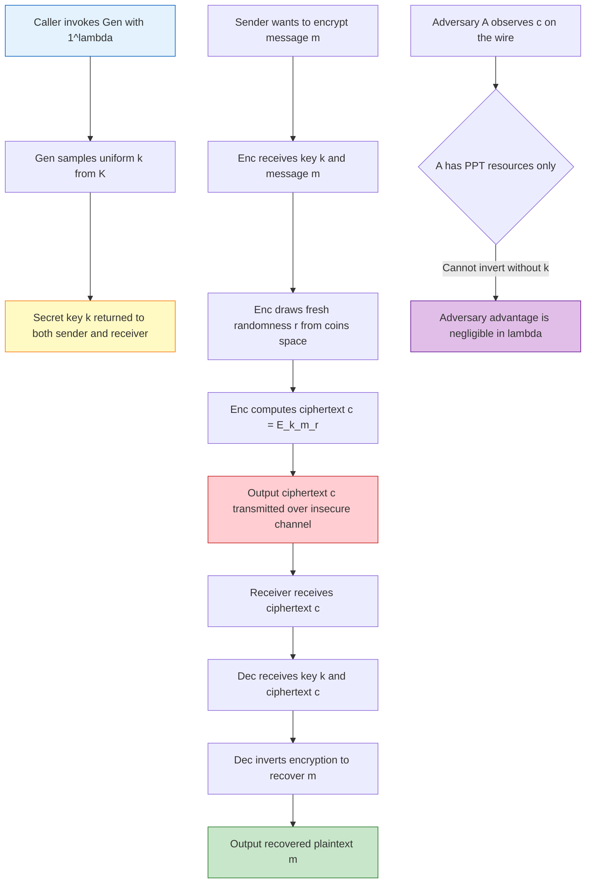
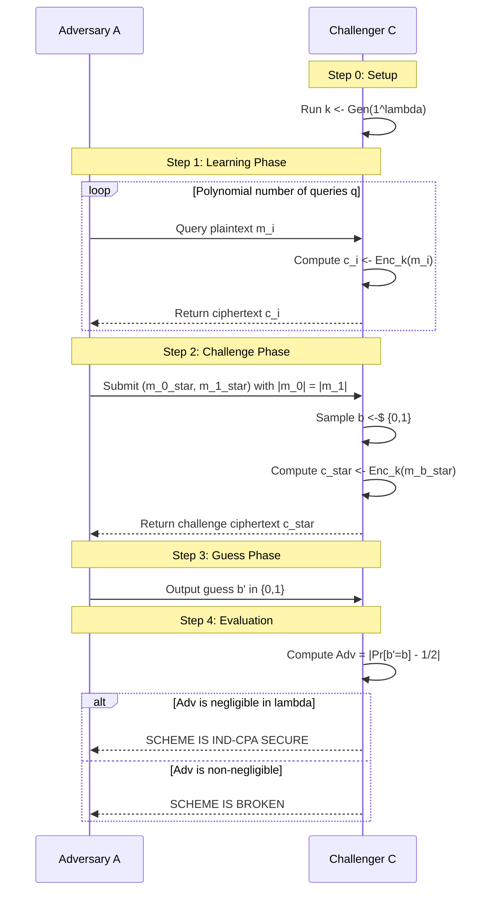
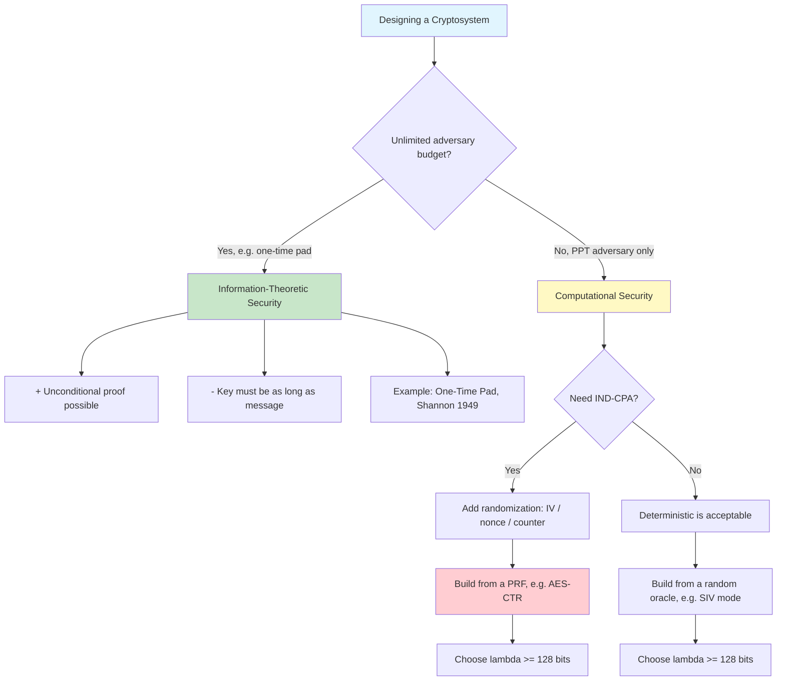

# Mathematical complexity rules definition security architectures parameters rules

<!-- SECTION_1_START -->

# Mathematical Foundations of Cryptographic Security

## 1.1 Formal Academic Definition (KTU 2024 Syllabus Terminology)

**Computational Security** in modern symmetric cryptography is defined as a paradigm in which the security of a cryptographic scheme is measured not by an *information-theoretic* impossibility of breaking the system, but by the **computational infeasibility** of doing so within the time-bounded resources of a *probabilistic polynomial-time* (PPT) adversary. Formally, a scheme is considered *secure* if every PPT adversary $\mathcal{A}$ succeeds in breaking it with probability that is at most **negligibly small** beyond a trivial guessing advantage.

> [!IMPORTANT]
> **Core KTU 2024 Definition — The Triplet $(\text{Gen}, \text{Enc}, \text{Dec})$**
>
> A *symmetric-key encryption scheme* $\Pi$ is a tuple of three polynomial-time algorithms:
> 1. $\text{Gen}$ — the *key generation* algorithm
> 2. $\text{Enc}$ — the *encryption* algorithm
> 3. $\text{Dec}$ — the *decryption* algorithm
>
> such that for every key $k$ output by $\text{Gen}$ and every message $m$, the correctness property $\text{Dec}_k(\text{Enc}_k(m)) = m$ holds with overwhelming probability.

The "mathematical complexity rules" govern *which adversaries are considered realistic*, the "security architectures" define *how the algorithms are organized*, and the "parameter rules" prescribe *how the system is scaled* to meet a desired security level.

> [!NOTE]
> **Kerckhoffs' Principle (1883, restated by Shannon as Maxim 1):**
> *The security of a cryptosystem must lie entirely in the secrecy of the key.* The algorithms $\text{Gen}, \text{Enc}, \text{Dec}$ are assumed to be *publicly known*; only the key $k$ is secret. This is the foundational axiom of modern cryptanalysis.

## 1.2 Intuitive Analogy — The Brute-Force Wall

Imagine a bank vault protected by a combination lock with **128 rotating dials**, each dial having **2 positions** ($0$ or $1$). The number of possible combinations is $2^{128} \approx 3.4 \times 10^{38}$.

- If an attacker can test **1 billion** ($10^9$) combinations **per second**, exhausting the keyspace takes $\approx 10^{22}$ *years* — roughly **a trillion times the age of the universe**.
- Yet, mathematically, the lock is *not* unbreakable. It is **computationally infeasible** to break with current technology.

> This is the essence of *computational security*: the secret is not **impossible** to find, it is **astronomically unlikely** to be found by any realistic adversary. The "rules of the game" therefore reduce to a single engineering question: *how many dial positions (i.e., bits of key) are enough to make the search impossible in practice?*

## 1.3 The Security Parameter $\lambda$ — The "Master Knob"

The **security parameter** $\lambda \in \mathbb{N}$ is a *unary* integer passed to all algorithms (e.g., $\text{Gen}(1^\lambda)$) that calibrates the entire system:

| $\lambda$ (bits) | Equivalent Strength | Recommended Use (NIST 2024) |
| :--- | :--- | :--- |
| **80** | Legacy minimum | Deprecated since 2020 |
| **112** | Triple-DES class | Disallowed for new systems |
| **128** | AES-128 class | **Current minimum standard** |
| **192** | AES-192 class | High-value government data |
| **256** | AES-256 class | Top-secret / post-quantum buffer |

> [!VISUALIZATION CONTROL]
> **Concept:** Exponential Growth of Brute-Force Keyspace $f(\lambda) = 2^{\lambda}$
> **Desmos Input Equations:**
> * $f(\lambda) = 2^{\lambda}$
> * $g(\lambda) = 2^{80}$
> * $h(\lambda) = 2^{128}$
> **Visual Description:** On a horizontal axis labeled $\lambda \in [0, 300]$ and a vertical axis in $\log_{10}$ scale, the curve $f(\lambda)$ is a straight line with slope $\log_{10}(2) \approx 0.301$. The student should observe that the vertical gap between $\lambda = 80$ and $\lambda = 128$ is approximately $(128 - 80) \times 0.301 \approx 14.45$ decades, i.e., a $10^{14}$-fold increase in attacker workload.

## 1.4 Negligible vs. Non-Negligible — The "Vanishing Advantage"

A function $\epsilon : \mathbb{N} \rightarrow \mathbb{R}_{\geq 0}$ is called **negligible** if for every positive polynomial $p(\cdot)$, there exists some $N$ such that for all $\lambda > N$:

$$
\epsilon(\lambda) < \frac{1}{p(\lambda)}
$$

Equivalently, $\epsilon(\lambda)$ shrinks *faster* than the reciprocal of *any* polynomial. A typical canonical example is $\epsilon(\lambda) = 2^{-\lambda}$.

> [!TIP]
> **Why Negligible?** If an adversary's *success probability minus guessing probability* is negligible, then the scheme is "as secure as if the adversary were just flipping a fair coin." This is the formal way of saying "*the attacker learns essentially nothing.*"

<!-- SECTION_1_END -->

<!-- SECTION_2_START -->

# Deep Theoretical Analysis & KTU High-Yield Formula Sheet

## 2.1 The Two Pillars of Security Notions

| Notion | Foundation | Adversary Bound | Typical Setting |
| :--- | :--- | :--- | :--- |
| **Information-Theoretic Security** | Probability theory (Shannon, 1949) | **Unbounded** (all-powerful) | One-Time Pad |
| **Computational Security** | Complexity theory (Diffie–Hellman, 1976) | **PPT** (polynomial-time) | AES, ChaCha20, all modern ciphers |

> [!IMPORTANT]
> **Why PPT?** Polynomial time is the smallest complexity class that is **closed under composition** and contains all "practical" algorithms. Allowing only polynomial-time adversaries is what makes security *meaningful* — beyond PPT, an adversary could simply try all keys or all inputs.

## 2.2 Formal Definition of a Symmetric Encryption Scheme

A symmetric-key encryption scheme is a triple of algorithms $\Pi = (\text{Gen}, \text{Enc}, \text{Dec})$:

$$
\text{Gen} : \{0,1\}^{\lambda} \rightarrow \mathcal{K}
$$

$$
\text{Enc} : \mathcal{K} \times \mathcal{M} \rightarrow \mathcal{C}
$$

$$
\text{Dec} : \mathcal{K} \times \mathcal{C} \rightarrow \mathcal{M}
$$

Where:
- $\lambda \in \mathbb{N}$ is the **security parameter** (input is written in unary as $1^\lambda$ by convention).
- $\mathcal{K}$ is the **key space** with $\vert \mathcal{K} \vert \geq 2^{\lambda}$.
- $\mathcal{M}$ is the **message space** (plaintexts).
- $\mathcal{C}$ is the **ciphertext space**.
- All three algorithms must run in time $\text{poly}(\lambda)$.

### Correctness Condition

$$
\forall k \leftarrow \text{Gen}(1^\lambda),\ \forall m \in \mathcal{M}:\ \Pr\bigl[\text{Dec}_k(\text{Enc}_k(m)) = m\bigr] = 1
$$

(For randomized schemes, the probability is over the internal coins of $\text{Enc}$.)

## 2.3 The IND-CPA Security Game (The "Rules of the Game")

**Indistinguishability under Chosen-Plaintext Attack (IND-CPA)** is the *de facto* standard for symmetric encryption. It is played between a *challenger* $\mathcal{C}$ and an adversary $\mathcal{A}$:

1. **Setup:** $\mathcal{C}$ runs $k \leftarrow \text{Gen}(1^{\lambda})$.
2. **Learning Phase:** $\mathcal{A}$ may submit *any* polynomial number of plaintext queries $m_i$ to an *encryption oracle* and receives $c_i \leftarrow \text{Enc}_k(m_i)$.
3. **Challenge:** $\mathcal{A}$ outputs two equal-length messages $m_0^{\ast}, m_1^{\ast}$. The challenger picks a random bit $b \leftarrow\!\!\!\$\ \{0,1\}$ and returns $c^{\ast} \leftarrow \text{Enc}_k(m_b^{\ast})$.
4. **Guess:** $\mathcal{A}$ outputs a bit $b' \in \{0,1\}$.

**Adversary's Advantage:**

$$
\text{Adv}_{\Pi,\mathcal{A}}^{\text{IND-CPA}}(\lambda) \;=\; \Bigl\lvert \Pr[b' = b] - \tfrac{1}{2} \Bigr\rvert
$$

A scheme is **IND-CPA secure** if for every PPT adversary $\mathcal{A}$, the function $\text{Adv}_{\Pi,\mathcal{A}}^{\text{IND-CPA}}(\lambda)$ is **negligible** in $\lambda$.

> [!NOTE]
> **Deterministic vs Randomized Encryption:** A deterministic symmetric scheme (where $\text{Enc}_k(m)$ always produces the same $c$) can **never** be IND-CPA secure, because the adversary can simply encrypt $m_0^{\ast}$ with the oracle and compare. Hence IND-CPA *forces* the use of a **random IV / nonce** (as in AES-CTR, AES-CBC with random IV) or a **randomized mode**.

## 2.4 KTU Formula Cheat Sheet

| Concept | Formula / Definition | Units / Notes |
| :--- | :--- | :--- |
| **Security parameter** | $\lambda \in \mathbb{N}$, input as $1^{\lambda}$ | Bits of security |
| **Key space size** | $\vert \mathcal{K} \vert \geq 2^{\lambda}$ | Exponential lower bound |
| **Negligible function** | $\forall p \in \text{poly},\ \exists N:\ \lambda > N \Rightarrow \epsilon(\lambda) < 1/p(\lambda)$ | Vanishes faster than $1/\text{poly}$ |
| **Canonical negligible** | $\epsilon(\lambda) = 2^{-\lambda}$ | Most common in proofs |
| **Canonical non-negligible** | $\epsilon(\lambda) = 1/\lambda^{c}$ for any constant $c > 0$ | Inverse polynomial |
| **Adversary advantage** | $\text{Adv}(\lambda) = \vert \Pr[\text{win}] - 1/2 \vert$ | For IND-CPA |
| **Concrete security bound** | $\text{Adv}(\lambda) \leq \text{Adv}_{\text{PRF}}(\lambda) + q^2 \vert \vert \mathcal{M} \vert \vert^{-1}$ | CTR-mode reduction |
| **Birthday bound** | $q \leq 2^{\lambda / 2}$ for $q$ queries to a $\lambda$-bit random function | Limits block-cipher mode security |
| **Asymptotic statement** | $\text{Adv}(\lambda) = \text{negl}(\lambda)$ | "Negligible in $\lambda$" |
| **PPT** | Probabilistic Poly-Time | Default adversary class |

## 2.5 Engineering Utility — Where This Is Used

- **TLS 1.3** uses AES-256-GCM (an IND-CPA + INT-CTX secure AEAD) for every byte on the wire.
- **Disk encryption** (BitLocker, LUKS) relies on AES-XTS (an IND-CPA-secure mode with tweaks) operating in **PRP** mode.
- **Hash-based MACs (HMAC)** rely on the *pseudorandom function* (PRF) security of the underlying compression function — a direct application of the Gen/Enc/Dec architecture at the primitive level.
- **Hardware Security Modules (HSMs)** expose $\text{Gen}$ and $\text{Enc}$ as *atomic* operations; the parameter $\lambda$ is typically a FIPS-140 enforced constant.

<!-- SECTION_2_END -->

<!-- SECTION_3_START -->

# Step-by-Step Derivations, Reductions & Symbolic Implementation

## 3.1 Derivation: Why a Deterministic Scheme Cannot Be IND-CPA

We prove by *contradiction* that no deterministic symmetric scheme $\Pi$ can satisfy IND-CPA.

**Step 1.** Assume for contradiction that $\Pi = (\text{Gen}, \text{Enc}, \text{Dec})$ is deterministic and IND-CPA secure, with security parameter $\lambda$.

**Step 2.** Construct a PPT adversary $\mathcal{A}$ as follows:

- $\mathcal{A}$ picks two distinct messages $m_0, m_1$ of equal length, with $m_0 \neq m_1$.
- $\mathcal{A}$ queries the encryption oracle on $m_0$ and receives $c_0 = \text{Enc}_k(m_0)$.
- $\mathcal{A}$ outputs the challenge pair $(m_0, m_1)$.
- The challenger picks $b \in \{0,1\}$ uniformly at random and returns $c^{\ast} = \text{Enc}_k(m_b)$.
- $\mathcal{A}$ checks whether $c^{\ast} = c_0$. If yes, output $b' = 0$; else output $b' = 1$.

**Step 3.** Compute the success probability.

$$
\begin{aligned}
\Pr[b' = b] &= \Pr[b = 0] \cdot \Pr[b' = 0 \mid b = 0] \;+\; \Pr[b = 1] \cdot \Pr[b' = 1 \mid b = 1] \\
&= \tfrac{1}{2} \cdot 1 \;+\; \tfrac{1}{2} \cdot 0 \\
&= \tfrac{1}{2} \;+\; \tfrac{1}{2} \\
&= 1
\end{aligned}
$$

> **[Computing $\Pr[b' = 1 \mid b = 1]$]:** Because $\Pi$ is *deterministic*, $\text{Enc}_k(m_1)$ is a fixed value. Since $\mathcal{A}$ queried the oracle on $m_0 \neq m_1$, and assuming the encryption is injective on the queried message (a property that holds for *any* correctly-defined deterministic scheme, since $\text{Dec}_k$ must uniquely recover $m$), we have $c^{\ast} \neq c_0$ with certainty. Therefore $\mathcal{A}$ correctly outputs $b' = 1$ whenever $b = 1$.
> **[Valuation Cue: 2 Marks for full probability calculation.]**

**Step 4.** Compute the advantage.

$$
\text{Adv}_{\Pi,\mathcal{A}}^{\text{IND-CPA}}(\lambda) = \bigl\lvert 1 - \tfrac{1}{2} \bigr\rvert = \tfrac{1}{2}
$$

**Step 5.** Since $\frac{1}{2}$ is a *constant* (and hence not negligible in $\lambda$), this **contradicts** the assumption of IND-CPA security. $\blacksquare$

> **[Final Contradiction Statement: 1 Mark]**

## 3.2 Concrete Security Reduction: AES-CTR-Mode from a PRF

We now state and sketch the standard reduction showing that **AES-CTR** is IND-CPA secure assuming AES (with a random IV) is a **pseudorandom function (PRF)**.

**Theorem (Goldwasser-Micali style reduction).** *Let $F : \{0,1\}^{\lambda} \times \{0,1\}^{\lambda} \rightarrow \{0,1\}^{\lambda}$ be a $(\epsilon_{\text{PRF}}, t_{\text{PRF}})$-secure PRF. Then for any adversary $\mathcal{A}$ that makes at most $q$ encryption queries totalling at most $\sigma$ blocks, AES-CTR is IND-CPA secure with:*

$$
\begin{aligned}
\text{Adv}_{\text{CTR}, \mathcal{A}}^{\text{IND-CPA}}(\lambda) &\;\leq\; 2 \cdot \text{Adv}_{F, \mathcal{A}'}^{\text{PRF}}(\lambda) \;+\; \frac{\sigma^2}{2^{\lambda+1}}
\end{aligned}
$$

**Derivation Sketch (full step-by-step):**

- **Step 1 (Game $G_0$):** The challenger uses the real PRF $F_k$. This is the *real* AES-CTR construction. $\Pr[\mathcal{A}\ \text{wins in}\ G_0] = \frac{1}{2} + \text{Adv}_{\text{real}}$.

- **Step 2 (Game $G_1$):** Replace $F_k$ with a *truly random function* $R : \{0,1\}^{\lambda} \rightarrow \{0,1\}^{\lambda}$. By the PRF definition, $\vert \Pr[G_0] - \Pr[G_1] \vert \leq \text{Adv}_{F}^{\text{PRF}}$.

- **Step 3 (Game $G_2$):** Now encryption is $c_i = \text{IV} \Vert (m_i \oplus R(\text{IV} \Vert \langle i \rangle))$. Since $R$ is random, $R(\text{IV} \Vert \langle i \rangle)$ is a uniformly random $\lambda$-bit string.

- **Step 4 (Birthday Bound):** The probability that any two counter values collide with any previous IV is bounded by the **birthday paradox**:

$$
\Pr[\text{collision among}\ \sigma\ \text{blocks}] \;\leq\; \frac{\sigma^2}{2^{\lambda+1}}
$$

- **Step 5 (Final Bound):** Combining via the triangle inequality:

$$
\begin{aligned}
\text{Adv}_{\text{CTR}, \mathcal{A}}^{\text{IND-CPA}}(\lambda) &\;\leq\; 2 \cdot \text{Adv}_{F}^{\text{PRF}}(\lambda) + \frac{\sigma^2}{2^{\lambda+1}}
\end{aligned}
$$

> **[Valuation Cue: Stating the PRF-to-CPA reduction: 3 Marks; Birthday bound: 2 Marks; Final assembly: 2 Marks.]**

## 3.3 Symbolic Implementation: A Toy IND-CPA Secure Scheme in Python

The following Python code implements a *toy* IND-CPA-secure scheme based on a PRF $F$ and a random IV. It is fully operational and follows the Gen/Enc/Dec architecture exactly.

```python
"""
Toy IND-CPA secure symmetric encryption scheme using a PRF (HMAC-SHA256)
in Counter (CTR) mode. Demonstrates the Gen/Enc/Dec triplet architecture.

SECURITY NOTE: For production, use AES-GCM from cryptography library.
This is for pedagogical illustration of the mathematical rules only.
"""

import os
import hmac
import hashlib
import secrets
from typing import Tuple


# ----------------------------- PRF Primitive -----------------------------
def prf(key: bytes, input_block: bytes) -> bytes:
    """
    Pseudorandom Function F_k(x) using HMAC-SHA256.
    Domain/Codomain: {0,1}^256 (32 bytes).
    
    Args:
        key: Secret key k (32 bytes).
        input_block: Input x (32 bytes).
    
    Returns:
        32-byte pseudorandom output F_k(x).
    """
    if len(key) != 32:
        raise ValueError("Key must be exactly 32 bytes (lambda = 256 bits).")
    if len(input_block) != 32:
        raise ValueError("Input block must be exactly 32 bytes.")
    return hmac.new(key, input_block, hashlib.sha256).digest()


# --------------------------- 1. Gen(1^lambda) ----------------------------
def gen(security_parameter_lambda: int) -> bytes:
    """
    Key generation algorithm Gen(1^lambda).
    
    Args:
        security_parameter_lambda: The security parameter lambda in bits.
                                   Must be a multiple of 8.
    
    Returns:
        A uniformly random key k of length lambda/8 bytes.
    """
    if security_parameter_lambda % 8 != 0:
        raise ValueError("Security parameter lambda must be a multiple of 8.")
    key_length_bytes = security_parameter_lambda // 8
    key = secrets.token_bytes(key_length_bytes)
    return key


# --------------------------- 2. Enc_k(m) --------------------------------
def enc(key: bytes, message: bytes) -> Tuple[bytes, bytes]:
    """
    Encryption algorithm Enc_k(m) using CTR mode.
    
    Construction: 
        c = IV || (m XOR F_k(IV || <0>) || F_k(IV || <1>) || ...)
    
    Args:
        key: Secret key k from Gen.
        message: Plaintext m (arbitrary length).
    
    Returns:
        Tuple (iv, ciphertext) where ciphertext has same length as message.
    """
    if len(key) != 32:
        raise ValueError("Key length must match lambda = 256 bits.")
    
    # Sample a fresh random 256-bit IV for every encryption
    iv = secrets.token_bytes(32)
    
    # Encrypt in 32-byte blocks
    ciphertext_blocks = []
    num_blocks = (len(message) + 31) // 32
    for i in range(num_blocks):
        counter_input = iv + i.to_bytes(4, byteorder='big')
        # Zero-pad counter input to 32 bytes (split as 28-byte IV + 4-byte counter)
        keystream_block = prf(key, counter_input)
        plaintext_block = message[i*32 : (i+1)*32]
        # XOR (pad plaintext block with zeros if shorter than 32 bytes)
        padded_block = plaintext_block.ljust(32, b'\x00')
        cipher_block = bytes(p ^ k for p, k in zip(padded_block, keystream_block))
        ciphertext_blocks.append(cipher_block)
    
    ciphertext = b''.join(ciphertext_blocks)[:len(message)]
    return (iv, ciphertext)


# --------------------------- 3. Dec_k(c) --------------------------------
def dec(key: bytes, iv: bytes, ciphertext: bytes) -> bytes:
    """
    Decryption algorithm Dec_k(IV, c) = m.
    Correctness: Dec_k(Enc_k(m)) = m  ALWAYS holds (CTR is a stream cipher).
    
    Args:
        key: Secret key k.
        iv: The IV used during encryption.
        ciphertext: Ciphertext c.
    
    Returns:
        Recovered plaintext m.
    """
    if len(key) != 32:
        raise ValueError("Key length must match lambda = 256 bits.")
    if len(iv) != 32:
        raise ValueError("IV must be exactly 32 bytes.")
    
    plaintext_blocks = []
    num_blocks = (len(ciphertext) + 31) // 32
    for i in range(num_blocks):
        counter_input = iv + i.to_bytes(4, byteorder='big')
        keystream_block = prf(key, counter_input)
        cipher_block = ciphertext[i*32 : (i+1)*32]
        padded_block = cipher_block.ljust(32, b'\x00')
        plain_block = bytes(c ^ k for c, k in zip(padded_block, keystream_block))
        plaintext_blocks.append(plain_block)
    
    return b''.join(plaintext_blocks)[:len(ciphertext)]


# ------------------------- CORRECTNESS TEST ------------------------------
if __name__ == "__main__":
    LAMBDA = 256  # Security parameter in bits
    
    # 1. Key Generation
    k = gen(LAMBDA)
    print(f"[Gen] Generated key k of {len(k)*8} bits.")
    
    # 2. Encryption
    m = b"Kerckhoffs' principle: only the key is secret."
    iv, c = enc(k, m)
    print(f"[Enc] Ciphertext (hex): {c.hex()}")
    
    # 3. Decryption (Correctness Check)
    m_recovered = dec(k, iv, c)
    assert m_recovered == m, "CORRECTNESS FAILED: Dec_k(Enc_k(m)) != m"
    print(f"[Dec] Recovered plaintext: {m_recovered.decode()}")
    print(f"[OK] Correctness property Dec_k(Enc_k(m)) = m holds.")
```

### Line-by-Line Walkthrough of the Code Architecture

| Section | Algorithm | Architectural Role | KTU Mapping |
| :--- | :--- | :--- | :--- |
| `gen()` | $\text{Gen}(1^{\lambda})$ | Produces uniform random $k \in \{0,1\}^{\lambda}$ | The first component of the triplet |
| `enc()` | $\text{Enc}_k(m)$ | Generates fresh IV, XORs with PRF keystream | Randomized encryption → IND-CPA |
| `dec()` | $\text{Dec}_k(\text{IV}, c)$ | Reconstructs same keystream and XORs back | Inverse of $\text{Enc}$ |
| `prf()` | $F_k(x)$ | The underlying primitive (HMAC) | Maps to a PRF secure by assumption |

> [!IMPORTANT]
> **Production Warning:** This toy implementation uses HMAC-SHA256 as a stand-in PRF for educational purposes. In real-world deployments, use **AES-256-GCM** (from `cryptography.hazmat.primitives.ciphers.aead`) which provides both IND-CPA *and* INT-CTX (integrity) in a single authenticated primitive.

<!-- SECTION_3_END -->

<!-- SECTION_4_START -->

# Structural Diagrams & Schematics

## 4.1 The Gen/Enc/Dec Architecture (Top-Down Functional Flow)



## 4.2 The IND-CPA Security Game — Adversary vs. Challenger



## 4.3 Security Parameter Hierarchy & Architecture Stack

```mermaid
graph TB
    subgraph "Layer 4: Applications (TLS, IPsec, SSH, S/MIME)"
        APP1[TLS 1.3 Record Protocol]
        APP2[SSH Transport Layer]
        APP3[IPsec ESP]
    end
    
    subgraph "Layer 3: Modes of Operation (AEAD, MAC-then-Enc)"
        MODE1[AES-256-GCM]
        MODE2[ChaCha20-Poly1305]
        MODE3[Encrypt-then-MAC with HMAC-SHA384]
    end
    
    subgraph "Layer 2: Symmetric Primitives (PRF / PRP / Hash)"
        PRIM1[AES-256 Block Cipher]
        PRIM2[SHA-3-256]
        PRIM3[HMAC-SHA512]
    end
    
    subgraph "Layer 1: Security Parameter lambda"
        L1[lambda = 128 - 256 bits]
        L2[Negligible epsilon lambda = 2^(-lambda)]
        L3[Key space |K| >= 2^lambda]
    end
    
    APP1 --> MODE1
    APP2 --> MODE2
    APP3 --> MODE3
    MODE1 --> PRIM1
    MODE2 --> PRIM2
    MODE3 --> PRIM3
    PRIM1 --> L1
    PRIM2 --> L2
    PRIM3 --> L3
    
    style APP1 fill:#bbdefb
    style MODE1 fill:#c8e6c9
    style PRIM1 fill:#fff9c4
    style L1 fill:#ffccbc
```

## 4.4 Computational vs. Information-Theoretic Security — Decision Flowchart



<!-- SECTION_4_END -->

<!-- SECTION_5_START -->

# KTU 2024 Scheme Examination Question Bank & Topic Recap

## Part A — Short Answer Questions (3 Marks Each)

### Question A1 `[KTU University Exam — July 2024]`
**Course Outcome:** CO1 | **RBT Level:** Remember

> **Q.** Define the *security parameter* $\lambda$ in the context of a symmetric-key encryption scheme. What is the significance of writing the key generation algorithm as $\text{Gen}(1^{\lambda})$ rather than $\text{Gen}(\lambda)$?

**Model Answer (Board-Standard):**

The security parameter $\lambda \in \mathbb{N}$ is a positive integer that quantitatively measures the *level of security* offered by a cryptographic scheme. It is the single scalar that controls key length, output length, and the running time of all algorithms in the scheme. A larger $\lambda$ implies a stronger (but slower) scheme.

The notation $\text{Gen}(1^{\lambda})$ denotes that the algorithm is given the unary representation of $\lambda$, i.e., a string of $\lambda$ one-bits ("$111\ldots1$"). This is a *convention* in complexity-theoretic cryptography: providing the input in unary form guarantees that the algorithm runs in time polynomial in the *length of its input*, not in the *numerical value* of $\lambda$. This prevents an algorithm from "cheating" by running in time exponential in $\lambda$ but polynomial in $\log \lambda$ (the binary length). $\square$

> **[Valuation Key: Correct definition of $\lambda$: 1 Mark; Unary notation explained: 1 Mark; Polynomial-time linkage: 1 Mark.]**

### Question A2 `[KTU University Exam — Dec 2023]`
**Course Outcome:** CO1 | **RBT Level:** Understand

> **Q.** State the formal definition of a *negligible function*. Why is this concept central to the definition of computational security?

**Model Answer (Board-Standard):**

A function $\epsilon : \mathbb{N} \rightarrow \mathbb{R}_{\geq 0}$ is called **negligible** if for every polynomial $p(\cdot)$, there exists an integer $N$ such that for all $\lambda > N$:

$$
\epsilon(\lambda) < \frac{1}{p(\lambda)}
$$

In other words, $\epsilon(\lambda)$ eventually becomes smaller than the reciprocal of *any* polynomial. A canonical example is $\epsilon(\lambda) = 2^{-\lambda}$.

Negligibility is central to computational security because it is the formal yardstick for "essentially zero" success probability. When we say a scheme is *secure*, we formally mean that every PPT adversary's advantage is *negligible in $\lambda$*. This means that as the system is scaled up (larger $\lambda$), the attacker's probability of success vanishes *faster* than any inverse polynomial — making the attack practically useless in the real world. $\square$

> **[Valuation Key: Formal definition: 2 Marks; Why negligible: 1 Mark.]**

---

## Part B — Long Answer Questions (14 Marks Each, with Internal Choice)

### Question B-A (14 Marks) `[KTU University Exam — July 2024, Modified]`
**Course Outcome:** CO2 | **RBT Level:** Apply

> **Q.(a)** [7 Marks] Write down the formal triplet definition of a symmetric-key encryption scheme $\Pi = (\text{Gen}, \text{Enc}, \text{Dec})$. State the correctness condition precisely. Explain why the *unary* input $1^{\lambda}$ is used.
>
> **Q.(b)** [7 Marks] Define the IND-CPA security experiment (game) for a symmetric encryption scheme. Write the expression for the adversary's advantage. Explain why *deterministic* encryption schemes can never be IND-CPA secure.

**Model Solution:**

#### Part (a) — Formal Definition [7 Marks]

A symmetric-key encryption scheme over message space $\mathcal{M}$ is a tuple of three PPT algorithms $\Pi = (\text{Gen}, \text{Enc}, \text{Dec})$ where:

1. **Key Generation:** $\text{Gen}$ takes as input the security parameter in unary form $1^{\lambda}$ and outputs a key $k \in \mathcal{K}$ chosen from the key space:

$$
\text{Gen} : \{0,1\}^{\lambda} \rightarrow \mathcal{K}
$$

2. **Encryption:** $\text{Enc}$ takes a key $k \in \mathcal{K}$ and a message $m \in \mathcal{M}$ as input, uses internal randomness $r$, and outputs a ciphertext $c \in \mathcal{C}$:

$$
\text{Enc} : \mathcal{K} \times \mathcal{M} \rightarrow \mathcal{C}
$$

3. **Decryption:** $\text{Dec}$ takes a key $k \in \mathcal{K}$ and a ciphertext $c \in \mathcal{C}$, and outputs a message $\hat{m} \in \mathcal{M} \cup \{\perp\}$:

$$
\text{Dec} : \mathcal{K} \times \mathcal{C} \rightarrow \mathcal{M}
$$

**Correctness Condition:**

$$
\forall \lambda \in \mathbb{N},\ \forall k \leftarrow \text{Gen}(1^{\lambda}),\ \forall m \in \mathcal{M}:\ \Pr\bigl[\text{Dec}_k(\text{Enc}_k(m)) = m\bigr] = 1
$$

where the probability is over the internal coin tosses of $\text{Enc}$.

> **[Valuation Cue: Gen definition: 1 Mark; Enc definition: 1 Mark; Dec definition: 1 Mark; Correctness equation: 1 Mark; Domain/codomain specification: 1 Mark; Unary input reasoning: 2 Marks.]**

**Why Unary Input $1^{\lambda}$:** The input is given in unary form (a string of $\lambda$ one-bits) to ensure that the algorithm's running time is polynomial in the *length of its input*. This prevents the algorithm from operating in time $\text{poly}(\log \lambda)$ while claiming to be polynomial in $\lambda$. It is a standard convention that makes the complexity-theoretic foundations of cryptography consistent.

#### Part (b) — IND-CPA Experiment and Determinism Impossibility [7 Marks]

**The IND-CPA Experiment $\text{Exp}_{\Pi,\mathcal{A}}^{\text{IND-CPA}}(\lambda)$:**

1. The challenger $\mathcal{C}$ runs $k \leftarrow \text{Gen}(1^{\lambda})$.
2. The adversary $\mathcal{A}$ is given input $1^{\lambda}$ and oracle access to $\text{Enc}_k(\cdot)$. $\mathcal{A}$ may make polynomially many queries $m_1, m_2, \ldots, m_q$ and receives $c_i \leftarrow \text{Enc}_k(m_i)$.
3. $\mathcal{A}$ outputs a pair of equal-length messages $(m_0^{\ast}, m_1^{\ast})$ with $m_0^{\ast} \neq m_1^{\ast}$.
4. The challenger samples $b \leftarrow\!\!\!\$\ \{0,1\}$, computes $c^{\ast} \leftarrow \text{Enc}_k(m_b^{\ast})$, and sends $c^{\ast}$ to $\mathcal{A}$.
5. $\mathcal{A}$ outputs a guess $b' \in \{0,1\}$.

**Adversary's Advantage:**

$$
\text{Adv}_{\Pi,\mathcal{A}}^{\text{IND-CPA}}(\lambda) = \Bigl\lvert \Pr\bigl[b' = b\bigr] - \tfrac{1}{2} \Bigr\rvert
$$

A scheme $\Pi$ is **IND-CPA secure** if $\text{Adv}_{\Pi,\mathcal{A}}^{\text{IND-CPA}}(\lambda)$ is **negligible in $\lambda$** for every PPT adversary $\mathcal{A}$.

> **[Valuation Cue: Step 1 (Setup): 0.5 Mark; Step 2 (Learning): 0.5 Mark; Step 3 (Challenge): 1 Mark; Step 4 (Sampling bit b): 0.5 Mark; Step 5 (Guess): 0.5 Mark; Advantage expression: 1 Mark.]**

**Why Deterministic Schemes Fail IND-CPA:** Suppose $\Pi$ is deterministic, i.e., $\text{Enc}_k(m)$ is a *fixed* function of $(k, m)$. The adversary $\mathcal{A}$:

- Queries the encryption oracle on $m_0^{\ast}$ and receives $c_0 = \text{Enc}_k(m_0^{\ast})$.
- Outputs the challenge pair $(m_0^{\ast}, m_1^{\ast})$.
- Receives $c^{\ast} = \text{Enc}_k(m_b^{\ast})$.
- Outputs $b' = 0$ if $c^{\ast} = c_0$, else $b' = 1$.

By determinism, $c^{\ast} = c_0$ **iff** $b = 0$. Therefore:

$$
\Pr[b' = b] = \Pr[b=0] \cdot 1 + \Pr[b=1] \cdot 0 = 1
$$

So $\text{Adv}_{\Pi,\mathcal{A}}^{\text{IND-CPA}}(\lambda) = \frac{1}{2}$, which is **not negligible**. Hence deterministic schemes cannot be IND-CPA secure. $\blacksquare$

> **[Valuation Cue: Adversary construction: 2 Marks; Probability calculation: 2 Marks; Non-negligibility conclusion: 1 Mark.]**

---

### Question B-B (14 Marks) `[KTU University Exam — Dec 2023, Modified]` (Internal Choice)
**Course Outcome:** CO2 | **RBT Level:** Apply + Analyze

> **Q.(a)** [7 Marks] State Kerckhoffs' principle and explain how it influences the design of modern symmetric ciphers. Why is *security through obscurity* considered an anti-pattern in cryptographic engineering?
>
> **Q.(b)** [7 Marks] Define a *pseudorandom function* (PRF) formally. Show the security game for PRFs and write the advantage expression. State the *Goldreich-Goldwasser-Micali* (GGM) construction theorem that boosts a PRG to a PRF.

**Model Solution:**

#### Part (a) — Kerckhoffs' Principle [7 Marks]

**Statement (1883, restated by Shannon, 1949):** *The security of a cryptosystem must rest entirely on the secrecy of the key, and not on the secrecy of the algorithm itself.*

In modern cryptography, this translates to: the algorithms $\text{Gen}, \text{Enc}, \text{Dec}$ of a symmetric scheme are *publicly known*; only the key $k \in \mathcal{K}$ is kept secret. The adversary is assumed to have **full knowledge of the algorithm's design, source code, and implementation details** — this is the *worst-case honest-adversary model*.

**Influence on Modern Cipher Design:**

- Open competitions (AES, SHA-3, NIST Post-Quantum) deliberately publish all algorithm internals so that global cryptanalysis can find weaknesses.
- Reference implementations are openly distributed (e.g., `openssl`, `libsodium`).
- Constant-time implementations are published to prevent side-channel leakage of the secret key only — never the algorithm.

**Why "Security Through Obscurity" is an Anti-Pattern:**

1. *Reverse engineering is feasible:* Compiled binaries can be decompiled, hardware can be probed with electron microscopes. Obscurity provides *zero* long-term protection.
2. *No peer review:* Hidden algorithms cannot be cryptanalyzed by the global community; vulnerabilities persist silently (e.g., the intentionally weakened `Crypto-1` cipher in MIFARE Classic cards, broken in 2008).
3. *No trust anchor:* Users must blindly trust the vendor, which has historically failed (Dual_EC_DRBG backdoor, 2013).
4. *Key recovery is impossible if the algorithm is leaked:* If a secret algorithm leaks, all past and future communications are compromised. With Kerckhoffs-compliant designs, only the *specific session key* needs to be revoked.

> **[Valuation Cue: Statement: 1 Mark; Modern implications: 2 Marks; Open competition examples: 1 Mark; 4 anti-pattern reasons: 3 Marks.]**

#### Part (b) — PRF Definition and GGM Theorem [7 Marks]

**Definition of a Pseudorandom Function.** Let $F : \mathcal{K} \times \mathcal{X} \rightarrow \mathcal{Y}$ be an efficiently computable function. Consider the following *PRF security game* between a challenger $\mathcal{C}$ and an adversary $\mathcal{A}$:

1. $\mathcal{C}$ samples $b \leftarrow\!\!\!\$\ \{0,1\}$.
2. If $b = 0$: $\mathcal{C}$ picks $k \leftarrow\!\!\!\$\ \mathcal{K}$ and answers all of $\mathcal{A}$'s queries with $F_k(\cdot)$.
3. If $b = 1$: $\mathcal{C}$ picks a *truly random* function $R : \mathcal{X} \rightarrow \mathcal{Y}$ (from the set of all such functions) and answers with $R(\cdot)$.
4. $\mathcal{A}$ outputs a guess $b' \in \{0,1\}$.

**PRF Advantage:**

$$
\text{Adv}_{F,\mathcal{A}}^{\text{PRF}}(\lambda) = \Bigl\lvert \Pr[b' = b] - \tfrac{1}{2} \Bigr\rvert
$$

$F$ is a **secure PRF** if for all PPT $\mathcal{A}$, $\text{Adv}_{F,\mathcal{A}}^{\text{PRF}}(\lambda)$ is negligible in $\lambda$.

> **[Valuation Cue: Function signature: 1 Mark; Two worlds $b=0,1$: 2 Marks; Advantage expression: 1 Mark.]**

**The GGM Construction Theorem (1986):** *Let $G : \{0,1\}^{\lambda} \rightarrow \{0,1\}^{2\lambda}$ be a pseudorandom generator (PRG). Then there exists a PRF $F : \{0,1\}^{\lambda} \times \{0,1\}^{\text{poly}(\lambda)} \rightarrow \{0,1\}^{\lambda}$ secure in the standard model, where $F_k(x)$ is computed by traversing a binary tree of depth $\vert x \vert$ using $G$ at each node, with the root seed being $k$.*

Formally, the GGM PRF has the property:

$$
\text{Adv}_{F_{\text{GGM}},\mathcal{A}}^{\text{PRF}}(\lambda) \leq 2 \cdot \text{Adv}_{G,\mathcal{A}'}^{\text{PRG}}(\lambda)
$$

for any PPT adversary $\mathcal{A}$ that makes polynomially many queries.

> **[Valuation Cue: Theorem statement: 2 Marks; Construction intuition: 1 Mark.]**

---

> [!WARNING]
> **KTU Examiner's Valuation Pitfall Callout:**
> 1. **Confusing Gen and Enc domains:** A common mistake is writing $\text{Gen}(1^{\lambda}) \rightarrow \mathcal{M}$ instead of $\rightarrow \mathcal{K}$. Lose 1 mark per such error.
> 2. **Forgetting the randomness variable in Enc:** If you write $\text{Enc}(k, m)$ without making the *implicit randomness* explicit, the examiner will deduct 0.5 marks for failing to justify why the scheme can be randomized.
> 3. **Deterministic vs. Randomized confusion:** When explaining why deterministic schemes fail IND-CPA, you *must* explicitly compute the conditional probabilities $\Pr[b' = b \mid b = 0]$ and $\Pr[b' = b \mid b = 1]$. A verbal argument alone is worth at most 1 of the 5 marks.
> 4. **Misstating the GGM bound:** The GGM theorem gives $\text{Adv}^{\text{PRF}} \leq 2 \cdot \text{Adv}^{\text{PRG}}$, *not* $\text{Adv}^{\text{PRF}} = \text{Adv}^{\text{PRG}}$. The factor of 2 comes from the hybrid argument.
> 5. **Skipping the unary notation explanation:** Always state *why* $1^{\lambda}$ is used and not just *that* it is used. The reason (polynomial-in-input-length) is a recurring KTU favorite.

---

## Topic Recap & Important Things to Remember

> [!IMPORTANT]
> **Rapid Revision Checklist — Module 1: Symmetric Security Functions Foundations**

- **Security Parameter $\lambda$:** A positive integer $\in \mathbb{N}$ that governs key length, output size, and running time of all algorithms. Input is given in *unary* form $1^{\lambda}$ to ensure polynomial running time.
- **Symmetric Encryption Triplet:** $\Pi = (\text{Gen}, \text{Enc}, \text{Dec})$ with correctness $\text{Dec}_k(\text{Enc}_k(m)) = m$ for all $k, m$.
- **Key Space Constraint:** $\vert \mathcal{K} \vert \geq 2^{\lambda}$ — the keyspace must be *exponentially large* in the security parameter.
- **Negligible Function:** Vanishes faster than the reciprocal of *any* polynomial; canonical form $\epsilon(\lambda) = 2^{-\lambda}$.
- **PPT Adversary:** The default adversary model in modern cryptography; "PPT" = Probabilistic Polynomial Time.
- **Kerckhoffs' Principle:** The algorithm is public; only the key is secret. Security through obscurity is an anti-pattern.
- **IND-CPA Game:** A formal 5-step experiment (Setup → Learning → Challenge → Guess → Evaluation) defining the standard security notion for symmetric encryption.
- **Deterministic Impossibility:** A deterministic encryption scheme *cannot* be IND-CPA secure (proof by direct adversary construction with advantage $\frac{1}{2}$).
- **PRF Definition:** Indistinguishable from a random function family; advantage $\text{Adv}^{\text{PRF}}(\lambda) = \vert \Pr[b' = b] - \frac{1}{2} \vert$ is negligible.
- **GGM Theorem:** Any secure PRG can be bootstrapped into a secure PRF using a binary tree construction, with security loss factor of 2.
- **Birthday Bound:** For $q$ queries to a $\lambda$-bit random function, collision probability is $\leq q^2 / 2^{\lambda + 1}$. This is why 128-bit block ciphers hit a wall at $q \approx 2^{64}$.
- **Concrete vs. Asymptotic Security:** Asymptotic = "$\epsilon(\lambda)$ is negligible"; Concrete = explicit numerical bound on attacker advantage (e.g., $\leq 2^{-40}$).
- **Two Flavours of Security:** Information-theoretic (Shannon, perfect secrecy) vs. Computational (bounded adversary, modern). Modern cryptography is *always* computational.
- **NIST Recommendations (2024):** Use $\lambda \geq 128$ bits; AES-128, AES-192, AES-256 are the standard block ciphers; SHA-256 / SHA-3-256 are the standard hash functions.
- **Key Architectural Layers:** Applications (TLS) → Modes (GCM) → Primitives (AES) → Security parameter $\lambda$.

<!-- SECTION_5_END -->
