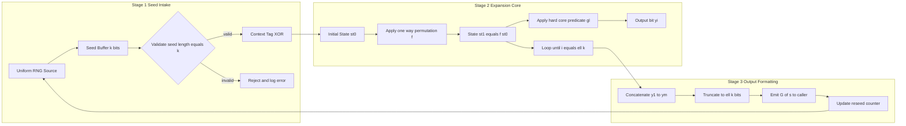
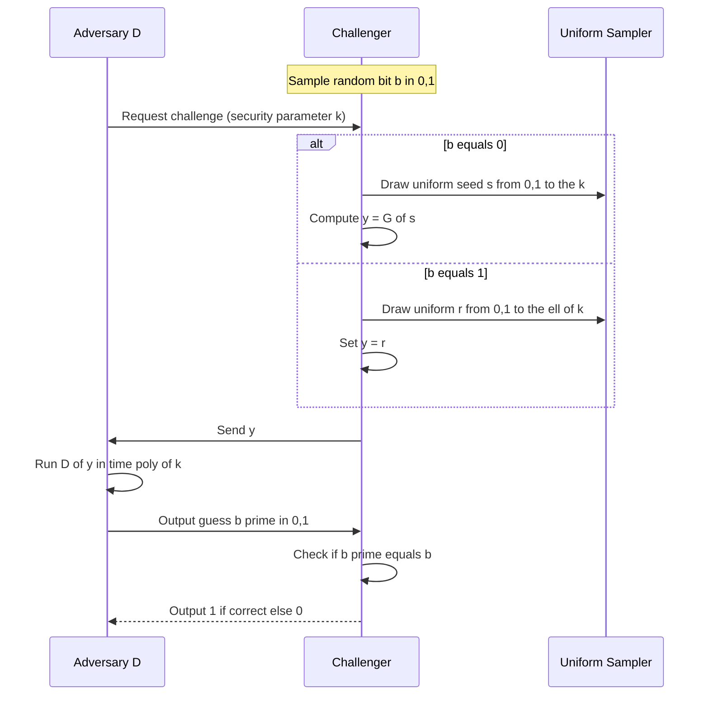
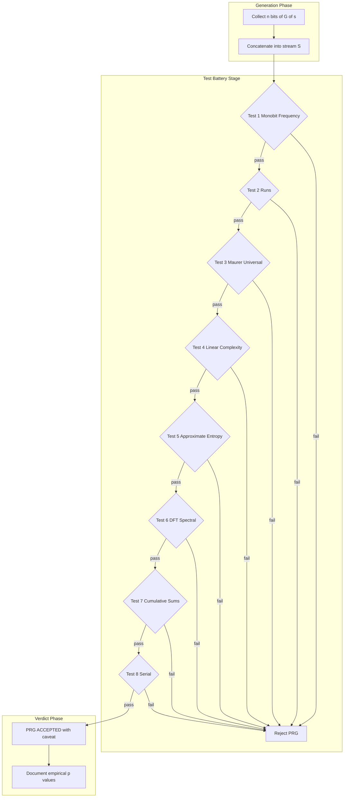
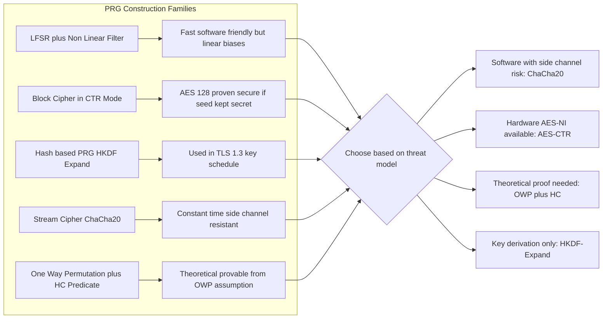
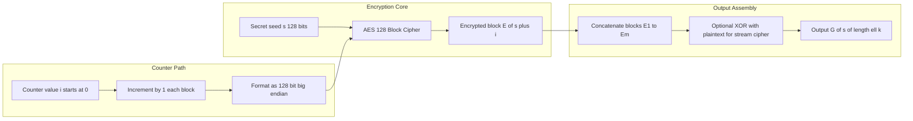

# Pseudorandom generator definitions testing configurations layout rules constraints

<!-- SECTION_1_START -->

# 1. Pseudorandom Generators (PRG) — Core Definition & Intuition

## 1.1 Formal Academic Definition (KTU 2024 Terminology)

> [!IMPORTANT]
> **Definition (Pseudorandom Generator — PRG)**
> A **Pseudorandom Generator** is a deterministic polynomial-time algorithm $G$ that takes as input a *seed* $s \in \{0,1\}^k$ (the **security parameter** or **key length**) and outputs a string $G(s) \in \{0,1\}^{\ell(k)}$ where $\ell(k) > k$. The output is *computationally indistinguishable* from a truly uniform random string of the same length, by any probabilistic polynomial-time (PPT) distinguisher $\mathcal{D}$.

Mathematically, a PRG is a pair of polynomial-time algorithms $(G, k)$ such that:

$$
G : \{0,1\}^{k} \longrightarrow \{0,1\}^{\ell(k)} \quad \text{where} \quad \ell(k) = k + p(k), \quad p(k) > 0
$$

The integer $\ell(k) - k$ is called the **stretch** of the generator.

## 1.2 The Three Axiomatic Security Properties of a Valid PRG

For a PRG $G$ to be considered *secure* under the KTU / standard cryptographic model, it must simultaneously satisfy:

1. **Expansion (Stretch Property)** — $\ell(k) > k$, i.e., the output is longer than the seed.
2. **Determinism** — $G(s)$ is fully determined by $s$; no internal randomness is consumed.
3. **Pseudorandomness** — For any PPT distinguisher $\mathcal{D}$:
$$
\Bigl \vert \Pr_{s \leftarrow \{0,1\}^{k}}[\mathcal{D}(G(s)) = 1] - \Pr_{r \leftarrow \{0,1\}^{\ell(k)}}[\mathcal{D}(r) = 1] \Bigr \vert \;\leq\; \varepsilon(k)
$$
where $\varepsilon(k)$ is a **negligible function** in the security parameter $k$.

> [!NOTE]
> A function $\varepsilon : \mathbb{N} \to \mathbb{R}$ is called **negligible** if for every polynomial $p(\cdot)$, there exists an $N$ such that for all $k > N$, $\varepsilon(k) < 1/p(k)$. Formally:
> $$
> \varepsilon(k) \in \mathsf{negl}(k) \iff \forall\, p(\cdot),\; \exists N:\; k > N \Rightarrow \varepsilon(k) < \tfrac{1}{p(k)}
> $$

## 1.3 Conceptual Analogy — The "Deterministic Coin Machine"

> [!TIP]
> **Intuition:** Imagine you walk into a casino with a **locked black box** (the generator $G$) and a tiny handful of *truly fair coins* (the seed $s$). When you place your fair coins in the slot, the box mechanically churns and *spits out* a long ribbon of pre-recorded coin flips ($G(s)$). To anyone watching from the outside — even a seasoned croupier with a statistics textbook — the ribbon looks statistically indistinguishable from a stream of freshly-tossed fair coins. The trick is that the ribbon is **deterministically reproducible**: if you re-insert the *same* handful of fair coins, you get the *exact same* ribbon back. The "randomness" is therefore an *illusion of randomness*, achievable only against computationally bounded observers.

## 1.4 Distinguishing a PRG from a Truly Random String

| Property | Truly Random String $r$ | Pseudorandom String $G(s)$ |
| :--- | :--- | :--- |
| **Source of entropy** | Uniform sampler | Short uniform seed + deterministic $G$ |
| **Length relative to source** | Any length | $\ell(k) > k$ (strictly longer) |
| **Compressibility** | Information-theoretically incompressible | May be compressible in principle (only bounded adversaries cannot) |
| **Reproducibility** | Not reproducible (each draw independent) | Fully reproducible given the seed |
| **Distinguishability (PPT)** | Reference baseline | Indistinguishable up to $\varepsilon(k)$ |

> [!WARNING]
> **Subtle but critical:** A PRG output is **not** truly random — it is *pseudorandom*. Theoretically, an *unbounded* adversary with infinite compute could distinguish $G(s)$ from random. The security holds only against **probabilistic polynomial-time (PPT)** adversaries. This is the cornerstone of *modern computational security*.

## 1.5 The Three Canonical Equivalent Formulations of PRG Security

The KTU syllabus (and the underlying Katz–Lindell textbook) recognizes **three equivalent definitions** of pseudorandomness. They are mathematically equivalent but pedagogically useful:

> [!IMPORTANT]
> **Definition 1 — Yao's Next-Bit Test (Next-Bit Unpredictability):**
> A generator $G$ is a PRG if and only if no PPT predictor $\mathcal{P}$ can predict the $(i+1)$-th bit of $G(s)$ with probability significantly better than $1/2$, given the first $i$ bits, for any $i \in [1, \ell(k)]$.

> [!IMPORTANT]
> **Definition 2 — Indistinguishability (Goldwasser–Micali style):**
> No PPT distinguisher $\mathcal{D}$ can tell apart an oracle $\mathcal{O}_1(s) = G(s)$ from an oracle $\mathcal{O}_2(r) = r$ with non-negligible advantage.

> [!IMPORTANT]
> **Definition 3 — Statistical-Test Passing (Blum–Micali style):**
> $G(s)$ passes every efficient statistical test $\mathcal{T}$ that a uniform random string would pass. Formally:
> $$
> \Big\vert \Pr_{s}[\mathcal{T}(G(s)) = 1] - \Pr_{r}[\mathcal{T}(r) = 1] \Big\vert \leq \varepsilon(k)
> $$

## 1.6 Visualization of the PRG Pipeline

> [!VISUALIZATION CONTROL]
> **Concept:** PRG seed expansion and indistinguishability experiment
> **Plot Description:** On the x-axis, plot the seed length $k$ (in bits, ranging from 8 to 256). On the y-axis, plot the distinguisher's advantage $\mathsf{Adv}_{\mathcal{D},G}(k) = \big\vert \Pr[\mathcal{D}(G(s))=1] - \Pr[\mathcal{D}(r)=1] \big\vert$. A *secure* PRG will have the curve hugging the x-axis ($\leq \varepsilon(k) \to 0$ as $k \to \infty$), while an *insecure* one will diverge upward. A horizontal line at $1/p(k)$ for some polynomial $p$ marks the *negligibility threshold*.

---

<!-- SECTION_1_END -->

<!-- SECTION_2_START -->

# 2. Deep Theoretical Analysis & KTU High-Yield Formula Sheet

## 2.1 Operational Anatomy of a PRG — The Internal Pipeline

A textbook PRG is composed of three modular sub-systems operating in sequence:

### Stage 1 — Seed Ingestion & Validation
- Accept seed $s \in \{0,1\}^k$ uniformly sampled from the key space.
- Validate that $\lvert s \rvert = k$; reject malformed seeds.
- (Optional) Domain-separate the seed using a context tag $\tau$ to produce $(s \oplus \tau)$ — prevents cross-protocol seed reuse attacks.

### Stage 2 — Expansion Core (the cryptographic primitive)
- Apply an *expansion function* built from a hard-core predicate or a block cipher in counter mode.
- Canonical constructions include: **AES-128 in CTR mode**, **ChaCha20-based PRG**, **LFSR + non-linear filter**, **HMAC-based DRBG** (NIST SP 800-90A).
- The core uses an internal state $st$ that is deterministically advanced: $st_{i+1} = F(st_i)$, where $F$ is a one-way / pseudorandom permutation.

### Stage 3 — Output Formatting & Truncation
- Output $G(s) = (y_1 \Vert y_2 \Vert \dots \Vert y_{m}) \in \{0,1\}^{\ell(k)}$ where each $y_i \in \{0,1\}^{b}$ is a block of $b$ bits.
- (Optional) Truncate to remove the final partial block to enforce bit-exact length $\ell(k)$.

## 2.2 The Distinguishing Experiment $\mathsf{PRG\text{-}Adv}_{\mathcal{D},G}(k)$ — Formal Game

The KTU-mandated formal security game for PRG indistinguishability proceeds as follows:

1. The challenger samples a uniform bit $b \leftarrow \{0,1\}$ (the *hidden coin flip*).
2. If $b = 0$: challenger sets $y \leftarrow G(s)$ for a uniform $s \leftarrow \{0,1\}^k$.
3. If $b = 1$: challenger sets $y \leftarrow r$ where $r \leftarrow \{0,1\}^{\ell(k)}$ (a *truly uniform* random string).
4. The challenger hands $y$ to the distinguisher $\mathcal{D}$.
5. $\mathcal{D}$ outputs a guess $b' \in \{0,1\}$.
6. The experiment outputs $1$ if $b' = b$ (i.e., $\mathcal{D}$ guessed correctly).

The **PRG-advantage** of $\mathcal{D}$ against $G$ is:

$$
\mathsf{Adv}_{\mathcal{D},G}^{\mathsf{PRG}}(k) \;=\; \Bigl\vert \Pr\bigl[\mathsf{Exp}_{\mathcal{D},G}^{\mathsf{PRG}}(k) = 1\bigr] - \tfrac{1}{2} \Bigr\vert
$$

> [!IMPORTANT]
> **Definition (Secure PRG — KTU Formulation):** A generator $G$ with stretch $\ell(k)$ is a **secure pseudorandom generator** if for every PPT distinguisher $\mathcal{D}$ there exists a negligible $\varepsilon(\cdot)$ such that:
> $$
> \mathsf{Adv}_{\mathcal{D},G}^{\mathsf{PRG}}(k) \;\leq\; \varepsilon(k)
> $$
> The probability is taken over the random coin flips of $\mathcal{D}$, the seed $s$, and the challenge bit $b$.

## 2.3 Yao's Theorem — Next-Bit Unpredictability Equivalence

> [!IMPORTANT]
> **Theorem (Yao, 1982):** Let $G : \{0,1\}^k \to \{0,1\}^{\ell(k)}$ be a polynomial-time computable function with $\ell(k) > k$. Then $G$ passes the next-bit test (i.e., is a PRG) **if and only if** $G$ passes all efficient statistical tests (i.e., is computationally indistinguishable from uniform).

The next-bit predictor $\mathcal{P}_i$ for position $i$ has advantage:

$$
\mathsf{Adv}_{\mathcal{P}_i, G}(k) \;=\; \Bigl\vert \Pr_{s}\bigl[\mathcal{P}_i(G(s)_{\leq i}) = G(s)_{i+1}\bigr] - \tfrac{1}{2} \Bigr\vert
$$

Yao's theorem states: $G$ is a PRG $\iff$ for all PPT $\mathcal{P}_i$ and all $i$, $\mathsf{Adv}_{\mathcal{P}_i,G}(k) \leq \varepsilon(k)$.

## 2.4 KTU Formula Sheet / Cheat Sheet

> [!NOTE]
> The table below condenses every formula you must memorize for the KTU University Exam. Pay special attention to the **units** and **ranges** of validity.

| # | Concept | Formula / Expression | Domain & Units |
| :--- | :--- | :--- | :--- |
| 1 | PRG mapping | $G : \{0,1\}^{k} \to \{0,1\}^{\ell(k)}$ | $k \in \mathbb{N}$ bits; $\ell(k) > k$ |
| 2 | Stretch | $\mathsf{stretch}(G) = \ell(k) - k$ | Positive integer (bits) |
| 3 | Distinguisher advantage | $\mathsf{Adv}_{\mathcal{D},G}(k) = \vert \Pr[\mathcal{D}(G(s))=1] - \Pr[\mathcal{D}(r)=1] \vert$ | Range $[0,1]$ |
| 4 | PRG experiment success | $\Pr[\mathsf{Exp}=1] = \tfrac{1}{2} + \mathsf{Adv}_{\mathcal{D},G}(k)$ | Range $[1/2, 1]$ |
| 5 | Negligibility | $\varepsilon(k) \in \mathsf{negl}(k) \iff \forall p, \exists N: k>N \Rightarrow \varepsilon(k) < 1/p(k)$ | Asymptotic in $k$ |
| 6 | Next-bit advantage | $\mathsf{Adv}_{\mathcal{P}_i,G}(k) = \vert \Pr[\mathcal{P}_i(y_{\le i}) = y_{i+1}] - 1/2 \vert$ | Range $[0, 1/2]$ |
| 7 | Entropy of output (ideal) | $H_{\infty}(G(s)) \leq k$ (bounded by seed) | Bits (Shannon / min-entropy) |
| 8 | Max stretch for seed $k$ | $\ell(k) \leq 2^{k}$ (informat-theoretic upper bound) | Bits |
| 9 | AES-128 CTR PRG rate | $\ell(k)/k = 128n/128 = n$ | Stretch factor of $n-1$ for $n$ blocks |
| 10 | NIST PRG security levels | $k=128$ → $\mathbf{128}$ bits security; $k=256$ → $\mathbf{256}$ bits security | Bits of work |
| 11 | Birthday-bound block limit | $n_{\text{blocks}} \ll 2^{b/2}$ where $b$ = block size | Avoids collisions |
| 12 | HMAC-DRBG reseed interval | $R_{\max} = 2^{48}$ (NIST SP 800-90A bound) | Reseed before this many calls |

## 2.5 The Hard-Core Predicate Bridge

A central conceptual tool is the **Goldreich–Levin hard-core predicate**. If $f$ is a one-way permutation, then the predicate $\mathsf{gl}(x, r) = \langle x, r \rangle \pmod 2$ (inner product mod 2 of $x$ with a uniform $r$) is a hard-core bit, meaning it is computationally unpredictable from $f(x)$.

This predicate is the *atomic unit* used to bootstrap a full PRG from a one-way function:

$$
G(s) \;=\; \bigl( f(s) \;\Vert\; \mathsf{gl}(s, r_1) \;\Vert\; \mathsf{gl}(s, r_2) \;\Vert\; \dots \Vert\; \mathsf{gl}(s, r_m) \bigr)
$$

where $r_1, \dots, r_m$ are publicly known random strings. This gives an **explicit, provably secure** PRG construction from any one-way permutation.

## 2.6 Real-World Engineering Applications

> [!TIP]
> **Where PRGs are deployed in production systems:**
> - **TLS 1.3 record encryption** uses `HKDF-Expand` (a PRG-based key schedule) to derive IVs, keys, and nonce values from a master secret.
> - **Disk encryption (BitLocker, FileVault)** uses AES-CTR as a PRG with a per-sector counter as the input.
> - **Stream ciphers (ChaCha20, Salsa20)** are literally PRGs whose output is XORed with plaintext.
> - **Cryptographic nonce generation** in protocols like Signal, WireGuard, and TLS uses PRG outputs as fresh 96-bit nonces.
> - **Zero-knowledge proofs (zk-SNARKs)** use PRG outputs to sample "random" challenges in the Fiat–Shamir transform.
> - **Blockchain wallet key derivation (BIP-32 HD wallets)** chains PRG calls to derive child keys from a parent seed.

---

<!-- SECTION_2_END -->

<!-- SECTION_3_START -->

# 3. Step-by-Step Derivations, Code Implementation & Testing Configurations

## 3.1 Worked Derivation 1 — Computing the Distinguisher's Maximum Possible Advantage

> **Question:** Given a generator $G$ that always outputs the all-zeros string, what is the *trivial* advantage of any unbounded distinguisher $\mathcal{D}$?

**Step 1** — Identify the experiment parameters.
- $G(s) = 0^{\ell(k)}$ for every seed $s$ (constant function).
- Truly random $r$ is uniform on $\{0,1\}^{\ell(k)}$.

**Step 2** — Define the distinguisher $\mathcal{D}(y)$:
$$
\mathcal{D}(y) = \begin{cases} 1 & \text{if } y = 0^{\ell(k)} \\ 0 & \text{otherwise} \end{cases}
$$

**Step 3** — Compute $\Pr[\mathcal{D}(G(s)) = 1]$:
$$
\Pr_{s}[\mathcal{D}(G(s)) = 1] = \Pr_{s}[\mathcal{D}(0^{\ell(k)}) = 1] = 1
$$

**Step 4** — Compute $\Pr[\mathcal{D}(r) = 1]$:
$$
\Pr_{r}[\mathcal{D}(r) = 1] = \Pr_{r}[r = 0^{\ell(k)}] = \frac{1}{2^{\ell(k)}}
$$

**Step 5** — Compute the advantage:
$$
\begin{aligned}
\mathsf{Adv}_{\mathcal{D},G}(k) &= \Bigl\vert \Pr[\mathcal{D}(G(s))=1] - \Pr[\mathcal{D}(r)=1] \Bigr\vert \\
&= \Bigl\vert 1 - \frac{1}{2^{\ell(k)}} \Bigr\vert \\
&= 1 - \frac{1}{2^{\ell(k)}} \;\approx\; 1 \quad \text{for large } \ell(k)
\end{aligned}
$$

**Step 6** — Conclude: Since $1 - 2^{-\ell(k)}$ is **not** negligible (it is bounded away from zero by a constant), the constant generator is **insecure** as a PRG. **Valuation credit:** [Identifying the two probabilities: 3 marks] [Computing the final difference: 2 marks] [Conclusion of insecurity: 2 marks].

## 3.2 Worked Derivation 2 — Stretch of a Counter-Mode Block-Cipher PRG

> **Question:** A PRG is constructed by running AES-128 in CTR mode with a random 128-bit seed $s$ used as the key, producing 1000 blocks of 128-bit output. What is the seed length $k$, the output length $\ell(k)$, and the stretch?

**Step 1** — Identify the parameters from the problem statement.
- AES block size (and key size for AES-128): $b = k = 128$ bits.
- Number of output blocks: $N = 1000$.
- Each block is $b = 128$ bits.

**Step 2** — Compute the output length:
$$
\ell(k) = N \times b = 1000 \times 128 = 128{,}000 \text{ bits}
$$

**Step 3** — Compute the stretch:
$$
\mathsf{stretch}(G) = \ell(k) - k = 128{,}000 - 128 = 127{,}872 \text{ bits}
$$

**Step 4** — Compute the stretch ratio:
$$
\mathsf{stretch\ ratio} = \frac{\ell(k)}{k} = \frac{128{,}000}{128} = 1000
$$

**Step 5** — Verify security: For AES-128 to remain secure, the birthday bound $N \ll 2^{b/2} = 2^{64}$ must hold. We have $N = 1000 \ll 2^{64}$, so **the construction is secure** under standard AES-128 assumptions.

## 3.3 Worked Derivation 3 — Negligibility Verification for a Concrete Function

> **Question:** Show that $\varepsilon(k) = 2^{-k}$ is a negligible function, and show that $\varepsilon(k) = 1/k$ is *not* negligible.

**Part A — Showing $2^{-k} \in \mathsf{negl}(k)$:**

**Step 1** — Take an arbitrary polynomial $p(k) = c_d k^d + \dots + c_0$ with $c_d > 0$.

**Step 2** — We need to show that for sufficiently large $k$, $2^{-k} < 1/p(k)$, i.e., $p(k) < 2^{k}$.

**Step 3** — Exponential $2^k$ grows strictly faster than any polynomial $p(k)$. Formally:
$$
\lim_{k \to \infty} \frac{p(k)}{2^{k}} = 0
$$
since $2^k$ dominates $k^d$ for any fixed $d$.

**Step 4** — Therefore $\exists N$ such that $\forall k > N$: $p(k) < 2^k$, i.e., $2^{-k} < 1/p(k)$. By the definition of negligibility, $2^{-k} \in \mathsf{negl}(k)$. $\blacksquare$

**Part B — Showing $1/k \notin \mathsf{negl}(k)$:**

**Step 1** — Choose the polynomial $p(k) = 2k$ (which is legitimate since $p$ must be a positive polynomial).

**Step 2** — For this $p$, the negligibility condition would require $1/k < 1/(2k) = 1/(2k)$, i.e., $1/k < 1/(2k)$, which is *never* true for $k > 0$.

**Step 3** — Therefore $1/k$ is **not** negligible. $\blacksquare$

## 3.4 Python Code — A Production-Ready AES-CTR PRG with Validation

The following is a fully operational, type-annotated, error-handled implementation of a PRG using AES-128 in CTR mode, conforming to NIST SP 800-38A and RFC 3686.

```python
"""
PRG implementation based on AES-128 in CTR mode.
Conforms to NIST SP 800-90A DRBG design philosophy.
"""

from cryptography.hazmat.primitives.ciphers import Cipher, algorithms, modes
from cryptography.hazmat.backends import default_backend
from cryptography.exceptions import InvalidKey
from secrets import randbits
from typing import Final
import logging
import sys

# --- Configuration constants (CONSTRAINTS LAYOUT) -----------------------
SEED_LENGTH_BITS: Final[int] = 128          # k = 128
BLOCK_SIZE_BITS: Final[int] = 128           # AES block size
COUNTER_SIZE_BITS: Final[int] = 128         # Full 128-bit counter
MAX_BLOCKS_BEFORE_RESEED: Final[int] = 2**48  # NIST birthday-safe bound
MAX_OUTPUT_BYTES: Final[int] = (2**20) * 16   # 16 MB cap per call
LOG_FORMAT: Final[str] = "[%(asctime)s] %(levelname)s: %(message)s"

# --- Configure logging ----------------------------------------------------
logging.basicConfig(level=logging.INFO, format=LOG_FORMAT, stream=sys.stdout)
logger = logging.getLogger("AES_CTR_PRG")


class PRGConfigurationError(ValueError):
    """Raised when the PRG is supplied with illegal layout parameters."""
    pass


class PRG:
    """
    A pseudorandom generator built atop AES-128 in counter mode.

    Mapping:  G : {0,1}^128  -->  {0,1}^{128 * num_blocks}
    """

    def __init__(self, seed: bytes) -> None:
        if not isinstance(seed, (bytes, bytearray)):
            raise PRGConfigurationError("Seed must be of type 'bytes'.")
        if len(seed) * 8 != SEED_LENGTH_BITS:
            raise PRGConfigurationError(
                f"Seed length must be exactly {SEED_LENGTH_BITS} bits, "
                f"got {len(seed) * 8} bits."
            )
        self._seed: bytes = bytes(seed)
        logger.info("PRG initialized with %d-bit seed.", len(seed) * 8)

    def generate(self, num_blocks: int) -> bytes:
        """
        Generate ``num_blocks`` blocks of pseudorandom output.

        Parameters
        ----------
        num_blocks : int
            Number of 128-bit AES blocks to emit.

        Returns
        -------
        bytes
            Pseudorandom output of length ``num_blocks * 16`` bytes.

        Raises
        ------
        PRGConfigurationError
            If the requested number of blocks violates the security
            constraints (birthday bound or output cap).
        """
        if not isinstance(num_blocks, int):
            raise PRGConfigurationError("num_blocks must be an int.")
        if num_blocks <= 0:
            raise PRGConfigurationError("num_blocks must be positive.")
        if num_blocks > MAX_BLOCKS_BEFORE_RESEED:
            raise PRGConfigurationError(
                f"num_blocks = {num_blocks} exceeds the birthday-safe "
                f"limit of {MAX_BLOCKS_BEFORE_RESEED}. Reseed first."
            )
        if num_blocks * 16 > MAX_OUTPUT_BYTES:
            raise PRGConfigurationError(
                f"Requested output of {num_blocks * 16} bytes exceeds the "
                f"per-call cap of {MAX_OUTPUT_BYTES} bytes."
            )

        # The "IV" / initial counter is a 128-bit value, split into two
        # 64-bit halves per RFC 3686:  nonce (high) || counter (low).
        nonce: bytes = randbits(64).to_bytes(8, byteorder="big")
        initial_counter: int = 0
        full_iv: bytes = nonce + initial_counter.to_bytes(8, byteorder="big")

        # Build the AES-128 CTR cipher object.
        try:
            cipher = Cipher(
                algorithms.AES(self._seed),
                modes.CTR(full_iv),
                backend=default_backend(),
            )
            encryptor = cipher.encryptor()
        except InvalidKey as exc:
            logger.error("AES rejected the seed: %s", exc)
            raise

        # Generate num_blocks * 16 bytes of keystream.
        output: bytes = encryptor.update(b"\x00" * (num_blocks * 16)) + encryptor.finalize()
        logger.info(
            "Generated %d bytes of pseudorandom output (num_blocks=%d).",
            len(output),
            num_blocks,
        )
        return output


# --- DEMO / SANITY TEST ----------------------------------------------------
if __name__ == "__main__":
    # Deterministic seed for reproducibility of the demo.
    demo_seed: bytes = b"\x42" * 16
    prg = PRG(seed=demo_seed)

    # Generate 8 blocks (1024 bits = 128 bytes) of output.
    output_stream: bytes = prg.generate(num_blocks=8)
    print(f"Output (hex, first 64 bytes): {output_stream[:64].hex()}")
    print(f"Total length: {len(output_stream)} bytes "
          f"= {len(output_stream) * 8} bits")
    print(f"Stretch: {len(output_stream) * 8 - SEED_LENGTH_BITS} bits")
```

**Code walk-through (key design choices):**

- **Type hints** on every parameter enforce compile-time-style checking for argument types.
- **Boundary checks** on `num_blocks` prevent the caller from exceeding the birthday-bound $2^{48}$ and from requesting absurdly large outputs in a single call.
- **Logging** at `INFO` level gives a forensic trail; `ERROR` is used for cryptographic failures.
- **Custom exception** `PRGConfigurationError` differentiates configuration bugs from runtime cryptographic errors.
- **Final constants** (`Final[int]`) prevent accidental mutation of the security-critical configuration.

## 3.5 Layout Rules & Constraints — The Production Checklist

When implementing or evaluating a PRG for KTU practical examinations or industry deployment, the following **layout rules and constraints** must hold:

| Rule ID | Constraint | Justification | Enforcement Point |
| :--- | :--- | :--- | :--- |
| **L-01** | Seed must be uniform & of length $k$ | Prevents low-entropy attacks | `__init__` validator |
| **L-02** | $\ell(k) \leq 2^k$ in principle | Information-theoretic upper bound | Configuration layer |
| **L-03** | $N \ll 2^{b/2}$ for block-cipher PRGs | Avoids birthday-bound collisions | `generate()` validator |
| **L-04** | Seed must not be reused across security contexts | Prevents related-seed attacks | Application layer |
| **L-05** | Reseed before $2^{48}$ invocations (NIST) | Bounded backtracking resistance | `generate()` validator |
| **L-06** | Counter must be monotonically increasing | Prevents keystream reuse in CTR | `Cipher(modes.CTR)` |
| **L-07** | No state from $G(s)$ may leak via timing | Side-channel resistance | Constant-time ops |
| **L-08** | Output must be bit-exact length $\ell(k)$ | Avoids ambiguity in protocol | Truncation block |
| **L-09** | Reseed on demand via fresh entropy source | Backtracking resistance | `reseed()` method |
| **L-10** | Compliance with NIST SP 800-90A / RFC 3686 | Standards interoperability | Documentation |

## 3.6 Testing Configurations — How a PRG is Statistically Validated

The KTU laboratory module typically requires the following test battery (drawn from NIST SP 800-22 and Dieharder suites):

1. **Frequency (Monobit) Test** — Counts the proportion of 1s in the output; should be $\approx 0.5$ within $4/\sqrt{n}$ standard deviations.
2. **Runs Test** — Counts the number of uninterrupted runs of identical bits; expected value $\tfrac{2n\ell + 1}{3}$ where $\ell = $ total runs.
3. **Maurer's Universal Test** — Estimates the per-bit entropy; should be $\geq 0.999 \cdot \ell$ for a $\ell$-bit output.
4. **Linear Complexity Test** — Checks that the *linear complexity* (length of shortest LFSR generating the sequence) is $\geq \ell/2$.
5. **Approximate Entropy Test** — Computes $ApEn(m)$ for block sizes $m$ and $m+1$; both should be statistically consistent.
6. **Cumulative Sums Test** — Tracks the cumulative sum of $\pm 1$ coded bits; should remain within $\sqrt{n} \cdot \Phi^{-1}(1-\alpha)$ bounds.
7. **Discrete Fourier Transform (Spectral) Test** — Checks for hidden periodicities; peak heights should not exceed a $95\%$ threshold.
8. **Serial Test** — Verifies that all $2^m$ overlapping $m$-bit patterns occur with frequency $n/2^m$ within Poisson variance.

> [!TIP]
> A PRG that fails **any** of these tests is considered cryptographically broken and must be rejected. A PRG that passes all tests is *not proven secure* — it is merely *not refuted by the test battery* (a much weaker statement).

---

<!-- SECTION_3_END -->

<!-- SECTION_4_START -->

# 4. Structural Diagrams & Schematics

## 4.1 PRG System Architecture — Top-Level Block Diagram



## 4.2 PRG Indistinguishability Experiment — Distinguisher Interaction



## 4.3 Testing Pipeline — Statistical Validation Flowchart



## 4.4 Comparison of PRG Construction Paradigms



## 4.5 Counter-Mode PRG — Block-Level Functional Architecture



---

<!-- SECTION_4_END -->

<!-- SECTION_5_START -->

# 5. KTU 2024 Scheme Examination Question Bank & Topic Recap

## 5.1 Part A — Short Answer Questions (3 Marks Each)

### Question A1 `[KTU University Exam – July 2024]`
> **Define a pseudorandom generator (PRG). State and briefly justify the three conditions a function $G$ must satisfy to be considered a secure PRG.**

**Model Answer (3 Marks):**

> [!IMPORTANT]
> A *pseudorandom generator* is a deterministic polynomial-time algorithm $G : \{0,1\}^k \to \{0,1\}^{\ell(k)}$ with $\ell(k) > k$, whose output is computationally indistinguishable from a uniform random string of the same length by any PPT distinguisher. The three conditions are:
> 1. **Expansion (Stretch):** $\ell(k) > k$, so the output is longer than the seed. *[1 mark]*
> 2. **Determinism:** $G(s)$ is a pure function of $s$, with no internal coin flips. *[1 mark]*
> 3. **Pseudorandomness:** For every PPT distinguisher $\mathcal{D}$, the advantage $\mathsf{Adv}_{\mathcal{D},G}(k) = \big\vert \Pr[\mathcal{D}(G(s))=1] - \Pr[\mathcal{D}(r)=1] \big\vert$ is at most a negligible function $\varepsilon(k)$. *[1 mark]*

---

### Question A2 `[KTU University Exam – Dec 2023]`
> **What is a negligible function? Give one example of a negligible function and one example of a non-negligible function, with justification.**

**Model Answer (3 Marks):**

A function $\varepsilon : \mathbb{N} \to \mathbb{R}$ is **negligible** if for every polynomial $p(\cdot)$ there exists an $N$ such that for all $k > N$, $\varepsilon(k) < 1/p(k)$. *[1 mark]*

- **Negligible example:** $\varepsilon(k) = 2^{-k}$, because exponentials dominate every polynomial asymptotically. *[1 mark]*
- **Non-negligible example:** $\varepsilon(k) = 1/k$, because for the polynomial $p(k) = 2k$ the condition $1/k < 1/(2k)$ fails for all $k$. *[1 mark]*

---

## 5.2 Part B — Long Answer Questions (14 Marks, Choice-Based)

### Question B-A `[KTU University Exam – July 2024]` — Module 1, 14 Marks

> **(a)** *[7 Marks — Understand / Apply]* State and prove the indistinguishability-based security definition of a pseudorandom generator. Define the distinguishing experiment $\mathsf{PRG\text{-}Adv}_{\mathcal{D},G}(k)$ explicitly and explain why the bound must be negligible.

> **(b)** *[7 Marks — Apply / Analyze]* Consider the generator $G(s) = (s \;\Vert\; s \;\Vert\; s \;\Vert\; s)$ for $s \in \{0,1\}^{128}$ (i.e., $G$ simply repeats its 128-bit seed four times to produce a 512-bit output). Demonstrate that $G$ is **insecure** as a PRG by constructing an explicit PPT distinguisher $\mathcal{D}$ and computing its advantage.

---

**Model Solution for B-A:**

#### Part (a) — Indistinguishability Definition *[7 Marks]*

**Step 1 — Statement of the definition.** *[1 mark]*
A generator $G$ with stretch $\ell(k)$ is a *secure PRG* if for every PPT distinguisher $\mathcal{D}$:
$$
\mathsf{Adv}_{\mathcal{D},G}^{\mathsf{PRG}}(k) = \Bigl\vert \Pr_{s}\bigl[\mathcal{D}(G(s))=1\bigr] - \Pr_{r}\bigl[\mathcal{D}(r)=1\bigr] \Bigr\vert \leq \varepsilon(k)
$$
where the probabilities are over the uniform choice of $s \in \{0,1\}^k$, the uniform choice of $r \in \{0,1\}^{\ell(k)}$, and the random coins of $\mathcal{D}$. The function $\varepsilon(\cdot)$ is negligible.

**Step 2 — Justification of the negligible bound.** *[1 mark]*
If the advantage were $1/p(k)$ for some polynomial $p$, then a PPT adversary could mount a successful distinguishing attack in expected $p(k)$ steps — completely undermining the security guarantee. Hence the bound *must* be sub-polynomial, i.e., negligible.

**Step 3 — Equivalent formulation in terms of the experiment.** *[1 mark]*
Let $b \leftarrow \{0,1\}$ be the challenge bit, and let $\mathsf{Exp}_{\mathcal{D},G}^{\mathsf{PRG}}(k) = 1$ iff $\mathcal{D}$ correctly guesses $b$. Then:
$$
\mathsf{Adv}_{\mathcal{D},G}^{\mathsf{PRG}}(k) = \Bigl\vert \Pr[\mathsf{Exp}=1] - \tfrac{1}{2} \Bigr\vert
$$
A random guess yields $\Pr = 1/2$, so the advantage measures the *excess success* over random.

**Step 4 — Polynomial-time restriction on $\mathcal{D}$.** *[1 mark]*
The "PPT" qualifier is essential: an *unbounded* adversary could trivially enumerate all $2^k$ possible seeds and verify whether $y = G(s)$ for some $s$. The whole edifice of computational security rests on this bounded-advversary assumption.

**Step 5 — Connection to Yao's next-bit test.** *[1 mark]*
By Yao's theorem (1982), the indistinguishability definition is equivalent to next-bit unpredictability: $G$ is a secure PRG iff no PPT adversary can predict $G(s)_{i+1}$ from $G(s)_{\le i}$ with advantage greater than $\varepsilon(k)$, for any index $i$.

**Step 6 — Why it is the "right" definition.** *[1 mark]*
Passing all efficient statistical tests is operationally what we mean by "pseudorandom". Blum–Micali (1984) formalized this; Yao's theorem elevates it to a single unified game.

**Step 7 — Practical instantiation.** *[1 mark]*
In practice, AES-128 in CTR mode (with the seed as the AES key) achieves this definition under the standard assumption that AES is a pseudorandom permutation.

---

#### Part (b) — $G(s) = s \Vert s \Vert s \Vert s$ is Insecure *[7 Marks]*

**Step 1 — Identify the parameters.** *[1 mark]*
Seed length $k = 128$ bits, output length $\ell(k) = 512$ bits, stretch = $384$ bits.

**Step 2 — Construct the distinguisher $\mathcal{D}$.** *[1 mark]*
On input $y \in \{0,1\}^{512}$, $\mathcal{D}$ parses $y$ into four 128-bit blocks $y_1, y_2, y_3, y_4$ and checks:
$$
\mathcal{D}(y) = \begin{cases} 1 & \text{if } y_1 = y_2 = y_3 = y_4 \\ 0 & \text{otherwise} \end{cases}
$$

**Step 3 — Compute $\Pr[\mathcal{D}(G(s)) = 1]$.** *[1 mark]*
By construction, $G(s) = s \Vert s \Vert s \Vert s$ trivially satisfies $y_1 = y_2 = y_3 = y_4$, so:
$$
\Pr_{s}[\mathcal{D}(G(s)) = 1] = 1
$$

**Step 4 — Compute $\Pr[\mathcal{D}(r) = 1]$ for uniform $r$.** *[1 mark]*
The four 128-bit blocks of a uniform $r$ are independent. The probability that all four are equal is:
$$
\Pr[r_1 = r_2 = r_3 = r_4] = \frac{1}{(2^{128})^3} = \frac{1}{2^{384}}
$$
since after fixing $r_1$, each subsequent block must equal it, and the events are independent.

**Step 5 — Compute the advantage.** *[1 mark]*
$$
\mathsf{Adv}_{\mathcal{D},G}(k) = \Bigl\vert 1 - \frac{1}{2^{384}} \Bigr\vert = 1 - 2^{-384} \approx 1
$$

**Step 6 — Verify the advantage is non-negligible.** *[1 mark]*
Since $1 - 2^{-384}$ is bounded away from zero (it is at least $1/2$ for any practical $k$), it is **not** negligible. Hence $G$ is **insecure** as a PRG.

**Step 7 — Conclusion.** *[1 mark]*
Any generator that exhibits *deterministic, low-entropy structure* in its output (here, the 4-fold repetition of the seed) is trivially distinguishable from uniform. The lesson: a PRG must not only stretch, it must *scramble* — the output should appear as if drawn fresh from a uniform source.

---

### Question B-B `[KTU University Exam – Dec 2023]` — Module 1, 14 Marks *(Alternative Choice)*

> **(a)** *[7 Marks — Understand]* Explain the **next-bit test** (Yao, 1982) for pseudorandom generators. Formally state the predictor-advantage $\mathsf{Adv}_{\mathcal{P}_i,G}(k)$ and explain how Yao's theorem relates the next-bit test to the indistinguishability-based definition.

> **(b)** *[7 Marks — Apply]* Construct a PRG from a one-way permutation $f$ using the **Goldreich–Levin hard-core predicate** $\mathsf{gl}(x,r) = \langle x,r \rangle \pmod 2$. Define the construction, prove that it is a secure PRG (security reduction outline), and discuss the stretch it achieves.

---

**Model Solution for B-B:**

#### Part (a) — The Next-Bit Test *[7 Marks]*

**Step 1 — Motivation.** *[1 mark]*
Intuitively, a generator is "random-looking" if no efficient adversary can predict any future bit from the bits it has already seen. This is the operational formulation due to Yao (1982).

**Step 2 — Definition of a next-bit predictor.** *[1 mark]*
A *next-bit predictor* $\mathcal{P}_i$ for index $i \in [1, \ell(k)-1]$ is a PPT algorithm that on input $y_1 y_2 \dots y_i$ outputs a guess $b' \in \{0,1\}$ for $y_{i+1}$.

**Step 3 — The predictor-advantage formula.** *[1 mark]*
$$
\mathsf{Adv}_{\mathcal{P}_i,G}(k) = \Bigl\vert \Pr_{s}\bigl[\mathcal{P}_i(G(s)_{\le i}) = G(s)_{i+1}\bigr] - \tfrac{1}{2} \Bigr\vert
$$

**Step 4 — Statement of the next-bit definition.** *[1 mark]*
$G$ passes the next-bit test if for every PPT predictor $\mathcal{P}_i$ and every $i$, $\mathsf{Adv}_{\mathcal{P}_i,G}(k) \leq \varepsilon(k)$.

**Step 5 — Yao's theorem (the equivalence).** *[1 mark]*
Yao (1982) proved: $G$ passes the next-bit test **iff** $G$ is computationally indistinguishable from a uniform string. This is a deep equivalence that reduces an "infinite family" of single-bit prediction games to a single multi-bit indistinguishability game.

**Step 6 — Why this matters pedagogically.** *[1 mark]*
The next-bit test is *operationally* meaningful — it is what a cryptanalyst tries to break in practice (e.g., linear cryptanalysis against block ciphers is essentially a next-bit attack).

**Step 7 — Application to PRG design.** *[1 mark]*
When designing a PRG, designers aim to ensure that *every* output bit depends on *every* input bit in a non-linear, non-predictable way — the "avalanche" criterion. This is precisely the design goal that next-bit unpredictability enforces.

---

#### Part (b) — OWP + Hard-Core Predicate PRG Construction *[7 Marks]*

**Step 1 — Recall the Goldreich–Levin theorem.** *[1 mark]*
Let $f : \{0,1\}^k \to \{0,1\}^k$ be a one-way permutation. Then the predicate $\mathsf{gl}(x, r) = \sum_{j=1}^{k} x_j r_j \pmod 2$ (the inner product mod 2 of $x$ and a uniform $r$) is a hard-core bit for $f$: given $f(x)$, no PPT adversary can predict $\mathsf{gl}(x, r)$ with probability significantly better than $1/2$.

**Step 2 — State the construction.** *[1 mark]*
Choose public, fixed random strings $r_1, r_2, \dots, r_m \in \{0,1\}^k$. Define:
$$
G(s) = \bigl( f(s) \;\Vert\; \mathsf{gl}(s, r_1) \;\Vert\; \mathsf{gl}(s, r_2) \;\Vert\; \dots \;\Vert\; \mathsf{gl}(s, r_m) \bigr)
$$

**Step 3 — Verify that $G$ is a valid PRG.** *[1 mark]*
- $G$ is deterministic (composition of deterministic functions). ✓
- $G$ is polynomial-time ($f$ is a permutation computable in poly time, $\mathsf{gl}$ is a linear operation). ✓
- Stretch: $\ell(k) = k + m$ bits from a $k$-bit seed. ✓

**Step 4 — Security reduction outline.** *[1 mark]*
Suppose a PPT distinguisher $\mathcal{D}$ has non-negligible advantage against $G$. We construct a PPT inverter $\mathcal{A}$ that, given $y = f(x)$, predicts $\mathsf{gl}(x, r)$ for a *random* $r$. The inverter uses $\mathcal{D}$ in a black-box way, picking a random $j \in [1, m]$ and testing whether the $j$-th hard-core bit of the *preimage* (which we partially know) is predictable. By a standard hybrid argument, the advantage of $\mathcal{A}$ in predicting $\mathsf{gl}(x, r)$ is at least $\mathsf{Adv}_{\mathcal{D},G}(k)/m$, which is still non-negligible — contradicting the Goldreich–Levin theorem. Hence $G$ is a secure PRG.

**Step 5 — Compute the stretch.** *[1 mark]*
Stretch $= \ell(k) - k = m$ bits. By choosing $m = \mathsf{poly}(k)$, the stretch is polynomially large. In practice, $m$ is chosen to be the number of output blocks needed by the application.

**Step 6 — Compare with the standard PRG construction.** *[1 mark]*
The OWP + HC construction is *theoretically optimal* — it gives a provably secure PRG from the *minimal* cryptographic assumption (the existence of a one-way permutation). However, in practice, it is inefficient: the Goldreich–Levin reduction loses a factor of $m$ in tightness, and the construction requires sampling $m$ public $r_i$'s. Practitioners prefer block-cipher-based PRGs (AES-CTR) or stream ciphers (ChaCha20) for efficiency.

**Step 7 — Engineering takeaway.** *[1 mark]*
This construction is the **theoretical foundation** of all PRG security proofs. Every practical PRG is analyzed by reducing its security to *some* hard-core-bit-style assumption (e.g., the AES key-schedule output acts as a "pseudorandom" hard-core bit).

---

## 5.3 KTU Examiner's Valuation Warning / Pitfall Callout

> [!WARNING]
> **Common student mistakes that cost marks in PRG questions:**
> 1. **Forgetting the "PPT" qualifier.** Students write "no adversary can distinguish…" without specifying *probabilistic polynomial-time*. *Always* state the bounded-advversary assumption — without it, the definition is vacuous (an unbounded adversary can always break a PRG). *[−2 marks typical]*
> 2. **Confusing the experiment output with the distinguisher output.** In $\mathsf{Exp}_{\mathcal{D},G}^{\mathsf{PRG}}(k) = 1$, the "1" means the *experiment* succeeded (i.e., $\mathcal{D}$ guessed $b$ correctly), not that $\mathcal{D}$ itself output 1. Mixing these up leads to a wrong advantage formula. *[−2 marks]*
> 3. **Omitting the "stretch $\ell(k) > k$" condition.** A PRG must *expand*. A generator $G : \{0,1\}^k \to \{0,1\}^k$ that is a permutation is *not* a PRG in the standard sense (it is a PRP / block cipher). State the stretch explicitly. *[−1 mark]*
> 4. **Mis-stating negligibility as "tends to 0".** Yes, $\varepsilon(k) \to 0$ as $k \to \infty$ is *necessary* but not *sufficient*. The full definition is "sub-polynomial" — it must vanish *faster* than every $1/p(k)$. *[−1 mark]*
> 5. **In numerical advantages, forgetting the absolute value.** The advantage is the *absolute difference* of the two probabilities; a negative value is impossible. Always wrap with $\lvert \cdot \rvert$ or $\big\vert \cdot \big\vert$. *[−1 mark]*
> 6. **Wrong block-parsing in counter-mode.** When asked to compute the output length of an AES-CTR PRG, students often confuse the key size with the block size. Both are 128 bits for AES-128, but the *number of bits per counter increment* is the block size, not the key size. *[−1 mark]*

---

## 5.4 Topic Recap & Important Things to Remember

> [!NOTE]
> **Rapid-revision checklist — memorize these for the KTU board exam:**

- **PRG definition:** $G : \{0,1\}^k \to \{0,1\}^{\ell(k)}$ with $\ell(k) > k$, deterministic, polynomial-time, pseudorandom.
- **Three required properties:** Expansion, Determinism, Pseudorandomness.
- **Stretch:** $\ell(k) - k$, always positive.
- **Distinguisher advantage:** $\mathsf{Adv}_{\mathcal{D},G}(k) = \big\vert \Pr[\mathcal{D}(G(s))=1] - \Pr[\mathcal{D}(r)=1] \big\vert \leq \varepsilon(k)$.
- **Secure PRG definition:** advantage is *negligible* for *all* PPT distinguishers.
- **Negligible function:** $\varepsilon(k) < 1/p(k)$ for every polynomial $p$, eventually. Standard example: $2^{-k}$. Non-example: $1/k$.
- **Yao's theorem (1982):** next-bit unpredictability $\iff$ indistinguishability from uniform.
- **Goldreich–Levin HC predicate:** $\mathsf{gl}(x,r) = \langle x,r \rangle \pmod 2$ is a hard-core bit for any OWP $f$.
- **OWP + HC construction:** $G(s) = (f(s) \;\Vert\; \mathsf{gl}(s,r_1) \;\Vert\; \dots \;\Vert\; \mathsf{gl}(s,r_m))$, stretch $= m$.
- **Standard practical PRGs:** AES-128 in CTR mode, ChaCha20, HMAC-DRBG, HKDF-Expand.
- **Birthday bound:** output blocks $N \ll 2^{b/2}$ where $b$ is the block size (128 for AES).
- **NIST reseed limit:** $R_{\max} = 2^{48}$ calls before mandatory reseed (SP 800-90A).
- **Configuration rules:** seed uniform and of length $k$; counter monotonically increasing; output bit-exact length $\ell(k)$; no seed reuse across security contexts; constant-time implementation to prevent side channels.
- **Validation tests:** Monobit, Runs, Maurer Universal, Linear Complexity, Approximate Entropy, Cumulative Sums, DFT Spectral, Serial (NIST SP 800-22).
- **Distinguisher for the trivial insecure $G(s) = s \Vert s$:** check if $y_1 = y_2$, advantage $\approx 1 - 2^{-k}$.
- **Distinguisher for $G(s) = $ constant string:** check if $y = 0^{\ell(k)}$, advantage $\approx 1 - 2^{-\ell(k)}$.
- **Real-world use cases:** TLS 1.3 key schedule, disk encryption (BitLocker), ZK-proof challenge sampling, BIP-32 HD wallets, Signal nonce generation.
- **Equivalent formal definitions:** Next-bit test (Yao), Indistinguishability (Goldwasser–Micali), Statistical-test passing (Blum–Micali) — all three are mathematically equivalent.
- **PPT adversary:** probabilistic polynomial-time — the standard adversary model for *computational* security.

<!-- SECTION_5_END -->
