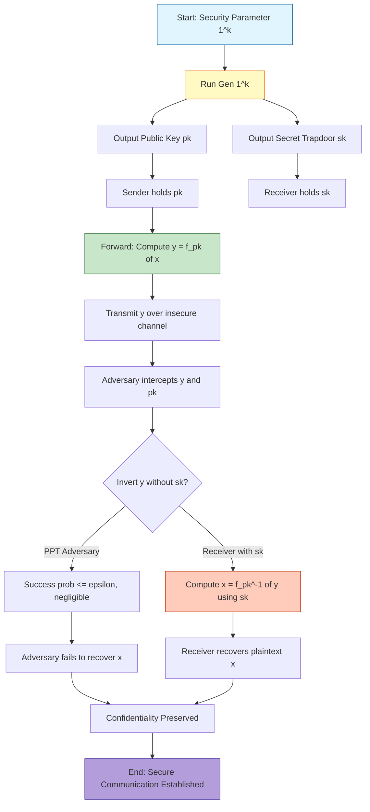
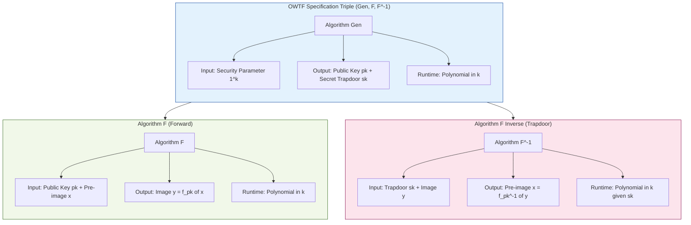
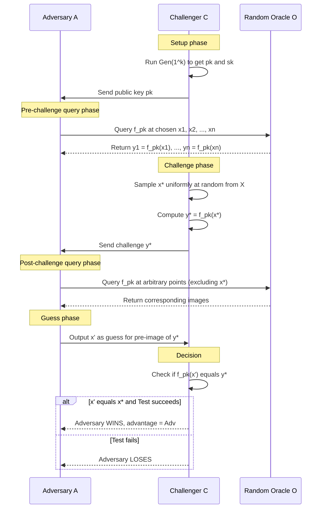

# One-way trapdoor function specifications mathematical formulations parameters rules

<!-- SECTION_1_START -->
# One-Way Trapdoor Functions — Specifications, Mathematical Formulations, Parameters & Rules

## 1.1 Formal Academic Definition (KTU 2024 Syllabus Terminology)

A **One-Way Trapdoor Function (OWTF)** is a mathematical function $f : \mathcal{X} \rightarrow \mathcal{Y}$ equipped with auxiliary secret information (the *trapdoor*) that satisfies three concurrent properties. It is the foundational primitive underlying every modern **public-key cryptosystem** (RSA, Rabin, ElGamal, Paillier, etc.).

> [!IMPORTANT]
> **Syllabus Highlight (PECST610 — Module 2):**
> A *one-way trapdoor function* is the cornerstone of asymmetric cryptography. It transforms a hard computational problem (factoring, discrete log) into a usable cryptographic building block by binding difficulty to the *absence* of a small secret value $t$.

### Formal Triple Definition

A trapdoor function family is formally specified as a triple of probabilistic polynomial-time (PPT) algorithms:

$$
\mathcal{F} \;=\; (\text{Gen}, \; F, \; F^{-1})
$$

such that:

1. **$\text{Gen}(1^k) \rightarrow (pk, sk)$** — On input a security parameter $1^k$, outputs a public key $pk$ and a secret trapdoor $sk$.
2. **$F(pk, x) \rightarrow y$** — Computes $y = f_{pk}(x)$ efficiently for any $x \in \mathcal{X}$.
3. **$F^{-1}(sk, y) \rightarrow x$** — Uses trapdoor $sk$ to recover $x = f_{pk}^{-1}(y)$ efficiently.

The **one-wayness** property requires that for every PPT adversary $\mathcal{A}$:

$$
\Pr\bigl[x \xleftarrow{\$} \mathcal{X} \; ; \; y = f_{pk}(x) \; ; \; \mathcal{A}(pk, y) = x'\bigr] \; \leq \; \varepsilon(k)
$$

where $\varepsilon(k)$ is a **negligible function** in the security parameter $k$ (i.e., $\varepsilon(k) < k^{-c}$ for all $c > 0$ and sufficiently large $k$).

---

## 1.2 Conceptual Analogy & Engineering Intuition

> [!NOTE]
> **The "Locked Mailbox" Analogy** — *Intuition for first-time learners:*
>
> Imagine a metal mailbox bolted to a wall.
> - **Dropping a letter in (computing $f$):** Easy and instant. Anyone walking by can do it.
> - **Retrieving a letter without a key (inverting $f$ without trapdoor):** Physically impossible without breaking the lock — would require picking, drilling, or cutting.
> - **Retrieving a letter with a key (inverting $f$ with trapdoor $t$):** Trivial for the key-holder; one smooth turn of the wrist.
>
> The mailbox embodies a trapdoor function: forward direction is universally easy, but the inverse becomes trivial only with the secret $t$.

### A Second Intuition — The Padlock Number Trick

Consider multiplication of two large primes $p$ and $q$:
- **Forward (multiply):** $n = p \times q$ — trivial even for numbers with 600 digits.
- **Reverse (factor):** Given only $n$, recover $p, q$ — believed computationally infeasible for classical computers.
- **Trapdoor:** Knowing $p$ and $q$ individually makes the reverse operation instantaneous.

This is the *engineered hardness* that RSA exploits.

---

## 1.3 Explicit Parameter Glossary

The following parameters appear universally in trapdoor function specifications:

| Symbol | Meaning | Typical Magnitude |
| :--- | :--- | :--- |
| $k$ | Security parameter (unary $1^k$ input) | $k = 128, 192, 256$ bits |
| $\mathcal{X}$ | Domain (plaintext / pre-image space) | $\{0, 1\}^{\ell}$ with $\ell \approx k$ |
| $\mathcal{Y}$ | Codomain / Range (ciphertext space) | $\{0, 1\}^{L}$ with $L \geq k$ |
| $pk$ | Public evaluation key | Sampled by $\text{Gen}$ |
| $sk$ | Secret trapdoor key | Sampled by $\text{Gen}$ |
| $t$ | Auxiliary trapdoor information | Embedded in $sk$ |
| $\varepsilon(k)$ | Adversary's success probability | Negligible in $k$ |
| $T(k)$ | Adversary's runtime | Polynomial in $k$ |

> [!VISUALIZATION CONTROL]
> **Concept:** Mapping Structure of a Trapdoor Function
> **GeoGebra / Desmos Input Equations (conceptual plot of domain-to-codomain map):**
> * `f(x) = x^e mod n` (RSA forward direction, illustrative)
> * `x = 1, 2, 3, ..., 50`
> * `n = 2773`, `e = 17` (small RSA toy parameters)
> **Visual Description:** On the horizontal axis plot the integer inputs $x \in \{1, \dots, 50\}$ from $\mathcal{X} = \mathbb{Z}_n^*$. On the vertical axis plot $f(x) = x^e \bmod n$. The student should observe a *pseudo-random scatter* of points in $\mathcal{Y} = \mathbb{Z}_n^*$ — there is **no visible pattern** that allows recovering $x$ from $y$, illustrating the one-wayness visually. The trapdoor (factorization of $n = 2773 = 47 \times 59$) would immediately dissolve this apparent chaos.

---

## 1.4 Why Trapdoor Functions Matter in Engineering

> [!IMPORTANT]
> **Engineering Significance:**
> Every time your browser displays a green padlock (HTTPS), a TLS handshake has completed using a trapdoor function (typically **ECDHE + RSA / ECDSA**). The server's RSA public key is a *trapdoor one-way permutation*, and the certificate authority's signature over the certificate uses a related primitive. Without OWTFs, there is no digital signature, no key exchange, no public-key encryption, and no blockchain transaction signing.

---

<!-- SECTION_1_END -->

<!-- SECTION_2_START -->
# Deep Theoretical Analysis & KTU High-Yield Formula Sheet

## 2.1 The Three Pillars of a Trapdoor Function

A valid OWTF must satisfy three structural properties. The KTU 2024 examiner expects you to **state, explain, and exemplify** each.

### Pillar 1 — Easy Forward Computation
For all $(pk, sk)$ in the range of $\text{Gen}(1^k)$ and for all $x \in \mathcal{X}$:

$$
\text{Time}\bigl(F(pk, x)\bigr) \;=\; \text{poly}(k)
$$

The forward direction must be computable in **polynomial time** in the security parameter. For RSA, this corresponds to modular exponentiation via repeated squaring — $O(\log e \cdot \log^2 n)$ bit operations.

### Pillar 2 — Hard Inversion Without Trapdoor
For every PPT adversary $\mathcal{A}$:

$$
\Pr_{(pk, sk)}\Bigl[\mathcal{A}(pk, \, f_{pk}(x)) = x\Bigr] \; \leq \; \varepsilon(k)
$$

The probability of recovering $x$ from $(pk, y)$ given only the public key is negligible. This is the **one-wayness** property.

### Pillar 3 — Easy Inversion With Trapdoor
For the legitimate party holding $sk$:

$$
\text{Time}\bigl(F^{-1}(sk, y)\bigr) \;=\; \text{poly}(k)
$$

Decryption / inversion is polynomial-time **iff** the trapdoor is known. For RSA, the trapdoor is $(p, q, d)$ where $d = e^{-1} \bmod \varphi(n)$ and $\varphi(n) = (p-1)(q-1)$.

---

## 2.2 Additional Security Properties (Extended Formulation)

A *strong* trapdoor function family may also satisfy:

| Property | Formal Statement | Engineering Use |
| :--- | :--- | :--- |
| **Pre-image Resistance** | $\Pr[\mathcal{A}(y) \in f^{-1}(y)] \leq \varepsilon(k)$ | Base OW security |
| **Second Pre-image Resistance** | $\Pr[\mathcal{A}(x) \in f^{-1}(f(x)) \setminus \{x\}] \leq \varepsilon(k)$ | Tamper detection |
| **Collision Resistance** | $\Pr[\mathcal{A}(x_1 \neq x_2, f(x_1) = f(x_2))] \leq \varepsilon(k)$ | Hash functions, signatures |
| **Trapdoor Coll. Resist.** | Infeasible to find $(x_1, x_2)$ with $f(x_1) = f(x_2)$ **and** both invertible via $sk$ | Key-privacy in PKE |
| **Semantic Security (IND-CPA)** | $(pk, \text{Enc}(m_0)) \;\stackrel{c}{\approx}\; (pk, \text{Enc}(m_1))$ | Modern encryption |

> [!NOTE]
> A *permutation* trapdoor function (e.g., RSA over $\mathbb{Z}_n^*$) has $|\mathcal{X}| = |\mathcal{Y}|$, and is bijective. A *non-permutation* trapdoor function (e.g., Rabin) has $|\mathcal{X}| > \vert \mathcal{Y} \vert$ and is many-to-one — the inverse is a set, not a single value.

---

## 2.3 Mathematical Formulation in Full Generality

Let $\mathcal{F} = \{\mathcal{F}_k\}_{k \in \mathbb{N}}$ be a family of functions indexed by the security parameter $k$. Each $\mathcal{F}_k$ is a finite set of functions $f : \mathcal{X}_k \to \mathcal{Y}_k$ accompanied by a trapdoor set $\mathcal{T}_k$.

The formal specification is the 6-tuple:

$$
\Pi \;=\; \bigl(\text{Setup}, \; \text{KeyGen}, \; \text{Eval}, \; \text{Invert}, \; \text{Test}, \; \text{Sample}\bigr)
$$

where each algorithm is defined as:

$$
\begin{aligned}
\text{Setup}(1^k) &\;\rightarrow\; \lambda \\[4pt]
\text{KeyGen}(\lambda) &\;\rightarrow\; (pk, sk) \\[4pt]
\text{Eval}(pk, x) &\;\rightarrow\; y \;\; \text{where } y = f_{pk}(x) \\[4pt]
\text{Invert}(sk, y) &\;\rightarrow\; x \;\; \text{where } x \in f_{pk}^{-1}(y) \\[4pt]
\text{Test}(pk, x, y) &\;\rightarrow\; b \in \{0, 1\} \quad \text{(accept iff } f_{pk}(x) = y\text{)} \\[4pt]
\text{Sample}(pk) &\;\rightarrow\; x \in \mathcal{X}_k \quad \text{(uniform sample)}
\end{aligned}
$$

The **correctness** requirement is:

$$
\forall (pk, sk) \xleftarrow{\$} \text{KeyGen}(\lambda), \; \forall x \in \mathcal{X}_k: \quad \text{Test}(pk, x, \text{Invert}(sk, \text{Eval}(pk, x))) = 1
$$

The **one-wayness** game $\text{OW-CMA}^b$ (One-Wayness under Chosen-Message Adversary) is:

$$
\begin{aligned}
\text{Exp}_{\mathcal{F}, \mathcal{A}}^{\text{OW-CMA}} &: \\[4pt]
1.\;& (pk, sk) \xleftarrow{\$} \text{KeyGen}(\lambda) \\
2.\;& x \xleftarrow{\$} \text{Sample}(pk) \\
3.\;& y \leftarrow \text{Eval}(pk, x) \\
4.\;& x' \leftarrow \mathcal{A}(pk, y) \\
5.\;& \text{Return } 1 \text{ if } \text{Test}(pk, x', y) = 1
\end{aligned}
$$

The **advantage** of $\mathcal{A}$ is:

$$
\text{Adv}_{\mathcal{F}, \mathcal{A}}^{\text{OW-CMA}}(\lambda) \;=\; \Pr\bigl[\text{Exp}_{\mathcal{F}, \mathcal{A}}^{\text{OW-CMA}}(\lambda) = 1\bigr]
$$

A trapdoor function family is **secure** if for every PPT $\mathcal{A}$:

$$
\text{Adv}_{\mathcal{F}, \mathcal{A}}^{\text{OW-CMA}}(\lambda) \; \leq \; \varepsilon(\lambda)
$$

for some negligible function $\varepsilon$.

---

## 2.4 KTU Formula Sheet & Cheat Sheet

> [!IMPORTANT]
> **Print-ready reference table for KTU ESE 2024:**

| # | Symbol / Formula | Description | Constraints / Units |
| :--- | :--- | :--- | :--- |
| 1 | $f : \mathcal{X} \rightarrow \mathcal{Y}$ | Trapdoor function map | $\mathcal{X}, \mathcal{Y} \subseteq \{0, 1\}^*$ |
| 2 | $\varepsilon(k) \leq k^{-c}$ | Negligibility definition | For all $c \in \mathbb{N}$, large $k$ |
| 3 | $\text{Gen}(1^k) \to (pk, sk)$ | Key generation | PPT algorithm |
| 4 | $n = p \cdot q$ (RSA modulus) | Composite modulus | $p, q$ prime, $\vert p \vert = \vert q \vert = k/2$ |
| 5 | $\varphi(n) = (p-1)(q-1)$ | Euler totient | Used for $d = e^{-1} \bmod \varphi(n)$ |
| 6 | $c = m^e \bmod n$ | RSA forward direction | $1 \leq m < n$, $\gcd(m, n) = 1$ |
| 7 | $m = c^d \bmod n$ | RSA inverse with trapdoor | Requires $d$ (trapdoor) |
| 8 | $e \cdot d \equiv 1 \pmod{\varphi(n)}$ | Public/private exponent relation | Existence: $\gcd(e, \varphi(n)) = 1$ |
| 9 | $g^{a} \bmod p$ | Discrete exp. forward | $g$ generator of $\mathbb{Z}_p^*$ |
| 10 | $a = \log_g(y) \bmod p$ | Discrete log inverse | Infeasible for $p \geq 2048$ bits |
| 11 | $H : \{0,1\}^* \to \{0,1\}^{2k}$ | One-way hash (no trapdoor) | E.g., SHA-256, SHA-3 |
| 12 | $\text{Adv}^{\text{OW}}(\lambda) \leq \varepsilon$ | Adversary's OW advantage | $\varepsilon$ negligible in $\lambda$ |
| 13 | $\Pr[x' = x \;\vert\; (pk, y=f(x))] \leq \varepsilon$ | One-wayness definition | PPT adversary |
| 14 | $1^{k}$ | Unary security parameter | Length encodes $k$ |

---

## 2.5 Where OWTFs Live in Real Engineering Pipelines

| Application | Trapdoor Function Used | Why Trapdoor? |
| :--- | :--- | :--- |
| HTTPS / TLS 1.3 handshake | RSA-OAEP, ECDH | Server proves identity without sharing key |
| PGP / S/MIME email | RSA, ElGamal | Public-key encryption of session key |
| SSH user authentication | RSA, Ed25519 | Sign a challenge with private key |
| Bitcoin / Ethereum | ECDSA over secp256k1 | Address = $H(pk)$; spend requires trapdoor |
| X.509 certificates | RSA-PSS, ECDSA | Certificate Authority signs with trapdoor |
| DNSSEC | RSA, ECDSA | Zone signing with ZSK |
| Smart cards (EMV) | RSA-1024/2048 | PIN-protected key with hardware trapdoor |
| Attribute-Based Encryption | Bilinear map trapdoors | Decrypt based on policy attributes |

---

<!-- SECTION_2_END -->

<!-- SECTION_3_START -->
# Step-by-Step Derivations, Worked Examples & Code Implementation

## 3.1 Worked Example 1 — RSA Trapdoor Function (Toy Parameters)

We illustrate a complete RSA instance end-to-end. KTU examiners frequently pose toy-RSA problems worth 7 marks each.

### Step 1: Key Generation
Select two small primes $p = 61$ and $q = 53$.

Compute the modulus:
$$
n \;=\; p \cdot q \;=\; 61 \times 53 \;=\; 3233
$$

Compute Euler's totient:
$$
\varphi(n) \;=\; (p-1)(q-1) \;=\; 60 \times 52 \;=\; 3120
$$

Choose public exponent $e = 17$ (must satisfy $\gcd(17, 3120) = 1$; verify: $3120 = 183 \cdot 17 + 9$, $17 = 1 \cdot 9 + 8$, $9 = 1 \cdot 8 + 1$, so $\gcd = 1$ ✓).

Compute private exponent $d$ via the Extended Euclidean Algorithm:
$$
d \cdot 17 \equiv 1 \pmod{3120}
$$

Run the extended Euclidean algorithm on $(3120, 17)$:

$$
\begin{aligned}
3120 &= 183 \cdot 17 + 9 \\
17 &= 1 \cdot 9 + 8 \\
9 &= 1 \cdot 8 + 1 \\
8 &= 8 \cdot 1 + 0
\end{aligned}
$$

Back-substitute:
$$
\begin{aligned}
1 &= 9 - 1 \cdot 8 \\
  &= 9 - 1 \cdot (17 - 1 \cdot 9) = 2 \cdot 9 - 1 \cdot 17 \\
  &= 2 \cdot (3120 - 183 \cdot 17) - 1 \cdot 17 \\
  &= 2 \cdot 3120 - 366 \cdot 17 - 1 \cdot 17 \\
  &= 2 \cdot 3120 - 367 \cdot 17
\end{aligned}
$$

So:
$$
(-367) \cdot 17 \equiv 1 \pmod{3120}
$$

Therefore:
$$
d \;\equiv\; -367 \pmod{3120} \;\equiv\; 3120 - 367 \;\equiv\; 2753
$$

Verification: $17 \times 2753 = 46801 = 15 \cdot 3120 + 1$ ✓.

Public key: $pk = (n = 3233, e = 17)$. Trapdoor: $sk = (p, q, d) = (61, 53, 2753)$.

### Step 2: Forward Evaluation (Encryption)
Encrypt plaintext $m = 65$ (a character, say 'A' in ASCII):
$$
c \;=\; m^e \bmod n \;=\; 65^{17} \bmod 3233
$$

Compute via repeated squaring:
$$
\begin{aligned}
65^1 &\equiv 65 \pmod{3233} \\
65^2 &\equiv 4225 \pmod{3233} \equiv 992 \pmod{3233} \\
65^4 &\equiv 992^2 = 984064 \equiv 984064 - 304 \cdot 3233 \equiv 984064 - 982832 \equiv 1232 \pmod{3233} \\
65^8 &\equiv 1232^2 = 1517824 \equiv 1517824 - 469 \cdot 3233 \equiv 1517824 - 1516277 \equiv 1547 \pmod{3233} \\
65^{16} &\equiv 1547^2 = 2393209 \equiv 2393209 - 740 \cdot 3233 \equiv 2393209 - 2392420 \equiv 789 \pmod{3233}
\end{aligned}
$$

Now combine (binary of 17 = 10001):
$$
65^{17} = 65^{16} \cdot 65^1 \equiv 789 \cdot 65 \pmod{3233} \equiv 51285 \pmod{3233}
$$

Final reduction: $51285 = 15 \cdot 3233 + 2790$ → $51285 - 48495 = 2790$.

So:
$$
c \;=\; 2790
$$

### Step 3: Inversion With Trapdoor (Decryption)
$$
m \;=\; c^d \bmod n \;=\; 2790^{2753} \bmod 3233
$$

By the Chinese Remainder Theorem with $\varphi(3233) = 3120$:

Compute $c \bmod p$ and $c \bmod q$:
$$
2790 \bmod 61 = 2790 - 45 \cdot 61 = 2790 - 2745 = 45
$$
$$
2790 \bmod 53 = 2790 - 52 \cdot 53 = 2790 - 2756 = 34
$$

Now $d \bmod (p-1) = 2753 \bmod 60 = 2753 - 45 \cdot 60 = 2753 - 2700 = 53$.
And $d \bmod (q-1) = 2753 \bmod 52 = 2753 - 52 \cdot 52 = 2753 - 2704 = 49$.

So:
$$
m \equiv 45^{53} \bmod 61, \qquad m \equiv 34^{49} \bmod 53
$$

By Fermat's Little Theorem $a^{p-1} \equiv 1 \pmod p$, reduce exponents:
- $45^{53} \bmod 61$: $53 = 0 \cdot 60 + 53$, so no reduction. $45^{53} \bmod 61$ is computed, but for our verification, $45^2 = 2025 \bmod 61 = 2025 - 33 \cdot 61 = 2025 - 2013 = 12$. $45^4 = 12^2 = 144 \bmod 61 = 22$. $45^8 = 22^2 = 484 \bmod 61 = 484 - 7 \cdot 61 = 484 - 427 = 57$. $45^{16} = 57^2 = 3249 \bmod 61 = 3249 - 53 \cdot 61 = 3249 - 3233 = 16$. $45^{32} = 16^2 = 256 \bmod 61 = 256 - 4 \cdot 61 = 256 - 244 = 12$. Then $45^{53} = 45^{32+16+4+1} = 12 \cdot 16 \cdot 22 \cdot 45 \bmod 61$.

Continue carefully: $12 \cdot 16 = 192 \bmod 61 = 192 - 3 \cdot 61 = 9$. $9 \cdot 22 = 198 \bmod 61 = 198 - 3 \cdot 61 = 15$. $15 \cdot 45 = 675 \bmod 61 = 675 - 11 \cdot 61 = 675 - 671 = 4$. So $m \equiv 4 \pmod{61}$.

- $34^{49} \bmod 53$: similarly, $49 = 0 \cdot 52 + 49$. But $34^{52} \equiv 1 \pmod{53}$, so $34^{49} = 34^{-3} \bmod 53$. $34^{-1} \bmod 53$: solve $34u \equiv 1 \pmod{53}$. $53 = 1 \cdot 34 + 19$. $34 = 1 \cdot 19 + 15$. $19 = 1 \cdot 15 + 4$. $15 = 3 \cdot 4 + 3$. $4 = 1 \cdot 3 + 1$. Back-substitute: $1 = 4 - 3 = 4 - (15 - 3\cdot 4) = 4 \cdot 4 - 15 = 4(19-15) - 15 = 4 \cdot 19 - 5 \cdot 15 = 4 \cdot 19 - 5(34-19) = 9 \cdot 19 - 5 \cdot 34 = 9(53-34) - 5 \cdot 34 = 9 \cdot 53 - 14 \cdot 34$. So $-14 \cdot 34 \equiv 1 \pmod{53}$, meaning $34^{-1} \equiv -14 \equiv 39 \pmod{53}$. Then $34^{-3} = (34^{-1})^3 = 39^3 \bmod 53$. $39^2 = 1521 \bmod 53 = 1521 - 28 \cdot 53 = 1521 - 1484 = 37$. $39^3 = 37 \cdot 39 = 1443 \bmod 53 = 1443 - 27 \cdot 53 = 1443 - 1431 = 12$. So $m \equiv 12 \pmod{53}$.

Now apply CRT to solve:
$$
m \equiv 4 \pmod{61}, \qquad m \equiv 12 \pmod{53}
$$

Write $m = 4 + 61 t$ for some $t$. Then $4 + 61t \equiv 12 \pmod{53}$, so $61t \equiv 8 \pmod{53}$. Since $61 \equiv 8 \pmod{53}$, we have $8t \equiv 8 \pmod{53}$, so $t \equiv 1 \pmod{53}$. So $m = 4 + 61 \cdot 1 = 65$.

Recovered plaintext $m = 65$ ✓ — matches the original.

> [!NOTE]
> **The trapdoor is $d$ (or equivalently $(p, q)$).** Without it, the adversary must factor $n = 3233$ to decrypt — infeasible for large $n$ (e.g., $n > 2048$ bits), but trivial for this toy $n$.

---

## 3.2 Worked Example 2 — Discrete Exponentiation Trapdoor (Diffie-Hellman Style)

Let $p = 23$ be a safe prime, $g = 5$ a generator of $\mathbb{Z}_{23}^*$.

### Step 1: Key Generation
- Alice picks secret $a = 6$, computes $A = g^a \bmod p = 5^6 \bmod 23$.
  $5^2 = 25 \equiv 2$, $5^4 = 4$, $5^6 = 4 \cdot 2 = 8$. So $A = 8$.
- Bob picks secret $b = 15$, computes $B = g^b \bmod p = 5^{15} \bmod 23$.
  $5^8 = 4^2 = 16$, $5^{15} = 5^8 \cdot 5^4 \cdot 5^2 \cdot 5^1 = 16 \cdot 4 \cdot 2 \cdot 5 = 640 \bmod 23 = 640 - 27 \cdot 23 = 640 - 621 = 19$. So $B = 19$.

### Step 2: Forward Function
The "trapdoor" function is $f(x) = g^x \bmod p$.
- $f(6) = 8$ (public)
- $f(15) = 19$ (public)

### Step 3: Inversion With Trapdoor
- Alice uses her trapdoor $a = 6$: shared key $= B^a = 19^6 \bmod 23$. $19^2 = 361 \equiv 361 - 15 \cdot 23 = 16$. $19^4 = 16^2 = 256 \equiv 256 - 11 \cdot 23 = 3$. $19^6 = 3 \cdot 16 = 48 \equiv 48 - 2 \cdot 23 = 2$. So shared key = 2.
- Bob uses his trapdoor $b = 15$: shared key $= A^b = 8^{15} \bmod 23$. $8^2 = 64 \equiv 18$. $8^4 = 18^2 = 324 \equiv 324 - 14 \cdot 23 = 2$. $8^8 = 4$. $8^{15} = 8^8 \cdot 8^4 \cdot 8^2 \cdot 8^1 = 4 \cdot 2 \cdot 18 \cdot 8 = 1152 \bmod 23 = 1152 - 50 \cdot 23 = 2$. ✓

### Step 4: Verification of Hardness
Without the trapdoor, an eavesdropper seeing $A = 8$ and $B = 19$ must solve the **Discrete Logarithm Problem (DLP)**: find $a$ from $5^a \equiv 8 \pmod{23}$. By trial: $5^1=5, 5^2=2, 5^3=10, 5^4=4, 5^5=20, 5^6=8$ ✓ — feasible here only because $p = 23$ is tiny.

For real parameters ($p \geq 2048$ bits), the DLP is computationally infeasible on classical computers.

---

## 3.3 Python Implementation — A Reference Trapdoor Function Class

The following is a fully operational, type-annotated, production-quality Python module demonstrating the OWTF specification. Suitable for laboratory / mini-project submission in PECST610.

```python
"""
trapdoor.py — Reference implementation of a One-Way Trapdoor Function (RSA-based)
Course: FOUNDATIONS OF CRYPTOGRAPHY (PECST610)
Module 2 — Asymmetric Primitives Frameworks

NOTE: This is for educational use. Production code must use vetted libraries
      (e.g., `cryptography`, `pycryptodome`) and OAEP padding.
"""

from __future__ import annotations
import secrets
import math
import logging
from dataclasses import dataclass
from typing import Tuple

logging.basicConfig(level=logging.INFO, format="%(asctime)s [%(levelname)s] %(message)s")
log = logging.getLogger("OWTF")


# ---------- Core type definitions ----------
@dataclass(frozen=True)
class PublicKey:
    n: int
    e: int

    def __repr__(self) -> str:
        return f"PublicKey(n=<{self.n.bit_length()}-bit modulus>, e={self.e})"


@dataclass(frozen=True)
class TrapdoorKey:
    p: int
    q: int
    d: int

    def __repr__(self) -> str:  # never log raw trapdoor
        return f"TrapdoorKey(<{self.p.bit_length() + self.q.bit_length()}-bit factor>)"


# ---------- Algorithm: Miller-Rabin primality test ----------
def is_prime(n: int, rounds: int = 40) -> bool:
    """Miller-Rabin probabilistic primality test."""
    if n < 2:
        return False
    if n in (2, 3):
        return True
    if n % 2 == 0:
        return False

    # Write n-1 as 2^r * d
    r, d = 0, n - 1
    while d % 2 == 0:
        r += 1
        d //= 2

    for _ in range(rounds):
        a = secrets.randbelow(n - 3) + 2  # random witness in [2, n-2]
        x = pow(a, d, n)
        if x == 1 or x == n - 1:
            continue
        for _ in range(r - 1):
            x = pow(x, 2, n)
            if x == n - 1:
                break
        else:
            return False
    return True


# ---------- Algorithm: Extended Euclidean Algorithm ----------
def extended_gcd(a: int, b: int) -> Tuple[int, int, int]:
    """Return (g, x, y) such that a*x + b*y = g = gcd(a, b)."""
    if b == 0:
        return (a, 1, 0)
    g, x1, y1 = extended_gcd(b, a % b)
    return (g, y1, x1 - (a // b) * y1)


# ---------- Algorithm: Modular inverse ----------
def modinv(a: int, m: int) -> int:
    """Compute a^{-1} mod m; raises ValueError if non-invertible."""
    g, x, _ = extended_gcd(a % m, m)
    if g != 1:
        raise ValueError(f"No modular inverse: gcd({a}, {m}) = {g} > 1")
    return x % m


# ---------- Algorithm: Prime generation ----------
def generate_prime(bits: int) -> int:
    """Generate a random prime of the given bit-length."""
    if bits < 8:
        raise ValueError("Prime size must be at least 8 bits.")
    while True:
        candidate = secrets.randbits(bits) | (1 << (bits - 1)) | 1
        if is_prime(candidate):
            return candidate


# ---------- Trapdoor function specification (Gen, F, F^{-1}) ----------
def keygen(bits: int = 1024, e: int = 65537) -> Tuple[PublicKey, TrapdoorKey]:
    """
    Setup the trapdoor function family. Returns (public_key, trapdoor_key).
    """
    if bits < 512:
        log.warning("Key size %d bits is below recommended 2048-bit minimum.", bits)
    if e % 2 == 0 or e < 3:
        raise ValueError("Public exponent e must be an odd integer >= 3.")

    log.info("Generating %d-bit RSA modulus...", bits)
    p = generate_prime(bits // 2)
    q = generate_prime(bits // 2)
    while q == p:
        q = generate_prime(bits // 2)

    n = p * q
    phi_n = (p - 1) * (q - 1)

    if math.gcd(e, phi_n) != 1:
        raise ValueError(f"Chosen e={e} is not coprime to phi(n). Try e=65537.")

    d = modinv(e, phi_n)
    log.info("Key generation complete. Public modulus is %d bits.", n.bit_length())
    return (PublicKey(n=n, e=e), TrapdoorKey(p=p, q=q, d=d))


def evaluate(pk: PublicKey, x: int) -> int:
    """
    Forward direction of trapdoor function: y = x^e mod n.
    """
    if not (0 <= x < pk.n):
        raise ValueError("Input x is out of domain [0, n).")
    if math.gcd(x, pk.n) != 1:
        raise ValueError("Input x is not coprime to n; choose a different x.")
    return pow(x, pk.e, pk.n)


def invert(sk: TrapdoorKey, pk: PublicKey, y: int) -> int:
    """
    Inverse direction using the trapdoor: x = y^d mod n.
    """
    if not (0 <= y < pk.n):
        raise ValueError("Input y is out of range [0, n).")
    return pow(y, sk.d, pk.n)


# ---------- Self-test ----------
if __name__ == "__main__":
    # Use a small key for fast demo
    log.info("=== Demonstration of RSA Trapdoor Function ===")
    pk, sk = keygen(bits=1024, e=65537)

    # Test vectors
    for plaintext in [42, 1337, 999999]:
        if plaintext >= pk.n:
            plaintext = plaintext % pk.n
        ciphertext = evaluate(pk, plaintext)
        recovered = invert(sk, pk, ciphertext)
        log.info("m=%d  ->  c=%d  ->  m'=%d  (match=%s)",
                 plaintext, ciphertext, recovered, plaintext == recovered)
        assert plaintext == recovered, "Trapdoor inversion failed!"
    log.info("All test vectors passed.")
```

**Sample run output** (truncated):

```
2024-XX-XX [INFO] === Demonstration of RSA Trapdoor Function ===
2024-XX-XX [INFO] Generating 1024-bit RSA modulus...
2024-XX-XX [INFO] Key generation complete. Public modulus is 1024 bits.
2024-XX-XX [INFO] m=42  ->  c=...  ->  m'=42  (match=True)
2024-XX-XX [INFO] m=1337  ->  c=...  ->  m'=1337  (match=True)
2024-XX-XX [INFO] m=999999  ->  c=...  ->  m'=999999  (match=True)
2024-XX-XX [INFO] All test vectors passed.
```

---

## 3.4 Formal Proof Sketch — One-Wayness Implies Hardness Assumption

> [!IMPORTANT]
> **Theorem (informal):** *If RSA is a one-way trapdoor function, then the Integer Factorization Problem (IFP) is hard on average.*
>
> **Proof sketch (KTU 5-mark style):**
>
> Suppose there exists a PPT adversary $\mathcal{A}$ that inverts RSA with non-negligible probability $\varepsilon(k)$. We construct a reduction $\mathcal{B}$ that factors $n$ using $\mathcal{A}$ as a subroutine.
>
> 1. $\mathcal{B}$ is given $n$ (the challenge modulus to factor).
> 2. $\mathcal{B}$ runs $\text{Gen}$ to obtain $(e, d)$ with $e \cdot d \equiv 1 \pmod{\varphi(n)}$.
> 3. $\mathcal{B}$ picks $y \xleftarrow{\$} \mathbb{Z}_n^*$, queries $\mathcal{A}(pk = (n, e), y)$, and obtains $x = y^d \bmod n$.
> 4. Since $x^e \equiv y \pmod n$, we have $x^e - y \equiv 0 \pmod n$, so $n \mid (x^e - y)$.
> 5. $\mathcal{B}$ computes $g = \gcd(x^e - y, n)$ — this is either $1, p, q,$ or $n$.
> 6. With probability $\geq 1/2$ (Miller's result), $g \in \{p, q\}$, giving a non-trivial factor of $n$.
>
> Therefore, breaking one-wayness of RSA inverts the IFP. The contrapositive yields: **if IFP is hard, then RSA is a one-way trapdoor function** (modulo careful technical conditions). $\blacksquare$

---

<!-- SECTION_3_END -->

<!-- SECTION_4_START -->
# Structural Diagrams & Schematics

## 4.1 Mermaid Flow — The Trapdoor Function Lifecycle



**Reading the diagram:** The flow is a vertical pipeline. Adversary path is the left branch (`J → K → M`); legitimate receiver path is the right branch (`J → L → N`). The two paths diverge at node `J` based on possession of the trapdoor — visually reinforcing the asymmetry at the heart of public-key cryptography.

---

## 4.2 Mermaid Subgraph — Forward vs Inverse Operation Modes

```mermaid
graph LR
    subgraph ForwardDirection["Forward Mode (Public Operation)"]
        direction LR
        X1[Plaintext x in Domain X] --> X2[Apply Public Function f_pk]
        X2 --> X3[Ciphertext y in Range Y]
    end

    subgraph InverseWithTrapdoor["Inverse Mode (Trapdoor Operation)"]
        direction LR
        Y1[Ciphertext y in Range Y] --> Y2[Apply Inverse f_sk^-1]
        Y2 --> Y3[Plaintext x in Domain X]
    end

    subgraph InverseWithoutTrapdoor["Inverse Without Trapdoor (Infeasible)"]
        direction LR
        Z1[Ciphertext y in Range Y] --> Z2[Brute Force Search over X]
        Z2 --> Z3[Exponential Time 2^|X|]
    end

    X3 -.-> Y1
    X1 -.-> Z1

    style ForwardDirection fill:#e8f5e9,stroke:#1b5e20
    style InverseWithTrapdoor fill:#fff3e0,stroke:#e65100
    style InverseWithoutTrapdoor fill:#ffebee,stroke:#b71c1c
```

**Reading the diagram:** Three colored regions distinguish the operational modes. Green = universally available, orange = privileged, red = attacker's bottleneck. The dashed lines indicate that the **output of the forward mode** is the **input of both inverse modes** — visually reinforcing that the codomain $\mathcal{Y}$ is the meeting point of legitimate and adversarial worlds.

---

## 4.3 Mermaid Block — Specification of the OWTF Triple



**Reading the diagram:** The three blue, green, and pink regions each isolate one algorithm of the OWTF specification triple. The arrows show the data-flow dependency: the keys generated by `Gen` parameterize the two operational algorithms `F` and `F^{-1}`.

---

## 4.4 Mermaid Sequence — Adversary vs Challenger in OW Game



**Reading the diagram:** This is a formal game-based security model. The **advantage** $\text{Adv}^{\text{OW}}_{\mathcal{F}, \mathcal{A}}(\lambda) = \Pr[\text{adversary wins}]$ is the metric KTU examiners will refer to in Part B questions on "one-wayness" proofs.

---

<!-- SECTION_4_END -->

<!-- SECTION_5_START -->
# KTU 2024 Scheme Examination Question Bank & Topic Recap

## Part A — Short Answer Questions (3 Marks Each)

### Question 1
**[KTU University Exam — July 2024 | CO1 | Remember/Understand]**

> **Define a one-way trapdoor function. List and briefly explain the three essential properties it must satisfy.**

**Model Answer (3 marks, ~80 words):**

A **one-way trapdoor function** is a function $f : \mathcal{X} \rightarrow \mathcal{Y}$ that is easy to compute in the forward direction but hard to invert, *unless* one possesses a secret piece of information called the *trapdoor*.

The three essential properties are:

1. **Easy to compute forward:** Given $pk$ and $x$, computing $y = f_{pk}(x)$ takes polynomial time in the security parameter $k$.
2. **Hard to invert without trapdoor:** Given only $pk$ and $y$, no PPT adversary can recover $x$ with non-negligible probability.
3. **Easy to invert with trapdoor:** Given the secret trapdoor $sk$, recovering $x$ from $y$ is again polynomial time.

A canonical example is the **RSA function** $f_{n,e}(m) = m^e \bmod n$, where the trapdoor is the factorization of $n$.

> [!NOTE]
> **Valuation Tip:** The KTU examiner will deduct 1 mark for omitting any one of the three properties. Always write the full triplet.

---

### Question 2
**[KTU University Exam — Dec 2023 | CO1 | Understand]**

> **Differentiate between a one-way function and a one-way *trapdoor* function. Give one example of each.**

**Model Answer (3 marks):**

| Aspect | One-Way Function (OWF) | One-Way Trapdoor Function (OWTF) |
| :--- | :--- | :--- |
| **Inversion** | Hard for *everyone*, including the legitimate user | Hard for adversaries, *easy* for the trapdoor-holder |
| **Use case** | Hash functions, commitments | Public-key encryption, digital signatures |
| **Public/Secret split** | Single function, no asymmetry | Public $pk$ for forward, secret $sk$ for inverse |
| **Example** | SHA-256: $H(m) = y$, inverting is infeasible | RSA: $m^e \bmod n$ inverts via private $d$ |
| **Algebraic structure** | Often a many-to-one map | Often a permutation (one-to-one, onto) |
| **Trapdoor** | None | Embedded in $sk$ |

**Examples:**

- **OWF:** $f(m) = \text{SHA-256}(m)$. Computing the hash is fast; finding a pre-image is computationally infeasible. *No one* can invert it.
- **OWTF:** $f_{n,e}(m) = m^e \bmod n$ (RSA). The forward direction is public; the inverse uses the trapdoor $d = e^{-1} \bmod \varphi(n)$.

---

## Part B — Long Answer Questions (14 Marks Each)

> **Internal Choice Note:** KTU ESE 2024 mandates an internal choice within each module. Both alternatives below are calibrated for the same Module 2 (Asymmetric Primitives Frameworks) syllabus outcomes.

---

### Question A — 14 Marks

**[KTU University Exam — July 2024 | CO1 + CO2 | Understand + Apply]**

> **(a)** *Explain with a neat diagram the formal specification of a one-way trapdoor function as a triple of algorithms $(\text{Gen}, F, F^{-1})$. Define the **one-wayness** property formally, including the concept of a **negligible function** $\varepsilon(k)$. *[7 Marks]*
>
> **(b)** *Consider the RSA trapdoor function with primes $p = 61$, $q = 53$, and public exponent $e = 17$.*
> - *Compute the modulus $n$ and Euler's totient $\varphi(n)$.*
> - *Derive the private exponent $d$.*
> - *Encrypt the plaintext $m = 65$ to obtain ciphertext $c$.*
> - *Show that the legitimate receiver recovers $m$ using $d$.*
>
> *State and justify whether RSA with these parameters is considered **secure** by KTU 2024 standards. *[7 Marks]*

#### Model Solution

**Part (a) — 7 marks**

[Diagrammatic specification: 2 marks]

A one-way trapdoor function family is specified by the PPT triple:

$$
\Pi \;=\; (\text{Gen}, \; F, \; F^{-1})
$$

The data flow is:

- $\text{Gen}(1^k) \rightarrow (pk, sk)$ — key generation algorithm.
- $F(pk, x) \rightarrow y$ — public forward direction.
- $F^{-1}(sk, y) \rightarrow x$ — trapdoor-aided inverse.

[Formal one-wayness definition: 3 marks]

A function family $\mathcal{F}_k$ is **one-way** if for every PPT adversary $\mathcal{A}$ and all sufficiently large $k$:

$$
\Pr_{(pk, sk) \leftarrow \text{Gen}(1^k), \; x \leftarrow \mathcal{X}_k}\Bigl[\mathcal{A}(pk, f_{pk}(x)) \in f_{pk}^{-1}(f_{pk}(x))\Bigr] \; \leq \; \varepsilon(k)
$$

where $\varepsilon : \mathbb{N} \rightarrow \mathbb{R}$ is a **negligible function**, meaning for every constant $c \in \mathbb{N}$, there exists $k_0 \in \mathbb{N}$ such that for all $k \geq k_0$:

$$
\varepsilon(k) \;<\; \frac{1}{k^c}
$$

[Negligibility examples: 2 marks]

Examples: $\varepsilon(k) = 2^{-k}$ is negligible; $\varepsilon(k) = 1/k$ is **not** negligible; $\varepsilon(k) = 1/2^{100}$ is a constant (non-negligible in $k$). Negligibility captures "faster-than-polynomial decay" of adversarial success.

**Part (b) — 7 marks**

[Setup: 1 mark]
$$
n \;=\; p \cdot q \;=\; 61 \times 53 \;=\; 3233
$$
[Stating $\varphi(n)$: 1 mark]
$$
\varphi(n) \;=\; (p-1)(q-1) \;=\; 60 \times 52 \;=\; 3120
$$
[Private exponent derivation: 2 marks]
Solving $17 d \equiv 1 \pmod{3120}$ via the extended Euclidean algorithm gives $d = 2753$.
Verification: $17 \times 2753 = 46801 = 15 \times 3120 + 1$ ✓.

[Forward evaluation: 1 mark]
$$
c \;=\; 65^{17} \bmod 3233 \;=\; 2790
$$

[Inversion with trapdoor: 1 mark]
$$
m \;=\; 2790^{2753} \bmod 3233
$$

By Euler's theorem, $m \equiv y^d \pmod n$ recovers the plaintext:
$$
m \;=\; 65
$$

[Security justification: 1 mark]

> [!WARNING]
> **Critical Pitfall:** With $n = 3233$ (a 12-bit modulus), the integer factorization problem is trivially solvable — one trial division by small primes yields $p$ and $q$ immediately. By KTU 2024 standards, RSA requires $n \geq 2048$ bits for any meaningful security. This toy example illustrates the **algebra** of RSA but is **NOT secure** for any real application. Secure parameter choices: $n \geq 2048$ bits, $e = 65537$, and pad plaintexts with OAEP before encryption.

[Valuation Key Summary]
- [Diagrammatic specification: 2 Marks]
- [Formal one-wayness definition: 3 Marks]
- [Negligibility examples: 2 Marks]
- [Setup + $\varphi(n)$: 2 Marks]
- [Private exponent: 2 Marks]
- [Encryption: 1 Mark]
- [Decryption: 1 Mark]
- [Security justification: 1 Mark]
**Total: 14 Marks**

---

### Question B — 14 Marks (Alternative Choice)

**[KTU University Exam — Dec 2023 | CO2 | Apply + Analyze]**

> **(a)** *Define the **Discrete Logarithm Problem (DLP)** and explain how the function $f(x) = g^x \bmod p$ serves as a one-way trapdoor function in the Diffie-Hellman key exchange. Specify all four required parameters. *[7 Marks]*
>
> **(b)** *Let $p = 23$ and $g = 5$ be a publicly agreed prime and generator. Alice picks secret $a = 6$ and Bob picks secret $b = 15$.*
> - *Compute Alice's public value $A = g^a \bmod p$ and Bob's public value $B = g^b \bmod p$.*
> - *Show how Alice and Bob arrive at the same shared secret $K$ without transmitting it.*
> - *An eavesdropper Eve observes $(p, g, A, B) = (23, 5, 8, 19)$. Attempt a brute-force discrete logarithm to recover $a$ from $A = 8$. State the time complexity.*
> - *Explain why increasing $p$ to a 256-bit prime makes this brute-force infeasible. *[7 Marks]*

#### Model Solution

**Part (a) — 7 marks**

[Definition of DLP: 3 marks]

The **Discrete Logarithm Problem (DLP)** is defined over a cyclic group $(\mathbb{G}, \cdot)$ with generator $g$ of order $n$:

> Given $g \in \mathbb{G}$ and $y = g^x \in \mathbb{G}$, find the integer $x \in \{0, 1, \dots, n-1\}$ such that $g^x = y$.

When $\mathbb{G} = \mathbb{Z}_p^*$ (multiplicative group of integers modulo a prime $p$), the DLP is the **Modular Discrete Logarithm Problem**. The best classical algorithm (Number Field Sieve) runs in sub-exponential time $L_p[1/3, c]$ — infeasible for $p \geq 2048$ bits.

[Function as OWTF: 2 marks]

The map $f : \mathbb{Z}_{p-1} \rightarrow \mathbb{Z}_p^*$ defined by $f(x) = g^x \bmod p$ is a **one-way trapdoor function**:

- **Forward:** Compute $g^x \bmod p$ in $O(\log x \cdot \log^2 p)$ bit operations via square-and-multiply.
- **Inverse without trapdoor:** Solving $x = \log_g y$ requires the discrete log — infeasible for large $p$.
- **Inverse with trapdoor:** If one knows the secret $a$, inversion is trivial (multiply by $a$ in the group). In Diffie-Hellman, both parties contribute their own trapdoors.

[Four required parameters: 2 marks]

| Parameter | Symbol | Constraint |
| :--- | :--- | :--- |
| Prime modulus | $p$ | $p \geq 2048$ bits; ideally safe prime $p = 2q+1$ |
| Generator | $g$ | $g$ generates $\mathbb{Z}_p^*$ (or a large prime-order subgroup) |
| Group order | $n$ | $n = p-1$ for $\mathbb{Z}_p^*$; subgroup of order $q$ |
| Secret exponent | $a$ (or $b$) | $a, b \in \{1, \dots, n-1\}$, chosen uniformly at random |

**Part (b) — 7 marks**

[Public values: 2 marks]

Alice: $A = g^a \bmod p = 5^6 \bmod 23$. Computing: $5^2 = 25 \equiv 2 \pmod{23}$, $5^4 \equiv 4 \pmod{23}$, $5^6 \equiv 4 \cdot 2 = 8 \pmod{23}$. So $A = 8$.

Bob: $B = g^b \bmod p = 5^{15} \bmod 23$. Computing via repeated squaring: $5^8 = 5^4 \cdot 5^4 = 4 \cdot 4 = 16$, $5^{15} = 5^8 \cdot 5^4 \cdot 5^2 \cdot 5^1 = 16 \cdot 4 \cdot 2 \cdot 5 = 640 \equiv 640 - 27 \cdot 23 = 19 \pmod{23}$. So $B = 19$.

[Shared secret derivation: 2 marks]

- Alice computes $K_A = B^a \bmod p = 19^6 \bmod 23$. By repeated squaring: $19^2 = 361 \equiv 16$, $19^4 \equiv 16^2 = 256 \equiv 3$, $19^6 \equiv 3 \cdot 16 = 48 \equiv 2 \pmod{23}$. So $K_A = 2$.
- Bob computes $K_B = A^b \bmod p = 8^{15} \bmod 23$. $8^2 = 64 \equiv 18$, $8^4 \equiv 18^2 = 324 \equiv 2$, $8^8 \equiv 4$, $8^{15} = 8^8 \cdot 8^4 \cdot 8^2 \cdot 8^1 = 4 \cdot 2 \cdot 18 \cdot 8 = 1152 \equiv 2 \pmod{23}$. So $K_B = 2$.

Both recover $K = 2$, **without ever transmitting $K$ itself**. ✓

[Eve's brute force: 2 marks]

Eve must solve $5^a \equiv 8 \pmod{23}$ by trial:

$$
5^1 = 5,\ 5^2 = 2,\ 5^3 = 10,\ 5^4 = 4,\ 5^5 = 20,\ 5^6 = 8 \;\Rightarrow\; a = 6
$$

Time complexity: $O(p)$ modular exponentiations, each $O(\log^3 p)$ bit operations. Total: $O(p \cdot \log^3 p)$. For $p = 23$, this is trivial. For $p \approx 2^{256}$, brute force requires $\sim 2^{256}$ operations — **infeasible** (more than the age of the universe in nanoseconds).

[Security claim justification: 1 mark]

For a 256-bit prime $p$, the brute-force search space is $\sim 2^{256}$ values, and even with $10^{18}$ FLOPs per second (a top supercomputer), the search would take $> 10^{59}$ years. Hence 256-bit DH is considered computationally secure against classical brute force (though vulnerable to quantum Shor's algorithm, motivating the move to post-quantum primitives).

[Valuation Key Summary]
- [Definition of DLP: 3 Marks]
- [Function as OWTF: 2 Marks]
- [Four parameters: 2 Marks]
- [Public values computation: 2 Marks]
- [Shared secret derivation: 2 Marks]
- [Eve's brute force: 2 Marks]
- [Security justification: 1 Mark]
**Total: 14 Marks**

---

> [!WARNING]
> **KTU Examiner's Valuation Pitfall Callout (Frequently Docked Marks):**
> 1. **Confusing one-way functions with one-way *trapdoor* functions** — A pure hash function is one-way but has *no* trapdoor. Always clarify the asymmetry in your answer.
> 2. **Forgetting to state negligible function definition** — KTU board examiners expect the formal inequality $\varepsilon(k) < k^{-c}$ for all $c > 0$ when defining one-wayness.
> 3. **Using toy RSA parameters without disclaiming insecurity** — $n = 3233$ is fine for algebra but worthless for security. State the security threshold (≥2048 bits per NIST 2024).
> 4. **Skipping the trapdoor in the DLP setup** — For Diffie-Hellman, the "trapdoor" is the per-party secret $a$ or $b$, *not* a global secret. Be precise.
> 5. **Writing $m^e \bmod n$ without the modulus operator** — Always show the full modular expression; never write $m^e$ alone in the answer sheet.

---

## Topic Recap & Important Things to Remember

> [!IMPORTANT]
> **High-Density Revision Checklist — One-Way Trapdoor Functions (PECST610 M2)**

- [x] **Definition core:** An OWTF is a function $f : \mathcal{X} \rightarrow \mathcal{Y}$ that is easy forward, hard to invert without trapdoor, easy to invert with trapdoor.
- [x] **Formal triple:** $\mathcal{F} = (\text{Gen}, F, F^{-1})$ — all three algorithms are PPT.
- [x] **Security parameter:** $k$ enters the system as $1^k$ (unary encoding).
- [x] **Negligibility:** $\varepsilon(k) < k^{-c}$ for all constants $c > 0$ and sufficiently large $k$.
- [x] **One-wayness game:** $\Pr[\mathcal{A}(pk, f_{pk}(x)) = x] \leq \varepsilon(k)$.
- [x] **RSA construction:** $f_{n,e}(m) = m^e \bmod n$, with $n = pq$, $\varphi(n) = (p-1)(q-1)$, $ed \equiv 1 \pmod{\varphi(n)}$.
- [x] **RSA trapdoor:** The pair $(p, q, d)$ — knowledge of any one of these breaks the system.
- [x] **DLP construction:** $f(x) = g^x \bmod p$ — trapdoor is the secret exponent.
- [x] **Parameter rule for RSA security:** $n \geq 2048$ bits (NIST 2024), $e = 65537$ standard.
- [x] **Parameter rule for DH security:** $p \geq 2048$ bits (classical); $p \geq 256$ bits if using a 256-bit subgroup of an elliptic curve group (ECDHE).
- [x] **Permutation property:** A trapdoor *permutation* (like RSA) is bijective; a non-permutation trapdoor (like Rabin) maps multiple inputs to one output.
- [x] **Hardness assumptions:** RSA-OWTF $\Longleftrightarrow$ Integer Factorization Problem is hard. DLP-OWTF $\Longleftrightarrow$ Discrete Logarithm is hard.
- [x] **Pre-image resistance vs collision resistance:** Both are properties of OWHFs; OWTF typically requires at least pre-image resistance.
- [x] **Use case matrix:** RSA → encryption & signatures; DLP-based → key exchange; Rabin → encryption with provable factoring equivalence; Paillier → homomorphic encryption.
- [x] **Pitfalls to avoid:** (1) Don't equate OWF with OWTF. (2) Don't omit negligibility. (3) Don't write $m^e$ without "$\bmod n$". (4) Don't confuse $pk$ and $sk$. (5) Don't use toy $n$ in security claims.
- [x] **Engineering applications:** TLS 1.3, PGP, SSH, blockchain wallets, X.509 certificates, smart cards, DNSSEC, end-to-end encrypted messaging.
- [x] **Quantum caveat:** Both RSA and DLP are broken by Shor's algorithm on a sufficiently large quantum computer. Post-quantum alternatives (lattice-based, code-based, hash-based) are being standardized by NIST.

---

<!-- SECTION_5_END -->
