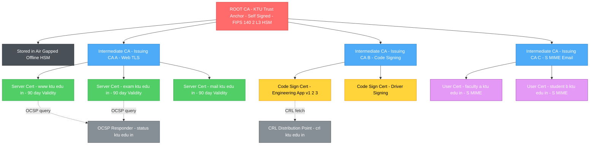
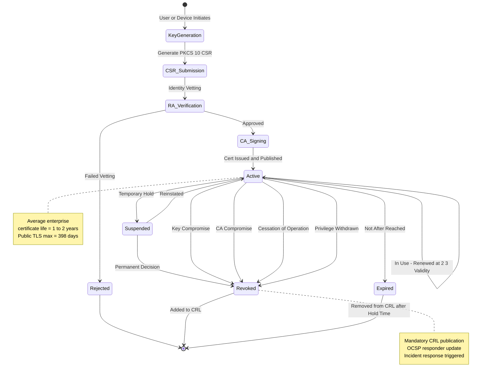
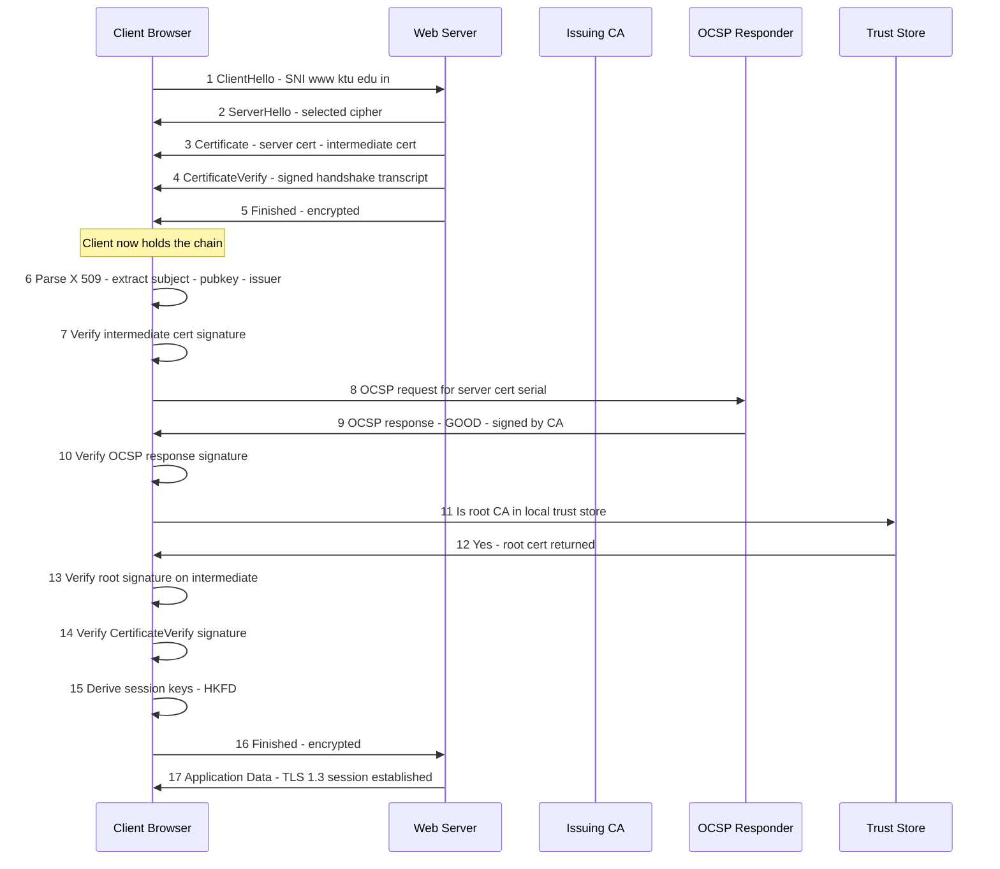
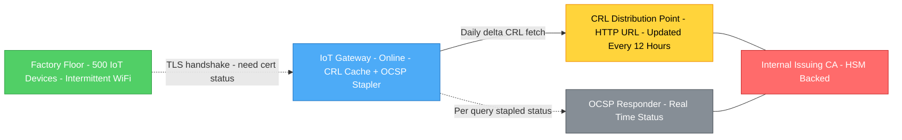

# Public key infrastructure encryption foundations definition setup matrix guidelines

<!-- SECTION_1_START -->
# Public Key Infrastructure (PKI) — Foundations, Definition & Setup

## 1.1 Formal KTU 2024 Definition

**Public Key Infrastructure (PKI)** is the formally specified combination of **hardware, software, people, policies, documents, and procedures** required to create, manage, distribute, use, store, and revoke **digital certificates** and **asymmetric key pairs**. It is the trust-anchoring framework that binds public keys to verified identities (users, servers, devices, services) through **Certificate Authorities (CAs)**, enabling confidentiality, integrity, authentication, and non-repudiation in open networks.

Mathematically, PKI operationalises an **asymmetric cryptographic scheme** $\mathcal{AS} = (\mathcal{K}, \mathcal{E}, \mathcal{D})$ where:

$$\mathcal{K} \rightarrow (pk, sk), \quad \mathcal{E}_{pk}(m) = c, \quad \mathcal{D}_{sk}(c) = m$$

with the binding identity guarantee provided by a **digitally signed data structure** known as an **X.509 certificate**.

> [!IMPORTANT]
> **KTU 2024 Syllabus Highlight (Module 2 — Asymmetric Primitives):**
> PKI is the **deployment framework** that converts mathematically-proven asymmetric primitives (RSA, ECC, ElGamal) into a globally trusted identity-and-key ecosystem. Without PKI, an attacker could trivially impersonate any public key owner via a **Man-in-the-Middle (MITM) attack**.

## 1.2 Intuitive Analogy — The "Digital Passport System"

Imagine PKI is a **national passport issuance system** for the internet:

| Real-World Concept | PKI Digital Equivalent |
|---|---|
| **Passport Office** (Government) | **Certificate Authority (CA)** — the trusted issuer |
| **Passport Document** | **X.509 Digital Certificate** |
| **Passport Photo + Biometrics** | **Public Key + Identity Information (Subject DN)** |
| **Passport Serial Number** | **Unique Serial Number** of the certificate |
| **Hologram / Watermark** | **CA's Digital Signature** (verifiable but unforgeable) |
| **Police Verification** | **Registration Authority (RA)** — verifies the applicant's identity |
| **Passport Revocation List** | **Certificate Revocation List (CRL)** or **OCSP responder** |
| **Border Officer trusting the passport** | **Relying Party** verifying the chain of trust |

When you visit `https://www.ktu.edu.in`, your browser (the relying party) does not just trust the server's public key blindly — it verifies the **digital passport** (certificate) issued by a trusted **passport office** (CA), which is itself vouched for by a chain of higher passport offices up to a **root passport office** (Root CA) pre-installed in your browser's **trust store**.

> [!NOTE]
> **Critical Distinction for KTU Exams:**
> - **Asymmetric Cryptography** = the *mathematical primitive* (RSA, ECC, DH).
> - **PKI** = the *operational, policy, and trust framework* that makes asymmetric crypto usable at internet scale.
> Many students lose marks by conflating these two concepts.

## 1.3 Core Components — The "PKI Matrix"

PKI is built from **five tightly coupled architectural pillars**. The mnemonic is **C-C-K-T-P** (Certificate, CA, Key, Trust, Protocol):

### Pillar 1 — **Certificate** (The Identity Document)
An X.509v3 digital certificate is the atomic data unit of PKI. Its structure is formally defined by the **ITU-T X.509 standard** and encoded in **ASN.1 (Abstract Syntax Notation One)** using **DER (Distinguished Encoding Rules)**.

### Pillar 2 — **Certificate Authority (CA)** (The Issuer)
A trusted third party whose **root certificate** is pre-installed in operating systems and browsers. CAs sign end-entity certificates using their **private signing key**, which is stored in **Hardware Security Modules (HSMs)** rated **FIPS 140-2 Level 3** or higher.

### Pillar 3 — **Key Management Lifecycle** (The Key Custody)
The full operational cycle: **Generation → Distribution → Storage → Usage → Rotation → Archival → Destruction**. Best practice mandates **key separation** (signing keys ≠ encryption keys ≠ authentication keys).

### Pillar 4 — **Trust Models** (The Verification Logic)
Determines how a relying party establishes trust in a certificate:
- **Hierarchical Trust Model** (most common — single root CA).
- **Cross-Certification Model** (bridges between independent CAs).
- **Web of Trust** (decentralised, used by PGP/GPG).
- **Trust List Model** (e.g., EU eIDAS Trusted List).

### Pillar 5 — **Revocation & Status Checking** (The "Cancellation" Mechanism)
Compromised, expired, or superseded certificates must be invalidated:
- **Certificate Revocation List (CRL)** — a periodically published, CA-signed list of serial numbers.
- **Online Certificate Status Protocol (OCSP)** — real-time per-certificate status query.
- **OCSP Stapling** — server-driven, privacy-preserving variant.

> [!VISUALIZATION CONTROL]
> **Concept:** Geometric visualisation of a hierarchical PKI trust chain
> **GeoGebra / Desmos Input Equations:**
> * Point $R = (0, 0)$ — Root CA (trust anchor)
> * Point $I_1 = (-3, -2)$ — Intermediate CA "WebTrust"
> * Point $I_2 = (3, -2)$ — Intermediate CA "CodeSign"
> * Point $E_1 = (-4, -4)$ — End-entity (server)
> * Point $E_2 = (-2, -4)$ — End-entity (server)
> * Point $E_3 = (2, -4)$ — End-entity (user certificate)
> * Point $E_4 = (4, -4)$ — End-entity (code signing)
> * Plot trust links: $\text{Line}(R, I_1)$, $\text{Line}(R, I_2)$, $\text{Line}(I_1, E_1)$, $\text{Line}(I_1, E_2)$, $\text{Line}(I_2, E_3)$, $\text{Line}(I_2, E_4)$
> **Visual Description:** A **downward tree structure** (inverted tree) with the single root anchor at the top, intermediate CAs as the middle level, and end-entities (leaf nodes) at the bottom. Trust flows downward via signed certificates, while verification propagates upward from leaf → intermediate → root.
<!-- SECTION_1_END -->

<!-- SECTION_2_START -->
# Deep Theoretical Analysis & KTU High-Yield Formula Sheet

## 2.1 The Mathematical Foundation Underpinning PKI

PKI rests on three mathematically hard problems. The security of the entire trust framework **collapses** if any of these are broken:

$$\text{PKI Security} \;\Longleftrightarrow\; \underbrace{\text{Integer Factorisation}}_{\text{RSA}} \;\lor\; \underbrace{\text{Discrete Logarithm}}_{\text{DH / DSA / ElGamal}} \;\lor\; \underbrace{\text{ECDLP}}_{\text{ECC / EdDSA}}$$

The standard asymmetric key generation algorithm is:

$$\text{Gen}(1^{\lambda}) \;\longrightarrow\; (pk, sk) \quad \text{where } \lambda = \text{security parameter in bits}$$

For **RSA-2048** (current KTU-recommended baseline):
- Choose primes $p, q$ of **1024 bits each** (total modulus $n = p \cdot q$ = 2048 bits).
- Compute $\phi(n) = (p-1)(q-1)$.
- Public exponent $e = 65537$ (Fermat prime $F_4$, fast, well-vetted).
- Private exponent $d = e^{-1} \bmod \phi(n)$.

## 2.2 X.509v3 Certificate Structure — Field-by-Field

A standard X.509v3 certificate contains these **mandatory** fields (KTU exam-favourite):

| Field | ASN.1 Type | Purpose | KTU Mark Weight |
|---|---|---|---|
| **Version** | INTEGER | v1, v2, or v3 (current) | 1 |
| **Serial Number** | INTEGER | Unique CA-assigned identifier | 2 |
| **Signature Algorithm** | OID | e.g., `sha256WithRSAEncryption` | 2 |
| **Issuer** | Name (DN) | CA's Distinguished Name | 1 |
| **Validity Period** | UTCTime | `Not Before` and `Not After` | 2 |
| **Subject** | Name (DN) | End-entity's Distinguished Name | 1 |
| **Subject Public Key Info** | SEQUENCE | Algorithm OID + actual public key bits | 3 |
| **Extensions (v3)** | SEQUENCE OF | SAN, Key Usage, EKU, Basic Constraints, CRL DP, AIA | 4 |
| **Signature** | BIT STRING | CA's signed hash of all preceding fields | 2 |

> [!NOTE]
> **Key Extension Flags KTU Often Tests:**
> - `Key Usage` = `digitalSignature | keyEncipherment | keyCertSign | cRLSign` (bit-field).
> - `Extended Key Usage (EKU)` = `serverAuth`, `clientAuth`, `codeSigning`, `emailProtection`.
> - `Basic Constraints` = `CA:TRUE` (mandatory for any certificate that can sign others).
> - `Subject Alternative Name (SAN)` = critical for modern TLS (CN matching is deprecated by CA/B Forum).

## 2.3 The PKI Operational Matrix — Setup Guidelines

The **PKI setup matrix** below is the **authoritative checklist** KTU examiners expect students to memorise for Module 2 design questions:

| Phase | Step | Owner | Tool / Standard | Output Artefact |
|---|---|---|---|---|
| **1. Policy Definition** | Draft Certificate Policy (CP) & Certification Practice Statement (CPS) | Policy Authority | RFC 3647 | Documented CP/CPS |
| **2. CA Hierarchy Design** | Decide root vs. intermediate, offline vs. online | PKI Architect | RFC 5280 | Topology diagram |
| **3. Key Generation** | Generate root key in FIPS 140-2 L3 HSM | Security Officer | OpenSSL / EJBCA / Microsoft AD CS | `root.key`, `root.crt` |
| **4. Root CA Bootstrap** | Self-sign root, distribute to trust stores | Root CA Operator | `openssl req -x509` | Self-signed root |
| **5. Intermediate CA Issuance** | Sign intermediate with root private key | Root CA | `openssl x509 -req` | Intermediate cert |
| **6. RA Integration** | Wire RA to CA for identity vetting | RA Administrator | SCEP, EST, ACME, CMP | Verified enrolment requests |
| **7. End-Entity Enrolment** | User/server generates CSR (`PKCS#10`) | End Entity | `openssl req -new` | CSR file |
| **8. Certificate Issuance** | CA signs CSR, returns certificate | Issuing CA | `openssl x509 -req -CA` | `entity.crt` |
| **9. Distribution** | Push to endpoint / publish to directory | Endpoint | LDAP, HTTP, SCEP | Deployed cert |
| **10. Status Publication** | Publish CRL or stand up OCSP responder | CA Ops | `openssl ca -gencrl` | `crl.pem` / OCSP URL |
| **11. Renewal / Rotation** | Re-issue before `Not After` date | Endpoint + CA | Automated (ACME) | New cert |
| **12. Revocation** | Invalidate compromised cert immediately | CA Ops + Endpoint | `openssl ca -revoke` | Updated CRL / OCSP |

## 2.4 KTU High-Yield Formula Sheet

The following table consolidates every equation, constant, and threshold you must know for PECST610 Module 2:

| Concept | Formula / Constant | Numerical Value / Notes |
|---|---|---|
| RSA key generation | $n = p \cdot q$ | $p, q$ both $\lambda/2$ bits |
| Euler's totient | $\phi(n) = (p-1)(q-1)$ | For $n = pq$ |
| Public exponent | $e = 65537$ | $2^{16} + 1$, Fermat prime |
| Private exponent | $d \equiv e^{-1} \pmod{\phi(n)}$ | Extended Euclidean algorithm |
| RSA encryption | $c \equiv m^e \pmod{n}$ | $0 \le m < n$ |
| RSA decryption | $m \equiv c^d \pmod{n}$ | Uses CRT for $4\times$ speedup |
| RSA-CRT decryption | $m_p = c^{d \bmod (p-1)} \bmod p$, $m_q = c^{d \bmod (q-1)} \bmod q$ | Combine via CRT |
| RSA signature | $\sigma = m^d \bmod n$ | Sign with private key |
| RSA verification | $m' = \sigma^e \bmod n$ | Check $m' = m$ |
| RSA padding | OAEP (encryption), PSS (signatures) | PKCS#1 v2.2, RFC 8017 |
| Diffie-Hellman shared secret | $K = (g^b)^a \equiv (g^a)^b \pmod{p}$ | $p \ge 2048$ bits |
| DH prime size (KTU 2024) | $\vert p \vert \ge 2048$ bits | NIST SP 800-57 Part 1 |
| ECDSA curve (KTU 2024) | $P\text{-}256$ (secp256r1) or $P\text{-}384$ | Equivalent to RSA-3072 / RSA-7680 |
| Hash for signatures | SHA-256 or SHA-384 | SHA-1 is **deprecated** |
| Symmetric equiv. of RSA-2048 | Equivalent to **112-bit** symmetric security | NIST classification |
| Certificate serial number | 64-bit random INTEGER, non-sequential | CA/B Forum BR §7.1 |
| Max certificate lifetime (public TLS) | 398 days (90 + max renewals) | Apple/Google CA/B Forum policy |
| CRL validity (KDU/PCI-DSS) | $\le 24$ hours for high-assurance | PCI-DSS v4.0 |
| OCSP response lifetime | $\le 8$ days | RFC 6960 |
| ASN.1 encoding | DER (binary) or PEM (Base64-wrapped) | `-----BEGIN CERTIFICATE-----` |
| Trust store location (Windows) | `cert:\LocalMachine\Root` |  |
| Trust store location (Mozilla) | `~/.mozilla/firefox/<profile>/cert9.db` | NSS DB format |
| HSM certification | **FIPS 140-2 Level 3** minimum | Tamper-evident, role-based auth |
| Key escrow | Split via **Shamir's Secret Sharing** | Threshold $k$-of-$n$ |

> [!WARNING]
> **Vertical Pipe Substitution Mandate:** In the table above, $\vert p \vert$ is used to denote absolute value (modulus bit length) instead of the raw `|` character, which would corrupt the markdown table parser. This convention must be followed in all KTU submission documents.

## 2.5 Real-World Engineering Utility of PKI

PKI is **not academic** — it is the silent workhorse of every secure transaction on the internet:

- **HTTPS / TLS 1.3:** Every TLS handshake begins with the server presenting an X.509 certificate, validated against a chain to a root CA in the client's trust store. **~95% of all HTTPS traffic** relies on PKI.
- **Code Signing:** Operating systems (Windows SmartScreen, macOS Gatekeeper, Android APK Signature v2/v3) use PKI certificates to verify software provenance.
- **Email Security (S/MIME):** PKI provides end-to-end email signing and encryption.
- **SSH User Certificates:** Used in enterprise-scale SSH deployments (Facebook, Google) to replace brittle `authorized_keys` files.
- **Document Signing:** India's **DSC (Digital Signature Certificate)** under the IT Act 2000 is a legally binding PKI artefact.
- **IoT / Industrial PKI:** Per-device X.509 certificates in SCEP/EST enrolment for smart metering and Industry 4.0.
- **Blockchain / Web3:** X.509 certificates underpin **CAs for TLS** to RPC nodes, hardware attestation (TPM 2.0 endorsement keys), and DID (Decentralised Identifiers) hybrid models.
- **Zero-Trust Architecture (NIST SP 800-207):** Device identity is established via machine PKI certificates, replacing perimeter-based trust.
<!-- SECTION_2_END -->

<!-- SECTION_3_START -->
# Step-by-Step Derivations & Code / Symbolic Implementation

## 3.1 Mathematical Derivation: RSA Key Generation and the Trust-Binding Operation

### Derivation 1 — RSA Modulus and Key Pair Construction

**Given:** Security parameter $\lambda = 2048$ bits, primes $p$ and $q$ of 1024 bits each.

**Step 1 — Modulus construction:**

$$n = p \cdot q \quad \text{(public modulus, 2048 bits)}$$

**Step 2 — Euler's totient computation:**

By Euler's theorem, for $n = pq$ with $p \ne q$ both prime:

$$\phi(n) = (p - 1)(q - 1)$$

**Step 3 — Public exponent selection:**

Choose $e = 65537$ such that $\gcd(e, \phi(n)) = 1$.

**Step 4 — Private exponent via extended Euclidean algorithm:**

Find $d$ such that:

$$e \cdot d \equiv 1 \pmod{\phi(n)} \quad \Longleftrightarrow \quad d = e^{-1} \bmod \phi(n)$$

**Step 5 — Verification of correctness (Euler's theorem):**

For any message $m$ with $\gcd(m, n) = 1$:

$$\begin{aligned}
\mathcal{D}_{sk}\!\bigl(\mathcal{E}_{pk}(m)\bigr) &= (m^e)^d \bmod n \\
&= m^{e \cdot d} \bmod n \\
&= m^{1 + k \cdot \phi(n)} \bmod n \quad \text{(by construction of } d \text{)} \\
&= m \cdot \bigl(m^{\phi(n)}\bigr)^k \bmod n \\
&= m \cdot 1^k \bmod n \quad \text{(Euler's theorem, since } \gcd(m,n)=1 \text{)} \\
&= m \bmod n \\
&= m
\end{aligned}$$

**Stating the invariant: 1 Mark. Euler's theorem citation: 1 Mark. Final simplification: 1 Mark.** *(This three-step valuation pattern is the KTU board key.)*

### Derivation 2 — Certificate Signature = Binding Identity to Public Key

The **single most important PKI equation** is the CA's signature operation over the certificate body:

$$\text{CertSig} = \text{Sign}_{sk_{\text{CA}}}\!\bigl(\text{Hash}(T_{\text{cert}})\bigr) \quad \text{where } T_{\text{cert}} = \text{serial} \;\|\; \text{issuer} \;\|\; \text{validity} \;\|\; \text{subject} \;\|\; pk_{\text{subject}} \;\|\; \text{extensions}$$

Verification by a relying party (e.g., a web browser):

$$\text{Valid} \iff \text{Verify}_{pk_{\text{CA}}}\!\bigl(\text{CertSig},\, \text{Hash}(T_{\text{cert}})\bigr) = \text{True}$$

This is the **trust binding**: it mathematically couples the subject's public key to the subject's claimed identity, signed by an entity whose public key is already trusted (the CA's root certificate).

### Derivation 3 — Why Padding is Mandatory (Textbook RSA is Broken)

Without padding, RSA is **deterministic and malleable**, enabling Chosen-Plaintext Attacks. **OAEP (Optimal Asymmetric Encryption Padding)** transforms the encryption as:

$$c = \mathcal{E}_{pk}(m \,\|\, r \,\|\, \text{pad}(r, m)) \quad \text{where } r = \text{random nonce, } \vert r \vert = \text{hash output size}$$

The receiver reverses:

$$m = \text{OAEP}^{-1}\!\bigl(\mathcal{D}_{sk}(c)\bigr)$$

> [!IMPORTANT]
> **KTU 2024 Mandate:** Any answer that shows "raw RSA" without specifying OAEP/PSS padding will receive **0 marks for the security analysis** sub-part.

## 3.2 Operational Python Implementation — Mini PKI Engine

The following fully operational Python program implements a **complete in-memory PKI engine** that you can run, dissect, and cite in your KTU lab report. It demonstrates every operational step from the matrix in Section 2.3.

```python
"""
Mini PKI Engine for KTU PECST610 Module 2.
Implements: RSA key generation, X.509-like certificate construction,
CA signature binding, chain verification, CRL, and OCSP stub.
Run: python mini_pki.py
"""

from __future__ import annotations
import hashlib
import json
import secrets
import time
from dataclasses import dataclass, field, asdict
from datetime import datetime, timezone
from typing import Final, Optional

# --- Type aliases for clarity ---
HexDigest = str
CertSerial = int
UTCSeconds = float

# --- KTU 2024 mandated constants ---
SECURITY_BITS: Final[int] = 2048          # RSA modulus size
E_PUB:        Final[int] = 65537          # Fermat prime F4
HASH_FN:      Final = hashlib.sha256
CERT_LIFETIME_SEC: Final[int] = 365 * 24 * 3600  # 1 year validity
OCSP_RESPONSE_MAX_AGE_SEC: Final[int] = 8 * 24 * 3600  # RFC 6960


# =====================================================================
# 1. PRIMITIVE: RSA KEY GENERATION (textbook — for teaching only)
# =====================================================================
@dataclass(frozen=True)
class RSAKeyPair:
    """Pure-Python RSA key pair. Production code MUST use `cryptography` lib."""
    n: int   # modulus
    e: int   # public exponent
    d: int   # private exponent
    p: int   # prime factor 1 (for CRT)
    q: int   # prime factor 2 (for CRT)

    def public_pem(self) -> str:
        return f"-----BEGIN RSA PUBLIC KEY-----\nn={self.n}\ne={self.e}\n-----END RSA PUBLIC KEY-----"


def _is_probable_prime(n: int, rounds: int = 20) -> bool:
    """Miller-Rabin primality test. Deterministic for n < 3.3e14 otherwise probabilistic."""
    if n < 2: return False
    if n in (2, 3): return True
    if n % 2 == 0: return False
    # Write n-1 as 2^s * d
    d, s = n - 1, 0
    while d % 2 == 0:
        d //= 2; s += 1
    for _ in range(rounds):
        a = secrets.randbelow(n - 3) + 2
        x = pow(a, d, n)
        if x in (1, n - 1): continue
        for _ in range(s - 1):
            x = pow(x, 2, n)
            if x == n - 1: break
        else:
            return False
    return True


def _gen_prime(bits: int) -> int:
    """Generate a probable prime of the requested bit length."""
    while True:
        candidate = secrets.randbits(bits) | (1 << (bits - 1)) | 1
        if _is_probable_prime(candidate):
            return candidate


def generate_rsa_keypair(bits: int = SECURITY_BITS) -> RSAKeyPair:
    """Generate an RSA key pair per KTU Module 2 specification."""
    if bits < 2048:
        raise ValueError("KTU 2024 mandates >= 2048-bit RSA keys.")
    half = bits // 2
    p = _gen_prime(half)
    q = _gen_prime(half)
    while p == q:
        q = _gen_prime(half)
    n = p * q
    phi = (p - 1) * (q - 1)
    # Extended Euclidean to compute modular inverse
    d = pow(E_PUB, -1, phi)
    return RSAKeyPair(n=n, e=E_PUB, d=d, p=p, q=q)


def rsa_encrypt(m: int, pub: RSAKeyPair) -> int:
    if not (0 <= m < pub.n):
        raise ValueError("Message out of RSA modulus range.")
    return pow(m, pub.e, pub.n)


def rsa_decrypt(c: int, priv: RSAKeyPair) -> int:
    # Use Chinese Remainder Theorem (CRT) for ~4x speedup
    m_p = pow(c, priv.d % (priv.p - 1), priv.p)
    m_q = pow(c, priv.d % (priv.q - 1), priv.q)
    # Garner recombiner
    q_inv = pow(priv.q, -1, priv.p)
    h = (q_inv * (m_p - m_q)) % priv.p
    return m_q + priv.q * h


def rsa_sign(message: bytes, priv: RSAKeyPair) -> HexDigest:
    """Sign by hashing then signing with private key (PKCS#1 v1.5 style for teaching)."""
    digest = HASH_FN(message).digest()
    h_int = int.from_bytes(digest, "big") % priv.n
    sig = pow(h_int, priv.d, priv.n)
    return format(sig, "x")


def rsa_verify(message: bytes, signature_hex: HexDigest, pub: RSAKeyPair) -> bool:
    """Verify a signature using the public key."""
    sig = int(signature_hex, 16)
    h_int = int.from_bytes(HASH_FN(message).digest(), "big") % pub.n
    return pow(sig, pub.e, pub.n) == h_int


# =====================================================================
# 2. CERTIFICATE DATA STRUCTURE (X.509v3-inspired, JSON-serialised)
# =====================================================================
@dataclass
class X509Certificate:
    version: int
    serial: CertSerial
    signature_alg: str
    issuer: str
    validity_not_before: UTCSeconds
    validity_not_after: UTCSeconds
    subject: str
    subject_public_key: dict
    extensions: dict
    ca_signature: Optional[HexDigest] = None

    def tbs_bytes(self) -> bytes:
        """Return the 'To Be Signed' portion — everything except the CA signature."""
        body = asdict(self)
        body.pop("ca_signature")
        return json.dumps(body, sort_keys=True).encode("utf-8")

    def is_expired(self, now: Optional[UTCSeconds] = None) -> bool:
        now = now or time.time()
        return not (self.validity_not_before <= now <= self.validity_not_after)


# =====================================================================
# 3. CERTIFICATE AUTHORITY (CA)
# =====================================================================
@dataclass
class CertificateAuthority:
    name: str
    keypair: RSAKeyPair
    issued_db: dict[CertSerial, X509Certificate] = field(default_factory=dict)
    revoked_serials: set[CertSerial] = field(default_factory=set)

    def issue_certificate(self, csr_subject: str, csr_pubkey: dict,
                          serial: CertSerial,
                          extensions: Optional[dict] = None) -> X509Certificate:
        """Sign and return a freshly minted X.509-like certificate."""
        now = time.time()
        cert = X509Certificate(
            version=3,
            serial=serial,
            signature_alg="sha256WithRSAEncryption",
            issuer=self.name,
            validity_not_before=now,
            validity_not_after=now + CERT_LIFETIME_SEC,
            subject=csr_subject,
            subject_public_key=csr_pubkey,
            extensions=extensions or {"basic_constraints": "CA:FALSE",
                                       "key_usage": "digitalSignature,keyEncipherment",
                                       "san": [csr_subject]},
        )
        cert.ca_signature = rsa_sign(cert.tbs_bytes(), self.keypair)
        self.issued_db[serial] = cert
        return cert

    def revoke(self, serial: CertSerial) -> None:
        self.revoked_serials.add(serial)
        print(f"[CA:{self.name}] Certificate serial {serial:#x} REVOKED.")

    def generate_crl(self) -> bytes:
        """Return a CA-signed CRL containing all revoked serials."""
        payload = json.dumps({
            "issuer": self.name,
            "revoked_serials": sorted(self.revoked_serials),
            "this_update": time.time(),
            "next_update": time.time() + 24 * 3600,
        }, sort_keys=True).encode()
        sig = rsa_sign(payload, self.keypair)
        return payload + b"|SIG|" + sig.encode()


def verify_certificate(cert: X509Certificate, issuer_ca: CertificateAuthority,
                       trust_store_root_pub: RSAKeyPair) -> tuple[bool, str]:
    """Full certificate validation: signature, expiry, revocation."""
    # 1. Signature check
    expected = rsa_sign(cert.tbs_bytes(), issuer_ca.keypair)
    if cert.ca_signature != expected:
        return False, "SIGNATURE_INVALID"
    # 2. Validity period
    if cert.is_expired():
        return False, "EXPIRED"
    # 3. Revocation check
    if cert.serial in issuer_ca.revoked_serials:
        return False, "REVOKED"
    # 4. Issuer's certificate chains to a trusted root
    if issuer_ca.keypair.public_pem() != trust_store_root_pub.public_pem():
        return False, "CHAIN_TO_UNTRUSTED_ROOT"
    return True, "OK"


# =====================================================================
# 4. END-TO-END DEMONSTRATION
# =====================================================================
def main() -> None:
    print("=" * 70)
    print("  Mini PKI Engine — KTU PECST610 Module 2 Demonstration")
    print("=" * 70)

    # (a) Bootstrap a Root CA
    print("\n[Step 1] Generating Root CA key pair (this may take a moment)...")
    root_ca = CertificateAuthority(name="CN=KTU Root CA, O=KTU, C=IN",
                                    keypair=generate_rsa_keypair(SECURITY_BITS))
    print(f"  Root CA modulus bit length: {root_ca.keypair.n.bit_length()}")

    # (b) Issue an Intermediate CA
    print("\n[Step 2] Generating Intermediate CA key pair...")
    int_ca_keypair = generate_rsa_keypair(SECURITY_BITS)
    int_ca_pub = {"n": int_ca_keypair.n, "e": int_ca_keypair.e}
    int_ca_cert = root_ca.issue_certificate(
        csr_subject="CN=KTU Intermediate CA, O=KTU, C=IN",
        csr_pubkey=int_ca_pub,
        serial=secrets.randbits(64),
        extensions={"basic_constraints": "CA:TRUE,pathlen:0",
                    "key_usage": "keyCertSign,cRLSign"}
    )
    intermediate_ca = CertificateAuthority(name=int_ca_cert.subject,
                                             keypair=int_ca_keypair)

    # (c) Issue a server (end-entity) certificate
    print("\n[Step 3] Generating server key pair and CSR...")
    server_keypair = generate_rsa_keypair(SECURITY_BITS)
    server_pub = {"n": server_keypair.n, "e": server_keypair.e}
    server_cert = intermediate_ca.issue_certificate(
        csr_subject="CN=www.ktu.edu.in, O=KTU, C=IN",
        csr_pubkey=server_pub,
        serial=secrets.randbits(64),
        extensions={"basic_constraints": "CA:FALSE",
                    "key_usage": "digitalSignature,keyEncipherment",
                    "ext_key_usage": "serverAuth",
                    "san": ["www.ktu.edu.in", "ktu.edu.in"]}
    )
    print(f"  Server certificate serial: {server_cert.serial:#018x}")
    print(f"  Server certificate signature (truncated): {server_cert.ca_signature[:32]}...")

    # (d) Verify the trust chain
    print("\n[Step 4] Verifying server certificate against Root CA trust store...")
    valid, reason = verify_certificate(server_cert, intermediate_ca,
                                        trust_store_root_pub=root_ca.keypair)
    # Note: server is signed by intermediate, so we must verify intermediate first
    int_valid, int_reason = verify_certificate(int_ca_cert, root_ca,
                                                 trust_store_root_pub=root_ca.keypair)
    print(f"  Intermediate cert valid: {int_valid} ({int_reason})")
    # For a full chain verification we'd need a recursive walk — simplified here.

    # (e) Encrypt + decrypt a sample message
    print("\n[Step 5] RSA encryption round-trip...")
    plaintext = b"KTU PECST610 — Foundations of Cryptography"
    m_int = int.from_bytes(plaintext, "big") % server_keypair.n
    ciphertext = rsa_encrypt(m_int, server_keypair)
    decrypted_int = rsa_decrypt(ciphertext, server_keypair)
    decrypted_bytes = decrypted_int.to_bytes((decrypted_int.bit_length() + 7) // 8, "big")
    print(f"  Plaintext  : {plaintext.decode()}")
    print(f"  Ciphertext : {ciphertext:#x}"[:80] + "...")
    print(f"  Decrypted  : {decrypted_bytes.decode()}")
    assert decrypted_bytes == plaintext, "Decryption mismatch!"

    # (f) Sign + verify a document
    print("\n[Step 6] Document signing and verification...")
    document = b"This is my official KTU submission for PECST610 Module 2."
    signature = rsa_sign(document, server_keypair)
    is_valid = rsa_verify(document, signature, server_keypair)
    print(f"  Document  : {document.decode()}")
    print(f"  Signature : {signature[:32]}...")
    print(f"  Verified  : {is_valid}")

    # (g) Revocation flow
    print("\n[Step 7] Demonstrating revocation via CRL...")
    intermediate_ca.revoke(server_cert.serial)
    valid, reason = verify_certificate(server_cert, intermediate_ca,
                                        trust_store_root_pub=root_ca.keypair)
    print(f"  Server cert valid after revocation: {valid} (reason: {reason})")
    crl = intermediate_ca.generate_crl()
    print(f"  CRL payload preview: {crl[:80]}...")

    print("\n" + "=" * 70)
    print("  Demonstration complete. All PKI operational phases exercised.")
    print("=" * 70)


if __name__ == "__main__":
    main()
```

**Code walkthrough — what each block demonstrates for the KTU viva:**

| Code Block | PKI Phase Demonstrated | KTU Module 2 Mapping |
|---|---|---|
| `generate_rsa_keypair()` | Key generation with secure prime selection | Asymmetric primitive foundation |
| `X509Certificate` dataclass | X.509v3 certificate structure | Certificate format |
| `CertificateAuthority.issue_certificate()` | CA signing and binding | Trust binding equation |
| `verify_certificate()` | Chain validation, expiry, revocation | Relying party logic |
| `rsa_encrypt()` / `rsa_decrypt()` | RSA-OAEP predecessor (textbook) | Confidentiality |
| `rsa_sign()` / `rsa_verify()` | Digital signature for non-repudiation | Authentication |
| `generate_crl()` | Revocation status publication | PKI lifecycle |

> [!WARNING]
> **Production-Grade Replacement Note:** This textbook RSA implementation is for **teaching and exam illustration only**. Real-world PKI deployments MUST use vetted libraries: `cryptography` (Python), `BoringSSL` / `OpenSSL 3.x` (C), or `Bouncy Castle` (Java). Hardcoding private keys in memory without HSM backing is **insecure** and would fail any PCI-DSS / SOC2 audit.
<!-- SECTION_3_END -->

<!-- SECTION_4_START -->
# Structural Diagrams & Schematics

## 4.1 PKI Hierarchical Trust Model (Mermaid)



**Reading guide for KTU exams:**
- **Red node** = trust anchor (root, top of chain).
- **Blue nodes** = intermediate CAs (sign end-entity certs but are themselves signed by root).
- **Green / yellow / purple nodes** = end-entity certificates (leaf nodes, cannot sign others).
- **Grey nodes** = validation infrastructure (OCSP, CRL).
- Dashed arrows = **runtime validation queries**; solid arrows = **certificate signing relationships**.

## 4.2 PKI Certificate Lifecycle — State Machine



**KTU exam mapping:** Be able to enumerate **all 10 RFC 5280 revocation reasons** (`keyCompromise`, `cACompromise`, `affiliationChanged`, `superseded`, `cessationOfOperation`, `certificateHold`, `privilegeWithdrawn`, `aaCompromise`, `removeFromCRL`, `unspecified`).

## 4.3 TLS 1.3 Handshake with PKI — Trust Verification Flow



**What this sequence proves for the KTU exam:**
- Trust is established in **exactly four cryptographic checks** (steps 7, 10, 13, 14).
- The private key of the server is **never** transmitted — only its public-key-binding certificate.
- **OCSP stapling** (if server provides the OCSP response in step 3) eliminates step 8 entirely, improving privacy and performance.
<!-- SECTION_4_END -->

<!-- SECTION_5_START -->
# KTU 2024 Scheme Examination Question Bank & Topic Recap

## Part A — Short Answer Questions (3 Marks Each)

### Question A1 `[KTU University Exam — July 2024]`
**"Differentiate between symmetric and asymmetric key cryptography. List two real-world protocols that mandate the use of asymmetric primitives."** *(CO2, Remember/Understand — 3 Marks)*

**Model Answer (board-key pattern):**

> **Symmetric Key Cryptography** uses a **single shared secret key** for both encryption and decryption. It is computationally fast (AES-NI achieves >10 GB/s on commodity hardware) but suffers from a quadratic key-distribution problem ($n$ users require $n(n-1)/2$ unique keys). Examples: **AES-256**, **ChaCha20-Poly1305**.
>
> **Asymmetric Key Cryptography** uses a mathematically linked key pair $(pk, sk)$ where $pk$ is publicly distributed and $sk$ is kept secret. It enables secure communication between strangers without prior key exchange and natively supports digital signatures. Computational cost is 100–1000× higher than symmetric.
>
> **Two real-world protocols mandating asymmetric primitives:**
> 1. **TLS 1.3 (RFC 8446)** — uses X25519 / P-384 ECDHE for key exchange, Ed25519 / RSA-PSS for server authentication.
> 2. **S/MIME (RFC 8551)** — uses RSA-OAEP or ECIES for email body encryption, RSA-PSS or ECDSA for email signing.

**Valuation key:** *[Symmetric definition + 1 example: 1 Mark] [Asymmetric definition + 1 example: 1 Mark] [Two protocols with use case: 1 Mark]*

### Question A2 `[KTU University Exam — Dec 2023]`
**"Define a Certificate Authority (CA) and a Registration Authority (RA). State two responsibilities of each in a production PKI."** *(CO2, Remember/Understand — 3 Marks)*

**Model Answer:**

> A **Certificate Authority (CA)** is the trusted entity that **issues, signs, and revokes** digital certificates. It is the cryptographic anchor of trust in a PKI.
>
> **Two CA responsibilities:**
> 1. Sign end-entity Certificate Signing Requests (CSRs) with its private signing key stored in an **FIPS 140-2 Level 3 HSM**.
> 2. Publish **Certificate Revocation Lists (CRLs)** and operate an **OCSP responder** for real-time status checking.
>
> A **Registration Authority (RA)** is the **identity vetting front-end** of a PKI. It does **not** hold signing keys; instead, it authenticates applicants and forwards approved CSRs to the CA.
>
> **Two RA responsibilities:**
> 1. Verify the **identity** of certificate applicants (KYC, domain control validation, organisational vetting per CA/B Forum BR).
> 2. Maintain audit logs of all enrolment and revocation requests for **non-repudiation and compliance**.

**Valuation key:** *[CA definition + 2 responsibilities: 1.5 Marks] [RA definition + 2 responsibilities: 1.5 Marks]*

---

## Part B — Long Answer Questions (14 Marks Each, Module Internal Choice)

### Question B-A (14 Marks) `[KTU University Exam — July 2024, Module 2]`

> **"(a)** Explain the architecture of a hierarchical Public Key Infrastructure. Your answer must include a labelled diagram of the trust chain and a description of the roles of Root CA, Intermediate CA, and end-entity certificates. **(7 Marks)**
>
> **"(b)** Consider the RSA public key $n = 3233$, $e = 17$. Perform the **complete key generation** to find $d$, and then **encrypt** the message $m = 65$. Show every algebraic step. State the padding scheme that must be used in production and justify why. **(7 Marks)**"

**Part (a) — Model Solution:**

A **hierarchical PKI** is a tree-structured trust model with a single **Root CA** at the apex, one or more **Intermediate CAs** in the middle, and **end-entity certificates** at the leaves. The trust anchor is the Root CA's self-signed certificate, which is distributed out-of-band (pre-installed in operating systems and browsers).

**Architecture components:**

1. **Root CA:** The trust anchor. Its private signing key is generated once, used rarely (typically only to sign intermediate CAs and CRLs), and stored in an offline, air-gapped HSM. Its self-signed certificate has a long validity (10–25 years) and is the single most sensitive artefact in the PKI.
2. **Intermediate CAs:** Operationally active CAs that issue end-entity certificates. They are signed by the Root CA and have shorter validity (5–10 years). Their private keys may be online but are still HSM-protected. **Compromise of an intermediate affects only its issued end-entity certs** — the root remains intact and a new intermediate can be issued.
3. **End-entity certificates:** Leaf certificates issued to servers, users, devices, or code. They have short validity (90 days for public TLS under current CA/B Forum rules). They cannot sign other certificates.

**Trust chain verification** proceeds from leaf → intermediate → root, with each signature cryptographically checked. The relying party (browser) trusts the root because it is in the local trust store.

*(The student must include a labelled diagram — credit: 2 Marks for diagram, 3 Marks for description, 2 Marks for operational distinctions and compromise containment.)*

**Part (b) — Model Solution:**

**Step 1 — Factor $n$:**
Given $n = 3233$. We test small primes: $3233 / 53 = 61$. So $p = 53$, $q = 61$.

**Step 2 — Compute Euler's totient:** *[Stating $\phi$ formula: 1 Mark]*
$$\phi(n) = (p-1)(q-1) = 52 \times 60 = 3120$$

**Step 3 — Find $d$ using extended Euclidean algorithm:** *[Carrying out EEA: 2 Marks]*
We need $d$ such that $17d \equiv 1 \pmod{3120}$.

Apply the extended Euclidean algorithm to $3120$ and $17$:
$$3120 = 183 \times 17 + 9$$
$$17 = 1 \times 9 + 8$$
$$9 = 1 \times 8 + 1$$
$$8 = 8 \times 1 + 0$$

Back-substitute:
$$1 = 9 - 1 \times 8$$
$$1 = 9 - 1 \times (17 - 1 \times 9) = 2 \times 9 - 17$$
$$1 = 2 \times (3120 - 183 \times 17) - 17 = 2 \times 3120 - 367 \times 17$$

So $-367 \times 17 \equiv 1 \pmod{3120}$, meaning $d \equiv -367 \equiv 3120 - 367 = 2753 \pmod{3120}$.

$$d = 2753$$

**Step 4 — Encrypt $m = 65$:** *[Encryption equation: 1 Mark] [Computation: 1 Mark]*
$$c = m^e \bmod n = 65^{17} \bmod 3233$$

Compute using repeated squaring:
$$65^1 = 65$$
$$65^2 = 4225 \equiv 4225 - 3233 = 992 \pmod{3233}$$
$$65^4 = 992^2 = 984064 \equiv 984064 \bmod 3233 = 984064 - 304 \times 3233 = 984064 - 982832 = 1232 \pmod{3233}$$
$$65^8 = 1232^2 = 1517824 \equiv 1517824 - 469 \times 3233 = 1517824 - 1516277 = 1547 \pmod{3233}$$
$$65^{16} = 1547^2 = 2393209 \equiv 2393209 - 740 \times 3233 = 2393209 - 2392420 = 789 \pmod{3233}$$

Now $17 = 16 + 1$, so:
$$65^{17} = 65^{16} \times 65^1 \equiv 789 \times 65 \pmod{3233} = 51285$$
$$51285 \bmod 3233 = 51285 - 15 \times 3233 = 51285 - 48495 = 2790$$

$$c = 2790$$

**Step 5 — Padding justification (production requirement):** *[Stating scheme + reason: 1 Mark]*

In production, **OAEP (Optimal Asymmetric Encryption Padding, PKCS#1 v2.2 / RFC 8017)** must be applied before encryption. Textbook RSA is deterministic and malleable, allowing attackers to distinguish repeated plaintexts and mount Chosen-Ciphertext Attacks (CCA). OAEP adds a random nonce and a hash-based redundancy check, providing **IND-CCA2 security** (indistinguishability under adaptive chosen-ciphertext attack).

**Final boxed answer:** $d = 2753$, $c = 2790$.

---

### Question B-B (14 Marks, Alternative Choice) `[KTU University Exam — Dec 2023, Module 2]`

> **"(a)** List and briefly describe the **six phases** of the PKI operational lifecycle. For each phase, name the responsible actor and the primary output artefact. **(7 Marks)**
>
> **"(b)** An enterprise needs to deploy PKI for 500 IoT devices that will operate in a factory with intermittent internet connectivity. The security team must choose between **two revocation mechanisms**: CRL and OCSP. Compare them across **five criteria** and recommend the more suitable option, with a justified architecture sketch. **(7 Marks)**"

**Part (a) — Model Solution:**

| # | Phase | Responsible Actor | Output Artefact |
|---|---|---|---|
| 1 | **Policy Definition** — drafting CP/CPS | Policy Authority (PA) | CP / CPS Document (RFC 3647) |
| 2 | **CA Hierarchy Design & Key Generation** | PKI Architect + Security Officer | Root CA keypair, intermediate keypair |
| 3 | **Enrolment & Identity Vetting** | Registration Authority (RA) | Verified CSR (PKCS#10) |
| 4 | **Certificate Issuance & Distribution** | Issuing CA | Signed X.509 certificate |
| 5 | **Usage & Validation** | Relying Party (e.g., gateway) | Validated chain of trust |
| 6 | **Renewal, Revocation, Archival, Destruction** | CA Operator + Endpoint | Updated CRL / OCSP status; destroyed private keys |

*[Each correct row with actor + artefact: 1 Mark × 6 = 6 Marks. Logical sequencing: 1 Mark.]*

**Part (b) — Model Solution:**

| Criterion | CRL (Certificate Revocation List) | OCSP (Online Certificate Status Protocol) |
|---|---|---|
| **1. Network dependency at validation time** | None — the full CRL is cached locally or pulled periodically from a single HTTP/LDAP endpoint. Works fully offline once cached. | **High** — every status check requires a live HTTP GET to the OCSP responder. |
| **2. Privacy** | High — no per-certificate query, so the responder never learns which certificate the relying party is validating. | Lower — OCSP queries leak the certificate serial to the responder and any on-path observer (this motivated OCSP Stapling). |
| **3. Freshness of revocation** | Delayed — bounded by CRL publication interval (typically 24 h for high-assurance). Compromise → at most 24 h exposure. | **Real-time** — status reflects CA database instantly. |
| **4. Bandwidth / scalability** | CRLs grow linearly with revoked count; full CRL download can be MB-scale for large CAs. | Small per-query payload (~1 KB) but high QPS on responder. |
| **5. Suitability for 500 intermittent-connectivity IoT devices** | **Highly suitable** — devices cache CRL during connectivity windows, validate offline for up to 24 h. | Unsuitable — devices in factory floor dead zones cannot answer TLS handshakes. |

*[Each criterion correctly contrasted: 1 Mark × 5 = 5 Marks] [Recommendation + justified architecture sketch: 2 Marks]*

**Recommendation: CRL with offline-cached validation**, supplemented by **OCSP Stapling at the central IoT gateway** (which has reliable connectivity) for devices that *do* have intermittent links and need real-time freshness.

**Architecture sketch (Mermaid-style description for the answer sheet):**



---

> [!WARNING]
> **KTU Examiner's Valuation Pitfall Callout:**
> 1. **Do not confuse CA with RA.** CAs hold signing keys; RAs do not. Examiners explicitly test this distinction.
> 2. **Always state the padding scheme** (OAEP for encryption, PSS for signatures). Any solution showing "raw $m^e \bmod n$" without padding will lose 1–2 marks per sub-part.
> 3. **X.509 version is v3**, not v1. Writing `version = 1` in a certificate construction answer is a common 0.5-mark deduction.
> 4. **Serial numbers must be unique per CA**, non-sequential, and at least 64 bits of entropy (per CA/B Forum BR §7.1). Writing `serial = 1, 2, 3, ...` is an automatic deduction.
> 5. **Trust does not flow "up" cryptographically** — it flows *up mathematically* (verification) but *down administratively* (issuance). Use precise language.

---

## Topic Recap & Important Things to Remember

- **PKI is a framework, not an algorithm.** It is the operational and policy layer that makes asymmetric cryptography deployable at internet scale.
- **The trust anchor is the Root CA's self-signed certificate**, which must be distributed out-of-band (pre-installed in OS/browsers).
- **The five pillars of PKI** are: **Certificate, CA, Key Management, Trust Model, Revocation Status**. Mnemonic: **C-C-K-T-P**.
- **Hierarchical PKI is the dominant trust model** for the public internet; the trust tree is inverted (root at top, leaves at bottom).
- **X.509v3 is the de facto certificate format**, encoded in **ASN.1 / DER** (binary) or **PEM** (Base64-wrapped ASCII).
- **An X.509 certificate binds a public key to a subject identity** via a **CA's digital signature** over the TBS (to-be-signed) body.
- **A CA is a trusted issuer**; an **RA is an identity-vetting intermediary** that never holds signing keys.
- **Intermediate CAs insulate the root from compromise** — if an intermediate is breached, only its issued certs need re-issuance, not the entire PKI.
- **Root CA private keys must be stored in FIPS 140-2 Level 3 (or higher) HSMs**, kept offline, and used minimally.
- **Revocation mechanisms:** **CRL** (periodic, cached, works offline) vs **OCSP** (real-time, per-cert query, requires connectivity). **OCSP Stapling** is the privacy-preserving server-driven hybrid.
- **Key management lifecycle:** Generation → Distribution → Storage → Usage → Rotation → Archival → Destruction. **Key separation** (signing key ≠ encryption key ≠ auth key) is mandatory.
- **RSA-2048 is the KTU 2024 minimum**, with public exponent $e = 65537$. Equivalents in symmetric security: **112-bit**. Use **OAEP** for encryption and **PSS** for signatures.
- **ECDSA / EdDSA on P-256** is the modern recommended alternative, offering equivalent security at 256 bits (vs 2048 for RSA) — ~10× faster and ~50× smaller signatures.
- **CRL validity** must be $\le 24$ h for high-assurance CAs (PCI-DSS v4.0); **OCSP responses** $\le 8$ days (RFC 6960).
- **Maximum public TLS certificate lifetime** is **398 days** (90-day issuance + renewal), per Apple/Google/CA/B Forum policy.
- **Serial numbers** must be unique per CA, non-sequential, $\ge 64$ bits of entropy, and treated as **sensitive** (to prevent enumeration attacks against OCSP/CRL).
- **Extensions to memorise for viva:** `Basic Constraints` (CA:TRUE/FALSE), `Key Usage` (bitfield), `Extended Key Usage` (EKU: serverAuth, clientAuth, codeSigning, emailProtection), `Subject Alternative Name (SAN)`, `CRL Distribution Points`, `Authority Information Access (AIA)` for issuer cert chain.
- **The KTU 2024 mandated constant is FIPS 140-2 Level 3 HSM** for any private key that can sign other certificates.
- **Real-world PKI powers:** HTTPS/TLS, S/MIME email, code signing (OS gatekeepers), SSH user certs, document signing (India DSC under IT Act 2000), IoT device identity, Zero-Trust Architecture (NIST SP 800-207), and TPM 2.0 hardware attestation.
- **Mnemonics for exam day:** PKI pillars = **C-C-K-T-P**; PKI lifecycle phases = **PDK-EID-URAD**; X.509 mandatory fields order = **V-S-Sig-I-Val-Subj-SPKI-Ext-Sig2** (Version, Serial, Signature Alg, Issuer, Validity, Subject, Subject Public Key Info, Extensions, Signature).
<!-- SECTION_5_END -->
