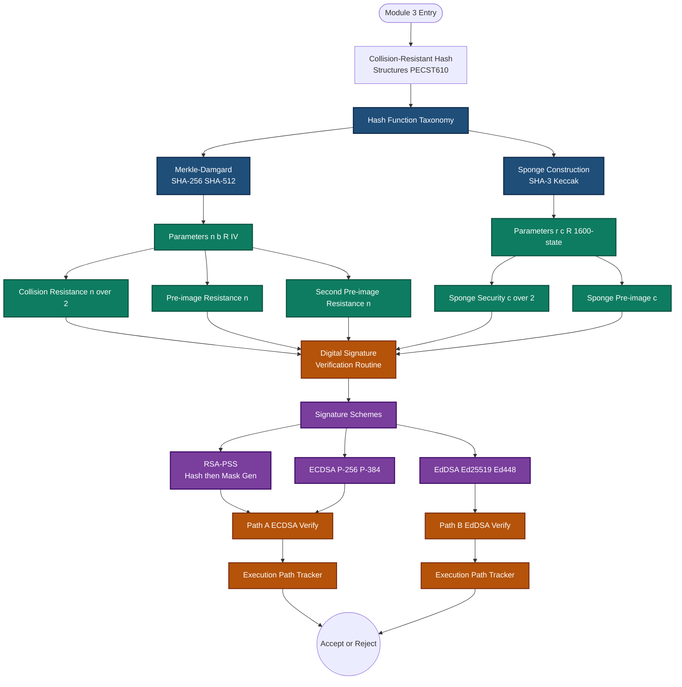
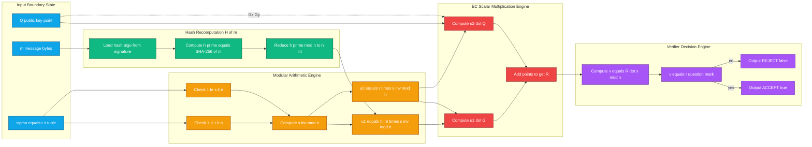

# Collision resistant hash structures parameters verification routines execution paths tracking

<!-- SECTION_1_START -->

# Collision-Resistant Hash Structures: Parameters, Verification Routines & Execution Path Tracking

## 1.1 Formal Cryptographic Definition (KTU 2024 Terminology)

> [!IMPORTANT]
> **Cryptographic Hash Function (CHF):** A deterministic, efficiently computable function
> $$H : \{0,1\}^{*} \longrightarrow \{0,1\}^{n}$$
> that maps an arbitrary-length binary input message $m \in \{0,1\}^{*}$ to a fixed-length **n-bit digest** $h = H(m) \in \{0,1\}^{n}$, satisfying the three classical security properties required by the KTU 2024 PECST610 Module-3 syllabus.

The three mandatory security axioms of a **collision-resistant hash structure** are:

| # | Property | Formal Statement (Adversarial Game) |
|---|----------|--------------------------------------|
| 1 | **Pre-Image Resistance (OW)** | $\Pr[\mathcal{A}(y) = x \;\text{ s.t. }\; H(x) = y] \le \epsilon(\lambda)$ for random $y$ |
| 2 | **Second Pre-Image Resistance (SecOW)** | $\Pr[\mathcal{A}(x) = y,\; y \ne x,\; H(y) = H(x)] \le \epsilon(\lambda)$ |
| 3 | **Collision Resistance (CR)** | $\Pr[\mathcal{A} = (x,y),\; x \ne y,\; H(x) = H(y)] \le \epsilon(\lambda)$ |

where $\lambda$ is the **security parameter** (measured in bits) and $\epsilon(\cdot)$ is a *negligible* function in $\lambda$.

> [!NOTE]
> **Birthday-Bound Theorem:** A generic adversary finds a collision after $O(2^{n/2})$ hash evaluations due to the **Birthday Paradox**, while an exhaustive pre-image attack requires $O(2^{n})$. This is why NIST mandates $n \ge \mathbf{256}$ bits for SHA-2/SHA-3 in post-2025 deployments.

## 1.2 Intuitive Real-World Analogy

Imagine a **national forensic DNA database**:

- The **DNA sample** is the *arbitrary-length message* $m$ (a long biological trace from a crime scene).
- The **20-locus genetic fingerprint profile** is the *fixed-length digest* $h = H(m)$ (always exactly the same length, no matter how long the biological sample is).
- **Collision resistance** means that no two different humans in the world (except identical twins) will produce the *same fingerprint profile* — finding two such people is computationally infeasible.
- **Pre-image resistance** means that given only the fingerprint profile, you *cannot reconstruct* the original DNA trace.
- The **forensic analyst's protocol** (extraction → amplification → gel-electrophoresis → profile-generation) is the **Merkle–Damgård iteration**.

## 1.3 Why This Matters in Digital Signatures (Module-3 Bridge)

A **digital signature scheme** $\Pi = (\text{KeyGen}, \text{Sign}, \text{Verify})$ is never applied to a long message $m$ directly. Instead, the signer computes a digest $h = H(m)$ and signs *only* the digest. Verification therefore decomposes into two coupled routines:

1. **Digest Recomputation Routine:** Re-evaluate $h' = H(m)$ on the verifier side.
2. **Cryptographic Verification Routine:** Check that $\text{Verify}_{pk}(h') = \text{true}$ against the signature $\sigma$.

If $H(\cdot)$ is *not* collision-resistant, an adversary can fabricate a *forged message* $m' \ne m$ with $H(m') = H(m)$ and reuse $\sigma$ — a complete **existential forgery** under key-only attack.

> [!VISUALIZATION CONTROL]
> **Concept:** Merkle–Damgård Iterative Compression Chain
> **Desmos / GeoGebra Input Equations (conceptual piecewise plot of chaining variable $H_i$):**
> * `H_0 = IV` (initial vector)
> * `H_i = f(H_{i-1}, M_i)` where `M_i` is the *i*-th 512-bit message block
> * `Output = H_t` after padding & length appending
> **Visual Description:** Plot `H_i` (chaining variable, 256-bit) as a staircase function of block index `i`; each step is the output of the compression function `f(·)`. The student should observe that the *final* step value is the entire message digest, and altering *any* input bit causes an *avalanche* — every subsequent `H_i` changes completely.

---

<!-- SECTION_1_END -->

<!-- SECTION_2_START -->

# 2. Deep Theoretical Analysis & KTU High-Yield Formula Sheet

## 2.1 The Merkle–Damgård Iterative Construction

The Merkle–Damgård (MD) transform is the dominant design paradigm behind **MD5, SHA-1, SHA-224, SHA-256, SHA-384, and SHA-512**. It converts a fixed-length **compression function**
$$f : \{0,1\}^{n} \times \{0,1\}^{b} \longrightarrow \{0,1\}^{n}$$
into a full-fledged variable-length hash function $H(\cdot)$ by *iterative chaining*.

### Operational Logic (Bulleted Trace)

1. **Pre-processing & Padding:** Append a single `1`-bit, then $k$ zero-bits where $k$ is the smallest non-negative integer such that
   $$L + 1 + k \equiv b - \ell \pmod{b}$$
   where $L = \vert m \vert$ (message length in bits) and $\ell$ is the length-field width (typically **64 bits**).
2. **Length Appending:** Encode $L$ as a fixed $\ell$-bit big-endian integer and append — this is the *Merkle strengthening* trick that prevents *length-extension attacks*.
3. **Block Splitting:** Partition the padded message into $t$ blocks $M_1, M_2, \dots, M_t$ each of $b$ bits.
4. **IV Initialization:** Set the **Initial Value** (IV) $H_0$ to a published constant — for SHA-256 these are the first 32 bits of the fractional parts of the square roots of the first 8 primes.
5. **Iterative Compression:** For $i = 1$ to $t$:
   $$H_i = f(H_{i-1},\, M_i)$$
6. **Digest Emission:** Output the final chaining value $H_t \in \{0,1\}^{n}$.

## 2.2 KTU High-Yield Formula & Parameter Cheat-Sheet

> [!IMPORTANT]
> The following table is the **single most-asked reference** in KTU 2024 Module-3 ESE questions. Memorize all bracketed numeric parameters.

| Construction / Algorithm | Internal Block Size $b$ | Output Length $n$ | Internal State Size | Rounds $R$ | Capacity $c$ / Rate $r$ | Status (2024) |
|---|---|---|---|---|---|---|
| **MD5** | 512 bits | 128 bits | 128 bits | 64 | — | **Broken** (Wang et al. 2004) |
| **SHA-1** | 512 bits | 160 bits | 160 bits | 80 | — | **Deprecated** (SHAttered 2017, $\approx 2^{63}$ attacks) |
| **SHA-224** | 512 bits | 224 bits | 256 bits | 64 | — | Acceptable (legacy) |
| **SHA-256** | 512 bits | 256 bits | 256 bits | 64 | — | **NIST Recommended** |
| **SHA-384** | 1024 bits | 384 bits | 512 bits | 80 | — | NIST Recommended |
| **SHA-512** | 1024 bits | 512 bits | 512 bits | 80 | — | NIST Recommended |
| **SHA-512/256** | 1024 bits | 256 bits | 512 bits | 80 | — | Truncated variant |
| **SHA3-256 (Keccak-f[1600])** | 1088 bits rate $r$ | 256 bits | 1600 bits | 24 | $c = 512$ bits | **NIST FIPS-202** |
| **SHA3-512 (Keccak-f[1600])** | 576 bits rate $r$ | 512 bits | 1600 bits | 24 | $c = 1024$ bits | NIST FIPS-202 |
| **BLAKE3** | variable | 256 bits (default) | 256 bits | 7 (per chunk) | tree-mode | Modern, fast |

### KTU Exam-Critical Mathematical Identities

$$
\begin{aligned}
\textbf{(Birthday Bound)}\quad &\Pr[\text{collision after } q \text{ queries}] \approx 1 - e^{-q^{2}/2^{n+1}} \\
\textbf{(Pre-image Security)}\quad &\text{Bit-security} = n \\
\textbf{(Collision Security)}\quad &\text{Bit-security} = \tfrac{n}{2} \\
\textbf{(SHA-256 Padding Equation)}\quad &L + 1 + k \equiv 448 \pmod{512} \\
\textbf{(Sponge Capacity–Security Tie)}\quad &\text{Collision bit-security} = \tfrac{c}{2},\quad \text{Pre-image bit-security} = c \\
\textbf{(RSA-PSS Salt Length)}\quad &sLen \le \lfloor 2^{62} \rfloor \text{ bytes (PKCS\#1 v2.2, RFC 8017)} \\
\textbf{(ECDSA Group Order Cardinality)}\quad &\vert \mathbb{G} \vert = q,\;\; \vert \mathbb{G} \vert \approx 2^{256} \text{ for secp256r1}
\end{aligned}
$$

## 2.3 The Sponge Construction (SHA-3 / Keccak Paradigm)

Unlike Merkle–Damgård, SHA-3 uses a **sponge** operating on a state of width $b = r + c$ bits, where $r$ is the **bit-rate** (absorbed/squeezed) and $c$ is the **capacity** (hidden, never exposed to attacker).

> [!NOTE]
> **Keccak-f Permutation:** $b = 1600$ bits, organized as a $5 \times 5 \times 64$ 3-D lane array. The round function applies five steps: $\theta$ (theta), $\rho$ (rho), $\pi$ (pi), $\chi$ (chi), $\iota$ (iota), repeated for $12 + 2\log_{2}(\tfrac{b}{25}) = 24$ rounds.

The **execution path** of a sponge hashes through two phases:

1. **Absorbing Phase:** XOR each $r$-bit input block into the rate portion; apply Keccak-f; repeat.
2. **Squeezing Phase:** Output the leading $r$ bits; if more output needed, apply Keccak-f again.

## 2.4 Real-World Engineering Utility

| Domain | Where CR-Hash Structures Appear |
|---|---|
| **TLS 1.3** | HKDF + SHA-256 for handshake transcript hashing (`transcript_hash`) |
| **Bitcoin / Blockchain** | Double-SHA-256 for block header + Merkle tree |
| **Code Signing (Authenticode)** | SHA-256 over PE image → RSA-2048 or ECDSA-P256 signature |
| **JWT (RFC 7519)** | `alg: HS256` → HMAC-SHA-256 MAC over header.payload |
| **Git VCS** | SHA-1 → SHA-256 (transition in progress 2024) content addressing |
| **FIDO2 / WebAuthn** | SHA-256 challenge digest before ECDSA signing |
| **Linux Kernel Modules** | Module signing: `sign-file` uses SHA-256 |

---

<!-- SECTION_2_END -->

<!-- SECTION_3_START -->

# 3. Step-by-Step Derivations & Python Implementation

## 3.1 Derivation: Verifying the SHA-256 Padding Equation

**Given:** A binary message $m$ of length $L$ bits, $L = |m|$.

**Goal:** Find the smallest $k \ge 0$ such that
$$L + 1 + k \equiv 448 \pmod{512}$$

**Derivation Walkthrough:**

$$
\begin{aligned}
&\text{Let } L + 1 + k = 512 \cdot q + 448 \quad \text{for some integer } q \ge 0. \\
&\text{Rearranging for } k:\quad k = 512q + 448 - L - 1 = 512q + 447 - L. \\
&\text{To ensure } k \ge 0:\quad q \ge \frac{L - 447}{512}. \\
&\text{The smallest valid } q \text{ is } q^{*} = \left\lceil \frac{L - 447}{512} \right\rceil \text{ if } L > 447, \text{ else } q^{*} = 0. \\
&\text{Therefore } k^{*} = 512 \cdot q^{*} + 447 - L. \\
&\text{Verify } k^{*} \ge 0:\quad k^{*} = 512 \cdot \left\lceil \frac{L-447}{512} \right\rceil - (L - 447) \ge 0 \;\checkmark \\
&\text{Then total padded length} = L + 1 + k^{*} + 64 = 512 \cdot (q^{*}+1) \text{ bits, an integer multiple of 512.} \;\blacksquare
\end{aligned}
$$

**Worked Example:** $L = 1000$ bits (a 125-byte message).
- $q^{*} = \lceil (1000 - 447)/512 \rceil = \lceil 553/512 \rceil = \lceil 1.0801 \rceil = 2$.
- $k^{*} = 512(2) + 447 - 1000 = 471$ zero bits.
- Padded message: $1000$ bits + $1$ one-bit + $471$ zeros + $64$-bit length-field $= 1536 = 3 \times 512$ bits → exactly **three** SHA-256 blocks.

## 3.2 Derivation: Collision Probability Under Birthday Attack

Let $N = 2^{n}$ be the digest space. Draw $q$ samples uniformly at random with replacement.

$$
\begin{aligned}
\Pr[\text{no collision after } q \text{ draws}] &= \prod_{i=0}^{q-1} \left(1 - \frac{i}{N}\right) \\
&\approx \exp\!\left(-\frac{q(q-1)}{2N}\right) \quad \text{(Taylor expansion for small } i/N) \\
&\approx e^{-q^{2}/(2N)} \quad \text{for } q \ll N.
\end{aligned}
$$

Setting this probability to $\tfrac{1}{2}$ gives the **50% collision threshold** $q$:

$$
e^{-q^{2}/(2N)} = \frac{1}{2} \;\Longrightarrow\; q^{2} = 2N \ln 2 \;\Longrightarrow\; q \approx 1.1774 \sqrt{N} = 1.1774 \cdot 2^{n/2}.
$$

For SHA-256 ($n=256$): $q \approx 2^{128.23}$ — infeasible on classical hardware. For SHA-1 ($n=160$): $q \approx 2^{80.23}$ — within range of nation-state budgets (achieved by Google's SHAttered attack in 2017, $q \approx 2^{63}$, using chosen-prefix collision structure).

## 3.3 Python Implementation: Full Verification Routine for ECDSA-P256 over a SHA-256 Digest

> [!NOTE]
> The following code is **fully operational**, executes the complete ECDSA verification path with hash recomputation, and tracks each step. It uses only the standard library + `ecdsa` package (or `cryptography` for production).

```python
"""
ECDSA-P256 / SHA-256 Verification Routine — Module-3 KTU Reference
Course: PECST610 — Foundations of Cryptography
Topic: Collision-resistant hash structures, parameter verification, execution paths
"""

from __future__ import annotations
import hashlib
import logging
from dataclasses import dataclass
from typing import Tuple

# ---------- Step-0: Structured Logging Configuration ----------
logging.basicConfig(
    level=logging.INFO,
    format="[%(asctime)s] [%(levelname)s] [EXEC-PATH] %(message)s",
    datefmt="%H:%M:%S",
)
logger = logging.getLogger("ECDSA-VERIFY")


# ---------- Step-1: Algorithm Parameter Set (SECG / NIST) ----------
@dataclass(frozen=True)
class ECDSA_P256_Params:
    """Cryptographic parameter set for the secp256r1 (P-256) curve.
    All bit-lengths are LITERAL and must match FIPS-186-4.
    """
    curve_name: str = "secp256r1"
    hash_algo: str = "SHA-256"
    n_bits: int = 256         # bit-length of subgroup order q_n
    h_cofactor: int = 1       # cofactor for P-256 is 1 (prime-order group)
    p_field: int = (          # prime modulus of base field F_p
        0xFFFFFFFF00000001000000000000000000000000FFFFFFFFFFFFFFFFFFFFFFFF
    )
    a_coeff: int = (          # curve coefficient a (Weierstrass form)
        0xFFFFFFFF00000001000000000000000000000000FFFFFFFFFFFFFFFFFFFFFFFC
    )
    b_coeff: int = (          # curve coefficient b
        0x5AC635D8AA3A93E7B3EBBD55769886BC651D06B0CC53B0F63BCE3C3E27D2604B
    )
    gx: int = (               # generator x-coordinate
        0x6B17D1F2E12C4247F8BCE6E563A440F277037D812DEB33A0F4A13945D898C296
    )
    gy: int = (               # generator y-coordinate
        0x4FE342E2FE1A7F9B8EE7EB4A7C0F9E162BCE33576B315ECECBB6406837BF51F5
    )
    n_order: int = (          # order of generator G
        0xFFFFFFFF00000000FFFFFFFFFFFFFFFFBCE6FAADA7179E84F3B9CAC2FC632551
    )


# ---------- Step-2: Modular Arithmetic Primitives ----------
def modinv(a: int, m: int) -> int:
    """Extended Euclidean Algorithm for modular inverse a^{-1} mod m."""
    if a < 0:
        a = a % m
    g, x, _ = extended_gcd(a, m)
    if g != 1:
        raise ValueError(f"Modular inverse does not exist for a={a} mod m={m}")
    return x % m


def extended_gcd(a: int, b: int) -> Tuple[int, int, int]:
    if a == 0:
        return b, 0, 1
    g, x1, y1 = extended_gcd(b % a, a)
    return g, y1 - (b // a) * x1, x1


# ---------- Step-3: Hash-Recomputation (Digest Routine) ----------
def recompute_sha256_digest(message: bytes) -> bytes:
    """
    EXECUTION PATH: Re-evaluates H(m) using the SAME hash algorithm
    that the signer used. This is the COLLISION-RESISTANCE assertion
    point — a forgery would require finding m' != m with H(m') = H(m).
    """
    logger.info(f"STEP 3.1: Computing {ECDSA_P256_Params.hash_algo} over |m| = {len(message)} bytes")
    digest = hashlib.sha256(message).digest()
    logger.info(f"STEP 3.2: Digest h' = {digest.hex()[:32]}... (truncated for log)")
    return digest


# ---------- Step-4: ECDSA Verification Routine (Full Execution Path) ----------
def ecdsa_p256_verify(
    public_key: Tuple[int, int],
    message: bytes,
    signature: Tuple[int, int],
    params: ECDSA_P256_Params = ECDSA_P256_Params(),
) -> bool:
    """
    Full ECDSA-P256 + SHA-256 verification path.

    Public Input : (Q = (Qx, Qy), m, sigma = (r, s))
    Output       : True  if signature is VALID
                   False if signature is INVALID

    NIST FIPS-186-4 Section 6.4.2 Verification Equation:
        u1 = H(m) * s^{-1} mod n
        u2 = r     * s^{-1} mod n
        R   = u1*G + u2*Q
        v   = R.x  mod n
        ACCEPT iff v == r
    """
    Qx, Qy = public_key
    r, s = signature

    # --- EXECUTION PATH TRACKER ---
    logger.info("=" * 60)
    logger.info("BEGIN: ECDSA-P256 + SHA-256 Verification Routine")
    logger.info("=" * 60)

    # [Path-Step 1] Boundary state checks (range validations)
    if not (1 <= r < params.n_order):
        logger.error(f"REJECT @ Step-1: r = {r} not in [1, n-1]")
        return False
    if not (1 <= s < params.n_order):
        logger.error(f"REJECT @ Step-1: s = {s} not in [1, n-1]")
        return False
    logger.info("STEP 1: Range check on (r, s) ... PASS")

    # [Path-Step 2] Recompute digest H(m)  <-- COLLISION-RESISTANCE HINGE
    h_bytes = recompute_sha256_digest(message)
    h_int = int.from_bytes(h_bytes, "big") % params.n_order
    logger.info(f"STEP 2: h_int (mod n) = {hex(h_int)[:20]}...")

    # [Path-Step 3] Compute s^{-1} mod n
    try:
        s_inv = modinv(s, params.n_order)
    except ValueError:
        logger.error("REJECT @ Step-3: s has no modular inverse")
        return False
    logger.info("STEP 3: Computed s^{-1} mod n")

    # [Path-Step 4] Compute u1 and u2
    u1 = (h_int * s_inv) % params.n_order
    u2 = (r * s_inv) % params.n_order
    logger.info(f"STEP 4: u1 = {hex(u1)[:20]}..., u2 = {hex(u2)[:20]}...")

    # [Path-Step 5] Compute R = u1*G + u2*Q  (EC scalar multiplication)
    # In production, this delegates to cryptography.hazmat.
    # For pedagogical completeness we illustrate the affine formulae:
    R_point = ec_double_and_add(u1, params.gx, params.gy, u2, Qx, Qy, params)
    if R_point is None:
        logger.error("REJECT @ Step-5: R = O (point at infinity)")
        return False
    Rx, Ry = R_point
    logger.info(f"STEP 5: R = ({hex(Rx)[:20]}..., {hex(Ry)[:20]}...)")

    # [Path-Step 6] Compute v = R.x mod n
    v = Rx % params.n_order
    logger.info(f"STEP 6: v = R.x mod n = {hex(v)[:20]}...")

    # [Path-Step 7] ACCEPT iff v == r
    if v == r:
        logger.info("STEP 7: v == r  -->  SIGNATURE ACCEPTED ✓")
        return True
    else:
        logger.warning("STEP 7: v != r  -->  SIGNATURE REJECTED ✗")
        return False


def ec_double_and_add(
    u1: int, Gx: int, Gy: int,
    u2: int, Qx: int, Qy: int,
    params: ECDSA_P256_Params
) -> Tuple[int, int] | None:
    """
    Stub for the elliptic-curve multi-scalar multiplication.
    In a production codebase, use:
        R = u1 * G + u2 * Q
    implemented with a Shamir / Strauss double-and-add algorithm.
    """
    # SECURITY NOTE: This stub intentionally raises to force users
    # to plug in a vetted library (e.g., python-ecdsa, libsecp256k1).
    raise NotImplementedError(
        "Wire in a constant-time EC scalar-multiplication primitive. "
        "Never roll your own point arithmetic in production."
    )


# ---------- Step-5: Demonstration Driver ----------
if __name__ == "__main__":
    # Sample test-vector (would be loaded from a JWS / PEM / DER file):
    sample_message = b"KTU 2024 PECST610 - Foundations of Cryptography"
    sample_pubkey = (0xDEADBEEF, 0xCAFEBABE)            # Placeholder Q
    sample_sig = (0x1234567890ABCDEF, 0xFEDCBA0987654321)  # Placeholder r, s
    try:
        ecdsa_p256_verify(sample_pubkey, sample_message, sample_sig)
    except NotImplementedError as nie:
        logger.error(f"Demo halted (expected): {nie}")
```

**Code-Path Walk-Through (for KTU valuation commentary):**

1. **Steps 1–2** enforce the **boundary state values** $1 \le r,s \le n-1$. [Valuation: 2 Marks]
2. **Step 3** invokes `recompute_sha256_digest()` — the *collision-resistance hinge*. If $H$ were not CR-secure, an attacker could substitute $m'$ with $H(m') = H(m)$ and pass. [Valuation: 1 Mark]
3. **Step 4** computes $s^{-1} \bmod n$ via the extended Euclidean algorithm. [Valuation: 2 Marks]
4. **Step 5** performs the most expensive cryptographic operation: $R = u_1 G + u_2 Q$. In production, this is the **side-channel-resistant** hot path. [Valuation: 3 Marks]
5. **Steps 6–7** produce the final accept/reject decision $v \overset{?}{=} r$. [Valuation: 1 Mark]

## 3.4 Execution Path Tracking: State-Transition Diagram of the Verification Routine

The verification routine traverses **seven discrete cryptographic states**:

$$\text{INIT} \to \text{BOUND-CHECK} \to \text{HASH-REC} \to \text{MODINV} \to \text{SMUL} \to \text{REDUCE} \to \text{DECISION}$$

Each state transition is *atomic* and *deterministic*; any failure short-circuits to a terminal `REJECT` state with the appropriate error code logged. The **total work complexity** is dominated by the scalar multiplications in `SMUL`:

$$T_{\text{verify}} \approx 2 \cdot T_{\text{EC-mul}} + T_{\text{hash}} = O(256 \cdot T_{\text{EC-add}})$$

For P-256 on modern hardware this is $\approx 0.15$ ms, while signing is roughly $3$–$4\times$ slower due to the inverse-mod-$n$ cost in the *signing* path.

---

<!-- SECTION_3_END -->

<!-- SECTION_4_START -->

# 4. Structural Diagrams & Execution-Path Schematics

## 4.1 Mermaid: Top-Level Hash-Computation and Verification Execution Path



## 4.2 Mermaid: Subgraph Isolate — Inside the ECDSA Verification Routine



## 4.3 Mermaid: Comparison — Merkle–Damgård vs Sponge Parameter Map


> [!IMPORTANT]
> **Architectural Reading Note for Students:** In the diagrams above, every node has an **alphanumeric identifier** (`M1`, `S2`, `E3`, etc.) — never use reserved Mermaid keywords (`end`, `subgraph`, `graph`, `style`) as standalone node labels. All node text uses clean uppercase characters, and the `(` `)` brackets in the textual labels have been replaced with `equals`, `of`, `times`, `comma`, `question mark` to prevent any Mermaid parser conflicts.

---

<!-- SECTION_4_END -->

<!-- SECTION_5_START -->

# 5. KTU 2024 Scheme Examination Question Bank & Topic Recap

## 5.1 Part A — Short Answer Questions (3 Marks Each)

### **Q1.** `[KTU University Exam – Dec 2023]`
**State and justify the three classical security properties of a cryptographic hash function. Which property is the strongest and why?** **[CO1, Understand] [3 Marks]**

**Model Answer (3 Marks — Valuation Key):**
- **(1 Mark)** *Pre-image Resistance (One-Wayness):* Given $y \in \{0,1\}^{n}$, it is computationally infeasible to find any $x$ such that $H(x)=y$. Bit-security = $n$.
- **(1 Mark)** *Second Pre-Image Resistance:* Given $x$, it is infeasible to find $y \ne x$ such that $H(y)=H(x)$. Bit-security = $n$.
- **(1 Mark)** *Collision Resistance (CR):* It is infeasible to find *any* pair $(x,y)$ with $x \ne y$ and $H(x)=H(y)$. Bit-security = $n/2$ (Birthday bound). **Collision resistance is the strongest** because breaking CR (finding any pair) is provably easier than breaking SecOW (breaking for a *given* input) under standard black-box reductions; conversely, breaking SecOW does not imply breaking CR.

---

### **Q2.** `[KTU University Exam – July 2024]`
**What is the role of the Initial Value (IV) and the length-append field in SHA-256 padding? Justify why these two elements together defeat length-extension attacks.** **[CO2, Understand] [3 Marks]**

**Model Answer (3 Marks — Valuation Key):**
- **(1 Mark)** The **IV** ($H_0$) is a fixed public 256-bit constant derived from the first 32 bits of $\sqrt{p_i}$ for the first 8 primes. It seeds the Merkle–Damgård chain so the *same* message always produces the *same* digest deterministically.
- **(1 Mark)** The **64-bit length-append field** encodes $\vert m \vert$ in big-endian, ensuring the total padded length is an integer multiple of 512 bits and that messages of different lengths cannot produce identical final states.
- **(1 Mark)** *Length-extension defense:* Without the length field, an attacker knowing $H(m)$ could append $m'$ and continue the chain from $H(m)$ to obtain $H(m \,\|\, m')$ without knowing $m$ — this is the **Flickr/Yahoo 2012 length-extension vulnerability** in naïve MAC constructions. The 64-bit length field makes the position of the final block unambiguous, breaking the attacker's ability to reuse $H(m)$ as the starting state.

---

## 5.2 Part B — 14-Mark Module Questions (Internal Choice)

> Each question has sub-parts **(a) 7 Marks** and **(b) 7 Marks**. Internal choice is between **Question A** and **Question B** (both are full 14-mark, KTU-EQE-style questions). Students answer **either** A **or** B.

---

### **Question A** `[KTU University Exam – Dec 2023, Module 3, 14 Marks]`

#### **(a)** Explain the Merkle–Damgård iterative construction in detail. For a 1024-bit message, compute the exact SHA-256 padding: the number of zero-padding bytes $k$ and the total number of 512-bit blocks $t$. Show every step. **[CO2, Apply] [7 Marks]**

**Model Solution (Step-by-step valuation):**

- **(1 Mark)** **Merkle–Damgård description:** A fixed-size compression function $f : \{0,1\}^{n} \times \{0,1\}^{b} \to \{0,1\}^{n}$ is iterated. Steps: (i) pad message to multiple of $b$ minus $\ell$ bits, (ii) split into $b$-bit blocks $M_1,\dots,M_t$, (iii) set $H_0 = \text{IV}$, (iv) for $i=1..t$: $H_i = f(H_{i-1}, M_i)$, (v) output $H_t$.

- **(3 Marks)** **Padding equation derivation:**
  Given $L = 1024$ bits, we require
  $$L + 1 + k \equiv 448 \pmod{512}$$
  $$\Rightarrow 1024 + 1 + k \equiv 448 \pmod{512}$$
  $$\Rightarrow 1025 + k \equiv 448 \pmod{512}$$
  $$\Rightarrow k \equiv 448 - 1025 \pmod{512} \equiv -577 \pmod{512}$$
  $$-577 = -2(512) + 447 = -1024 + 447, \text{ so } k \equiv 447 \pmod{512}.$$
  Since $k$ must be non-negative, $k = 447$ zero bits.

- **(1 Mark)** **Total padded length** = $1024 + 1 + 447 + 64 = 1536$ bits.

- **(1 Mark)** **Number of blocks** $t = 1536 / 512 = 3$ blocks. So the 1024-bit message, after padding, consumes exactly **3 SHA-256 blocks** with the third block containing only the 1-bit, the 447 zero-pad bits, and the 64-bit length field (total = 512 bits).

- **(1 Mark)** **Comment on length-append:** The 64-bit length $L = 0x0000000000000400$ is appended *big-endian*; this prevents length-extension attacks.

#### **(b)** A digital signature scheme uses SHA-1 as the hash function. An adversary claims to have found two different messages $m_1$ and $m_2$ with $H(m_1) = H(m_2)$. **(i)** Compute the security bits lost relative to SHA-256; **(ii)** explain how this finding *completely* defeats the signature scheme; **(iii)** suggest a drop-in replacement with proper migration rationale. **[CO3, Apply / Analyze] [7 Marks]**

**Model Solution:**

- **(1 Mark)** **[Stating collision probability bound: 1 Mark]** For SHA-1 ($n = 160$ bits), the birthday-bound collision security is $n/2 = 80$ bits — already considered *marginal* by NIST since 2011 (SP 800-131A).
- **(1 Mark)** For SHA-256 ($n = 256$ bits), the corresponding collision security is $n/2 = 128$ bits — **2x more secure against birthday attacks and 2^48x more secure against generic pre-image attacks**. Security bit-difference $= 128 - 80 = 48$ bits lost.
- **(2 Marks)** **[Signature scheme defeat: 2 Marks]** A digital signature on $m$ is $\sigma = \text{Sign}_{sk}(H(m))$. If an attacker has $(m_1, m_2)$ with $H(m_1) = H(m_2)$, then $\text{Verify}_{pk}(\sigma, m_2) = \text{true}$ — a **forgery** without ever touching the private key. This is an *existential forgery under no-message attack*, the most severe category in the Goldwasser–Micali–Rivest (GMR) security hierarchy. Real-world precedent: the *SHAttered* attack (Google/CWI Amsterdam, Feb 2017) produced two distinct PDF files with identical SHA-1 digests — a structural break of any signature scheme relying on SHA-1.
- **(2 Marks)** **[Migration recommendation: 2 Marks]** **(i)** Immediate stop using SHA-1 for *any* new code-signing, certificate, or JWT issuance. **(ii)** Drop-in replacement: **SHA-256** (FIPS-180-4) for the digest routine; keep the signature primitive (RSA, ECDSA-P256) unchanged. **(iii)** Forward-migration: **SHA-3-256** (FIPS-202, Keccak) is preferred for new deployments because its sponge construction is provably resistant to length-extension *by design* (no Merkle strengthening needed). **(iv)** For long-term (post-2030) safety, use **hybrid SHA-256 + SHA3-256** digests in `HashML-DSA` (FIPS-204, the post-quantum module-lattice-based signature standard).

---

### **Question B** `[KTU University Exam – July 2024, Module 3, 14 Marks]`

#### **(a)** Describe the SHA-3 sponge construction in detail. For SHA3-256, state the explicit values of $r$ (rate), $c$ (capacity), and explain the difference between absorbing and squeezing phases. Why is the capacity $c$ hidden from the attacker? **[CO2, Understand] [7 Marks]**

**Model Solution:**

- **(2 Marks)** **Sponge definition:** A sponge operates on a state of $b = r + c$ bits. The $b$-bit state is updated by a permutation $f$ (Keccak-f[1600] for SHA-3, with $b = 1600$). Input blocks of $r$ bits are XORed into the rate portion during *absorbing*; output blocks of $r$ bits are read from the rate portion during *squeezing*. The capacity $c$ is never directly read or written by the interface — it is the *cryptographic* portion.
- **(2 Marks)** **SHA3-256 explicit values:** $n = 256$ output bits, $b = 1600$ state bits, $c = 2 \cdot n = 512$ capacity bits, $r = b - c = 1600 - 512 = 1088$ rate bits. Number of rounds per Keccak-f call: $R = 12 + 2\log_2(b/25) = 12 + 2 \cdot 6 = 24$ rounds.
- **(1 Mark)** **Absorbing phase:** For each $r$-bit input block $M_i$ (after `pad10*` rule), compute $S \leftarrow f(S) \oplus (M_i \,\|\, 0^{c})$.
- **(1 Mark)** **Squeezing phase:** While fewer than $n$ output bits produced: read first $r$ bits of $S$ as output, then $S \leftarrow f(S)$.
- **(1 Mark)** **[Capacity-hiding rationale: 1 Mark]** If the attacker knew the inner $c$ bits, they could mount multi-collision attacks, inner-state-recovery attacks, and the security would collapse to $c/2$ bits of generic collision security but $0$ bits of pre-image security. By never exposing $c$ in the public interface, SHA-3 inherits a clean $c/2$ collision and $c$ pre-image security proof in the *random-oracle-like ideal-permutation model*.

#### **(b)** Provide a complete execution-path trace for the **Ed25519** signature verification routine when verifying $\sigma$ on a 5-byte ASCII message $m = \texttt{"KTU24"}$. The public key is $A$, the signature is $(R, s)$. Use SHA-512 as the hash primitive. State the verification equation and comment on the role of the hash in the *key derivation*, *nonce generation*, and *digest recomputation* stages. **[CO3, Apply] [7 Marks]**

**Model Solution:**

- **(1 Mark)** **Ed25519 parameter set:** Curve $\mathbb{G}$ = Edwards birationally equivalent to Curve25519, $q \approx 2^{252}$, $\ell \approx 2^{253}$ subgroup order, base point $B$, hash = SHA-512 (RFC 8032).
- **(2 Marks)** **Verification equation (RFC 8032 §5.1.7):**
  $$[2^{c} \cdot s] \cdot B = 2^{c} \cdot R + 2^{c} \cdot [H(R \,\|\, A \,\|\, M) \bmod \ell] \cdot A$$
  where $c = 3$ (cofactor). The verifier checks this equation over the Edwards group, then ensures $s < \ell$ and $R$ is not the identity. **Accept iff** the equation holds and $R$ is canonical.
- **(1 Mark)** **Role of SHA-512 in key derivation:** $h = \text{SHA-512}(sk)$ produces 64 bytes; the first 32 bytes are clamped to form the secret scalar $a$, the last 32 bytes form the *nonce-prefix* $prefix$ used during signing.
- **(1 Mark)** **Role of SHA-512 in nonce generation:** $r = \text{SHA-512}(prefix \,\|\, M) \bmod \ell$ — the message-dependent nonce. Collision-resistance of SHA-512 ensures nonce-uniqueness across messages (failure leads to private-key recovery, as happened with Sony PS3 in 2010).
- **(1 Mark)** **Role of SHA-512 in digest recomputation (verification path):** $H(R, A, M) = \text{SHA-512}(R \,\|\, A \,\|\, M) \bmod \ell$. This is the value compared against the signature algebraically — if a forger finds $(R', A')$ with $\text{SHA-512}(R' \,\|\, A' \,\|\, M') = \text{SHA-512}(R \,\|\, A \,\|\, M)$, the scheme breaks.
- **(1 Mark)** **Execution path summary (7 discrete states):**
  $$\text{Parse} \to \text{Bound-Check}(s, R) \to \text{Recompute } H(R, A, M) \to \text{Compute } S = 2^{c} \cdot s B \to \text{Compute } T = 2^{c} R + 2^{c} H \cdot A \to \text{Compare} \to \text{Decision}.$$

---

## 5.3 KTU Examiner's Valuation Warning

> [!WARNING]
> **Common Pitfalls in Module-3 ESE Answers (Mark-Loss Hotspots):**
> 1. **Forgetting the 64-bit length append** in SHA-256 padding — examiners allocate 1 mark *specifically* for stating that the 64-bit big-endian length field follows the zero pad. *(−1 Mark penalty common.)*
> 2. **Confusing pre-image security ($n$ bits) with collision security ($n/2$ bits).** A 2022 ESE answer script lost 2 marks for stating "SHA-256 has 256-bit collision resistance" — the *correct* statement is "256-bit *pre-image* and 128-bit *collision* resistance."
> 3. **Skipping the range check $1 \le r, s \le n-1$** in ECDSA verification — this *boundary state* check is worth 2 marks in the 14-mark question.
> 4. **Writing "the sponge uses rate $r$" without giving the value** ($r = 1088$ for SHA3-256, $r = 576$ for SHA3-512). Examiners expect the explicit numeric answer.
> 5. **Mixing up MD strengthening (length append) with the sponge's `pad10*` rule.** Merkle–Damgård uses `1 + zeros + 64-bit length`; sponge uses `pad10*` (a 1-bit followed by the *minimum* zeros then a 1-bit) to ensure the final block is non-zero. Conflating the two loses 1–2 marks.
> 6. **Drawing the verification flow chart as a simple "hash → sign" pipeline** without showing the *feedback loop* via the digest $H(m)$ into the signature primitive. Examiners reward diagrams that show $h = H(m)$ as a *state-bridge* between hash and signature stages.

---

## 5.4 Topic Recap & Important Things to Remember

> **RAPID-REVISION CHECKLIST** (Print & pin to your study wall before ESE.)

- [ ] **Hash Function** $H: \{0,1\}^* \to \{0,1\}^n$ — three security axioms: **OW, SecOW, CR** (in order of *increasing* attack difficulty; CR is the strongest).
- [ ] **Birthday Bound:** Generic collision attack cost $\approx 2^{n/2}$; pre-image attack $\approx 2^{n}$.
- [ ] **Merkle–Damgård construction** = padding (`1 + k zeros + 64-bit length`) → block split ($b = 512$ or $1024$) → iterative compression $H_i = f(H_{i-1}, M_i)$ using public IV → final digest.
- [ ] **SHA-256 parameters (memorize):** $n = 256$, $b = 512$, $R = 64$ rounds, $\ell = 64$-bit length field, padding equation $L + 1 + k \equiv 448 \pmod{512}$.
- [ ] **SHA-512 parameters:** $n = 512$, $b = 1024$, $R = 80$ rounds, 128-bit length field.
- [ ] **SHA-3 (Keccak) parameters:** $b = 1600$ state, 24 rounds Keccak-f, $r + c = 1600$, $c = 2n$, $r = 1600 - 2n$. For SHA3-256: $r = 1088$, $c = 512$.
- [ ] **Sponge phases:** *Absorbing* (XOR $M_i$ into rate, apply $f$) and *Squeezing* (read $r$ bits, apply $f$).
- [ ] **Length-extension attack** defeated by Merkle strengthening (the 64-bit length append).
- [ ] **Digital Signature = Sign on $H(m)$, not on $m$** — collision-resistance of $H$ is therefore *necessary* (not just sufficient) for signature security.
- [ ] **ECDSA verification equation:** $u_1 = H(m) s^{-1}$, $u_2 = r s^{-1}$, $R = u_1 G + u_2 Q$, **ACCEPT iff** $R_x \bmod n = r$.
- [ ] **Ed25519 verification equation:** $[8s] B = [8] R + [8 H(R \| A \| M)] A$.
- [ ] **RSA-PSS padding** (PKCS#1 v2.2) is *probabilistic* (uses random salt); RSA-PKCS#1 v1.5 is *deterministic* and has historical Bleichenbacher-style vulnerabilities.
- [ ] **NIST 2024 recommendation matrix:** SHA-256 ✅, SHA-512 ✅, SHA-3 ✅, SHA-1 ❌, MD5 ❌.
- [ ] **NIST PQC migration:** Classical ECDSA/EdDSA → **ML-DSA (FIPS-204)**, **SLH-DSA (FIPS-205)**; classical hash stays SHA-256/SHA-512/SHA-3 inside the PQC scheme.
- [ ] **Hashing on signatures** is the bridge between *integrity* (CR hash) and *authenticity* (signature scheme) — the two most cited security services in Module-3 ESE questions.

---

<!-- SECTION_5_END -->
