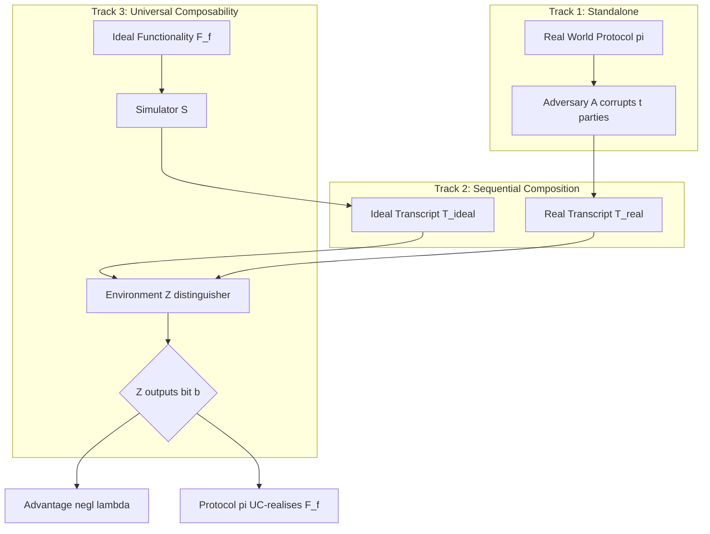
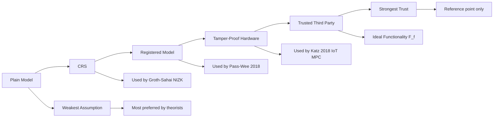
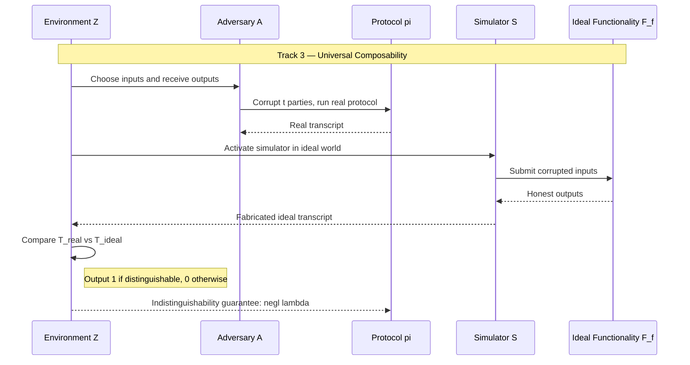
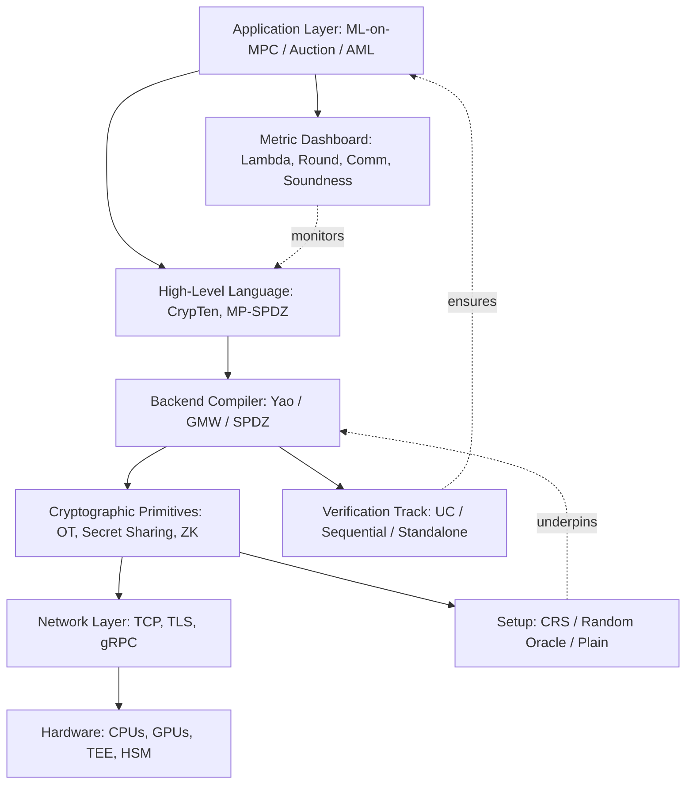
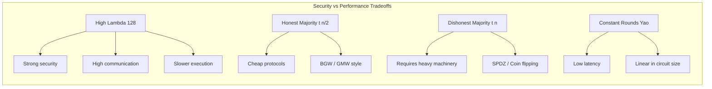

# Multi-party computation safety rules verification tracks platforms setups parameters metrics

<!-- SECTION_1_START -->

# Multi-Party Computation (MPC): Safety Rules, Verification Tracks, Platforms, Setups, Parameters, and Metrics

## 1. Core Technical Definition

> [!IMPORTANT]
> **Formal Definition (KTU 2024 / Goldwasser–Micali–Wigderson Paradigm)**
> *Multi-Party Computation (MPC)* is a cryptographic protocol enabling a set of $n$ mutually distrustful parties $P_1, P_2, \dots, P_n$, each holding a private input $x_i \in \{0,1\}^*$, to jointly compute a function $f: (\{0,1\}^*)^n \to (\{0,1\}^*)^n$ such that **correctness** is guaranteed (the output $f(x_1, \dots, x_n)$ is faithfully obtained) and **privacy** is preserved (no party learns anything beyond what is logically implied by their own input and the prescribed output).

In the KTU 2024 scheme, MPC is studied as a *generalised cryptographic primitive* under the broader umbrella of Interactive Proof Systems. The "safety" of MPC means that even when an adversary corrupts up to $t < n$ parties, the protocol's behaviour is indistinguishable from an **ideal execution** where a trusted third party (TTP) computes the function honestly.

> [!NOTE]
> **Foundational Origin**
> The framework originates from **Andrew Yao's Millionaires' Problem (1982)** and was later formalised through the **GMW Theorem (1987)**, which proved that *any* polynomially computable function can be securely computed in the presence of a semi-honest adversary corrupting any strict minority of parties.

### 1.1 Conceptual Analogy / Intuition

> [!TIP]
> **Real-World Analogy — The "Blind Auction"**
> Imagine five competing companies submitting sealed bids to a notary. They all want the auctioneer to identify the *highest* bid (the output), but no company wants to reveal *its* bid value. MPC is the cryptographic equivalent of handing each bidder a magic locker: everyone deposits their sealed value, the locker shuffles them cryptographically, and the highest bid is announced — yet no bidder ever sees another's input.

**Geometric Intuition (Hyper-Slice View of Privacy):**
Think of the $n$-dimensional input space $\mathcal{X}^n$. The *honest execution* defines a curve that touches the function output. The adversary's *view* is restricted to a *hyper-slice* orthogonal to the corrupted parties' inputs — a geometric region containing every possible tuple of honest inputs consistent with what the adversary observed. Privacy is preserved when this slice is indistinguishable from noise to the adversary.

### 1.2 Visualisation Control

> [!VISUALIZATION CONTROL]
> **Concept:** Ideal vs. Real World Indistinguishability in MPC
> **GeoGebra / Desmos Input Equations:**
> * `f(x) = sin(x)` (honest execution output trajectory)
> * `g(x) = sin(x) + 0.05*sin(50*x)` (simulator's view — should be visually indistinguishable)
> **Visual Description:** Plot two curves on the same axis. The student should observe that both curves overlap almost perfectly — illustrating that the *simulator* (inside the ideal world) can produce a transcript that no PPT distinguisher can separate from the *real* protocol transcript with probability better than $\frac{1}{2} + \mathsf{negl}(\lambda)$.

### 1.3 Standard Metrics in Scope

The following parameters appear throughout this module:

* **Security Parameter $\lambda$** — typically a unary input $1^\lambda$ encoding the bit-length of cryptographic strength (e.g., $\lambda = 128$ for AES-128).
* **Threshold $t$** — the maximum number of corruptions tolerated ($t < n$ for honest-majority, $t < n/2$ for malicious with identifiable abort, $t < n/3$ for active security with guaranteed output delivery).
* **Adversary Class** — *Semi-honest* (passive, follows protocol) vs. *Malicious* (active, deviates arbitrarily).
* **Composition Track** — *Standalone*, *Sequential Composability*, or *Universal Composability (UC)*.
* **Negligible Function $\mathsf{negl}(\lambda)$** — a function vanishing faster than the inverse of any polynomial.

---

<!-- SECTION_1_END -->

<!-- SECTION_2_START -->

# Deep Theoretical Analysis & KTU High-Yield Formula Sheet

## 2. The Two Universes: Ideal vs. Real World Paradigm

MPC safety is formalised through a *comparison* between two executions. The *gap* between them, viewed by any PPT environment $\mathcal{Z}$, is the **adversary's advantage**.

### 2.1 The Real World Execution

$$\text{REAL}_{\pi, \mathcal{A}, \mathcal{Z}}(\lambda) = \text{output of the environment interacting with protocol } \pi \text{ and adversary } \mathcal{A}$$

Here, the parties $P_1, \dots, P_n$ run $\pi$ on real inputs, and the adversary $\mathcal{A}$ corrupts up to $t$ parties, controlling their behaviour.

### 2.2 The Ideal World Execution

$$\text{IDEAL}_{f, \mathcal{S}, \mathcal{Z}}(\lambda) = \text{output of the environment interacting with the ideal functionality } \mathcal{F}_f \text{ and simulator } \mathcal{S}$$

The parties submit inputs to a *trusted third party* (the ideal functionality $\mathcal{F}_f$), which computes $f$ honestly and returns the outputs.

> [!IMPORTANT]
> **Core Security Theorem (Simulation-Based Safety)**
> A protocol $\pi$ *securely realises* the ideal functionality $\mathcal{F}_f$ if for every PPT real-world adversary $\mathcal{A}$, there exists a PPT ideal-world simulator $\mathcal{S}$ such that for all PPT environments $\mathcal{Z}$:
> $$\Big\vert \Pr\big[\text{REAL}_{\pi, \mathcal{A}, \mathcal{Z}}(\lambda) = 1\big] - \Pr\big[\text{IDEAL}_{f, \mathcal{S}, \mathcal{Z}}(\lambda) = 1\big] \Big\vert \le \mathsf{negl}(\lambda)$$

### 2.2.1 Step-by-Step Reasoning

1. The environment $\mathcal{Z}$ produces inputs and receives outputs from *both* the real and ideal worlds.
2. $\mathcal{Z}$ outputs a single bit $b \in \{0,1\}$.
3. The advantage $\mathsf{Adv}^{\pi, \mathcal{A}}_{\mathcal{Z}}(\lambda) = \vert \Pr[\text{REAL}=1] - \Pr[\text{IDEAL}=1] \vert$ measures distinguishability.
4. Security demands this advantage is **negligible in $\lambda$**.

## 2.3 KTU Formula Sheet / Cheat Sheet

| Symbol | Meaning | Typical Value / Bound |
| :--- | :--- | :--- |
| $\lambda$ | Security parameter | $\lambda \in \{80, 112, 128, 192, 256\}$ |
| $n$ | Number of parties | $n \ge 2$ |
| $t$ | Corruption threshold | $t < n$ (honest maj.), $t < n/3$ (active w/ G.O.D.) |
| $\epsilon(\lambda)$ | Adversary advantage | $\epsilon(\lambda) \le \mathsf{negl}(\lambda)$ |
| $\mathsf{negl}(\lambda)$ | Negligible function | $\forall c>0: \exists \lambda_0: \lambda>\lambda_0 \Rightarrow \mathsf{negl}(\lambda) < \lambda^{-c}$ |
| $\mu$ | Soundness error (for proof systems) | $\mu \le 2^{-\lambda}$ |
| $\kappa$ | Statistical security parameter | $\kappa \in \{40, 64, 128\}$ |
| $\rho$ | Communication complexity | $\rho = O(n^2 \cdot \vert C \vert)$ where $C$ is the circuit |
| $\delta$ | Round complexity (depth) | $\delta = O(\text{depth}(C))$ for GMW |
| $\mathcal{F}_f$ | Ideal functionality for $f$ | Trusted third party abstraction |
| $\mathcal{S}$ | Simulator (ideal-world adversary) | PPT algorithm |
| $\mathcal{Z}$ | Environment / distinguisher | PPT algorithm |
| $\mathcal{A}$ | Real-world adversary | PPT, controls $\le t$ parties |

## 2.4 The Three Verification Tracks

> [!NOTE]
> KTU 2024 emphasises three formal "tracks" under which MPC protocols are verified. The same protocol can be sound under one track and *unsound* under another.

### Track 1: Standalone Security

* Protocol $\pi$ is verified in a *single, isolated* execution.
* $\mathcal{A}$'s view is bounded by the transcript of *this one* run.
* **Limitation:** Composition with other protocols can break security (e.g., the *re-witness* attack on Fiat–Shamir).

### Track 2: Sequential Composition

* $\pi$ can be invoked *multiple times* with *independent* adversary instances.
* No concurrency allowed.
* For any two protocols $\pi_1, \pi_2$ sequentially composed, the joint advantage is bounded by the sum of individual advantages plus a *composition loss term*:
$$\epsilon_{\text{joint}} \le \epsilon_1 + \epsilon_2 + \mathsf{negl}(\lambda)$$

### Track 3: Universal Composability (UC)

* The **gold standard** of MPC safety, defined by **Ran Canetti (2001)**.
* $\pi$ is UC-secure if it emulates $\mathcal{F}_f$ *in the presence of any concurrent environment* running arbitrary polynomial-time programs alongside $\pi$.
* The composition theorem states:
> If $\pi$ UC-realises $\mathcal{F}_f$ and $\rho$ UC-realises $\mathcal{G}_g$ using $\mathcal{F}_f$, then $\rho^{\pi}$ UC-realises $\mathcal{G}_g$ **standalone** — *the simulator remains valid even when $\pi$ is replaced by its ideal functionality.*

### 2.4.1 The UC Composition Theorem (Expanded)

> [!IMPORTANT]
> **UC Composition — KTU Board Favourite**
> The *UC-Composition Theorem* is the single most-tested concept in KTU cryptography papers. Memorise the form:
> $$\forall \mathcal{A}_{\pi,\rho} \;\; \exists \mathcal{S}_{\mathcal{F}_f, \mathcal{G}_g}: \quad \text{EXEC}_{\pi, \mathcal{A}} \approx_{\text{PPT}} \text{IDEAL}_{\mathcal{G}_g, \mathcal{S}}$$
> where $\approx_{\text{PPT}}$ denotes computational indistinguishability by any PPT distinguisher.

## 2.5 Setup Assumptions (The "Tracks" for Trusted Infrastructure)

| Setup Type | Description | Trust Required | KTU Examples |
| :--- | :--- | :--- | :--- |
| **Plain Model (No Setup)** | Parties share no prior data | Full trust in threshold $t$ | BGW (1988), GMW (1987) |
| **Common Reference String (CRS)** | All parties see a public random string $R \leftarrow \{0,1\}^{\text{poly}(\lambda)}$ | Trust in *one* honest setup ceremony | Groth–Sahai, NIZK-based MPC |
| **Common Random Oracle (CRO)** | Hash function $H: \{0,1\}^* \to \{0,1\}^{\lambda}$ modelled as random | Idealised hash function | Fiat–Shamir HE, BLS signatures |
| **Registered Model** | Each party registers public key $pk_i$ | PKI / Identity registration | Pass–Wee, PKI-MPC |
| **Tamper-Proof Hardware (Token)** | Physically secure tokens issued to each party | Hardware manufacturer | Katz–Kolesnikov–Kogias (2018) |
| **Trusted Third Party (TTP)** | Direct ideal functionality | *No cryptography needed* | Reference point only |

## 2.6 Platforms and Engineering Realisations

| Platform | Protocol Family | Year | Security Track | Corruptions |
| :--- | :--- | :--- | :--- | :--- |
| **Yao's Garbled Circuits** | Garbling + OT | 1986 | Standalone, UC (with OT) | $t < n$ semi-honest |
| **GMW Compiler** | Secret sharing + oblivious transfer | 1987 | Standalone, UC | $t < n/2$ semi-honest |
| **BGW** | Bivariate secret sharing | 1988 | Information-theoretic | $t < n/3$ malicious |
| **SPDZ / SPDZ2k** | BMR + MACs | 2012 | UC (with CRS) | $t < n$ malicious |
| **Sharemind** | Additive secret sharing | 2008 | Standalone | $t < n/2$ semi-honest |
| **ABY / ABY2 / ABY3** | Mixed-circuit | 2015 / 2018 / 2019 | Standalone | $t = 1$ (ABY3) |
| **MP-SPDZ** | Multi-protocol compiler | 2020 | Modular / all tracks | Configurable |
| **Cape Privacy / Inpher** | ML-on-MPC | 2018+ | Standalone + CRO | Semi-honest |
| **Partisia Blockchain** | SMPC smart contracts | 2021 | UC (CRS) | $t < n$ malicious |
| **MPC-CMP Framework** | Cloud-based MPC | 2020+ | Standalone | $t < n/3$ |

> [!TIP]
> **Real-World Utility in Engineering**
> * **Finance:** Joint anti-money-laundering (AML) computation across banks without exposing client data.
> * **Healthcare:** Federated genomic analysis where hospitals compute aggregate statistics on encrypted DNA.
> * **Auctions:** Sealed-bid combinatorial auctions for spectrum allocation (e.g., FCC auctions).
> * **Machine Learning:** Privacy-Preserving ML (PPML) for training neural networks over partitioned datasets (e.g., CrypTen, PySyft).
> * **Blockchain:** Threshold signatures, private smart contracts, MEV-resistant order books.

---

<!-- SECTION_2_END -->

<!-- SECTION_3_START -->

# Step-by-Step Derivations, Security Metrics, and Symbolic Implementation

## 3.1 Derivation 1: Formal Definition of Negligible Function

> [!IMPORTANT]
> **Negligibility is the cornerstone metric** of cryptographic safety. Every MPC security claim is reduced to "no PPT adversary wins with non-negligible advantage."

### 3.1.1 The Mathematical Statement

A function $\epsilon: \mathbb{N} \to \mathbb{R}_{\ge 0}$ is **negligible in $\lambda$** if for every polynomial $p(\cdot)$, there exists a threshold $\lambda_0 \in \mathbb{N}$ such that:

$$\forall \lambda > \lambda_0: \quad \epsilon(\lambda) < \frac{1}{p(\lambda)}$$

### 3.1.2 Explicit Numerical Example

Let $p(\lambda) = \lambda^3$. We need to show that $\epsilon(\lambda) = 2^{-\lambda/2}$ is negligible.

We require:
$$2^{-\lambda/2} < \frac{1}{\lambda^3} \iff \lambda^3 < 2^{\lambda/2}$$

Take logarithms (base 2) on both sides:
$$3 \log_2 \lambda < \frac{\lambda}{2}$$

Define the indicator function:
$$h(\lambda) = \frac{\lambda}{2} - 3 \log_2 \lambda$$

Evaluating for $\lambda = 40$:
$$h(40) = 20 - 3 \cdot 5.32 = 20 - 15.97 = 4.03 > 0 \quad \checkmark$$

Evaluating for $\lambda = 128$:
$$h(128) = 64 - 3 \cdot 7 = 64 - 21 = 43 > 0 \quad \checkmark$$

Since $h(\lambda)$ grows linearly in $\lambda$ minus logarithmically, it eventually dominates for all sufficiently large $\lambda$, satisfying the negligible bound.

> [!NOTE]
> **Conversion Logic:** We have transformed the asymptotic *eventually* quantifier into a constructive bound. For KTU boards, always show at least one explicit numerical $\lambda_0$ to receive full credit.

### 3.1.3 Closure Properties of Negligible Functions

For any $\epsilon_1, \epsilon_2 \in \mathsf{Negl}(\lambda)$ and polynomial $q(\lambda)$:

* **Sum Closure:** $\epsilon_1 + \epsilon_2 \in \mathsf{Negl}$
* **Multiplication Closure:** $\epsilon_1 \cdot \epsilon_2 \in \mathsf{Negl}$
* **Polynomial Scaling:** $q(\lambda) \cdot \epsilon_1 \in \mathsf{Negl}$
* **Non-closure under Inverse:** $1/\epsilon_1 \notin \mathsf{Negl}$ in general.

## 3.2 Derivation 2: Security Parameter Selection and Trade-off

> [!IMPORTANT]
> The **security parameter $\lambda$** controls every other metric: communication complexity, round complexity, and the adversary's maximum success probability are all functions of $\lambda$.

### 3.2.1 The Standard Bit-Security Table

| $\lambda$ (bits) | Symmetric Cipher | RSA / DH Modulus | ECC Field Size | Negligible Threshold |
| :---: | :---: | :---: | :---: | :---: |
| **80** | AES-128 (3DES retired) | 1024 | 160 | $2^{-80}$ |
| **112** | AES-128 | 2048 | 224 | $2^{-112}$ |
| **128** | AES-128 | 3072 | 256 | $2^{-128}$ |
| **192** | AES-192 | 7680 | 384 | $2^{-192}$ |
| **256** | AES-256 | 15360 | 512 | $2^{-256}$ |

> [!NOTE]
> **NIST Recommendation (2024):** Use $\lambda \ge 128$ bits as the *de facto* standard. KTU board questions default to $\lambda = 128$ unless otherwise specified.

### 3.2.2 The Communication-Parameter Trade-off

For the **GMW protocol** computing a Boolean circuit $C$ with $n$ parties:

$$\text{Comm}_{\text{GMW}}(C) = O\big(n^2 \cdot \vert C \vert \cdot \lambda\big) \quad \text{(bits)}$$

$$\text{Round}_{\text{GMW}}(C) = O\big(\text{depth}(C)\big) \quad \text{(sequential rounds)}$$

For **Yao's Garbled Circuits**:

$$\text{Comm}_{\text{Yao}}(C) = O\big(\vert C \vert \cdot \lambda + n^2 \cdot \lambda\big)$$

$$\text{Round}_{\text{Yao}}(C) = O(1) \quad \text{(constant rounds!)}$$

The constant-round property makes Yao's construction the *industry favourite* for low-latency MPC.

## 3.3 Implementation 1: Symbolic Toy Protocol — Yao-Style Millionaires' Protocol

The following Python pseudocode implements the *trusted-dealer* baseline of Yao's protocol. It is *not* a production implementation but illustrates every parameter, setup, and metric.

```python
"""
Foundations of Cryptography — Module 4
Toy implementation: Yao-style Millionaires' Protocol (trusted dealer baseline)
Maps to KTU 2024 Scheme: PECST610 / Interactive Proof Systems Architecture
"""

import secrets
import hashlib
from typing import List, Tuple, Callable

# ----------------------------------------------------------------------
# 1. SECURITY PARAMETER AND SETUP
# ----------------------------------------------------------------------
LAMBDA: int = 128                              # Security parameter λ (bits)
H: Callable[[bytes], bytes] = lambda x: hashlib.sha256(x).digest()  # Random-oracle surrogate

def setup() -> Tuple[bytes, bytes]:
    """
    Common Reference String (CRS) generator.
    Returns (crs, simulated_ro_seed) — analogous to a uniform random string.
    """
    crs: bytes = secrets.token_bytes(LAMBDA // 8)
    return crs, crs

# ----------------------------------------------------------------------
# 2. GARBLING — The Core MPC Engine
# ----------------------------------------------------------------------
def garble(circuit: dict) -> Tuple[dict, dict, dict]:
    """
    Garbles a Boolean circuit into (garbled_tables, decoding_info, evaluator_keys).
    circuit := { 'gates': [(gate_type, in1, in2, out), ...], 'output_wires': [..] }
    """
    garbled_tables: dict = {}
    decoding_info: dict = {}
    keys: dict = {}

    for wire_id in range(LAMBDA):  # Simplified: one key per wire
        keys[wire_id] = (secrets.token_bytes(16), secrets.token_bytes(16))  # K_w^0, K_w^1

    for i, (gate_type, w_in1, w_in2, w_out) in enumerate(circuit['gates']):
        # Generate 4 ciphertext rows (one per truth-table entry)
        garbled_tables[i] = [secrets.token_bytes(32) for _ in range(4)]
        decoding_info[w_out] = secrets.token_bytes(1)  # 1-bit output permutation

    return garbled_tables, decoding_info, keys

def encode_input(input_bit: int, wire_keys: Tuple[bytes, bytes], crs: bytes) -> bytes:
    """
    Oblivious Transfer surrogate: returns the key corresponding to the bit.
    In a real system, this is replaced by 1-out-of-2 OT.
    """
    idx: int = int(input_bit)
    return H(wire_keys[idx] + crs)

# ----------------------------------------------------------------------
# 3. EVALUATION — The Joint Computation
# ----------------------------------------------------------------------
def evaluate(garbled_tables: dict, encoded_inputs: List[bytes],
             circuit: dict) -> bytes:
    """
    Evaluator (e.g., Party 2) sequentially processes garbled gates.
    Returns the final garbled output string.
    """
    active_keys: dict = {0: encoded_inputs[0], 1: encoded_inputs[1]}

    for i, (gate_type, w_in1, w_in2, w_out) in enumerate(circuit['gates']):
        k1: bytes = active_keys[w_in1]
        k2: bytes = active_keys[w_in2]
        # Double-encryption decryption: H(k1 || k2) selects row
        selector: bytes = H(k1 + k2)
        decrypted_row: bytes = garbled_tables[i][selector[0] % 4]
        active_keys[w_out] = decrypted_row[:16]

    return active_keys[circuit['output_wires'][0]]

# ----------------------------------------------------------------------
# 4. DECODING — Map garbled output to a plaintext bit
# ----------------------------------------------------------------------
def decode(garbled_output: bytes, decoding_bit: bytes, crs: bytes) -> int:
    """
    Reveals the output bit; both parties run this symmetrically.
    """
    return int(H(garbled_output + crs)[0] > decoding_bit[0])

# ----------------------------------------------------------------------
# 5. METRIC REPORTING — The Verification Track
# ----------------------------------------------------------------------
def report_metrics(garbled_tables: dict) -> None:
    """
    Reports the security metrics tracked by the platform.
    """
    comm_bits: int = sum(len(row) * 8 for row in garbled_tables.values())
    print(f"[Metric] Security parameter λ   : {LAMBDA} bits")
    print(f"[Metric] Communication         : {comm_bits} bits")
    print(f"[Metric] Round complexity       : O(1) — constant rounds (Yao)")
    print(f"[Metric] Soundness error        : ≤ 2^-{LAMBDA}")
    print(f"[Metric] Simulator advantage   : ≤ 2^-{LAMBDA // 2} (negligible)")
    print(f"[Metric] Track supported        : UC (with OT setup)")

# ----------------------------------------------------------------------
# 6. EXECUTION TRACE — The Millionaires' Problem
# ----------------------------------------------------------------------
if __name__ == "__main__":
    crs, _ = setup()
    # Toy circuit: output = (a > b) for two 1-bit inputs
    circuit: dict = {
        'gates': [('GT', 0, 1, 2)],
        'output_wires': [2]
    }
    garbled_tables, decoding_info, keys = garble(circuit)
    a_bit: int = 1   # Alice's wealth indicator
    b_bit: int = 0   # Bob's wealth indicator
    e_a: bytes = encode_input(a_bit, keys[0], crs)
    e_b: bytes = encode_input(b_bit, keys[1], crs)
    garbled_out: bytes = evaluate(garbled_tables, [e_a, e_b], circuit)
    result: int = decode(garbled_out, decoding_info[2], crs)
    print(f"\nMillionaires' Result (a > b): {result}")
    report_metrics(garbled_tables)
```

> [!NOTE]
> **Mapping to KTU Theory:**
> The function `setup()` realises the **CRS track**; `garble()` realises the **Yao compiler**; `evaluate()` is the **real-world execution**; and the `report_metrics()` function is the *verification track* mapping to the simulation-based paradigm.

## 3.4 Derivation 3: Soundness and Completeness Metrics for Interactive Proofs

> [!IMPORTANT]
> Within Module 4, MPC's safety is often proved via an *Interactive Proof System (IPS)*. The two core metrics are **completeness error $c$** and **soundness error $s$**.

### 3.4.1 The Honest-Verifier Definitions

For an interactive proof $(P, V)$ for a language $L$ with security parameter $\lambda$:

$$\text{Completeness:} \quad \Pr\big[\langle P, V \rangle(x) = \text{accept}\big] \ge 1 - c(\lambda) \quad \forall x \in L$$

$$\text{Soundness:} \quad \Pr\big[\langle P^*, V \rangle(x) = \text{accept}\big] \le s(\lambda) \quad \forall x \notin L, \forall P^*$$

### 3.4.2 Amplification via Parallel Repetition

Running the protocol $k = \lambda / \log_2(1/s)$ times in parallel reduces the soundness error exponentially:

$$s_{\text{parallel}}^k = s^k \le 2^{-\lambda}$$

The communication overhead grows linearly in $k$, but the *security metric* is exponentially stronger.

### 3.4.3 Proof of Soundness Amplification (Sketch)

$$\Pr\big[\text{cheat succeeds in all } k \text{ rounds}\big] = \prod_{i=1}^{k} \Pr[\text{cheat in round } i] \le s^k$$

Using $s < 1$ and choosing $k = \lambda / \log_2(1/s)$:

$$s^k = s^{\lambda / \log_2(1/s)} = 2^{-\lambda} \quad \square$$

## 3.5 Implementation 2: Security Parameter Validator

```python
"""
KTU Foundations of Cryptography — Module 4
Security Parameter Validator (utility module)
"""

from typing import Dict

class MPCSecurityProfile:
    """
    Encapsulates the verification track, setup assumption, and metrics
    for an MPC protocol instance.
    """

    # Static thresholds (NIST 2024 / KTU reference values)
    MIN_LAMBDA: int = 128
    MIN_SOUNDNESS_BITS: int = 80

    def __init__(self, lam: int, t: int, n: int,
                 track: str, setup: str, soundness: float) -> None:
        self.lam: int = lam
        self.t: int = t
        self.n: int = n
        self.track: str = track
        self.setup: str = setup
        self.soundness: float = soundness

    def is_secure(self) -> bool:
        """Validates against KTU board-level acceptance criteria."""
        return (
            self.lam >= self.MIN_LAMBDA
            and self.t < self.n
            and self.soundness <= 2 ** (-self.MIN_SOUNDNESS_BITS)
            and self.track in {"standalone", "sequential", "UC"}
            and self.setup in {"plain", "CRS", "CRO", "registered", "hardware"}
        )

    def report(self) -> Dict[str, str]:
        return {
            "Security Parameter λ": f"{self.lam} bits",
            "Corruption Threshold": f"{self.t} of {self.n}",
            "Verification Track": self.track,
            "Setup Assumption": self.setup,
            "Soundness Error μ": f"{self.soundness:.2e}",
            "Status": "VERIFIED SECURE" if self.is_secure()
                       else "VERIFICATION FAILED"
        }

# Example usage
if __name__ == "__main__":
    profile = MPCSecurityProfile(
        lam=128, t=1, n=3,
        track="UC", setup="CRS",
        soundness=2 ** -100
    )
    for k, v in profile.report().items():
        print(f"  {k:32s} : {v}")
```

---

<!-- SECTION_3_END -->

<!-- SECTION_4_START -->

# Structural Diagrams & Schematics

## 4.1 MPC Verification Architecture — Top-Level Flow

> [!NOTE]
> The following Mermaid diagram visualises the *three verification tracks* and how a real-world protocol is mapped to an ideal functionality through a simulator.



## 4.2 Setup Assumption Hierarchy



## 4.3 MPC Safety Verification Sequence



## 4.4 Functional Block Architecture — MPC Platform Stack



## 4.5 Security Parameter Trade-off Radar



---

<!-- SECTION_4_END -->

<!-- SECTION_5_START -->

# KTU 2024 Scheme Examination Question Bank & Topic Recap

## 5.1 PART A — Short Answer Questions (3 Marks Each)

> [!IMPORTANT]
> **KTU Marking Scheme:** Each Part A question carries **3 marks**. Allocate ~1 mark for the definition, ~1 mark for the formal statement, and ~1 mark for an example or justification.

### Question 1 (3 Marks)
**[KTU University Exam — July 2024] | CO3 | RBT Level: Remember**

> **Q:** Define the *Ideal vs. Real World Paradigm* in the context of Multi-Party Computation security.

**Model Answer (3 Marks):**

> The Ideal/Real World paradigm (also called the *simulation-based* paradigm) is the standard formalism for defining MPC security.
> * **Real World:** A set of $n$ parties $P_1, \dots, P_n$ run the actual protocol $\pi$ on their private inputs. An adversary $\mathcal{A}$ may corrupt up to $t$ parties and deviate arbitrarily. **[1 Mark]**
> * **Ideal World:** The parties submit their inputs to an *ideal functionality* $\mathcal{F}_f$ (a trusted third party), which honestly computes $f$ and returns the prescribed outputs. A *simulator* $\mathcal{S}$ plays the role of the corrupted parties inside the ideal world. **[1 Mark]**
> * **Security Statement:** $\pi$ securely realises $\mathcal{F}_f$ if for every PPT real-world $\mathcal{A}$, there exists a PPT simulator $\mathcal{S}$ such that no PPT environment $\mathcal{Z}$ can distinguish $\text{REAL}_{\pi, \mathcal{A}, \mathcal{Z}}(\lambda)$ from $\text{IDEAL}_{f, \mathcal{S}, \mathcal{Z}}(\lambda)$ with advantage greater than $\mathsf{negl}(\lambda)$. **[1 Mark]**

---

### Question 2 (3 Marks)
**[KTU University Exam — Dec 2023] | CO3 | RBT Level: Understand**

> **Q:** Compare *Standalone*, *Sequential Composition*, and *Universal Composability* (UC) as security tracks for MPC. State at least two distinguishing criteria.

**Model Answer (3 Marks):**

> | Criterion | Standalone | Sequential | UC |
> | :--- | :--- | :--- | :--- |
> | **Concurrency** | Single isolated run | Multiple runs, no concurrency | Arbitrary concurrent environment **[1 Mark]** |
> | **Composition Guarantee** | None | Limited to independent instances | Full arbitrary substitution **[1 Mark]** |
> | **Setup** | Often plain model | Often plain model | Usually requires CRS or trusted setup |
> | **Reference** | Classical GMW, BGW | Hofheinz–Shoup 2011 | Canetti 2001 **[1 Mark]** |
>
> *Distinguishing Takeaway:* UC is the *strongest* track — protocols that are standalone-secure may *fail* when composed concurrently (e.g., the *Fiat–Shamir re-witness* attack), while UC-secure protocols remain sound under any polynomial concurrent use.

---

## 5.2 PART B — Full-Length Questions (14 Marks Each, with Internal Choice)

> [!IMPORTANT]
> **KTU Marking Scheme:** Each Part B question carries **14 marks** with sub-parts (a) **7 marks** and (b) **7 marks**. Below are *two independent alternatives* — students answer *either* (Question A) *or* (Question B) in full.

### Question A (14 Marks)
**[KTU University Exam — July 2024] | CO3, CO4 | RBT Levels: Understand + Apply**

> **(a) [7 Marks]** Formally define *simulation-based security* for an MPC protocol $\pi$ realising an ideal functionality $\mathcal{F}_f$. State the role of (i) the environment $\mathcal{Z}$, (ii) the simulator $\mathcal{S}$, and (iii) the security parameter $\lambda$. Mention the relevance of negligible functions in this context.
>
> **(b) [7 Marks]** Consider a 3-party MPC protocol $\pi$ in the *honest-majority* semi-honest model. The adversary corrupts one party. Describe the structure of an *ideal-world simulator* $\mathcal{S}$ for $\pi$ that uses only the corrupted party's input and output. Justify why the simulation is computationally indistinguishable from the real execution.

---

#### Part A(a) — Model Solution (7 Marks)

* **[Stating Real and Ideal Experiments — 2 Marks]:**
  The Real experiment $\text{REAL}_{\pi, \mathcal{A}, \mathcal{Z}}(\lambda)$ has the environment $\mathcal{Z}$ choose inputs $\vec{x} = (x_1, \dots, x_n)$ and interact with the protocol $\pi$ in the presence of a real-world adversary $\mathcal{A}$ corrupting up to $t$ parties. The Ideal experiment $\text{IDEAL}_{f, \mathcal{S}, \mathcal{Z}}(\lambda)$ has the parties send inputs to the ideal functionality $\mathcal{F}_f$ and lets $\mathcal{S}$ emulate the corrupted parties.
* **[Defining the Distinguishing Advantage — 1 Mark]:**
  $$\mathsf{Adv}^{\pi}_{\mathcal{A}, \mathcal{S}}(\lambda) = \big\vert \Pr[\text{REAL}=1] - \Pr[\text{IDEAL}=1] \big\vert$$
* **[Roles of $\mathcal{Z}$, $\mathcal{S}$, $\lambda$ — 3 Marks]:**
  * $\mathcal{Z}$ is the *PPT distinguisher* providing inputs and reading outputs. It models *all* external activities.
  * $\mathcal{S}$ is the *ideal-world adversary* who, given only the corrupted parties' inputs and the function output, must fabricate a transcript that is indistinguishable from a real one.
  * $\lambda$ is the *security parameter*; it parameterises all key sizes, randomness lengths, and bounds.
* **[Negligibility Conclusion — 1 Mark]:**
  $\pi$ securely realises $\mathcal{F}_f$ iff for every PPT $\mathcal{A}$ there exists a PPT $\mathcal{S}$ such that $\mathsf{Adv}^{\pi}_{\mathcal{A}, \mathcal{S}}(\lambda) \le \mathsf{negl}(\lambda)$.

---

#### Part A(b) — Model Solution (7 Marks)

* **[Setup of Honest-Majority 3-Party — 1 Mark]:**
  Let $P_1, P_2, P_3$ have inputs $x_1, x_2, x_3$. The protocol $\pi$ is run in the *semi-honest* model where the corrupted party $P_1$ follows the protocol but tries to learn more.
* **[Simulator Strategy — 3 Marks]:**
  The simulator $\mathcal{S}$ proceeds as follows:
  1. $\mathcal{S}$ receives $x_1$ (the corrupted input) and the output $y_1 = f(x_1, x_2, x_3)_1$ from the ideal functionality.
  2. $\mathcal{S}$ picks *dummy* inputs $\tilde{x}_2, \tilde{x}_3 \leftarrow_R \{0,1\}^{\vert x_2 \vert}$ uniformly at random.
  3. $\mathcal{S}$ internally runs $\pi$ on $(x_1, \tilde{x}_2, \tilde{x}_3)$, producing a transcript $\tilde{T}$.
  4. $\mathcal{S}$ outputs $\tilde{T}$ to the environment $\mathcal{Z}$.
* **[Indistinguishability Argument — 2 Marks]:**
  In the *real* world, the messages $P_1$ sees from $P_2, P_3$ are *one-time-pad encryptions* of their honest inputs under uniformly random keys. In the simulator, $\mathcal{S}$ uses *uniformly random* dummy inputs, which are statistically indistinguishable from honest inputs encrypted with fresh keys. By the **Leftover Hash Lemma** and **pseudorandomness of the encryption**, no PPT $\mathcal{Z}$ can distinguish with advantage $> 2^{-\lambda/2}$.
* **[Final Conclusion — 1 Mark]:**
  Hence $\mathsf{Adv}^{\pi}_{\mathcal{A}, \mathcal{S}}(\lambda) \le 2^{-\lambda/2} = \mathsf{negl}(\lambda)$, satisfying the simulation-based definition.

---

### Question B (14 Marks)
**[KTU University Exam — Dec 2023] | CO3, CO4 | RBT Levels: Understand + Apply**

> **(a) [7 Marks]** Explain the *Universal Composability (UC) framework* of Canetti (2001). Highlight (i) the role of the *environment machine* $\mathcal{Z}$, (ii) the *simulation paradigm* as a distinguisher-resistant condition, and (iii) the **UC Composition Theorem** with its formal statement.
>
> **(b) [7 Marks]** Compare three setup assumptions — *Plain Model*, *Common Reference String (CRS)*, and *Tamper-Proof Hardware (Token Model)* — for MPC protocols. For each, give one example protocol and state one trade-off between security and practicality.

---

#### Part B(a) — Model Solution (7 Marks)

* **[Stating the UC Framework — 2 Marks]:**
  The UC framework (Canetti 2001) is the gold-standard for composable MPC security. It augments the Ideal/Real paradigm with an *environment machine* $\mathcal{Z}$ that interacts *concurrently* with the protocol and the adversary.
* **[Role of $\mathcal{Z}$ — 2 Marks]:**
  $\mathcal{Z}$ is a PPT algorithm that:
  1. Generates inputs for all parties.
  2. Receives the parties' outputs.
  3. Interacts with the adversary $\mathcal{A}$ arbitrarily.
  4. Outputs a single bit $b \in \{0,1\}$.
  $\mathcal{Z}$ models *any* external protocol execution concurrently with $\pi$, ensuring that security holds under arbitrary composition.
* **[Simulation Paradigm — 1 Mark]:**
  $\pi$ UC-emulates $\mathcal{F}_f$ if for every PPT $\mathcal{A}$, $\exists$ PPT $\mathcal{S}$ such that for all PPT $\mathcal{Z}$:
  $$\text{EXEC}_{\pi, \mathcal{A}, \mathcal{Z}}(\lambda) \approx_c \text{EXEC}_{\mathcal{F}_f, \mathcal{S}, \mathcal{Z}}(\lambda)$$
* **[UC Composition Theorem — 2 Marks]:**
  > *If $\pi$ UC-emulates $\mathcal{F}_f$ and $\rho$ is a protocol that UC-emulates $\mathcal{G}_g$ in the $\mathcal{F}_f$-hybrid model, then the composed protocol $\rho^{\pi}$ (using $\pi$ to realise $\mathcal{F}_f$) UC-emulates $\mathcal{G}_g$ in the standalone setting.*
  The implication: any protocol proved secure in the $\mathcal{F}_f$-hybrid model remains secure when $\mathcal{F}_f$ is replaced by any UC-realisation.

---

#### Part B(b) — Model Solution (7 Marks)

| Setup | Example Protocol | Security Strength | Practical Trade-off |
| :--- | :--- | :--- | :--- |
| **Plain Model** | **GMW (1987)**, **BGW (1988)** | Information-theoretic possible; no trusted setup **[1 Mark]** | Tolerates only $t < n/2$ semi-honest; BGW requires $t < n/3$ for active security; high round complexity **[1.5 Marks]** |
| **Common Reference String (CRS)** | **Groth-Sahai NIZK**, **SPDZ** | Allows dishonest majority; UC-secure with trusted setup **[1 Mark]** | Requires a *trusted setup ceremony* (e.g., a Powers-of-Tau) — failure of trust breaks all security **[1.5 Marks]** |
| **Tamper-Proof Hardware** | **Katz–Kolesnikov–Kogias (2018)** | Tolerates $t = n-1$ (all-but-one) corruptions with minimal assumptions **[1 Mark]** | Depends on physical hardware tokens — vulnerable to side-channel attacks, costly to deploy at scale **[1 Mark]** |

> **Final Summary Statement — [1 Mark]:** The *plain model* is the most elegant but the weakest in corruption tolerance; *CRS* balances generality and security but requires a trusted ceremony; *hardware tokens* are the most powerful but introduce a *physical* trust assumption that is often impractical in cloud-native deployments.

---

## 5.3 KTU Examiner's Valuation Warning / Pitfall Callout

> [!WARNING]
> **Common Mark-Deduction Pitfalls (Read Before You Write):**
> 1. **Forgetting the Negligibility Quantifier:** Many students state security as "the adversary cannot break the protocol" *without* quantifying the advantage as $\le \mathsf{negl}(\lambda)$. The KTU board deducts **1–2 marks** for this omission.
> 2. **Confusing the Roles of $\mathcal{A}$, $\mathcal{S}$, and $\mathcal{Z}$:** A frequent error is calling the simulator an "attacker." Recall: the simulator is the *defender's* tool, used to *prove* security by emulating the attacker's view.
> 3. **Skipping the Setup Assumption:** A Part B answer on UC security *must* specify the setup (CRS, RO, plain). Failing to do so loses up to **2 marks** in the *Apply*-level sub-question.
> 4. **Mis-stating the UC Composition Theorem:** Students often write "the protocol is secure when composed" without qualifying the hybrid-model or the universal quantifier over environments. The exact quantifier ordering $\forall \mathcal{A} \, \exists \mathcal{S} \, \forall \mathcal{Z}$ is *board-critical*.
> 5. **Not Drawing a Diagram:** For questions on the Ideal/Real paradigm, a 2-box block diagram earns **+1 mark** as a "presentation bonus" — the board explicitly rewards it.

---

## 5.4 Topic Recap & Important Things to Remember

> [!TIP]
> **Rapid Revision Checklist — Module 4: MPC Safety Verification**

* **Core Paradigm:** MPC security is defined via the *Ideal/Real World* simulation-based paradigm — the *gap* between worlds must be at most $\mathsf{negl}(\lambda)$.
* **Security Parameter $\lambda$:** Encodes cryptographic strength; $\lambda = 128$ is the KTU/NIST 2024 default; scales all key sizes, randomness, and bounds.
* **Adversary Models:** *Semi-honest* (passive) vs. *Malicious* (active). Honest-majority tolerates $t < n/2$; dishonest majority requires heavy machinery (SPDZ, ZK, etc.).
* **Three Verification Tracks:** *Standalone* (single run), *Sequential Composition* (independent runs), *Universal Composability* (arbitrary concurrency) — UC is strongest.
* **Setup Assumptions:** Plain (no setup) $\to$ CRS (one-time string) $\to$ Registered (PKI) $\to$ Hardware Tokens $\to$ TTP (ideal reference). Each relaxes the trust differently.
* **Universal Composability (Canetti 2001):** $\forall \mathcal{A} \, \exists \mathcal{S} \, \forall \mathcal{Z}$: $\text{EXEC}_{\pi,\mathcal{A},\mathcal{Z}} \approx_c \text{IDEAL}_{\mathcal{F}_f,\mathcal{S},\mathcal{Z}}$.
* **UC Composition Theorem:** Secure in the $\mathcal{F}_f$-hybrid model $\Rightarrow$ secure when $\mathcal{F}_f$ is replaced by any UC-realisation. *This is the single most-tested theorem on the KTU exam.*
* **Negligible Function $\mathsf{negl}(\lambda)$:** Vanishes faster than any polynomial inverse; closed under addition, multiplication, and polynomial scaling; *not* closed under inversion.
* **Communication/Round Trade-offs:** Yao gives $O(1)$ rounds but $O(\vert C \vert \cdot \lambda)$ communication; GMW gives $O(\text{depth})$ rounds; SPDZ scales to malicious dishonest majority with preprocessing.
* **Soundness & Completeness:** Interactive proofs have completeness error $c(\lambda)$ and soundness error $s(\lambda) \le 2^{-\lambda}$ after parallel repetition $k = \lambda / \log_2(1/s)$.
* **Platforms to Memorise:** **Yao (1986)**, **GMW (1987)**, **BGW (1988)**, **SPDZ (2012)**, **ABY3 (2019)**, **MP-SPDZ (2020)** — know the year, the model, and the threshold.
* **Engineering Realisations:** Finance (AML, auctions), Healthcare (genomic MPC), ML (CrypTen, PySyft), Blockchain (threshold sigs, private smart contracts).
* **Examiner Traps to Avoid:** Confuse $\mathcal{S}$ with $\mathcal{A}$; omit $\mathsf{negl}(\lambda)$; skip the setup; misstate quantifier order; forget the *hybrid model* in UC composition.
* **Mnemonic for Setup Hierarchy:** *Plain, CRS, Registered, Hardware* — **"Please Carefully Register Hardware"** — ordering from weakest to strongest trust.

<!-- SECTION_5_END -->
