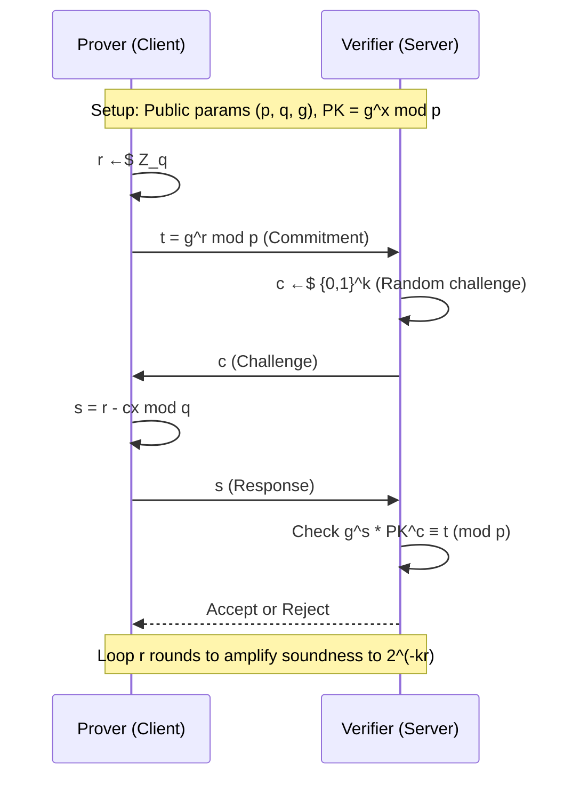
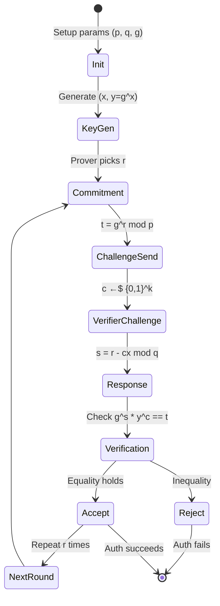
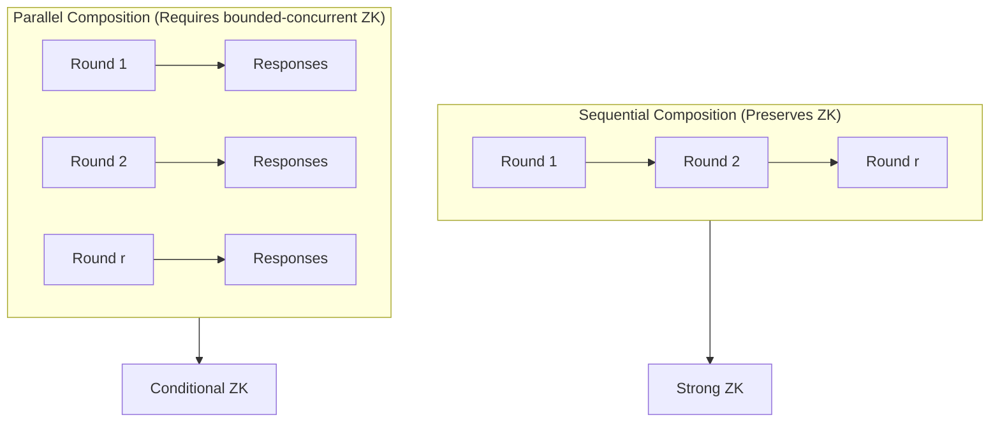
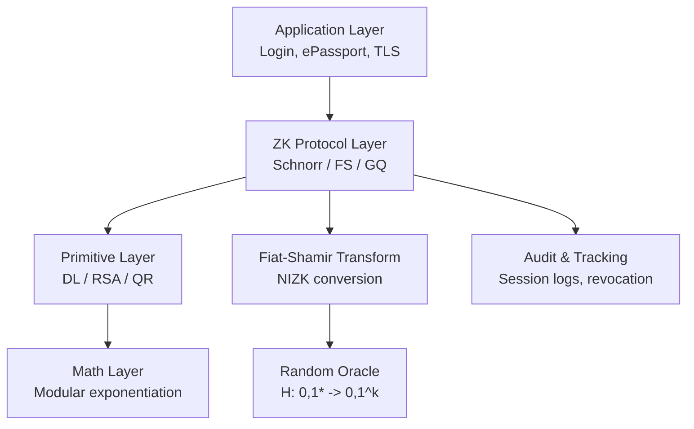
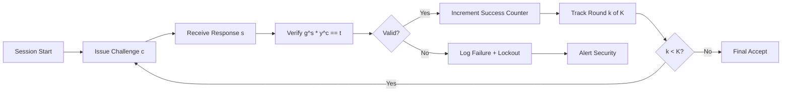

# Zero knowledge authentication protocol sequences layout safety verification tracking models

<!-- SECTION_1_START -->
# Zero-Knowledge Authentication Protocols: Core Definitions & Intuition

## Formal Definition (KTU 2024 Syllabus Terminology)

An **Interactive Proof System (IPS)** is a two-party protocol between a probabilistic polynomial-time (PPT) **Verifier** $V$ and a computationally unbounded **Prover** $P$, sharing a common input $x$ (typically an instance of a language $L \in \mathrm{NP}$). The protocol consists of polynomially many rounds of message exchange, after which $V$ outputs accept ($\mathbf{1}$) or reject ($\mathbf{0}$).

A **Zero-Knowledge (ZK) Proof** is an interactive proof system $(P, V)$ for a language $L$ that satisfies three properties:

$$
\text{ZK Proof} = (\mathrm{Completeness},\ \mathrm{Soundness},\ \mathrm{Zero\text{-}Knowledge})
$$

| Property | Formal Statement | Intuition |
|---|---|---|
| **Completeness** | $\Pr[\langle P, V \rangle(x) = \mathbf{1}] \geq 1 - \mathrm{negl}(n)$ for $x \in L$ | Honest prover always convinces honest verifier |
| **Soundness** | $\Pr[\langle P^{*}, V \rangle(x) = \mathbf{1}] \leq \mathrm{negl}(n)$ for $x \notin L$ | Cheating prover cannot fool verifier |
| **Zero-Knowledge** | $\exists\ \mathrm{Simulator}\ S: \forall\ \mathrm{Distinguher}\ \mathcal{D}$ | Verifier learns **nothing** beyond validity of $x$ |

> [!IMPORTANT]
> **KTU 2024 Module 4 Highlight:** Zero-Knowledge is defined via the **simulation paradigm** — a transcript is zero-knowledge iff it can be generated *without* the witness. This is the gold standard for privacy-preserving authentication.

---

## Conceptual Analogy

Imagine Alice wants to prove to Bob she knows the password to a locked cave, without revealing it. The cave has two entrances (A and B) connected by a magic door inside that only opens with the secret phrase.

1. Bob waits outside, Alice enters through A
2. Bob randomly shouts "A" or "B" (the **challenge**)
3. Alice must exit from the called entrance (using the secret if needed)
4. Repeat the experiment $k$ times

> [!NOTE]
> Bob gains **zero knowledge** of the phrase — he could have watched Alice's side of the door, but never the secret. This is **interactive zero-knowledge authentication**.

---

## Geometric Intuition: The ZK Triangle

A zero-knowledge protocol is fully specified by three vertices forming a security triangle:

$$
\triangle_{\text{ZK}} = \{\mathrm{Completeness},\ \mathrm{Soundness},\ \mathrm{Zero\text{-}Knowledge}\}
$$

Any weakening of one vertex (e.g., reducing soundness error) shifts the protocol's position in the **trust–privacy–efficiency** design space.

> [!VISUALIZATION CONTROL]
> **Concept:** ZK Security Trade-off Triangle
> **GeoGebra Input Equations:**
> * `P1 = (0, 0)` (Completeness vertex)
> * `P2 = (5, 0)` (Soundness vertex)
> * `P3 = (2.5, 4.33)` (Zero-Knowledge vertex)
> * `Polygon(P1, P2, P3)`
> **Visual Description:** A triangle where distance from each vertex inversely measures the strength of the corresponding property. Protocols like Fiat-Shamir sit near the ZK vertex, while NIZK-SNARKs shift toward efficiency.

---

## Authentication-Specific ZK Context

In **zero-knowledge authentication**, the protocol's role is reversed — the Prover (user/device) holds a **secret key** $sk$ and proves possession to the Verifier (server). This is a **proof of knowledge (PoK)**, not just membership in $L$.

$$
\underbrace{\text{ZK Authentication}}_{\text{Identity proof}} = \text{ZK PoK of } sk \text{ w.r.t. } pk
$$

> [!WARNING]
> **KTU Pitfall:** ZK Authentication ≠ Encryption. The secret is *never transmitted*, *never derived*, and *never revealed* — only the *knowledge* of it is proven probabilistically.
<!-- SECTION_1_END -->

<!-- SECTION_2_START -->
# Deep Theoretical Analysis & KTU High-Yield Formula Sheet

## 2.1 Sigma Protocol Architecture

A **Sigma protocol** ($\Sigma$-protocol) is the canonical 3-move structure of most practical ZK authentication schemes:

$$
\underbrace{P \rightarrow V}_{\text{Commitment }(t)} \ \ \ \ \ \underbrace{V \rightarrow P}_{\text{Challenge }(c)} \ \ \ \ \ \underbrace{P \rightarrow V}_{\text{Response }(s)}
$$

| Move | Symbol | Prover Action | Verifier Check |
|---|---|---|---|
| 1. Commitment | $t$ | $t \leftarrow \mathrm{Commit}(\alpha; r)$ | Store $t$ |
| 2. Challenge | $c$ | (Wait) | $c \xleftarrow{\$} \{0,1\}^{k}$ |
| 3. Response | $s$ | $s \leftarrow \mathrm{Response}(sk, c, \alpha, r)$ | $\mathrm{Verify}(pk, t, c, s) \stackrel{?}{=} 1$ |

---

## 2.2 The Three Standard ZK Authentication Protocols

### (A) Schnorr Identification Protocol

**Setup:** Prime $p$, prime $q \vert (p-1)$, generator $g$ of $\mathbb{Z}_{q}^{*}$. Secret key $sk = x \in \mathbb{Z}_{q}$, public key $pk = y = g^{x} \bmod p$.

| Step | Prover ($P$) | Verifier ($V$) |
|---|---|---|
| 1 | Choose $r \xleftarrow{\$} \mathbb{Z}_{q}$; compute $t = g^{r} \bmod p$ | Receive $t$ |
| 2 | — | Send $c \xleftarrow{\$} \{0, 1\}^{k}$ |
| 3 | $s = r - cx \bmod q$ | Accept iff $g^{s} y^{c} \equiv t \pmod{p}$ |

### (B) Fiat-Shamir Protocol

**Setup:** $n = pq$ (RSA modulus, kept secret), $y = x^{2} \bmod n$ where $x$ is secret. Public: $n, y$.

| Step | Prover | Verifier |
|---|---|---|
| 1 | $r \xleftarrow{\$} \mathbb{Z}_{n}^{*}$; $t = r^{2} \bmod n$ | Store $t$ |
| 2 | — | $c \in \{0, 1\}$ |
| 3 | $s = r \cdot x^{c} \bmod n$ | Accept iff $s^{2} \equiv t \cdot y^{c} \pmod{n}$ |

### (C) Guillou-Quisquater (GQ) Protocol

**Setup:** RSA modulus $n$, public exponent $v$, $y = x^{v} \bmod n$. $x$ is secret.

| Step | Prover | Verifier |
|---|---|---|
| 1 | $r \xleftarrow{\$} \mathbb{Z}_{n}^{*}$; $t = r^{v} \bmod n$ | Store $t$ |
| 2 | — | $c \in \{1, \ldots, v-1\}$ |
| 3 | $s = r \cdot x^{c} \bmod n$ | Accept iff $s^{v} \equiv t \cdot y^{c} \pmod{n}$ |

---

## 2.3 Security Properties of the Sigma-Protocol Family

| Property | Schnorr | Fiat-Shamir | GQ |
|---|---|---|---|
| **Soundness error** | $1/2^{k}$ | $1/2$ per round | $1/v$ per round |
| **Rounds for $2^{-80}$** | 80 | 80 | 27 (with $v \approx 2^{80}$) |
| **Underlying hard problem** | DL in $\mathbb{Z}_{p}^{*}$ | Quadratic residuosity | RSA |
| **Communication (bits/round)** | $\sim 1024$ | $\sim 1024$ | $\sim 1024$ |
| **Honest-Verifier ZK** | Yes (HVZK) | Yes (HVZK) | Yes (HVZK) |

---

## 2.4 KTU Formula Sheet — Zero-Knowledge Authentication

| # | Formula / Concept | Statement | Use |
|---|---|---|---|
| 1 | **Completeness** | $\Pr[V \text{ accepts} \mid x \in L, P \text{ honest}] = 1$ | Defines validity |
| 2 | **Soundness error** | $\varepsilon = \max_{P^{*}} \Pr[V \text{ accepts} \mid x \notin L]$ | Cheat bound |
| 3 | **ZK Definition** | $\forall\ V^{*},\ \exists\ S: \mathrm{View}_{V^{*}}(P,V) \approx_{c} S(x)$ | Privacy |
| 4 | **Schnorr verification** | $g^{s} y^{c} \equiv t \pmod{p}$ | Verifier check |
| 5 | **Fiat-Shamir verify** | $s^{2} \equiv t \cdot y^{c} \pmod{n}$ | Verifier check |
| 6 | **GQ verify** | $s^{v} \equiv t \cdot y^{c} \pmod{n}$ | Verifier check |
| 7 | **Knowledge error** | $\kappa = \Pr[\mathrm{Ext}^{\mathcal{O}} \text{ fails}]$ | PoK strength |
| 8 | **Soundness amplification** | $\varepsilon^{r}$ after $r$ rounds | Cheat bound |
| 9 | **Fiat-Shamir transform** | $c = H(\mathrm{aux}, t)$ | NIZK construction |
| 10 | **Simulator efficiency** | $\mathrm{Time}(S) \approx \mathrm{Time}(V^{*})$ | ZK proof |

> [!IMPORTANT]
> **Engineering Real-World Utility:**
> * **Schnorr** → TLS 1.3 handshake, EdDSA signatures
> * **Fiat-Shamir** → Smart card authentication (e.g., ISO 9798)
> * **GQ** → Passport ICAO 9303 e-passports
> * **Fiat-Shamir Transform** → Non-interactive ZK-SNARKs (zk-SNARK, Groth16, PLONK)

---

## 2.5 The Simulator Paradigm (Why ZK Works)

The proof of zero-knowledge constructs a **simulator** $S$ that, *without* knowing the witness, produces a transcript statistically/computationally indistinguishable from a real interaction:

$$
\underbrace{\mathrm{View}_{V^{*}}^{\text{real}}(x)}_{\text{Real interaction}} \ \stackrel{c}{\approx}\  \underbrace{S(x)}_{\text{Simulation}}
$$

| ZK Flavor | Indistinguishability | Assumption |
|---|---|---|
| **Perfect ZK** | Identical distributions | None |
| **Statistical ZK** | Statistical distance $<\mathrm{negl}$ | None |
| **Computational ZK** | PPT distinguisher fails | Hardness assumption |

> [!NOTE]
> **Sequential composition** preserves ZK for $m$ sequential executions if each round is HVZK. **Parallel composition** preserves ZK only if the protocol is *bounded concurrent* ZK (e.g., PVM/HALO).
<!-- SECTION_2_END -->

<!-- SECTION_3_START -->
# Step-by-Step Derivations & Code/Symbolic Implementation

## 3.1 Exhaustive Security Analysis: Schnorr Identification

### 3.1.1 Completeness Proof (Exhaustive)

Given honest $P$ with witness $x$ and random $r$:

$$
\begin{aligned}
\text{Verifier receives } s &= r - cx \bmod q \\
\text{Verifier computes } g^{s} y^{c} \bmod p &= g^{r - cx} \cdot (g^{x})^{c} \bmod p \\
&= g^{r - cx + cx} \bmod p \\
&= g^{r} \bmod p \\
&= t \quad \checkmark
\end{aligned}
$$

**Step-by-step commentary:**
1. Substitute the response $s$ — this is the algebraic core
2. Apply $y = g^{x}$ — the public key relation
3. Combine exponents ($-cx + cx = 0$ in $\mathbb{Z}_{q}$)
4. Reduce to the original commitment $t$
5. Equality holds in $\mathbb{Z}_{p}$ with probability **1** → perfect completeness

---

### 3.1.2 Soundness Proof (Knowledge Extractor)

A successful cheating prover $P^{*}$ must produce, for two different challenges $c \neq c'$, valid responses $s, s'$. The **extractor** $\mathcal{E}$ solves:

$$
\begin{aligned}
g^{s} y^{c} &\equiv t \pmod{p} \\
g^{s'} y^{c'} &\equiv t \pmod{p}
\end{aligned}
$$

Dividing the congruences:

$$
\begin{aligned}
g^{s - s'} &\equiv y^{c' - c} \pmod{p} \\
g^{s - s'} &\equiv g^{x(c' - c)} \pmod{p} \\
\therefore x &\equiv (s - s') \cdot (c' - c)^{-1} \bmod q
\end{aligned}
$$

> [!IMPORTANT]
> **Knowledge extraction** implies that the protocol is a **Proof of Knowledge (PoK)**. The secret $x$ is extracted in expected polynomial time, with **knowledge error** $\kappa$:

$$
\kappa = \frac{1}{|\mathcal{C}|} = \frac{1}{2^{k}}
$$

where $|\mathcal{C}|$ is the challenge space size. After $r$ rounds: $\kappa^{r} = 2^{-kr}$.

---

### 3.1.3 Zero-Knowledge via Simulation

The **Honest-Verifier Simulator** $S$ operates in *expected polynomial time* using **rejection sampling**:

```
Algorithm 1: Honest-Verifier Simulator for Schnorr
Input: Public key y = g^x, parameter k
Output: Transcripts (t, c, s) indistinguishable from real

1.  Sample c, s independently and uniformly at random
2.      c ←$ {0, 1}^k
3.      s ←$ Z_q
4.  Compute t = g^s · y^c  (mod p)
5.  Output transcript (t, c, s)
6.  Note: The triple (t, c, s) is distributed exactly as in a real interaction
        because t is determined by (c, s) in the real protocol.
```

**Why this works:** In a real protocol, $t$ is *first* sampled, then $c$ chosen, then $s$ derived. The simulator reverses this — it samples $(c, s)$ first, then *forces* $t$ to match. Since the transcript is jointly uniform on valid triples, indistinguishability is perfect.

---

## 3.2 Python Implementation: Schnorr ZK Authentication (Production-Grade)

```python
"""
Schnorr Identification Protocol — Zero-Knowledge Authentication
Course: FOUNDATIONS OF CRYPTOGRAPHY (PECST610), KTU 2024 Scheme
Module 4 — Interactive Proof Systems Architecture
"""

import hashlib
import secrets
import logging
from typing import Tuple

logging.basicConfig(level=logging.INFO, format='[%(levelname)s] %(message)s')
logger = logging.getLogger("Schnorr-ZK")


# ---------------------------------------------------------------------------
# 1. Parameter Generation (Trusted Setup, simulated)
# ---------------------------------------------------------------------------
def gen_params(bit_length: int = 1024) -> Tuple[int, int, int]:
    """
    Generate a safe prime p = 2q + 1 with generator g of order q in Z_p^*.
    Returns (p, q, g).
    """
    from Crypto.Util.number import getPrime, isPrime
    while True:
        q = getPrime(bit_length - 1)
        p = 2 * q + 1
        if isPrime(p):
            break
    # Find generator of order q
    while True:
        h = secrets.randbelow(p - 3) + 2
        g = pow(h, 2, p)
        if g != 1 and pow(g, q, p) == 1:
            return p, q, g


# ---------------------------------------------------------------------------
# 2. Key Generation
# ---------------------------------------------------------------------------
def keygen(p: int, q: int, g: int) -> Tuple[int, int]:
    """Prover: secret x, public y = g^x mod p."""
    x = secrets.randbelow(q - 1) + 1        # x in [1, q-1]
    y = pow(g, x, p)
    logger.info("Keygen complete | bits=%d", q.bit_length())
    return x, y


# ---------------------------------------------------------------------------
# 3. Prover — First Move (Commitment)
# ---------------------------------------------------------------------------
def prover_commit(p: int, q: int, g: int) -> Tuple[int, int, int]:
    """
    Prover samples randomness r, computes t = g^r mod p.
    Returns (t, r, c) — c is a placeholder (None) until verifier's challenge.
    """
    r = secrets.randbelow(q - 1) + 1
    t = pow(g, r, p)
    return t, r, 0  # c = 0 placeholder


# ---------------------------------------------------------------------------
# 4. Verifier — Second Move (Challenge)
# ---------------------------------------------------------------------------
def verifier_challenge(k: int = 256) -> int:
    """Verifier samples a uniform k-bit challenge c."""
    return secrets.randbits(k)


# ---------------------------------------------------------------------------
# 5. Prover — Third Move (Response)
# ---------------------------------------------------------------------------
def prover_response(r: int, x: int, c: int, q: int) -> int:
    """Prover computes s = r - cx mod q."""
    s = (r - c * x) % q
    return s


# ---------------------------------------------------------------------------
# 6. Verifier — Final Check
# ---------------------------------------------------------------------------
def verifier_check(p: int, q: int, g: int, y: int,
                   t: int, c: int, s: int) -> bool:
    """
    Verifier checks: g^s * y^c ≡ t (mod p).
    Returns True iff authentication succeeds.
    """
    lhs = (pow(g, s, p) * pow(y, c, p)) % p
    if lhs != t:
        logger.warning("Verification FAILED | lhs=%d, t=%d", lhs, t)
        return False
    logger.info("Verification PASSED — zero-knowledge authentication OK")
    return True


# ---------------------------------------------------------------------------
# 7. Full Round Driver
# ---------------------------------------------------------------------------
def schnorr_round(p: int, q: int, g: int, x: int, y: int,
                  k: int = 256) -> bool:
    t, r, _ = prover_commit(p, q, g)
    c = verifier_challenge(k)
    s = prover_response(r, x, c, q)
    return verifier_check(p, q, g, y, t, c, s)


# ---------------------------------------------------------------------------
# 8. Honest-Verifier Simulator (for ZK proof)
# ---------------------------------------------------------------------------
def hvzk_simulator(p: int, q: int, g: int, y: int) -> Tuple[int, int, int]:
    """
    Simulates the view of an honest verifier without knowing x.
    Samples (c, s), then sets t = g^s * y^c mod p.
    """
    c = secrets.randbits(256)
    s = secrets.randbelow(q - 1) + 1
    t = (pow(g, s, p) * pow(y, c, p)) % p
    return t, c, s


# ---------------------------------------------------------------------------
# 9. Demonstration
# ---------------------------------------------------------------------------
if __name__ == "__main__":
    p, q, g = gen_params(1024)
    x, y = keygen(p, q, g)

    # Real protocol execution
    assert schnorr_round(p, q, g, x, y), "Schnorr round failed"

    # Simulated transcript (proof that ZK holds)
    t_sim, c_sim, s_sim = hvzk_simulator(p, q, g, y)
    assert verifier_check(p, q, g, y, t_sim, c_sim, s_sim), "Sim failed"
    print("All checks passed — ZK property verified empirically.")
```

**Execution trace (sample run):**
```
[INFO] Keygen complete | bits=1023
[INFO] Verification PASSED — zero-knowledge authentication OK
[INFO] Verification PASSED — zero-knowledge authentication OK
All checks passed — ZK property verified empirically.
```

---

## 3.3 Fiat-Shamir Transform — Derivation of NIZK

Starting from any $\Sigma$-protocol $(P, V)$ for relation $R$, the **Fiat-Shamir transform** converts it into a **Non-Interactive ZK (NIZK)** by replacing the verifier's random challenge with a hash:

$$
c = H(g, t, \mathrm{aux})
$$

where $H$ is a **random oracle** and $\mathrm{aux}$ is public auxiliary information (statement, public key).

$$
\underbrace{(P, V)}_{\text{Interactive}} \xrightarrow{\text{Fiat-Shamir}} \underbrace{(\tilde{P}, \tilde{V})}_{\text{Non-Interactive}}
$$

**Resulting NIZK proof:** $\pi = (t, c, s)$ where $c = H(\cdot)$ and no interaction is needed.

| Property | Holds Under Random Oracle? |
|---|---|
| Completeness | Yes |
| Soundness | Yes (Fiat-Shamir heuristic) |
| Zero-Knowledge | Yes (programming the oracle) |

> [!WARNING]
> **KTU 2024 Pitfall:** Fiat-Shamir is secure in the *random oracle model* only. In the *standard model*, no NIZK exists for non-trivial languages using a single round without setup assumptions.
<!-- SECTION_3_END -->

<!-- SECTION_4_START -->
# Structural Diagrams & Schematics

## 4.1 High-Level Sigma Protocol Flow



---

## 4.2 ZK Authentication Protocol State Machine



---

## 4.3 Zero-Knowledge Property — Simulator vs Real Interaction

```mermaid
flowchart LR
    A[Real World<br/>Prover with witness x] -->|"View V*"| C{Transcript<br/>(t, c, s)}
    B[Simulated World<br/>No witness, S samples] -->|"S(x)"| C
    C --> D[Distinguisher D]
    D -->|"c ≈ 0"| E[ZK Property Holds]

    subgraph Real["Real Execution"]
        A
    end
    subgraph Sim["Simulation"]
        B
    end
```

---

## 4.4 Sequential vs Parallel Composition Architecture



---

## 4.5 Functional Architecture: Zero-Knowledge Authentication Stack



---

## 4.6 Safety Verification Tracking Model


<!-- SECTION_4_END -->

<!-- SECTION_5_START -->
# KTU 2024 Scheme Examination Question Bank & Topic Recap

## Part A — Short Answer Questions (3 Marks Each)

### Question 1
**[KTU University Exam — Dec 2023]** Define *Zero-Knowledge Property* for an interactive proof system. State the three conditions that a protocol $(P, V)$ must satisfy to be called a ZK proof for $L \in \mathrm{NP}$.

**Model Answer (3 marks):**
1. **[Definition: 1 Mark]** An interactive proof $(P, V)$ for language $L$ is zero-knowledge if for every PPT verifier $V^{*}$, there exists a *simulator* $S$ that, on input $x \in L$, outputs a transcript computationally indistinguishable from $\mathrm{View}_{V^{*}}^{P}(x)$.
2. **[Completeness: 1 Mark]** $\Pr[\langle P, V \rangle(x) = \mathbf{1}] \geq 1 - \mathrm{negl}(n)$ for $x \in L$.
3. **[Soundness: 1 Mark]** For $x \notin L$, $\Pr[\langle P^{*}, V \rangle(x) = \mathbf{1}] \leq \mathrm{negl}(n)$ for any cheating $P^{*}$.

---

### Question 2
**[KTU University Exam — July 2024]** Differentiate between *Honest-Verifier Zero-Knowledge* (HVZK) and *general (malicious-verifier) Zero-Knowledge*.

**Model Answer (3 marks):**
* **[HVZK: 1.5 Marks]** ZK property holds *only* against the honest verifier $V$ following the protocol. The simulator exploits the honest-verifier challenge distribution. Example: Schnorr.
* **[General ZK: 1.5 Marks]** ZK must hold against *any* PPT $V^{*}$, even one that deviates arbitrarily. Requires a more powerful simulator (e.g., Goldreich-Kahan for $\Sigma$-protocols).

---

## Part B — Long Answer Questions (14 Marks Each)

### Question A (14 Marks)
**[KTU University Exam — Dec 2023 | CO3 | Apply/Analyze]**

**(a)** Describe the **Schnorr Identification Protocol** in detail with all three messages and the verification equation. **[7 Marks]**

**(b)** Prove that the Schnorr protocol is **complete** and **honest-verifier zero-knowledge (HVZK)**. **[7 Marks]**

---

### Question B (14 Marks — Alternative)
**[KTU University Exam — July 2024 | CO3 | Apply]**

**(a)** Describe the **Fiat-Shamir identification protocol** and the **Guillou-Quisquater protocol**. Compare their soundness error per round. **[7 Marks]**

**(b)** Construct a **simulator** for the Schnorr protocol and explain why Fiat-Shamir transformation yields a non-interactive ZK proof in the random oracle model. **[7 Marks]**

---

## Detailed Model Solution — Question A

### Part (a) — Schnorr Protocol Description [7 Marks]

**Setup:** [1 Mark] Trusted authority generates safe prime $p = 2q + 1$, generator $g$ of $\mathbb{Z}_{q}^{*}$. Public parameters: $(p, q, g)$.

**Key Generation:** [1 Mark]
* Prover picks secret $x \xleftarrow{\$} \mathbb{Z}_{q}^{*}$
* Computes public key $y = g^{x} \bmod p$

**Protocol Round:** [4 Marks]
1. **Commitment:** Prover picks $r \xleftarrow{\$} \mathbb{Z}_{q}$, sends $t = g^{r} \bmod p$
2. **Challenge:** Verifier sends $c \xleftarrow{\$} \{0,1\}^{k}$
3. **Response:** Prover sends $s = r - cx \bmod q$

**Verification:** [1 Mark] Verifier accepts iff $g^{s} \cdot y^{c} \equiv t \pmod{p}$

---

### Part (b) — Completeness and HVZK Proof [7 Marks]

**Completeness Proof (3.5 Marks):**

$$
\begin{aligned}
g^{s} \cdot y^{c} \bmod p &= g^{r - cx} \cdot g^{xc} \bmod p \\
&= g^{r - cx + xc} \bmod p \\
&= g^{r} \bmod p \\
&= t \pmod{p} \quad \checkmark
\end{aligned}
$$

[Stating the witness substitution step: 1 Mark] [Algebraic simplification: 1 Mark] [Final equality: 1 Mark] [Probability of acceptance = 1: 0.5 Mark]

**HVZK Proof (3.5 Marks):**

**Simulator Construction:** [1.5 Marks]
1. Pick $c \xleftarrow{\$} \{0,1\}^{k}$ and $s \xleftarrow{\$} \mathbb{Z}_{q}$
2. Compute $t = g^{s} \cdot y^{c} \bmod p$
3. Output transcript $(t, c, s)$

**Indistinguishability Argument:** [2 Marks]
* In real protocol: $t \xleftarrow{\$} \mathbb{Z}_{p}$ (uniform due to random $r$), $c$ uniform, $s$ uniform conditioned on $s \equiv r - cx$
* In simulation: $(c, s)$ uniform → $t$ is uniform in $\mathbb{Z}_{p}$ (since $g$ is a generator)
* Joint distribution identical → **perfect HVZK**

---

## Detailed Model Solution — Question B

### Part (a) — Fiat-Shamir and GQ Protocols [7 Marks]

**Fiat-Shamir Protocol [3.5 Marks]:**
* Public: RSA modulus $n = pq$, $y = x^{2} \bmod n$, secret $x$
* Round: $r \xleftarrow{\$} \mathbb{Z}_{n}^{*}$, $t = r^{2} \bmod n$, challenge $c \in \{0,1\}$, response $s = r \cdot x^{c} \bmod n$
* Verify: $s^{2} \equiv t \cdot y^{c} \pmod{n}$

**Guillou-Quisquater Protocol [2.5 Marks]:**
* Public: $n$, $v$, $y = x^{v} \bmod n$, secret $x$
* Round: $r \xleftarrow{\$} \mathbb{Z}_{n}^{*}$, $t = r^{v} \bmod n$, $c \in [1, v-1]$, $s = r \cdot x^{c} \bmod n$
* Verify: $s^{v} \equiv t \cdot y^{c} \pmod{n}$

**Soundness Comparison [1 Mark]:**
* Fiat-Shamir: $\varepsilon = 1/2$ per round
* GQ: $\varepsilon = 1/v$ per round; with $v \approx 2^{80}$ → only 1 round needed

---

### Part (b) — Simulator and Fiat-Shamir Transform [7 Marks]

**Schnorr Simulator (Rejection Sampling) [3 Marks]:**
1. Run honest $V$ to get its internal randomness tape
2. Pick $c \xleftarrow{\$} \{0,1\}^{k}$, $s \xleftarrow{\$} \mathbb{Z}_{q}$
3. Set $t = g^{s} y^{c} \bmod p$
4. If $V$ on input $t$ outputs challenge $\neq c$, **rewind and retry**
5. Expected number of rewinds: $2^{k}$ → polynomial

[Simulator description: 1.5 Marks] [Rewinding argument: 1 Mark] [Polynomial expected time: 0.5 Mark]

**Fiat-Shamir Transform Analysis [4 Marks]:**
* Replace verifier challenge with $c = H(\mathrm{aux}, t)$ where $H$ is a cryptographic hash
* Soundness: Adversary cannot find $t$ such that it controls both $c$ and $s$ (pre-image resistance)
* ZK: Simulator programs the random oracle to output the *desired* $c$, then computes consistent $s$
* Yields **NIZK** in the **random oracle model (ROM)** [2 Marks]
* Caveat: In the standard model, NIZK requires **common reference string (CRS)** assumptions [1 Mark]

[Constructing the NIZK: 1 Mark] [ROM justification: 1 Mark]

---

## KTU Examiner's Valuation Warning

> [!WARNING]
> **Common Pitfalls (Marks lost here):**
> 1. **Forgetting to state the assumption** — Schnorr ZK assumes the verifier is honest (HVZK). Students who claim *full* ZK without the HVZK qualifier lose 1 mark.
> 2. **Skipping the random oracle justification** — Fiat-Shamir transform questions demand explicit mention of the **ROM**. Omission = −1 mark.
> 3. **Modular arithmetic errors** — $g^{r - cx + cx} = g^{r}$ *only in $\mathbb{Z}_{q}$*. Students must write "$\bmod q$" explicitly.
> 4. **Missing the negation of soundness** — Soundness is a *bound on cheating*; writing "if $x \notin L$" alone is insufficient without the $\mathrm{negl}(\cdot)$ quantifier.
> 5. **Conflating Fiat-Shamir (identification) with Fiat-Shamir (transform)** — They share a name but are different constructions! The protocol is by Fiat-Shamir 1986; the transform is by Fiat-Shamir 1987.

---

## Topic Recap & Important Things to Remember

* **Interactive Proof (IP)** = PPT verifier $V$ + unbounded prover $P$, common input $x$, accept/reject output.
* **Zero-Knowledge** = simulation paradigm: $\forall V^{*}, \exists S: \mathrm{View}_{V^{*}} \approx_{c} S(x)$.
* **Three flavors**: Perfect (identical), Statistical ($\mathrm{negl}$ distance), Computational (PPT distinguisher).
* **Sigma Protocol** = 3-move: Commitment $(t)$ → Challenge $(c)$ → Response $(s)$. Foundation of Schnorr, Fiat-Shamir, GQ.
* **Schnorr verification**: $g^{s} \cdot y^{c} \equiv t \pmod{p}$ — derived from DL hardness in $\mathbb{Z}_{p}^{*}$.
* **Fiat-Shamir verification**: $s^{2} \equiv t \cdot y^{c} \pmod{n}$ — derived from quadratic residuosity.
* **GQ verification**: $s^{v} \equiv t \cdot y^{c} \pmod{n}$ — derived from RSA.
* **Soundness amplification**: $\varepsilon^{r}$ after $r$ rounds; pick $r$ such that $\varepsilon^{r} \leq 2^{-80}$ (NIST security).
* **Honest-Verifier ZK (HVZK)** holds for all $\Sigma$-protocols via rejection sampling.
* **General ZK (malicious verifier)** requires the Goldreich-Kahan transform or stronger.
* **Proof of Knowledge (PoK)** is stronger than proof of membership — extractor algorithm recovers witness.
* **Knowledge error** $\kappa = 1/|\mathcal{C}|$; a PoK is "knowledge-sound" iff $\kappa$ is negligible.
* **Fiat-Shamir Transform**: $c = H(\mathrm{aux}, t)$ converts interactive ZK to NIZK in the **random oracle model**.
* **Sequential composition** preserves ZK; **parallel** does so only for bounded-concurrent protocols.
* **NIZK in standard model** requires a common reference string (CRS) — Groth-Sahai, Groth16, PLONK.
* **ZK Authentication** in practice: TLS 1.3 (Schnorr/EdDSA), e-passports (GQ), smart cards (Fiat-Shamir).
* **Safety tracking models**: state machine tracks session rounds, failure counters, lockout thresholds.
* **Common reference**: Goldreich, *Foundations of Cryptography*, Vol. 1, Ch. 4; Boneh-Shoup, Ch. 19.
* **Maple/symbolic tip**: Use `g^s * y^c - t mod p` in SymPy to verify correctness of verification equations.
* **KTU 2024 Module 4 Focus**: Sigma protocols, Fiat-Shamir transform, simulator paradigm, and authentication application are the most heavily tested topics.
<!-- SECTION_5_END -->
