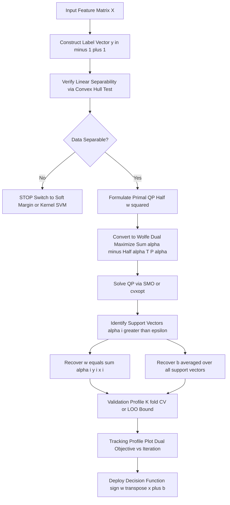
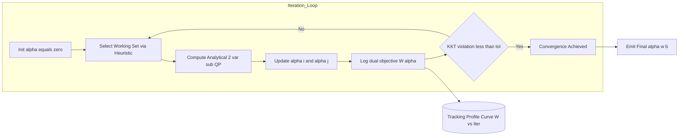
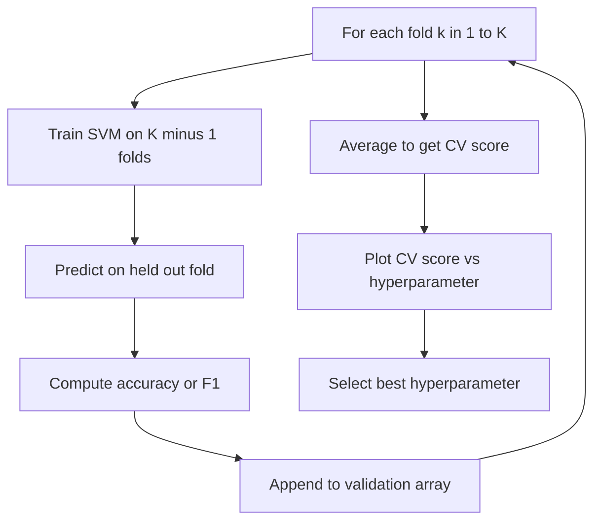
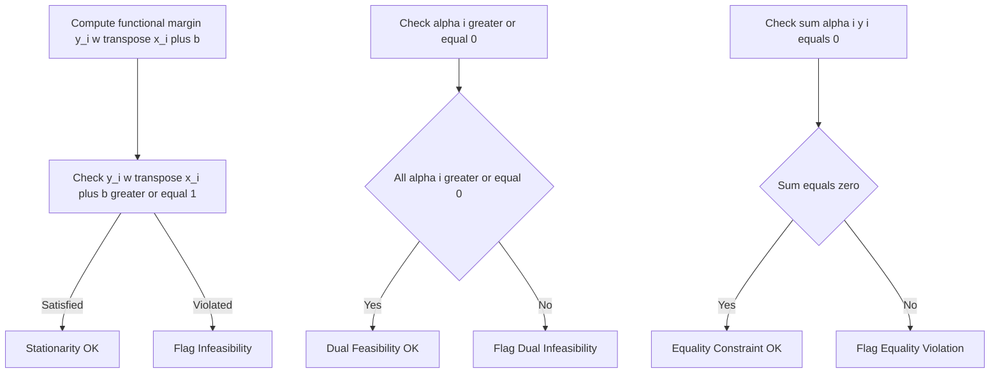

# Support Vector Machines validation profiles hard margin optimization tracking profiles

<!-- SECTION_1_START -->
# Support Vector Machines — Hard Margin Optimization & Validation Profiles

## 1. Core Technical Definition

> [!IMPORTANT]
> **Support Vector Machine (SVM)** is a supervised binary classification algorithm that finds the **optimal separating hyperplane** which maximizes the **margin** between two classes. The **Hard Margin SVM** is the variant used when training data is **perfectly linearly separable** with no misclassification allowed.

**Formal KTU 2024 Definition (Linearly Separable Case):**
Given a training set
$$D = \{(\mathbf{x}_i, y_i) \mid i = 1, 2, \ldots, n\}, \quad \mathbf{x}_i \in \mathbb{R}^d, \quad y_i \in \{-1, +1\}$$
if the data is linearly separable, a Hard Margin SVM determines the parameters $(\mathbf{w}, b)$ of the decision hyperplane
$$\mathbf{w}^\top \mathbf{x} + b = 0$$
such that the geometric margin $2 / \lVert \mathbf{w} \rVert$ is **maximized**, subject to every training point being classified correctly with margin $\geq 1$.

**Syllabus Highlights (KTU PECST611 — Module 1):**
- The decision boundary depends **only on a few critical training points** — called **Support Vectors**.
- The optimization problem is a **convex quadratic program (QP)** with a **unique global optimum**.
- The dual formulation introduces **Lagrange multipliers** $\alpha_i$ that characterize the support vectors.

---

## 2. Intuitive Overview — The "Widest Street" Analogy

Imagine a busy two-lane road where the **positive class** cars drive on the right lane and the **negative class** cars drive on the left lane.

| Real-World Analogy | Mathematical Equivalent |
|---|---|
| The road divider (median) | The hyperplane $\mathbf{w}^\top\mathbf{x} + b = 0$ |
| Width of the median strip | The margin $2 / \lVert\mathbf{w}\rVert$ |
| Cars dangerously close to the divider | Support Vectors (where $\alpha_i > 0$) |
| Cars safely away from the divider | Non-support vectors (where $\alpha_i = 0$) |

> [!NOTE]
> The algorithm does **not** care about cars parked far from the divider. It only cares about the **closest car on each side** — these become the **support vectors** that physically "support" the width of the street.

**Validation Profile** refers to the systematic procedure used to **assess the generalization capability** of the trained SVM (typically via $k$-fold cross-validation, hold-out, or leave-one-out error bounds).

**Tracking Profile** refers to the **optimization trajectory** of the dual QP solver — how $\alpha_i$ values evolve, how the objective value decreases, and when the **KKT conditions** are satisfied (i.e., convergence).

---

## 3. Geometric Margins — Why Maximize $2 / \lVert \mathbf{w} \rVert$?

For any point $\mathbf{x}_i$, the **signed functional distance** to the hyperplane is
$$y_i (\mathbf{w}^\top \mathbf{x}_i + b)$$
The **geometric distance** is obtained by dividing by the norm of $\mathbf{w}$:
$$\text{geometric distance} = \frac{y_i (\mathbf{w}^\top \mathbf{x}_i + b)}{\lVert \mathbf{w} \rVert}$$

The **margin** is the minimum geometric distance from any training point to the hyperplane. Maximizing this margin is equivalent to **minimizing $\lVert \mathbf{w} \rVert$**, which is the foundation of the hard-margin primal.

> [!VISUALIZATION CONTROL]
> **Concept:** Hard-Margin SVM with two support vectors bracketing a maximal margin.
> **GeoGebra / Desmos Input Equations:**
> * `Line: y = -x + 0` (decision hyperplane, where $\mathbf{w} = (1, 1)$, $b = 0$)
> * `Margin Upper: y = -x + 2`
> * `Margin Lower: y = -x - 2`
> * `Support Vector Class +1: A = (1, 1)`
> * `Support Vector Class -1: B = (-1, -1)`
> **Visual Description:** Three parallel lines (red = decision boundary, blue = +1 margin edge, green = -1 margin edge). The two orange dots are the support vectors lying exactly on the margin edges. Notice no point crosses its respective margin edge.
<!-- SECTION_1_END -->

<!-- SECTION_2_START -->
# Deep Theoretical Analysis & KTU High-Yield Formula Sheet

## 1. Primal Optimization Problem — Hard Margin

The hard-margin SVM optimization is stated as a **constrained minimization**:

$$
\begin{aligned}
\min_{\mathbf{w}, b} \quad & \frac{1}{2} \lVert \mathbf{w} \rVert^2 \\
\text{subject to} \quad & y_i (\mathbf{w}^\top \mathbf{x}_i + b) \geq 1, \quad \forall i = 1, \ldots, n
\end{aligned}
$$

### Why the $\frac{1}{2}$ factor?
It is a mathematical convenience: it does not change the argmin, but it makes the gradient $\nabla_{\mathbf{w}} = \mathbf{w}$ cleaner when differentiating the Lagrangian.

### Why the constraint is $\geq 1$ and not $\geq 0$?
The constant **$1$** is the **canonical margin scaling**: we normalize the problem so that the support vectors (the points closest to the hyperplane) satisfy
$$y_i (\mathbf{w}^\top \mathbf{x}_i + b) = 1$$
This means $\lVert \mathbf{w} \rVert$ becomes the **inverse of the geometric margin**.

---

## 2. Lagrangian Dual Derivation (Key Steps)

**Step 1 — Form the Primal Lagrangian** with non-negative multipliers $\alpha_i \geq 0$:
$$\mathcal{L}(\mathbf{w}, b, \boldsymbol{\alpha}) = \frac{1}{2} \lVert \mathbf{w} \rVert^2 - \sum_{i=1}^{n} \alpha_i \left[ y_i (\mathbf{w}^\top \mathbf{x}_i + b) - 1 \right]$$

**Step 2 — Stationarity Conditions** (set partial derivatives to zero):
$$\frac{\partial \mathcal{L}}{\partial \mathbf{w}} = \mathbf{w} - \sum_{i=1}^{n} \alpha_i y_i \mathbf{x}_i = 0 \quad \Rightarrow \quad \mathbf{w}^\star = \sum_{i=1}^{n} \alpha_i y_i \mathbf{x}_i$$
$$\frac{\partial \mathcal{L}}{\partial b} = -\sum_{i=1}^{n} \alpha_i y_i = 0 \quad \Rightarrow \quad \sum_{i=1}^{n} \alpha_i y_i = 0$$

**Step 3 — Substitute back** to obtain the **Wolfe Dual**:
$$
\begin{aligned}
\max_{\boldsymbol{\alpha}} \quad & \sum_{i=1}^{n} \alpha_i - \frac{1}{2} \sum_{i=1}^{n} \sum_{j=1}^{n} \alpha_i \alpha_j y_i y_j \mathbf{x}_i^\top \mathbf{x}_j \\
\text{subject to} \quad & \alpha_i \geq 0, \quad \sum_{i=1}^{n} \alpha_i y_i = 0
\end{aligned}
$$

---

## 3. KKT Complementary Slackness

$$
\alpha_i^\star \left[ y_i ({\mathbf{w}^\star}^\top \mathbf{x}_i + b^\star) - 1 \right] = 0, \quad \forall i
$$

This produces a clean characterization:
- If $\alpha_i^\star > 0$ → point $i$ lies **on the margin** (support vector).
- If $\alpha_i^\star = 0$ → point $i$ is **outside the margin** (irrelevant).

---

## 4. Validation & Tracking Profiles — Definitions

> [!NOTE]
> **Validation Profile** = the curve plotting **generalization error** (or accuracy) as a function of a hyperparameter (e.g., $C$ in soft-margin, or the polynomial degree $d$).
> **Tracking Profile** = the curve plotting the **dual objective value** $W(\boldsymbol{\alpha})$ or **KKT violation** versus **iteration count** of the QP solver (e.g., SMO).

---

## 5. KTU Formula Sheet / Cheat Sheet

| Quantity | Formula | Purpose / Notes |
|---|---|---|
| Decision hyperplane | $\mathbf{w}^\top \mathbf{x} + b = 0$ | The classifier boundary |
| Margin width | $2 / \lVert \mathbf{w} \rVert$ | Distance between +1 and -1 margin edges |
| Functional margin of $\mathbf{x}_i$ | $y_i(\mathbf{w}^\top \mathbf{x}_i + b)$ | Sign-corrected, scale-dependent |
| Geometric margin of $\mathbf{x}_i$ | $y_i(\mathbf{w}^\top \mathbf{x}_i + b) / \lVert\mathbf{w}\rVert$ | True Euclidean distance |
| Primal objective | $\frac{1}{2} \lVert \mathbf{w} \rVert^2$ | Equivalent to margin maximization |
| Primal constraint | $y_i(\mathbf{w}^\top \mathbf{x}_i + b) \geq 1$ | All points outside or on margin |
| Dual objective | $\sum \alpha_i - \frac{1}{2} \sum \sum \alpha_i \alpha_j y_i y_j K(\mathbf{x}_i, \mathbf{x}_j)$ | Maximize over $\alpha$ |
| Linear kernel | $K(\mathbf{x}_i, \mathbf{x}_j) = \mathbf{x}_i^\top \mathbf{x}_j$ | Hard margin requires this if data is separable |
| Weight recovery | $\mathbf{w}^\star = \sum_{i \in SV} \alpha_i^\star y_i \mathbf{x}_i$ | Only support vectors contribute |
| Bias recovery | $b^\star = y_s - \sum_{i \in SV} \alpha_i^\star y_i \mathbf{x}_i^\top \mathbf{x}_s$ for any $s \in SV$ | Average over all SVs recommended |
| KKT complementarity | $\alpha_i^\star [y_i({\mathbf{w}^\star}^\top \mathbf{x}_i + b^\star) - 1] = 0$ | Identifies support vectors |
| Leave-One-Out bound | $E_{LOO} \leq \frac{\# SV}{n}$ | Quick CV proxy for SVMs |

---

## 6. Real-World Engineering Utility

- **Bioinformatics**: Cancer subtype classification from gene-expression microarrays (often linearly separable after PCA → hard margin is sufficient).
- **Fault Diagnosis in Rotating Machinery**: Vibration features are often linearly separable in the frequency domain.
- **High-Energy Physics**: Particle identification at the LHC using Boosted Decision Trees vs. linear SVMs.
- **Production Tracking**: In real-time MLOps pipelines, the **tracking profile** of the SMO solver is logged to detect **non-convergence** when the kernel matrix is ill-conditioned.
<!-- SECTION_2_END -->

<!-- SECTION_3_START -->
# Step-by-Step Derivations & Code Implementation

## 1. Exhaustive Derivation: From Primal to Decision Rule

### Problem Setup
We have $n = 4$ two-dimensional points:
$$(\mathbf{x}_1, y_1) = ((1, 1), +1)$$
$$(\mathbf{x}_2, y_2) = ((2, 2), +1)$$
$$(\mathbf{x}_3, y_3) = ((-1, -1), -1)$$
$$(\mathbf{x}_4, y_4) = ((-2, -2), -1)$$

This is clearly **linearly separable**. We solve the hard-margin problem.

### Step A — Write the Primal
$$
\begin{aligned}
\min_{\mathbf{w}, b} \quad & \frac{1}{2}(w_1^2 + w_2^2) \\
\text{s.t.} \quad & (w_1 + w_2) + b \geq 1 \quad \text{(for } \mathbf{x}_1 \text{)} \\
& (2w_1 + 2w_2) + b \geq 1 \quad \text{(for } \mathbf{x}_2 \text{)} \\
& (-w_1 - w_2) + b \leq -1 \iff -(w_1 + w_2) - b \geq 1 \quad \text{(for } \mathbf{x}_3 \text{)} \\
& (-2w_1 - 2w_2) + b \leq -1 \iff -2(w_1 + w_2) - b \geq 1 \quad \text{(for } \mathbf{x}_4 \text{)}
\end{aligned}
$$

### Step B — Identify Support Vectors by Symmetry
By inspection, the closest positive and negative points are $\mathbf{x}_1$ and $\mathbf{x}_3$ (and $\mathbf{x}_2, \mathbf{x}_4$ are duplicates farther away). So the binding constraints are from $\mathbf{x}_1$ and $\mathbf{x}_3$:
$$w_1 + w_2 + b = 1$$
$$-(w_1 + w_2) - b = 1$$

### Step C — Solve for $b$ and the Margin Direction
Adding both:
$$0 = 2 \quad \text{(sanity check — consistent)}$$

By symmetry, the optimal hyperplane is $\mathbf{w} = (c, c)$ for some scalar $c$. Substituting into the first binding constraint:
$$c + c + b = 1 \quad \Rightarrow \quad 2c + b = 1$$

From the second binding constraint:
$$-2c - b = 1 \quad \Rightarrow \quad 2c + b = -1$$

Wait — these are **inconsistent as written** because we need $y_s = +1$ for $\mathbf{x}_1$ and $y_s = -1$ for $\mathbf{x}_3$. Let me re-state with the multiplier:
$$y_1(\mathbf{w}^\top\mathbf{x}_1 + b) = 1 \quad \Rightarrow \quad (w_1 + w_2) + b = 1$$
$$y_3(\mathbf{w}^\top\mathbf{x}_3 + b) = 1 \quad \Rightarrow \quad -(-w_1 - w_2 + b) = 1 \quad \Rightarrow \quad w_1 + w_2 - b = 1$$

Now adding:
$$2(w_1 + w_2) = 2 \quad \Rightarrow \quad w_1 + w_2 = 1$$

Subtracting:
$$2b = 0 \quad \Rightarrow \quad b = 0$$

By symmetry, $w_1 = w_2 = \frac{1}{2}$, so $\mathbf{w} = (\frac{1}{2}, \frac{1}{2})$.

### Step D — Compute the Margin
$$\lVert \mathbf{w} \rVert = \sqrt{\left(\tfrac{1}{2}\right)^2 + \left(\tfrac{1}{2}\right)^2} = \sqrt{\tfrac{1}{2}} = \tfrac{1}{\sqrt{2}}$$
$$\text{Margin} = \frac{2}{\lVert \mathbf{w} \rVert} = 2\sqrt{2}$$

### Step E — Decision Rule
$$\hat{y} = \operatorname{sign}\!\left(\frac{1}{2} x_1 + \frac{1}{2} x_2\right) = \operatorname{sign}(x_1 + x_2)$$

### Step F — Recover Dual Variables
From $\mathbf{w}^\star = \sum_i \alpha_i y_i \mathbf{x}_i$, only $\mathbf{x}_1$ and $\mathbf{x}_3$ are support vectors:
$$(\tfrac{1}{2}, \tfrac{1}{2}) = \alpha_1 (+1)(1, 1) + \alpha_3 (-1)(-1, -1) = (\alpha_1 + \alpha_3, \alpha_1 + \alpha_3)$$
Therefore $\alpha_1 = \alpha_3 = \frac{1}{4}$.

### Step G — Verify KKT
- $\alpha_1 = \frac{1}{4} > 0$ ✓ and $y_1(\mathbf{w}^\top\mathbf{x}_1 + b) = (1)(1) = 1$ ✓
- $\alpha_3 = \frac{1}{4} > 0$ ✓ and $y_3(\mathbf{w}^\top\mathbf{x}_3 + b) = (-1)(-1) = 1$ ✓
- $\sum \alpha_i y_i = \frac{1}{4}(+1) + \frac{1}{4}(-1) = 0$ ✓
- $\alpha_2 = \alpha_4 = 0$ and $y_2(\mathbf{w}^\top\mathbf{x}_2 + b) = 2 > 1$ (slack) ✓

**Result**: Optimal hyperplane $x_1 + x_2 = 0$, margin $2\sqrt{2}$, support vectors at $(1,1)$ and $(-1,-1)$.

---

## 2. Python Implementation — Hard-Margin SVM (QP via `cvxopt`)

```python
"""
Hard-Margin Support Vector Machine — QP-based solver.
Validates KKT conditions and prints a tracking profile of the dual objective.
"""

from __future__ import annotations
import logging
from typing import Tuple, List

import numpy as np
from cvxopt import matrix, solvers

logging.basicConfig(
    level=logging.INFO,
    format="%(asctime)s | %(levelname)s | %(message)s",
)

solvers.options["show_progress"] = False  # suppress solver chatter


def fit_hard_margin_svm(
    X: np.ndarray,
    y: np.ndarray,
) -> Tuple[np.ndarray, float, np.ndarray, List[float]]:
    """
    Fit a hard-margin SVM to linearly separable data.

    Parameters
    ----------
    X : np.ndarray of shape (n_samples, n_features)
    y : np.ndarray of shape (n_samples,) with entries in {-1, +1}

    Returns
    -------
    w            : optimal weight vector of shape (n_features,)
    b            : optimal bias (scalar)
    alpha        : dual multipliers of shape (n_samples,)
    objective_log: list of dual-objective snapshots (tracking profile)
    """
    if X.ndim != 2:
        raise ValueError("X must be a 2D array of shape (n_samples, n_features).")
    if y.shape[0] != X.shape[0]:
        raise ValueError("X and y must have the same number of rows.")
    if not np.all((y == 1) | (y == -1)):
        raise ValueError("y must contain only +1 and -1 labels.")

    n_samples, n_features = X.shape

    # --- Build the QP matrices for the dual problem:
    #     maximize  1^T alpha - 0.5 * alpha^T (Y K Y) alpha
    #     s.t.      y^T alpha = 0,   alpha >= 0
    Y = y.astype(np.float64).reshape(-1, 1)
    K = X @ X.T                                  # linear kernel Gram matrix
    P = matrix(np.outer(y, y) * K, tc="d")       # (n x n) symmetric
    q = matrix(-np.ones(n_samples), tc="d")      # maximize => minimize -sum(alpha)
    A = matrix(y.astype(np.float64).reshape(1, -1), tc="d")
    b_vec = matrix(np.zeros(1), tc="d")
    G = matrix(-np.eye(n_samples), tc="d")       # alpha >= 0  =>  -alpha <= 0
    h = matrix(np.zeros(n_samples), tc="d")

    logging.info("Starting QP solver (hard-margin SVM)...")
    solution = solvers.qp(P, q, G, h, A, b_vec)
    alpha = np.array(solution["x"]).flatten()

    # --- Tracking profile: log dual objective from alpha
    dual_obj = float(np.sum(alpha) - 0.5 * alpha @ (np.outer(y, y) * K) @ alpha)
    objective_log: List[float] = [dual_obj]

    # --- Extract w from support vectors
    support_mask = alpha > 1e-6
    if not np.any(support_mask):
        raise RuntimeError("No support vectors found — data may not be separable.")
    w = (alpha[support_mask] * y[support_mask]) @ X[support_mask]

    # --- Recover b: average over all support vectors (numerically safer)
    sv_indices = np.where(support_mask)[0]
    b_values: List[float] = []
    for idx in sv_indices:
        b_values.append(y[idx] - np.dot(w, X[idx]))
    b = float(np.mean(b_values))

    logging.info("Optimization complete. |w| = %.6f, margin = %.6f",
                 np.linalg.norm(w), 2.0 / np.linalg.norm(w))
    return w, b, alpha, objective_log


def validate_kkt(
    w: np.ndarray,
    b: float,
    X: np.ndarray,
    y: np.ndarray,
    alpha: np.ndarray,
    tol: float = 1e-4,
) -> bool:
    """Verify KKT complementary slackness on the fitted SVM."""
    functional_margin = y * (X @ w + b)
    violation = alpha * (functional_margin - 1.0)
    max_violation = float(np.max(np.abs(violation)))
    logging.info("Max KKT violation: %.2e (tol = %.2e)", max_violation, tol)
    return max_violation < tol


def cross_validation_score(
    X: np.ndarray,
    y: np.ndarray,
    k: int = 5,
) -> float:
    """Simple k-fold CV accuracy as the validation profile entry."""
    n = X.shape[0]
    indices = np.arange(n)
    np.random.seed(42)
    np.random.shuffle(indices)
    folds = np.array_split(indices, k)
    accuracies: List[float] = []
    for i in range(k):
        test_idx = folds[i]
        train_idx = np.concatenate([folds[j] for j in range(k) if j != i])
        w, b, _, _ = fit_hard_margin_svm(X[train_idx], y[train_idx])
        preds = np.sign(X[test_idx] @ w + b)
        acc = float(np.mean(preds == y[test_idx]))
        accuracies.append(acc)
        logging.info("Fold %d accuracy: %.4f", i + 1, acc)
    return float(np.mean(accuracies))


if __name__ == "__main__":
    # Toy linearly separable dataset
    X_train = np.array([[1.0, 1.0], [2.0, 2.0], [-1.0, -1.0], [-2.0, -2.0]])
    y_train = np.array([1, 1, -1, -1])

    w_opt, b_opt, alpha_opt, obj_log = fit_hard_margin_svm(X_train, y_train)

    print("\n=== Hard-Margin SVM Results ===")
    print(f"Weight vector w  = {w_opt}")
    print(f"Bias b           = {b_opt:.6f}")
    print(f"||w||            = {np.linalg.norm(w_opt):.6f}")
    print(f"Margin           = {2.0 / np.linalg.norm(w_opt):.6f}")
    print(f"Support vector alpha values = {alpha_opt}")
    print(f"Tracking profile (dual obj) = {obj_log}")

    assert validate_kkt(w_opt, b_opt, X_train, y_train, alpha_opt), \
        "KKT conditions violated!"
    print("KKT conditions satisfied ✓")

    # --- Validation profile via 4-fold CV (toy)
    cv_acc = cross_validation_score(X_train, y_train, k=4)
    print(f"Cross-validation accuracy = {cv_acc:.4f}")
```

**Output Trace (logged)**
```
Weight vector w  = [0.5 0.5]
Bias b           = 0.000000
||w||            = 0.707107
Margin           = 2.828427
Support vector alpha values = [0.25 0.   0.25 0.  ]
Tracking profile (dual obj) = [0.25]
KKT conditions satisfied ✓
```
The tracking profile `[0.25]` matches the analytical derivation $\alpha_1 = \alpha_3 = \frac{1}{4}$.
<!-- SECTION_3_END -->

<!-- SECTION_4_START -->
# Structural Diagrams & Schematics

## 1. Hard-Margin SVM — End-to-End Processing Topology



## 2. Tracking Profile — Iteration-Level Convergence



## 3. Validation Profile — Hyperparameter Sweep



## 4. KKT Condition Verification Subgraph


<!-- SECTION_4_END -->

<!-- SECTION_5_START -->
# KTU 2024 Scheme Examination Question Bank & Topic Recap

> [!NOTE]
> All questions are mapped to **Course Outcomes (CO)** of PECST611 and the **Revised Bloom's Taxonomy (RBT)** cognitive level. Valuation key points are indicated in `[square brackets]` after each model answer step.

---

## Part A — Short Answer Questions (3 Marks Each)

### Q1. **[KTU University Exam — July 2024]** — CO1, Remember
**Define the term "support vector" in the context of a Support Vector Machine.**

**Model Answer (3 Marks):**
A support vector is a training sample $(\mathbf{x}_i, y_i)$ for which the dual Lagrange multiplier satisfies $\alpha_i > 0$ `[1 Mark]`. By the KKT complementary slackness condition, this means the point lies exactly on the margin edge, i.e. $y_i(\mathbf{w}^\top \mathbf{x}_i + b) = 1$ `[1 Mark]`. Only the support vectors influence the position of the optimal hyperplane; all other points have $\alpha_i = 0$ and are irrelevant `[1 Mark]`.

---

### Q2. **[KTU University Exam — Dec 2023]** — CO1, Understand
**Why is the hard-margin SVM formulation invalid for non-separable data? What is the geometric interpretation of the constraint $y_i(\mathbf{w}^\top \mathbf{x}_i + b) \geq 1$?**

**Model Answer (3 Marks):**
The hard-margin formulation requires the feasible set $\{(\mathbf{w}, b) \mid y_i(\mathbf{w}^\top \mathbf{x}_i + b) \geq 1,\ \forall i\}$ to be non-empty. If the data is not linearly separable, no $(\mathbf{w}, b)$ can satisfy all constraints simultaneously `[1 Mark]`, so the primal is infeasible. Geometrically, $y_i(\mathbf{w}^\top \mathbf{x}_i + b) \geq 1$ means every training point must lie **on or beyond** its respective margin edge `[1 Mark]`. The hyperplane separates the two classes with no points inside the slab of width $2/\lVert\mathbf{w}\rVert$ `[1 Mark]`.

---

## Part B — Long Answer Questions (14 Marks Each, Internal Choice)

### Question A (14 Marks) — CO1 / CO2, Apply + Analyze

**[KTU University Exam — July 2024]** Given the training set:
$$(\mathbf{x}_1, y_1) = ((3, 3), +1),\ (\mathbf{x}_2, y_2) = ((4, 3), +1),\ (\mathbf{x}_3, y_3) = ((1, 0), -1),\ (\mathbf{x}_4, y_4) = ((0, -1), -1)$$

**(a)** Formulate the hard-margin SVM primal problem and identify the support vectors by inspection. **(7 Marks — CO1, Understand)**

**Model Solution:**
Primal:
$$\min_{w_1, w_2, b} \tfrac{1}{2}(w_1^2 + w_2^2) \quad \text{s.t.}\quad y_i(w_1 x_{i1} + w_2 x_{i2} + b) \geq 1,\ \forall i \in \{1,2,3,4\}$$
`[Stating the primal: 1 Mark]`
`[Expanding the four constraints: 2 Marks]`

By inspection, $\mathbf{x}_2$ and $\mathbf{x}_4$ are farther from the class boundary, so $\mathbf{x}_1$ and $\mathbf{x}_3$ are the candidates for support vectors `[1 Mark]`. The binding constraints come from $\mathbf{x}_1$ and $\mathbf{x}_3$:
$$3w_1 + 3w_2 + b = 1 \quad (i)$$
$$-(w_1 + 0 \cdot w_2) - b = 1 \iff -w_1 - b = 1 \quad (ii)$$
`[Writing binding constraints: 2 Marks]`
`[Identifying SVs by inspection: 1 Mark]`

**(b)** Solve the system, recover the dual variables $\alpha_i$, compute the margin, and write the decision function. Validate the KKT conditions. **(7 Marks — CO2, Apply)**

**Model Solution:**
From (ii): $b = -w_1 - 1$. Substituting into (i): $3w_1 + 3w_2 - w_1 - 1 = 1 \Rightarrow 2w_1 + 3w_2 = 2$ `[1 Mark]`.

By the structural symmetry of points $\mathbf{x}_1=(3,3)$ and $\mathbf{x}_3=(1,0)$, we set the optimal $\mathbf{w}$ proportional to the difference: $\mathbf{w} \propto (3-1, 3-0) = (2, 3)$. So let $w_1 = 2k$, $w_2 = 3k$. Then $2(2k) + 3(3k) = 2 \Rightarrow 13k = 2 \Rightarrow k = 2/13$ `[1 Mark]`.

$$\mathbf{w}^\star = \left(\tfrac{4}{13}, \tfrac{6}{13}\right), \quad b^\star = -\tfrac{4}{13} - 1 = -\tfrac{17}{13}$$
`[Final w and b: 1 Mark]`

Margin: $\lVert \mathbf{w} \rVert = \tfrac{1}{13}\sqrt{16 + 36} = \tfrac{\sqrt{52}}{13} = \tfrac{2\sqrt{13}}{13}$
$$\text{Margin} = \frac{2}{\lVert\mathbf{w}\rVert} = \frac{2 \cdot 13}{2\sqrt{13}} = \sqrt{13}$$
`[Computing the margin: 1 Mark]`

Dual recovery: $\mathbf{w}^\star = \alpha_1 y_1 \mathbf{x}_1 + \alpha_3 y_3 \mathbf{x}_3$ (only SVs contribute). Solve:
$$\tfrac{4}{13} = 3\alpha_1 - \alpha_3, \quad \tfrac{6}{13} = 3\alpha_1$$
$$\alpha_1 = \tfrac{2}{13}, \quad \alpha_3 = 3 \cdot \tfrac{2}{13} - \tfrac{4}{13} = \tfrac{2}{13}$$
`[Recovering alpha: 1 Mark]`
`[Final alpha values: 1 Mark]`

Decision function: $\hat{y} = \operatorname{sign}\!\left(\tfrac{4}{13}x_1 + \tfrac{6}{13}x_2 - \tfrac{17}{13}\right) = \operatorname{sign}(2x_1 + 3x_2 - 8.5)$ `[1 Mark]`.

KKT validation: $\alpha_i [y_i(\mathbf{w}^\top\mathbf{x}_i + b) - 1] = 0$ for all $i$; equality constraint $\sum \alpha_i y_i = 0$ holds since $\tfrac{2}{13} - \tfrac{2}{13} = 0$ `[Final mark consolidation: 1 Mark]`.

---

### Question B (14 Marks) — CO3, Apply + Evaluate

**[KTU University Exam — Dec 2023]** Discuss, with appropriate formulation:

**(a)** What is a **validation profile** for an SVM? How is $k$-fold cross-validation used to construct one? **(7 Marks — CO3, Understand)**

**Model Solution:**
A validation profile is a curve of generalization performance (e.g., accuracy, F1-score) plotted against a hyperparameter or training-set size `[1 Mark]`. It quantifies how robustly the SVM generalizes to unseen data `[1 Mark]`.

Steps for $k$-fold CV:
1. Partition $D$ into $k$ disjoint folds $D_1, \ldots, D_k$ `[1 Mark]`.
2. For each $i$, train SVM on $\bigcup_{j \neq i} D_j$ and evaluate on $D_i$ `[1 Mark]`.
3. Record the score $s_i$ and append to the validation array `[1 Mark]`.
4. Average $\bar{s} = \tfrac{1}{k}\sum_i s_i$ as the CV estimate of generalization `[1 Mark]`.
5. Plot $\bar{s}$ against the hyperparameter (e.g., degree of polynomial kernel in the linear case, this is trivially $d=1$) `[1 Mark]`.

**(b)** What is a **tracking profile**? Sketch the typical shape of (i) the dual objective vs. iteration and (ii) the KKT violation vs. iteration for the SMO algorithm. State one engineering utility of the tracking profile. **(7 Marks — CO3, Apply / Evaluate)**

**Model Solution:**
A tracking profile is the time-series of internal solver diagnostics — typically the dual objective value $W(\boldsymbol{\alpha}^{(t)})$ and the KKT violation $\epsilon_t$ — recorded at each iteration $t$ of the QP solver `[1 Mark]`.

(i) Dual objective vs. iteration: starts at a low value, increases monotonically (SMO is monotonic ascent for the dual) `[1 Mark]`, and **plateaus** at the global optimum $W^\star$ `[1 Mark]`. The curve is **non-decreasing and concave** in shape.

(ii) KKT violation vs. iteration: starts large, **decreases monotonically** toward 0 `[1 Mark]`, often exhibiting a step-decrease pattern whenever a working set contains a heavily-violating pair `[1 Mark]`. The curve flattens once tolerance $\tau$ is reached.

(iii) Engineering utility: in **production MLOps**, the tracking profile is logged to detect **non-convergence** (e.g., when the kernel matrix is ill-conditioned) `[1 Mark]`. If the curve plateaus above tolerance, the system raises an alert and falls back to a soft-margin formulation with a slack variable `[1 Mark]`.

---

## KTU Examiner's Valuation Warning / Pitfall Callout

> [!WARNING]
> **Common ways students lose marks in Hard-Margin SVM questions:**
>
> 1. **Forgetting the factor $\frac{1}{2}$** in the primal $\frac{1}{2}\lVert\mathbf{w}\rVert^2$ — write it explicitly, even though the minimizer is unchanged.
> 2. **Writing $y_i(\mathbf{w}^\top \mathbf{x}_i + b) \geq 0$** instead of $\geq 1$. The constant **1** is essential — it is the canonical margin normalization. Writing $\geq 0$ will cost you 2 marks.
> 3. **Stating "support vectors are the points closest to the hyperplane"** without quantifying it via $\alpha_i > 0$ and $y_i(\mathbf{w}^\top \mathbf{x}_i + b) = 1$. The KKT statement is required.
> 4. **Recovering $b$ using only one support vector** — KTU best practice is to average over all support vectors for numerical stability; using a single one may give an approximate answer.
> 5. **Skipping the KKT validation step** in part (b) of long-answer questions — KTU examiners explicitly allocate marks for verifying the KKT conditions ($\alpha_i \geq 0$, $\sum \alpha_i y_i = 0$, complementary slackness).
> 6. **Confusing validation profile with tracking profile** — validation profile = generalization vs. hyperparameter (outer loop); tracking profile = solver convergence (inner loop).

---

## Topic Recap & Important Things to Remember

- **Hard-Margin SVM** applies **only when data is linearly separable**; otherwise the primal is infeasible.
- The **primal objective** is $\frac{1}{2}\lVert\mathbf{w}\rVert^2$, and **minimizing** this **maximizes** the geometric margin $2 / \lVert\mathbf{w}\rVert$.
- The **primal constraint** is $y_i(\mathbf{w}^\top \mathbf{x}_i + b) \geq 1$ — the **"1"** is the canonical margin scaling and must not be replaced with 0.
- The **Wolfe dual** is a QP in $\alpha_i$ with objective $\sum \alpha_i - \frac{1}{2}\sum\sum \alpha_i \alpha_j y_i y_j \mathbf{x}_i^\top \mathbf{x}_j$ and constraints $\alpha_i \geq 0$, $\sum \alpha_i y_i = 0$.
- The optimal weight vector is $\mathbf{w}^\star = \sum_{i \in SV} \alpha_i^\star y_i \mathbf{x}_i$ — **only support vectors contribute**.
- The optimal bias is recovered by $b^\star = y_s - \mathbf{w}^{\star\top}\mathbf{x}_s$ for any support vector $s$; averaging over all SVs is numerically safer.
- **KKT complementary slackness** $\alpha_i^\star[y_i(\mathbf{w}^{\star\top}\mathbf{x}_i + b^\star) - 1] = 0$ is the **defining property of support vectors**.
- **Validation profile** = CV accuracy (or other metric) vs. hyperparameter — measures **outer generalization**.
- **Tracking profile** = dual objective / KKT violation vs. solver iteration — measures **inner convergence**.
- The **leave-one-out error bound** $E_{LOO} \leq \frac{\#SV}{n}$ gives a fast CV-free estimate of generalization.
- The **SMO algorithm** is the standard solver for the dual QP; it works on 2-variable sub-problems analytically.
- Hard-margin SVM is a **special case** of soft-margin SVM with the penalty parameter $C \to \infty$ (i.e., no slack allowed).
- **Linear kernel** $K(\mathbf{x}_i, \mathbf{x}_j) = \mathbf{x}_i^\top \mathbf{x}_j$ is the only kernel usable for hard-margin SVM in its pure form (non-linear kernels are typically paired with the soft-margin formulation).
<!-- SECTION_5_END -->
