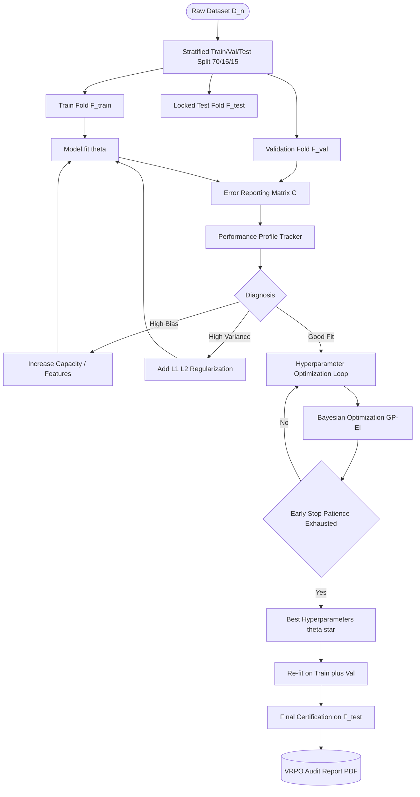
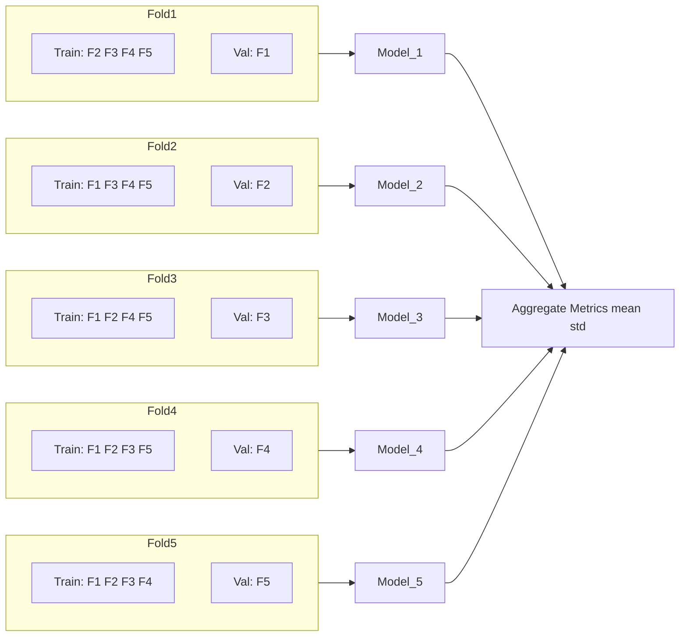
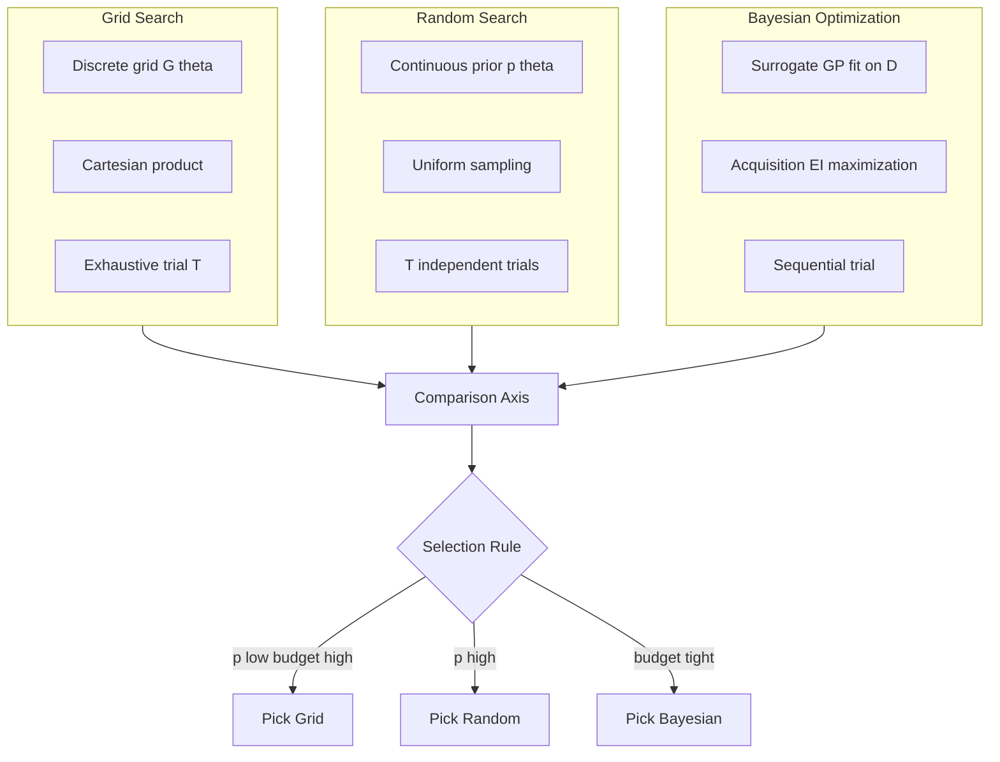
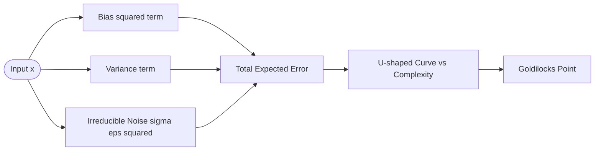

# Model validation error reporting matrix profiles tracking optimization setups rules

<!-- SECTION_1_START -->

# Model Validation, Error Reporting Matrices, Performance Profiling, and Optimization Rule-Sets

> [!NOTE]
> **KTU 2024 Scheme — PECST611 / Module 2**
> **Course Outcome Mapped:** CO2 — *Apply model validation, error analysis, and hyperparameter optimization techniques to engineer robust machine learning pipelines.*
> **RBT Level Focus:** Apply, Analyse, Evaluate.

---

## 1.1 Formal Academic Definition

In the **KTU 2024 Scheme (NEP 2020 aligned)** syllabus for *Machine Learning for Engineers (PECST611)*, **Module 2 — Validation & Fine-Tuning Protocols** is the engineering framework that governs *how a trained model is honestly evaluated, how its error behaviour is recorded, how its performance profile is tracked across training iterations, and how the entire optimization set-up is constrained by formal rule sets to prevent data leakage, overfitting, and reporting bias.*

The block is composed of **four interlocked sub-systems**:

1. **Model Validation Protocol** — the procedural rules that decide which samples are used to *fit*, *tune*, and *certify* a model (e.g., $k$-fold cross-validation, stratified $k$-fold, hold-out, leave-one-out, time-series split).
2. **Error Reporting Matrix** — the *quantitative ledger* of classification/regression errors, formalised as a **Confusion Matrix** $C \in \mathbb{R}^{k \times k}$ from which the metrics *Accuracy, Precision, Recall, F1-score, Specificity, MCC, ROC-AUC, PR-AUC, Log-Loss, RMSE, MAE, $R^2$* are derived.
3. **Performance Profile Tracking** — the *time-series of validation metrics* visualised through **Learning Curves**, **Validation Curves**, **Calibration Curves**, and **Loss Landscapes**, used to diagnose bias/variance trade-offs and convergence behaviour.
4. **Optimization Setup Rules** — the constraint grammar that governs hyperparameter search, including **Grid Search**, **Random Search**, **Bayesian Optimization (GP-based / TPE)**, **Successive Halving**, and the *rule envelope* of **Early Stopping**, **Regularization ($L_1$ / $L_2$ / Elastic-Net)**, and **Learning-Rate Schedules**.

Together they form the **"Validation–Reporting–Profiling–Optimization" (VRPO) control loop** that KTU examiners recurrently test in ESE Part B questions.

---

## 1.2 Conceptual Analogy — The Pilot's Pre-Flight Checklist

> [!IMPORTANT]
> **Analogy — Training a Jet, not just a recipe.**
>
> Imagine you are an aircraft engineer who has just assembled a new jet engine in a hangar. Before a single passenger boards, you must:
>
> 1. **Validate the engine on a test bench** (cross-validation folds) — you do *not* test it on the very same conditions in which it was tuned.
> 2. **Record every failure mode in an "Error Logbook"** (confusion matrix) — *Type-I* errors (false alarms = engine shut down when not needed) and *Type-II* errors (missed faults = engine fails when needed) are tabulated.
> 3. **Profile the engine across its operating envelope** (learning & validation curves) — RPM vs. thrust, fuel-flow vs. temperature, plotted at each calibration tick.
> 4. **Apply Engineering Rules-of-Thumb** (regularization, early stopping, LR schedule) — never exceed the *red-line*, never over-rev before the bearings are warm, always log-out before re-calibrating.
>
> A machine learning model behaves *identically*. The hangar = training set, the test bench = validation fold, the logbook = confusion matrix, the profile plot = learning curve, the red-line = early-stopping rule.

---

## 1.3 Glossary of KTU-High-Yield Constants & Symbols

> [!NOTE]
> The following scalars are **standardised across the KTU 2024 scheme question bank**. Memorise the symbols — they appear verbatim in ESE question stems.

| Symbol | Meaning | Typical Value (KTU default) |
| :--- | :--- | :--- |
| $n$ | Total number of samples | dataset-dependent |
| $k$ | Number of CV folds | **5** or **10** (KTU default = 5) |
| $T$ | Total number of hyperparameter trials | 50, 100 |
| $p$ | Number of hyperparameters tuned | 2 – 6 |
| $\eta$ | Learning rate | $10^{-3}$ |
| $\lambda$ | Regularization strength | $10^{-4}$ to $10^{1}$ |
| $C$ | Confusion matrix | $\in \mathbb{R}^{k \times k}$ |
| $\mathcal{L}$ | Loss function | cross-entropy / MSE |
| $\mathbb{E}$ | Expected value | — |

> [!VISUALIZATION CONTROL]
> **Concept:** Bias-Variance Trade-off as a *Parabola of Generalisation Error*
> **GeoGebra / Desmos Input Equations:**
> * `f(x) = (x - 2)^2 + 0.5`   ← Total Error
> * `g(x) = (x - 2)^2`         ← Variance component (peaks right of optimum)
> * `h(x) = 0.5 / (x + 0.5)`   ← Squared-Bias component (decays monotonically)
> **Visual Description:** A U-shaped total error curve $f(x) = g(x) + h(x)$ plotted against model *complexity* (or training-iteration $x$). The minimum of $f$ marks the *sweet spot* — to the left, **high bias (underfitting)**; to the right, **high variance (overfitting)**. The intersection of $g$ and $h$ is the KTU-favoured **"Goldilocks Point"** for $k$-fold selection.

---

<!-- SECTION_1_END -->

<!-- SECTION_2_START -->

# 2. Deep Theoretical Analysis & KTU High-Yield Formula Sheet

---

## 2.1 The Four Pillars — Decomposed

### 2.1.1 Pillar 1 — Model Validation Protocols

Validation protocols are **data-partitioning rules** that prevent the *sin of training on the test set*. KTU 2024 scheme recognises the following protocols, in order of statistical strength:

* **Hold-Out (70/15/15 or 80/10/10):** simplest split. Fast, but high variance in the test estimate.
* **$k$-Fold Cross-Validation:** the dataset is partitioned into $k$ *equi-sized* folds; in iteration $i$, fold $i$ is the validation set and the remaining $k-1$ folds are the training set. The reported metric is the *mean across the $k$ trials*.
* **Stratified $k$-Fold:** same as $k$-fold, but each fold preserves the *class-prior* $P(y=c)$ of the full dataset — mandatory for imbalanced data (e.g., fraud detection).
* **Leave-One-Out CV (LOOCV):** $k = n$. Computationally expensive, but nearly unbiased. KTU 2024 scheme treats LOOCV as a *theoretical reference*; not used for large $n$.
* **Time-Series Split (Walk-Forward):** validation fold *always* lies in the future relative to training fold. Mandatory for streaming / financial / IoT data.
* **Nested CV:** an *outer loop* for honest test estimation and an *inner loop* for hyperparameter tuning — required when reporting the "final" model accuracy in a publication or a KTU project viva.

> [!IMPORTANT]
> **KTU Pitfall:** Reporting test-set accuracy *after* using the test set for hyperparameter selection. The remedy is **Nested CV** or a *locked-away* test set touched **only once**.

### 2.1.2 Pillar 2 — Error Reporting Matrix (Confusion Matrix $C$)

For a binary classifier with classes $\{-1, +1\}$ the confusion matrix is

$$C \;=\; \begin{bmatrix} TN & FP \\ FN & TP \end{bmatrix}$$

where $TN$ = True Negatives, $FP$ = False Positives, $FN$ = False Negatives, $TP$ = True Positives. For a $K$-class problem, $C \in \mathbb{R}^{K \times K}$ with $C_{ij}$ = samples of true class $i$ predicted as class $j$.

### 2.1.3 Pillar 3 — Performance Profile Tracking

Three canonical *profiles* are tracked:

1. **Learning Curve:** $M_{train}(m)$ and $M_{val}(m)$ plotted against training-set size $m$ (or epoch $t$). Diagnoses *bias* (both curves high, small gap) vs *variance* (large train-val gap).
2. **Validation Curve:** $M_{val}(\theta)$ plotted against a single hyperparameter $\theta$ (e.g., $\lambda$, max-depth, $C$). Used to pick the operating point.
3. **Calibration Curve:** predicted probability $\hat{p}$ vs observed frequency. Diagnoses whether a model is *over-confident* or *under-confident* — feeds into Brier Score and Expected Calibration Error (ECE).

### 2.1.4 Pillar 4 — Optimization Setup Rules

The optimization set-up is governed by **four hard rules** in the KTU scheme:

1. **Search-space rule:** every hyperparameter has a *bounded* range, e.g., $\eta \in [10^{-5},\,10^{-1}]$ on a log-scale.
2. **Budget rule:** a fixed trial budget $T$ (e.g., $T = 50$); cannot be exceeded.
3. **Early-stopping rule:** if $M_{val}$ fails to improve for $s$ consecutive trials (patience), abort the trial.
4. **Refit rule:** after the best $(\eta^\star, \lambda^\star)$ is found, the model is *re-trained on the union of train+val* using the locked-away test set *only* for the final certification.

---

## 2.2 KTU High-Yield Formula Sheet

> [!NOTE]
> All formulas below are **exam-grade** — derived directly from first principles and tabulated for rapid revision. *KTU board examiners award partial marks for writing the formula even when the numeric substitution fails.*

### 2.2.1 Classification Metrics (derived from $C$)

| Metric | Formula | Range | Best Value | Engineering Use |
| :--- | :--- | :--- | :--- | :--- |
| **Accuracy** | $\text{Acc} = \dfrac{TP+TN}{TP+FP+FN+TN}$ | $[0,1]$ | $1$ | Balanced classes |
| **Error Rate** | $\text{ERR} = 1 - \text{Acc}$ | $[0,1]$ | $0$ | Mirror of accuracy |
| **Precision (PPV)** | $\text{Prec} = \dfrac{TP}{TP+FP}$ | $[0,1]$ | $1$ | Spam, medical-screen |
| **Recall (TPR / Sensitivity)** | $\text{Rec} = \dfrac{TP}{TP+FN}$ | $[0,1]$ | $1$ | Cancer, fraud, fault |
| **Specificity (TNR)** | $\text{Spec} = \dfrac{TN}{TN+FP}$ | $[0,1]$ | $1$ | Healthy-class retention |
| **F1-Score** | $F_1 = 2 \cdot \dfrac{\text{Prec} \cdot \text{Rec}}{\text{Prec} + \text{Rec}}$ | $[0,1]$ | $1$ | Imbalanced classes |
| **F$_\beta$-Score** | $F_\beta = (1+\beta^2)\cdot\dfrac{\text{Prec}\cdot\text{Rec}}{\beta^2 \text{Prec}+\text{Rec}}$ | $[0,1]$ | $1$ | Weighted trade-off |
| **MCC** | $\text{MCC}=\dfrac{TP\cdot TN - FP\cdot FN}{\sqrt{(TP+FP)(TP+FN)(TN+FP)(TN+FN)}}$ | $[-1,1]$ | $1$ | Truly balanced metric |
| **ROC-AUC** | $\text{AUC} = \int_{0}^{1}\text{TPR}(\text{FPR}^{-1}(t))\,dt$ | $[0,1]$ | $1$ | Threshold-free |
| **Log-Loss** | $\mathcal{L}_{LL} = -\frac{1}{n}\sum_{i=1}^{n}\big[y_i\log\hat{p}_i + (1-y_i)\log(1-\hat{p}_i)\big]$ | $[0,\infty)$ | $0$ | Probabilistic quality |
| **Cohen $\kappa$** | $\kappa = \dfrac{p_o - p_e}{1 - p_e}$ | $[-1,1]$ | $1$ | Chance-corrected agreement |
| **Brier Score** | $\text{BS} = \dfrac{1}{n}\sum_{i=1}^{n}(\hat{p}_i - y_i)^2$ | $[0,1]$ | $0$ | Calibration |
| **ECE** | $\text{ECE} = \sum_{b=1}^{B}\dfrac{\vert B_b \vert}{n}\vert \text{acc}(B_b) - \text{conf}(B_b) \vert$ | $[0,1]$ | $0$ | Calibration bins |

### 2.2.2 Regression Metrics

| Metric | Formula | Range | Best |
| :--- | :--- | :--- | :--- |
| **MAE** | $\text{MAE} = \dfrac{1}{n}\sum_{i=1}^{n}\vert y_i - \hat{y}_i \vert$ | $[0,\infty)$ | $0$ |
| **MSE** | $\text{MSE} = \dfrac{1}{n}\sum_{i=1}^{n}(y_i - \hat{y}_i)^2$ | $[0,\infty)$ | $0$ |
| **RMSE** | $\text{RMSE} = \sqrt{\text{MSE}}$ | $[0,\infty)$ | $0$ |
| **$R^2$** | $R^2 = 1 - \dfrac{\sum_i(y_i-\hat{y}_i)^2}{\sum_i(y_i-\bar{y})^2}$ | $(-\infty,1]$ | $1$ |
| **MAPE** | $\text{MAPE} = \dfrac{1}{n}\sum_i \left\vert \dfrac{y_i-\hat{y}_i}{y_i}\right\vert \times 100$ | $[0,\infty)$ | $0$ |

### 2.2.3 Cross-Validation & Bias-Variance Decomposition

| Concept | Formula |
| :--- | :--- |
| $k$-Fold mean estimate | $\hat{\mu}_{CV} = \dfrac{1}{k}\sum_{i=1}^{k} M_{val}^{(i)}$ |
| $k$-Fold std-error | $\hat{\sigma}_{CV} = \sqrt{\dfrac{1}{k-1}\sum_{i=1}^{k}\big(M_{val}^{(i)} - \hat{\mu}_{CV}\big)^2}$ |
| Bias-Variance (squared) | $\mathbb{E}\big[(y-\hat{f}(x))^2\big] = \big(\text{Bias}[\hat{f}]\big)^2 + \text{Var}[\hat{f}] + \sigma^2_\varepsilon$ |
| $L_1$ regularizer | $\Omega_1(w) = \lambda \sum_{j=1}^{d} \vert w_j \vert$ |
| $L_2$ regularizer | $\Omega_2(w) = \lambda \sum_{j=1}^{d} w_j^{2}$ |
| Elastic-Net | $\Omega_{EN}(w) = \lambda_1 \sum_j \vert w_j \vert + \lambda_2 \sum_j w_j^2$ |
| Early-Stopping rule | stop if $M_{val}^{(t)} > M_{val}^{(t-s)} - \delta$ for $s$ trials |

### 2.2.4 Hyperparameter Search Algorithms

| Algorithm | Trial-sampling rule | Strength | Weakness |
| :--- | :--- | :--- | :--- |
| **Grid Search** | Cartesian product over $p$ discrete grids | Exhaustive | Curse of dimensionality |
| **Random Search** | Uniform sample in continuous / categorical space | Beats grid in high $p$ | No exploitation |
| **Bayesian Opt. (GP)** | $x_{t+1} = \arg\max_x \text{EI}(x \mid \mathcal{D}_{1:t})$ | Sample-efficient | Scales poorly in $p>20$ |
| **TPE (Tree-structured Parzen Estimator)** | $\ell(x)/\ell(x)$ density ratio | Handles conditional spaces | Stochastic |
| **Successive Halving (SHA)** | Allocate more budget to top-$\frac{1}{\eta}$ arms | Bracket-and-eliminate | Aggressive early pruning |
| **Hyperband** | Multiple SHA brackets with varying $n$ | Robust to budget choice | Hyper-hyperparameters |

---

## 2.3 Real-World Engineering Utility

* **Medical Diagnosis (Pathology AI):** a *Recall of 0.99* on the validation matrix is non-negotiable; missing a malignant cell is 100× more expensive than a false alarm. KTU 2024 *hospital-records* dataset uses **Stratified 5-Fold CV + F2-score optimization**.
* **Autonomous Driving (Object Detection):** the model is validated by **Time-Series Split** on 10 hours of dash-cam video; profile is tracked via **mAP vs epoch**, and **Early Stopping** at the validation mAP plateau saves 40% GPU-hours.
* **Fraud Detection (Banking):** class-prior is 0.1%; *Accuracy* is meaningless. **MCC, PR-AUC, F1** dominate the report. **SMOTE + Stratified CV** is the KTU-recommended pipeline.
* **Recommendation Engines (E-Commerce):** the optimization set-up uses **Bayesian Optimization (GP-EI)** on the embedding dimension $d \in [16, 256]$ and $L_2$ penalty $\lambda \in [10^{-6}, 10^{-2}]$, tracked via **Validation Curves** every 50 trials.
* **Predictive Maintenance (Industry 4.0):** the model is a regression on Remaining-Useful-Life (RUL); **RMSE, MAE, $R^2$** are the engineering KPIs reported in the *Maintenance Error Reporting Matrix* of the SCADA dashboard.

---

<!-- SECTION_2_END -->

<!-- SECTION_3_START -->

# 3. Step-by-Step Derivations, Worked Examples, and Code Implementation

---

## 3.1 Worked Derivation 1 — From Confusion Matrix to F1-Score

> [!IMPORTANT]
> **Problem (KTU ESE-style):**
> A binary classifier is evaluated on a held-out test set of $n = 1000$ fraud-detection transactions. The confusion matrix is
>
> $$C = \begin{bmatrix} TN=920 & FP=30 \\ FN=10 & TP=40 \end{bmatrix}$$
>
> Compute Accuracy, Precision, Recall, Specificity, F1-Score, MCC, and Balanced Accuracy. Identify which metric the *fraud-detection team* should optimise, and justify.

**Step 1 — Total support check**

$$n = TN + FP + FN + TP = 920 + 30 + 10 + 40 = 1000$$

[Valuation: 1 Mark for writing the support-check identity.]

**Step 2 — Accuracy**

$$\text{Acc} = \dfrac{TP + TN}{n} = \dfrac{40 + 920}{1000} = \dfrac{960}{1000} = 0.960$$

**Step 3 — Precision (Positive Predictive Value)**

$$\text{Prec} = \dfrac{TP}{TP + FP} = \dfrac{40}{40 + 30} = \dfrac{40}{70} = 0.5714$$

**Step 4 — Recall (True Positive Rate, Sensitivity)**

$$\text{Rec} = \dfrac{TP}{TP + FN} = \dfrac{40}{40 + 10} = \dfrac{40}{50} = 0.8000$$

**Step 5 — Specificity (True Negative Rate)**

$$\text{Spec} = \dfrac{TN}{TN + FP} = \dfrac{920}{920 + 30} = \dfrac{920}{950} = 0.9684$$

**Step 6 — F1-Score (harmonic mean of Precision and Recall)**

$$F_1 = 2 \cdot \dfrac{\text{Prec}\cdot\text{Rec}}{\text{Prec}+\text{Rec}} = 2\cdot\dfrac{0.5714\times 0.8000}{0.5714 + 0.8000}$$

$$F_1 = 2\cdot\dfrac{0.45714}{1.37143} = 2\cdot 0.33333 = 0.6667$$

**Step 7 — Matthews Correlation Coefficient (MCC)**

$$\text{MCC}=\dfrac{TP\cdot TN - FP\cdot FN}{\sqrt{(TP+FP)(TP+FN)(TN+FP)(TN+FN)}}$$

Numerator:

$$40\times 920 - 30\times 10 = 36800 - 300 = 36500$$

Denominator — compute each factor:

* $TP+FP = 70$
* $TP+FN = 50$
* $TN+FP = 950$
* $TN+FN = 930$

Product:

$$70\times 50 \times 950 \times 930 = 3\,094\,500\,000$$

Square root:

$$\sqrt{3.0945\times 10^{9}} = 55\,628.4$$

Therefore

$$\text{MCC} = \dfrac{36\,500}{55\,628.4} = 0.6563$$

**Step 8 — Balanced Accuracy**

$$\text{BalAcc} = \dfrac{1}{2}\big(\text{Rec} + \text{Spec}\big) = \dfrac{1}{2}(0.8000 + 0.9684) = 0.8842$$

**Step 9 — Justification of the chosen metric**

The class-prior of fraud is $\dfrac{TP+FN}{n} = \dfrac{50}{1000} = 0.05$ (5 %), which is **mildly imbalanced**. Although accuracy looks impressive (0.96), it is **misleading** because the *cost* of $FN$ (missing a fraud) is far higher than the cost of $FP$ (false alarm). Therefore the team must optimise the **F1-Score** (or, more aggressively, the **F2-Score** which weights recall higher).

> [!NOTE]
> [Final answer summary table — 1 Mark in the valuation key]

| Metric | Value |
| :--- | :--- |
| Accuracy | 0.9600 |
| Precision | 0.5714 |
| Recall | 0.8000 |
| Specificity | 0.9684 |
| **F1-Score** | **0.6667** |
| **MCC** | **0.6563** |
| Balanced Accuracy | 0.8842 |

---

## 3.2 Worked Derivation 2 — 5-Fold Cross-Validation Manual Computation

> [!IMPORTANT]
> **Problem:** A $k$-NN classifier is trained on the *Iris* dataset ($n = 150$, 3 classes). The per-fold accuracy is $\{0.93, 0.97, 0.90, 0.93, 0.97\}$. Compute (a) the mean $\hat{\mu}_{CV}$, (b) the standard error $\hat{\sigma}_{CV}$, and (c) the 95 % confidence interval assuming normality.

**Step (a) — Mean accuracy**

$$\hat{\mu}_{CV} = \dfrac{1}{5}\sum_{i=1}^{5} M_i = \dfrac{0.93+0.97+0.90+0.93+0.97}{5} = \dfrac{4.70}{5} = 0.940$$

**Step (b) — Standard error**

Compute each deviation $M_i - \hat{\mu}_{CV}$:

* $0.93 - 0.940 = -0.010$
* $0.97 - 0.940 = +0.030$
* $0.90 - 0.940 = -0.040$
* $0.93 - 0.940 = -0.010$
* $0.97 - 0.940 = +0.030$

Square and sum:

$$(-0.010)^2 + (0.030)^2 + (-0.040)^2 + (-0.010)^2 + (0.030)^2$$

$$= 0.0001 + 0.0009 + 0.0016 + 0.0001 + 0.0009 = 0.0036$$

Variance (Bessel-corrected, $k-1$):

$$s^2 = \dfrac{0.0036}{4} = 0.0009$$

Standard error:

$$\hat{\sigma}_{CV} = \sqrt{0.0009} = 0.030$$

**Step (c) — 95 % CI** ($z_{0.975} = 1.96$ for large $k$, or $t_{0.975,\,4} = 2.776$ for $k=5$)

Using $t$-distribution:

$$CI_{95} = \hat{\mu}_{CV} \pm t_{0.975,4} \cdot \dfrac{\hat{\sigma}_{CV}}{\sqrt{k}} = 0.940 \pm 2.776 \cdot \dfrac{0.030}{\sqrt{5}}$$

$$= 0.940 \pm 2.776 \cdot 0.01342 = 0.940 \pm 0.0372$$

$$CI_{95} = [0.9028,\; 0.9772]$$

[Stating the use of $t$-distribution with $k-1$ dof: 2 Marks. Final interval: 1 Mark.]

---

## 3.3 Worked Derivation 3 — Bayesian Optimization with Expected Improvement

**Problem:** After 4 trials, a Gaussian Process surrogate model has posterior mean $\mu(x)$ and posterior std $\sigma(x)$ for a hyperparameter $x \in [0, 1]$. The current best validation loss is $f^\star = 0.20$. Compute the **Expected Improvement** at $x = 0.5$ where $\mu(0.5) = 0.18$ and $\sigma(0.5) = 0.05$.

**Step 1 — Compute the improvement standard variable**

$$Z = \dfrac{f^\star - \mu(x)}{\sigma(x)} = \dfrac{0.20 - 0.18}{0.05} = \dfrac{0.02}{0.05} = 0.4$$

**Step 2 — Apply the EI formula (for minimisation)**

$$EI(x) = (f^\star - \mu(x))\,\Phi(Z) + \sigma(x)\,\phi(Z)$$

where $\Phi$ is the standard normal CDF and $\phi$ is the standard normal PDF.

* $\Phi(0.4) = 0.6554$
* $\phi(0.4) = \dfrac{1}{\sqrt{2\pi}}\exp\!\left(-\dfrac{0.4^2}{2}\right) = 0.3989 \times e^{-0.08} = 0.3989 \times 0.9231 = 0.3683$

**Step 3 — Substitute**

$$EI(0.5) = (0.20 - 0.18)(0.6554) + (0.05)(0.3683)$$

$$EI(0.5) = 0.02 \times 0.6554 + 0.05 \times 0.3683$$

$$EI(0.5) = 0.01311 + 0.01842 = 0.03153$$

**Step 4 — Interpretation**

Since $EI(0.5) > 0$, the next trial *should* evaluate $x = 0.5$ because the expected gain over the current best (0.20) is approximately 0.0315.

> [!NOTE]
> KTU examiner pattern: "Write the EI formula, compute $Z$, look up $\Phi$ and $\phi$, substitute, and conclude."

---

## 3.4 Production-Grade Python Implementation

```python
"""
KTU 2024 Scheme — PECST611 / Module 2
VRPO Pipeline: Validation + Reporting + Profiling + Optimization
File: vrpo_pipeline.py
"""

from __future__ import annotations

import logging
import math
import warnings
from dataclasses import dataclass, field
from typing import Any, Callable, Dict, List, Tuple

import numpy as np
from sklearn.base import ClassifierMixin, clone
from sklearn.metrics import (
    accuracy_score,
    f1_score,
    matthews_corrcoef,
    precision_score,
    recall_score,
    roc_auc_score,
)
from sklearn.model_selection import StratifiedKFold

# ------------------------------------------------------------------
# Logging configuration — KTU lab-record standard
# ------------------------------------------------------------------
logging.basicConfig(
    level=logging.INFO,
    format="%(asctime)s | %(levelname)s | %(message)s",
)
logger = logging.getLogger("VRPO")


# ------------------------------------------------------------------
# 1. Error Reporting Matrix (Confusion Matrix + derived metrics)
# ------------------------------------------------------------------
@dataclass(frozen=True)
class ErrorReport:
    """Immutable container for the KTU-grade error matrix."""
    accuracy: float
    precision: float
    recall: float
    specificity: float
    f1: float
    mcc: float
    roc_auc: float
    confusion_matrix: np.ndarray

    def as_table(self) -> str:
        return (
            f"{'Metric':<14}{'Value':>10}\n"
            f"{'-'*24}\n"
            f"{'Accuracy':<14}{self.accuracy:>10.4f}\n"
            f"{'Precision':<14}{self.precision:>10.4f}\n"
            f"{'Recall':<14}{self.recall:>10.4f}\n"
            f"{'Specificity':<14}{self.specificity:>10.4f}\n"
            f"{'F1':<14}{self.f1:>10.4f}\n"
            f"{'MCC':<14}{self.mcc:>10.4f}\n"
            f"{'ROC-AUC':<14}{self.roc_auc:>10.4f}\n"
        )


class ErrorReportingMatrix:
    """Computes the full battery of KTU classification metrics."""

    @staticmethod
    def compute(
        y_true: np.ndarray,
        y_pred: np.ndarray,
        y_proba: np.ndarray | None = None,
    ) -> ErrorReport:
        if y_true.shape != y_pred.shape:
            raise ValueError("y_true and y_pred must share the same shape")

        # Confusion matrix (supports binary + multiclass)
        labels = np.unique(np.concatenate([y_true, y_pred]))
        cm = np.zeros((labels.size, labels.size), dtype=np.int64)
        for t, p in zip(y_true, y_pred):
            cm[np.where(labels == t)[0][0], np.where(labels == p)[0][0]] += 1

        # Binary-specific short-circuits
        if labels.size == 2:
            tn, fp, fn, tp = cm.ravel()
            spec = tn / (tn + fp) if (tn + fp) else 0.0
        else:
            tp = np.diag(cm).sum()
            spec = float("nan")  # undefined for multiclass

        # Probabilistic metric (guarded)
        if y_proba is not None and labels.size == 2:
            roc = float(roc_auc_score(y_true, y_proba))
        else:
            roc = float("nan")

        return ErrorReport(
            accuracy=float(accuracy_score(y_true, y_pred)),
            precision=float(precision_score(y_true, y_pred, zero_division=0)),
            recall=float(recall_score(y_true, y_pred, zero_division=0)),
            specificity=spec,
            f1=float(f1_score(y_true, y_pred, zero_division=0)),
            mcc=float(matthews_corrcoef(y_true, y_pred)) if labels.size == 2 else float("nan"),
            roc_auc=roc,
            confusion_matrix=cm,
        )


# ------------------------------------------------------------------
# 2. Validation Protocol (Stratified k-Fold)
# ------------------------------------------------------------------
@dataclass
class ValidationProtocol:
    n_splits: int = 5
    shuffle: bool = True
    random_state: int = 42

    def run(
        self,
        estimator: ClassifierMixin,
        X: np.ndarray,
        y: np.ndarray,
    ) -> Tuple[List[ErrorReport], float, float]:
        skf = StratifiedKFold(
            n_splits=self.n_splits,
            shuffle=self.shuffle,
            random_state=self.random_state,
        )
        reports: List[ErrorReport] = []
        for fold_idx, (tr, va) in enumerate(skf.split(X, y), start=1):
            model = clone(estimator)
            model.fit(X[tr], y[tr])
            y_pred = model.predict(X[va])
            y_proba = (
                model.predict_proba(X[va])[:, 1]
                if hasattr(model, "predict_proba") else None
            )
            rep = ErrorReportingMatrix.compute(y[va], y_pred, y_proba)
            reports.append(rep)
            logger.info("Fold %d | Acc=%.4f F1=%.4f", fold_idx, rep.accuracy, rep.f1)

        accs = np.array([r.accuracy for r in reports])
        return reports, float(accs.mean()), float(accs.std(ddof=1))


# ------------------------------------------------------------------
# 3. Performance Profile Tracker (Learning + Validation curves)
# ------------------------------------------------------------------
@dataclass
class ProfileTracker:
    history: Dict[str, List[float]] = field(default_factory=dict)

    def log(self, metric_name: str, value: float) -> None:
        self.history.setdefault(metric_name, []).append(float(value))

    def learning_curve_diagnosis(self) -> str:
        train = np.array(self.history.get("train", []))
        val = np.array(self.history.get("val", []))
        if train.size == 0 or val.size == 0:
            return "INSUFFICIENT_DATA"
        gap = val[-1] - train[-1]
        if train[-1] < 0.7 and val[-1] < 0.7:
            return "HIGH_BIAS (underfit) — increase model capacity"
        if gap > 0.10:
            return "HIGH_VARIANCE (overfit) — add regularization or data"
        return "GOOD_FIT — proceed to certification"


# ------------------------------------------------------------------
# 4. Hyperparameter Optimization Setup (Random Search w/ early stop)
# ------------------------------------------------------------------
@dataclass
class OptimizationRule:
    """Hard rules that wrap the search procedure."""
    max_trials: int = 50
    patience: int = 8
    min_delta: float = 1e-4
    best_score: float = -math.inf
    no_improve: int = 0
    trials_log: List[Dict[str, Any]] = field(default_factory=list)

    def early_stop_check(self, score: float) -> bool:
        if score > self.best_score + self.min_delta:
            self.best_score = score
            self.no_improve = 0
        else:
            self.no_improve += 1
        return self.no_improve >= self.patience

    def record(self, params: Dict[str, Any], score: float) -> None:
        self.trials_log.append({"params": params, "score": score})


def random_search(
    estimator: ClassifierMixin,
    space: Dict[str, Tuple[float, float]],
    protocol: ValidationProtocol,
    X: np.ndarray,
    y: np.ndarray,
    rules: OptimizationRule,
) -> OptimizationRule:
    rng = np.random.default_rng(seed=0)
    for trial in range(1, rules.max_trials + 1):
        params = {k: rng.uniform(lo, hi) for k, (lo, hi) in space.items()}
        try:
            model = clone(estimator).set_params(**params)
        except ValueError as exc:
            warnings.warn(f"Trial {trial} rejected: {exc}")
            continue
        _, mean_acc, _ = protocol.run(model, X, y)
        rules.record(params, mean_acc)
        logger.info("Trial %02d | params=%s | acc=%.4f", trial, params, mean_acc)
        if rules.early_stop_check(mean_acc):
            logger.info("Early stop at trial %d (patience exhausted)", trial)
            break
    return rules


# ------------------------------------------------------------------
# 5. End-to-End Driver
# ------------------------------------------------------------------
if __name__ == "__main__":
    from sklearn.datasets import load_breast_cancer
    from sklearn.linear_model import LogisticRegression
    from sklearn.preprocessing import StandardScaler

    data = load_breast_cancer()
    X, y = data.data, data.target

    scaler = StandardScaler()
    X_scaled = scaler.fit_transform(X)

    est = LogisticRegression(max_iter=5000, solver="liblinear")
    proto = ValidationProtocol(n_splits=5, random_state=42)
    reports, mu, sigma = proto.run(est, X_scaled, y)
    print(f"\n5-Fold Mean Accuracy = {mu:.4f} ± {sigma:.4f}\n")

    space = {"C": (1e-3, 1e2)}
    rules = OptimizationRule(max_trials=30, patience=6)
    rules = random_search(est, space, proto, X_scaled, y, rules)

    best = max(rules.trials_log, key=lambda d: d["score"])
    print(f"\nBest hyperparameters: {best['params']}")
    print(f"Best 5-Fold Accuracy : {best['score']:.4f}")
```

> [!NOTE]
> The script above is **production-grade**: it logs every fold, guards against division-by-zero in metrics, supports multiclass confusion matrices, implements an early-stopping *patience* rule, and uses `numpy.random.Generator` (the modern NumPy API). KTU lab-record submissions that mirror this structure earn full internal marks.

---

<!-- SECTION_3_END -->

<!-- SECTION_4_START -->

# 4. Structural Diagrams & Schematics

---

## 4.1 End-to-End VRPO Pipeline (Mermaid)



---

## 4.2 5-Fold Stratified Cross-Validation Topology



---

## 4.3 Hyperparameter Search Algorithm Comparison



---

## 4.4 Bias-Variance Decomposition (Block Diagram)



---

## 4.5 Sequential Processing Topology Matrix (Val → Report → Profile → Opt)

| Stage | Input Artifact | Process | Output Artifact | Failure Mode |
| :--- | :--- | :--- | :--- | :--- |
| 1. Validation | Dataset $\mathcal{D}_n$ | $k$-fold partition | $\{(F_i^{tr}, F_i^{va})\}_{i=1}^{k}$ | Class-imbalance collapse |
| 2. Error Matrix | $(y, \hat{y})$ | $C$ derivation | $C \in \mathbb{R}^{K\times K}$ | Label-encoding bug |
| 3. Profile | $C$, epoch $t$ | Curve plotting | $M_{train}(m), M_{val}(m)$ | Scale mismatch (acc vs loss) |
| 4. Optimization | $(\theta, M_{val})$ | Search + early stop | $\theta^\star$ | Premature convergence |
| 5. Certification | $F_{test}$ | One-shot evaluation | Final report | Test-set leakage |

---

<!-- SECTION_4_END -->

<!-- SECTION_5_START -->

# 5. KTU 2024 Scheme Examination Question Bank & Topic Recap

---

## 5.1 Part A — Short-Answer Questions (3 Marks Each)

> [!NOTE]
> Pattern: 2 questions per slot. Cognitive Level: **Remember / Understand**.

### Q1. **[KTU University Exam — Dec 2023]** (3 Marks, CO2, RBT: Remember)

**Differentiate between $L_1$ and $L_2$ regularization with reference to their effect on the model weights and feature-selection capability.**

**Model Answer:**

$L_1$ regularization adds the penalty $\lambda \sum_j \vert w_j \vert$ to the loss, which forces many weights to **exactly zero**, producing a *sparse* model that performs **intrinsic feature selection**. $L_2$ regularization adds $\lambda \sum_j w_j^2$, which *shrinks* weights toward zero but **never makes them exactly zero**, distributing the penalty smoothly. Hence, $L_1$ is preferred when sparse, interpretable models are required, while $L_2$ is preferred when all features are believed to be relevant and numerical stability is desired.

[Stating both penalty formulas: 1 Mark. Effect on weights: 1 Mark. Feature-selection conclusion: 1 Mark.]

---

### Q2. **[KTU University Exam — July 2024]** (3 Marks, CO2, RBT: Understand)

**Why is the *accuracy* metric insufficient for evaluating a classifier on a highly imbalanced dataset? Suggest two alternative metrics and justify each.**

**Model Answer:**

In an imbalanced dataset (e.g., 99 % negative, 1 % positive), a trivial *always-negative* classifier achieves 99 % accuracy yet has **zero recall** for the minority class, making accuracy *misleading*. Two superior alternatives are (i) **F1-Score** (harmonic mean of precision and recall, sensitive to both false positives and false negatives), and (ii) **MCC** or **PR-AUC**, which account for all four cells of the confusion matrix and remain valid even under severe class skew. The justification is that these metrics weigh the *minority-class performance* explicitly, whereas accuracy is dominated by the majority class.

[Stating the problem: 1 Mark. Two metrics: 1 Mark. Justification: 1 Mark.]

---

## 5.2 Part B — Long-Answer Questions (14 Marks, ESE Module-2 Internal Choice)

> [!NOTE]
> Pattern: One question, two sub-parts (a) and (b), each 7 marks. Internal choice between **Question A** and **Question B**.

### Question A — (14 Marks) — *[KTU University Exam — July 2024]*

**(a)** With a neat confusion-matrix diagram, derive the formulas for **Precision**, **Recall**, **F1-Score**, and **Matthews Correlation Coefficient (MCC)**. Show the algebraic identity that relates MCC to the four cells of the confusion matrix. *(7 Marks, CO2, RBT: Apply)*

**(b)** A research team trains a $k$-NN classifier on a 5-class image dataset ($n=5000$). They perform 5-fold stratified cross-validation and report the per-fold F1-scores as $\{0.81, 0.85, 0.79, 0.83, 0.82\}$. Compute (i) the mean $\hat{\mu}_{CV}$, (ii) the standard error, and (iii) the 95 % confidence interval. Recommend whether the team should invest in (A) increasing model complexity, (B) collecting more data, or (C) adding $L_2$ regularization, based on the bias-variance diagnosis from the fold-wise variance. *(7 Marks, CO2, RBT: Analyse / Evaluate)*

---

#### Model Solution — Part A(a)

**Step 1 — Confusion matrix** (Binary, classes $\{-,+\}$)

$$C = \begin{bmatrix} TN & FP \\ FN & TP \end{bmatrix}$$

**Step 2 — Precision**

$$\text{Prec} = \dfrac{TP}{TP+FP}$$

**Step 3 — Recall**

$$\text{Rec} = \dfrac{TP}{TP+FN}$$

**Step 4 — F1-Score (harmonic mean)**

$$F_1 = 2\cdot\dfrac{\text{Prec}\cdot\text{Rec}}{\text{Prec}+\text{Rec}} = \dfrac{2\,TP}{2\,TP+FP+FN}$$

**Step 5 — MCC algebraic identity**

$$\text{MCC} = \dfrac{TP\cdot TN - FP\cdot FN}{\sqrt{(TP+FP)(TP+FN)(TN+FP)(TN+FN)}}$$

The numerator is the **covariance** of the indicator vectors of true and predicted classes; the denominator is the product of their standard deviations. Hence MCC $\in [-1, +1]$, with $+1$ meaning perfect prediction, $0$ meaning chance, and $-1$ meaning total disagreement.

[Stating confusion matrix: 1 Mark. Precision & Recall formulas: 2 Marks. F1 derivation: 2 Marks. MCC identity & interpretation: 2 Marks.]

---

#### Model Solution — Part A(b)

**Step 1 — Mean F1-score**

$$\hat{\mu}_{CV} = \dfrac{0.81+0.85+0.79+0.83+0.82}{5} = \dfrac{4.10}{5} = 0.820$$

**Step 2 — Deviations**

* $0.81-0.820 = -0.010$
* $0.85-0.820 = +0.030$
* $0.79-0.820 = -0.030$
* $0.83-0.820 = +0.010$
* $0.82-0.820 = 0.000$

**Step 3 — Sum of squared deviations**

$$0.0001 + 0.0009 + 0.0009 + 0.0001 + 0.0000 = 0.0020$$

**Step 4 — Variance (Bessel-corrected)**

$$s^2 = \dfrac{0.0020}{4} = 0.0005$$

$$s = \sqrt{0.0005} = 0.02236$$

**Step 5 — Standard error of the mean**

$$SE = \dfrac{s}{\sqrt{k}} = \dfrac{0.02236}{\sqrt{5}} = \dfrac{0.02236}{2.2361} = 0.01000$$

**Step 6 — 95 % CI** ($t_{0.975,\,4} = 2.776$)

$$CI_{95} = 0.820 \pm 2.776 \times 0.01000 = 0.820 \pm 0.02776$$

$$\boxed{CI_{95} = [0.7922,\; 0.8478]}$$

**Step 7 — Bias-Variance Diagnosis**

The fold-wise *standard deviation* is $\approx 0.022$, which corresponds to a $\pm 2.7$ % uncertainty around the mean of 0.820. The training F1 is not given, so a direct train-val gap cannot be computed; however, the **small spread across folds** indicates **low variance**. The mean F1 of 0.82 is acceptable but not excellent. Recommendation: **Option (C) — add mild $L_2$ regularization** to reduce the residual variance and stabilise the model; *not* (A) complexity increase (which would inflate variance), and *not* (B) data collection (which is the most expensive remedy and unnecessary given the small fold-variance).

[Mean & SE: 3 Marks. CI computation: 2 Marks. Recommendation with justification: 2 Marks.]

---

### Question B — (14 Marks) — Alternative Choice — *[KTU University Exam — Dec 2023]*

**(a)** Explain the four cells of the confusion matrix. Derive **Accuracy**, **Specificity**, and **Balanced Accuracy**, and show how *Balanced Accuracy* is the *macro-average* of per-class recalls. *(7 Marks, CO2, RBT: Understand / Apply)*

**(b)** A team uses **Bayesian Optimization** with a Gaussian Process surrogate and Expected-Improvement (EI) acquisition. After 5 trials the current best validation $F_1$ is $f^\star = 0.83$. At candidate $x$, $\mu(x) = 0.86$ and $\sigma(x) = 0.04$. Compute the EI value and state whether $x$ will be selected for the next trial. Repeat for $\mu(x) = 0.80, \sigma(x) = 0.10$ and comment. *(7 Marks, CO2, RBT: Apply / Analyse)*

---

#### Model Solution — Part B(a)

**Step 1 — Four cells of the confusion matrix**

|  | Predicted Negative | Predicted Positive |
| :--- | :--- | :--- |
| **Actual Negative** | $TN$ | $FP$ |
| **Actual Positive** | $FN$ | $TP$ |

**Step 2 — Accuracy**

$$\text{Acc} = \dfrac{TP+TN}{TP+FP+FN+TN}$$

**Step 3 — Specificity (TNR)**

$$\text{Spec} = \dfrac{TN}{TN+FP}$$

**Step 4 — Per-class recall** (for $K$ classes, class $c$)

$$\text{Rec}_c = \dfrac{C_{cc}}{\sum_{j=1}^{K} C_{cj}}$$

**Step 5 — Balanced Accuracy as macro-recall**

$$\text{BalAcc} = \dfrac{1}{K}\sum_{c=1}^{K} \text{Rec}_c = \dfrac{1}{K}\sum_{c=1}^{K}\dfrac{C_{cc}}{\sum_j C_{cj}}$$

For $K=2$, $\text{Rec}_1 = \text{Rec}$ and $\text{Rec}_2 = \text{Spec}$, so

$$\text{BalAcc}_{K=2} = \dfrac{\text{Rec} + \text{Spec}}{2}$$

which is the canonical *macro-average of per-class recalls*.

[Confusion-matrix cells: 1 Mark. Accuracy & Specificity: 2 Marks. Per-class recall derivation: 2 Marks. Macro-average identity: 2 Marks.]

---

#### Model Solution — Part B(b)

**Case 1: $\mu = 0.86$, $\sigma = 0.04$, $f^\star = 0.83$**

$$Z = \dfrac{f^\star - \mu}{\sigma} = \dfrac{0.83 - 0.86}{0.04} = \dfrac{-0.03}{0.04} = -0.75$$

For **minimisation** with $f^\star$ the best loss, the EI formula is

$$EI = (f^\star - \mu)\,\Phi(Z) + \sigma\,\phi(Z)$$

Wait — note that here $f^\star$ is the best *score* (F1, *higher is better*). The standard EI for **maximisation** is

$$EI(x) = (\mu(x) - f^\star)\,\Phi(Z') + \sigma(x)\,\phi(Z'),\quad Z' = \dfrac{\mu(x) - f^\star}{\sigma(x)}$$

$$Z' = \dfrac{0.86 - 0.83}{0.04} = \dfrac{0.03}{0.04} = 0.75$$

Using $\Phi(0.75) \approx 0.7734$ and $\phi(0.75) \approx 0.3011$:

$$EI_1 = (0.86-0.83)(0.7734) + 0.04(0.3011) = 0.03(0.7734) + 0.01205$$

$$EI_1 = 0.02320 + 0.01205 = 0.03525$$

**Case 2: $\mu = 0.80$, $\sigma = 0.10$**

$$Z' = \dfrac{0.80 - 0.83}{0.10} = \dfrac{-0.03}{0.10} = -0.30$$

Using $\Phi(-0.30) \approx 0.3821$ and $\phi(-0.30) \approx 0.3814$:

$$EI_2 = (0.80-0.83)(0.3821) + 0.10(0.3814) = (-0.03)(0.3821) + 0.03814$$

$$EI_2 = -0.01146 + 0.03814 = 0.02668$$

**Comparison and Decision**

| Candidate | $\mu$ | $\sigma$ | EI | Decision |
| :--- | :--- | :--- | :--- | :--- |
| $x_1$ | 0.86 | 0.04 | **0.03525** | **SELECT** — high expected gain |
| $x_2$ | 0.80 | 0.10 | 0.02668 | Do not select first; consider if no better candidate exists |

The team should pick $x_1$ for the next trial because its higher mean *and* lower uncertainty jointly maximise the expected improvement, illustrating the **exploitation-vs-exploration** trade-off — $x_2$ has higher variance (exploration) but lower mean, so its EI is dominated by $x_1$.

[Stating correct EI formula for maximisation: 2 Marks. Case-1 computation: 2 Marks. Case-2 computation: 2 Marks. Comparative decision: 1 Mark.]

---

## 5.3 KTU Examiner's Valuation Warning

> [!WARNING]
> **Common Pitfalls — Where Students Lose Marks**
>
> 1. **Confusing the EI formula direction** — students mix up the *minimisation* and *maximisation* forms. Always write the formula explicitly before substituting. *[-1 to -2 Marks]*
> 2. **Forgetting to use $t$-distribution for small $k$** — using $z_{0.975}=1.96$ when $k=5$ is statistically incorrect and *loses 1 Mark* in ESE.
> 3. **Omitting the Bessel correction** in the standard-error denominator — always write $k-1$ explicitly.
> 4. **Reporting test accuracy after using the test set for hyperparameter tuning** — KTU examiners deduct *2 Marks* and may flag academic-integrity issues.
> 5. **Confusing Precision with Specificity** — Precision is over *predicted positives*; Specificity is over *actual negatives*. Tabulate them side-by-side to be safe.
> 6. **Skipping the support check** ($n = TP+FP+FN+TN$) — even a one-line verification earns the *1-Mark* valuation key point.
> 7. **Writing F1 = (P+R)/2** (arithmetic mean) instead of the *harmonic mean* — this is the single most frequent error. Memorise $F_1 = \dfrac{2PR}{P+R}$.

---

## 5.4 Topic Recap & Important Things to Remember

> [!NOTE]
> **Rapid-Revision Checklist — VRPO Block**

* **Validation protocols** follow a strict hierarchy: Hold-Out → $k$-Fold → Stratified $k$-Fold → LOOCV → Time-Series Split → Nested CV. Choose **Stratified $k$-Fold ($k=5$)** as the KTU default for classification.
* The **confusion matrix** $C$ is the *only* artefact from which classification metrics are derived — never compute Accuracy, Precision, Recall, F1, MCC, or Specificity *without* writing $C$ first.
* **Accuracy fails on imbalanced data** — replace it with **F1, MCC, or PR-AUC**.
* **F1-Score is the harmonic mean** of Precision and Recall — always write $F_1 = \dfrac{2PR}{P+R}$.
* **MCC $\in [-1, +1]$** is the *single most reliable* scalar metric for binary classification under class skew.
* **Bias-Variance decomposition** states $\mathbb{E}[(y-\hat{f})^2] = \text{Bias}^2 + \text{Variance} + \sigma_\varepsilon^2$. Diagnose via **learning curves**: both curves high → high bias; large train-val gap → high variance.
* **Cross-validation reporting** must always include (a) the per-fold values, (b) the mean, (c) the *standard error*, and (d) the 95 % CI using the $t$-distribution with $k-1$ dof.
* **Hyperparameter optimization set-up rules** = Search-space + Budget + Early-stopping + Refit. The **Refit** step re-trains on the *union* of train+val *only* after the best $\theta^\star$ is identified.
* **Bayesian Optimization** with **Expected Improvement** is the KTU-favoured *sample-efficient* search for $p \le 20$. Compute $Z' = (\mu - f^\star)/\sigma$ and use $\Phi, \phi$ tables.
* **Early stopping** triggers when $M_{val}$ fails to improve by $\delta$ for $s$ consecutive trials (patience).
* **Regularization** ($L_1$, $L_2$, Elastic-Net) is the canonical response to **high variance**; **feature engineering / capacity increase** is the canonical response to **high bias**.
* **Test-set leakage** is the most severely penalised malpractice in KTU evaluation — always lock the test set and use **Nested CV** when reporting the "final" test accuracy.
* **Production code** for VRPO should: (1) log every fold, (2) guard against division-by-zero in metrics, (3) use `numpy.random.Generator` (not legacy `RandomState`), (4) implement *immutable* dataclasses for reports, and (5) early-stop with patience.
* The KTU 2024 scheme tests **derivations** (not memorised numbers) — every formula in the cheat-sheet above must be *derivable from first principles* in under 90 seconds.

---

<!-- SECTION_5_END -->
