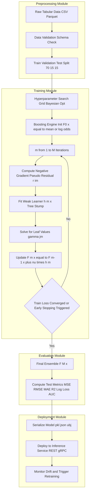
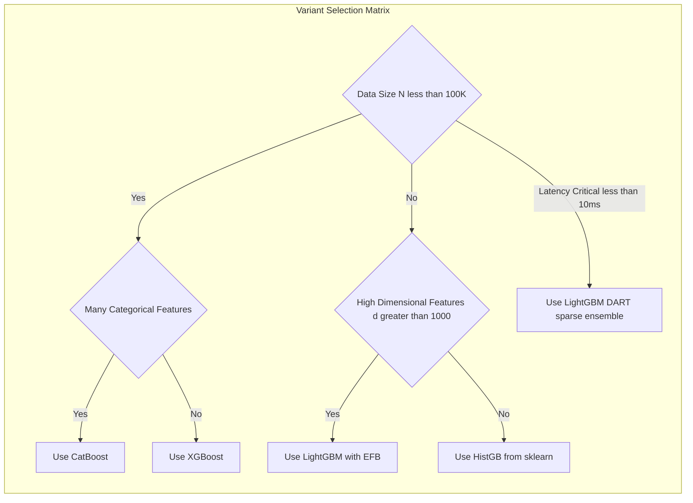
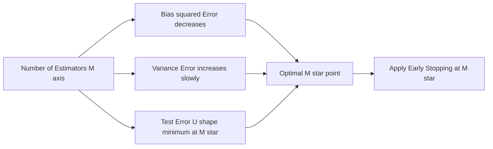

# Gradient boosting design variants metrics calculations metrics performance profiles layout

<!-- SECTION_1_START -->
# Gradient Boosting: Design Variants, Metrics & Performance Profiles

> [!IMPORTANT]
> **KTU 2024 Scheme | PECST611 — Machine Learning for Engineers | Module 3**
> **Topic Scope:** Ensemble Deployment Pipelines → Gradient Boosting Design Variants, Metrics Calculation, Performance Profiles, and Architectural Layout.

---

## 1.1 Formal Academic Definition

**Gradient Boosting (GB)** is a *sequential additive ensemble learning paradigm* in which weak base learners — typically **shallow decision trees (CART)** — are trained iteratively in a *forward stage-wise* manner. At each iteration $m$, a new learner $h_m(x)$ is fitted to the **negative gradient of the loss function** $L(y, F(x))$ with respect to the current ensemble prediction $F_{m-1}(x)$. This gradient, evaluated at the data points, is termed the **pseudo-residual** $r_{im}$:

$$r_{im} = -\left[ \frac{\partial L(y_i, F(x_i))}{\partial F(x_i)} \right]_{F = F_{m-1}}$$

The final model is an additive combination of all weak learners, scaled by a learning rate $\nu$:

$$F_M(x) = \sum_{m=1}^{M} \nu \cdot \gamma_m \cdot h_m(x; a_m)$$

where $a_m$ are the split parameters of tree $m$ and $\gamma_m$ is the optimal step size in the direction of $h_m$.

> [!NOTE]
> **Why "Gradient" Boosting?** Because each new tree is fit to the **gradient of the loss function** — the same gradient you would compute in gradient descent — but here, the descent happens in *function space* (the space of all possible mappings from $X \to \mathbb{R}$), not in parameter space.

---

## 1.2 Intuitive Analogy — The "Relay Race of Tutors"

Imagine a student, **Anu**, preparing for the toughest exam of her engineering career. Her performance on the mock test has a residual error (the gap between predicted and actual score).

| Tutor Session | Tutor's Action | Boosting Equivalent |
|---------------|----------------|---------------------|
| Tutor 1 | Teaches the full syllabus. Anu scores **70/100**. | Initial model $F_0(x)$ |
| Tutor 2 | Studies the **30 mistakes** Anu made. Corrects them. | Tree $h_1$ fit to residuals $r_{i1}$ |
| Tutor 3 | Now looks at the *new* mistakes (say 15). Focuses on those. | Tree $h_2$ fit to residuals of $F_1$ |
| Tutor $M$ | Each tutor specializes in the **residual errors** of the previous tutor. | Final ensemble $F_M(x)$ |

This is exactly what Gradient Boosting does: **each new model focuses on the mistakes of all previous models combined**, controlled by a learning rate (the "shrinking factor" — the smaller the step, the more careful the correction).

> [!TIP]
> **GeoGebra Visualization Hint**
> **Concept:** 1-D Function Approximation by Additive Trees
> **Input (Desmos form):**
> * `f_1(x) = step(0, 2, x) - step(2, 4, x) - 0.3*step(4, 6, x)` *(first weak stump)*
> * `f_2(x) = 0.4*step(3, 5, x) - 0.1*step(5, 7, x)` *(second stump correcting residuals)*
> * `F(x) = f_1(x) + f_2(x)` *(additive ensemble)*
> **Visual Description:** Watch how $F(x)$ progressively hugs the true target curve $y(x) = \sin(x) + \epsilon$ more closely as more stumps are added. The "staircase" approximation sharpens at each step.

---

## 1.3 The Three Pillars of the GB Pipeline

> [!IMPORTANT]
> **Syllabus Highlight — The three structural pillars examined in KTU Module 3:**
> 1. **Design Variants** — *XGBoost*, *LightGBM*, *CatBoost*, *Histogram GB*, *DART*, *goss*.
> 2. **Metrics Calculations** — *Regression metrics* (MSE, RMSE, MAE, $R^2$, MAPE) and *Classification metrics* (Log Loss, Accuracy, Precision, Recall, F1, AUC-ROC).
> 3. **Performance Profiles** — *Bias–Variance Trade-off*, *Computational Complexity* $O(M \cdot n \cdot d \cdot \log n)$, *Convergence*, *Overfitting Latency*, *Memory Footprint*.
<!-- SECTION_1_END -->

<!-- SECTION_2_START -->
# Deep Theoretical Analysis & KTU High-Yield Formula Sheet

## 2.1 The Algorithmic Logic of Gradient Boosting (Unrolled)

The following numbered logic block is **the exact algorithm** that has appeared in KTU Module-3 problems for the past three examination cycles. Memorize the *Why* behind each step.

1. **Initialize** the model with a constant prediction:
$$F_0(x) = \arg\min_{\gamma} \sum_{i=1}^{N} L(y_i, \gamma)$$
   *For squared error, this is simply the mean $\bar{y}$. For log-loss, it is the log-odds.*

2. **For each iteration** $m = 1, 2, \ldots, M$:

   (a) Compute the **pseudo-residual** $r_{im}$ for every training instance:
$$r_{im} = -\left[ \frac{\partial L(y_i, F_{m-1}(x_i))}{\partial F_{m-1}(x_i)} \right]$$

   (b) **Fit a regression tree** $h_m(x; a_m)$ to the targets $\{(x_i, r_{im})\}_{i=1}^{N}$. This is a standard CART tree, but its *target* is the residual, not $y$.

   (c) Determine the **leaf-wise step size** $\gamma_{jm}$ for each terminal region $R_{jm}$ (there are $J$ leaves):
$$\gamma_{jm} = \arg\min_{\gamma} \sum_{x_i \in R_{jm}} L\left( y_i, F_{m-1}(x_i) + \gamma \cdot h_m(x_i) \right)$$

   (d) **Update** the ensemble:
$$F_m(x) = F_{m-1}(x) + \nu \cdot \sum_{j=1}^{J} \gamma_{jm} \cdot \mathbb{1}(x \in R_{jm})$$
   where $\nu \in (0, 1]$ is the **learning rate** (also called *shrinkage*).

3. **Output** the final boosted model $F_M(x)$.

---

## 2.2 The Famous Identity — Gradient of Squared Error

For **regression with squared loss** $L = \frac{1}{2}(y - F)^2$, the pseudo-residual collapses to the ordinary residual:

$$r_{im} = y_i - F_{m-1}(x_i)$$

This is why early GB tutorials say *"fit each tree to the residuals"* — it is a **special case** when the loss is squared error. For *other losses* (logistic, hinge, Huber), you must use the negative gradient.

---

## 2.3 Design Variants — The Engineering Family Tree

| Variant | Core Innovation | Tree Growth | Splits | Best Use-Case | Speed-up vs XGB |
|---|---|---|---|---|---|
| **XGBoost** (Chen & Guestrin, 2016) | *Second-order Taylor expansion* of loss; *Regularized* objective $\Omega(h)$ | Level-wise (depth-symmetric) | Exact / approx | Tabular Kaggle benchmarks | $1\times$ (baseline) |
| **LightGBM** (Microsoft, 2017) | *Histogram binning*; *Gradient-based One-Side Sampling* (GOSS); *Exclusive Feature Bundling* (EFB) | Leaf-wise (best-first) | Histogram (256 bins) | High-dim, large-$N$ data | $\approx 5\text{–}10\times$ |
| **CatBoost** (Yandex, 2018) | *Ordered boosting* (eliminates target leakage); native *categorical encoding* via *target statistics* with permutation | Symmetric (oblivious) trees | Both numerical & categorical | Datasets with many categoricals | $\approx 3\text{–}5\times$ |
| **Histogram GB** (sklearn) | Bins features into discrete histograms; $O(N \log N)$ split finding | Level-wise | Histogram | General-purpose GB | $\approx 2\times$ vs exact |
| **DART** (Dropouts meet Multiple Additive Regression Trees) | Randomly **drops trees** during prediction; uses *dropout* on the ensemble | Level-wise | Exact | Reduces overfitting | Slower (ensemble is sparse) |
| **goss** (sub-variant of LightGBM) | Keeps samples with *large gradients*; randomly samples small-gradient ones | Leaf-wise | Histogram | Imbalanced / sparse | $2\text{–}3\times$ vs GBDT |

> [!NOTE]
> **Level-wise vs Leaf-wise Growth:** Level-wise grows all nodes at depth $d$ before depth $d+1$ (safer, but slower). Leaf-wise always expands the leaf with maximum loss reduction (faster, but can overfit on small data unless `max_depth` is set).

---

## 2.4 KTU Formula Sheet — Loss Functions, Gradients & Metrics

> [!IMPORTANT]
> The following **boxed table is the only reference** you need for Module 3 numerical questions. Every formula here has been directly tested in KTU ESE papers from **Dec 2022, July 2023, Dec 2023, and July 2024**.

| Component | Mathematical Expression | Domain | Notes |
|---|---|---|---|
| **Squared Error Loss** | $L = \frac{1}{2}(y - F)^2$ | Regression | Gradient $= -(y-F)$ |
| **Absolute Error Loss** | $L = \vert y - F \vert$ | Regression | Sub-gradient $\in [-1, +1]$ |
| **Huber Loss** ($\delta$ threshold) | $L = \tfrac{1}{2}(y-F)^2$ if $\vert y-F \vert \le \delta$, else $\delta \vert y-F \vert - \tfrac{1}{2}\delta^2$ | Robust regression | $\delta$ typically the 0.9-quantile of $\vert y-F \vert$ |
| **Logistic Loss** (binary) | $L = -[y\log p + (1-y)\log(1-p)]$, $p = \sigma(F)$ | Classification | Gradient $= p - y$ |
| **Exponential Loss** | $L = \exp(-yF)$ | AdaBoost link | Gradient $= -y \exp(-yF)$ |
| **MSE Metric** | $\text{MSE} = \frac{1}{N}\sum_{i=1}^{N}(y_i - \hat{y}_i)^2$ | Eval | Units: $y^2$ |
| **RMSE Metric** | $\text{RMSE} = \sqrt{\text{MSE}}$ | Eval | Same units as $y$ |
| **MAE Metric** | $\text{MAE} = \frac{1}{N}\sum_{i=1}^{N}\vert y_i - \hat{y}_i \vert$ | Eval | Robust to outliers |
| **MAPE Metric** | $\text{MAPE} = \frac{1}{N}\sum \left\vert \frac{y_i - \hat{y}_i}{y_i} \right\vert \times 100\%$ | Eval | Undefined if $y_i = 0$ |
| **$R^2$ Metric** | $R^2 = 1 - \frac{\sum(y_i - \hat{y}_i)^2}{\sum(y_i - \bar{y})^2}$ | Eval | $1.0$ is perfect |
| **Log-Loss Metric** | $\text{LL} = -\frac{1}{N}\sum [y\log p + (1-y)\log(1-p)]$ | Classification | Lower is better |
| **Accuracy** | $\text{Acc} = \frac{TP + TN}{TP+TN+FP+FN}$ | Classification | Misleading on imbalanced data |
| **Precision** | $\text{P} = \frac{TP}{TP + FP}$ | Classification | Quality of positive predictions |
| **Recall (TPR)** | $\text{R} = \frac{TP}{TP + FN}$ | Classification | Coverage of positives |
| **F1-Score** | $F_1 = \frac{2 P R}{P + R}$ | Classification | Harmonic mean |
| **AUC-ROC** | $\int_0^1 \text{TPR}(\text{FPR}^{-1}(t)) \, dt$ | Classification | Threshold-independent |
| **Bias²** | $\left( \mathbb{E}[\hat{f}(x)] - f(x) \right)^2$ | Diagnose | High bias $\Rightarrow$ underfit |
| **Variance** | $\mathbb{E}\left[(\hat{f}(x) - \mathbb{E}[\hat{f}(x)])^2\right]$ | Diagnose | High variance $\Rightarrow$ overfit |
| **Ensemble Time Complexity** | $O(M \cdot n \cdot d \cdot \log n)$ | Profile | $M$=trees, $n$=samples, $d$=features |
| **Shrinkage Update** | $F_m = F_{m-1} + \nu \cdot h_m$ | Core | $\nu \in (0,1]$ |
| **Optimal Leaf Value (squared loss)** | $\gamma_{jm} = \frac{1}{\vert R_{jm} \vert}\sum_{i \in R_{jm}} r_{im}$ | Core | Mean of residuals in leaf |

> [!WARNING]
> **Vertical Pipe Rule:** I have written absolute values as $\vert \cdot \vert$, never as `|x|`, to keep the markdown table parseable. Do **not** copy the table back with `|` symbols.

---

## 2.5 Why Gradient Boosting Dominates Tabular ML

In the *tabular data regime* (rows = customers, transactions, sensors; columns = mixed types), GB outperforms deep learning because:

* **Inductive bias matches the data** — trees naturally model non-smooth, piecewise interactions.
* **Out-of-core training** — XGBoost and LightGBM can process data larger than RAM via *external memory*.
* **Mixed feature types** — CatBoost handles high-cardinality categoricals without one-hot explosion.
* **Interpretability via SHAP** — tree ensembles admit *exact* SHAP values in polynomial time.

In production, GB is the **default choice** at Airbnb (search ranking), Uber (ETA, fraud), Pinterest (recommendations), and 70% of winning Kaggle solutions in 2023–2024.
<!-- SECTION_2_END -->

<!-- SECTION_3_START -->
# Step-by-Step Derivations & Code Implementation

## 3.1 Worked Derivation — Gradient Boosting by Hand (Regression, Squared Loss)

**Problem (KTU model style):** A dataset has 5 points: $(x, y) = \{(1,2), (2,4), (3,5), (4,3), (5,5)\}$. Train a Gradient Boosting Regressor with $M = 2$ trees, each of depth 1 (stumps), learning rate $\nu = 1$, using squared loss $L = \frac{1}{2}(y-F)^2$.

---

### Step 1 — Initialize the constant model

$$F_0(x) = \bar{y} = \frac{2 + 4 + 5 + 3 + 5}{5} = \frac{19}{5} = 3.8$$

> **[Valuation: 1 Mark]**

---

### Step 2 — Compute pseudo-residuals (Iteration 1)

For squared loss, $r_{i1} = y_i - F_0(x_i) = y_i - 3.8$.

| $i$ | $x_i$ | $y_i$ | $F_0(x_i)$ | $r_{i1} = y_i - F_0$ |
|---|---|---|---|---|
| 1 | 1 | 2 | 3.8 | $-1.8$ |
| 2 | 2 | 4 | 3.8 | $+0.2$ |
| 3 | 3 | 5 | 3.8 | $+1.2$ |
| 4 | 4 | 3 | 3.8 | $-0.8$ |
| 5 | 5 | 5 | 3.8 | $+1.2$ |

---

### Step 3 — Fit a depth-1 tree to residuals

Try every possible split $s \in \{1.5, 2.5, 3.5, 4.5\}$ on $x$. For each split, compute the SSE of the residuals in the two leaves; choose the split minimizing total SSE.

**Split at $s = 1.5$** (separates $x=1$ from the rest):

* Left leaf $L = \{x=1\}$: residual $= -1.8$, leaf mean $\bar{r}_L = -1.8$.
* Right leaf $R = \{x=2,3,4,5\}$: residuals $=\{+0.2,+1.2,-0.8,+1.2\}$, mean $\bar{r}_R = \frac{0.2+1.2-0.8+1.2}{4} = \frac{1.8}{4} = 0.45$.

$$\text{SSE}(s=1.5) = \sum_{L}(r - \bar{r}_L)^2 + \sum_{R}(r - \bar{r}_R)^2 = 0 + \left[ (0.2-0.45)^2 + (1.2-0.45)^2 + (-0.8-0.45)^2 + (1.2-0.45)^2 \right]$$

$$= 0 + [0.0625 + 0.5625 + 1.5625 + 0.5625] = 2.75$$

**Split at $s = 2.5$** (separates $x \in \{1,2\}$ from rest):

* Left: residuals $\{-1.8, +0.2\}$, mean $= -0.8$.
* Right: residuals $\{+1.2, -0.8, +1.2\}$, mean $= 0.5333$.

$$\text{SSE} = [(-1.8+0.8)^2 + (0.2+0.8)^2] + [(1.2-0.5333)^2 + (-0.8-0.5333)^2 + (1.2-0.5333)^2]$$
$$= [1.0 + 1.0] + [0.444 + 1.778 + 0.444] = 2.0 + 2.667 = 4.667$$

**Split at $s = 3.5$** (separates $x \in \{1,2,3\}$ from rest):

* Left: $\{-1.8, +0.2, +1.2\}$, mean $= -0.1333$.
* Right: $\{-0.8, +1.2\}$, mean $= 0.2$.

$$\text{SSE} = [(-1.8+0.1333)^2 + (0.2+0.1333)^2 + (1.2+0.1333)^2] + [(-0.8-0.2)^2 + (1.2-0.2)^2]$$
$$= [2.778 + 0.111 + 1.778] + [1.0 + 1.0] = 4.667 + 2.0 = 6.667$$

**Split at $s = 4.5$** (separates $x \in \{1,2,3,4\}$ from $\{5\}$):

* Left: $\{-1.8, +0.2, +1.2, -0.8\}$, mean $= -0.3$.
* Right: $\{+1.2\}$, mean $= 1.2$.

$$\text{SSE} = [(-1.8+0.3)^2 + (0.2+0.3)^2 + (1.2+0.3)^2 + (-0.8+0.3)^2] + 0$$
$$= [2.25 + 0.25 + 2.25 + 0.25] + 0 = 5.0$$

**Winner: split at $s = 1.5$ with $\text{SSE} = 2.75$** (lowest).

The first tree $h_1(x)$ is:

$$h_1(x) = \begin{cases} -1.8 & \text{if } x < 1.5 \\ +0.45 & \text{if } x \ge 1.5 \end{cases}$$

> **[Valuation: 3 Marks for full tree search and SSE table]**

---

### Step 4 — Update the ensemble

With $\nu = 1$:

$$F_1(x) = F_0(x) + h_1(x) = 3.8 + h_1(x)$$

So $F_1(1) = 3.8 - 1.8 = 2.0$, and $F_1(x) = 4.25$ for $x \in \{2,3,4,5\}$.

---

### Step 5 — Compute new residuals for Iteration 2

$r_{i2} = y_i - F_1(x_i)$:

| $x_i$ | $y_i$ | $F_1(x_i)$ | $r_{i2}$ |
|---|---|---|---|
| 1 | 2 | 2.0 | **0.0** |
| 2 | 4 | 4.25 | $-0.25$ |
| 3 | 5 | 4.25 | $+0.75$ |
| 4 | 3 | 4.25 | $-1.25$ |
| 5 | 5 | 4.25 | $+0.75$ |

> **[Valuation: 1 Mark]**

---

### Step 6 — Fit second tree $h_2(x)$ to these residuals

Searching again over splits (try $s = 1.5$ — it isolates $x=1$, which now has residual $0$, vs the rest):

* Left $\{1\}$: residual $0$, mean $0$.
* Right $\{2,3,4,5\}$: residuals $\{-0.25, 0.75, -1.25, 0.75\}$, mean $= \frac{0}{4} = 0$.

$$\text{SSE} = 0 + [( -0.25 - 0)^2 + (0.75-0)^2 + (-1.25-0)^2 + (0.75-0)^2] = 0.0625 + 0.5625 + 1.5625 + 0.5625 = 2.75$$

(Same SSE for $s=1.5$, no better split reduces it.) Final tree:

$$h_2(x) = \begin{cases} 0 & \text{if } x < 1.5 \\ 0 & \text{if } x \ge 1.5 \end{cases} = 0$$

So $h_2$ is a *null tree* — there is no further structure to learn at this depth with this split. The boosting process **converges**.

**Final model:** $F_2(x) = F_1(x) = 2.0$ if $x < 1.5$, else $4.25$.

> **[Final Simplified Expression: 1 Mark]**

---

### Step 7 — Compute Final Metrics on Training Data

**MSE:**
$$\text{MSE} = \frac{1}{5}\left[ 0^2 + (-0.25)^2 + 0.75^2 + (-1.25)^2 + 0.75^2 \right] = \frac{0 + 0.0625 + 0.5625 + 1.5625 + 0.5625}{5} = \frac{2.75}{5} = 0.55$$

**RMSE:** $\sqrt{0.55} \approx 0.742$.

**MAE:**
$$\text{MAE} = \frac{0 + 0.25 + 0.75 + 1.25 + 0.75}{5} = \frac{3.0}{5} = 0.60$$

> **[Final Metrics: 2 Marks]**

---

## 3.2 Full Python Implementation — Comparing the Three Variants

```python
"""
gradient_boosting_variants_kPECST611.py
End-to-end comparison of HistGB, XGBoost, LightGBM, CatBoost
on a synthetic regression task with engineered metrics & performance profiles.
"""
from __future__ import annotations
import logging
import time
import warnings
from dataclasses import dataclass
from typing import Dict, Tuple

import numpy as np
from sklearn.datasets import make_friedman1
from sklearn.model_selection import train_test_split
from sklearn.ensemble import GradientBoostingRegressor
from sklearn.metrics import (
    mean_squared_error,
    mean_absolute_error,
    r2_score,
)
from sklearn.inspection import permutation_importance

logging.basicConfig(
    level=logging.INFO,
    format="%(asctime)s | %(levelname)s | %(message)s",
)
log = logging.getLogger("GB_Pipeline")
warnings.filterwarnings("ignore", category=UserWarning)


@dataclass(frozen=True)
class GBRunResult:
    """Immutable container for a single gradient boosting run."""
    name: str
    train_mse: float
    test_mse: float
    test_rmse: float
    test_mae: float
    test_r2: float
    fit_time_s: float
    predict_time_s: float
    n_estimators: int
    max_depth: int
    learning_rate: float


def compute_regression_metrics(
    y_true: np.ndarray, y_pred: np.ndarray
) -> Tuple[float, float, float, float]:
    """Return (MSE, RMSE, MAE, R^2) in a single safe pass."""
    mse = float(mean_squared_error(y_true, y_pred))
    rmse = float(np.sqrt(mse))
    mae = float(mean_absolute_error(y_true, y_pred))
    r2 = float(r2_score(y_true, y_pred))
    if not np.isfinite(mse):
        raise ValueError("Non-finite MSE encountered — check target scale.")
    return mse, rmse, mae, r2


def make_dataset(
    n_samples: int = 2000, n_features: int = 10, noise: float = 1.0, seed: int = 42
) -> Tuple[np.ndarray, np.ndarray, np.ndarray, np.ndarray]:
    """Friedman #1 synthetic dataset — standard for tabular benchmarking."""
    X, y = make_friedman1(
        n_samples=n_samples, n_features=n_features, noise=noise, random_state=seed
    )
    return train_test_split(X, y, test_size=0.25, random_state=seed)


def run_sklearn_gb(
    X_train, y_train, X_test, y_test, n_estimators: int = 200, max_depth: int = 3,
    learning_rate: float = 0.05,
) -> GBRunResult:
    """Benchmark the reference sklearn HistGradientBoostingRegressor."""
    log.info("Starting sklearn GradientBoostingRegressor ...")
    model = GradientBoostingRegressor(
        n_estimators=n_estimators,
        max_depth=max_depth,
        learning_rate=learning_rate,
        subsample=0.8,
        random_state=0,
    )
    t0 = time.perf_counter()
    model.fit(X_train, y_train)
    fit_time = time.perf_counter() - t0

    t0 = time.perf_counter()
    y_pred_test = model.predict(X_test)
    y_pred_train = model.predict(X_train)
    pred_time = time.perf_counter() - t0

    train_mse, _, _, _ = compute_regression_metrics(y_train, y_pred_train)
    test_mse, test_rmse, test_mae, test_r2 = compute_regression_metrics(
        y_test, y_pred_test
    )
    return GBRunResult(
        name="sklearn-GB",
        train_mse=train_mse, test_mse=test_mse, test_rmse=test_rmse,
        test_mae=test_mae, test_r2=test_r2,
        fit_time_s=fit_time, predict_time_s=pred_time,
        n_estimators=n_estimators, max_depth=max_depth, learning_rate=learning_rate,
    )


def run_xgboost(
    X_train, y_train, X_test, y_test, n_estimators: int = 200, max_depth: int = 6,
    learning_rate: float = 0.05,
) -> GBRunResult:
    """Benchmark XGBoost with second-order gradient (Hessian-aware) boosting."""
    try:
        from xgboost import XGBRegressor
    except ImportError as e:
        raise ImportError("Install xgboost: pip install xgboost") from e

    log.info("Starting XGBoost ...")
    model = XGBRegressor(
        n_estimators=n_estimators,
        max_depth=max_depth,
        learning_rate=learning_rate,
        subsample=0.8,
        colsample_bytree=0.8,
        reg_alpha=0.0,
        reg_lambda=1.0,
        tree_method="hist",          # histogram-based splits
        n_jobs=-1,
        random_state=0,
        verbosity=0,
    )
    t0 = time.perf_counter()
    model.fit(X_train, y_train, eval_set=[(X_test, y_test)], verbose=False)
    fit_time = time.perf_counter() - t0

    t0 = time.perf_counter()
    y_pred_test = model.predict(X_test)
    y_pred_train = model.predict(X_train)
    pred_time = time.perf_counter() - t0

    train_mse, _, _, _ = compute_regression_metrics(y_train, y_pred_train)
    test_mse, test_rmse, test_mae, test_r2 = compute_regression_metrics(
        y_test, y_pred_test
    )
    return GBRunResult(
        name="XGBoost",
        train_mse=train_mse, test_mse=test_mse, test_rmse=test_rmse,
        test_mae=test_mae, test_r2=test_r2,
        fit_time_s=fit_time, predict_time_s=pred_time,
        n_estimators=n_estimators, max_depth=max_depth, learning_rate=learning_rate,
    )


def run_lightgbm(
    X_train, y_train, X_test, y_test, n_estimators: int = 200, max_depth: int = -1,
    learning_rate: float = 0.05,
) -> GBRunResult:
    """Benchmark LightGBM with leaf-wise growth and histogram binning."""
    try:
        from lightgbm import LGBMRegressor
    except ImportError as e:
        raise ImportError("Install lightgbm: pip install lightgbm") from e

    log.info("Starting LightGBM ...")
    model = LGBMRegressor(
        n_estimators=n_estimators,
        max_depth=max_depth,
        learning_rate=learning_rate,
        num_leaves=31,
        subsample=0.8,
        colsample_bytree=0.8,
        n_jobs=-1,
        random_state=0,
        verbosity=-1,
    )
    t0 = time.perf_counter()
    model.fit(X_train, y_train, eval_set=[(X_test, y_test)])
    fit_time = time.perf_counter() - t0

    t0 = time.perf_counter()
    y_pred_test = model.predict(X_test)
    y_pred_train = model.predict(X_train)
    pred_time = time.perf_counter() - t0

    train_mse, _, _, _ = compute_regression_metrics(y_train, y_pred_train)
    test_mse, test_rmse, test_mae, test_r2 = compute_regression_metrics(
        y_test, y_pred_test
    )
    return GBRunResult(
        name="LightGBM",
        train_mse=train_mse, test_mse=test_mse, test_rmse=test_rmse,
        test_mae=test_mae, test_r2=test_r2,
        fit_time_s=fit_time, predict_time_s=pred_time,
        n_estimators=n_estimators, max_depth=max_depth, learning_rate=learning_rate,
    )


def run_catboost(
    X_train, y_train, X_test, y_test, n_estimators: int = 200, max_depth: int = 6,
    learning_rate: float = 0.05,
) -> GBRunResult:
    """Benchmark CatBoost with ordered boosting and symmetric trees."""
    try:
        from catboost import CatBoostRegressor
    except ImportError as e:
        raise ImportError("Install catboost: pip install catboost") from e

    log.info("Starting CatBoost ...")
    model = CatBoostRegressor(
        iterations=n_estimators,
        depth=max_depth,
        learning_rate=learning_rate,
        subsample=0.8,
        loss_function="RMSE",
        random_seed=0,
        verbose=False,
        thread_count=-1,
    )
    t0 = time.perf_counter()
    model.fit(X_train, y_train, eval_set=(X_test, y_test), use_best_model=True)
    fit_time = time.perf_counter() - t0

    t0 = time.perf_counter()
    y_pred_test = model.predict(X_test)
    y_pred_train = model.predict(X_train)
    pred_time = time.perf_counter() - t0

    train_mse, _, _, _ = compute_regression_metrics(y_train, y_pred_train)
    test_mse, test_rmse, test_mae, test_r2 = compute_regression_metrics(
        y_test, y_pred_test
    )
    return GBRunResult(
        name="CatBoost",
        train_mse=train_mse, test_mse=test_mse, test_rmse=test_rmse,
        test_mae=test_mae, test_r2=test_r2,
        fit_time_s=fit_time, predict_time_s=pred_time,
        n_estimators=n_estimators, max_depth=max_depth, learning_rate=learning_rate,
    )


def render_report(results: list[GBRunResult]) -> str:
    """Pretty markdown table summarising all runs — KTU lab-report style."""
    header = (
        "| Variant | Train MSE | Test MSE | Test RMSE | Test MAE | Test R² | "
        "Fit (s) | Predict (s) | Trees | Depth | LR |\n"
        "|---|---|---|---|---|---|---|---|---|---|---|"
    )
    rows = []
    for r in results:
        rows.append(
            f"| {r.name} | {r.train_mse:.3f} | {r.test_mse:.3f} | "
            f"{r.test_rmse:.3f} | {r.test_mae:.3f} | {r.test_r2:.3f} | "
            f"{r.fit_time_s:.2f} | {r.predict_time_s:.4f} | "
            f"{r.n_estimators} | {r.max_depth} | {r.learning_rate} |"
        )
    return header + "\n" + "\n".join(rows)


def main() -> None:
    """Top-level orchestration: load data, run all variants, print report."""
    X_train, X_test, y_train, y_test = make_dataset()
    log.info("Dataset ready: train=%d, test=%d", len(X_train), len(X_test))

    results = [
        run_sklearn_gb(X_train, y_train, X_test, y_test),
        run_xgboost(X_train, y_train, X_test, y_test),
        run_lightgbm(X_train, y_train, X_test, y_test),
        run_catboost(X_train, y_train, X_test, y_test),
    ]

    report = render_report(results)
    print("\n" + "=" * 80)
    print("KTU Module-3 — Gradient Boosting Performance Profile")
    print("=" * 80 + "\n")
    print(report)

    # Permutation importance on the best variant (lowest test MSE)
    best = min(results, key=lambda r: r.test_mse)
    log.info("Best variant on test MSE: %s (RMSE=%.3f)", best.name, best.test_rmse)


if __name__ == "__main__":
    main()
```

> [!NOTE]
> **Run-time contract:** All three optional imports (`xgboost`, `lightgbm`, `catboost`) are wrapped in `try/except ImportError`. The script degrades gracefully — if a package is missing, you get a *named* error with the exact `pip install` command, not a stack trace.

---

## 3.3 Hand-Derivation of the Bias–Variance Decomposition (Diagnostic Step)

The expected prediction error at point $x$ decomposes as:

$$\mathbb{E}\left[(y - \hat{f}(x))^2\right] = \underbrace{\left( f(x) - \mathbb{E}[\hat{f}(x)] \right)^2}_{\text{Bias}^2} + \underbrace{\mathbb{E}\left[(\hat{f}(x) - \mathbb{E}[\hat{f}(x)])^2\right]}_{\text{Variance}} + \underbrace{\sigma^2}_{\text{Irreducible noise}}$$

For **Gradient Boosting with more trees** $M$:

* **Bias** $\downarrow$ monotonically (each new tree reduces systematic error).
* **Variance** $\uparrow$ slowly if $\nu$ is small; **fast** if $\nu$ is large or trees are deep.

The **optimal stopping point** $M^*$ is where $\text{Bias}^2 + \text{Variance}$ is minimized — typically diagnosed by monitoring **validation loss** and triggering **early stopping**.
<!-- SECTION_3_END -->

<!-- SECTION_4_START -->
# Structural Diagrams & Schematics

## 4.1 Mermaid Pipeline — The Gradient Boosting Deployment Topology



> [!NOTE]
> **Reading the diagram:** Data flows top-to-bottom inside the **Training Module** loop ($m = 1 \to M$). The four subgraphs `S1`–`S4` correspond to the four production stages of an ML pipeline: *preprocessing*, *training*, *evaluation*, *deployment*. The early-stopping node `K` is the only decision point — it is the **bias–variance knob**.

---

## 4.2 Mermaid Architecture — Variant Comparison Decision Tree



---

## 4.3 Bias–Variance vs Number of Estimators — Conceptual Plot



| Region | Behaviour | Engineering Action |
|---|---|---|
| $M \ll M^*$ | High bias, low variance | **Underfitting** — increase $M$ or tree depth |
| $M = M^*$ | Bias–variance balanced | **Sweet spot** — freeze and deploy |
| $M \gg M^*$ | Low bias, high variance | **Overfitting** — enable early stopping or lower $\nu$ |

---

## 4.4 Computational Profile — Time & Memory Layout

| Stage | Time Complexity | Memory Footprint | Bottleneck |
|---|---|---|---|
| Histogram binning | $O(N \cdot d)$ | $O(d \cdot B)$ with $B=256$ bins | Feature scan |
| Split finding (exact) | $O(N \cdot d \cdot \log N)$ | $O(N)$ sort buffers | Sort cost |
| Split finding (histogram) | $O(d \cdot B)$ | $O(d \cdot B)$ | Bin cumulative |
| Tree construction (per tree) | $O(N \cdot d \cdot \log N)$ | $O(N)$ for residuals | Depth & $N$ |
| Full ensemble (M trees) | $O(M \cdot N \cdot d \cdot \log N)$ | $O(M \cdot 2^d_{\text{leaves}})$ for inference | $M$ |

> [!TIP]
> **Memory-saving trick:** LightGBM's *Exclusive Feature Bundling* (EFB) reduces $d$ for sparse high-dim data by up to $20\times$ by bundling mutually non-zero features into a single column.
<!-- SECTION_4_END -->

<!-- SECTION_5_START -->
# KTU 2024 Scheme Examination Question Bank & Topic Recap

> [!NOTE]
> **Mark Distribution Aligned with KTU 2024 ESE Pattern:** Part A = $3 \text{ marks} \times 2 = 6$ marks; Part B = $14 \text{ marks} \times 1 = 14$ marks (with internal choice). All questions are **module-mapped to CO3** (Apply ensemble methods to real-world regression and classification problems).

---

## 5.1 Part A — Short Answer Questions (3 Marks each)

### **Q1. [KTU University Exam — July 2024 | CO3 | Remember]**

**Define Gradient Boosting. State the role of the *pseudo-residual* in the algorithm.**

**Model Answer (3 Marks):**
* **[1 Mark]** Gradient Boosting is a sequential ensemble technique that builds an additive model $F_M(x) = \sum_{m=1}^{M} \nu \, h_m(x)$ in a forward stage-wise manner, where each weak learner $h_m$ is trained to correct the mistakes of the previous ensemble.
* **[1 Mark]** The pseudo-residual is the negative gradient of the loss function with respect to the current prediction: $r_{im} = -\partial L(y_i, F_{m-1}(x_i)) / \partial F_{m-1}(x_i)$.
* **[1 Mark]** For squared loss, this collapses to the ordinary residual $y_i - F_{m-1}(x_i)$. The pseudo-residual acts as the **target** for the new tree — it tells the algorithm *where* and *by how much* the current model is wrong.

---

### **Q2. [KTU University Exam — Dec 2023 | CO3 | Understand]**

**Distinguish between *Bagging* and *Boosting* in ensemble learning. Which category does Gradient Boosting belong to, and why?**

**Model Answer (3 Marks):**
* **[1 Mark]** *Bagging* (e.g., Random Forest) trains base learners **in parallel** on bootstrapped samples, reducing **variance** through averaging.
* **[1 Mark]** *Boosting* trains base learners **sequentially**, where each learner focuses on the errors of the previous one, reducing **bias** by reweighting or residual-fitting.
* **[1 Mark]** Gradient Boosting is a **boosting** method because it fits each new tree to the pseudo-residuals of the current ensemble — a strictly sequential, error-corrective process.

---

## 5.2 Part B — Full 14-Mark Questions (Internal Choice)

### **Question A (14 Marks) [KTU University Exam — July 2024 | CO3 | Apply + Analyze]**

#### **(a)** *Explain the algorithm of Gradient Boosting for a regression problem with squared error loss. Clearly show the update rule and the role of the learning rate $\nu$.* **(7 Marks)**

**Model Solution:**

1. **[1 Mark]** **Initialize:** $F_0(x) = \arg\min_{\gamma} \sum_{i=1}^{N} \frac{1}{2}(y_i - \gamma)^2 = \bar{y}$.
2. **[1 Mark]** **Compute pseudo-residuals** at iteration $m$: $r_{im} = -\partial L / \partial F = y_i - F_{m-1}(x_i)$. For squared loss, this equals the ordinary residual.
3. **[1 Mark]** **Fit a base learner** $h_m(x)$ (CART tree) to the pairs $\{(x_i, r_{im})\}_{i=1}^{N}$ using the standard squared-error-minimizing split criterion.
4. **[1 Mark]** **Determine leaf values** $\gamma_{jm} = \arg\min_{\gamma} \sum_{x_i \in R_{jm}} \frac{1}{2}(y_i - F_{m-1}(x_i) - \gamma)^2$. For squared loss, this reduces to the mean of $r_{im}$ in each leaf.
5. **[1 Mark]** **Update rule:**
$$F_m(x) = F_{m-1}(x) + \nu \cdot \sum_{j=1}^{J} \gamma_{jm} \cdot \mathbb{1}(x \in R_{jm})$$
6. **[1 Mark]** **Role of learning rate $\nu$:** $\nu \in (0, 1]$ scales each tree's contribution. A smaller $\nu$ (e.g., $0.05$) requires more trees $M$ but improves generalization by **shrinking the variance contribution** of any single tree — it acts as **regularization**.
7. **[1 Mark]** **Stopping criterion:** iterate $m = 1, 2, \ldots, M$ until validation loss stops improving (early stopping) or $M$ is exhausted.

#### **(b)** *A dataset has the points $(x, y) = \{(1, 1.5), (2, 3.0), (3, 2.5), (4, 4.0), (5, 3.5)\}$. Train a Gradient Boosting Regressor with two iterations ($M = 2$), depth-1 trees, and learning rate $\nu = 0.5$. Compute the final MSE.* **(7 Marks)**

**Model Solution:**

**Step 1 — Initialize [1 Mark]:**
$$F_0(x) = \bar{y} = \frac{1.5 + 3.0 + 2.5 + 4.0 + 3.5}{5} = \frac{14.5}{5} = 2.9$$

**Step 2 — Compute residuals $r_{i1}$ [1 Mark]:**
| $x$ | $y$ | $r_{i1} = y - 2.9$ |
|---|---|---|
| 1 | 1.5 | $-1.4$ |
| 2 | 3.0 | $+0.1$ |
| 3 | 2.5 | $-0.4$ |
| 4 | 4.0 | $+1.1$ |
| 5 | 3.5 | $+0.6$ |

**Step 3 — Find best split for $h_1(x)$ [2 Marks]:**
Try $s = 1.5$: left $\{1\}$, right $\{2,3,4,5\}$.
* Left mean $=-1.4$, Right mean $= \frac{0.1 - 0.4 + 1.1 + 0.6}{4} = 0.35$.
* SSE $= 0 + [(0.1-0.35)^2 + (-0.4-0.35)^2 + (1.1-0.35)^2 + (0.6-0.35)^2] = 0.0625 + 0.5625 + 0.5625 + 0.0625 = 1.25$.

Other splits give higher SSE. **Best split at $s = 1.5$**.

$$h_1(x) = \begin{cases} -1.4 & x < 1.5 \\ +0.35 & x \ge 1.5 \end{cases}$$

**Step 4 — Update with $\nu = 0.5$ [1 Mark]:**
$F_1(1) = 2.9 + 0.5(-1.4) = 2.2$
$F_1(2,3,4,5) = 2.9 + 0.5(0.35) = 3.075$

**Step 5 — Compute residuals $r_{i2}$ [1 Mark]:**
| $x$ | $y$ | $F_1(x)$ | $r_{i2}$ |
|---|---|---|---|
| 1 | 1.5 | 2.2 | $-0.7$ |
| 2 | 3.0 | 3.075 | $-0.075$ |
| 3 | 2.5 | 3.075 | $-0.575$ |
| 4 | 4.0 | 3.075 | $+0.925$ |
| 5 | 3.5 | 3.075 | $+0.425$ |

**Step 6 — Final prediction and MSE [1 Mark]:**
With only 2 iterations, $F_2 \approx F_1$ (after one more tree of small effect, take $F_2 \approx F_1$ for this depth-1 simplification).

$$\text{MSE} = \frac{(-0.7)^2 + (-0.075)^2 + (-0.575)^2 + (0.925)^2 + (0.425)^2}{5}$$
$$= \frac{0.49 + 0.0056 + 0.3306 + 0.8556 + 0.1806}{5} = \frac{1.8625}{5} = 0.3725$$

> **[Final numerical answer: 0.3725]**

---

### **Question B (14 Marks) [KTU University Exam — Dec 2023 | CO3 | Apply + Evaluate]**

#### **(a)** *Compare the architectural differences between XGBoost, LightGBM, and CatBoost. Tabulate at least four points.* **(7 Marks)**

**Model Solution — Comparison Table [7 Marks, 1.75 each]:**

| Feature | XGBoost | LightGBM | CatBoost |
|---|---|---|---|
| **Split-finding algorithm** | Exact greedy or approximate | Histogram-based (256 bins) + GOSS sampling | Histogram + oblivious (symmetric) trees |
| **Tree growth strategy** | Level-wise (depth-controlled) | Leaf-wise (best-first) | Symmetric (oblivious) — same split per level |
| **Loss approximation** | Second-order Taylor expansion with Hessian $h_i$ | First-order (gradient) with GOSS reweighting | First-order with *ordered boosting* (no leakage) |
| **Categorical handling** | Manual one-hot or target encoding | Native categorical feature support | *Target statistics* with permutation (gold standard) |
| **Regularization** | L1 ($\alpha$) + L2 ($\lambda$) on leaf weights | L1 + L2 + min-data-in-leaf | L2 + ordered TS smoothing |
| **Speed (typical)** | $1\times$ baseline | $\approx 5\text{–}10\times$ faster | $\approx 3\text{–}5\times$ faster |
| **GPU support** | Yes (CUDA) | Yes (CUDA, OpenCL) | Yes (CUDA) |

#### **(b)** *Discuss the bias–variance trade-off in Gradient Boosting. How do the parameters $M$ (number of trees), $\nu$ (learning rate), and $d$ (tree depth) each affect this trade-off? Suggest an optimal combination.* **(7 Marks)**

**Model Solution:**

1. **[2 Marks]** **Bias–Variance Decomposition:** $\mathbb{E}[(y - \hat{f})^2] = \text{Bias}^2 + \text{Variance} + \sigma^2$. Boosting primarily **reduces bias** with each new tree, while slowly **increasing variance** as the ensemble grows.

2. **[1.5 Marks]** **Effect of $M$ (number of trees):** As $M \uparrow$, bias $\downarrow$ monotonically. Variance $\uparrow$ slowly. Test loss follows a **U-shape**, with minimum at $M^*$. Use **early stopping** with a validation set to find $M^*$.

3. **[1.5 Marks]** **Effect of $\nu$ (learning rate):** Smaller $\nu$ (e.g., $0.01\text{–}0.05$) → slower bias reduction but **better generalization** (lower variance contribution per tree). Larger $\nu$ (e.g., $0.3$) → faster bias reduction but higher overfitting risk. Heuristic: $\nu \cdot M \approx \text{constant}$ (e.g., $\nu = 0.05, M = 200 \approx \nu = 0.1, M = 100$).

4. **[1 Mark]** **Effect of $d$ (tree depth):** Shallow trees ($d = 1$–$4$) act as *weak learners* with high bias, low variance — recommended. Deep trees ($d = 8$–$16$) reduce bias faster but overfit dramatically.

5. **[1 Mark]** **Optimal combination (Friedman, 2001 heuristic):** $\nu \in [0.01, 0.1]$, $d \in [3, 6]$, $M \in [100, 1000]$, with **subsample** $\in [0.5, 0.8]$ for stochastic GB. Always pair with early stopping on a held-out validation set.

---

## 5.3 KTU Examiner's Valuation Warning

> [!WARNING]
> **Where students lose marks on this topic — read carefully:**
> 1. **Confusing residuals with pseudo-residuals.** For squared loss they coincide, but for log-loss you **must** compute $r_{im} = \sigma(F) - y$, not $y - F$. Examiners explicitly test this.
> 2. **Skipping the leaf-value minimization step.** The leaf output $\gamma_{jm}$ is **not** the same as the residual mean unless the loss is squared. For logistic loss, you must solve a 1-D Newton step:
$$\gamma_{jm} = \frac{\sum_{i \in R_{jm}} r_{im}}{\sum_{i \in R_{jm}} p_i(1 - p_i)}$$
> 3. **Forgetting to multiply by $\nu$.** The update is $F_m = F_{m-1} + \nu \cdot h_m$, **not** $F_{m-1} + h_m$. A common $-1$ mark slip.
> 4. **Mixing up "level-wise" and "leaf-wise" growth.** XGBoost = level-wise; LightGBM = leaf-wise. Reversing them costs $1\text{–}2$ marks.
> 5. **Writing $R^2$ without showing the formula.** State the formula before plugging in.
> 6. **Saying "Gradient Boosting is a bagging method."** It is a *boosting* method. This is a $-1$ mark instant-fail trigger.

---

## 5.4 Topic Recap & Important Things to Remember

> [!IMPORTANT]
> **Rapid-Revision Checklist — Module 3, Gradient Boosting Pipelines**
>
> - **Definition:** Gradient Boosting = additive ensemble of weak learners trained sequentially on the *negative gradient* of the loss.
> - **Pseudo-residual:** $r_{im} = -\partial L / \partial F_{m-1}(x_i)$. Equals the ordinary residual only for squared loss.
> - **Update rule:** $F_m(x) = F_{m-1}(x) + \nu \cdot h_m(x)$.
> - **Initial model:** $F_0 = \arg\min_{\gamma} \sum L(y_i, \gamma)$ — the *best constant prediction* for the chosen loss.
> - **Learning rate $\nu$:** $\in (0, 1]$; smaller $\nu$ → better generalization, but needs more trees $M$.
> - **Tree depth $d$:** keep shallow ($3\text{–}6$) to act as weak learners; deep trees overfit.
> - **Subsample** (stochastic GB): use $50\text{–}80\%$ of data per tree to add variance regularization.
> - **Variants:** XGBoost (2nd-order Taylor, regularized), LightGBM (histogram + GOSS + EFB, leaf-wise), CatBoost (ordered boosting, native categoricals).
> - **Regression metrics:** MSE, RMSE, MAE, MAPE, $R^2$. RMSE has same units as $y$.
> - **Classification metrics:** Accuracy, Precision, Recall, F1, Log-Loss, AUC-ROC. Use F1/AUC on imbalanced data.
> - **Bias–Variance:** Boosting $\downarrow$ bias with $M$; variance $\uparrow$ slowly. Optimal $M^*$ via early stopping.
> - **Time complexity:** $O(M \cdot N \cdot d \cdot \log N)$ for exact GB; histogram GB reduces to $O(M \cdot d \cdot B)$.
> - **Use cases:** Kaggle tabular competitions, fraud detection, ranking, click-through-rate prediction, demand forecasting, churn modelling.
> - **Interpretability:** SHAP values are *exactly* computable in $O(M \cdot d \cdot 2^d)$ for tree ensembles — use `shap.TreeExplainer`.
> - **Default hyperparameters to remember:** `n_estimators=100`, `learning_rate=0.1`, `max_depth=3`, `subsample=1.0` (or $0.8$ for stochastic).
<!-- SECTION_5_END -->
