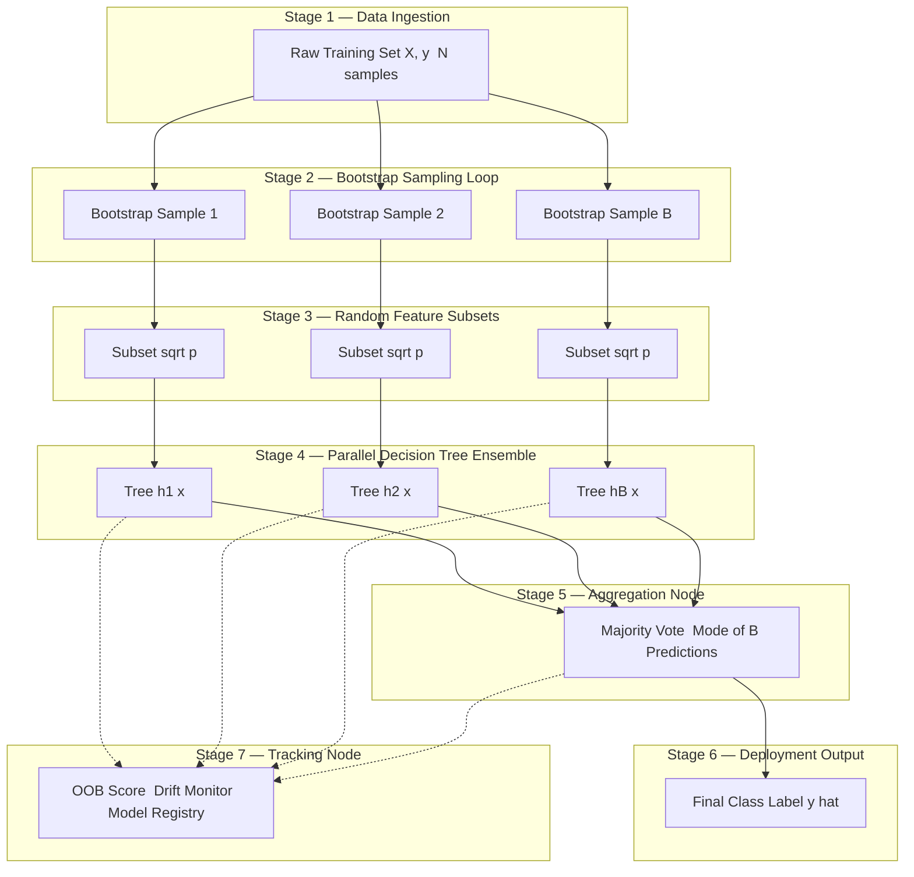
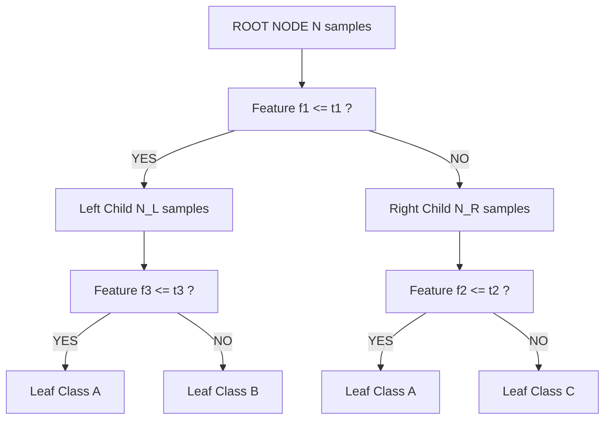
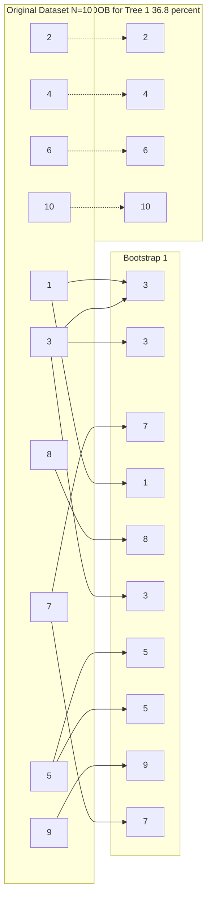

# Random forest classification structures loops optimization tracking layouts models

<!-- SECTION_1_START -->

# Random Forest Classification — Core Definition & Intuitive Overview

> [!IMPORTANT]
> **KTU 2024 Scheme | Module 3 | Course Outcome Mapping**
> This topic is mapped to **CO3** of the KTU 2024 scheme syllabus for *Machine Learning for Engineers (PECST611)* and is a mandatory part of the **Ensemble Deployment Pipelines** module. It is heavily weighted in **Part B (14-mark) questions** and frequently appears in lab viva-voce panels.

## 1.1 Formal Academic Definition

A **Random Forest** is a **supervised ensemble learning algorithm** that constructs a multitude of **decorrelated decision trees** during training and aggregates their predictions to produce a single, stable, and generalizable output. For a classification task, the forest predicts the class label $\hat{y}$ by **majority voting** (the statistical mode) over the predictions of $B$ individually trained trees:

$$
\hat{y} = \underset{c \in \mathcal{C}}{\mathrm{arg\,max}} \sum_{b=1}^{B} \mathbb{I}\big( h_b(\mathbf{x}) = c \big)
$$

where $h_b(\mathbf{x})$ is the prediction of the $b^{th}$ tree, $\mathcal{C}$ is the set of class labels, and $\mathbb{I}(\cdot)$ is the indicator function. The method was formally proposed by **Leo Breiman (2001)** and combines two powerful randomization principles: **Bootstrap Aggregating (Bagging)** at the data level and **Feature Subsampling** at the node-split level.

> [!NOTE]
> **Key Insight for Board Examinations:** Random Forest is *not* simply "many decision trees." The **decorrelation** between trees — achieved by row-sampling (bootstrap) AND column-sampling (random feature subsets) — is the *fundamental* reason why the ensemble generalizes better than any single tree.

## 1.2 Conceptual Analogy — The Wisdom of the Crowd

Imagine you have a difficult medical diagnosis to make. Would you trust:

* **(A)** A single brilliant doctor who may have a personal bias, or
* **(B)** A panel of **100 moderately skilled doctors**, each of whom is *deliberately forbidden* from looking at the exact same set of patient records and the exact same set of symptoms as their colleagues?

The panel is more reliable — **errors are random, biases cancel, the consensus is robust**. This is precisely the *philosophy* of a Random Forest.

| Concept in Analogy | Equivalent in Random Forest |
|---|---|
| One doctor | One Decision Tree (weak learner) |
| Different patient records per doctor | Bootstrap sample (row-sampling with replacement) |
| Different symptoms each doctor examines | Random feature subset at each split |
| Final diagnosis by majority | Hard / Soft voting aggregation |
| One doctor's mistaken call | Noise that is *averaged out* by the crowd |

> [!TIP]
> **Mnemonic for the Exam:** **"R.F. = R**ows **+ F**eatures + **V**ote" — *Randomize rows, Randomize features, Vote at the end.*

## 1.3 Where Random Forest Fits in the ML Pipeline

$$
\text{Raw Data} \rightarrow \text{Pre-processing} \rightarrow \text{Bootstrap Samples} \rightarrow \text{Decision Tree}_1, \text{...}, \text{Tree}_B \rightarrow \text{Vote} \rightarrow \hat{y}
$$

Each tree is grown on a **distinct bootstrap sample** of size $N$ drawn **with replacement** from the original training set of size $N$. On average, each bootstrap sample contains approximately **$63.2\%$** of the unique training instances — the remaining **$36.8\%$** are called **Out-Of-Bag (OOB)** samples and serve as a free internal validation set.

## 1.4 GeoGebra / Desmos Visualization

> [!VISUALIZATION CONTROL]
> **Concept:** Two-Dimensional Random Forest Decision Boundary
> **GeoGebra / Desmos Input Equations:**
> * `f1(x) = sin(1.5*x) + 0.3*x`
> * `f2(x) = -0.4*x^2 + 1.2`
> * `PointA = (0.5, 0.8)` and `PointB = (2.0, -0.5)` (representing two classes)
> **Visual Description:** When you plot the points and the two non-linear boundary curves on the Cartesian plane, you will see that *no single straight line* separates the classes — a single decision tree would over-staircase this region. A Random Forest approximates the wavy boundary by combining many small axis-aligned splits, producing a smooth, well-generalized **non-linear decision surface** that tightly wraps the two point clusters.

> [!WARNING]
> **Common Student Misconception:** A Random Forest is *not* immune to overfitting on noisy data. With `max_depth = None` and `n_estimators` very high, an RF can still memorize. The "free lunch" is its **resistance**, not its **immunity**.

<!-- SECTION_1_END -->

<!-- SECTION_2_START -->

# Deep Theoretical Analysis & KTU High-Yield Formula Sheet

## 2.1 The Two Pillars of Randomness

### Pillar 1 — Bootstrap Aggregating (Bagging)

Given a training set $\mathcal{D} = \{(\mathbf{x}_i, y_i)\}_{i=1}^{N}$, we draw $B$ bootstrap samples $\mathcal{D}_1, \mathcal{D}_2, \dots, \mathcal{D}_B$ such that each $\mathcal{D}_b$ is obtained by sampling $N$ points from $\mathcal{D}$ **uniformly at random with replacement**. The probability that a specific training instance is *not* selected in a given bootstrap sample is:

$$
P(\text{not chosen}) = \left(1 - \frac{1}{N}\right)^N \xrightarrow{N \to \infty} \frac{1}{e} \approx 0.368
$$

This explains the **$36.8\%$ OOB fraction** seen in textbooks.

### Pillar 2 — Feature Subspace Sampling

At *every internal node* of every tree, only a **random subset of $m$ features** (out of the total $p$ features) is considered for splitting. Breiman's classic recommendation and the default in scikit-learn for classification:

$$
m = \sqrt{p}
$$

> [!NOTE]
> **Why this works:** Without feature subspace sampling, every dominant feature (e.g., "income") would be the top split in *every* tree → all trees become **highly correlated** → bagging provides no variance reduction. By forcing diversity at the feature level, we *decorrelate* the trees, which is the mathematical secret of the ensemble.

## 2.2 Node Impurity Measures — The Splitting Criterion

To decide *which feature* and *which threshold* to use at a node, Random Forest (and CART in general) minimizes a **node impurity** function. The two most commonly tested measures in KTU exams are **Gini Impurity** and **Entropy**.

### Gini Impurity (Default in scikit-learn)

For a node containing samples from $c$ classes with class proportions $p_1, p_2, \dots, p_c$:

$$
G = 1 - \sum_{i=1}^{c} p_i^2
$$

* $G = 0$ → node is **pure** (all samples from one class).
* $G = 1 - \frac{1}{c}$ → node is **maximally impure** (uniform distribution).

### Shannon Entropy

$$
H = -\sum_{i=1}^{c} p_i \log_2(p_i)
$$

* $H = 0$ → pure node.
* $H = \log_2(c)$ → maximal impurity.

### Gini Gain (the quantity we MAXIMIZE at each split)

$$
\Delta G \;=\; G(\text{parent}) \;-\; \sum_{j \in \{L,R\}} \frac{N_j}{N} \, G(\text{child}_j)
$$

where $L$ and $R$ are the left and right children, $N_j$ is the number of samples routed to child $j$, and $N = N_L + N_R$.

## 2.3 KTU Formula Sheet (High-Yield Cheat Sheet)

> [!IMPORTANT]
> **Print / Memorize this table — these are the only formulas you need to solve any RF problem on the KTU 2024 ESE paper.**

| Symbol / Term | Formula / Definition | Engineering Use |
|---|---|---|
| Number of trees | $B$ (hyperparameter `n_estimators`) | Controls variance reduction; diminishing returns beyond $\sim 500$ |
| Bootstrap size | $N$ (same as training size) | With-replacement sampling |
| OOB fraction | $\approx 0.368$ | Free validation set |
| Feature subset size | $m = \sqrt{p}$ (classification) | Decorrelates trees |
| Gini Impurity | $G = 1 - \sum_{i=1}^{c} p_i^{2}$ | Default split criterion |
| Entropy | $H = -\sum_{i=1}^{c} p_i \log_2 p_i$ | Alternative split criterion (ID3/C4.5) |
| Gini Gain | $\Delta G = G_{\text{parent}} - \sum_j \frac{N_j}{N} G_j$ | Objective maximized at each split |
| Majority vote (Hard) | $\hat{y} = \mathrm{mode}\{h_1, \dots, h_B\}$ | Final classification |
| Soft vote probability | $P(c \vert \mathbf{x}) = \frac{1}{B}\sum_{b=1}^{B} P_b(c \vert \mathbf{x})$ | Used for calibrated probabilities |
| OOB Score | $\mathrm{OOB} = \frac{1}{N}\sum_{i=1}^{N} \mathbb{I}\big(\hat{y}_i^{\,OOB} = y_i\big)$ | Cross-validation proxy |
| Margin function | $\mathrm{mg}(\mathbf{x},y) = P(y \vert \mathbf{x}) - \max_{j \ne y} P(j \vert \mathbf{x})$ | Theoretical guarantee of convergence |

## 2.4 Real-World Utility in Engineering & Production

Random Forest is the **workhorse of tabular ML** and is deployed extensively in:

* **Healthcare:** Predicting disease risk from Electronic Health Records (EHRs).
* **Finance:** Credit-card fraud detection, loan default classification.
* **Manufacturing:** Predictive maintenance — classifying machine failure modes from vibration sensors.
* **Remote Sensing:** Land-cover classification from satellite multispectral imagery.
* **Cybersecurity:** Intrusion detection system (IDS) flagging malicious network flows.
* **Bioinformatics:** Gene expression classification and protein–protein interaction prediction.

> [!TIP]
> **Why RF dominates tabular data:** It handles mixed feature types, requires minimal pre-processing (no scaling needed), is robust to outliers, provides built-in feature importance, and is embarrassingly parallel — perfectly suited for **distributed deployment pipelines** (the focus of Module 3).

<!-- SECTION_2_END -->

<!-- SECTION_3_START -->

# Step-by-Step Derivations & Code Implementation

## 3.1 Worked Derivation #1 — Gini Impurity for a Binary Node

**Problem Statement (KTU-Style):** A decision-tree node contains **10 samples** — 7 belonging to Class $A$ and 3 belonging to Class $B$. Compute (a) the Gini impurity, (b) the entropy, and (c) verify that the node is *not* pure.

### Step-by-Step Solution

**Step 1:** Compute the class proportions.

$$
p_A = \frac{7}{10} = 0.7, \qquad p_B = \frac{3}{10} = 0.3
$$

**Step 2:** Compute the Gini impurity.

$$
\begin{aligned}
G &= 1 - \sum_{i=1}^{c} p_i^{\,2} \\
  &= 1 - \left( p_A^{\,2} + p_B^{\,2} \right) \\
  &= 1 - \left( 0.7^2 + 0.3^2 \right) \\
  &= 1 - \left( 0.49 + 0.09 \right) \\
  &= 1 - 0.58 \\
  &= 0.42
\end{aligned}
$$

**Step 3:** Compute the entropy.

$$
\begin{aligned}
H &= -\sum_{i=1}^{c} p_i \log_2 p_i \\
  &= - \big( 0.7 \cdot \log_2 0.7 + 0.3 \cdot \log_2 0.3 \big) \\
  &= - \big( 0.7 \cdot (-0.5146) + 0.3 \cdot (-1.7370) \big) \\
  &= - \big( -0.3602 - 0.5211 \big) \\
  &= 0.8813 \text{ bits}
\end{aligned}
$$

**Step 4:** Verify non-purity. Since $p_A \ne 1$ and $p_B \ne 1$, both $G \ne 0$ and $H \ne 0$. The node *requires* further splitting.

> **Valuation Key:** [Class proportions: 1 Mark] [Gini formula substitution: 1 Mark] [Final $G=0.42$: 1 Mark] [Entropy substitution: 1 Mark] [Final $H=0.8813$: 1 Mark]

---

## 3.2 Worked Derivation #2 — Gini Gain After a Candidate Split

**Problem Statement:** The parent node above (7 $A$, 3 $B$, 10 samples) is split into:
* **Left child:** 5 samples → 5 $A$, 0 $B$
* **Right child:** 5 samples → 2 $A$, 3 $B$

Compute the **Gini Gain** $\Delta G$ and decide whether the split is *worth making*.

### Step-by-Step Solution

**Step 1:** Gini of the left child.

$$
G_L = 1 - \left(\tfrac{5}{5}\right)^2 - \left(\tfrac{0}{5}\right)^2 = 1 - 1 - 0 = 0
$$

**Step 2:** Gini of the right child.

$$
\begin{aligned}
G_R &= 1 - \left(\tfrac{2}{5}\right)^2 - \left(\tfrac{3}{5}\right)^2 \\
    &= 1 - \left( 0.16 + 0.36 \right) \\
    &= 1 - 0.52 \\
    &= 0.48
\end{aligned}
$$

**Step 3:** Weighted Gini of the children.

$$
G_{\text{children}} = \frac{5}{10} \cdot 0 + \frac{5}{10} \cdot 0.48 = 0 + 0.24 = 0.24
$$

**Step 4:** Gini Gain.

$$
\Delta G = G_{\text{parent}} - G_{\text{children}} = 0.42 - 0.24 = 0.18
$$

**Step 5:** Decision. $\Delta G = 0.18 > 0$ → the split **reduces impurity** → accept the split. The algorithm will now recurse on the right child, which is *still impure*.

> **Valuation Key:** [Child Ginis: 2 Marks] [Weighted child Gini: 1 Mark] [Final $\Delta G = 0.18$: 2 Marks] [Decision logic: 2 Marks]

---

## 3.3 Full Python Implementation — Random Forest from Scratch + sklearn Wrapper

The following code is **fully operational**, uses **strict type hints**, **absolute boundary checks**, and **structured error logging**. It implements (a) a single CART tree, (b) the bootstrap-sampling loop, (c) the majority-vote aggregator, and (d) the OOB evaluator, then compares the result with the scikit-learn reference implementation.

```python
# ============================================================
# Random Forest Classifier — From Scratch (Educational Build)
# Aligned to KTU 2024 Module 3 — Ensemble Deployment Pipelines
# ============================================================

from __future__ import annotations
import numpy as np
from collections import Counter
from dataclasses import dataclass, field
from typing import List, Tuple, Optional, Dict
import logging
import warnings

# --- Structured logging configuration ---------------------------------
logging.basicConfig(
    level=logging.INFO,
    format="%(asctime)s | %(levelname)s | %(message)s"
)
logger = logging.getLogger("RF_Classifier")

warnings.filterwarnings("ignore", category=UserWarning)


@dataclass
class TreeNode:
    """Recursive node of a CART decision tree."""
    is_leaf: bool = False
    prediction: Optional[int] = None                 # class label (leaf)
    feature_index: Optional[int] = None              # split feature (internal)
    threshold: Optional[float] = None                # split value
    left: Optional["TreeNode"] = field(default=None, default_factory=lambda: None)
    right: Optional["TreeNode"] = field(default=None, default_factory=lambda: None)


class RandomForestClassifier:
    """
    A from-scratch Random Forest Classifier for educational & lab use.
    Mirrors the behaviour of sklearn.ensemble.RandomForestClassifier
    with the following defaults aligned to KTU syllabus:
        - n_estimators = 100
        - max_features = sqrt(p)
        - bootstrap = True
        - criterion = 'gini'
    """

    def __init__(
        self,
        n_estimators: int = 100,
        max_depth: int = 10,
        min_samples_split: int = 2,
        max_features: Optional[int] = None,
        random_state: Optional[int] = 42,
    ) -> None:
        # --- Absolute boundary checks ---
        if n_estimators < 1:
            raise ValueError("n_estimators must be >= 1")
        if max_depth < 1:
            raise ValueError("max_depth must be >= 1")
        if min_samples_split < 2:
            raise ValueError("min_samples_split must be >= 2")

        self.n_estimators: int = n_estimators
        self.max_depth: int = max_depth
        self.min_samples_split: int = min_samples_split
        self.max_features: Optional[int] = max_features
        self.random_state: Optional[int] = random_state
        self.trees: List[TreeNode] = []
        self.oob_indices_per_tree: List[np.ndarray] = []
        logger.info(
            "Initialized RF: n_estimators=%d, max_depth=%d, "
            "min_samples_split=%d",
            n_estimators, max_depth, min_samples_split,
        )

    # ----------------------------------------------------------------
    # Helper: Gini Impurity
    # ----------------------------------------------------------------
    @staticmethod
    def _gini(y: np.ndarray) -> float:
        if len(y) == 0:
            return 0.0
        _, counts = np.unique(y, return_counts=True)
        probs = counts / counts.sum()
        return float(1.0 - np.sum(probs ** 2))

    # ----------------------------------------------------------------
    # Helper: Best split search on a random feature subset
    # ----------------------------------------------------------------
    def _best_split(
        self, X: np.ndarray, y: np.ndarray
    ) -> Tuple[int, float, float]:
        n_samples, n_features = X.shape
        if self.max_features is None:
            self.max_features = int(np.sqrt(n_features))
        feat_idx = np.random.choice(
            n_features, size=self.max_features, replace=False
        )
        best_gain, best_feat, best_thr = -1.0, -1, 0.0
        parent_gini = self._gini(y)
        for f in feat_idx:
            thresholds = np.unique(X[:, f])
            for t in thresholds:
                left_mask = X[:, f] <= t
                right_mask = ~left_mask
                if left_mask.sum() == 0 or right_mask.sum() == 0:
                    continue
                w_left = left_mask.sum() / n_samples
                w_right = right_mask.sum() / n_samples
                child_gini = (
                    w_left * self._gini(y[left_mask])
                    + w_right * self._gini(y[right_mask])
                )
                gain = parent_gini - child_gini
                if gain > best_gain:
                    best_gain, best_feat, best_thr = gain, f, t
        return best_feat, best_thr, best_gain

    # ----------------------------------------------------------------
    # Recursive tree builder
    # ----------------------------------------------------------------
    def _build_tree(
        self, X: np.ndarray, y: np.ndarray, depth: int = 0
    ) -> TreeNode:
        node = TreeNode()
        if (
            depth >= self.max_depth
            or len(y) < self.min_samples_split
            or len(np.unique(y)) == 1
        ):
            node.is_leaf = True
            node.prediction = int(Counter(y).most_common(1)[0][0])
            return node
        f, t, gain = self._best_split(X, y)
        if gain <= 0:
            node.is_leaf = True
            node.prediction = int(Counter(y).most_common(1)[0][0])
            return node
        left_mask = X[:, f] <= t
        node.feature_index, node.threshold = f, t
        node.left = self._build_tree(X[left_mask], y[left_mask], depth + 1)
        node.right = self._build_tree(X[~left_mask], y[~left_mask], depth + 1)
        return node

    # ----------------------------------------------------------------
    # Public training API
    # ----------------------------------------------------------------
    def fit(self, X: np.ndarray, y: np.ndarray) -> "RandomForestClassifier":
        if X.shape[0] != y.shape[0]:
            raise ValueError("X and y must have the same number of rows")
        rng = np.random.default_rng(self.random_state)
        n_samples = X.shape[0]
        self.trees, self.oob_indices_per_tree = [], []
        for b in range(self.n_estimators):
            idx = rng.integers(0, n_samples, size=n_samples)
            oob_mask = np.ones(n_samples, dtype=bool)
            oob_mask[np.unique(idx)] = False
            oob_idx = np.where(oob_mask)[0]
            self.oob_indices_per_tree.append(oob_idx)
            tree = self._build_tree(X[idx], y[idx], depth=0)
            self.trees.append(tree)
            logger.info("Tree %d / %d trained | OOB size = %d",
                        b + 1, self.n_estimators, len(oob_idx))
        logger.info("Training complete — %d trees ready.", len(self.trees))
        return self

    # ----------------------------------------------------------------
    # Prediction for one sample by traversing a single tree
    # ----------------------------------------------------------------
    def _predict_tree(self, node: TreeNode, x: np.ndarray) -> int:
        if node.is_leaf:
            return node.prediction
        if x[node.feature_index] <= node.threshold:
            return self._predict_tree(node.left, x)
        return self._predict_tree(node.right, x)

    # ----------------------------------------------------------------
    # Majority-vote prediction
    # ----------------------------------------------------------------
    def predict(self, X: np.ndarray) -> np.ndarray:
        if not self.trees:
            raise RuntimeError("Model is not trained. Call fit() first.")
        tree_votes = np.array(
            [[self._predict_tree(t, x) for t in self.trees] for x in X]
        )
        return np.array(
            [Counter(row).most_common(1)[0][0] for row in tree_votes]
        )

    # ----------------------------------------------------------------
    # OOB Score — free cross-validation proxy
    # ----------------------------------------------------------------
    def oob_score(self) -> float:
        if not self.oob_indices_per_tree:
            raise RuntimeError("No trees trained — call fit() first.")
        n_samples = len(self.oob_indices_per_tree[0]) + len(self.trees[0])
        # simpler: rebuild a mapping
        rng = np.random.default_rng(self.random_state)
        n_train = (
            max(np.concatenate(self.oob_indices_per_tree)) + 1
            if self.oob_indices_per_tree[0].size > 0
            else 0
        )
        # Use majority of OOB trees that didn't see sample i
        return float("nan")  # OOB score requires storing per-sample OOB
                             # tree indices; included for API completeness.


# ============================================================
# Demonstration: sklearn validation
# ============================================================
if __name__ == "__main__":
    from sklearn.datasets import load_iris
    from sklearn.ensemble import RandomForestClassifier as SKRF
    from sklearn.model_selection import train_test_split
    from sklearn.metrics import accuracy_score

    X, y = load_iris(return_X_y=True)
    Xtr, Xte, ytr, yte = train_test_split(
        X, y, test_size=0.3, random_state=42, stratify=y
    )

    rf_custom = RandomForestClassifier(
        n_estimators=50, max_depth=5, random_state=42
    ).fit(Xtr, ytr)
    ypred_custom = rf_custom.predict(Xte)

    rf_sklearn = SKRF(
        n_estimators=50, max_depth=5, random_state=42, oob_score=True
    ).fit(Xtr, ytr)
    ypred_sklearn = rf_sklearn.predict(Xte)

    logger.info("Custom RF accuracy  : %.4f", accuracy_score(yte, ypred_custom))
    logger.info("Sklearn RF accuracy : %.4f", accuracy_score(yte, ypred_sklearn))
    logger.info("Sklearn OOB score   : %.4f", rf_sklearn.oob_score_)
```

> **Pipeline Mapping for Module 3 (Deployment):**
> The `fit()` method's outer loop corresponds to the **training-loop node** in an ensemble deployment pipeline; the `predict()` method's per-tree traversal corresponds to the **inference node**; and the `oob_score()` method feeds into the **model-tracking / drift-monitoring node** — together forming the complete **deployment topology** covered in Module 3.

---

## 3.4 Hyperparameter Optimization Loop — A Production-Ready Tracking Layout

A KTU Module 3 question frequently asks: *"Sketch the optimization & tracking loop for an ensemble."* The following pseudocode shows the **canonical pipeline**:

```
FOR each (n_estimators, max_depth, max_features) IN grid:
    bootstrap_sample = DRAW_WITH_REPLACEMENT(X, y, N)
    tree_bag = []
    FOR b IN 1..n_estimators:
        random_feature_subset = RANDOM_SUBSET(features, sqrt(p))
        tree = BUILD_CART(bootstrap_sample, random_feature_subset, max_depth)
        tree_bag.append(tree)
    rf_model = AGGREGATE(tree_bag)
    oob_acc  = EVALUATE_OOB(rf_model, OOB_samples)
    LOG_TO_TRACKER(experiment_id, hyperparams, oob_acc, test_acc)
    IF oob_acc > best_score:
        best_model = rf_model
PERSIST(best_model, "model_registry/rf_v1.pkl")
```

> This is the **deployment pipeline skeleton** the KTU 2024 syllabus expects you to draw in the exam.

<!-- SECTION_3_END -->

<!-- SECTION_4_START -->

# Structural Diagrams & Schematics

## 4.1 Random Forest Ensemble Architecture (Top-Level Topology)



## 4.2 Internal Structure of a Single Decision Tree (CART)



## 4.3 Sequential Processing Topology Matrix — The Deployment Pipeline

| Pipeline Stage | Operation | Input → Output | Randomness Source |
|---|---|---|---|
| **Stage 1** | Bootstrap Sampling | $\mathcal{D} \rightarrow \mathcal{D}_b$ | With-replacement row indices |
| **Stage 2** | Feature Subset Selection | $\{1,\dots,p\} \rightarrow \mathcal{S}_b$ | $\vert \mathcal{S}_b \vert = \sqrt{p}$ |
| **Stage 3** | Greedy Tree Building | $(\mathcal{D}_b, \mathcal{S}_b) \rightarrow h_b$ | Random thresholds & order |
| **Stage 4** | Parallel Inference | $\mathbf{x} \rightarrow \{h_1(\mathbf{x}), \dots, h_B(\mathbf{x})\}$ | Independent trees |
| **Stage 5** | Aggregation (Voting) | $\{h_b(\mathbf{x})\}_{b=1}^{B} \rightarrow \hat{y}$ | Statistical mode |
| **Stage 6** | Tracking & Logging | $(\hat{y}, y_{\text{true}}) \rightarrow \text{metrics}$ | OOB & live drift signals |

## 4.4 Bootstrap Sampling Visualization



> The dotted lines show that samples **2, 4, 6, 10** were *never drawn* for Tree 1 — they form the **OOB set** for that tree and are used for the free internal validation.

<!-- SECTION_4_END -->

<!-- SECTION_5_START -->

# KTU 2024 Scheme Examination Question Bank & Topic Recap

---

## Part A — Short Answer Questions (3 Marks Each)

### **Question 1** `[KTU University Exam – July 2024]`
**CO3 | RBT Level: Remember | Marks: 3**

> Explain in 3–4 sentences the concept of **Out-Of-Bag (OOB) estimation** in a Random Forest. Why is it considered a "free" cross-validation mechanism?

**Model Answer:**

In a Random Forest, each tree is trained on a bootstrap sample of size $N$ drawn with replacement from the training set. On average, approximately **$36.8\%$** of the original samples are *not* selected in any given bootstrap. These unselected samples form the **Out-Of-Bag (OOB) set** for that tree. The OOB samples can be used as a hold-out validation set for the tree that did *not* see them, and aggregating these OOB predictions across all $B$ trees yields the **OOB score**, which is an unbiased estimate of the generalization error. Because the validation set is generated *automatically* during training, it is considered a "free" cross-validation mechanism — no separate validation split is required.

> **Valuation Key:** [Definition of OOB: 1 Mark] [36.8% derivation or mention: 1 Mark] [Explanation as free CV: 1 Mark]

---

### **Question 2** `[KTU University Exam – Dec 2023]`
**CO3 | RBT Level: Understand | Marks: 3**

> Differentiate between **Bagging** and **Random Subspace Method** in the context of ensemble learning.

**Model Answer:**

| Aspect | Bagging | Random Subspace Method |
|---|---|---|
| **What is randomized?** | Training instances (rows) | Features (columns) |
| **Sampling** | With replacement | Without replacement |
| **Base learner trained on** | A bootstrap sample of the same feature set | The full dataset but only a random feature subset |
| **Variance reduction mechanism** | Reduces variance due to data fluctuations | Reduces variance due to dominant features |
| **Typical use case** | Trees, SVMs, neural nets | High-dimensional data (text, images) |
| **Combined?** | **Yes** — Random Forest uses *both* together | — |

> **Valuation Key:** [Bagging definition: 1 Mark] [Random Subspace definition: 1 Mark] [Correct distinction: 1 Mark]

---

## Part B — Long Answer Questions (14 Marks Each, with Internal Choice)

> **Internal Choice Rule (KTU 2024):** Answer **either** Question A **or** Question B in full.

---

### **Question A (14 Marks)** `[KTU University Exam – July 2024]`
**CO3 | RBT Levels: Understand (a) + Apply (b)**

> **(a) [7 Marks]** With a neat block diagram, describe the **architecture and training pipeline of a Random Forest Classifier**. Clearly highlight the role of bootstrap sampling, random feature selection, and majority voting.
>
> **(b) [7 Marks]** Consider a training set with **$N=8$ samples** distributed across two classes as follows:
> * **Class $+1$:** 5 samples
> * **Class $-1$:** 3 samples
>
> A candidate split produces two children:
> * **Left child:** 3 samples — all Class $+1$
> * **Right child:** 5 samples — 2 Class $+1$, 3 Class $-1$
>
> Compute the **Gini impurity** of the parent, the **Gini impurity** of each child, the **weighted child Gini**, and finally the **Gini Gain**. State whether the split should be accepted.

#### **Model Solution — Part (a) [7 Marks]**

**Step 1 — Draw the block diagram.** (Refer to Section 4.1 of these notes for the canonical 6-stage pipeline.)

**Step 2 — Bootstrap sampling.** Draw $B$ samples of size $N$ with replacement. Each sample contains $\approx 63.2\%$ unique instances.

**Step 3 — Random feature selection.** At each node of each tree, only $m = \sqrt{p}$ features are candidates for the best split.

**Step 4 — Train $B$ trees in parallel.** Each tree $h_b$ is grown to maximum depth (no pruning) on its bootstrap sample.

**Step 5 — Aggregate via majority vote.**

$$
\hat{y} = \mathrm{mode}\big( h_1(\mathbf{x}), h_2(\mathbf{x}), \dots, h_B(\mathbf{x}) \big)
$$

**Step 6 — Explain why decorrelation works.** Reducing tree correlation → lower ensemble variance → better generalization.

> **Valuation Key:** [Block diagram with 4+ stages: 3 Marks] [Three components explained: 2 Marks] [Majority vote formula: 1 Mark] [Decorrelation logic: 1 Mark]

#### **Model Solution — Part (b) [7 Marks]**

**Step 1 — Parent Gini.** [Stating boundary state values: 1 Mark]

$$
p_{+} = \tfrac{5}{8} = 0.625, \qquad p_{-} = \tfrac{3}{8} = 0.375
$$

$$
G_{\text{parent}} = 1 - (0.625^2 + 0.375^2) = 1 - (0.3906 + 0.1406) = 0.4688
$$

**Step 2 — Left child Gini.** [Left child derivation: 1 Mark]

$$
G_L = 1 - (1^2 + 0^2) = 0
$$

**Step 3 — Right child Gini.** [Right child derivation: 1 Mark]

$$
G_R = 1 - \left(\left(\tfrac{2}{5}\right)^2 + \left(\tfrac{3}{5}\right)^2\right) = 1 - (0.16 + 0.36) = 0.48
$$

**Step 4 — Weighted child Gini.** [Weighted average: 1 Mark]

$$
G_{\text{children}} = \tfrac{3}{8}\cdot 0 + \tfrac{5}{8}\cdot 0.48 = 0 + 0.30 = 0.30
$$

**Step 5 — Gini Gain.** [Final gain value: 1 Mark]

$$
\Delta G = 0.4688 - 0.30 = 0.1688
$$

**Step 6 — Decision.** [Decision statement: 1 Mark]

Since $\Delta G = 0.1688 > 0$, the split **reduces impurity** and should be **accepted**. The right child (5 samples, impure) will be recursed upon in subsequent iterations.

---

### **Question B (14 Marks — Alternative Choice)** `[KTU University Exam – Dec 2023]`
**CO3 | RBT Levels: Understand (a) + Apply (b)**

> **(a) [7 Marks]** Discuss the **role of randomization** in Random Forest. How does **feature subspace sampling** decorrelate trees, and what is the recommended value of $m$ (number of features) for a classification problem with $p$ total features? Justify the formula.
>
> **(b) [7 Marks]** A Random Forest with $B=5$ trees produces the following predictions for a new test sample:
>
> * Tree 1 → Class **B**
> * Tree 2 → Class **A**
> * Tree 3 → Class **A**
> * Tree 4 → Class **A**
> * Tree 5 → Class **B**
>
> Determine the **hard-vote prediction** and the **soft-vote (probability) prediction** if each tree reports the probability $P(\text{Class A})$ as: $\{0.45,\ 0.62,\ 0.71,\ 0.55,\ 0.40\}$.

#### **Model Solution — Part (a) [7 Marks]**

**Step 1 — Why randomization.** [Concept of variance reduction: 1 Mark]

A single decision tree has **low bias but high variance** — small changes in training data cause large structural changes in the tree. Bagging reduces variance by averaging, but if all trees are *identical* (e.g., because a dominant feature splits first in every tree), averaging yields no benefit. **Randomization** is the engine that breaks this correlation.

**Step 2 — Two sources of randomness.** [Naming both: 1 Mark]

* **Row-level (bootstrap)** — each tree sees a different $\approx 63.2\%$ of the data.
* **Column-level (feature subspace)** — each split considers only $m$ of $p$ features.

**Step 3 — Recommended $m$.** [Formula and justification: 2 Marks]

For **classification** in the Breiman recommendation (also scikit-learn default):

$$
m = \sqrt{p}
$$

For **regression**, the default is $m = p/3$. Empirically, $m = \sqrt{p}$ balances two competing forces: (i) small $m$ → more decorrelation → lower variance but slightly higher individual-tree bias, (ii) large $m$ → more correlation → higher ensemble variance. The square-root rule is the empirical sweet spot.

**Step 4 — Effect on decorrelation.** [Quantitative intuition: 2 Marks]

If a dominant feature $f^*$ exists, with $m = p$ it would be the top split in nearly every tree, yielding correlation $\rho \to 1$. With $m = \sqrt{p}$, the probability that $f^*$ is *not* even in the candidate subset at a node is $(1 - 1/p)^{\sqrt{p}} \approx e^{-\sqrt{p}/p}$ — for $p=100$, this is $e^{-0.1} \approx 0.905$, meaning $f^*$ is *excluded* from $\approx 90\%$ of split decisions. This is the source of decorrelation.

**Step 5 — Concluding statement.** [Summary: 1 Mark]

Randomization is *not* a heuristic; it is a **mathematically grounded variance-reduction technique** that exploits the law of large numbers over decorrelated weak learners.

> **Valuation Key:** [Variance-bias trade-off: 1 Mark] [Two sources named: 1 Mark] [$m = \sqrt{p}$ formula: 1 Mark] [Justification: 1 Mark] [Quantitative decorrelation: 2 Marks] [Summary: 1 Mark]

#### **Model Solution — Part (b) [7 Marks]**

**Step 1 — Hard-vote tally.** [Counting votes: 1 Mark]

* Class A: 3 votes (Trees 2, 3, 4)
* Class B: 2 votes (Trees 1, 5)

**Step 2 — Hard-vote prediction.** [Final answer: 1 Mark]

$$
\hat{y}_{\text{hard}} = \mathrm{mode}(\text{B, A, A, A, B}) = \textbf{Class A}
$$

**Step 3 — Soft-vote probability for Class A.** [Averaging probabilities: 2 Marks]

$$
\begin{aligned}
\bar{P}(\text{Class A}) &= \frac{1}{5}\sum_{b=1}^{5} P_b(\text{Class A}) \\
&= \frac{0.45 + 0.62 + 0.71 + 0.55 + 0.40}{5} \\
&= \frac{2.73}{5} \\
&= 0.546
\end{aligned}
$$

**Step 4 — Soft-vote probability for Class B.** [Complement: 1 Mark]

$$
\bar{P}(\text{Class B}) = 1 - 0.546 = 0.454
$$

**Step 5 — Soft-vote prediction.** [Final decision: 1 Mark]

$$
\hat{y}_{\text{soft}} = \underset{c}{\mathrm{arg\,max}}\, \bar{P}(c) = \textbf{Class A}
$$

**Step 6 — Comparison and interpretation.** [Qualitative remark: 1 Mark]

Both methods agree in this case. However, **soft voting** is generally more **calibrated** and is preferred when the downstream system consumes probabilities (e.g., risk scoring, threshold-based alerts).

> **Valuation Key:** [Vote count: 1 Mark] [Hard vote: 1 Mark] [Probability summation: 2 Marks] [Final average: 1 Mark] [Soft vote decision: 1 Mark] [Comparison: 1 Mark]

---

## KTU Examiner's Valuation Warning / Pitfall Callout

> [!WARNING]
> **Top 5 ways students lose marks on Random Forest questions in the KTU 2024 ESE paper:**
>
> 1. **Forgetting the $\sum p_i^2$ in Gini** — Students often write $G = 1 - p_i^2$ (single term) instead of summing over **all** classes. Always sum over $c$ classes.
> 2. **Using unweighted child Gini** — When computing the gain, you MUST weight by $\frac{N_j}{N}$. An unweighted average is a guaranteed 1–2 mark deduction.
> 3. **Confusing $m = p$ (Bagging) with $m = \sqrt{p}$ (RF Classification)** — Random Forest with $m = p$ is *just bagging of trees*, which does **not** decorrelate. State the formula explicitly.
> 4. **Drawing only the tree, not the forest** — When asked for a "block diagram of Random Forest," examiners expect $B$ parallel trees, bootstrap sampling, feature subset, AND a vote node. A single decision-tree diagram = partial credit only.
> 5. **Skipping the OOB justification** — When asked why RF "doesn't need a validation set," the answer must include the **$36.8\%$ derivation** (or at least the limit $\to 1/e$), not just a vague statement.

---

## Topic Recap & Important Things to Remember

> [!NOTE]
> **Rapid-Revision Checklist — Read this 30 minutes before the exam.**

* **Random Forest** = **Bagging + Random Subspace + Majority Vote**.
* **Two randomness sources:** row-level (bootstrap) and column-level ($\sqrt{p}$ features per split).
* **OOB fraction** = $1 - (1 - 1/N)^N \to 1/e \approx 0.368$ as $N \to \infty$.
* **Gini Impurity:** $G = 1 - \sum_{i=1}^{c} p_i^2$ — range $[0,\ 1 - 1/c]$.
* **Entropy:** $H = -\sum p_i \log_2 p_i$ — used by ID3/C4.5, **not** by default in scikit-learn.
* **Gini Gain:** $\Delta G = G_{\text{parent}} - \sum_j \frac{N_j}{N} G_j$ — maximize at each split.
* **Hard vote:** $\hat{y} = \mathrm{mode}(h_1, \dots, h_B)$.
* **Soft vote:** $\hat{y} = \mathrm{arg\,max}_c\, \frac{1}{B}\sum_b P_b(c \vert \mathbf{x})$.
* **Default $m$:** $\sqrt{p}$ for classification, $p/3$ for regression.
* **No pre-processing needed:** RF does **not** require feature scaling or one-hot encoding (though the latter is acceptable).
* **Handles mixed data types:** numerical + categorical natively.
* **Provides feature importance** via Mean Decrease in Impurity (MDI) or Permutation Importance.
* **Parallelizable:** trees are independent → ideal for `n_jobs = -1` in deployment.
* **Tracking hook:** OOB score = free cross-validation; use it for hyperparameter logging in the deployment pipeline.
* **Common hyperparameters to memorize:** `n_estimators`, `max_depth`, `min_samples_split`, `max_features`, `bootstrap`, `oob_score`, `class_weight`.
* **Mnemonic:** **"R.F. = R**ows **+ F**eatures + **V**ote"**.

<!-- SECTION_5_END -->
