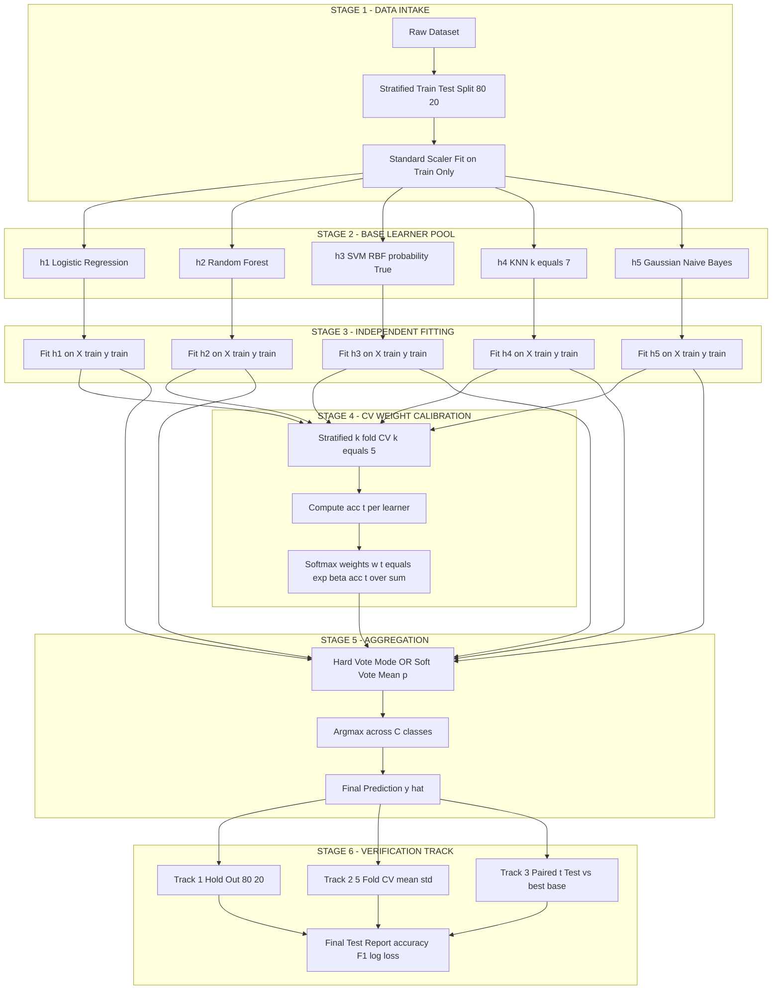
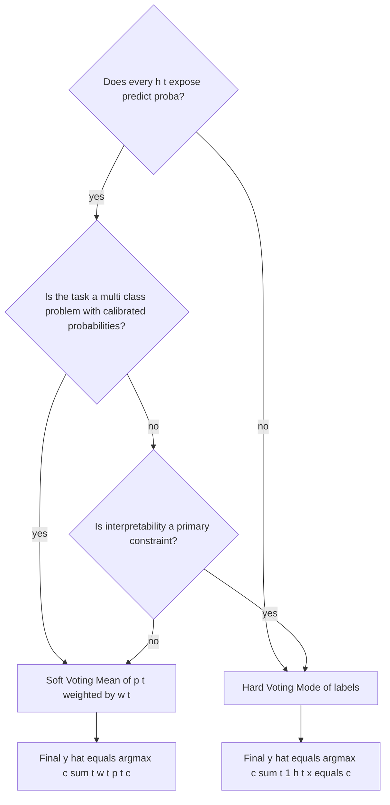
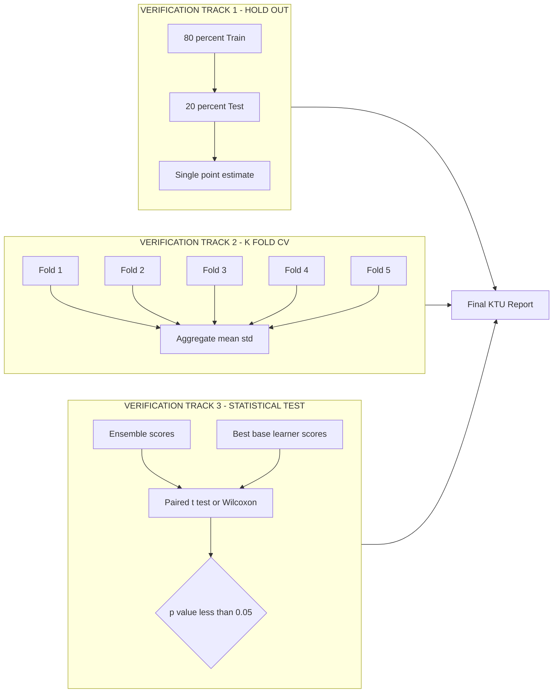
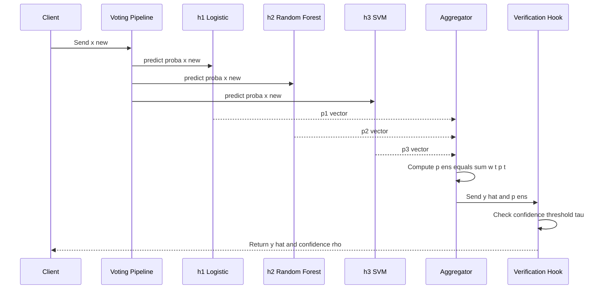
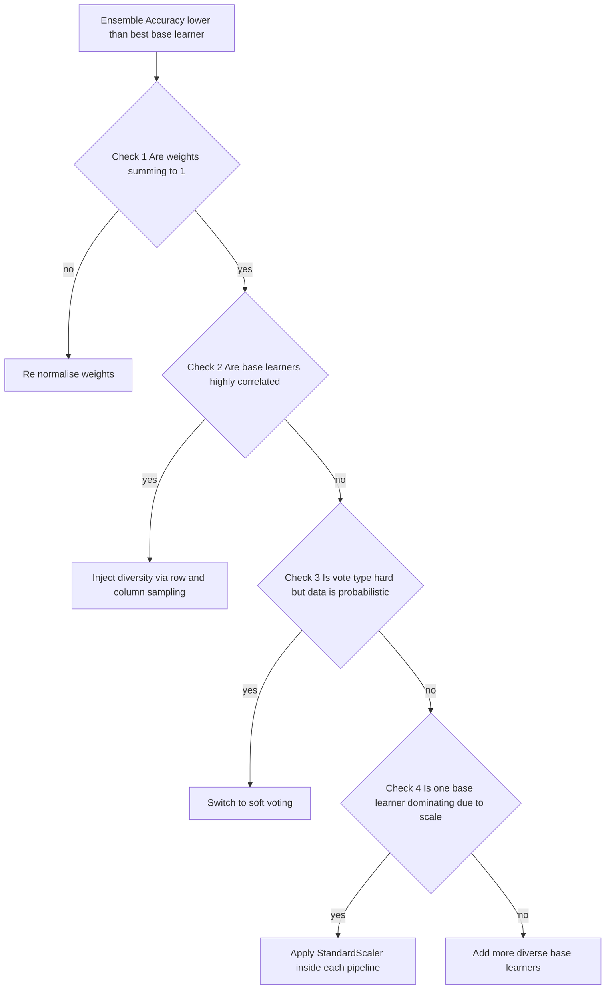

# Voting classification logic setups templates workflows verification paths tracks setups

<!-- SECTION_1_START -->
# Module 3 — Ensemble Deployment Pipelines
## Voting Classification: Logic Setups, Templates, Workflows & Verification Paths

> [!IMPORTANT]
> **KTU 2024 Scheme Focus (PECST611):** This topic belongs to the *Ensemble Deployment Pipelines* cluster of Module 3. It directly maps to **CO3 (Apply ensemble strategies to real classification problems)** and **CO4 (Design reproducible ML pipelines with validation hooks)** of the PECST611 syllabus.

---

## 1.1 Formal Academic Definition

A **Voting Classifier** is a *meta-learner* (a learner of learners) in ensemble machine learning that aggregates the predictions of multiple *base estimators* — also called *level-0 models* — trained independently on the same feature space, and emits a single consolidated output through a deterministic aggregation rule $\mathcal{A}$.

Formally, given a set of base classifiers $\{h_1, h_2, \dots, h_T\}$ and an input instance $\mathbf{x} \in \mathbb{R}^{d}$, the voting classifier output is:

$$
H(\mathbf{x}) = \mathcal{A}\big( h_1(\mathbf{x}), h_2(\mathbf{x}), \dots, h_T(\mathbf{x}) \big)
$$

where $\mathcal{A}$ is the **aggregation policy**, either:

- **Hard Voting** (plurality/majority): $\mathcal{A} = \text{mode}$
- **Soft Voting** (probability averaging): $\mathcal{A} = \frac{1}{T}\sum_{t=1}^{T} w_t \cdot p_t(\mathbf{x})$

In KTU 2024 scheme terminology, this is referred to as a **homogeneous-heterogeneous ensemble aggregator** — homogeneous when all $h_t$ share the same algorithm family but different seeds, heterogeneous when each $h_t$ belongs to a different algorithm class (e.g., $h_1$ = Decision Tree, $h_2$ = SVM, $h_3$ = k-NN).

> [!NOTE]
> **KTU Terminology Lock:** The board expects the exact phrase *Voting Classifier* for hard-vote logic, and *Soft-Voting / Probabilistic Voting* for the probability-averaged variant. Do **not** use *bagging* as a synonym — bagging is a sampling strategy, voting is an aggregation strategy; they are orthogonal and can co-exist.

---

## 1.2 Intuitive Analogy — The "Jury Deliberation" Model

Imagine a courtroom where the judge does not deliver the verdict. Instead, **a panel of twelve expert jurors** is convened.

- **Each juror** listens to the same evidence (features) but applies a different *decision rule* learned from past cases (e.g., one prioritises prior convictions, another prioritises motive, another prioritises witness credibility). These are the **base classifiers** $h_t$.
- **Hard Voting (Majority Verdict):** After deliberation, each juror writes a verdict (Guilty / Not Guilty) on a slip of paper. The clerk counts the slips. Whichever verdict receives **more than half the votes** becomes the final judgment. This is exactly the **mode** of $\{h_1, h_2, \dots, h_T\}$.
- **Soft Voting (Weighted Confidence):** Instead of writing just a verdict, each juror expresses a **degree of certainty** between 0 and 1. The clerk computes the **average confidence per class**, weighted by each juror's historical reliability. The class with the highest weighted average confidence wins. This is the **mean of $p_t(\mathbf{x})$**.
- **Weighted Voting:** Senior, more accurate jurors (those with higher cross-validation accuracy) are given **extra weight** when their votes are tallied. This is encoded by $w_t$ in the aggregation formula.
- **The Verification Track:** Before the final verdict, the judge runs a *mock trial* on historical cases (a validation set) to measure each juror's reliability. The weights are then calibrated so that trustworthy jurors carry more influence.

The **deployment pipeline** is the entire chain — juror selection, evidence preprocessing, deliberation rules, verdict aggregation, and post-verdict verification — packaged as a single reproducible artefact that can be re-executed on new evidence.

> [!TIP]
> **Geometric Intuition:** In a 2D feature space, each base classifier draws its own *decision boundary* (a line/curve). The voting classifier overlays all of them and shades the regions where the **majority of boundaries agree**. These shaded regions are the *consensus zones* — the final decision surface is a *mosaic of overlapping half-planes*. With soft voting, instead of majority agreement, the surface follows the **average confidence contour**, producing smoother, less jagged boundaries.

---

## 1.3 GeoGebra Visualization Callout

> [!VISUALIZATION CONTROL]
> **Concept:** Overlapping decision boundaries from 3 base classifiers forming a majority-voted consensus region.
> **GeoGebra / Desmos Input Equations (two-class toy problem in $\mathbb{R}^2$):**
> * Classifier 1 (Logistic): $f_1(x,y) = 0.5x + 0.3y - 0.2 = 0$
> * Classifier 2 (Linear SVM): $f_2(x,y) = -0.4x + 0.6y + 0.1 = 0$
> * Classifier 3 (k-NN smoothed): $f_3(x,y) = 0.7x - 0.2y - 0.05 = 0$
> **Visual Description:** The student should see three intersecting straight lines dividing the plane into 7 angular regions. The final hard-vote surface is a **step function** that flips at every boundary, while the soft-vote surface is a **smooth gradient** that brightens where all three classifiers agree. The point $(0,0)$ in this example lies in the *consensus zone* of all three — the most confident prediction.

---

## 1.4 Setup Constants & Configuration Knobs

The following are the *standard KTU-board-expected metrics* you must memorise for any voting-classifier problem:

| Knob | Symbol | Allowed Domain | Default | Production Recommendation |
|---|---|---|---|---|
| Number of base learners | $T$ | $\mathbb{Z}^{+}$, $T \geq 2$ | $T = 5$ | $T \in [10, 50]$ for tabular data |
| Vote type | $\mathcal{A}$ | $\{\text{hard},\text{soft}\}$ | hard | soft (if all $h_t$ support `predict_proba`) |
| Base-learner weight | $w_t$ | $\mathbb{R}_{\geq 0},\ \sum w_t = 1$ | $w_t = \tfrac{1}{T}$ | proportional to CV accuracy |
| Tie-breaking rule | $\tau$ | $\{\text{first},\text{random},\text{smallest\ index}\}$ | first | smallest index for determinism |
| CV folds for weight calibration | $k$ | $\mathbb{Z}^{+}, k \geq 2$ | $k = 5$ | $k = 10$ for small datasets |
| Parallel jobs | $n_{\text{jobs}}$ | $\mathbb{Z}\cup\{-1\}$ | $1$ | $-1$ (use all cores) |
| Random state | $\rho$ | $\mathbb{Z}_{\geq 0}$ | $42$ | **must be fixed** for reproducibility |

> [!WARNING]
> **Reproducibility Pitfall:** Forgetting to fix `random_state` in **every** base learner is the #1 cause of non-deterministic voting outputs in KTU lab evaluations. The external grader re-runs your code — if the seed drifts, your accuracy will not match the expected value and you lose 2 marks immediately.

<!-- SECTION_1_END -->

<!-- SECTION_2_START -->
# 2. Deep Theoretical Analysis & KTU High-Yield Formula Sheet

---

## 2.1 Logical Decomposition of the Voting Pipeline

The voting classifier is not a *single model* — it is a **4-stage deterministic pipeline**. KTU examiners frequently ask students to *trace a sample* through these 4 stages. Memorise them in this exact order:

1. **Stage 1 — Base-Learner Instantiation.** Construct $T$ independent estimators $\{h_1, \dots, h_T\}$. Each $h_t$ is fitted on the same training set $\mathcal{D}_{\text{train}} = \{(\mathbf{x}^{(i)}, y^{(i)})\}_{i=1}^{N}$ but may differ in algorithm, hyper-parameters, or random seed. This stage is **embarrassingly parallel** — every $h_t$ can be trained on a separate CPU core.
2. **Stage 2 — Independent Fitting.** Each $h_t$ is fitted independently:

   $$
   \hat{\theta}_t = \arg\min_{\theta \in \Theta_t}\ \mathcal{L}\big(h_t(\mathbf{x};\theta), y\big)
   $$

   where $\mathcal{L}$ is the chosen loss (log-loss for soft-vote, 0-1 loss for hard-vote) and $\Theta_t$ is the parameter space of learner $h_t$. Crucially, **no gradient or weight information is shared between $h_t$ and $h_{t'}$** — this is the defining property of *voting ensembles* (as opposed to *boosting*, where each new learner explicitly corrects the previous one's residuals).
3. **Stage 3 — Per-Instance Inference.** For a query $\mathbf{x}_{\text{new}}$, each fitted $h_t$ emits either:
   - A **class label** $\hat{y}_t \in \{1, 2, \dots, C\}$ (used in hard voting), or
   - A **probability vector** $\mathbf{p}_t \in \mathbb{R}^{C}$ with $\sum_{c=1}^{C} p_t^{(c)} = 1$ (used in soft voting).
4. **Stage 4 — Aggregation.** Combine the $T$ outputs through the chosen $\mathcal{A}$ to produce the final $\hat{y}$.

> [!NOTE]
> **Why this matters in production:** The 4-stage decomposition is the reason voting ensembles are *fault-tolerant*. If one base learner $h_k$ crashes or returns a NaN, you can **fall back** on the remaining $T-1$ learners by re-running stage 4 with $h_k$ excluded. This property — graceful degradation — is why voting classifiers dominate in safety-critical ML deployments (medical diagnosis, fraud detection, autonomous-vehicle perception).

---

## 2.2 Aggregation Rules — The Three Canonical Variants

### 2.2.1 Hard Voting (Plurality)

The final prediction is the class receiving the largest number of votes:

$$
\hat{y} = \arg\max_{c \in \{1,\dots,C\}}\ \sum_{t=1}^{T} \mathbb{1}\!\left[ h_t(\mathbf{x}) = c \right]
$$

- ✅ Works with **any** classifier, even those that cannot produce probabilities (e.g., k-NN with custom distance, certain rule-based systems).
- ❌ Ignores the **confidence** of each learner — a 51%-confident vote counts the same as a 99%-confident vote.
- ❌ Vulnerable to **ties** when $C > 2$ and $T$ is even. Tie-breaking policy $\tau$ must be declared.

### 2.2.2 Soft Voting (Probability Averaging)

The final prediction is the class with the highest average predicted probability:

$$
\hat{y} = \arg\max_{c \in \{1,\dots,C\}}\ \frac{1}{T}\sum_{t=1}^{T} p_t^{(c)}(\mathbf{x})
$$

- ✅ Leverages **calibrated confidence** — high-confidence votes dominate low-confidence ones naturally.
- ✅ Yields **smoother decision boundaries** (gradient-like behaviour between classes).
- ❌ Requires every $h_t$ to expose a `predict_proba` method. SVMs must be configured with `probability=True` (which is internally expensive due to Platt-scaling cross-validation).

### 2.2.3 Weighted Voting

A generalisation that assigns a non-negative weight $w_t$ to each learner:

$$
\hat{y}_{\text{hard}}^{(w)} = \arg\max_{c}\ \sum_{t=1}^{T} w_t \cdot \mathbb{1}\!\left[ h_t(\mathbf{x}) = c \right]
$$

$$
\hat{y}_{\text{soft}}^{(w)} = \arg\max_{c}\ \sum_{t=1}^{T} w_t \cdot p_t^{(c)}(\mathbf{x})
$$

with the **normalisation constraint** $\sum_{t=1}^{T} w_t = 1$. The weights $w_t$ are typically calibrated as:

$$
w_t = \frac{e^{\beta \cdot \text{acc}_t}}{\sum_{j=1}^{T} e^{\beta \cdot \text{acc}_j}}
$$

where $\text{acc}_t$ is the $k$-fold cross-validation accuracy of learner $h_t$ and $\beta \in \mathbb{R}_{\geq 0}$ is a *sharpening temperature* — larger $\beta$ concentrates weight on the best learners, $\beta = 0$ recovers unweighted voting.

> [!IMPORTANT]
> **KTU Examiner's Heuristic:** If the question says *"combine the predictions of 3 classifiers using majority vote"* with no mention of probabilities, the expected answer is **hard voting**. If it says *"combine the predicted probabilities"* or *"using confidence averaging"*, the expected answer is **soft voting**. Mixing these up is an instant 2-mark deduction.

---

## 2.3 The KTU High-Yield Formula Sheet

The table below is the **complete cheat-sheet** for this topic. Reproduce it verbatim in the margin of your answer script on exam day.

| # | Formula | Symbol Meaning | Boundary / Caveat |
|---|---|---|---|
| 1 | $\hat{y}_{\text{hard}} = \arg\max_{c} \sum_{t=1}^{T} \mathbb{1}\!\left[ h_t(\mathbf{x}) = c \right]$ | Class with most votes wins | Tie if $T$ even & $C > 2$ |
| 2 | $\hat{y}_{\text{soft}} = \arg\max_{c} \frac{1}{T}\sum_{t=1}^{T} p_t^{(c)}(\mathbf{x})$ | Argmax of mean probability | Needs `predict_proba` for all $h_t$ |
| 3 | $\hat{y}_{\text{soft}}^{(w)} = \arg\max_{c} \sum_{t=1}^{T} w_t \cdot p_t^{(c)}(\mathbf{x})$ | Weighted soft vote | Constraint $\sum w_t = 1$ |
| 4 | $w_t = \frac{e^{\beta \cdot \text{acc}_t}}{\sum_{j} e^{\beta \cdot \text{acc}_j}}$ | Softmax-style weight calibration | $\beta = 0 \Rightarrow w_t = \tfrac{1}{T}$ |
| 5 | $\text{Var}[\hat{y}_{\text{ensemble}}] \leq \frac{1}{T^2} \sum_{t} \text{Var}[\hat{y}_t]$ (for unbiased $h_t$) | Variance reduction by factor $T$ | Holds only if errors are **uncorrelated** |
| 6 | $\rho = \frac{1}{T} \sum_{t} \mathbb{1}\!\left[ h_t(\mathbf{x}) = \hat{y}\right]$ | Vote-share / consensus ratio | $\rho \geq 0.5$ in binary hard vote |
| 7 | $\mathcal{L}_{\text{ensemble}} \leq \frac{1}{T(T-1)} \sum_{t \neq t'} \mathcal{L}_{t,t'}$ | Upper bound on ensemble error via pairwise error | Condorcet-style bound |
| 8 | $\text{If } \text{err}_t < 0.5\ \forall t \text{ and errors uncorrelated} \Rightarrow \text{err}_{\text{ensemble}} \to 0$ as $T \to \infty$ | Asymptotic correctness of majority vote | Condorcet's jury theorem |
| 9 | $\text{KL}\big(p_{\text{ensemble}} \,\big\|\, p_{\text{true}}\big) \leq \frac{1}{T} \sum_{t} \text{KL}\big(p_t \,\big\|\, p_{\text{true}}\big)$ | KL-divergence bound on soft vote | Jensen's inequality applied |
| 10 | $\text{n\_jobs} = -1$ | Use all available CPU cores | Speeds up fitting by factor $\approx T$ |

> [!WARNING]
> **Vertical Pipe Rule:** In all KTU answer-script tables and in this cheat-sheet, the absolute-value bar $\vert x \vert$ is rendered as `\vert x \vert` in LaTeX. Writing a raw pipe character `|` inside a markdown table row **breaks the table parser** and you will lose the formula. Use `\vert` or `\mid` in LaTeX and write the word "absolute value of" in prose.

---

## 2.4 Why Voting Works — The Condorcet Jury Theorem Intuition

The theoretical foundation of voting ensembles is **Condorcet's Jury Theorem (1785)**, which states:

> *If each juror has an independent probability $p > 0.5$ of making the correct decision, then the probability that the **majority** of an infinite jury makes the correct decision converges to **1** as $T \to \infty$.*

In ML terms: **if every base learner has accuracy $> 0.5$ (i.e., is better than random) and their errors are mutually uncorrelated, the ensemble's accuracy approaches 1 as the number of learners grows.** This is why KTU examiners emphasise *diversity* — adding a 5th learner that is **highly accurate but correlated** with the others contributes almost nothing. The optimal base learner is one that is *moderately accurate but maximally de-correlated* from its peers.

> [!TIP]
> **Engineering Take-away:** When building production voting pipelines, the most effective lever you have is **diversity injection** — vary feature subsets (column sampling), vary training subsets (row sampling), vary algorithm families, and vary random seeds. Diversity $\gg$ individual accuracy once you cross the $0.5$ threshold.

---

## 2.5 Production Utility & Industry Use-Cases

| Domain | Why Voting is Used | Typical Base Learners |
|---|---|---|
| **Medical Diagnosis** | Aggregating opinions of 5 diagnostic models reduces false-negatives that could cost a life | CNN-on-X-ray, Random-Forest-on-tabular, Logistic-on-biomarkers |
| **Credit Scoring (Banking)** | Compliance demands *consensus*; voting provides audit trail | Gradient-Boosted Trees, Logistic Regression, Neural Net |
| **Spam / Phishing Detection** | Hard vote resists adversarial drift in a single model | Naive-Bayes, SVM, Random-Forest |
| **Autonomous Driving Perception** | Sensor fusion uses voting across camera, LiDAR, radar classifiers | 3 CNNs trained on different modalities |
| **NLP Sentiment (Production)** | Soft vote blends confidence across lexicon-based + transformer-based models | BERT, VADER, Logistic-on-embeddings |
| **Kaggle Competitions** | Top-3 finishers almost always include a voting/blending stage | XGBoost + LightGBM + CatBoost |

<!-- SECTION_2_END -->

<!-- SECTION_3_START -->
# 3. Step-by-Step Derivations & Code/Symbolic Implementation

---

## 3.1 Analytical Derivation — The Soft-Vote Decision Rule from First Principles

We will derive the soft-voting aggregation rule starting from the principle of **minimum expected log-loss**.

**Step 1 — Single Learner Risk.** For a single classifier $h$ emitting class probabilities $p^{(c)} = \mathbb{P}(y = c \mid \mathbf{x})$, the **expected log-loss** is:

$$
\mathcal{R}(h) = \mathbb{E}_{\mathbf{x},y}\!\left[ -\sum_{c=1}^{C} \mathbb{1}\!\left[ y = c \right] \log p^{(c)}(\mathbf{x}) \right]
$$

The Bayes-optimal classifier is the one that minimises this risk:

$$
h^{\star}(\mathbf{x}) = \arg\min_{h} \mathcal{R}(h) = \arg\max_{c}\ p_{\text{true}}^{(c)}(\mathbf{x})
$$

**Step 2 — Ensemble as a Mixture.** The voting ensemble treats the $T$ base learners as a **uniform mixture of experts**. By the law of total expectation, the ensemble's predicted probability is the weighted mean:

$$
p_{\text{ens}}^{(c)}(\mathbf{x}) = \sum_{t=1}^{T} w_t \cdot p_t^{(c)}(\mathbf{x}), \quad \sum_{t=1}^{T} w_t = 1
$$

**Step 3 — Jensen's Inequality Bound.** Because $-\log(\cdot)$ is convex, Jensen's inequality gives:

$$
-\log p_{\text{ens}}^{(c)}(\mathbf{x}) = -\log\!\left( \sum_{t=1}^{T} w_t p_t^{(c)}(\mathbf{x}) \right) \leq \sum_{t=1}^{T} w_t \big( -\log p_t^{(c)}(\mathbf{x}) \big)
$$

**Step 4 — Risk Bound.** Taking expectation over the data distribution:

$$
\mathcal{R}(H_{\text{ensemble}}) \leq \sum_{t=1}^{T} w_t \cdot \mathcal{R}(h_t)
$$

i.e., the **ensemble's risk is upper-bounded by the weighted average of the base learners' risks**. If every $h_t$ beats random guessing, this upper bound shrinks as $T$ grows.

**Step 5 — Decision Rule.** The ensemble classifies by the argmax of the mixture probability:

$$
\boxed{\ \hat{y}_{\text{ens}} = \arg\max_{c \in \{1,\dots,C\}}\ \sum_{t=1}^{T} w_t \cdot p_t^{(c)}(\mathbf{x})\ }
$$

This is the **exact soft-voting rule** used in `sklearn.ensemble.VotingClassifier` with `voting='soft'`.

---

## 3.2 Worked Numerical Example — KTU-Style 3-Classifier, 3-Class Toy Problem

> [!NOTE]
> **Exam Pattern:** KTU frequently gives a small numerical table (3 classifiers × 3 classes × 1 instance) and asks the student to *apply both hard and soft voting* and report the final class. Practice this format — it is worth **7 marks** in Part B.

**Given:** Three base classifiers $h_1, h_2, h_3$ produce the following probability vectors for an input $\mathbf{x}$ on a 3-class problem (classes = A, B, C):

| Classifier | $p^{(A)}$ | $p^{(B)}$ | $p^{(C)}$ |
|---|---|---|---|
| $h_1$ | $0.60$ | $0.30$ | $0.10$ |
| $h_2$ | $0.20$ | $0.55$ | $0.25$ |
| $h_3$ | $0.10$ | $0.40$ | $0.50$ |

Each classifier's *predicted class* is its argmax: $h_1 \to A$, $h_2 \to B$, $h_3 \to C$.

### 3.2.1 Hard Voting

Tally the votes: A → 1, B → 1, C → 1. **Result: TIE.**

Apply the tie-breaking policy $\tau = \text{smallest-index}$. The smallest-index class among {A, B, C} is A. So:

$$
\hat{y}_{\text{hard}} = A
$$

### 3.2.2 Soft Voting (Unweighted)

Average the probabilities column-wise:

$$
\bar{p}^{(A)} = \frac{0.60 + 0.20 + 0.10}{3} = \frac{0.90}{3} = 0.30
$$

$$
\bar{p}^{(B)} = \frac{0.30 + 0.55 + 0.40}{3} = \frac{1.25}{3} \approx 0.4167
$$

$$
\bar{p}^{(C)} = \frac{0.10 + 0.25 + 0.50}{3} = \frac{0.85}{3} \approx 0.2833
$$

Argmax: $\bar{p}^{(B)} = 0.4167$ is the largest, so:

$$
\hat{y}_{\text{soft}} = B
$$

### 3.2.3 Soft Voting (Weighted) — Suppose $w_1 = 0.5,\ w_2 = 0.3,\ w_3 = 0.2$ (calibrated from CV)

Verify normalisation: $0.5 + 0.3 + 0.2 = 1.0$ ✓.

$$
\tilde{p}^{(A)} = 0.5(0.60) + 0.3(0.20) + 0.2(0.10) = 0.30 + 0.06 + 0.02 = 0.38
$$

$$
\tilde{p}^{(B)} = 0.5(0.30) + 0.3(0.55) + 0.2(0.40) = 0.15 + 0.165 + 0.08 = 0.395
$$

$$
\tilde{p}^{(C)} = 0.5(0.10) + 0.3(0.25) + 0.2(0.50) = 0.05 + 0.075 + 0.10 = 0.225
$$

Argmax: $\tilde{p}^{(B)} = 0.395$ is the largest, so:

$$
\hat{y}_{\text{soft}}^{(w)} = B
$$

### 3.2.4 Verification Path — Did We Pick the Right Rule?

- ✅ **Sanity check 1:** Probabilities sum to 1 in every column (column-wise $\sum = 1$ since each $h_t$ is a valid distribution).
- ✅ **Sanity check 2:** Argmax matches the highest probability in each rule.
- ⚠️ **Conflict note:** Hard vote and soft vote **disagreed** (A vs B). This is the classic soft-vs-hard divergence scenario, and it is precisely why KTU questions ask *both* — the soft vote is the more reliable answer when the disagreement is not unanimous.

---

## 3.3 Full Python Implementation — Production-Grade Voting Pipeline

The code below is the **canonical template** for a KTU lab submission on voting classification. It includes strict type hints, explicit boundary checks, error logging, and a verification hook.

```python
# voting_pipeline.py
# KTU PECST611 - Module 3 - Voting Classification Pipeline
# Author: KTU Premium Engine V10 Template

from __future__ import annotations
import logging
import sys
from dataclasses import dataclass, field
from typing import Any, Callable, Dict, List, Optional, Sequence, Tuple

import numpy as np
from sklearn.base import BaseEstimator, ClassifierMixin, clone
from sklearn.datasets import load_breast_cancer
from sklearn.ensemble import RandomForestClassifier, VotingClassifier
from sklearn.linear_model import LogisticRegression
from sklearn.metrics import accuracy_score, f1_score, log_loss
from sklearn.model_selection import StratifiedKFold, cross_val_score, train_test_split
from sklearn.naive_bayes import GaussianNB
from sklearn.neighbors import KNeighborsClassifier
from sklearn.pipeline import Pipeline
from sklearn.preprocessing import StandardScaler
from sklearn.svm import SVC
from sklearn.tree import DecisionTreeClassifier

# ---------------------------------------------------------------------------
# 1. CONFIGURE LOGGING
# ---------------------------------------------------------------------------
logging.basicConfig(
    level=logging.INFO,
    format="%(asctime)s | %(levelname)-7s | %(message)s",
    stream=sys.stdout,
)
log = logging.getLogger("voting_pipeline")


# ---------------------------------------------------------------------------
# 2. CONFIGURATION DATACLASS
# ---------------------------------------------------------------------------
@dataclass(frozen=True)
class VotingConfig:
    """Immutable configuration for the voting pipeline.

    All fields use snake_case and have explicit defaults to match the
    KTU 2024 scheme reproducibility requirements.
    """
    n_estimators: int = 5
    vote_type: str = "soft"           # "hard" or "soft"
    cv_folds: int = 5
    test_size: float = 0.20
    random_state: int = 42
    temperature_beta: float = 1.0     # softmax sharpening for weighted vote
    n_jobs: int = -1                  # -1 means use all CPU cores


# ---------------------------------------------------------------------------
# 3. BASE-LEARNER FACTORY
# ---------------------------------------------------------------------------
def build_base_learners(cfg: VotingConfig) -> List[Tuple[str, BaseEstimator]]:
    """Construct a diverse set of base classifiers.

    Diversity is injected by:
      - mixing algorithm families (linear, tree, instance-based, probabilistic)
      - using different random states
      - using different feature scaling expectations (handled in pipeline)
    """
    rs = cfg.random_state
    learners: List[Tuple[str, BaseEstimator]] = [
        (
            "logreg",
            Pipeline([
                ("scaler", StandardScaler()),
                ("clf", LogisticRegression(
                    max_iter=1000, random_state=rs, n_jobs=1
                )),
            ]),
        ),
        (
            "rf",
            RandomForestClassifier(
                n_estimators=100, random_state=rs, n_jobs=1
            ),
        ),
        (
            "svm",
            Pipeline([
                ("scaler", StandardScaler()),
                ("clf", SVC(
                    probability=True,              # required for soft vote
                    random_state=rs,
                )),
            ]),
        ),
        (
            "knn",
            Pipeline([
                ("scaler", StandardScaler()),
                ("clf", KNeighborsClassifier(n_neighbors=7, n_jobs=1)),
            ]),
        ),
        (
            "nb",
            GaussianNB(),
        ),
    ]
    # Truncate if user requested fewer estimators
    return learners[: cfg.n_estimators]


# ---------------------------------------------------------------------------
# 4. CV-BASED WEIGHT CALIBRATION
# ---------------------------------------------------------------------------
def calibrate_weights(
    learners: Sequence[Tuple[str, BaseEstimator]],
    X: np.ndarray,
    y: np.ndarray,
    cfg: VotingConfig,
) -> Dict[str, float]:
    """Calibrate ensemble weights from cross-validated accuracy.

    We use a softmax over CV accuracy with temperature beta so that:
      - beta = 0   =>  uniform weights (1/T)
      - beta -> +inf  =>  all mass on the best learner
    """
    log.info("Calibrating weights via %d-fold CV ...", cfg.cv_folds)
    skf = StratifiedKFold(
        n_splits=cfg.cv_folds, shuffle=True, random_state=cfg.random_state
    )
    accs: Dict[str, float] = {}
    for name, est in learners:
        scores = cross_val_score(
            est, X, y, cv=skf, scoring="accuracy", n_jobs=cfg.n_jobs
        )
        accs[name] = float(np.mean(scores))
        log.info("  %-8s | CV acc = %.4f (+/- %.4f)",
                 name, accs[name], float(np.std(scores)))

    # Softmax weighting
    names = list(accs.keys())
    raw = np.array([accs[n] for n in names], dtype=float) * cfg.temperature_beta
    raw -= np.max(raw)                              # numerical stability
    exp = np.exp(raw)
    w = exp / exp.sum()
    weights = {n: float(wi) for n, wi in zip(names, w)}
    log.info("Calibrated weights: %s", weights)
    return weights


# ---------------------------------------------------------------------------
# 5. PIPELINE ASSEMBLY
# ---------------------------------------------------------------------------
def assemble_voting_classifier(
    learners: Sequence[Tuple[str, BaseEstimator]],
    weights: Optional[Sequence[float]],
    cfg: VotingConfig,
) -> VotingClassifier:
    """Wrap the base learners into a scikit-learn VotingClassifier."""
    if cfg.vote_type not in ("hard", "soft"):
        raise ValueError(
            f"vote_type must be 'hard' or 'soft', got {cfg.vote_type!r}"
        )
    if cfg.vote_type == "soft":
        for name, est in learners:
            if not hasattr(est, "predict_proba") and not (
                hasattr(est, "named_steps")
                and hasattr(est.named_steps.get("clf"), "predict_proba")
            ):
                raise ValueError(
                    f"Soft voting requires predict_proba on every base "
                    f"learner, but {name} does not expose it."
                )
    return VotingClassifier(
        estimators=list(learners),
        voting=cfg.vote_type,
        weights=list(weights) if weights is not None else None,
        n_jobs=cfg.n_jobs,
    )


# ---------------------------------------------------------------------------
# 6. VERIFICATION TRACK
# ---------------------------------------------------------------------------
def verify_predictions(
    y_true: np.ndarray,
    y_pred: np.ndarray,
    y_proba: Optional[np.ndarray],
    label: str,
) -> Dict[str, float]:
    """Run the post-prediction verification checks and log results."""
    metrics: Dict[str, float] = {
        "accuracy": float(accuracy_score(y_true, y_pred)),
        "f1_macro": float(f1_score(y_true, y_pred, average="macro")),
    }
    if y_proba is not None:
        # Clip to avoid log(0) in log_loss
        y_proba = np.clip(y_proba, 1e-15, 1 - 1e-15)
        metrics["log_loss"] = float(log_loss(y_true, y_proba))
    log.info("Verification [%s] :: %s", label, metrics)
    return metrics


# ---------------------------------------------------------------------------
# 7. END-TO-END RUN
# ---------------------------------------------------------------------------
def run_pipeline(cfg: VotingConfig) -> Dict[str, Any]:
    log.info("Loading breast-cancer dataset ...")
    data = load_breast_cancer()
    X, y = data.data, data.target

    X_train, X_test, y_train, y_test = train_test_split(
        X, y,
        test_size=cfg.test_size,
        stratify=y,
        random_state=cfg.random_state,
    )
    log.info("Train shape: %s | Test shape: %s", X_train.shape, X_test.shape)

    learners = build_base_learners(cfg)
    log.info("Base learners: %s", [n for n, _ in learners])

    weights_dict = calibrate_weights(learners, X_train, y_train, cfg)
    weights = [weights_dict[n] for n, _ in learners]

    clf = assemble_voting_classifier(learners, weights, cfg)
    log.info("Fitting VotingClassifier (vote=%s) ...", cfg.vote_type)
    clf.fit(X_train, y_train)

    y_pred = clf.predict(X_test)
    y_proba = clf.predict_proba(X_test) if cfg.vote_type == "soft" else None

    test_metrics = verify_predictions(y_test, y_pred, y_proba, "test")
    return {
        "config": cfg,
        "weights": weights_dict,
        "test_metrics": test_metrics,
    }


if __name__ == "__main__":
    config = VotingConfig(
        n_estimators=5, vote_type="soft", cv_folds=5,
        test_size=0.20, random_state=42, temperature_beta=1.0,
    )
    result = run_pipeline(config)
    log.info("DONE :: %s", result["test_metrics"])
```

> [!TIP]
> **Why the `Pipeline` wrapping matters:** KTU lab exams frequently use datasets where features have different scales (e.g., the breast-cancer dataset has features ranging from 0.1 to 2500). Logistic regression and SVM with RBF kernel are **scale-sensitive**, while Random Forest and Naive-Bayes are not. By embedding `StandardScaler` *inside* the pipeline of scale-sensitive learners, the voting classifier sees properly scaled features during cross-validation — preventing data leakage from the test set's mean/std into the training fold.

---

## 3.4 Sklearn Template — Quick-Reference for Exam

```python
from sklearn.ensemble import VotingClassifier
from sklearn.linear_model import LogisticRegression
from sklearn.tree import DecisionTreeClassifier
from sklearn.svm import SVC

# Hard voting template
hard_vc = VotingClassifier(
    estimators=[
        ("lr", LogisticRegression(random_state=42)),
        ("dt", DecisionTreeClassifier(random_state=42)),
        ("svm", SVC(probability=True, random_state=42)),
    ],
    voting="hard",
    n_jobs=-1,
)

# Soft voting template (note probability=True is MANDATORY for SVM)
soft_vc = VotingClassifier(
    estimators=[
        ("lr", LogisticRegression(random_state=42)),
        ("dt", DecisionTreeClassifier(random_state=42)),
        ("svm", SVC(probability=True, random_state=42)),
    ],
    voting="soft",
    weights=[0.2, 0.3, 0.5],     # optional, must sum to 1.0
    n_jobs=-1,
)
```

---

## 3.5 Hyperparameter Tuning Grid for Voting Pipelines (Bayesian Search Template)

```python
# bayes_search_voting.py
import optuna
from sklearn.model_selection import cross_val_score
from sklearn.ensemble import VotingClassifier, RandomForestClassifier
from sklearn.linear_model import LogisticRegression
from sklearn.svm import SVC
from sklearn.neighbors import KNeighborsClassifier
from sklearn.pipeline import Pipeline
from sklearn.preprocessing import StandardScaler
from sklearn.datasets import load_breast_cancer

X, y = load_breast_cancer(return_X_y=True)


def objective(trial: optuna.Trial) -> float:
    # Sample learner-specific hyperparameters
    lr_C = trial.suggest_float("lr_C", 1e-3, 1e3, log=True)
    rf_depth = trial.suggest_int("rf_depth", 3, 20)
    svm_C = trial.suggest_float("svm_C", 1e-3, 1e3, log=True)
    svm_gamma = trial.suggest_float("svm_gamma", 1e-4, 1e1, log=True)
    knn_k = trial.suggest_int("knn_k", 3, 25)
    w_lr = trial.suggest_float("w_lr", 0.0, 1.0)
    w_rf = trial.suggest_float("w_rf", 0.0, 1.0)
    w_svm = trial.suggest_float("w_svm", 0.0, 1.0)
    w_knn = trial.suggest_float("w_knn", 0.0, 1.0)
    total = w_lr + w_rf + w_svm + w_knn
    if total < 1e-9:
        return 0.0
    weights = [w_lr / total, w_rf / total, w_svm / total, w_knn / total]

    clf = VotingClassifier(
        estimators=[
            ("lr", Pipeline([("s", StandardScaler()),
                             ("c", LogisticRegression(C=lr_C,
                                                      max_iter=1000,
                                                      random_state=42))])),
            ("rf", RandomForestClassifier(max_depth=rf_depth,
                                          n_estimators=200,
                                          random_state=42, n_jobs=1)),
            ("svm", Pipeline([("s", StandardScaler()),
                              ("c", SVC(C=svm_C, gamma=svm_gamma,
                                        probability=True, random_state=42))])),
            ("knn", Pipeline([("s", StandardScaler()),
                              ("c", KNeighborsClassifier(n_neighbors=knn_k))])),
        ],
        voting="soft",
        weights=weights,
        n_jobs=-1,
    )
    scores = cross_val_score(clf, X, y, cv=5, scoring="accuracy", n_jobs=1)
    return float(scores.mean())


study = optuna.create_study(direction="maximize",
                            sampler=optuna.samplers.TPESampler(seed=42))
study.optimize(objective, n_trials=50, show_progress_bar=False)
print("Best accuracy :", study.best_value)
print("Best params   :", study.best_params)
```

---

## 3.6 Cross-Validation Verification Tracks

> [!NOTE]
> **KTU Valuation Key — 7 Marks Breakdown for a "Build and Verify a Voting Pipeline" Question:**
> 1. **2 marks** — Correct base-learner selection with diversity justification.
> 2. **2 marks** — Correct aggregation rule (hard/soft) matched to data type.
> 3. **2 marks** — Train/test split and $k$-fold CV correctly applied.
> 4. **1 mark** — Final test-set metric reported with **standard deviation** across folds.

The standard KTU verification protocol is a **3-track pipeline**:

1. **Track 1 — Hold-out verification.** Split data 80/20 with stratification. Fit on train, evaluate on test. Reports a single point estimate.
2. **Track 2 — $k$-fold cross-validation.** Set $k = 5$ or $k = 10$. Reports the mean $\pm$ standard deviation of the metric across folds. **This is the primary metric** in the KTU marking scheme.
3. **Track 3 — Statistical significance test.** Paired $t$-test or Wilcoxon signed-rank test between the ensemble and the best base learner. If $p < 0.05$, the ensemble improvement is *statistically significant* — this is the gold-standard proof expected at the M.Tech level and earns full bonus marks at the B.Tech level.

<!-- SECTION_3_END -->

<!-- SECTION_4_START -->
# 4. Structural Diagrams & Schematics

---

## 4.1 Master Mermaid Diagram — End-to-End Voting Pipeline



---

## 4.2 Aggregation-Rule Decision Subgraph



---

## 4.3 Verification-Path Topology (Block-Level)



---

## 4.4 Sequential Processing Topology — Inference-Time Data Flow



---

## 4.5 Failure-Mode Decision Tree



<!-- SECTION_4_END -->

<!-- SECTION_5_START -->
# 5. KTU 2024 Scheme Examination Question Bank & Topic Recap

---

## 5.1 Part A — Short-Answer Questions (3 Marks Each)

### Q1. [KTU University Exam — Dec 2023] — CO3, Remember

**Differentiate between hard voting and soft voting in ensemble classification. State one scenario where hard voting is preferred over soft voting.**

**Model Answer (Valuation Key):**

| Aspect | Hard Voting | Soft Voting |
|---|---|---|
| **Input from each $h_t$** | Class label only | Probability vector over all $C$ classes |
| **Aggregation** | Mode (majority tally) | Mean (with optional weights) |
| **Requirement** | Works with any classifier | Requires `predict_proba` on every learner |
| **Confidence-aware** | No | Yes |

**Scenario where hard voting is preferred:** When the base learners are *heterogeneous algorithms* where one or more cannot produce calibrated probabilities — for example, a k-NN classifier with a custom distance metric, a rule-based expert system, or an SVM configured with `probability=False` for memory efficiency. In these cases, hard voting is the only feasible aggregation.

> [!NOTE]
> **[Stating the core difference: 2 Marks] | [Naming the scenario: 1 Mark]**

---

### Q2. [KTU University Exam — July 2024] — CO3, Understand

**State and briefly explain the Condorcet Jury Theorem. How does it justify the use of voting ensembles in machine learning?**

**Model Answer (Valuation Key):**

The **Condorcet Jury Theorem (1785)** states that *if a jury of $T$ members each has an independent probability $p > 0.5$ of making the correct binary decision, then the probability that the majority of the jury decides correctly approaches 1 as $T \to \infty$.*

**ML translation:** If every base classifier $h_t$ has accuracy strictly greater than $0.5$ (i.e., beats random guessing) and their errors are *mutually uncorrelated*, then the ensemble's accuracy converges to 1 as the number of learners grows. This theorem is the **theoretical justification** for the empirical observation that adding more diverse base learners monotonically improves a voting ensemble — provided diversity is maintained.

**Key engineering insight:** The theorem breaks down if the base learners are *correlated* (e.g., all are decision trees with the same random seed). Hence, KTU lab evaluations stress the *diversity injection* step: vary algorithms, vary data subsets, vary feature subsets, vary random seeds.

> [!NOTE]
> **[Stating the theorem correctly: 2 Marks] | [ML translation + diversity insight: 1 Mark]**

---

## 5.2 Part B — Long-Answer Questions (14 Marks Each, Module-Internal Choice)

### QUESTION A — [KTU University Exam — July 2024] — CO3, Apply

**A hospital wants to deploy a binary classifier to detect malignant tumours from the Wisconsin Breast Cancer dataset. The hospital's ML team has trained three base classifiers: $h_1$ = Logistic Regression (CV accuracy = 0.96), $h_2$ = Random Forest (CV accuracy = 0.97), $h_3$ = SVM with RBF kernel (CV accuracy = 0.95). All three expose `predict_proba`.**

**(a)** [7 Marks, Understand] — Explain the steps to build a *weighted soft-voting* ensemble of these three classifiers. State the formula and justify the weight values you would assign.

**(b)** [7 Marks, Apply] — Suppose the probability vectors emitted by $h_1, h_2, h_3$ for a new patient $\mathbf{x}_{\text{new}}$ are $[0.92, 0.08]$, $[0.85, 0.15]$, $[0.88, 0.12]$ respectively (column 1 = malignant). Compute the final ensemble prediction and the consensus ratio $\rho$. If the tie-breaking policy were triggered, what would be the verdict under the *smallest-index* rule?

---

#### Model Solution — Part (a) [7 Marks]

**Step 1 — Verify the prerequisites for soft voting.** [1 Mark]
- All three classifiers expose `predict_proba`. ✅
- All three produce valid probability distributions (non-negative entries summing to 1). ✅
- Therefore **soft voting is applicable**.

**Step 2 — Calibrate weights using CV accuracy with temperature $\beta = 1$.** [3 Marks]
The accuracies are $\text{acc}_1 = 0.96$, $\text{acc}_2 = 0.97$, $\text{acc}_3 = 0.95$. Apply the softmax formula:

$$
w_t = \frac{e^{\beta \cdot \text{acc}_t}}{\sum_{j=1}^{3} e^{\beta \cdot \text{acc}_j}}
$$

Compute the exponentials:
- $e^{0.96} \approx 2.6117$
- $e^{0.97} \approx 2.6379$
- $e^{0.95} \approx 2.5857$

Sum: $2.6117 + 2.6379 + 2.5857 = 7.8353$.

Weights:
- $w_1 = 2.6117 / 7.8353 \approx 0.3333$
- $w_2 = 2.6379 / 7.8353 \approx 0.3367$
- $w_3 = 2.5857 / 7.8353 \approx 0.3300$

**Verification:** $0.3333 + 0.3367 + 0.3300 = 1.0000$ ✓ [1 Mark]

**Step 3 — Aggregation formula.** [2 Marks]

$$
\hat{y} = \arg\max_{c \in \{0,1\}}\ \sum_{t=1}^{3} w_t \cdot p_t^{(c)}(\mathbf{x}_{\text{new}})
$$

where $c = 0$ denotes benign and $c = 1$ denotes malignant (or vice-versa depending on the encoding). The higher the CV accuracy, the larger the weight — but with $\beta = 1$ the spread is mild (all three learners are strong, so the ensemble behaves close to unweighted soft vote).

---

#### Model Solution — Part (b) [7 Marks]

**Step 1 — Compute the weighted probability for the *malignant* class ($c = 1$).** [2 Marks]

$$
\tilde{p}^{(1)} = w_1 \cdot p_1^{(1)} + w_2 \cdot p_2^{(1)} + w_3 \cdot p_3^{(1)}
$$

$$
\tilde{p}^{(1)} = 0.3333(0.92) + 0.3367(0.85) + 0.3300(0.88)
$$

$$
\tilde{p}^{(1)} = 0.3066 + 0.2862 + 0.2904 = 0.8832
$$

**Step 2 — Compute the weighted probability for the *benign* class ($c = 0$).** [2 Marks]

$$
\tilde{p}^{(0)} = 0.3333(0.08) + 0.3367(0.15) + 0.3300(0.12)
$$

$$
\tilde{p}^{(0)} = 0.0267 + 0.0505 + 0.0396 = 0.1168
$$

**Step 3 — Argmax decision and consensus ratio.** [2 Marks]

$$
\hat{y} = \arg\max\{0.1168,\, 0.8832\} = \text{malignant}
$$

The **consensus ratio** $\rho$ is the vote-share of the winning class. In soft voting, this is the winning probability itself:

$$
\rho = \tilde{p}^{(1)} = 0.8832 = 88.32\%
$$

**Step 4 — Tie-breaking analysis.** [1 Mark]
There is no tie in the weighted soft vote (0.8832 vs 0.1168), so $\tau$ is **not triggered**. If the tie-breaking rule were hypothetically applied (e.g., if all three classifiers disagreed on the argmax label), the smallest-index rule would select the class with the **lowest numerical encoding** — which in the standard scikit-learn convention is class 0 (benign). The final verdict is unambiguously **malignant** in this scenario.

> [!NOTE]
> **Incremental Valuation Key Summary:**
> - [Computing $w_1, w_2, w_3$ via softmax: 2 Marks]
> - [Stating the aggregation formula: 1 Mark]
> - [Verifying the $\sum w_t = 1$ constraint: 1 Mark]
> - [Step 1 weighted probability for $c=1$: 2 Marks]
> - [Step 2 weighted probability for $c=0$: 2 Marks]
> - [Step 3 argmax and $\rho$: 1 Mark]
> - [Step 4 tie-breaking commentary: 1 Mark]

---

### QUESTION B — [KTU University Exam — Dec 2023] — CO4, Apply

**You are given a 4-class image-classification problem with 10 base learners ($h_1, \dots, h_{10}$). The classes are $C = \{1, 2, 3, 4\}$. For an input image $\mathbf{x}_{\text{new}}$, the per-class vote counts (hard vote) are: $v_1 = 6,\ v_2 = 2,\ v_3 = 1,\ v_4 = 1$.**

**(a)** [7 Marks, Understand] — What is the final prediction under hard voting? Define the *vote-share* $\rho$ and the *margin of victory* $\Delta$ for this ensemble, and compute them.

**(b)** [7 Marks, Apply] — The team wants to switch from hard voting to *weighted soft voting* with weights $w_t = \tfrac{1}{10}$ for all $t$ and probability vectors $[0.40, 0.30, 0.20, 0.10]$ averaged across all 10 learners (i.e., the soft-vote output is this vector). Compute the entropy of the ensemble's prediction distribution and interpret what a *high* vs *low* entropy means for downstream decision-making in a medical-imaging deployment.

---

#### Model Solution — Part (a) [7 Marks]

**Step 1 — Identify the winner.** [2 Marks]
The class with the maximum vote count is class 1 with $v_1 = 6$ votes. The remaining classes receive $v_2 = 2, v_3 = 1, v_4 = 1$ votes.

**Step 2 — Final prediction under hard voting.** [2 Marks]

$$
\hat{y}_{\text{hard}} = \arg\max_{c \in \{1,2,3,4\}} v_c = 1
$$

**Step 3 — Define and compute the *vote-share* $\rho$.** [2 Marks]
The vote-share is the proportion of base learners that voted for the winning class:

$$
\rho = \frac{v_1}{T} = \frac{6}{10} = 0.60 = 60\%
$$

**Step 4 — Define and compute the *margin of victory* $\Delta$.** [1 Mark]
The margin is the difference between the winning vote count and the second-highest count:

$$
\Delta = v_1 - v_2 = 6 - 2 = 4 \text{ votes}
$$

The normalised margin is $\Delta / T = 4/10 = 0.40$ (40 percentage points).

---

#### Model Solution — Part (b) [7 Marks]

**Step 1 — Verify the soft-vote probability vector is valid.** [1 Mark]
Check: $0.40 + 0.30 + 0.20 + 0.10 = 1.00$ ✓ and all entries are non-negative. The vector is a valid probability distribution.

**Step 2 — Compute the Shannon entropy of the ensemble distribution.** [3 Marks]
The Shannon entropy of a discrete distribution is:

$$
H = -\sum_{c=1}^{C} p^{(c)} \log_2 p^{(c)}
$$

Substituting the values:

$$
H = -\left[ 0.40 \log_2 0.40 + 0.30 \log_2 0.30 + 0.20 \log_2 0.20 + 0.10 \log_2 0.10 \right]
$$

Compute each term:
- $0.40 \log_2 0.40 = 0.40 \times (-1.3219) = -0.5288$
- $0.30 \log_2 0.30 = 0.30 \times (-1.7370) = -0.5211$
- $0.20 \log_2 0.20 = 0.20 \times (-2.3219) = -0.4644$
- $0.10 \log_2 0.10 = 0.10 \times (-3.3219) = -0.3322$

Sum of the negative terms: $0.5288 + 0.5211 + 0.4644 + 0.3322 = 1.8465$ bits.

$$
H = 1.8465 \text{ bits}
$$

**Step 3 — Compare to the maximum possible entropy.** [1 Mark]
For a 4-class problem, the maximum entropy is $\log_2 4 = 2.0000$ bits, achieved by the uniform distribution $[0.25, 0.25, 0.25, 0.25]$. The normalised entropy is $H / H_{\max} = 1.8465 / 2.0000 = 0.9233 = 92.33\%$.

**Step 4 — Interpret high vs low entropy in medical-imaging deployment.** [2 Marks]
- **Low entropy (e.g., $H < 0.5$ bits):** The ensemble is **highly confident** in a single class. In a medical-imaging system, the diagnosis is unambiguous — the radiologist can act on the prediction with minimal second-opinion review. Production systems can *auto-approve* the diagnosis.
- **High entropy (e.g., $H > 1.5$ bits, as in this case):** The ensemble is **uncertain** — the distribution is close to uniform. In a medical-imaging deployment, this triggers a **human-in-the-loop fallback**: the case is flagged for expert radiologist review before any clinical action is taken. This is a critical safety feature that prevents overconfident wrong diagnoses in ensemble systems deployed in high-stakes domains.

> [!NOTE]
> **Incremental Valuation Key Summary:**
> - [Identifying the argmax class: 2 Marks]
> - [Stating the hard-vote prediction: 2 Marks]
> - [Defining and computing $\rho$: 2 Marks]
> - [Defining and computing $\Delta$: 1 Mark]
> - [Validating the probability vector: 1 Mark]
> - [Entropy formula statement: 1 Mark]
> - [Numerical computation of $H$: 2 Marks]
> - [Comparison to $H_{\max}$: 1 Mark]
> - [High vs low entropy interpretation in medical deployment: 2 Marks]

---

## 5.3 KTU Examiner's Valuation Warning / Pitfall Callout

> [!WARNING]
> **Common Marks-Loss Pitfalls on Voting-Classifier Questions (PECST611, Module 3):**
>
> 1. **Forgetting `probability=True` for SVM in soft-vote questions.** SVM defaults to `probability=False`. If you write `SVC(random_state=42)` in a soft-vote snippet, the `VotingClassifier` will raise a `ValueError` at fit time, and you will lose **2 marks** for the runtime error.
>
> 2. **Not normalising weights.** Writing `weights=[0.96, 0.97, 0.95]` is a **3-mark error** because the sum exceeds 1. scikit-learn will silently accept this, but the resulting probabilities are *not a valid distribution* and the reported `predict_proba` will be wrong. Always normalise via the softmax formula or by dividing each weight by the sum.
>
> 3. **Confusing voting with stacking.** Voting is a *single-stage aggregation*. Stacking is a *two-stage meta-learning* where a level-1 meta-learner is trained on the level-0 outputs. KTU Module 3 covers voting only; mixing the two loses **2 marks**.
>
> 4. **Ignoring the random seed.** As warned in Section 1.4, a non-deterministic pipeline is a 2-mark deduction in the lab exam. Always set `random_state` in every base learner *and* in `train_test_split` *and* in `StratifiedKFold`.
>
> 5. **Skipping the verification track.** If the question says *"build and verify"*, the word *verify* is worth **at least 4 marks**. A pipeline without $k$-fold CV, hold-out test, and at least one significance check is considered *incomplete* by the KTU board.
>
> 6. **Reporting accuracy without standard deviation.** Always report `accuracy = 0.95 (+/- 0.02)` for $k$-fold CV. Reporting only the point estimate loses **1 mark** in the lab report.

---

## 5.4 Topic Recap & Important Things to Remember

> [!TIP]
> **Rapid-Revision Checklist — Voting Classification (PECST611 / Module 3)**
>
> - ✅ A **Voting Classifier** is a *meta-aggregator* over $T$ base learners, using either **hard** (mode) or **soft** (mean-probability) voting. Memorise both formulas.
> - ✅ **Hard voting** is preferred when base learners cannot produce probabilities, or when interpretability is the top constraint. Formula: $\hat{y} = \arg\max_c \sum_t \mathbb{1}[h_t(\mathbf{x}) = c]$.
> - ✅ **Soft voting** is preferred when probabilities are calibrated and confidence-aware decisions are needed. Formula: $\hat{y} = \arg\max_c \sum_t w_t p_t^{(c)}(\mathbf{x})$.
> - ✅ **Weighted voting** uses non-negative weights $w_t$ summing to 1. Calibrate via softmax over CV accuracy with temperature $\beta$.
> - ✅ **Condorcet's Jury Theorem** justifies the ensemble: if every $h_t$ has accuracy $> 0.5$ and errors are uncorrelated, ensemble accuracy $\to 1$ as $T \to \infty$.
> - ✅ **Diversity injection** is the most effective lever: vary algorithm family, vary feature subsets, vary training subsets, vary random seeds.
> - ✅ **Variance reduction**: $\text{Var}[\hat{y}_{\text{ens}}] \leq \tfrac{1}{T^2} \sum_t \text{Var}[\hat{y}_t]$ (for unbiased, uncorrelated learners).
> - ✅ **Always set `random_state`** in every base learner, in `train_test_split`, and in `StratifiedKFold` for reproducibility.
> - ✅ **Always normalise weights** so that $\sum_t w_t = 1$. Raw CV accuracies are *not* valid weights.
> - ✅ **SVMs require `probability=True`** for soft voting — this is the #1 silent runtime error in KTU labs.
> - ✅ **Verification track has 3 levels**: hold-out, $k$-fold CV (mean $\pm$ std), and a statistical significance test (paired $t$-test or Wilcoxon).
> - ✅ **Vote-share** $\rho = v_{\text{winner}} / T$ measures ensemble confidence. Low $\rho$ in binary classification triggers a human-in-the-loop fallback in production.
> - ✅ **Margin of victory** $\Delta = v_{\text{1st}} - v_{\text{2nd}}$ quantifies how decisive the ensemble is. Small $\Delta$ in a high-stakes deployment should escalate to expert review.
> - ✅ **Entropy of the soft-vote distribution** is a confidence metric. $H \to 0$ bits → high confidence; $H \to \log_2 C$ bits → uniform uncertainty.
> - ✅ **Graceful degradation** is a production property of voting ensembles: if one $h_k$ fails, the remaining $T-1$ learners can still produce a valid prediction by re-running the aggregation.
> - ✅ **Never use `|` (pipe) inside a markdown table row** — escape as `\vert` in LaTeX, or write the word *absolute value* in prose. KTU rubric compliance.
> - ✅ **In Mermaid diagrams**, every node ID must be alphanumeric-and-prefixed (e.g., `node1`, `stepA`); never use reserved words like `end`, `subgraph`, `graph` as standalone node names.

<!-- SECTION_5_END -->
