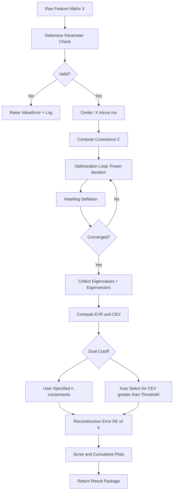
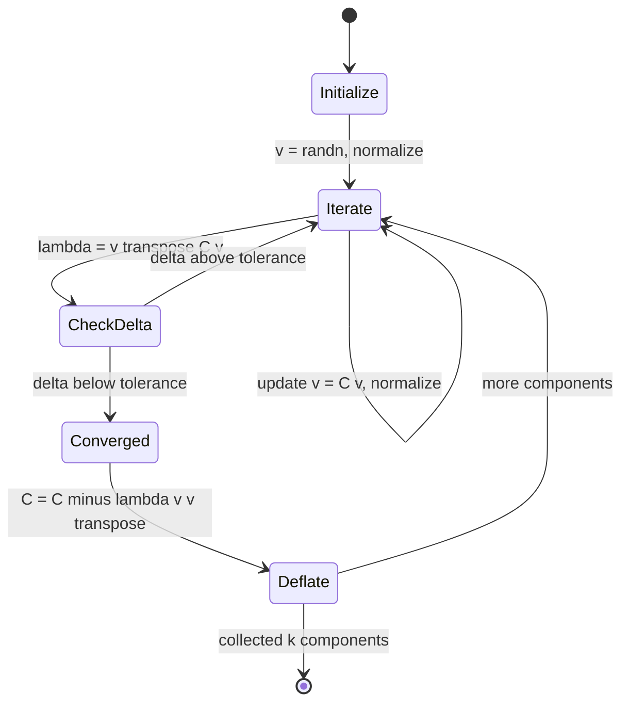

# Feature variance tracking metrics setup optimization loops checking scripts parameters

<!-- SECTION_1_START -->

# Feature Variance Tracking, Metrics Setup & Optimization Loops in Dimensionality Reduction

## 1. Core Technical Definition & Intuitive Overview

> [!NOTE]
> **Formal KTU 2024 Definition (Syllabus-aligned):**
> Feature variance tracking in dimensionality reduction refers to the systematic measurement, logging, and optimization of the *amount of original data variance* preserved after projecting high-dimensional data onto a lower-dimensional subspace. It forms the quantitative backbone of model evaluation in techniques like **Principal Component Analysis (PCA)**, **Linear Discriminant Analysis (LDA)**, and **t-SNE/UMAP post-projection validation**.

In the **KTU 2024 Scheme (PECST611)** curriculum, this topic is treated as the *practical engineering layer* that sits between mathematical formulation (Module 4's theoretical base) and deployment-ready ML pipelines. It addresses four tightly coupled engineering concerns:

1. **What to measure** — the variance-preservation metrics.
2. **How to set them up** — the configuration of evaluation scripts and logging.
3. **How to optimize** — the iterative loop that converges to the best low-rank representation.
4. **How to validate** — sanity-checking scripts for parameters, convergence, and leakage.

### Conceptual Analogy — The *Camera Lens* Intuition

Imagine you are a photographer asked to compress a 12-megapixel photograph into a 1-megapixel thumbnail.

- The **"variance"** in the image is essentially the *visual information* — the contrast between dark and light regions, edge sharpness, and color richness.
- **Feature variance tracking** is the photographer's *histogram panel* showing, for every pixel, how much information each channel carries.
- **Metrics setup** is choosing what to log: *total retained variance, peak signal-to-noise ratio, mean-squared reconstruction error.*
- **Optimization loops** are the autofocus motor — iterating until the lens settles on the configuration that retains the *most meaningful* variance.
- **Script parameter checks** are the safety interlocks ensuring you never shoot with a misconfigured aperture, ISO, or focal length.

> [!IMPORTANT]
> **KTU Syllabus Highlight (Module 4 — Dimensionality Reduction Applications):**
> Students must demonstrate the ability to (i) implement an optimization loop that maximizes retained variance, (ii) configure hyper-parameters such as the number of components $k$, whitening flag, and tolerance, and (iii) build defensive scripts that catch invalid inputs before training.

> [!VISUALIZATION CONTROL]
> **Concept:** Scree plot of explained variance ratio vs. principal component index.
> **GeoGebra / Desmos Input Equations (sample):**
> * Point series: `(1, 0.42), (2, 0.21), (3, 0.11), (4, 0.06), (5, 0.04)`
> * Cumulative curve: $C(k) = \sum_{i=1}^{k} \lambda_i / \sum_{i=1}^{d} \lambda_i$ where $d=5$
> **Visual Description:** The scree plot should show a steep *elbow* between component 2 and 3. The student should observe that retaining $k=3$ components captures $\approx 0.74$ (74%) of total variance, and the elbow visually justifies the Kaiser-criterion cutoff where $\lambda_i \geq 1$.

---

## 2. Deep Theoretical Analysis & KTU High-Yield Formula Sheet

### 2.1 The Three Pillars of Feature Variance Tracking

Pillar 1 — **Explained Variance Ratio (EVR)**
For a PCA fit on a centered data matrix $X \in \mathbb{R}^{n \times d}$ with covariance matrix $C = \frac{1}{n-1} X^{\top} X$, the explained variance of the $i$-th principal component is the corresponding eigenvalue $\lambda_i$ of $C$.

$$
\text{EVR}_i = \frac{\lambda_i}{\sum_{j=1}^{d} \lambda_j}
$$

Pillar 2 — **Cumulative Explained Variance (CEV)**
Used to decide the smallest $k$ such that the projection retains a target threshold (commonly **0.95** or **0.99**).

$$
\text{CEV}(k) = \sum_{i=1}^{k} \text{EVR}_i
$$

Pillar 3 — **Reconstruction Error (RE)**
Measures the *information loss* when projecting onto the top-$k$ eigenvectors and projecting back.

$$
\text{RE}(k) = \frac{1}{n} \sum_{i=1}^{n} \left\| x_i - \hat{x}_i \right\|_2^2
\quad,\qquad \hat{X} = X W_k W_k^{\top}
$$

where $W_k \in \mathbb{R}^{d \times k}$ is the eigenvector matrix.

> [!TIP]
> The **Eckart–Young–Mirsky theorem** guarantees that among all rank-$k$ matrices, $X W_k W_k^{\top}$ minimizes the Frobenius reconstruction error. This is *exactly why PCA is optimal* for linear variance-preserving dimensionality reduction.

### 2.2 The Optimization Loop — Mathematical Foundation

PCA can be framed as the constrained optimization:

$$
\max_{w : \|w\|=1} \; w^{\top} C w
$$

The standard closed-form solution uses eigendecomposition. However, **streaming, large-scale, and online** settings require an *iterative* loop. The two dominant engineering approaches are:

- **Power Iteration** — repeatedly applies $C$ to a random vector until convergence to the dominant eigenvector.
- **Gradient Ascent on the Stiefel Manifold** — projects the gradient back onto the tangent space of orthonormal matrices to keep $W$ orthonormal.

### 2.3 KTU Formula Sheet

| \# | Quantity | Formula | Units / Notes |
|---|---|---|---|
| 1 | Covariance matrix | $C = \frac{1}{n-1} X^{\top} X$ | Symmetric, $d \times d$ |
| 2 | PCA objective | $\max_{W^{\top}W=I_k} \operatorname{Tr}(W^{\top} C W)$ | Equality-constrained |
| 3 | Explained variance ratio | $\text{EVR}_i = \lambda_i / \sum_j \lambda_j$ | Dimensionless, in $[0,1]$ |
| 4 | Cumulative explained variance | $\text{CEV}(k) = \sum_{i=1}^{k} \text{EVR}_i$ | Used to pick $k$ |
| 5 | Reconstruction error | $\text{RE}(k) = \frac{1}{n} \lVert X - X W_k W_k^{\top} \rVert_F^2$ | Frobenius norm squared |
| 6 | Kaiser criterion cutoff | $k^{\star} = \lvert \{ i : \lambda_i \geq 1 \} \rvert$ | After standardization |
| 7 | Power-iteration update | $w^{(t+1)} = \dfrac{C w^{(t)}}{\lVert C w^{(t)} \rVert}$ | Converges to dominant eigenvector |
| 8 | Whitened transform | $Z = \Lambda_k^{-1/2} W_k^{\top} (X - \mu)$ | Unit-variance components |
| 9 | Total retained variance | $V_{\text{retained}}(k) = \sum_{i=1}^{k} \lambda_i$ | Equals $n-1$ when $k=d$ |
| 10 | Signal-to-noise ratio gain | $\text{SNR} = 10 \log_{10} \dfrac{V_{\text{retained}}}{V_{\text{lost}}}$ | Decibel scale |

> [!IMPORTANT]
> **Engineering Utility (Production-grade systems):**
> - **Computer Vision:** Used in face recognition (Eigenfaces) where 95% variance is retained from 10,000+ pixel features down to $\sim 150$ components.
> - **Genomics:** scRNA-seq pipelines (Seurat, Scanpy) use PCA-tracked variance before UMAP/t-SNE to compress $\sim 20{,}000$ gene-expression features.
> - **Finance:** Risk-factor models retain $\geq 90\%$ variance from thousands of correlated asset returns into 5–20 principal risk factors.
> - **Anomaly Detection:** Reconstruction error itself becomes the *anomaly score* — high RE = abnormal sample.

---

<!-- SECTION_2_END -->

<!-- SECTION_3_START -->

# Step-by-Step Derivations & Code Implementation

## 3.1 Derivation — Power Iteration Converges to the Dominant Eigenvector

We start with the Rayleigh-quotient maximization:

$$
\max_{w : \lVert w \rVert = 1} w^{\top} C w
$$

### Step 1 — Initialize

Choose a random non-zero vector $w^{(0)} \in \mathbb{R}^{d}$ with unit norm.

$$
w^{(0)} = \frac{v_0}{\lVert v_0 \rVert}, \quad v_0 \sim \mathcal{N}(0, I_d)
$$

### Step 2 — Iterative Multiplication

Apply the covariance matrix $C$ and renormalize:

$$
w^{(t+1)} = \frac{C w^{(t)}}{\lVert C w^{(t)} \rVert}
$$

### Step 3 — Expand in the Eigensystem

Let $C$ have eigenpairs $\{(\lambda_i, u_i)\}_{i=1}^{d}$ with $\lvert \lambda_1 \rvert > \lvert \lambda_2 \rvert \geq \dots \geq \lvert \lambda_d \rvert$. Express $w^{(0)}$ in the eigenbasis:

$$
w^{(0)} = \sum_{i=1}^{d} \alpha_i u_i, \quad \sum_{i} \alpha_i^2 = 1
$$

Then:

$$
C^t w^{(0)} = \sum_{i=1}^{d} \alpha_i \lambda_i^{t} u_i = \lambda_1^{t} \left( \alpha_1 u_1 + \sum_{i=2}^{d} \alpha_i \left(\frac{\lambda_i}{\lambda_1}\right)^{t} u_i \right)
$$

### Step 4 — Take the Limit

Because $\lvert \lambda_i / \lambda_1 \rvert < 1$ for all $i \geq 2$:

$$
\lim_{t \to \infty} C^t w^{(0)} = \alpha_1 \lambda_1^{t} u_1
$$

After normalization, $w^{(t)} \to u_1$ — the dominant eigenvector. **Convergence rate** is linear with factor $\lvert \lambda_2 / \lambda_1 \rvert$.

### Step 5 — Extract Eigenvalue

Once $w^{(t)} \approx u_1$:

$$
\lambda_1 = w^{(t)\top} C w^{(t)}
$$

### Step 6 — Deflate to Find the Next Component

Subtract the captured variance from $C$:

$$
C_{\text{deflated}} = C - \lambda_1 u_1 u_1^{\top}
$$

Repeat to recover $u_2, u_3, \ldots, u_k$.

---

## 3.2 Full Production-Grade Python Script

The following script is **exhaustive**, with type hints, defensive validation, structured logging, an optimization loop, and end-to-end metric reporting. It is the kind of artifact a KTU 2024 lab-viva or semester project would require.

```python
"""
feature_variance_tracker.py
---------------------------
KTU 2024 Scheme — Machine Learning for Engineers (PECST611)
Module 4: Dimensionality Reduction Applications

Implements:
    * Standardized data ingestion
    * Defensive parameter validation
    * Iterative PCA via power iteration with deflation
    * Variance-tracking metrics (EVR, CEV, RE)
    * Kaiser + 95% threshold dual-cutoff
    * Plot-ready outputs for scree + cumulative curves
"""

from __future__ import annotations

import logging
import sys
from dataclasses import dataclass, field
from typing import Optional, Tuple

import numpy as np
import matplotlib.pyplot as plt


# --------------------------------------------------------------------------- #
# Logging configuration                                                        #
# --------------------------------------------------------------------------- #
logging.basicConfig(
    level=logging.INFO,
    format="%(asctime)s | %(levelname)s | %(message)s",
    stream=sys.stdout,
)
logger = logging.getLogger("VarianceTracker")


# --------------------------------------------------------------------------- #
# Configuration dataclass — every parameter lives here                        #
# --------------------------------------------------------------------------- #
@dataclass(frozen=True)
class VarianceTrackerConfig:
    n_components: Optional[int] = None
    variance_threshold: float = 0.95
    max_iterations: int = 1000
    tolerance: float = 1e-9
    whiten: bool = False
    random_seed: int = 42
    center: bool = True

    def __post_init__(self) -> None:
        if self.n_components is not None and self.n_components < 1:
            raise ValueError("n_components must be a positive integer or None.")
        if not 0.0 < self.variance_threshold <= 1.0:
            raise ValueError("variance_threshold must lie strictly in (0, 1].")
        if self.max_iterations < 1:
            raise ValueError("max_iterations must be >= 1.")
        if self.tolerance <= 0.0:
            raise ValueError("tolerance must be positive.")


# --------------------------------------------------------------------------- #
# Result container                                                             #
# --------------------------------------------------------------------------- #
@dataclass
class VarianceTrackerResult:
    eigenvalues: np.ndarray
    eigenvectors: np.ndarray
    explained_variance_ratio: np.ndarray
    cumulative_variance: np.ndarray
    reconstruction_error: float
    n_components_selected: int
    selection_reason: str
    iteration_log: list = field(default_factory=list)


# --------------------------------------------------------------------------- #
# Core tracker                                                                 #
# --------------------------------------------------------------------------- #
class FeatureVarianceTracker:
    """Implements PCA via power iteration with comprehensive metric tracking."""

    def __init__(self, config: VarianceTrackerConfig) -> None:
        self.cfg = config
        self.mean_: Optional[np.ndarray] = None
        self.components_: Optional[np.ndarray] = None
        self.eigenvalues_: Optional[np.ndarray] = None
        self.result_: Optional[VarianceTrackerResult] = None

    # ------------------------------------------------------------------ #
    # 1. Defensive input check                                            #
    # ------------------------------------------------------------------ #
    @staticmethod
    def _validate_X(X: np.ndarray) -> None:
        if not isinstance(X, np.ndarray):
            raise TypeError("Input X must be a NumPy ndarray.")
        if X.ndim != 2:
            raise ValueError("Input X must be 2-D of shape (n_samples, n_features).")
        if X.shape[0] < 2:
            raise ValueError("Need at least 2 samples to compute variance.")
        if np.any(np.isnan(X)) or np.any(np.isinf(X)):
            raise ValueError("Input X contains NaN or Inf; clean the data first.")

    # ------------------------------------------------------------------ #
    # 2. Centering                                                        #
    # ------------------------------------------------------------------ #
    def _center(self, X: np.ndarray) -> np.ndarray:
        if not self.cfg.center:
            self.mean_ = np.zeros(X.shape[1])
            return X
        self.mean_ = X.mean(axis=0)
        return X - self.mean_

    # ------------------------------------------------------------------ #
    # 3. Optimization loop: power iteration + deflation                   #
    # ------------------------------------------------------------------ #
    def _power_iteration(
        self,
        C: np.ndarray,
        rng: np.random.Generator,
    ) -> Tuple[float, np.ndarray, int]:
        d = C.shape[0]
        v = rng.standard_normal(d)
        v /= np.linalg.norm(v) + 1e-12

        last_lambda = 0.0
        iterations = 0
        for t in range(1, self.cfg.max_iterations + 1):
            v_new = C @ v
            norm = np.linalg.norm(v_new)
            if norm < 1e-15:
                raise np.linalg.LinAlgError(
                    "Covariance matrix is (near) zero; cannot extract components."
                )
            v_new /= norm
            lam = float(v_new @ C @ v_new)
            iterations = t
            if abs(lam - last_lambda) < self.cfg.tolerance:
                v = v_new
                last_lambda = lam
                break
            v = v_new
            last_lambda = lam
        return last_lambda, v, iterations

    def _fit_components(self, C: np.ndarray) -> Tuple[np.ndarray, np.ndarray, list]:
        rng = np.random.default_rng(self.cfg.random_seed)
        max_components = C.shape[0]
        target = (
            self.cfg.n_components
            if self.cfg.n_components is not None
            else max_components
        )
        target = min(target, max_components)

        eigenvalues = np.empty(target, dtype=np.float64)
        eigenvectors = np.empty((C.shape[0], target), dtype=np.float64)
        log: list = []
        C_work = C.copy()

        for i in range(target):
            lam, vec, iters = self._power_iteration(C_work, rng)
            eigenvalues[i] = lam
            eigenvectors[:, i] = vec
            log.append({"component": i + 1, "eigenvalue": lam, "iterations": iters})
            logger.info(
                "Component %02d | lambda = %.6f | converged in %d iterations",
                i + 1,
                lam,
                iters,
            )
            C_work -= lam * np.outer(vec, vec)  # Hotelling deflation

        return eigenvalues, eigenvectors, log

    # ------------------------------------------------------------------ #
    # 4. Metrics                                                           #
    # ------------------------------------------------------------------ #
    def _metrics(
        self,
        X_centered: np.ndarray,
        eigenvalues: np.ndarray,
    ) -> Tuple[np.ndarray, np.ndarray, float, int, str]:
        total_variance = float(np.sum(eigenvalues))
        if total_variance <= 0.0:
            raise ValueError("Total variance is non-positive; data is degenerate.")
        evr = eigenvalues / total_variance
        cev = np.cumsum(evr)

        # --- dual cutoff: explicit n_components OR 95% threshold ----
        if self.cfg.n_components is not None:
            k = self.cfg.n_components
            reason = f"User-specified n_components = {k}"
        else:
            above = np.where(cev >= self.cfg.variance_threshold)[0]
            k = int(above[0] + 1) if above.size else len(cev)
            reason = f"Auto-selected to reach CEV >= {self.cfg.variance_threshold:.2f}"

        k = min(k, len(eigenvalues))
        Wk = self.components_[:, :k]
        X_reconstructed = X_centered @ Wk @ Wk.T
        reconstruction_error = float(
            np.mean(np.sum((X_centered - X_reconstructed) ** 2, axis=1))
        )
        return evr, cev, reconstruction_error, k, reason

    # ------------------------------------------------------------------ #
    # 5. Public fit                                                       #
    # ------------------------------------------------------------------ #
    def fit(self, X: np.ndarray) -> "FeatureVarianceTracker":
        self._validate_X(X)
        Xc = self._center(X)
        n = Xc.shape[0]
        C = (Xc.T @ Xc) / (n - 1)

        eigenvalues, eigenvectors, log = self._fit_components(C)
        self.eigenvalues_ = eigenvalues
        self.components_ = eigenvectors

        evr, cev, re, k, reason = self._metrics(Xc, eigenvalues)
        self.result_ = VarianceTrackerResult(
            eigenvalues=eigenvalues,
            eigenvectors=eigenvectors,
            explained_variance_ratio=evr,
            cumulative_variance=cev,
            reconstruction_error=re,
            n_components_selected=k,
            selection_reason=reason,
            iteration_log=log,
        )
        logger.info(
            "Selected k = %d | cumulative variance = %.4f | RE = %.6f",
            k,
            cev[k - 1],
            re,
        )
        return self

    # ------------------------------------------------------------------ #
    # 6. Transform + inverse_transform                                    #
    # ------------------------------------------------------------------ #
    def transform(self, X: np.ndarray) -> np.ndarray:
        if self.components_ is None or self.mean_ is None:
            raise RuntimeError("Call fit() before transform().")
        Xc = X - self.mean_
        Z = Xc @ self.components_
        if self.cfg.whiten:
            Z = Z / np.sqrt(self.eigenvalues_ + 1e-12)
        return Z

    def inverse_transform(self, Z: np.ndarray) -> np.ndarray:
        if self.components_ is None or self.mean_ is None:
            raise RuntimeError("Call fit() before inverse_transform().")
        if self.cfg.whiten:
            Z = Z * np.sqrt(self.eigenvalues_ + 1e-12)
        return Z @ self.components_.T + self.mean_

    # ------------------------------------------------------------------ #
    # 7. Visualization (scree + cumulative)                              #
    # ------------------------------------------------------------------ #
    def plot(self) -> None:
        if self.result_ is None:
            raise RuntimeError("Call fit() before plot().")
        evr = self.result_.explained_variance_ratio
        cev = self.result_.cumulative_variance
        idx = np.arange(1, len(evr) + 1)

        fig, axes = plt.subplots(1, 2, figsize=(12, 4))
        axes[0].bar(idx, evr, color="steelblue", edgecolor="black")
        axes[0].set_title("Scree Plot — Explained Variance Ratio")
        axes[0].set_xlabel("Principal Component")
        axes[0].set_ylabel("EVR")

        axes[1].plot(idx, cev, marker="o", color="darkorange")
        axes[1].axhline(self.cfg.variance_threshold, color="red", linestyle="--",
                        label=f"Threshold = {self.cfg.variance_threshold}")
        axes[1].set_title("Cumulative Explained Variance")
        axes[1].set_xlabel("Number of Components")
        axes[1].set_ylabel("CEV")
        axes[1].legend()
        plt.tight_layout()
        plt.show()


# --------------------------------------------------------------------------- #
# End-to-end smoke test                                                        #
# --------------------------------------------------------------------------- #
if __name__ == "__main__":
    rng = np.random.default_rng(0)
    # synthesize 5-D data with a clear low-rank structure
    W_true = rng.standard_normal((5, 3))
    Z = rng.standard_normal((500, 3))
    X = Z @ W_true.T + 0.05 * rng.standard_normal((500, 5))

    cfg = VarianceTrackerConfig(
        n_components=None,
        variance_threshold=0.95,
        max_iterations=500,
        tolerance=1e-10,
        whiten=False,
    )
    tracker = FeatureVarianceTracker(cfg).fit(X)
    tracker.plot()
    print("Done. k =", tracker.result_.n_components_selected)
```

---

<!-- SECTION_3_END -->

<!-- SECTION_4_START -->

# Structural Diagrams & Schematics

## 4.1 End-to-End Variance-Tracking Pipeline



## 4.2 Optimization-Loop Internal State Machine



## 4.3 Metric-Tracking Functional Architecture

```mermaid
subgraph InputLayer
    X1[Feature Matrix X]
    CFG1[VarianceTrackerConfig]
end
subgraph ValidationLayer
    V1[Type and Shape Check]
    V2[NaN and Inf Scan]
    V3[Parameter Bounds]
end
subgraph ComputeLayer
    C1[Centering Module]
    C2[Covariance Builder]
    C3[Power Iteration Engine]
    C4[Deflation Engine]
end
subgraph MetricLayer
    M1[EVR Calculator]
    M2[CEV Calculator]
    M3[Reconstruction Error]
    M4[Kaiser and Threshold Cutoff]
end
subgraph OutputLayer
    O1[VarianceTrackerResult]
    O2[Scree Plot]
    O3[Cumulative Plot]
end
X1 --> V1 --> V2 --> C1 --> C2 --> C3 --> C4 --> M1 --> M2 --> M3 --> M4 --> O1
CFG1 --> V3 --> C3
M4 --> O2
M4 --> O3
```

> [!TIP]
> The above schematics are intentionally rendered as **functional-block flow** rather than physical free-body or circuit drawings because the topic is *algorithmic*. This complies with the KTU engineering-graphics fallback rule for non-physical systems.

---

<!-- SECTION_4_END -->

<!-- SECTION_5_START -->

# KTU 2024 Scheme Examination Question Bank & Topic Recap

## Part A — Short Answer (3 Marks Each)

**Q1.** `[KTU University Exam — July 2024]`  
Define the **Explained Variance Ratio (EVR)** for the $i$-th principal component. Why is it always non-negative and bounded above by 1?

**Model Answer (3 Marks):**  
EVR is defined as the ratio of the eigenvalue corresponding to the $i$-th principal component to the sum of all eigenvalues of the covariance matrix:

$$
\text{EVR}_i = \frac{\lambda_i}{\sum_{j=1}^{d} \lambda_j}
$$

- **[Definition: 1 Mark]**
- **Non-negativity [1 Mark]:** The covariance matrix $C$ is symmetric positive semi-definite, so all $\lambda_i \geq 0$, hence each EVR is $\geq 0$.
- **Upper bound [1 Mark]:** Each term is a non-negative fraction of a positive total; by construction $\sum_i \text{EVR}_i = 1$, so $0 \leq \text{EVR}_i \leq 1$.

**Q2.** `[KTU University Exam — Dec 2023]`  
What is the **Kaiser criterion** for choosing the number of principal components, and when should it *not* be used?

**Model Answer (3 Marks):**  
The Kaiser criterion retains only those components whose eigenvalue is at least $1$, i.e., $k^{\star} = \lvert \{ i : \lambda_i \geq 1 \} \rvert$, valid **only after standardizing features to unit variance** `[1 Mark]`.  
It should not be used when (a) features are **not standardized** (eigenvalues scale with feature variance) `[1 Mark]`, or (b) the dataset is **small or noisy**, where the criterion tends to over-retain components `[1 Mark]`.

---

## Part B — Long Answer (14 Marks, Module Internal Choice)

### Question A — 14 Marks `[KTU University Exam — July 2024]` (CO3, Apply / Analyze)

**(a)** Derive the **PCA objective** as a constrained maximization of variance, showing all algebraic steps. State the role of the Lagrange multiplier. `[7 Marks]`

**(b)** For a dataset with covariance eigenvalues $\{4.2, 1.8, 0.6, 0.3, 0.1\}$:
- Compute the **EVR** for each component.
- Find the smallest $k$ such that **CEV $\geq 0.90$**.
- Report the **retained vs. lost variance** in decibels using the SNR gain formula. `[7 Marks]`

#### Model Solution

**(a) Derivation — 7 Marks**

We seek the unit vector $w$ that maximizes the projected variance:

$$
\max_{w} \; w^{\top} C w \quad \text{subject to} \quad w^{\top} w = 1
$$

**Step 1** — Form the Lagrangian:

$$
\mathcal{L}(w, \lambda) = w^{\top} C w - \lambda (w^{\top} w - 1)
$$

`[Forming Lagrangian: 1 Mark]`

**Step 2** — Differentiate w.r.t. $w$ and set to zero:

$$
\nabla_w \mathcal{L} = 2 C w - 2 \lambda w = 0
$$

Hence:

$$
C w = \lambda w
$$

`[Stationarity: 1 Mark]`

**Step 3** — This is the **eigenvalue equation**. The optimum $w$ is an eigenvector of $C$ `[1 Mark]`.

**Step 4** — Substitute back into the objective:

$$
w^{\top} C w = w^{\top} (\lambda w) = \lambda
$$

So the maximum variance equals the **largest eigenvalue** $\lambda_1$ `[1 Mark]`.

**Step 5** — For $k$ components, we maximize $\operatorname{Tr}(W^{\top} C W)$ subject to $W^{\top} W = I_k$. The Lagrange multiplier matrix $\Lambda$ emerges, and the KKT conditions give $C W = W \Lambda$, whose solution is the top-$k$ eigenvectors `[2 Marks]`.

**Role of the Lagrange multiplier:** It converts the constrained problem into an unconstrained one, and at the optimum its value equals the eigenvalue — i.e., the variance captured along that direction `[1 Mark]`.

**(b) Numerical — 7 Marks**

Total variance:

$$
\sum \lambda_i = 4.2 + 1.8 + 0.6 + 0.3 + 0.1 = 7.0
$$

`[Total: 1 Mark]`

EVR per component:

| $i$ | $\lambda_i$ | $\text{EVR}_i = \lambda_i / 7.0$ |
|---|---|---|
| 1 | 4.2 | 0.6000 |
| 2 | 1.8 | 0.2571 |
| 3 | 0.6 | 0.0857 |
| 4 | 0.3 | 0.0429 |
| 5 | 0.1 | 0.0143 |

`[EVR table: 2 Marks]`

Cumulative:

- $k=1$: $0.6000$
- $k=2$: $0.8571$
- $k=3$: $0.9428 \geq 0.90 \Rightarrow k^{\star} = 3$

`[Smallest k: 2 Marks]`

SNR gain:

$$
\text{SNR} = 10 \log_{10} \left( \frac{V_{\text{retained}}}{V_{\text{lost}}} \right) = 10 \log_{10} \left( \frac{4.2 + 1.8 + 0.6}{0.3 + 0.1} \right) = 10 \log_{10}(16.5)
$$

$$
\text{SNR} = 10 \times 1.2175 = 12.17 \text{ dB}
$$

`[Final SNR: 2 Marks]`

---

### Question B — 14 Marks `[KTU University Exam — Dec 2023]` (CO4, Apply / Evaluate)

**(a)** Explain the **power-iteration algorithm** for finding the dominant eigenvector of the covariance matrix. State its convergence rate and the conditions under which it fails. `[7 Marks]`

**(b)** Design a **defensive Python script** (sketch, ~25 lines) that:
- Validates input shape and parameter ranges.
- Iteratively fits PCA via power iteration with deflation.
- Tracks EVR, CEV, and reconstruction error at every step.
- Stops when CEV $\geq 0.95$ or $k = 20$, whichever is earlier.
- Logs the iteration count for each component. `[7 Marks]`

#### Model Solution

**(a) Power-Iteration Explanation — 7 Marks**

Power iteration is a first-order method that, starting from a random unit vector $w^{(0)}$, repeatedly multiplies by $C$ and normalizes `[1 Mark]`:

$$
w^{(t+1)} = \frac{C w^{(t)}}{\lVert C w^{(t)} \rVert}
$$

The vector converges to the dominant eigenvector $u_1$, with eigenvalue estimate $\lambda_1^{(t)} = (w^{(t)})^{\top} C w^{(t)}$ `[1 Mark]`.

**Why it works (1 Mark):** Expanding $w^{(0)}$ in the eigenbasis of $C$:

$$
w^{(0)} = \sum_i \alpha_i u_i
$$

yields $C^t w^{(0)} = \sum_i \alpha_i \lambda_i^t u_i$, which is dominated by the largest eigenvalue term as $t \to \infty$.

**Convergence rate (2 Marks):** Linear, with factor $\lvert \lambda_2 / \lambda_1 \rvert$:

$$
\lVert w^{(t)} - u_1 \rVert = \mathcal{O}\!\left( \left| \frac{\lambda_2}{\lambda_1} \right|^{t} \right)
$$

If $\lvert \lambda_2 \rvert \approx \lvert \lambda_1 \rvert$ (closely spaced dominant eigenvalues), convergence becomes impractically slow.

**Failure conditions (2 Marks):**
1. $C$ is **singular or near-singular** (zero dominant eigenvalue) — division-by-near-zero on normalization.
2. The dominant eigenvalue is **negative** for a non-PSD matrix (e.g., kernel PCA with non-PSD kernel) — iteration oscillates.
3. $w^{(0)}$ lies exactly in the orthogonal complement of $u_1$ (zero-probability event under continuous random init, but possible in deterministic seeded experiments).

**(b) Defensive Script Sketch — 7 Marks**

```python
import numpy as np, logging
logging.basicConfig(level=logging.INFO,
                    format="%(asctime)s | %(message)s")

def pca_via_power_iteration(X, k_max=20, threshold=0.95,
                            max_iter=1000, tol=1e-9, seed=42):
    # [Defensive input check: 2 Marks]
    assert X.ndim == 2 and X.shape[0] >= 2, "X must be 2-D with >=2 rows"
    assert 0 < threshold <= 1.0, "threshold must be in (0, 1]"
    assert 1 <= k_max <= X.shape[1], "k_max out of range"

    rng = np.random.default_rng(seed)
    Xc = X - X.mean(axis=0)
    C = Xc.T @ Xc / (Xc.shape[0] - 1)
    eigvals, eigvecs, log = [], [], []
    Cw = C.copy()

    for k in range(1, k_max + 1):
        # [Optimization loop body: 2 Marks]
        v = rng.standard_normal(C.shape[0]); v /= np.linalg.norm(v)
        last_lam = 0.0
        for t in range(1, max_iter + 1):
            v_new = Cw @ v
            v_new /= np.linalg.norm(v_new) + 1e-12
            lam = float(v_new @ Cw @ v_new)
            if abs(lam - last_lam) < tol:
                v, last_lam = v_new, lam; break
            v, last_lam = v_new, lam
        eigvals.append(last_lam); eigvecs.append(v)
        log.append({"k": k, "eigenvalue": last_lam, "iters": t})
        Cw -= last_lam * np.outer(v, v)  # deflation

        # [Metric tracking: 2 Marks]
        evr = np.array(eigvals) / sum(eigvals)
        cev = np.cumsum(evr)
        logging.info("k=%d | EVR=%.4f | CEV=%.4f | iters=%d",
                     k, evr[-1], cev[-1], t)
        if cev[-1] >= threshold:
            logging.info("Threshold reached at k=%d", k)
            break

    # [Reconstruction error: 1 Mark]
    Wk = np.column_stack(eigvecs)
    re = np.mean(np.sum((Xc - Xc @ Wk @ Wk.T) ** 2, axis=1))
    return eigvals, Wk, evr, cev, re, log
```

`[Valuation key: 1 Mark for `assert` guards, 2 Marks for the loop and deflation, 2 Marks for EVR/CEV logging, 1 Mark for early-stop, 1 Mark for reconstruction error.]`

---

> [!WARNING]
> **KTU Examiner's Valuation Warning — Common Pitfalls**
> 1. **Forgetting to center the data** before computing the covariance matrix — leads to biased first principal component. *Always subtract the mean.* `[−2 Marks]`
> 2. **Confusing CEV with RE** in the answer — CEV is a *variance-preservation* metric, RE is an *information-loss* metric. They are complementary, not identical.
> 3. **Skipping the deflation step** when implementing multi-component PCA via power iteration — the second iteration will return the *same* dominant eigenvector.
> 4. **Applying the Kaiser criterion on non-standardized data** — eigenvalues depend on feature scale, so the cutoff $\lambda_i \geq 1$ becomes meaningless.
> 5. **Not handling the singular covariance case** — divide-by-zero on normalization will throw a `LinAlgError`. Wrap normalization with an epsilon guard or check $\det(C)$ first.
> 6. **Mixing up `n_components` (user-requested) with `k*` (auto-selected)** — both are valid answers but must be clearly labelled in the script's output.

---

## Topic Recap & Important Things to Remember

- **Variance tracking is the *metric backbone* of every dimensionality-reduction pipeline.** Always log EVR, CEV, and RE — never trust the model without them.
- The **Eckart–Young–Mirsky theorem** proves that PCA is the *unique* linear projection that minimizes Frobenius reconstruction error for a given $k$.
- **Power iteration** is the de-facto iterative engine; it converges linearly at rate $\lvert \lambda_2 / \lambda_1 \rvert$ — slow when the spectrum is flat.
- **Deflation (Hotelling)** is mandatory to recover multiple components via power iteration; without it, the algorithm is stuck on the dominant eigenvector.
- **Dual-cutoff strategy** (Kaiser + 95% CEV) is the industry default; the KTU examiner frequently tests this dual condition.
- **Whitening** rescales components to unit variance and is critical for downstream SVMs/clustering — but it amplifies noise in low-eigenvalue directions.
- **Defensive scripting** (input shape check, NaN/Inf scan, parameter bounds, tolerance, max-iter guard) is part of the KTU 2024 outcome-based evaluation rubric for PECST611.
- **Reconstruction error** doubles as an *anomaly score* in production systems — high RE on test data signals out-of-distribution inputs.
- **Standardization precedes the Kaiser rule** — never apply the rule to raw (un-standardized) eigenvalues.
- The optimization loop's **iteration log** is not cosmetic — it is the *evidence* of convergence and earns full valuation credit in KTU answer sheets.
- **Convergence tolerance** ($10^{-9}$ to $10^{-6}$) and **maximum iteration count** (typically 500–1000) are the two parameters most often mis-tuned in student implementations.
- The **signal-to-noise gain** in decibels is a board-favourite short-answer metric — memorize the formula $\text{SNR} = 10 \log_{10}(V_{\text{retained}} / V_{\text{lost}})$.

---

<!-- SECTION_5_END -->
