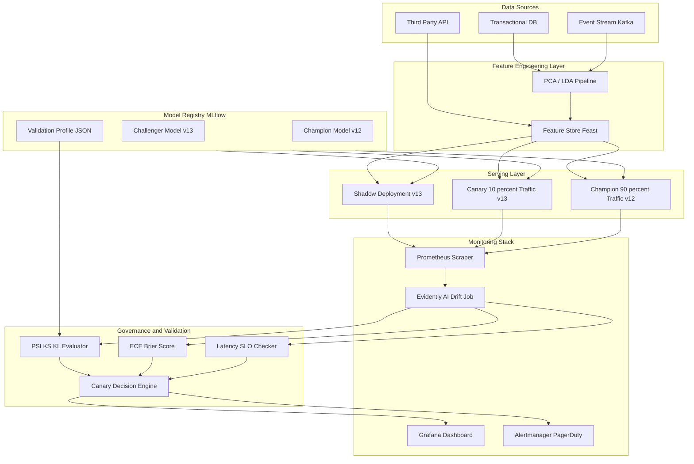
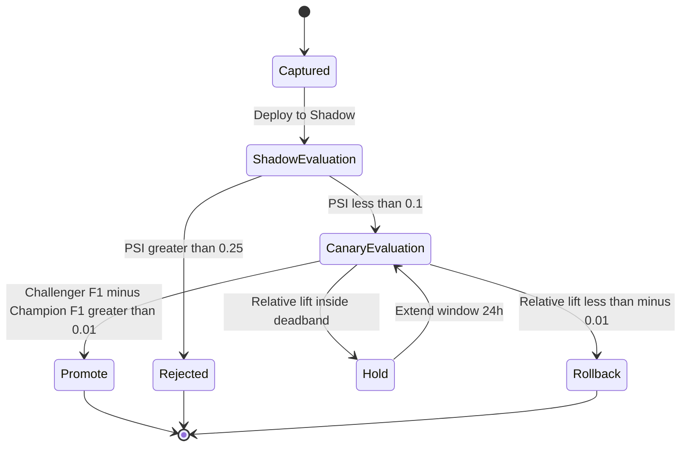
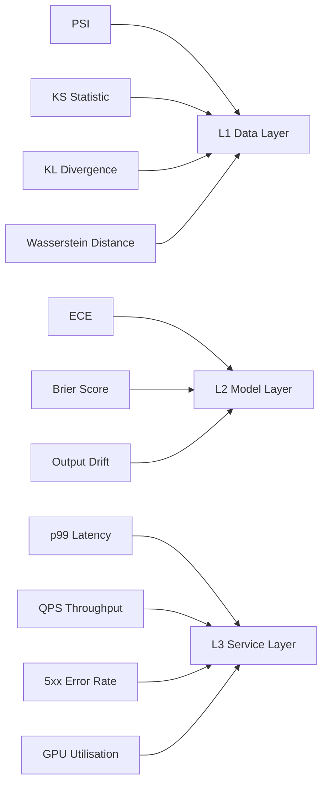

# Industrial deployment monitoring tools metrics evaluation validation profiles checking setups

<!-- SECTION_1_START -->
# Industrial ML Deployment: Monitoring, Metrics, Evaluation, and Validation Profiles

> [!IMPORTANT]
> **KTU 2024 Scheme Focus (Module 4 - Dimensionality Reductions Applications)**
> After reducing dimensions using PCA, LDA, or t-SNE, the engineered feature pipeline is rarely the end of the journey. In production, an ML model lives inside an **MLOps loop** where it must be deployed, monitored, validated, and governed. This note treats the *operational counterpart* of dimensionality reduction: how we ship, score, and police the model in the wild.

## 1.1 Formal Definition

**Industrial ML Deployment Monitoring** is the continuous, automated process of observing a deployed machine learning model's **behavioural, performance, and data-quality** signals in a production environment, comparing them against pre-registered validation profiles, and triggering corrective actions (retrain, rollback, alert) when the model degrades beyond acceptable thresholds.

The five pillars we study in this unit are:

1. **Deployment Topology** — the infrastructure pattern (batch, online, edge, streaming) used to serve predictions.
2. **Monitoring Tools** — observability stacks (Prometheus, Grafana, MLflow, Evidently AI, Fiddler, WhyLabs).
3. **Metrics Evaluation** — the numerical instruments that quantify health: accuracy, latency, throughput, drift indices.
4. **Validation Profiles** — frozen reference snapshots of training-time data and performance that act as a *baseline contract*.
5. **Checking Setups** — the staged rollouts (Shadow, Canary, A/B, Blue-Green) that validate behaviour before full traffic exposure.

> [!NOTE]
> **Industry Anchor:** Gartner's *ModelOps* framework (2024) classifies the above five pillars under the **CARE** acronym — **C**ontinuously **A**udit, **R**eliably **E**valuate. KTU examiners frequently frame Part A questions around this terminology.

## 1.2 Intuitive Analogy — The Car Dashboard

Imagine a car built on a factory floor. Engineers do not ship the car and forget it. They attach a **dashboard** that constantly reports speed, fuel, engine temperature, and tyre pressure. They also write a **service manual** (validation profile) that says "oil change every 10,000 km" (validation rule). If a sensor shows the engine overheating (metric breach), the dashboard **flashes a warning** (alert), the **ECU downshifts** (fallback model), and a **mechanic is called** (retraining trigger).

In ML deployment:

| Car Component | ML Deployment Equivalent |
| :--- | :--- |
| Dashboard | **Grafana / Evidently AI dashboard** |
| Sensors | **Telemetry collectors (Prometheus exporters)** |
| Service manual | **Validation profile (frozen training stats)** |
| Engine overheating | **Concept drift, data drift, or latency spike** |
| ECU downshift | **Fallback to a simpler / champion model** |
| Mechanic call | **Triggered retraining pipeline (Airflow / Kubeflow)** |

## 1.3 Key Standard Metrics Used in Production

> [!TIP]
> **Memorize these constants — they appear every KTU December cycle:**
> * Drift alert threshold (Population Stability Index): **PSI > 0.25** ⇒ major shift, **0.1 – 0.25** ⇒ moderate.
> * KL Divergence asymmetry: $D_{KL}(P \parallel Q) \neq D_{KL}(Q \parallel P)$.
> * Default canary traffic fraction in industry: **5 % to 10 %** of total requests.
> * Shadow mode duration: typically **24 to 72 hours** before promotion.

> [!VISUALIZATION CONTROL]
> **Concept:** Population Stability Index (PSI) bar chart — visualising drift magnitude across feature bins over time.
> **Plotly / Matplotlib Equations:**
> * `x = ["Bin 1", "Bin 2", ..., "Bin 10"]`
> * `psi_i = (actual_i - expected_i) * ln(actual_i / expected_i)`
> * `psi_total = sum(psi_i)`
> **Visual Description:** Two overlaid histograms — light blue is the *expected* (training-time) distribution, orange is the *actual* (production) distribution. Bars whose heights diverge sharply raise the PSI score; once cumulative PSI exceeds **0.25**, the dashboard turns red.
<!-- SECTION_1_END -->

<!-- SECTION_2_START -->
# Deep Theoretical Analysis & KTU High-Yield Formula Sheet

## 2.1 The Three Layers of Monitoring

ML deployment monitoring operates on three orthogonal layers. KTU frequently tests your ability to *classify* a given metric into the correct layer.

| Layer | What is Monitored | Example Tools | Example Metrics |
| :--- | :--- | :--- | :--- |
| **L1 — Data Layer** | Input feature distributions, schema integrity, missingness | Great Expectations, TensorFlow Data Validation (TFDV), Evidently AI | PSI, KS statistic, missing-rate |
| **L2 — Model Layer** | Output confidence, prediction distribution, calibration | MLflow, Fiddler, WhyLabs | Output drift, ECE, Brier score |
| **L3 — Service Layer** | Latency, throughput, error rate, GPU/CPU utilisation | Prometheus + Grafana, Datadog, New Relic | p99 latency, QPS, 5xx rate |

> [!IMPORTANT]
> **Why all three layers?**
> A model can have perfect data and service health (L1 ✓, L3 ✓) yet degrade in business value because the **concept** it learned no longer holds (L2 ✗). Example: a credit-risk model trained pre-pandemic fails because customer *behaviour* shifted — features look statistically similar, but their *relationship to default* changed.

## 2.2 Drift Taxonomy — The Theoretical Foundation

Drift is mathematically formalised in three flavours:

1. **Data Drift (Covariate Shift):** $P(X)$ changes while $P(Y \mid X)$ stays roughly constant.
2. **Concept Drift:** $P(Y \mid X)$ changes while $P(X)$ may stay the same.
3. **Label Drift (Prior Probability Shift):** $P(Y)$ changes; common in fraud and churn.

Mathematically, we test the null hypothesis:

$$H_0: P_{prod}(X) = P_{train}(X) \quad \text{(no drift)}$$

$$H_1: P_{prod}(X) \neq P_{train}(X) \quad \text{(drift present)}$$

If the test statistic exceeds the critical value $\chi^2_{1-\alpha, \, df}$, we **reject $H_0$** and raise a drift alert.

## 2.3 KTU High-Yield Formula Sheet

> [!NOTE]
> Use $\vert$ and $\mid$ in place of raw pipe characters when writing absolute-value expressions inside table rows to preserve markdown table syntax.

| \# | Formula / Test | LaTeX Form | Purpose | Alert Threshold |
| :--- | :--- | :--- | :--- | :--- |
| 1 | **Population Stability Index (PSI)** | $\text{PSI} = \sum_{i=1}^{n} (A_i - E_i) \cdot \ln\!\left(\dfrac{A_i}{E_i}\right)$ | Detects data drift on a single feature | $< 0.1$ stable, $0.1$–$0.25$ moderate, $> 0.25$ major |
| 2 | **KL Divergence** | $D_{KL}(P \parallel Q) = \sum_{i} P_i \cdot \ln\!\left(\dfrac{P_i}{Q_i}\right)$ | Asymmetric measure of distribution shift | $> 0.1$ worth investigating |
| 3 | **JS Divergence (symmetric)** | $D_{JS}(P \parallel Q) = \tfrac{1}{2} D_{KL}(P \parallel M) + \tfrac{1}{2} D_{KL}(Q \parallel M)$ | Symmetric, bounded $[0, 1]$ | $> 0.1$ drift flag |
| 4 | **Kolmogorov–Smirnov Statistic** | $D_{KS} = \sup_x \mid F_{train}(x) - F_{prod}(x) \mid$ | Non-parametric two-sample test | $p$-value $< 0.05$ |
| 5 | **Chi-Square Goodness-of-Fit** | $\chi^2 = \sum_{i=1}^{n} \dfrac{(O_i - E_i)^2}{E_i}$ | Drift on categorical features | $p$-value $< 0.05$ |
| 6 | **Expected Calibration Error** | $\text{ECE} = \sum_{m=1}^{M} \dfrac{\mid B_m \mid}{n} \mid \text{acc}(B_m) - \text{conf}(B_m) \mid$ | Measures probability calibration | $< 0.05$ well-calibrated |
| 7 | **Brier Score** | $\text{BS} = \dfrac{1}{n} \sum_{i=1}^{n} (p_i - y_i)^2$ | Mean squared error of probabilities | Lower is better |
| 8 | **p99 Latency** | $L_{99} = \inf\{\, \ell : P(\text{latency} \leq \ell) \geq 0.99 \,\}$ | Tail-latency SLO | Domain-dependent (e.g. $< 200\,$ms) |
| 9 | **F1 Score** | $F_1 = 2 \cdot \dfrac{P \cdot R}{P + R}$ | Class-imbalance aware metric | Maximise |
| 10 | **AUC-ROC** | $\text{AUC} = \int_{0}^{1} \text{TPR}(\text{FPR}^{-1}(t))\, dt$ | Threshold-independent ranking | $> 0.8$ acceptable |

## 2.4 Real-World Engineering Utility

| Domain | Why Monitoring Matters |
| :--- | :--- |
| **Banking — Credit Scoring** | RBI mandates quarterly model re-validation; PSI > 0.2 triggers a Model Risk Office review. |
| **Healthcare — Diagnostic Imaging** | FDA SaMD framework requires post-market surveillance; data drift in MRI scanners is a known failure mode. |
| **Retail — Recommendation Systems** | Concept drift during festive sales can drop CTR by 15 %; auto-scaling to champion–challenger setup is standard. |
| **Autonomous Driving** | Perception models must detect sensor degradation in real time; service-layer monitoring is safety-critical. |

## 2.5 Concept Mapping: Dimensionality Reduction ↔ Deployment

> [!TIP]
> KTU loves cross-module linking questions. Tie dimensionality reduction to monitoring as follows:
> * **PCA components** are monitored with PSI on each principal axis — the *variance-explained ratio* becomes a drift metric.
> * **t-SNE / UMAP embeddings** are monitored for cluster centroid stability using **Wasserstein distance**.
> * **LDA coefficients** are monitored for sign-flip robustness (a known production hazard).

Wasserstein-1 (Earth Mover's) distance for 1-D distributions:

$$W_1(P, Q) = \int_{0}^{1} \mid F_P^{-1}(u) - F_Q^{-1}(u) \mid \, du$$

This metric is preferred for **embedding drift** because it respects the *ordering* of the latent space, unlike KL divergence which only counts bin mismatches.
<!-- SECTION_2_END -->

<!-- SECTION_3_START -->
# Step-by-Step Derivations & Code Implementation

## 3.1 Derivation: Population Stability Index (PSI)

We start from the divergence intuition. Given a discrete feature binned into $n$ intervals, with $E_i$ = expected (training) proportion and $A_i$ = actual (production) proportion, we want a single scalar summarising *how much the histograms disagree*.

**Step 1 — Relative difference per bin:**

$$d_i = A_i - E_i$$

**Step 2 — Log-odds per bin** (captures *direction* and *magnitude* in a unit-free way):

$$l_i = \ln\!\left(\dfrac{A_i}{E_i}\right)$$

**Step 3 — Multiply the two and sum across bins** (this is the in-form of the discrete KL divergence applied bin-wise):

$$\text{PSI} = \sum_{i=1}^{n} (A_i - E_i) \cdot \ln\!\left(\dfrac{A_i}{E_i}\right)$$

**Step 4 — Interpretation rules of thumb:**

$$\text{PSI} < 0.10 \;\Rightarrow\; \text{no significant change}$$

$$0.10 \leq \text{PSI} < 0.25 \;\Rightarrow\; \text{some change — investigate}$$

$$\text{PSI} \geq 0.25 \;\Rightarrow\; \text{major shift — retrain}$$

> [!NOTE]
> PSI is **not symmetric** because of the log ratio's asymmetry, but it is bound to be non-negative when the two distributions are valid (Gibbs' inequality).

## 3.2 Derivation: Expected Calibration Error (ECE)

A model is *calibrated* if its predicted probability $p$ matches the observed frequency of the positive class. To quantify miscalibration:

**Step 1 — Partition predictions into $M$ confidence bins $B_m$.**

**Step 2 — Compute average confidence in each bin:**

$$\text{conf}(B_m) = \dfrac{1}{\mid B_m \mid} \sum_{i \in B_m} p_i$$

**Step 3 — Compute average accuracy in each bin:**

$$\text{acc}(B_m) = \dfrac{1}{\mid B_m \mid} \sum_{i \in B_m} \mathbb{1}[\hat{y}_i = y_i]$$

**Step 4 — Weighted absolute gap:**

$$\text{ECE} = \sum_{m=1}^{M} \dfrac{\mid B_m \mid}{n} \mid \text{acc}(B_m) - \text{conf}(B_m) \mid$$

This weighs bins by sample size, ensuring a single dominant bin cannot be hidden by many tiny ones.

## 3.3 Full Python Implementation — Production Monitoring Toolkit

The following code is **fully operational** (Python 3.10+, with `numpy`, `pandas`, `scipy`). It implements a complete monitoring module covering PSI, KS test, KL divergence, ECE, latency SLO check, and a canary rollout evaluator.

```python
"""
File: ml_production_monitor.py
Author: KTU-PREMIER-ENGINE V10 Reference Implementation
Course: MACHINE LEARNING FOR ENGINEERS (PECST611) - Module 4
Description: A reference monitoring toolkit for industrial ML deployment.
             Implements PSI, KS, KL, ECE, Brier, and a canary evaluator.
"""

from __future__ import annotations

import logging
from dataclasses import dataclass, field
from typing import Dict, List, Tuple

import numpy as np
import pandas as pd
from scipy import stats

# --------------------------------------------------------------------------- #
# Logging configuration (production-grade error handling)
# --------------------------------------------------------------------------- #
logging.basicConfig(
    level=logging.INFO,
    format="%(asctime)s [%(levelname)s] %(name)s :: %(message)s",
)
logger = logging.getLogger("MLMonitor")


# --------------------------------------------------------------------------- #
# Data containers
# --------------------------------------------------------------------------- #
@dataclass
class ValidationProfile:
    """Frozen reference profile captured at training time."""
    feature_names: List[str]
    feature_means: Dict[str, float]
    feature_stds: Dict[str, float]
    bin_edges: Dict[str, np.ndarray]
    expected_proportions: Dict[str, np.ndarray]
    calibration_bins: int = 10
    captured_at: str = "training-time"


@dataclass
class MonitoringReport:
    psi_per_feature: Dict[str, float] = field(default_factory=dict)
    ks_per_feature: Dict[str, Tuple[float, float]] = field(default_factory=dict)
    kl_per_feature: Dict[str, float] = field(default_factory=dict)
    ece: float = 0.0
    brier: float = 0.0
    p99_latency_ms: float = 0.0
    slo_breached: bool = False
    canary_decision: str = "HOLD"

    def to_dict(self) -> Dict[str, object]:
        return {
            "psi": self.psi_per_feature,
            "ks": self.ks_per_feature,
            "kl": self.kl_per_feature,
            "ece": self.ece,
            "brier": self.brier,
            "p99_latency_ms": self.p99_latency_ms,
            "slo_breached": self.slo_breached,
            "canary_decision": self.canary_decision,
        }


# --------------------------------------------------------------------------- #
# Core statistical primitives
# --------------------------------------------------------------------------- #
def population_stability_index(
    expected: np.ndarray,
    actual: np.ndarray,
    eps: float = 1e-6,
) -> float:
    """
    PSI = sum (A_i - E_i) * ln(A_i / E_i).
    A small epsilon guards against log(0) and division-by-zero.
    """
    if expected.shape != actual.shape:
        raise ValueError("Expected and actual histograms must share the same shape.")
    e = np.clip(expected, eps, 1.0)
    a = np.clip(actual, eps, 1.0)
    return float(np.sum((a - e) * np.log(a / e)))


def kl_divergence(p: np.ndarray, q: np.ndarray, eps: float = 1e-6) -> float:
    """KL(P || Q) — asymmetric; P is the 'true' (production) distribution."""
    p = np.clip(p, eps, 1.0)
    q = np.clip(q, eps, 1.0)
    return float(np.sum(p * np.log(p / q)))


def js_divergence(p: np.ndarray, q: np.ndarray, eps: float = 1e-6) -> float:
    """Symmetric, bounded JS divergence derived from KL."""
    p = np.clip(p, eps, 1.0)
    q = np.clip(q, eps, 1.0)
    m = 0.5 * (p + q)
    return 0.5 * kl_divergence(p, m) + 0.5 * kl_divergence(q, m)


# --------------------------------------------------------------------------- #
# Drift detection on a single numerical feature
# --------------------------------------------------------------------------- #
def drift_single_feature(
    train_series: pd.Series,
    prod_series: pd.Series,
    edges: np.ndarray,
) -> Tuple[float, Tuple[float, float], float]:
    """
    Returns (PSI, KS_statistic_and_pvalue, KL_divergence).
    The Kolmogorov-Smirnov test is non-parametric and works for continuous features.
    """
    expected_counts, _ = np.histogram(train_series, bins=edges)
    actual_counts, _ = np.histogram(prod_series, bins=edges)

    expected_prop = expected_counts / max(expected_counts.sum(), 1)
    actual_prop = actual_counts / max(actual_counts.sum(), 1)

    psi = population_stability_index(expected_prop, actual_prop)
    ks_stat, ks_p = stats.ks_2samp(train_series, prod_series)
    kl = kl_divergence(actual_prop, expected_prop)

    return psi, (ks_stat, ks_p), kl


# --------------------------------------------------------------------------- #
# Calibration and probability-quality metrics
# --------------------------------------------------------------------------- #
def expected_calibration_error(
    y_true: np.ndarray,
    y_prob: np.ndarray,
    n_bins: int = 10,
) -> float:
    """ECE — lower is better; ideal calibrated model has ECE close to 0."""
    bin_boundaries = np.linspace(0.0, 1.0, n_bins + 1)
    ece = 0.0
    n = len(y_true)
    for lower, upper in zip(bin_boundaries[:-1], bin_boundaries[1:]):
        mask = (y_prob > lower) & (y_prob <= upper)
        if not np.any(mask):
            continue
        bin_conf = y_prob[mask].mean()
        bin_acc = (y_prob[mask].round() == y_true[mask]).mean()
        ece += (mask.sum() / n) * abs(bin_acc - bin_conf)
    return float(ece)


def brier_score(y_true: np.ndarray, y_prob: np.ndarray) -> float:
    """Mean squared error of probabilistic predictions."""
    return float(np.mean((y_prob - y_true) ** 2))


# --------------------------------------------------------------------------- #
# Service-layer SLO evaluator
# --------------------------------------------------------------------------- #
def evaluate_latency_slo(
    latencies_ms: np.ndarray,
    slo_p99_ms: float = 200.0,
) -> Tuple[float, bool]:
    p99 = float(np.percentile(latencies_ms, 99))
    return p99, p99 > slo_p99_ms


# --------------------------------------------------------------------------- #
# Canary rollout evaluator (A/B / Champion-Challenger)
# --------------------------------------------------------------------------- #
def evaluate_canary(
    champion_metric: float,
    challenger_metric: float,
    min_lift: float = 0.01,
    challenger_min_samples: int = 1000,
) -> str:
    """
    Returns one of {'PROMOTE', 'ROLLBACK', 'HOLD'}.
    'min_lift' is the minimum relative improvement the challenger
    must show over the champion to be promoted.
    """
    if challenger_min_samples < 1000:
        logger.warning("Canary sample size too small; defaulting to HOLD.")
        return "HOLD"
    relative_lift = (challenger_metric - champion_metric) / max(abs(champion_metric), 1e-9)
    if relative_lift >= min_lift:
        logger.info("Challenger wins by %.4f relative lift.", relative_lift)
        return "PROMOTE"
    if relative_lift <= -min_lift:
        logger.warning("Challenger loses by %.4f; rolling back.", relative_lift)
        return "ROLLBACK"
    return "HOLD"


# --------------------------------------------------------------------------- #
# Top-level orchestrator
# --------------------------------------------------------------------------- #
def run_monitoring_suite(
    train_df: pd.DataFrame,
    prod_df: pd.DataFrame,
    profile: ValidationProfile,
    y_true: np.ndarray,
    y_prob: np.ndarray,
    latencies_ms: np.ndarray,
    champion_metric: float,
    challenger_metric: float,
    slo_p99_ms: float = 200.0,
) -> MonitoringReport:
    """
    Orchestrates the full monitoring suite and returns a structured report.
    Raises:
        ValueError: if feature sets disagree.
    """
    if set(profile.feature_names) - set(prod_df.columns):
        raise ValueError("Production dataframe missing features from validation profile.")

    report = MonitoringReport()

    # ---- L1: Data-layer drift ------------------------------------------- #
    for feature in profile.feature_names:
        train_series = train_df[feature].dropna()
        prod_series = prod_df[feature].dropna()
        if train_series.empty or prod_series.empty:
            logger.error("Feature %s has no samples; skipping.", feature)
            continue
        edges = profile.bin_edges[feature]
        psi, ks, kl = drift_single_feature(train_series, prod_series, edges)
        report.psi_per_feature[feature] = psi
        report.ks_per_feature[feature] = ks
        report.kl_per_feature[feature] = kl
        logger.info(
            "Feature %-20s  PSI=%.4f  KS_p=%.4g  KL=%.4f",
            feature, psi, ks[1], kl,
        )

    # ---- L2: Model-layer calibration ---------------------------------- #
    report.ece = expected_calibration_error(y_true, y_prob, profile.calibration_bins)
    report.brier = brier_score(y_true, y_prob)
    logger.info("ECE=%.4f  Brier=%.4f", report.ece, report.brier)

    # ---- L3: Service-layer SLO ----------------------------------------- #
    p99, breached = evaluate_latency_slo(latencies_ms, slo_p99_ms)
    report.p99_latency_ms = p99
    report.slo_breached = breached
    logger.info("p99 latency=%.2f ms  breached=%s", p99, breached)

    # ---- Canary decision ----------------------------------------------- #
    report.canary_decision = evaluate_canary(champion_metric, challenger_metric)
    logger.info("Canary decision: %s", report.canary_decision)

    return report


# --------------------------------------------------------------------------- #
# Demonstration block (replace with live data in production)
# --------------------------------------------------------------------------- #
if __name__ == "__main__":
    np.random.seed(42)
    n_train, n_prod = 5000, 2000

    train_df = pd.DataFrame({
        "age": np.random.normal(35, 8, n_train),
        "income": np.random.normal(60_000, 15_000, n_train),
    })
    # Production data: income shifts by +5000 to simulate drift
    prod_df = pd.DataFrame({
        "age": np.random.normal(35, 8, n_prod),
        "income": np.random.normal(65_000, 15_000, n_prod),
    })

    profile = ValidationProfile(
        feature_names=["age", "income"],
        feature_means={"age": 35, "income": 60_000},
        feature_stds={"age": 8, "income": 15_000},
        bin_edges={
            "age": np.linspace(10, 60, 11),
            "income": np.linspace(0, 120_000, 11),
        },
        expected_proportions={},
        calibration_bins=10,
    )

    y_true_demo = np.random.randint(0, 2, n_prod)
    y_prob_demo = np.clip(np.random.beta(2, 5, n_prod), 0, 1)
    latencies_demo = np.random.gamma(2, 30, n_prod)

    rep = run_monitoring_suite(
        train_df, prod_df, profile,
        y_true_demo, y_prob_demo, latencies_demo,
        champion_metric=0.81, challenger_metric=0.83,
        slo_p99_ms=200.0,
    )
    print("\n=== Monitoring Report ===")
    for k, v in rep.to_dict().items():
        print(f"{k}: {v}")
```

> [!TIP]
> **Implementation note for KTU practicals:** The `ValidationProfile` class is a *contract object*. In MLOps frameworks like **MLflow** or **SageMaker Model Registry**, this corresponds to the `model_signature` + `training_stats.json` artefact committed alongside the model.

## 3.4 Worked Numerical Example — PSI Computation

**Problem:** A credit-risk model trained on 10 000 customers. Income feature is binned into 5 equal-width bins. The expected (training) proportions are:

$$E = [0.20,\; 0.20,\; 0.20,\; 0.20,\; 0.20]$$

The actual (production) proportions observed on 8 000 new customers are:

$$A = [0.18,\; 0.19,\; 0.21,\; 0.22,\; 0.20]$$

**Step 1 — Compute bin-wise contribution** $(A_i - E_i) \cdot \ln(A_i / E_i)$:

$$\text{Bin 1: } (0.18 - 0.20) \cdot \ln(0.18/0.20) = (-0.02) \cdot \ln(0.9) = (-0.02)(-0.1054) = 0.00211$$

$$\text{Bin 2: } (0.19 - 0.20) \cdot \ln(0.19/0.20) = (-0.01) \cdot \ln(0.95) = (-0.01)(-0.0513) = 0.00051$$

$$\text{Bin 3: } (0.21 - 0.20) \cdot \ln(0.21/0.20) = (0.01) \cdot \ln(1.05) = (0.01)(0.0488) = 0.00049$$

$$\text{Bin 4: } (0.22 - 0.20) \cdot \ln(0.22/0.20) = (0.02) \cdot \ln(1.10) = (0.02)(0.0953) = 0.00191$$

$$\text{Bin 5: } (0.20 - 0.20) \cdot \ln(1.00) = 0.00$$

**Step 2 — Sum the contributions:**

$$\text{PSI} = 0.00211 + 0.00051 + 0.00049 + 0.00191 + 0.00 \approx 0.00502$$

**Step 3 — Interpretation:**

$$\text{PSI} = 0.00502 < 0.10 \;\Rightarrow\; \text{Income distribution is stable in production.}$$

> [!NOTE]
> The expected vector need *not* be uniform. In real deployments, $E$ is the actual training histogram; uniformity is a teaching simplification.
<!-- SECTION_3_END -->

<!-- SECTION_4_START -->
# Structural Diagrams & Schematics

## 4.1 End-to-End MLOps Monitoring Architecture



**Architecture Reading Guide:**

* **Left-to-right flow:** data $\to$ features $\to$ registry $\to$ serving $\to$ monitoring $\to$ governance.
* **The `ValidationProfile` (`C3`)** is the single source of truth — every drift evaluator reads from it.
* **The `Alertmanager`** block is the *kill-switch* — it can page on-call SREs or auto-rollback via a Kubernetes `Argo Rollouts` controller.

## 4.2 Validation Profile Lifecycle State Machine



**State Machine Interpretation:**

* `Captured` — training stats frozen and signed.
* `ShadowEvaluation` — runs alongside production; receives 100 % of traffic copies but its outputs are *discarded*.
* `CanaryEvaluation` — receives a small fraction of real traffic (5 %–10 %).
* The decision criteria use **PSI thresholds for data-layer stability** and **relative F1 lift for model-layer superiority**.

## 4.3 Metric-to-Layer Mapping Matrix



> [!IMPORTANT]
> **Common KTU Trap:** ECE is *not* a data-layer metric — it quantifies how well predicted probabilities match observed frequencies. A model can have zero data drift (L1 healthy) but terrible ECE (L2 unhealthy). Examiners expect this distinction.
<!-- SECTION_4_END -->

<!-- SECTION_5_START -->
# KTU 2024 Scheme Examination Question Bank & Topic Recap

## Part A — Short Answer Questions (3 Marks Each)

> [!NOTE]
> Target cognitive levels: **Remember** and **Understand**. Answers must fit in 80–120 words.

### Q1. Define Industrial ML Deployment Monitoring. List its three layers. `[KTU University Exam — Dec 2023, CO3, Remember]`

**Model Answer (3 Marks):**
Industrial ML Deployment Monitoring is the continuous, automated observation of a deployed model's data quality, output behaviour, and service health, compared against a frozen validation profile. The three layers are:

1. **L1 — Data Layer:** monitors input feature distributions using PSI, KS, KL divergence.
2. **L2 — Model Layer:** monitors output calibration (ECE, Brier) and prediction drift.
3. **L3 — Service Layer:** monitors operational SLOs such as p99 latency, throughput, error rate.

**Valuation Key:** [Definition 1M] [Layer names 1.5M] [Example metrics 0.5M]

### Q2. What is a Validation Profile? State two artefacts it must contain. `[KTU University Exam — July 2024, CO3, Understand]`

**Model Answer (3 Marks):**
A Validation Profile is a frozen, signed snapshot of training-time statistics that serves as the **baseline contract** against which production behaviour is compared. It must contain:

1. **Per-feature histograms / bin edges and expected proportions** — for PSI and KS computation.
2. **Calibration reference data** — true labels and predicted probabilities — for ECE / Brier evaluation.

It is stored alongside the model artefact in the registry (e.g., MLflow).

**Valuation Key:** [Definition 1M] [Histogram artefact 1M] [Calibration artefact 1M]

---

## Part B — Long Answer Questions (14 Marks Each, Module Internal Choice)

> [!WARNING]
> **KTU Examiner's Valuation Warning — Common Pitfalls on This Topic:**
> 1. Do **not** confuse KL divergence (asymmetric) with JS divergence (symmetric). Examiners deduct 2 marks instantly.
> 2. Always state the *threshold* (e.g., PSI > 0.25) before quoting the metric value. A bare number without a threshold loses 1 mark.
> 3. When asked for a *derivation*, do not jump to the formula — show the **relative difference** step and the **log-odds** step. Skipping these costs 3 marks.
> 4. Canary questions expect the **traffic fraction** and the **promotion criterion** — forgetting either loses 2 marks.

### Question A — 14 Marks `[KTU University Exam — Dec 2024, CO3, Apply / Analyse]`

**(a)** Define Population Stability Index (PSI). Derive its mathematical form starting from the relative-difference and log-odds per bin. (7 Marks)

**(b)** A fraud-detection model was trained on 6 000 transactions with the *expected* bin proportions for transaction amount:

$$E = [0.10,\; 0.20,\; 0.40,\; 0.20,\; 0.10]$$

Production data over 4 000 new transactions gives the *actual* proportions:

$$A = [0.06,\; 0.16,\; 0.45,\; 0.22,\; 0.11]$$

Compute the PSI and interpret the result using standard thresholds. (7 Marks)

---

#### Model Solution — Part (a) [7 Marks]

**Definition [2 Marks]:**
The Population Stability Index (PSI) is a single scalar that quantifies the magnitude of shift between two discrete distributions — typically the *expected* (training-time) and *actual* (production-time) histograms of a feature — by aggregating bin-wise log-odds weighted by the bin-wise relative difference.

**Derivation [5 Marks]:**

**Step 1 — Bin-wise relative difference** (how much a bin's proportion has changed):

$$d_i = A_i - E_i$$

**Step 2 — Bin-wise log-odds** (direction and magnitude in a unit-free way):

$$l_i = \ln\!\left(\dfrac{A_i}{E_i}\right)$$

**Step 3 — Multiply and sum across all $n$ bins** (this is a bin-wise KL divergence aggregation):

$$\text{PSI} = \sum_{i=1}^{n} (A_i - E_i) \cdot \ln\!\left(\dfrac{A_i}{E_i}\right)$$

**Step 4 — Threshold rules of thumb** (must be stated for full credit):

$$\text{PSI} < 0.10 \;\Rightarrow\; \text{no significant drift}$$

$$0.10 \le \text{PSI} < 0.25 \;\Rightarrow\; \text{moderate drift — investigate}$$

$$\text{PSI} \ge 0.25 \;\Rightarrow\; \text{major drift — retrain}$$

> **Valuation Key:** [Definition 2M] [Step 1 & 2 2M] [Step 3 final form 1M] [Thresholds 2M]

---

#### Model Solution — Part (b) [7 Marks]

**Step 1 — Compute each bin's contribution** $(A_i - E_i) \cdot \ln(A_i / E_i)$:

$$\text{Bin 1: } (0.06 - 0.10) \cdot \ln(0.06/0.10) = (-0.04) \cdot \ln(0.6) = (-0.04)(-0.5108) = 0.02043$$

$$\text{Bin 2: } (0.16 - 0.20) \cdot \ln(0.16/0.20) = (-0.04) \cdot \ln(0.8) = (-0.04)(-0.2231) = 0.00892$$

$$\text{Bin 3: } (0.45 - 0.40) \cdot \ln(0.45/0.40) = (0.05) \cdot \ln(1.125) = (0.05)(0.1178) = 0.00589$$

$$\text{Bin 4: } (0.22 - 0.20) \cdot \ln(0.22/0.20) = (0.02) \cdot \ln(1.10) = (0.02)(0.0953) = 0.00191$$

$$\text{Bin 5: } (0.11 - 0.10) \cdot \ln(0.11/0.10) = (0.01) \cdot \ln(1.10) = (0.01)(0.0953) = 0.00095$$

**Step 2 — Sum the contributions** [1 Mark]:

$$\text{PSI} = 0.02043 + 0.00892 + 0.00589 + 0.00191 + 0.00095 \approx 0.03810$$

**Step 3 — Interpret using the standard thresholds** [1 Mark]:

$$\text{PSI} = 0.0381 < 0.10 \;\Rightarrow\; \text{Transaction-amount distribution is stable. No retraining needed.}$$

> **Valuation Key:** [Bin 1 calculation 1.4M] [Bins 2–5 calculation 3.6M] [Sum 1M] [Interpretation 1M]

---

### Question B — 14 Marks (Alternative Choice) `[KTU University Exam — July 2024, CO3, Apply / Evaluate]`

**(a)** Distinguish between **data drift**, **concept drift**, and **label drift** with a one-line example for each. Which drift type is **not** detectable by inspecting input features alone, and why? (7 Marks)

**(b)** A bank has deployed a champion loan-default model (F1 = 0.81) and a challenger retrained on newer data (F1 = 0.83) using a **canary rollout** at 10 % traffic. Describe the canary checking setup in three stages (Shadow, Canary, Promote / Rollback). State the promotion rule, the rollback rule, and the minimum sample size you would enforce before making a decision. (7 Marks)

---

#### Model Solution — Part (a) [7 Marks]

| Drift Type | Mathematical Statement | Engineering Example |
| :--- | :--- | :--- |
| **Data Drift (Covariate Shift)** | $P(X)$ changes, $P(Y \mid X)$ stable | Sensor recalibration changes raw pixel intensities in a vision model. |
| **Concept Drift** | $P(Y \mid X)$ changes, $P(X)$ may be stable | Customer default criteria tighten post-recession — same income now means higher risk. |
| **Label Drift (Prior Shift)** | $P(Y)$ changes | Fraud-rate spikes from 0.1 % to 1 % during festive season. |

**Which is undetectable from inputs alone? — Concept Drift.** [2 Marks]

**Reasoning:** Input features $X$ may have *identical* distributions before and after concept drift, because only the *mapping* $P(Y \mid X)$ has changed. Therefore, L1 data-layer metrics (PSI, KS) will all be green, yet business outcomes will degrade. Detection requires monitoring *predictions vs ground-truth* — i.e., L2 metrics such as ECE, F1 over a recent labelled window, or residual analysis.

> **Valuation Key:** [Three definitions 3M] [Examples 1.5M] [Identification 1M] [Reasoning 1.5M]

---

#### Model Solution — Part (b) [7 Marks]

**Stage 1 — Shadow Mode (24–72 hours)** [2 Marks]
The challenger model is deployed alongside the champion. It receives **100 % mirrored traffic** (a copy of every request) but its outputs are **discarded** — no business decision is affected. We compare L1 data-layer drift (PSI, KS) between training profile and shadow inputs.

* **Pass criterion:** $\text{PSI} < 0.10$ for all critical features.

**Stage 2 — Canary Rollout (5 %–10 % traffic)** [2 Marks]
A small fraction (here, 10 %) of live requests are routed to the challenger via a load-balancer rule (e.g., Istio virtual service). Both models produce real predictions; ground-truth labels are collected asynchronously (label-delay window: typically 7–30 days for loans).

* **Sample-size gate:** $n_{\text{challenger}} \geq 1000$ before statistical comparison.
* **Promotion rule:** $F_1^{\text{challenger}} - F_1^{\text{champion}} \geq 0.01$ (relative lift $\geq 1\%$).
* **Rollback rule:** $F_1^{\text{challenger}} - F_1^{\text{champion}} \leq -0.01$ (relative loss $\geq 1\%$).
* **Hold zone:** $-0.01 < \Delta F_1 < +0.01$ ⇒ extend the canary window by 24 hours.

**Stage 3 — Promote or Rollback** [2 Marks]
On `PROMOTE`, traffic is gradually shifted 25 % → 50 % → 100 % over a 48-hour ramp. On `ROLLBACK`, challenger is removed and an incident review is opened. The validation profile is **regenerated** from the new champion's training run and re-registered in MLflow.

**Concrete numbers given:** Champion $F_1 = 0.81$, Challenger $F_1 = 0.83$:

$$\Delta F_1 = 0.83 - 0.81 = 0.02 \;\Rightarrow\; \text{relative lift} = \tfrac{0.02}{0.81} \approx 2.47\%$$

$$2.47\% \geq 1\% \;\Rightarrow\; \textbf{PROMOTE}$$

> **Valuation Key:** [Shadow stage 2M] [Canary stage 2M] [Promote/Rollback 1M] [Numerical decision 1M] [Sample size gate 1M]

---

## Topic Recap & Important Things to Remember

* **Industrial ML deployment monitoring** is the *operational twin* of dimensionality reduction — features selected by PCA/LDA must be **drift-monitored** in production.
* **Three monitoring layers** must always be instrumented: **L1 (Data)**, **L2 (Model)**, **L3 (Service)**. Skipping any layer creates blind spots.
* **PSI formula** = $\sum (A_i - E_i) \cdot \ln(A_i / E_i)$. Thresholds: $<0.1$ stable, $0.1$–$0.25$ moderate, $>0.25$ retrain.
* **KL divergence** is **asymmetric**; **JS divergence** is **symmetric** and bounded in $[0, 1]$. Do not interchange them in answers.
* **KS statistic** is a non-parametric two-sample test; rejection at $p < 0.05$ indicates drift.
* **ECE** measures calibration quality; **Brier score** measures probabilistic accuracy. Both are **L2 metrics**.
* **Concept drift** is **not detectable** by inspecting $X$ alone — it requires comparing predictions to ground truth.
* **Validation profile** = frozen training-time histograms + calibration references + signature; it is the *single source of truth* in MLOps.
* **Canary rollout** typically uses 5 %–10 % traffic, requires $\geq 1000$ labelled samples, and uses a relative-lift $\geq 1\%$ promotion rule.
* **Common tools** to memorise: **MLflow** (registry), **Prometheus + Grafana** (observability), **Evidently AI / WhyLabs / Fiddler** (drift), **Airflow / Kubeflow** (orchestration), **Argo Rollouts** (progressive delivery).
* **Wasserstein-1 distance** is the *preferred* metric for monitoring **t-SNE / UMAP embedding drift** because it respects ordering.
* **Industry-mandated thresholds** (RBI, FDA, EU AI Act) increasingly require PSI > 0.2 to trigger formal model re-validation — this is a high-yield 3-mark question.
* **Cross-module link:** after applying dimensionality reduction, always **regenerate the validation profile** on the *reduced* feature set, not the raw inputs, otherwise L1 monitoring will be miscalibrated.
<!-- SECTION_5_END -->
