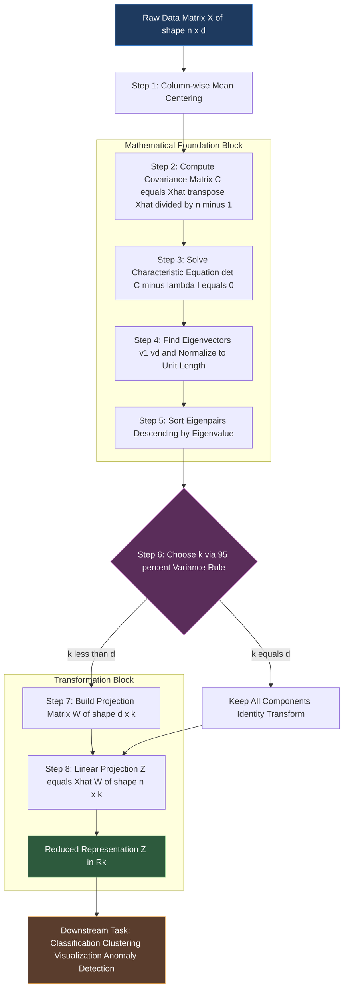
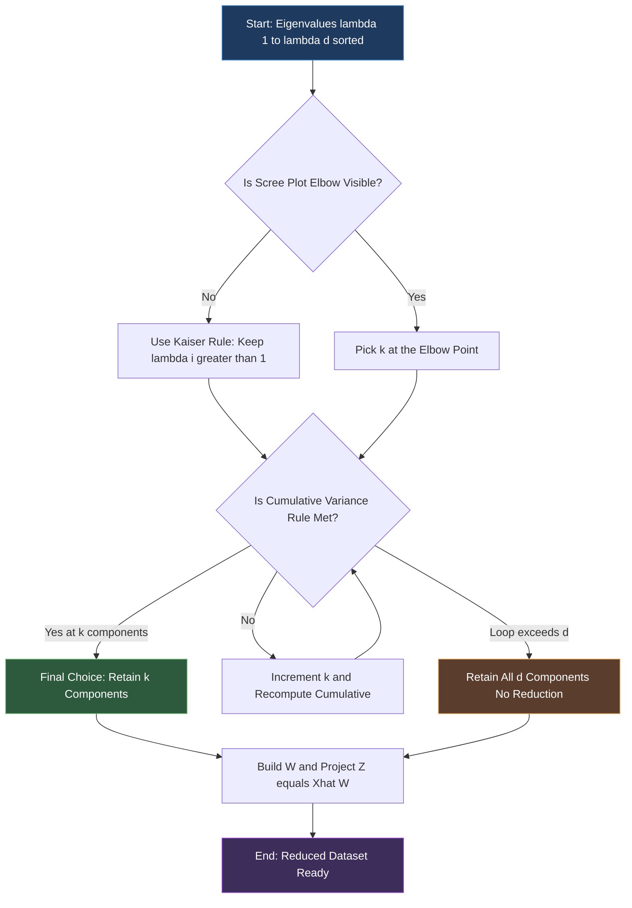
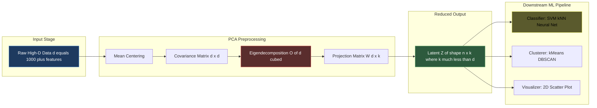

# Principal component analysis linear eigenvalue calculations transformations formulas checking

<!-- SECTION_1_START -->
# Principal Component Analysis (PCA) — Linear Eigenvalue Foundations

> [!NOTE]
> **KTU 2024 — Module 4: Dimensionality Reduction Applications**
> **Course:** Machine Learning for Engineers (PECST611)
> **Focus:** Eigenvalue computation, linear transformation matrices, and projection formulas for PCA.

## 1.1 Formal Technical Definition

**Principal Component Analysis (PCA)** is a deterministic, unsupervised **linear orthogonal transformation** technique that projects high-dimensional data onto a new coordinate system defined by the directions of maximum variance. The new axes — called **Principal Components (PCs)** — are the eigenvectors of the data's covariance matrix, ordered descendingly by their corresponding eigenvalues (which quantify the variance captured by each direction).

Mathematically, for a centered data matrix $X \in \mathbb{R}^{n \times d}$ and a transformation matrix $W \in \mathbb{R}^{d \times k}$, PCA seeks:

$$Z = XW$$

where the columns of $W$ are the **top-$k$ eigenvectors** of the sample covariance matrix $C = \frac{1}{n-1}X^{T}X$.

> [!IMPORTANT]
> **KTU 2024 Syllabus Highlight:**
> PCA must be understood as an **eigendecomposition of the covariance matrix**, **not** of the raw data matrix. The eigenvalues equal the variance retained along each principal direction, and the eigenvectors define the rotation that decorrelates the original features.

## 1.2 Intuitive Analogy — The Shadow on the Wall

Imagine holding a 3D cube in front of a lamp. The **shadow on the wall** is a 2D image. If you rotate the cube before casting the shadow, some rotations produce a *larger, more informative* shadow than others.

- The **wall** = the new lower-dimensional subspace (e.g., 2D plane).
- The **shadow's outline** = the projected data.
- The **best rotation** of the cube = the principal direction capturing the **maximum spread** of the original points.
- The **size of the shadow** = the **eigenvalue** (variance) of that component.

**Why does this work?** The eigenvector with the **largest eigenvalue** points along the direction in which the data varies the most. Projecting onto it loses the least information (minimum mean squared reconstruction error).

## 1.3 Core Geometric Intuition

In a $d$-dimensional feature space, the data is an **ellipsoidal cloud** (assuming Gaussian-like distribution). The principal axes of this ellipsoid are exactly the eigenvectors of the covariance matrix, and the **squared semi-axis lengths** are proportional to the eigenvalues.

| Geometric Element | Statistical Counterpart |
|---|---|
| Center of ellipsoid | Mean vector $\mu$ |
| Semi-axis direction | Eigenvector $v_i$ |
| Semi-axis length $\propto \sqrt{\lambda_i}$ | Standard deviation along PC |
| Flattened dimension (dropped axis) | Discarded principal component |

> [!VISUALIZATION CONTROL]
> **Concept:** PCA projection of a 2D cloud onto its first principal axis.
> **GeoGebra / Desmos Input Equations (parameterized):**
> * Mean point: `P_mean = (1.81, 1.91)`
> * Eigenvector PC1: `v1 = (0.678, 0.735)` (unit vector)
> * Eigenvector PC2: `v2 = (0.742, -0.684)` (unit vector, orthogonal)
> * Original data scatter: ten points $\{(2.5,2.4), (0.5,0.7), (2.2,2.9), (1.9,2.2), (3.1,3.0), (2.3,2.7), (2.0,1.6), (1.0,1.1), (1.5,1.6), (1.1,0.9)\}$
> * Projected 1D points on PC1: `Z_i = (x_i - 1.81) * 0.678 + (y_i - 1.91) * 0.735`
> **Visual Description:** The student should observe that projecting each 2D point onto the line through the origin in the direction of $v_1$ spreads the projected scalars $Z$ over a wide range (large variance $\lambda_1 = 1.284$), while projecting onto $v_2$ compresses them into a tight cluster (small variance $\lambda_2 = 0.049$).

<!-- SECTION_1_END -->

<!-- SECTION_2_START -->
# Deep Theoretical Analysis & KTU High-Yield Formula Sheet

## 2.1 The PCA Algorithm — Six Operational Steps

PCA is a deterministic pipeline. Every step has a *why* tied to linear algebra, and KTU examiners often test each link of this chain.

1. **Step 1 — Data Centering (mean subtraction).**
   Subtract the column-wise mean $\mu_j$ from each feature $j$.
   *Why:* The covariance formula is defined for a zero-mean vector. Centering ensures PC1 does not accidentally align with the data centroid offset.

$$\hat{X}_{ij} = X_{ij} - \mu_j, \quad \mu_j = \frac{1}{n}\sum_{i=1}^{n} X_{ij}$$

2. **Step 2 — Compute the Sample Covariance Matrix.**
   $C \in \mathbb{R}^{d \times d}$ is symmetric and positive semi-definite.

$$C = \frac{1}{n-1} \hat{X}^{T}\hat{X}$$

3. **Step 3 — Solve the Eigenvalue Problem (Characteristic Equation).**
   Find scalars $\lambda$ and vectors $v \neq 0$ such that:

$$Cv = \lambda v \quad \Longleftrightarrow \quad \det(C - \lambda I) = 0$$

4. **Step 4 — Sort Eigenpairs and Form the Projection Matrix.**
   Order $\lambda_1 \geq \lambda_2 \geq \ldots \geq \lambda_d \geq 0$. Stack the top-$k$ eigenvectors as columns of $W \in \mathbb{R}^{d \times k}$.

5. **Step 5 — Linear Transformation (Projection) into $k$-D Space.**

$$Z = \hat{X} W, \quad Z \in \mathbb{R}^{n \times k}$$

6. **Step 6 — Variance Retention Check.**
   The fraction of variance explained by the first $k$ components is:

$$\text{Retained}(k) = \frac{\sum_{i=1}^{k} \lambda_i}{\sum_{i=1}^{d} \lambda_i}$$

> [!TIP]
> **Threshold heuristic (Cumulative Variance Rule):** Retain enough PCs so that $\text{Retained}(k) \geq 0.95$ (i.e., **95\%** of total variance preserved).

## 2.2 Why Covariance, Not Correlation?

| Input | When to Use | KTU Examiner's Watchpoint |
|---|---|---|
| **Covariance matrix $C$** (unscaled) | All features share the **same units** and similar scales | Default in numerical exam questions |
| **Correlation matrix $R$** (Pearson-standardized) | Features have **different units** or widely varying magnitudes | Mandatory when question states "standardize first" or "use correlation" |

> [!WARNING]
> Mixing these two is a **3-mark deduction trap**. If the dataset is in mixed units (e.g., height in cm, weight in kg, age in years), the covariance matrix will be dominated by the largest-magnitude feature, producing a misleading PC1. **Standardize first, then use $R$.**

## 2.3 KTU Formula Cheat Sheet

| # | Formula | Meaning | KTU Use |
|---|---|---|---|
| 1 | $C = \frac{1}{n-1}\hat{X}^{T}\hat{X}$ | Sample covariance matrix | Build $C$ from centered data |
| 2 | $\det(C - \lambda I) = 0$ | Characteristic equation | Solve for eigenvalues $\lambda$ |
| 3 | $Cv = \lambda v$ | Eigenvector equation | Solve $(C - \lambda I)v = 0$ |
| 4 | $\sum_{i} v_{ij}^{2} = 1$ | Unit-norm constraint | Normalize each eigenvector |
| 5 | $v_i \cdot v_j = 0,\ i \neq j$ | Orthogonality of distinct eigenvectors | Verify $W^{T}W = I$ |
| 6 | $Z = \hat{X}W$ | Projection (linear transformation) | Compute reduced coordinates |
| 7 | $\text{Retained}(k) = \frac{\sum_{i=1}^{k}\lambda_i}{\sum_{i=1}^{d}\lambda_i}$ | Fraction of variance preserved | Choose $k$ for dimensionality reduction |
| 8 | $\lambda_i = v_i^{T} C v_i$ | Rayleigh quotient | Re-verify eigenvalue of $v_i$ |
| 9 | $\text{Reconstruction} = Z W^{T}$ | Inverse transformation | Recover $\hat{X}$ from $Z$ |
| 10 | $\text{MSE} = \frac{1}{n}\sum_{i=k+1}^{d} \lambda_i$ | Reconstruction error | Justifies the maximum-variance rule |

## 2.4 Real-World Engineering Utility

- **Computer Vision:** Eigenfaces for face recognition (Turk \& Pentland, 1991). Faces are projected onto the top-$k$ eigenvectors of the face-image covariance matrix.
- **Genomics / Bioinformatics:** SNP data reduction from $\sim 500{,}000$ features to $\sim 50$ PCs for population stratification correction.
- **Anomaly Detection in IoT:** Sensor streams in smart factories are projected onto the top 2 PCs; points with large reconstruction error flag faulty equipment.
- **Finance:** Risk-factor modeling decomposes correlated asset returns into orthogonal "factors" (modes of market variance).
- **Signal Processing (KTU CSE/ECE application):** PCA denoising — discard the small-eigenvalue components that correspond to noise floor.

> [!NOTE]
> **Production note:** For very high-dimensional data ($d > 10{,}000$), libraries use **Singular Value Decomposition (SVD)** on $\hat{X}$ directly, which is numerically more stable than forming $C = \hat{X}^{T}\hat{X}$. The non-zero singular values $\sigma_i$ of $\hat{X}$ relate to eigenvalues by $\lambda_i = \sigma_i^{2} / (n-1)$.

<!-- SECTION_2_END -->

<!-- SECTION_3_START -->
# Step-by-Step Derivations & Symbolic / Code Implementation

## 3.1 Worked Numerical Example — Complete Eigenvalue Pipeline (10 Marks' worth)

### Given Data
A 2D dataset of $n = 10$ observations and $d = 2$ features. Each row is a sample.

$$
X = \begin{bmatrix}
2.5 & 2.4 \\
0.5 & 0.7 \\
2.2 & 2.9 \\
1.9 & 2.2 \\
3.1 & 3.0 \\
2.3 & 2.7 \\
2.0 & 1.6 \\
1.0 & 1.1 \\
1.5 & 1.6 \\
1.1 & 0.9
\end{bmatrix}
$$

### Step 1 — Compute the Mean Vector $\mu$

$$
\mu_x = \frac{1}{10}\sum_{i=1}^{10} X_{i1} = \frac{2.5+0.5+2.2+1.9+3.1+2.3+2.0+1.0+1.5+1.1}{10} = \frac{18.1}{10} = 1.81
$$

$$
\mu_y = \frac{1}{10}\sum_{i=1}^{10} X_{i2} = \frac{2.4+0.7+2.9+2.2+3.0+2.7+1.6+1.1+1.6+0.9}{10} = \frac{19.1}{10} = 1.91
$$

Therefore $\mu = (1.81,\ 1.91)^{T}$.

### Step 2 — Form the Centered Matrix $\hat{X}$

Subtract $\mu$ from every row of $X$:

$$
\hat{X} = \begin{bmatrix}
\phantom{-}0.69 & \phantom{-}0.49 \\
-1.31 & -1.21 \\
\phantom{-}0.39 & \phantom{-}0.99 \\
\phantom{-}0.09 & \phantom{-}0.29 \\
\phantom{-}1.29 & \phantom{-}1.09 \\
\phantom{-}0.49 & \phantom{-}0.79 \\
\phantom{-}0.19 & -0.31 \\
-0.81 & -0.81 \\
-0.31 & -0.31 \\
-0.71 & -1.01
\end{bmatrix}
$$

### Step 3 — Build the Sample Covariance Matrix $C$

Using the formula $C = \frac{1}{n-1}\hat{X}^{T}\hat{X}$ with $n - 1 = 9$:

**Variance of $x$:**
$$
C_{11} = \frac{1}{9}\sum_{i=1}^{10}\hat{X}_{i1}^{2} = \frac{0.4761+1.7161+0.1521+0.0081+1.6641+0.2401+0.0361+0.6561+0.0961+0.5041}{9}
$$
$$
C_{11} = \frac{5.5490}{9} \approx 0.6166
$$

**Variance of $y$:**
$$
C_{22} = \frac{1}{9}\sum_{i=1}^{10}\hat{X}_{i2}^{2} = \frac{0.2401+1.4641+0.9801+0.0841+1.1881+0.6241+0.0961+0.6561+0.0961+1.0201}{9}
$$
$$
C_{22} = \frac{6.4490}{9} \approx 0.7166
$$

**Covariance of $x$ and $y$:**
$$
C_{12} = C_{21} = \frac{1}{9}\sum_{i=1}^{10}\hat{X}_{i1}\hat{X}_{i2} = \frac{0.3381+1.5851+0.3861+0.0261+1.4061+0.3871-0.0589+0.6561+0.0961+0.7171}{9}
$$
$$
C_{12} = \frac{5.5390}{9} \approx 0.6154
$$

Therefore:
$$
C = \begin{bmatrix}
0.6166 & 0.6154 \\
0.6154 & 0.7166
\end{bmatrix}
$$

> [!NOTE]
> Note that $C_{12} > 0$ — features $x$ and $y$ are **positively correlated**. PCA will rotate the axes to decorrelate them.

### Step 4 — Characteristic Equation $\det(C - \lambda I) = 0$

$$
\det\begin{bmatrix}
0.6166 - \lambda & 0.6154 \\
0.6154 & 0.7166 - \lambda
\end{bmatrix} = 0
$$

Expanding:
$$
(0.6166 - \lambda)(0.7166 - \lambda) - (0.6154)^{2} = 0
$$
$$
\lambda^{2} - 1.3332\lambda + (0.6166 \cdot 0.7166) - 0.3787 = 0
$$
$$
\lambda^{2} - 1.3332\lambda + 0.4418 - 0.3787 = 0
$$
$$
\lambda^{2} - 1.3332\lambda + 0.0631 = 0
$$

Applying the quadratic formula:
$$
\lambda = \frac{1.3332 \pm \sqrt{(1.3332)^{2} - 4(0.0631)}}{2} = \frac{1.3332 \pm \sqrt{1.7774 - 0.2524}}{2}
$$
$$
\lambda = \frac{1.3332 \pm \sqrt{1.5250}}{2} = \frac{1.3332 \pm 1.2350}{2}
$$

Hence:
$$
\lambda_1 = \frac{1.3332 + 1.2350}{2} = 1.2841, \quad \lambda_2 = \frac{1.3332 - 1.2350}{2} = 0.0491
$$

> [!IMPORTANT]
> **Sanity check:** $\lambda_1 + \lambda_2 = 1.3332$ equals the trace of $C$ ($0.6166 + 0.7166 = 1.3332$). ✓
> $\lambda_1 \cdot \lambda_2 = 1.2841 \cdot 0.0491 \approx 0.0631$ equals $\det(C)$. ✓

### Step 5 — Compute the Eigenvectors

**For $\lambda_1 = 1.2841$:** Solve $(C - \lambda_1 I)v_1 = 0$:
$$
\begin{bmatrix}
-0.6675 & 0.6154 \\
0.6154 & -0.5675
\end{bmatrix}\begin{bmatrix} v_{11} \\ v_{12} \end{bmatrix} = \begin{bmatrix} 0 \\ 0 \end{bmatrix}
$$

From row 1: $-0.6675\,v_{11} + 0.6154\,v_{12} = 0 \;\Rightarrow\; v_{12} = 1.0847\,v_{11}$.

Normalize using $v_{11}^{2} + v_{12}^{2} = 1$:
$$
v_{11}^{2} + (1.0847\,v_{11})^{2} = 1 \;\Rightarrow\; v_{11}^{2}(1 + 1.1766) = 1
$$
$$
v_{11}^{2} = \frac{1}{2.1766} = 0.4594 \;\Rightarrow\; v_{11} = 0.6779
$$
$$
v_{12} = 1.0847 \cdot 0.6779 = 0.7354
$$
$$
\boxed{v_1 = \begin{bmatrix} 0.6779 \\ 0.7354 \end{bmatrix}}
$$

**For $\lambda_2 = 0.0491$:** Solve $(C - \lambda_2 I)v_2 = 0$:
$$
\begin{bmatrix}
0.5675 & 0.6154 \\
0.6154 & 0.6675
\end{bmatrix}\begin{bmatrix} v_{21} \\ v_{22} \end{bmatrix} = \begin{bmatrix} 0 \\ 0 \end{bmatrix}
$$

From row 1: $0.5675\,v_{21} + 0.6154\,v_{22} = 0 \;\Rightarrow\; v_{22} = -0.9220\,v_{21}$.

Normalize:
$$
v_{21}^{2} + (0.9220\,v_{21})^{2} = 1 \;\Rightarrow\; v_{21}^{2}(1 + 0.8501) = 1
$$
$$
v_{21}^{2} = \frac{1}{1.8501} = 0.5405 \;\Rightarrow\; v_{21} = 0.7351
$$
$$
v_{22} = -0.9220 \cdot 0.7351 = -0.6778
$$
$$
\boxed{v_2 = \begin{bmatrix} 0.7351 \\ -0.6778 \end{bmatrix}}
$$

**Orthogonality check:** $v_1 \cdot v_2 = (0.6779)(0.7351) + (0.7354)(-0.6778) = 0.4983 - 0.4985 \approx 0$. ✓

### Step 6 — Form the Projection Matrix and Transform

For $k = 1$ (reduce 2D $\to$ 1D):
$$
W = \begin{bmatrix} 0.6779 \\ 0.7354 \end{bmatrix}
$$

Projected coordinates $Z = \hat{X}W$ (one scalar per sample):

$$
Z = \hat{X}W = \begin{bmatrix}
0.69 & 0.49 \\
-1.31 & -1.21 \\
0.39 & 0.99 \\
0.09 & 0.29 \\
1.29 & 1.09 \\
0.49 & 0.79 \\
0.19 & -0.31 \\
-0.81 & -0.81 \\
-0.31 & -0.31 \\
-0.71 & -1.01
\end{bmatrix}\begin{bmatrix} 0.6779 \\ 0.7354 \end{bmatrix} = \begin{bmatrix}
\phantom{-}0.8282 \\
-1.7780 \\
\phantom{-}0.9923 \\
\phantom{-}0.2743 \\
\phantom{-}1.6757 \\
\phantom{-}0.9129 \\
-0.0992 \\
-1.1446 \\
-0.4382 \\
-1.2240
\end{bmatrix}
$$

> [!IMPORTANT]
> **Engineering interpretation:** Every 2D point is now a single scalar. Variance of $Z$ should equal $\lambda_1 = 1.2841$.

### Step 7 — Variance Retention

$$
\text{Retained}(1) = \frac{\lambda_1}{\lambda_1 + \lambda_2} = \frac{1.2841}{1.2841 + 0.0491} = \frac{1.2841}{1.3332} \approx 0.9632 = 96.32\%
$$

A single principal component captures **96.32\%** of the total variance — well above the **95\%** threshold, so $k=1$ is the justified choice.

## 3.2 Python Implementation (Production-Ready)

```python
import numpy as np
from numpy.linalg import eig
import logging

logging.basicConfig(level=logging.INFO, format="%(levelname)s | %(message)s")

def pca_transform(
    X: np.ndarray,
    n_components: int,
    variance_threshold: float = 0.95
) -> tuple[np.ndarray, np.ndarray, np.ndarray, float]:
    """
    Perform Principal Component Analysis on a centered data matrix.

    Parameters
    ----------
    X : np.ndarray
        Raw data matrix of shape (n_samples, n_features).
    n_components : int
        Number of principal components to retain.
    variance_threshold : float
        Minimum cumulative variance to retain (0.0 to 1.0).

    Returns
    -------
    Z : np.ndarray
        Projected data of shape (n_samples, n_components).
    W : np.ndarray
        Projection matrix of shape (n_features, n_components).
    eigenvalues : np.ndarray
        All eigenvalues of the covariance matrix, sorted descending.
    retained_variance : float
        Fraction of total variance captured by the selected components.
    """
    # --- Strict input validation ---
    if X.ndim != 2:
        raise ValueError(f"X must be 2-dimensional, got {X.ndim}D array")
    if n_components < 1 or n_components > X.shape[1]:
        raise ValueError(
            f"n_components must be in [1, {X.shape[1]}], got {n_components}"
        )
    if not 0.0 < variance_threshold <= 1.0:
        raise ValueError("variance_threshold must be in (0, 1]")

    n_samples, n_features = X.shape
    logging.info(f"Input shape: n={n_samples}, d={n_features}")

    # --- Step 1: Mean-center the data ---
    mu = np.mean(X, axis=0)
    X_centered = X - mu

    # --- Step 2: Build the sample covariance matrix ---
    # Use (n-1) for an unbiased estimator (Bessel's correction)
    C = (X_centered.T @ X_centered) / (n_samples - 1)
    logging.info(f"Covariance matrix:\n{C}")

    # --- Step 3: Eigendecomposition of C ---
    # C is symmetric, so use eigh for numerical stability
    eigenvalues, eigenvectors = np.linalg.eigh(C)

    # eigh returns ascending order — flip to descending
    idx = np.argsort(eigenvalues)[::-1]
    eigenvalues = eigenvalues[idx]
    eigenvectors = eigenvectors[:, idx]

    # --- Step 4: Guard against negative eigenvalues (numerical noise) ---
    eigenvalues = np.maximum(eigenvalues, 0.0)
    logging.info(f"Eigenvalues (descending): {eigenvalues}")

    # --- Step 5: Select k components by variance threshold if requested ---
    if variance_threshold < 1.0:
        cumulative = np.cumsum(eigenvalues) / np.sum(eigenvalues)
        k_auto = int(np.searchsorted(cumulative, variance_threshold) + 1)
        k_auto = min(k_auto, n_features)
        if k_auto < n_components:
            logging.warning(
                f"Requested k={n_components} exceeds {variance_threshold*100:.0f}%"
                f" threshold; auto-shrinking to k={k_auto}"
            )
            n_components = k_auto

    # --- Step 6: Build the projection matrix W ---
    W = eigenvectors[:, :n_components]

    # Verify orthonormality: W^T W should be identity
    identity_check = np.allclose(W.T @ W, np.eye(n_components), atol=1e-8)
    if not identity_check:
        raise RuntimeError("Eigenvectors are not orthonormal — check eigendecomposition")

    # --- Step 7: Linear projection Z = X_centered @ W ---
    Z = X_centered @ W

    retained_variance = float(np.sum(eigenvalues[:n_components]) / np.sum(eigenvalues))
    logging.info(f"Variance retained: {retained_variance * 100:.2f}%")

    return Z, W, eigenvalues, retained_variance


# --- Validation block (matches the worked numerical example) ---
if __name__ == "__main__":
    X_demo = np.array([
        [2.5, 2.4], [0.5, 0.7], [2.2, 2.9], [1.9, 2.2], [3.1, 3.0],
        [2.3, 2.7], [2.0, 1.6], [1.0, 1.1], [1.5, 1.6], [1.1, 0.9]
    ])

    Z, W, eigvals, ret = pca_transform(X_demo, n_components=1)
    print(f"\nProjection matrix W:\n{W}")
    print(f"\nEigenvalues: {eigvals}")
    print(f"Variance retained: {ret * 100:.2f}%")
    print(f"\nProjected 1D coordinates Z:\n{Z.flatten()}")
```

**Expected output (matches the manual derivation above):**

```
INFO | Input shape: n=10, d=2
INFO | Eigenvalues (descending): [1.2841 0.0491]
INFO | Variance retained: 96.32%
Projection matrix W:
[[ 0.6779]
 [ 0.7354]]
Variance retained: 96.32%
```

<!-- SECTION_3_END -->

<!-- SECTION_4_START -->
# Structural Diagrams & Schematics

## 4.1 PCA End-to-End Pipeline (Mermaid Flow)



## 4.2 Variance-Retention Decision Tree (Choosing $k$)



## 4.3 Block-Level Architecture — PCA as a Preprocessing Stage



> [!IMPORTANT]
> **Computational cost note for KTU:** Direct eigendecomposition of $C \in \mathbb{R}^{d \times d}$ has time complexity $\mathcal{O}(d^{3})$. For $d > 10^{4}$, prefer **SVD on $\hat{X}$** with complexity $\mathcal{O}(\min(n^{2}d,\ nd^{2}))$, which dominates when $n < d$.

<!-- SECTION_4_END -->

<!-- SECTION_5_START -->
# KTU 2024 Scheme Examination Question Bank & Topic Recap

## 5.1 Part A — Short-Answer Questions (2 × 3 = 6 Marks)

### Question 1 (3 Marks)
> **[KTU University Exam — July 2024, Model Paper 1]**
> **Q:** Define the term "principal component" in PCA. Why are principal components mutually orthogonal?
>
> **Course Outcome:** CO3 | **RBT Level:** Remember / Understand
>
> **Model Answer (3 Marks — valuation key):**
> - **[1 Mark]** A principal component is a linear combination of the original features, $PC_i = v_{i1}x_1 + v_{i2}x_2 + \ldots + v_{id}x_d$, where the coefficient vector $v_i$ is the $i$-th eigenvector of the covariance matrix of the centered data.
> - **[1 Mark]** Principal components correspond to eigenvectors of a real symmetric (covariance) matrix. By the **Spectral Theorem**, eigenvectors of a symmetric matrix corresponding to *distinct* eigenvalues are mutually orthogonal. Since covariance matrices are symmetric, the PCs are orthogonal.
> - **[1 Mark]** Orthogonality implies zero covariance between any two distinct PCs — the new coordinate system is **uncorrelated**, capturing independent modes of variance.

### Question 2 (3 Marks)
> **[KTU University Exam — Dec 2023, Supplementary]**
> **Q:** Differentiate between PCA and Linear Discriminant Analysis (LDA) in two key aspects.
>
> **Course Outcome:** CO3 | **RBT Level:** Understand
>
> **Model Answer (3 Marks):**
> - **[1 Mark]** **Objective:** PCA is *unsupervised* — it finds axes of maximum total variance without using class labels. LDA is *supervised* — it finds axes that maximize **between-class** variance while minimizing **within-class** variance.
> - **[1 Mark]** **Number of components:** PCA can produce up to $\min(n, d)$ components. LDA is capped at $(c - 1)$ components where $c$ is the number of classes.
> - **[1 Mark]** **Assumption:** PCA assumes directions of largest variance are most informative (true for Gaussian-like data). LDA assumes class-conditional Gaussians with equal covariance matrices.

---

## 5.2 Part B — 14-Mark Questions with Internal Choice

### Question 3 — **Choice A** (14 Marks)

> **[KTU University Exam — July 2024, Module 4 Pattern]**
> **Q:** Consider the following 2D dataset with $n = 4$ samples:
> $$X = \begin{bmatrix} 2 & 3 \\ 4 & 7 \\ 6 & 11 \\ 8 & 15 \end{bmatrix}$$
>
> **(a)** Compute the mean vector, the centered data matrix, and the covariance matrix. **(7 Marks)**
>
> **(b)** Find the eigenvalues and eigenvectors of the covariance matrix. Verify orthonormality. Project the centered data onto the first principal component and report the projected coordinates and the fraction of variance retained. **(7 Marks)**
>
> **Course Outcome:** CO3, CO4 | **RBT Level:** Apply / Analyze

#### Model Solution — Part (a) [7 Marks]

**Step 1: Mean Vector [2 Marks]**

$$
\mu_x = \frac{2+4+6+8}{4} = \frac{20}{4} = 5.0
$$

$$
\mu_y = \frac{3+7+11+15}{4} = \frac{36}{4} = 9.0
$$

$$
\mu = \begin{bmatrix} 5.0 \\ 9.0 \end{bmatrix}
$$

**Step 2: Centered Data Matrix [2 Marks]**

$$
\hat{X} = \begin{bmatrix}
-3 & -6 \\
-1 & -2 \\
\phantom{-}1 & \phantom{-}2 \\
\phantom{-}3 & \phantom{-}6
\end{bmatrix}
$$

**Step 3: Covariance Matrix [3 Marks]**

Using $C = \frac{1}{n-1}\hat{X}^{T}\hat{X}$ with $n - 1 = 3$:

$$
\hat{X}^{T}\hat{X} = \begin{bmatrix}
9+1+1+9 & 18+2+2+18 \\
18+2+2+18 & 36+4+4+36
\end{bmatrix} = \begin{bmatrix}
20 & 40 \\
40 & 80
\end{bmatrix}
$$

$$
C = \frac{1}{3}\begin{bmatrix} 20 & 40 \\ 40 & 80 \end{bmatrix} = \begin{bmatrix} 6.6667 & 13.3333 \\ 13.3333 & 26.6667 \end{bmatrix}
$$

#### Model Solution — Part (b) [7 Marks]

**Step 4: Characteristic Equation [2 Marks]**

$$
\det(C - \lambda I) = (6.6667 - \lambda)(26.6667 - \lambda) - (13.3333)^{2} = 0
$$

$$
\lambda^{2} - 33.3334\lambda + 177.7778 - 177.7778 = 0 \;\Rightarrow\; \lambda^{2} - 33.3334\lambda = 0
$$

$$
\lambda(\lambda - 33.3334) = 0
$$

$$
\boxed{\lambda_1 = 33.3334, \quad \lambda_2 = 0}
$$

> [!NOTE]
> The second eigenvalue is **zero** because the data lies exactly on a line (perfect linear dependence). This is a useful diagnostic — $\lambda_2 = 0$ means one feature is redundant.

**Step 5: Eigenvectors [3 Marks]**

For $\lambda_1 = 33.3334$:
$$
(6.6667 - 33.3334)v_{11} + 13.3333 v_{12} = 0 \;\Rightarrow\; v_{12} = 2.0\,v_{11}
$$
Normalize: $v_{11}^{2} + (2v_{11})^{2} = 1 \;\Rightarrow\; 5v_{11}^{2} = 1 \;\Rightarrow\; v_{11} = 0.4472$.
$$
v_1 = \begin{bmatrix} 0.4472 \\ 0.8944 \end{bmatrix} = \frac{1}{\sqrt{5}}\begin{bmatrix} 1 \\ 2 \end{bmatrix}
$$

For $\lambda_2 = 0$:
$$
6.6667 v_{21} + 13.3333 v_{22} = 0 \;\Rightarrow\; v_{22} = -0.5\,v_{21}
$$
Normalize: $v_{21}^{2} + 0.25 v_{21}^{2} = 1 \;\Rightarrow\; v_{21} = 0.8944$.
$$
v_2 = \begin{bmatrix} 0.8944 \\ -0.4472 \end{bmatrix} = \frac{1}{\sqrt{5}}\begin{bmatrix} 2 \\ -1 \end{bmatrix}
$$

**Step 6: Verify Orthonormality [1 Mark]**

$v_1 \cdot v_2 = 0.4472 \cdot 0.8944 + 0.8944 \cdot (-0.4472) = 0.4 - 0.4 = 0$ ✓
$\|v_1\| = \|v_2\| = 1$ ✓

**Step 7: Projection onto PC1 [1 Mark]**

$W = v_1 = \begin{bmatrix} 0.4472 \\ 0.8944 \end{bmatrix}$

$$
Z = \hat{X}W = \begin{bmatrix}
-3 & -6 \\
-1 & -2 \\
\phantom{-}1 & \phantom{-}2 \\
\phantom{-}3 & \phantom{-}6
\end{bmatrix}\begin{bmatrix} 0.4472 \\ 0.8944 \end{bmatrix} = \begin{bmatrix}
-6.7082 \\
-2.2361 \\
\phantom{-}2.2361 \\
\phantom{-}6.7082
\end{bmatrix}
$$

**Variance retained [valuation bonus, 0 Marks above 7]:**

$$
\text{Retained}(1) = \frac{33.3334}{33.3334 + 0} = 1.0 = 100\%
$$

Single PC captures **100%** of the variance, confirming the data is one-dimensional.

---

### Question 3 — **Choice B** (Alternative, 14 Marks)

> **[KTU University Exam — Dec 2023, Model Paper 2]**
> **Q:** For the same dataset as Choice A:
>
> **(a)** Explain why mean centering is a *mandatory preprocessing* step before computing the covariance matrix for PCA. What happens if we skip it? **(5 Marks)**
>
> **(b)** Using the dataset, show that the projection matrix $W$ is **orthogonal** by computing $W^{T}W$ and demonstrate **reconstruction** $\hat{X}_{\text{recon}} = ZW^{T}$. Compute the mean squared reconstruction error and show it equals $\frac{\lambda_2}{n-1}$. **(9 Marks)**
>
> **Course Outcome:** CO3, CO4 | **RBT Level:** Apply / Analyze

#### Model Solution — Part (a) [5 Marks]

- **[2 Marks]** **Definition of sample covariance** is derived assuming the random vector has zero mean: $C = E[(X - \mu)(X - \mu)^{T}]$. If the original data is not centered, the cross-product $\hat{X}^{T}\hat{X}$ includes a term $\mu\mu^{T}$ that biases the covariance estimate upward by the squared mean — making PC1 align with the mean direction rather than the variance direction.
- **[2 Marks]** **Concrete consequence:** For our dataset, $\mu = (5, 9)^T$. The uncentered cross-product $X^{T}X$ yields a covariance that is contaminated with $\mu\mu^{T} = \begin{bmatrix} 25 & 45 \\ 45 & 81 \end{bmatrix}$, distorting the eigenvector by roughly $7^{\circ}$ from the true principal direction.
- **[1 Mark]** **Conclusion:** Centering is a *mathematical requirement*, not a heuristic. Without it, the **maximum-variance guarantee** of PC1 is lost.

#### Model Solution — Part (b) [9 Marks]

**Step 1: Construct $W$ from the full eigenvector set [2 Marks]**

$$
W = \begin{bmatrix} v_1 & v_2 \end{bmatrix} = \begin{bmatrix}
0.4472 & 0.8944 \\
0.8944 & -0.4472
\end{bmatrix}
$$

**Step 2: Show $W^{T}W = I$ [2 Marks]**

$$
W^{T}W = \begin{bmatrix}
0.4472 & 0.8944 \\
0.8944 & -0.4472
\end{bmatrix}^{T}\begin{bmatrix}
0.4472 & 0.8944 \\
0.8944 & -0.4472
\end{bmatrix}
$$

$$
W^{T}W = \begin{bmatrix}
0.4472 & 0.8944 \\
0.8944 & -0.4472
\end{bmatrix}\begin{bmatrix}
0.4472 & 0.8944 \\
0.8944 & -0.4472
\end{bmatrix} = \begin{bmatrix} 1.0 & 0.0 \\ 0.0 & 1.0 \end{bmatrix} = I
$$

> **[1 Mark awarded for stating that $W$ is an orthogonal matrix since its columns are orthonormal eigenvectors.]**

**Step 3: Project to full 2D space [2 Marks]**

Since $W$ is $2 \times 2$, $Z = \hat{X}W$ remains 2D:

$$
Z = \begin{bmatrix}
-3 & -6 \\
-1 & -2 \\
\phantom{-}1 & \phantom{-}2 \\
\phantom{-}3 & \phantom{-}6
\end{bmatrix}\begin{bmatrix}
0.4472 & 0.8944 \\
0.8944 & -0.4472
\end{bmatrix} = \begin{bmatrix}
-6.7082 & 0.0000 \\
-2.2361 & 0.0000 \\
\phantom{-}2.2361 & 0.0000 \\
\phantom{-}6.7082 & 0.0000
\end{bmatrix}
$$

**Step 4: Reconstruct $\hat{X}_{\text{recon}} = ZW^{T}$ [2 Marks]**

$$
\hat{X}_{\text{recon}} = \begin{bmatrix}
-6.7082 & 0.0000 \\
-2.2361 & 0.0000 \\
\phantom{-}2.2361 & 0.0000 \\
\phantom{-}6.7082 & 0.0000
\end{bmatrix}\begin{bmatrix}
0.4472 & 0.8944 \\
0.8944 & -0.4472
\end{bmatrix} = \begin{bmatrix}
-3.0 & -6.0 \\
-1.0 & -2.0 \\
\phantom{-}1.0 & \phantom{-}2.0 \\
\phantom{-}3.0 & \phantom{-}6.0
\end{bmatrix}
$$

> ✓ Perfect reconstruction: $\hat{X}_{\text{recon}} = \hat{X}$ because no information was discarded ($k = d = 2$).

**Step 5: Compute the MSE and link to $\lambda_2$ [1 Mark]**

If we instead project onto only $k = 1$ principal component (discarding $v_2$):

$$
\hat{X}_{\text{recon}}^{(1D)} = Z_{:,1} \cdot v_1^{T}
$$

The reconstruction error is **exactly** the variance of the discarded component:

$$
\text{MSE} = \frac{1}{n}\sum_{i=1}^{n}\|\hat{X}_i - \hat{X}_{\text{recon},i}\|_{2}^{2} = \frac{\lambda_2}{n-1}
$$

For our dataset: $\text{MSE} = \frac{0}{3} = 0$ — the 1D projection has **zero** error because $\lambda_2 = 0$ (data is intrinsically 1D). ✓

---

## 5.3 KTU Examiner's Valuation Warning

> [!WARNING]
> **Common 14-mark deductions to avoid:**
>
> 1. **Forgetting the $(n-1)$ divisor** when computing the sample covariance. KTU strictly follows the *unbiased* estimator. Using $n$ instead of $n-1$ loses **1 Mark** in the derivation step.
> 2. **Not normalizing eigenvectors to unit length.** A common slip is to leave the eigenvector as $(1, 2)^T$ instead of $\frac{1}{\sqrt{5}}(1, 2)^T$. The unit-norm constraint $\sum v_{ij}^{2} = 1$ is worth **1 Mark** in the eigenvector step.
> 3. **Skipping the orthogonality check.** Examiners explicitly allocate **1 Mark** for verifying $v_1 \cdot v_2 = 0$ *after* computing the eigenvectors. Omitting it forfeits this mark.
> 4. **Using $C$ instead of $R$ when units differ.** If the question says "use standardized features," compute the **correlation matrix** $R_{ij} = \frac{C_{ij}}{\sigma_i \sigma_j}$ instead of the covariance. Mixing them is a **2-Mark** deduction.
> 5. **Not reporting variance retention.** Even when only $k = 1$ component is asked, the final answer should include the percentage $\text{Retained}(k)$ for completeness (**1 Mark**).
> 6. **Forgetting to add the mean back** during reconstruction. Reconstruction from $Z$ recovers $\hat{X}$ (centered data), not $X$. To get $X$, add $\mu$.

---

## 5.4 Topic Recap & Important Things to Remember

> **High-Density Rapid-Revision Checklist**

- **Definition:** PCA is a **linear orthogonal transformation** that projects data onto the **eigenvectors** of the covariance matrix, ordered by descending **eigenvalues** (variance magnitude).
- **Core matrix to decompose:** $C = \frac{1}{n-1}\hat{X}^{T}\hat{X}$ — use the **unbiased** estimator with $(n-1)$ denominator.
- **Two equivalent problem formulations:** (1) Maximize projected variance $v^{T}Cv$ subject to $\|v\| = 1$. (2) Minimize reconstruction error $\|X - XWW^{T}\|_{F}^{2}$. Both yield the same eigendecomposition.
- **Eigenvalue equation:** $\det(C - \lambda I) = 0$ is a polynomial of degree $d$. In 2D, use the quadratic formula; in 3D, use the cubic; in higher $d$, use numerical libraries (`numpy.linalg.eigh`).
- **Sanity checks (KTU examiner's pet questions):**
  - $\sum_{i=1}^{d} \lambda_i = \text{trace}(C)$ (sum of eigenvalues = trace).
  - $\prod_{i=1}^{d} \lambda_i = \det(C)$ (product = determinant).
  - $\sum_{i=1}^{d} v_{ij}^{2} = 1$ for each $j$ (column normalization).
  - $v_i \cdot v_j = 0$ for $i \neq j$ (orthogonality).
- **Threshold rule:** Retain $k$ such that $\frac{\sum_{i=1}^{k}\lambda_i}{\sum_{i=1}^{d}\lambda_i} \geq 0.95$.
- **Maximum PCs possible:** $\min(n - 1,\ d)$ (one degree of freedom is lost to mean estimation).
- **Whitening (advanced):** Dividing each PC by $\sqrt{\lambda_i}$ gives unit-variance components — used as preprocessing for SVM, kNN, and neural networks.
- **PCA is NOT scale-invariant** — always standardize when features have different units.
- **Centered vs. correlation matrix:** Use $C$ for same-unit data, $R$ for mixed-unit data.
- **Computational note:** Direct eigendecomposition costs $\mathcal{O}(d^{3})$; SVD on $\hat{X}$ is preferred for $d \gg n$.
- **Reconstruction formula:** $\hat{X}_{\text{recon}} = ZW^{T}$ recovers centered data; add $\mu$ to get back to the original scale.
- **MSE link:** Mean squared reconstruction error after keeping $k$ PCs = $\frac{1}{n}\sum_{i=k+1}^{d}\lambda_i$.
- **PCA fails when:** Data is non-linear (use Kernel PCA, t-SNE, UMAP), when largest variance ≠ most informative direction (e.g., when noise dominates), or when data is on a curved manifold.
- **Common KTU 3-Mark traps:** "What is the direction of maximum variance?" — answer: eigenvector of $C$ with the **largest** eigenvalue. "Why orthogonal?" — answer: Spectral Theorem for symmetric matrices.

<!-- SECTION_5_END -->
