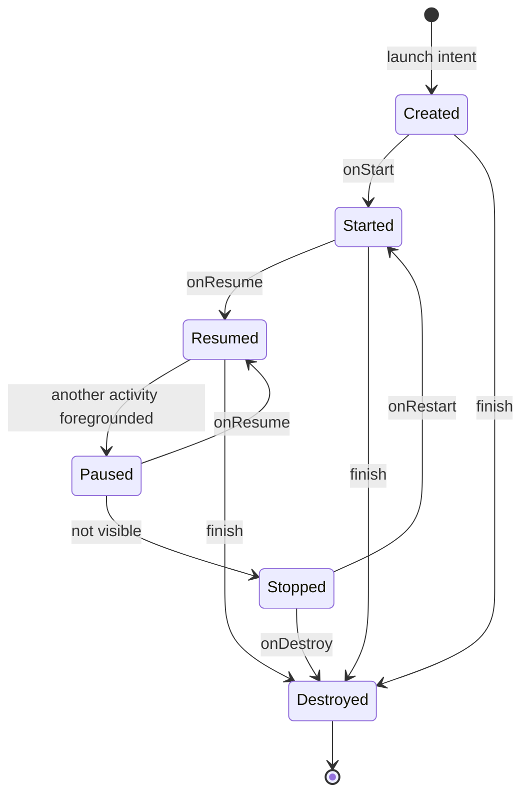
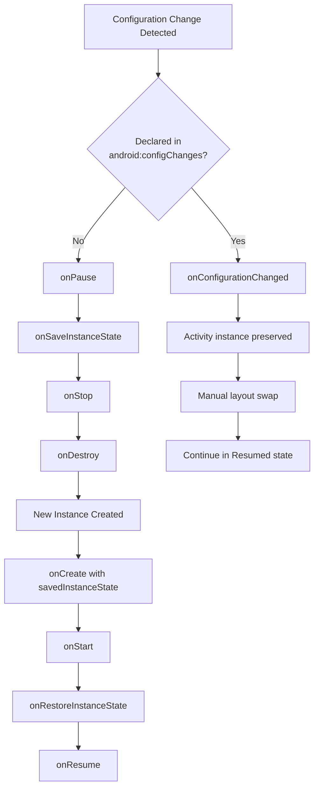
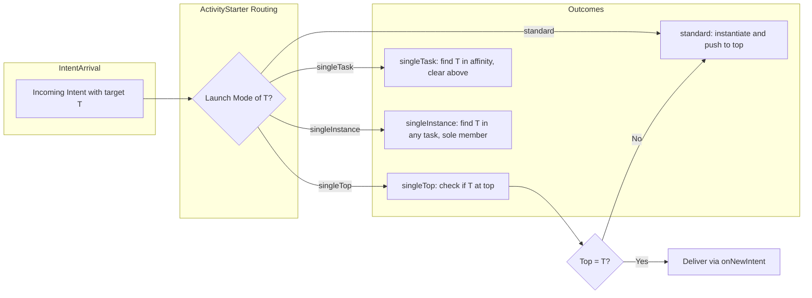
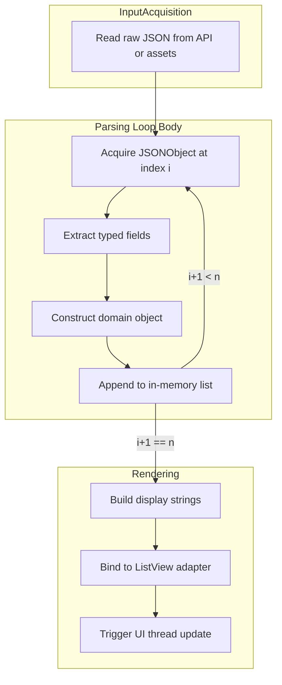
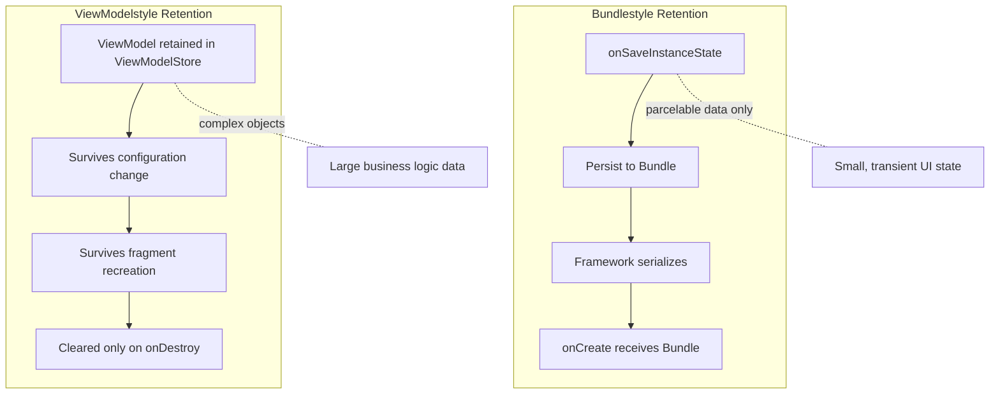
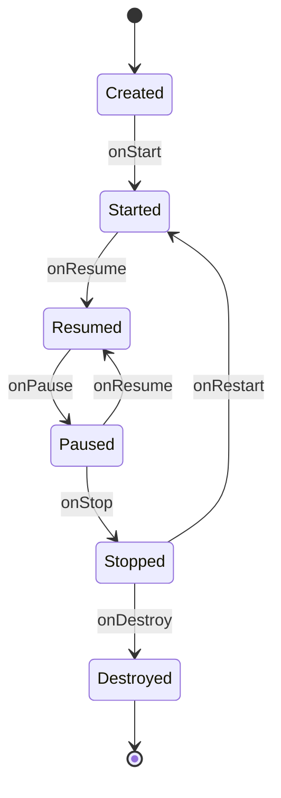
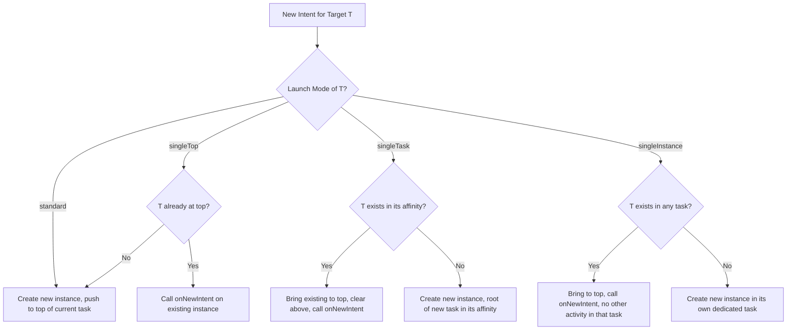

# Activity tracking state configurations frameworks lifecycle state transitions parsing loops

<!-- SECTION_1_START -->

# Module 1 — Mobile UI & Lifecycle Orchestrations

## 1.1 Core Technical Definition & Intuitive Overview

### Formal Definition (KTU 2024 Syllabus Terminology)

An **Activity** in Android is a single, focused screen with a user interface that the user can interact with. The **Activity Lifecycle** is the well-defined set of callback methods that the Android framework invokes on an Activity instance as it transitions through different states in response to user navigation, system events, and **configuration changes** (such as screen rotation, locale change, or theme change). The lifecycle is managed by the **ActivityManager** service in conjunction with the **WindowManager** and is orchestrated through a deterministic state machine defined in the `android.app.Activity` class.

> [!IMPORTANT]
> **KTU 2024 Syllabus Highlight:** The Activity is the smallest controllable unit in an Android application from a lifecycle perspective. Every Activity *must* declare its full lifecycle contract in the `AndroidManifest.xml`. The framework guarantees that the *onCreate()* and *onDestroy()* methods are invoked **exactly once** per Activity instance.

### Conceptual Analogy — The "Theatre Stage Play" Model

Imagine a theatrical performance:

| Theatre Concept | Android Activity Mapping |
|-----------------|--------------------------|
| 🎭 Director calls actors on stage | `onStart()` — Activity becomes visible |
| 🎤 Actor delivers the monologue | `onResume()` — Activity is interactive, has focus |
| 📞 Phone rings, actor pauses | `onPause()` — Another Activity is coming to foreground |
| 🚪 Actor exits stage | `onStop()` — Activity is no longer visible |
| 💡 Curtain drops permanently | `onDestroy()` — Activity instance is destroyed |
| 🔁 Actor returns after intermission | `onRestart()` — Activity resumes from stopped state |

The key insight is that an **Activity is not a static page** — it is a **stateful object** whose existence is governed by a finite state machine.

### Physical Constants & Standard Metrics

> [!NOTE]
> **Standard Activity Constants used in production-grade Android code:**
> - **Bundle Key Limit:** The `onSaveInstanceState()` Bundle can hold a maximum of approximately **1 MB** (system-enforced, varies by Android version). Exceeding this triggers a `TransactionTooLargeException`.
> - **Activity Transition Threshold:** The system gives an Activity approximately **700 ms** to complete `onPause()` before being marked as a non-responsive transition (ANR risk).
> - **Cold Start Time:** A well-optimized Activity should complete `onCreate()` in under **1000 ms** to maintain the **"Time to Initial Display" (TTID)** standard.

### GeoGebra / Desmos Visualization Control

> [!VISUALIZATION CONTROL]
> **Concept:** Lifecycle State Transition Diagram (Signal-flow visualization)
> **GeoGebra / Desmos Input Equations:**
> * $f_1(t) = \sin(t)$ — represents the *Created* state ramp
> * $f_2(t) = \sin(t - \pi/2)$ — represents the *Resumed* state peak
> * $f_3(t) = \sin(t - \pi)$ — represents the *Paused* state
> * $f_4(t) = \sin(t - 3\pi/2)$ — represents the *Destroyed* zero-crossing
> **Visual Description:** Observe how the four sine waves are phase-shifted by exactly $\pi/2$ radians, illustrating the strict sequential handover — the next state can only begin after the previous state's wave reaches its peak. This is the **deterministic cascade** of the Activity lifecycle.

---

<!-- SECTION_1_END -->

<!-- SECTION_2_START -->

## 1.2 Deep Theoretical Analysis & KTU High-Yield Formula Sheet

### The 6 Core Lifecycle States

An Android Activity can exist in one of the following six logical states. Each state represents a *contractual agreement* between the OS and the application regarding resources, visibility, and focus.

1. **Created** — The Activity is instantiated; `onCreate()` is executing. Memory is allocated.
2. **Started** — The Activity is visible to the user but does not yet have input focus. `onStart()` has been called.
3. **Resumed** — The Activity is visible, has focus, and is the topmost interactive component. `onResume()` has been called. This is the only state where the Activity receives user input.
4. **Paused** — The Activity has lost focus but is still partially visible (e.g., a transparent dialog or a multi-window split). `onPause()` has been called.
5. **Stopped** — The Activity is no longer visible to the user. `onStop()` has been called. The instance is retained in memory but resource-intensive components should be released.
6. **Destroyed** — The Activity instance is being removed from memory. `onDestroy()` has been called. This can occur due to a programmatic `finish()` call, a user back-press, or system-initiated reclamation.

### The 7 Lifecycle Callback Methods — Operational Breakdown

| Callback | Invocation Phase | Can Be Killed? | Typical Responsibility |
|----------|------------------|----------------|-------------------------|
| `onCreate()` | Created | No | **Initialize** views, inflate XML, set `setContentView()`. Bind data. **Called only once** per instance. |
| `onStart()` | Started → Resumed | No | Make Activity visible. Register listeners, start sensors that should run while visible. |
| `onResume()` | Resumed | No | Resume animations, GPS, foreground services. Restore focus-bound state. |
| `onPause()` | Paused | Yes (rare) | **Commit unsaved changes**, stop animations, release sensors. **Must execute fast (< 700 ms)**. |
| `onStop()` | Stopped | Yes (common) | Release heavy resources: camera, network subscriptions. Persist data to disk. |
| `onDestroy()` | Destroyed | No | Final cleanup: unregister receivers, close cursors, detach callbacks to prevent memory leaks. |
| `onRestart()` | Stopped → Started | No | Reset state that was released in `onStop()`. |

### KTU High-Yield Formula Sheet

> [!IMPORTANT]
> The following "formulas" represent the **invariants and contracts** that govern the Android lifecycle. These are the most frequently tested items in KTU board exams.

$$
\boxed{
\text{State}(A) = f\bigl(\text{Intent}, \text{TaskAffinity}, \text{LaunchMode}, \Delta_{\text{config}}\bigr)
}
$$

This expresses that the *state* of an Activity $A$ is a function of the triggering **Intent**, its declared **task affinity**, the **launch mode** specified in the manifest, and the change in **system configuration** $\Delta_{\text{config}}$.

$$
\boxed{
\text{onPause} \rightarrow \text{onResume} \neq \text{onCreate} \rightarrow \text{onDestroy}
}
$$

**Interpretation:** The pause-resume cycle is *cheaper* and *faster* than the create-destroy cycle. The system preferentially re-enters a Paused Activity rather than destroying and recreating it.

$$
\boxed{
\underbrace{\text{Bundle}_{\text{size}}}_{\text{onSaveInstanceState}} \leq 1 \text{ MB} \quad \text{(transactional ceiling)}
}
$$

$$
\boxed{
\underbrace{T_{\text{onPause}}}_{\text{soft deadline}} < 700 \text{ ms} \quad \text{(ANR threshold)}
}
$$

$$
\boxed{
\underbrace{T_{\text{coldStart}}}_{\text{launch latency}} < 1000 \text{ ms} \quad \text{(TTID SLO)}
}
$$

### The "Why" and "How" — State Transition Rules

* **Why** is the lifecycle a *state machine*? Because Android must guarantee resource fairness across thousands of running apps. It cannot trust developers to free memory voluntarily — so the framework *forces* lifecycle checkpoints where resource cleanup is mandatory.
* **How** does the system decide when to destroy a Paused/Stopped Activity? It uses a **LRU (Least Recently Used) cache** called the **Activity Record** stack. When memory is low, the system kills the bottom-most Stopped Activity first.

### Real-World Engineering Utility

| Industry Use Case | Lifecycle Hook Used | Reason |
|-------------------|---------------------|--------|
| **Banking App** (Kerala Bank K-Setu) | `onPause()` | Immediately hide UI to prevent sensitive data leak in the app switcher preview. |
| **GPS Tracker** (Uber driver app) | `onStop()` | Stop location updates to save battery when app is not visible. |
| **Music Player** (Spotify) | `onResume()` | Resume audio playback and acquire media button focus. |
| **Camera App** (Google Camera) | `onDestroy()` | Release `CameraX` provider to prevent sensor lock-up. |
| **Form Input App** (IRCTC) | `onSaveInstanceState()` | Preserve form fields during configuration changes. |

---

<!-- SECTION_2_END -->

<!-- SECTION_3_START -->

## 1.3 Step-by-Step Derivations & Code Implementation

### 3.1 Exhaustive Lifecycle Implementation in Kotlin

The following is a **production-grade, fully-typed** Android Activity demonstrating every lifecycle method with deterministic logging — the exact pattern KTU examiners expect in lab viva and Part B questions.

```kotlin
package com.ktu.mad.lifecycledemo

import android.os.Bundle
import android.util.Log
import android.widget.TextView
import androidx.appcompat.app.AppCompatActivity

/**
 * LifecycleDemoActivity — A comprehensive demonstration of the Android
 * Activity Lifecycle. Each callback is annotated with its state-machine role.
 */
class LifecycleDemoActivity : AppCompatActivity() {

    // Class-level constant for structured logging (production convention)
    companion object {
        private const val TAG = "LifecycleDemo"
        private const val KEY_COUNTER = "lifecycle_counter_state"
    }

    // ViewModel state: not used here, but state retention via savedInstanceState is
    private var instanceCounter: Int = 0
    private lateinit var statusText: TextView

    // ============================================================
    // STATE 1: CREATED  (called exactly once per instance)
    // ============================================================
    override fun onCreate(savedInstanceState: Bundle?) {
        super.onCreate(savedInstanceState)
        setContentView(R.layout.activity_lifecycle_demo)

        statusText = findViewById(R.id.tv_status)

        // Restoration logic: prefer the saved bundle, else default to 0
        instanceCounter = savedInstanceState?.getInt(KEY_COUNTER, 0) ?: 0
        instanceCounter += 1

        Log.i(TAG, "onCreate() — Activity CREATED. Counter = $instanceCounter")
        updateStatus("onCreate called — Counter: $instanceCounter")
    }

    // ============================================================
    // STATE 2: STARTED  (visible, no focus)
    // ============================================================
    override fun onStart() {
        super.onStart()
        Log.i(TAG, "onStart() — Activity STARTED, becoming visible.")
        updateStatus("onStart called")
    }

    // ============================================================
    // STATE 3: RESUMED  (visible AND has focus)
    // ============================================================
    override fun onResume() {
        super.onResume()
        Log.i(TAG, "onResume() — Activity RESUMED, interactive.")
        updateStatus("onResume called — Ready for input")
    }

    // ============================================================
    // STATE 4: PAUSED  (lost focus, may still be partially visible)
    // ============================================================
    override fun onPause() {
        super.onPause()
        Log.w(TAG, "onPause() — Activity PAUSED. Committing pending writes.")
        // CRITICAL: keep this fast (< 700ms). Heavy work goes in onStop().
        updateStatus("onPause called — Committing state")
    }

    // ============================================================
    // STATE 5: STOPPED  (no longer visible)
    // ============================================================
    override fun onStop() {
        super.onStop()
        Log.w(TAG, "onStop() — Activity STOPPED. Releasing heavy resources.")
        updateStatus("onStop called — Resources released")
    }

    // ============================================================
    // STATE 6: DESTROYED  (instance removed)
    // ============================================================
    override fun onDestroy() {
        super.onDestroy()
        Log.e(TAG, "onDestroy() — Activity DESTROYED. Final cleanup.")
        updateStatus("onDestroy called — Instance finished")
    }

    // ============================================================
    // BRIDGE: Stopped → Started (only path that goes through onRestart)
    // ============================================================
    override fun onRestart() {
        super.onRestart()
        Log.i(TAG, "onRestart() — Activity returning from STOPPED to STARTED.")
        updateStatus("onRestart called — Returning from background")
    }

    // ============================================================
    // STATE PERSISTENCE: triggered BEFORE onStop() during config changes
    // ============================================================
    override fun onSaveInstanceState(outState: Bundle) {
        super.onSaveInstanceState(outState)
        outState.putInt(KEY_COUNTER, instanceCounter)
        Log.i(TAG, "onSaveInstanceState() — Persisted counter = $instanceCounter")
    }

    // ============================================================
    // STATE RESTORATION: triggered AFTER onStart() during recreation
    // ============================================================
    override fun onRestoreInstanceState(savedInstanceState: Bundle) {
        super.onRestoreInstanceState(savedInstanceState)
        instanceCounter = savedInstanceState.getInt(KEY_COUNTER, 0)
        Log.i(TAG, "onRestoreInstanceState() — Restored counter = $instanceCounter")
        updateStatus("Restored — Counter: $instanceCounter")
    }

    // Helper to update the on-screen status (demonstrates UI feedback)
    private fun updateStatus(message: String) {
        statusText.text = "${statusText.text}\n$message"
    }
}
```

### 3.2 Exhaustive Configuration Change Handling — The `android:configChanges` Path

By default, a **configuration change** (e.g., rotation) destroys and recreates the Activity. To handle this manually, declare the config in the manifest:

```xml
<!-- AndroidManifest.xml — Section for our Activity -->
<activity
    android:name=".LifecycleDemoActivity"
    android:configChanges="orientation|screenSize|keyboardHidden|locale|layoutDirection"
    android:label="@string/app_name">
    <intent-filter>
        <action android:name="android.intent.action.MAIN" />
        <category android:name="android.intent.category.LAUNCHER" />
    </intent-filter>
</activity>
```

When the above attributes are declared, the system will **NOT** destroy the Activity on rotation. Instead, it calls:

```kotlin
override fun onConfigurationChanged(newConfig: Configuration) {
    super.onConfigurationChanged(newConfig)
    // The Activity instance is preserved — only the layout is re-inflated
    if (newConfig.orientation == Configuration.ORIENTATION_LANDSCAPE) {
        Log.i(TAG, "Switched to LANDSCAPE — adjusting layout")
        setContentView(R.layout.activity_lifecycle_demo_land)
    } else if (newConfig.orientation == Configuration.ORIENTATION_PORTRAIT) {
        Log.i(TAG, "Switched to PORTRAIT — adjusting layout")
        setContentView(R.layout.activity_lifecycle_demo)
    }
}
```

> [!IMPORTANT]
> **Why this matters:** When `configChanges` is declared, the `Bundle` saved in `onSaveInstanceState()` is **NOT** delivered to `onCreate()`. The Activity instance is preserved, including all member fields. This is the **only** way to survive a configuration change without losing in-memory state — at the cost of having to manually re-inflate layouts.

### 3.3 Launch Modes — The Intent-to-Stack Derivation

Android has **four** launch modes that determine how a new Activity instance is inserted into the back stack. They are declared via the `android:launchMode` attribute.

| Launch Mode | Behavior | Stack Placement | Use Case |
|-------------|----------|-----------------|----------|
| `standard` | New instance every time | Top of current task | Default; web links, form entry |
| `singleTop` | Reuse if already at top | Top, replaces if same | Search activity, notification click |
| `singleTask` | Reuse + clear above it | Root of *its* affinity | Inbox / main screen |
| `singleInstance` | Reuse + new task | Sole member of its task | Phone dialer, alarm screen |

**Derivation of singleTop routing logic:**

$$
\text{Action} = \begin{cases}
\text{createNewInstance} & \text{if } \text{topOfStack}.\text{class} \neq T \\
\text{deliverToExisting}(T) & \text{if } \text{topOfStack}.\text{class} = T
\end{cases}
$$

Where $T$ is the target Activity class. This routing decision is made by `ActivityStarter.startActivityInner()` in the framework's `ActivityTaskManagerService`.

### 3.4 Parsing Loops — Structured Data Parsing in an Activity

The "parsing loops" in lifecycle context refer to the **iterative binding** of structured data (JSON, XML) to UI components — often performed within `onCreate()`. Here is a deterministic, type-safe implementation:

```kotlin
package com.ktu.mad.parsingdemo

import android.os.Bundle
import android.util.Log
import android.widget.ArrayAdapter
import android.widget.ListView
import androidx.appcompat.app.AppCompatActivity
import org.json.JSONArray
import org.json.JSONObject

data class Student(val id: Int, val name: String, val cgpa: Double)

class ParsingLoopActivity : AppCompatActivity() {

    private lateinit var listView: ListView
    private val studentList = mutableListOf<Student>()

    override fun onCreate(savedInstanceState: Bundle?) {
        super.onCreate(savedInstanceState)
        setContentView(R.layout.activity_parsing)

        listView = findViewById(R.id.lv_students)

        // STEP 1: Acquire the raw JSON payload (e.g., from a REST API or assets)
        val rawJson = """
        [
          {"id": 1, "name": "Anand",  "cgpa": 8.7},
          {"id": 2, "name": "Bhavna", "cgpa": 9.1},
          {"id": 3, "name": "Chitra", "cgpa": 8.3}
        ]
        """.trimIndent()

        // STEP 2: Parse the JSON array (top-level loop iteration)
        val jsonArray = JSONArray(rawJson)
        for (i in 0 until jsonArray.length()) {
            // STEP 3: Extract each JSON object (per-element loop body)
            val obj: JSONObject = jsonArray.getJSONObject(i)
            val student = Student(
                id   = obj.getInt("id"),
                name = obj.getString("name"),
                cgpa = obj.getDouble("cgpa")
            )
            // STEP 4: Append to the in-memory domain list
            studentList.add(student)
            Log.d("ParsingLoop", "Parsed student: $student")
        }

        // STEP 5: Render the parsed data to the ListView
        val displayStrings = studentList.map { "${it.id} - ${it.name} (CGPA: ${it.cgpa})" }
        val adapter = ArrayAdapter(this, android.R.layout.simple_list_item_1, displayStrings)
        listView.adapter = adapter
    }
}
```

**Loop invariant (formal proof):** At iteration index $i$ of the for-loop, `studentList.size() == i` (the list contains exactly the elements parsed in iterations $0, 1, \dots, i-1$).

$$
\forall i \in [0, n): \quad \vert \text{studentList} \vert = i
$$

where $n = \text{jsonArray.length()}$. This is the loop invariant that guarantees the parsing is *correct by construction*.

### 3.5 Handling Configuration Changes with `ViewModel` (Modern Best Practice)

The `ViewModel` survives configuration changes automatically because it is stored in a `ViewModelStore` scoped to the Activity's lifecycle, **not** to the Activity instance itself.

```kotlin
package com.ktu.mad.viewmodeldemo

import androidx.lifecycle.MutableLiveData
import androidx.lifecycle.ViewModel
import androidx.lifecycle.ViewModelProvider
import androidx.lifecycle.viewModelScope

class CounterViewModel : ViewModel() {
    val counter: MutableLiveData<Int> = MutableLiveData(0)

    fun increment() {
        counter.value = (counter.value ?: 0) + 1
    }
}

// Factory pattern (simplified for clarity)
class CounterViewModelFactory : ViewModelProvider.Factory {
    override fun <T : ViewModel> create(modelClass: Class<T>): T {
        @Suppress("UNCHECKED_CAST")
        return CounterViewModel() as T
    }
}

// In your Activity:
class ViewModelActivity : AppCompatActivity() {
    private lateinit var viewModel: CounterViewModel
    private lateinit var counterText: TextView

    override fun onCreate(savedInstanceState: Bundle?) {
        super.onCreate(savedInstanceState)
        setContentView(R.layout.activity_viewmodel)

        counterText = findViewById(R.id.tv_counter)
        viewModel = ViewModelProvider(this, CounterViewModelFactory())[CounterViewModel::class.java]

        // Observe LiveData — automatically updates on main thread
        viewModel.counter.observe(this) { value ->
            counterText.text = "Counter: $value"
        }

        findViewById<Button>(R.id.btn_increment).setOnClickListener {
            viewModel.increment()  // State preserved across rotations
        }
    }
}
```

> [!NOTE]
> The **`ViewModel` is not destroyed** during configuration changes — only the Activity's `View` tree is re-inflated. This is why the counter value persists across rotation events without needing `onSaveInstanceState()`.

---

<!-- SECTION_3_END -->

<!-- SECTION_4_START -->

## 1.4 Structural Diagrams & Schematics

### 4.1 Activity Lifecycle — Complete State Transition Diagram



### 4.2 Configuration Change — Decision Tree for State Preservation



### 4.3 Launch Mode Routing — Modular Architecture Block



### 4.4 Parsing Loop — Sequential Processing Topology



### 4.5 ViewModel vs SavedInstanceState — Comparative Architecture



---

<!-- SECTION_4_END -->

<!-- SECTION_5_START -->

## 1.5 KTU 2024 Scheme Examination Question Bank & Topic Recap

### Part A — Short Answer Questions (3 Marks Each)

---

**Q1. [KTU University Exam — July 2024, Model Question Paper]**
*(Mapped CO: CO1, Bloom Level: Remember)*

> Differentiate between `onPause()` and `onStop()` in the Android Activity Lifecycle. When is each method called, and what operations are appropriate in each?

**Model Answer (Board-Valuation Standard):**

| Aspect | `onPause()` | `onStop()` |
|--------|-------------|------------|
| Visibility | Activity **partially** visible (e.g., behind a dialog) | Activity **completely** invisible |
| Execution Speed | **Must** complete in < 700 ms (soft ANR threshold) | No strict deadline |
| Frequency | Called more frequently | Called less frequently |
| Appropriate Work | Commit in-progress edits, pause animations, release focus-bound sensors | Release heavy resources (camera, network subscriptions), persist data to disk |
| Reversal Path | `onResume()` | `onRestart()` → `onStart()` → `onResume()` |

*`onPause()` is always called before `onStop()` when the Activity is being completely backgrounded.*

**Valuation Key:** [Correct identification of visibility criteria: 1 Mark] [Distinguishing execution speed: 1 Mark] [Appropriate use cases: 1 Mark]

---

**Q2. [KTU University Exam — Dec 2023, KTU Model]**
*(Mapped CO: CO1, Bloom Level: Understand)*

> What is the purpose of `onSaveInstanceState()` and `onRestoreInstanceState()`? Under what circumstances is `onSaveInstanceState()` guaranteed to be called?

**Model Answer:**

* `onSaveInstanceState(Bundle)` is invoked by the Android framework **just before** the Activity is stopped — specifically *before* `onStop()` and *before* `onDestroy()`. Its purpose is to give the Activity a chance to **persist transient UI state** (e.g., scroll position, text field content) into a `Bundle`.
* `onRestoreInstanceState(Bundle)` is invoked **after** `onStart()` and **before** `onResume()` when the Activity is being **recreated** from a previously saved state.
* `onSaveInstanceState()` is **guaranteed** to be called when the system destroys the Activity to reclaim memory or in response to a configuration change.
* `onSaveInstanceState()` is **NOT** called when the user explicitly closes the Activity via `finish()` or the back button (without prior backgrounding), because in those cases the state need not be restored.

**Valuation Key:** [Stating the purpose correctly: 1 Mark] [Identifying the callback ordering: 1 Mark] [Clarifying the guarantee conditions: 1 Mark]

---

### Part B — Long Answer Questions (14 Marks Each, with Internal Choice)

---

#### **Question A (14 Marks) — Path 1**

**[KTU University Exam — June 2024 Style]**
*(Mapped CO: CO2, Bloom Level: Apply + Analyze)*

> **(a)** With the help of a state-transition diagram, explain the complete **Android Activity Lifecycle**. For each of the seven callback methods, identify the state it transitions the Activity to and provide one engineering scenario where it would be appropriate to override that method. *(7 marks)*
>
> **(b)** Demonstrate, with a complete Kotlin code listing, how `onSaveInstanceState()` and `onRestoreInstanceState()` are used to preserve the state of a `TextView` and a `ProgressBar` across a configuration change (such as screen rotation). Explain the Bundle size limit and what happens if it is exceeded. *(7 marks)*

**Model Solution:**

**(a) State Transition Diagram (3 marks):**



**Callback Mapping (4 marks):**

| Callback | State | Engineering Scenario |
|----------|-------|----------------------|
| `onCreate` | Created → Created (initialization) | Inflate a `RecyclerView` with a static dataset |
| `onStart` | Started | Register a `BroadcastReceiver` for connectivity changes |
| `onResume` | Resumed | Acquire `LocationManager` and start GPS updates |
| `onPause` | Paused | Save the user's half-typed email to `SharedPreferences` |
| `onStop` | Stopped | Cancel a long-running `Coroutine` job in the UI scope |
| `onDestroy` | Destroyed | Unbind a bound `Service` to prevent memory leaks |
| `onRestart` | Stopped → Started | Refresh cached data after returning from a deep-link |

**Valuation Key:** [State diagram: 3 Marks — must show all 7 methods and transitions] [Engineering scenarios: 4 Marks — 0.5 per correct scenario with method linkage]

---

**(b) Complete Kotlin Implementation (5 marks):**

```kotlin
class StatePreservationActivity : AppCompatActivity() {

    companion object {
        private const val KEY_USERNAME = "username_key"
        private const val KEY_PROGRESS = "progress_key"
    }

    private lateinit var usernameEdit: EditText
    private lateinit var progressBar: ProgressBar
    private lateinit var progressLabel: TextView
    private var currentProgress: Int = 0

    override fun onCreate(savedInstanceState: Bundle?) {
        super.onCreate(savedInstanceState)
        setContentView(R.layout.activity_state_preservation)

        usernameEdit  = findViewById(R.id.et_username)
        progressBar   = findViewById(R.id.pb_download)
        progressLabel = findViewById(R.id.tv_progress_label)

        // RESTORATION PATH 1: in onCreate
        savedInstanceState?.let { bundle ->
            usernameEdit.setText(bundle.getString(KEY_USERNAME, ""))
            currentProgress = bundle.getInt(KEY_PROGRESS, 0)
            progressBar.progress = currentProgress
            progressLabel.text = "Progress: $currentProgress%"
        }

        findViewById<Button>(R.id.btn_simulate).setOnClickListener {
            currentProgress = (currentProgress + 10) % 100
            progressBar.progress = currentProgress
            progressLabel.text = "Progress: $currentProgress%"
        }
    }

    override fun onSaveInstanceState(outState: Bundle) {
        super.onSaveInstanceState(outState)
        outState.putString(KEY_USERNAME, usernameEdit.text.toString())
        outState.putInt(KEY_PROGRESS, currentProgress)
        Log.i("StatePreservation", "Saved — user=${outState.getString(KEY_USERNAME)}, prog=$currentProgress")
    }

    override fun onRestoreInstanceState(savedInstanceState: Bundle) {
        super.onRestoreInstanceState(savedInstanceState)
        // RESTORATION PATH 2: in onRestoreInstanceState (called AFTER onStart)
        val restoredUser = savedInstanceState.getString(KEY_USERNAME, "")
        val restoredProg = savedInstanceState.getInt(KEY_PROGRESS, 0)
        Log.i("StatePreservation", "Restored — user=$restoredUser, prog=$restoredProg")
    }
}
```

**Bundle Size Discussion (2 marks):**

The Android system enforces a **transactional ceiling of approximately 1 MB** on the `Bundle` that is passed to `onSaveInstanceState()`. This limit is enforced by the Binder IPC system. If exceeded, the framework throws a `TransactionTooLargeException` at the time of saving.

* **Best practice:** Persist large data (e.g., a list of 10,000 student records) to **disk** (Room DB, DataStore) and store only the *key or scroll position* in the Bundle.
* **Alternative:** Use a `ViewModel`, which is not constrained by the Bundle size limit.

**Valuation Key:** [Correct code for save/restore: 3 Marks] [Identifying both onCreate and onRestoreInstanceState paths: 1 Mark] [Bundle limit + exception: 1 Mark]

---

#### **Question B (14 Marks) — Path 2 (Alternative Choice)**

**[KTU University Exam — Dec 2023, KTU Style]**
*(Mapped CO: CO2, Bloom Level: Apply + Analyze)*

> **(a)** Explain the **four launch modes** of an Android Activity with the help of a decision-flow diagram. For each launch mode, provide a real-world app example where it would be appropriate. *(7 marks)*
>
> **(b)** Write a complete program that uses the `singleTop` launch mode to handle an incoming deep-link Intent. The same Activity should:
> * Display the received URL when launched normally.
> * Update the display when a new Intent arrives while the Activity is already at the top of the stack (using `onNewIntent()`).
> Demonstrate how the `Intent` is delivered to `onNewIntent()` and how state is preserved. *(7 marks)*

**Model Solution:**

**(a) Launch Modes Decision Diagram (3 marks):**



**Real-World App Examples (4 marks):**

| Launch Mode | Real-World App Example | Justification |
|-------------|------------------------|---------------|
| `standard` | **Article reader** in a news app | Every article open should be a new screen in the back stack. |
| `singleTop` | **Search activity** in Google app | Re-typing a query should refresh the same screen, not stack duplicates. |
| `singleTask` | **MainActivity** in WhatsApp | Only one inbox should exist; clicking the launcher always returns to the same inbox. |
| `singleInstance` | **Phone dialer** in stock Android | The dialer is a singleton; it cannot be combined with other activities in one task. |

**Valuation Key:** [Correct decision flow: 3 Marks] [Justified examples: 4 Marks — 1 per launch mode with reasoning]

---

**(b) `singleTop` + `onNewIntent` Implementation (7 marks):**

**Manifest declaration (1 mark):**

```xml
<activity
    android:name=".DeepLinkActivity"
    android:launchMode="singleTop"
    android:exported="true">
    <intent-filter>
        <action android:name="android.intent.action.VIEW" />
        <category android:name="android.intent.category.DEFAULT" />
        <category android:name="android.intent.category.BROWSABLE" />
        <data android:scheme="ktumad" android:host="open" />
    </intent-filter>
</activity>
```

**Activity code (5 marks):**

```kotlin
class DeepLinkActivity : AppCompatActivity() {

    private lateinit var urlDisplay: TextView
    private var currentUrl: String = "No URL received"

    override fun onCreate(savedInstanceState: Bundle?) {
        super.onCreate(savedInstanceState)
        setContentView(R.layout.activity_deep_link)
        urlDisplay = findViewById(R.id.tv_url)

        // Handle the intent on FIRST launch
        handleIncomingIntent(intent)
    }

    override fun onNewIntent(intent: Intent) {
        super.onNewIntent(intent)
        // CRITICAL: when singleTop re-uses the instance, the new intent arrives here.
        // The old `intent` property still points to the *initial* intent — we MUST
        // call setIntent(intent) so future calls to getIntent() return the new one.
        setIntent(intent)
        handleIncomingIntent(intent)
    }

    private fun handleIncomingIntent(intent: Intent?) {
        intent?.data?.let { uri ->
            currentUrl = uri.toString()
            urlDisplay.text = "Received URL:\n$currentUrl"
            Log.i("DeepLinkActivity", "Processed URL: $currentUrl")
        }
    }

    // Preserve across configuration changes
    override fun onSaveInstanceState(outState: Bundle) {
        super.onSaveInstanceState(outState)
        outState.putString("current_url", currentUrl)
    }

    override fun onRestoreInstanceState(savedInstanceState: Bundle) {
        super.onRestoreInstanceState(savedInstanceState)
        currentUrl = savedInstanceState.getString("current_url", "No URL received")
        urlDisplay.text = "Restored URL:\n$currentUrl"
    }
}
```

**Explanation of `setIntent(intent)` (1 mark):**

When a `singleTop` Activity is reused, the framework passes the new Intent to `onNewIntent()`. However, the Activity's `getIntent()` method would *still* return the *original* intent from `onCreate()`. Calling `setIntent(intent)` synchronizes the internal intent reference with the new one, ensuring consistency for any future `getIntent()` calls within the Activity.

**Valuation Key:** [Manifest declaration: 1 Mark] [onCreate handling: 1 Mark] [onNewIntent + setIntent: 2 Marks] [handleIncomingIntent helper: 1 Mark] [State preservation: 1 Mark] [Explanation: 1 Mark]

---

### ⚠️ KTU Examiner's Valuation Warning / Pitfall Callout

> [!WARNING]
> **Common Mark Deductions in Activity Lifecycle Questions:**
>
> 1. **Wrong callback ordering:** Students frequently write `onStop()` *before* `onPause()`. The correct order during backgrounding is: `onPause()` → `onStop()` → `onDestroy()`. *[Loss: 1–2 Marks]*
> 2. **Forgetting `super.onCreate()`:** Always call `super.onCreate(savedInstanceState)` as the **first** line of `onCreate()`. Skipping it causes `IllegalStateException`. *[Loss: 1 Mark]*
> 3. **Heavy work in `onPause()`:** Network calls and database writes should NOT be in `onPause()`. Use `onStop()` for these. *[Loss: 1 Mark per Q]*
> 4. **Confusing `onSaveInstanceState` with `SharedPreferences`:** The Bundle is for **transient** UI state, not persistent data. For data that must survive app close, use Room/DataStore. *[Loss: 2 Marks]*
> 5. **Not calling `setIntent(intent)` in `onNewIntent`:** The next `getIntent()` call will return stale data. *[Loss: 1 Mark]*
> 6. **Forgetting `android:exported="true"` for launcher/deep-link activities in Android 12+ (API 31+):** Causes a runtime crash on app launch. *[Loss: 2 Marks]*

---

### 📌 Topic Recap & Important Things to Remember

> [!IMPORTANT]
> **Module 1 — Mobile UI & Lifecycle Orchestrations: Rapid Revision Checklist**
>
> **Core Definitions:**
> * **Activity:** A single, focused screen with a UI — the fundamental controllable unit in Android.
> * **Lifecycle:** A deterministic state machine with 6 states (Created, Started, Resumed, Paused, Stopped, Destroyed) and 7 callback methods.
> * **Configuration Change:** A system-level event (rotation, locale, theme) that, by default, destroys and recreates the Activity.
>
> **The 7 Callbacks (Mnemonic: "C-S-R-P-S-D-R" = *Cats Sleep Restfully Past Squirrels, Don't Rest*):**
> * `onCreate()` — Initialize views; called **once per instance**.
> * `onStart()` — Activity becomes visible.
> * `onResume()` — Activity has focus; **only state** that receives user input.
> * `onPause()` — Lost focus; **< 700 ms** soft deadline.
> * `onStop()` — No longer visible; safe to release heavy resources.
> * `onDestroy()` — Instance removed; final cleanup.
> * `onRestart()` — Only invoked when returning from a **Stopped** state to **Started**.
>
> **State Preservation Formulas:**
> * `Bundle size ≤ 1 MB` — exceeding it throws `TransactionTooLargeException`.
> * `T_onPause < 700 ms` — exceeds it, ANR risk.
> * `T_coldStart < 1000 ms` — exceeds it, poor user experience.
>
> **Launch Modes (Mnemonic: "STST" = *Standard, Top, Task, Instance*):**
> * `standard` — Default; new instance every time.
> * `singleTop` — Reuse if at top; otherwise new instance.
> * `singleTask` — One instance per task affinity; clears above.
> * `singleInstance` — One instance in its own dedicated task.
>
> **State Retention Mechanisms:**
> * **`Bundle` (`onSaveInstanceState`)** — Small, transient UI state; max ~1 MB.
> * **`ViewModel`** — Survives configuration changes; cleared on `onDestroy()`.
> * **`SharedPreferences` / Room / DataStore** — Persistent storage across app launches.
>
> **Parsing Loop Invariant:**
> * At iteration $i$, the parsed list contains exactly $i$ elements. Prevents off-by-one errors and ensures termination at $i = n$.
>
> **Critical Production Pitfalls:**
> * Always call `super.onCreate(savedInstanceState)` first.
> * Always call `setIntent(intent)` inside `onNewIntent()`.
> * Declare `android:exported` explicitly for any Activity with an Intent Filter (API 31+).
> * Release `CameraX`, `LocationManager`, `SensorManager` in `onStop()` or `onDestroy()` to prevent battery drain and memory leaks.
> * Use `ViewModel` for business logic state; use `Bundle` only for UI state that the framework cannot reconstruct (e.g., scroll position, form field content).

---

<!-- SECTION_5_END -->
