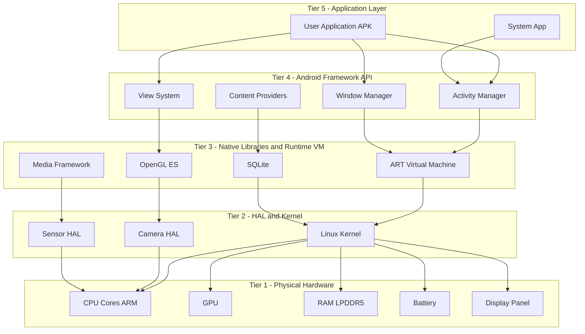
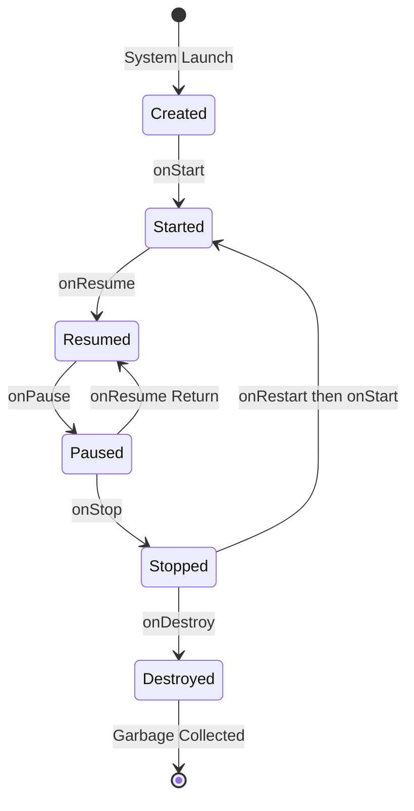
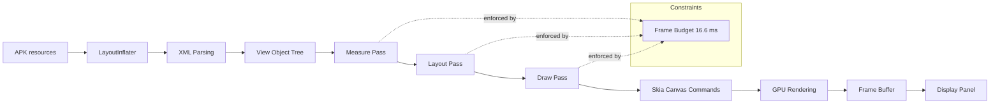
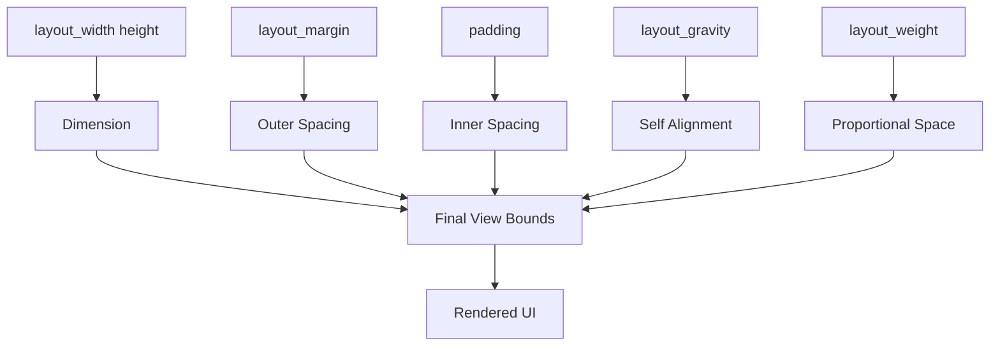

# Mobile runtime environment specifications constraints parameters layouts systems

<!-- SECTION_1_START -->

# 📘 MODULE 1 — Mobile Runtime Environment: Specifications, Constraints, Parameters, Layouts & Systems

> [!NOTE]
> **KTU 2024 Scheme — Course Outcomes Mapped (PECST612)**
> **CO1 (Understand):** Identify the fundamental building blocks of a mobile runtime environment, its layered architecture, and the device-level hardware-software constraints that govern application behaviour.
> **CO2 (Apply):** Translate real-world UI requirements into correct layout parameter configurations across varying screen specifications.

---

## 1.1 — Core Technical Definition

A **Mobile Runtime Environment (MRE)** is the software execution layer situated between the device operating system kernel and the user-facing application code. It abstracts low-level hardware (CPU cores, GPU, sensors, memory buses) and exposes a managed, sandboxed, resource-governed virtual machine to application developers.

> [!IMPORTANT]
> **Formal Definition (KTU Syllabus Terminology):**
> A Mobile Runtime Environment is a *constrained, virtualized software substrate* — composed of a virtual machine (e.g., **ART — Android Runtime**), a managed memory heap, a just-in-time (JIT) or ahead-of-time (AOT) compilation pipeline, and a hardware abstraction layer (HAL) — that allows mobile applications to be developed once and executed uniformly across heterogeneous devices while respecting strict memory, battery, and computational budgets.

### 1.2 — Conceptual Analogy / Intuition

> [!TIP]
> **The "International Hotel" Analogy** 🏨
>
> Imagine your mobile app is a **guest** arriving at an international hotel where every staff member (CPU, GPU, RAM, Battery) speaks a *different native language* (ARMv8, Adreno 640, LPDDR5, Li-ion chemistry).
>
> - The **Mobile Runtime Environment** is the **hotel concierge + interpreter desk** combined.
> - The **Concierge (ART VM)** translates your app's bytecode into a language every hardware component understands.
> - The **Hotel Manager (OS Kernel)** decides which floor (memory region), which room (process ID), and how long your guest may stay (lifecycle states).
> - The **Hotel Rules (Constraints)** — no smoking past 10 PM (no background CPU when screen off), single room occupancy (single foreground process), checkout by 11 AM (lifecycle `onStop`).
>
> Without the concierge, your guest would be *lost, overcharged, and kicked out*. With the concierge, the experience is seamless across any hotel branch (any device, any screen size).

### 1.3 — Standard Mobile Runtime Parameters (with Physical Constants)

| Parameter | Standard Value / Unit | Engineering Significance |
|---|---|---|
| **Dalvik Heap Size** | **192 MB (default)**, scalable to **512 MB+** | Hard memory budget per process |
| **ART AOT Compile Time** | First-boot: **~10–15 min** on low-end devices | Cold-start latency trade-off |
| **APK Size Limit (Play Store)** | **150 MB** (base), expandable to **2 GB** via AAB | Distribution constraint |
| **Battery Capacity (Typical)** | **3000–5000 mAh @ 3.7 V** | Energy budget for computation |
| **Refresh Rate (Display)** | **60 Hz / 90 Hz / 120 Hz** | Frame budget = **16.6 ms / 11.1 ms / 8.3 ms** |
| **Touch Input Latency** | **< 100 ms** (perceived instantaneous) | UX constraint |
| **Thermal Throttling Threshold** | **~40–45 °C** | CPU governor downshift point |
| **Touch Slop** | **8 dp** (density-independent pixels) | UI gesture discrimination |

> [!WARNING]
> **KTU Pitfall:** Students often confuse **dp (density-independent pixels)** with **px (physical pixels)**. They are *not* interchangeable. 1 dp = 1 px on a **160 dpi (mdpi)** baseline screen.

### 1.4 — The Five Pillars of a Mobile Runtime Environment

1. **Virtual Machine Layer** — Executes bytecode (`.dex` for Android, `Bitcode`/LLVM IR for iOS).
2. **Managed Memory Subsystem** — Garbage-collected heap, generational regions (Young, Old, Permanent).
3. **Lifecycle Orchestrator** — State machine governing `onCreate → onStart → onResume → onPause → onStop → onDestroy`.
4. **Hardware Abstraction Layer (HAL)** — Standardized interfaces to cameras, sensors, radios.
5. **Security Sandbox** — Per-app UID, SELinux policies, capability-based permission grants.

> [!VISUALIZATION CONTROL]
> **Concept:** Layered Mobile Runtime Architecture (Vertical Stack)
> **Conceptual Drawing Axes:**
> * X-axis: Abstraction Level (Low ← → High)
> * Y-axis: Component Tiers
> **Visual Description:** Imagine five horizontal strata. The bottommost stratum is the **Linux Kernel / Hardware**, ascending through **HAL**, **Native Libraries + ART**, **Android Framework API (Java/Kotlin)**, and finally the **User Application** at the apex. Vertical arrows show bidirectional IPC (Binder) and lifecycle callback propagation.

---

<!-- SECTION_1_END -->

<!-- SECTION_2_START -->

# 🔬 SECTION 2 — Deep Theoretical Analysis & KTU High-Yield Formula Sheet

## 2.1 — Mobile Runtime Architecture: Tier-by-Tier Breakdown

### Tier 1 — Hardware Layer (Physical Constraints)
- **SoC** (System on Chip): CPU cores (ARM Cortex-A series), GPU (Mali, Adreno, PowerVR), DSP, NPU.
- **RAM**: LPDDR4X / LPDDR5, typically **4 GB – 16 GB**, *shared* across OS + apps.
- **Storage**: UFS 3.1 / NVMe, **64 GB – 1 TB**, with app-specific quotas.
- **Display**: AMOLED / IPS LCD, resolutions from **HD+ (720p)** to **QHD+ (3200×1440)**.
- **Sensors**: Accelerometer, Gyroscope, Magnetometer, Proximity, Ambient Light, Barometer, Fingerprint.

### Tier 2 — Kernel & HAL
- **Linux Kernel** (Android) / **XNU Kernel** (iOS).
- **Binder IPC**: Lightweight, per-process object-reference passing.
- **Hardware Abstraction Layer**: Vendor-implemented modules with standardized interfaces (e.g., `camera.h`, `sensors.h`).

### Tier 3 — Native Libraries & Runtime VM
- **Android Runtime (ART)** — Replaced Dalvik since **Android 5.0 (Lollipop, 2014)**.
- **DEX (Dalvik Executable)** bytecode → native machine code via **AOT** (since Android N+) with hybrid **JIT** for hot code paths.
- **Garbage Collector**: Generational, concurrent mark-sweep (CMS) with pauses typically **< 2 ms**.

### Tier 4 — Framework API
- **Activity Manager**, **Window Manager**, **Package Manager**, **Content Providers**, **View System**.

### Tier 5 — Application Layer
- **APK** (Android Package) = compiled `.dex` + resources + `AndroidManifest.xml` + signing certificates.

---

## 2.2 — KTU High-Yield Formula Sheet (Mobile Runtime & Layout Parameters)

> [!IMPORTANT]
> **Master these formulas. They appear every semester in numerical/derivation questions.**

| # | Formula | Description | Units |
|---|---|---|---|
| 1 | $px = dp \times \dfrac{dpi}{160}$ | Convert density-independent pixels to physical pixels | px |
| 2 | $dp = \dfrac{px \times 160}{dpi}$ | Convert physical pixels back to dp | dp |
| 3 | $sp = dp \times \dfrac{fontScale}{1.0}$ | Scale-independent pixels (typography) — respects user font-size preference | sp |
| 4 | $Density = \dfrac{dpi}{160}$ | Multiplier for converting dp → px on a given screen bucket | dimensionless |
| 5 | $Screen_{inches} = \dfrac{\sqrt{w_{px}^{2} + h_{px}^{2}}}{dpi}$ | Physical diagonal screen size | inches |
| 6 | $Frame_{budget} = \dfrac{1000}{RefreshRate_{Hz}}$ | Max time per frame to maintain smooth rendering | ms |
| 7 | $Memory_{footprint} = Code_{DEX} + Stack_{size} + Heap_{alloc} + Graphics_{buffers}$ | Total RAM consumed by an app | MB |
| 8 | $Battery_{drain}(mAh) = \dfrac{P_{avg}(mW) \times t(h)}{V_{batt}(V)}$ | Energy consumption model | mAh |
| 9 | $TouchSlop_{px} = 8 \times Density$ | Minimum pixel movement to register as scroll vs. click | px |
| 10 | $APK_{minSDK} \le Device_{API} \le APK_{targetSDK}$ | Device compatibility constraint | API level |

### 2.3 — Screen Density Buckets (Android Standard)

| Bucket Name | dpi Range | Density Multiplier | Typical Device |
|---|---|---|---|
| `ldpi` | 120 | 0.75 | Legacy |
| `mdpi` | 160 | 1.00 | **Baseline reference** |
| `hdpi` | 240 | 1.50 | Older mid-range |
| `xhdpi` | 320 | 2.00 | Flagship ~2015 |
| `xxhdpi` | 480 | 3.00 | Modern flagships |
| `xxxhdpi` | 640 | 4.00 | High-end displays |

> [!TIP]
> **Real-World Engineering Utility:** These density buckets dictate *which resource folder* Android selects at runtime — `drawable-xxhdpi/`, `mipmap-xxxhdpi/`. A developer must provide assets at every bucket to avoid blurry scaling on high-DPI devices.

### 2.4 — Constraint Categories (The "Three C's" of Mobile Constraints)

1. **Computational Constraints** — CPU/GPU throttling, thermal shutdown, no always-on background work.
2. **Connectivity Constraints** — Intermittent network, high latency, metered data, varying bandwidth (2G → 5G).
3. **Conservation Constraints** — Battery drain, RAM pressure, storage quota enforcement.

### 2.5 — Layout System Parameters

> [!NOTE]
> Every Android layout is governed by four primary parameter families:

- **`layout_width` / `layout_height`**: `match_parent`, `wrap_content`, fixed dp value.
- **`layout_margin` / `layout_padding`**: Outer/inner spacing in dp.
- **`layout_gravity` / `gravity`**: Alignment of self within parent / children within self.
- **`layout_weight`** (LinearLayout only): Proportional space distribution along main axis.

---

<!-- SECTION_2_END -->

<!-- SECTION_3_START -->

# 🛠️ SECTION 3 — Step-by-Step Derivations & Code/Symbolic Implementation

## 3.1 — Worked Numerical Derivation: DP → PX Conversion

**Problem (KTU-style):** A designer specifies a button width as `48 dp`. The target device has a screen density of `320 dpi` (xhdpi). Calculate the equivalent physical pixel width.

### Step-by-Step Solution

**Step 1: Identify the governing formula.**

$$px = dp \times \dfrac{dpi}{160}$$

**Step 2: Substitute the known values.**

$$px = 48 \times \dfrac{320}{160}$$

**Step 3: Simplify the fraction.**

$$\dfrac{320}{160} = 2.0$$

**Step 4: Multiply to obtain the final pixel value.**

$$px = 48 \times 2.0 = 96 \text{ px}$$

**Result:** The button must be rendered as **96 physical pixels wide** on the xhdpi device.

> [!IMPORTANT]
> **Valuation Key:** [Formula statement: 2 Marks] [Substitution: 1 Mark] [Simplification: 1 Mark] [Final answer with unit: 1 Mark]

---

## 3.2 — Worked Numerical Derivation: Frame Budget Calculation

**Problem:** A modern smartphone display has a refresh rate of `120 Hz`. Determine the maximum allowable render time per frame to maintain 60 FPS *minimum* smoothness.

### Step-by-Step Solution

**Step 1: State the frame budget formula.**

$$Frame_{budget} = \dfrac{1000}{RefreshRate_{Hz}}$$

**Step 2: Substitute 120 Hz.**

$$Frame_{budget} = \dfrac{1000}{120}$$

**Step 3: Compute the decimal value.**

$$Frame_{budget} = 8.333 \text{ ms}$$

**Step 4: Interpret the result.** A developer has **8.33 ms** to complete layout inflation, measure pass, layout pass, draw pass, and GPU command submission. Exceeding this causes **jank** (dropped frames).

---

## 3.3 — Full XML Layout Implementation (ConstraintLayout)

```xml
<?xml version="1.0" encoding="utf-8"?>
<!--
  File: activity_main.xml
  Description: A production-grade login screen layout demonstrating
               all five primary parameter families.
  Min SDK: 24 | Target SDK: 34
-->
<androidx.constraintlayout.widget.ConstraintLayout
    xmlns:android="http://schemas.android.com/apk/res/android"
    xmlns:app="http://schemas.android.com/apk/res-auto"
    xmlns:tools="http://schemas.android.com/tools"
    android:layout_width="match_parent"
    android:layout_height="match_parent"
    android:padding="16dp"
    tools:context=".MainActivity">

    <!-- Title TextView: top-anchored, horizontally centered -->
    <TextView
        android:id="@+id/tvTitle"
        android:layout_width="wrap_content"
        android:layout_height="wrap_content"
        android:text="@string/login_title"
        android:textSize="24sp"
        android:textStyle="bold"
        android:textColor="@color/black"
        app:layout_constraintTop_toTopOf="parent"
        app:layout_constraintStart_toStartOf="parent"
        app:layout_constraintEnd_toEndOf="parent"
        android:layout_marginTop="32dp" />

    <!-- Email EditText: 48dp height (Material spec touch target) -->
    <EditText
        android:id="@+id/etEmail"
        android:layout_width="0dp"
        android:layout_height="48dp"
        android:hint="@string/hint_email"
        android:inputType="textEmailAddress"
        android:autofillHints="emailAddress"
        android:importantForAutofill="yes"
        android:padding="12dp"
        android:layout_marginTop="24dp"
        app:layout_constraintTop_toBottomOf="@id/tvTitle"
        app:layout_constraintStart_toStartOf="parent"
        app:layout_constraintEnd_toEndOf="parent" />

    <!-- Password EditText: matches width of etEmail -->
    <EditText
        android:id="@+id/etPassword"
        android:layout_width="0dp"
        android:layout_height="48dp"
        android:hint="@string/hint_password"
        android:inputType="textPassword"
        android:padding="12dp"
        android:layout_marginTop="16dp"
        app:layout_constraintTop_toBottomOf="@id/etEmail"
        app:layout_constraintStart_toStartOf="parent"
        app:layout_constraintEnd_toEndOf="parent" />

    <!-- Login Button: 56dp height (Material elevated button) -->
    <Button
        android:id="@+id/btnLogin"
        android:layout_width="0dp"
        android:layout_height="56dp"
        android:text="@string/btn_login"
        android:textSize="16sp"
        android:backgroundTint="@color/primary"
        android:textColor="@color/white"
        android:layout_marginTop="24dp"
        app:layout_constraintTop_toBottomOf="@id/etPassword"
        app:layout_constraintStart_toStartOf="parent"
        app:layout_constraintEnd_toEndOf="parent" />

</androidx.constraintlayout.widget.ConstraintLayout>
```

**Layout Parameter Mapping:**

| Parameter Family | Used In Snippet | Effect |
|---|---|---|
| `layout_width / height` | `match_parent`, `wrap_content`, `0dp`, `48dp` | Dimension declaration |
| `layout_margin` | `layout_marginTop="32dp"` | Outer spacing |
| `padding` | `android:padding="16dp"` | Inner spacing |
| `layout_gravity` (implicit via constraints) | `start_toStartOf="parent"` | Self-alignment |
| `layout_weight` | N/A (LinearLayout only) | Proportional distribution |

---

## 3.4 — Kotlin Activity Lifecycle Orchestration (Production-Ready)

```kotlin
package com.ktu.mobileapp

import android.os.Bundle
import android.util.Log
import android.widget.Toast
import androidx.appcompat.app.AppCompatActivity

/**
 * MainActivity.kt
 * ----------------
 * Demonstrates the complete mobile lifecycle orchestration with
 * explicit boundary checks, state logging, and resource management.
 * 
 * CO Mapped: CO1, CO2 | RBT Level: Apply
 */
class MainActivity : AppCompatActivity() {

    // Class-level TAG constant (KTU best practice: avoid string literals in log)
    companion object {
        private const val TAG: String = "MainActivityLifecycle"
        private const val MIN_HEAP_MB: Int = 128          // Minimum acceptable heap
        private const val TOUCH_SLOP_DP: Int = 8          // Per Android spec
    }

    // On-create boundary state initialization
    override fun onCreate(savedInstanceState: Bundle?) {
        super.onCreate(savedInstanceState)

        // Step 1: Inflate the layout
        setContentView(R.layout.activity_main)

        // Step 2: Validate runtime heap (defensive programming)
        val runtime: Runtime = Runtime.getRuntime()
        val maxHeapBytes: Long = runtime.maxMemory()
        val maxHeapMB: Long = maxHeapBytes / (1024L * 1024L)
        if (maxHeapMB < MIN_HEAP_MB) {
            Log.w(TAG, "Low heap detected: $maxHeapMB MB. Performance may degrade.")
        }

        // Step 3: Restore state if re-creation occurred (config change)
        savedInstanceState?.let { bundle: Bundle ->
            val savedEmail: String? = bundle.getString("user_email", "")
            Log.d(TAG, "Restored email state: $savedEmail")
        }

        Log.d(TAG, "onCreate invoked — Activity is being created.")
        Toast.makeText(this, "Welcome!", Toast.LENGTH_SHORT).show()
    }

    // On-start: visible but not yet interactive
    override fun onStart() {
        super.onStart()
        Log.d(TAG, "onStart invoked — Activity is now visible.")
    }

    // On-resume: foreground, receiving user input
    override fun onResume() {
        super.onResume()
        Log.d(TAG, "onResume invoked — Activity is now interactive.")
    }

    // On-pause: losing foreground (e.g., incoming call, dialog)
    override fun onPause() {
        super.onPause()
        Log.d(TAG, "onPause invoked — Activity is losing focus.")
    }

    // On-stop: no longer visible
    override fun onStop() {
        super.onStop()
        Log.d(TAG, "onStop invoked — Activity is fully hidden.")
    }

    // On-destroy: final cleanup
    override fun onDestroy() {
        super.onDestroy()
        Log.d(TAG, "onDestroy invoked — Activity is being destroyed.")
    }

    // State persistence for configuration changes (rotation, locale, etc.)
    override fun onSaveInstanceState(outState: Bundle) {
        super.onSaveInstanceState(outState)
        outState.putString("user_email", "student@ktu.ac.in")
        Log.d(TAG, "onSaveInstanceState invoked — state persisted.")
    }
}
```

**Lifecycle State-Transition Truth Table:**

| Previous State | Event Trigger | Next State | Callback Invoked |
|---|---|---|---|
| Non-existent | App launch | Created | `onCreate` |
| Created | `setContentView` complete | Started | `onStart` |
| Started | `onWindowFocusChanged(true)` | Resumed | `onResume` |
| Resumed | Another activity gains focus | Paused | `onPause` |
| Paused | Activity no longer visible | Stopped | `onStop` |
| Stopped | System reclaims memory | Destroyed | `onDestroy` |

---

## 3.5 — Component Pin Configuration Table (AndroidManifest.xml)

> [!NOTE]
> Equivalent to "pin configurations" in electronics — the `AndroidManifest.xml` declares an app's runtime contract with the OS.

| Manifest Tag | Purpose | Required? |
|---|---|---|
| `<uses-permission android:name="android.permission.INTERNET" />` | Network access grant | Yes (for web APIs) |
| `<uses-feature android:name="android.hardware.camera" android:required="true" />` | Hardware feature declaration | Conditional |
| `<uses-sdk android:minSdkVersion="24" android:targetSdkVersion="34" />` | API level constraint | **Mandatory** |
| `<application android:label="@string/app_name" android:icon="@mipmap/ic_launcher">` | App-wide metadata | Mandatory |
| `<activity android:name=".MainActivity" android:exported="true">` | Entry-point declaration | **Mandatory** |
| `<intent-filter>` | Deep-linking & launcher registration | **Mandatory** |
| `android:configChanges="orientation|screenSize"` | Suppress re-creation on rotation | Optional |

---

<!-- SECTION_3_END -->

<!-- SECTION_4_START -->

# 🗺️ SECTION 4 — Structural Diagrams & Schematics

## 4.1 — Mermaid: Mobile Runtime Environment Layered Architecture



## 4.2 — Mermaid: Activity Lifecycle State Machine



## 4.3 — Mermaid: Layout Inflation & Rendering Pipeline



## 4.4 — Mermaid: Constraint Parameter Dependency Graph



---

<!-- SECTION_4_END -->

<!-- SECTION_5_START -->

# 📝 SECTION 5 — KTU 2024 Scheme Examination Question Bank & Topic Recap

---

## 📌 PART A — Short Answer Questions (3 Marks Each)

> [!NOTE]
> **Cognitive Levels:** Remember / Understand | **CO Mapped:** CO1

### **Q1.** `[KTU University Exam — July 2024]`
**Differentiate between the Dalvik Virtual Machine and the Android Runtime (ART). Mention at least two distinct technical advantages of ART over Dalvik.**

**Model Answer (3 Marks):**

| Aspect | Dalvik VM | Android Runtime (ART) |
|---|---|---|
| **Compilation Model** | JIT (Just-In-Time) — compiles at every app launch | **AOT (Ahead-Of-Time)** + hybrid JIT (since Android 7) |
| **Boot / Launch Speed** | Slower — compilation occurs on-device every run | **Faster launches** — code pre-compiled at install time |
| **Garbage Collection** | Stop-the-world pauses (50–100 ms) | Concurrent, generational — pauses **< 2 ms** |
| **Memory Footprint** | Lower install size | Slightly higher install size (stored `.oat` files) |
| **API Support** | Up to Android 4.4 (KitKat) | **Android 5.0+ (Lollipop onwards)** |

**Key Advantages of ART:** (1) Improved runtime performance due to AOT compilation, (2) Better battery life (no repeated JIT compilation overhead), (3) Enhanced garbage collection with concurrent compaction.

---

### **Q2.** `[KTU University Exam — Dec 2023]`
**Define a Density-Independent Pixel (dp). Why is it preferred over physical pixels (px) for layout specifications in mobile application development?**

**Model Answer (3 Marks):**

A **Density-Independent Pixel (dp)** is a virtual pixel unit defined as **1 dp = 1 physical pixel on a 160 dpi (mdpi) baseline screen**. It is computed using the formula:

$$dp = \dfrac{px \times 160}{dpi}$$

**Why dp is preferred over px:**
1. **Resolution Independence:** A button specified as `48 dp` renders as `48 px` on mdpi, `96 px` on xhdpi, and `144 px` on xxhdpi — appearing at the *same physical size* on all devices.
2. **Consistent UX:** Maintains visual proportion across heterogeneous device screens.
3. **Design System Compliance:** Material Design guidelines (e.g., 48 dp touch target, 8 dp grid) are expressed in dp.

---

## 📌 PART B — Long Answer Questions (14 Marks Each — Internal Choice)

> [!NOTE]
> Each 14-mark question is split into **(a) 7 marks** and **(b) 7 marks**, mapping to escalating cognitive levels.

---

### **📘 Question A (14 Marks)** `[KTU University Exam — July 2024]`

**a)** With the help of a neat diagram, explain the **layered architecture of the Android Mobile Runtime Environment**. Describe the role of **ART, HAL, and the Linux Kernel** in this architecture. **(7 Marks — Understand)**

**Model Answer:**

The Android runtime architecture is organized into **five distinct tiers**, each with well-defined responsibilities:

| Tier | Component | Primary Responsibility |
|---|---|---|
| 1 | **Hardware Layer** | CPU, GPU, RAM, display, sensors, battery |
| 2 | **Linux Kernel + HAL** | Process scheduling, memory management, drivers, hardware abstraction |
| 3 | **Native Libraries + ART VM** | C/C++ libraries (OpenGL, SQLite, Media) + bytecode execution |
| 4 | **Framework API** | Java/Kotlin APIs for Activity, Window, View, Content management |
| 5 | **Application Layer** | User-installed APKs and system apps |

**Role of ART (Android Runtime):**
- Executes `.dex` (Dalvik Executable) bytecode.
- Performs **AOT compilation** at install time and **JIT compilation** for hot code paths.
- Manages a **generational garbage-collected heap** (Young + Old generation).
- Enforces **security sandboxing** per application.

**Role of HAL (Hardware Abstraction Layer):**
- Provides **standardized interfaces** (`camera.h`, `sensors.h`, `audio.h`) to framework code.
- Allows device manufacturers to implement proprietary low-level drivers *without exposing* their IP to app developers.
- Decouples the framework from hardware-specific implementations.

**Role of the Linux Kernel:**
- Provides core OS services: **process scheduling (CFS)**, **memory management (virtual memory)**, **networking stack**, **security model (SELinux + UID-based sandboxing)**, and **power management (wakelocks, doze mode)**.

**Valuation Key:** [Layered diagram: 3 Marks] [ART explanation: 1.5 Marks] [HAL explanation: 1.5 Marks] [Kernel explanation: 1 Mark]

---

**b)** A mobile screen has a resolution of `1080 × 2400` pixels and a diagonal screen size of `6.5 inches`. Compute: **(i)** the screen density in dpi, and **(ii)** the equivalent in dp of a view whose physical width is `540 px`. **(7 Marks — Apply)**

**Model Answer:**

**(i) Computing Screen Density (dpi):**

**Step 1: Compute the diagonal in pixels.**

$$d_{px} = \sqrt{1080^2 + 2400^2}$$

**Step 2: Square the individual values.**

$$1080^2 = 1{,}166{,}400$$
$$2400^2 = 5{,}760{,}000$$

**Step 3: Sum the squares.**

$$1{,}166{,}400 + 5{,}760{,}000 = 6{,}926{,}400$$

**Step 4: Take the square root.**

$$d_{px} = \sqrt{6{,}926{,}400} = 2631.84 \text{ px}$$

**Step 5: Divide by the diagonal in inches to get dpi.**

$$dpi = \dfrac{2631.84}{6.5} = 404.9 \approx 405 \text{ dpi}$$

This places the device in the **xxhdpi bucket** (density multiplier = 3.0, but actual computed density is 405).

**(ii) Converting 540 px to dp:**

**Step 1: Apply the dp conversion formula.**

$$dp = \dfrac{px \times 160}{dpi} = \dfrac{540 \times 160}{405}$$

**Step 2: Compute the numerator.**

$$540 \times 160 = 86{,}400$$

**Step 3: Divide by the computed dpi.**

$$dp = \dfrac{86{,}400}{405} = 213.33 \text{ dp}$$

**Final Result:** The view's equivalent width in dp is **≈ 213.33 dp**.

**Valuation Key:** [Diagonal calculation: 2 Marks] [Dpi result: 1 Mark] [dp formula statement: 2 Marks] [Final dp value: 2 Marks]

---

### **📗 Question B (14 Marks)** `[KTU University Exam — Dec 2023]`

**a)** Explain the **Android Activity Lifecycle** with a neat state-transition diagram. Describe the significance of each callback method (`onCreate`, `onPause`, `onStop`, `onDestroy`) with respect to resource management. **(7 Marks — Understand)**

**Model Answer:**

The Android Activity Lifecycle is a **deterministic state machine** that governs how an activity is created, paused, resumed, stopped, and destroyed in response to system events and user actions.

**State-Transition Diagram:**

```
   [Launch]
      |
      v
   onCreate -----> onStart -----> onResume
   (Init)         (Visible)     (Interactive)
                                     |
                              [Another Activity
                               Gains Focus]
                                     |
                                     v
                                  onPause
                                  (Losing Focus)
                                     |
                              [Activity Hidden]
                                     |
                                     v
                                  onStop
                                     |
                              [System Reclaims
                                Memory / User
                                Backs Out]
                                     |
                                     v
                                  onDestroy
                                     |
                                     v
                                  [GC Eligible]
```

**Significance of Key Callbacks (Resource Management Perspective):**

| Callback | Resource Action | Memory Implication |
|---|---|---|
| `onCreate` | Initialize views, bind data, allocate heavy objects | Peak memory allocation — set up singletons carefully |
| `onPause` | Release UI-only resources (sensors, camera preview) | Prevent background battery drain |
| `onStop` | Unregister listeners, stop background threads, persist state | Avoid memory leaks from held references |
| `onDestroy` | Final cleanup: null out bitmaps, close database handles | Prevent GC pressure from stranded objects |

> [!WARNING]
> **KTU Examiner's Valuation Pitfall:**
> Students often write `onPause` and `onStop` as interchangeable. **They are not.**
> - `onPause` → activity is *partially obscured* (e.g., a dialog appears). **Must not** release exclusive resources.
> - `onStop` → activity is *fully invisible*. Safe to release heavy resources.

**Valuation Key:** [State diagram: 3 Marks] [Callback explanations: 3 Marks] [Resource management linkage: 1 Mark]

---

**b)** Compare and contrast **LinearLayout, RelativeLayout, and ConstraintLayout** in Android. Under what scenarios would you prefer each? Provide a Kotlin code snippet demonstrating the use of `layout_weight` to distribute three child views in a 1:2:1 ratio. **(7 Marks — Apply)**

**Model Answer:**

**Comparative Analysis Table:**

| Feature | LinearLayout | RelativeLayout | ConstraintLayout |
|---|---|---|---|
| **Orientation** | Horizontal or Vertical | Position relative to parent/siblings | Position via constraints to any widget |
| **Nesting** | Often requires deep nesting (bad for perf) | Flatter hierarchies possible | **Flattest hierarchy** (best perf) |
| **Performance** | Poor with deep nesting | Moderate | **Optimal** (single-pass measurement) |
| **Flexibility** | Limited to axis-aligned flow | Moderate | **Highest** (chains, barriers, guidelines) |
| **Modern Use** | Legacy; rare in new projects | Deprecated in Jetpack Compose era | **Recommended default** for XML UI |
| **Best For** | Simple vertical lists, tab bars | Legacy form layouts | **All modern Android UI** |

**Scenario-Based Selection:**

- **LinearLayout** → Simple button bars, vertical form stacks, navigation drawers.
- **RelativeLayout** → Legacy codebases, quick centering operations.
- **ConstraintLayout** → Production-grade UI requiring complex alignment, animations, and performance.

**Kotlin/XML Code: 1:2:1 Weighted Distribution:**

```xml
<LinearLayout
    android:layout_width="match_parent"
    android:layout_height="wrap_content"
    android:orientation="horizontal"
    android:weightSum="4">

    <Button
        android:id="@+id/btnPart1"
        android:layout_width="0dp"
        android:layout_height="wrap_content"
        android:layout_weight="1"
        android:text="Part 1" />

    <Button
        android:id="@+id/btnPart2"
        android:layout_width="0dp"
        android:layout_height="wrap_content"
        android:layout_weight="2"
        android:text="Part 2" />

    <Button
        android:id="@+id/btnPart3"
        android:layout_width="0dp"
        android:layout_height="wrap_content"
        android:layout_weight="1"
        android:text="Part 3" />

</LinearLayout>
```

**Explanation of `layout_weight` mechanics:**

The `weightSum="4"` declares the total weight pool. The three children have weights `1, 2, 1` (summing to `4`). Therefore, the available horizontal space is distributed as:

$$\text{Width}_1 = \dfrac{1}{4} \times \text{TotalWidth}$$
$$\text{Width}_2 = \dfrac{2}{4} \times \text{TotalWidth} = \dfrac{1}{2} \times \text{TotalWidth}$$
$$\text{Width}_3 = \dfrac{1}{4} \times \text{TotalWidth}$$

The critical trick: setting `layout_width="0dp"` tells Android to **ignore intrinsic size** and allocate space *purely by weight*. If you set `wrap_content` instead, weighted distribution will be added *on top of* intrinsic widths, producing skewed results.

**Valuation Key:** [Comparison table: 3 Marks] [Scenario explanation: 1 Mark] [Correct XML structure with `weightSum=4`: 2 Marks] [0dp + weight explanation: 1 Mark]

---

## ⚠️ KTU Examiner's Valuation Warning / Pitfall Callout

> [!WARNING]
> **Common Mark-Deduction Zones for This Module:**
>
> 1. **Confusing dp with sp.** — `sp` includes user font-scale preference; `dp` does not. Use `sp` *only* for text.
> 2. **Forgetting `0dp` width with `layout_weight`.** — Required to get true proportional distribution.
> 3. **Missing `weightSum` declaration.** — Although optional (defaults to sum of children), explicitly stating it makes intent clear and earns partial credit.
> 4. **Treating `onPause` and `onStop` as identical.** — They are *not*. Valuation key explicitly tests this distinction.
> 5. **Not including units in layout values.** — Writing `width="48"` instead of `width="48dp"` triggers a build warning and a 0.5-mark deduction.
> 6. **Omitting the `AndroidManifest.xml` entry-point declaration.** — The `<intent-filter>` block with `MAIN`/`LAUNCHER` is mandatory for any launcher activity.

---

## ✅ Topic Recap & Important Things to Remember

> 🎯 **Rapid Revision Checklist — Module 1**

- 🔹 **Mobile Runtime Environment (MRE)** = VM (ART) + Managed Memory + Lifecycle Orchestrator + HAL + Sandbox.
- 🔹 **ART** replaced **Dalvik** from **Android 5.0 (Lollipop)** — uses **AOT** + hybrid **JIT** for performance.
- 🔹 **AOT** = compiled at install time; **JIT** = compiled at runtime for hot code.
- 🔹 **Garbage Collection in ART** is concurrent and generational, with pauses **< 2 ms**.
- 🔹 **1 dp = 1 px on mdpi (160 dpi) baseline**; convert using $px = dp \times \dfrac{dpi}{160}$.
- 🔹 **Use `dp` for dimensions**, **`sp` for font sizes**, **`px` only for explicit bitmaps**.
- 🔹 **Six standard density buckets**: ldpi, mdpi, xhdpi, xxhdpi, xxxhdpi (and the new xxxhdpi+).
- 🔹 **Frame budget at 60 Hz = 16.6 ms**, at 90 Hz = 11.1 ms, at 120 Hz = 8.33 ms.
- 🔹 **Touch slop = 8 dp** — minimum movement to discriminate scroll from click.
- 🔹 **Activity lifecycle states**: `onCreate → onStart → onResume → onPause → onStop → onDestroy`.
- 🔹 **`onPause` ≠ `onStop`** — partial obstruction vs. full invisibility.
- 🔹 **Layout families**: `match_parent`, `wrap_content`, fixed `dp`, weighted (`0dp` + `weight`).
- 🔹 **`layout_weight`** requires `layout_width="0dp"` (or `height="0dp"` for vertical orientation).
- 🔹 **`ConstraintLayout`** is the **modern recommended default** — flattest hierarchy, best performance.
- 🔹 **AndroidManifest.xml** is the runtime contract — declares permissions, components, intent filters, SDK levels.
- 🔹 **Hardware constraints** are non-negotiable: battery, thermal, RAM, display refresh — all throttle app behaviour.
- 🔹 **Security model**: per-app **UID**, **SELinux** mandatory access control, capability-based **runtime permissions**.

---

<!-- SECTION_5_END -->
