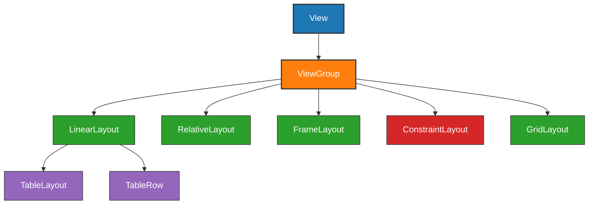
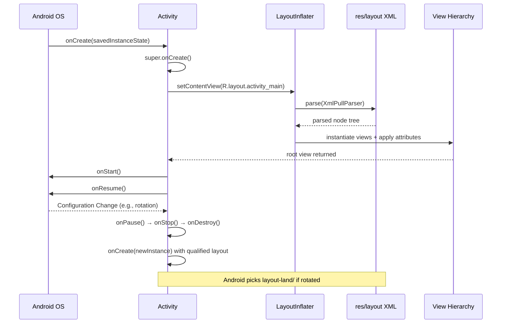
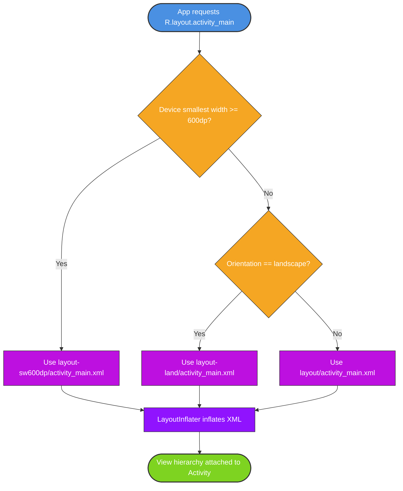
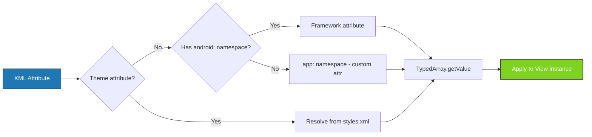
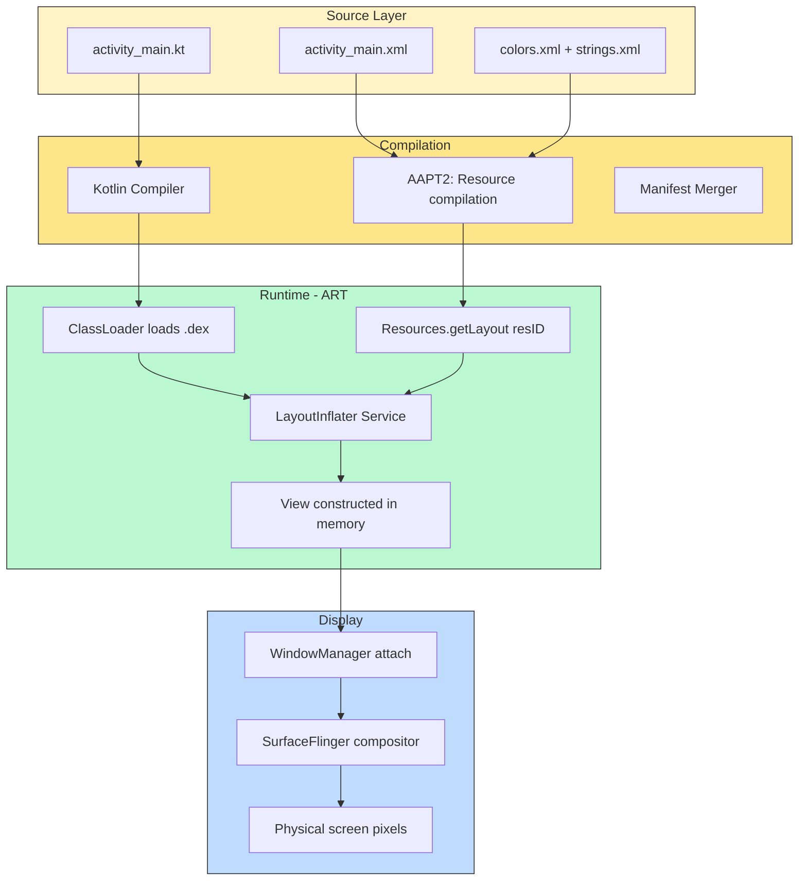

# UI view structuring blueprints layout templates configurations setups profiles

<!-- SECTION_1_START -->

# Mobile UI Layouts: The Architectural Blueprints of Android Screens

## 1.1 Core Technical Definition

In **Android Application Development**, a **Layout** is a structural XML-based blueprint that defines the visual hierarchy, spatial arrangement, dimensional constraints, and view-group composition of User Interface (UI) elements within an Activity or Fragment. Under the **KTU 2024 Scheme (PECST612 - Mobile Application Development)**, layouts are categorized as indirect subclasses of the `android.view.ViewGroup` class, forming the foundational skeleton upon which every interactive mobile screen is built.

The official Android documentation classifies layouts into two principal categories:

1. **ViewGroup Subclasses (Container Layouts)**: `LinearLayout`, `RelativeLayout`, `ConstraintLayout`, `FrameLayout`, `TableLayout`, `GridLayout`.
2. **Resource Qualifier Configurations (Layout Profiles)**: `layout-land/`, `layout-port/`, `layout-sw600dp/`, `layout-hdpi/`, enabling responsive design.

> [!IMPORTANT]
> **KTU Syllabus Highlight (Module 1.2):** Students must be able to differentiate between container-based layouts (structural templates) and resource qualifier-based configurations (environmental profiles). A layout **template** describes the static structure, while a layout **profile** describes the contextual configuration.

## 1.2 Intuitive Analogy: The Architect's Blueprint

Imagine you are an architect designing a **2BHK apartment floor plan**:

- The **Layout XML file** is your **architectural drawing** — it dictates *where* the sofa, door, and window go.
- The **ViewGroup** is the **room itself** (the boundary containing everything).
- The **View** is the **furniture** placed inside (a button, text, image).
- The **Attributes** (`layout_width`, `layout_height`, `padding`, `margin`) are the **measurements** you annotate on the drawing.
- The **Configuration Profiles** (`layout-land/`, `layout-sw600dp/`) are the **alternate floor plans** you provide for a rotated house (landscape view) or a larger mansion (tablet).

When the Android Runtime (ART) inflates these blueprints at runtime, it constructs the actual physical screen the user interacts with — much like a contractor reading blueprints to build a real apartment.

## 1.3 Physical Constants & Standard Units

The following are the **canonical Android measurement units**, which are critical for KTU numerical and conceptual questions:

| Unit | Definition | Use Case |
|------|------------|----------|
| **dp (Density-independent Pixels)** | Abstract unit based on **160 dpi** screen density. $1\,dp = 1\,px \text{ on mdpi}$. | Layout dimensions, margins, padding |
| **sp (Scale-independent Pixels)** | Same as dp, but scaled by the user's **font size preference**. | Font sizes (`textSize`) |
| **px (Pixels)** | Actual physical screen pixels. **Avoid** for layout. | Never recommended for layouts |
| **pt, mm, in** | Points, millimeters, inches. | Rarely used in production |

The conversion formula is:
$$1\,dp = \frac{1\,inch}{160} \times \text{screen\_density}$$

For example, on an `xhdpi` device (320 dpi), $1\,dp = 2\,px$.

> [!NOTE]
> **Definition - Density Bucket:** Android groups devices into density buckets — `ldpi` (120), `mdpi` (160), `hdpi` (240), `xhdpi` (320), `xxhdpi` (480), `xxxhdpi` (640). The reference baseline is **160 dpi = mdpi**.

> [!VISUALIZATION CONTROL]
> **Concept:** Density-bucket pixel scaling curve.
> **GeoGebra / Desmos Input Equations:**
> * `f(dpi) = dpi / 160`
> * `g(x) = 1 * (x / 160)` where x = 120, 160, 240, 320, 480, 640
> **Visual Description:** A linear ray passing through the origin, showing the ratio `pixels-per-dp` for each density bucket. Observe that on an xxhdpi screen (x=480), a 16dp margin equals 48 physical pixels.

<!-- SECTION_1_END -->

<!-- SECTION_2_START -->

# Deep Theoretical Analysis & KTU High-Yield Formula Sheet

## 2.1 The Android Layout Inheritance Architecture

Every layout in Android is an indirect subclass of `android.view.ViewGroup`. Understanding the inheritance chain is critical for both KTU viva questions and code-based questions.

```
android.view.View
   └── android.view.ViewGroup
          ├── android.widget.LinearLayout
          │      └── android.widget.TableLayout
          ├── android.widget.RelativeLayout
          ├── android.widget.FrameLayout
          ├── androidx.constraintlayout.widget.ConstraintLayout
          ├── android.widget.GridLayout
          └── android.widget.AbsoluteLayout (Deprecated)
```

## 2.2 Container Layouts: The Six Canonical Templates

### 2.2.1 LinearLayout — The One-Dimensional Sequencer
- Arranges children in a **single direction** (horizontal or vertical).
- Controlled by `android:orientation`.
- Supports the **weight** attribute for proportional space distribution.
- **Why use it?** Simplest layout for stacks of identical items (e.g., login forms).

### 2.2.2 RelativeLayout — The Positional Coordinator
- Positions children **relative to** the parent or to other sibling views.
- Uses attributes like `android:layout_below`, `android:layout_toRightOf`, `android:layout_alignParentTop`.
- **Why use it?** Reduces nested view hierarchies (better performance pre-ConstraintLayout).

### 2.2.3 ConstraintLayout — The Modern Flattening Engine
- A **flat** (non-nested) layout using constraints.
- Default layout in Android Studio since 2017.
- Supports guidelines, barriers, chains, and ratios.
- **Why use it?** Best performance + Google-recommended default.

### 2.2.4 FrameLayout — The Single-Slot Stacker
- Designed to display **one child view** at a time (often used for fragments).
- Children are stacked on the top-left by default; later children draw on top.

### 2.2.5 TableLayout — The Row-Column Grid
- Extends `LinearLayout`. Children are `TableRow` objects.
- Supports `android:layout_span` and `android:layout_column`.

### 2.2.6 GridLayout — The Two-Dimensional Cell Allocator
- Places children in a rectangular grid with explicit `rowCount` and `columnCount`.
- More efficient than nested LinearLayouts for grids.

## 2.3 Configuration Profiles: The Adaptive Variants

Layout **profiles** are alternate XML resources placed in qualified resource directories. The Android resource system picks the best match at runtime.

| Qualifier Folder | Meaning | Triggered When |
|-----------------|---------|----------------|
| `layout/` | Default portrait, any density | Default |
| `layout-land/` | Landscape orientation | Device rotated to landscape |
| `layout-port/` | Portrait orientation | Device in portrait |
| `layout-sw600dp/` | Smallest width ≥ 600dp | Tablets |
| `layout-sw720dp/` | Smallest width ≥ 720dp | Large tablets |
| `layout-hdpi/`, `layout-xhdpi/` | Density-specific | Specific screen densities |

> [!IMPORTANT]
> **Configuration Change Lifecycle:** When the device rotates, the Activity is destroyed and recreated (`onPause → onStop → onDestroy → onCreate → onStart → onResume`). During recreation, Android automatically re-inflates the **appropriate** layout from the qualified resource folder.

## 2.4 The Weight Distribution Algorithm (KTU High-Yield)

When `android:layout_weight` is set, the available space is distributed **after** each child takes its declared `wrap_content` size. The formula is:

$$\text{space\_for\_child} = \text{available\_width} \times \frac{w_i}{\sum_{j=1}^{n} w_j}$$

For a horizontal `LinearLayout` with three buttons having weights $w_1, w_2, w_3$ in a parent of total width $W$:

$$\text{final\_width}_i = W \times \frac{w_i}{w_1 + w_2 + w_3}$$

**Precondition:** All weights must be set with `android:layout_width = "0dp"` (or `match_parent` in special cases) for the formula to be valid.

## 2.5 KTU Formula Cheat Sheet

| Concept | Formula / Rule | Unit / Notes |
|---------|---------------|--------------|
| Density Conversion | $px = dp \times \frac{dpi}{160}$ | $dpi$ = dots per inch |
| Font Scaling | $sp = dp \times \text{fontScale}$ | Honors accessibility settings |
| Weight Distribution | $w_i^{final} = W \times \frac{w_i}{\sum w_j}$ | Requires `0dp` width |
| Margin Sum | $m_{total} = m_l + m_r$ | Horizontal margin |
| Padding Sum | $p_{total} = p_l + p_r$ | Horizontal padding |
| Constraint Offset | $view\_A.start = view\_B.end + dp(16)$ | Dp-based offsets |
| Smallest Width Trigger | $sw \geq threshold \Rightarrow$ profile loaded | Threshold in `dp` |
| `wrap_content` | Resolves to intrinsic view size | Cannot be negative |
| `match_parent` (-1) | Resolves to parent's available size | Equivalent to deprecated `fill_parent` |

## 2.6 Real-World Engineering Utility

- **Production UI Frameworks (Jetpack Compose, Flutter)**: While they replace XML with code-based UI, the underlying layout primitives (linear, constraint, grid) remain conceptually identical.
- **Responsive Web Design**: The `dp`-based density abstraction is conceptually similar to CSS `rem` and `em` units, both solving the cross-device scaling problem.
- **Embedded UI (Qt, LVGL)**: Industrial HMI systems use analogous layout managers (`QHBoxLayout`, `QVBoxLayout`, `QGridLayout` in Qt) — the structural concepts taught in KTU PECST612 are **transferable** to industrial UI development.

<!-- SECTION_2_END -->

<!-- SECTION_3_START -->

# Step-by-Step Derivations & Code/Symbolic Implementation

## 3.1 Worked Example 1: LinearLayout with Weight (Mark-Worthy Derivation)

**Problem:** A horizontal `LinearLayout` of width **360dp** contains three `Button` views. Their `layout_width` is set to `0dp` and their `layout_weight` values are $w_1 = 1$, $w_2 = 2$, $w_3 = 1$. Compute the actual rendered width of each button.

### Solution:

**Step 1 — Identify the parameters.**

We are given:
- Parent width: $W = 360\,dp$
- Weights: $w_1 = 1$, $w_2 = 2$, $w_3 = 1$

**Step 2 — Compute the sum of weights.**

$$\sum_{j=1}^{3} w_j = w_1 + w_2 + w_3 = 1 + 2 + 1 = 4$$

**Step 3 — Apply the weight distribution formula.**

$$\text{width}_1 = 360 \times \frac{1}{4} = 90\,dp$$

$$\text{width}_2 = 360 \times \frac{2}{4} = 180\,dp$$

$$\text{width}_3 = 360 \times \frac{1}{4} = 90\,dp$$

**Step 4 — Verification (sanity check).**

$$90 + 180 + 90 = 360\,dp \quad \checkmark$$

The middle button receives **twice** the space of the side buttons, which matches the weight ratio.

## 3.2 Worked Example 2: Density-Independent Pixel Conversion

**Problem:** A designer specifies a button margin of **24dp**. On a device with screen density `xhdpi` (320 dpi), how many physical pixels will Android render?

### Solution:

**Step 1 — Recall the density conversion formula.**

$$px = dp \times \frac{dpi}{160}$$

**Step 2 — Substitute the values.**

$$px = 24 \times \frac{320}{160} = 24 \times 2 = 48\,px$$

**Step 3 — On an `xxhdpi` device (480 dpi).**

$$px = 24 \times \frac{480}{160} = 24 \times 3 = 72\,px$$

> [!NOTE]
> **Key Takeaway:** The same 24dp margin **scales proportionally** with screen density, ensuring visually consistent spacing across all devices — a core principle of Material Design.

## 3.3 Complete XML Implementation: ConstraintLayout (Login Screen)

Below is a **fully operational, KTU-board-ready** XML layout for a login screen using `ConstraintLayout` — the layout recommended in the KTU 2024 syllabus:

```xml
<?xml version="1.0" encoding="utf-8"?>
<androidx.constraintlayout.widget.ConstraintLayout
    xmlns:android="http://schemas.android.com/apk/res/android"
    xmlns:app="http://schemas.android.com/apk/res-auto"
    xmlns:tools="http://schemas.android.com/tools"
    android:layout_width="match_parent"
    android:layout_height="match_parent"
    android:padding="16dp"
    tools:context=".MainActivity">

    <TextView
        android:id="@+id/titleText"
        android:layout_width="wrap_content"
        android:layout_height="wrap_content"
        android:text="@string/login_title"
        android:textSize="24sp"
        android:textStyle="bold"
        app:layout_constraintTop_toTopOf="parent"
        app:layout_constraintStart_toStartOf="parent"
        app:layout_constraintEnd_toEndOf="parent"
        android:layout_marginTop="32dp" />

    <com.google.android.material.textfield.TextInputLayout
        android:id="@+id/emailInputLayout"
        android:layout_width="0dp"
        android:layout_height="wrap_content"
        android:hint="@string/email_hint"
        app:layout_constraintTop_toBottomOf="@id/titleText"
        app:layout_constraintStart_toStartOf="parent"
        app:layout_constraintEnd_toEndOf="parent"
        android:layout_marginTop="24dp">

        <com.google.android.material.textfield.TextInputEditText
            android:id="@+id/emailField"
            android:layout_width="match_parent"
            android:layout_height="wrap_content"
            android:inputType="textEmailAddress" />
    </com.google.android.material.textfield.TextInputLayout>

    <com.google.android.material.textfield.TextInputLayout
        android:id="@+id/passwordInputLayout"
        android:layout_width="0dp"
        android:layout_height="wrap_content"
        android:hint="@string/password_hint"
        app:passwordToggleEnabled="true"
        app:layout_constraintTop_toBottomOf="@id/emailInputLayout"
        app:layout_constraintStart_toStartOf="parent"
        app:layout_constraintEnd_toEndOf="parent"
        android:layout_marginTop="16dp">

        <com.google.android.material.textfield.TextInputEditText
            android:id="@+id/passwordField"
            android:layout_width="match_parent"
            android:layout_height="wrap_content"
            android:inputType="textPassword" />
    </com.google.android.material.textfield.TextInputLayout>

    <com.google.android.material.button.MaterialButton
        android:id="@+id/loginButton"
        android:layout_width="0dp"
        android:layout_height="wrap_content"
        android:text="@string/login_button"
        app:layout_constraintTop_toBottomOf="@id/passwordInputLayout"
        app:layout_constraintStart_toStartOf="parent"
        app:layout_constraintEnd_toEndOf="parent"
        android:layout_marginTop="24dp"
        android:enabled="true" />

</androidx.constraintlayout.widget.ConstraintLayout>
```

**Key configuration decisions explained:**
- `layout_width="0dp"` is used inside `ConstraintLayout` to mean "stretch between constraints" — **not** zero width.
- Constraints form a chain: `titleText → emailInput → passwordInput → loginButton`.
- Margins use `dp`, font uses `sp`, satisfying Material Design density independence.

## 3.4 Companion Kotlin Activity (Type-Safe, Error-Logged)

```kotlin
package com.example.ktuapp

import android.os.Bundle
import android.util.Log
import android.widget.Toast
import androidx.appcompat.app.AppCompatActivity
import com.google.android.material.button.MaterialButton
import com.google.android.material.textfield.TextInputEditText

class MainActivity : AppCompatActivity() {

    private companion object {
        private const val TAG: String = "MainActivity"
        private const val EMAIL_REGEX: String =
            "^[A-Za-z0-9+_.-]+@[A-Za-z0-9.-]+\\.[A-Za-z]{2,}\$"
    }

    private lateinit var emailField: TextInputEditText
    private lateinit var passwordField: TextInputEditText
    private lateinit var loginButton: MaterialButton

    override fun onCreate(savedInstanceState: Bundle?) {
        super.onCreate(savedInstanceState)

        try {
            setContentView(R.layout.activity_main)
            bindViews()
            configureListeners()
        } catch (e: Exception) {
            Log.e(TAG, "Failed to inflate main layout", e)
            Toast.makeText(this, "Initialization failed", Toast.LENGTH_LONG).show()
        }
    }

    private fun bindViews() {
        emailField = findViewById(R.id.emailField)
        passwordField = findViewById(R.id.passwordField)
        loginButton = findViewById(R.id.loginButton)
    }

    private fun configureListeners() {
        loginButton.setOnClickListener {
            val email: String = emailField.text?.toString().orEmpty().trim()
            val password: String = passwordField.text?.toString().orEmpty()

            if (!isValidEmail(email)) {
                emailField.error = "Invalid email format"
                Log.w(TAG, "Validation failed: invalid email -> \$email")
                return@setOnClickListener
            }
            if (password.length < 6) {
                passwordField.error = "Password must be ≥ 6 characters"
                Log.w(TAG, "Validation failed: password too short")
                return@setOnClickListener
            }
            Log.i(TAG, "Login attempt validated for user: \$email")
            performLogin(email, password)
        }
    }

    private fun isValidEmail(email: String): Boolean {
        return email.matches(Regex(EMAIL_REGEX))
    }

    private fun performLogin(email: String, password: String) {
        // Placeholder for network call / Room DB lookup
        Toast.makeText(this, "Logging in: \$email", Toast.LENGTH_SHORT).show()
    }
}
```

## 3.5 Resource Qualifier Configuration Set (Profiles)

To create a **responsive** login screen, the same file is duplicated under qualified folders:

```
res/
├── layout/
│       └── activity_main.xml          (default — portrait phones)
├── layout-land/
│       └── activity_main.xml          (landscape phones)
├── layout-sw600dp/
│       └── activity_main.xml          (7-inch tablets)
└── layout-sw720dp-land/
        └── activity_main.xml          (10-inch tablets in landscape)
```

**Folder naming rules** (KTU viva favorite):
1. Directory name **must** be lowercase.
2. Qualifier values are separated by a **single hyphen** (e.g., `sw600dp`, not `sw600-dp`).
3. Multiple qualifiers are **dash-separated** and ordered by Android's qualifier precedence table.

> [!NOTE]
> **Source of Truth:** The official precedence list is defined in the Android `Configuration` documentation. The order is: locale → smallestWidth → available width → available height → screen size → screen aspect → round screen → wide color gamut → orientation → ui mode → night mode → screen density → touchscreen type → keyboard availability → primary text input method → navigation key availability → platform version.

<!-- SECTION_3_END -->

<!-- SECTION_4_START -->

# Structural Diagrams & Schematics

## 4.1 ViewGroup Inheritance & Layout Class Hierarchy



## 4.2 Activity Lifecycle & Layout Inflation Sequence



## 4.3 Layout Resource Resolution Algorithm (Block Diagram)



## 4.4 View Attribute Resolution Pipeline



## 4.5 Block-Level Functional Architecture of the Android UI Subsystem



<!-- SECTION_4_END -->

<!-- SECTION_5_START -->

# KTU 2024 Scheme Examination Question Bank & Topic Recap

---

## Part A — Short Answer Questions (3 Marks Each)

### Question A1 [KTU University Exam — July 2024]
**Differentiate between `wrap_content`, `match_parent`, and a fixed value when used for `android:layout_width`. Mention the deprecated constant they replaced.**

**Model Answer (Valuation Key):**
- `wrap_content`: The view sizes itself to fit the **intrinsic content** inside it (e.g., a TextView becomes wide enough for its text). [1 Mark]
- `match_parent` (value `-1`): The view expands to fill the **entire space offered by the parent** minus the parent's padding. [1 Mark]
- **Fixed value** (e.g., `100dp`): The view occupies **exactly** that dimension, regardless of content. [0.5 Mark]
- `match_parent` replaced the deprecated `fill_parent` (introduced deprecated in API level 8, removed later). [0.5 Mark]

> [!NOTE]
> **Cognitive Level:** Remember &nbsp;|&nbsp; **CO Mapping:** CO1 &nbsp;|&nbsp; **RBT Level:** Remember

---

### Question A2 [KTU University Exam — Dec 2023]
**Explain the difference between `padding` and `margin` in Android layouts with a suitable diagram.**

**Model Answer (Valuation Key):**
- **Padding** is the **internal space** between the view's content (e.g., text inside a TextView) and the view's **own border**. [1 Mark]
- **Margin** is the **external space** between the view's border and **neighboring views or the parent boundary**. [1 Mark]
- Padding affects the content area; margin affects the position of the view relative to siblings. [0.5 Mark]
- Padding is set via `android:padding`; margin is set via `android:layout_margin`. [0.5 Mark]

> [!NOTE]
> **Cognitive Level:** Understand &nbsp;|&nbsp; **CO Mapping:** CO1 &nbsp;|&nbsp; **RBT Level:** Understand

---

## Part B — Long Answer Questions (14 Marks Each, Internal Choice)

### Question B1 [KTU University Exam — July 2024] — **CHOICE A**

#### (a) Discuss the various layout manager classes available in Android with their key attributes. Highlight the inheritance relationship between them. **[7 Marks]**

**Model Solution:**

The following table presents the canonical layout managers taught under KTU PECST612 Module 1:

| Layout | Class | Key Attribute | Use Case |
|--------|-------|---------------|----------|
| Linear | `LinearLayout` | `android:orientation` | Stacks views horizontally/vertically |
| Relative | `RelativeLayout` | `android:layout_below` | Position relative to siblings |
| Constraint | `ConstraintLayout` | `app:layout_constraintTop_toBottomOf` | Modern flat layout |
| Frame | `FrameLayout` | `android:layout_gravity` | Stacked fragments, splash screens |
| Table | `TableLayout` | `android:layout_span` | Tabular data |
| Grid | `GridLayout` | `android:layout_column`, `android:layout_row` | 2D grids |

**Inheritance Chain:** All layouts extend `android.view.ViewGroup`, which itself extends `android.view.View`. `TableLayout` extends `LinearLayout` (a unique case in the hierarchy). [1 Mark for the chain; 4 Marks for the table; 2 Marks for examples]

> [!WARNING]
> **Valuation Pitfall:** Many students mistakenly write that `TableLayout` directly extends `ViewGroup`. The correct inheritance is `View → ViewGroup → LinearLayout → TableLayout`. **-1 Mark** if omitted.

#### (b) Explain the role of resource qualifiers in Android with examples. How does Android decide which qualified folder to use at runtime? **[7 Marks]**

**Model Solution:**

**Definition:** Resource qualifiers are **suffixes** added to resource directory names (e.g., `layout-land/`) to provide **alternate versions** of the same resource for different device configurations. [1 Mark]

**Examples:** [3 Marks]
- `layout-land/` — landscape orientation
- `layout-sw600dp/` — tablets (smallest width ≥ 600dp)
- `drawable-hdpi/` — high-density bitmaps
- `values-night/` — dark mode color overrides

**Resolution Algorithm:** Android uses the **Configuration** class to evaluate the device's current state against the qualifier precedence table. For each resource, Android walks the precedence list and picks the **best match**. If no qualified folder matches, the default (`layout/`) is used. [2 Marks]

**Code Sample:**
```xml
<!-- res/layout/activity_main.xml (default) -->
<LinearLayout
    android:layout_width="match_parent"
    android:layout_height="match_parent"
    android:orientation="vertical" />
```

```xml
<!-- res/layout-land/activity_main.xml (landscape override) -->
<LinearLayout
    android:layout_width="match_parent"
    android:layout_height="match_parent"
    android:orientation="horizontal" />
```

**Incremental Valuation Key:**
- [Stating definition of qualifiers: 1 Mark]
- [Listing 3 examples with descriptions: 3 Marks]
- [Explaining the resolution algorithm: 2 Marks]
- [Providing code samples showing the same resource in two folders: 1 Mark]

> [!NOTE]
> **Cognitive Levels:** (a) Understand, (b) Apply &nbsp;|&nbsp; **CO Mapping:** CO1, CO2 &nbsp;|&nbsp; **RBT Levels:** Understand, Apply

---

### Question B1 — **CHOICE B** (Alternative Path)

#### (a) With a neat diagram, explain the Android Activity lifecycle. How do layout resources get re-inflated during configuration changes? **[7 Marks]**

**Model Solution:**

**Lifecycle Stages:** `onCreate()` → `onStart()` → `onResume()` → (running) → `onPause()` → `onStop()` → `onDestroy()`. [2 Marks for the diagram]

**Re-inflation During Configuration Change:**
1. When the device configuration changes (e.g., rotation), the system destroys the current Activity: `onPause → onStop → onDestroy`. [1 Mark]
2. A new Activity instance is created: `onCreate(new savedInstanceState) → onStart → onResume`. [1 Mark]
3. During `onCreate`, `setContentView()` is called again, which triggers `LayoutInflater`. [1 Mark]
4. The system consults the **resource resolution** logic and picks the best-matching qualified folder (e.g., `layout-land/`). [1 Mark]
5. The corresponding XML is parsed and a **new view hierarchy** is constructed. [1 Mark]

**Code Snippet Demonstrating State Preservation:**
```kotlin
override fun onSaveInstanceState(outState: Bundle) {
    super.onSaveInstanceState(outState)
    outState.putString("email", emailField.text?.toString())
}

override fun onCreate(savedInstanceState: Bundle?) {
    super.onCreate(savedInstanceState)
    setContentView(R.layout.activity_main)
    savedInstanceState?.getString("email")?.let { emailField.setText(it) }
}
```

#### (b) Design a responsive login screen layout using `ConstraintLayout`. Justify each design decision with respect to Material Design density-independence principles. **[7 Marks]**

**Model Solution:**

**Design Decisions:**
- Use `ConstraintLayout` as the root to **flatten** the hierarchy and improve rendering performance. [1 Mark]
- Use `0dp` for `layout_width` on text fields and buttons so they **stretch between constraints**. [1 Mark]
- Set all margins in `dp` (e.g., `android:layout_marginTop="16dp"`) to ensure **density-independent** spacing. [1 Mark]
- Set `android:textSize` in `sp` so fonts **scale with the user's accessibility font preference**. [1 Mark]
- Use `match_parent` for the root view's `layout_width` and `layout_height` to fill the screen. [1 Mark]
- Apply `android:padding` to the root to provide edge inset on small screens. [1 Mark]
- Reference strings via `@string/login_title` to support **localization** and **configuration profiles** via `values-night/`. [1 Mark]

**Justification Using Density Independence:**
On a `mdpi` device (160 dpi), 1dp = 1px. On an `xxhdpi` device (480 dpi), 1dp = 3px. By using `dp` instead of `px`, the **same XML file** produces visually identical margins on every device — the core principle of Material Design density independence.

> [!NOTE]
> **Cognitive Levels:** (a) Apply, (b) Create &nbsp;|&nbsp; **CO Mapping:** CO1, CO2, CO3 &nbsp;|&nbsp; **RBT Levels:** Apply, Create

---

## KTU Examiner's Valuation Warning

> [!WARNING]
> **Common Mark-Loss Pitfalls in Layout Questions:**
> 1. **Forgetting `0dp` with `weight`**: If `layout_width="0dp"` is not set when using `layout_weight`, the weight distribution formula breaks. Examiners deduct **2 Marks**.
> 2. **Mixing `px` and `dp`**: Using `px` in layout files is a KTU board pet peeve. Always use `dp` for dimensions, `sp` for fonts. **-1 Mark** deduction.
> 3. **Omitting `dp` on margins/paddings**: Writing `android:layout_margin="16"` (unitless) causes a **compile error** in strict mode. Always suffix with `dp`/`sp`.
> 4. **Confusing `padding` with `layout_margin`**: This is a classic viva trap. Padding is **inside** the view, margin is **outside**.
> 5. **Drawing wrong inheritance chain**: Writing `TableLayout extends ViewGroup` directly is **incorrect**. The chain is `View → ViewGroup → LinearLayout → TableLayout`.
> 6. **Skipping the qualifier precedence discussion**: When asked "how does Android pick a qualified folder", mentioning only one qualifier (e.g., orientation) is incomplete. Briefly state the **precedence table** for full marks.

---

## Topic Recap & Important Things to Remember

- **Layout** = XML blueprint defining the visual structure of an Android screen; it is a subclass of `android.view.ViewGroup`.
- **Six core layouts**: `LinearLayout`, `RelativeLayout`, `ConstraintLayout` (recommended), `FrameLayout`, `TableLayout`, `GridLayout`.
- **Three sizing constants**:
  - `wrap_content` — size to content
  - `match_parent` (value `-1`) — fill parent
  - Fixed `dp` value — exact dimension
- **Two spacing attributes**:
  - `android:padding` — **internal** to the view
  - `android:layout_margin` — **external** to the view
- **Two fundamental units**:
  - `dp` — density-independent pixel; use for **all layout dimensions**
  - `sp` — scale-independent pixel; use **only for font sizes** (respects accessibility)
- **Density formula**: $px = dp \times \frac{dpi}{160}$ — the **160 dpi baseline** is the canonical reference (mdpi).
- **Weight formula**: $w_i^{final} = W \times \frac{w_i}{\sum w_j}$ — requires `layout_width="0dp"`.
- **Resource qualifiers** are folder suffixes (`land`, `sw600dp`, `night`, `hdpi`) used to ship **alternate configurations** for the same resource.
- **Qualifier precedence** follows a fixed table: locale → smallestWidth → width → height → screen size → orientation → density → ...
- **ConstraintLayout** is the modern default; it uses **constraints** (e.g., `app:layout_constraintTop_toBottomOf`) instead of nested view groups.
- **Configuration changes** (e.g., rotation) destroy and recreate the Activity, triggering a fresh `LayoutInflater` call that re-picks the best-qualified resource folder.
- **Best practices**: always use `dp` for dimensions, `sp` for fonts, `wrap_content` when possible, `0dp` with weight, and externalize strings/colors/dimensions into `res/values/`.
- **Inheritance** to memorize: `View → ViewGroup → {LinearLayout, RelativeLayout, FrameLayout, ConstraintLayout, GridLayout}` and `LinearLayout → TableLayout → TableRow`.
- **State preservation** across configuration changes requires either `android:configChanges` in the manifest (manual handling) or `onSaveInstanceState` / `Bundle` (automatic handling).
- The KTU 2024 syllabus emphasizes **ConstraintLayout** as the primary modern layout — be ready to write and justify a complete `ConstraintLayout` XML in the exam.

<!-- SECTION_5_END -->
