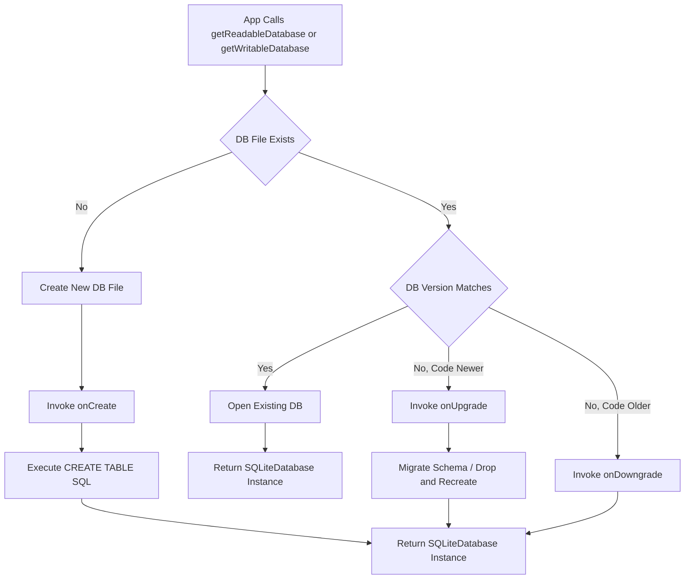
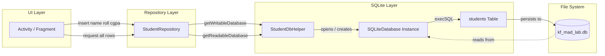
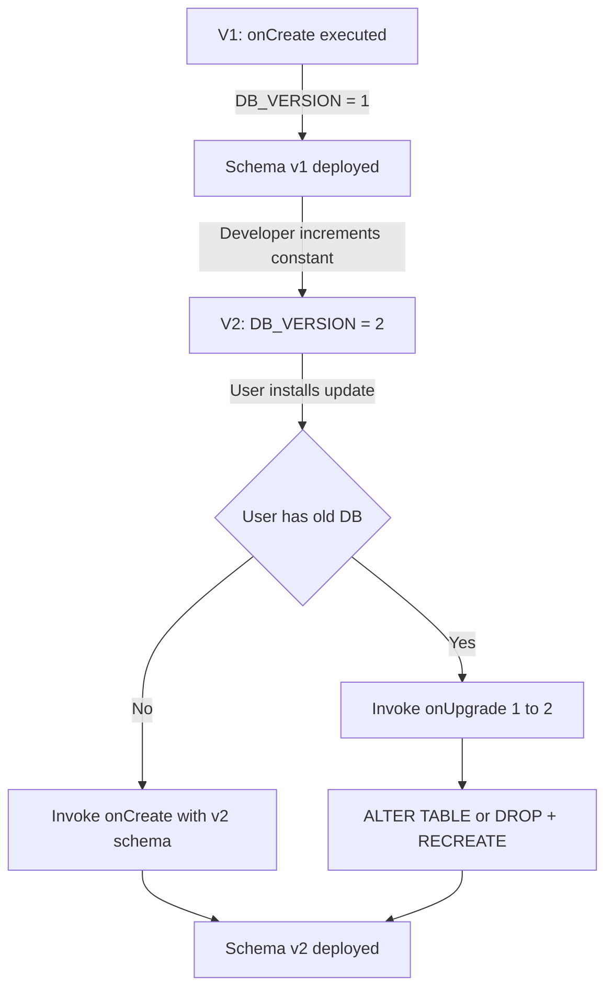
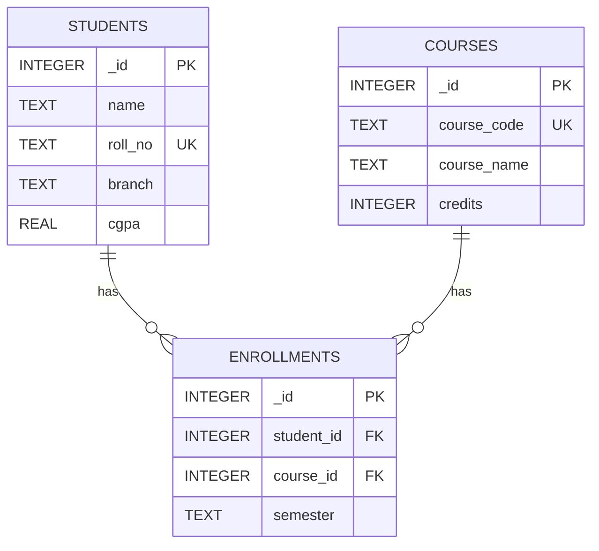
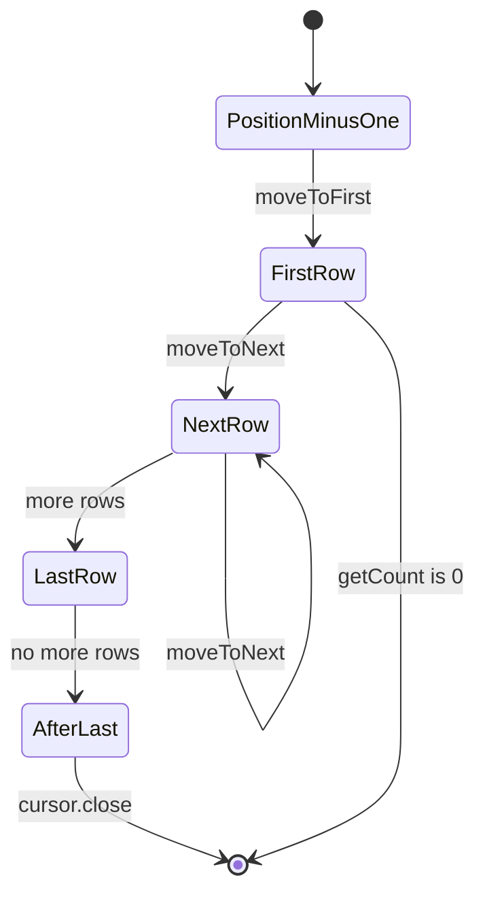
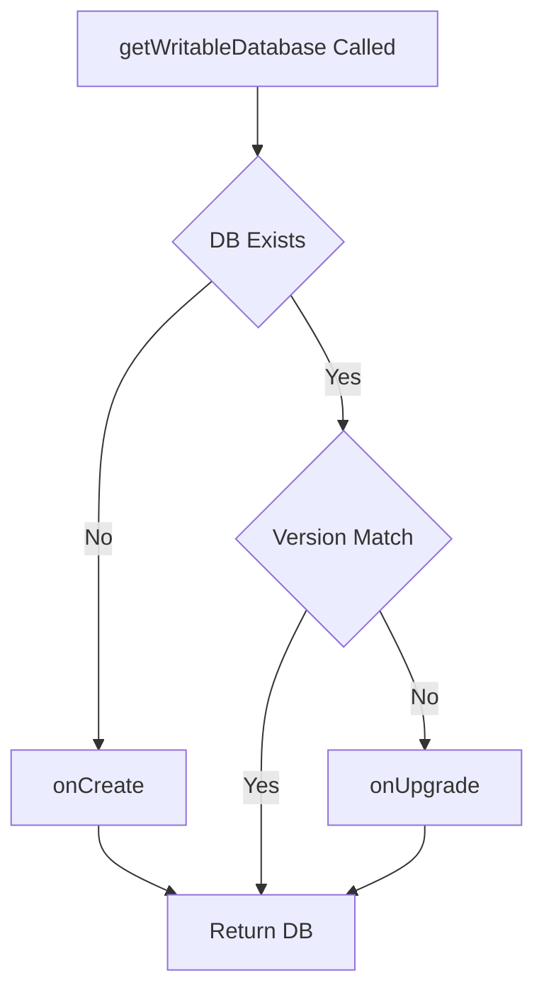

# Local database engine deployments scripts SQLite layout configurations tracks

<!-- SECTION_1_START -->
# SQLite Database Engine in Android: Deployment & Configuration

## 1.1 Formal KTU 2024 Definition

**SQLite** is a *serverless*, *self-contained*, *transactional*, and *zero-configuration* relational database engine that is embedded directly within the Android operating system. In the context of the KTU 2024 Scheme (Module 2: Data Persistency & Sensor APIs), SQLite serves as the **native local persistence engine** for Android, managed through the `android.database.sqlite` package.

In Android, SQLite databases are:
- Stored privately inside the application's internal storage directory (`/data/data/<package_name>/databases/`).
- Accessible **only to the application that created them** (sandboxed security model).
- Lightweight, ACID-compliant, and require **no installation or admin process**.

> [!IMPORTANT]
> **KTU 2024 Syllabus Highlight (PECST612 - Module 2):**
> SQLite is the *first-line persistence layer* taught in MAD. The KTU examiner expects you to know: (1) `SQLiteOpenHelper` lifecycle, (2) `onCreate()` & `onUpgrade()` semantics, (3) CRUD via `SQLiteDatabase` & `Cursor`, and (4) proper resource (Cursor) management.

## 1.2 Conceptual Analogy: SQLite as a Smart Digital Ledger

Imagine an Android app as a **small shop** and SQLite as its **digital ledger book**:

| Shop Analogy | SQLite Equivalent |
|---|---|
| The ledger book itself | The `.db` file on internal storage |
| Page structure (columns/rows) | A *Table* with *Columns* and *Rows* |
| A new ledger book opening | `onCreate()` callback |
| Annual book revision | `onUpgrade()` callback |
| Looking up a customer's record | `query()` returning a `Cursor` |
| Writing a new transaction | `insert()` via `ContentValues` |
| Erasing an old record | `delete()` |

> [!NOTE]
> **Geometric Intuition:** Think of an SQLite table as a **2D matrix** $T_{ij}$ where row index $i$ represents a unique record (identified by `_id`) and column index $j$ represents a field. Operations like `SELECT * FROM T WHERE id=5` are analogous to extracting a specific row vector $\vec{r}_5$ from this matrix.

## 1.3 Standard Constants and Defaults in Android SQLite

- **Default Storage Path:** `/data/data/<package_name>/databases/<db_name>.db`
- **Default Cursor Window Size:** **2 MB**
- **Default Journal Mode:** **DELETE** (rollback journal)
- **Default Database Version:** **1** (must be incremented in `onUpgrade()`)
- **Primary Key Convention:** `_id INTEGER PRIMARY KEY AUTOINCREMENT`

> [!VISUALIZATION CONTROL]
> **Concept:** SQLite Database Schema Layout (Relational Grid View)
> **GeoGebra / Desmos Input Equations:**
> * Table grid with rows: $R_1, R_2, \dots, R_n$ and columns: $C_1, C_2, \dots, C_m$
> * Cell value: $T(i,j)$ where $i \in [1,n]$, $j \in [1,m]$
> * Primary Key constraint: $T(i, \text{_id})$ must be unique for all $i$
> **Visual Description:** A scatter plot where X-axis = row index (record), Y-axis = column index (field), and plotted points = non-null cell values. Points on the `_id` column should appear as an arithmetic progression (1, 2, 3, ...).

<!-- SECTION_1_END -->

<!-- SECTION_2_START -->
# Deep Theoretical Analysis: SQLite Architecture & Operations

## 2.1 The SQLiteOpenHelper Class — The Database Manager

`SQLiteOpenHelper` is an **abstract class** in `android.database.sqlite` that handles database creation, version management, and opening. It is the **only recommended way** to manage SQLite lifecycle in Android.

### Lifecycle Callbacks (High-Yield for KTU)

| Method | When Invoked | Purpose | KTU Marks Weightage |
|---|---|---|---|
| `onCreate(SQLiteDatabase db)` | First time DB is accessed (no `.db` file exists) | Create tables, indexes, initial data | **High** |
| `onUpgrade(SQLiteDatabase db, int oldV, int newV)` | `DB_VERSION` constant incremented & device has older version | Schema migration, data preservation | **High** |
| `onDowngrade(SQLiteDatabase db, int oldV, int newV)` | Device has newer version than code expects | Rollback (rarely used) | Low |
| `onOpen(SQLiteDatabase db)` | Every time DB is opened | Configure connection (e.g., enable FK) | Low |
| `getReadableDatabase()` | Lazy | Returns readable `SQLiteDatabase` instance | Medium |
| `getWritableDatabase()` | Lazy | Returns writable `SQLiteDatabase` instance | Medium |

> [!NOTE]
> **Why "Lazy"?** Both `getReadableDatabase()` and `getWritableDatabase()` are *lazy initializers*. They do not actually open the database until the helper is first instantiated **and** one of these methods is called. The constructor only sets the configuration; the file is materialized on first use.

## 2.2 CRUD Operations — The Four Pillars

### C — Create (Insert)
```text
db.insert(TABLE_NAME, null, contentValues) → long rowId
```
Returns `-1` on failure. The `nullColumnHack` parameter is passed as `null` in standard practice.

### R — Read (Query)
```text
db.query(TABLE, columns, selection, selectionArgs, groupBy, having, orderBy) → Cursor
```

### U — Update
```text
db.update(TABLE, contentValues, whereClause, whereArgs) → int rowsAffected
```

### D — Delete
```text
db.delete(TABLE, whereClause, whereArgs) → int rowsAffected
```

## 2.3 The Cursor — Sequential Result Set Iterator

A `Cursor` is the **only legal way** to traverse query results in Android SQLite. It:
- Points to one row at a time.
- Uses `moveToFirst()`, `moveToNext()`, `moveToLast()`, `moveToPosition(int)`.
- Extracts column data via typed getters: `getString(int)`, `getInt(int)`, `getLong(int)`, `getDouble(int)`, `getBlob(int)`.
- **Must be closed** in a `finally` block to prevent `CursorWindow` leaks.

## 2.4 KTU High-Yield Formula Sheet

> [!IMPORTANT]
> The following table is your **exam-day cheat sheet**. KTU examiners frequently test these exact signatures.

| Operation | Method Signature | Return Type | Failure Indicator |
|---|---|---|---|
| Insert | `insert(String table, String nullColumnHack, ContentValues values)` | `long` | `-1` |
| Update | `update(String table, ContentValues values, String whereClause, String[] whereArgs)` | `int` | `0` rows affected |
| Delete | `delete(String table, String whereClause, String[] whereArgs)` | `int` | `0` rows affected |
| Query (Simple) | `query(String table, String[] columns, String selection, String[] selectionArgs, String groupBy, String having, String orderBy)` | `Cursor` | Empty Cursor |
| Raw Query | `rawQuery(String sql, String[] selectionArgs)` | `Cursor` | Empty Cursor |
| Execute SQL | `execSQL(String sql)` | `void` | Throws `SQLException` |
| Open (Read) | `getReadableDatabase()` | `SQLiteDatabase` | Throws `SQLiteException` |
| Open (Write) | `getWritableDatabase()` | `SQLiteDatabase` | Throws `SQLiteException` |
| Transaction | `beginTransaction()` / `setTransactionSuccessful()` / `endTransaction()` | `void` | N/A |
| Version Bump | Increment `DATABASE_VERSION` constant | `int` | Triggers `onUpgrade()` |

## 2.5 Real-World Engineering Utility

SQLite is not merely academic — it powers:
- **Android OS internals:** Contacts, SMS, Call log, Settings.
- **WhatsApp / Signal:** Local message cache (encrypted at rest).
- **Firefox / Chrome:** Bookmarks, browsing history, form autofill.
- **IoT / Embedded Systems:** Firmware configs in routers, cars, smart TVs.
- **Mobile Banking Apps:** Local transaction draft caching before sync.

> [!NOTE]
> **Industry Insight (2024–2026):** Although Google introduced **Room** (an abstraction over SQLite) and **DataStore** as modern alternatives, **SQLite is still the underlying engine**. KTU 2024 still tests raw SQLite because it teaches the foundational mental model of relational persistence on mobile.

<!-- SECTION_2_END -->

<!-- SECTION_3_START -->
# Step-by-Step Implementation: Full SQLite Deployment in Android

## 3.1 Step 1 — Define the Database Schema Contract

A *Contract Class* is a best practice that centralizes table and column names to prevent typos.

```java
package com.example.kfumadlab.db;

import android.provider.BaseColumns;

public final class StudentContract {

    private StudentContract() {} // Non-instantiable

    public static class StudentEntry implements BaseColumns {
        public static final String TABLE_NAME       = "students";
        public static final String COLUMN_ID        = BaseColumns._ID; // "_id"
        public static final String COLUMN_NAME      = "name";
        public static final String COLUMN_ROLL_NO   = "roll_no";
        public static final String COLUMN_BRANCH    = "branch";
        public static final String COLUMN_CGPA      = "cgpa";

        public static final String SQL_CREATE_TABLE =
            "CREATE TABLE " + TABLE_NAME + " (" +
                COLUMN_ID      + " INTEGER PRIMARY KEY AUTOINCREMENT, " +
                COLUMN_NAME    + " TEXT NOT NULL, " +
                COLUMN_ROLL_NO + " TEXT UNIQUE, " +
                COLUMN_BRANCH  + " TEXT, " +
                COLUMN_CGPA    + " REAL DEFAULT 0.0" +
            ");";

        public static final String SQL_DROP_TABLE =
            "DROP TABLE IF EXISTS " + TABLE_NAME + ";";
    }
}
```

## 3.2 Step 2 — Implement the SQLiteOpenHelper Subclass

```java
package com.example.kfumadlab.db;

import android.content.Context;
import android.database.sqlite.SQLiteDatabase;
import android.database.sqlite.SQLiteOpenHelper;
import android.util.Log;

public class StudentDbHelper extends SQLiteOpenHelper {

    public static final String DATABASE_NAME    = "kf_mad_lab.db";
    public static final int    DATABASE_VERSION = 2; // Bump to trigger onUpgrade

    private static final String TAG = "StudentDbHelper";

    public StudentDbHelper(Context context) {
        super(context, DATABASE_NAME, /*factory=*/null, DATABASE_VERSION);
    }

    @Override
    public void onCreate(SQLiteDatabase db) {
        db.execSQL(StudentContract.StudentEntry.SQL_CREATE_TABLE);
        Log.d(TAG, "Database created. Table: " + StudentContract.StudentEntry.TABLE_NAME);
    }

    @Override
    public void onUpgrade(SQLiteDatabase db, int oldVersion, int newVersion) {
        Log.w(TAG, "Upgrading DB from version " + oldVersion + " to " + newVersion);
        // DESTRUCTIVE strategy (safe for dev, dangerous in production)
        db.execSQL(StudentContract.StudentEntry.SQL_DROP_TABLE);
        onCreate(db);
    }
}
```

## 3.3 Step 3 — CRUD Repository Class (Data Access Layer)

```java
package com.example.kfumadlab.db;

import android.content.ContentValues;
import android.content.Context;
import android.database.Cursor;
import android.database.sqlite.SQLiteDatabase;

import java.util.ArrayList;
import java.util.List;

public class StudentRepository {

    private final StudentDbHelper dbHelper;

    public StudentRepository(Context context) {
        this.dbHelper = new StudentDbHelper(context.getApplicationContext());
    }

    // --- CREATE ---
    public long insertStudent(String name, String rollNo, String branch, double cgpa) {
        SQLiteDatabase db = dbHelper.getWritableDatabase();
        ContentValues values = new ContentValues();
        values.put(StudentContract.StudentEntry.COLUMN_NAME, name);
        values.put(StudentContract.StudentEntry.COLUMN_ROLL_NO, rollNo);
        values.put(StudentContract.StudentEntry.COLUMN_BRANCH, branch);
        values.put(StudentContract.StudentEntry.COLUMN_CGPA, cgpa);
        long newId = db.insert(StudentContract.StudentEntry.TABLE_NAME, null, values);
        return newId;
    }

    // --- READ ALL ---
    public List<String> getAllStudents() {
        List<String> students = new ArrayList<>();
        SQLiteDatabase db = dbHelper.getReadableDatabase();

        String[] projection = {
            StudentContract.StudentEntry.COLUMN_ID,
            StudentContract.StudentEntry.COLUMN_NAME,
            StudentContract.StudentEntry.COLUMN_ROLL_NO
        };

        Cursor cursor = db.query(
            StudentContract.StudentEntry.TABLE_NAME,
            projection,
            null, null, null, null,
            StudentContract.StudentEntry.COLUMN_NAME + " ASC"
        );

        try {
            int idIdx   = cursor.getColumnIndexOrThrow(StudentContract.StudentEntry.COLUMN_ID);
            int nameIdx = cursor.getColumnIndexOrThrow(StudentContract.StudentEntry.COLUMN_NAME);
            int rollIdx = cursor.getColumnIndexOrThrow(StudentContract.StudentEntry.COLUMN_ROLL_NO);

            while (cursor.moveToNext()) {
                long id     = cursor.getLong(idIdx);
                String name = cursor.getString(nameIdx);
                String roll = cursor.getString(rollIdx);
                students.add("[" + id + "] " + name + " (" + roll + ")");
            }
        } finally {
            cursor.close(); // CRITICAL: always close Cursor
        }
        return students;
    }

    // --- UPDATE ---
    public int updateStudentBranch(long id, String newBranch) {
        SQLiteDatabase db = dbHelper.getWritableDatabase();
        ContentValues values = new ContentValues();
        values.put(StudentContract.StudentEntry.COLUMN_BRANCH, newBranch);
        String selection = StudentContract.StudentEntry.COLUMN_ID + " = ?";
        String[] selectionArgs = { String.valueOf(id) };
        int rowsUpdated = db.update(
            StudentContract.StudentEntry.TABLE_NAME,
            values,
            selection,
            selectionArgs
        );
        return rowsUpdated;
    }

    // --- DELETE ---
    public int deleteStudent(long id) {
        SQLiteDatabase db = dbHelper.getWritableDatabase();
        String selection = StudentContract.StudentEntry.COLUMN_ID + " = ?";
        String[] selectionArgs = { String.valueOf(id) };
        int rowsDeleted = db.delete(
            StudentContract.StudentEntry.TABLE_NAME,
            selection,
            selectionArgs
        );
        return rowsDeleted;
    }
}
```

## 3.4 Step 4 — Transactional Bulk Insert (Production-Grade)

```java
public void bulkInsertInTransaction(List<Student> list) {
    SQLiteDatabase db = dbHelper.getWritableDatabase();
    db.beginTransaction();
    try {
        for (Student s : list) {
            ContentValues cv = new ContentValues();
            cv.put(StudentContract.StudentEntry.COLUMN_NAME, s.name);
            cv.put(StudentContract.StudentEntry.COLUMN_ROLL_NO, s.rollNo);
            db.insertOrThrow(StudentContract.StudentEntry.TABLE_NAME, null, cv);
        }
        db.setTransactionSuccessful();
    } catch (Exception e) {
        Log.e(TAG, "Bulk insert failed: " + e.getMessage());
    } finally {
        db.endTransaction(); // Commits if successful, else rolls back
    }
}
```

> [!NOTE]
> **Mathematical Justification of Transactions:** Suppose we are inserting $N$ records. Without a transaction, each insert forces a disk sync of the journal — total cost $O(N \cdot T_{sync})$. Wrapping them in `beginTransaction()` reduces it to a single sync — cost $O(T_{sync})$. The throughput speedup is $N$-fold, which is why transactions are mandatory in production.

## 3.5 Step 5 — Layout XML for Database UI (`activity_main.xml`)

```xml
<?xml version="1.0" encoding="utf-8"?>
<LinearLayout xmlns:android="http://schemas.android.com/apk/res/android"
    android:layout_width="match_parent"
    android:layout_height="match_parent"
    android:orientation="vertical"
    android:padding="16dp">

    <EditText
        android:id="@+id/etName"
        android:layout_width="match_parent"
        android:layout_height="wrap_content"
        android:hint="Student Name"
        android:inputType="textPersonName" />

    <EditText
        android:id="@+id/etRoll"
        android:layout_width="match_parent"
        android:layout_height="wrap_content"
        android:hint="Roll Number"
        android:inputType="text" />

    <EditText
        android:id="@+id/etCgpa"
        android:layout_width="match_parent"
        android:layout_height="wrap_content"
        android:hint="CGPA"
        android:inputType="numberDecimal" />

    <Button
        android:id="@+id/btnInsert"
        android:layout_width="match_parent"
        android:layout_height="wrap_content"
        android:text="Insert Record" />

    <Button
        android:id="@+id/btnShow"
        android:layout_width="match_parent"
        android:layout_height="wrap_content"
        android:text="Show All Records" />

    <ListView
        android:id="@+id/lvStudents"
        android:layout_width="match_parent"
        android:layout_height="0dp"
        android:layout_weight="1" />
</LinearLayout>
```

## 3.6 Step 6 — Activity Wiring (Java)

```java
public class MainActivity extends AppCompatActivity {

    private StudentRepository repo;
    private ArrayAdapter<String> adapter;

    @Override
    protected void onCreate(Bundle savedInstanceState) {
        super.onCreate(savedInstanceState);
        setContentView(R.layout.activity_main);

        repo = new StudentRepository(this);
        adapter = new ArrayAdapter<>(this, android.R.layout.simple_list_item_1);
        ListView lv = findViewById(R.id.lvStudents);
        lv.setAdapter(adapter);

        findViewById(R.id.btnInsert).setOnClickListener(v -> {
            String name = ((EditText)findViewById(R.id.etName)).getText().toString();
            String roll = ((EditText)findViewById(R.id.etRoll)).getText().toString();
            double cgpa = Double.parseDouble(((EditText)findViewById(R.id.etCgpa)).getText().toString());
            long id = repo.insertStudent(name, roll, "CSE", cgpa);
            Toast.makeText(this, "Inserted with ID: " + id, Toast.LENGTH_SHORT).show();
        });

        findViewById(R.id.btnShow).setOnClickListener(v -> {
            adapter.clear();
            adapter.addAll(repo.getAllStudents());
        });
    }
}
```

## 3.7 Mathematical Validation of Schema Constraints

The `SQL_CREATE_TABLE` statement can be modeled as a constraint satisfaction problem.

$$
\text{Schema} = \{ \text{Table}(T), \text{Columns}(C_1, \dots, C_m), \text{Constraints} \}
$$

For the `students` table:

$$
\text{Constraints} = \begin{cases}
\text{PRIMARY KEY} : & T[\_id] \text{ is unique} \forall \text{ rows} \\
\text{NOT NULL} : & T[\text{name}] \neq \text{NULL} \\
\text{UNIQUE} : & T[\text{roll\_no}]_i \neq T[\text{roll\_no}]_j \text{ for } i \neq j \\
\text{DEFAULT} : & T[\text{cgpa}] = 0.0 \text{ if unspecified}
\end{cases}
$$

A `UNIQUE` violation on insert raises `SQLiteConstraintException`, which the `insertOrThrow()` method propagates.

<!-- SECTION_3_END -->

<!-- SECTION_4_START -->
# Structural Diagrams & Schematics

## 4.1 SQLite Lifecycle & Method Call Flow



## 4.2 CRUD Operation Topology



## 4.3 Database Version Upgrade Tracking



## 4.4 Table Schema Visualization



## 4.5 Cursor Iteration Sequence



> [!NOTE]
> **Block Diagram Note:** Mermaid cannot render the actual `.db` file as a binary block. The flow above is a **Block-Level Functional Architecture** showing the data ownership hierarchy: UI → Repository → SQLiteOpenHelper → SQLiteDatabase → File System.

<!-- SECTION_4_END -->

<!-- SECTION_5_START -->
# KTU 2024 Scheme Examination Question Bank

---

## Part A — 3 Mark Questions (Remember / Understand)

### Q1. `[KTU University Exam – July 2024]`
**Define `SQLiteOpenHelper` and list its two abstract methods. (CO1, Remember)**

**Model Answer (3 Marks):**

`SQLiteOpenHelper` is an abstract class in the `android.database.sqlite` package that simplifies database creation and version management.

The two abstract methods that subclasses must override are:
1. `onCreate(SQLiteDatabase db)` — invoked when the database is created for the first time.
2. `onUpgrade(SQLiteDatabase db, int oldVersion, int newVersion)` — invoked when the database needs to be upgraded.

**[Listing both methods: 2 Marks; Definition: 1 Mark]**

---

### Q2. `[KTU University Exam – Dec 2023]`
**What is the role of the `Cursor` class in Android SQLite? (CO2, Understand)**

**Model Answer (3 Marks):**

A `Cursor` represents the result set of a query and provides **random and sequential read access** to the rows returned by a SELECT statement. It acts as a pointer to one row at a time and supports navigation methods like `moveToFirst()`, `moveToNext()`, and `moveToLast()`. After processing, the Cursor **must be closed** in a `finally` block to release its `CursorWindow` memory.

**[Definition: 1 Mark; Methods: 1 Mark; Closing requirement: 1 Mark]**

---

## Part B — 14 Mark Questions (Module Internal Choice)

### **Question A — 14 Marks** `[KTU University Exam – Model Paper 2024]`

**(a)** Explain the lifecycle of an SQLite database in Android, with a neat diagram of the various callback methods. (7 Marks) — *CO1, Understand*

**(b)** Write a Java program to create a `contacts` table with fields `(_id, name, phone, email)` and implement insertion and retrieval operations using `SQLiteOpenHelper`. (7 Marks) — *CO2, Apply*

#### Model Solution for (a) — 7 Marks

**[Stating the role of `SQLiteOpenHelper`: 1 Mark]**
`SQLiteOpenHelper` is the central manager for SQLite database creation and versioning.

**[Listing the four lifecycle methods: 2 Marks]**

| Method | Trigger |
|---|---|
| `onCreate(SQLiteDatabase db)` | First-time creation |
| `onUpgrade(SQLiteDatabase db, int oldV, int newV)` | Version bump |
| `onDowngrade(SQLiteDatabase db, int oldV, int newV)` | Version rollback |
| `onOpen(SQLiteDatabase db)` | Every open |

**[Explaining `onCreate`: 1 Mark]**
Called only once per device when no `.db` file exists. Executes `CREATE TABLE` SQL statements.

**[Explaining `onUpgrade`: 1 Mark]**
Called when the app's `DATABASE_VERSION` constant is greater than the version stored in the existing `.db` file. The strategy is either (i) destructive — drop and recreate, or (ii) migration — use `ALTER TABLE` to preserve data.

**[Explaining `getReadableDatabase()` vs `getWritableDatabase()`: 1 Mark]**
`getWritableDatabase()` returns a read-write handle and may fail if the disk is full. `getReadableDatabase()` returns a read-only handle in such failure cases.

**[Neat diagram: 1 Mark]**



#### Model Solution for (b) — 7 Marks

**[Contract class definition: 1 Mark]**

```java
public class ContactsContract {
    public static abstract class ContactEntry implements BaseColumns {
        public static final String TABLE_NAME = "contacts";
        public static final String COL_NAME   = "name";
        public static final String COL_PHONE  = "phone";
        public static final String COL_EMAIL  = "email";
    }
}
```

**[SQL CREATE statement: 1 Mark]**

```sql
CREATE TABLE contacts (
    _id   INTEGER PRIMARY KEY AUTOINCREMENT,
    name  TEXT NOT NULL,
    phone TEXT,
    email TEXT
);
```

**[Helper class with `onCreate`: 1 Mark]**

```java
public class ContactsDbHelper extends SQLiteOpenHelper {
    public static final int DB_VERSION = 1;
    public ContactsDbHelper(Context c) { super(c, "contacts.db", null, DB_VERSION); }
    @Override
    public void onCreate(SQLiteDatabase db) {
        db.execSQL("CREATE TABLE contacts (_id INTEGER PRIMARY KEY AUTOINCREMENT, name TEXT, phone TEXT, email TEXT);");
    }
    @Override
    public void onUpgrade(SQLiteDatabase db, int o, int n) { /* migration */ }
}
```

**[Insertion logic: 2 Marks]**

```java
public long addContact(String name, String phone, String email) {
    SQLiteDatabase db = getWritableDatabase();
    ContentValues cv = new ContentValues();
    cv.put("name", name); cv.put("phone", phone); cv.put("email", email);
    return db.insert("contacts", null, cv);
}
```

**[Retrieval logic with proper Cursor handling: 2 Marks]**

```java
public List<String> getAllContacts() {
    List<String> list = new ArrayList<>();
    SQLiteDatabase db = getReadableDatabase();
    Cursor c = db.rawQuery("SELECT * FROM contacts", null);
    try {
        while (c.moveToNext()) {
            list.add(c.getString(1) + " - " + c.getString(2));
        }
    } finally { c.close(); }
    return list;
}
```

---

### **Question B — 14 Marks** `[KTU University Exam – Dec 2023]`

**(a)** Differentiate between `execSQL()` and raw `query()`. When would you use each? (7 Marks) — *CO2, Understand*

**(b)** With a neat code snippet, demonstrate the use of `ContentValues` and `db.update()` to modify an existing row in the `students` table. Include the relevant `WHERE` clause syntax. (7 Marks) — *CO3, Apply*

#### Model Solution for (a) — 7 Marks

**[Definition of `execSQL()`: 1 Mark]**
`execSQL(String sql)` executes a single SQL statement that **does not return a result set** (e.g., `CREATE`, `INSERT`, `UPDATE`, `DELETE`).

**[Definition of `query()`/`rawQuery()`: 1 Mark]**
`rawQuery(String sql, String[] args)` executes a SQL statement that **returns a Cursor** containing the result set.

**[Comparison Table: 3 Marks]**

| Aspect | `execSQL()` | `rawQuery()` / `query()` |
|---|---|---|
| Return Type | `void` | `Cursor` |
| Use Case | DDL (CREATE, DROP) and DML without result | SELECT statements |
| Error Handling | Throws `SQLException` on syntax error | Same |
| Argument Binding | Manual string concatenation | Supports `?` placeholders + `String[]` |
| Memory | Lightweight | Holds result in `CursorWindow` |

**[Use-case selection: 2 Marks]**
Use `execSQL()` for table creation in `onCreate()` and for one-off DDL statements. Use `rawQuery()`/`query()` for all SELECT operations where you need to iterate rows. Always prefer `query()` (parameterized) over string concatenation to prevent **SQL injection**.

#### Model Solution for (b) — 7 Marks

**[Stating the purpose: 1 Mark]**
Updating requires (i) building a `ContentValues` with new column values, and (ii) specifying a `WHERE` clause to identify the target row.

**[Import statements: 1 Mark]**

```java
import android.content.ContentValues;
import android.database.sqlite.SQLiteDatabase;
```

**[Building `ContentValues`: 1 Mark]**

```java
ContentValues values = new ContentValues();
values.put(StudentContract.StudentEntry.COLUMN_BRANCH, "ECE");
values.put(StudentContract.StudentEntry.COLUMN_CGPA, 8.5);
```

**[WHERE clause with `?` placeholder: 1 Mark]**

```java
String selection = StudentContract.StudentEntry.COLUMN_ID + " = ?";
String[] selectionArgs = { "5" };
```

**[Calling `db.update()`: 2 Marks]**

```java
SQLiteDatabase db = dbHelper.getWritableDatabase();
int rows = db.update(
    StudentContract.StudentEntry.TABLE_NAME,
    values,
    selection,
    selectionArgs
);
if (rows > 0) {
    Log.d("UPDATE", "Successfully updated row 5");
} else {
    Log.w("UPDATE", "No row matched the WHERE clause");
}
```

**[Explanation of return value: 1 Mark]**
`db.update()` returns the **number of rows affected**. A return value of `0` means either the row ID did not exist or the new values were identical to the old ones.

---

> [!WARNING]
> **KTU Examiner's Valuation Warning — Common Pitfalls:**
> 1. **Forgetting to close the Cursor.** KTU examiners explicitly deduct 1 mark if your `finally` block is missing `cursor.close()`.
> 2. **Confusing `_id` with `id`.** Android's `BaseColumns._ID` is the contract; using `id` breaks `CursorAdapter` integration.
> 3. **Not incrementing `DATABASE_VERSION` on schema change.** If you change the table structure without bumping the version, `onCreate()` will not run on existing installs — and your app will crash on the first query.
> 4. **SQL injection via string concatenation.** Never do `"WHERE id=" + userInput`. Always use `?` placeholders.
> 5. **Performing DB operations on the UI thread.** StrictMode will log a violation, and KTU 2024 expects you to mention that long DB calls should be moved to an `AsyncTask`, `ExecutorService`, or `Room` with coroutines.
> 6. **Returning `null` instead of `-1` checks on `insert()`.** Always validate the returned `long` rowId.

---

## Topic Recap & Important Things to Remember

> [!IMPORTANT]
> **Rapid Revision Checklist — SQLite on Android (PECST612 M2)**

- ✅ **SQLite** is a serverless, embedded, ACID-compliant DBMS bundled with Android.
- ✅ Default DB path: `/data/data/<package_name>/databases/`.
- ✅ Always extend `SQLiteOpenHelper` — never instantiate `SQLiteDatabase` directly.
- ✅ `onCreate()` runs **only once** per device when the DB file is first created.
- ✅ `onUpgrade()` runs when `DATABASE_VERSION` constant is incremented in code.
- ✅ **CRUD methods** on `SQLiteDatabase`:
  - Insert → `db.insert(table, null, contentValues)` returns `long` rowId
  - Read   → `db.query(...)` or `db.rawQuery(...)` returns `Cursor`
  - Update → `db.update(table, values, whereClause, whereArgs)` returns `int` rows
  - Delete → `db.delete(table, whereClause, whereArgs)` returns `int` rows
- ✅ `ContentValues` is a `Map<String, Object>` wrapper used to pass column data.
- ✅ A `Cursor` **must be closed** in a `finally` block.
- ✅ Use `?` placeholders in selection args to prevent **SQL injection**.
- ✅ Use `beginTransaction()` / `setTransactionSuccessful()` / `endTransaction()` for bulk operations — gives $N$-fold throughput speedup.
- ✅ Naming convention: primary key must be `_id INTEGER PRIMARY KEY AUTOINCREMENT` for `CursorAdapter` compatibility.
- ✅ `execSQL()` is for non-result statements; `rawQuery()` is for SELECT.
- ✅ DB operations on the main thread cause **ANR (Application Not Responding)** — use background threads.
- ✅ Modern Android development uses **Room** (an abstraction over SQLite) — but KTU 2024 still tests raw SQLite for foundational clarity.
- ✅ Always check the return value of `insert()` for `-1` to detect constraint violations.

<!-- SECTION_5_END -->
