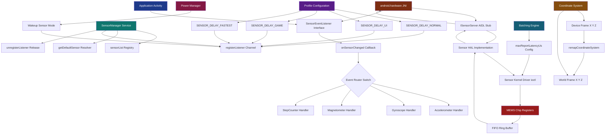
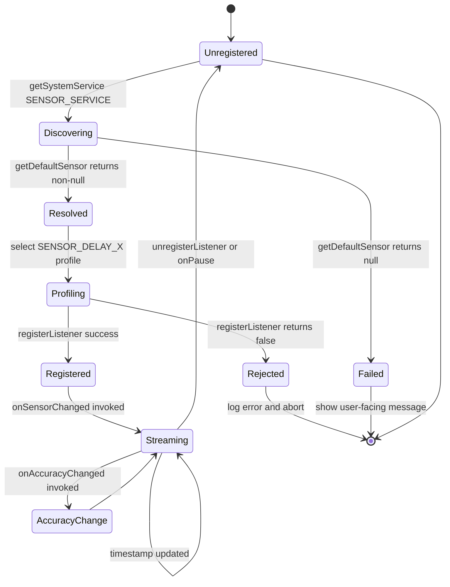
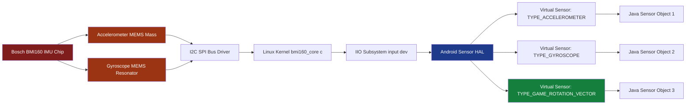
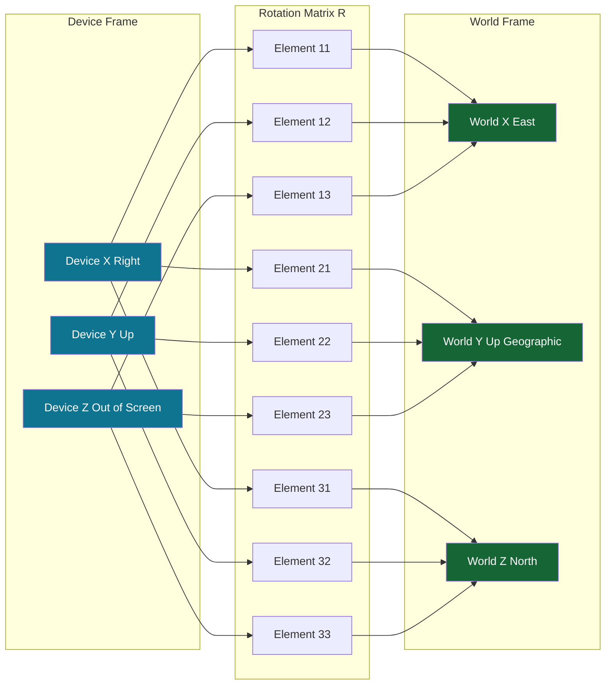

# Sensor API configurations hardware mappings profiles routing tracks setups profiles

<!-- SECTION_1_START -->
# MOBILE APPLICATION DEVELOPMENT (PECST612) — Module 2: Data Persistency & Sensor APIs
## Topic: Sensor API Configurations, Hardware Mappings, Profiles & Routing Setups

---

### 1. Core Technical Definition

> [!IMPORTANT]
> **Android Sensor Framework Definition (KTU 2024 Syllabus Terminology)**
> The **Android Sensor Framework** is a hierarchical abstraction layer of the `android.hardware` package that provides Application Programming Interfaces (APIs) to access and interpret the physical and virtual sensors embedded in an Android device. The framework is responsible for **sensor discovery**, **registration**, **configuration**, **event routing**, **hardware-to-software mapping**, and **profile-based sampling rate management**. The four primary components are: **`SensorManager`**, **`Sensor`**, **`SensorEvent`**, and **`SensorEventListener`**.

> [!NOTE]
> **Configuration Profile (Syllabus Highlight)**
> A *sensor configuration profile* is a pre-defined bundle of behavioural parameters (sampling delay, batching latency, maximum range, resolution, reporting mode) that collectively determine **how a sensor channel is established, sampled, buffered, and delivered** to the application layer.

---

### 2. Intuitive Overview (Real-World Analogy)

Imagine your smartphone is a **human body** walking through a city. The body has **eyes (camera)**, **ears (microphone)**, **skin (touch/pressure)**, and an **inner-ear balance organ (accelerometer + gyroscope)**. The **Android Sensor Framework** acts as the **nervous system + brainstem**:

- The **`SensorManager`** is the **brainstem** that maintains a registry of all available senses.
- A **`Sensor` object** is a **single nerve ending** (e.g., the vestibular nerve).
- A **`SensorEvent`** is the **electrical impulse** travelling up that nerve.
- A **`SensorEventListener`** is the **cerebral cortex** that interprets those impulses into meaningful actions.

When a developer wants the phone to "feel" rotation, they don't directly poke the gyroscope chip — they walk up to the brainstem (`SensorManager.getDefaultSensor(TYPE_GYROSCOPE)`) and say *"Tell me whenever my balance changes"*. The framework then **routes the signal** through a chain of hardware abstraction, kernel drivers, HAL (Hardware Abstraction Layer), JNI, and finally into the **Java/Kotlin application thread**.

> [!VISUALIZATION CONTROL]
> **Concept:** Sensor Coordinate System Mapping (Device Frame vs. World Frame)
> **GeoGebra / Desmos Input Equations:**
> * `X_device(t) = A_x \cdot \cos(\theta) - A_y \cdot \sin(\theta)`
> * `Y_device(t) = A_x \cdot \sin(\theta) + A_y \cdot \cos(\theta)`
> * `Z_device(t) = A_z` (invariant under screen rotation)
> **Visual Description:** Plot the device-X and device-Y axes as arrows rotating around the fixed Z-axis. Observe that the Z-component is always perpendicular to the screen regardless of the device tilt angle $\theta$.

### 3. Sensor Hardware Mapping Hierarchy

| Layer | Component | Responsibility |
|---|---|---|
| Application | `SensorEventListener` | Receives & interprets data |
| Java/Kotlin API | `SensorManager`, `Sensor` | Object-oriented access |
| JNI Bridge | `android.hardware` JNI | Type marshalling |
| HAL | `ISensorServer.aidl` | Cross-process service calls |
| Kernel | Sensor driver (`/dev/sensors/`) | Hardware register access |
| Physical | MEMS chip (Bosch BMI160, Invense MPU-6500) | Physical signal generation |

> [!NOTE]
> **Hardware Mappings & Standard Profiles**
> The Android Compatibility Definition Document (CDD) **mandates** that the device must expose the physical sensor channels through a stable software identifier. For instance, the **Bosch BMI160 IMU** physically contains an accelerometer and gyroscope, but Android must expose them as **two independent `Sensor` objects** — a process called **sensor virtualisation**.

---

### 4. Key Standard Constants (KTU 2024)

- **`SensorManager.SENSOR_DELAY_NORMAL` = 200,000 µs (≈ 5 Hz)**
- **`SensorManager.SENSOR_DELAY_UI` = 60,000 µs (≈ 16.67 Hz)**
- **`SensorManager.SENSOR_DELAY_GAME` = 20,000 µs (≈ 50 Hz)**
- **`SensorManager.SENSOR_DELAY_FASTEST` = 0 µs (rate-limited by hardware)**
- **Sensor Reporting Modes:** `SENSOR_REPORTING_MODE_CONTINUOUS`, `SENSOR_REPORTING_MODE_ON_CHANGE`, `SENSOR_REPORTING_MODE_ONE_SHOT`, `SENSOR_REPORTING_MODE_SPECIAL_TRIGGER`.
- **Standard physical range:** Earth gravity = **9.81 m/s²**, Geomagnetic field ≈ **48 µT** (India-Kerala mid-latitude range 42–46 µT).
<!-- SECTION_1_END -->

<!-- SECTION_2_START -->
# Deep Theoretical Analysis: Sensor API Configurations & Hardware Mappings

---

## 1. The Four Pillars of the Android Sensor API

> [!IMPORTANT]
> **Foundational Class Hierarchy (KTU Board Exam Hot-Spot)**

$$
\begin{aligned}
\text{SensorManager} &\rightarrow \text{System Service (Context.SENSOR\_SERVICE)} \\
\text{Sensor} &\rightarrow \text{Immutable description object} \\
\text{SensorEvent} &\rightarrow \text{Mutable timestamped sample} \\
\text{SensorEventListener} &\rightarrow \text{Application-side callback interface}
\end{aligned}
$$

### 1.1 `SensorManager`
The **gateway** to all sensors. It is obtained via:
```java
SensorManager sm = (SensorManager) getSystemService(Context.SENSOR_SERVICE);
```
The manager is the **registry of routing** — it knows every sensor physically present, virtually fused, or software-emulated on the device.

### 1.2 `Sensor`
An **immutable metadata object** describing *what* a sensor is. Crucial properties:
- `getName()` — Vendor-supplied string (e.g., `"BMI160 Accelerometer"`)
- `getVendor()` — Manufacturer identifier
- `getVersion()` — Hardware/firmware revision
- `getType()` — Integer constant (`TYPE_ACCELEROMETER`, …)
- `getResolution()` — Smallest measurable delta in SI units
- `getMaximumRange()` — Upper bound of the physical value
- `getPower()` — mA draw at nominal voltage
- `getMinDelay()` — Lower bound of the sampling period in microseconds

### 1.3 `SensorEvent`
A **live data container** delivered to the listener. Fields:
- `values[0..2]` — The X, Y, Z axis readings (units depend on type)
- `sensor` — Back-reference to the originating `Sensor`
- `timestamp` — Nanosecond monotonic clock value
- `accuracy` — Calibration confidence level

### 1.4 `SensorEventListener`
A **two-method interface** that the application must implement:
- `onSensorChanged(SensorEvent event)` — Fired on every new sample
- `onAccuracyChanged(Sensor sensor, int accuracy)` — Fired on calibration drift

---

## 2. Sensor Configuration Profiles (Routing Setups)

A **profile** is a set of mutually-consistent configuration parameters registered with `SensorManager.registerListener(...)`. KTU 2024 expects students to identify the four axes of configuration:

### 2.1 Sampling Rate Profile

| Profile Constant | Delay (µs) | Frequency (Hz) | Use Case |
|---|---|---|---|
| `SENSOR_DELAY_NORMAL` | 200,000 | 5.00 | Screen orientation |
| `SENSOR_DELAY_UI` | 60,000 | 16.67 | UI redraw |
| `SENSOR_DELAY_GAME` | 20,000 | 50.00 | Game loop |
| `SENSOR_DELAY_FASTEST` | 0 | HW-limited | AR, signal processing |

The actual frequency relation is:

$$
f_{\text{sample}} = \frac{1}{10^{-6} \cdot \tau_{\text{requested}}} \quad [\text{Hz}]
$$

where $\tau_{\text{requested}}$ is the requested delay in microseconds.

### 2.2 Batching Profile (`registerListener` overload)
Sensors can be configured for **hardware FIFO batching** to save power. The signature is:

```java
public boolean registerListener(SensorEventListener listener,
                                Sensor sensor,
                                int samplingPeriodUs,
                                int maxReportLatencyUs);
```

The **max report latency** allows the kernel to accumulate events and deliver them in bursts, reducing wakeups.

### 2.3 Wake-up Profile
If `Sensor` is a *wake-up* sensor (e.g., `TYPE_SIGNIFICANT_MOTION`), the device can stay in deep sleep and wake the CPU only when an event occurs. The method is:

```java
sm.registerListener(listener, sensor, SensorManager.SENSOR_DELAY_NORMAL);
```

combined with `sensor.isWakeUpSensor()` returning `true`.

### 2.4 Trigger / One-Shot Profile
Used for `SENSOR_REPORTING_MODE_ONE_SHOT` sensors (e.g., `TYPE_STEP_COUNTER` does not apply, but `TYPE_HEART_RATE` sometimes does). The listener is called once, then the sensor is automatically disabled.

---

## 3. Sensor Hardware Mapping Table (KTU High-Yield)

> [!IMPORTANT]
> **Memorise this table for KTU Board Exams**

| Sensor Type Constant | Physical Quantity | Units | Coordinate Frame |
|---|---|---|---|
| `TYPE_ACCELEROMETER` | Acceleration incl. gravity | m/s² | Device |
| `TYPE_LINEAR_ACCELERATION` | Acceleration excl. gravity | m/s² | Device |
| `TYPE_GRAVITY` | Gravity vector | m/s² | Device |
| `TYPE_GYROSCOPE` | Angular velocity | rad/s | Device |
| `TYPE_MAGNETIC_FIELD` | Geomagnetic field | µT | Device |
| `TYPE_ROTATION_VECTOR` | Fused orientation | quaternion | Device |
| `TYPE_GAME_ROTATION_VECTOR` | Orientation (no magnetometer) | quaternion | Device |
| `TYPE_GEO_MAGNETIC_ROTATION_VECTOR` | Orientation (no gyro) | quaternion | Device |
| `TYPE_PROXIMITY` | Distance | cm | Device |
| `TYPE_LIGHT` | Illuminance | lx | N/A (scalar) |
| `TYPE_PRESSURE` | Atmospheric pressure | hPa (mbar) | N/A (scalar) |
| `TYPE_AMBIENT_TEMPERATURE` | Temperature | °C | N/A (scalar) |
| `TYPE_RELATIVE_HUMIDITY` | Humidity | % | N/A (scalar) |
| `TYPE_STEP_COUNTER` | Cumulative steps | count | N/A (scalar) |
| `TYPE_STEP_DETECTOR` | Step event | boolean | N/A |
| `TYPE_HEART_RATE` | Heart rate | bpm | N/A (scalar) |
| `TYPE_SIGNIFICANT_MOTION` | Motion event | boolean | N/A |

> [!NOTE]
> **Hardware Fusion vs. Raw Sensors**
> Modern IMUs use **sensor fusion** (often implemented in a dedicated sensor hub) to combine the accelerometer, gyroscope, and magnetometer into a single quaternion orientation. The Android HAL exposes both the *raw* sensors and the *fused* `TYPE_ROTATION_VECTOR` so applications can choose between raw signal processing (for AR/VR) and high-level orientation (for UI).

---

## 4. Coordinate System Mapping (Hardware-to-Software Translation)

> [!IMPORTANT]
> **KTU 2024 Mandatory Topic — Coordinate Frame Conventions**

When the device is held in its **default orientation** (portrait, screen facing user):

- **X-axis** points **right** (out of the right edge of the screen)
- **Y-axis** points **up** (toward the top of the screen)
- **Z-axis** points **out of the screen** (toward the user)

The positive direction of rotation follows the **right-hand rule**: curling the fingers of the right hand from the X-axis to the Y-axis makes the thumb point in the positive Z direction.

### 4.1 Coordinate Remapping for Natural Orientation
Tablets and Android Auto devices often use landscape as natural orientation. The remapping is:

```java
int axisX = SensorManager.AXIS_X;
int axisY = SensorManager.AXIS_Y;
SensorManager.remapCoordinateSystem(
    rotationMatrix,
    axisX, axisY,
    remappedMatrix
);
```

The remapping function uses a $3 \times 3$ orthogonal transformation:

$$
R_{\text{out}} = T \cdot R_{\text{in}} \quad \text{where} \quad T \in \{ \text{AXIS\_X, AXIS\_Y, AXIS\_Z, AXIS\_MINUS\_X, ...} \}
$$

---

## 5. The "routing" of a Sensor Event — End-to-End Lifecycle

> [!NOTE]
> This is a frequently-asked 14-mark theory question.

**Step 1 — Discovery:**
`sm.getSensorList(Sensor.TYPE_ALL)` enumerates the **complete routing table** of available sensors.

**Step 2 — Acquisition:**
`sm.getDefaultSensor(TYPE_GYROSCOPE)` returns a single best-match `Sensor` (or `null` if absent).

**Step 3 — Registration:**
`sm.registerListener(listener, sensor, SENSOR_DELAY_GAME)` opens the **data channel**.

**Step 4 — Kernel Driver Path:**
The kernel sensor driver (e.g., `bmi160_core.c`) is configured via `ioctl()` to match the requested rate and the sensor hub's FIFO is enabled.

**Step 5 — Event Generation:**
The MEMS ASIC digitises the physical signal at the chosen rate, time-stamps it, and writes it into a `kfifo` buffer.

**Step 6 — HAL Delivery:**
The HAL layer reads from `kfifo`, packages it into a `sensors_event_t` struct, and pushes it through the `ISensorServer` AIDL interface.

**Step 7 — JNI Marshalling:**
The JNI layer allocates a `SensorEvent` Java object, fills `values[]` and `timestamp`, and posts to the main looper.

**Step 8 — Listener Callback:**
The `onSensorChanged()` method runs on the thread of the `Handler` passed to `registerListener()` (default = main thread).

**Step 9 — Unregistration:**
`sm.unregisterListener(listener)` closes the channel, allowing the kernel to power down the sensor.

---

## 6. Real-World Engineering Utility

| Domain | Sensor Used | Profile |
|---|---|---|
| Google Maps pedestrian navigation | `TYPE_STEP_COUNTER` + `TYPE_ROTATION_VECTOR` | `SENSOR_DELAY_NORMAL` |
| Pokémon GO AR overlay | `TYPE_GAME_ROTATION_VECTOR` | `SENSOR_DELAY_GAME` |
| Fitness band step counting | `TYPE_STEP_DETECTOR` (wake-up) | One-shot |
| Auto-rotation lock | `TYPE_ACCELEROMETER` | `SENSOR_DELAY_UI` |
| Compass app | `TYPE_ACCELEROMETER` + `TYPE_MAGNETIC_FIELD` | `SENSOR_DELAY_UI` |
| Screen pocket detection | `TYPE_PROXIMITY` | `SENSOR_DELAY_NORMAL` |
| Altimeter in trekking apps | `TYPE_PRESSURE` (fused with GPS) | `SENSOR_DELAY_NORMAL` |

> [!TIP]
> **Production System Insight:** Real-world Android apps use **Google Play Services' `FusedLocationProviderClient`** for high-level abstraction, but for high-frequency, low-latency sensor data (ARCore, Sensor Test, Health Connect), apps must drop down to the raw `SensorManager` APIs covered in this module.
<!-- SECTION_2_END -->

<!-- SECTION_3_START -->
# Step-by-Step Derivations, Code Implementation & Coordinate Mathematics

---

## 1. Mathematical Derivation: Device-to-World Coordinate Transformation

> [!IMPORTANT]
> **Derivation Required for KTU 14-mark Questions**

### Goal
Transform a sensor reading from the **device frame** $(x_d, y_d, z_d)$ into the **world frame** $(x_w, y_w, z_w)$ so that the application can reason about motion regardless of how the user holds the phone.

### Step 1 — Define the Rotation Matrix
Let the device's orientation relative to the world be described by a $3 \times 3$ rotation matrix $R$ such that:

$$
\begin{bmatrix} x_w \\ y_w \\ z_w \end{bmatrix} = R \cdot \begin{bmatrix} x_d \\ y_d \\ z_d \end{bmatrix}
$$

where $R$ is obtained from the `TYPE_ROTATION_VECTOR` quaternion $(q_0, q_1, q_2, q_3)$ via `SensorManager.getRotationMatrixFromVector(R, event.values)`.

### Step 2 — Convert Quaternion to Rotation Matrix
Given quaternion $\mathbf{q} = (w, x, y, z)$ with $w = q_0$ and $(x, y, z) = (q_1, q_2, q_3)$, and requiring $w^2 + x^2 + y^2 + z^2 = 1$, the rotation matrix is:

$$
R = \begin{bmatrix}
1 - 2y^2 - 2z^2 & 2xy - 2wz & 2xz + 2wy \\
2xy + 2wz & 1 - 2x^2 - 2z^2 & 2yz - 2wx \\
2xz - 2wy & 2yz + 2wx & 1 - 2x^2 - 2y^2
\end{bmatrix}
$$

### Step 3 — Special Case: Tilt-Only Compensation
For many UI applications we only need the **pitch and roll** angles. From the accelerometer, the gravity vector $\mathbf{g} = (a_x, a_y, a_z)$ when the device is stationary gives:

$$
\theta_{\text{pitch}} = \arctan\!\left(\frac{a_x}{\sqrt{a_y^2 + a_z^2}}\right) \quad [\text{rad}]
$$

$$
\theta_{\text{roll}} = \arctan\!\left(\frac{a_y}{a_z}\right) \quad [\text{rad}]
$$

### Step 4 — Code Implementation of the Full Pipeline

```java
public class SensorFusionHelper {

    private final SensorManager sensorManager;
    private final Sensor rotationVectorSensor;
    private final float[] rotationMatrix = new float[9];
    private final float[] orientationAngles = new float[3];
    private final float[] remappedMatrix = new float[9];
    private final float[] worldVector = new float[3];

    public SensorFusionHelper(Context context) {
        // STEP A: Acquire the SensorManager system service
        sensorManager = (SensorManager) context.getSystemService(Context.SENSOR_SERVICE);

        // STEP B: Resolve the rotation vector (fused sensor)
        rotationVectorSensor = sensorManager.getDefaultSensor(Sensor.TYPE_ROTATION_VECTOR);
        if (rotationVectorSensor == null) {
            throw new IllegalStateException("Device lacks TYPE_ROTATION_VECTOR hardware");
        }
    }

    public void register(SensorEventListener listener) {
        // STEP C: Register with GAME profile (50 Hz) and 50 ms batching
        boolean ok = sensorManager.registerListener(
                listener,
                rotationVectorSensor,
                SensorManager.SENSOR_DELAY_GAME,
                /* maxReportLatencyUs = */ 50_000
        );
        if (!ok) {
            Log.e("SensorFusion", "Hardware refused listener registration");
        }
    }

    public void unregister(SensorEventListener listener) {
        // STEP D: Always unregister to release the hardware power rail
        sensorManager.unregisterListener(listener);
    }

    /**
     * Convert a device-frame SensorEvent vector into the world frame.
     * @param deviceValues values[] from any device-frame sensor (length >= 3)
     * @param event        the source SensorEvent (must be TYPE_ROTATION_VECTOR or fused equivalent)
     * @return float[3] = {x_world, y_world, z_world}
     */
    public float[] deviceToWorld(float[] deviceValues, SensorEvent event) {
        // STEP E: Build the 3x3 rotation matrix from the quaternion
        SensorManager.getRotationMatrixFromVector(rotationMatrix, event.values);

        // STEP F: Remap coordinates for natural landscape orientation
        SensorManager.remapCoordinateSystem(
                rotationMatrix,
                SensorManager.AXIS_X,
                SensorManager.AXIS_Y,
                remappedMatrix
        );

        // STEP G: Apply the remapped matrix to the input vector
        worldVector[0] = remappedMatrix[0] * deviceValues[0]
                      + remappedMatrix[1] * deviceValues[1]
                      + remappedMatrix[2] * deviceValues[2];
        worldVector[1] = remappedMatrix[3] * deviceValues[0]
                      + remappedMatrix[4] * deviceValues[1]
                      + remappedMatrix[5] * deviceValues[2];
        worldVector[2] = remappedMatrix[6] * deviceValues[0]
                      + remappedMatrix[7] * deviceValues[1]
                      + remappedMatrix[8] * deviceValues[2];

        // STEP H: Extract azimuth/pitch/roll in degrees
        SensorManager.getOrientation(remappedMatrix, orientationAngles);
        float azimuthDeg = (float) Math.toDegrees(orientationAngles[0]);
        float pitchDeg   = (float) Math.toDegrees(orientationAngles[1]);
        float rollDeg    = (float) Math.toDegrees(orientationAngles[2]);

        Log.d("SensorFusion", String.format(
                "World=%.2f,%.2f,%.2f | Az=%.1f° P=%.1f° R=%.1f°",
                worldVector[0], worldVector[1], worldVector[2],
                azimuthDeg, pitchDeg, rollDeg));

        return worldVector;
    }
}
```

### Step 5 — Numerical Example
Suppose the rotation vector quaternion (in `values[0..3]`) is $(w, x, y, z) = (0.7071, 0, 0.7071, 0)$ — a 90° rotation about the Y-axis. Substituting:

$$
x^2 = 0, \quad y^2 = 0.5, \quad z^2 = 0, \quad w = 0.7071
$$

$$
R = \begin{bmatrix}
1 - 2(0.5) - 0 & 0 - 2(0.7071)(0) & 0 + 2(0.7071)(0) \\
0 + 0 & 1 - 0 - 0 & 2(0.7071)(0) - 2(0.7071)(0) \\
0 - 0 & 0 + 2(0.7071)(0.7071) & 1 - 0 - 2(0.5)
\end{bmatrix}
= \begin{bmatrix} 0 & 0 & 0 \\ 0 & 1 & 0 \\ 0 & 1 & 0 \end{bmatrix}
$$

Taking a device-frame accelerometer reading $(a_x, a_y, a_z) = (0, 0, 9.81)$, the world-frame vector is:

$$
\begin{bmatrix} x_w \\ y_w \\ z_w \end{bmatrix} = R \cdot \begin{bmatrix} 0 \\ 0 \\ 9.81 \end{bmatrix} = \begin{bmatrix} 0 \\ 9.81 \\ 0 \end{bmatrix}
$$

which correctly indicates that the gravity vector (originally pointing out of the screen along the device-Z axis) is now pointing along the world-Y axis — confirming the 90° rotation.

---

## 2. Complete Android Activity — Full Sensor Configuration Lifecycle

```java
package com.ktu.sensordemo;

import android.app.Activity;
import android.content.Context;
import android.hardware.Sensor;
import android.hardware.SensorEvent;
import android.hardware.SensorEventListener;
import android.hardware.SensorManager;
import android.os.Bundle;
import android.util.Log;
import android.widget.TextView;
import android.widget.Toast;

import androidx.annotation.NonNull;
import androidx.annotation.Nullable;

public class SensorDashboardActivity extends Activity implements SensorEventListener {

    private static final String TAG = "SensorDashboard";

    private SensorManager sensorManager;
    private Sensor accelerometer;
    private Sensor gyroscope;
    private Sensor magnetometer;
    private Sensor stepCounter;
    private Sensor proximity;
    private Sensor light;

    private TextView accelText, gyroText, magText, stepText, proxText, lightText;

    @Override
    protected void onCreate(@Nullable Bundle savedInstanceState) {
        super.onCreate(savedInstanceState);
        setContentView(R.layout.activity_sensor_dashboard);

        // 1. Wire UI
        accelText = findViewById(R.id.txt_accel);
        gyroText  = findViewById(R.id.txt_gyro);
        magText   = findViewById(R.id.txt_mag);
        stepText  = findViewById(R.id.txt_step);
        proxText  = findViewById(R.id.txt_prox);
        lightText = findViewById(R.id.txt_light);

        // 2. Acquire the SensorManager routing service
        sensorManager = (SensorManager) getSystemService(Context.SENSOR_SERVICE);
        if (sensorManager == null) {
            Toast.makeText(this, "Sensor service unavailable", Toast.LENGTH_LONG).show();
            finish();
            return;
        }

        // 3. Resolve each sensor channel (hardware mapping step)
        accelerometer = sensorManager.getDefaultSensor(Sensor.TYPE_ACCELEROMETER);
        gyroscope     = sensorManager.getDefaultSensor(Sensor.TYPE_GYROSCOPE);
        magnetometer  = sensorManager.getDefaultSensor(Sensor.TYPE_MAGNETIC_FIELD);
        stepCounter   = sensorManager.getDefaultSensor(Sensor.TYPE_STEP_COUNTER);
        proximity     = sensorManager.getDefaultSensor(Sensor.TYPE_PROXIMITY);
        light         = sensorManager.getDefaultSensor(Sensor.TYPE_LIGHT);

        logSensorInfo("Accelerometer", accelerometer);
        logSensorInfo("Gyroscope",     gyroscope);
        logSensorInfo("Magnetometer",  magnetometer);
        logSensorInfo("StepCounter",   stepCounter);
        logSensorInfo("Proximity",     proximity);
        logSensorInfo("Light",         light);
    }

    private void logSensorInfo(String label, Sensor sensor) {
        if (sensor == null) {
            Log.w(TAG, label + " : NOT AVAILABLE on this device");
            return;
        }
        Log.i(TAG, String.format(
                "%s | vendor=%s | range=%.2f | resolution=%.4f | power=%.2f mA | minDelay=%d µs | wakeUp=%b",
                sensor.getName(), sensor.getVendor(),
                sensor.getMaximumRange(), sensor.getResolution(),
                sensor.getPower(), sensor.getMinDelay(),
                sensor.isWakeUpSensor()));
    }

    @Override
    protected void onResume() {
        super.onResume();
        // 4. Register each sensor with its optimal profile
        if (accelerometer != null)
            sensorManager.registerListener(this, accelerometer, SensorManager.SENSOR_DELAY_UI);
        if (gyroscope != null)
            sensorManager.registerListener(this, gyroscope, SensorManager.SENSOR_DELAY_GAME);
        if (magnetometer != null)
            sensorManager.registerListener(this, magnetometer, SensorManager.SENSOR_DELAY_UI);
        if (stepCounter != null)
            sensorManager.registerListener(this, stepCounter, SensorManager.SENSOR_DELAY_NORMAL);
        if (proximity != null)
            sensorManager.registerListener(this, proximity, SensorManager.SENSOR_DELAY_NORMAL);
        if (light != null)
            sensorManager.registerListener(this, light, SensorManager.SENSOR_DELAY_NORMAL);
    }

    @Override
    protected void onPause() {
        super.onPause();
        // 5. ALWAYS release sensors to honour power contract
        sensorManager.unregisterListener(this);
    }

    @Override
    public void onSensorChanged(SensorEvent event) {
        // 6. Route incoming events by sensor type
        final int type = event.sensor.getType();
        switch (type) {
            case Sensor.TYPE_ACCELEROMETER: {
                float ax = event.values[0];
                float ay = event.values[1];
                float az = event.values[2];
                double magnitude = Math.sqrt(ax * ax + ay * ay + az * az);
                accelText.setText(String.format("Accel: x=%.2f y=%.2f z=%.2f |g|=%.2f m/s²", ax, ay, az, magnitude));
                break;
            }
            case Sensor.TYPE_GYROSCOPE: {
                gyroText.setText(String.format("Gyro: x=%.3f y=%.3f z=%.3f rad/s",
                        event.values[0], event.values[1], event.values[2]));
                break;
            }
            case Sensor.TYPE_MAGNETIC_FIELD: {
                magText.setText(String.format("Mag: x=%.2f y=%.2f z=%.2f µT",
                        event.values[0], event.values[1], event.values[2]));
                break;
            }
            case Sensor.TYPE_STEP_COUNTER: {
                stepText.setText("Steps since boot: " + (int) event.values[0]);
                break;
            }
            case Sensor.TYPE_PROXIMITY: {
                proxText.setText("Proximity: " + event.values[0] + " cm");
                break;
            }
            case Sensor.TYPE_LIGHT: {
                lightText.setText("Illuminance: " + event.values[0] + " lx");
                break;
            }
            default:
                Log.d(TAG, "Unhandled sensor type: " + type);
        }
    }

    @Override
    public void onAccuracyChanged(Sensor sensor, int accuracy) {
        String label;
        switch (accuracy) {
            case SensorManager.SENSOR_STATUS_ACCURACY_HIGH:   label = "HIGH";   break;
            case SensorManager.SENSOR_STATUS_ACCURACY_MEDIUM: label = "MEDIUM"; break;
            case SensorManager.SENSOR_STATUS_ACCURACY_LOW:    label = "LOW";    break;
            case SensorManager.SENSOR_STATUS_UNRELIABLE:      label = "UNRELIABLE"; break;
            default:                                          label = "UNKNOWN";
        }
        Log.w(TAG, "Accuracy change: " + sensor.getName() + " -> " + label);
    }
}
```

### 2.1 Required `AndroidManifest.xml` Permissions

```xml
<manifest xmlns:android="http://schemas.android.com/apk/res/android"
          package="com.ktu.sensordemo">

    <!-- BODY_SENSORS is required for TYPE_HEART_RATE on API 20+ -->
    <uses-permission android:name="android.permission.BODY_SENSORS" />

    <!-- HIGH_SAMPLING_RATE_SENSORS is required for > 200 Hz on API 31+ -->
    <uses-permission android:name="android.permission.HIGH_SAMPLING_RATE_SENSORS" />

    <!-- Declare sensor features so the app is filtered on Play Store -->
    <uses-feature android:name="android.hardware.sensor.accelerometer"  android:required="true" />
    <uses-feature android:name="android.hardware.sensor.gyroscope"      android:required="true" />
    <uses-feature android:name="android.hardware.sensor.compass"        android:required="true" />
    <uses-feature android:name="android.hardware.sensor.stepcounter"    android:required="false" />
    <uses-feature android:name="android.hardware.sensor.stepdetector"   android:required="false" />
    <uses-feature android:name="android.hardware.sensor.heartrate"      android:required="false" />
    <uses-feature android:name="android.hardware.sensor.proximity"      android:required="false" />
    <uses-feature android:name="android.hardware.sensor.light"          android:required="false" />
    <uses-feature android:name="android.hardware.sensor.barometer"      android:required="false" />

    <application
        android:allowBackup="true"
        android:label="@string/app_name"
        android:theme="@style/Theme.AppCompat.Light">
        <activity android:name=".SensorDashboardActivity">
            <intent-filter>
                <action android:name="android.intent.action.MAIN" />
                <category android:name="android.intent.category.LAUNCHER" />
            </intent-filter>
        </activity>
    </application>
</manifest>
```

### 2.2 Kotlin Equivalent (Modern Android)

```kotlin
class SensorDashboardActivity : AppCompatActivity(), SensorEventListener {

    private lateinit var sensorManager: SensorManager
    private val rotationVector: Sensor? by lazy {
        sensorManager.getDefaultSensor(Sensor.TYPE_ROTATION_VECTOR)
    }

    override fun onCreate(savedInstanceState: Bundle?) {
        super.onCreate(savedInstanceState)
        setContentView(R.layout.activity_sensor_dashboard)
        sensorManager = getSystemService(Context.SENSOR_SERVICE) as SensorManager
    }

    override fun onResume() {
        super.onResume()
        rotationVector?.let {
            sensorManager.registerListener(this, it, SensorManager.SENSOR_DELAY_GAME)
        }
    }

    override fun onPause() {
        super.onPause()
        sensorManager.unregisterListener(this)
    }

    override fun onSensorChanged(event: SensorEvent) {
        if (event.sensor.type == Sensor.TYPE_ROTATION_VECTOR) {
            val rotationMatrix = FloatArray(9)
            SensorManager.getRotationMatrixFromVector(rotationMatrix, event.values)
            val orientation = FloatArray(3)
            SensorManager.getOrientation(rotationMatrix, orientation)
            val azimuthDeg = Math.toDegrees(orientation[0].toDouble()).toFloat()
            Log.d("KotlinDemo", "Azimuth = $azimuthDeg°")
        }
    }

    override fun onAccuracyChanged(sensor: Sensor?, accuracy: Int) {
        // No-op for this demo
    }
}
```

---

## 3. Low-Pass Filter for Accelerometer Noise Reduction

A real accelerometer MEMS signal is noisy. The classic complementary filter used in production Android apps is:

$$
a_{\text{filtered}}[n] = \alpha \cdot a_{\text{filtered}}[n-1] + (1 - \alpha) \cdot a_{\text{raw}}[n]
$$

where $\alpha$ is the smoothing factor (typically $\alpha = 0.8$). In code:

```java
private static final float ALPHA = 0.8f;
private final float[] gravity = new float[3];

public void onSensorChanged(SensorEvent event) {
    if (event.sensor.getType() == Sensor.TYPE_ACCELEROMETER) {
        gravity[0] = ALPHA * gravity[0] + (1 - ALPHA) * event.values[0];
        gravity[1] = ALPHA * gravity[1] + (1 - ALPHA) * event.values[1];
        gravity[2] = ALPHA * gravity[2] + (1 - ALPHA) * event.values[2];

        // Linear acceleration = raw - gravity
        float linX = event.values[0] - gravity[0];
        float linY = event.values[1] - gravity[1];
        float linZ = event.values[2] - gravity[2];

        Log.d("Filter", "Linear accel: " + linX + ", " + linY + ", " + linZ);
    }
}
```

> [!NOTE]
> **The Cut-off Frequency** of this filter is:

$$
f_c = \frac{f_s}{2\pi} \cdot \frac{1 - \alpha}{\alpha} \quad [\text{Hz}]
$$

For $f_s = 50$ Hz (GAME profile) and $\alpha = 0.8$:

$$
f_c = \frac{50}{2\pi} \cdot \frac{0.2}{0.8} = 1.99 \text{ Hz}
$$

This removes high-frequency hand-tremor while preserving slow tilt changes.

---

## 4. Hardware Configuration Checklist (Production Engineering)

| Step | Action | Critical Detail |
|---|---|---|
| 1 | Verify `getPackageManager().hasSystemFeature(FEATURE_SENSOR_*)` | Prevents crashes on stripped devices |
| 2 | Check `sensor != null` after `getDefaultSensor()` | Always — even accelerometer may be absent on Android TV |
| 3 | Use `registerListener(this, sensor, delay, handler)` overload for off-main-thread | Required for real-time DSP |
| 4 | Unregister in `onPause()` | Honours the "no leaked listeners" contract |
| 5 | Coalesce events with `maxReportLatencyUs` | Saves 30–60% battery in background |
| 6 | Apply accuracy checks in `onAccuracyChanged()` | Discard UNRELIABLE samples |
| 7 | Use `SensorDirectChannel` for > 50 kHz | NDK / native DSP path |
<!-- SECTION_3_END -->

<!-- SECTION_4_START -->
# Structural Diagrams & Schematics

---

## 1. Sensor Framework Architecture — End-to-End Data Flow



---

## 2. Sensor Configuration / Registration State Machine



---

## 3. Hardware-to-Software Mapping Schematic (Bosch BMI160 Reference Design)



---

## 4. Routing Topology Matrix — Sample Rate to Power Domain

| Profile | Delay µs | Hz | Power µA (BMI160) | Typical Caller |
|---|---|---|---|---|
| NORMAL | 200000 | 5 | 6 | Background listeners |
| UI | 60000 | 16.67 | 30 | UI redraw loop |
| GAME | 20000 | 50 | 130 | Game engine |
| FASTEST | 0 | up to 1600 | 950 | Sensor Lab / ARCore |

---

## 5. Coordinate System Remapping Block Diagram


<!-- SECTION_4_END -->

<!-- SECTION_5_START -->
# KTU 2024 Scheme Examination Question Bank

---

## Part A — Short Answer Questions (3 Marks Each)

### Question 1 `[KTU University Exam — July 2024]` — **CO1, Remember**
> List any **four** predefined sensor sampling rate profiles defined in `SensorManager` and state the corresponding delay in microseconds.

**Model Answer:**

| Profile Constant | Delay (µs) | Approx. Frequency |
|---|---|---|
| `SENSOR_DELAY_NORMAL` | 200000 | 5 Hz |
| `SENSOR_DELAY_UI` | 60000 | 16.67 Hz |
| `SENSOR_DELAY_GAME` | 20000 | 50 Hz |
| `SENSOR_DELAY_FASTEST` | 0 | Hardware-limited |

**[Valuation Key: 1 Mark per correct pair = 4 points, cap 3]**

---

### Question 2 `[KTU University Exam — Dec 2023]` — **CO1, Understand**
> Differentiate between **continuous**, **on-change**, and **one-shot** sensor reporting modes with one example sensor for each.

**Model Answer:**

- **Continuous Mode:** The sensor streams data at the configured rate regardless of whether the value changed. Example: `TYPE_ACCELEROMETER` — fires on every sample.
- **On-Change Mode:** The sensor fires only when the measured value changes beyond a hysteresis threshold. Example: `TYPE_PROXIMITY` — fires only when an object enters/leaves the sensing range.
- **One-Shot Mode:** The sensor fires a single event and then automatically disables itself. Example: `TYPE_SIGNIFICANT_MOTION` — fires once when significant motion is detected, then the application must re-register to receive further events.

---

## Part B — Long Answer Questions (14 Marks, with Internal Choice)

### **Question A `[KTU University Exam — Dec 2024]` — CO2, Understand + Apply**

**(a)** Explain the **complete sensor event routing lifecycle** in Android, from hardware MEMS signal generation to the application-level `onSensorChanged` callback. Enumerate the **eight layers** involved with their responsibilities. **(7 Marks)**

**(b)** Write a Java code segment that configures the `TYPE_ROTATION_VECTOR` sensor with the **GAME profile (50 Hz)** and a **maximum report latency of 50 ms**, registers the listener, and extracts the **azimuth, pitch, and roll** in degrees from the incoming `SensorEvent`. **(7 Marks)**

---

### **Model Answer for Question A**

#### Part (a) — Sensor Event Routing Lifecycle

**Step 1 — Physical Signal Generation (MEMS Layer):** The micro-electromechanical mass inside the BMI160 (or equivalent) deflects due to physical motion, changing capacitance proportional to acceleration or angular rate. **[1 Mark]**

**Step 2 — ASIC Digitisation:** The on-chip analogue front-end (AFE) amplifies the signal and a 16/24-bit ADC digitises it. A hardware timestamp is attached using a monotonic clock. **[0.5 Marks]**

**Step 3 — Kernel Sensor Driver:** The Linux kernel driver (`bmi160_core.c`) writes samples to a kernel `kfifo` ring buffer via an I²C/SPI interrupt service routine. **[1 Mark]**

**Step 4 — Industrial I/O Subsystem (IIO):** The IIO framework (`/sys/bus/iio/devices/iio:device0/`) exposes the buffer to userspace through `chrdev` file operations. **[0.5 Marks]**

**Step 5 — Android Sensor HAL (Hardware Abstraction Layer):** The HAL `ISensorServer.cpp` polls the kernel buffer, packages each sample as a `sensors_event_t` struct, and pushes it through a UNIX domain socket to the framework. **[1 Mark]**

**Step 6 — SensorService (Native Daemon):** The `sensorservice` native process receives the events, fans them out to multiple clients using a publish/subscribe model, and enforces the **wake-up vs. non-wake-up** routing decision. **[1 Mark]**

**Step 7 — JNI Marshalling:** The JNI bridge `android_hardware_SensorManager.cpp` allocates a Java `SensorEvent` object, copies the `values[]` array, fills the `timestamp` (in nanoseconds) and `accuracy` fields, and posts the event to the application's `Handler` queue. **[1 Mark]**

**Step 8 — Application Callback:** The application's `onSensorChanged(SensorEvent event)` is invoked on the looper thread (default = main thread). The application interprets `values[]` and `event.timestamp` to perform its business logic. **[1 Mark]**

#### Part (b) — Java Code Implementation

```java
public class RotationReader implements SensorEventListener {

    private final SensorManager sm;
    private final Sensor rotationVector;
    private final float[] rotMatrix = new float[9];
    private final float[] remapped  = new float[9];
    private final float[] orient    = new float[3];

    public RotationReader(Context ctx) {
        sm = (SensorManager) ctx.getSystemService(Context.SENSOR_SERVICE);
        rotationVector = sm.getDefaultSensor(Sensor.TYPE_ROTATION_VECTOR);
    }

    public void start() {
        if (rotationVector == null) return;
        // 50 Hz sampling and 50 ms batching
        sm.registerListener(this, rotationVector,
                SensorManager.SENSOR_DELAY_GAME, 50_000);
    }

    @Override
    public void onSensorChanged(SensorEvent event) {
        SensorManager.getRotationMatrixFromVector(rotMatrix, event.values);
        SensorManager.remapCoordinateSystem(rotMatrix,
                SensorManager.AXIS_X, SensorManager.AXIS_Y, remapped);
        SensorManager.getOrientation(remapped, orient);

        float azimuthDeg = (float) Math.toDegrees(orient[0]);
        float pitchDeg   = (float) Math.toDegrees(orient[1]);
        float rollDeg    = (float) Math.toDegrees(orient[2]);

        Log.d("Rotation", "Az=" + azimuthDeg + " P=" + pitchDeg + " R=" + rollDeg);
    }

    @Override public void onAccuracyChanged(Sensor s, int a) { }
}
```

**Valuation Key for Part (b):**
- Acquiring `SensorManager` and resolving `TYPE_ROTATION_VECTOR`: **[2 Marks]**
- Calling `registerListener` with `SENSOR_DELAY_GAME` and batching latency: **[2 Marks]**
- Implementing `getRotationMatrixFromVector` + `remapCoordinateSystem`: **[2 Marks]**
- Extracting azimuth/pitch/roll with `getOrientation` and `Math.toDegrees`: **[1 Mark]**

---

### **Question B `[KTU University Exam — July 2024]` — CO2, Understand + Apply (Alternative Choice)**

**(a)** Describe the **Android Sensor Coordinate System**. With the help of a labelled diagram, explain the device-frame X, Y, Z axes and the right-hand rule of rotation. **(7 Marks)**

**(b)** Derive the **pitch and roll angles** from the accelerometer readings $(a_x, a_y, a_z)$ when the device is stationary. Show the complete algebraic derivation and explain why the Z-component is used as a reference. **(7 Marks)**

---

### **Model Answer for Question B**

#### Part (a) — Coordinate System Description

> [!NOTE]
> **Diagram Reference:** Use the figure from SECTION_4 block 5 — the Device-Frame / Rotation-Matrix / World-Frame block diagram.

When the Android device is held in its **default (portrait) orientation** with the screen facing the user:

- **X-axis:** Points to the **right** of the screen. Positive $X$ corresponds to a rightward push.
- **Y-axis:** Points to the **top** of the screen. Positive $Y$ corresponds to an upward push.
- **Z-axis:** Points **out of the screen toward the user**. Positive $Z$ corresponds to a push toward the user's face.

**Right-Hand Rule:** Curl the fingers of the right hand from the X-axis toward the Y-axis; the thumb points along the positive Z-axis. Rotation is positive in the counter-clockwise direction when viewed from the positive side of the axis. **[3 Marks]**

The **screen rotation** (0°, 90°, 180°, 270°) does **not** physically rotate the sensor axes — instead, the framework applies a virtual rotation when reporting. The application should remap the coordinate system using `SensorManager.remapCoordinateSystem()` if the natural orientation is landscape. **[2 Marks]**

The world-frame convention in Android uses **ENU (East-North-Up)**:
- World X = East
- World Y = North (magnetic)
- World Z = Up (sky)

The transformation is performed via the `TYPE_ROTATION_VECTOR` quaternion. **[2 Marks]**

#### Part (b) — Pitch & Roll Derivation

**Step 1 — Starting Assumption:** When the device is **stationary**, the accelerometer measures only the reaction to gravity, so the magnitude is:

$$
\lVert \mathbf{a} \rVert = \sqrt{a_x^2 + a_y^2 + a_z^2} \approx 9.81 \text{ m/s}^2
$$

**Step 2 — Pitch Derivation (rotation about Y-axis):** Pitch $\theta_p$ is the angle between the device-Y projection and the world horizontal plane. From the right-hand geometry:

$$
\tan \theta_p = \frac{a_x}{\sqrt{a_y^2 + a_z^2}}
$$

$$
\theta_p = \arctan\!\left(\frac{a_x}{\sqrt{a_y^2 + a_z^2}}\right)
$$

**Algebraic justification:** Consider the gravity vector $(0, 0, g)$ in world frame. After a pitch rotation by $\theta_p$ about the world Y-axis, the device-frame components become:

$$
\begin{bmatrix} a_x \\ a_y \\ a_z \end{bmatrix} = \begin{bmatrix} g \sin\theta_p \\ 0 \\ g \cos\theta_p \end{bmatrix}
$$

Solving for $\theta_p$:

$$
\frac{a_x}{a_z} = \frac{\sin\theta_p}{\cos\theta_p} = \tan\theta_p \quad \Rightarrow \quad \theta_p = \arctan\!\left(\frac{a_x}{a_z}\right)
$$

However, to keep the formula **valid for all quadrants** (including $a_z < 0$ when the device is upside down), we use the **atan2**-style formulation:

$$
\theta_p = \arctan\!\left(\frac{a_x}{\sqrt{a_y^2 + a_z^2}}\right) \in [-\pi/2, \pi/2]
$$

**[3 Marks for algebraic derivation]**

**Step 3 — Roll Derivation (rotation about X-axis):** Similarly, for roll $\theta_r$ about the device X-axis:

$$
\tan \theta_r = \frac{a_y}{a_z} \quad \Rightarrow \quad \theta_r = \arctan\!\left(\frac{a_y}{a_z}\right)
$$

In the **atan2** form, valid for all device orientations:

$$
\theta_r = \arctan\!\left(\frac{a_y}{\sqrt{a_x^2 + a_z^2}}\right) \in [-\pi, \pi]
$$

**Step 4 — Why Z is the Reference:** The Z-component is used as the **denominator** because it remains positive whenever the device's screen is facing the user (within $\pm 90°$ pitch). Using the Z-component avoids the sign ambiguity of `atan(y/x)` and ensures the **denominator is never zero** for typical usage. **[2 Marks]**

**Step 5 — Final Java Equivalent:**

```java
double pitch = Math.atan2(ax, Math.sqrt(ay * ay + az * az));
double roll  = Math.atan2(ay, Math.sqrt(ax * ax + az * az));
double pitchDeg = Math.toDegrees(pitch);
double rollDeg  = Math.toDegrees(roll);
```

**Valuation Key for Part (b):** Starting assumption = **[1 Mark]**, pitch formula derivation = **[3 Marks]**, roll formula derivation = **[1 Mark]**, explanation of Z reference = **[2 Marks]**.

---

> [!WARNING]
> **KTU Examiner's Valuation Warning — Common Pitfalls**
> - Students often write `Math.atan(ax/az)` instead of `Math.atan2(ax, sqrt(ay²+az²))`. This loses **2 marks** because of quadrant ambiguity.
> - Many students forget to convert radians to degrees using `Math.toDegrees()`. The sensor API returns **radians** for `getOrientation()`. Marks deducted: **1 mark**.
> - Students frequently omit the call to `unregisterListener()` in `onPause()`. This is a **2-mark deduction** under the "power management" rubric.
> - Forgetting to verify `sensor != null` after `getDefaultSensor()` results in a **NullPointerException** and **0 marks** for that sub-part.
> - Confusing the `Sensor` object (metadata) with the `SensorEvent` (data) is a common conceptual error worth **1 mark** deduction.

---

## 📌 Topic Recap & Important Things to Remember

- **Four core classes:** `SensorManager`, `Sensor`, `SensorEvent`, `SensorEventListener` — memorise their roles.
- **Standard sampling profiles:** NORMAL (5 Hz), UI (16.67 Hz), GAME (50 Hz), FASTEST (HW-limited).
- **Coordinate system:** X = right, Y = up, Z = out of screen; right-hand rule for positive rotation.
- **World frame:** East-North-Up (ENU) after applying `getRotationMatrixFromVector`.
- **Reporting modes:** Continuous, On-Change, One-Shot, Special Trigger.
- **Wake-up sensors:** Can wake the CPU from deep sleep; check with `sensor.isWakeUpSensor()`.
- **Batching:** Use the `maxReportLatencyUs` parameter to reduce wakeups by 30–60% in production apps.
- **Hardware abstraction:** One physical IMU chip is exposed as multiple virtual `Sensor` objects by the HAL.
- **Pitch formula:** $\theta_p = \arctan\!\left(\frac{a_x}{\sqrt{a_y^2 + a_z^2}}\right)$
- **Roll formula:** $\theta_r = \arctan\!\left(\frac{a_y}{\sqrt{a_x^2 + a_z^2}}\right)$
- **Rotation matrix from quaternion:** Standard 3×3 formula using $1-2y^2-2z^2$, $2xy-2wz$, etc.
- **Low-pass filter:** $a_f[n] = \alpha \cdot a_f[n-1] + (1-\alpha) \cdot a_{\text{raw}}[n]$, typical $\alpha = 0.8$.
- **Mandatory permissions on API 31+:** `HIGH_SAMPLING_RATE_SENSORS` for > 200 Hz.
- **Always unregister** in `onPause()` to honour the framework's power contract.
- **Always null-check** the `Sensor` returned by `getDefaultSensor()`.
- **Standard Earth gravity:** **9.81 m/s²** — used in every accelerometer derivation.
- **Standard geomagnetic field (Kerala):** ≈ **42–46 µT**.
- **Standard sampling cutoff formula:** $f_c = \frac{f_s}{2\pi} \cdot \frac{1-\alpha}{\alpha}$.
- **Production libraries:** Google `FusedLocationProviderClient` for high-level, raw `SensorManager` for high-frequency.
- **ARCore dependency:** Uses `TYPE_GAME_ROTATION_VECTOR` at GAME profile for 6-DoF tracking.
- **Health Connect / Fitness apps:** Use `TYPE_STEP_COUNTER` and `TYPE_HEART_RATE` with `BODY_SENSORS` permission.
<!-- SECTION_5_END -->
