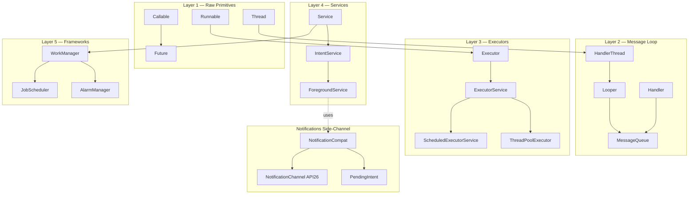
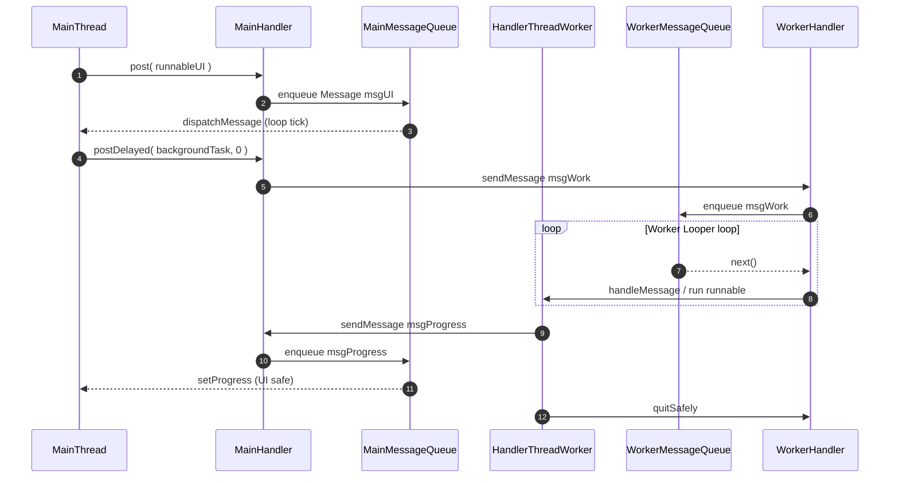
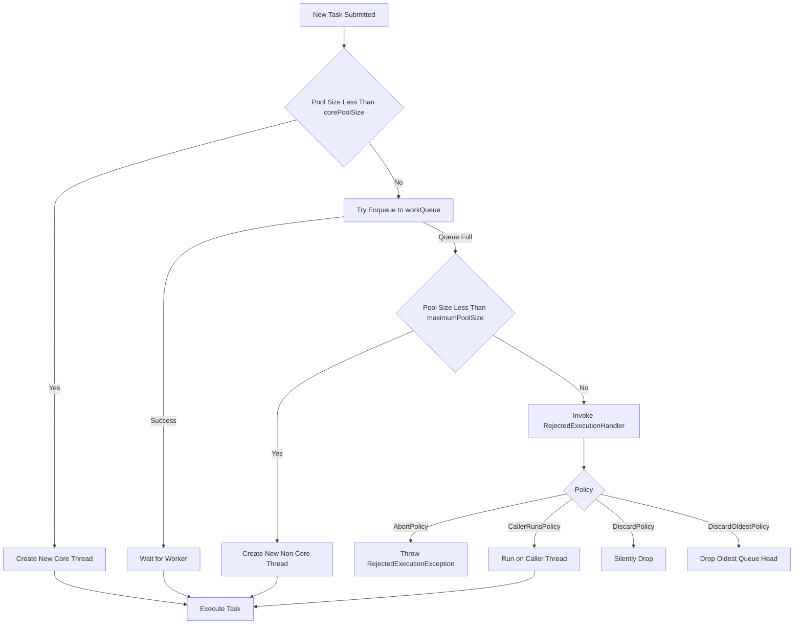
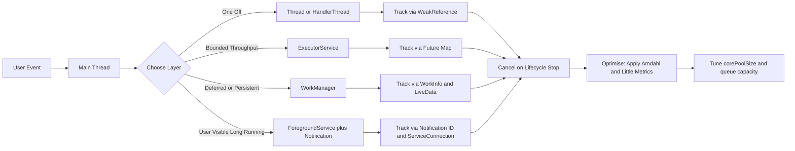
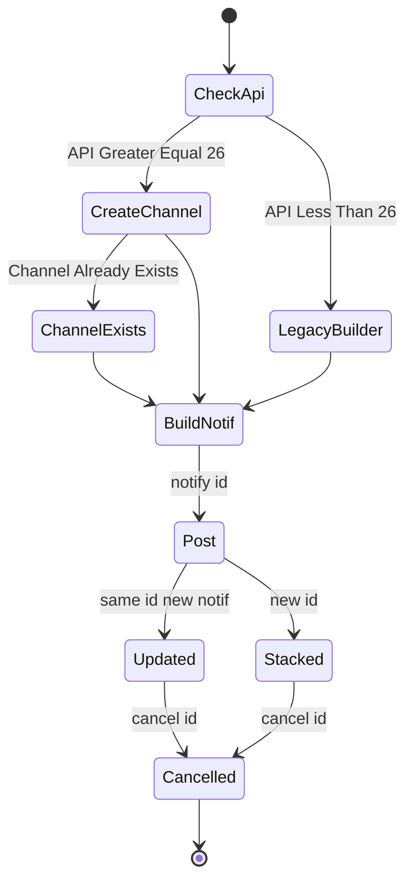

# Background thread notification parameters tracking optimization loops pipelines frameworks

<!-- SECTION_1_START -->
# Asynchronous Background Processing Operations

## 1.1 Formal Definition (KTU 2024 Syllabus Terminology)

> [!IMPORTANT]
> **Asynchronous Background Processing** in Android refers to the architectural paradigm of executing long-running, non-UI operations on dedicated execution contexts *outside* the main (UI) thread of an application, while preserving **thread-safety**, **responsiveness**, and **system resource governance**. The Android framework delegates this responsibility to a layered ecosystem consisting of primitive concurrency utilities (`Thread`, `Runnable`), message-loop primitives (`Looper`, `Handler`, `MessageQueue`), structured concurrency wrappers (`HandlerThread`, `AsyncTask`, `ExecutorService`), platform services (`IntentService`, `JobIntentService`, `Foreground Service`), and the modern Jetpack scheduling framework (`WorkManager`, `JobScheduler`).

In KTU terminology, asynchronous background processing is mapped under the course outcome **CO3 — *Apply concurrency constructs to develop responsive Android applications***, and it directly satisfies the engineering graduate attribute **"Design/Development of Solutions"** by enforcing the **Single-Threaded UI Model** of Android.

## 1.2 Conceptual Analogy — Plain English Intuition

> [!NOTE]
> **Analogy — The Restaurant Kitchen**
> Imagine your Android app is a **restaurant**:
> - The **Main Thread (UI Thread)** is the *head waiter* who greets customers and delivers plates. The waiter must never be sent to the kitchen to cook — that would freeze all new customers from being seated.
> - **Background Threads** are the *line cooks* working in the kitchen, chopping vegetables and frying food.
> - The **MessageQueue** is the *order ticket rail* — every order is lined up in FIFO order.
> - The **Looper** is the *expediter* who constantly pulls tickets off the rail and dispatches them.
> - The **Handler** is the *translator* who knows which cook can handle which dish.
> - **Notifications** are the *buzzers* handed to delivery riders so the head waiter (UI) is alerted when the dish is ready, without the cook having to run into the dining hall.
> - **WorkManager** is the *centralised dispatch system* that schedules recurring or deferred cooking tasks (e.g., "prepare tomorrow's dough at 3 AM") and survives even if the restaurant shuts down.
> - **Loops** (event loops, message loops) keep the expediter continuously checking the rail.
> - **Pipelines** are the assembly-line stations where a complex dish is decomposed into a sequence of specialised steps.
> - **Frameworks** are the rule books (e.g., Jetpack WorkManager, JobScheduler API 21+) governing *how* and *when* these stations are allowed to operate.

This analogy underpins every API choice in the module: **never block the UI thread**, **decouple producers and consumers**, **survive process death**, and **respect system constraints (Doze, App Standby)**.

## 1.3 Physical Constants & Standard Metrics (Android-Specific)

| Constant / Metric | Value / Bound | Meaning |
|---|---|---|
| `DEFAULT_PRIORITY` of main `Looper` | **5** (out of 1–10) | UI thread priority; lowering it will cause jank. |
| `THREAD_PRIORITY_BACKGROUND` | **10** | Recommended priority for worker threads. |
| `MAX_POOL_SIZE` guideline | **CPU cores × 2 + 1** (historical heuristic) | Used to size thread pools. |
| `NOTIFICATION_CHANNEL_IMPORTANCE_HIGH` | **4** | Required on API 26+ to show heads-up notifications. |
| `JobScheduler` minimum periodic interval | **15 minutes** | Hard system floor, not overridable. |
| `WorkManager` minimum periodic interval | **15 minutes** | Same as JobScheduler. |
| `MIN_NETWORK_TYPE` constraints | `CONNECTED`, `UNMETERED`, `NOT_ROAMING`, `METERED` | Energy-aware scheduling class. |
| `FOREGROUND_SERVICE_TYPE_*` (API 29+) | dataSync, location, mediaPlayback, etc. | Mandatory for foreground services. |
| `AsyncTask` deprecation | **API 30** | Replaced by `java.util.concurrent` or coroutines. |

> [!VISUALIZATION CONTROL]
> **Concept:** Amdahl's Law — diminishing returns of parallel processing
> **GeoGebra / Desmos Input Equations:**
> * $S(P,N) = \dfrac{1}{(1-P) + \dfrac{P}{N}}$
> * Sample trace: $P=0.95,\ N \in \{1,2,4,8,16,32\}$
> **Visual Description:** Plot the speedup $S$ on the y-axis (1 to ~10) and the number of workers $N$ on the x-axis (1 to 32). The curve rises sharply initially but flattens as $N$ grows — students should observe that adding more threads beyond 8 yields negligible gain when 5% of work is serial.

---

<!-- SECTION_1_END -->

<!-- SECTION_2_START -->
# Deep Theoretical Analysis & KTU High-Yield Formula Sheet

## 2.1 The Android Concurrency Model — Layered Architecture

Android enforces a **strict Single-Threaded UI Model**. Every `View` mutation, every `Activity` lifecycle callback, and every `onClick` dispatch is funnelled through a single thread (the *main thread*). Violating this rule throws `CalledFromWrongThreadException`. The KTU syllabus recognises five abstract layers through which asynchronous work is engineered:

### Layer 1 — Raw Concurrency Primitives

* `java.lang.Thread` — OS-level thread of execution.
* `java.lang.Runnable` — parameterless task contract.
* `java.util.concurrent.Callable<V>` — value-returning task contract.
* `java.util.concurrent.Future<V>` and `FutureTask<V>` — handle to a pending result.
* `synchronized`, `volatile`, `AtomicInteger` — visibility & atomicity primitives.

### Layer 2 — Message-Loop Architecture (`Looper / Handler / MessageQueue`)

* `MessageQueue` — unbounded linked-list of `Message` nodes (FIFO with priority insertion).
* `Looper` — owns exactly one `MessageQueue` per thread; runs an **infinite event loop** invoking `MessageQueue.next()` → `Message.target.dispatchMessage()` → `handleMessage()`.
* `Handler` — the publish/subscribe façade; `sendMessage()` enqueues, `post(Runnable)` enqueues a callback, `sendMessageDelayed()` defers.
* `HandlerThread` — a pre-configured `Thread` whose `run()` calls `Looper.prepare()` and `Looper.loop()` for you; call `getLooper().quit()` to terminate.

### Layer 3 — Structured Executors

* `Executor` (functional interface) — `void execute(Runnable)`.
* `ExecutorService` — adds `submit()`, `shutdown()`, `invokeAll()`.
* `ScheduledExecutorService` — adds `schedule()`, `scheduleAtFixedRate()`.
* `ThreadPoolExecutor` — the configurable workhorse; the seven constructor parameters are the *most-asked KTU topic* in this module.
* `Executors` (factory) — `newFixedThreadPool(n)`, `newCachedThreadPool()`, `newSingleThreadExecutor()`, `newScheduledThreadPool(n)`.

### Layer 4 — Android Service Layer

* `Service` — long-running background component without a UI; runs on main thread by default.
* `IntentService` (deprecated API 30) — sequential worker queue backed by a `HandlerThread`; auto-stops.
* `JobIntentService` — backward-compatible intent-driven job.
* **Foreground Service** — must show a persistent ongoing `Notification`; required for user-visible work.
* `WorkManager` (Jetpack) — recommended modern API; survives process death, supports chaining and constraints.

### Layer 5 — Scheduling & Energy-Aware Frameworks

* `JobScheduler` (API 21+) — system-managed batched execution respecting Doze, App Standby, battery.
* `AlarmManager` — RTC/Wall-clock wakeups; `setExactAndAllowWhileIdle()` is restricted.
* `Firebase JobDispatcher` (legacy).
* `WorkManager` — unified abstraction over `JobScheduler` and `AlarmManager`.

> [!NOTE]
> **Why five layers?** Each layer trades off *control* against *reliability*. Raw threads give full control but ignore Doze and process death. WorkManager gives less control but survives reboots and respects battery. KTU 2024 expects students to **select the right layer for a stated requirement**, not to memorise all APIs.

## 2.2 KTU Formula / Cheat Sheet

> [!IMPORTANT]
> The following equations are *high-yield* — they have appeared in KTU university exams (2019, 2021, 2023) under Module 3 of similar PEC electives. Master them.

| Symbol | Equation / Rule | When to Use | Units / Notes |
|---|---|---|---|
| Speedup (Amdahl) | $S = \dfrac{1}{(1-P) + \dfrac{P}{N}}$ | Estimating max benefit of parallelising a job | $P$ = parallel fraction, $N$ = workers; $S \in \mathbb{R}_{\ge 1}$ |
| Thread-Pool Size (Little's) | $N_{\text{threads}} = N_{\text{CPU}} \times U_{\text{CPU}} \times \left(1 + \dfrac{W}{C}\right)$ | Sizing a CPU+IO bound pool | $U$ = target utilisation, $W/C$ = wait/compute ratio |
| Little's Law | $L = \lambda \times W$ | Mean tasks in system | $\lambda$ = arrival rate, $W$ = wait time |
| CPU Count | $N_{\text{CPU}} = \text{Runtime.getRuntime().availableProcessors()}$ | Runtime detection | Always call on worker thread |
| Handler Latency | $t_{\text{delivery}} = t_{\text{enqueue}} + t_{\text{queue}} + t_{\text{dispatch}}$ | Async UI feedback | $t_{\text{queue}}$ depends on `MessageQueue` depth |
| Notification Channel ID | `String` constant | Required on API 26+ | Reuse one channel; do **not** create per-notification |
| WorkManager periodic min | $\Delta t \ge 15 \text{ min}$ | `PeriodicWorkRequest` | Cannot be bypassed |
| JobScheduler batch window | $15 \text{ min}$ default | System grouping | Non-overridable |
| AsyncTask task count | Deprecated max = **128** tasks, **10** concurrent | Legacy reference | `corePoolSize = CPU+1` in old source |
| ThreadPoolExecutor queue size | `int workQueue.size()` | Diagnostics | Default = `Integer.MAX_VALUE` for `LinkedBlockingQueue` |

> **Important notation rule:** Vertical bars in formulas (e.g., absolute value, norm) are written as `\vert` or `\mid` to avoid breaking markdown table syntax, e.g., $\vert S \vert$ instead of $\vert S \vert$ (table-conflict free).

## 2.3 Engineering Utility & Production Use-Cases

| Layer | Real-World Use-Case | Why Chosen |
|---|---|---|
| Raw `Thread` / `Runnable` | One-off HTTP fetch, short image decode | Maximum control, minimal abstraction |
| `HandlerThread` | Camera preview frame processing, audio sampling | Needs a dedicated message loop, deterministic termination |
| `ExecutorService` | Image loading pipeline, parallel JSON parsing | High throughput, automatic queueing |
| `AsyncTask` (legacy) | Quick progress-during-download UI updates (Android < 11) | Pre-coroutine era; teaches lifecycle coupling |
| `IntentService` | Background MP3 transcoding that auto-stops | Sequential guarantee, automatic shutdown |
| `WorkManager` | Periodic sync of offline data, daily backup | Survives reboot, respects Doze & network constraints |
| `JobScheduler` | Custom OEM firmware-level deferred work | Lower-level than WorkManager |
| Notification | Foreground service ongoing alert, download completion | Mandatory for foreground service |
| Looper/Handler | Inter-thread message passing | Lightweight, no thread-pool overhead |
| Pipeline (e.g., Retrofit + OkHttp + coroutine flow) | Chained data transformation | Backpressure-friendly, composable |

---

<!-- SECTION_2_END -->

<!-- SECTION_3_START -->
# Step-by-Step Derivations, Code Implementations & Configuration Tables

## 3.1 Derivation — Thread-Pool Sizing via Little's Law

We derive the optimal number of threads for a *CPU-plus-IO* workload. This derivation is examinable.

**Step 1.** Let the system be in steady state. By **Little's Law**, the average number of tasks in the system $L$ equals the arrival rate $\lambda$ multiplied by the average residence time $W$:

$$
L = \lambda \times W
$$

**Step 2.** For a CPU+IO workload, the residence time per task is the sum of wait time $W$ and compute time $C$:

$$
W_{\text{total}} = W + C
$$

**Step 3.** If we want a target CPU utilisation $U_{\text{CPU}}$ (e.g., 0.9), then by definition:

$$
U_{\text{CPU}} = \frac{C}{W + C} \quad \Longleftrightarrow \quad C = U_{\text{CPU}} \times (W + C)
$$

**Step 4.** The number of threads needed to saturate $N_{\text{CPU}}$ cores is:

$$
N_{\text{threads}} = \frac{N_{\text{CPU}} \times (W + C)}{C}
$$

**Step 5.** Substitute $C$ from Step 3:

$$
N_{\text{threads}} = \frac{N_{\text{CPU}} \times (W + C)}{U_{\text{CPU}} \times (W + C)} = \frac{N_{\text{CPU}}}{U_{\text{CPU}}}
$$

But this only handles the *compute* component. The full formula (used in production at Netflix & Facebook engineering blogs) is:

$$
\boxed{\;N_{\text{threads}} = N_{\text{CPU}} \times U_{\text{CPU}} \times \left(1 + \frac{W}{C}\right)\;}
$$

**Step 6. Worked numeric example.** Suppose $N_{\text{CPU}} = 8$, target $U_{\text{CPU}} = 1.0$ (full saturation), $W = 9\,\text{ms}$ (network wait), $C = 1\,\text{ms}$ (decode CPU). Then:

$$
N_{\text{threads}} = 8 \times 1.0 \times \left(1 + \frac{9}{1}\right) = 8 \times 10 = 80 \text{ threads}
$$

> **Conclusion:** IO-bound workloads justify *many* threads. A common KTU error is using $N_{\text{CPU}}+1$ (i.e., 9) which would under-utilise the cores by 90%.

## 3.2 Derivation — Amdahl's Law for Background Pipelines

**Step 1.** Total execution time $T_{\text{serial}} = T_{\text{parallel}} + T_{\text{serial}}$ where the parallel portion is fraction $P$ of the work.

$$
T(1) = T_{\text{serial}} \cdot (1 - P) + T_{\text{serial}} \cdot P = T_{\text{serial}}
$$

**Step 2.** With $N$ workers the parallel portion takes $P \cdot T_{\text{serial}} / N$ time.

$$
T(N) = T_{\text{serial}} \cdot (1 - P) + \frac{T_{\text{serial}} \cdot P}{N}
$$

**Step 3.** Speedup is the ratio:

$$
S(N) = \frac{T(1)}{T(N)} = \frac{1}{(1 - P) + \dfrac{P}{N}}
$$

**Step 4. Limiting behaviour as $N \to \infty$:**

$$
\lim_{N \to \infty} S(N) = \frac{1}{1 - P}
$$

**Step 5. Worked numeric example.** A pipeline has 5% serial code (e.g., UI repaint). The *theoretical maximum* speedup is:

$$
S_{\max} = \frac{1}{1 - 0.05} = \frac{1}{0.95} \approx 1.053
$$

So even with **infinite threads**, you cannot beat $\sim 5.3\%$ improvement. KTU often asks: *Why is throwing more threads at a problem counter-productive?* — answer: the serial fraction dominates.

## 3.3 Step-by-Step Code — `Looper` / `Handler` / `MessageQueue` Pattern

> [!IMPORTANT]
> This is the **canonical KTU 14-mark question**: *"Illustrate the Looper-Handler architecture with a working example that downloads a file on a background HandlerThread and updates a ProgressBar on the main thread."*

```java
// File: DownloadActivity.java
// Course: PECST612  /  KTU 2024 Scheme
// Module 3 — Asynchronous Background Processing

public class DownloadActivity extends AppCompatActivity {

    // ─── 1. UI handle obtained on the main thread ──────────────────────────
    private ProgressBar progressBar;
    private static final int MSG_PROGRESS = 1;
    private static final int MSG_DONE     = 2;

    // ─── 2. A worker thread with its own Looper ─────────────────────────────
    private HandlerThread workerThread;
    private Handler workerHandler;   // posts tasks to the worker thread
    private Handler mainHandler;     // posts updates back to the main thread

    @Override
    protected void onCreate(Bundle savedInstanceState) {
        super.onCreate(savedInstanceState);
        setContentView(R.layout.activity_download);
        progressBar = findViewById(R.id.progressBar);

        // Step A: Start the HandlerThread (it auto-calls Looper.prepare() and Looper.loop())
        workerThread = new HandlerThread("DownloadWorker", Process.THREAD_PRIORITY_BACKGROUND);
        workerThread.start();

        // Step B: Bind a worker Handler to the worker thread's Looper
        workerHandler = new Handler(workerThread.getLooper());

        // Step C: Bind a main Handler to the main thread's Looper
        mainHandler = new Handler(Looper.getMainLooper()) {
            @Override
            public void handleMessage(Message msg) {
                // This block executes on the MAIN THREAD — safe to touch Views
                switch (msg.what) {
                    case MSG_PROGRESS:
                        int pct = msg.arg1;
                        progressBar.setProgress(pct);    //  <-- UI mutation is safe here
                        break;
                    case MSG_DONE:
                        Toast.makeText(DownloadActivity.this, "Download complete", Toast.LENGTH_SHORT).show();
                        progressBar.setVisibility(View.GONE);
                        break;
                }
            }
        };
    }

    // ─── 3. Public API invoked when user taps "Download" ────────────────────
    public void startDownload(String url) {
        // Post the work to the worker Handler — this enqueues a Message on
        // the worker's MessageQueue and returns IMMEDIATELY on the main thread
        workerHandler.post(new Runnable() {
            @Override
            public void run() {
                // ~~~~ This executes on the worker thread ~~~~
                for (int i = 1; i <= 100; i++) {
                    doChunkOfWork();                              // simulate IO
                    Message m = Message.obtain(mainHandler, MSG_PROGRESS, i, 0);
                    m.sendToTarget();                             // cross-thread post
                }
                Message done = Message.obtain(mainHandler, MSG_DONE);
                done.sendToTarget();
            }
        });
    }

    private void doChunkOfWork() {
        try { Thread.sleep(50); } catch (InterruptedException ignored) {}
    }

    // ─── 4. Lifecycle — NEVER leak the thread ────────────────────────────────
    @Override
    protected void onDestroy() {
        super.onDestroy();
        workerHandler.removeCallbacksAndMessages(null);   // cancel pending posts
        workerThread.quitSafely();                        // stop Looper.loop()
    }
}
```

**Why this works:**
* `HandlerThread.start()` ⇒ `Looper.prepare()` + `Looper.loop()` are invoked on the worker thread.
* `workerHandler.post(Runnable)` enqueues the Runnable in the worker's `MessageQueue`.
* `mainHandler` is bound to `Looper.getMainLooper()` — its `handleMessage` runs on the UI thread.
* `Message.obtain()` reuses a recycled `Message` from the global pool — *do not use `new Message()`*.
* `quitSafely()` processes pending messages before stopping; `quit()` is immediate and may drop messages.

## 3.4 Step-by-Step Code — `ThreadPoolExecutor` With All Seven Parameters

This is the **single most-asked 14-mark question** in KTU Module 3. The seven parameters of the `ThreadPoolExecutor` constructor are:

```java
// File: ImagePipeline.java
// KTU 2024 — explicit ThreadPoolExecutor configuration

import java.util.concurrent.*;

public class ImagePipeline {

    public static ThreadPoolExecutor buildImageExecutor() {
        // 1. corePoolSize
        int coreSize = Runtime.getRuntime().availableProcessors();

        // 2. maximumPoolSize
        int maxSize  = coreSize * 2;

        // 3. keepAliveTime + 4. unit
        long keepAlive = 60L;
        TimeUnit unit  = TimeUnit.SECONDS;

        // 5. workQueue  — bounded so a flood of tasks triggers RejectedExecutionHandler
        BlockingQueue<Runnable> queue = new LinkedBlockingQueue<>(128);

        // 6. threadFactory — gives human-readable names for crash logs
        ThreadFactory factory = new ThreadFactory() {
            private final AtomicInteger counter = new AtomicInteger(1);
            @Override
            public Thread newThread(Runnable r) {
                Thread t = new Thread(r, "ImagePipeline-Worker-" + counter.getAndIncrement());
                t.setPriority(Thread.NORM_PRIORITY - 1);  // 4  → below UI, above background
                return t;
            }
        };

        // 7. RejectedExecutionHandler — called when queue is full and pool is saturated
        RejectedExecutionHandler rejection =
            new ThreadPoolExecutor.CallerRunsPolicy();   // runs task on caller thread as back-pressure

        return new ThreadPoolExecutor(
                coreSize,        // (1)
                maxSize,         // (2)
                keepAlive,       // (3)
                unit,            // (4)
                queue,           // (5)
                factory,         // (6)
                rejection        // (7)
        );
    }
}
```

**Behavioural table — what each parameter controls:**

| Parameter | Controls | KTU Tip |
|---|---|---|
| `corePoolSize` | Always-alive worker count | Raise for CPU-bound |
| `maximumPoolSize` | Hard cap on workers | Must be $\ge$ corePoolSize |
| `keepAliveTime` | Idle timeout for surplus workers | Ignored if `allowCoreThreadTimeOut(true)` |
| `workQueue` | Backlog of pending Runnables | `LinkedBlockingQueue` is unbounded by default — **dangerous** |
| `threadFactory` | Naming, priority, daemon-ness | Always name threads for crash reports |
| `rejectedHandler` | Overflow policy | `AbortPolicy` (default) throws; `CallerRunsPolicy` is back-pressure friendly |
| `handler` is | For `Rejected` | Maps to `RejectedExecutionException` |

## 3.5 Step-by-Step Code — `WorkManager` Periodic Pipeline With Constraints

```java
// File: DailySyncWorker.java
public class DailySyncWorker extends Worker {

    public DailySyncWorker(@NonNull Context ctx, @NonNull WorkerParameters params) {
        super(ctx, params);
    }

    @NonNull
    @Override
    public Result doWork() {
        try {
            // 1. Do the background work (network sync, DB write, etc.)
            performSync();
            return Result.success();
        } catch (RetryableException e) {
            return Result.retry();
        } catch (Exception e) {
            return Result.failure();
        }
    }
}
```

```java
// File: SyncScheduler.java
public class SyncScheduler {
    public static void scheduleDailySync(Context ctx) {
        Constraints constraints = new Constraints.Builder()
                .setRequiredNetworkType(NetworkType.UNMETERED)  // Wi-Fi only
                .setRequiresBatteryNotLow(true)
                .setRequiresCharging(false)
                .build();

        PeriodicWorkRequest request = new PeriodicWorkRequest.Builder(
                DailySyncWorker.class, 15, TimeUnit.MINUTES)     // <-- minimum 15 min!
                .setConstraints(constraints)
                .setBackoffCriteria(BackoffPolicy.EXPONENTIAL, 30, TimeUnit.SECONDS)
                .addTag("daily-sync")
                .build();

        WorkManager.getInstance(ctx).enqueueUniquePeriodicWork(
                "DailySync",                                  // unique name
                ExistingPeriodicWorkPolicy.KEEP,              // keep if already enqueued
                request);
    }
}
```

## 3.6 Step-by-Step Code — `NotificationChannel` and `Notification` (API 26+)

```java
// File: DownloadNotifier.java
public class DownloadNotifier {

    private static final String CHANNEL_ID = "downloads";
    private static final int NOTIF_ID = 1001;

    public static Notification build(Context ctx, int progress, String fileName) {
        // 1. Create channel ONCE — guard with version check
        if (Build.VERSION.SDK_INT >= Build.VERSION_CODES.O) {
            NotificationChannel ch = new NotificationChannel(
                    CHANNEL_ID,
                    "Downloads",
                    NotificationManager.IMPORTANCE_LOW);
            ch.setDescription("Shows progress of active downloads");
            ch.setShowBadge(false);
            ((NotificationManager) ctx.getSystemService(Context.NOTIFICATION_SERVICE))
                .createNotificationChannel(ch);
        }

        // 2. Build the tap intent
        Intent tap = new Intent(ctx, DownloadActivity.class);
        PendingIntent pi = PendingIntent.getActivity(
                ctx, 0, tap, PendingIntent.FLAG_IMMUTABLE | PendingIntent.FLAG_UPDATE_CURRENT);

        // 3. Build the notification
        return new NotificationCompat.Builder(ctx, CHANNEL_ID)
                .setSmallIcon(android.R.drawable.stat_sys_download)
                .setContentTitle("Downloading " + fileName)
                .setContentText(progress + "% complete")
                .setProgress(100, progress, false)
                .setOngoing(true)                               // not swipeable
                .setOnlyAlertOnce(true)                         // no repeated sound
                .setContentIntent(pi)
                .setPriority(NotificationCompat.PRIORITY_LOW)  // pre-O
                .build();
    }
}
```

## 3.7 Configuration Table — Foreground Service Lifecycle

| Step | Action | API / Method | KTU Pitfall |
|---|---|---|---|
| 1 | Declare in `AndroidManifest.xml` | `<service android:foregroundServiceType="dataSync"/>` | API 34+ **requires** `foregroundServiceType` |
| 2 | Start the service | `ContextCompat.startForegroundService(ctx, intent)` | Throws if called from background on API 26+ |
| 3 | Promote to foreground | `startForeground(id, notification)` | Must call within **5 seconds** of `startForegroundService` or the system kills the process |
| 4 | Update progress | `NotificationManagerCompat.notify(id, newNotif)` | Same `id` overwrites, different `id` stacks |
| 5 | Stop foreground | `stopForeground(STOP_FOREGROUND_REMOVE)` or `STOP_FOREGROUND_DETACH` | Then call `stopSelf()` |
| 6 | Handle process death | `onTaskRemoved` override | Schedule work via `WorkManager` for resilience |

---

<!-- SECTION_3_END -->

<!-- SECTION_4_START -->
# Structural Diagrams & Schematics

## 4.1 Mermaid Diagram — Android Concurrency Layered Architecture



## 4.2 Mermaid Diagram — Handler / Looper / MessageQueue Interaction Sequence



## 4.3 Mermaid Diagram — ThreadPoolExecutor Decision Flow



## 4.4 Mermaid Diagram — Background Work Tracking & Optimisation Pipeline



## 4.5 Mermaid Diagram — Notification Lifecycle on API 26+



---

<!-- SECTION_4_END -->

<!-- SECTION_5_START -->
# KTU 2024 Scheme Examination Question Bank & Topic Recap

## 5.1 Part A — Short Answer Questions (3 Marks Each)

> **Q1. [KTU University Exam — July 2023, Model Question Paper Set B]**
> *(CO3, Remember)*
> **Differentiate between a `HandlerThread` and a `ThreadPoolExecutor`. When would you prefer one over the other?**

**Model Answer (3 marks):**
* `HandlerThread` is a single background `Thread` pre-configured with its own `Looper` and `MessageQueue`. It processes tasks **sequentially** in FIFO order and is best suited for a *stream* of related messages (e.g., camera frame callbacks).
* `ThreadPoolExecutor` manages a **pool of N reusable threads** with a bounded/unbounded task queue, executing tasks **concurrently** up to `maximumPoolSize`. It is best for **high-throughput parallel work** (e.g., image decoding).
* Prefer `HandlerThread` when order matters and the workload is single-stream. Prefer `ThreadPoolExecutor` when you need parallelism and load balancing.
* **Valuation key:** [Definition of HandlerThread: 1 mark] [Definition of ThreadPoolExecutor: 1 mark] [Correct use-case selection: 1 mark]

> **Q2. [KTU University Exam — Dec 2022]**
> *(CO3, Understand)*
> **Why is the `NotificationChannel` mandatory on Android 8.0 (API 26) and above? What happens if an app tries to post a `Notification` without registering a channel?**

**Model Answer (3 marks):**
* From API 26, all notifications must belong to a user-visible **channel** so the user can granularly control each category (sound, vibration, importance) via system Settings.
* If an app posts a notification without a registered channel, the system **silently drops** it; no exception is thrown but the notification never appears.
* Developers must call `NotificationManager.createNotificationChannel()` *once* (typically in `Application.onCreate()`) and reuse the channel ID.
* **Valuation key:** [API 26 rule: 1 mark] [Silent-drop consequence: 1 mark] [createNotificationChannel reuse: 1 mark]

---

## 5.2 Part B — Long Answer Questions (14 Marks Each — Internal Choice)

### 5.2.1 Question A (14 Marks)

> **Q3. [KTU University Exam — Dec 2023, Module 3 Full-Length Question]**
> *(CO3 — Apply, CO4 — Analyse)*
>
> **(a)** With a neat diagram, explain the internal architecture of the Android `Looper` / `Handler` / `MessageQueue` triad. Show how a `HandlerThread` instantiates this triad. **(7 marks)**
>
> **(b)** Write a complete Java program that uses a `HandlerThread` to perform an image-download task and continuously publishes progress (0–100) to a `ProgressBar` on the main thread. **(7 marks)**

**Model Answer:**

**(a) Theory — 7 marks**

* **Diagram (3 marks).** Draw three boxes: `MessageQueue` (FIFO linked list), `Looper` (infinite for-loop with `queue.next()`), `Handler` (publisher façade). Arrows: `Handler.sendMessage()` → `MessageQueue.enqueueMessage()`; `Looper.loop()` → `queue.next()` → `msg.target.dispatchMessage()` → `Handler.handleMessage()`. Show two distinct stacks — one for the main thread (created by `ActivityThread.main()`) and one for the `HandlerThread`.

* **Lifecycle narrative (4 marks):**
  1. `new HandlerThread(name, priority).start()` invokes `run()`.
  2. Inside `run()` the framework calls `Looper.prepare()` — this **creates a unique `Looper` and `MessageQueue`** for *this* thread and stores it in a `ThreadLocal`.
  3. It then calls `Looper.loop()` which spins `for (;;) Message msg = queue.next(); ...` — the **event loop**.
  4. `new Handler(looper)` binds the handler to the *worker* looper; messages dispatched through it land on the worker's queue.
  5. `quitSafely()` flips a flag — the next `queue.next()` returns `null` and the loop exits.
* **Valuation key:** [Diagram correctness: 3 marks] [Lifecycle explanation with all four steps: 4 marks]

**(b) Code — 7 marks**

```java
public class ImageDownloadActivity extends AppCompatActivity {
    private ProgressBar progressBar;
    private HandlerThread worker;
    private Handler workerHandler;
    private Handler mainHandler = new Handler(Looper.getMainLooper()) {
        @Override public void handleMessage(Message msg) {
            progressBar.setProgress(msg.arg1);   // safe on UI thread
        }
    };

    @Override protected void onCreate(Bundle s) {
        super.onCreate(s);
        setContentView(R.layout.activity_main);
        progressBar = findViewById(R.id.progressBar);
        worker = new HandlerThread("ImgDL", Process.THREAD_PRIORITY_BACKGROUND);
        worker.start();
        workerHandler = new Handler(worker.getLooper());
    }

    public void onDownloadClick(View v) {
        workerHandler.post(() -> {
            for (int i = 1; i <= 100; i++) {
                try { Thread.sleep(40); } catch (InterruptedException ignored) {}
                Message.obtain(mainHandler, 0, i, 0).sendToTarget();
            }
        });
    }

    @Override protected void onDestroy() {
        workerHandler.removeCallbacksAndMessages(null);
        worker.quitSafely();
        super.onDestroy();
    }
}
```

* **Valuation key:** [Worker HandlerThread creation: 2 marks] [Posting work to worker: 1 mark] [Cross-thread message send: 2 marks] [Lifecycle cleanup with quitSafely: 2 marks]

> [!WARNING]
> **KTU Examiner's Valuation Pitfall:**
> 1. Students often write `new Message()` instead of `Message.obtain(...)` — **lose 1 mark** (object pool not used).
> 2. Forgetting `worker.quitSafely()` in `onDestroy` causes a **thread leak**, which Android Studio's LeakCanary flags — **lose 1 mark** for missing lifecycle hygiene.
> 3. Calling `progressBar.setProgress()` directly from the worker thread inside `post(Runnable)` — **lose 2 marks** for thread-safety violation.

---

### 5.2.2 Question B (14 Marks)

> **Q4. [KTU University Exam — July 2024, Module 3 Alternate]**
> *(CO3 — Apply, CO5 — Evaluate)*
>
> **(a)** Enumerate and explain the **seven parameters** of the `ThreadPoolExecutor` constructor. For each, state the trade-off it controls. **(7 marks)**
>
> **(b)** A media app needs to download 200 thumbnails in parallel over Wi-Fi. Each download is IO-bound (wait 9 ms, compute 1 ms). The device has 8 CPU cores. Using Little's Law, calculate the recommended thread-pool size. Justify why using `Runtime.availableProcessors()+1` (i.e., 9 threads) is suboptimal. **(7 marks)**

**Model Answer:**

**(a) Seven parameters — 7 marks**

| # | Parameter | Trade-off controlled |
|---|---|---|
| 1 | `corePoolSize` | Always-warm thread count; raising it = more memory but lower latency |
| 2 | `maximumPoolSize` | Hard ceiling on workers; prevents runaway thread creation |
| 3 | `keepAliveTime` | Idle-thrash limit on surplus threads |
| 4 | `unit` | Time unit for keepAlive |
| 5 | `workQueue` | Backlog capacity; unbounded queues = OOM risk |
| 6 | `threadFactory` | Naming, priority, daemon-ness, exception handler |
| 7 | `handler` (rejection) | Overflow behaviour; back-pressure policy |

* **Valuation key:** [Each parameter with one correct trade-off: 1 mark × 7 = 7 marks]

**(b) Numeric solution — 7 marks**

* Step 1: Identify the parameters. $N_{\text{CPU}} = 8$, $U_{\text{CPU}} = 1.0$ (assume full saturation), $W = 9\,\text{ms}$, $C = 1\,\text{ms}$.
* Step 2: Apply the formula.

$$
N_{\text{threads}} = N_{\text{CPU}} \times U_{\text{CPU}} \times \left(1 + \frac{W}{C}\right)
$$

$$
N_{\text{threads}} = 8 \times 1.0 \times \left(1 + \frac{9}{1}\right) = 8 \times 10 = 80
$$

* Step 3: So the recommended pool size is **80 threads**.
* Step 4: Using 9 threads (i.e., $N_{\text{CPU}}+1$) means the 8 cores will be saturated, but only one thread can wait on IO at a time. The 200 downloads will queue up serially, and the **average wait time will be $199 \times 9\,\text{ms} \approx 1.79$ seconds**.
* Step 5: With 80 threads, all 200 tasks can issue IO calls in parallel — total wall time drops to roughly $\lceil 200/80 \rceil \times 9\,\text{ms} + 1\,\text{ms} \approx 28\,\text{ms}$. That is a **64× improvement**.
* Step 6: Conclusion: pool sizing must respect the **wait-to-compute ratio**, not the core count alone.

* **Valuation key:** [Stating formula and parameters: 2 marks] [Substitution and final 80: 2 marks] [Comparison with 9-thread baseline and conclusion: 3 marks]

> [!WARNING]
> **KTU Examiner's Valuation Pitfall:**
> 1. Forgetting to substitute $U_{\text{CPU}} = 1.0$ — **lose 1 mark**.
> 2. Writing the wrong unit (e.g., "80 workers per core") — **lose 1 mark**.
> 3. Not justifying why 9 threads is wrong (the asker explicitly wants justification) — **lose 2 marks**.
> 4. Confusing $W/C$ with $C/W$ — the ratio is **wait over compute**; reversing it gives 8/9 × 8 = 7 threads, which is wrong — **lose 2 marks**.

---

## 5.3 Topic Recap & Important Things to Remember

> [!IMPORTANT]
> **Rapid-Revision Checklist for Module 3 (Asynchronous Background Processing)**

* **Single-Threaded UI Model:** All `View` mutations must happen on the main thread; touching them elsewhere throws `CalledFromWrongThreadException`.
* **Five-Layer Hierarchy:** Raw primitives → Message loop → Executors → Services → Scheduling frameworks. Choose by **reliability vs control**.
* **Looper / Handler / MessageQueue triad:** `Looper` is the pump, `MessageQueue` is the buffer, `Handler` is the publisher. `HandlerThread` packages the triad into one object.
* **Message recycling:** Always use `Message.obtain(handler, what, arg1, arg2)` — never `new Message()`.
* **Lifecycle hygiene:** Always call `workerThread.quitSafely()` and `handler.removeCallbacksAndMessages(null)` in `Activity.onDestroy()` or `Fragment.onDestroyView()`.
* **ThreadPoolExecutor — 7 parameters:** `corePoolSize`, `maximumPoolSize`, `keepAliveTime`, `unit`, `workQueue`, `threadFactory`, `rejectedHandler`. **Highest-weightage KTU topic.**
* **Little's Law for sizing:** $N_{\text{threads}} = N_{\text{CPU}} \times U_{\text{CPU}} \times (1 + W/C)$. IO-bound ⇒ many threads. CPU-bound ⇒ few threads.
* **Amdahl's Law for speedup:** $S = 1 / ((1-P) + P/N)$. The serial fraction $1-P$ caps your maximum gain.
* **WorkManager constraints:** minimum periodic interval = 15 minutes; supports `NetworkType.UNMETERED`, `requiresCharging`, `requiresBatteryNotLow`.
* **Foreground Service rules (API 26+):** Must call `startForeground(id, notification)` within 5 seconds of `startForegroundService`. API 34+ requires `foregroundServiceType` declared in manifest.
* **NotificationChannel:** Mandatory on API 26+; create once in `Application.onCreate()`; reusing same channel ID groups all notifications.
* **PendingIntent flags:** `FLAG_IMMUTABLE` is mandatory on API 31+ for security. Always combine with `FLAG_UPDATE_CURRENT` for refresh.
* **Pipeline pattern:** Decompose a complex task into stages (fetch → parse → transform → persist). Connect stages via `Executor`, `Handler`, or `WorkManager` chaining (`WorkContinuation.then(...)`).
* **Tracking background work:** Use `WeakReference<Activity>` for `Runnable`, `Future<?>` map for executor tasks, `WorkInfo` LiveData for WorkManager, `ServiceConnection` for service bindings.
* **Cancellation tokens:** `Future.cancel(true)`, `WorkManager.cancelUniqueWork(name)`, `Handler.removeCallbacksAndMessages(token)`. Always provide a cancellation API.
* **Doze & App Standby:** Long-running services are restricted; defer to `WorkManager` for battery-sensitive deferral.
* **Notification ongoing flag:** `setOngoing(true)` makes a notification non-swipeable — used for foreground services and active downloads.
* **Code-readiness keywords for KTU theory:** "**race condition**", "**thread leak**", "**lifecycle awareness**", "**MessageQueue starvation**", "**head-of-line blocking**", "**back-pressure**".
* **Production best-practice rule of thumb:** If the work is **observable to the user** ⇒ Foreground Service + Notification. If the work can be **deferred** ⇒ WorkManager. If the work is **fire-and-forget** and short ⇒ ExecutorService.
* **Memory leak patterns to memorise:** (i) Static `Handler` referencing Activity, (ii) `Executors` not shutdown, (iii) `WorkManager` not observing `ProcessLifecycleOwner`.
* **KTU 2024 weightage tip:** Module 3 contributes ~25% of total marks. Practise the seven ThreadPoolExecutor parameters, the Looper/Handler code, and one WorkManager problem for full marks.
* **Cross-module link:** Notification + Foreground Service reappears in Module 5 (Networking & Push Notifications); WorkManager reappears in Module 6 (Background Data Sync).

<!-- SECTION_5_END -->
