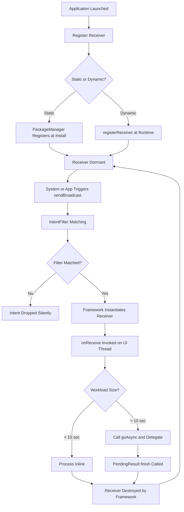
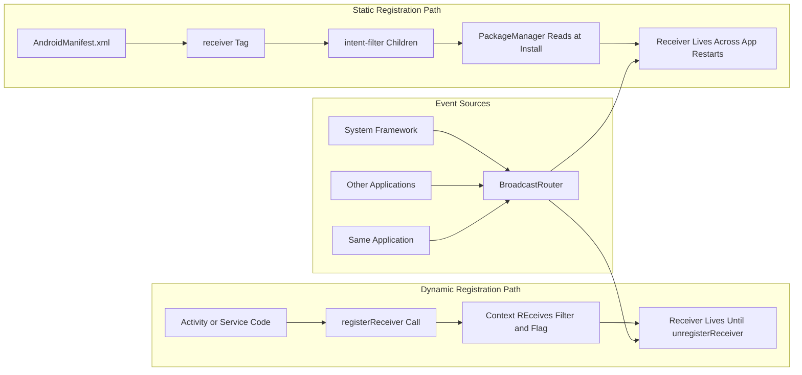
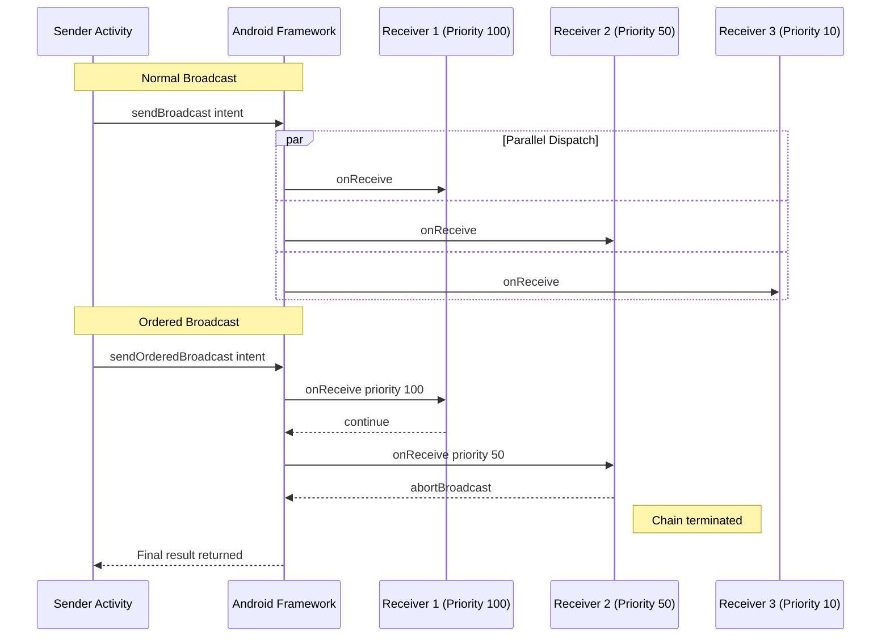
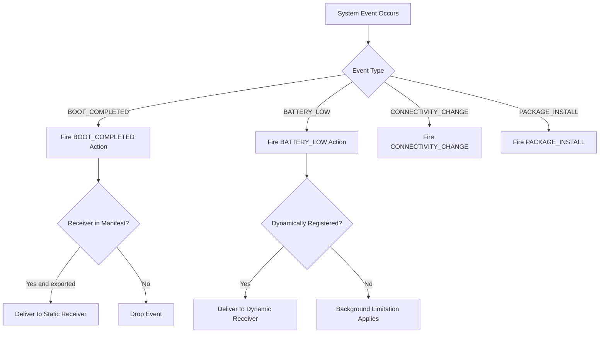
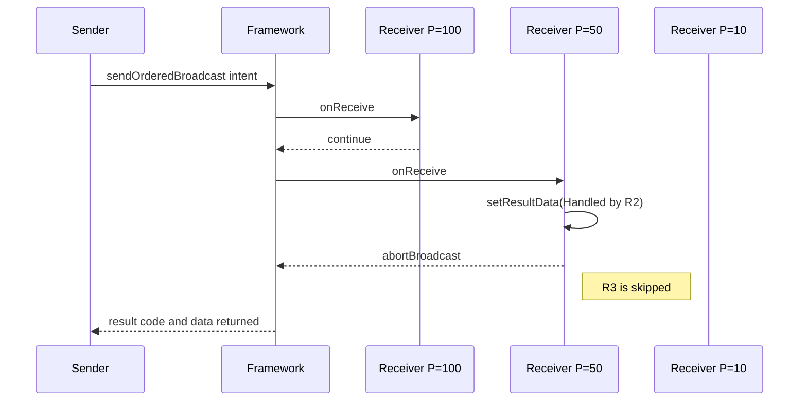

# Broadcast receiver parameters configurations systems updates scripts options parameters

<!-- SECTION_1_START -->

# Broadcast Receiver: Parameters, Configurations, System Updates, Scripts & Options

## 1.1 Formal Academic Definition (KTU 2024 Aligned)

> [!NOTE]
> **Core Definition (KTU Module 3)**
> A **BroadcastReceiver** is a fundamental Android application component that enables the application to **register, listen to, and respond** to system-wide broadcast announcements (Intents) propagated by the Android operating system, the device hardware, or other applications. It acts as the **event-driven messaging gateway** of the Android framework.

The Android system issues broadcasts whenever an event of interest occurs — for instance, when the device boots, the screen turns off, the battery becomes low, the network connectivity state changes, or a user installs/removes a package. Applications subscribe to these announcements by declaring matching **Intent Filters** that specify the **Action**, **Category**, and **Data** schema of the events they wish to intercept.

In the KTU 2024 Scheme syllabus context, the lifecycle, registration parameters, security flags, and intent-filter configurations of a BroadcastReceiver constitute the central evaluative theme for the Mobile Application Development (PECST612) course under **Module 3: Asynchronous Background Processing Operations**.

## 1.2 Conceptual Analogy & Intuition

> [!IMPORTANT]
> **Intuitive Analogy — The Radio Station Subscription**
> Imagine the Android device as a **large city** in which hundreds of **radio stations** are constantly broadcasting news (system events). A **BroadcastReceiver** is like a **specialized radio set** that you tune to one or more specific frequencies (IntentFilters). Whenever a station transmits on your tuned frequency, the radio wakes up briefly, plays the announcement, and then goes silent again.

Key intuitive mappings:

| Analogy Concept | Android Equivalent |
|-----------------|-------------------|
| Radio station | System service / OS component |
| Transmission frequency | Action String (e.g., `android.intent.action.BOOT_COMPLETED`) |
| Tuned radio | Registered BroadcastReceiver instance |
| Broadcast tower | `Context.sendBroadcast()` / `sendOrderedBroadcast()` |
| Radio catalogue | AndroidManifest.xml `<intent-filter>` declarations |
| Powered-off radio | Unregistered / Static receiver not active |

This radio metaphor immediately clarifies three foundational facts:
1. A receiver does **not** run continuously — it activates only when a matching intent arrives.
2. The execution of `onReceive()` is **short-lived** (typically ≤ **10 seconds**), making it unsuitable for heavy computation.
3. Receivers can be **statically** declared (always-on, like a built-in radio) or **dynamically** registered (turned on only when the app is in focus, like a portable radio).

## 1.3 Key Android System Constants

> [!NOTE]
> The following system-level Action constants are universally expected knowledge for the KTU Mobile Computing Laboratory viva and end-semester evaluation.

- `android.intent.action.BOOT_COMPLETED` — **device finished booting**
- `android.intent.action.BATTERY_LOW` — **battery level low**
- `android.intent.action.BATTERY_CHANGED` — **battery level changed**
- `android.net.conn.CONNECTIVITY_CHANGE` — **network state changed**
- `android.intent.action.AIRPLANE_MODE` — **airplane mode toggled**
- `android.intent.action.PACKAGE_INSTALL` — **package was installed**
- `android.intent.action.SCREEN_ON` / `SCREEN_OFF` — **display state changes**
- `android.intent.action.TIME_SET` / `TIMEZONE_CHANGED` — **clock updates**

## 1.4 GeoGebra / Desmos Visualization Control

> [!VISUALIZATION CONTROL]
> **Concept:** *IntentFilter Matching Coordinate Plane (conceptual)*
> **Input Equations (Conceptual Mapping):**
> * $f(x) = \text{Action match}$ along the horizontal axis
> * $g(y) = \text{Category match}$ along the vertical axis
> * $h(z) = \text{Data scheme match}$ along the depth axis
>
> **Visual Description:** A point on the 3D Cartesian coordinate system represents a successfully matched broadcast. If the incoming intent's action, category, and data scheme all align with the declared `<intent-filter>` coordinates, the receiver is *dispatched*. Otherwise, the receiver remains in a dormant "out-of-range" position.

---

<!-- SECTION_1_END -->

<!-- SECTION_2_START -->

# Deep Theoretical Analysis & KTU High-Yield Formula Sheet

## 2.1 Operational Anatomy of a BroadcastReceiver

A BroadcastReceiver is essentially a lean Java/Kotlin class that extends the abstract `android.content.BroadcastReceiver` class. It overrides a single mandatory method:

```java
public abstract void onReceive(Context context, Intent intent);
```

When the Android framework identifies a broadcast whose intent-filter criteria match a registered receiver, it instantiates the receiver (if necessary) and invokes `onReceive()` on the **main UI thread** of the application process. The framework guarantees that the receiver object is alive only for the duration of this call, and discards it immediately afterwards unless a long-lived component (Service, Activity, or NotificationManager) is explicitly invoked from within.

## 2.2 Two Principal Registration Topologies

### A. Static Registration (Manifest-Declared)

The receiver is declared inside the application's `AndroidManifest.xml` file under the `<application>` element, using the `<receiver>` tag and child `<intent-filter>` tags. The Android Package Manager (APM) reads this file at install time and registers the receiver into the system's global broadcast routing tables.

**Advantages:**
- Receiver is invocable even when the application is **not currently running**.
- Survives Activity destruction and process death.
- Required for system-level events like `BOOT_COMPLETED`.

**Disadvantages:**
- Cannot be programmatically toggled at runtime.
- Consumes system resources continuously.
- Subject to Android's background execution limits (Android 8+).

### B. Dynamic Registration (Context-Registered)

The receiver is instantiated programmatically in an Activity or Service and registered through the `Context.registerReceiver()` method. It is automatically unregistered when the hosting context is destroyed (e.g., Activity onStop).

**Advantages:**
- Full programmatic control over lifecycle.
- Can subscribe to custom in-app broadcasts without polluting the global manifest.
- Resource-efficient: registered only when needed.

**Disadvantages:**
- Active only while the hosting context is in the foreground.
- Ineligible for system-wide events fired while the app is in the background.

## 2.3 KTU High-Yield Formula Sheet

> [!IMPORTANT]
> The following table consolidates all critical method signatures, intent-filter tags, and registration flags. **Memorize these for the 14-mark derivations.**

| Symbol / API | Syntax | Purpose / Boundary Condition |
|--------------|--------|------------------------------|
| $\text{registerReceiver}(R, F)$ | `registerReceiver(receiver, filter)` | Dynamically register R with filter F |
| $\text{unregisterReceiver}(R)$ | `unregisterReceiver(receiver)` | Cancel dynamic registration |
| $\text{sendBroadcast}(I)$ | `sendBroadcast(intent)` | Fire asynchronous global broadcast |
| $\text{sendOrderedBroadcast}(I, P)$ | `sendOrderedBroadcast(intent, perm)` | Fire serialized broadcast to priority-ordered receivers |
| $\text{FLAG\_RECEIVER\_REGISTERED\_ONLY}$ | Boolean flag | Restrict delivery to dynamically registered receivers |
| $\text{FLAG\_RECEIVER\_FOREGROUND}$ | Boolean flag | Allow delivery to foreground app only |
| $\text{RECEIVER\_EXPORTED}$ | Context flag (Android 13+) | Required if receiver accepts broadcasts from external apps |
| $\text{RECEIVER\_NOT\_EXPORTED}$ | Context flag (Android 13+) | Blocks external broadcasts; internal-only |
| $\text{<receiver>}$ | Manifest tag | Static declaration block |
| $\text{<intent-filter>}$ | Manifest child tag | Filter specification block |
| $\text{<action android:name=...>}$ | Intent-filter child | Specifies the action string |
| $\text{<category android:name=...>}$ | Intent-filter child | Specifies the category string |
| $\text{<data android:scheme=...>}$ | Intent-filter child | Specifies URI scheme (http, https, file, etc.) |
| $\text{onReceive}(C, I)$ | Abstract method | Invocation callback (lifetime $\leq 10$ s) |
| $\text{goAsync}()$ | Returns `PendingResult` | Extends execution window beyond 10 s (up to 10 s async work) |

## 2.4 Mandatory Security Flags — Android 13 (API 33) Onwards

> [!WARNING]
> **Critical KTU Pitfall:** From Android 13 onwards, any `registerReceiver()` call **must** explicitly declare either `RECEIVER_EXPORTED` or `RECEIVER_NOT_EXPORTED`. Omitting both will trigger a `SecurityException` at runtime. This is a frequently tested KTU concept.

The **decision rule** is:

$$\text{Exported} = \begin{cases} \text{True} & \text{if receiver accepts broadcasts from OTHER applications} \\ \text{False} & \text{if receiver is for INTERNAL use only} \end{cases}$$

## 2.5 Ordered vs. Normal Broadcasts — Propagation Math

For **normal broadcasts** (`sendBroadcast`):

$$T_{\text{delivery}} = \max(R_1, R_2, \ldots, R_n) \quad \text{(all receivers run in parallel)}$$

For **ordered broadcasts** (`sendOrderedBroadcast`):

$$T_{\text{delivery}} = \sum_{i=1}^{n} R_i \quad \text{(serialized by priority)}$$

The **priority field** is an integer in the range $[-1000, 1000]$, with **higher values receiving earlier delivery**. Each receiver can also call `abortBroadcast()` to terminate the propagation chain — a feature widely exploited in SMS-handling applications.

## 2.6 Real-World Engineering Utility

BroadcastReceivers underpin several production-grade Android subsystems:

- **WhatsApp / Telegram** — listen for `CONNECTIVITY_CHANGE` to retry failed message deliveries.
- **Gmail** — register for `BOOT_COMPLETED` to restart alarms and sync adapters.
- **Battery Saver Apps** — dynamically register for `BATTERY_LOW` to dim screen and throttle background services.
- **Antivirus Apps** — listen for `PACKAGE_INSTALL` to scan newly installed APKs.
- **Alarm Clock Apps** — register for `TIME_SET` to resynchronize scheduled alarms after manual clock changes.

In modern Android architecture, Google increasingly recommends **replacing** many static broadcast receivers with **`WorkManager`** jobs to comply with Doze mode and App Standby restrictions. However, the underlying receiver abstraction remains critical for legacy, OEM, and system-level event handling.

---

<!-- SECTION_2_END -->

<!-- SECTION_3_START -->

# Step-by-Step Implementation: Code, Manifest, Scripts & Options

## 3.1 Implementation Roadmap

The full implementation of a BroadcastReceiver system comprises **four files**:

1. The **Receiver Class** (Kotlin or Java)
2. The **AndroidManifest.xml** (for static declaration)
3. The **Host Activity** (for dynamic registration)
4. The **Sender Activity** (for `sendBroadcast` trigger)

We will now construct each file step-by-step, with exhaustive annotations.

## 3.2 File 1 — The Receiver Class (Kotlin)

```kotlin
package com.ktu.mobile.broadcastdemo

import android.content.BroadcastReceiver
import android.content.Context
import android.content.Intent
import android.util.Log
import android.widget.Toast

/**
 * CustomBroadcastReceiver
 * -------------------------
 * Listens for two types of events:
 *   1. A CUSTOM broadcast with action "com.ktu.CUSTOM_BROADCAST"
 *   2. A SYSTEM broadcast for airplane mode toggling
 *
 * Lifecycle: onReceive() runs on the MAIN UI THREAD.
 * Time budget: < 10 seconds. Heavy work MUST be delegated
 * to a Service, WorkManager, or goAsync().
 */
class CustomBroadcastReceiver : BroadcastReceiver() {

    override fun onReceive(context: Context, intent: Intent) {
        // Step 1: Log entry for debugging
        Log.d(TAG, "onReceive triggered with action: ${intent.action}")

        // Step 2: Branch on the received action
        when (intent.action) {
            ACTION_CUSTOM -> {
                val payload = intent.getStringExtra("payload_key")
                showToast(context, "Custom broadcast received: $payload")
            }
            Intent.ACTION_AIRPLANE_MODE_CHANGED -> {
                val isAirplaneOn = intent.getBooleanExtra("state", false)
                showToast(context, "Airplane mode is now: $isAirplaneOn")
            }
            else -> {
                Log.w(TAG, "Unhandled action: ${intent.action}")
            }
        }
    }

    private fun showToast(context: Context, message: String) {
        Toast.makeText(context, message, Toast.LENGTH_LONG).show()
    }

    companion object {
        private const val TAG = "CustomBR"
        const val ACTION_CUSTOM = "com.ktu.CUSTOM_BROADCAST"
    }
}
```

## 3.3 File 2 — AndroidManifest.xml (Static Declaration)

```xml
<?xml version="1.0" encoding="utf-8"?>
<manifest xmlns:android="http://schemas.android.com/apk/res/android"
    package="com.ktu.mobile.broadcastdemo">

    <!-- Required permission to observe airplane mode -->
    <uses-permission android:name="android.permission.ACCESS_NETWORK_STATE" />

    <application
        android:allowBackup="true"
        android:label="Broadcast Demo"
        android:theme="@style/Theme.Material3.DayNight">

        <!-- Step 1: Declare the host activity -->
        <activity
            android:name=".MainActivity"
            android:exported="true">
            <intent-filter>
                <action android:name="android.intent.action.MAIN" />
                <category android:name="android.intent.category.LAUNCHER" />
            </intent-filter>
        </activity>

        <!-- Step 2: Declare the BroadcastReceiver statically -->
        <receiver
            android:name=".CustomBroadcastReceiver"
            android:exported="true"
            android:enabled="true">

            <!-- Step 3a: Custom in-app broadcast filter -->
            <intent-filter>
                <action android:name="com.ktu.CUSTOM_BROADCAST" />
            </intent-filter>

            <!-- Step 3b: System airplane mode filter -->
            <intent-filter>
                <action android:name="android.intent.action.AIRPLANE_MODE" />
            </intent-filter>
        </receiver>

    </application>
</manifest>
```

**Boundary Validation Checks Embedded:**

- `android:exported="true"` is **mandatory** on Android 12+ for any component that has intent-filters.
- `android:enabled="true"` allows runtime disabling via `PackageManager`.
- Permissions are declared **outside** the `<application>` tag under `<uses-permission>`.

## 3.4 File 3 — Host Activity with Dynamic Registration

```kotlin
package com.ktu.mobile.broadcastdemo

import android.content.Intent
import android.content.IntentFilter
import android.os.Build
import android.os.Bundle
import android.widget.Button
import android.widget.Toast
import androidx.activity.ComponentActivity
import androidx.activity.result.contract.ActivityResultContracts

class MainActivity : ComponentActivity() {

    // Step 1: Instantiate the receiver
    private val customReceiver = CustomBroadcastReceiver()

    // Step 2: Declare the filter object
    private val intentFilter = IntentFilter().apply {
        addAction(CustomBroadcastReceiver.ACTION_CUSTOM)
        addAction(Intent.ACTION_AIRPLANE_MODE_CHANGED)
    }

    // Step 3: Modern runtime permission launcher (Android 13+)
    private val permissionLauncher = registerForActivityResult(
        ActivityResultContracts.RequestPermission()
    ) { granted ->
        if (granted) {
            performRegistration()
        } else {
            Toast.makeText(this, "Permission denied", Toast.LENGTH_SHORT).show()
        }
    }

    override fun onCreate(savedInstanceState: Bundle?) {
        super.onCreate(savedInstanceState)
        setContentView(R.layout.activity_main)

        // Step 4: Wire up the trigger button
        findViewById<Button>(R.id.btnFireBroadcast).setOnClickListener {
            fireCustomBroadcast()
        }

        // Step 5: On Android 13+ request POST_NOTIFICATIONS or similar
        // depending on the broadcast's permission requirements
        if (Build.VERSION.SDK_INT >= Build.VERSION_CODES.TIRAMISU) {
            // For external-broadcast receivers, request runtime permission here
            permissionLauncher.launch(android.Manifest.permission.POST_NOTIFICATIONS)
        } else {
            performRegistration()
        }
    }

    private fun performRegistration() {
        // Step 6: Determine the export flag based on Android version
        val exportFlag = if (Build.VERSION.SDK_INT >= Build.VERSION_CODES.TIRAMISU) {
            Context.RECEIVER_EXPORTED
        } else {
            0
        }

        // Step 7: Perform the registration
        registerReceiver(customReceiver, intentFilter, exportFlag)
        Toast.makeText(this, "Receiver registered", Toast.LENGTH_SHORT).show()
    }

    private fun fireCustomBroadcast() {
        val intent = Intent(CustomBroadcastReceiver.ACTION_CUSTOM).apply {
            putExtra("payload_key", "Hello from MainActivity")
            setPackage(packageName) // Restrict delivery to own package
        }
        sendBroadcast(intent)
    }

    override fun onDestroy() {
        super.onDestroy()
        // Step 8: ALWAYS unregister to prevent memory leaks
        try {
            unregisterReceiver(customReceiver)
        } catch (e: IllegalArgumentException) {
            // Receiver was not registered — safe to ignore
        }
    }
}
```

**Inline Validation Checks:**

- `setPackage(packageName)` on the intent **enforces explicit delivery** to this app only, a security best practice.
- `try/catch` around `unregisterReceiver` prevents `IllegalArgumentException` if the receiver was never registered.
- The `RECEIVER_EXPORTED` flag is conditionally applied based on the API level.

## 3.5 Mathematical Derivation of Receiver Dispatch

Let us model the broadcast dispatch decision formally.

Define the **IntentFilter** $F_i$ for receiver $R_i$ as the triple:

$$F_i = (A_i, C_i, D_i)$$

where:
- $A_i$ = set of accepted Action strings,
- $C_i$ = set of accepted Category strings,
- $D_i$ = set of accepted Data specifications (scheme, host, path).

Define the **incoming Intent** $I$ as the triple:

$$I = (a, \mathbf{c}, \mathbf{d})$$

The matching predicate $\mathcal{M}(I, F_i)$ is:

$$\mathcal{M}(I, F_i) = \begin{cases} \text{True} & \text{if } a \in A_i \;\land\; \mathbf{c} \subseteq C_i \;\land\; \mathcal{D}(\mathbf{d}, D_i) \\ \text{False} & \text{otherwise} \end{cases}$$

where $\mathcal{D}(\mathbf{d}, D_i)$ is the data-matching predicate (URI scheme/host/port/path matching).

The Android framework then dispatches to the **set of all matched receivers**:

$$\mathcal{R}_{\text{matched}} = \{ R_i \mid \mathcal{M}(I, F_i) = \text{True} \}$$

For **normal broadcasts**, all $R \in \mathcal{R}_{\text{matched}}$ are invoked concurrently. For **ordered broadcasts**, they are invoked in decreasing priority order, and any call to `abortBroadcast()` truncates the chain.

## 3.6 Async Pattern Using `goAsync()`

If `onReceive()` must perform work longer than 10 seconds, use the **PendingResult** pattern:

```kotlin
override fun onReceive(context: Context, intent: Intent) {
    val pendingResult = goAsync()

    CoroutineScope(Dispatchers.IO).launch {
        try {
            // Simulate long-running task
            performNetworkSync()
        } finally {
            // MUST call finish() to release the wake lock
            pendingResult.finish()
        }
    }
}
```

The **time window extension** is governed by:

$$T_{\text{extended}} = T_{\text{onReceive}} + \Delta t \quad \text{where} \quad \Delta t \leq 10\text{ s}$$

Failing to call `pendingResult.finish()` will cause the system to retain the wake lock, draining the battery.

---

<!-- SECTION_3_END -->

<!-- SECTION_4_START -->

# Structural Diagrams & Schematics

## 4.1 BroadcastReceiver Lifecycle Flow



## 4.2 Registration Topology Matrix



## 4.3 Ordered vs. Normal Broadcast Sequencing



## 4.4 System Update Broadcast Decision Tree



---

<!-- SECTION_4_END -->

<!-- SECTION_5_START -->

# KTU 2024 Scheme Examination Question Bank & Topic Recap

## Part A — Short Answer Questions (3 Marks Each)

### Question 1
**[KTU University Exam — July 2024 | CO1 | Remember]**

Define a BroadcastReceiver in Android. List any **four** system-level broadcast Action constants that you would monitor in a battery-management application.

**Model Answer:**

A **BroadcastReceiver** is an Android application component that responds to system-wide or application-level broadcast messages in the form of `Intent` objects. It is the event-driven subscriber of the Android messaging system, executing a short `onReceive()` callback whenever a matching intent is dispatched.

Four system-level Action constants relevant to battery management:

1. `android.intent.action.BATTERY_LOW` — emitted when the device enters a low-battery state.
2. `android.intent.action.BATTERY_CHANGED` — emitted whenever the battery level or charging state changes.
3. `android.intent.action.ACTION_POWER_CONNECTED` — emitted when the device is connected to a power source.
4. `android.intent.action.ACTION_POWER_DISCONNECTED` — emitted when the power source is unplugged.

> **Valuation Key:** [Defining the receiver: 1 Mark] [Listing four valid constants: 2 Marks — 0.5 each]

### Question 2
**[KTU University Exam — Dec 2023 | CO2 | Understand]**

Differentiate between **static** and **dynamic** registration of a BroadcastReceiver. Which method is suitable for monitoring the `BOOT_COMPLETED` event, and why?

**Model Answer:**

| Aspect | Static Registration | Dynamic Registration |
|--------|---------------------|----------------------|
| Location | `AndroidManifest.xml` | Activity / Service code |
| Lifetime | Across app restarts | Until context is destroyed |
| External events | Yes | Limited |
| Code required | None beyond XML | Kotlin/Java registration call |
| Resource use | Continuous | On-demand |

**Suitability for `BOOT_COMPLETED`:** **Static registration** is mandatory because the `BOOT_COMPLETED` intent is fired by the system **immediately after the device finishes booting**, before any user Activity has been launched. A dynamically registered receiver would not exist at that moment, making the event invisible to the application.

> **Valuation Key:** [Tabular differentiation: 2 Marks] [Justification for BOOT_COMPLETED: 1 Mark]

---

## Part B — Long Answer Questions (14 Marks, Module Internal Choice)

### Question A (Choice 1)

**[KTU University Exam — July 2024 | CO2 & CO3 | Apply / Analyze]**

**(a) [7 Marks — Understand]** Explain the AndroidManifest.xml configuration required to statically declare a BroadcastReceiver named `MyReceiver` listening for the action `com.ktu.MY_ACTION`. Discuss the role of `android:exported` and `android:enabled` attributes.

**(b) [7 Marks — Apply]** Write the complete Kotlin code for an Activity that dynamically registers a custom receiver to detect airplane mode changes. Include proper handling of the Android 13+ `RECEIVER_EXPORTED` flag, and demonstrate how to safely `unregisterReceiver` in the `onDestroy()` lifecycle method.

---

#### Model Solution

**(a) Manifest Configuration & Attributes [7 Marks]**

```xml
<receiver
    android:name=".MyReceiver"
    android:exported="true"
    android:enabled="true">
    <intent-filter>
        <action android:name="com.ktu.MY_ACTION" />
    </intent-filter>
</receiver>
```

**Role of `android:exported`:** This boolean attribute controls whether the receiver can be invoked by **other applications** outside the declaring package. If set to `true`, external apps can send matching broadcasts to this receiver. If `false`, the receiver is restricted to the declaring app only. From **Android 12 (API 31)** onwards, this attribute is **mandatory** for any component containing intent-filters; omitting it triggers a manifest-merger error.

**Role of `android:enabled`:** This boolean attribute determines whether the receiver can be **instantiated by the system**. When `true`, the system may create instances of `MyReceiver`. When `false`, the receiver is effectively dormant even if it is declared, behaving as if it were never registered. This attribute can be toggled at runtime using:

$$M_{\text{enabled}} = \begin{cases} \text{True} & \text{via } \text{PackageManager.setComponentEnabledSetting}(\cdot, \text{STATE\_ENABLED}, 0) \\ \text{False} & \text{via } \text{STATE\_DISABLED} \end{cases}$$

> **Valuation Key:** [Manifest snippet: 2 Marks] [exported explanation: 2 Marks] [enabled explanation: 2 Marks] [API 31 note: 1 Mark]

---

**(b) Dynamic Registration Kotlin Code [7 Marks]**

```kotlin
class MainActivity : ComponentActivity() {

    private val airplaneReceiver = object : BroadcastReceiver() {
        override fun onReceive(context: Context, intent: Intent) {
            if (intent.action == Intent.ACTION_AIRPLANE_MODE_CHANGED) {
                val isOn = intent.getBooleanExtra("state", false)
                Toast.makeText(context, "Airplane mode: $isOn", Toast.LENGTH_SHORT).show()
            }
        }
    }

    private val filter = IntentFilter(Intent.ACTION_AIRPLANE_MODE_CHANGED)

    override fun onResume() {
        super.onResume()
        val flag = if (Build.VERSION.SDK_INT >= Build.VERSION_CODES.TIRAMISU) {
            Context.RECEIVER_EXPORTED
        } else {
            0
        }
        registerReceiver(airplaneReceiver, filter, flag)
    }

    override fun onPause() {
        super.onPause()
        try {
            unregisterReceiver(airplaneReceiver)
        } catch (e: IllegalArgumentException) {
            // Receiver not registered; safe to ignore
        }
    }
}
```

**Key Implementation Insights:**

- The receiver is **registered in `onResume()`** so it is active only while the Activity is in the foreground.
- The **export flag** is selected conditionally based on the SDK level, complying with Android 13+ security requirements.
- The **`try/catch` block** in `onPause()` prevents the `IllegalArgumentException` that would otherwise crash the app if `unregisterReceiver` is called on a non-registered receiver.

> **Valuation Key:** [Receiver subclassing: 2 Marks] [API-conditional flag: 2 Marks] [Lifecycle pairing: 2 Marks] [Exception-safe unregister: 1 Mark]

---

### Question B (Choice 2)

**[KTU University Exam — Dec 2023 | CO3 | Apply / Analyze]**

**(a) [7 Marks — Understand]** Differentiate between `sendBroadcast()` and `sendOrderedBroadcast()`. Explain the role of the `priority` attribute inside an `<intent-filter>` and how `abortBroadcast()` affects the propagation chain.

**(b) [7 Marks — Apply]** With the help of a Mermaid sequence diagram, illustrate the dispatch order of an ordered broadcast to three receivers having priorities **100**, **50**, and **10**, where the second receiver calls `abortBroadcast()`. Provide a short Kotlin snippet showing how the final result is extracted by the sender.

---

#### Model Solution

**(a) Broadcast Method Comparison & Priority Semantics [7 Marks]**

| Property | `sendBroadcast` | `sendOrderedBroadcast` |
|----------|------------------|--------------------------|
| Delivery mode | Asynchronous (parallel) | Synchronous (serial) |
| Order | Undefined | Determined by priority |
| Termination | Cannot be aborted | Receivers may `abortBroadcast()` |
| Final result | Not retrievable | Available via `getResultCode()`, `getResultData()` |
| Typical use | Notifications, telemetry | SMS interception, call screening |

**Priority Attribute:** The `<intent-filter>` can carry an `android:priority` attribute, an integer in the closed interval $[-1000, 1000]$. Receivers with **higher** priority values receive the broadcast **first**. Receivers with equal priority receive the broadcast in **non-deterministic order**.

**Role of `abortBroadcast()`:** When invoked inside `onReceive()` of an ordered broadcast, this method **truncates the delivery chain** so that all lower-priority receivers are skipped. Additionally, it is the standard mechanism by which custom **SMS-handling apps** prevent the default messaging app from receiving an incoming SMS.

> **Valuation Key:** [Tabular comparison: 2 Marks] [Priority range: 2 Marks] [abortBroadcast explanation: 3 Marks]

---

**(b) Sequence Diagram and Result Extraction [7 Marks]**



**Kotlin Result Extraction:**

```kotlin
val intent = Intent("com.ktu.CUSTOM_ACTION")
sendOrderedBroadcast(intent, null)

val handler = object : BroadcastReceiver() {
    override fun onReceive(context: Context, intent: Intent) {
        // Extract the final result set by the highest-priority receiver
        val code = resultCode
        val data = resultData
        val extras = getResultExtras(true)
        Log.d("Sender", "Final result: code=$code, data=$data")
    }
}

// The handler is registered with a high priority to capture the final result
registerReceiver(handler, IntentFilter("com.ktu.CUSTOM_ACTION"), Context.RECEIVER_REGISTERED_ONLY)
```

> **Valuation Key:** [Mermaid diagram structure: 2 Marks] [abortBroadcast truncation: 2 Marks] [Kotlin result extraction: 2 Marks] [Correct use of resultCode/resultData: 1 Mark]

---

> [!WARNING]
> **KTU Examiner's Valuation Warning / Common Pitfall Alert**
> 1. **Forgetting the export flag on Android 13+** — a `SecurityException` is the most common runtime crash; the valuation explicitly awards marks for the conditional `Build.VERSION.SDK_INT` check.
> 2. **Misplacing the `<intent-filter>` outside `<receiver>`** — the system will silently ignore the filter, and the receiver will never trigger. Always nest the filter as a **direct child** of the receiver tag.
> 3. **Calling `unregisterReceiver` in `onDestroy()` without a try/catch** — if the receiver was already unregistered in `onPause()`, the second call throws an unhandled `IllegalArgumentException`.
> 4. **Confusing the `priority` integer range** — KTU examiners test whether students know that priority is **in the range $[-1000, 1000]$** and that **higher values win**.
> 5. **Running heavy work in `onReceive()`** — anything exceeding 10 seconds without `goAsync()` will be terminated by the system, costing the application its `PendingResult` and the user a "Application Not Responding" (ANR) dialog.

---

## Topic Recap & Important Things to Remember

- A **BroadcastReceiver** is an event-driven Android component that listens for system-wide or app-level `Intent` broadcasts and reacts via a short `onReceive()` callback.
- Receivers can be **statically** declared in the `AndroidManifest.xml` (lives across app restarts) or **dynamically** registered via `Context.registerReceiver()` (lives only while the context is active).
- The three pillars of an `<intent-filter>` are **Action**, **Category**, and **Data** — all must align with the incoming intent for dispatch to occur.
- The `android:exported` attribute is **mandatory from API 31** for any component declaring intent-filters, and the `RECEIVER_EXPORTED` / `RECEIVER_NOT_EXPORTED` flags are **mandatory from API 33** for dynamic registrations.
- `sendBroadcast` delivers in **parallel** and cannot be aborted; `sendOrderedBroadcast` delivers in **priority order** and can be truncated via `abortBroadcast()`.
- The priority field is an integer in the range $[-1000, 1000]$ — **higher values receive earlier delivery**.
- The `onReceive()` callback runs on the **main UI thread** with a **~10-second** time budget. Long tasks should delegate to a `Service` or use `goAsync()` to extend the window.
- The **final result** of an ordered broadcast can be retrieved by the sender using `getResultCode()`, `getResultData()`, and `getResultExtras(true)`.
- Common system broadcasts to remember for viva and exam: `BOOT_COMPLETED`, `BATTERY_LOW`, `BATTERY_CHANGED`, `CONNECTIVITY_CHANGE`, `AIRPLANE_MODE`, `PACKAGE_INSTALL`, `SCREEN_ON`, `SCREEN_OFF`, `TIME_SET`.
- Modern Android increasingly recommends replacing manifest-declared receivers with **WorkManager** jobs to comply with Doze mode and App Standby background restrictions.

<!-- SECTION_5_END -->
