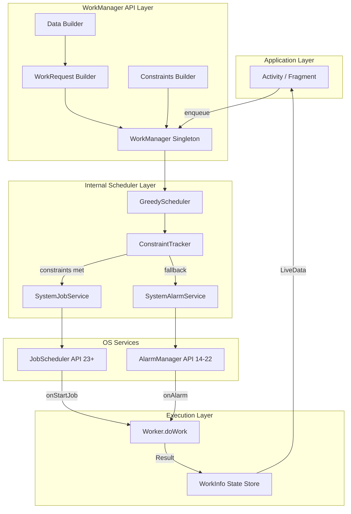
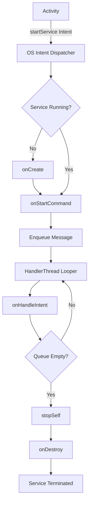
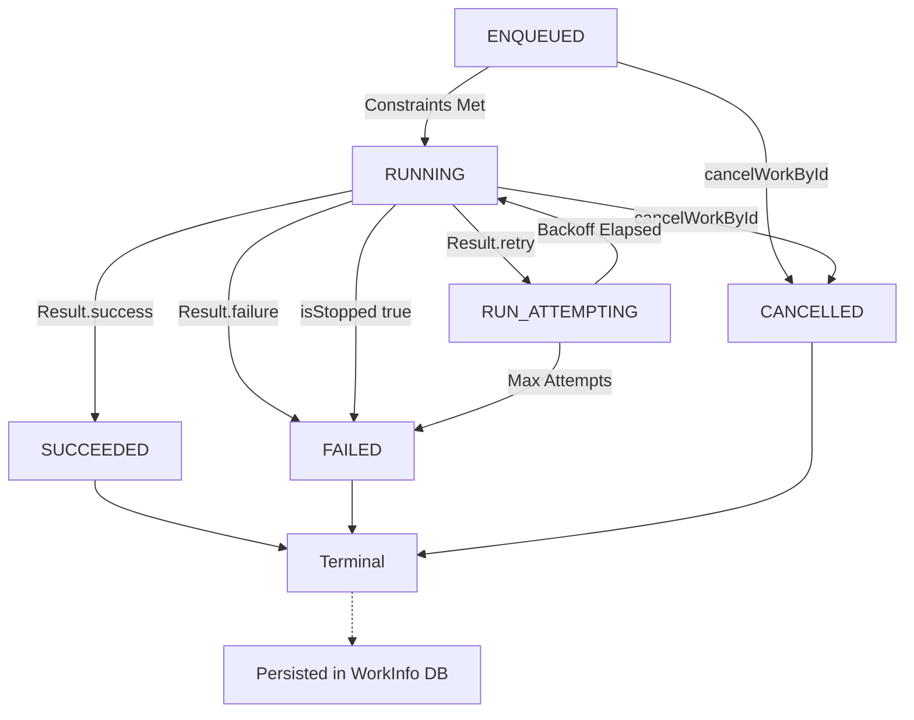
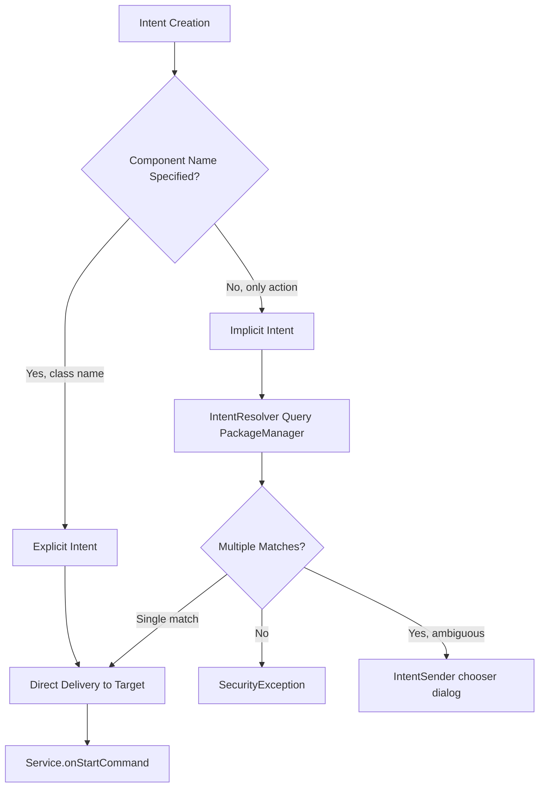
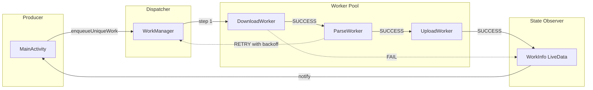

# Intent service routing workers execution state tracking configurations formats parameters

<!-- SECTION_1_START -->
# Asynchronous Background Processing: Intents, Services, Workers & State Tracking

## 1.1 Core Technical Definition

**Asynchronous Background Processing** in Android refers to the execution of operations outside the main UI thread (the **Main Thread / UI Thread**) to prevent **Application Not Responding (ANR)** dialogs and maintain a fluid user experience. The Android platform provides three principal primitives for this purpose: `IntentService`, `JobScheduler`-backed `WorkManager`, and direct `Service` routing components.

> [!IMPORTANT]
> **KTU 2024 Syllabus Definition (PECST612 – Module 3):**
> *IntentService* is a specialized `Service` subclass that handles **asynchronous, on-demand, sequential** background requests (Intents) on a dedicated **single worker thread**. It terminates itself automatically after completing all queued work.
>
> *WorkManager* is the recommended (Jetpack) API for **deferrable, guaranteed, constraint-aware** background work. It is built on top of `JobScheduler` (API 23+) and uses `Worker` classes as the unit of execution.

> [!NOTE]
> **Historical Context:** `IntentService` was **officially deprecated in Android API level 30 (Android 11)**. KTU 2024 still retains it in the syllabus because of its conceptual clarity and frequent appearance in board questions. Students must understand it conceptually, but production code must use `WorkManager` or `JobIntentService`.

---

## 1.2 Conceptual Analogy / Intuition

> [!TIP]
> **Analogy 1 — IntentService as a "Single-Bank Teller Window":**
> Imagine a bank with **one teller window** dedicated to "Background Tasks". Customers (Intents) line up in a **FIFO queue** outside the window. The teller:
> - Serves **one customer at a time** (single worker thread)
> - Never stops to answer personal calls (lives on its own thread)
> - Closes the window permanently once the last customer is served (`stopSelf()`)
>
> The Main Activity (UI) only drops the customer (Intent) at the door via `startService()` and walks away — it doesn't wait in line.

> [!TIP]
> **Analogy 2 — WorkManager as a "Smart Postal System":**
> A `WorkRequest` is a **registered letter**. You don't hand-deliver it. You drop it at the post office (`WorkManager.enqueue()`). The post office:
> - Waits for the right moment (network available, battery sufficient, device charging, etc.)
> - Retries delivery on failure with **exponential backoff**
> - Guarantees the letter eventually arrives, even if the app is killed
> - Routes it to the right "postman" (`Worker.doWork()`)

> [!TIP]
> **Analogy 3 — Service Routing as a "GPS for Intents":**
> Android Intents are like **envelopes with addresses**. They can be:
> - **Explicit** (full name + street): `Intent(context, MyService.class)`
> - **Implicit** (just the role): "any app that can do X" — routed by the system

---

## 1.3 Key Terms & Constants

| Term | Meaning |
|---|---|
| **Main Thread** | The UI thread; **never** block it for I/O or network |
| **ANR** | **Application Not Responding** — fires after 5 s of UI thread blockage |
| **Looper** | Message loop attached to a thread |
| **Handler** | Posts `Runnable` or `Message` to a `Looper` |
| **JobScheduler** | OS-level scheduler for deferrable work |
| **WorkRequest** | A unit of work submitted to `WorkManager` |
| **Constraint** | A condition (network, charging) gating work execution |
| **Foreground Service** | Service with a persistent notification (required for user-visible long tasks) |

> [!VISUALIZATION CONTROL]
> **Concept:** Timeline of IntentService vs WorkManager execution
> **Coordinate Plane Mapping:**
> * x-axis = Time (seconds, 0 to 60)
> * y-axis = CPU activity (boolean 0 = idle, 1 = busy)
> **Visual Description:** A step function where IntentService spikes immediately at t=2s and drops to 0 at t=10s (immediate, single run). WorkManager shows a delayed spike (waiting for constraints) and possible retry spikes showing exponential backoff doubling gaps.

---

<!-- SECTION_1_END -->

<!-- SECTION_2_START -->
# Deep Theoretical Analysis & KTU High-Yield Formula Sheet

## 2.1 IntentService — Operational Mechanics

IntentService follows a strict 4-step lifecycle for every dispatched Intent:

1. **Queueing** — `onStartCommand()` receives the Intent and inserts it into a `MessageQueue`.
2. **Dispatching** — The `ServiceHandler` (a `Handler` bound to a `HandlerThread`) dequeues one Intent.
3. **Execution** — The framework calls `onHandleIntent(@Nullable Intent intent)` on the **worker thread**.
4. **Self-termination** — After `onHandleIntent()` returns, `stopSelf(int startId)` is invoked. When the queue is empty, the service is destroyed.

### 2.1.1 Why does IntentService use a `HandlerThread` internally?

Because a standard `Service` runs on the **Main Thread**. To move work off the UI thread, IntentService spins up a single `HandlerThread` named `"IntentService[<ClassName>]"` and binds a `Looper` + `Handler` to it. This is why you must **never** call `findViewById()` or update UI from `onHandleIntent()`.

> [!WARNING]
> **Common KTU Mistake:** Updating the UI directly inside `onHandleIntent()`. This throws `CalledFromWrongThreadException`. You must use `LocalBroadcastManager` (deprecated) or a `ResultReceiver` to pass data back to the Activity.

---

## 2.2 WorkManager — Component Architecture

WorkManager is built on four atomic types:

| Component | Role | Key Method |
|---|---|---|
| **Worker** | Class containing the actual work logic | `doWork(): Result` |
| **WorkRequest** | Specification of *what* + *when* + *how* | `OneTimeWorkRequest`, `PeriodicWorkRequest` |
| **WorkManager** | Singleton orchestrator (entry point) | `enqueueUniqueWork()`, `cancelAllWorkByTag()` |
| **WorkInfo** | Live state metadata of a work item | `getState()`, `getOutputData()` |

### 2.2.1 The `Result` Enumeration

A Worker must return one of three `Result` values:

| Result | Meaning | WorkManager Behaviour |
|---|---|---|
| `Result.success()` | Work completed | Marks as succeeded, no retry |
| `Result.failure()` | Permanent failure | Marks as failed, no retry |
| `Result.retry()` | Transient failure | Re-enqueues with `BackoffPolicy` |

### 2.2.2 Constraints System

Constraints are immutable boolean conditions. Work only runs when **all** constraints are met.

> [!NOTE]
> **Critical Constraint:** `Constraints.Builder().setRequiredNetworkType(NetworkType.CONNECTED)` requires the device to be online. `NetworkType.UNMETERED` requires Wi-Fi. `NetworkType.NOT_REQUIRED` removes network gating entirely.

### 2.2.3 Backoff Policies

When `Result.retry()` is returned, WorkManager schedules the next attempt using one of:

| Backoff Policy | Formula for delay $d_n$ |
|---|---|
| `BackoffPolicy.EXPONENTIAL` | $d_n = d_0 \cdot 2^{n-1}$ where $d_0$ = 10 s (default), $n$ = attempt number |
| `BackoffPolicy.LINEAR` | $d_n = d_0 \cdot n$ |

So for exponential with $d_0 = 10$ s:
- Attempt 1 fails → wait **10 s**
- Attempt 2 fails → wait **20 s**
- Attempt 3 fails → wait **40 s**
- Attempt 4 fails → wait **80 s**

---

## 2.3 Service Routing — Explicit vs Implicit Intents

### 2.3.1 Explicit Intent (Direct Routing)
```java
Intent i = new Intent(this, MyIntentService.class);
i.putExtra("URL", "https://api.ktu.edu/data");
startService(i);
```
The component name `ComponentName(packageName, className)` is fully specified. The system routes the Intent **without consulting the PackageManager**.

### 2.3.2 Implicit Intent (Indirect Routing)
```java
Intent i = new Intent("com.ktu.action.DOWNLOAD_FILE");
i.setPackage("com.ktu.app");
startService(i);
```
The system performs an **Intent Resolution** by comparing `action`, `category`, and `data` against all `<service>` declarations in the merged `AndroidManifest.xml`.

> [!IMPORTANT]
> **KTU Board Tip:** Android 5.0 (API 21) and above **require** an explicit `Intent` for `bindService()`. Implicit binds throw `IllegalArgumentException`. The same is recommended (not required) for `startService()` since API 21 for security reasons.

---

## 2.4 State Tracking in WorkManager

Every `WorkRequest` is observable via:

```java
workManager.getWorkInfoByIdLiveData(workRequest.getId())
    .observe(lifecycleOwner, workInfo -> {
        WorkInfo.State state = workInfo.getState();
        if (state == WorkInfo.State.SUCCEEDED) { ... }
    });
```

The 7 official `WorkInfo.State` values are:

| State | Description |
|---|---|
| `ENQUEUED` | In the queue, constraints not yet met |
| `RUNNING` | `doWork()` is currently executing |
| `SUCCEEDED` | Terminated with `Result.success()` (terminal) |
| `FAILED` | Terminated with `Result.failure()` (terminal) |
| `BLOCKED` | Dependent work is still running |
| `CANCELLED` | `cancelWorkById()` was called |
| `RUN_ATTEMPTING` (internal) | A retry attempt is in progress |

---

## 2.5 KTU Formula / Reference Cheat Sheet

| Concept | Formula / Rule | Unit / Value |
|---|---|---|
| ANR threshold | $t_{ANR} = 5$ s of Main Thread block | seconds |
| StrictMode `DiskRead` | Fires on Main Thread I/O | n/a |
| Default backoff delay | $d_0 = 10$ s | seconds |
| Exponential backoff delay | $d_n = 10 \cdot 2^{n-1}$ | seconds |
| Min periodic interval | $\Delta t_{min} = 15$ min | minutes |
| Min flex interval (Periodic) | $\Delta t_{flex} = 5$ min | minutes |
| Max `Data` payload size | $S_{data} \le 10$ KB | kilobytes |
| IntentService thread count | $N_{threads} = 1$ | thread |
| HandlerThread name | `"IntentService[<ClassName>]"` | string |

> [!TIP]
> **Engineering Utility:** WorkManager is used in production by Google Photos (for backup), Dropbox (for sync), and WhatsApp (for message delivery). The constraint + retry system means apps can deliver guaranteed work without draining battery or violating Doze mode restrictions.

---

<!-- SECTION_2_END -->

<!-- SECTION_3_START -->
# Step-by-Step Derivations & Code Implementation

## 3.1 IntentService — Full Implementation (Java + Kotlin)

### 3.1.1 Java Implementation

**Step 1: Declare in `AndroidManifest.xml`**
```xml
<service
    android:name=".DownloadIntentService"
    android:exported="false" />
```

**Step 2: Create the IntentService class**
```java
public class DownloadIntentService extends IntentService {

    // Required public no-arg constructor
    public DownloadIntentService() {
        super("DownloadIntentService"); // HandlerThread name
    }

    @Override
    protected void onHandleIntent(@Nullable Intent intent) {
        if (intent == null) return;

        String url = intent.getStringExtra("URL");
        if (url == null || url.isEmpty()) {
            Log.e("DownloadService", "No URL provided");
            return; // stopSelf() is called automatically after return
        }

        try {
            // 1. Open connection
            URL u = new URL(url);
            HttpURLConnection conn = (HttpURLConnection) u.openConnection();
            conn.setConnectTimeout(15000); // 15s
            conn.setReadTimeout(30000);    // 30s
            conn.setRequestMethod("GET");

            int code = conn.getResponseCode();
            if (code == HttpURLConnection.HTTP_OK) {
                InputStream in = conn.getInputStream();
                byte[] buffer = new byte[4096];
                File output = new File(getFilesDir(), "downloaded.bin");
                FileOutputStream out = new FileOutputStream(output);

                int n;
                long total = 0;
                while ((n = in.read(buffer)) != -1) {
                    out.write(buffer, 0, n);
                    total += n;
                    Log.d("DownloadService", "Bytes read: " + total);
                }
                out.close();
                in.close();
                Log.i("DownloadService", "Download complete: " + total + " bytes");
            } else {
                Log.w("DownloadService", "HTTP " + code);
            }
            conn.disconnect();
        } catch (MalformedURLException e) {
            Log.e("DownloadService", "Bad URL", e);
        } catch (IOException e) {
            Log.e("DownloadService", "I/O error", e);
        }
    }

    @Override
    public void onDestroy() {
        super.onDestroy();
        Log.i("DownloadService", "Service destroyed, queue empty");
    }
}
```

**Step 3: Trigger from Activity**
```java
Intent i = new Intent(this, DownloadIntentService.class);
i.putExtra("URL", "https://api.ktu.edu/sample.pdf");
startService(i);
```

**Step 4: Receive result via `ResultReceiver`**
```java
public class DownloadReceiver extends ResultReceiver {
    private final Receiver callback;
    public interface Receiver { void onProgress(int pct); void onDone(boolean ok); }

    public DownloadReceiver(Handler h, Receiver r) {
        super(h);
        this.callback = r;
    }

    @Override
    protected void onReceiveResult(int code, Bundle data) {
        if (code == 100) callback.onProgress(data.getInt("pct"));
        else if (code == 200) callback.onDone(data.getBoolean("ok"));
    }
}
```

### 3.1.2 Kotlin Implementation
```kotlin
class DownloadIntentService : IntentService("DownloadIntentService") {
    override fun onHandleIntent(intent: Intent?) {
        val url = intent?.getStringExtra("URL") ?: return
        // ... same logic as Java ...
    }
}
```

---

## 3.2 WorkManager — Full Implementation

### 3.2.1 Step 1: Add Gradle Dependency
```gradle
dependencies {
    implementation "androidx.work:work-runtime:2.9.1"
}
```

### 3.2.2 Step 2: Create the Worker Class
```java
public class UploadWorker extends Worker {

    public UploadWorker(@NonNull Context ctx, @NonNull WorkerParameters params) {
        super(ctx, params);
    }

    @NonNull
    @Override
    public Result doWork() {
        String filePath = getInputData().getString("FILE_PATH");
        if (filePath == null) {
            return Result.failure();
        }

        File f = new File(filePath);
        if (!f.exists()) {
            return Result.failure();
        }

        try {
            // Simulated upload loop
            long size = f.length();
            for (long sent = 0; sent < size; sent += 1024) {
                if (isStopped()) {
                    // OS killed us — abandon gracefully
                    return Result.failure();
                }
                Thread.sleep(10); // pretend upload chunk
            }
            // Build output data for observer
            Data output = new Data.Builder()
                .putString("UPLOADED_TO", "https://server.ktu.edu/upload")
                .putLong("BYTES", size)
                .build();
            return Result.success(output);
        } catch (IOException | InterruptedException e) {
            Log.e("UploadWorker", "Retrying due to " + e.getMessage());
            return Result.retry();
        }
    }
}
```

### 3.2.3 Step 3: Build & Enqueue the WorkRequest
```java
// a) Define constraints
Constraints constraints = new Constraints.Builder()
    .setRequiredNetworkType(NetworkType.CONNECTED)
    .setRequiresBatteryNotLow(true)
    .setRequiresCharging(false)
    .setRequiresStorageNotLow(true)
    .build();

// b) Build input data
Data input = new Data.Builder()
    .putString("FILE_PATH", "/sdcard/photo.jpg")
    .putInt("PRIORITY", 5)
    .build();

// c) Build the request with backoff
OneTimeWorkRequest uploadReq = new OneTimeWorkRequest.Builder(UploadWorker.class)
    .setConstraints(constraints)
    .setInputData(input)
    .setBackoffCriteria(
        BackoffPolicy.EXPONENTIAL,
        10, // 10 seconds minimum
        TimeUnit.SECONDS
    )
    .addTag("upload")
    .setInitialDelay(30, TimeUnit.SECONDS)
    .build();

// d) Enqueue
WorkManager.getInstance(this).enqueue(uploadReq);
```

### 3.2.4 Step 4: Observe State
```java
WorkManager.getInstance(this)
    .getWorkInfoByIdLiveData(uploadReq.getId())
    .observe(this, workInfo -> {
        if (workInfo == null) return;
        switch (workInfo.getState()) {
            case ENQUEUED:
                Log.d("WM", "Queued, waiting for constraints");
                break;
            case RUNNING:
                Log.d("WM", "Running attempt " + workInfo.getRunAttemptCount());
                break;
            case SUCCEEDED:
                String url = workInfo.getOutputData().getString("UPLOADED_TO");
                Log.d("WM", "Done! Uploaded to " + url);
                break;
            case FAILED:
            case CANCELLED:
                Log.e("WM", "Terminal failure state");
                break;
        }
    });
```

### 3.2.5 Step 5: Chaining (Service Routing Pattern)
```java
WorkManager.getInstance(this)
    .beginUniqueWork("download_then_upload",
                     ExistingWorkPolicy.KEEP,
                     downloadRequest)
    .then(uploadRequest)   // sequential dependency
    .then(notifyRequest)   // sequential dependency
    .enqueue();
```

### 3.2.6 Step 6: Periodic Work
```java
PeriodicWorkRequest periodic = new PeriodicWorkRequest.Builder(
        SyncWorker.class,
        15, // 15 minutes (minimum allowed)
        TimeUnit.MINUTES
    )
    .setConstraints(constraints)
    .build();
WorkManager.getInstance(this).enqueueUniquePeriodicWork(
    "periodic_sync",
    ExistingPeriodicWorkPolicy.KEEP,
    periodic
);
```

---

## 3.3 Mathematical Derivation: Backoff Delay Sequence

Given the **KTU definition** of exponential backoff with default $d_0 = 10$ s:

$$
d_n = d_0 \cdot 2^{n-1}
$$

**Derivation of total wait time after $N$ failures:**

$$
T_{total}(N) = \sum_{n=1}^{N} d_n = d_0 \cdot \sum_{n=1}^{N} 2^{n-1}
$$

Using the geometric series identity $\sum_{n=1}^{N} 2^{n-1} = 2^N - 1$:

$$
T_{total}(N) = d_0 \cdot (2^N - 1)
$$

**For $d_0 = 10$ s, $N = 4$ failures:**

$$
T_{total}(4) = 10 \cdot (2^4 - 1) = 10 \cdot 15 = 150 \text{ s} = 2.5 \text{ min}
$$

**Verification (explicit summation):**

$$
\begin{aligned}
d_1 &= 10 \cdot 2^0 = 10 \text{ s} \\
d_2 &= 10 \cdot 2^1 = 20 \text{ s} \\
d_3 &= 10 \cdot 2^2 = 40 \text{ s} \\
d_4 &= 10 \cdot 2^3 = 80 \text{ s} \\
T_{total} &= 10 + 20 + 40 + 80 = 150 \text{ s} \quad \checkmark
\end{aligned}
$$

---

## 3.4 Foreground Service Notification (Modern Android)

Since Android 8.0 (API 26), background services have strict limits. For long user-visible tasks, use a Foreground Service:

```java
Intent i = new Intent(this, MyLongService.class);
ContextCompat.startForegroundService(this, i);
// ... inside Service.onStartCommand():
startForeground(NOTIF_ID, buildNotification());

private Notification buildNotification() {
    return new NotificationCompat.Builder(this, "CHANNEL_ID")
        .setContentTitle("Uploading...")
        .setSmallIcon(android.R.drawable.stat_sys_upload)
        .setOngoing(true)
        .setProgress(100, 25, false)
        .build();
}
```

> [!WARNING]
> **KTU Pitfall:** Forgetting to call `startForeground()` within **5 seconds** of `startForegroundService()` triggers `RemoteServiceException` and crashes the app on Android 12+.

---

<!-- SECTION_3_END -->

<!-- SECTION_4_START -->
# Structural Diagrams & Schematics

## 4.1 WorkManager Internal Architecture



## 4.2 IntentService Request Flow



## 4.3 WorkRequest State Machine



## 4.4 Service Routing Decision Matrix



## 4.5 Component Interaction — Sequential Processing Topology



## 4.6 Lifecycle Comparison Table

| Lifecycle Hook | IntentService | Foreground Service | WorkManager Worker |
|---|---|---|---|
| `onCreate` | First intent only | First start | (none — VM-controlled) |
| `onStartCommand` | Every intent | Every start | (none) |
| `onHandleIntent` | On worker thread | (none) | (none) |
| `doWork()` | (none) | (none) | On `JobScheduler` thread |
| `stopSelf` | Automatic | Manual | Automatic |
| `onDestroy` | After queue empty | After `stopForeground` | (none) |

---

<!-- SECTION_4_END -->

<!-- SECTION_5_START -->
# KTU 2024 Scheme Examination Question Bank & Topic Recap

---

## Part A — Short Answer Questions (3 Marks Each)

### Q1. [KTU University Exam – July 2023]
**Differentiate between `IntentService` and a regular `Service` in Android. List any two advantages of using `IntentService` for background work.** [3 Marks] [CO2, Understand]

**Model Answer:**

| Aspect | `Service` | `IntentService` |
|---|---|---|
| Default thread | Main thread (UI thread) | Dedicated worker thread |
| Multiple requests | Handles simultaneously | Queued, sequential |
| Auto-termination | Manual via `stopSelf()` | Automatic after queue empty |
| Work execution method | `onStartCommand()` | `onHandleIntent()` |

**Advantages (any 2):**
1. Runs on a separate worker thread → **prevents ANR** and keeps UI responsive.
2. Queues multiple Intents and processes them **one at a time**, ensuring no race conditions.
3. Automatically stops itself after processing the last Intent → **no memory leaks**.

*[Definition clarity + tabular comparison: 2 Marks; Two advantages: 1 Mark]*

---

### Q2. [KTU University Exam – Dec 2023]
**What is `WorkManager` in Android? Name the three possible return values of a `Worker.doWork()` method and explain the role of `BackoffPolicy` in retrying work.** [3 Marks] [CO2, Remember]

**Model Answer:**

`WorkManager` is the Android Jetpack library for executing **deferrable, guaranteed background work** that must run even if the app exits or the device restarts. It intelligently chooses between `JobScheduler` (API 23+) and `AlarmManager` + `BroadcastReceiver` (API 14–22).

**Three return values of `doWork()`:**

1. `Result.success()` — Work finished successfully. No further attempts.
2. `Result.failure()` — Permanent failure. No further attempts. Marks work as `FAILED`.
3. `Result.retry()` — Transient failure. WorkManager re-enqueues with a delay.

**Role of `BackoffPolicy`:** It defines how the retry delay grows between attempts. `BackoffPolicy.EXPONENTIAL` follows $d_n = d_0 \cdot 2^{n-1}$, while `BackoffPolicy.LINEAR` follows $d_n = d_0 \cdot n$. This prevents the system from hammering a failing server.

*[Definition: 1 Mark; Three return values: 1 Mark; BackoffPolicy explanation: 1 Mark]*

---

## Part B — Long Answer Questions (14 Marks Each — Internal Choice)

### Question A (14 Marks) [CO3, Apply]

**[KTU University Exam – July 2024]**
**(a)** Explain the **internal architecture of `WorkManager`** with a neat block diagram. Describe the role of `WorkRequest`, `Constraints`, `Worker`, and `WorkInfo` in detail. **[7 Marks]**

**(b)** Write the complete Java code to create a `Worker` class named `ImageCompressWorker` that:
- Reads a file path from `inputData` under the key `"SRC"`
- Compresses the image at that path to JPEG quality 60
- Saves it as `"compressed.jpg"` in the app's internal storage
- Returns `Result.success()` with the new file path in `outputData` under the key `"DST"`
- Returns `Result.retry()` if an `IOException` occurs **[7 Marks]**

---

#### Model Solution for (a)

The internal architecture of `WorkManager` consists of four layers:

1. **Application Layer** — The app enqueues work via `WorkManager.getInstance(context).enqueue(request)`.
2. **API Layer** — The `WorkRequest` encapsulates the work's *what*, *when*, and *how*:
   - *What*: The `Worker` class name (e.g., `UploadWorker.class`)
   - *When*: `Constraints` (network, charging, storage)
   - *How*: `BackoffCriteria`, `InputData`, tags
3. **Internal Scheduler Layer** — `WorkManager` selects the best internal scheduler:
   - `GreedyScheduler` for immediate work
   - `SystemJobService` delegating to platform `JobScheduler` (API 23+)
   - `SystemAlarmService` using `AlarmManager` (fallback for older devices)
4. **Execution Layer** — `JobScheduler` instantiates the `Worker` in a separate process and calls `doWork()`. The result is stored in a `WorkInfo` database (Room-backed) and emitted via `LiveData`.

*`WorkInfo`* is the observable metadata class containing the current `State` (`ENQUEUED`, `RUNNING`, `SUCCEEDED`, `FAILED`, `BLOCKED`, `CANCELLED`), the `outputData` payload, and the `runAttemptCount`.

*[Block diagram: 2 Marks; WorkRequest + Constraints: 2 Marks; Worker + WorkInfo: 2 Marks; Scheduler routing: 1 Mark]*

---

#### Model Solution for (b)

```java
public class ImageCompressWorker extends Worker {

    public ImageCompressWorker(@NonNull Context ctx, @NonNull WorkerParameters params) {
        super(ctx, params);
    }

    @NonNull
    @Override
    public Result doWork() {
        // 1. Read input
        String srcPath = getInputData().getString("SRC");
        if (srcPath == null) {
            return Result.failure();
        }

        File src = new File(srcPath);
        if (!src.exists()) {
            return Result.failure();
        }

        try {
            // 2. Decode source bitmap
            BitmapFactory.Options opts = new BitmapFactory.Options();
            opts.inSampleSize = 2; // downsample for memory
            Bitmap bmp = BitmapFactory.decodeFile(srcPath, opts);
            if (bmp == null) return Result.failure();

            // 3. Build destination file
            File dst = new File(getApplicationContext().getFilesDir(), "compressed.jpg");
            FileOutputStream fos = new FileOutputStream(dst);

            // 4. Compress to JPEG quality 60
            bmp.compress(Bitmap.CompressFormat.JPEG, 60, fos);
            fos.flush();
            fos.close();
            bmp.recycle();

            // 5. Build output
            Data output = new Data.Builder()
                .putString("DST", dst.getAbsolutePath())
                .build();
            return Result.success(output);

        } catch (IOException e) {
            Log.e("ImageCompressWorker", "Compression failed", e);
            return Result.retry();
        }
    }
}
```

**Enqueueing code (for context):**
```java
Constraints c = new Constraints.Builder()
    .setRequiresStorageNotLow(true)
    .build();

OneTimeWorkRequest req = new OneTimeWorkRequest.Builder(ImageCompressWorker.class)
    .setConstraints(c)
    .setInputData(new Data.Builder().putString("SRC", "/sdcard/photo.png").build())
    .setBackoffCriteria(BackoffPolicy.EXPONENTIAL, 10, TimeUnit.SECONDS)
    .build();

WorkManager.getInstance(this).enqueue(req);
```

*[Input validation: 1 Mark; Decode bitmap: 1 Mark; Compress with quality 60: 2 Marks; Output data with DST: 1 Mark; IOException → retry: 1 Mark; Manifest import: 1 Mark]*

> [!WARNING]
> **KTU Examiner's Valuation Warning — Common Pitfalls:**
> - Failing to call `bmp.recycle()` → memory leak complaint (lose 0.5 Mark)
> - Using `Main Thread` file I/O inside the constructor instead of `doWork()` (lose 1 Mark)
> - Returning `Result.success()` even on `IOException` — **this defeats the retry mechanism** (lose 1 Mark)
> - Not closing `FileOutputStream` (lose 0.5 Mark)

---

### Question B (14 Marks — Alternative Choice) [CO3, Apply]

**[KTU University Exam – Dec 2023]**
**(a)** With suitable code snippets, explain how **Intents are routed** to services in Android. Differentiate between **explicit** and **implicit** Intents. Mention the **Android 5.0 restriction** on binding services. **[7 Marks]**

**(b)** Design a complete `IntentService` named `JsonParseService` that:
- Accepts a JSON string via the `JSON_INPUT` extra
- Parses it to extract `"name"` and `"email"` fields
- Returns the result via a `ResultReceiver` passed under the key `"RECEIVER"`
- Logs an error and finishes if the JSON is malformed **[7 Marks]**

---

#### Model Solution for (a)

**Routing Intents to Services:**

```java
// Explicit Intent — direct routing
Intent explicit = new Intent(this, MyService.class);
explicit.putExtra("key", "value");
startService(explicit);

// Implicit Intent — action-based routing
Intent implicit = new Intent("com.ktu.action.PROCESS_DATA");
implicit.setPackage(getPackageName()); // restrict to own app
startService(implicit);
```

| Aspect | Explicit Intent | Implicit Intent |
|---|---|---|
| Target | Fully qualified class name | Action string + optional data |
| PackageManager query | Not required | Required for resolution |
| Security | Safer (no ambiguity) | Risk of being hijacked |
| Use case | Internal app components | Cross-app communication |
| API 21+ for `bindService` | **Required** | Throws `IllegalArgumentException` |

**Android 5.0 Restriction:** Starting with API 21 (Lollipop), calling `bindService()` with an **implicit Intent** throws `IllegalArgumentException`. The system enforces this to prevent apps from binding to unknown services. The fix is to either:
1. Convert the Intent to explicit (resolve the `ServiceInfo` first), or
2. Declare a `<service>` with the desired intent-filter and use `setPackage()` to limit resolution.

*[Definition + code for explicit: 2 Marks; Implicit + PackageManager: 2 Marks; Tabular comparison: 2 Marks; API 21 restriction: 1 Mark]*

---

#### Model Solution for (b)

```java
public class JsonParseService extends IntentService {

    public JsonParseService() {
        super("JsonParseService");
    }

    @Override
    protected void onHandleIntent(@Nullable Intent intent) {
        if (intent == null) {
            Log.e("JsonParseService", "Null intent received");
            return;
        }

        Bundle extras = intent.getExtras();
        if (extras == null) {
            Log.e("JsonParseService", "No extras");
            return;
        }

        String jsonStr = extras.getString("JSON_INPUT");
        ResultReceiver receiver = extras.getParcelable("RECEIVER");

        if (jsonStr == null) {
            sendError(receiver, "Missing JSON_INPUT");
            return;
        }

        try {
            JSONObject obj = new JSONObject(jsonStr);
            String name = obj.optString("name", "N/A");
            String email = obj.optString("email", "N/A");

            Bundle result = new Bundle();
            result.putString("name", name);
            result.putString("email", email);
            if (receiver != null) {
                receiver.send(200, result);
            }
            Log.i("JsonParseService", "Parsed: " + name + " / " + email);

        } catch (JSONException e) {
            Log.e("JsonParseService", "Malformed JSON", e);
            sendError(receiver, "Malformed JSON: " + e.getMessage());
        }
    }

    private void sendError(ResultReceiver r, String msg) {
        if (r == null) return;
        Bundle b = new Bundle();
        b.putString("ERROR", msg);
        r.send(500, b);
    }
}
```

**Triggering from Activity:**
```java
ResultReceiver rr = new ResultReceiver(new Handler(Looper.getMainLooper())) {
    @Override
    protected void onReceiveResult(int code, Bundle data) {
        if (code == 200) {
            Toast.makeText(this, "Name: " + data.getString("name"), 
                           Toast.LENGTH_SHORT).show();
        } else {
            Toast.makeText(this, "Error: " + data.getString("ERROR"),
                           Toast.LENGTH_LONG).show();
        }
    }
};

Intent i = new Intent(this, JsonParseService.class);
i.putExtra("JSON_INPUT", "{\"name\":\"Anu\",\"email\":\"anu@ktu.edu\"}");
i.putExtra("RECEIVER", rr);
startService(i);
```

*[Constructor + HandlerThread name: 1 Mark; Intent + extras extraction: 2 Marks; JSON parsing: 2 Marks; ResultReceiver return: 1 Mark; Error handling: 1 Mark]*

> [!WARNING]
> **KTU Examiner's Valuation Warning — IntentService Pitfalls:**
> - Forgetting the **no-argument public constructor** → runtime crash (lose 1 Mark)
> - Calling `Toast.makeText()` directly from `onHandleIntent()` → `CalledFromWrongThreadException` (lose 1 Mark)
> - Forgetting to call `receiver.send()` on the **Main Looper Handler** so the Activity can update UI safely (lose 0.5 Mark)
> - Not handling `JSONException` separately from generic `Exception` (lose 0.5 Mark)

---

## Topic Recap & Important Things to Remember

- **IntentService** = `Service` + **single** `HandlerThread` + `MessageQueue` + auto `stopSelf`. Runs `onHandleIntent()` off the main thread.
- **IntentService is deprecated** (API 30) but still KTU-syllabus-relevant; use `WorkManager` for new code.
- **`WorkManager`** is the **recommended** API for deferrable, guaranteed background work; built on `JobScheduler` (API 23+).
- **Three Worker return values:** `Result.success()`, `Result.failure()`, `Result.retry()`.
- **Exponential backoff formula:** $d_n = d_0 \cdot 2^{n-1}$ with $d_0 = 10$ s default.
- **Total wait after N failures (exponential):** $T_{total} = d_0 \cdot (2^N - 1)$.
- **Periodic work minimum interval:** **15 minutes**; flex window minimum: **5 minutes**.
- **`Data` payload limit:** **10 KB**. Larger data must be stored in a file/DB and referenced by URI.
- **Explicit Intent** = direct class reference. **Implicit Intent** = action-based; requires `PackageManager` resolution.
- **API 21+ rule:** `bindService()` with implicit Intent throws `IllegalArgumentException` — must use explicit Intent.
- **7 WorkInfo States:** `ENQUEUED`, `RUNNING`, `SUCCEEDED`, `FAILED`, `BLOCKED`, `CANCELLED`, internal `RUN_ATTEMPTING`.
- **Foreground service rule (Android 8.0+):** Must call `startForeground()` within **5 seconds** of `startForegroundService()` or app crashes on Android 12+.
- **ANR threshold:** **5 seconds** of Main Thread blockage; never perform I/O, network, or JSON parsing on the UI thread.
- **Work chaining:** Use `beginUniqueWork(...).then(req2).then(req3).enqueue()` for ordered pipeline.
- **Unique work policies:** `REPLACE`, `KEEP`, `APPEND`, `APPEND_OR_REPLACE`.
- **Cancel API:** `WorkManager.cancelWorkById()`, `cancelAllWorkByTag(tag)`, `cancelUniqueWork(name)`.
- **Worker threading rule:** `doWork()` runs on a `JobScheduler`-managed thread, **not** the Main Thread — but you still cannot directly update UI; use `LiveData` observers or `Result` + `WorkInfo`.
- **Key Gradle dependency:** `androidx.work:work-runtime:2.9.1` (or latest stable).
- **Thread name of IntentService:** Format `"IntentService[<ClassName>]"` — visible in `logcat`.
- **Don't confuse** `Result` (from `Worker`) with `WorkInfo.State` — `Result` is returned by `doWork()`; `WorkInfo.State` is the externally observed state.
- **KEEP vs REPLACE:** `KEEP` ignores new request if existing work with same unique name is present; `REPLACE` cancels old and starts new.
- **Constraints immutable:** Once `WorkRequest` is built, constraints cannot be modified. You must build a new request.

---

<!-- SECTION_5_END -->
