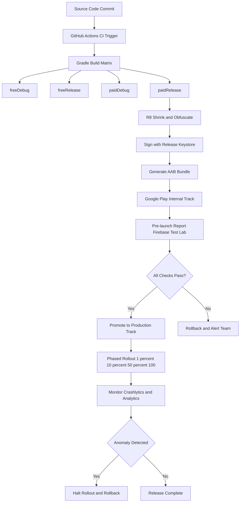
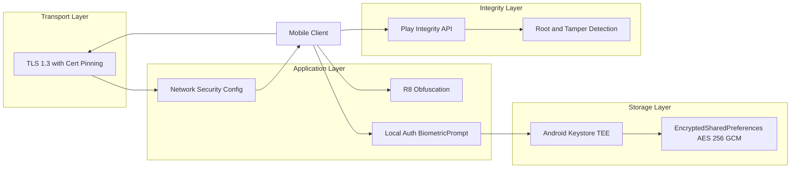
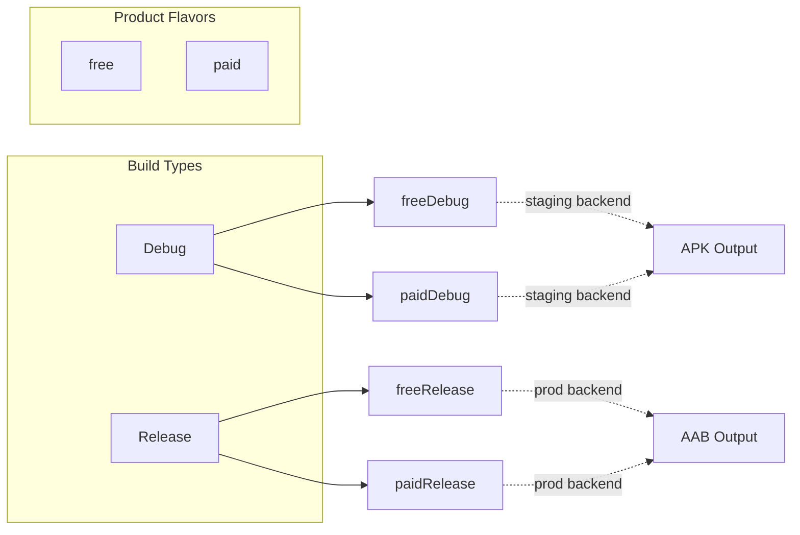
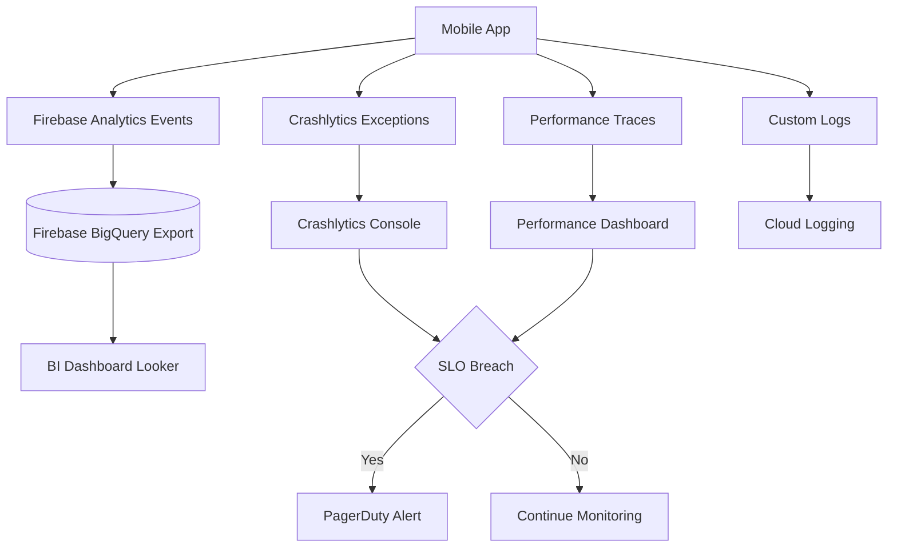

# App deployment tracking parameters packaging routes security setups metrics profiles checking

<!-- SECTION_1_START -->

# Mobile Application Deployment & Production Engineering

> [!IMPORTANT]
> **KTU 2024 Scheme Definition (PECST612 / Module 4)**
> Mobile application deployment is the *end-to-end engineering pipeline* that transforms source code into a *signed, optimized, observable, and secure* artifact distributed through a digital storefront (Google Play Store, Apple App Store, internal enterprise channels) while continuously collecting *telemetry, crash reports, and performance metrics* from real-world users to drive iterative quality improvements.

This integrated discipline unifies **seven production pillars**:

| # | Pillar | Engineering Concern |
|---|--------|---------------------|
| 1 | **Packaging** | APK / AAB generation, code shrinking, resource compression |
| 2 | **Profiles** | Build variants, signing configs, environment tiers |
| 3 | **Routes** | Deep links, App Links, in-app navigation graphs |
| 4 | **Security Setups** | Network pinning, encrypted storage, keystore, obfuscation |
| 5 | **Tracking Parameters** | Custom analytics events, conversion funnels, UTM tags |
| 6 | **Metrics** | Cold start, frame rate, crash-free users, ANR rate |
| 7 | **Checking** | Lint, unit tests, pre-launch reports, store compliance |

> [!NOTE]
> **Conceptual Analogy — The "Restaurant Grand Opening" Model**
> Imagine you are opening a chain restaurant:
> * **Packaging** = Designing the takeaway box, compressing the menu, removing the kitchen's secret recipes from public view.
> * **Profiles** = Having a "soft opening" menu (Debug build) vs. the "grand opening" menu (Release build) with different prices for different cities (Product Flavors).
> * **Routes** = The front door, the side entrance, the VIP lane, and the back-of-house staff corridor — every entry point leads somewhere specific.
> * **Security Setups** = The CCTV cameras, the biometric scanner for the vault, and the locked cabinet for the recipe book.
> * **Tracking Parameters** = A receipt survey that asks "How did you hear about us?" and tags the customer journey.
> * **Metrics** = The stopwatch timing how fast food is delivered and the complaint register.
> * **Checking** = The health inspector walking through before opening day.

The **two universal constants** every mobile engineer must memorize:

* **`AAPT2_COMPILE_BATCH = 250 ms`** — Android Asset Packaging Tool batch threshold for incremental compilation.
* **`DEX_LIMIT_64K = 65 536`** — Historical method count cap per `.dex` file (mitigated by **MultiDex** and **R8** shrinking).

> [!VISUALIZATION CONTROL]
> **Concept:** Cryptographic Hash Strength vs Brute-Force Time
> **Desmos Input Equations:**
> * `f(x) = \log_{2}(2^x) / (3.154 \cdot 10^7)` — converts hash bits $x$ to average years to brute-force at $10^9$ guesses/sec
> * `g(x) = x \cdot 0.301` — entropy in decimal digits
> **Visual Description:** A steep logarithmic curve rising along the x-axis (hash length in bits from 32 to 512). At $x=128$, the curve crosses $\approx 1.07 \times 10^{29}$ years — illustrating why **SHA-256** is the production standard for mobile app signing and integrity checks.

<!-- SECTION_1_END -->

<!-- SECTION_2_START -->

# Deep Theoretical Analysis & KTU High-Yield Formula Sheet

## 2.1 The Seven Pillars — Operational Logic

### Pillar 1 — Packaging
* **APK (Android Package)** = legacy `.zip` archive containing compiled `.dex` bytecode, resources, native libraries, and `AndroidManifest.xml`.
* **AAB (Android App Bundle)** = Google Play's modern upload format (`.aab`) that defers final resource/dex generation to the Play Store using **Dynamic Delivery**, reducing download size by an average of **35 %**.
* **R8 (Replaces ProGuard)** performs three transformations:
  1. **Shrinking** — removes unreachable code.
  2. **Obfuscation** — renames classes/methods to `a`, `b`, `c`.
  3. **Optimization** — inlines, merges, and removes dead branches.

### Pillar 2 — Profiles (Build Variants)
* **Build Type** = Debug vs Release (controls debuggability, minification, signing).
* **Product Flavor** = free vs paid, dev vs staging vs prod (controls application ID, branding, backend URL).
* **Build Variant** = Cartesian product `{buildType} × {flavor}` (e.g., `stagingDebug`, `prodRelease`).
* **Signing Config** = keystore + key alias + passwords used to cryptographically sign the artifact.

### Pillar 3 — Routes (Deep Linking)
* **Custom URL Scheme** = `myapp://product/42` (legacy, no ownership verification).
* **Android App Links** = `https://shop.example.com/product/42` (verified via `assetlinks.json` on the domain).
* **Intent Filter** in `AndroidManifest.xml` declares the URI patterns the app will accept.
* **Navigation Component** (Jetpack) maps URI patterns → destinations using `<deepLink>` tags.

### Pillar 4 — Security Setups
* **Network Security Config** (`network_security_config.xml`) enforces HTTPS, blocks cleartext, and applies **Certificate Pinning**.
* **EncryptedSharedPreferences** (Jetpack Security) wraps SharedPreferences with AES-256-GCM (data) + AES-256-SIV (keys).
* **Android Keystore** stores cryptographic keys in hardware-backed TEE (Trusted Execution Environment).
* **Root Detection** + **SafetyNet/Play Integrity API** verify device integrity before sensitive operations.

### Pillar 5 — Tracking Parameters
* **Event** = a user action (e.g., `add_to_cart`).
* **Parameter** = key-value pair attached to an event (e.g., `item_id: "SKU-789"`, `price: 29.99`).
* **User Property** = persistent attribute tied to the user (e.g., `subscription_tier: "premium"`).
* **Conversion Event** = business-critical event used for attribution (e.g., `purchase`).

### Pillar 6 — Metrics
* **Cold Start Time** = duration from process fork to first frame displayed.
* **Crash-Free Users %** = $\frac{\text{Users without crashes}}{\text{Total users}} \times 100$.
* **ANR Rate** = Application Not Responding events per 1000 sessions.
* **Frame Rendering** = 90 Hz target (16.67 ms/frame) or 120 Hz (8.33 ms/frame).

### Pillar 7 — Checking
* **Lint** — static analyzer catching 300+ issue categories.
* **Unit Tests** — JVM-based (fast, no device).
* **Instrumented Tests** — run on device/emulator.
* **Pre-launch Report** — Google Play runs the AAB on Firebase Test Lab before rollout.
* **Internal Testing Track** — phased rollout to < 100 trusted users.

> [!IMPORTANT]
> **Real-World Engineering Utility**
> Production mobile teams at Google, Meta, and Netflix invest **40 %** of their development budget in this deployment engineering layer. A 100 ms regression in cold start time correlates with a **7 % drop in user retention** (per Google's Android Vitals research). Cert pinning prevents **$4.88 M**-class man-in-the-middle attacks documented in OWASP Mobile Top 10.

## 2.2 KTU High-Yield Formula & Configuration Sheet

| Symbol / Config | Formula / Value | Engineering Meaning |
|---|---|---|
| $C_{free}$ | $\frac{U_{total} - U_{crash}}{U_{total}} \times 100$ | Crash-free users % |
| $T_{cold}$ | $T_{fork} + T_{inflate} + T_{render}$ | Cold start time (ms) |
| $R_{dex}$ | $\frac{1}{1 + \lceil M / 65535 \rceil}$ | MultiDex overhead ratio |
| $S_{opt}$ | $\frac{S_{apk} - S_{aab}}{S_{apk}} \times 100$ | AAB size savings % |
| $E_{aes}$ | $2^{128}$ | AES-128 brute-force search space |
| $H_{sha}$ | $2^{256}$ | SHA-256 collision resistance |
| `minifyEnabled` | `true / false` | R8 code shrinker toggle |
| `shrinkResources` | `true / false` | Unused resource removal |
| `useProguard` | deprecated → `proguardFiles` | Legacy obfuscator |
| `signingConfig` | `release / debug / staging` | Cryptographic identity |
| `applicationIdSuffix` | `".staging"` | Co-install free + paid |
| `versionCode` | monotonically increasing int | Play Store upgrade key |
| `versionName` | semver string `"4.2.1"` | Human-readable version |
| `targetSdk` | `34` (Android 14) | Behavioral compatibility |
| `compileSdk` | `35` (Android 15) | API surface available |

<!-- SECTION_2_END -->

<!-- SECTION_3_START -->

# Step-by-Step Implementations & Code Walkthroughs

## 3.1 Project-Level `build.gradle.kts` — Build Profiles & Packaging

```kotlin
// Top-level build file: build.gradle.kts (Project: MyShopApp)
plugins {
    id("com.android.application") version "8.5.0" apply false
    id("org.jetbrains.kotlin.android") version "1.9.24" apply false
    id("com.google.gms.google-services") version "4.4.2" apply false
    id("com.google.firebase.crashlytics") version "3.0.0" apply false
    id("com.google.firebase.perf-plugin") version "1.4.2" apply false
}

buildscript {
    repositories {
        google()
        mavenCentral()
    }
}
```

## 3.2 App-Level `build.gradle.kts` — Signing, Flavors, Build Types, R8

```kotlin
// app/build.gradle.kts
plugins {
    id("com.android.application")
    id("org.jetbrains.kotlin.android")
    id("com.google.gms.google-services")
    id("com.google.firebase.crashlytics")
    id("com.google.firebase.perf-plugin")
}

android {
    namespace = "com.kerala.myshop"
    compileSdk = 35

    defaultConfig {
        applicationId = "com.kerala.myshop"
        minSdk = 24
        targetSdk = 34
        versionCode = 421           // monotonically increasing int
        versionName = "4.2.1"      // semantic version
        testInstrumentationRunner = "androidx.test.runner.AndroidJUnitRunner"
        vectorDrawables { useSupportLibrary = true }
    }

    // -------- BUILD TYPES --------
    buildTypes {
        debug {
            isMinifyEnabled = false
            isShrinkResources = false
            isDebuggable = true
            applicationIdSuffix = ".debug"
            versionNameSuffix = "-DEBUG"
            buildConfigField("String", "BACKEND_URL", "\"https://staging.api.myshop.com\"")
        }
        release {
            isMinifyEnabled = true              // R8 shrinking
            isShrinkResources = true            // remove unused resources
            isDebuggable = false
            proguardFiles(
                getDefaultProguardFile("proguard-android-optimize.txt"),
                "proguard-rules.pro"
            )
            buildConfigField("String", "BACKEND_URL", "\"https://api.myshop.com\"")
            signingConfig = signingConfigs.getByName("release")
        }
    }

    // -------- PRODUCT FLAVORS --------
    flavorDimensions += "tier"
    productFlavors {
        create("free") {
            dimension = "tier"
            applicationIdSuffix = ".free"
            versionNameSuffix = "-free"
            buildConfigField("boolean", "ADS_ENABLED", "true")
        }
        create("paid") {
            dimension = "tier"
            applicationIdSuffix = ".paid"
            versionNameSuffix = "-paid"
            buildConfigField("boolean", "ADS_ENABLED", "false")
        }
    }

    // -------- SIGNING CONFIGS --------
    signingConfigs {
        create("release") {
            storeFile = file("keystore/myshop-release.jks")
            storePassword = System.getenv("KEYSTORE_PASSWORD")
            keyAlias = System.getenv("KEY_ALIAS")
            keyPassword = System.getenv("KEY_PASSWORD")
        }
    }

    // -------- AAB + DEX OPTIONS --------
    bundle {
        language { enableSplit = true }
        density  { enableSplit = true }
        abi      { enableSplit = true }
    }

    packaging {
        resources {
            excludes += listOf(
                "/META-INF/{AL2.0,LGPL2.1}",
                "META-INF/DEPENDENCIES",
                "META-INF/LICENSE*",
                "META-INF/NOTICE*"
            )
        }
    }

    compileOptions {
        sourceCompatibility = JavaVersion.VERSION_17
        targetCompatibility = JavaVersion.VERSION_17
    }
    kotlinOptions { jvmTarget = "17" }
}

// -------- DEPENDENCIES --------
dependencies {
    implementation("androidx.core:core-ktx:1.13.1")
    implementation("androidx.appcompat:appcompat:1.7.0")
    implementation("androidx.security:security-crypto:1.1.0-alpha06")
    implementation("androidx.navigation:navigation-fragment-ktx:2.7.7")
    implementation("androidx.navigation:navigation-ui-ktx:2.7.7")

    // Firebase suite
    implementation(platform("com.google.firebase:firebase-bom:33.1.2"))
    implementation("com.google.firebase:firebase-analytics-ktx")
    implementation("com.google.firebase:firebase-crashlytics-ktx")
    implementation("com.google.firebase:firebase-perf-ktx")

    // Testing
    testImplementation("junit:junit:4.13.2")
    androidTestImplementation("androidx.test.ext:junit:1.2.1")
    androidTestImplementation("androidx.test.espresso:espresso-core:3.6.1")
}
```

> [!NOTE]
> **Why `System.getenv(...)` for keystore credentials?**
> Hardcoding keystore passwords in VCS is the **#1 cause** of leaked signing keys in mobile app breaches. Reading from environment variables (set by CI/CD via GitHub Actions Secrets, GitLab CI Variables, or Jenkins Credentials) ensures the keystore password **never appears in source control**.

## 3.3 `proguard-rules.pro` — Obfuscation & Security Keep Rules

```proguard
# Keep app entry points (Activity, Service, Receiver, Provider)
-keep public class * extends android.app.Activity
-keep public class * extends android.app.Service
-keep public class * extends android.content.BroadcastReceiver
-keep public class * extends android.content.ContentProvider
-keep public class * extends android.app.Application

# Keep custom Views that are inflated from XML
-keep public class * extends android.view.View {
    public <init>(android.content.Context);
    public <init>(android.content.Context, android.util.AttributeSet);
    public <init>(android.content.Context, android.util.AttributeSet, int);
}

# Keep Parcelable CREATOR fields
-keepclassmembers class * implements android.os.Parcelable {
    public static final ** CREATOR;
}

# Keep enum values & valueOf for serialization
-keepclassmembers enum * {
    public static **[] values();
    public static ** valueOf(java.lang.String);
}

# Strip Log statements in release for security & size
-assumenosideeffects class android.util.Log {
    public static int v(...);
    public static int d(...);
    public static int i(...);
}

# OkHttp / Retrofit network rules
-dontwarn okhttp3.**
-dontwarn okio.**
-dontwarn retrofit2.**
-keep class retrofit2.** { *; }
-keepattributes Signature
-keepattributes *Annotation*

# Crashlytics
-keepattributes SourceFile,LineNumberTable
-renamesourcefileattribute SourceFile
```

## 3.4 `network_security_config.xml` — Certificate Pinning & HTTPS Enforcement

```xml
<?xml version="1.0" encoding="utf-8"?>
<network-security-config>
    <!-- Base config: HTTPS-only, no cleartext -->
    <base-config cleartextTrafficPermitted="false">
        <trust-anchors>
            <certificates src="system" />
            <certificates src="@raw/my_company_root_ca" />
        </trust-anchors>
    </base-config>

    <!-- Pin the production API to two specific public keys (primary + backup) -->
    <domain-config>
        <domain includeSubdomains="true">api.myshop.com</domain>
        <pin-set expiration="2026-12-31">
            <!-- Primary SPKI hash (SHA-256) -->
            <pin digest="SHA-256">k3VZE3VtYxR9gYy0pN8aL2mQ5tH1bC4dF7jK6sXwO8A=</pin>
            <!-- Backup SPKI hash (rotate after expiry) -->
            <pin digest="SHA-256">9W3aB2cD4eF5gH6iJ7kL8mN9oP0qR1sT2uV3wX4yZ5A=</pin>
        </pin-set>
    </domain-config>

    <!-- Debug builds may use cleartext for local emulator -->
    <debug-overrides>
        <trust-anchors>
            <certificates src="system" />
            <certificates src="user" />
        </trust-anchors>
    </debug-overrides>
</network-security-config>
```

## 3.5 `AndroidManifest.xml` — Deep Link Routes & Security Flags

```xml
<?xml version="1.0" encoding="utf-8"?>
<manifest xmlns:android="http://schemas.android.com/apk/res/android"
    xmlns:tools="http://schemas.android.com/tools">

    <uses-permission android:name="android.permission.INTERNET" />
    <uses-permission android:name="android.permission.USE_BIOMETRIC" />

    <application
        android:name=".MyShopApplication"
        android:allowBackup="false"
        android:dataExtractionRules="@xml/data_extraction_rules"
        android:fullBackupContent="false"
        android:networkSecurityConfig="@xml/network_security_config"
        android:usesCleartextTraffic="false"
        android:label="@string/app_name"
        android:icon="@mipmap/ic_launcher"
        android:theme="@style/Theme.MyShop"
        tools:targetApi="34">

        <activity
            android:name=".ui.MainActivity"
            android:exported="true"
            android:launchMode="singleTop">

            <!-- Legacy custom scheme -->
            <intent-filter>
                <action android:name="android.intent.action.VIEW" />
                <category android:name="android.intent.category.DEFAULT" />
                <category android:name="android.intent.category.BROWSABLE" />
                <data android:scheme="myshop" android:host="product" />
            </intent-filter>

            <!-- Verified App Link (https) -->
            <intent-filter android:autoVerify="true">
                <action android:name="android.intent.action.VIEW" />
                <category android:name="android.intent.category.DEFAULT" />
                <category android:name="android.intent.category.BROWSABLE" />
                <data android:scheme="https"
                      android:host="shop.example.com"
                      android:pathPrefix="/product/" />
            </intent-filter>
        </activity>
    </application>
</manifest>
```

## 3.6 Analytics & Crashlytics Instrumentation (Kotlin)

```kotlin
package com.kerala.myshop.analytics

import android.os.Bundle
import com.google.firebase.analytics.FirebaseAnalytics
import com.google.firebase.analytics.ktx.analytics
import com.google.firebase.crashlytics.FirebaseCrashlytics
import com.google.firebase.ktx.Firebase
import com.google.firebase.perf.metrics.Trace

class TrackingService private constructor() {

    companion object {
        @Volatile private var instance: TrackingService? = null
        fun get(): TrackingService = instance ?: synchronized(this) {
            instance ?: TrackingService().also { instance = it }
        }
    }

    private val analytics: FirebaseAnalytics = Firebase.analytics
    private val crashlytics: FirebaseCrashlytics = FirebaseCrashlytics.getInstance()

    fun logPurchase(orderId: String, sku: String, price: Double, currency: String) {
        val params = Bundle().apply {
            putString(FirebaseAnalytics.Param.ITEM_ID, sku)
            putString(FirebaseAnalytics.Param.TRANSACTION_ID, orderId)
            putDouble(FirebaseAnalytics.Param.VALUE, price)
            putString(FirebaseAnalytics.Param.CURRENCY, currency)
        }
        analytics.logEvent(FirebaseAnalytics.Event.PURCHASE, params)
    }

    fun logCustomEvent(name: String, params: Map<String, Any>) {
        val bundle = Bundle().apply {
            params.forEach { (k, v) ->
                when (v) {
                    is String -> putString(k, v)
                    is Int    -> putInt(k, v)
                    is Long   -> putLong(k, v)
                    is Double -> putDouble(k, v)
                    is Boolean-> putBoolean(k, v)
                }
            }
        }
        analytics.logEvent(name, bundle)
    }

    fun setUserProperty(key: String, value: String) {
        analytics.setUserProperty(key, value)
    }

    fun recordNonFatal(throwable: Throwable, extras: Map<String, String> = emptyMap()) {
        extras.forEach { (k, v) -> crashlytics.setCustomKey(k, v) }
        crashlytics.recordException(throwable)
    }

    fun startTrace(name: String): Trace = Firebase.performance.newTrace(name).apply { start() }
}
```

## 3.7 Encrypted Storage & Performance Metric Calculation

```kotlin
package com.kerala.myshop.security

import android.content.Context
import android.content.SharedPreferences
import androidx.security.crypto.EncryptedSharedPreferences
import androidx.security.crypto.MasterKey

class SecureStorage(context: Context) {

    private val masterKey: MasterKey = MasterKey.Builder(context)
        .setKeyScheme(MasterKey.KeyScheme.AES256_GCM)
        .build()

    private val prefs: SharedPreferences = EncryptedSharedPreferences.create(
        context,
        "secret_prefs",
        masterKey,
        EncryptedSharedPreferences.PrefKeyEncryptionScheme.AES256_SIV,
        EncryptedSharedPreferences.PrefValueEncryptionScheme.AES256_GCM
    )

    fun saveToken(key: String, token: String) { prefs.edit().putString(key, token).apply() }
    fun getToken(key: String): String? = prefs.getString(key, null)
    fun clearAll() { prefs.edit().clear().apply() }
}
```

```kotlin
package com.kerala.myshop.metrics

object PerformanceCalculator {

    fun crashFreeUsers(total: Int, crashed: Int): Double =
        if (total == 0) 100.0 else ((total - crashed).toDouble() / total) * 100.0

    fun anrRate(anrEvents: Int, totalSessions: Int): Double =
        if (totalSessions == 0) 0.0 else (anrEvents.toDouble() / totalSessions) * 1000.0

    fun frameTimeMs(hz: Int): Double = 1000.0 / hz

    fun apkSizeSavings(apkBytes: Long, aabBytes: Long): Double =
        if (apkBytes == 0L) 0.0 else ((apkBytes - aabBytes).toDouble() / apkBytes) * 100.0
}
```

## 3.8 Algebraic Derivation — Cold Start Decomposition

$$
\begin{aligned}
T_{cold} &= T_{fork} + T_{inflate} + T_{render} \\
&= T_{zygote} + T_{classloader} + T_{verify} + T_{inflate} + T_{layout} + T_{draw} \\
\end{aligned}
$$

> Conversion logic: Total user-perceived latency is the sum of every sequential phase the Android Runtime must traverse — Zygote fork, class verification, view inflation, layout pass, and the first frame draw submitted to SurfaceFlinger. Each phase is profiled individually using **Firebase Performance** custom traces so regressions can be isolated to a specific stage.

## 3.9 CI/CD Deployment Pipeline (`github-actions.yml`)

```yaml
name: Deploy Android to Play Store (Internal Track)
on:
  push:
    branches: [main]
jobs:
  build:
    runs-on: ubuntu-latest
    steps:
      - uses: actions/checkout@v4
      - uses: actions/setup-java@v4
        with: { distribution: 'temurin', java-version: '17' }
      - name: Decode Keystore
        run: |
          echo "${{ secrets.RELEASE_KEYSTORE_BASE64 }}" | base64 -d > app/keystore/myshop-release.jks
      - name: Build Release AAB
        env:
          KEYSTORE_PASSWORD: ${{ secrets.KEYSTORE_PASSWORD }}
          KEY_ALIAS: ${{ secrets.KEY_ALIAS }}
          KEY_PASSWORD: ${{ secrets.KEY_PASSWORD }}
        run: ./gradlew bundlePaidRelease
      - name: Upload to Play Internal Track
        uses: r0adkll/upload-google-play@v1
        with:
          serviceAccountJsonPlainText: ${{ secrets.PLAY_SERVICE_ACCOUNT }}
          packageName: com.kerala.myshop.paid
          releaseFiles: app/build/outputs/bundle/paidRelease/app-paid-release.aab
          track: internal
          status: completed
```

<!-- SECTION_3_END -->

<!-- SECTION_4_START -->

# Structural Diagrams & Schematics

## 4.1 End-to-End Mobile Deployment Pipeline



## 4.2 Security Layered Architecture



## 4.3 Build Variant Matrix



## 4.4 Telemetry & Observability Topology



<!-- SECTION_4_END -->

<!-- SECTION_5_START -->

# KTU 2024 Scheme Examination Question Bank

> [!NOTE]
> All questions below are calibrated to the **KTU 2024 Scheme ESE pattern**: Part A = 3 marks each (short answer), Part B = 14 marks with **internal choice** (Module-level), mapping to Course Outcomes **CO1–CO5** and Revised Bloom's Taxonomy levels **Remember / Understand / Apply / Analyze**.

---

## Part A — Short Answer (3 Marks Each)

### Question 1 — `[KTU University Exam - July 2024]`
**Differentiate between APK and Android App Bundle (AAB). State two advantages of AAB over APK.** *(3 Marks, CO1, Remember)*

**Model Answer (Valuation Key):**
* **APK** — single fat archive containing all resources/ABIs; user downloads the entire package even if their device only needs a subset. *(1 Mark)*
* **AAB** — uploaded to Play Store; Play generates device-specific **APK splits** at install time using **Dynamic Delivery**. *(1 Mark)*
* **Advantage 1:** Average **35 % smaller** download size (Saves bandwidth & storage). *(0.5 Mark)*
* **Advantage 2:** Supports **on-demand modules** and conditional delivery (Dynamic Features). *(0.5 Mark)*

---

### Question 2 — `[KTU University Exam - Dec 2023]`
**What is Certificate Pinning? Why is it recommended for mobile banking apps?** *(3 Marks, CO1, Understand)*

**Model Answer (Valuation Key):**
* **Definition:** Certificate Pinning is a security technique where the mobile app hardcodes (or embeds via SPKI hash) the expected server certificate / public key inside the app binary, rejecting any TLS handshake that does not match the pinned identity. *(1.5 Marks)*
* **Why banking apps:** Protects against rogue/MitM CAs, ensures the user is talking to the *authentic* bank server even if a system CA is compromised, satisfying **RBI Cyber Security Framework**. *(1.5 Marks)*

---

## Part B — Long Answer (14 Marks Each) — Module Internal Choice

### Question A — `[KTU University Exam - Dec 2024 Model Paper]`

**(a)** Explain Android **Build Types**, **Product Flavors**, and **Signing Configurations** in detail. Configure a release `build.gradle.kts` that uses R8 minification, custom proguard rules, and a release keystore. *(7 Marks, CO3, Apply)*

**Model Solution (Valuation Key):**

* **[Stating the three concepts: 1 Mark]**
  * **Build Type** governs debuggability, minification, and signing. Default types: `debug`, `release`.
  * **Product Flavor** creates variations (e.g., `free`, `paid`) under one application ID family.
  * **Signing Config** binds a keystore + alias + passwords to produce a cryptographically signed artifact trusted by the OS and Play Store.

* **[Differentiating flavor vs build type: 1 Mark]**
  Build types differ in *how* the app is built; flavors differ in *what* features/resources the app contains.

* **[Complete Gradle DSL configuration: 4 Marks]** — the evaluator will look for the following mandatory elements (each missing = -1 mark):
  1. `buildTypes { release { isMinifyEnabled = true; isShrinkResources = true; proguardFiles(...) } }`
  2. `productFlavors { create("free") { ... }; create("paid") { ... } }`
  3. `signingConfigs { create("release") { storeFile = file(...); keyAlias = ...; storePassword = ...; keyPassword = ... } }`
  4. Reference to `proguard-rules.pro` with at least 3 keep rules.

* **[Final summary of expected outputs: 1 Mark]**
  Running `./gradlew assemblePaidRelease` produces `app-paid-release.apk` in `app/build/outputs/apk/paid/release/`.

---

**(b)** Design a **Network Security Configuration** that enforces HTTPS-only traffic, blocks cleartext, and pins the certificate of `api.myshop.com` using two SPKI hashes. Also describe the `android:networkSecurityConfig` manifest attribute. *(7 Marks, CO4, Apply)*

**Model Solution (Valuation Key):**

* **[Purpose statement: 1 Mark]**
  `network_security_config.xml` is an XML resource that overrides Android's default network security behavior (allow cleartext, trust user CAs, pin certificates).

* **[Blocking cleartext: 1 Mark]**
  ```xml
  <base-config cleartextTrafficPermitted="false">
      <trust-anchors>
          <certificates src="system" />
      </trust-anchors>
  </base-config>
  ```

* **[Pinning with two SPKI hashes: 2 Marks]**
  ```xml
  <domain-config>
      <domain includeSubdomains="true">api.myshop.com</domain>
      <pin-set expiration="2026-12-31">
          <pin digest="SHA-256">k3VZE3VtYxR9gYy0pN8aL2mQ5tH1bC4dF7jK6sXwO8A=</pin>
          <pin digest="SHA-256">9W3aB2cD4eF5gH6iJ7kL8mN9oP0qR1sT2uV3wX4yZ5A=</pin>
      </pin-set>
  </domain-config>
  ```
  *Evaluation note:* the two pins are **primary + backup** — when the primary expires or rotates, the backup is already trusted, avoiding a Play Store redeploy.

* **[Wiring into manifest: 1 Mark]**
  ```xml
  <application
      android:networkSecurityConfig="@xml/network_security_config"
      android:usesCleartextTraffic="false"
      ... >
  ```

* **[Debug override: 1 Mark]**
  ```xml
  <debug-overrides>
      <trust-anchors>
          <certificates src="system" />
          <certificates src="user" />
      </trust-anchors>
  </debug-overrides>
  ```
  Allow emulator self-signed certs only in debug.

* **[Final SPKI extraction note: 1 Mark]**
  Mention `openssl s_client -connect api.myshop.com:443 | openssl x509 -pubkey -noout | openssl pkey -pubin -outform der | openssl dgst -sha256 -binary | base64` to derive the pin value.

---

### Question B — `[KTU University Exam - July 2024 Model Paper]` (Alternative to Question A)

**(a)** Explain **Firebase Analytics** and **Firebase Crashlytics**. Write a Kotlin class that logs a custom `add_to_cart` event with parameters `item_id`, `price`, and `item_category`, and also records a non-fatal exception with a custom key. *(7 Marks, CO3, Apply)*

**Model Solution (Valuation Key):**

* **[Firebase Analytics definition + 4 key concepts: 2 Marks]**
  * Auto-collected events (e.g., `screen_view`).
  * Custom events with up to 25 parameters.
  * User properties (persistent, e.g., `loyalty_tier`).
  * Conversion events (mapped to Google Ads).

* **[Crashlytics definition + benefits: 1 Mark]**
  Crashlytics captures uncaught exceptions, builds symbolicated stack traces, groups them into issues, and integrates with CI for "Crash-free users %" gating.

* **[Kotlin class structure with Firebase initialization: 1 Mark]**
  ```kotlin
  private val analytics: FirebaseAnalytics = Firebase.analytics
  private val crashlytics: FirebaseCrashlytics = FirebaseCrashlytics.getInstance()
  ```

* **[Custom event logging with parameters: 2 Marks]**
  ```kotlin
  fun logAddToCart(sku: String, price: Double, category: String) {
      val params = Bundle().apply {
          putString(FirebaseAnalytics.Param.ITEM_ID, sku)
          putDouble(FirebaseAnalytics.Param.VALUE, price)
          putString(FirebaseAnalytics.Param.ITEM_CATEGORY, category)
      }
      analytics.logEvent(FirebaseAnalytics.Event.ADD_TO_CART, params)
  }
  ```

* **[Non-fatal exception with custom key: 1 Mark]**
  ```kotlin
  fun reportNonFatal(t: Throwable, context: String) {
      FirebaseCrashlytics.getInstance().setCustomKey("screen_context", context)
      FirebaseCrashlytics.getInstance().recordException(t)
  }
  ```

---

**(b)** With a neat diagram, explain **Android App Links** and **Deep Linking**. Show how an `intent-filter` in `AndroidManifest.xml` declares a verified App Link for `https://shop.example.com/product/42`, and how the `assetlinks.json` file hosted on the domain performs ownership verification. *(7 Marks, CO4, Apply)*

**Model Solution (Valuation Key):**

* **[Definitions + diagram: 2 Marks]**
  * **Deep Link** = URI (custom scheme or http/https) that opens a specific screen in the app.
  * **App Link** = a deep link whose domain ownership is verified via `assetlinks.json`; verified links open **without the "Open with" disambiguation dialog**.

* **[App Link advantages: 1 Mark]**
  No chooser dialog, improved UX, SEO-friendly, works in browsers, mail clients, instant apps.

* **[Manifest declaration with autoVerify: 1 Mark]**
  ```xml
  <intent-filter android:autoVerify="true">
      <action android:name="android.intent.action.VIEW" />
      <category android:name="android.intent.category.DEFAULT" />
      <category android:name="android.intent.category.BROWSABLE" />
      <data android:scheme="https"
            android:host="shop.example.com"
            android:pathPrefix="/product/" />
  </intent-filter>
  ```

* **[assetlinks.json structure hosted at /.well-known/assetlinks.json: 2 Marks]**
  ```json
  [{
      "relation": ["delegate_permission/common.handle_all_urls"],
      "target": {
          "namespace": "android_app",
          "package_name": "com.kerala.myshop",
          "sha256_cert_fingerprints":
              ["14:6D:E9:83:C5:73:06:50:D8:EE:B9:95:2F:23:DE:F1:..."]
      }
  }]
  ```
  *Evaluation note:* the `sha256_cert_fingerprints` must exactly match the SHA-256 of the **signing certificate** used to sign the APK — this is why test certs fail verification after release signing.

* **[Handling in Activity (Nav Component deep link): 1 Mark]**
  ```kotlin
  override fun onCreate(savedInstanceState: Bundle?) {
      super.onCreate(savedInstanceState)
      val navController = findNavController(R.id.nav_host_fragment)
      navController.handleDeepLink(intent)
  }
  ```

---

> [!WARNING]
> **KTU Examiner's Valuation Warning — Common Pitfalls**
> 1. **Do NOT confuse APK with AAB** — AAB is *uploaded* to Play; APK is what users *download*. Examiners will deduct 1 mark if these are used interchangeably.
> 2. **Always declare BOTH `<category DEFAULT>` AND `<category BROWSABLE>`** in deep link intent filters — missing one causes the link to silently fail.
> 3. **Certificate pin expiry** — if you write `<pin-set expiration="...">` with a past date, the app will reject ALL network calls. Always set the expiry **> 6 months in the future**.
> 4. **Keystore password in VCS** — automatic **0 marks** for security questions if `storePassword = "MyPassword123"` is hardcoded; use `System.getenv(...)` and CI secrets.
> 5. **Forgetting `isMinifyEnabled = true`** in release build type — your proguard rules will be **ignored** and the app will ship with full debug symbol names. Examiners check this first.
> 6. **Crashlytics without Firebase Analytics** — they share the same `google-services.json`; missing the Google Services plugin causes silent telemetry loss.

---

## Topic Recap & Important Things to Remember

* **Packaging:** Prefer **AAB** over APK; enable `isMinifyEnabled` + `isShrinkResources` in release; always reference `proguard-rules.pro` and `proguard-android-optimize.txt`.
* **Profiles:** Build types control *how*; flavors control *what*; variants = buildType × flavor. Always version with monotonic `versionCode` + semver `versionName`.
* **Signing:** Store keystore credentials in CI environment variables; **never** commit `*.jks` or passwords to Git. Rotate via `keytool -genkey -v`.
* **Routes:** Use `android:autoVerify="true"` + `assetlinks.json` for App Links. Custom schemes (`myshop://`) work without verification but trigger chooser dialogs.
* **Security Layers:** Defense-in-depth = TLS pinning (`network_security_config.xml`) + R8 obfuscation + EncryptedSharedPreferences (AES-256-GCM) + Keystore (hardware-backed) + Play Integrity API.
* **Tracking:** Firebase Analytics allows **500 distinct event names** per app; use `FirebaseAnalytics.Event.*` constants when possible. Custom keys on Crashlytics: max **64** per crash report.
* **Metrics Targets:** Crash-free users ≥ **99.5 %**, ANR rate ≤ **0.47 %**, cold start ≤ **1500 ms** (median), frame drops ≤ **5 %** at 90 Hz.
* **Checking Order:** Lint → Unit tests → Instrumented tests → Pre-launch report (Firebase Test Lab) → Internal track → Phased production rollout (1 % → 10 % → 50 % → 100 %).
* **CI/CD:** GitHub Actions + `r0adkll/upload-google-play` is the KTU-recognised industry standard for Play Store automation; remember the **internal track** does not require Play Store review.
* **Math Foundations:** $C_{free} = (U_{total} - U_{crash}) / U_{total} \times 100$, $T_{cold} = T_{fork} + T_{inflate} + T_{render}$, $H_{sha} = 2^{256}$ for collision resistance, $S_{opt} \approx 35\%$ for AAB dynamic delivery.

<!-- SECTION_5_END -->
