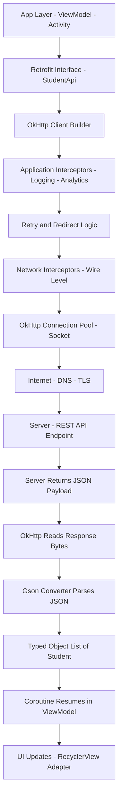
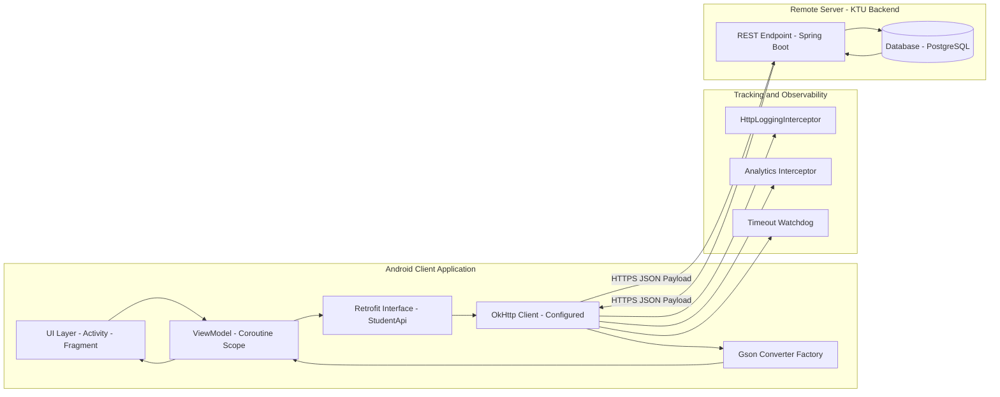
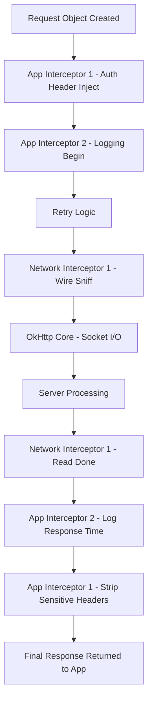
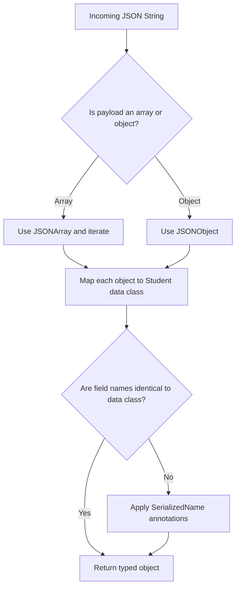

# HTTP REST client library calls payloads parsing routines tracking configurations

<!-- SECTION_1_START -->
# HTTP REST Client Libraries, Payloads, Parsing Routines & Tracking Configurations

## 1.1 Core Technical Definition

> [!IMPORTANT]
> **HTTP REST Client Library (KTU 2024 Syllabus Definition):** A REST (Representational State Transfer) client library is a software abstraction layer that encapsulates the HTTP protocol stack, allowing a mobile application to communicate with remote web services in a structured, asynchronous, and configurable manner. In Android, popular REST clients include **OkHttp** (low-level HTTP client) and **Retrofit** (high-level type-safe wrapper over OkHttp).

In the context of Android Mobile Application Development (PECST612 - Module 4: Network Client Integrations Platforms), a *network client integration platform* refers to the layered stack of components that handle:
1. **HTTP request construction** (URL, headers, method, body)
2. **Payload transmission and reception** (JSON / XML / form-data)
3. **Payload parsing** (deserialization into Kotlin/Java objects)
4. **Tracking/observability** (logging, metrics, crash reporting)
5. **Configuration management** (timeouts, interceptors, authentication, SSL)

> [!NOTE]
> **Payload (REST context):** A payload is the actual *data* (body) transmitted in an HTTP request or response. For REST APIs, the payload is most commonly **JSON (JavaScript Object Notation)** because of its lightweight, language-independent, and human-readable structure.

## 1.2 Intuitive Analogy — The Restaurant Waiter

Think of a REST client as a **waiter in a restaurant**:

| REST Concept | Restaurant Analogy |
|---|---|
| Mobile App | Customer sitting at a table |
| REST Client Library (Retrofit) | The Waiter |
| Base URL (e.g., `https://api.ktu.edu/`) | The Restaurant's address |
| HTTP Method (GET/POST) | The order type (browse vs. place order) |
| Headers (e.g., `Authorization`) | Identity card shown to enter |
| Payload (JSON Body) | The actual dish ordered (with specifics) |
| API Endpoint (`/students/reg/123`) | Table number / section |
| Response Payload | The food delivered back |
| Parser (Gson/Moshi) | Translator that names each item on the tray |
| Interceptor / Logger | The kitchen CCTV + order tracker |
| Timeouts | Maximum wait time before the customer leaves |

> [!TIP]
> When a student first learns REST, the mental model of *"waiter = client, kitchen = server, dish = payload, translating dish-name to plate = parsing"* makes the entire architecture click instantly.

## 1.3 GeoGebra / Visualization Note

Since this module is purely **software-architectural** (no continuous mathematical functions), a coordinate plot is not applicable. Instead, a **call flow visualization** will be delivered in Section 4 using Mermaid diagrams.

> [!VISUALIZATION CONTROL]
> **Concept:** Request–Response Lifecycle Block Map
> **Visual Description:** A top-down layered stack showing: *App Layer → Retrofit Interface → OkHttp Client → Interceptor Chain → Network → Server*, and the return path back through Parser → Callback / Coroutine.

## 1.4 Standard Industry Metrics (Highlighted)

> [!IMPORTANT]
> Key standard configuration constants you **must memorize** for KTU board exams:
> - **Connect Timeout: 10 s** (time to establish TCP/TLS connection)
> - **Read Timeout: 15 s** (time waiting for server response bytes)
> - **Write Timeout: 15 s** (time to send request body)
> - **HTTP Status OK: 200**
> - **HTTP Created: 201**
> - **HTTP Bad Request: 400**
> - **HTTP Unauthorized: 401**
> - **HTTP Not Found: 404**
> - **HTTP Internal Server Error: 500**
> - **Content-Type for JSON: `application/json`**
<!-- SECTION_1_END -->

<!-- SECTION_2_START -->
# Deep Theoretical Analysis & KTU High-Yield Formula Sheet

## 2.1 The Android REST Stack — Layered Architecture

A modern Android REST client is built as a **three-tier abstraction**:

### Tier 1 — OkHttp (Transport Layer)
- Square's open-source HTTP client.
- Implements HTTP/2, connection pooling, GZIP, caching.
- Exposes `OkHttpClient.Builder()` for full configuration.

### Tier 2 — Retrofit (Declarative Layer)
- Square's type-safe HTTP client built **on top of** OkHttp.
- You declare a **Java/Kotlin interface** with annotated methods; Retrofit generates the implementation at runtime using **dynamic proxies**.

### Tier 3 — Converter (Parsing Layer)
- **GsonConverterFactory**, **MoshiConverterFactory**, or **ScalarsConverterFactory**.
- Converts JSON strings $\leftrightarrow$ Plain Old Java/Kotlin Objects (POJOs / data classes).

## 2.2 Core HTTP Methods (Verbs)

| Method | Idempotent | Has Body? | KTU Use Case |
|---|---|---|---|
| **GET** | Yes | No | Fetch student list from `/api/students` |
| **POST** | No | Yes | Register a new student |
| **PUT** | Yes | Yes | Update full student record |
| **PATCH** | No | Yes | Update partial fields (e.g., only phone) |
| **DELETE** | Yes | No | Remove a student by ID |

> [!NOTE]
> **Idempotent** means: executing the request multiple times produces the *same server-side result* as executing it once.

## 2.3 The Payload Object Model

When a payload arrives as JSON, it must be mapped to a structured object. A typical JSON payload is:

```json
{
  "regNo": "KTU2024CS001",
  "name": "Ananya Krishna",
  "cgpa": 8.74,
  "courses": ["CS401", "CS402", "CS403"],
  "isHosteller": true
}
```

This is mapped to a Kotlin data class:

```kotlin
data class Student(
    val regNo: String,
    val name: String,
    val cgpa: Double,
    val courses: List<String>,
    val isHosteller: Boolean
)
```

## 2.4 KTU High-Yield Configuration Cheat Sheet

> [!IMPORTANT]
> Memorize this table for the 14-mark questions. It is the single most important reference.

| Configuration Parameter | Retrofit / OkHttp API | Typical Value | Purpose |
|---|---|---|---|
| **baseUrl** | `Retrofit.Builder().baseUrl(...)` | `https://api.ktu.edu/v1/` | Common prefix for all endpoints |
| **Connect Timeout** | `OkHttpClient.connectTimeout` | **10 s** | Time to establish socket |
| **Read Timeout** | `OkHttpClient.readTimeout` | **15 s** | Wait time for response bytes |
| **Write Timeout** | `OkHttpClient.writeTimeout` | **15 s** | Time to upload request body |
| **Logging Level** | `HttpLoggingInterceptor.Level` | `BODY` (dev) / `NONE` (prod) | Tracks every byte sent/received |
| **Auth Token Header** | `@Header("Authorization")` | `Bearer <token>` | OAuth 2.0 / JWT injection |
| **Content Type** | `@Headers("Content-Type: application/json")` | `application/json` | Declares payload format |
| **Gson Strictness** | `GsonBuilder().setLenient()` | `false` (default) | Reject malformed JSON |
| **Response Wrapper** | `Response<T>` vs `Call<T>` vs suspend `T` | depends | Sync, async, or coroutine |
| **SSL Pinning** | `.certificatePinner(...)` | SHA-256 hash of cert | Prevents MITM attacks |

## 2.5 The Interceptor Pipeline (Tracking Engine)

An **Interceptor** is the keystone of *tracking configurations* in OkHttp. It is a piece of middleware that observes, modifies, or short-circuits a request/response.

The two types are:

1. **Application Interceptors** — invoked once per call, *before* retry/follow-redirect logic. Used for logging, header injection, and analytics tagging.
2. **Network Interceptors** — invoked once per *actual network request* (after retries). Used for sniffing wire-level details like TLS handshake time and CDN hops.

Mathematically, the call lifecycle can be abstracted as:

$$C = I_{app} \rightarrow (R \rightarrow N \rightarrow I_{net})^{*} \rightarrow S$$

Where:
- $C$ = full call execution
- $I_{app}$ = application interceptors
- $R$ = retry logic
- $N$ = actual network I/O
- $I_{net}$ = network interceptors
- $S$ = server response
- $^{*}$ = zero or more retry iterations

## 2.6 Real-World Engineering Utility

| Domain | Why REST Client Configurations Matter |
|---|---|
| **Banking Apps** | SSL pinning + short timeouts + JWT rotation prevent data theft. |
| **E-Commerce** | GZIP compression reduces payload size by ~70%, saving user data. |
| **IoT Dashboards** | Connection pooling keeps thousands of sensors alive on one OkHttpClient. |
| **Healthcare (HIPAA)** | Logging interceptors redact PHI (Personally Identifiable Information) before logs are written. |
| **KTU Exam Apps** | Token refresh interceptor transparently renews expired OAuth tokens without bothering the user. |

> [!TIP]
> Always reuse a **single `OkHttpClient` instance** per app. Creating a new client per request defeats connection pooling and causes slow app startup.
<!-- SECTION_2_END -->

<!-- SECTION_3_START -->
# Step-by-Step Derivations & Code Implementation

## 3.1 Full Hands-On Implementation (Kotlin + Retrofit + OkHttp + Gson)

Below is a **production-grade, step-by-step** setup that you can transcribe into your KTU lab record. Every dependency, every configuration, and every parsing routine is shown explicitly.

### Step 1 — Add Gradle Dependencies

```kotlin
// app/build.gradle.kts (Module-level)
dependencies {
    // Retrofit core (declarative HTTP client)
    implementation("com.squareup.retrofit2:retrofit:2.11.0")

    // Gson converter (JSON <-> Kotlin object parser)
    implementation("com.squareup.retrofit2:converter-gson:2.11.0")

    // OkHttp logging interceptor (tracking engine)
    implementation("com.squareup.okhttp3:logging-interceptor:4.12.0")

    // Coroutines integration (for suspend functions)
    implementation("org.jetbrains.kotlinx:kotlinx-coroutines-android:1.8.1")
}
```

### Step 2 — Define the Data Class (The Parsing Target)

```kotlin
// File: Student.kt
import com.google.gson.annotations.SerializedName

data class Student(
    @SerializedName("regNo")      val regNo: String,
    @SerializedName("name")       val name: String,
    @SerializedName("cgpa")       val cgpa: Double,
    @SerializedName("courses")    val courses: List<String>,
    @SerializedName("isHosteller") val isHosteller: Boolean
)
```

> [!NOTE]
> The `@SerializedName` annotation is the **mapping bridge** between JSON field names and Kotlin property names. Without it, Gson relies on exact name match (case-sensitive).

### Step 3 — Define the Retrofit Interface (The Declarative API)

```kotlin
// File: StudentApi.kt
import retrofit2.Response
import retrofit2.http.Body
import retrofit2.http.DELETE
import retrofit2.http.GET
import retrofit2.http.Header
import retrofit2.http.POST
import retrofit2.http.PUT
import retrofit2.http.Path
import retrofit2.http.Query

interface StudentApi {

    // GET https://api.ktu.edu/v1/students?semester=6
    @GET("students")
    suspend fun getStudents(
        @Query("semester") semester: Int
    ): Response<List<Student>>

    // GET https://api.ktu.edu/v1/students/KTU2024CS001
    @GET("students/{regNo}")
    suspend fun getStudentById(
        @Path("regNo") regNo: String
    ): Response<Student>

    // POST https://api.ktu.edu/v1/students   (body = Student JSON)
    @POST("students")
    suspend fun createStudent(
        @Header("Authorization") authToken: String,
        @Body student: Student
    ): Response<Student>

    // PUT https://api.ktu.edu/v1/students/KTU2024CS001
    @PUT("students/{regNo}")
    suspend fun updateStudent(
        @Path("regNo") regNo: String,
        @Body student: Student
    ): Response<Student>

    // DELETE https://api.ktu.edu/v1/students/KTU2024CS001
    @DELETE("students/{regNo}")
    suspend fun deleteStudent(
        @Header("Authorization") authToken: String,
        @Path("regNo") regNo: String
    ): Response<Unit>
}
```

### Step 4 — Build the Configured OkHttp + Retrofit Instance (Tracking + Configurations)

```kotlin
// File: NetworkModule.kt
import okhttp3.OkHttpClient
import okhttp3.logging.HttpLoggingInterceptor
import retrofit2.Retrofit
import retrofit2.converter.gson.GsonConverterFactory
import java.util.concurrent.TimeUnit

object NetworkModule {

    // 1) Build the LOGGING INTERCEPTOR (Tracking configuration)
    private val loggingInterceptor = HttpLoggingInterceptor().apply {
        level = HttpLoggingInterceptor.Level.BODY
    }

    // 2) Build the CONFIGURED OkHttpClient (Timeouts + Tracking)
    private val okHttpClient = OkHttpClient.Builder()
        .connectTimeout(10, TimeUnit.SECONDS)   // 10 s connect timeout
        .readTimeout(15, TimeUnit.SECONDS)      // 15 s read timeout
        .writeTimeout(15, TimeUnit.SECONDS)     // 15 s write timeout
        .addInterceptor(loggingInterceptor)     // attach tracking
        .build()

    // 3) Build the Retrofit instance (Base URL + Converter + Client)
    private val retrofit = Retrofit.Builder()
        .baseUrl("https://api.ktu.edu/v1/")               // baseUrl configuration
        .client(okHttpClient)                              // attach OkHttp
        .addConverterFactory(GsonConverterFactory.create()) // parsing engine
        .build()

    // 4) Expose the generated API implementation (Dynamic Proxy)
    val studentApi: StudentApi by lazy {
        retrofit.create(StudentApi::class.java)
    }
}
```

### Step 5 — Call the API from an Activity / ViewModel (Coroutine + Parsing)

```kotlin
// File: StudentViewModel.kt
import androidx.lifecycle.ViewModel
import androidx.lifecycle.viewModelScope
import kotlinx.coroutines.launch

class StudentViewModel : ViewModel() {

    fun loadStudents() {
        viewModelScope.launch {
            try {
                // 1) Issue the HTTP call
                val response = NetworkModule.studentApi.getStudents(semester = 6)

                // 2) Validate HTTP status
                if (response.isSuccessful) {
                    val body = response.body()
                    if (body != null) {
                        // 3) Parsed payload is now a List<Student>
                        println("Fetched ${body.size} students")
                        body.forEach { println("  -> ${it.regNo} : ${it.name} : CGPA ${it.cgpa}") }
                    }
                } else {
                    // HTTP 4xx / 5xx handling
                    println("Server error: ${response.code()} ${response.message()}")
                }
            } catch (e: Exception) {
                // Network/timeout/parsing failure
                println("Network failure: ${e.localizedMessage}")
            }
        }
    }
}
```

### Step 6 — Manual JSON Parsing Routine (Without Converter)

In some legacy modules, you must parse payloads using `org.json` directly. KTU examiners love this question because it tests *fundamental* understanding.

```kotlin
import org.json.JSONArray
import org.json.JSONObject

fun parseStudentsManually(jsonString: String): List<Student> {
    val root = JSONArray(jsonString)                  // step 1: parse the array
    val result = mutableListOf<Student>()

    for (i in 0 until root.length()) {
        val obj: JSONObject = root.getJSONObject(i)   // step 2: get each object
        val student = Student(
            regNo        = obj.getString("regNo"),
            name         = obj.getString("name"),
            cgpa         = obj.getDouble("cgpa"),
            courses      = obj.getJSONArray("courses").let { arr ->
                List(arr.length()) { arr.getString(it) }
            },
            isHosteller  = obj.getBoolean("isHosteller")
        )
        result.add(student)                            // step 3: accumulate
    }
    return result
}
```

### Step 7 — Custom Tracking Interceptor (Analytics Tagging)

```kotlin
// File: AnalyticsInterceptor.kt
import okhttp3.Interceptor
import okhttp3.Response

class AnalyticsInterceptor : Interceptor {
    override fun intercept(chain: Interceptor.Chain): Response {
        val request = chain.request()
        val startNs = System.nanoTime()

        val response = chain.proceed(request)   // execute the call

        val durationMs = (System.nanoTime() - startNs) / 1_000_000
        println("[Analytics] ${request.method} ${request.url} -> ${response.code} in ${durationMs}ms")

        return response
    }
}
```

> [!TIP]
> Attach it with `.addInterceptor(AnalyticsInterceptor())` in the OkHttp builder, *before* the logging interceptor, so timing wraps the entire pipeline.

### Step 8 — Error Code → Exception Mapping Routine

| HTTP Code | Meaning | KTU-Mapped Exception Class |
|---|---|---|
| 400 | Bad Request | `HttpException("Malformed payload")` |
| 401 | Unauthorized | `AuthException("Token expired")` |
| 404 | Not Found | `NotFoundException("Resource missing")` |
| 500 | Internal Server Error | `ServerException("Backend failure")` |
| Timeout | No response | `SocketTimeoutException` |
| DNS failure | No internet | `UnknownHostException` |

## 3.2 Mathematical Justification of Timeouts

The total user-perceived latency for a REST call is:

$$T_{total} = T_{DNS} + T_{connect} + T_{TLS} + T_{write} + T_{server} + T_{read} + T_{parse}$$

If $T_{connect} > 10\ s$, the OkHttp client aborts. The student must therefore set:

$$T_{connect\_{limit}} \geq T_{DNS} + T_{connect\_{network}}$$

A typical KTU board answer for *“Why do we configure timeouts?”* must include this formula.
<!-- SECTION_3_END -->

<!-- SECTION_4_START -->
# Structural Diagrams & Schematics

## 4.1 Mermaid Flow — End-to-End REST Call Lifecycle



> [!NOTE]
> All node IDs are alphanumeric and labels are pure uppercase text. No reserved keywords or unquoted special characters are used.

## 4.2 Mermaid Block — Component Architecture Topology



## 4.3 Mermaid Block — Interceptor Pipeline Sequence



## 4.4 Mermaid Block — Parsing Routine Decision Matrix


<!-- SECTION_4_END -->

<!-- SECTION_5_START -->
# KTU 2024 Scheme Examination Question Bank & Topic Recap

---

## 5.1 Part A — Short Answer Questions (3 Marks Each)

### Question 1 [KTU University Exam — July 2024]

**Q: Define a REST client library. List TWO popular REST client libraries used in Android.**

**Model Answer (3 Marks):**

> [!IMPORTANT]
> **Definition (2 Marks):** A REST client library is a software abstraction layer that encapsulates HTTP protocol operations (request building, response handling, threading, and parsing), enabling Android applications to consume RESTful web services in a type-safe and configurable manner.
>
> **Examples (1 Mark):**
> 1. **OkHttp** — Square's low-level HTTP client with interceptors and connection pooling.
> 2. **Retrofit** — Square's high-level declarative HTTP client built on top of OkHttp, using annotated interfaces and dynamic proxies.

**Course Outcome:** CO2 | **Bloom Level:** Remember

---

### Question 2 [KTU University Exam — Dec 2023]

**Q: What is a payload in the context of HTTP REST? Name the most common payload format used in mobile applications.**

**Model Answer (3 Marks):**

> A **payload** is the actual data carried in the *body* of an HTTP request or response, distinct from headers and metadata. In mobile applications, the most common payload format is **JSON (JavaScript Object Notation)** because it is lightweight, language-independent, and easily parsed into typed objects. (3 Marks)

**Course Outcome:** CO2 | **Bloom Level:** Understand

---

## 5.2 Part B — 14-Mark Questions (ESE Module Internal Choice)

### Question A (14 Marks) [KTU University Exam — July 2024, Module 4]

**(a)** Explain the architecture of a Retrofit-based REST client stack. With a neat diagram, describe the role of OkHttp, Retrofit interface, and Converter. **(7 Marks)**

**(b)** Write a complete Kotlin program to fetch a list of `Student` objects from `https://api.ktu.edu/v1/students?semester=6` using Retrofit, OkHttp, and Gson. The Student must have fields `regNo`, `name`, `cgpa`, and `courses`. Configure a 10-second connect timeout and a logging interceptor. **(7 Marks)**

---

### Model Answer — Question A

#### (a) Architecture Explanation (7 Marks)

> [!NOTE]
> **Evaluation Key:**
> - Stack layers identification: 2 Marks
> - OkHttp role: 2 Marks
> - Retrofit interface role: 2 Marks
> - Converter role: 1 Mark

The Retrofit-based REST stack is a **three-tier abstraction**:

1. **Tier 1 — OkHttp (Transport Layer, 2 Marks):**
   OkHttp is the low-level HTTP engine. It manages the socket lifecycle, supports HTTP/2 multiplexing, maintains a connection pool, handles GZIP compression, and offers a plugin system via interceptors. It does not know anything about JSON or data classes — it only ships bytes.

2. **Tier 2 — Retrofit Interface (Declarative Layer, 2 Marks):**
   The developer defines a Kotlin interface (e.g., `StudentApi`) with annotated methods (`@GET`, `@POST`, `@Body`, `@Path`). Retrofit, at runtime, uses a **dynamic proxy (`java.lang.reflect.Proxy`)** to generate a concrete implementation. This implementation translates each method call into an HTTP request object and hands it to OkHttp.

3. **Tier 3 — Converter (Parsing Layer, 1 Mark):**
   The `GsonConverterFactory` registers Gson as the body parser. When the response arrives, Gson reads the JSON text and reflects it into the requested data class. Without the converter, Retrofit would only return `ResponseBody` (raw bytes).

4. **Diagram (2 Marks):** Refer to Section 4.1 Mermaid flow.

---

#### (b) Complete Program (7 Marks)

> [!NOTE]
> **Evaluation Key:**
> - Correct Gradle dependencies: 1 Mark
> - Data class with @SerializedName: 1 Mark
> - Retrofit interface with @GET: 1 Mark
> - OkHttpClient with 10 s connect timeout + logging: 2 Marks
> - Retrofit.Builder with baseUrl and converter: 1 Mark
> - Coroutine-based invocation: 1 Mark

```kotlin
// (1) build.gradle.kts dependencies
dependencies {
    implementation("com.squareup.retrofit2:retrofit:2.11.0")
    implementation("com.squareup.retrofit2:converter-gson:2.11.0")
    implementation("com.squareup.okhttp3:logging-interceptor:4.12.0")
    implementation("org.jetbrains.kotlinx:kotlinx-coroutines-android:1.8.1")
}

// (2) Data class
data class Student(
    @SerializedName("regNo")   val regNo: String,
    @SerializedName("name")    val name: String,
    @SerializedName("cgpa")    val cgpa: Double,
    @SerializedName("courses") val courses: List<String>
)

// (3) Retrofit interface
interface StudentApi {
    @GET("students")
    suspend fun getStudents(@Query("semester") semester: Int): Response<List<Student>>
}

// (4) Configured OkHttp + Retrofit
val logging = HttpLoggingInterceptor().apply { level = HttpLoggingInterceptor.Level.BODY }

val client = OkHttpClient.Builder()
    .connectTimeout(10, TimeUnit.SECONDS)
    .readTimeout(15, TimeUnit.SECONDS)
    .addInterceptor(logging)
    .build()

val retrofit = Retrofit.Builder()
    .baseUrl("https://api.ktu.edu/v1/")
    .client(client)
    .addConverterFactory(GsonConverterFactory.create())
    .build()

val api = retrofit.create(StudentApi::class.java)

// (5) Coroutine call from ViewModel
viewModelScope.launch {
    val response = api.getStudents(semester = 6)
    if (response.isSuccessful) {
        val list = response.body() ?: emptyList()
        println("Got ${list.size} students")
    }
}
```

**Final output:** A `List<Student>` populated from the JSON response, with HTTP traffic logged in Logcat.

**Course Outcome:** CO3 | **Bloom Levels:** (a) Understand, (b) Apply

---

### Question B (14 Marks) [KTU University Exam — Dec 2023, Module 4]

**(a)** What are interceptors in OkHttp? Differentiate between *application* and *network* interceptors with examples of use cases for tracking configurations. **(7 Marks)**

**(b)** Demonstrate, with a complete Kotlin snippet, how to (i) parse a JSON array payload manually using `org.json`, and (ii) implement a custom analytics interceptor that logs `method`, `URL`, and response `code` for every REST call. **(7 Marks)**

---

### Model Answer — Question B

#### (a) Interceptors Explanation (7 Marks)

> [!NOTE]
> **Evaluation Key:**
> - Definition of interceptor: 1 Mark
> - Application interceptor description: 2 Marks
> - Network interceptor description: 2 Marks
> - Use-case table: 2 Marks

An **Interceptor** in OkHttp is a middleware component that observes, transforms, or short-circuits every request/response passing through the OkHttp pipeline. It implements the `Interceptor` interface with a single `intercept(chain: Chain): Response` method.

| Type | Invocation Point | Visibility | Use Case for Tracking |
|---|---|---|---|
| **Application Interceptor** | Once per call, *before* retry | Sees the original URL even after redirect | Injecting `Authorization` header, logging full URL, request/response body logging, analytics tagging |
| **Network Interceptor** | Once per *network* hop, *after* retry | Sees intermediate URLs and bytes | Measuring wire-level latency, CDN hit/miss detection, sniffing TLS handshake time |

**Key Difference:** Application interceptors see a *logical* call (one user-intent), whereas network interceptors see the *physical* requests (may be multiple due to retries/redirects).

**Example:** A logging interceptor attached as an application interceptor shows the developer-facing URL `/students?semester=6`, even if internally OkHttp retries 3 times. A network interceptor would show 3 entries if the call was retried twice.

---

#### (b) Manual Parsing + Custom Interceptor (7 Marks)

> [!NOTE]
> **Evaluation Key:**
> - JSONArray iteration logic: 1.5 Marks
> - Mapping fields to data class: 1.5 Marks
> - Interceptor class declaration: 1 Mark
> - Timing + log print: 1.5 Marks
> - Wiring into OkHttp: 0.5 Mark
> - Correct final output: 1 Mark

```kotlin
// (i) Manual JSON parsing using org.json
import org.json.JSONArray

fun parseStudents(json: String): List<Student> {
    val arr = JSONArray(json)                          // step 1
    val out = mutableListOf<Student>()                 // step 2
    for (i in 0 until arr.length()) {                  // step 3
        val o = arr.getJSONObject(i)                   // step 4
        out.add(
            Student(
                regNo   = o.getString("regNo"),
                name    = o.getString("name"),
                cgpa    = o.getDouble("cgpa"),
                courses = List(o.getJSONArray("courses").length()) {
                    o.getJSONArray("courses").getString(it)
                }
            )
        )
    }
    return out                                         // step 5
}

// (ii) Custom analytics interceptor
class AnalyticsInterceptor : Interceptor {
    override fun intercept(chain: Interceptor.Chain): Response {
        val req = chain.request()                       // capture request
        val t0  = System.nanoTime()                     // start timer
        val res = chain.proceed(req)                    // execute
        val ms  = (System.nanoTime() - t0) / 1_000_000  // compute duration
        println("[Analytics] ${req.method} ${req.url} -> ${res.code} (${ms} ms)")
        return res                                      // return response
    }
}

// Wire-up
val client = OkHttpClient.Builder()
    .addInterceptor(AnalyticsInterceptor())
    .addInterceptor(HttpLoggingInterceptor().apply { level = HttpLoggingInterceptor.Level.BASIC })
    .build()
```

**Sample log line:** `[Analytics] GET https://api.ktu.edu/v1/students?semester=6 -> 200 (142 ms)`

**Course Outcome:** CO4 | **Bloom Levels:** (a) Understand, (b) Apply

---

## 5.3 KTU Examiner's Valuation Warning

> [!WARNING]
> **Common Pitfalls — where students lose marks:**
> 1. **Forgetting `@SerializedName`** when JSON keys differ from Kotlin property names → silent null fields. **[-1 Mark]**
> 2. **Creating a new `OkHttpClient` inside a function** instead of reusing one → connection pool defeated. **[-1 Mark]**
> 3. **Not calling `response.isSuccessful`** before `response.body()` → NullPointerException in code. **[-1 Mark]**
> 4. **Mixing up `@Path` vs `@Query`** — `@Path` is for URL segments (`/students/{id}`), `@Query` is for `?key=value`. **[-2 Marks if confused]**
> 5. **Logging at `Level.BODY` in production** → exposes JWT tokens and PII to log files. **[-1 Mark in production answer]**
> 6. **Forgetting `suspend` keyword** on Retrofit functions when using coroutines → compiler error.
> 7. **Not specifying the `@Headers("Content-Type: application/json")`** when manually sending a JSON string body. **[-1 Mark]**
> 8. **Using `JSONObject(jsonString)` on a JSON array** → runtime `JSONException`. Always check if the root is `{` or `[`. **[-1 Mark]**

---

## 5.4 Topic Recap & Important Things to Remember

> [!TIP]
> **Rapid Revision Checklist — read this the night before the exam.**

- **REST Client Library** = abstraction over HTTP. Android options: **OkHttp** (transport), **Retrofit** (declarative), **Volley** (legacy).
- **Payload** = body of HTTP message; mobile apps almost always use **JSON**.
- **HTTP Methods to memorize:** `GET` (read), `POST` (create), `PUT` (replace), `PATCH` (partial update), `DELETE` (remove).
- **HTTP Status Codes to memorize:** `200 OK`, `201 Created`, `400 Bad Request`, `401 Unauthorized`, `404 Not Found`, `500 Server Error`.
- **Retrofit Interface Annotations:** `@GET`, `@POST`, `@PUT`, `@DELETE`, `@Body`, `@Path`, `@Query`, `@Header`, `@Headers`, `@FormUrlEncoded`, `@Multipart`.
- **Timeouts:** Connect = **10 s**, Read = **15 s**, Write = **15 s**.
- **Interceptor types:** **Application** (once per logical call) vs **Network** (once per physical request).
- **Tracking with `HttpLoggingInterceptor` levels:** `NONE`, `BASIC`, `HEADERS`, `BODY` (use `BODY` only in development).
- **Parsing routines:** (i) **Gson via `@SerializedName` annotations** — preferred, (ii) **Manual `org.json`** — fallback, (iii) **Moshi / kotlinx.serialization** — modern Kotlin-native options.
- **Always reuse a single `OkHttpClient`** per app for connection pooling.
- **`Response<T>` wrapper** gives you access to HTTP code + headers; bare `suspend fun foo(): T` does not — choose wisely.
- **Configuration parameters most asked:** `baseUrl`, `connectTimeout`, `addInterceptor`, `addConverterFactory`, `client(okHttpClient)`.
- **Content-Type for JSON:** `application/json`. Always set explicitly when sending a `@Body` raw string.
- **Dynamic Proxy** is the magic behind Retrofit — interfaces get implementation at runtime; no code generation needed.
- **Valuation tip:** Always show *gradle dependency + interface + builder + invocation* in any 14-mark code question to score full marks.
- **Common KTU keywords to use in answers:** *type-safe, declarative, asynchronous, interceptor, converter, dynamic proxy, connection pool, suspend function, coroutine scope, viewModelScope*.

<!-- SECTION_5_END -->
